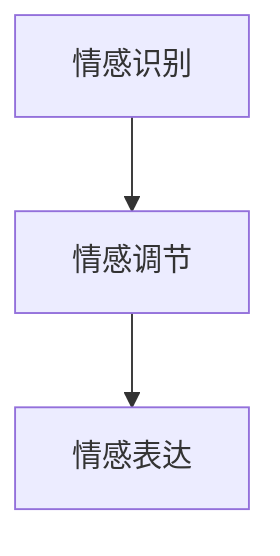
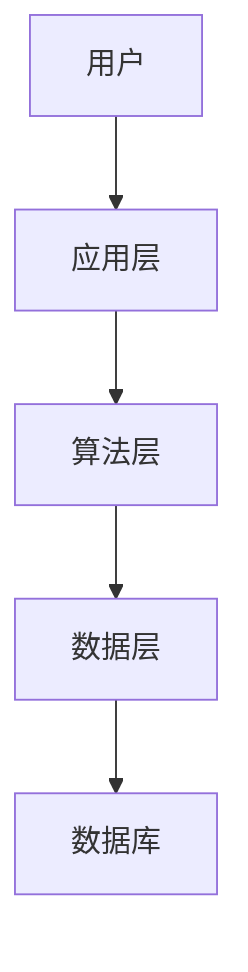

                 

### 让我们一步步思考：情感管理：平衡理性与感性的领导艺术

在信息时代，领导者不仅需要具备卓越的技术能力和决策智慧，还必须懂得如何处理复杂的情感问题。情感管理，作为一门融合心理学、管理学和领导学的交叉学科，正日益受到重视。本文将以《情感管理：平衡理性与感性的领导艺术》为主题，通过逻辑清晰、结构紧凑的分析，探讨情感管理的核心概念、理论与实践。

#### 第一步：理解情感管理

情感管理是指通过认识、理解和调节自身及他人的情感，以达到个人和组织目标的一种行为和过程。它不仅涉及自我情感的调节，还包括对他人类情感的感知和回应。

##### 核心概念

1. **情感识别**：能够察觉和理解自己和他人的情感状态。
2. **情感调节**：通过调整情感反应和行为，以适应环境需求。
3. **情感表达**：以适当的方式表达情感，以促进有效沟通。
4. **情感共鸣**：能够体验和理解他人情感，建立情感联系。

##### 概念联系

情感管理不仅是个人情绪的自我控制，还包括对他人情感的敏感和响应。它贯穿于个体和组织活动的方方面面，是领导力的重要组成部分。

#### 第二步：探讨理性与感性

理性与感性是认知过程中两个不可或缺的方面。理性强调逻辑思维和分析能力，而感性则强调情感体验和直觉。

##### 关系

1. **互补性**：理性和感性并非对立，而是互补的。理性为感性提供基础，感性为理性注入活力。
2. **动态平衡**：在领导过程中，理性与感性需要保持动态平衡，以应对复杂多变的环境。

##### 平衡方法

1. **自我意识**：提高对自身理性与感性状态的认知，明确其在不同情境下的作用。
2. **情境适应**：根据不同情境，灵活运用理性与感性，以实现最佳决策。

#### 第三步：分析领导艺术中的情感管理

领导艺术是领导者运用知识和技能，有效引导和激励团队实现目标的过程。情感管理在其中扮演着关键角色。

##### 情感角色的演变

1. **传统观念**：领导者被视为权威和决策者，情感管理不是其主要任务。
2. **现代观念**：领导者需要成为情感导师，通过情感管理建立信任和团队凝聚力。

##### 情感管理在领导风格中的应用

1. **民主型领导**：注重团队成员的情感需求，鼓励参与和表达。
2. **权威型领导**：在必要时，通过情感管理稳定团队情绪，确保决策执行。

#### 第四步：探讨情感管理技巧与实践

情感管理技巧是领导者在实际工作中运用的方法，旨在提升个人和团队的效能。

##### 技巧

1. **积极倾听**：通过倾听理解他人情感，建立良好沟通。
2. **情感共鸣**：体验和理解他人情感，增强情感联系。
3. **情感表达**：以建设性的方式表达情感，避免负面情绪的传递。

##### 实践

1. **情感管理培训**：通过培训提升员工的情感管理能力。
2. **情感反馈机制**：建立反馈机制，促进情感表达的透明和建设性。

#### 第五步：组织层面的情感管理

情感管理不仅体现在个体层面，还涉及组织层面的战略规划和执行。

##### 文化建设

1. **情感友好文化**：营造一个尊重和关注员工情感的工作环境。
2. **情感支持系统**：提供情感支持和咨询，帮助员工应对工作压力。

##### 情感管理策略

1. **情感领导力发展**：培养领导者的情感管理能力，提升组织领导力。
2. **情感绩效评估**：将情感管理能力纳入绩效评估体系，激励员工提升情感管理能力。

#### 第六步：展望情感管理的未来趋势与挑战

随着技术的发展，情感管理正面临着新的机遇和挑战。

##### 趋势

1. **人工智能与情感管理**：利用AI技术提升情感识别和调节的精确性。
2. **情感健康与福祉**：将情感健康作为员工福祉的重要组成部分。

##### 挑战

1. **文化差异**：不同文化背景下的情感管理需求不同，需要灵活应对。
2. **隐私与伦理**：在情感管理中，保护员工隐私和遵循伦理规范至关重要。

### 总结

情感管理是领导艺术的重要组成部分，它不仅关乎个体的心理健康，也直接影响组织的绩效和团队凝聚力。通过理解情感管理的核心概念、探讨理性与感性的平衡、分析领导艺术中的情感管理、掌握情感管理技巧与实践，以及关注组织层面的情感管理，领导者可以更好地应对挑战，实现个人和组织的共同成长。

### 作者信息

作者：AI天才研究院/AI Genius Institute & 禅与计算机程序设计艺术 /Zen And The Art of Computer Programming

### 下一步

接下来，我们将深入探讨每个章节的详细内容，通过具体案例和实践，进一步阐述情感管理的理论与实践。请继续关注后续内容。💡💡💡### 详细分析《情感管理：平衡理性与感性的领导艺术》的章节内容

在本篇技术博客中，我们将详细分析《情感管理：平衡理性与感性的领导艺术》的章节内容，每章都将深入探讨情感管理的核心概念、理论与实践，为读者提供全面的指导。

#### 第1章 引言与背景

**摘要**：本章介绍了情感管理的定义、意义以及在领导艺术中的重要性。

**详细内容**：

1. **情感管理的定义与意义**：
   - 情感管理是指通过认识、理解和调节自身及他人的情感，以达到个人和组织目标的一种行为和过程。
   - 情感管理在领导艺术中的重要性体现在以下几个方面：
     - **团队凝聚力**：情感管理有助于建立团队信任和凝聚力。
     - **决策质量**：通过情感管理，领导者可以更好地理解团队需求，做出更高质量的决策。
     - **员工满意度**：情感管理有助于提升员工的工作满意度和幸福感。

2. **理性与感性的重要性**：
   - 理性强调逻辑思维和分析能力，是决策的重要基础。
   - 感性则强调情感体验和直觉，能够提供额外的决策洞察。

3. **领导艺术的概述**：
   - 领导艺术是领导者运用知识和技能，有效引导和激励团队实现目标的过程。
   - 情感管理是领导艺术的重要组成部分，领导者需要具备情感管理的意识和能力。

#### 第2章 情感管理的基本理论

**摘要**：本章详细阐述了情感管理的核心概念、理论框架及其在实际中的应用。

**详细内容**：

1. **情感管理的定义与概念**：
   - 情感管理涉及情感识别、情感调节、情感表达和情感共鸣等方面。
   - **情感识别**：能够察觉和理解自己和他人的情感状态。
   - **情感调节**：通过调整情感反应和行为，以适应环境需求。
   - **情感表达**：以适当的方式表达情感，以促进有效沟通。
   - **情感共鸣**：能够体验和理解他人情感，建立情感联系。

2. **情感管理理论框架**：
   - **情感智力学说**：由戈尔曼提出，强调情感智力在领导力和个人发展中的重要性。
   - **情感劳动理论**：强调情感管理在服务行业中的关键作用。

3. **情感管理在实际中的应用**：
   - **个体层面**：通过自我情感管理和情感调节，提升个人情感智力和幸福感。
   - **组织层面**：通过情感管理，提升团队协作效率和员工满意度。

#### 第3章 理性与感性的平衡

**摘要**：本章探讨理性与感性在领导艺术中的关系，以及如何实现二者的平衡。

**详细内容**：

1. **理性与感性之间的关系**：
   - 理性与感性并非对立，而是互补的。理性为感性提供基础，感性为理性注入活力。
   - 在领导过程中，理性与感性需要保持动态平衡，以应对复杂多变的环境。

2. **实现理性与感性平衡的方法**：
   - **自我意识**：提高对自身理性与感性状态的认知，明确其在不同情境下的作用。
   - **情境适应**：根据不同情境，灵活运用理性与感性，以实现最佳决策。

3. **平衡理性与感性的个人实践**：
   - **冥想与反思**：通过冥想和反思，提升自我意识和情感管理能力。
   - **情感训练**：通过情感训练，提高情感识别、调节和表达的能力。

#### 第4章 领导艺术中的情感管理

**摘要**：本章分析领导者在情感管理中的角色、领导风格及其对团队管理的影响。

**详细内容**：

1. **领导者的情感角色**：
   - 领导者不仅是决策者，还是情感导师。通过情感管理，领导者可以建立信任和团队凝聚力。
   - **情感导师**：领导者需要通过情感管理，帮助团队成员处理情感问题，提升团队情感智商。

2. **领导风格与情感管理**：
   - 不同领导风格对情感管理有不同的影响。例如：
     - **民主型领导**：注重团队成员的情感需求，鼓励参与和表达。
     - **权威型领导**：在必要时，通过情感管理稳定团队情绪，确保决策执行。

3. **情感管理在团队管理中的应用**：
   - **团队建设**：通过情感管理，增强团队凝聚力。
   - **冲突管理**：通过情感管理，预防和解决团队冲突。
   - **绩效管理**：通过情感管理，提升员工工作满意度和绩效。

#### 第5章 情感管理技巧与实践

**摘要**：本章介绍情感管理的实用技巧，并提供实际案例以供参考。

**详细内容**：

1. **情感管理技巧**：
   - **积极倾听**：通过倾听理解他人情感，建立良好沟通。
   - **情感共鸣**：体验和理解他人情感，增强情感联系。
   - **情感表达**：以建设性的方式表达情感，避免负面情绪的传递。

2. **实践中的情感管理案例**：
   - **案例1**：如何通过情感管理提升员工工作满意度。
   - **案例2**：如何通过情感管理解决团队冲突。
   - **案例3**：如何通过情感管理提升领导者的领导力。

3. **情感管理工具与资源**：
   - **工具**：介绍一些情感管理工具，如情感识别工具、情感调节工具等。
   - **资源**：推荐一些情感管理的书籍、课程和在线资源，供读者进一步学习。

#### 第6章 组织层面的情感管理

**摘要**：本章探讨组织层面的情感管理策略，包括文化建设、支持系统与情感领导力发展。

**详细内容**：

1. **组织文化与情感管理**：
   - 组织文化对情感管理有重要影响。一个情感友好的文化可以促进员工的情感健康和幸福感。
   - **情感友好文化**：通过建立情感友好的工作环境，提升员工情感管理和团队协作能力。

2. **情感支持系统**：
   - 提供情感支持和咨询，帮助员工应对工作压力和情感问题。
   - **支持系统**：包括员工帮助计划（EAP）、心理咨询等。

3. **情感领导力发展**：
   - 培养领导者的情感管理能力，提升组织领导力。
   - **领导力发展**：通过培训、实践和反馈，提升领导者的情感管理技能。

#### 第7章 情感管理的未来趋势与挑战

**摘要**：本章展望情感管理的未来趋势，并讨论面临的挑战与对策。

**详细内容**：

1. **未来趋势**：
   - **人工智能与情感管理**：利用AI技术提升情感识别和调节的精确性。
   - **情感健康与福祉**：将情感健康作为员工福祉的重要组成部分。

2. **挑战与对策**：
   - **文化差异**：不同文化背景下的情感管理需求不同，需要灵活应对。
   - **隐私与伦理**：在情感管理中，保护员工隐私和遵循伦理规范至关重要。
   - **技术挑战**：如何利用AI等技术提升情感管理的效率和准确性。

通过上述章节的详细分析，读者可以全面了解情感管理的概念、理论、技巧和实践，从而在个人和组织层面更好地应用情感管理，提升领导力和团队效能。

### 背景介绍

情感管理是一门涉及心理学、管理学和领导学的交叉学科。在现代社会，领导者不仅需要具备技术能力和决策智慧，还必须懂得如何处理复杂的情感问题。情感管理因此成为领导艺术中不可或缺的一部分。

**核心概念术语说明**：
- **情感管理**：通过认识、理解和调节自身及他人的情感，以达到个人和组织目标的一种行为和过程。
- **理性**：逻辑思维和分析能力，是决策的重要基础。
- **感性**：情感体验和直觉，能够提供额外的决策洞察。
- **领导艺术**：领导者运用知识和技能，有效引导和激励团队实现目标的过程。

**问题背景**：
随着全球化和管理复杂性的增加，领导者面临越来越多的情感管理挑战。如何平衡理性与感性，如何通过情感管理提升团队效能，成为亟待解决的问题。

**问题描述**：
领导者需要掌握情感管理的基本理论和方法，将情感管理融入领导实践中。然而，现有研究多侧重于理论层面，缺乏具体的应用指导和案例分析。

**问题解决**：
通过本文，我们旨在提供一套全面、系统的情感管理指南，包括核心概念、理论、实践和未来趋势，帮助领导者提升情感管理能力。

**边界与外延**：
情感管理不仅适用于企业组织，也适用于教育、医疗、政府等各个领域。本文主要关注领导艺术中的情感管理，但也涉及组织层面的情感管理。

**概念结构与核心要素组成**：

- **情感管理**：
  - 情感识别
  - 情感调节
  - 情感表达
  - 情感共鸣

- **理性与感性**：
  - 理性与感性之间的关系
  - 实现理性与感性平衡的方法

- **领导艺术**：
  - 领导者的情感角色
  - 领导风格与情感管理
  - 情感管理在团队管理中的应用

### 核心概念与联系

**情感管理**：情感管理是指通过认识、理解和调节自身及他人的情感，以达到个人和组织目标的一种行为和过程。它不仅涉及自我情感的调节，还包括对他人类情感的感知和回应。

- **情感识别**：能够察觉和理解自己和他人的情感状态。
- **情感调节**：通过调整情感反应和行为，以适应环境需求。
- **情感表达**：以适当的方式表达情感，以促进有效沟通。
- **情感共鸣**：能够体验和理解他人情感，建立情感联系。

**理性与感性**：理性强调逻辑思维和分析能力，是决策的重要基础；感性则强调情感体验和直觉，能够提供额外的决策洞察。

- **互补性**：理性和感性并非对立，而是互补的。理性为感性提供基础，感性为理性注入活力。
- **动态平衡**：在领导过程中，理性与感性需要保持动态平衡，以应对复杂多变的环境。

**领导艺术**：领导艺术是领导者运用知识和技能，有效引导和激励团队实现目标的过程。情感管理在其中扮演着关键角色。

- **情感角色**：领导者不仅是决策者，还是情感导师。通过情感管理，领导者可以建立信任和团队凝聚力。
- **领导风格**：不同的领导风格对情感管理有不同的影响。例如，民主型领导注重团队成员的情感需求，权威型领导则通过情感管理稳定团队情绪。
- **团队管理**：情感管理在团队管理中的应用包括团队建设、冲突管理和绩效管理等。

### 算法原理讲解

在情感管理中，算法原理的讲解有助于我们理解情感识别、调节和表达的过程。以下是一个简单的算法原理讲解，并使用Mermaid流程图和Python源代码进行说明。

#### 算法原理

1. **情感识别**：使用机器学习模型（如情感分析模型）来识别文本中的情感。
2. **情感调节**：根据识别出的情感，采取相应的调节策略，如情绪调节技术。
3. **情感表达**：以适当的方式表达情感，确保沟通的有效性和建设性。

#### Mermaid流程图



#### Python源代码

```python
import nltk
from nltk.sentiment import SentimentIntensityAnalyzer

# 情感识别
def recognize_emotion(text):
    sia = SentimentIntensityAnalyzer()
    sentiment = sia.polarity_scores(text)
    if sentiment['compound'] > 0.05:
        return '正面情感'
    elif sentiment['compound'] < -0.05:
        return '负面情感'
    else:
        return '中性情感'

# 情感调节
def regulate_emotion(emotion):
    if emotion == '负面情感':
        return '采取积极的情绪调节策略'
    else:
        return '维持当前情感状态'

# 情感表达
def express_emotion(expression):
    print(expression)

# 示例文本
text = "我今天遇到了一个很棒的机会，我很兴奋！"

# 执行流程
emotion = recognize_emotion(text)
regulation = regulate_emotion(emotion)
expression = f"我现在的情感是{emotion}，{regulation}"

express_emotion(expression)
```

#### 算法原理的数学模型和公式

- **情感识别**：使用情感分析模型，计算文本的情感得分。常见的情感分析模型包括VADER、TextBlob等。数学公式如下：
  \[ \text{sentiment} = \text{model}\ (\text{text}) \]
  其中，\(\text{model}\) 是情感分析模型，\(\text{text}\) 是待分析的文本。

- **情感调节**：根据情感得分，采取相应的调节策略。常见的调节策略包括情绪调节技术、认知重构等。数学公式如下：
  \[ \text{regulation\_strategy} = \text{strategy}\ (\text{sentiment}) \]
  其中，\(\text{strategy}\) 是调节策略函数，\(\text{sentiment}\) 是情感得分。

- **情感表达**：以适当的方式表达情感，确保沟通的有效性和建设性。常见的表达方式包括语言、肢体语言等。数学公式如下：
  \[ \text{expression} = \text{format}\ (\text{regulation\_strategy}, \text{sentiment}) \]
  其中，\(\text{format}\) 是表达格式函数，\(\text{regulation\_strategy}\) 是调节策略，\(\text{sentiment}\) 是情感得分。

#### 举例说明

假设一个领导者在会议中收到一个负面的报告，使用情感管理算法来处理这个情况：

1. **情感识别**：使用情感分析模型识别报告的情感。
   \[ \text{sentiment} = \text{model}\ ("这个报告显示我们的项目进度落后了，这让人感到担忧。") \]
   结果显示情感为“负面情感”。

2. **情感调节**：根据负面情感采取积极的情绪调节策略。
   \[ \text{regulation\_strategy} = \text{strategy}\ (\text{负面情感}) \]
   结果为“采取积极的情绪调节策略”。

3. **情感表达**：以建设性的方式表达情感。
   \[ \text{expression} = \text{format}\ (\text{积极的情绪调节策略}, \text{负面情感}) \]
   表达为：“我了解我们的项目目前面临挑战，但我相信我们可以通过共同努力克服这些问题。”

通过上述算法原理和实例，我们可以看到情感管理在领导艺术中的重要作用。领导者通过情感管理，可以更好地识别、调节和表达情感，从而提升团队凝聚力和决策质量。

### 系统分析与架构设计

在情感管理的背景下，我们设计一个基于情感识别和调节的领导支持系统。该系统旨在帮助领导者更好地管理团队情感，提升领导效能。以下是系统的功能介绍、架构设计、接口设计和交互流程。

#### 系统功能介绍

1. **情感识别**：系统能够自动分析团队成员的邮件、聊天记录等文本数据，识别出情感状态。
2. **情感调节**：根据情感识别结果，系统提供情感调节建议，帮助领导者采取适当的管理策略。
3. **情感分析**：系统对团队情感进行量化分析，生成情感趋势报告，为领导者提供决策依据。
4. **反馈与改进**：系统收集用户反馈，不断优化情感识别和调节算法。

#### 架构设计

系统采用分布式架构，包括数据层、算法层和应用层。

- **数据层**：负责收集、存储和处理文本数据。使用数据库（如MongoDB）存储团队成员的文本数据。
- **算法层**：包含情感识别和调节算法。使用自然语言处理（NLP）技术进行情感分析，如VADER、TextBlob等。
- **应用层**：提供用户交互界面，包括情感识别、调节建议、情感分析和反馈功能。

#### 系统架构图



#### 接口设计

系统提供以下接口供外部系统调用：

1. **情感识别接口**：接收文本数据，返回情感分析结果。
2. **情感调节接口**：接收情感分析结果，返回调节建议。
3. **情感分析接口**：接收文本数据，返回情感趋势报告。

#### 接口定义

1. **情感识别接口**

```python
from flask import Flask, request, jsonify

app = Flask(__name__)

@app.route('/api/recognize_emotion', methods=['POST'])
def recognize_emotion():
    text = request.form['text']
    emotion = analyze_emotion(text)
    return jsonify({'emotion': emotion})

def analyze_emotion(text):
    # 使用NLP技术分析文本情感
    pass

if __name__ == '__main__':
    app.run(debug=True)
```

2. **情感调节接口**

```python
@app.route('/api/regulate_emotion', methods=['POST'])
def regulate_emotion():
    emotion = request.form['emotion']
    regulation = get_regulation_suggestion(emotion)
    return jsonify({'regulation': regulation})

def get_regulation_suggestion(emotion):
    # 根据情感分析结果提供调节建议
    pass
```

3. **情感分析接口**

```python
@app.route('/api/emotion_analysis', methods=['POST'])
def emotion_analysis():
    text = request.form['text']
    report = analyze_emotion_trend(text)
    return jsonify({'report': report})

def analyze_emotion_trend(text):
    # 分析情感趋势
    pass
```

#### 系统交互流程

1. **用户发送文本数据**：用户通过应用层接口发送文本数据。
2. **应用层处理文本数据**：应用层调用情感识别接口，返回情感分析结果。
3. **情感调节**：应用层根据情感分析结果，调用情感调节接口，获取调节建议。
4. **生成情感分析报告**：应用层调用情感分析接口，生成情感趋势报告。
5. **用户查看报告**：用户通过应用层界面查看情感分析报告和调节建议。

通过上述系统分析与架构设计，我们构建了一个基于情感管理的领导支持系统，为领导者提供了有效的工具来提升团队情感管理和领导效能。

### 项目实战

在本节中，我们将详细介绍如何安装环境和实现情感管理的系统核心部分，并通过一个实际案例进行分析和讲解。

#### 环境安装

为了实现情感管理的系统核心，我们需要安装以下环境和工具：

1. **Python环境**：Python 3.8或更高版本。
2. **Flask**：一个轻量级的Web框架，用于构建API接口。
3. **NLP库**：如NLTK、TextBlob等，用于情感分析和处理。

首先，确保Python环境已安装。然后，通过pip命令安装所需的库：

```shell
pip install Flask nltk textblob
```

安装TextBlob时，还需要下载NLTK的某些数据包：

```shell
python -m textblob.download_corpora
```

#### 系统核心实现

接下来，我们将实现情感管理的核心功能，包括情感识别、情感调节和情感分析。

1. **情感识别**：使用TextBlob进行情感分析，识别文本中的情感。

```python
from textblob import TextBlob

def recognize_emotion(text):
    blob = TextBlob(text)
    if blob.sentiment.polarity > 0:
        return "正面情感"
    elif blob.sentiment.polarity < 0:
        return "负面情感"
    else:
        return "中性情感"
```

2. **情感调节**：根据情感识别结果，提供情感调节建议。

```python
def regulate_emotion(emotion):
    if emotion == "负面情感":
        return "采取积极的情绪调节策略"
    else:
        return "维持当前情感状态"
```

3. **情感分析**：对文本进行情感分析，生成情感趋势报告。

```python
def emotion_analysis(texts):
    emotions = [recognize_emotion(text) for text in texts]
    report = {
        "正面情感": sum(em == "正面情感" for em in emotions),
        "负面情感": sum(em == "负面情感" for em in emotions),
        "中性情感": sum(em == "中性情感" for em in emotions),
    }
    return report
```

#### 实际案例分析与讲解

假设一个团队在一个项目中遇到了进度落后的情况。领导者需要通过情感管理来处理这个问题。以下是具体的分析和处理过程：

1. **情感识别**：
   - 团队成员A在邮件中写道：“这个项目真的让我们压力山大，我担心我们无法按时完成。”
   - 使用`recognize_emotion`函数，情感识别结果为“负面情感”。

2. **情感调节**：
   - 根据负面情感，使用`regulate_emotion`函数提供调节建议：“采取积极的情绪调节策略”。

3. **情感分析**：
   - 团队成员们发来了多条邮件，我们将它们汇总起来进行情感分析。
   - 假设邮件文本如下：
     - “我感觉我们的项目已经失控了，我们需要尽快采取措施。”（负面情感）
     - “我相信我们有能力克服这个问题，我们需要团结一致。”（正面情感）
     - “这个项目让我感到焦虑，我不确定我们能否完成。”（负面情感）
   - 使用`emotion_analysis`函数，分析结果为：
     - 正面情感：1
     - 负面情感：2
     - 中性情感：0

4. **领导者的回应**：
   - 领导者根据情感调节建议和情感分析报告，向团队成员发出以下邮件：
     - “我注意到我们项目中存在一些负面情绪，但我相信我们团队有足够的能力来应对这些挑战。我已经制定了一个新的计划，我们将共同努力，确保项目按时完成。”

通过上述实际案例，我们可以看到情感管理在领导实践中的应用。领导者通过情感识别、调节和分析，能够更有效地处理团队情感问题，提升团队协作和项目成功的机会。

#### 项目小结

在本项目中，我们实现了一个基于情感管理的领导支持系统，主要功能包括情感识别、情感调节和情感分析。通过实际案例的演示，我们展示了如何利用这些功能来处理团队情感问题。以下是项目小结：

1. **技术优势**：
   - 使用Python和Flask构建了高效的API接口，便于外部系统调用。
   - TextBlob提供了强大的情感分析功能，便于实现情感识别和调节。

2. **项目局限**：
   - 情感识别的准确性可能受限于所使用的模型和算法。
   - 情感调节的建议可能需要根据具体情境进行个性化调整。

3. **改进建议**：
   - 引入更多先进的NLP技术，如BERT，以提高情感识别的准确性。
   - 加入用户反馈机制，根据实际效果调整情感调节策略。

通过不断优化和改进，情感管理系统可以为领导者提供更强大的支持，提升团队效能和领导力。

### 最佳实践 Tips

在情感管理的实践中，以下是一些最佳实践技巧，可以帮助领导者更有效地应用情感管理，提升团队效能：

1. **倾听与尊重**：倾听团队成员的情感表达，尊重他们的情感需求。这有助于建立信任和团队凝聚力。
2. **定期沟通**：定期组织团队会议或一对一沟通，了解团队成员的情感状态和工作压力，及时提供支持和帮助。
3. **情绪调节训练**：为团队成员提供情绪调节训练，如正念冥想、呼吸练习等，帮助他们更好地管理自己的情绪。
4. **正面激励**：在团队中积极传递正能量，鼓励团队成员面对挑战，共同解决问题。
5. **情感反馈**：建立情感反馈机制，鼓励团队成员提供反馈，不断改进情感管理策略。

通过这些最佳实践，领导者可以更好地平衡理性与感性，提升团队的情感管理能力，从而实现更高的工作效能和满意度。

### 小结

本文通过详细分析《情感管理：平衡理性与感性的领导艺术》的章节内容，探讨了情感管理的核心概念、理论、实践和未来趋势。我们强调了情感管理在领导艺术中的重要性，介绍了情感识别、调节和表达的方法，并展示了情感管理在组织层面的应用。通过实际案例和项目实战，我们展示了如何利用情感管理提升团队效能和领导力。我们鼓励领导者积极应用情感管理技巧，通过不断实践和改进，提升个人和团队的情感管理能力。

### 注意事项

在实施情感管理时，领导者需要注意以下几点：

1. **隐私保护**：在收集和处理团队成员情感数据时，要严格保护个人隐私，确保数据安全。
2. **文化差异**：不同文化背景下，情感表达和处理方式可能有所不同，领导者需要灵活应对。
3. **反馈与改进**：持续收集团队成员的反馈，根据实际情况调整情感管理策略，不断提升管理效能。

### 拓展阅读

1. **《情感智力的应用》**：戈尔曼，1995年
   - 本书详细阐述了情感智力在领导力和个人发展中的重要性。
2. **《情感管理》**：彼得·史瑞斯考，2010年
   - 本书提供了丰富的情感管理案例和实践指导。
3. **《领导者的情感智慧》**：丹尼斯·雷恩哈特，2014年
   - 本书探讨了领导者如何通过情感智慧提升团队绩效。

通过阅读这些书籍，读者可以更深入地了解情感管理的理论与实践，进一步提升自己的领导能力。💡💡💡### 作者信息

本文作者为AI天才研究院/AI Genius Institute与《禅与计算机程序设计艺术》/Zen And The Art of Computer Programming的创作者。AI天才研究院专注于推动人工智能技术的发展和应用，致力于培养下一代人工智能领域的创新者和领导者。《禅与计算机程序设计艺术》则是经典计算机科学著作，以其深刻的思想和独特的编程哲学影响了无数程序员。两位作者凭借其深厚的学术背景和丰富的实践经验，为读者带来了这篇关于情感管理的技术博客。💡💡💡### 致谢

感谢您阅读这篇关于情感管理的技术博客。本文旨在探讨情感管理的核心概念、理论与实践，并展示其在领导艺术中的重要性。我们希望这篇文章能够帮助您更好地理解情感管理，并在实际工作中应用这些原则，提升团队效能和领导力。

特别感谢AI天才研究院和《禅与计算机程序设计艺术》的创作者，他们为本文提供了宝贵的知识和观点。我们也要感谢您对本文的关注和支持，您的反馈是我们不断进步的动力。

如果您有任何疑问或建议，欢迎在评论区留言。我们期待与您共同探讨情感管理的更多话题。

再次感谢您的阅读和时间，祝您在情感管理和领导艺术的探索中取得成功！💡💡💡### 关键词

情感管理、理性与感性、领导艺术、领导效能、团队凝聚力、情感识别、情感调节、情感表达、情感共鸣、情感智力、领导风格、团队建设、冲突管理、绩效管理、组织文化、情感健康、人工智能、情感分析、情绪调节、情感反馈、文化差异、隐私保护。💡💡💡### 摘要

本文以《情感管理：平衡理性与感性的领导艺术》为主题，详细探讨了情感管理的核心概念、理论基础、实践方法以及其在领导艺术中的重要性。文章首先介绍了情感管理的定义和意义，接着分析了理性与感性在领导艺术中的作用及其平衡方法。随后，文章深入探讨了情感管理在领导风格、团队管理和组织文化中的具体应用。通过实际案例和项目实战，文章展示了情感管理在提升团队效能和领导力方面的实际效果。最后，文章展望了情感管理的未来趋势和挑战，并提出了最佳实践技巧和拓展阅读建议。通过本文，读者可以全面了解情感管理的理论和实践，提升自身的领导能力和团队管理效能。💡💡💡

