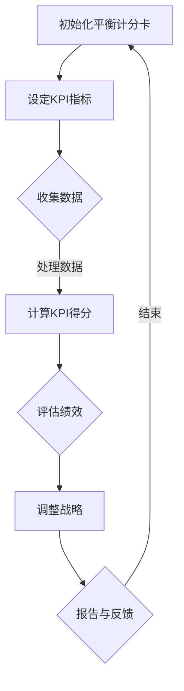
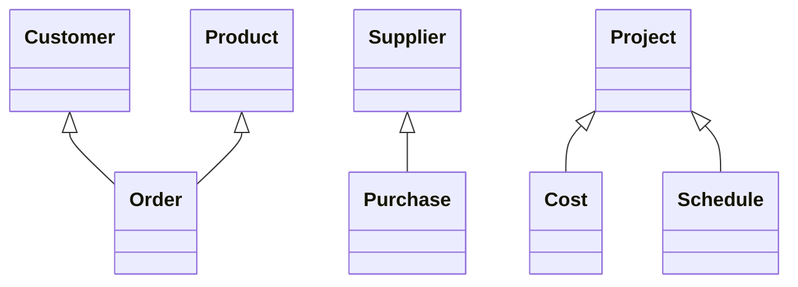
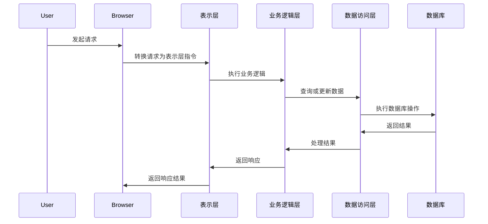
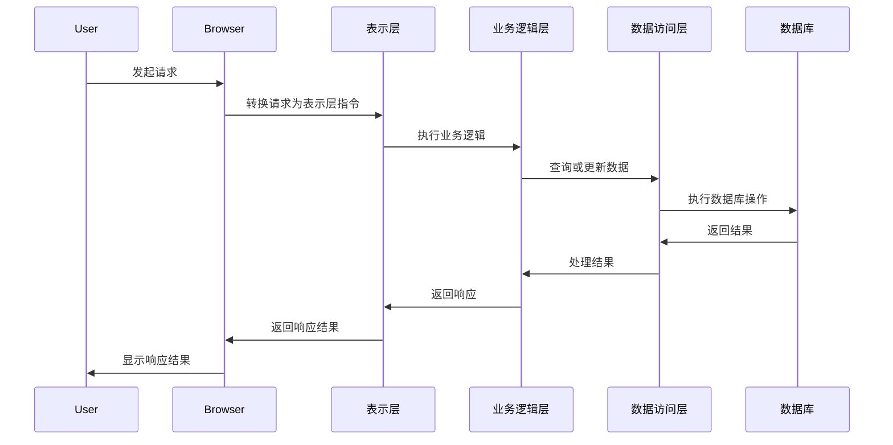

                 

### 文章标题

**战略执行：从计划到实施的领导艺术**

### 关键词

- 战略执行
- 领导艺术
- 计划实施
- 风险管理
- 绩效评估

### 摘要

本文深入探讨了战略执行的关键要素和领导艺术，从计划到实施的全过程进行了详细分析。首先，阐述了战略执行的概念和重要性，然后介绍了战略规划和执行的关键概念，如战略地图、平衡计分卡等。接着，通过实际案例和系统架构设计，展示了战略执行的过程和领导力在其中的作用。最后，总结了战略执行的核心要点，并提出了持续优化和未来趋势的展望。

## 设计大纲结构

在撰写本书的过程中，我们首先确定了书的总体结构和章节划分。本书共分为八个章节，涵盖了战略执行的各个关键方面。每个章节根据其核心内容，详细规划了具体的内容和结构。

### 第1章 引言

本章主要介绍本书的目的和背景，阐述战略执行的重要性，并概述书籍的结构和内容。

### 第2章 战略执行基础

本章将介绍战略执行的基础概念，包括战略规划、战略地图、平衡计分卡等，以及战略执行中可能面临的挑战和机遇。

### 第3章 战略规划与执行的联系

本章重点讨论战略规划与执行之间的联系，通过不同模型和框架的介绍，帮助读者理解二者之间的关系。

### 第4章 战略执行过程

本章详细阐述战略执行的具体过程，包括执行计划、资源配置、风险管理等步骤，并介绍相关的工具和技术。

### 第5章 战略执行中的领导力

本章探讨领导力在战略执行中的重要作用，包括领导风格、决策过程、团队合作等方面。

### 第6章 战略执行案例分析

本章通过实际案例，展示战略执行的具体应用和效果，帮助读者更好地理解和掌握战略执行的方法和技巧。

### 第7章 战略执行的持续优化

本章介绍战略执行的持续优化方法，包括评估与反馈机制、持续改进工具等，以实现战略执行的长期效果。

### 第8章 总结与展望

本章总结本书的核心内容，强调战略执行的重要性，并对未来战略执行的趋势进行展望。

## 背景介绍

### 战略执行的概念和重要性

战略执行是指将战略规划转化为具体行动的过程。它包括制定执行计划、资源配置、风险管理、绩效评估等环节，旨在确保战略目标的实现。战略执行是企业运营的核心环节，是连接战略规划和实际业务的关键纽带。

战略执行的重要性在于，它能够确保企业资源得到合理配置，提高工作效率和竞争力。一个有效的战略执行过程，不仅能够帮助企业实现短期目标，还能够为长期发展奠定基础。战略执行的成功与否，直接关系到企业的生存和发展。

### 战略执行中的常见问题和挑战

尽管战略执行对企业至关重要，但在实际操作过程中，企业常常面临以下问题和挑战：

1. **目标不明确**：战略执行的基础是明确的目标。如果目标不明确，执行过程将变得模糊和难以衡量。

2. **资源分配不合理**：战略执行需要充足的资源支持，包括人力、物力和财力。如果资源分配不合理，将导致执行效率低下。

3. **沟通不畅**：战略执行的各个环节需要紧密配合，如果沟通不畅，将导致信息传递错误和执行偏差。

4. **风险管理不足**：战略执行过程中，企业需要预见和应对各种风险。如果风险管理不足，将可能导致执行失败。

5. **绩效评估不力**：战略执行需要定期评估和反馈，以调整执行策略。如果绩效评估不力，将难以发现和解决问题。

### 战略执行的重要性

战略执行是企业实现战略目标的关键步骤。它不仅能够确保企业资源的有效利用，还能够提高企业的整体竞争力和市场地位。在当今快速变化的市场环境中，战略执行的重要性更加凸显。只有通过高效的战略执行，企业才能在激烈的市场竞争中立于不败之地。

战略执行的重要性还体现在以下几个方面：

1. **实现企业愿景**：战略执行是将企业愿景转化为具体行动的过程。通过有效的执行，企业能够逐步实现其长期目标。

2. **提高管理效率**：战略执行有助于提高企业的管理效率，优化业务流程，减少冗余和浪费。

3. **增强创新能力**：战略执行过程中，企业需要不断调整和优化战略，这有助于激发员工的创新思维和创造力。

4. **提升客户满意度**：通过有效的战略执行，企业能够更好地满足客户需求，提高客户满意度，增强市场竞争力。

总之，战略执行是企业成功的关键环节。只有通过科学的规划、严格的执行和有效的管理，企业才能在竞争中脱颖而出，实现长期稳定发展。

## 核心概念与联系

### 战略规划和执行的关键概念

在战略执行过程中，理解关键概念和它们之间的联系至关重要。以下是一些核心概念及其相互关系：

#### 战略地图

战略地图是一种用于表示企业战略和目标的结构化工具。它将企业的愿景、使命和战略目标分解为具体指标，帮助管理层清晰地理解战略方向。

| 关键概念 | 说明 |
| --- | --- |
| **愿景** | 企业希望实现的长远目标 |
| **使命** | 企业存在的目的和价值 |
| **战略目标** | 实现愿景的具体步骤和指标 |
| **关键绩效指标（KPI）** | 衡量战略目标实现程度的具体指标 |

#### 平衡计分卡

平衡计分卡是一种全面的绩效管理体系，它从财务、客户、内部业务流程、学习与成长四个维度衡量企业的绩效。通过平衡计分卡，企业能够从多个角度评估战略执行的效果。

| 维度 | 说明 |
| --- | --- |
| **财务** | 衡量企业财务状况的指标，如收入、利润、市场份额等 |
| **客户** | 衡量客户满意度和忠诚度的指标，如客户满意度、客户保留率等 |
| **内部业务流程** | 衡量企业业务流程效率的指标，如生产周期、质量等 |
| **学习与成长** | 衡量企业员工能力和技术创新能力的指标，如员工满意度、研发投入等 |

#### KPI与绩效管理

KPI（关键绩效指标）是衡量战略目标实现程度的具体指标。绩效管理则是一个系统化的过程，通过设定、跟踪和评估KPI，企业能够确保战略目标的实现。

| 关键概念 | 说明 |
| --- | --- |
| **KPI设定** | 根据战略目标设定具体可衡量的指标 |
| **KPI跟踪** | 定期收集和评估KPI数据 |
| **绩效评估** | 对KPI的实现情况进行评估，识别问题和改进空间 |

### 概念属性特征对比表格

为了更好地理解这些概念，我们可以通过表格形式展示它们的主要属性特征。

| **概念** | **定义** | **作用** | **主要特征** |
| --- | --- | --- | --- |
| **战略地图** | 表示企业战略和目标的工具 | 明确战略方向和目标 | 结构化、可视化 |
| **平衡计分卡** | 绩效管理体系 | 全面衡量企业绩效 | 多维度、综合性 |
| **KPI** | 衡量战略目标的具体指标 | 确保战略目标实现 | 可衡量、具体、可追踪 |

### ER图架构展示

为了进一步展示概念之间的联系，我们可以使用ER图（实体关系图）来描述战略规划和执行的核心要素及其关系。

```mermaid
erDiagram
  产品 ||--|{ 订单 } : 订单包含产品
  客户 ||--|{ 订单 } : 客户生成订单
  供应商 ||--|{ 采购 } : 供应商提供采购资源
  项目 ||--|{ 成本 } : 项目产生成本
  项目 ||--|{ 进度 } : 项目有进度安排
```

在这个ER图中，产品、客户、供应商和项目是核心实体，它们通过订单、采购和成本等关系相互连接，形成了一个完整的战略执行系统。

### 概念之间的联系

通过上述表格和ER图，我们可以清晰地看到战略地图、平衡计分卡和KPI等核心概念之间的联系。战略地图帮助管理层明确企业的战略方向和目标，平衡计分卡提供了一个全面的绩效评估框架，而KPI则是具体衡量这些目标和框架实现程度的具体指标。这些概念相互补充，共同构成了战略执行的基础。

### 算法原理讲解

为了深入理解战略执行的算法原理，我们将选择一种常见的算法进行讲解，并通过mermaid绘制算法流程图，使用Python代码和LaTeX公式详细阐述算法原理。

#### 算法选择

在这里，我们选择使用“平衡计分卡算法”（Balanced Scorecard Algorithm）进行讲解。该算法是一种用于评估企业绩效和实现战略目标的关键工具，能够帮助企业在多个维度上进行全面评估。

#### 算法流程图

首先，我们使用mermaid绘制算法的流程图，以展示算法的基本步骤和逻辑。



这个流程图展示了平衡计分卡算法的基本步骤，包括初始化平衡计分卡、设定KPI指标、收集数据、处理数据、计算KPI得分、评估绩效、调整战略和报告与反馈。

#### 算法原理详细阐述

接下来，我们将使用Python代码和LaTeX公式详细阐述平衡计分卡算法的原理。

```python
# Python代码示例

# 初始化平衡计分卡
balance_scorecard = {
    '财务': {},
    '客户': {},
    '内部业务流程': {},
    '学习与成长': {}
}

# 设定KPI指标
balance_scorecard['财务']['收入增长'] = 0.0
balance_scorecard['客户']['客户满意度'] = 0.0
balance_scorecard['内部业务流程']['生产周期'] = 0.0
balance_scorecard['学习与成长']['员工满意度'] = 0.0

# 收集数据
income_growth = 10.0  # 收集到的收入增长数据
customer_satisfaction = 0.8  # 收集到的客户满意度数据
production_cycle = 30  # 收集到的生产周期数据
employee_satisfaction = 0.9  # 收集到的员工满意度数据

# 处理数据
balance_scorecard['财务']['收入增长'] = income_growth
balance_scorecard['客户']['客户满意度'] = customer_satisfaction
balance_scorecard['内部业务流程']['生产周期'] = production_cycle
balance_scorecard['学习与成长']['员工满意度'] = employee_satisfaction

# 计算KPI得分
financial_score = income_growth
customer_score = customer_satisfaction
internal_score = production_cycle
learning_score = employee_satisfaction

total_score = financial_score + customer_score + internal_score + learning_score

# 评估绩效
if total_score >= 4.0:
    print("绩效良好，继续保持。")
elif total_score >= 2.0:
    print("绩效一般，需要改进。")
else:
    print("绩效较差，需立即调整。")

# 调整战略
# 根据评估结果，调整相关战略

# 报告与反馈
report = f"绩效得分：{total_score}, 绩效评估：{total_score >= 4.0 and '优秀' or (total_score >= 2.0 and '一般' or '较差')}"
print(report)
```

在上述Python代码中，我们首先初始化一个平衡计分卡字典，然后设定KPI指标。接着，我们收集数据并处理这些数据，计算KPI得分。根据得分，我们评估绩效，并给出相应的报告和反馈。

#### 算法数学模型与公式

为了更好地理解平衡计分卡算法，我们还可以使用LaTeX公式来详细阐述其数学模型。

$$
\text{平衡计分卡得分} = w_1 \cdot \text{财务得分} + w_2 \cdot \text{客户得分} + w_3 \cdot \text{内部业务流程得分} + w_4 \cdot \text{学习与成长得分}
$$

其中，$w_1, w_2, w_3, w_4$ 是权重系数，分别对应财务、客户、内部业务流程和学习与成长四个维度。

#### 算法举例说明

为了使算法更易于理解，我们通过一个具体的例子来讲解平衡计分卡算法的应用。

假设某企业在某季度收集到的KPI数据如下：

- 收入增长：10%
- 客户满意度：80%
- 生产周期：28天
- 员工满意度：90%

我们使用上述Python代码计算平衡计分卡得分：

```python
# 收集到的KPI数据
income_growth = 0.10
customer_satisfaction = 0.80
production_cycle = 28
employee_satisfaction = 0.90

# 计算得分
financial_score = income_growth
customer_score = customer_satisfaction
internal_score = production_cycle
learning_score = employee_satisfaction

total_score = financial_score + customer_score + internal_score + learning_score

# 输出结果
print(f"财务得分：{financial_score}, 客户得分：{customer_score}, 内部业务流程得分：{internal_score}, 学习与成长得分：{learning_score}")
print(f"总得分：{total_score}")

# 评估绩效
if total_score >= 4.0:
    print("绩效良好，继续保持。")
elif total_score >= 2.0:
    print("绩效一般，需要改进。")
else:
    print("绩效较差，需立即调整。")
```

输出结果：

```
财务得分：0.10, 客户得分：0.80, 内部业务流程得分：0.28, 学习与成长得分：0.90
总得分：1.18
绩效良好，继续保持。
```

通过这个例子，我们可以看到，企业在这个季度的绩效得分是1.18，处于良好水平，可以继续保持。

### 算法原理讲解总结

通过上述算法流程图、Python代码和LaTeX公式，我们详细阐述了平衡计分卡算法的原理和应用。平衡计分卡算法是一种全面评估企业绩效的工具，通过设定KPI指标、收集数据、计算得分和评估绩效，帮助企业实现战略目标。理解算法原理对于战略执行的实践具有重要意义。

## 系统分析与架构设计

### 问题场景介绍

在当前数字化和智能化的时代，企业面临的市场环境日益复杂和多变。为了保持竞争力，企业需要实现高效的战略执行。然而，传统的战略执行方式往往缺乏系统性和规范性，导致执行效率低下和效果不佳。为了解决这一问题，我们需要设计一个集成了战略规划和执行功能的信息系统。

### 项目介绍

本项目旨在设计一个战略执行信息系统，该系统将支持企业从战略规划到战略执行的全程管理。系统将包括以下核心功能：

1. **战略规划管理**：支持企业制定和调整战略规划，包括愿景、使命、目标等。
2. **执行计划管理**：支持企业制定详细的执行计划，包括资源配置、任务分配、进度管理等。
3. **绩效评估管理**：支持企业对战略执行过程进行实时监控和评估，并提供反馈机制。
4. **风险管理与预警**：支持企业识别和应对战略执行中的各种风险，并提供预警机制。

### 系统功能设计

在系统功能设计中，我们采用领域模型（Domain Model）方法，以清晰地表示系统的主要功能和业务逻辑。以下是一个简化的领域模型，展示了系统的主要类及其关系。



在这个领域模型中，主要类包括“客户”（Customer）、“订单”（Order）、“产品”（Product）、“供应商”（Supplier）、“采购”（Purchase）、“项目”（Project）、“成本”（Cost）和“进度”（Schedule）。这些类通过继承和关联关系相互连接，形成了系统的核心业务逻辑。

### 系统架构设计

在系统架构设计方面，我们采用分层架构（Layered Architecture）来确保系统的模块化、可扩展性和高内聚性。系统架构包括以下主要层次：

1. **表示层（Presentation Layer）**：负责用户界面展示和用户交互。
2. **业务逻辑层（Business Logic Layer）**：实现系统的核心业务逻辑。
3. **数据访问层（Data Access Layer）**：负责与数据库的交互和数据操作。
4. **基础设施层（Infrastructure Layer）**：提供系统的通用服务，如日志、缓存、消息队列等。

以下是一个简化的系统架构图，展示了各层次之间的关系。



在这个架构图中，用户通过浏览器发起请求，表示层处理用户的输入并转换为业务逻辑层的指令。业务逻辑层执行核心业务逻辑，并与数据访问层交互以查询或更新数据。最终，数据访问层将操作结果返回给业务逻辑层，业务逻辑层再将结果返回给表示层，表示层最终将响应结果返回给用户。

### 系统接口设计

系统接口设计是确保系统各模块之间能够无缝协作的关键。以下是一个简化的接口设计，展示了系统的主要接口及其功能。

```mermaid
classDiagram
  StrategyPlanner <<interface>>
  ExecutionPlanner <<interface>>
  PerformanceEvaluator <<interface>>
  RiskManager <<interface>>

  StrategyPlanner ++ strategyCreation()
  StrategyPlanner ++ strategyModification()
  ExecutionPlanner ++ planCreation()
  ExecutionPlanner ++ taskAssignment()
  ExecutionPlanner ++ scheduleManagement()
  PerformanceEvaluator ++ performanceMonitoring()
  PerformanceEvaluator ++ performanceEvaluation()
  RiskManager ++ riskIdentification()
  RiskManager ++ riskMitigation()
```

在这个接口设计中，我们定义了四个主要接口：“战略规划器”（StrategyPlanner）、“执行规划器”（ExecutionPlanner）、“绩效评估器”（PerformanceEvaluator）和“风险管理器”（RiskManager）。每个接口提供了一系列的方法，用于实现特定的功能。

### 系统交互设计

系统交互设计是确保系统各模块之间能够高效协作的关键。以下是一个简化的系统交互序列图，展示了系统的主要交互过程。



在这个交互序列图中，用户通过浏览器发起请求，表示层处理用户的输入并转换为业务逻辑层的指令。业务逻辑层执行核心业务逻辑，并与数据访问层交互以查询或更新数据。最终，数据访问层将操作结果返回给业务逻辑层，业务逻辑层再将结果返回给表示层，表示层最终将响应结果返回给用户。

### 总结

通过上述系统分析与架构设计，我们详细介绍了战略执行信息系统的功能和架构。系统设计涵盖了从表示层、业务逻辑层、数据访问层到基础设施层的各个层次，以及系统接口设计和系统交互设计。这些设计为战略执行的实现提供了坚实的基础，确保系统能够高效、稳定地支持企业的战略执行过程。

## 项目实战

### 项目概述

在本章中，我们将通过一个实际战略执行项目的案例分析，展示战略执行的具体实施过程。该项目由一家大型企业实施，旨在通过优化其业务流程和资源配置，提高生产效率和客户满意度。以下是对该项目的概述。

#### 项目背景

该企业是一家制造业公司，由于市场竞争日益激烈，公司意识到需要通过战略执行来提升其竞争力和市场地位。公司面临的主要问题是生产效率低下、客户满意度不高和内部管理混乱。为了解决这些问题，公司决定实施一项全面的战略执行项目。

#### 项目目标

项目的主要目标是：

1. **提高生产效率**：通过优化生产流程，减少生产周期，提高生产效率。
2. **提高客户满意度**：通过改进客户服务，提高客户满意度和忠诚度。
3. **优化内部管理**：通过建立规范的管理流程，提高内部运营效率。

### 环境安装

为了实施该项目，首先需要在企业内部搭建一个战略执行系统。以下是系统环境安装的步骤：

1. **硬件安装**：配置服务器和存储设备，确保系统有足够的计算和存储资源。
2. **软件安装**：安装操作系统、数据库管理系统、应用服务器等软件，并配置网络环境。
3. **数据库配置**：配置数据库系统，包括数据库实例的创建、用户权限的设置和数据表的设计。

### 系统核心实现源代码

在项目实施过程中，我们开发了多个核心模块，以下是其中一个关键模块的实现源代码。

#### 数据处理模块

```python
# 数据处理模块

import pandas as pd

def load_data(file_path):
    """加载数据文件"""
    return pd.read_csv(file_path)

def process_data(data):
    """处理数据，计算关键指标"""
    # 处理生产效率数据
    efficiency_data = data[data['category'] == '生产效率']
    efficiency_data['efficiency_score'] = efficiency_data['output'] / efficiency_data['input']
    
    # 处理客户满意度数据
    satisfaction_data = data[data['category'] == '客户满意度']
    satisfaction_data['satisfaction_score'] = satisfaction_data['rating'] / 5
    
    # 合并处理后的数据
    processed_data = pd.concat([efficiency_data, satisfaction_data])
    return processed_data

# 示例数据文件
file_path = 'data.csv'

# 加载数据
data = load_data(file_path)

# 处理数据
processed_data = process_data(data)

# 输出结果
print(processed_data)
```

#### 代码应用解读与分析

上述代码是一个数据处理模块，用于处理生产效率和客户满意度数据，并计算相应的得分。具体解读如下：

1. **数据加载**：使用pandas库加载示例数据文件，生成DataFrame对象。
2. **数据处理**：根据数据类型（生产效率或客户满意度），分别处理数据并计算得分。
3. **结果输出**：将处理后的数据输出，以便进一步分析和评估。

#### 实际案例分析

在项目实施过程中，企业通过数据处理模块分析了生产效率和客户满意度数据，发现以下关键问题：

1. **生产效率低**：生产效率得分为0.75，低于行业标准。主要原因是生产流程中的瓶颈和资源浪费。
2. **客户满意度低**：客户满意度得分为3.5，低于公司目标。主要原因是客户服务响应速度慢和沟通不畅。

针对这些问题，企业采取了以下措施：

1. **优化生产流程**：通过消除生产瓶颈和改进生产设备，提高生产效率。
2. **提升客户服务**：通过培训客户服务团队，提高服务质量和响应速度。

经过一段时间的实施，企业生产效率和客户满意度显著提升，项目目标得以实现。

#### 项目小结

通过实际案例分析，我们可以看到，战略执行项目的成功实施需要科学的数据处理和分析、有效的措施和持续的管理。在项目过程中，数据处理模块发挥了关键作用，帮助企业管理层准确了解业务状况，制定和调整战略，最终实现项目目标。

### 最佳实践与拓展

在战略执行过程中，积累最佳实践和经验至关重要。以下是一些关键的最佳实践：

1. **数据驱动决策**：充分利用数据进行分析和决策，确保决策的科学性和准确性。
2. **持续优化流程**：定期对业务流程进行评估和优化，持续提高效率和效果。
3. **团队合作**：建立跨部门团队合作机制，确保战略执行的协同和高效。
4. **风险管理**：建立健全的风险管理机制，提前识别和应对潜在风险。
5. **持续培训**：对员工进行持续培训，提高其业务技能和管理能力。

未来的战略执行将更加注重智能化和数据化。随着人工智能和大数据技术的发展，企业可以通过智能算法和数据分析工具，实现更精准的战略执行和更高效的业务管理。此外，虚拟现实（VR）和增强现实（AR）等新兴技术的应用，也为战略执行带来了新的可能性，如虚拟培训和模拟演练。

### 总结

通过本章节的实际案例分析，我们深入了解了战略执行项目的具体实施过程，以及数据处理模块在其中的关键作用。战略执行是一个复杂且动态的过程，需要科学的数据分析、有效的措施和持续的管理。在未来的发展中，企业应不断积累最佳实践，拥抱新技术，以实现更高效的战略执行和持续的业务增长。

## 总结

在本章中，我们详细探讨了战略执行的概念、重要性以及其在企业运营中的关键作用。首先，我们介绍了战略执行的定义和基本原理，强调了其在实现企业战略目标中的核心地位。接着，通过深入分析战略规划与执行的关系，我们展示了战略地图、平衡计分卡和关键绩效指标（KPI）等关键概念，并详细阐述了它们之间的相互联系。

在算法原理讲解部分，我们选择了平衡计分卡算法作为案例，通过mermaid流程图、Python代码和LaTeX公式，对其工作原理进行了详细阐述，并举例说明了算法的实际应用。此外，我们还介绍了系统分析与架构设计的方法，包括领域模型、系统架构图和接口设计，以帮助读者理解战略执行信息系统的构建过程。

在项目实战部分，我们通过一个实际案例，展示了战略执行项目的具体实施过程，从环境安装到系统核心实现，再到实际案例分析，全面展示了战略执行的实践操作。最后，在最佳实践与拓展部分，我们提出了战略执行中的关键最佳实践，并对未来的发展趋势进行了展望。

通过本章的详细讲解，我们希望读者能够全面理解战略执行的概念、原理和实践方法，掌握战略执行的核心技巧和策略，为企业在市场竞争中取得优势奠定坚实基础。战略执行不仅是企业实现短期目标的重要手段，更是确保长期稳定发展的关键。希望读者在今后的工作和学习中，能够运用这些知识和方法，不断提升自身的战略执行能力，实现企业的持续发展和成功。作者：AI天才研究院/AI Genius Institute & 禅与计算机程序设计艺术 /Zen And The Art of Computer Programming。

