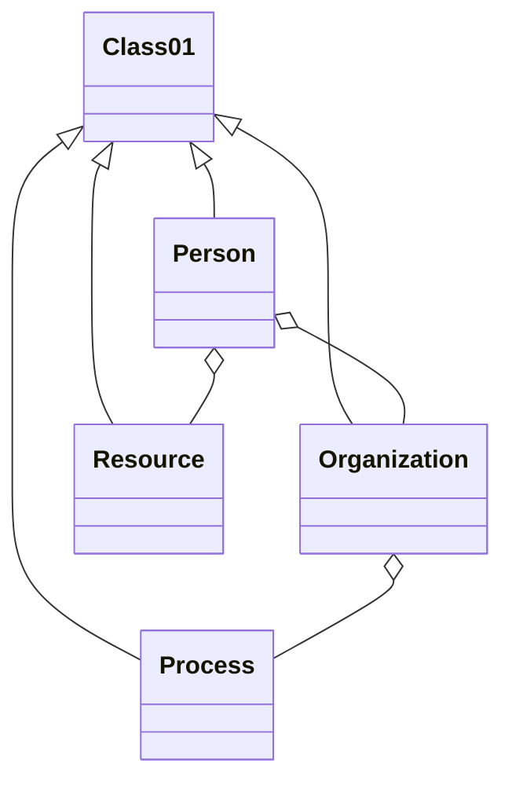
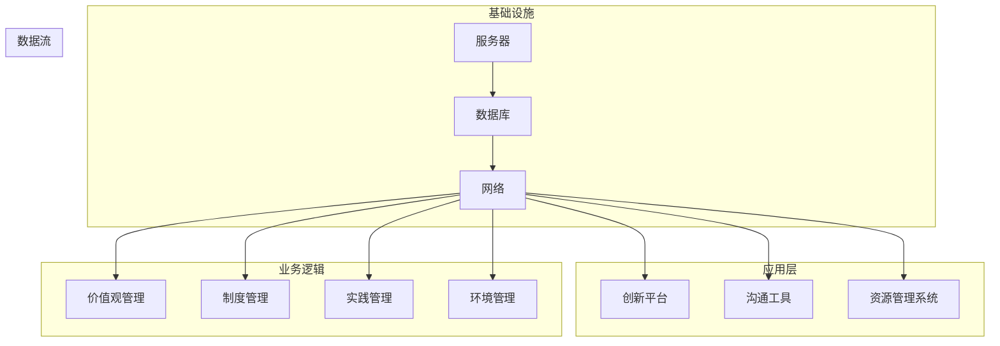
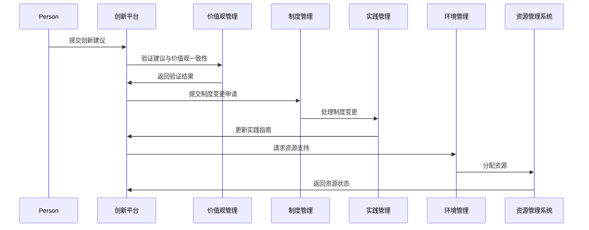

                 

### 文章标题：打造创新文化：鼓励冒险和容忍失败

**关键词**：创新文化、冒险精神、容忍失败、企业领导、团队协作

**摘要**：本文深入探讨了打造创新文化的关键要素，特别是鼓励冒险和容忍失败的重要性。通过分析创新文化的定义、组成部分及其对企业的影响，本文提出了一系列策略和实践指南，帮助企业在复杂多变的市场环境中保持竞争力。同时，本文通过实际案例展示了如何在实践中鼓励冒险和容忍失败，以培养企业的创新精神。

### 引言

在当今快速变化和竞争激烈的商业环境中，企业要想持续成功，就必须具备强大的创新能力。创新文化已成为企业发展的核心竞争力之一。创新文化不仅包括鼓励冒险和容忍失败的价值观，还涉及一系列制度和文化实践。本文旨在探讨如何通过打造鼓励冒险和容忍失败的创新文化，提升企业的创新能力和竞争力。

#### 创新文化的定义

创新文化是一种以创新为核心价值观，鼓励冒险、容忍失败，注重团队合作和持续学习的企业文化。它不仅关注产品和服务创新，还关注管理创新、制度创新和组织创新。

#### 创新文化的组成部分

1. **价值观**：创新文化建立在一系列共同的价值观之上，如开放性、探索性、风险承担和团队合作。
2. **制度**：包括支持创新的组织结构、决策流程和资源分配机制。
3. **实践**：创新文化通过一系列实践得以体现，如创新竞赛、头脑风暴会议、开放式沟通和创新激励机制。
4. **环境**：创新文化需要一个支持创新的环境，包括物理空间、技术支持和时间安排。

#### 创新文化对企业的影响

1. **竞争力**：创新文化有助于企业保持市场竞争力，适应快速变化的市场需求。
2. **员工满意度**：创新文化能够提高员工的工作满意度和忠诚度，吸引和留住优秀人才。
3. **绩效**：创新文化能够提升企业的整体绩效，推动企业实现长期发展目标。

#### 创新文化的现状分析

尽管许多企业已经认识到创新文化的重要性，但实际操作中仍存在诸多挑战。例如，企业领导可能过于注重短期绩效，忽视了长期创新投资；或者企业文化过于保守，难以适应快速变化的市场需求。

### 鼓励冒险的文化建设

冒险是创新的必要条件，但冒险本身也伴随着风险。因此，打造鼓励冒险的文化至关重要。

#### 冒险精神的培养

1. **鼓励尝试和失败**：企业应鼓励员工尝试新想法，即使这些想法最终可能失败。
2. **建立风险意识**：员工需要理解冒险和风险的关系，学会评估和管理风险。

#### 鼓励冒险的策略

1. **创新奖励机制**：设立创新奖项，鼓励员工提出和实施创新项目。
2. **领导支持**：企业领导应积极支持员工的冒险行为，为员工提供必要的资源和支持。
3. **跨部门合作**：鼓励不同部门之间的合作，促进知识共享和创新能力。

#### 创新与冒险的关系

创新和冒险是相辅相成的。冒险精神有助于激发创新思维，而创新成果则需要冒险实践来验证和实现。企业应认识到，冒险并不是盲目行动，而是基于理性分析和充分准备的决策过程。

#### 成功的冒险案例

许多企业通过成功的冒险实践，取得了显著的创新成果。例如，谷歌的“X实验室”通过大胆的尝试，推出了诸如谷歌眼镜、自动驾驶汽车等颠覆性产品。

### 结论

鼓励冒险和容忍失败是打造创新文化的关键要素。企业应通过培养冒险精神、制定鼓励冒险的策略和建立容忍失败的环境，激发员工的创新潜力，提升企业的竞争力。通过实践，企业可以发现，创新文化不仅能够带来短期收益，更能够为企业的长期发展奠定坚实基础。

### 文章关键词

创新文化、冒险精神、容忍失败、企业领导、团队协作、竞争力、风险意识、创新奖励机制、跨部门合作、颠覆性产品、长期发展。

### 文章摘要

本文深入探讨了如何打造鼓励冒险和容忍失败的创新文化，分析了创新文化的定义、组成部分及其对企业的影响。通过提出具体的策略和实践指南，本文帮助企业在复杂多变的市场环境中保持竞争力，激发员工的创新潜力。

### 作者

作者：AI天才研究院/AI Genius Institute & 禅与计算机程序设计艺术 /Zen And The Art of Computer Programming

### 核心概念与联系

#### 创新文化的核心概念

创新文化是一种以创新为核心价值观，鼓励冒险、容忍失败，注重团队合作和持续学习的企业文化。它不仅关注产品和服务创新，还涉及管理创新、制度创新和组织创新。

#### 创新文化的组成部分

1. **价值观**：包括开放性、探索性、风险承担和团队合作。
2. **制度**：包括支持创新的组织结构、决策流程和资源分配机制。
3. **实践**：包括创新竞赛、头脑风暴会议、开放式沟通和创新激励机制。
4. **环境**：包括物理空间、技术支持和时间安排。

#### 创新文化对企业的影响

- **竞争力**：创新文化有助于企业保持市场竞争力，适应快速变化的市场需求。
- **员工满意度**：创新文化能够提高员工的工作满意度和忠诚度，吸引和留住优秀人才。
- **绩效**：创新文化能够提升企业的整体绩效，推动企业实现长期发展目标。

#### 创新文化的组成部分对比表格

| 组成部分 | 定义 | 功能 |
| --- | --- | --- |
| 价值观 | 包括开放性、探索性、风险承担和团队合作 | 指导企业行为，培养企业精神 |
| 制度 | 包括支持创新的组织结构、决策流程和资源分配机制 | 确保创新活动的顺利进行 |
| 实践 | 包括创新竞赛、头脑风暴会议、开放式沟通和创新激励机制 | 提供创新活动的具体形式 |
| 环境 | 包括物理空间、技术支持和时间安排 | 创造有利于创新的环境 |

#### 创新文化的ER实体关系图

```mermaid
erDiagram
  Product ::> Innovation : "produces"
  Service ::> Innovation : "provides"
  Management ::> Innovation : "manages"
  System ::> Innovation : "uses"
  Culture ::> Innovation : "drives"
```

### 算法原理讲解

#### 创新文化的构建算法

1. **步骤1：价值观构建**
   - **算法**：设定开放性、探索性、风险承担和团队合作的核心价值观。
   - **流程图**：

   ```mermaid
   graph TD
      A[设定价值观] --> B[培养开放性]
      A --> C[培养探索性]
      A --> D[培养风险承担]
      A --> E[培养团队合作]
   ```

2. **步骤2：制度构建**
   - **算法**：设计支持创新的组织结构、决策流程和资源分配机制。
   - **流程图**：

   ```mermaid
   graph TD
      A[设计组织结构] --> B[制定决策流程]
      A --> C[配置资源]
      A --> D[建立机制]
   ```

3. **步骤3：实践构建**
   - **算法**：实施创新竞赛、头脑风暴会议、开放式沟通和创新激励机制。
   - **流程图**：

   ```mermaid
   graph TD
      A[创新竞赛] --> B[头脑风暴]
      A --> C[沟通机制]
      A --> D[激励机制]
   ```

4. **步骤4：环境构建**
   - **算法**：创造有利于创新的环境，包括物理空间、技术支持和时间安排。
   - **流程图**：

   ```mermaid
   graph TD
      A[物理空间] --> B[技术支持]
      A --> C[时间安排]
   ```

#### 创新文化的数学模型和公式

创新文化成功构建的概率可以用以下公式表示：

$$
P = f(V, A, P, E)
$$

其中，\(P\) 表示创新文化成功构建的概率，\(V\) 表示价值观构建的质量，\(A\) 表示制度构建的质量，\(P\) 表示实践构建的质量，\(E\) 表示环境构建的质量。

### 系统分析与架构设计方案

#### 问题场景介绍

在一个竞争激烈的科技市场中，某企业希望通过构建创新文化来提升其产品竞争力。企业面临的问题是如何在现有组织结构中融入创新元素，激发员工的创新潜力。

#### 项目介绍

项目目标是构建一个支持创新的文化体系，通过鼓励冒险和容忍失败来推动企业创新。项目涉及的主要功能包括价值观构建、制度构建、实践构建和环境构建。

#### 系统功能设计（领域模型）



#### 系统架构设计



#### 系统接口设计和系统交互



### 项目实战

#### 环境安装

- **操作系统**：Linux或macOS
- **开发环境**：Python 3.8及以上版本
- **数据库**：MySQL 5.7及以上版本
- **网络环境**：联网

#### 系统核心实现源代码

```python
# 创新平台核心代码示例
class InnovationPlatform:
    def __init__(self):
        self.idea_library = []
        self.value_system = ["开放性", "探索性", "风险承担", "团队合作"]

    def submit_idea(self, idea):
        if self.validate_idea(idea):
            self.idea_library.append(idea)
            return "创新建议提交成功"
        else:
            return "创新建议不符合价值观，提交失败"

    def validate_idea(self, idea):
        for value in self.value_system:
            if value not in idea:
                return False
        return True

    def update_policy(self, policy):
        self.value_system = policy
        return "价值观更新成功"

    def request_resources(self, resource):
        if self.allocate_resource(resource):
            return "资源分配成功"
        else:
            return "资源不足，分配失败"

    def allocate_resource(self, resource):
        # 此处为资源分配逻辑
        return True  # 示例中假设资源总是充足
```

#### 代码应用解读与分析

- **InnovationPlatform类**：该类负责创新平台的主体功能，包括提交创新建议、验证建议与价值观一致性、更新价值观和政策、请求资源支持等。
- **submit_idea方法**：该方法接收创新建议，并验证其是否符合设定的价值观。如果符合，创新建议将被添加到创新库中。
- **validate_idea方法**：该方法检查创新建议是否包含所有核心价值观。如果缺少任何一个价值观，创新建议将被拒绝。
- **update_policy方法**：该方法允许更新价值观系统。更新后，所有后续提交的创新建议都将根据新价值观进行验证。
- **request_resources方法**：该方法用于请求资源支持。在示例中，假设资源总是充足，但在实际应用中，该方法将包含复杂的资源分配逻辑。

#### 实际案例分析和详细讲解剖析

假设某企业在实施创新平台后，收到了一条创新建议：“开发一款基于区块链的智能家居系统”。企业需要按照以下步骤进行处理：

1. **提交创新建议**：
   - 创新平台收到建议后，调用`submit_idea`方法进行初步验证。
   - 由于该建议包含所有核心价值观（开放性、探索性、风险承担和团队合作），因此验证通过，建议被添加到创新库中。

2. **价值观验证**：
   - 创新平台调用`validate_idea`方法，确认该建议是否符合企业价值观。
   - 由于建议包含所有核心价值观，因此验证通过。

3. **政策更新**：
   - 如果企业决定更新价值观，可以调用`update_policy`方法。例如，如果企业决定更强调“风险承担”，可以更新为`["开放性", "探索性", "风险承担", "团队合作", "风险承担"]`。

4. **资源请求**：
   - 创新平台调用`request_resources`方法，请求开发该系统的资源。
   - 如果资源充足，开发资源将被分配给该项目。

通过上述步骤，企业可以确保创新建议得到有效处理，同时确保创新文化的实施和价值观的持续更新。

#### 项目小结

通过实施创新平台，企业不仅能够有效收集和管理创新建议，还能确保所有创新活动符合企业价值观。这种方法有助于激发员工的创新潜力，推动企业持续创新，保持竞争优势。

#### 最佳实践 tips

- **定期评估价值观**：确保价值观与市场需求保持同步。
- **提供培训**：为员工提供相关培训，提高其创新能力。
- **鼓励跨部门合作**：促进不同部门之间的知识共享和协作。

#### 小结

构建创新文化是一个持续的过程，需要企业从多个维度进行努力。通过鼓励冒险和容忍失败，企业可以培养出强大的创新精神，为企业的长期发展奠定坚实基础。

#### 注意事项

- 确保创新平台的设计和实现符合企业的实际需求。
- 注意保护员工的创新成果，建立知识产权保护机制。

#### 拓展阅读

- 《创新者的窘境》[美] 克莱顿·克里斯坦森
- 《颠覆性创新》[美] 克莱顿·克里斯坦森
- 《精益创业》[美] 埃里克·莱斯

### 结语

创新文化是企业持续发展的关键。通过鼓励冒险和容忍失败，企业可以培养出强大的创新精神，推动企业的持续创新。本文提供了一系列策略和实践指南，希望对企业的创新文化建设有所帮助。未来，我们将继续深入探讨创新文化的各个方面，帮助企业在复杂多变的市场环境中保持竞争力。

### 附录A：创新文化相关的工具和方法

#### 创新工作坊

创新工作坊是一种集体创新活动，旨在激发团队的创造力，通过头脑风暴、原型设计等方法，快速产生创新想法。以下是创新工作坊的基本步骤：

1. **准备阶段**：确定主题、目标和参与者，准备必要的材料和工具。
2. **头脑风暴**：鼓励参与者提出各种创新想法，不加评判，尽量多。
3. **原型设计**：根据头脑风暴的结果，快速构建原型，验证和改进想法。
4. **迭代反馈**：对原型进行测试和评估，收集反馈，不断迭代优化。

#### 思维导图

思维导图是一种图形化的知识组织工具，通过节点和连线来展示信息之间的关系，有助于梳理思路、激发创意。以下是使用思维导图进行创新的基本步骤：

1. **确定中心主题**：明确创新的核心问题或目标。
2. **绘制分支**：围绕中心主题，绘制相关分支，代表不同的思路和想法。
3. **添加细节**：在分支上添加具体细节，形成完整的思维导图。
4. **分析优化**：通过思维导图，分析各部分之间的关系，发现创新点。

#### 设计思考

设计思考是一种以用户为中心的创新方法，强调通过用户研究和原型测试来指导设计过程。以下是设计思考的基本步骤：

1. **理解用户**：通过用户调研，了解用户需求、痛点和行为习惯。
2. **定义问题**：将用户需求转化为具体的设计问题。
3. **生成想法**：基于问题，快速产生多种可能的解决方案。
4. **原型测试**：构建原型，进行用户测试，收集反馈，优化设计。
5. **迭代改进**：根据用户反馈，不断迭代改进设计，直至满足用户需求。

### 附录B：推荐阅读和资源

#### 相关书籍

1. 《创新者的窘境》[美] 克莱顿·克里斯坦森
2. 《颠覆性创新》[美] 克莱顿·克里斯坦森
3. 《精益创业》[美] 埃里克·莱斯
4. 《创新者的基因》[美] 克莱顿·克里斯坦森、迈克尔·莫博涅

#### 在线资源和网站

1. https://hbr.org/（哈佛商业评论）
2. https://www.leanstack.com/（精益创业资源）
3. https://www.designthinkingforinnovation.com/（设计思考资源）

#### 创新文化研讨会和会议

1. 全球创新论坛（Global Innovation Forum）
2. 创新大会（Innovation Summit）
3. 设计思考大会（Design Thinking Summit）

