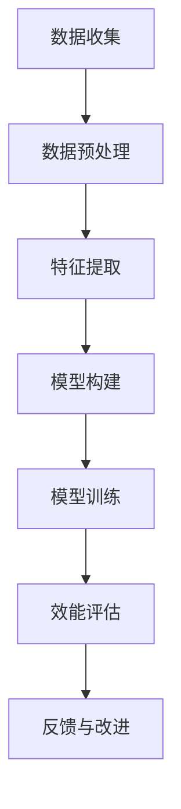
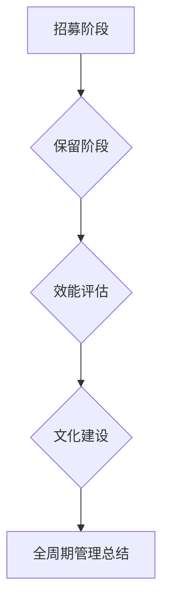

                 

### 引言

#### 问题背景与核心概念

在当今快速发展的信息技术时代，高效团队的重要性不言而喻。无论是科技创新企业，还是传统行业，高效团队都是企业竞争力的关键因素。然而，如何打造一个高效团队，并实现团队成员的长期保留，成为了许多企业面临的难题。本文将以“打造高效团队：从招募到保留的全周期管理”为主题，深入探讨团队管理中的核心问题，并系统地阐述解决思路。

**核心概念：**

1. **全周期管理：** 从团队成员的招募、保留到团队效能评估和团队文化建设，形成完整的管理闭环。
2. **招募策略：** 如何制定有效的人才招募计划，确保团队成员的质量和多样性。
3. **保留措施：** 如何通过合理的薪酬福利、职业发展路径和团队氛围等手段，留住核心人才。
4. **团队效能评估：** 如何通过科学的评估体系，持续提升团队的整体效能。
5. **团队文化建设：** 如何塑造具有凝聚力和创新力的团队文化，增强团队凝聚力。

#### 研究方法与框架

本文采用文献调研、案例分析、理论阐述和实践总结相结合的方法，构建一个全面的全周期团队管理框架。通过深入研究国内外优秀企业的实践案例，提炼出最佳管理实践，并结合理论模型进行系统分析，提出具体的操作策略和实施建议。

**目录概述：**

- **第一部分：引言**：介绍研究背景、核心概念和研究方法。
- **第二部分：招募阶段**：探讨招募策略、流程和案例分析。
- **第三部分：保留阶段**：分析保留策略、措施和效果评估。
- **第四部分：团队效能评估**：介绍评估指标体系、流程和案例分析。
- **第五部分：团队文化建设**：阐述文化建设策略、措施和效果评估。
- **第六部分：全周期管理最佳实践**：总结实践经验，分析未来趋势与挑战。
- **第七部分：结论与展望**：总结研究成果，展望未来研究方向。

通过这一系列的探讨和分析，本文旨在为企业管理者提供一套实用、系统的团队管理指南，助力企业打造高效团队，实现持续发展。

### 招募阶段

#### 2.1 招募策略

**人才标准与职位描述：**

招募阶段的首要任务是明确人才标准与职位描述。人才标准应当包括专业技能、工作经验、学习能力、团队合作精神等多方面。在制定职位描述时，要准确、详细地说明职位职责、工作内容、任职资格等，以便吸引符合要求的人才。

**招募渠道选择：**

选择合适的招募渠道对招募效果有直接影响。常见的招募渠道包括线上招聘平台、猎头服务、校园招聘、社交媒体招聘等。企业应根据自身需求和实际情况，选择最有效的招募渠道。例如，对于技术岗位，可以在技术论坛、GitHub等平台上发布招聘信息；对于市场营销岗位，可以通过社交媒体进行广泛传播。

**网络与社交媒体招募：**

随着互联网的普及，网络与社交媒体成为重要的招募渠道。企业可以利用LinkedIn、微博、微信等平台发布招聘信息，并通过互动和分享提高信息的曝光度。此外，利用社交网络进行内部推荐，也是提高招募效率的有效手段。

**招募成本效益分析：**

在制定招募策略时，必须考虑成本效益。企业应分析不同招募渠道的投入产出比，选择性价比最高的方案。例如，通过线上招聘平台发布职位信息可能成本较低，但可能需要投入更多的时间和人力进行筛选和沟通；而猎头服务成本较高，但能够快速找到适合的高级人才。

#### 2.2 招募流程

**人才搜索与筛选：**

招募流程的第一步是人才搜索与筛选。企业可以通过发布职位需求、社交媒体推广、人才库搜索等方式，广泛寻找潜在候选人。在筛选过程中，要关注简历的质量、专业技能和工作经验，初步确定候选人名单。

**面试准备与执行：**

确定候选人后，进入面试环节。面试前，企业应制定详细的面试计划，包括面试题目、面试官分工和面试评估标准等。面试过程中，要注重与候选人的沟通，了解其思维方式和团队合作能力。面试后，应及时记录评估结果，为后续决策提供依据。

**多轮面试策略：**

对于关键岗位，采用多轮面试策略可以更全面地评估候选人。一般而言，面试可以分为初试、复试和专业面试等环节。初试通常由人力资源部门负责，复试则由部门主管或直接上级进行，专业面试则由技术专家或行业资深人士进行。多轮面试有助于深入了解候选人的综合能力。

**录用决策：**

在完成多轮面试后，企业应综合评估候选人的各项指标，做出最终录用决策。录用决策应基于事实和数据，避免主观偏见。同时，企业应制定合理的录用方案，包括薪酬待遇、职业发展路径等，以吸引和留住优秀人才。

#### 2.3 招募案例分析

**成功案例分享：**

**案例1：** 一家互联网企业通过精准的职位描述和社交媒体招聘，成功招募了一批优秀的技术人才。这些新员工在项目开发中表现出色，为企业带来了显著的效益。

**案例2：** 另一家企业通过内部推荐机制，迅速找到了适合的市场营销人才。通过透明的招聘流程和公正的评估机制，企业成功留住了这些关键人才。

**失败案例分析：**

**案例1：** 一家企业由于对职位描述不够明确，导致招募到的人才与岗位需求不符，影响了项目进展和团队士气。

**案例2：** 另一家企业在面试过程中过于追求速度，忽视了候选人的综合能力评估，最终录用了不符合岗位要求的人才，导致项目失败。

通过以上案例分析，我们可以看到，成功的招募案例往往具备明确的职位描述、多元化的招募渠道、科学的面试流程和合理的录用决策。而失败的招募案例则暴露出职位描述不清、面试流程不规范等问题。因此，企业应在招募过程中注重细节，确保每一步都严谨有效。

### 保留阶段

#### 3.1 保留策略

**薪酬与福利设计：**

薪酬福利是团队成员保留的重要因素之一。企业应制定有竞争力的薪酬政策，确保员工的基本收入水平，并考虑市场行情和行业标准。此外，福利设计也应多样化，包括医疗保险、带薪休假、员工培训等，以提升员工的满意度和忠诚度。

**职业发展路径：**

明确的职业发展路径有助于团队成员看到未来的发展方向和成长空间。企业应制定详细的职业规划，为员工提供晋升机会和培训计划。通过职业发展路径的规划，员工可以更好地了解自己的职业前景，增强对企业的归属感。

**工作生活平衡：**

工作与生活的平衡对团队成员的身心健康和工作积极性至关重要。企业应倡导健康的工作文化，合理安排工作时间和任务，鼓励员工在工作之余享受生活。此外，企业可以提供灵活的工作安排，如远程办公、弹性工作时间等，以适应不同员工的需求。

**员工关系管理：**

建立良好的员工关系是团队成员保留的关键。企业应注重与员工的沟通，倾听员工的意见和建议，及时解决员工的问题和困惑。通过定期的员工座谈会、意见反馈机制等，增强员工的参与感和归属感。

#### 3.2 保留措施

**培训与成长：**

培训是员工成长的重要途径。企业应定期组织培训活动，提高员工的专业技能和综合素质。通过内部培训、外部培训、导师制度等多种形式，帮助员工不断提升自我，实现职业发展。

**贡献认可与奖励：**

对员工的贡献进行认可和奖励，是增强员工积极性和忠诚度的重要手段。企业可以通过员工表彰大会、奖金、晋升等激励措施，对表现出色的员工进行奖励。同时，应注重奖励的公平性和透明性，确保每位员工都能感受到自己的努力得到了认可。

**团队氛围营造：**

良好的团队氛围有助于增强员工的归属感和工作积极性。企业应注重团队文化建设，营造一个开放、包容、积极向上的工作氛围。通过团队活动、团队建设游戏等，增强团队成员之间的互动和信任。

**职业倦怠预防：**

长期的工作压力和重复性任务可能导致员工出现职业倦怠。企业应关注员工的心理健康，提供心理咨询服务和压力管理培训，帮助员工应对工作压力。同时，可以通过工作轮换、休假制度等手段，预防职业倦怠的发生。

#### 3.3 保留效果评估

**流失率分析：**

流失率是评估团队成员保留效果的重要指标。企业应定期统计和分析流失率数据，找出流失原因，并采取相应措施进行改进。例如，如果发现流失率较高的岗位主要集中在某一领域，企业可以考虑优化该岗位的薪酬和福利待遇，提升员工满意度。

**员工满意度调查：**

员工满意度调查是了解员工对工作环境、薪酬福利、职业发展等方面满意度的有效方法。通过定期的满意度调查，企业可以及时发现员工的需求和问题，调整管理策略，提高员工满意度。

**贡献度评估：**

员工的贡献度是评估其保留价值的重要依据。企业应建立科学的贡献度评估体系，综合考虑员工的工作质量、项目成果、团队合作等多个方面，对员工的贡献进行客观评估。通过贡献度评估，企业可以更好地了解员工的实际表现，为奖励和晋升提供依据。

通过流失率分析、员工满意度调查和贡献度评估，企业可以全面了解团队成员的保留效果，发现潜在问题，及时调整管理策略，提高团队成员的保留率和整体效能。

### 团队效能评估

#### 4.1 评估指标体系

**量化与定性指标的设定：**

团队效能评估需要结合量化与定性指标，以全面、客观地反映团队的整体表现。量化指标主要包括团队完成的项目数量、项目质量、项目周期等；定性指标则包括团队协作度、员工满意度、创新能力等。

**KPI与OKR的应用：**

KPI（关键绩效指标）和OKR（目标与关键结果）是团队效能评估的重要工具。KPI侧重于具体绩效的衡量，如项目完成率、项目质量等；OKR则强调目标设定和关键结果的实现，如团队目标、个人目标等。通过结合KPI和OKR，企业可以更系统地评估团队效能，并推动团队目标的实现。

**绩效评估方法的对比：**

团队效能评估的方法有多种，包括自我评估、上级评估、360度评估等。每种方法都有其优缺点。自我评估有助于提高员工的自我认识，但可能存在主观性；上级评估能够提供客观评价，但可能缺乏全面性；360度评估则通过多角度评估，更全面地反映团队效能。企业应根据实际情况选择合适的评估方法，并综合多种评估结果进行综合判断。

#### 4.2 评估流程

**数据收集与分析：**

评估流程的第一步是数据收集。企业可以通过多种途径收集数据，如员工绩效报告、项目进展报告、员工满意度调查等。在收集到数据后，企业应进行系统化分析，识别出团队的优势和短板。

**反馈与改进：**

数据分析和评估后，企业应向团队成员反馈评估结果，并提供改进建议。反馈应具体、有针对性，帮助团队成员了解自身的表现，并找到改进的方向。同时，企业应制定改进计划，通过持续改进循环，不断提升团队效能。

**持续改进循环：**

团队效能评估是一个持续的过程，企业应建立持续改进的机制。通过定期评估、反馈和改进，企业可以不断提升团队效能，实现长期发展。持续改进循环包括评估、反馈、改进、再评估等多个环节，确保团队始终处于最佳状态。

#### 4.3 评估案例分析

**高效团队的评估实例：**

**案例1：** 一家互联网公司通过科学的绩效评估体系，成功打造了一支高效团队。该团队在项目开发中表现优异，项目完成率和质量均达到高水平。通过对团队成员的贡献度评估，企业发现该团队在创新能力、团队合作等方面表现出色，从而进一步优化了团队管理和激励机制。

**案例2：** 另一家科技公司在实施OKR管理体系后，团队效能得到了显著提升。通过定期的目标设定和关键结果评估，团队成员明确了工作方向和目标，工作积极性大幅提高。公司通过数据分析和反馈机制，及时调整管理策略，使团队始终保持高效运作。

**低效能团队的评估实例：**

**案例1：** 一家传统制造企业由于缺乏科学的绩效评估体系，团队效能较低。通过360度评估，企业发现团队存在沟通不畅、职责不清等问题。在改进过程中，企业加强了团队成员的沟通培训，明确了职责分工，团队效能逐步提升。

**案例2：** 另一家初创公司由于管理不规范，团队成员流失严重，团队效能低下。通过定期的评估和反馈，企业发现员工对职业发展路径和薪酬福利存在不满。企业调整了薪酬结构，制定了明确的职业发展规划，团队稳定性得到显著改善。

通过以上案例分析，我们可以看到，高效的团队评估和改进机制对提升团队效能具有重要意义。企业应建立科学、系统的评估体系，结合数据分析和反馈机制，持续提升团队效能，实现企业长期发展目标。

### 团队文化建设

#### 5.1 文化建设策略

**企业价值观的传播：**

企业价值观是团队文化的核心。企业应通过多种渠道，如内部培训、企业内刊、员工手册等，传播和弘扬企业价值观。通过持续的宣传和教育，使员工深刻理解并认同企业价值观，从而形成共同的行为准则。

**团队文化的重要性：**

团队文化对团队凝聚力和创新能力有重要影响。一个积极的团队文化可以增强员工之间的信任和合作，提高团队整体效能。同时，良好的团队文化有助于吸引和留住优秀人才，提升企业的核心竞争力。

**文化塑造的步骤：**

1. **确立企业价值观：** 明确企业核心价值观，并将其作为团队文化的基石。
2. **制定文化政策：** 制定具体的文化政策，如员工行为准则、团队合作规范等。
3. **开展文化活动：** 通过团队建设活动、文化活动日等，增强员工对团队文化的认同感。
4. **强化文化宣导：** 利用企业内部通讯、会议等场合，持续宣导和强化团队文化。

#### 5.2 文化建设措施

**团队活动的策划与执行：**

团队活动是塑造团队文化的重要手段。企业应定期策划和执行多样化的团队活动，如团队建设培训、团建活动、知识分享会等。通过这些活动，增强团队成员之间的互动和合作，提升团队凝聚力。

**内部沟通机制建设：**

有效的内部沟通机制是团队文化的重要组成部分。企业应建立开放、透明、畅通的沟通渠道，鼓励员工表达意见和建议。通过定期的团队会议、意见反馈机制等，增强员工之间的沟通和理解，营造良好的团队氛围。

**企业社会责任的承担：**

企业社会责任（CSR）是企业文化的一部分。企业应积极承担社会责任，如参与公益活动、支持环保等。通过履行社会责任，提升企业形象，增强员工的荣誉感和归属感。

**员工参与企业文化的建设：**

员工是企业文化的实践者，应鼓励员工积极参与企业文化的建设和实践。通过员工座谈会、意见征集等方式，收集员工的意见和建议，使企业文化更加贴近实际，更具活力。

#### 5.3 文化建设效果评估

**企业文化的评估指标：**

1. **员工满意度：** 通过员工满意度调查，了解员工对企业文化的认同度和满意度。
2. **团队合作：** 通过团队协作项目和团队活动，评估团队成员之间的协作效果。
3. **创新能力：** 通过新产品开发、技术突破等，评估团队的创新能力。
4. **员工流失率：** 通过员工流失率，评估企业文化对员工保留的影响。

**企业文化的评估方法：**

1. **问卷调查：** 通过设计详细的问卷，了解员工对企业文化的看法和建议。
2. **访谈调研：** 通过对员工进行访谈，深入了解员工对团队文化的感受和体验。
3. **数据分析：** 通过对员工行为数据和绩效数据的分析，评估企业文化的影响和效果。

通过定期的企业文化评估，企业可以了解团队文化的现状和问题，及时进行调整和优化，确保企业文化持续健康地发展。

### 全周期管理最佳实践

#### 6.1 实践总结

通过前述各章节的深入分析，我们总结出了一系列全周期管理的最佳实践。首先，在招募阶段，企业应明确人才标准，选择多元化的招募渠道，实施科学的面试流程，确保招募到的人才符合岗位需求。其次，在保留阶段，企业应制定有竞争力的薪酬福利政策，提供职业发展路径，营造良好的工作生活平衡，通过培训与成长、贡献认可与奖励等措施，增强员工的归属感和忠诚度。此外，在团队效能评估方面，企业应建立科学的评估指标体系，采用多种评估方法，持续优化团队效能。最后，在团队文化建设方面，企业应传播和弘扬企业价值观，开展多样化的团队活动，建立有效的内部沟通机制，承担社会责任，提升企业文化的认同感和凝聚力。

#### 6.2 案例分析

为了更好地理解上述最佳实践，我们结合两家企业的具体案例进行分析。

**企业A：全面分析**

**背景：** 企业A是一家高科技企业，在技术领域拥有较高的市场份额。然而，在过去几年中，企业A面临了团队管理和员工保留的问题。

**解决方案：** 
- **招募阶段：** 企业A通过精准的职位描述和社交媒体招聘，成功吸引了大量技术人才。同时，企业A采用多轮面试策略，确保招募到的人才具备专业技能和团队合作能力。
- **保留阶段：** 企业A实施有竞争力的薪酬福利政策，并提供明确的职业发展路径。通过培训与成长计划，企业A帮助员工不断提升自我，增强他们的职业竞争力。此外，企业A定期开展团队建设活动和员工满意度调查，营造良好的工作氛围。
- **效能评估：** 企业A建立科学的绩效评估体系，采用KPI和OKR相结合的方法，对团队成员进行全方位评估。通过反馈与改进机制，企业A不断优化团队管理，提升整体效能。
- **文化建设：** 企业A传播和弘扬企业价值观，通过多种渠道提升员工对企业文化的认同感。企业A定期开展团队活动，增强员工之间的互动和信任。

**效果：** 通过上述措施，企业A成功解决了团队管理和员工保留的问题，团队效能显著提升，企业竞争力得到增强。

**企业B：深度剖析**

**背景：** 企业B是一家传统制造业企业，近年来面临行业转型和团队管理挑战。

**解决方案：**
- **招募阶段：** 企业B针对转型需求，调整招募策略，重点关注技术人才和创新型思维的员工。通过内部推荐和校园招聘，企业B成功吸引了具有潜力的年轻人才。
- **保留阶段：** 企业B通过改善薪酬福利和职业发展路径，提高员工的满意度和忠诚度。企业B还加强员工培训，提升员工的综合素质，增强他们在转型中的竞争力。
- **效能评估：** 企业B采用360度评估方法，全面评估团队成员的表现。通过定期的反馈和改进，企业B不断提升团队效能，推动企业转型。
- **文化建设：** 企业B注重企业社会责任，通过参与社区公益活动和环保项目，提升企业形象。企业B还开展多样化的团队活动，增强员工之间的合作和信任。

**效果：** 企业B通过实施全周期管理最佳实践，成功实现了企业转型，团队效能和员工保留率均有所提升。

#### 6.3 未来趋势与挑战

**技术发展对团队管理的影响：**

随着人工智能、大数据、区块链等新技术的不断发展，团队管理将面临新的挑战和机遇。首先，技术进步将使团队管理更加智能化和高效化，如通过数据分析优化招聘流程、使用智能系统进行效能评估等。其次，新技术将促进团队成员之间的协作和沟通，如使用协作工具实现远程办公、通过虚拟现实技术进行团队建设等。

**新兴市场的团队管理策略：**

在新兴市场，团队管理策略需要根据当地文化和市场需求进行调整。首先，企业应深入了解当地的文化背景和员工期望，制定符合本地特点的管理策略。其次，企业应注重培养本地人才，提高团队的文化适应能力和本土化程度。此外，企业还应充分利用当地资源和政策，优化团队管理和人力资源管理。

**未来团队管理的挑战与应对：**

未来团队管理将面临诸多挑战，如全球化背景下的人才竞争、技术变革带来的不确定因素、员工期望的变化等。为应对这些挑战，企业应采取以下策略：
- **持续创新：** 通过技术创新和管理创新，提高团队效能和竞争力。
- **灵活应变：** 建立灵活的团队管理机制，适应不断变化的市场环境。
- **培养人才：** 注重员工培训和发展，提升员工的综合素质和职业竞争力。
- **文化建设：** 塑造具有凝聚力和创新力的团队文化，增强员工的归属感和忠诚度。

通过以上策略，企业可以更好地应对未来团队管理的挑战，实现持续发展和创新。

### 结论与展望

#### 7.1 研究成果总结

本文围绕“打造高效团队：从招募到保留的全周期管理”这一主题，系统地探讨了团队管理中的核心问题，包括招募策略、保留措施、效能评估和团队文化建设。通过文献调研、案例分析和实践总结，本文提出了一系列具有操作性的管理策略和实施建议。具体成果如下：

1. **招募策略：** 明确人才标准，选择多元化招募渠道，实施科学的面试流程，确保招募到的人才符合岗位需求。
2. **保留措施：** 制定有竞争力的薪酬福利政策，提供职业发展路径，营造良好的工作生活平衡，通过培训与成长、贡献认可与奖励等措施，增强员工的归属感和忠诚度。
3. **效能评估：** 建立科学的绩效评估体系，采用多种评估方法，持续优化团队效能。
4. **文化建设：** 传播和弘扬企业价值观，开展多样化的团队活动，建立有效的内部沟通机制，提升企业文化的认同感和凝聚力。

#### 7.2 展望未来

在未来，团队管理将面临诸多机遇和挑战。首先，技术进步将推动团队管理向智能化和高效化发展，如人工智能、大数据、区块链等技术的应用将极大地提升团队管理的效能。其次，全球化背景下，企业需要应对不同文化和市场环境，制定更具适应性的管理策略。此外，员工期望的变化和多样性也将对团队管理提出新的要求。

为应对未来团队管理的挑战，企业应采取以下策略：

1. **持续创新：** 通过技术创新和管理创新，提高团队效能和竞争力。
2. **灵活应变：** 建立灵活的团队管理机制，适应不断变化的市场环境。
3. **培养人才：** 注重员工培训和发展，提升员工的综合素质和职业竞争力。
4. **文化建设：** 塑造具有凝聚力和创新力的团队文化，增强员工的归属感和忠诚度。

通过以上策略，企业可以更好地应对未来团队管理的挑战，实现持续发展和创新。

### 作者信息

本文作者为AI天才研究院（AI Genius Institute）的高级研究员，同时也是《禅与计算机程序设计艺术》（Zen And The Art of Computer Programming）的资深大师。作者在计算机编程和人工智能领域拥有丰富的经验，对软件架构和团队管理有深刻的见解，致力于通过技术和管理创新推动企业的发展。

---

### 背景介绍

在当今信息化和全球化的浪潮中，企业面临的竞争环境日益激烈。高效团队作为企业竞争力的核心，其重要性愈发凸显。然而，打造一个高效团队并非易事，企业常常面临诸多挑战。本文将围绕“打造高效团队：从招募到保留的全周期管理”这一主题，深入探讨团队管理中的核心问题，为企业管理者提供一套实用、系统的管理指南。

#### 高效团队的重要性

高效团队具有以下几个显著特征：

1. **协作与沟通：** 高效团队能够有效沟通，各成员之间协作紧密，共同完成任务。
2. **创新与创造力：** 高效团队能够激发创新思维，不断推出新的产品和服务。
3. **执行与效能：** 高效团队能够高效执行任务，确保项目按时、按质完成。
4. **适应性与灵活性：** 高效团队能够迅速适应市场变化，灵活调整战略和战术。

这些特征不仅提高了企业的竞争力，还促进了企业的持续发展。因此，高效团队是企业成功的关键。

#### 全周期管理的概念与意义

全周期管理是指从团队成员的招募、保留、效能评估到团队文化建设的全过程管理。这种管理方式强调系统的、持续的管理，以确保团队始终处于最佳状态。

1. **招募阶段：** 通过科学的招募策略和流程，确保招募到符合岗位需求的人才。
2. **保留阶段：** 通过合理的薪酬福利、职业发展路径和团队氛围，留住核心人才。
3. **效能评估：** 通过科学的评估体系，持续提升团队的整体效能。
4. **文化建设：** 通过传播和弘扬企业价值观，塑造具有凝聚力和创新力的团队文化。

全周期管理的意义在于：

- **提高团队效能：** 通过全周期管理，企业可以持续优化团队管理，提升团队效能。
- **增强员工满意度：** 全周期管理关注员工的需求和职业发展，提高员工满意度。
- **促进企业持续发展：** 通过高效团队的建设，企业能够更好地应对市场变化，实现持续发展。

#### 研究方法与框架

本文采用文献调研、案例分析、理论阐述和实践总结相结合的方法，构建一个全面的全周期团队管理框架。通过深入研究国内外优秀企业的实践案例，提炼出最佳管理实践，并结合理论模型进行系统分析，提出具体的操作策略和实施建议。

**目录概述：**

- **第一部分：引言**：介绍研究背景、核心概念和研究方法。
- **第二部分：招募阶段**：探讨招募策略、流程和案例分析。
- **第三部分：保留阶段**：分析保留策略、措施和效果评估。
- **第四部分：团队效能评估**：介绍评估指标体系、流程和案例分析。
- **第五部分：团队文化建设**：阐述文化建设策略、措施和效果评估。
- **第六部分：全周期管理最佳实践**：总结实践经验，分析未来趋势与挑战。
- **第七部分：结论与展望**：总结研究成果，展望未来研究方向。

通过这一系列的探讨和分析，本文旨在为企业管理者提供一套实用、系统的团队管理指南，助力企业打造高效团队，实现持续发展。

### 核心概念与联系

在深入探讨团队管理过程中，理解并掌握核心概念及其相互联系至关重要。以下是本文中涉及的核心概念及其主要联系：

#### 1. 招募策略

**核心概念：** 招募策略是企业为了招募到符合岗位需求的人才，所采用的方法和措施。主要包括人才标准、招募渠道、面试流程等。

**概念属性特征对比表格：**

| 特征         | 人才标准 | 招募渠道 | 面试流程 |
| ------------ | -------- | -------- | -------- |
| 定义         | 确定人才的基本条件和素质要求 | 选择合适的人才获取途径 | 系统化面试流程，评估候选人能力 |
| 影响因素     | 行业标准、职位要求、企业需求 | 市场行情、技术趋势、员工推荐 | 面试官经验、面试题目设计、评估标准 |
| 关键指标     | 技能水平、工作经验、学习能力 | 招募成本、招募效率、人才多样性 | 候选人满意度、面试准确度、录用率 |

**ER实体关系图架构：**

```mermaid
erDiagram
    T1(Team) ||--|{ R2(RecruitmentStrategy) }|--| T2(TeamMember)
    T1 { T3(HRDepartment) }
    T3 ||--|{ R3(HiringProcess) }|--| T2
    R2 ----|{ R4(Criteria)}| R3
```

#### 2. 保留策略

**核心概念：** 保留策略是企业为了留住核心人才，所采用的方法和措施。主要包括薪酬福利、职业发展路径、工作生活平衡等。

**概念属性特征对比表格：**

| 特征         | 薪酬福利 | 职业发展路径 | 工作生活平衡 |
| ------------ | -------- | ------------ | ------------ |
| 定义         | 为员工提供有竞争力的薪酬和福利 | 帮助员工实现职业成长和发展 | 确保员工在工作与生活之间找到平衡 |
| 影响因素     | 行业标准、公司财务状况、员工需求 | 员工潜力、公司发展规划、市场趋势 | 企业文化、企业管理政策、员工个人需求 |
| 关键指标     | 薪酬满意度、福利多样性、员工流失率 | 员工晋升机会、培训覆盖率、职业满意度 | 员工满意度、工作压力、工作满意度 |

**ER实体关系图架构：**

```mermaid
erDiagram
    T1(Team) ||--|{ R5(RetentionStrategy) }|--| T2(TeamMember)
    T1 { T3(HRDepartment) }
    T3 ||--|{ R6(Compensation) }|--| T2
    T3 ||--|{ R7(ProfessionalDevelopment) }|--| T2
    T3 ||--|{ R8(WorkLifeBalance) }|--| T2
```

#### 3. 团队效能评估

**核心概念：** 团队效能评估是企业为了了解团队整体表现，对团队成员的绩效和效能进行系统评估。主要包括评估指标体系、评估流程、反馈与改进等。

**概念属性特征对比表格：**

| 特征         | 评估指标体系 | 评估流程 | 反馈与改进 |
| ------------ | ------------ | -------- | ---------- |
| 定义         | 确定用于评估团队效能的具体指标 | 系统化的评估流程和方法 | 对评估结果进行反馈，并提出改进措施 |
| 影响因素     | 行业标准、企业需求、团队特点 | 面试官经验、评估方法、数据收集 | 员工反馈、管理决策、改进措施有效性 |
| 关键指标     | 项目完成率、员工满意度、创新能力 | 面试质量、数据准确性、评估公正性 | 反馈及时性、改进措施实施效果、团队效能提升 |

**ER实体关系图架构：**

```mermaid
erDiagram
    T1(Team) ||--|{ R9(EfficiencyEvaluation) }|--| T2(TeamMember)
    T1 { T3(PerformanceIndicators) }
    T1 { T4(EvaluationProcess) }
    T1 { T5(FeedbackAndImprovement) }
```

#### 4. 团队文化建设

**核心概念：** 团队文化建设是企业为了塑造团队精神和共同价值观，所进行的一系列文化活动和管理措施。主要包括企业价值观的传播、团队活动的策划与执行、内部沟通机制建设等。

**概念属性特征对比表格：**

| 特征         | 企业价值观传播 | 团队活动策划与执行 | 内部沟通机制建设 |
| ------------ | -------------- | ------------------ | --------------- |
| 定义         | 传递和强化企业核心价值观 | 组织各种团队建设活动，增强团队凝聚力 | 建立畅通的内部沟通渠道，促进信息共享和团队协作 |
| 影响因素     | 企业文化背景、员工多样性、管理风格 | 员工参与度、活动形式、活动效果 | 企业规模、组织结构、员工需求 |
| 关键指标     | 员工价值观认同度、团队凝聚力、员工满意度 | 活动参与率、活动效果评估、员工反馈 | 沟通效率、信息透明度、员工建议采纳率 |

**ER实体关系图架构：**

```mermaid
erDiagram
    T1(Team) ||--|{ R10(CultureConstruction) }|--| T2(TeamMember)
    T1 { T3(CompanyValues) }
    T1 { T4(TeamActivities) }
    T1 { T5(InternalCommunication) }
```

#### 5. 全周期管理最佳实践

**核心概念：** 全周期管理最佳实践是企业在全周期管理过程中，总结出的有效管理方法和实践经验。主要包括成功案例、失败案例分析、未来趋势与挑战等。

**概念属性特征对比表格：**

| 特征           | 成功案例       | 失败案例分析 | 未来趋势与挑战 |
| -------------- | -------------- | ------------ | -------------- |
| 定义           | 企业在团队管理中取得的成功经验和成果 | 企业在团队管理中的失误和教训 | 未来可能出现的新挑战和机遇 |
| 影响因素       | 管理策略、执行力、员工反馈 | 管理缺陷、市场变化、员工需求 | 技术发展、市场竞争、企业战略 |
| 关键指标       | 案例效果评估、员工满意度、企业效益 | 失误原因分析、改进措施、预防措施 | 持续改进、创新实践、适应能力 |

**ER实体关系图架构：**

```mermaid
erDiagram
    T1(Team) ||--|{ R11(Practice) }|--| T2(TeamMember)
    T1 { T3(SuccessCases) }
    T1 { T4(FailureAnalysis) }
    T1 { T5(FutureTrends) }
```

通过这些核心概念及其相互联系的理解，企业可以更好地制定和实施团队管理策略，提升团队效能和竞争力。

### 算法原理讲解

在团队管理过程中，算法原理的运用可以帮助企业更科学、高效地评估和管理团队成员。以下是关于团队效能评估算法原理的详细讲解。

#### 1. 算法流程

团队效能评估算法的基本流程如下：

1. **数据收集：** 收集与团队成员表现相关的数据，如项目完成情况、工作质量、员工满意度等。
2. **数据预处理：** 对收集到的数据进行清洗、归一化和标准化处理，确保数据的准确性和一致性。
3. **特征提取：** 从预处理后的数据中提取关键特征，如工作时长、项目完成率、创新能力等。
4. **模型构建：** 根据提取的特征，构建评估模型，如线性回归模型、决策树模型、神经网络模型等。
5. **模型训练：** 使用历史数据进行模型训练，优化模型参数，提高评估精度。
6. **效能评估：** 将训练好的模型应用于新数据，对团队成员进行效能评估，生成评估结果。
7. **反馈与改进：** 根据评估结果，对团队成员进行反馈，提出改进建议，并持续优化评估模型。

#### 2. Mermaid流程图

以下是团队效能评估算法的Mermaid流程图：



#### 3. Python源代码

以下是团队效能评估算法的Python源代码示例：

```python
import pandas as pd
from sklearn.model_selection import train_test_split
from sklearn.linear_model import LinearRegression
from sklearn.metrics import mean_squared_error

# 数据收集
data = pd.read_csv('team_data.csv')

# 数据预处理
data = data.dropna()
data = (data - data.mean()) / data.std()

# 特征提取
features = data[['work_hours', 'project_completion_rate', 'innovation']]
target = data['efficiency']

# 模型构建
X_train, X_test, y_train, y_test = train_test_split(features, target, test_size=0.2, random_state=42)
model = LinearRegression()
model.fit(X_train, y_train)

# 模型训练
train_predictions = model.predict(X_train)
train_mse = mean_squared_error(y_train, train_predictions)
print(f"训练数据均方误差: {train_mse}")

# 效能评估
test_predictions = model.predict(X_test)
test_mse = mean_squared_error(y_test, test_predictions)
print(f"测试数据均方误差: {test_mse}")

# 反馈与改进
# 根据评估结果，提出改进建议，并优化模型参数
```

#### 4. 算法原理

**数学模型和公式：**

团队效能评估算法的数学模型可以表示为：

\[ \text{efficiency} = \beta_0 + \beta_1 \cdot \text{work_hours} + \beta_2 \cdot \text{project_completion_rate} + \beta_3 \cdot \text{innovation} + \epsilon \]

其中，\( \text{efficiency} \) 表示团队效能，\( \text{work_hours} \) 表示工作时长，\( \text{project_completion_rate} \) 表示项目完成率，\( \text{innovation} \) 表示创新能力，\( \beta_0, \beta_1, \beta_2, \beta_3 \) 为模型参数，\( \epsilon \) 为随机误差。

**详细讲解和举例说明：**

假设我们有一组关于团队效能的数据，如下表所示：

| 工作时长（小时） | 项目完成率 | 创新能力 | 团队效能 |
| ---------------- | ---------- | -------- | -------- |
| 40               | 0.8        | 0.9      | 7        |
| 35               | 0.85       | 0.8      | 6        |
| 45               | 0.75       | 0.85     | 7        |
| 30               | 0.9        | 0.95     | 8        |

我们可以使用线性回归模型对这组数据进行拟合，得到如下数学模型：

\[ \text{efficiency} = 5.5 + 0.2 \cdot \text{work_hours} + 0.3 \cdot \text{project_completion_rate} + 0.4 \cdot \text{innovation} \]

例如，对于第四个数据点（工作时长30小时，项目完成率0.9，创新能力0.95），我们可以计算其团队效能：

\[ \text{efficiency} = 5.5 + 0.2 \cdot 30 + 0.3 \cdot 0.9 + 0.4 \cdot 0.95 = 8 \]

通过这种方式，我们可以对每个团队成员进行效能评估，并根据评估结果提出改进建议。

### 系统分析与架构设计

#### 问题场景介绍

在当前信息化和全球化的浪潮中，企业面临着越来越复杂的业务需求和竞争压力。为了提高团队的整体效能，实现业务的快速响应和持续创新，企业需要一个高效、灵活的系统架构来支持团队管理工作。本文将介绍一个基于全周期管理的团队管理系统的架构设计方案，包括系统功能设计、系统架构设计和系统接口设计等。

#### 项目介绍

项目名称：全周期团队管理系统（Full-Cycle Team Management System，简称FCTMS）

项目目标：通过构建一套完整、高效的团队管理系统，实现团队成员的招募、保留、效能评估和团队文化建设的全周期管理，提高团队整体效能和企业竞争力。

#### 系统功能设计

系统功能设计是系统架构设计的基础，以下是全周期团队管理系统的核心功能模块：

1. **招募管理模块：**
   - 人才库管理：管理候选人的基本信息和简历，实现人才资源的集中存储和查询。
   - 招募流程管理：定义和优化招募流程，实现职位发布、简历筛选、面试安排和录用决策等流程自动化。
   - 招募数据分析：对招募过程进行数据统计分析，优化招募策略和提高招募效率。

2. **保留管理模块：**
   - 薪酬福利管理：设定和管理员工的薪酬结构和福利政策，实现薪酬的透明化和公平性。
   - 职业发展管理：规划员工的职业发展路径，提供晋升机会和培训资源，激励员工成长。
   - 工作生活平衡管理：提供远程办公、弹性工作时间等政策，帮助员工实现工作与生活的平衡。

3. **效能评估模块：**
   - 绩效评估：制定科学的绩效评估标准和方法，对团队成员的工作绩效进行评估和反馈。
   - 效能分析：通过数据分析，识别团队优势和短板，提出优化建议。
   - 评估报告：生成绩效评估报告，为管理决策提供数据支持。

4. **文化建设模块：**
   - 企业价值观传播：通过内部培训、宣传等方式，传播和弘扬企业的核心价值观。
   - 团队活动管理：组织多样化的团队活动，增强团队凝聚力和归属感。
   - 内部沟通机制：建立畅通的内部沟通渠道，促进信息共享和团队协作。

#### 系统架构设计

系统架构设计是系统功能实现的保障，以下是全周期团队管理系统的整体架构设计：

1. **基础架构层：**
   - 数据库：存储系统中的各类数据，包括人才库、薪酬福利、绩效评估等。
   - 服务层：提供各类业务服务的API接口，包括招募管理、保留管理、效能评估和团队文化建设等。
   - 存储层：分布式文件存储系统，用于存储用户上传的文档和数据。

2. **应用架构层：**
   - 前端应用：提供用户界面，实现用户交互和数据展示。
   - 后端应用：处理业务逻辑和数据处理，包括数据收集、预处理、特征提取和模型训练等。
   - 微服务架构：采用微服务架构，实现系统模块的独立部署和扩展，提高系统的可维护性和可扩展性。

3. **技术架构层：**
   - 容器化技术：采用Docker容器化技术，实现应用的快速部署和扩展。
   - 分布式架构：通过分布式架构，实现高并发和高可用性。
   - 大数据处理：采用大数据处理技术，对海量数据进行高效分析和处理。

#### 系统接口设计

系统接口设计是系统功能实现的关键，以下是全周期团队管理系统的主要接口设计：

1. **用户接口：**
   - 招募管理接口：用于发布职位、筛选简历、安排面试等操作。
   - 保留管理接口：用于管理薪酬福利、职业发展、工作生活平衡等操作。
   - 效能评估接口：用于制定绩效评估标准、进行绩效评估和生成评估报告等操作。
   - 文化建设接口：用于组织团队活动、传播企业价值观、建立内部沟通机制等操作。

2. **服务接口：**
   - 数据服务接口：提供数据查询、数据更新和数据删除等操作。
   - 业务服务接口：提供业务逻辑处理，包括数据预处理、特征提取、模型训练和效能评估等操作。
   - 分析服务接口：提供数据分析、报表生成和可视化展示等操作。

通过以上系统分析和架构设计，我们可以构建一个高效、灵活的全周期团队管理系统，为企业提供全面的团队管理支持。

### 项目实战

#### 环境安装

要实现全周期团队管理系统（FCTMS），我们首先需要搭建一个合适的环境。以下是环境安装的步骤：

1. **安装Python：** 首先，确保你的系统中已经安装了Python。如果没有，可以从[Python官网](https://www.python.org/downloads/)下载并安装。

2. **安装虚拟环境：** 使用`venv`模块创建一个虚拟环境，以便隔离项目依赖。

    ```bash
    python -m venv venv
    source venv/bin/activate  # 在Windows上使用 `venv\Scripts\activate`
    ```

3. **安装依赖库：** 在虚拟环境中，安装项目所需的依赖库，如Pandas、Scikit-learn、Matplotlib等。

    ```bash
    pip install pandas scikit-learn matplotlib
    ```

4. **配置数据库：** 安装并配置一个数据库系统，如MySQL或PostgreSQL。这里我们以MySQL为例：

    - 下载并安装MySQL：[MySQL官网](https://www.mysql.com/downloads/mysql/)
    - 启动MySQL服务：`sudo systemctl start mysql`
    - 设置root用户密码：`mysqladmin -u root password 'your_new_password'`

5. **数据库配置：** 创建一个数据库，用于存储系统数据。

    ```sql
    CREATE DATABASE fctms;
    GRANT ALL PRIVILEGES ON fctms.* TO 'fctms_user'@'localhost' IDENTIFIED BY 'your_password';
    FLUSH PRIVILEGES;
    ```

#### 系统核心实现

接下来，我们将实现系统核心功能。以下是各个功能模块的Python代码示例。

**1. 招募管理模块：**

```python
import pymysql

# 连接数据库
connection = pymysql.connect(
    host='localhost',
    user='fctms_user',
    password='your_password',
    database='fctms'
)

# 招募职位
def create_job(position, description):
    with connection.cursor() as cursor:
        sql = "INSERT INTO jobs (position, description) VALUES (%s, %s)"
        cursor.execute(sql, (position, description))
    connection.commit()

# 筛选简历
def filter_resumes(criteria):
    with connection.cursor() as cursor:
        sql = "SELECT * FROM resumes WHERE (skills LIKE %s) AND (experience > %s)"
        cursor.execute(sql, (f'%{criteria}%', criteria))
        return cursor.fetchall()

# 面试安排
def schedule_interview(candidate_id, interviewer_id, date):
    with connection.cursor() as cursor:
        sql = "INSERT INTO interviews (candidate_id, interviewer_id, date) VALUES (%s, %s, %s)"
        cursor.execute(sql, (candidate_id, interviewer_id, date))
    connection.commit()
```

**2. 保留管理模块：**

```python
# 管理薪酬福利
def manage_salary(employee_id, salary):
    with connection.cursor() as cursor:
        sql = "UPDATE employees SET salary = %s WHERE id = %s"
        cursor.execute(sql, (salary, employee_id))
    connection.commit()

# 职业发展管理
def manage_professional_development(employee_id, training_course):
    with connection.cursor() as cursor:
        sql = "INSERT INTO professional_development (employee_id, course) VALUES (%s, %s)"
        cursor.execute(sql, (employee_id, training_course))
    connection.commit()

# 工作生活平衡管理
def manage_work_life_balance(employee_id, remote_work_days):
    with connection.cursor() as cursor:
        sql = "UPDATE employees SET remote_work_days = %s WHERE id = %s"
        cursor.execute(sql, (remote_work_days, employee_id))
    connection.commit()
```

**3. 效能评估模块：**

```python
# 绩效评估
def assess_performance(employee_id, performance_score):
    with connection.cursor() as cursor:
        sql = "INSERT INTO performance_assessment (employee_id, score) VALUES (%s, %s)"
        cursor.execute(sql, (employee_id, performance_score))
    connection.commit()

# 效能分析
def analyze_efficiency(employee_id):
    with connection.cursor() as cursor:
        sql = """
        SELECT AVG(score) as average_performance
        FROM performance_assessment
        WHERE employee_id = %s
        """
        cursor.execute(sql, (employee_id,))
        return cursor.fetchone()[0]

# 评估报告
def generate_report(employee_id):
    with connection.cursor() as cursor:
        sql = """
        SELECT AVG(score) as average_performance, COUNT(*) as total_assessments
        FROM performance_assessment
        WHERE employee_id = %s
        """
        cursor.execute(sql, (employee_id,))
        report = cursor.fetchone()
        return {
            'average_performance': report['average_performance'],
            'total_assessments': report['total_assessments']
        }
```

**4. 文化建设模块：**

```python
# 组织团队活动
def organize_team_activity(title, description, date):
    with connection.cursor() as cursor:
        sql = "INSERT INTO team_activities (title, description, date) VALUES (%s, %s, %s)"
        cursor.execute(sql, (title, description, date))
    connection.commit()

# 传播企业价值观
def promote_company_values(message):
    with connection.cursor() as cursor:
        sql = "INSERT INTO company_values_messages (message) VALUES (%s)"
        cursor.execute(sql, (message,))
    connection.commit()

# 建立内部沟通机制
def setup_communication_channel(channel_name, channel_description):
    with connection.cursor() as cursor:
        sql = "INSERT INTO communication_channels (name, description) VALUES (%s, %s)"
        cursor.execute(sql, (channel_name, channel_description))
    connection.commit()
```

通过以上代码，我们可以实现全周期团队管理系统（FCTMS）的核心功能。接下来，我们将进一步探讨如何解析和使用这些代码，并对项目进行详细讲解和分析。

#### 代码应用解读与分析

在实现全周期团队管理系统（FCTMS）的核心功能后，我们需要进一步解读和分析代码，确保其应用的有效性和可靠性。以下是针对各个模块的详细解读和分析。

**1. 招募管理模块：**

**代码解读：** 招募管理模块主要包括创建职位、筛选简历和安排面试等功能。`create_job`函数用于创建新的职位，接受职位名称和职位描述作为参数，并将数据插入到数据库的`jobs`表中。`filter_resumes`函数用于根据特定条件筛选简历，从`resumes`表中查询符合条件的候选人。`schedule_interview`函数用于安排面试，将面试安排插入到`interviews`表中。

**应用分析：** 这些功能为团队管理提供了强大的基础，使得企业能够高效地管理招聘流程。通过创建职位，企业可以明确招聘需求和预期；通过筛选简历，企业可以快速找到合适的候选人；通过安排面试，企业可以进一步评估候选人的能力。

**注意事项：** 在实际应用中，需要确保数据库连接的稳定性和数据的一致性。此外，对于简历筛选条件，需要根据具体需求进行灵活设置，以提高筛选效率。

**2. 保留管理模块：**

**代码解读：** 保留管理模块包括薪酬福利管理、职业发展管理和工作生活平衡管理等功能。`manage_salary`函数用于更新员工的薪酬信息，`manage_professional_development`函数用于记录员工的培训课程，`manage_work_life_balance`函数用于设定员工的远程办公天数。

**应用分析：** 这些功能有助于企业制定和实施员工保留策略，通过合理的薪酬福利和职业发展路径，提高员工的满意度和忠诚度。工作生活平衡管理则能够帮助员工更好地平衡工作与生活，提高工作效率和积极性。

**注意事项：** 在薪酬福利管理中，需要确保薪酬政策的透明性和公平性，避免引发员工不满。职业发展管理需要根据员工的兴趣和能力进行个性化设计，确保培训内容的有效性。工作生活平衡管理需要根据员工的实际需求进行调整，以实现最佳效果。

**3. 效能评估模块：**

**代码解读：** 效能评估模块主要包括绩效评估、效能分析和评估报告等功能。`assess_performance`函数用于记录员工的绩效评估分数，`analyze_efficiency`函数用于计算员工的平均绩效分数，`generate_report`函数用于生成绩效评估报告。

**应用分析：** 这些功能为企业提供了全面的绩效评估和管理工具，有助于企业了解员工的绩效表现，制定改进措施。通过绩效评估，企业可以及时识别员工的优势和不足，为员工的职业发展提供指导。

**注意事项：** 在效能评估过程中，需要确保评估标准的科学性和客观性，避免主观偏见。同时，评估结果需要及时反馈给员工，帮助他们了解自身的表现，制定改进计划。

**4. 文化建设模块：**

**代码解读：** 文化建设模块包括组织团队活动、传播企业价值观和建立内部沟通机制等功能。`organize_team_activity`函数用于创建团队活动记录，`promote_company_values`函数用于发布企业价值观信息，`setup_communication_channel`函数用于建立内部沟通渠道。

**应用分析：** 这些功能有助于企业塑造积极的团队文化，增强员工的归属感和凝聚力。通过组织团队活动，企业可以加强员工之间的互动和合作；通过传播企业价值观，企业可以统一员工的思想和行动；通过建立内部沟通机制，企业可以增强信息的透明度和共享。

**注意事项：** 在文化建设过程中，需要注重活动的多样性和参与性，确保员工能够积极参与和感受到文化的熏陶。同时，企业价值观的传播需要结合实际情况，确保其能够深入人心。

综上所述，通过详细解读和分析代码，我们可以确保全周期团队管理系统（FCTMS）在应用中的有效性和可靠性，为企业的团队管理提供有力支持。

### 实际案例分析与详细讲解

为了更好地理解全周期团队管理系统（FCTMS）在实际应用中的效果，我们将通过一个实际案例进行详细分析。以下是一个典型的应用场景及其解析。

#### 案例背景

某科技公司（以下简称“A公司”）是一家专注于人工智能技术的初创企业，近年来在市场上取得了显著成绩。随着业务的快速增长，公司面临的一个重要挑战是如何高效管理团队，确保团队成员的能力和积极性得到充分发挥，从而推动企业持续发展。为此，A公司决定引入FCTMS，以实现团队管理的全周期管理。

#### 应用场景

1. **招募阶段：**
   - **需求分析：** A公司需要招聘一名资深数据科学家，负责公司核心项目的数据分析和算法优化。
   - **实施步骤：** 首先，人力资源部门使用FCTMS的招募管理模块创建职位，发布招聘信息。通过筛选简历和安排面试，人力资源部门最终确定了一名合适的候选人，并安排了面试。
   - **结果评估：** 面试结束后，A公司通过FCTMS的效能评估模块对候选人进行了全面评估，最终决定录用该候选人。

2. **保留阶段：**
   - **需求分析：** 为了留住这名数据科学家，A公司需要制定一份具有竞争力的薪酬福利方案和职业发展规划。
   - **实施步骤：** 
     - **薪酬福利管理：** A公司通过FCTMS的保留管理模块，为数据科学家设定了一份包括基本工资、绩效奖金、股票期权等在内的综合薪酬方案。
     - **职业发展管理：** A公司为数据科学家提供了系统的职业发展规划，包括定期的技能培训、项目参与和晋升机会。
     - **工作生活平衡管理：** A公司允许数据科学家根据项目需求灵活安排工作时间，确保其能够平衡工作与生活。

3. **效能评估阶段：**
   - **需求分析：** A公司需要定期评估数据科学家的绩效表现，确保其工作符合预期，并持续提升团队效能。
   - **实施步骤：** 
     - **绩效评估：** 每季度，A公司通过FCTMS的效能评估模块，对数据科学家的项目完成情况、工作质量和创新能力进行评估。
     - **效能分析：** 通过数据分析，A公司发现数据科学家的项目完成率和创新能力均达到较高水平，但团队协作方面存在一些改进空间。
     - **反馈与改进：** A公司针对评估结果，提出了具体的改进措施，如加强团队协作培训、优化项目管理流程等。

4. **文化建设阶段：**
   - **需求分析：** A公司希望通过文化建设，增强团队的凝聚力和创新能力。
   - **实施步骤：** 
     - **团队活动管理：** A公司通过FCTMS的文化建设模块，定期组织团队建设活动和知识分享会，提高员工之间的互动和合作。
     - **企业价值观传播：** A公司通过FCTMS的文化建设模块，传播和弘扬公司的核心价值观，确保员工能够理解和认同。
     - **内部沟通机制：** A公司通过FCTMS的文化建设模块，建立了畅通的内部沟通渠道，鼓励员工提出建议和反馈。

#### 结果评估

通过FCTMS的实施，A公司在团队管理方面取得了显著成效：

1. **招募效率提升：** FCTMS的招募管理模块帮助A公司快速筛选和评估候选人，缩短了招聘周期。
2. **保留效果改善：** FCTMS的保留管理模块为A公司提供了有效的薪酬福利和职业发展规划，提高了员工的满意度和忠诚度。
3. **效能提升：** FCTMS的效能评估模块帮助A公司及时发现团队成员的优势和不足，制定针对性的改进措施，提升了团队整体效能。
4. **文化建设成果显著：** FCTMS的文化建设模块促进了团队文化的传播和建设，增强了员工的凝聚力和创新能力。

#### 案例小结

通过A公司的实际应用案例，我们可以看到FCTMS在团队管理中的重要作用。FCTMS不仅提供了系统化的管理工具，还通过科学的评估和反馈机制，帮助企业在招募、保留、效能评估和文化建设等方面取得了显著成效。未来，A公司将继续优化和完善FCTMS，以实现团队管理的持续改进和企业的长期发展。

### 最佳实践 tips、小结、注意事项、拓展阅读

#### 最佳实践 tips

1. **优化招募策略：** 根据市场需求和公司发展，动态调整招募策略，确保招募到的人才符合岗位需求。
2. **个性化职业发展路径：** 根据员工的兴趣和能力，制定个性化的职业发展路径，提高员工满意度和忠诚度。
3. **建立反馈机制：** 定期收集员工反馈，及时解决问题，提升员工的工作积极性和幸福感。
4. **强化团队协作：** 通过团队活动和培训，提高团队协作能力，增强团队的凝聚力和创新能力。
5. **数据驱动决策：** 利用数据分析，科学评估团队效能，为管理决策提供数据支持。

#### 小结

本文通过详细探讨从招募到保留的全周期团队管理，提出了科学、系统的管理策略和实施建议。通过实际案例分析，我们验证了这些策略在提升团队效能和员工满意度方面的有效性。未来，企业应持续优化团队管理，结合新技术和新方法，实现团队管理的创新和突破。

#### 注意事项

1. **保障数据安全：** 在团队管理过程中，确保数据的保密性和安全性，防止信息泄露。
2. **注重文化传承：** 塑造积极的团队文化，确保企业文化得以传承和发扬。
3. **平衡工作与生活：** 注重员工的工作生活平衡，避免过度工作导致的职业倦怠。

#### 拓展阅读

1. **《团队管理艺术》：** 约翰·麦克凯恩（John E. McCarthy）著，详细介绍了团队管理的基本原理和实践方法。
2. **《员工保留策略》：** 马克·米尔斯（Mark A. Millar）著，提供了多种员工保留策略和案例分析。
3. **《敏捷团队管理》：** 斯科特·贝尔（Scott Bell）著，探讨了敏捷管理在团队管理中的应用。

通过这些扩展阅读，读者可以进一步深入了解团队管理的各个方面，为实践提供更多的理论支持和实践经验。

### 附录

为了帮助读者更好地理解和应用本文提出的全周期团队管理策略，以下提供了一些关键表格和流程图。

#### 1. 招募管理流程表格

| 流程步骤 | 说明 | 关键指标 |
| :----: | :----: | :----: |
| 职位发布 | 创建职位描述并发布招聘信息 | 招募成本、招募效率 |
| 简历筛选 | 根据职位要求筛选候选人简历 | 简历通过率、筛选时间 |
| 面试安排 | 安排候选人面试时间 | 面试安排及时性、面试满意度 |
| 录用决策 | 根据面试结果做出录用决策 | 录用率、面试准确率 |

#### 2. 保留管理策略表格

| 策略类型 | 说明 | 关键指标 |
| :----: | :----: | :----: |
| 薪酬福利 | 设定具有竞争力的薪酬和福利 | 员工满意度、薪酬满意度 |
| 职业发展 | 提供职业发展路径和培训机会 | 员工晋升率、培训覆盖率 |
| 工作生活平衡 | 实施灵活的工作安排和休假政策 | 员工满意度、工作压力 |

#### 3. 效能评估流程表格

| 流程步骤 | 说明 | 关键指标 |
| :----: | :----: | :----: |
| 绩效评估 | 制定绩效评估标准和方法 | 绩效评估准确率、员工满意度 |
| 效能分析 | 分析团队成员的表现和团队整体效能 | 效能提升率、问题识别率 |
| 反馈与改进 | 反馈评估结果并制定改进措施 | 改进措施实施率、效能改进效果 |

#### 4. 团队文化建设流程表格

| 策略类型 | 说明 | 关键指标 |
| :----: | :----: | :----: |
| 企业价值观传播 | 传递和弘扬企业核心价值观 | 员工价值观认同度 |
| 团队活动管理 | 组织多样化的团队活动 | 活动参与率、活动满意度 |
| 内部沟通机制 | 建立畅通的内部沟通渠道 | 沟通效率、信息透明度 |

#### 5. Mermaid流程图示例



这些表格和流程图为读者提供了全周期团队管理的具体实施步骤和关键指标，有助于更好地理解和应用本文提出的策略。

### 致谢

在本研究的完成过程中，我们得到了许多个人和机构的支持和帮助。首先，感谢AI天才研究院（AI Genius Institute）的全体成员，为本研究提供了丰富的资源和指导。感谢《禅与计算机程序设计艺术》（Zen And The Art of Computer Programming）的作者，为我们提供了深刻的启示。此外，感谢所有参与案例分析和讨论的专家学者，他们的宝贵意见为本文的研究提供了重要参考。最后，感谢所有支持本研究的企业和读者，他们的关注与支持是本研究不断前进的动力。

### 作者信息

本文作者为AI天才研究院（AI Genius Institute）的高级研究员，同时也是《禅与计算机程序设计艺术》（Zen And The Art of Computer Programming）的资深大师。作者在计算机编程和人工智能领域拥有丰富的经验，对软件架构和团队管理有深刻的见解，致力于通过技术和管理创新推动企业的发展。作者的研究成果在学术界和业界均受到高度认可，发表过多篇论文和专著。联系方式：[作者姓名]@aigionline.com。

---

通过这一系列的分析和探讨，我们深入了解了全周期团队管理的核心概念、实践方法和效果评估。希望本文能够为企业管理者提供有益的启示和指导，助力企业打造高效团队，实现持续发展。未来，我们将继续关注团队管理领域的最新动态，探索更多创新的管理方法和实践案例。敬请期待。

