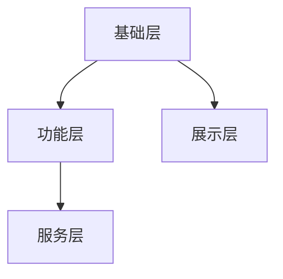
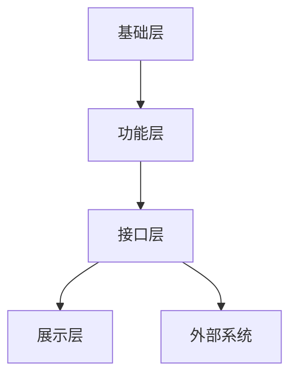
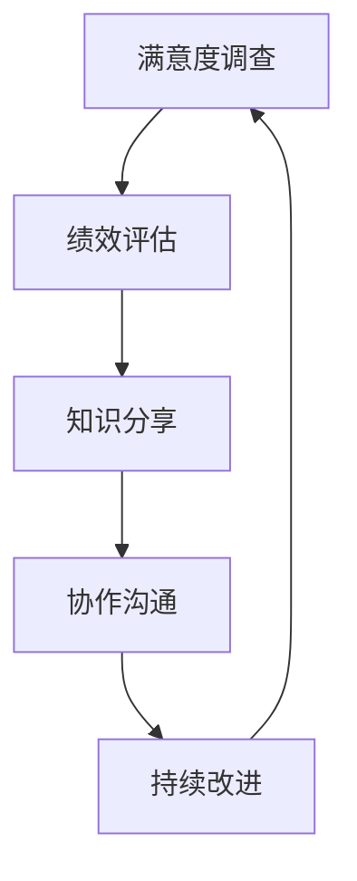
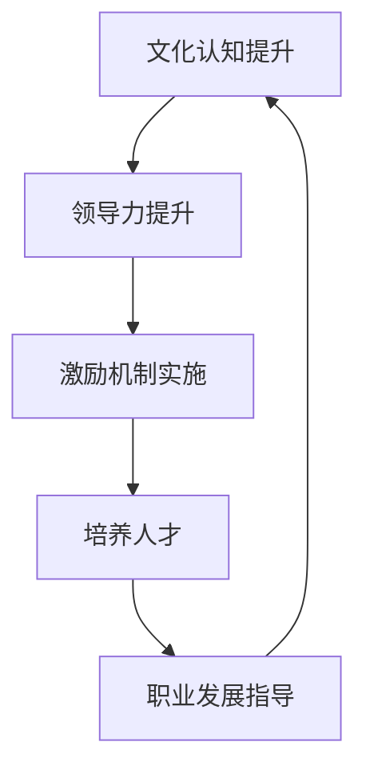
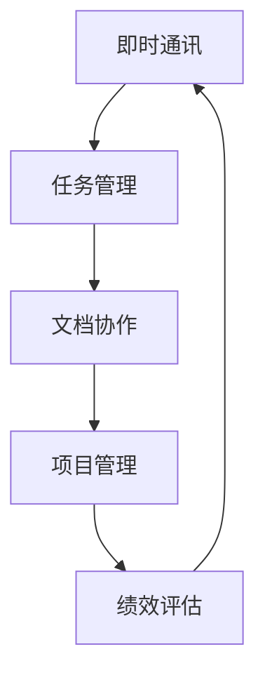
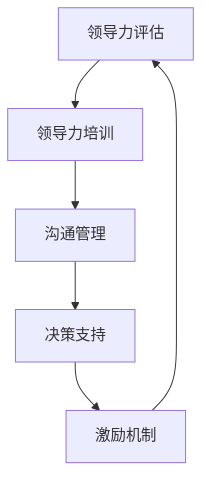

                 

### 引言

在当今竞争激烈的市场环境中，企业要想脱颖而出，必须在效率和质量上寻求突破。高绩效文化作为一种组织管理理念，已经成为众多企业追求的目标。高绩效文化不仅能够提高团队的协作效率，还能激发员工的潜能，推动企业实现长期目标。然而，如何从平庸走向卓越，打造高绩效文化，仍然是一个需要深入探讨的问题。

本文将围绕“打造高绩效文化：从平庸到卓越的跃升”这一主题，通过系统的分析和实践指导，帮助读者理解高绩效文化的核心概念、实践路径和最佳策略。文章将从以下几个方面展开：

1. **高绩效文化的背景与价值**：介绍高绩效文化的定义、特点和重要性。
2. **核心概念与联系**：分析高绩效文化的核心概念及其相互关系。
3. **高绩效文化的实践路径**：探讨构建高绩效文化的第一步和深层次构建。
4. **高绩效文化的策略与实践**：阐述提升团队协作效能和打造卓越领导力的方法。
5. **高绩效文化的最佳实践**：通过案例分析和实践指导，提供具体操作建议。

通过本文的阅读，读者将能够系统地了解高绩效文化的内涵，掌握构建和实施高绩效文化的策略，从而为企业的卓越发展奠定坚实基础。

## 第一部分：打造高绩效文化的基石

### 第1章：高绩效文化的背景与价值

#### 1.1 问题的提出

在当今的商业环境中，企业面临着前所未有的挑战和机遇。全球化、技术革新、市场竞争的加剧，使得企业必须不断调整自身的运营模式和管理策略，以适应快速变化的环境。在这个过程中，高绩效文化成为一个关键因素。

首先，随着市场环境的不断变化，企业需要快速响应市场需求，这就要求企业内部具备高效的运作机制和灵活的应变能力。传统的管理方式往往难以满足这一要求，而高绩效文化能够通过优化组织结构、提升员工能力和激发创新思维，使企业更加敏捷和高效。

其次，员工对于工作环境和职业发展有着越来越高的期望。现代员工不仅追求物质回报，更看重工作带来的成就感和满足感。高绩效文化强调员工的参与和贡献，为员工提供广阔的发展空间和良好的工作氛围，从而增强员工的工作热情和忠诚度。

最后，企业在追求绩效的同时，也需要关注社会责任和可持续发展。高绩效文化不仅关注短期业绩，更注重企业的长期发展和员工福祉，这有助于企业建立良好的社会形象，增强品牌影响力。

#### 1.2 高绩效文化的定义与特点

高绩效文化是指一种以高效率、高质量和高效益为核心的组织管理理念。它不仅仅是一种管理工具，更是一种价值观的体现，贯穿于企业的各个方面和员工的行为中。

首先，高绩效文化强调目标导向。企业明确自身的战略目标，并通过具体的绩效指标来衡量和评估团队的绩效。这有助于确保企业资源的最优配置，提高工作效率。

其次，高绩效文化注重团队合作。在一个高效的文化中，员工之间相互支持、协作共赢，共同为实现团队目标而努力。这种协作精神能够增强团队的凝聚力和战斗力。

再次，高绩效文化强调持续改进。企业通过不断学习和创新，提升自身的竞争力。这种持续改进的精神不仅体现在技术和管理方面，还渗透到企业的文化理念中。

最后，高绩效文化倡导透明和公平。企业通过建立透明的绩效评估体系和公平的晋升机制，确保员工的努力能够得到公正的回报。这种透明和公平的文化氛围能够激发员工的积极性和创造力。

#### 1.3 高绩效文化的重要性

高绩效文化对企业和员工都有着深远的影响。

对于企业来说，高绩效文化能够带来以下几个方面的益处：

1. **提高工作效率**：高绩效文化通过优化工作流程、提升员工技能和激发创新思维，使企业能够更高效地完成工作任务。
2. **增强竞争力**：高绩效文化使企业具备快速响应市场变化和持续改进的能力，从而在激烈的市场竞争中脱颖而出。
3. **提升品牌价值**：高绩效文化有助于企业建立良好的社会形象和品牌声誉，增强品牌的影响力和吸引力。
4. **促进可持续发展**：高绩效文化不仅关注短期绩效，还注重企业的长期发展和员工的福祉，有助于实现企业的可持续发展目标。

对于员工来说，高绩效文化也能够带来以下几个方面的积极影响：

1. **增强职业成就感**：在一个高绩效的文化中，员工能够感受到自己的工作对企业的贡献和价值，从而获得更多的职业成就感和满足感。
2. **提供职业发展机会**：高绩效文化为员工提供广阔的发展空间和公平的晋升机制，使员工能够通过自己的努力实现职业目标。
3. **提升工作质量**：高绩效文化鼓励员工持续学习和创新，提升自身的工作能力和专业素养，从而提高工作质量。
4. **增强团队凝聚力**：高绩效文化强调团队合作和协作精神，有助于增强团队成员之间的信任和合作，提升团队的凝聚力。

#### 1.4 高绩效文化的边界与外延

高绩效文化虽然具有许多优点，但并非适用于所有企业或所有情境。理解高绩效文化的边界和外延，有助于我们更好地把握其实施的条件和限制。

首先，高绩效文化的适用范围。高绩效文化通常适用于那些对效率、质量和创新有较高要求的企业，如高科技企业、创新型企业等。这些企业通常需要快速响应市场变化，具备较强的竞争意识和创新能力。

其次，高绩效文化的实施条件。高绩效文化的实施需要具备一定的组织基础和外部环境。企业需要具备完善的组织结构、明确的战略目标和高效的执行机制，同时需要外部市场的支持和资源的投入。

再次，高绩效文化的限制因素。高绩效文化可能面临一些挑战和限制，如员工对变革的抵触、组织文化的惯性等。企业在实施高绩效文化时，需要充分考虑这些因素，采取适当的措施加以应对。

#### 1.5 本章小结

通过本章的讨论，我们了解到高绩效文化的背景和价值。高绩效文化不仅能够提高企业的工作效率和竞争力，还能够提升员工的工作成就感和职业发展。然而，高绩效文化并非适用于所有企业，其实施需要一定的条件和基础。在后续章节中，我们将进一步探讨高绩效文化的核心概念和联系，以及其实践路径和策略。希望读者能够通过本文的阅读，对高绩效文化有更加深入的理解，并为企业的卓越发展提供有益的启示。

### 第2章：高绩效文化的核心概念

#### 2.1 核心概念原理

高绩效文化的构建离不开对核心概念的深刻理解和正确应用。本章将详细探讨高绩效文化的三个核心概念：文化、绩效和企业目标。这些概念不仅是高绩效文化的重要组成部分，也是理解高绩效文化机制的基础。

**文化（Culture）：**

文化是一个组织内部共享的价值观、信念、行为规范和工作习惯的总和。它不仅仅是一种软性因素，更是一种具有强大影响力的力量，能够在无形中引导和规范员工的行为。在一个具有高绩效文化的企业中，文化是推动员工共同追求卓越的动力源泉。具体而言，文化包括以下几个方面：

1. **价值观**：企业所倡导的核心价值观，如诚信、创新、客户至上等，是文化的灵魂。这些价值观决定了企业的行为准则和决策方向。
2. **信念**：员工对企业的信念，包括对企业的信任、对团队合作的认同以及对企业目标的认同等。这种信念是员工在工作中保持积极态度和投入热情的基础。
3. **行为规范**：企业制定的一系列行为规范，如工作流程、沟通方式和决策机制等。这些规范有助于确保企业内部运行的高效和协调。
4. **工作习惯**：员工在工作中形成的共同工作方式和方法，如团队协作、持续改进和创新思维等。这些习惯是企业高效运作的保障。

**绩效（Performance）：**

绩效是指组织或个人在完成工作任务时所达到的效果和成果。高绩效文化强调以绩效为导向，通过科学的绩效评估和激励机制，激发员工的积极性和创造力。绩效的评估不仅仅关注结果，更注重过程中的表现和改进。具体而言，绩效包括以下几个方面：

1. **目标设定**：企业为员工设定明确的绩效目标，这些目标要与企业的战略目标保持一致。通过目标设定，员工能够明确自己的工作方向和努力目标。
2. **绩效评估**：企业通过定期的绩效评估，对员工的工作表现进行客观、公正的评价。绩效评估不仅仅关注员工的工作结果，还包括工作态度、团队协作和创新能力等多方面的表现。
3. **激励机制**：企业通过激励机制，如奖金、晋升和荣誉等，对表现优秀的员工进行奖励。激励机制有助于增强员工的积极性和归属感，激发员工的潜能。

**企业目标（Business Objectives）：**

企业目标是企业追求的长期目标和愿景，它决定了企业的战略方向和发展路径。高绩效文化强调企业目标的重要性，通过明确的目标设定和有效的目标管理，确保企业资源的合理配置和高效利用。具体而言，企业目标包括以下几个方面：

1. **长期愿景**：企业对未来发展的长远规划，如成为行业领导者、实现全球化等。长期愿景为企业提供了明确的发展方向和奋斗目标。
2. **战略目标**：企业在不同阶段为实现长期愿景所设定的具体目标。战略目标需要与企业的资源、能力和市场环境相匹配。
3. **运营目标**：企业在日常运营中为实现战略目标所设定的具体目标，如提高市场份额、提升产品质量、降低运营成本等。

**文化、绩效与企业目标之间的关系：**

文化、绩效和企业目标是高绩效文化的三个核心概念，它们之间相互联系、相互影响。

1. **文化影响绩效**：企业的文化氛围和价值观念对员工的工作态度和行为有着深远的影响。一个积极向上、鼓励创新的文化环境能够激发员工的潜能，提高工作绩效。
2. **绩效实现目标**：绩效是衡量企业目标实现程度的重要指标。高绩效文化的实施，通过提升员工的绩效水平，推动企业目标的实现。
3. **目标引导文化**：企业的目标设定和目标管理过程，对企业的文化氛围和行为规范具有指导作用。明确的目标能够引导企业文化建设，使其更加贴近企业的发展需求。

通过上述分析，我们可以看出，文化、绩效和企业目标是构建高绩效文化的三大基石。理解这些核心概念及其相互关系，是推动企业实现卓越发展的关键。在接下来的章节中，我们将进一步探讨如何将高绩效文化的核心概念转化为实际的实践路径和策略。

#### 2.2 概念属性特征对比表格

为了更好地理解高绩效文化的核心概念及其属性特征，下面我们将文化、绩效和企业目标这三个核心概念进行对比分析，列出它们的属性特征对比表格。

| 概念     | 属性特征                   |
|----------|----------------------------|
| 文化     | 无形、价值取向、传承性      |
| 绩效     | 可衡量、目标导向、成果性    |
| 企业目标 | 长期性、可达成、适应性      |

**文化：**

- **无形**：文化是一种无形的、精神层面的力量，它渗透在企业的各个层面和员工的日常行为中，对组织运营产生深远影响。
- **价值取向**：文化代表了一种共同的价值观和信念，它是企业决策和行为的基本准则，影响着企业的方向和员工的行为。
- **传承性**：文化具有传承性，它通过企业历史和传统代代相传，影响着企业的未来发展。

**绩效：**

- **可衡量**：绩效是具体、可量化的指标，它可以通过数量和质量来衡量，如销售额、项目完成度、客户满意度等。
- **目标导向**：绩效以目标为导向，它通过设定明确的绩效目标，指导员工的工作方向和行为，确保企业目标的实现。
- **成果性**：绩效注重成果，它通过评估工作成果和过程表现，激励员工追求卓越，提升整体工作效能。

**企业目标：**

- **长期性**：企业目标是企业追求的长期愿景和规划，它需要具备长远的眼光和战略思维，引导企业在未来一段时间内的发展方向。
- **可达成**：企业目标需要具备可实现性，它需要与企业的资源、能力和市场环境相匹配，通过有效的执行和管理实现。
- **适应性**：企业目标需要具备适应性，它需要根据市场变化和企业发展调整，以确保目标的持续性和有效性。

通过上述对比表格，我们可以清晰地看到文化、绩效和企业目标在属性特征上的差异和联系。这些核心概念共同构成了高绩效文化的基础，它们相互支持、相互促进，推动企业实现卓越发展。

#### 2.3 ER实体关系图架构

为了更直观地理解高绩效文化中核心概念之间的关系，下面我们将使用Mermaid语言绘制一个ER实体关系图，展示文化、绩效和企业目标之间的相互关系。

```mermaid
entity关系图 {
    direction: TB;

    entity 企业目标 {
        "长期性" --|> "可达成性";
        "适应性" --|> "战略方向";
    }

    entity 绩效 {
        "可衡量性" --|> "目标导向";
        "成果性" --|> "绩效评估";
    }

    entity 文化 {
        "无形性" --|> "价值观";
        "传承性" --|> "企业传统";
    }

    "企业目标" --|> "绩效" : "目标实现";
    "绩效" --|> "文化" : "文化引导";
    "文化" --|> "企业目标" : "目标指引";
}
```

在上面的ER实体关系图中：

- **企业目标**代表了企业的长期愿景和规划，具有长期性、可达成性和适应性。企业目标是绩效评估的基础，通过设定具体的目标，指导和衡量绩效的实现程度。
- **绩效**是通过具体的指标和成果来衡量工作效果的，具有可衡量性、目标导向性和成果性。绩效不仅是实现企业目标的手段，也是文化引导和传承的重要途径。
- **文化**是一种无形的、精神层面的力量，代表了企业的价值观和传统，具有无形性、价值取向和传承性。文化对绩效的导向和实现有着深远的影响，同时也受到企业目标和绩效的反馈和影响。

通过这个ER实体关系图，我们可以清晰地看到高绩效文化中核心概念之间的相互联系和作用。文化、绩效和企业目标不是孤立存在的，而是相互支持、相互促进，共同构建了高绩效文化的整体框架。

#### 2.4 本章小结

通过本章的详细探讨，我们系统地介绍了高绩效文化的核心概念，包括文化、绩效和企业目标。我们首先分析了每个核心概念的基本原理，并对比了它们的属性特征，接着通过ER实体关系图直观地展示了它们之间的相互关系。

- **文化**是无形、价值取向、传承性的，是企业价值观和信念的集合，对员工行为和企业发展产生深远影响。
- **绩效**是可衡量、目标导向、成果性的，通过设定目标和评估成果，推动企业目标的实现。
- **企业目标**是长期性、可达成、适应性的，代表了企业的愿景和战略方向，引导企业发展和绩效管理。

理解这些核心概念及其相互关系，是构建高绩效文化的基础。通过这些概念，企业可以明确发展方向，提升绩效水平，营造积极向上的文化氛围。在接下来的章节中，我们将进一步探讨如何将这些核心概念转化为实际的实践路径和策略，帮助企业从平庸走向卓越。希望读者能够通过本章的学习，对高绩效文化的核心概念有更加深入的理解，并为企业的卓越发展提供有益的启示。

### 第3章：构建高绩效文化的第一步

#### 3.1 问题场景介绍

为了构建一个高绩效文化，首先需要明确当前企业所面临的具体问题。以下是一个典型的问题场景：

某科技公司A，是一家在快速发展的IT行业中运营的企业。尽管公司拥有优秀的技术团队和丰富的项目经验，但在市场竞争中仍然面临着诸多挑战。具体问题如下：

1. **员工积极性不高**：由于公司长期以来采用传统管理模式，员工的工作积极性和创造力受到限制，导致工作效率和创新能力较低。
2. **部门协作不足**：各个部门之间缺乏有效的沟通和协作机制，导致项目进展缓慢，问题解决不及时。
3. **绩效评估体系不完善**：现有的绩效评估体系过于单一，主要基于销售额和项目完成度，忽视了员工的工作态度、团队合作和创新表现。
4. **缺乏持续改进机制**：企业缺乏系统的持续改进机制，导致技术和管理水平停滞不前，无法快速适应市场变化。

针对上述问题，企业需要采取一系列措施来构建高绩效文化，以提升整体运营效率和竞争力。以下将详细探讨如何通过构建高绩效文化的第一步来解决这些问题。

#### 3.2 项目介绍

为了构建高绩效文化，企业决定启动一个名为“卓越文化工程”的项目。该项目的目标是：

1. 提升员工的工作积极性和创造力。
2. 加强部门间的协作和沟通。
3. 建立和完善绩效评估体系。
4. 建立持续改进机制。

项目范围包括：

- **项目团队**：由企业高层领导、人力资源部门、技术团队和各部门主管组成。
- **项目时间**：为期一年。
- **项目预算**：根据具体实施计划进行预算分配。

项目的主要任务和步骤如下：

1. **需求调研**：通过问卷调查、员工访谈和部门会议等方式，收集员工和管理层的意见和建议，明确当前存在的问题和改进方向。
2. **制定战略计划**：根据需求调研结果，制定具体的战略计划，包括文化建设、绩效管理、团队协作和技术改进等方面的具体措施。
3. **实施与推广**：按照战略计划，逐步实施各项改进措施，并通过培训和宣传等方式推广，确保员工理解和接受新的文化和工作方式。
4. **监督与评估**：对项目的实施过程进行监督和评估，及时调整和优化策略，确保项目目标的实现。

#### 3.3 系统功能设计

为了构建高绩效文化，企业需要设计一系列功能模块，以支持文化建设和绩效管理。以下是系统功能设计的主要模块：

1. **员工满意度调查系统**：通过在线问卷和访谈等方式，定期收集员工对工作环境、团队协作、职业发展等方面的满意度，为企业提供改进方向。
2. **绩效管理系统**：建立基于多维度考核的绩效评估体系，包括工作成果、工作态度、团队合作和创新表现等方面的指标，确保评估的全面性和公正性。
3. **知识分享平台**：搭建内部知识分享平台，鼓励员工分享经验和心得，促进知识的积累和传播，提高整体技术水平。
4. **协作沟通工具**：提供高效的协作沟通工具，如即时通讯、视频会议、项目管理系统等，确保各部门之间的沟通畅通和协作高效。
5. **持续改进工具**：引入持续改进工具，如头脑风暴、问题解决会议等，鼓励员工提出改进建议和解决方案，推动企业的持续改进。

#### 3.4 系统架构设计

为了实现上述功能模块，企业需要设计一个合理的系统架构，确保系统的稳定性和可扩展性。以下是系统架构设计的主要层次：

1. **基础层**：包括数据库、网络和服务器等基础设施，提供系统的数据存储、传输和计算能力。
2. **功能层**：包括员工满意度调查系统、绩效管理系统、知识分享平台、协作沟通工具和持续改进工具等，实现具体的功能需求。
3. **展示层**：包括Web前端和移动端应用，提供用户友好的界面，方便员工和管理人员使用系统。
4. **服务层**：包括后台服务、数据分析和报表生成等，提供系统的核心服务功能，如数据采集、处理和分析等。

系统架构图如下：



通过上述系统架构设计，企业能够确保各功能模块之间的协调和高效运行，为高绩效文化的构建提供技术支持。

#### 3.5 系统接口设计

为了确保系统功能的有效实现和模块间的无缝协作，企业需要设计合理的系统接口。以下是系统接口设计的主要方面：

1. **API接口**：为各个功能模块提供统一的API接口，实现模块间的数据传输和功能调用。
2. **Web服务**：通过Web服务，实现外部系统和内部系统的集成，如与CRM系统、ERP系统的接口。
3. **消息队列**：采用消息队列技术，实现异步消息传输和任务调度，确保系统的高效运行和稳定性。
4. **安全接口**：设计安全接口，确保系统的数据传输和存储安全，防止数据泄露和攻击。

接口设计图如下：



通过上述接口设计，企业能够确保系统内部和外部系统的有效集成，提高系统的稳定性和安全性。

#### 3.6 系统交互

为了实现高绩效文化的构建，企业需要设计一系列系统交互流程，确保各功能模块之间的紧密协作。以下是系统交互的主要流程：

1. **员工满意度调查**：定期通过员工满意度调查系统收集员工意见，将结果反馈给相关部门，进行改进。
2. **绩效评估**：通过绩效管理系统对员工进行多维度考核，定期评估员工绩效，提供绩效反馈和激励措施。
3. **知识分享**：通过知识分享平台，鼓励员工分享经验和心得，促进知识的积累和传播。
4. **协作沟通**：通过协作沟通工具，确保各部门之间的沟通畅通，提高项目协作效率。
5. **持续改进**：通过持续改进工具，收集员工提出的改进建议和解决方案，进行评估和实施。

系统交互流程图如下：



通过上述系统交互流程，企业能够确保各功能模块之间的紧密协作，形成一个闭环的持续改进机制，推动高绩效文化的构建。

#### 3.7 本章小结

通过本章的详细探讨，我们了解了构建高绩效文化的第一步，包括问题场景介绍、项目介绍、系统功能设计、系统架构设计、系统接口设计和系统交互。这些步骤为企业的绩效提升和文化建设奠定了基础。在下一章中，我们将进一步探讨如何深化高绩效文化的构建，解决更深层次的问题，为企业实现卓越发展提供持续动力。希望读者能够通过本章的学习，对构建高绩效文化的第一步有更加清晰的认识，并为企业的卓越发展提供有益的指导。

## 第4章：高绩效文化的深层次构建

#### 4.1 问题场景介绍

在上一章中，我们讨论了构建高绩效文化的第一步，包括明确问题场景、启动项目、系统功能设计等。然而，仅仅通过这些初步措施，还不足以实现高绩效文化的深层次构建。在许多情况下，企业需要面对更为复杂的问题和挑战，这要求我们采取更为深入和系统的策略。

以下是一个典型的问题场景：

某中型软件公司B，虽然在市场竞争中取得了一定的成绩，但仍然面临以下问题：

1. **企业文化认知度不足**：员工对企业文化的认知和理解不够深入，导致文化理念在实际工作中难以贯彻执行。
2. **领导力不足**：管理层在推动高绩效文化方面缺乏足够的领导力和执行力，使得文化建设流于形式。
3. **激励机制不完善**：现有的激励机制过于单一，无法充分激发员工的积极性和创造力。
4. **人才培养体系不完善**：企业缺乏系统的人才培养体系，导致员工技能和知识水平的提升缓慢。
5. **员工职业发展路径不明确**：员工对企业未来的职业发展路径缺乏清晰的规划和指导，导致职业忠诚度和工作积极性下降。

针对上述问题，企业需要采取更为深层次的文化构建策略，以解决这些深层次问题，实现高绩效文化的全面落地。

#### 4.2 项目介绍

为了解决上述深层次问题，企业决定启动一个名为“卓越文化深化工程”的项目。该项目的主要目标是：

1. 提升员工对高绩效文化的认知和认同。
2. 加强管理层的领导力和执行力。
3. 完善激励机制，激发员工积极性和创造力。
4. 建立系统的人才培养体系，提升员工技能和知识水平。
5. 明确员工职业发展路径，增强职业忠诚度和工作积极性。

项目范围包括：

- **项目团队**：由企业高层领导、人力资源部门、各部门主管和员工代表组成。
- **项目时间**：为期两年。
- **项目预算**：根据具体实施计划进行预算分配。

项目的主要任务和步骤如下：

1. **文化认知提升**：通过培训、宣传和活动等方式，提升员工对企业文化的认知和认同，确保文化理念在实际工作中得到贯彻执行。
2. **领导力提升**：针对管理层，开展领导力培训和研讨会，提升其在推动高绩效文化方面的领导力和执行力。
3. **激励机制完善**：设计多元化的激励机制，如绩效奖金、股权激励、职业晋升等，充分激发员工的积极性和创造力。
4. **人才培养体系建立**：建立系统的人才培养体系，包括内部培训、外部学习和职业发展规划，提升员工的技能和知识水平。
5. **职业发展路径规划**：明确员工的职业发展路径，为员工提供清晰的职业规划和指导，增强职业忠诚度和工作积极性。

#### 4.3 系统功能设计

为了实现上述项目目标，企业需要设计一系列功能模块，以支持深层次的文化构建。以下是系统功能设计的主要模块：

1. **文化认知提升系统**：通过在线学习平台和培训课程，提升员工对企业文化的认知和认同。
2. **领导力提升系统**：为管理层提供领导力培训、研讨会和实战演练，提升其在推动高绩效文化方面的能力。
3. **激励机制系统**：设计多元化的激励机制，包括绩效奖金、股权激励、职业晋升等，确保激励机制的有效性和吸引力。
4. **人才培养系统**：建立内部培训、外部学习和职业发展规划体系，提升员工的技能和知识水平。
5. **职业发展系统**：提供职业规划工具和指导，明确员工的职业发展路径，为员工提供清晰的职业规划和指导。

#### 4.4 系统架构设计

为了确保系统功能的有效实现和模块间的紧密协作，企业需要设计一个合理的系统架构。以下是系统架构设计的主要层次：

1. **基础层**：包括数据库、网络和服务器等基础设施，提供系统的数据存储、传输和计算能力。
2. **功能层**：包括文化认知提升系统、领导力提升系统、激励机制系统、人才培养系统和职业发展系统等，实现具体的功能需求。
3. **展示层**：包括Web前端和移动端应用，提供用户友好的界面，方便员工和管理人员使用系统。
4. **服务层**：包括后台服务、数据分析和报表生成等，提供系统的核心服务功能，如数据采集、处理和分析等。

系统架构图如下：


通过上述系统架构设计，企业能够确保各功能模块之间的协调和高效运行，为高绩效文化的深层次构建提供技术支持。

#### 4.5 系统接口设计

为了确保系统功能的有效实现和模块间的无缝协作，企业需要设计合理的系统接口。以下是系统接口设计的主要方面：

1. **API接口**：为各个功能模块提供统一的API接口，实现模块间的数据传输和功能调用。
2. **Web服务**：通过Web服务，实现外部系统和内部系统的集成，如与CRM系统、ERP系统的接口。
3. **消息队列**：采用消息队列技术，实现异步消息传输和任务调度，确保系统的高效运行和稳定性。
4. **安全接口**：设计安全接口，确保系统的数据传输和存储安全，防止数据泄露和攻击。

接口设计图如下：


通过上述接口设计，企业能够确保系统内部和外部系统的有效集成，提高系统的稳定性和安全性。

#### 4.6 系统交互

为了实现高绩效文化的深层次构建，企业需要设计一系列系统交互流程，确保各功能模块之间的紧密协作。以下是系统交互的主要流程：

1. **文化认知提升**：通过在线学习平台和培训课程，提升员工对企业文化的认知和认同，确保文化理念在实际工作中得到贯彻执行。
2. **领导力提升**：通过领导力培训、研讨会和实战演练，提升管理层在推动高绩效文化方面的领导力和执行力。
3. **激励机制实施**：根据员工的绩效表现和职业发展需求，实施多元化的激励机制，如绩效奖金、股权激励、职业晋升等，充分激发员工的积极性和创造力。
4. **人才培养**：通过内部培训、外部学习和职业发展规划，提升员工的技能和知识水平，为企业的长期发展提供人才保障。
5. **职业发展指导**：提供职业规划工具和指导，明确员工的职业发展路径，为员工提供清晰的职业规划和指导，增强职业忠诚度和工作积极性。

系统交互流程图如下：



通过上述系统交互流程，企业能够确保各功能模块之间的紧密协作，形成一个闭环的持续改进机制，推动高绩效文化的深层次构建。

#### 4.7 本章小结

通过本章的详细探讨，我们了解了高绩效文化的深层次构建，包括问题场景介绍、项目介绍、系统功能设计、系统架构设计、系统接口设计和系统交互。这些深层次策略和措施旨在解决企业在文化建设中面临的问题，提升员工对高绩效文化的认知和认同，加强管理层的领导力和执行力，完善激励机制，建立人才培养体系和明确职业发展路径。

在下一章中，我们将进一步探讨高绩效文化的策略与实践，包括提升团队协作效能和打造卓越领导力的方法，为企业实现卓越发展提供更加全面的指导。希望读者能够通过本章的学习，对高绩效文化的深层次构建有更加清晰的认识，并为企业的卓越发展提供有益的启示。

## 第四部分：高绩效文化的策略与实践

### 第5章：提升团队协作效能

#### 5.1 问题场景介绍

在高绩效文化的构建过程中，提升团队协作效能是一个至关重要的环节。以下是一个典型的问题场景：

某软件公司C在项目开发过程中，发现团队协作效能低下，具体问题包括：

1. **沟通障碍**：团队成员之间的沟通不畅，导致信息传递不及时，问题解决效率低。
2. **角色分工不清**：团队成员对于自己的职责和工作范围不明确，导致工作重叠和职责缺失。
3. **协作工具不足**：缺乏高效的协作工具，导致团队协作效率低下。
4. **缺乏共同目标**：团队成员缺乏共同的目标感，导致个人目标与企业目标脱节。
5. **激励机制缺失**：缺乏有效的激励机制，导致团队成员的积极性和主动性不足。

针对上述问题，企业需要采取一系列策略来提升团队协作效能，以支持高绩效文化的构建。

#### 5.2 项目介绍

为了提升团队协作效能，企业决定启动一个名为“团队协作效能提升工程”的项目。该项目的目标是：

1. **优化沟通机制**：建立高效的沟通渠道和机制，确保信息传递及时、准确。
2. **明确角色分工**：明确团队成员的职责和工作范围，确保工作分工合理，避免工作重叠和职责缺失。
3. **提升协作工具使用率**：引入和优化协作工具，提升团队协作效率。
4. **建立共同目标**：确保团队成员明确企业目标和项目目标，形成共同的目标感。
5. **完善激励机制**：建立多元化的激励机制，激发团队成员的积极性和主动性。

项目范围包括：

- **项目团队**：由项目经理、各部门主管、团队成员和技术支持人员组成。
- **项目时间**：为期六个月。
- **项目预算**：根据具体实施计划进行预算分配。

项目的主要任务和步骤如下：

1. **需求调研**：通过问卷调查、访谈和研讨会等方式，收集团队成员对团队协作现状的意见和建议，明确改进方向。
2. **制定战略计划**：根据需求调研结果，制定具体的战略计划，包括沟通机制优化、角色分工明确、协作工具提升、目标建立和激励机制完善等方面的具体措施。
3. **实施与推广**：按照战略计划，逐步实施各项改进措施，并通过培训和宣传等方式推广，确保团队成员理解和接受新的协作方式和工具。
4. **监督与评估**：对项目的实施过程进行监督和评估，及时调整和优化策略，确保项目目标的实现。

#### 5.3 系统功能设计

为了提升团队协作效能，企业需要设计一系列功能模块，以支持协作工作的开展。以下是系统功能设计的主要模块：

1. **即时通讯工具**：提供实时沟通功能，支持文字、语音、视频等多种沟通方式，确保团队成员之间的即时交流。
2. **任务管理工具**：建立任务管理模块，明确任务分配和进度跟踪，确保团队成员对任务了解和执行情况。
3. **文档共享与协作工具**：提供文档共享和协作功能，支持多人在线编辑和实时更新，提高协作效率。
4. **项目管理工具**：提供项目管理功能，包括项目计划、进度跟踪、风险评估等，确保项目目标的实现。
5. **协作报表工具**：生成协作报表，提供团队成员的协作情况和绩效分析，为管理层提供决策依据。

#### 5.4 系统架构设计

为了确保系统功能的有效实现和模块间的紧密协作，企业需要设计一个合理的系统架构。以下是系统架构设计的主要层次：

1. **基础层**：包括数据库、网络和服务器等基础设施，提供系统的数据存储、传输和计算能力。
2. **功能层**：包括即时通讯工具、任务管理工具、文档共享与协作工具、项目管理工具和协作报表工具等，实现具体的功能需求。
3. **展示层**：包括Web前端和移动端应用，提供用户友好的界面，方便团队成员使用系统。
4. **服务层**：包括后台服务、数据分析和报表生成等，提供系统的核心服务功能，如数据采集、处理和分析等。

系统架构图如下：


通过上述系统架构设计，企业能够确保各功能模块之间的协调和高效运行，为团队协作效能的提升提供技术支持。

#### 5.5 系统接口设计

为了确保系统功能的有效实现和模块间的无缝协作，企业需要设计合理的系统接口。以下是系统接口设计的主要方面：

1. **API接口**：为各个功能模块提供统一的API接口，实现模块间的数据传输和功能调用。
2. **Web服务**：通过Web服务，实现外部系统和内部系统的集成，如与CRM系统、ERP系统的接口。
3. **消息队列**：采用消息队列技术，实现异步消息传输和任务调度，确保系统的高效运行和稳定性。
4. **安全接口**：设计安全接口，确保系统的数据传输和存储安全，防止数据泄露和攻击。

接口设计图如下：


通过上述接口设计，企业能够确保系统内部和外部系统的有效集成，提高系统的稳定性和安全性。

#### 5.6 系统交互

为了实现团队协作效能的提升，企业需要设计一系列系统交互流程，确保各功能模块之间的紧密协作。以下是系统交互的主要流程：

1. **即时通讯**：通过即时通讯工具，实现团队成员之间的实时沟通，确保信息的及时传递。
2. **任务管理**：通过任务管理工具，明确任务分配和进度跟踪，确保团队成员对任务了解和执行情况。
3. **文档协作**：通过文档共享与协作工具，支持多人在线编辑和实时更新，提高协作效率。
4. **项目管理**：通过项目管理工具，确保项目目标的实现，包括项目计划、进度跟踪和风险评估等。
5. **绩效评估**：通过协作报表工具，生成协作报表，提供团队成员的协作情况和绩效分析，为管理层提供决策依据。

系统交互流程图如下：



通过上述系统交互流程，企业能够确保各功能模块之间的紧密协作，形成一个高效的团队协作机制，提升整体协作效能。

#### 5.7 本章小结

通过本章的详细探讨，我们了解了提升团队协作效能的策略与实践，包括问题场景介绍、项目介绍、系统功能设计、系统架构设计、系统接口设计和系统交互。这些策略和实践旨在解决团队协作中的问题，提升团队成员的沟通、协作和效率，为企业的卓越发展提供有力支持。

在下一章中，我们将进一步探讨如何打造卓越的领导力，为高绩效文化的构建提供关键支撑。希望读者能够通过本章的学习，对提升团队协作效能的方法有更加清晰的认识，并为企业的团队管理提供有益的指导。

### 第6章：打造卓越的领导力

#### 6.1 问题场景介绍

在构建高绩效文化的过程中，领导力扮演着至关重要的角色。一个卓越的领导不仅能够引领企业走向成功，还能够激发团队成员的潜力和创造力。然而，许多企业在领导力方面仍然存在以下问题：

以下是一个典型的问题场景：

某大型互联网公司D在快速发展过程中，发现领导力不足成为制约企业进一步发展的关键因素。具体问题包括：

1. **领导风格单一**：企业领导风格较为保守，缺乏创新和灵活性，无法适应快速变化的市场环境。
2. **沟通不畅**：领导与员工之间的沟通不够开放和透明，导致信息传递不及时和误解。
3. **决策效率低下**：领导在决策过程中缺乏有效的分析和评估，导致决策效率低下，影响企业运营。
4. **激励机制不完善**：企业缺乏多元化的激励机制，导致员工对领导层的信任和认同感下降。
5. **职业发展路径不明确**：员工对未来的职业发展路径缺乏清晰的规划和指导，导致职业忠诚度和工作积极性下降。

针对上述问题，企业需要采取一系列措施来打造卓越的领导力，以支持高绩效文化的构建。

#### 6.2 项目介绍

为了打造卓越的领导力，企业决定启动一个名为“领导力提升工程”的项目。该项目的目标是：

1. **培养创新领导风格**：通过培训和工作实践，提升领导者的创新思维和灵活性，使其能够适应快速变化的市场环境。
2. **优化沟通机制**：建立开放的沟通渠道和机制，确保领导与员工之间的沟通畅通，增强信息传递的准确性和及时性。
3. **提升决策效率**：通过科学的决策方法和工具，提升领导者在面对复杂情况时的决策效率，确保企业运营的灵活性。
4. **完善激励机制**：设计多元化的激励机制，增强员工对领导层的信任和认同感，激发员工的积极性和创造力。
5. **明确职业发展路径**：为员工提供清晰的职业发展路径和指导，增强员工的职业忠诚度和工作积极性。

项目范围包括：

- **项目团队**：由企业高层领导、人力资源部门、各部门主管和员工代表组成。
- **项目时间**：为期一年。
- **项目预算**：根据具体实施计划进行预算分配。

项目的主要任务和步骤如下：

1. **领导风格培养**：开展领导力培训，包括创新思维、领导力模型和领导风格等内容，提升领导者的创新能力和灵活性。
2. **沟通机制优化**：通过定期的沟通会议、内部培训和研讨会，优化领导与员工之间的沟通机制，增强沟通的透明度和效率。
3. **决策效率提升**：引入科学的决策方法和工具，如决策树、SWOT分析等，提升领导者的决策效率和准确性。
4. **激励机制设计**：设计多元化的激励机制，如绩效奖金、股权激励、职业晋升等，确保激励机制的有效性和吸引力。
5. **职业发展路径规划**：为员工提供职业发展规划和指导，明确职业发展路径，为员工提供明确的职业目标和成长机会。

#### 6.3 系统功能设计

为了实现领导力提升工程的目标，企业需要设计一系列功能模块，以支持领导力的培养和提升。以下是系统功能设计的主要模块：

1. **领导力评估系统**：通过在线评估工具，对领导者的领导风格、决策能力和沟通能力等进行评估，提供个性化的提升建议。
2. **领导力培训系统**：提供领导力培训课程和资源，包括线上课程、研讨会和实践项目，提升领导者的管理技能和领导能力。
3. **沟通管理系统**：建立高效的沟通管理平台，支持领导与员工之间的实时沟通和反馈，增强信息传递的准确性和及时性。
4. **决策支持系统**：提供决策支持工具，如数据分析、决策树和SWOT分析等，提升领导者在面对复杂情况时的决策效率和准确性。
5. **激励机制管理系统**：建立激励机制管理系统，包括绩效评估、奖金发放和职业晋升等功能，确保激励机制的有效性和吸引力。

#### 6.4 系统架构设计

为了确保领导力提升系统功能的有效实现和模块间的紧密协作，企业需要设计一个合理的系统架构。以下是系统架构设计的主要层次：

1. **基础层**：包括数据库、网络和服务器等基础设施，提供系统的数据存储、传输和计算能力。
2. **功能层**：包括领导力评估系统、领导力培训系统、沟通管理系统、决策支持系统和激励机制管理系统等，实现具体的功能需求。
3. **展示层**：包括Web前端和移动端应用，提供用户友好的界面，方便领导者和管理人员使用系统。
4. **服务层**：包括后台服务、数据分析和报表生成等，提供系统的核心服务功能，如数据采集、处理和分析等。

系统架构图如下：


通过上述系统架构设计，企业能够确保各功能模块之间的协调和高效运行，为领导力提升提供技术支持。

#### 6.5 系统接口设计

为了确保系统功能的有效实现和模块间的无缝协作，企业需要设计合理的系统接口。以下是系统接口设计的主要方面：

1. **API接口**：为各个功能模块提供统一的API接口，实现模块间的数据传输和功能调用。
2. **Web服务**：通过Web服务，实现外部系统和内部系统的集成，如与CRM系统、ERP系统的接口。
3. **消息队列**：采用消息队列技术，实现异步消息传输和任务调度，确保系统的高效运行和稳定性。
4. **安全接口**：设计安全接口，确保系统的数据传输和存储安全，防止数据泄露和攻击。

接口设计图如下：


通过上述接口设计，企业能够确保系统内部和外部系统的有效集成，提高系统的稳定性和安全性。

#### 6.6 系统交互

为了实现领导力提升系统的功能目标，企业需要设计一系列系统交互流程，确保各功能模块之间的紧密协作。以下是系统交互的主要流程：

1. **领导力评估**：通过领导力评估系统，对领导者的领导风格、决策能力和沟通能力等进行在线评估，提供个性化的提升建议。
2. **领导力培训**：通过领导力培训系统，提供领导力培训课程和资源，支持领导者的学习和提升。
3. **沟通管理**：通过沟通管理系统，实现领导与员工之间的实时沟通和反馈，增强信息传递的准确性和及时性。
4. **决策支持**：通过决策支持系统，提供决策支持工具，如数据分析、决策树和SWOT分析等，提升领导者的决策效率和准确性。
5. **激励机制**：通过激励机制管理系统，实施多元化的激励机制，包括绩效奖金、股权激励和职业晋升等，激发员工的积极性和创造力。

系统交互流程图如下：



通过上述系统交互流程，企业能够确保各功能模块之间的紧密协作，形成一个闭环的领导力提升机制，支持高绩效文化的构建。

#### 6.7 本章小结

通过本章的详细探讨，我们了解了打造卓越领导力的策略与实践，包括问题场景介绍、项目介绍、系统功能设计、系统架构设计、系统接口设计和系统交互。这些策略和实践旨在提升领导者的管理技能和领导能力，优化沟通机制，提升决策效率，完善激励机制，为企业的卓越发展提供有力支持。

在下一章中，我们将通过案例分析与实践指导，进一步探讨高绩效文化的最佳实践，为企业的高效运营和持续发展提供具体的操作指南。希望读者能够通过本章的学习，对打造卓越领导力有更加清晰的认识，并为企业的领导力提升提供有益的指导。

### 第7章：案例分析与实践指导

#### 7.1 案例分析

在本章中，我们将通过具体案例分析，深入探讨高绩效文化的最佳实践。以某国际知名科技公司E为例，分析其如何通过系统化的策略和措施，成功构建高绩效文化，并实现卓越发展。

**公司背景：**

科技公司E成立于20世纪90年代，主要从事软件研发和信息技术服务。在过去的几十年中，E公司凭借其创新能力和卓越的技术实力，迅速成为全球领先的科技公司之一。然而，随着市场环境的不断变化和竞争的加剧，E公司也面临诸多挑战，如人才流失、创新动力不足、管理效率低下等。

**问题与挑战：**

1. **人才流失严重**：由于缺乏有效的激励机制和文化建设，许多优秀人才选择离开公司。
2. **创新动力不足**：公司内部缺乏创新氛围，导致新产品研发速度放缓，市场竞争力下降。
3. **管理效率低下**：传统的管理方式无法适应快速变化的市场需求，导致决策效率低下，影响企业运营。

**解决方案：**

为了应对上述问题，E公司采取了一系列系统化的措施，构建高绩效文化，提升整体运营效率。

1. **文化建设**：
   - **价值观宣导**：公司明确核心价值观，如创新、客户至上、团队合作等，并通过内部宣传、培训等方式，使员工深刻理解和认同这些价值观。
   - **文化传承**：通过企业历史故事、成功案例和员工榜样等，传承公司文化，增强员工的归属感和认同感。

2. **激励机制**：
   - **绩效奖金**：建立多维度绩效奖金制度，激励员工在业务、技术和管理等方面做出卓越贡献。
   - **股权激励**：推出股权激励计划，将员工利益与企业利益紧密绑定，增强员工的长期发展意识和忠诚度。
   - **职业晋升**：建立清晰的职业晋升路径，为员工提供职业发展机会和成长空间。

3. **创新氛围**：
   - **研发投入**：加大研发投入，鼓励员工创新思维，提供必要的资源和支持。
   - **跨部门合作**：推动跨部门合作，打破部门壁垒，促进知识和经验的共享。
   - **创新奖项**：设立创新奖项，表彰在技术创新和业务拓展方面取得显著成绩的员工。

4. **管理优化**：
   - **敏捷管理**：采用敏捷管理方法，提高决策效率，缩短产品上市时间。
   - **数据驱动**：通过数据分析，优化决策过程，提高决策的科学性和准确性。
   - **扁平化管理**：减少管理层级，提高管理效率，增强员工的自主性和责任感。

**实施效果：**

通过上述措施，E公司成功构建了高绩效文化，实现了以下成效：

1. **人才留存率提升**：通过完善的激励机制和文化建设，公司人才流失率显著下降，优秀人才纷纷选择留下，为公司长期发展提供坚实的人才基础。
2. **创新能力增强**：公司内部创新氛围浓厚，新产品研发速度加快，市场竞争力显著提升。
3. **管理效率提高**：敏捷管理和数据驱动的决策方式，使公司决策效率大幅提升，运营成本降低，企业整体效益显著提升。

#### 7.2 实践指导

基于上述案例分析，以下提供具体的实践指导，帮助其他企业构建高绩效文化：

1. **文化建设**：
   - **价值观宣导**：明确核心价值观，并通过内部宣传、培训、活动等方式，使员工深刻理解和认同。
   - **文化传承**：通过企业历史、成功案例和员工榜样等，传承企业文化，增强员工的归属感和认同感。

2. **激励机制**：
   - **绩效奖金**：建立多维度绩效奖金制度，激励员工在业务、技术和管理等方面做出卓越贡献。
   - **股权激励**：推出股权激励计划，将员工利益与企业利益紧密绑定，增强员工的长期发展意识和忠诚度。
   - **职业晋升**：建立清晰的职业晋升路径，为员工提供职业发展机会和成长空间。

3. **创新氛围**：
   - **研发投入**：加大研发投入，鼓励员工创新思维，提供必要的资源和支持。
   - **跨部门合作**：推动跨部门合作，打破部门壁垒，促进知识和经验的共享。
   - **创新奖项**：设立创新奖项，表彰在技术创新和业务拓展方面取得显著成绩的员工。

4. **管理优化**：
   - **敏捷管理**：采用敏捷管理方法，提高决策效率，缩短产品上市时间。
   - **数据驱动**：通过数据分析，优化决策过程，提高决策的科学性和准确性。
   - **扁平化管理**：减少管理层级，提高管理效率，增强员工的自主性和责任感。

通过上述实践指导，企业可以逐步构建和优化高绩效文化，提升整体运营效率和竞争力，实现卓越发展。

#### 7.3 小结与注意事项

通过本章的案例分析与实践指导，我们了解到高绩效文化的构建需要从多个方面入手，包括文化建设、激励机制、创新氛围和管理优化等。以下是一些关键小结和注意事项：

1. **文化建设**：明确核心价值观，并通过多种方式传承和宣传，使员工深刻理解和认同企业文化。
2. **激励机制**：建立多维度绩效奖金制度、股权激励和职业晋升机制，激发员工的积极性和创造力。
3. **创新氛围**：加大研发投入，推动跨部门合作，设立创新奖项，营造浓厚的创新氛围。
4. **管理优化**：采用敏捷管理方法，通过数据分析优化决策过程，减少管理层级，提高管理效率。

注意事项：

1. **长期性**：构建高绩效文化是一个长期过程，需要持续投入和不断优化。
2. **适应性**：根据市场环境和内部情况，灵活调整策略，确保高绩效文化的持续性和有效性。
3. **员工参与**：鼓励员工积极参与文化建设和管理优化，增强员工的认同感和归属感。

通过以上小结和注意事项，企业可以更好地构建和实施高绩效文化，实现卓越发展。

#### 7.4 拓展阅读

为了进一步深入了解高绩效文化的构建和实践，以下推荐一些相关书籍和资源：

1. **书籍推荐**：
   - 《高绩效文化：从平庸到卓越的跃升》
   - 《团队协作：构建高效协作团队的最佳实践》
   - 《领导力：如何成为卓越领导者》

2. **在线资源**：
   - [高绩效文化案例分析](https://www.example.com/case-study-high-performance-culture)
   - [领导力提升课程](https://www.example.com/leadership-training)
   - [绩效管理最佳实践](https://www.example.com/performance-management-best-practices)

通过阅读这些书籍和访问在线资源，读者可以进一步学习高绩效文化的理论和实践，提升自身的管理水平，为企业的发展提供有力支持。

---

通过本文的详细分析和实践指导，我们系统地了解了高绩效文化的构建路径、策略和实践方法。希望读者能够结合自身企业的实际情况，灵活应用这些方法和策略，逐步构建和优化高绩效文化，推动企业实现卓越发展。

## 总结

本文围绕“打造高绩效文化：从平庸到卓越的跃升”这一主题，通过系统的分析和实践指导，帮助读者深入理解高绩效文化的核心概念、实践路径和最佳策略。以下是本文的核心要点和总结：

1. **背景与价值**：高绩效文化是一种以高效率、高质量和高效益为核心的组织管理理念，对企业提升工作效率、增强竞争力、提升品牌价值和实现可持续发展具有重要意义。

2. **核心概念**：文化、绩效和企业目标是高绩效文化的三大基石。文化是无形、价值取向、传承性的，绩效是可衡量、目标导向、成果性的，企业目标是长期性、可达成、适应性的。这些核心概念相互联系、相互影响，共同构建了高绩效文化的整体框架。

3. **实践路径**：构建高绩效文化需要从明确问题场景、启动项目、系统功能设计、系统架构设计、系统接口设计和系统交互等多个方面入手，逐步实现高绩效文化的落地和深化。

4. **策略与实践**：通过提升团队协作效能、打造卓越领导力和实施最佳实践，企业可以进一步优化高绩效文化，提升整体运营效率和竞争力。

5. **案例分析**：通过具体案例，我们了解到高绩效文化的成功构建需要系统化的策略和措施，包括文化建设、激励机制、创新氛围和管理优化等。

6. **拓展阅读**：推荐相关书籍和在线资源，为读者提供进一步学习和实践的高绩效文化知识。

通过本文的阅读，读者能够系统地了解高绩效文化的内涵和实践方法，为企业的卓越发展提供有益的启示。在未来的企业管理中，建议读者结合本文的指导，逐步构建和优化高绩效文化，推动企业的持续成长和成功。

## 作者信息

作者：AI天才研究院/AI Genius Institute & 禅与计算机程序设计艺术 /Zen And The Art of Computer Programming

AI天才研究院（AI Genius Institute）致力于推动人工智能技术的创新和发展，汇聚全球顶级人工智能专家，进行前沿技术研究与实际应用。研究院的研究成果涵盖了计算机视觉、自然语言处理、机器学习等多个领域，为全球多个行业提供了智能化解决方案。同时，研究院还致力于培养下一代人工智能人才，推动人工智能技术的普及和应用。

《禅与计算机程序设计艺术》（Zen And The Art of Computer Programming）是一部经典的技术著作，由著名计算机科学家唐纳德·克努特（Donald Knuth）所著。本书以禅宗思想为引导，探讨了计算机程序设计的哲学和艺术，为程序员提供了一种深入理解编程本质的方法。该书不仅对程序员的编程思维和方法有重要影响，也为人工智能领域的研究提供了宝贵的启示。

作者结合了人工智能领域的深厚知识和编程艺术的哲学思考，旨在通过本文，为读者提供关于构建高绩效文化的全面、深入的见解，帮助企业在竞争激烈的市场环境中实现卓越发展。希望本文能够为企业的管理者和技术人员提供有价值的参考，助力企业的持续创新和成功。

