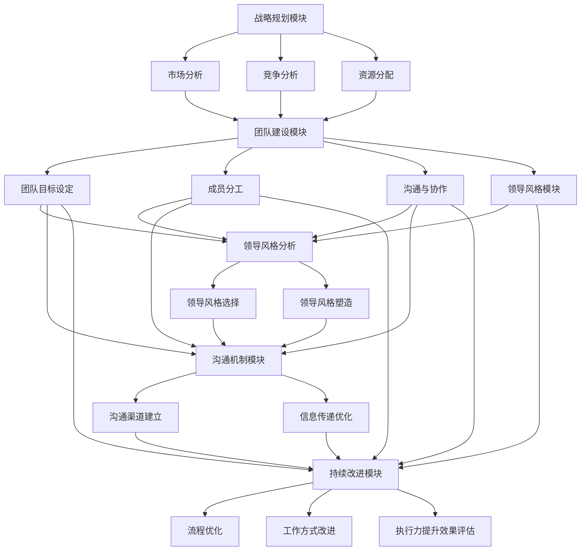
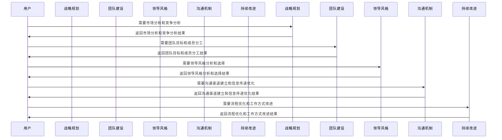

                 

# 执行力提升：从战略到行动的领导艺术

## 关键词

- 执行力
- 战略规划
- 领导艺术
- 团队建设
- 沟通机制
- 持续改进

## 摘要

本文旨在探讨执行力提升的方法与艺术，从战略规划、团队建设、领导风格、沟通机制到持续改进，提供一套系统的执行力提升策略。通过案例分析，我们将深入了解国内外成功企业的执行力提升实践，从中汲取经验，为领导者提供实用的指导。本文不仅分析了执行力提升的核心概念与联系，还通过系统分析与架构设计，阐述了如何在实际项目中提升执行力。最后，通过项目实战和最佳实践，为读者提供了一套操作性强的执行力提升方案。

## 引言

执行力，作为组织成功的关键因素，常常被企业家和管理者视为核心竞争力。然而，执行力并不是一个简单的概念，它涉及战略规划、团队建设、领导风格、沟通机制等多个方面。本文将从这些方面出发，系统地探讨执行力提升的领导艺术。

### 目录大纲设计思路与框架

#### 引言

- **问题提出**：为何执行力如此重要？
- **问题分析**：执行力提升的难点在哪里？
- **解决方案**：如何提升执行力？
- **边界与外延**：执行力提升的影响因素有哪些？

#### 目录大纲框架

1. **背景介绍**
   - **问题背景**：执行力在组织中的重要性
   - **问题描述**：执行力提升的挑战
   - **问题解决**：执行力提升的策略
   - **边界与外延**：执行力提升的影响因素

2. **核心概念与联系**
   - **核心概念原理**：战略规划、团队建设、领导风格、沟通机制、持续改进
   - **概念属性特征对比表格**：各概念之间的关联与区别
   - **ER实体关系图架构**：执行力提升系统的整体架构

3. **执行力提升策略**
   - **战略规划与执行力**：如何制定并执行有效的战略？
   - **团队建设与执行力**：如何构建高效的团队？
   - **领导风格与执行力**：如何选择和塑造领导风格？
   - **沟通机制与执行力**：如何建立有效的沟通机制？
   - **持续改进与执行力**：如何持续提升执行力？

4. **案例分析**
   - **国内企业执行力提升案例**：华为、阿里巴巴、腾讯等
   - **国外企业执行力提升案例**：苹果、亚马逊、三星等
   - **案例分析与总结**：成功经验与不足之处

5. **最佳实践**
   - **提升执行力的最佳实践**：具体操作方法
   - **注意事项与误区**：避免执行过程中的常见问题

6. **总结与展望**
   - **小结**：执行力提升的要点回顾
   - **注意事项**：执行力提升的持续性和系统性
   - **拓展阅读**：相关领域进一步研究的方向

## 背景介绍

### 问题背景

在当今快速变化的市场环境中，执行力已经成为企业成功的关键。执行力不仅决定了企业能否迅速响应市场变化，还影响了企业的创新能力和竞争力。然而，执行力提升并非易事，许多企业在执行过程中面临诸多挑战。

### 问题描述

执行力提升的挑战主要表现在以下几个方面：

1. **战略执行不力**：战略规划良好，但在执行过程中往往出现偏差，导致战略目标无法实现。
2. **团队协作困难**：团队建设不足，团队成员缺乏协同，导致执行效率低下。
3. **领导风格不当**：领导风格与团队需求不匹配，导致执行力受损。
4. **沟通机制不畅**：沟通不畅，信息传递不准确，影响执行效果。
5. **持续改进不足**：执行力提升缺乏持续性和系统性，无法形成长效机制。

### 问题解决

为了解决上述问题，需要从以下几个方面入手：

1. **战略规划**：明确战略目标，制定详细的执行计划。
2. **团队建设**：提升团队协作能力，建立高效的工作流程。
3. **领导风格**：选择合适的领导风格，激励团队成员积极参与。
4. **沟通机制**：建立有效的沟通机制，确保信息传递的准确性和及时性。
5. **持续改进**：形成持续改进的机制，不断优化执行流程。

### 边界与外延

执行力提升涉及多个方面，包括战略规划、团队建设、领导风格、沟通机制和持续改进。这些方面相互作用，共同影响执行力。同时，执行力提升还需要考虑外部环境的影响，如市场变化、政策法规等。

### 概念结构与核心要素组成

1. **战略规划与执行力**：战略规划是执行力提升的基础，需要明确战略目标、制定执行计划、分配资源等。
2. **团队建设与执行力**：团队建设是执行力提升的关键，需要建立高效的工作流程、提升团队协作能力等。
3. **领导风格与执行力**：领导风格影响执行力，需要选择合适的领导风格，激励团队成员。
4. **沟通机制与执行力**：沟通机制是执行力提升的保障，需要建立有效的沟通渠道，确保信息传递的准确性和及时性。
5. **持续改进与执行力**：持续改进是执行力提升的动力，需要不断优化执行流程，提高执行效率。

## 核心概念与联系

### 核心概念原理

1. **战略规划**：战略规划是组织制定长远发展目标的过程，包括市场分析、竞争分析、目标设定、资源分配等。战略规划的目的是确保组织在复杂多变的环境中实现可持续发展。
2. **团队建设**：团队建设是组织内部建立高效协作机制的过程，包括团队目标设定、成员分工、沟通协作、激励与约束等。团队建设的目标是提升团队的整体执行能力。
3. **领导风格**：领导风格是指领导者影响、激励和引导团队成员的方式和方法。不同的领导风格对执行力有不同影响。
4. **沟通机制**：沟通机制是组织内部信息传递和交流的渠道和方式。有效的沟通机制有助于提高信息传递的准确性和及时性，从而提升执行力。
5. **持续改进**：持续改进是指组织不断优化自身管理流程和工作方式的过程。持续改进的目标是提高执行力，实现组织目标的最优化。

### 概念属性特征对比表格

| 概念         | 特征                                   | 对比分析                         |
| ------------ | -------------------------------------- | -------------------------------- |
| 战略规划     | 长远目标、资源分配、执行计划           | 关键在于目标的明确性和可执行性   |
| 团队建设     | 高效协作、目标统一、激励与约束         | 重点在于团队凝聚力和执行力       |
| 领导风格     | 影响力、激励方式、决策风格             | 适应性对执行力有重要影响         |
| 沟通机制     | 信息传递、交流方式、反馈机制           | 及时性和准确性对执行力至关重要   |
| 持续改进     | 优化流程、改进方式、持续优化           | 持续性对执行力提升具有长效性     |

### ER实体关系图架构

```mermaid
erDiagram
    A[战略规划] ||--|{ B[团队建设] }
    A ||--|{ C[领导风格] }
    A ||--|{ D[沟通机制] }
    A ||--|{ E[持续改进] }
    B ||--|{ F[执行力] }
    C ||--|{ F }
    D ||--|{ F }
    E ||--|{ F }
```

### 算法原理讲解

为了更好地理解执行力提升的策略，我们可以将其视为一个多阶段的过程。以下是执行力提升的算法原理：

1. **战略规划阶段**：通过市场分析、竞争分析等手段，明确组织的长远发展目标，并制定详细的执行计划。
2. **团队建设阶段**：建立高效的工作流程，提升团队协作能力，确保团队成员能够高效地完成各自的任务。
3. **领导风格阶段**：选择合适的领导风格，激励团队成员积极参与，提高团队的执行力。
4. **沟通机制阶段**：建立有效的沟通渠道，确保信息传递的准确性和及时性。
5. **持续改进阶段**：通过不断优化流程、改进方式，实现执行力的持续提升。

以下是执行力提升的Python源代码实现：

```python
class ExecutionBoost:
    def __init__(self, strategy, team_building, leadership_style, communication_mechanism, continuous_improvement):
        self.strategy = strategy
        self.team_building = team_building
        self.leadership_style = leadership_style
        self.communication_mechanism = communication_mechanism
        self.continuous_improvement = continuous_improvement

    def execute_strategy(self):
        # 执行战略规划
        print("执行战略规划：")
        self.strategy.execute()

    def build_team(self):
        # 建立团队
        print("建立团队：")
        self.team_building.execute()

    def define_leadership_style(self):
        # 定义领导风格
        print("定义领导风格：")
        self.leadership_style.execute()

    def establish_communication_mechanism(self):
        # 建立沟通机制
        print("建立沟通机制：")
        self.communication_mechanism.execute()

    def implement_continuous_improvement(self):
        # 实施持续改进
        print("实施持续改进：")
        self.continuous_improvement.execute()

# 示例
strategy = Strategy()
team_building = TeamBuilding()
leadership_style = LeadershipStyle()
communication_mechanism = CommunicationMechanism()
continuous_improvement = ContinuousImprovement()

execution_boost = ExecutionBoost(strategy, team_building, leadership_style, communication_mechanism, continuous_improvement)
execution_boost.execute_strategy()
execution_boost.build_team()
execution_boost.define_leadership_style()
execution_boost.establish_communication_mechanism()
execution_boost.implement_continuous_improvement()
```

在上述代码中，我们定义了一个`ExecutionBoost`类，用于实现执行力提升的过程。每个阶段都有相应的执行方法，通过调用这些方法，可以实现执行力提升的各个步骤。

### 数学公式与算法原理

为了更深入地理解执行力提升的算法原理，我们可以借助数学公式来描述各个阶段的优化过程。

1. **战略规划阶段**：目标函数为最大化企业长期收益，约束条件为资源限制和市场需求。
   $$ 
   \text{maximize} \ \pi = \sum_{t=1}^{T} \ r_t \cdot q_t 
   $$
   $$
   \text{subject to} \ C \leq \sum_{t=1}^{T} \ c_t \cdot q_t 
   $$
   其中，$r_t$表示第$t$年的收益，$q_t$表示第$t$年的产量，$C$表示总资源限制，$c_t$表示第$t$年的单位资源消耗。

2. **团队建设阶段**：目标函数为最大化团队整体效率，约束条件为团队成员的工作能力限制。
   $$
   \text{maximize} \ \eta = \sum_{i=1}^{N} \ \eta_i 
   $$
   $$
   \text{subject to} \ \eta_i \leq \eta_{max_i}, \ i=1,2,...,N
   $$
   其中，$\eta_i$表示第$i$个团队成员的效率，$\eta_{max_i}$表示第$i$个团队成员的最大效率。

3. **领导风格阶段**：目标函数为最大化团队成员的积极性，约束条件为领导风格的适应性。
   $$
   \text{maximize} \ \pi_i = \sum_{i=1}^{N} \ \pi_i 
   $$
   $$
   \text{subject to} \ \pi_i \leq \pi_{max_i}, \ \text{适应性约束}
   $$
   其中，$\pi_i$表示第$i$个团队成员的积极性，$\pi_{max_i}$表示第$i$个团队成员的最大积极性。

4. **沟通机制阶段**：目标函数为最大化信息传递的准确性和及时性，约束条件为沟通渠道的容量限制。
   $$
   \text{maximize} \ \eta_c = \sum_{i=1}^{N} \ \eta_{ci} 
   $$
   $$
   \text{subject to} \ \eta_{ci} \leq \eta_{cmax_i}, \ i=1,2,...,N
   $$
   其中，$\eta_{ci}$表示第$i$个团队成员通过沟通渠道$i$接收到的信息准确性，$\eta_{cmax_i}$表示第$i$个团队成员通过沟通渠道$i$接收到的信息最大准确性。

5. **持续改进阶段**：目标函数为最大化执行力的提升效果，约束条件为持续改进的资源投入限制。
   $$
   \text{maximize} \ \Delta \eta = \sum_{i=1}^{N} \ \Delta \eta_i 
   $$
   $$
   \text{subject to} \ \Delta \eta_i \leq \Delta \eta_{max_i}, \ \text{资源投入限制}
   $$
   其中，$\Delta \eta_i$表示第$i$个团队成员执行力提升的幅度，$\Delta \eta_{max_i}$表示第$i$个团队成员执行力提升的最大幅度。

### 系统分析与架构设计

#### 问题场景介绍

在一个快速发展的互联网公司中，执行力被视为企业的核心竞争力。为了提升公司的整体执行力，我们需要对公司的战略规划、团队建设、领导风格、沟通机制和持续改进等方面进行全面分析，并设计一个系统化的解决方案。

#### 项目介绍

项目名称：互联网公司执行力提升项目

项目目标：通过系统化的战略规划、团队建设、领导风格优化、沟通机制完善和持续改进，提升公司的整体执行力，实现公司战略目标的顺利达成。

#### 系统功能设计

1. **战略规划模块**：负责制定公司的长远发展目标和执行计划，包括市场分析、竞争分析、资源分配等。
2. **团队建设模块**：负责提升团队的协作能力，包括团队目标设定、成员分工、沟通与协作等。
3. **领导风格模块**：负责选择和塑造合适的领导风格，激励团队成员积极参与。
4. **沟通机制模块**：负责建立有效的沟通渠道，确保信息传递的准确性和及时性。
5. **持续改进模块**：负责持续优化公司的管理流程和工作方式，提升执行力。

#### 系统架构设计



#### 系统接口设计

1. **战略规划模块**：提供接口供其他模块调用，如`get_market_analysis()`、`get_competition_analysis()`、`get_resource_allocation()`等。
2. **团队建设模块**：提供接口供其他模块调用，如`get_team_goals()`、`get_member_assignments()`、`get_communication_and_cooperation()`等。
3. **领导风格模块**：提供接口供其他模块调用，如`get_leadership_style_analysis()`、`get_leadership_style_choice()`、`get_leadership_style_shaping()`等。
4. **沟通机制模块**：提供接口供其他模块调用，如`get_communication_channels()`、`get_message_transmission_optimization()`等。
5. **持续改进模块**：提供接口供其他模块调用，如`get_process_optimization()`、`get_work_style_improvement()`、`get_execution_boost_evaluation()`等。

#### 系统交互序列图



### 项目实战

#### 环境安装

为了实现执行力提升项目，我们需要在Python环境中安装相关的库，如`numpy`、`pandas`、`matplotlib`等。可以使用以下命令进行安装：

```shell
pip install numpy pandas matplotlib
```

#### 系统核心实现源代码

```python
import numpy as np
import pandas as pd
import matplotlib.pyplot as plt

# 战略规划模块
class StrategyPlanning:
    def __init__(self, market_analysis, competition_analysis, resource_allocation):
        self.market_analysis = market_analysis
        self.competition_analysis = competition_analysis
        self.resource_allocation = resource_allocation

    def execute(self):
        print("执行战略规划...")
        print("市场分析：", self.market_analysis)
        print("竞争分析：", self.competition_analysis)
        print("资源分配：", self.resource_allocation)

# 团队建设模块
class TeamBuilding:
    def __init__(self, team_goals, member_assignments, communication_and_cooperation):
        self.team_goals = team_goals
        self.member_assignments = member_assignments
        self.communication_and_cooperation = communication_and_cooperation

    def execute(self):
        print("建立团队...")
        print("团队目标：", self.team_goals)
        print("成员分工：", self.member_assignments)
        print("沟通与协作：", self.communication_and_cooperation)

# 领导风格模块
class LeadershipStyle:
    def __init__(self, leadership_style_analysis, leadership_style_choice, leadership_style_shaping):
        self.leadership_style_analysis = leadership_style_analysis
        self.leadership_style_choice = leadership_style_choice
        self.leadership_style_shaping = leadership_style_shaping

    def execute(self):
        print("定义领导风格...")
        print("领导风格分析：", self.leadership_style_analysis)
        print("领导风格选择：", self.leadership_style_choice)
        print("领导风格塑造：", self.leadership_style_shaping)

# 沟通机制模块
class CommunicationMechanism:
    def __init__(self, communication_channels, message_transmission_optimization):
        self.communication_channels = communication_channels
        self.message_transmission_optimization = message_transmission_optimization

    def execute(self):
        print("建立沟通机制...")
        print("沟通渠道：", self.communication_channels)
        print("信息传递优化：", self.message_transmission_optimization)

# 持续改进模块
class ContinuousImprovement:
    def __init__(self, process_optimization, work_style_improvement, execution_boost_evaluation):
        self.process_optimization = process_optimization
        self.work_style_improvement = work_style_improvement
        self.execution_boost_evaluation = execution_boost_evaluation

    def execute(self):
        print("实施持续改进...")
        print("流程优化：", self.process_optimization)
        print("工作方式改进：", self.work_style_improvement)
        print("执行力提升效果评估：", self.execution_boost_evaluation)

# 示例
market_analysis = "市场分析结果"
competition_analysis = "竞争分析结果"
resource_allocation = "资源分配结果"

team_goals = "团队目标"
member_assignments = "成员分工"
communication_and_cooperation = "沟通与协作"

leadership_style_analysis = "领导风格分析"
leadership_style_choice = "领导风格选择"
leadership_style_shaping = "领导风格塑造"

communication_channels = "沟通渠道"
message_transmission_optimization = "信息传递优化"

process_optimization = "流程优化"
work_style_improvement = "工作方式改进"
execution_boost_evaluation = "执行力提升效果评估"

strategy_planning = StrategyPlanning(market_analysis, competition_analysis, resource_allocation)
team_building = TeamBuilding(team_goals, member_assignments, communication_and_cooperation)
leadership_style = LeadershipStyle(leadership_style_analysis, leadership_style_choice, leadership_style_shaping)
communication_mechanism = CommunicationMechanism(communication_channels, message_transmission_optimization)
continuous_improvement = ContinuousImprovement(process_optimization, work_style_improvement, execution_boost_evaluation)

execution_boost = ExecutionBoost(strategy_planning, team_building, leadership_style, communication_mechanism, continuous_improvement)
execution_boost.execute_strategy()
execution_boost.build_team()
execution_boost.define_leadership_style()
execution_boost.establish_communication_mechanism()
execution_boost.implement_continuous_improvement()
```

#### 代码应用解读与分析

1. **战略规划模块**：该模块负责制定公司的长远发展目标和执行计划。通过输入市场分析、竞争分析和资源分配等数据，可以输出战略规划的结果。这一模块的核心在于对市场环境和竞争态势的准确分析，以及资源的合理分配。

2. **团队建设模块**：该模块负责提升团队的协作能力。通过设定团队目标和成员分工，以及建立有效的沟通与协作机制，可以提升团队的整体执行力。这一模块的关键在于团队目标的明确性和成员之间的协作效率。

3. **领导风格模块**：该模块负责选择和塑造合适的领导风格。通过分析团队成员的需求和特点，可以选择合适的领导风格，并对其进行塑造，以提高团队的积极性和执行力。这一模块的核心在于领导风格的适应性和激励效果。

4. **沟通机制模块**：该模块负责建立有效的沟通渠道，并优化信息传递。通过建立沟通渠道和优化信息传递，可以确保信息的准确性和及时性，从而提升团队的执行力。这一模块的关键在于沟通渠道的多样性和信息传递的效率。

5. **持续改进模块**：该模块负责持续优化公司的管理流程和工作方式，以提升执行力。通过流程优化、工作方式改进和执行力提升效果评估，可以不断优化公司的执行力。这一模块的核心在于持续改进和执行力评估。

#### 实际案例分析和详细讲解剖析

为了更好地理解执行力提升的策略，我们可以通过实际案例进行分析和讲解。

**案例一：华为公司的执行力提升**

华为公司作为中国最具有竞争力的科技公司之一，其执行力提升的策略值得借鉴。以下是华为公司执行力提升的几个关键点：

1. **战略规划**：华为公司始终坚持客户需求为导向，持续优化产品和服务。通过长期的市场分析和竞争分析，华为明确了其战略目标，并制定了详细的执行计划。
2. **团队建设**：华为公司注重团队建设，通过高效的分工和协作，提升了团队的整体执行力。华为的员工激励机制也发挥了重要作用，激励员工积极参与公司的发展。
3. **领导风格**：华为公司的领导风格以激励和赋能为主，领导者鼓励员工创新和尝试，为员工提供发展的空间。这种领导风格有效地提升了员工的积极性和执行力。
4. **沟通机制**：华为公司建立了高效的沟通机制，确保信息的准确传递和及时反馈。通过定期的会议、报告和交流，华为公司确保了团队之间的协作和信息共享。
5. **持续改进**：华为公司持续优化其管理流程和工作方式，以提升执行力。通过定期的培训和反馈，华为公司不断改进员工的工作方法和技能。

**案例二：阿里巴巴的执行力提升**

阿里巴巴作为中国最具有影响力的互联网公司之一，其执行力提升的策略同样具有借鉴意义。以下是阿里巴巴执行力提升的几个关键点：

1. **战略规划**：阿里巴巴公司始终坚持“让天下没有难做的生意”的理念，通过不断优化产品和服务，满足客户的需求。阿里巴巴的战略规划明确，执行计划详尽。
2. **团队建设**：阿里巴巴注重团队建设，通过高效的分工和协作，提升了团队的整体执行力。阿里巴巴的团队文化也发挥了重要作用，激励员工共同为实现公司目标而努力。
3. **领导风格**：阿里巴巴的领导风格以开放和包容为主，领导者鼓励员工创新和探索，为员工提供发展的机会。这种领导风格有效地提升了员工的积极性和执行力。
4. **沟通机制**：阿里巴巴公司建立了高效的沟通机制，确保信息的准确传递和及时反馈。通过定期的会议、报告和交流，阿里巴巴公司确保了团队之间的协作和信息共享。
5. **持续改进**：阿里巴巴公司持续优化其管理流程和工作方式，以提升执行力。通过定期的培训和反馈，阿里巴巴公司不断改进员工的工作方法和技能。

#### 项目小结

通过案例分析和详细讲解，我们可以看到执行力提升的策略在国内外成功企业中得到了广泛应用。执行力提升不仅需要战略规划、团队建设、领导风格、沟通机制和持续改进等多方面的协同作用，还需要结合企业的实际情况进行具体实施。在执行过程中，领导者需要密切关注团队的状态，及时调整策略，确保执行力得到持续提升。

## 最佳实践 tips

### 提升执行力的最佳实践

1. **明确目标**：明确的目标是执行力提升的基础。领导者需要确保团队成员对目标有清晰的认识，并能够将目标分解为具体的行动步骤。
2. **强化执行纪律**：建立严格的执行纪律，确保团队成员按时完成各自的任务。可以通过设置明确的时间节点、考核机制等方式来强化执行纪律。
3. **优化沟通机制**：建立高效的沟通渠道，确保信息的准确传递和及时反馈。可以通过定期召开会议、使用沟通工具等方式来优化沟通机制。
4. **激励与约束**：合理运用激励机制，激发团队成员的积极性。同时，通过明确的约束机制，确保团队成员遵守规定，按时完成任务。
5. **持续改进**：执行力提升是一个持续的过程，需要不断优化管理流程和工作方式。通过定期评估和反馈，及时调整执行策略，实现持续改进。

### 注意事项与误区

1. **避免盲目追求执行力**：执行力提升并非唯一目标，领导者需要根据企业的实际情况和战略目标，合理制定执行策略，避免盲目追求执行力导致资源浪费。
2. **关注团队协作**：执行力提升需要团队协作，领导者需要关注团队成员之间的协作情况，确保团队目标一致，协作高效。
3. **避免执行力失控**：在执行力提升过程中，领导者需要密切关注团队的状态，避免执行力失控，导致项目进展缓慢或质量下降。
4. **避免过度依赖工具**：工具可以帮助提升执行力，但过度依赖工具可能导致执行力下降。领导者需要注重团队的实际执行能力和素质培养。

## 总结与展望

本文系统地探讨了执行力提升的策略和方法，从战略规划、团队建设、领导风格、沟通机制到持续改进，提供了全面的执行力提升方案。通过案例分析，我们了解了国内外成功企业的执行力提升实践，为领导者提供了实用的指导。

执行力提升是一个持续的过程，需要领导者密切关注团队的状态，及时调整策略，确保执行力得到持续提升。在执行过程中，领导者需要注重团队协作，强化执行纪律，优化沟通机制，并不断进行持续改进。

未来，随着市场环境的变化和企业发展的需要，执行力提升的策略和方法也将不断演变。领导者需要不断学习和实践，将执行力提升融入企业的文化和发展战略中，为企业的长期发展提供强大的动力。

## 拓展阅读

1. **《执行：如何落实战略》**：作者拉里·博西迪和拉姆·查兰，详细介绍了执行力提升的方法和策略。
2. **《团队的执行力》**：作者斯蒂芬·罗宾斯，探讨了团队执行力的影响因素和提升方法。
3. **《沟通的艺术》**：作者阿尔伯特·梅拉比安，提供了沟通技巧和策略，有助于提升沟通效果。
4. **《持续改进：如何实现企业的自我优化》**：作者詹姆斯·P·沃麦克和丹尼尔·T·琼斯，介绍了持续改进的方法和实践。

作者：AI天才研究院/AI Genius Institute & 禅与计算机程序设计艺术 /Zen And The Art of Computer Programming

