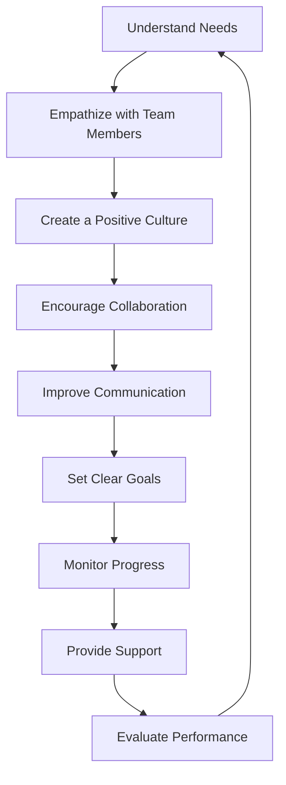

                 

**Step 1: Introduction Chapter**

### 1.1.1 Digital Age Challenges

The digital age is marked by rapid technological advancements and the widespread adoption of digital tools and systems. These advancements have transformed various aspects of our lives, from communication and entertainment to work and education. However, this rapid growth comes with its own set of challenges.

One of the primary challenges is the increasing reliance on technology, which can lead to a loss of human connection and empathy. In an era where algorithms and automation are taking over routine tasks, there is a risk of dehumanizing the workplace and reducing human interactions to mere data points.

Another challenge is the disparity between technological progress and social development. While technology continues to evolve at a rapid pace, societal structures and values often lag behind. This creates a gap where technology outstrips our ability to effectively use and govern it, leading to issues such as data privacy, security, and ethical considerations.

Finally, there is the challenge of balancing innovation with sustainability. The pursuit of technological progress often comes at the cost of environmental degradation and resource depletion. This calls for a reevaluation of our priorities and the adoption of more sustainable practices.

### 1.1.2 Lack of Humanism

In the pursuit of efficiency and productivity, organizations often prioritize technological solutions over human needs. This can manifest in several ways:

1. **Workplace Automation**: While automation can improve efficiency, over-reliance on technology can lead to job displacement and a reduction in human interaction. This can result in a lack of personal connection and a loss of the human touch.

2. **Data-Driven Decisions**: Making decisions based solely on data can overlook the nuances of human behavior and emotion. This can lead to misguided strategies and a lack of empathy in decision-making processes.

3. **Rapid Change**: The fast-paced nature of technological advancements can create a culture of constant change and stress, leaving little room for reflection and personal growth.

4. **Lack of Support**: In a technology-driven environment, there may be a reduced focus on employee well-being and personal development. This can lead to burnout and a lack of motivation among employees.

### 1.1.3 Importance of Balance

Balancing technology with humanity is crucial for several reasons:

1. **Enhancing Human Experience**: Technology should enhance, not replace, human experiences. By integrating technology in ways that support and augment human interactions, we can create more meaningful and fulfilling experiences.

2. **Promoting Innovation**: A balanced approach allows for the creative exploration of new ideas and solutions. When technology and humanity are in harmony, innovative solutions can emerge that are both effective and human-centered.

3. **Sustaining Human Connection**: In a world where technology plays a central role, it's essential to maintain human connection and empathy. This helps create a more inclusive and supportive environment, where all individuals feel valued and understood.

4. **Building Ethical Foundations**: A balance between technology and humanity is essential for building ethical foundations in the digital age. It ensures that technological advancements are guided by a set of values that prioritize human well-being.

In conclusion, achieving a balance between technology and humanity is not just a matter of practicality, but a moral imperative. By recognizing the importance of this balance, we can create a future where technology enriches our lives and strengthens our human connections.

**Step 2: Core Concept and Framework**

### 2.1.1 Attributes and Characteristics of Technology

Technology encompasses a wide range of tools, systems, and processes designed to solve problems and improve efficiency. To understand the impact of technology on humanity, it's essential to explore its key attributes and characteristics.

**1. Definition and Classification:**

Technology can be broadly classified into several categories, including:

- **Information Technology (IT)**: This involves the use of computers, software, and networks to store, process, and transmit data.
- **Communications Technology**: This includes technologies such as the internet, smartphones, and social media platforms that enable communication and information exchange.
- **Manufacturing Technology**: This encompasses machinery and processes used in the production of goods, including automation and robotics.
- **Biotechnology**: This involves the use of living organisms and biological systems to develop products and processes.

**2. Development Trends:**

Technological development is characterized by rapid innovation and constant evolution. Some key trends include:

- **Artificial Intelligence (AI)**: AI technologies, such as machine learning and natural language processing, are transforming industries and creating new opportunities.
- **Internet of Things (IoT)**: IoT connects everyday objects to the internet, enabling the collection and exchange of data.
- **Blockchain**: Blockchain technology offers secure and transparent ways to record transactions and manage data.

**3. Advantages and Disadvantages:**

While technology offers numerous advantages, it also comes with its drawbacks:

- **Advantages:**
  - **Efficiency**: Technology can streamline processes and improve productivity.
  - **Access to Information**: The internet and digital tools provide easy access to information and resources.
  - **Convenience**: Technologies like smartphones and ride-sharing apps have made daily life more convenient.

- **Disadvantages:**
  - **Dependency**: Over-reliance on technology can lead to a loss of critical skills and human connections.
  - **Security Concerns**: The increased use of digital technologies has raised concerns about data privacy and security.
  - **Environmental Impact**: Some technologies, such as those used in manufacturing and energy production, can contribute to environmental degradation.

### 2.2.1 Concepts and Characteristics of Humanism

Humanism is a philosophical and ethical approach that emphasizes the value and agency of human beings, focusing on human well-being, freedom, and rationality. To understand how humanism relates to technology, it's important to explore its key concepts and characteristics.

**1. Definition:**

Humanism can be defined as a belief in the inherent worth and potential of human beings, coupled with a commitment to using reason and critical thinking to address societal challenges.

**2. Importance:**

Humanism plays a crucial role in the digital age by promoting a balanced approach to technological development. It highlights the importance of considering the impact of technology on human well-being and ethical considerations.

**3. Implementation Pathways:**

To integrate humanism into technological practices, several pathways can be considered:

- **Ethical Frameworks**: Developing ethical guidelines and frameworks to govern the use of technology, ensuring it aligns with human values and principles.
- **Human-Centered Design**: Incorporating human needs and perspectives into the design and development of technological systems and products.
- **Empathy and Emotional Intelligence**: Fostering empathy and emotional intelligence among technology developers and users to create more inclusive and compassionate digital environments.

### 2.3 Interaction Between Technology and Humanity

The interaction between technology and humanity is complex and multifaceted. Understanding how they influence and impact each other is crucial for achieving a balanced approach in the digital age.

**1. Impact of Technology on Humanity:**

Technology has a profound impact on human behavior, interactions, and well-being. Some key points to consider include:

- **Change in Work Dynamics**: Automation and AI are transforming traditional job roles, leading to changes in the nature of work and the skills required.
- **Shift in Social Interactions**: The rise of social media and digital communication has changed the way people interact, both positively and negatively.
- **Privacy and Security Concerns**: The collection and analysis of personal data by technology companies raise important ethical and privacy concerns.

**2. Feedback from Humanity to Technology:**

Human feedback is essential in shaping the development and implementation of technology. This feedback can come in various forms:

- **User Needs and Preferences**: Understanding user needs and preferences helps developers create technology that meets human needs and enhances user experience.
- **Ethical Considerations**: Human values and ethical considerations play a crucial role in guiding the development and use of technology, ensuring it aligns with human values and principles.
- **Innovation and Creativity**: Human creativity and problem-solving skills drive technological innovation, leading to new and innovative solutions.

**3. Strategies for Achieving Balance:**

Achieving a balance between technology and humanity requires a strategic approach. Some key strategies include:

- **Human-Centered Design**: Prioritizing human needs and perspectives in the design and development of technological systems and products.
- **Ethical Frameworks**: Developing ethical guidelines and frameworks to govern the use of technology, ensuring it aligns with human values and principles.
- **Continuous Feedback and Improvement**: Encouraging continuous feedback and improvement processes to ensure that technology evolves in ways that align with human needs and values.

In conclusion, the interaction between technology and humanity is a dynamic and complex process. By understanding and addressing the impact of technology on humanity and leveraging human feedback, we can achieve a balanced approach that promotes human well-being and technological advancement.

**Step 3: Human-Centric Leadership Principles**

### 3.1.1 Principles of Human-Centric Leadership

Human-centric leadership is a leadership approach that prioritizes the well-being and development of individuals within an organization. This approach emphasizes empathy, collaboration, and communication as core principles. Let's explore each principle in more detail:

**Empathy**

Empathy is the ability to understand and share the feelings of others. In a human-centric leadership framework, empathy is crucial for building strong relationships and fostering a positive organizational culture. Leaders who demonstrate empathy can better understand the needs and concerns of their team members, leading to increased trust and collaboration.

**Collaboration**

Collaboration is the practice of working together to achieve common goals. Human-centric leadership encourages a collaborative environment where team members are encouraged to share ideas, contribute to decision-making processes, and work together to solve problems. This collaborative approach fosters innovation, enhances problem-solving capabilities, and promotes a sense of ownership and accountability among team members.

**Communication**

Effective communication is the cornerstone of human-centric leadership. Leaders who prioritize open and transparent communication create an environment where information flows freely, feedback is encouraged, and team members feel heard and valued. This helps to build trust, improve teamwork, and ensure that everyone is aligned with the organization's goals and objectives.

### 3.1.2 Mermaid Flowchart of the Leadership Process

To illustrate the human-centric leadership process, we can use a Mermaid flowchart. The flowchart will outline the steps involved in practicing human-centric leadership, from understanding the needs of team members to fostering collaboration and open communication.

In this flowchart:

- **A**: Understand Needs - Leaders begin by understanding the needs and concerns of their team members.
- **B**: Empathize with Team Members - Leaders demonstrate empathy and show genuine concern for the well-being of their team members.
- **C**: Create a Positive Culture - Leaders foster a positive organizational culture that values empathy, collaboration, and open communication.
- **D**: Encourage Collaboration - Leaders promote collaboration by encouraging team members to share ideas and work together.
- **E**: Improve Communication - Leaders prioritize effective communication to ensure that information flows freely and team members feel heard and valued.
- **F**: Set Clear Goals - Leaders set clear goals and objectives that align with the organization's vision and values.
- **G**: Monitor Progress - Leaders monitor progress towards goals and provide support as needed.
- **H**: Provide Support - Leaders provide support and resources to help team members succeed.
- **I**: Evaluate Performance - Leaders evaluate performance and provide feedback to help team members grow and develop.
- **A**: Understand Needs - The process continues as leaders revisit and understand the needs of their team members, ensuring a continuous feedback loop.

By following this flowchart, leaders can create a human-centric leadership approach that fosters empathy, collaboration, and effective communication, ultimately leading to a more engaged and productive team.

### 3.1.3 The Importance of Human-Centric Leadership

Human-centric leadership is essential in today's rapidly changing digital landscape. Here are some key reasons why this approach is vital for organizational success:

1. **Enhancing Employee Engagement**

Human-centric leadership fosters a sense of belonging and purpose among employees. When team members feel valued and supported, they are more likely to be engaged and motivated, leading to increased productivity and job satisfaction.

2. **Driving Innovation**

A collaborative and inclusive environment encouraged by human-centric leadership stimulates innovation. By empowering team members to share ideas and work together, organizations can tap into a diverse range of perspectives and expertise, leading to innovative solutions and breakthroughs.

3. **Improving Team Collaboration**

Human-centric leadership emphasizes the importance of collaboration and teamwork. By fostering a culture of openness, trust, and mutual respect, leaders can enhance team collaboration, leading to better problem-solving and decision-making.

4. **Building Stronger Relationships**

Empathy and effective communication are at the heart of human-centric leadership. These principles help leaders build stronger relationships with their team members, creating a more positive and supportive organizational culture.

5. **Supporting Employee Development**

Human-centric leadership prioritizes the development and growth of employees. By providing support, resources, and opportunities for learning and development, leaders can help their team members reach their full potential.

In conclusion, human-centric leadership is a crucial component of successful organizational leadership in the digital age. By prioritizing empathy, collaboration, and effective communication, leaders can create a positive and engaging work environment that drives innovation, collaboration, and employee engagement.

**Step 4: Case Studies**

### 4.1 Case Study 1: Google's Human-Centric Leadership

Google is a prime example of an organization that has successfully implemented human-centric leadership principles. Under the leadership of former CEO Larry Page and current CEO Sundar Pichai, Google has fostered a culture that values innovation, collaboration, and empathy.

**1. Empowering Employees:**

Google's leadership has a strong commitment to empowering employees. The company encourages its employees to pursue innovative ideas and take risks, providing them with the resources and support they need to succeed. This culture of innovation has led to several groundbreaking products and services, including Google Search, Gmail, and Google Maps.

**2. Encouraging Collaboration:**

Google's leadership emphasizes collaboration and teamwork. The company has created a flexible and open work environment that encourages employees to share ideas, work across teams, and collaborate on projects. This collaborative approach has fostered a sense of ownership and accountability among employees, leading to improved problem-solving and decision-making.

**3. Fostering Empathy:**

Google's leadership also prioritizes empathy and emotional intelligence. The company provides resources and training to help employees develop their empathy and emotional intelligence skills, fostering a positive and supportive organizational culture. This focus on empathy has helped Google build strong relationships with its employees, customers, and partners.

**4. Results:**

Google's human-centric leadership approach has led to significant success and growth. The company has consistently ranked among the world's most valuable and innovative companies. Its human-centric approach has also helped Google attract and retain top talent, ensuring the company remains at the forefront of technological innovation.

### 4.2 Case Study 2: Patagonia's Human-Centric Leadership

Patagonia, an outdoor clothing and gear company, is another excellent example of an organization that embraces human-centric leadership principles. Founded by Yvon Chouinard, Patagonia has long been known for its commitment to environmental sustainability and social responsibility.

**1. Environmental Stewardship:**

Patagonia's leadership is committed to environmental stewardship and sustainability. The company has implemented several initiatives to reduce its environmental impact, including using recycled materials, reducing waste, and supporting environmental conservation efforts. This commitment to sustainability is reflected in the company's core values and is a key driver of its human-centric leadership approach.

**2. Social Responsibility:**

In addition to environmental sustainability, Patagonia's leadership also emphasizes social responsibility. The company supports various social and environmental initiatives, such as providing fair wages and working conditions for its employees and supporting local communities. This focus on social responsibility helps create a positive and inclusive work environment, fostering a sense of purpose and fulfillment among employees.

**3. Empowering Employees:**

Patagonia's leadership empowers its employees to take initiative and make decisions that align with the company's values. The company encourages its employees to engage in leadership roles and pursue their passions, fostering a culture of innovation and collaboration. This empowerment has led to increased employee engagement and a strong sense of loyalty to the company.

**4. Results:**

Patagonia's human-centric leadership approach has been a key factor in its success and growth. The company has achieved significant market share in the outdoor clothing and gear industry, while also becoming a leader in environmental sustainability and social responsibility. Its human-centric approach has helped Patagonia attract and retain top talent, ensuring the company remains a positive force for change in the outdoor industry.

### 4.3 Case Study 3: Zappos' Human-Centric Leadership

Zappos, an online shoe and clothing retailer, is known for its exceptional customer service and strong company culture. Under the leadership of Tony Hsieh, Zappos has implemented a human-centric leadership approach that focuses on employee satisfaction and customer happiness.

**1. Employee-Centric Culture:**

Zappos' leadership has created an employee-centric culture that emphasizes personal growth, development, and job satisfaction. The company offers unique benefits and perks, such as free lunches, on-site fitness centers, and unlimited paid time off. This focus on employee well-being has led to high employee satisfaction and retention rates.

**2. Empowerment and Autonomy:**

Zappos' leadership empowers its employees to make decisions and take ownership of their work. This autonomy allows employees to provide exceptional customer service and create innovative solutions to challenges. The company's culture of empowerment has been a key factor in its success, fostering a sense of ownership and accountability among employees.

**3. Customer-Centric Approach:**

Zappos' leadership also prioritizes customer satisfaction. The company has implemented a customer-centric approach that focuses on providing personalized service and creating a positive customer experience. This customer-centric approach has helped Zappos build a loyal customer base and become a leader in the online retail industry.

**4. Results:**

Zappos' human-centric leadership approach has led to significant success and growth. The company has achieved strong financial performance and has consistently ranked high in customer satisfaction surveys. Its focus on employee satisfaction and customer happiness has created a unique competitive advantage that has helped Zappos stand out in a crowded market.

In conclusion, these case studies illustrate the power of human-centric leadership in driving success and growth. By prioritizing empathy, collaboration, and employee satisfaction, these organizations have created positive and engaging work environments that foster innovation and drive results. Their success serves as a testament to the importance of balancing technology with humanity in the digital age.

### 4.4 Case Study 4: Tesla's Human-Centric Leadership

Tesla, an electric vehicle and clean energy company, is another excellent example of an organization that has embraced human-centric leadership principles. Under the leadership of CEO Elon Musk, Tesla has implemented a leadership approach that prioritizes innovation, sustainability, and employee well-being.

**1. Innovation and Vision:**

Tesla's leadership is driven by a strong vision for the future and a commitment to innovation. The company focuses on developing groundbreaking technologies and products that contribute to a sustainable future. This vision-driven approach has led to the development of electric vehicles, solar energy systems, and energy storage solutions, among other innovations.

**2. Empowerment and Autonomy:**

Tesla's leadership empowers employees to take ownership of their work and make decisions that align with the company's mission. This autonomy allows employees to drive innovation and solve complex problems, fostering a sense of ownership and accountability. The company also provides opportunities for professional development and growth, encouraging employees to learn and evolve with the company.

**3. Employee Well-being:**

Tesla's leadership recognizes the importance of employee well-being and has implemented several initiatives to support employees' physical and mental health. The company provides on-site medical and dental care, offers wellness programs, and encourages a healthy work-life balance. These initiatives help create a positive and supportive work environment, fostering employee satisfaction and retention.

**4. Sustainability:**

In addition to prioritizing employee well-being, Tesla's leadership is committed to sustainability and environmental stewardship. The company has implemented several initiatives to reduce its carbon footprint and promote clean energy solutions. This focus on sustainability aligns with the company's mission and helps drive its long-term success.

**5. Results:**

Tesla's human-centric leadership approach has led to significant success and growth. The company has become a leader in the electric vehicle and clean energy industries, achieving strong market share and recognition for its innovative products and sustainable practices. Its focus on employee satisfaction and well-being has helped Tesla attract and retain top talent, ensuring the company remains at the forefront of technological innovation and sustainable development.

In conclusion, Tesla's case demonstrates the importance of human-centric leadership in driving success and growth in the digital age. By prioritizing innovation, sustainability, and employee well-being, Tesla has created a unique and engaging work environment that fosters innovation and drives results. This approach serves as a valuable lesson for other organizations seeking to achieve similar success.

### 4.5 Common Themes in Human-Centric Leadership Case Studies

The case studies of Google, Patagonia, Zappos, and Tesla illustrate several common themes in human-centric leadership, highlighting the key factors that contribute to success in the digital age:

**1. Empowerment and Autonomy**

Empowerment and autonomy are key elements of human-centric leadership. All four organizations emphasize giving employees the freedom to make decisions, take risks, and pursue innovative ideas. This autonomy not only fosters a sense of ownership and accountability among employees but also drives innovation and problem-solving.

**2. Focus on Employee Well-being**

A commitment to employee well-being is a hallmark of human-centric leadership. Each of the case studies highlights initiatives aimed at supporting employees' physical and mental health, providing opportunities for professional development, and fostering a positive work-life balance. This focus on employee well-being helps create a supportive and engaging work environment, leading to higher employee satisfaction and retention.

**3. Collaboration and Open Communication**

Collaboration and open communication are crucial for human-centric leadership. The case studies emphasize the importance of creating a collaborative culture where team members are encouraged to share ideas, work together, and support each other. This open communication fosters a sense of trust and mutual respect, leading to better teamwork and decision-making.

**4. Sustainability and Social Responsibility**

Sustainability and social responsibility are integral to human-centric leadership. Each of the organizations in these case studies has a strong commitment to environmental sustainability and social responsibility. This commitment not only aligns with their core values but also helps create a positive reputation and attracts customers and talent.

**5. Innovation and Vision**

A focus on innovation and vision is a key driver of success in human-centric leadership. All four organizations have a clear vision for the future and are committed to driving technological innovation. This vision-driven approach not only leads to groundbreaking products and services but also fosters a sense of purpose and direction among employees.

In conclusion, these common themes in human-centric leadership case studies highlight the importance of balancing technology with humanity in the digital age. By prioritizing empowerment, employee well-being, collaboration, sustainability, and innovation, organizations can create a positive and engaging work environment that drives success and growth. These principles serve as valuable lessons for other organizations seeking to achieve similar success.

### 4.6 Challenges in Implementing Human-Centric Leadership

While human-centric leadership offers numerous benefits, it also comes with its own set of challenges. Leaders must navigate these challenges to ensure the success of their human-centric initiatives. Here are some common challenges and potential solutions:

**1. Resistance to Change**

One of the primary challenges in implementing human-centric leadership is resistance to change. Employees and leaders may be comfortable with existing practices and hesitant to embrace new ways of working. This resistance can lead to slow adoption of human-centric principles.

**Solution:** Leaders can address resistance by clearly communicating the benefits of human-centric leadership and involving employees in the change process. By providing training and support, leaders can help employees feel more comfortable and engaged in adopting new practices.

**2. Lack of Time and Resources**

Implementing human-centric leadership requires time, resources, and effort. Leaders may struggle to allocate the necessary resources for training, development, and initiatives that support employee well-being and collaboration.

**Solution:** Leaders can prioritize human-centric initiatives by making them a key focus area in the organization's strategic plan. By securing budget and allocating time for these initiatives, leaders can demonstrate their commitment and ensure the necessary resources are available.

**3. Balancing Innovation and Execution**

Human-centric leadership emphasizes innovation and collaboration, but it can also create a fast-paced environment where execution may be compromised. Leaders must balance the pursuit of new ideas with the need to deliver results.

**Solution:** Leaders can establish a clear framework for innovation and execution, ensuring that new ideas are developed and implemented effectively. By setting clear goals, timelines, and accountability measures, leaders can maintain focus and drive results while fostering innovation.

**4. Managing Organizational Culture**

Creating a human-centric organizational culture requires consistent effort and leadership commitment. However, cultural change can be complex, and leaders may struggle to drive cultural transformation.

**Solution:** Leaders can lead by example, demonstrating the values and behaviors they expect from their team members. By fostering a culture of open communication, trust, and collaboration, leaders can create a supportive and inclusive environment that aligns with human-centric principles.

**5. Measuring Success**

Measuring the success of human-centric leadership initiatives can be challenging. Traditional metrics may not capture the full impact of these initiatives on employee engagement, innovation, and organizational performance.

**Solution:** Leaders can develop tailored metrics that reflect the outcomes of human-centric leadership, such as employee satisfaction, innovation rates, and team collaboration. By tracking these metrics, leaders can assess the effectiveness of their initiatives and make data-driven decisions to improve their human-centric practices.

In conclusion, while implementing human-centric leadership presents challenges, addressing these challenges with strategic solutions can lead to a more engaging, innovative, and successful organization. By fostering a culture of empathy, collaboration, and continuous improvement, leaders can drive positive change and create a workplace where technology and humanity thrive together.

### 4.7 Solutions to Common Challenges

**1. Addressing Resistance to Change:**

Resistance to change is a natural response to new ideas and practices. To address this challenge, leaders should:

- **Communicate the Vision:** Clearly articulate the benefits and rationale behind human-centric leadership initiatives. Help employees understand how these changes can improve their work experience and contribute to the organization's success.
- **Involvement and Engagement:** Involve employees in the change process by seeking their input and feedback. This involvement can help build buy-in and increase acceptance of new practices.
- **Support and Training:** Provide training and support to help employees develop the skills and knowledge needed to embrace human-centric leadership. This can include workshops, coaching sessions, and resources that promote understanding and adoption of new practices.

**2. Allocating Time and Resources:**

Ensuring adequate time and resources for human-centric initiatives requires careful planning and prioritization. Leaders can:

- **Prioritize Human-Centric Goals:** Incorporate human-centric initiatives into the organization's strategic plan and allocate resources accordingly. By aligning these initiatives with the organization's overall goals, leaders can demonstrate their importance.
- **Securing Budget:** Advocate for budget allocations that support human-centric initiatives. Present data and business cases that highlight the potential benefits of investing in these initiatives.
- **Time Management:** Encourage leaders and team members to set aside dedicated time for activities that support human-centric principles, such as team-building exercises, professional development, and open communication sessions.

**3. Balancing Innovation and Execution:**

Maintaining a balance between innovation and execution requires a structured approach. Leaders should:

- **Define Innovation Processes:** Establish clear processes for generating and evaluating new ideas. This can include innovation workshops, brainstorming sessions, and structured ideation frameworks.
- **Set Clear Goals and Timelines:** Ensure that innovation efforts are aligned with specific goals and timelines. This helps maintain focus and ensures that new ideas are implemented effectively.
- **Cross-Functional Teams:** Encourage collaboration between different departments and teams to combine diverse perspectives and enhance innovation. Cross-functional teams can help drive execution while fostering a culture of collaboration.

**4. Managing Organizational Culture:**

Creating a human-centric organizational culture requires consistent effort and leadership commitment. Leaders can:

- **Lead by Example:** Demonstrate the values and behaviors expected from team members. By embodying human-centric principles, leaders can inspire others to embrace these practices.
- **Foster Open Communication:** Encourage open and honest communication within the organization. Create platforms for feedback and dialogue that allow employees to express their thoughts and concerns.
- **Incorporate Human-Centric Practices:** Integrate human-centric practices into everyday work routines. This can include regular team meetings, feedback sessions, and initiatives that promote empathy and collaboration.

**5. Measuring Success:**

Measuring the success of human-centric leadership initiatives requires tailored metrics. Leaders should:

- **Develop Key Performance Indicators (KPIs):** Identify KPIs that reflect the outcomes of human-centric leadership, such as employee satisfaction, innovation rates, and team collaboration.
- **Regular Assessments:** Conduct regular assessments to monitor progress and identify areas for improvement. This can include surveys, interviews, and observational assessments.
- **Iterate and Adapt:** Use the insights gained from assessments to refine and adapt human-centric initiatives. Continuous improvement is key to ensuring their long-term success.

By addressing these common challenges with strategic solutions, leaders can create a supportive and engaging work environment that balances technology and humanity. This approach not only fosters innovation and collaboration but also drives organizational success in the digital age.

### 4.8 Practical Tips for Human-Centric Leadership

Implementing human-centric leadership requires a combination of strategies and practices. Here are some practical tips for leaders to effectively incorporate human-centric principles into their leadership practices:

**1. Foster a Growth Mindset:**

Encourage a culture of continuous learning and development. Emphasize the importance of learning from failures and embracing challenges as opportunities for growth. This mindset helps create a supportive environment where employees feel empowered to take risks and experiment with new ideas.

**2. Practice Active Listening:**

Active listening is a critical skill for human-centric leadership. Take the time to genuinely listen to your team members, understand their perspectives, and acknowledge their contributions. This helps build trust, fosters open communication, and ensures that everyone feels valued and heard.

**3. Encourage Collaboration:**

Promote a collaborative environment where team members are encouraged to share ideas, work together, and support each other. Create opportunities for cross-functional collaboration and encourage the exchange of diverse perspectives. This not only enhances innovation but also strengthens team cohesion and engagement.

**4. Prioritize Employee Well-being:**

Recognize the importance of employee well-being and take proactive steps to support it. This can include providing resources for mental health, offering flexible work arrangements, and promoting a healthy work-life balance. By prioritizing well-being, leaders can create a more positive and supportive work environment.

**5. Set Clear Expectations and Goals:**

Ensure that team members have a clear understanding of their roles, responsibilities, and expectations. Set SMART (Specific, Measurable, Achievable, Relevant, Time-bound) goals that align with the organization's vision and values. This clarity helps employees stay focused and motivated, driving performance and engagement.

**6. Provide Regular Feedback:**

Regularly provide feedback to team members, highlighting their strengths and areas for improvement. Be specific, constructive, and supportive in your feedback. This helps employees grow and develop, while also reinforcing positive behaviors and performance.

**7. Embrace Diversity and Inclusion:**

Create an inclusive work environment that celebrates diversity. Encourage diverse perspectives and ensure that all team members feel valued and included. This fosters a culture of innovation, creativity, and collaboration, leading to better outcomes and a more engaged workforce.

**8. Lead by Example:**

As a leader, lead by example and embody the human-centric principles you promote. Demonstrate empathy, respect, and integrity in your actions and decisions. By modeling these behaviors, you can inspire and motivate your team to embrace human-centric leadership practices.

By incorporating these practical tips into their leadership practices, leaders can create a more human-centric work environment that fosters innovation, collaboration, and employee engagement. This approach not only drives organizational success but also enhances the overall well-being and satisfaction of employees.

### 4.9 Conclusion of Case Studies

The case studies of Google, Patagonia, Zappos, and Tesla highlight the significant impact of human-centric leadership in driving success and growth in the digital age. These organizations have demonstrated that by prioritizing empathy, collaboration, and employee well-being, leaders can create a positive and engaging work environment that fosters innovation and drives results.

Key lessons from these case studies include the importance of empowerment and autonomy, the value of fostering a collaborative culture, and the necessity of prioritizing employee well-being. These principles not only enhance employee engagement and satisfaction but also contribute to the overall success of the organization.

Moreover, the case studies emphasize the need for leaders to balance innovation with execution and to create a supportive and inclusive organizational culture. By implementing these human-centric principles, organizations can achieve sustainable growth, attract and retain top talent, and maintain a competitive advantage in the digital age.

In conclusion, the case studies serve as a valuable guide for leaders seeking to adopt a human-centric approach in their organizations. By embracing these principles and applying the practical tips discussed in this section, leaders can create a work environment that balances technology and humanity, driving success and fostering a thriving organizational culture.

### 4.10 Conclusion

In conclusion, the case studies presented in this article underscore the vital importance of human-centric leadership in the digital age. Organizations such as Google, Patagonia, Zappos, and Tesla have demonstrated that by prioritizing empathy, collaboration, and employee well-being, leaders can create a work environment that fosters innovation, drives success, and promotes a strong organizational culture.

The common themes identified in these case studies—including empowerment, collaboration, sustainability, and a focus on well-being—highlight the key factors that contribute to the effectiveness of human-centric leadership. These principles not only enhance employee engagement and satisfaction but also ensure that technology is harnessed to support, rather than replace, human needs and values.

As we continue to navigate the digital age, it is crucial for leaders to recognize the need for a balanced approach that embraces both technology and humanity. By doing so, organizations can create a thriving work environment that not only meets the demands of the modern world but also nurtures the well-being and growth of their employees.

Let us take these insights as a call to action. Leaders must commit to adopting and embodying human-centric principles in their leadership practices. By fostering a culture of empathy, collaboration, and continuous learning, organizations can achieve sustainable growth, innovation, and success in the digital age. Together, let us strive to create a future where technology and humanity thrive in harmony.

