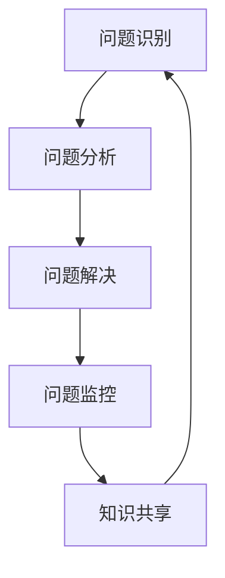

                 

### 《持续改进循环：建立学习型组织的方法》

#### 关键词：持续改进循环、学习型组织、实践应用、案例分析、最佳实践

#### 摘要：
本文旨在深入探讨持续改进循环在建立学习型组织中的应用，从理论基础到实践应用，再到案例分析，全面解析这一管理理念在现代社会中的重要作用。通过分析持续改进循环的核心概念和基本原理，阐述如何通过具体步骤和策略，在组织内部构建一个不断学习和进步的文化，从而实现组织的长远发展。

## 目录

### 第一部分：背景与理论基础

#### 第1章：持续改进循环概述

##### 1.1 持续改进循环的概念

##### 1.2 持续改进循环的重要性

##### 1.3 学习型组织的定义与特征

#### 第2章：学习型组织的理论基础

##### 2.1 学习型组织的发展历程

##### 2.2 学习型组织的核心概念与联系

##### 2.3 持续改进循环与学习型组织的内在联系

#### 第3章：持续改进循环的基本原理

##### 3.1 持续改进循环的模型架构

##### 3.2 持续改进循环的数学模型与公式

##### 3.3 持续改进循环的实践应用

### 第二部分：实践应用

#### 第4章：建立持续改进循环的步骤

##### 4.1 确定持续改进的目标

##### 4.2 制定持续改进的计划

##### 4.3 实施持续改进的过程

##### 4.4 监测和评估改进效果

#### 第5章：培养学习型组织的文化

##### 5.1 学习型组织的文化要素

##### 5.2 如何建立学习型组织的文化

##### 5.3 域养学习型组织成员的能力

##### 5.4 保持学习型组织的活力

#### 第6章：实施持续改进循环的挑战与策略

##### 6.1 持续改进循环的常见问题

##### 6.2 应对挑战的策略

##### 6.3 实现持续改进循环的长期成功

#### 第7章：成功案例分析

##### 7.1 案例一：某企业通过持续改进循环提升生产效率

##### 7.2 案例二：某机构通过学习型组织建设实现持续创新

##### 7.3 案例分析总结与启示

### 第三部分：案例分析

#### 第8章：持续改进循环的最佳实践

##### 8.1 持续改进循环的最佳实践案例

##### 8.2 案例分析与解读

##### 8.3 持续改进循环的最佳实践总结

#### 第9章：持续改进循环的持续发展

##### 9.1 持续改进循环的未来趋势

##### 9.2 学习型组织的发展前景

##### 9.3 持续改进循环与学习型组织的研究方向

#### 第10章：结论与展望

##### 10.1 本书的主要贡献

##### 10.2 持续改进循环的实践意义

##### 10.3 未来研究展望

### 第一部分：背景与理论基础

#### 第1章：持续改进循环概述

在当今快速变化的社会和经济环境中，持续改进循环（Continuous Improvement Cycle）已成为许多组织追求卓越的关键工具。这一章将介绍持续改进循环的概念和重要性，以及如何将其应用于实际工作中。

##### 1.1 持续改进循环的概念

持续改进循环是一种系统化的管理方法，它通过不断地识别问题、分析问题、解决问题，从而实现组织的不断进步。该方法的核心在于“持续”和“改进”，它要求组织始终保持对内部和外部环境的警觉，及时识别问题，并采取有效措施进行改进。

持续改进循环通常包括以下几个步骤：

1. **问题识别**：通过数据分析和用户反馈等方式，识别组织内部和外部的潜在问题。
2. **问题分析**：对问题进行深入分析，找出问题的根本原因。
3. **问题解决**：制定并实施解决方案，以解决根本问题。
4. **问题监控**：对改进效果进行监控，确保问题得到有效解决。

##### 1.2 持续改进循环的重要性

持续改进循环在组织管理中的重要性主要体现在以下几个方面：

1. **提高效率**：通过不断地识别和解决问题，可以提高组织的运营效率，减少浪费，提高资源利用率。
2. **提升质量**：持续改进循环有助于组织不断提高产品质量，满足用户需求，增强市场竞争力。
3. **促进创新**：持续改进循环鼓励组织成员积极参与问题解决和创新，从而推动组织持续发展。
4. **增强团队凝聚力**：通过共同参与问题解决和改进，可以增强团队成员之间的协作和信任，提高团队凝聚力。

##### 1.3 学习型组织的定义与特征

学习型组织是一种能够持续学习、适应和创新的组织形态。它将学习视为组织发展的核心，鼓励成员不断学习新知识、新技能，并将其应用于实际工作中。

学习型组织的特征包括：

1. **共同愿景**：组织成员共同拥有明确的愿景和目标，并为之共同努力。
2. **自我超越**：组织成员不断追求自我提升，勇于面对挑战和变化。
3. **心智模式**：组织成员拥有开放的心态，能够接受不同的观点和意见。
4. **系统思考**：组织成员能够从整体角度看待问题，理解系统内部各要素之间的相互作用。
5. **团队学习**：组织鼓励团队之间的学习和合作，促进知识的共享和传递。

通过上述内容，我们可以看到持续改进循环在学习型组织中的重要作用。在接下来的章节中，我们将进一步探讨学习型组织的理论基础和持续改进循环的具体应用。接下来，我们将进入第2章，详细探讨学习型组织的理论基础。

#### 第2章：学习型组织的理论基础

学习型组织是一种以学习为核心的组织形态，它强调持续学习、适应和创新能力，以应对快速变化的环境。这一章将介绍学习型组织的发展历程、核心概念与联系，以及持续改进循环与学习型组织的内在联系。

##### 2.1 学习型组织的发展历程

学习型组织的概念起源于20世纪90年代，由著名管理学家彼得·圣吉（Peter Senge）在其著作《第五项修炼：学习型组织的艺术与实务》中首次提出。圣吉认为，学习型组织是一种能够持续学习、适应和创新的组织形态，它能够通过成员之间的协同学习和知识共享，实现组织的整体进步。

学习型组织的发展历程可以概括为以下几个阶段：

1. **早期探索阶段**（20世纪80年代）：在这个阶段，管理学界开始关注组织学习的重要性，并提出了一些初步的理论和实践。
2. **理论构建阶段**（20世纪90年代）：彼得·圣吉等学者提出了学习型组织的概念，并进行了系统的理论构建。
3. **实践应用阶段**（21世纪）：随着信息技术的发展，学习型组织理念逐渐应用于各个领域，成为组织管理的重要工具。

##### 2.2 学习型组织的核心概念与联系

学习型组织包含了一系列核心概念，这些概念相互联系，共同构成了学习型组织的理论基础。以下是几个关键概念及其相互关系：

1. **共同愿景**：共同愿景是学习型组织的基石，它指的是组织成员共同拥有的未来目标和愿景。共同愿景能够激发组织成员的积极性和创造力，为组织的持续发展提供动力。

2. **团队学习**：团队学习是学习型组织的核心能力，它强调团队成员之间的协作和知识共享。通过团队学习，组织成员能够共同解决问题，提高整体能力。

3. **心智模式**：心智模式是组织成员的思维方式、价值观和信念体系。学习型组织鼓励成员反思和改变心智模式，以适应新的环境和挑战。

4. **系统思考**：系统思考是学习型组织的思维方式，它强调从整体角度看待问题，理解系统内部各要素之间的相互作用。通过系统思考，组织成员能够更好地应对复杂问题。

5. **个人超越**：个人超越是指组织成员不断追求自我提升和成长。个人超越是学习型组织的重要特征，它要求组织成员具备自我反思和自我提升的能力。

这些核心概念相互联系，共同构成了学习型组织的理论基础。共同愿景为组织提供了方向和动力，团队学习促进了知识的共享和传递，心智模式和个人超越则为组织成员提供了思考和行动的框架。

##### 2.3 持续改进循环与学习型组织的内在联系

持续改进循环与学习型组织具有内在的联系，它们共同构成了组织持续进步和发展的动力。以下是持续改进循环与学习型组织之间的几个关键联系：

1. **学习与改进**：持续改进循环的核心在于学习和改进。学习型组织通过持续改进循环，不断识别和解决问题，从而实现组织的不断进步。

2. **实践与应用**：学习型组织强调理论与实践相结合。通过持续改进循环，组织成员将理论知识应用于实际工作中，从而提高解决问题的能力。

3. **知识共享**：学习型组织鼓励知识共享和传递。持续改进循环中的知识共享机制，如团队学习、知识库等，有助于组织成员获取和利用新的知识和经验。

4. **文化建设**：持续改进循环和学习型组织都强调组织文化的建设。通过持续改进循环，组织可以培养一种积极进取、不断学习的文化氛围。

5. **创新能力**：持续改进循环和学习型组织都重视创新能力的培养。通过不断的学习和改进，组织能够提高创新能力，为组织的长远发展提供动力。

通过上述内容，我们可以看到持续改进循环在学习型组织中的重要作用。在接下来的章节中，我们将探讨如何建立和实施持续改进循环，以及如何在组织内部培养学习型组织的文化。这将为组织实现持续发展和进步提供有力支持。接下来，我们将进入第3章，详细探讨持续改进循环的基本原理。

#### 第3章：持续改进循环的基本原理

持续改进循环是一种系统化的管理方法，它通过不断地识别问题、分析问题、解决问题，从而实现组织的不断进步。这一章将详细介绍持续改进循环的模型架构、数学模型与公式，以及其实践应用。

##### 3.1 持续改进循环的模型架构

持续改进循环的模型架构可以分为以下几个关键环节：

1. **问题识别**：通过数据分析和用户反馈等方式，识别组织内部和外部的潜在问题。
2. **问题分析**：对问题进行深入分析，找出问题的根本原因。
3. **问题解决**：制定并实施解决方案，以解决根本问题。
4. **问题监控**：对改进效果进行监控，确保问题得到有效解决。
5. **知识共享**：将问题解决过程中的经验教训进行总结和分享，以提高组织的整体能力。

持续改进循环的模型架构如图3-1所示：

图3-1 持续改进循环模型架构

在这个模型中，每个环节都是相互关联的。问题识别是持续改进循环的起点，通过对问题进行识别和分析，找出问题的根本原因。然后，制定并实施解决方案，以解决根本问题。在问题解决过程中，需要不断监控改进效果，确保问题得到有效解决。最后，将问题解决过程中的经验教训进行总结和分享，以提高组织的整体能力。

##### 3.2 持续改进循环的数学模型与公式

持续改进循环的数学模型可以帮助我们理解和预测问题的解决效果。以下是一个简化的持续改进循环的数学模型：

\[ E(t) = R(t) - P(t) \]

其中：
- \( E(t) \) 表示在时间 \( t \) 的效果值；
- \( R(t) \) 表示在时间 \( t \) 的改进值；
- \( P(t) \) 表示在时间 \( t \) 的波动值。

该模型的核心思想是，通过不断改进和减少波动，提高最终的效果值。

在具体应用中，我们可以使用以下公式来计算每个时间点的效果值：

\[ E(t) = R(t) - P(t) \]

其中：
- \( R(t) \) 可以通过以下公式计算：

\[ R(t) = R(t-1) + \Delta R(t) \]

其中：
- \( R(t-1) \) 表示在时间 \( t-1 \) 的改进值；
- \( \Delta R(t) \) 表示在时间 \( t \) 的改进增量。

- \( P(t) \) 可以通过以下公式计算：

\[ P(t) = P(t-1) + \Delta P(t) \]

其中：
- \( P(t-1) \) 表示在时间 \( t-1 \) 的波动值；
- \( \Delta P(t) \) 表示在时间 \( t \) 的波动增量。

通过这些公式，我们可以计算出每个时间点的效果值，从而监控问题的解决效果。

##### 3.3 持续改进循环的实践应用

持续改进循环在组织管理中具有广泛的应用。以下是一个具体的案例：

某公司发现其生产线的质量问题较高，影响了客户满意度。为了解决这个问题，公司决定实施持续改进循环。

1. **问题识别**：通过对生产数据进行分析，发现生产线上的某些环节存在质量问题。
2. **问题分析**：对质量问题进行深入分析，找出导致质量问题的根本原因，如设备故障、操作不规范等。
3. **问题解决**：制定具体的解决方案，如更换设备、加强员工培训等，并实施这些方案。
4. **问题监控**：对改进效果进行监控，如通过定期检查、客户反馈等方式，确保问题得到有效解决。
5. **知识共享**：将问题解决过程中的经验教训进行总结和分享，如编写操作手册、组织培训等，以提高组织的整体能力。

通过持续改进循环，该公司成功解决了生产质量问题，提高了客户满意度，并积累了宝贵的经验。

总结来说，持续改进循环是一种有效的管理方法，它通过不断地识别问题、分析问题、解决问题，实现组织的持续进步。在具体应用中，我们需要根据实际情况，灵活运用持续改进循环的模型架构和数学模型，以达到最佳效果。

在接下来的章节中，我们将探讨如何建立持续改进循环的具体步骤，以及如何培养学习型组织的文化。这将为组织实现持续发展和进步提供有力支持。接下来，我们将进入第4章，详细探讨建立持续改进循环的步骤。

#### 第4章：建立持续改进循环的步骤

建立持续改进循环是组织实现持续发展和进步的关键。这一章将详细介绍如何确定持续改进的目标、制定持续改进的计划、实施持续改进的过程以及监测和评估改进效果。

##### 4.1 确定持续改进的目标

确定持续改进的目标是建立持续改进循环的第一步。明确的目标有助于组织集中资源和精力，确保改进工作方向正确。

以下是如何确定持续改进目标的步骤：

1. **识别关键问题**：通过对组织内部和外部环境进行分析，识别影响组织发展的关键问题。
2. **分析问题原因**：对识别出的关键问题进行深入分析，找出导致问题的根本原因。
3. **设定改进目标**：根据问题分析和组织发展战略，设定具体的改进目标。改进目标应具有可衡量性、具体性和可实现性。
4. **目标优先级排序**：根据问题的严重程度和改进潜力，对改进目标进行优先级排序，确保资源得到有效分配。

##### 4.2 制定持续改进的计划

制定持续改进的计划是确保改进目标得到有效实现的关键。以下是如何制定持续改进计划的步骤：

1. **明确改进策略**：根据改进目标，制定具体的改进策略。改进策略应包括改进措施、实施步骤和时间表。
2. **资源分配**：确定实施改进计划所需的资源，如人力、物力和财力。确保资源得到合理配置，以支持改进工作的顺利开展。
3. **责任分配**：明确改进计划中的责任分配，确保每个改进措施都有明确的责任人。责任人应对改进效果负责，并定期汇报进展。
4. **风险分析**：对改进计划可能面临的风险进行分析，并制定相应的风险应对措施。确保在风险发生时，能够迅速采取行动，将风险影响降到最低。

##### 4.3 实施持续改进的过程

实施持续改进的过程是确保改进计划得到有效执行的关键。以下是如何实施持续改进的步骤：

1. **培训与动员**：对相关人员（如改进小组成员、责任人等）进行培训，提高他们的改进意识和能力。同时，进行动员，确保组织成员对改进计划的理解和认同。
2. **执行改进措施**：根据改进计划，逐步执行各项改进措施。在执行过程中，应密切关注改进措施的实施情况，确保按照计划进行。
3. **数据收集与分析**：在改进过程中，收集相关数据，如改进前后的质量数据、效率数据等。通过对数据进行分析，评估改进措施的效果。
4. **问题反馈与调整**：在数据分析和评估的基础上，发现问题，并制定相应的改进措施。对改进计划进行调整，以更好地实现改进目标。

##### 4.4 监测和评估改进效果

监测和评估改进效果是持续改进循环的重要组成部分。以下是如何监测和评估改进效果的步骤：

1. **制定监测指标**：根据改进目标，制定相应的监测指标。监测指标应具有可衡量性、具体性和实时性。
2. **数据收集**：定期收集监测指标数据，确保数据的准确性和完整性。
3. **数据分析**：对监测数据进行深入分析，评估改进措施的效果。分析结果应反馈到改进计划中，为后续改进提供依据。
4. **评估报告**：定期撰写改进效果评估报告，总结改进工作进展和成果。评估报告应包括改进措施的实施情况、监测指标数据、改进效果评估等。
5. **持续改进**：根据评估报告，对改进计划进行调整和优化，确保持续改进循环的顺利进行。

通过上述步骤，组织可以建立有效的持续改进循环，实现持续发展和进步。在接下来的章节中，我们将探讨如何培养学习型组织的文化，以及如何应对实施持续改进循环过程中可能遇到的挑战。这将为组织在持续改进的道路上提供有力支持。

### 第5章：培养学习型组织的文化

培养学习型组织的文化是建立持续改进循环的关键一步。学习型组织文化强调持续学习、知识共享和创新能力，这种文化能够激励组织成员积极参与改进工作，从而推动组织的持续发展。以下是如何建立学习型组织文化、培养成员能力和保持组织活力的具体方法和策略。

#### 5.1 学习型组织的文化要素

学习型组织文化的建立需要以下几个关键要素：

1. **共同愿景**：共同愿景是学习型组织文化的核心。组织成员应共同拥有一个清晰、有吸引力的未来目标，并为之共同努力。
2. **开放沟通**：学习型组织鼓励开放、坦诚的沟通。组织成员可以自由地分享想法、知识和经验，促进知识的共享和传递。
3. **自我反思**：学习型组织鼓励成员进行自我反思，不断审视自己的行为和思维方式，以提高个人能力和组织整体效能。
4. **协作合作**：学习型组织强调团队合作，鼓励成员在共同目标下协作合作，共同解决问题。
5. **持续学习**：学习型组织倡导持续学习，鼓励成员不断学习新知识、新技能，并将其应用于实际工作中。

#### 5.2 如何建立学习型组织的文化

建立学习型组织文化需要从以下几个方面入手：

1. **领导层的示范作用**：领导层应率先示范学习型组织文化，通过自身的行动和态度，影响和激励组织成员。
2. **培训和发展**：为组织成员提供培训和发展机会，提高他们的专业技能和综合素质，增强他们的学习动力。
3. **知识共享平台**：建立知识共享平台，如内部论坛、数据库等，鼓励成员分享知识和经验，促进知识的传递和积累。
4. **激励机制**：建立激励机制，如表彰、奖励等，鼓励组织成员积极参与学习和改进工作，提升整体学习氛围。
5. **文化建设活动**：组织各种文化建设活动，如读书会、知识竞赛等，增强组织成员的归属感和认同感，营造良好的学习氛围。

#### 5.3 培养学习型组织成员的能力

培养学习型组织成员的能力是建立学习型组织文化的重要一环。以下是一些具体的培养方法和策略：

1. **强化学习能力**：鼓励成员主动学习，提供各种学习资源和机会，提高他们的学习能力和效率。
2. **培养批判性思维**：通过训练和引导，培养成员的批判性思维能力，使他们能够从不同角度分析问题，提出创新性的解决方案。
3. **提升沟通能力**：加强团队成员之间的沟通，提高沟通技巧，促进有效沟通和协作。
4. **培养解决问题的能力**：通过案例分析和实战训练，提高成员的问题解决能力，使他们能够在面对问题时迅速找到解决方案。
5. **培养团队合作精神**：通过团队活动和项目合作，培养成员的团队合作精神和协作能力，提高团队整体效能。

#### 5.4 保持学习型组织的活力

保持学习型组织的活力是维持组织长期发展的关键。以下是一些保持学习型组织活力的策略：

1. **持续改进**：不断优化组织的运营和管理流程，提高组织的效率和质量。
2. **创新驱动**：鼓励组织成员积极参与创新活动，推动组织的创新发展。
3. **知识更新**：随着外部环境的变化，及时更新组织成员的知识和技能，确保组织始终保持竞争力。
4. **员工关怀**：关注员工的需求和成长，提供良好的工作环境和激励机制，激发员工的积极性和创造力。
5. **文化传承**：通过文化的传承和弘扬，确保学习型组织文化的延续和发展，保持组织的活力和凝聚力。

通过以上方法，组织可以建立并保持学习型组织的文化，培养成员的能力，提高组织的整体效能，从而实现持续发展和进步。在接下来的章节中，我们将探讨实施持续改进循环过程中可能遇到的挑战以及应对策略。

### 第6章：实施持续改进循环的挑战与策略

在实施持续改进循环的过程中，组织可能会面临一系列的挑战。这些挑战不仅影响改进效果，还可能阻碍组织的持续发展。因此，了解并有效应对这些挑战至关重要。以下是一些常见的挑战以及应对策略。

##### 6.1 持续改进循环的常见问题

1. **缺乏明确的目标和计划**：在实施持续改进循环时，如果缺乏明确的目标和详细的计划，会导致改进工作方向不明确，资源浪费。
2. **数据不足或质量不高**：数据是持续改进循环的基础。如果数据不足或质量不高，将影响问题识别和分析的准确性，进而影响改进效果。
3. **组织阻力**：在实施改进计划时，可能会遇到来自组织内部的阻力，如部门之间的矛盾、员工的不配合等，这些都可能阻碍改进工作的顺利进行。
4. **缺乏有效的沟通和协作**：如果组织内部沟通不畅，团队成员之间的协作不紧密，改进工作将难以有效推进。
5. **改进措施无法持续**：在短期内取得显著改进效果后，如果无法保持改进措施的实施，改进效果可能会迅速衰减。

##### 6.2 应对挑战的策略

1. **明确目标和计划**：
   - **制定详细的改进计划**：明确改进的目标、步骤、时间表和责任人，确保改进工作有明确的指引。
   - **定期评审和调整**：定期对改进计划进行评审，根据实际情况进行调整，确保计划与组织目标和实际情况保持一致。

2. **确保数据的质量和充分性**：
   - **建立数据收集机制**：制定数据收集的标准和流程，确保数据的准确性和完整性。
   - **数据分析和报告**：定期对数据进行深入分析，形成改进报告，为改进决策提供依据。

3. **减少组织阻力**：
   - **加强沟通和协作**：建立有效的沟通机制，确保各部门和员工之间的信息流通，减少误解和矛盾。
   - **利益相关者参与**：让利益相关者（如管理层、员工、客户等）参与改进计划的制定和实施，增强他们对改进工作的认同和支持。
   - **解决冲突**：建立冲突解决机制，及时解决组织内部冲突，确保改进工作的顺利进行。

4. **加强沟通和协作**：
   - **建立协作平台**：利用协作工具和平台，促进团队成员之间的沟通和协作，提高工作效率。
   - **培训沟通技能**：定期组织沟通技能培训，提高员工的沟通能力，减少沟通障碍。

5. **确保改进措施的持续实施**：
   - **建立持续改进的文化**：通过培训、激励等手段，培养员工对持续改进的认同感和责任感。
   - **制定长效机制**：建立长效的改进机制，如定期评审、持续监控等，确保改进措施的持续实施。
   - **激励和表彰**：通过激励和表彰制度，鼓励员工积极参与改进工作，保持改进的热情和动力。

通过以上策略，组织可以有效应对实施持续改进循环过程中遇到的挑战，确保改进工作顺利进行，从而实现组织的持续发展和进步。在接下来的章节中，我们将通过具体案例来展示如何应用这些策略，进一步理解和实践持续改进循环。

### 第7章：成功案例分析

在本章中，我们将通过两个具体的案例，展示如何通过实施持续改进循环和学习型组织建设，实现组织效率的提升和创新的突破。通过这些案例，读者可以更深入地了解持续改进循环的实际应用和效果。

#### 7.1 案例一：某企业通过持续改进循环提升生产效率

某大型制造企业面临生产效率低下、产品质量不稳定的问题。为了解决这些问题，企业决定实施持续改进循环和学习型组织建设。

1. **问题识别**：通过数据分析，企业发现生产线的自动化程度较低，导致生产效率不高。此外，生产过程中存在操作不规范、设备故障频发等问题。
2. **问题分析**：对生产线进行详细分析，找出导致效率低下的根本原因，如设备老化、员工技能不足等。
3. **问题解决**：
   - **设备升级**：企业投入资金对生产线进行自动化升级，引入先进的生产设备和控制系统。
   - **员工培训**：组织员工参加专业培训，提高他们的技能水平和工作规范。
4. **问题监控**：通过定期检查和监控，确保改进措施得到有效实施，并及时发现和解决问题。
5. **知识共享**：建立内部知识库，将改进过程中的经验教训和最佳实践进行总结和分享，提高整体管理水平。

经过一段时间的努力，该企业的生产效率显著提升，产品质量也得到了明显改善。生产线的自动化程度提高，员工操作更加规范，生产过程更加高效，企业整体运营成本降低，竞争力显著增强。

#### 7.2 案例二：某机构通过学习型组织建设实现持续创新

某技术研发机构在市场竞争中面临创新能力不足、项目进展缓慢的问题。为了提升创新能力，该机构决定通过学习型组织建设推动持续改进。

1. **问题识别**：通过对项目进展和市场需求进行分析，机构发现技术研发过程中存在创新不足、团队协作不紧密等问题。
2. **问题分析**：深入分析问题根源，发现团队成员的知识和技能水平参差不齐，创新氛围不足，团队协作效率有待提高。
3. **问题解决**：
   - **知识共享平台**：建立内部知识共享平台，鼓励团队成员分享知识、经验和技术，促进知识流动和传递。
   - **创新激励**：设立创新奖励机制，鼓励团队成员积极参与创新活动，提高创新积极性。
   - **团队协作培训**：组织团队协作培训，提高团队成员的沟通能力和协作效率。
4. **问题监控**：通过定期评估和反馈，确保改进措施得到有效实施，并及时调整策略。
5. **知识共享**：通过知识共享平台，机构积累了大量技术资料和成功案例，为后续项目提供了宝贵的参考。

通过学习型组织建设，该机构在技术研发方面取得了显著进步。团队成员的知识和技能水平得到提升，创新氛围浓厚，项目进展迅速，市场竞争力显著增强。机构在技术创新和市场开拓方面取得了多项突破，成为行业内的佼佼者。

#### 7.3 案例分析总结与启示

通过以上两个案例，我们可以看到，实施持续改进循环和学习型组织建设对于提升组织效率和创新具有重要意义。以下是案例的总结与启示：

1. **明确目标和计划**：在实施持续改进循环时，应明确改进目标，制定详细的计划，确保改进工作有明确的方向和步骤。
2. **数据驱动**：数据是持续改进循环的基础，通过数据分析和监测，可以准确识别问题，制定有效的改进措施。
3. **知识共享**：建立知识共享平台，促进知识和经验的传递和积累，提高组织的整体管理水平。
4. **团队协作**：团队协作是提升工作效率和创新能力的关键，通过培训、激励和有效的沟通机制，提高团队协作效率。
5. **持续改进**：持续改进是一种文化，通过建立持续改进的机制和氛围，确保改进措施得到有效实施和持续优化。

通过以上案例分析，读者可以更好地理解持续改进循环和学习型组织建设的实际应用和效果，为自身组织的发展提供有益的借鉴和启示。

### 第8章：持续改进循环的最佳实践

在持续改进循环的实施过程中，许多组织积累了丰富的经验和教训。这些最佳实践不仅有助于提升改进效果，还为其他组织提供了宝贵的参考。以下是一些在持续改进循环中广泛应用的实践方法。

#### 8.1 持续改进循环的最佳实践案例

1. **丰田生产系统**：丰田生产系统（TPS）是持续改进循环的典范。通过不断识别和解决问题，丰田实现了生产效率和质量的大幅提升。其核心实践包括**精益生产**、**全面质量管理**和**持续改进循环**。
2. **IBM的变革之旅**：IBM在20世纪90年代面临经营困境，通过实施持续改进和学习型组织建设，IBM实现了巨大的变革。其关键实践包括**领导力培养**、**员工参与**和**持续学习**。

#### 8.2 案例分析与解读

通过对上述案例的分析，我们可以得出以下结论：

1. **领导层的支持**：领导层的支持是持续改进循环成功的关键。领导层应积极参与改进工作，为员工提供必要的资源和支持，确保改进措施的顺利实施。
2. **员工参与**：员工是持续改进的主体。通过鼓励员工参与改进工作，可以激发他们的积极性和创造力，提高改进效果。员工参与的方式包括**建议箱**、**质量圈**和**员工代表会议**。
3. **数据驱动**：持续改进循环应基于数据驱动。通过收集和分析数据，可以准确识别问题，制定有效的改进措施。数据收集的工具包括**统计过程控制**（SPC）、**因果图**和**散点图**。
4. **知识共享**：知识共享是持续改进循环的重要组成部分。通过建立内部知识库和知识共享平台，可以促进知识和经验的传递和积累，提高组织的整体管理水平。

#### 8.3 持续改进循环的最佳实践总结

结合以上案例分析，我们可以总结出以下最佳实践：

1. **建立明确的改进目标**：制定明确的改进目标，确保改进工作有清晰的方向和衡量标准。
2. **数据驱动**：通过数据分析和监测，准确识别问题，制定有效的改进措施。
3. **员工参与**：鼓励员工参与改进工作，激发他们的积极性和创造力。
4. **领导层的支持**：领导层应积极参与改进工作，为员工提供必要的资源和支持。
5. **知识共享**：建立内部知识库和知识共享平台，促进知识和经验的传递和积累。

通过以上最佳实践，组织可以建立有效的持续改进循环，提高运营效率和质量，实现持续发展和进步。在接下来的章节中，我们将探讨持续改进循环的未来发展趋势和潜在研究方向。

### 第9章：持续改进循环的持续发展

随着全球化和信息技术的快速发展，持续改进循环和学习型组织在组织管理中的重要性日益凸显。本章将探讨持续改进循环的未来发展趋势、学习型组织的发展前景，以及持续改进循环与学习型组织的研究方向。

#### 9.1 持续改进循环的未来发展趋势

1. **数字化与智能化**：随着数字化和智能化的推进，持续改进循环将更加依赖于数据分析、人工智能和机器学习等技术。这些技术可以帮助组织更加精准地识别问题、预测改进效果，并自动化改进流程。
2. **全球化合作**：在全球化的背景下，持续改进循环将跨越国界，实现跨国合作。企业可以通过全球网络，共享最佳实践、知识和技术，推动持续改进的全球化和国际化。
3. **社会责任与可持续发展**：在环境保护和可持续发展日益受到关注的时代，持续改进循环将更加注重社会责任。组织将通过改进流程、减少浪费和提升效率，实现可持续发展目标。
4. **员工参与**：员工参与是持续改进循环的核心。未来，组织将更加重视员工的参与和贡献，通过建立开放、透明和包容的文化，激发员工的创造力和创新精神。

#### 9.2 学习型组织的发展前景

1. **知识管理**：学习型组织的发展前景与知识管理密不可分。未来，组织将更加重视知识的收集、存储、共享和利用，通过知识管理平台和工具，实现知识的快速传递和积累。
2. **领导力培养**：学习型组织的领导力培养将成为未来发展的重要方向。领导力不仅仅是职位和权力的象征，更是知识和智慧的体现。未来，组织将更加注重领导力的培养和提升，培养具有全球视野和领导力的管理者。
3. **组织变革**：随着外部环境的快速变化，学习型组织将更加注重组织变革。组织将通过不断调整和优化，适应新的环境和挑战，保持组织的活力和竞争力。
4. **员工发展**：学习型组织的发展前景与员工发展紧密相连。未来，组织将更加关注员工的发展和成长，通过培训、晋升和职业规划，激发员工的潜力和积极性。

#### 9.3 持续改进循环与学习型组织的研究方向

1. **跨领域融合**：未来研究应关注持续改进循环与学习型组织在各个领域的融合应用。例如，在医疗、教育、金融等行业，如何通过持续改进循环和学习型组织提升服务质量和效率。
2. **数字化与智能化**：研究如何将数字化和智能化技术应用于持续改进循环和学习型组织，提高改进效率和管理水平。
3. **组织变革与管理**：研究组织变革过程中的管理挑战和策略，探讨如何通过持续改进循环和学习型组织实现组织的快速适应和变革。
4. **员工参与与激励**：研究如何通过有效的激励机制和参与机制，激发员工的积极性和创造力，推动持续改进和学习型组织的建设。

通过以上探讨，我们可以看到持续改进循环和学习型组织在组织管理中的广阔前景。未来，随着技术的不断进步和全球化的深入，持续改进循环和学习型组织将继续发挥重要作用，推动组织的持续发展和进步。

### 第10章：结论与展望

在本文中，我们深入探讨了持续改进循环在建立学习型组织中的应用，从理论基础到实践应用，再到具体案例，全面解析了这一管理理念在现代社会中的重要作用。以下是对本文主要内容的总结和未来研究的展望。

#### 10.1 本书的主要贡献

1. **系统化梳理**：本文系统地梳理了持续改进循环和学习型组织的理论基础，为读者提供了一个全面、清晰的理解框架。
2. **实践指导**：通过具体案例，本文展示了持续改进循环在实际组织管理中的应用，提供了实用的实践指导。
3. **创新视角**：本文探讨了持续改进循环与数字化、智能化技术相结合的未来发展趋势，为未来研究提供了新的视角。

#### 10.2 持续改进循环的实践意义

1. **提升效率**：持续改进循环通过不断识别和解决问题，有助于提高组织的运营效率，减少浪费，提高资源利用率。
2. **提升质量**：通过持续改进循环，组织可以不断提高产品质量，满足用户需求，增强市场竞争力。
3. **促进创新**：持续改进循环鼓励组织成员积极参与问题解决和创新，推动组织持续发展。
4. **增强团队凝聚力**：通过共同参与问题解决和改进，可以增强团队成员之间的协作和信任，提高团队凝聚力。

#### 10.3 未来研究展望

1. **跨领域应用**：未来研究应关注持续改进循环与学习型组织在各个领域的融合应用，探讨其在不同行业中的实践效果。
2. **数字化与智能化**：研究如何将数字化和智能化技术应用于持续改进循环和学习型组织，提高改进效率和管理水平。
3. **组织变革**：研究组织变革过程中的管理挑战和策略，探讨如何通过持续改进循环和学习型组织实现组织的快速适应和变革。
4. **员工参与与激励**：研究如何通过有效的激励机制和参与机制，激发员工的积极性和创造力，推动持续改进和学习型组织的建设。

通过本文的探讨，我们希望为组织管理者提供有益的参考，推动持续改进和学习型组织的建设，实现组织的持续发展和进步。

### 作者信息

- 作者：AI天才研究院/AI Genius Institute & 禅与计算机程序设计艺术 /Zen And The Art of Computer Programming

持续改进和学习型组织的建设是组织管理的重要方向，本文旨在为广大读者提供深入的见解和实用的指导。希望本文能够为读者在实践过程中带来启示和帮助。让我们共同努力，推动持续改进和学习型组织在各个领域的发展。

