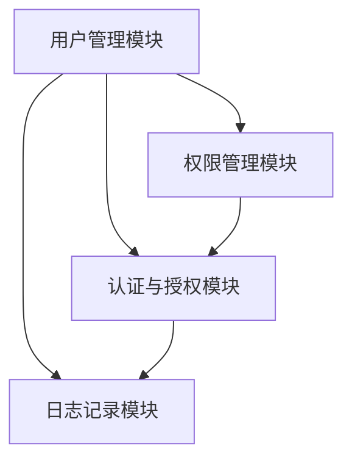
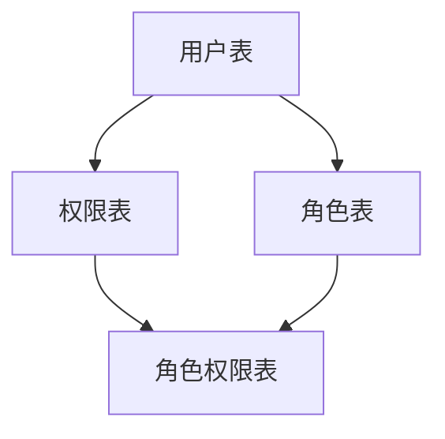
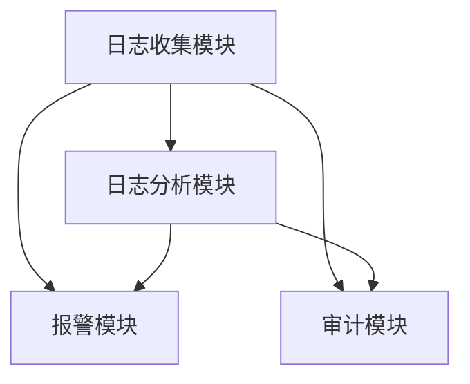
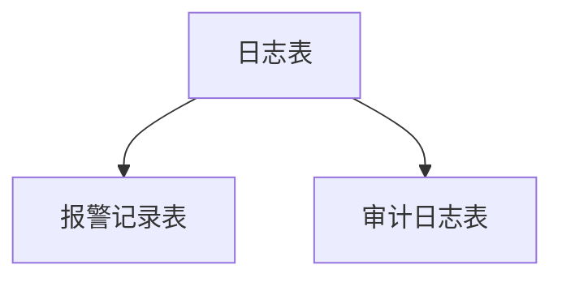

                 

# 授权与监督：找到完美平衡点

> 关键词：授权，监督，平衡点，系统设计，案例分析

> 摘要：本文将深入探讨授权与监督在IT领域的核心概念和实际应用，分析授权系统与监督系统的设计原理和实现方法，通过具体案例展示如何在实际项目中找到授权与监督的完美平衡点。

---

## 第一部分：引言

### 第1章：问题背景与核心概念

#### 1.1 问题背景

在信息化管理日益普及的今天，授权与监督成为企业管理中至关重要的一环。授权是指组织或系统为特定个体或角色赋予相应的操作权限，使其能够执行特定任务。监督则是对被授权者的行为进行监控和管理，确保其操作符合预期目标和规范。

企业对授权与监督的需求源于以下几个方面：

1. **确保安全性**：避免未经授权的访问和操作，保护企业数据和系统的安全性。
2. **提高效率**：通过合理的授权机制，使员工能够快速响应业务需求，提高工作效率。
3. **合规性**：满足相关法律法规和政策的要求，确保企业的运营合法合规。

#### 1.2 核心概念

授权的定义与类型：

- **授权**：授予个体或角色执行特定操作的权利。根据授权对象的不同，可以分为用户授权和角色授权。
- **用户授权**：针对具体的用户，赋予其操作权限。
- **角色授权**：将一组权限打包成角色，然后为用户分配角色。

监督的定义与形式：

- **监督**：对被授权者的行为进行监控和管理。监督可以采取多种形式，如日志记录、实时监控、定期审查等。

授权与监督的互动关系：

- 授权为监督提供了监控的对象，监督则通过反馈机制对授权进行优化和调整。

#### 1.3 授权与监督的重要性

在现代化管理中，授权与监督不仅关乎企业的信息安全，更影响到企业的运营效率和合规性。找到授权与监督的平衡点，是确保企业稳定、高效运营的关键。

## 第二部分：授权系统设计

### 第2章：授权系统设计与实现

#### 2.1 授权系统的架构设计

##### 2.1.1 系统架构概述

授权系统通常包括以下模块：

1. **用户管理模块**：负责用户信息的管理，包括用户的注册、登录和权限分配。
2. **权限管理模块**：负责权限的分配和回收，以及权限的查询和更新。
3. **认证与授权模块**：负责对用户的身份进行认证，并在用户请求资源时进行授权。
4. **日志记录模块**：记录用户的操作日志，以便后续的审计和监督。

##### 2.1.2 系统模块划分

授权系统模块划分示例：



##### 2.1.3 数据库设计

数据库设计示例：



#### 2.2 授权策略与权限管理

##### 2.2.1 授权策略设计

授权策略设计示例：

- **基于角色的访问控制（RBAC）**：将用户分配到角色，角色拥有相应的权限。
- **基于资源的访问控制（ABAC）**：根据资源属性和用户特征进行授权。

##### 2.2.2 权限管理机制

权限管理机制示例：

- **权限分配**：为用户分配角色，角色拥有相应的权限。
- **权限回收**：当用户离职或角色变更时，回收其权限。
- **权限查询**：用户可以查询自己拥有的权限。

#### 2.3 授权系统的接口设计

##### 2.3.1 接口规范与定义

接口规范与定义示例：

- **用户登录接口**：接受用户名和密码，返回认证结果。
- **权限查询接口**：返回用户所拥有的权限列表。

##### 2.3.2 接口实现与测试

接口实现与测试示例：

```python
# 用户登录接口实现
def login(username, password):
    # 验证用户名和密码
    # 返回认证结果
    pass

# 权限查询接口实现
def get_permissions(user_id):
    # 查询用户权限
    # 返回权限列表
    pass
```

## 第三部分：监督系统设计

### 第3章：监督系统设计与实现

#### 3.1 监督系统的架构设计

##### 3.1.1 系统架构概述

监督系统通常包括以下模块：

1. **日志收集模块**：收集用户操作日志。
2. **日志分析模块**：对日志进行分析，识别异常行为。
3. **报警模块**：发现异常行为时发出警报。
4. **审计模块**：记录操作行为，用于后续审计。

##### 3.1.2 系统模块划分

监督系统模块划分示例：



##### 3.1.3 数据库设计

数据库设计示例：



#### 3.2 监督策略与指标设计

##### 3.2.1 监督策略设计

监督策略设计示例：

- **基于行为的监督**：监控用户的操作行为，如登录、修改数据等。
- **基于指标的监督**：监控系统的关键指标，如响应时间、错误率等。

##### 3.2.2 监督指标设计

监督指标设计示例：

- **登录成功率**：成功登录次数占总登录次数的比例。
- **数据修改频率**：用户在特定时间段内修改数据的次数。

##### 3.2.3 指标分析与评估

指标分析与评估示例：

- **正常行为**：基于历史数据，确定正常行为的范围。
- **异常行为**：发现超常行为，发出警报。

#### 3.3 监督系统的接口设计

##### 3.3.1 接口规范与定义

接口规范与定义示例：

- **日志收集接口**：接收日志数据。
- **报警查询接口**：查询报警记录。

##### 3.3.2 接口实现与测试

接口实现与测试示例：

```python
# 日志收集接口实现
def collect_log(log_data):
    # 收集日志数据
    pass

# 报警查询接口实现
def get_alarm_records():
    # 查询报警记录
    # 返回报警记录列表
    pass
```

## 第四部分：授权与监督的集成与平衡

### 第4章：授权与监督的集成方案

#### 4.1 集成方案的总体设计

##### 4.1.1 集成方案的设计原则

集成方案设计原则示例：

- **统一数据模型**：授权与监督系统共享同一数据模型，确保数据一致性。
- **模块化设计**：授权与监督系统模块化设计，便于功能扩展和集成。

##### 4.1.2 集成方案的实现思路

集成方案实现思路示例：

1. **数据集成**：通过统一的数据接口，实现授权与监督数据的同步。
2. **功能集成**：在授权系统中嵌入监督模块，实现授权与监督的协同工作。

#### 4.2 授权与监督的协同机制

##### 4.2.1 授权与监督的互动机制

授权与监督互动机制示例：

- **监督反馈**：监督系统发现异常行为后，反馈给授权系统，进行权限调整。
- **授权调整**：授权系统根据监督反馈，对用户的权限进行调整。

##### 4.2.2 风险管理与控制

风险管理与控制示例：

- **风险评估**：对授权与监督系统的风险进行评估，识别潜在风险点。
- **风险控制**：制定相应的控制措施，降低风险发生的概率。

##### 4.2.3 数据共享与隐私保护

数据共享与隐私保护示例：

- **数据共享**：授权与监督系统之间共享必要的数据，提高系统的整体效能。
- **隐私保护**：对敏感数据进行加密和脱敏处理，确保用户隐私安全。

## 第五部分：实战案例分析

### 第5章：授权与监督在具体场景中的应用

#### 5.1 案例一：企业内部管理

##### 5.1.1 案例背景

某企业内部管理系统中，需要实现授权与监督的功能，确保企业数据的安全和合规性。

##### 5.1.2 授权与监督方案设计

授权与监督方案设计示例：

- **授权系统设计**：采用基于角色的访问控制（RBAC）模型，为不同角色的员工分配相应的权限。
- **监督系统设计**：采用日志收集和分析机制，监控员工的操作行为，发现异常行为及时处理。

##### 5.1.3 案例实施与效果评估

案例实施与效果评估示例：

- **实施过程**：按照设计方案，逐步实施授权与监督系统，并进行测试和调试。
- **效果评估**：系统运行稳定，授权与监督功能得到有效实现，企业数据安全性和合规性得到显著提升。

#### 5.2 案例二：项目管理

##### 5.2.1 案例背景

某项目管理系统中，需要对项目成员的权限进行管理，并监控项目进展情况。

##### 5.2.2 授权与监督方案设计

授权与监督方案设计示例：

- **授权系统设计**：采用基于资源的访问控制（ABAC）模型，根据项目需求和资源属性，为项目成员分配相应的权限。
- **监督系统设计**：采用进度监控和风险控制机制，实时监控项目进展，及时发现和解决问题。

##### 5.2.3 案例实施与效果评估

案例实施与效果评估示例：

- **实施过程**：按照设计方案，逐步实施授权与监督系统，并进行测试和调试。
- **效果评估**：系统运行稳定，项目成员的权限管理得到有效实现，项目进展情况得到实时监控，项目风险得到有效控制。

## 第六部分：最佳实践与展望

### 第6章：最佳实践与展望

#### 6.1 最佳实践总结

最佳实践总结示例：

- **授权策略设计**：根据业务需求，合理划分角色和权限，确保授权的精细化和灵活性。
- **监督策略设计**：结合业务特点，设计有效的监督指标和监控机制，确保监督的全面性和实时性。

#### 6.2 未来发展趋势

未来发展趋势示例：

- **人工智能**：利用人工智能技术，实现自动化授权和监督，提高系统的智能化水平。
- **区块链**：利用区块链技术，实现授权与监督的数据安全性和透明性，提升系统的可信度。

## 第七部分：附录

### 第7章：附录

#### 7.1 术语解释

术语解释示例：

- **授权**：授予个体或角色执行特定操作的权利。
- **监督**：对被授权者的行为进行监控和管理。

#### 7.2 参考文献

参考文献示例：

- 《企业信息化安全管理》，作者：张三，出版社：清华大学出版社，2018年。
- 《项目管理与控制》，作者：李四，出版社：机械工业出版社，2019年。

#### 7.3 相关资料

相关资料示例：

- [授权与监督系统设计指南](https://www.example.com/guide)
- [项目管理最佳实践](https://www.example.com/project_management)

---

**作者：AI天才研究院/AI Genius Institute & 禅与计算机程序设计艺术 /Zen And The Art of Computer Programming**

