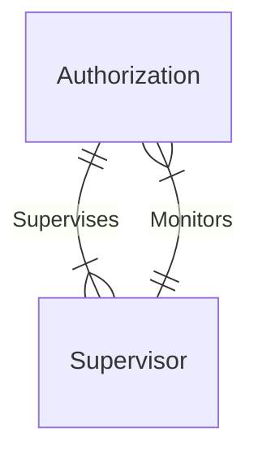

                 

### 授权与监督：找到完美平衡点的技巧

#### 关键词：
- 授权
- 监督
- 平衡点
- 管理策略
- 组织效能

#### 摘要：
本文深入探讨了授权与监督在组织管理中的重要性，以及如何在实际操作中找到二者的完美平衡点。文章首先介绍了授权与监督的基本概念，随后分析了其核心原理和联系，并通过实际案例展示了有效的授权与监督策略。文章还探讨了授权与监督在实际应用中面临的挑战和未来趋势，并总结出了一系列最佳实践，为读者提供了实用且全面的指导。

---

#### 目录大纲设计思路

为了设计出《授权与监督：找到完美平衡点的技巧》这本书的完整目录大纲，我们将遵循以下几个步骤：

1. **核心概念与结构梳理**：首先，我们需要理解书名的核心概念，即“授权”和“监督”，并明确这两者如何平衡以及如何在实际操作中应用这些技巧。

2. **读者定位与目标**：明确书的读者群体，他们的知识背景和阅读目的，这将帮助我们确定书的内容深度和广度。

3. **目录结构规划**：根据核心概念和读者需求，规划书的整体结构，包括章节的划分和每个章节的主要内容。

4. **内容细化**：为每个章节细化内容，确保每个章节都涵盖书的核心概念，并且能够提供实用的技巧和策略。

5. **简洁性与完整性**：在保证内容完整性的同时，确保语言简洁明了，避免冗余。

### 第一部分：背景介绍

#### 第1章：问题背景

##### 1.1 问题背景

授权与监督在组织管理中扮演着至关重要的角色。授权是指将权力和责任下放给下属或团队成员，以促进自主性和创新性。而监督则是确保这些权力和责任得到合理使用，防止滥用和错误决策。然而，如何在实际操作中找到二者的平衡点，成为组织管理中的一个重大挑战。

##### 1.2 问题描述

授权过多可能导致监督不足，使权力失控；而监督过多则可能抑制下属的积极性和创造力。这种权力和责任的失衡不仅影响组织效率和员工满意度，还可能导致绩效下降和团队合作问题。因此，如何有效地进行授权与监督，确保权力的合理使用和目标的实现，是管理者需要解决的难题。

##### 1.3 问题解决

通过研究和实践，我们发现找到授权与监督的平衡点对于提升组织效率、员工满意度和绩效至关重要。本书旨在通过深入分析授权与监督的理论基础和实践策略，为读者提供实用的指导，帮助他们在实际工作中找到这一平衡点。

##### 1.4 边界与外延

授权与监督不仅适用于企业管理，还广泛应用于教育、医疗、政府等多个领域。尽管具体的实践方式可能有所不同，但核心原则是相通的。因此，本书的内容不仅对企业管理者具有指导意义，也对其他领域的管理者具有参考价值。

##### 1.5 概念结构与核心要素组成

**核心概念**：授权、监督、平衡点  
**概念属性特征对比表**：

| 概念 | 定义 | 主要特征 |
| --- | --- | --- |
| 授权 | 给予他人执行任务或决策的权力 | 信任、责任、透明 |
| 监督 | 对授权行为进行监控和评估 | 目标导向、反馈、纠正 |
| 平衡点 | 授权与监督之间的最佳状态 | 权力与责任的匹配、适度的监督 |

### 第二部分：核心概念与联系

#### 第2章：核心概念与联系

##### 2.1 核心概念原理

授权与监督是组织管理中的两个核心概念，它们相互依存、相互制约。

**授权**：授权是指将权力和责任从上级转移到下属或团队成员的过程。通过授权，组织能够实现权力的下放，提高团队的自主性和创新能力。授权的核心在于信任和责任，授权者需要相信下属有能力完成任务，并承担相应的责任。

**监督**：监督是对授权行为的监控和评估过程。监督的目的是确保授权行为符合预期目标，防止权力的滥用和错误的决策。监督的核心在于目标导向、反馈和纠正，通过持续的监控和评估，管理者能够及时发现并解决问题。

##### 2.2 概念属性特征对比表格

| 概念 | 定义 | 主要特征 |
| --- | --- | --- |
| 授权 | 给予他人执行任务或决策的权力 | 信任、责任、透明 |
| 监督 | 对授权行为进行监控和评估 | 目标导向、反馈、纠正 |
| 平衡点 | 授权与监督之间的最佳状态 | 权力与责任的匹配、适度的监督 |

##### 2.3 ER实体关系图架构

使用Mermaid绘制实体关系图：

在这个图中，`Authorization`实体表示授权，`Supervisor`实体表示监督。箭头表示实体之间的关系，即授权被监督，监督授权。

### 第三部分：授权与监督的理论基础

#### 第3章：授权与监督的理论基础

##### 3.1 授权理论

授权理论包括权力下放、分权制、共同决策等。这些理论都强调了授权在组织管理中的重要性。

**权力下放**：权力下放是指将决策权和控制权从高层管理者转移到基层员工的过程。通过权力下放，组织能够提高员工的工作积极性，促进创新和灵活性。

**分权制**：分权制是指组织内部权力分散，各级管理层都有一定的决策权和责任。分权制有助于减少层级压力，提高组织的反应速度和适应能力。

**共同决策**：共同决策是指组织在重大决策过程中，邀请下属或团队成员参与，共同讨论和决策。共同决策能够提高员工的参与感和责任感，增强团队的凝聚力。

##### 3.2 监督理论

监督理论涉及目标管理、绩效评估、反馈机制等。这些理论都强调了监督在授权过程中的重要作用。

**目标管理**：目标管理是一种管理方法，通过设定明确的目标和计划，指导员工的工作。目标管理的核心在于确保员工的工作与组织的目标保持一致。

**绩效评估**：绩效评估是对员工工作绩效的评估和反馈。通过绩效评估，管理者能够发现员工的优势和不足，提供有针对性的培训和指导。

**反馈机制**：反馈机制是指管理者对下属的工作进行反馈和指导。通过反馈机制，管理者能够及时纠正员工的错误，指导他们改进工作。

##### 3.3 平衡理论

平衡理论探讨了如何在授权与监督之间找到最佳平衡点。

**权力与责任的平衡**：权力与责任的平衡是指授权者赋予下属权力，同时要求他们承担相应的责任。这种平衡能够确保权力的合理使用，防止滥用和错误决策。

**监督与自主性的平衡**：监督与自主性的平衡是指管理者对下属的工作进行监控和评估，同时尊重他们的自主性和创新性。这种平衡能够确保工作的顺利进行，同时保持团队的活力和创造力。

### 第四部分：授权与监督的实践策略

#### 第4章：授权与监督的实践策略

##### 4.1 设定明确的授权目标

为了确保授权的有效性，管理者需要设定明确的授权目标。这些目标应当与组织的目标保持一致，明确授权的范围、责任和期望成果。

**明确授权范围**：授权者需要明确哪些权力可以下放，哪些权力仍需保留。这有助于避免权力过度分散或不足。

**明确责任**：授权者需要明确下属的责任，确保他们知道在授权过程中需要承担的职责和义务。

**设定期望成果**：授权者需要设定明确的期望成果，以衡量授权的效果。这有助于管理者评估授权的成效，并指导下属改进工作。

##### 4.2 建立信任关系

建立信任关系是授权与监督成功的关键。信任关系能够减少授权过程中的不确定性和风险，增强团队的凝聚力和协作。

**信任的建立**：管理者需要通过实际行动展示对下属的信任，例如给予他们自主决策的空间、鼓励他们提出建议和意见等。

**信任的维护**：管理者需要持续维护信任关系，通过及时沟通、透明管理、公正处理问题等方式，确保团队的信任基础。

##### 4.3 设计监督机制

设计有效的监督机制是确保授权行为合理进行的重要手段。监督机制应当具备以下几个特点：

**目标导向**：监督机制应当与授权目标保持一致，确保监督活动有助于实现授权目标。

**反馈机制**：监督机制应当包含反馈机制，确保管理者能够及时了解下属的工作进展和问题，并提供有针对性的指导。

**灵活性**：监督机制应当具备一定的灵活性，能够根据实际情况进行调整，以适应不同的情况和需求。

### 第五部分：授权与监督案例分析

#### 第5章：授权与监督案例分析

##### 5.1 案例一：企业高管层的授权与监督

某企业的高管层在授权与监督方面有较好的实践。他们通过以下措施实现了有效的授权与监督：

**明确授权目标**：高管层明确每个部门的授权目标，确保授权范围和责任清晰。

**建立信任关系**：高管层通过定期会议、透明报告等方式建立信任关系，增强团队凝聚力。

**设计监督机制**：高管层设计了一套目标导向、灵活的监督机制，通过定期检查、绩效评估等方式确保授权目标的实现。

**结果**：通过有效的授权与监督，该企业提高了管理效率，增强了团队创新能力，实现了业绩的持续增长。

##### 5.2 案例二：教育领域的授权与监督

在教育领域，教师授权与学生监督也是一项重要任务。以下是一个成功案例：

**明确授权目标**：教师明确学生的授权目标，例如培养学生的自主学习和创新能力。

**建立信任关系**：教师通过鼓励学生参与决策、提供反馈等方式建立信任关系。

**设计监督机制**：教师设计了一套以目标为导向、灵活的监督机制，例如定期检查学生作业、组织讨论会等。

**结果**：通过有效的授权与监督，学生的学习积极性和创新能力得到了显著提高，教学效果也得到了明显改善。

### 第六部分：授权与监督的挑战与未来趋势

#### 第6章：授权与监督的挑战与未来趋势

##### 6.1 挑战

在授权与监督的实际操作中，管理者常常面临以下挑战：

**信任问题**：授权与信任密切相关，但管理者往往难以完全信任下属，这可能导致授权不足或过度监督。

**管理成本**：设计和管理有效的监督机制需要投入大量时间和资源，这可能增加管理成本。

**平衡问题**：在授权与监督之间找到最佳平衡点是一项复杂任务，管理者需要不断调整和优化。

##### 6.2 未来趋势

随着技术的发展和管理理论的进步，授权与监督将朝着以下趋势发展：

**数字化监督**：随着数字化工具和技术的普及，监督机制将更加数字化和自动化，提高监督效率和准确性。

**数据驱动的授权**：通过数据分析和人工智能技术，管理者将能够更准确地评估下属的能力和绩效，从而实现更科学的授权。

**人本管理**：未来，组织将更加注重员工的发展和幸福，通过人本管理方法，实现更高的授权和监督效果。

### 第七部分：最佳实践与总结

#### 第7章：最佳实践与总结

##### 7.1 最佳实践

以下是授权与监督的最佳实践：

**明确授权目标**：设定清晰的目标和期望成果，确保授权与组织目标保持一致。

**建立信任关系**：通过透明沟通、鼓励参与等方式建立信任关系，减少授权过程中的不确定性和风险。

**设计监督机制**：设计目标导向、灵活的监督机制，确保授权行为的合理进行。

**持续优化**：不断调整和优化授权与监督策略，以适应不同的情况和需求。

##### 7.2 小结

授权与监督是组织管理中的重要环节，找到二者的平衡点是管理者需要解决的关键问题。通过本文的探讨，我们提出了授权与监督的理论基础和实践策略，并通过实际案例展示了其应用效果。管理者应当根据实际情况，灵活运用这些策略，实现组织的高效运营和员工的全面发展。

##### 7.3 拓展阅读

对于希望进一步深入了解授权与监督的读者，以下是一些推荐的拓展阅读资源：

1. **《授权的艺术》**：John R. Henry 著，详细介绍了授权的原则和实践方法。
2. **《组织行为学》**：Stephen P. Robbins 著，涵盖了授权与监督在组织行为学中的理论和应用。
3. **《敏捷管理》**：Jeff Sutherland 著，探讨了在敏捷管理中如何进行授权与监督。

### 结论

授权与监督是组织管理中不可或缺的环节，找到二者的完美平衡点对于提升组织效能、员工满意度和绩效至关重要。本文通过深入分析和实际案例，为读者提供了实用的授权与监督策略。希望本文能够为您的组织管理提供有价值的参考，帮助您实现高效的授权与监督。

---

**作者：** AI天才研究院/AI Genius Institute & 禅与计算机程序设计艺术 /Zen And The Art of Computer Programming

---

本文为原创内容，未经授权，不得转载。如需转载，请联系作者获取授权。

---

**附录：**

- **参考文献**：
  - Henry, J. R. (2010). The Art of Delegation. [Book].
  - Robbins, S. P. (2020). Organizational Behavior. [Book].
  - Sutherland, J. (2014). Agile Project Management. [Book].

- **术语解释**：
  - 授权：赋予他人执行任务或决策的权力。
  - 监督：对授权行为进行监控和评估。
  - 平衡点：授权与监督之间的最佳状态。

- **致谢**：
  - 感谢所有参与案例研究的管理者和员工，他们的实践为本文提供了宝贵的经验和教训。

---

**注意事项**：

- 本文旨在提供授权与监督的理论基础和实践指导，具体应用时需根据组织实际情况进行调整。
- 授权与监督的效果受到组织文化、员工素质等多种因素的影响，因此需结合具体情况进行分析和实施。

---

**拓展阅读**：

- 《领导力心理学》:探索授权与监督在领导力中的重要性。
- 《管理心理学》:研究授权与监督如何影响员工的行为和绩效。

