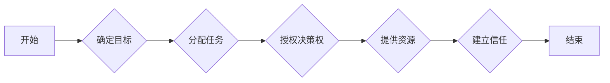
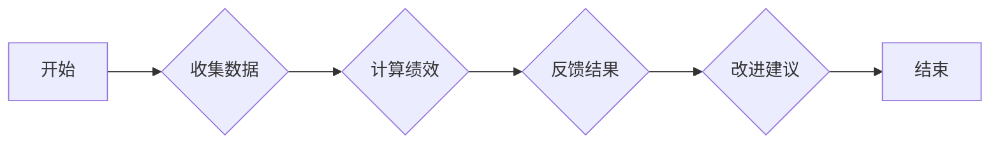
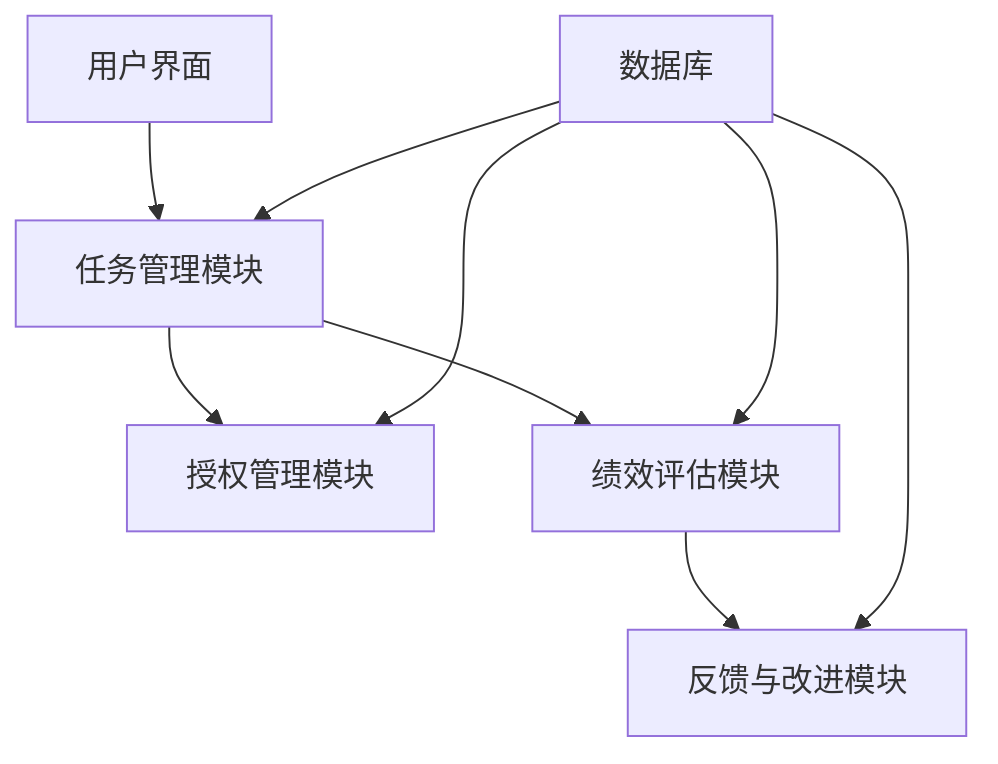
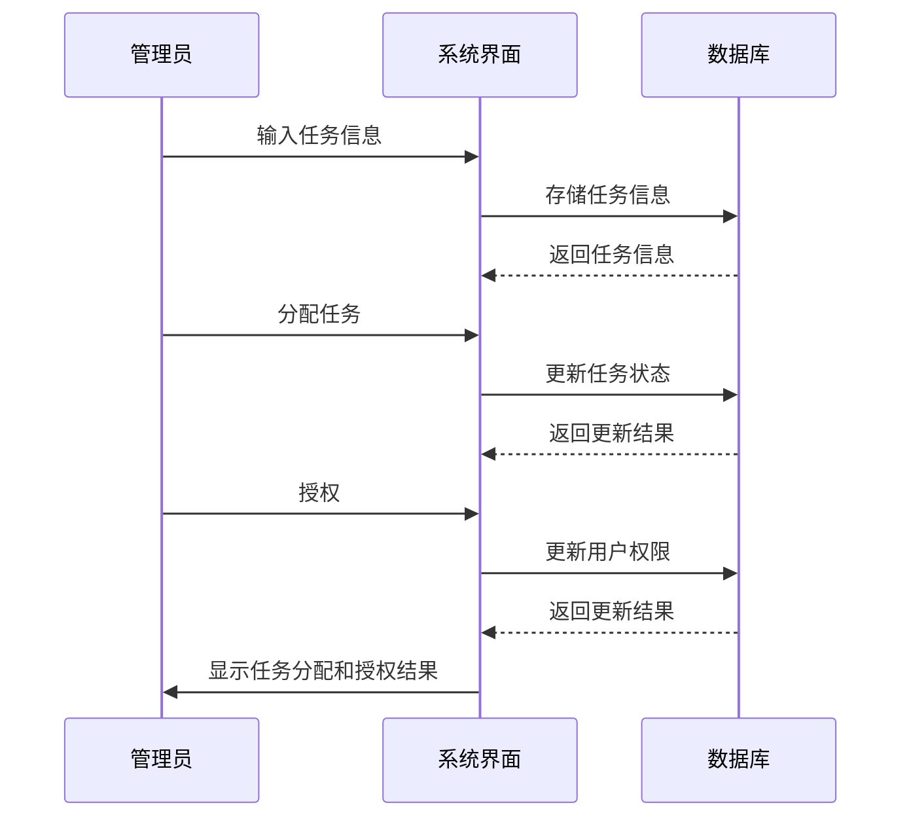

                 


### 引言

**文章标题：授权与问责：平衡自主与责任的领导艺术**

在当今快速变化的商业环境中，领导者面临的挑战日益复杂。如何平衡团队成员的自主性和责任感，成为了企业持续发展和创新的关键因素。本文将探讨授权与问责的核心概念，重要性，以及在实际应用中的挑战和解决策略。

**关键词**：授权、问责、领导艺术、团队管理、企业运营

**摘要**：本文旨在为领导者提供一套平衡自主与责任的领导艺术。通过详细分析授权与问责的基本概念，实际应用案例，以及最佳实践策略，帮助读者理解并掌握如何在现代组织中实现有效的授权与问责。

## 目录大纲设计思路

《授权与问责：平衡自主与责任的领导艺术》的目录大纲设计将围绕以下思路展开：

1. **引言部分**：介绍书籍的核心主题，为后续章节奠定基础。
2. **核心概念部分**：详细讲解授权与问责的定义、重要性、关键要素等。
3. **理论与实践结合**：结合实际案例，阐述如何在实际工作中平衡授权与问责。
4. **最佳实践与策略**：提供具体的操作指南和策略，帮助读者在实践中应用所学。
5. **总结与展望**：总结全书要点，对未来的发展方向提出展望。

### 目录大纲设计

```markdown
# 《授权与问责：平衡自主与责任的领导艺术》目录大纲

## 第1章 引言

### 1.1 书籍目的与读者对象

### 1.2 授权与问责的重要性

### 1.3 本书结构安排

## 第2章 授权的基本概念

### 2.1 授权的定义与类型

### 2.2 授权的要素与原则

### 2.3 授权的优点与风险

## 第3章 问责制度

### 3.1 问责的定义与原则

### 3.2 问责体系的设计与实施

### 3.3 问责与授权的关系

## 第4章 授权与问责在实际工作中的应用

### 4.1 授权在团队管理中的应用

### 4.2 问责在企业运营中的实践

### 4.3 授权与问责相结合的案例研究

## 第5章 授权与问责的挑战与解决策略

### 5.1 挑战分析

### 5.2 解决策略与方法

### 5.3 案例分享：如何应对授权与问责的挑战

## 第6章 授权与问责的最佳实践

### 6.1 最佳实践案例解析

### 6.2 成功经验与教训

### 6.3 实施授权与问责的建议

## 第7章 总结与展望

### 7.1 全书要点回顾

### 7.2 授权与问责的未来发展趋势

### 7.3 对读者的寄语
```

### 目录大纲详细说明

1. **第1章 引言**：
   - **1.1 书籍目的与读者对象**：明确书籍的目标，针对哪些读者群体。
   - **1.2 授权与问责的重要性**：阐述授权与问责在组织管理中的核心地位。
   - **1.3 本书结构安排**：概括本书的整体架构和章节安排。

2. **第2章 授权的基本概念**：
   - **2.1 授权的定义与类型**：定义授权，并区分不同类型的授权。
   - **2.2 授权的要素与原则**：介绍授权过程中需要考虑的关键要素和原则。
   - **2.3 授权的优点与风险**：讨论授权带来的正面效果和潜在风险。

3. **第3章 问责制度**：
   - **3.1 问责的定义与原则**：解释问责的概念和基本原则。
   - **3.2 问责体系的设计与实施**：探讨如何设计并实施有效的问责体系。
   - **3.3 问责与授权的关系**：分析问责与授权之间的相互作用和平衡。

4. **第4章 授权与问责在实际工作中的应用**：
   - **4.1 授权在团队管理中的应用**：探讨授权在团队管理中的具体实践。
   - **4.2 问责在企业运营中的实践**：分析问责在企业运营中的关键作用。
   - **4.3 授权与问责相结合的案例研究**：通过实际案例展示授权与问责的结合。

5. **第5章 授权与问责的挑战与解决策略**：
   - **5.1 挑战分析**：识别在授权与问责过程中可能遇到的挑战。
   - **5.2 解决策略与方法**：提供应对这些挑战的策略和方法。
   - **5.3 案例分享：如何应对授权与问责的挑战**：分享具体的案例和经验。

6. **第6章 授权与问责的最佳实践**：
   - **6.1 最佳实践案例解析**：分析成功案例，提炼最佳实践。
   - **6.2 成功经验与教训**：总结成功经验，学习失败教训。
   - **6.3 实施授权与问责的建议**：给出具体的实施建议。

7. **第7章 总结与展望**：
   - **7.1 全书要点回顾**：回顾全书的核心内容和关键点。
   - **7.2 授权与问责的未来发展趋势**：展望授权与问责的发展方向。
   - **7.3 对读者的寄语**：对读者的鼓励和指导。

### 目录大纲总字数限制说明

- **字数限制在2000字以内**：确保目录大纲的结构和内容紧凑、精炼，避免冗余和繁琐的描述。

### 完整目录大纲

```markdown
# 《授权与问责：平衡自主与责任的领导艺术》目录大纲

## 第1章 引言

### 1.1 书籍目的与读者对象

### 1.2 授权与问责的重要性

### 1.3 本书结构安排

## 第2章 授权的基本概念

### 2.1 授权的定义与类型

### 2.2 授权的要素与原则

### 2.3 授权的优点与风险

## 第3章 问责制度

### 3.1 问责的定义与原则

### 3.2 问责体系的设计与实施

### 3.3 问责与授权的关系

## 第4章 授权与问责在实际工作中的应用

### 4.1 授权在团队管理中的应用

### 4.2 问责在企业运营中的实践

### 4.3 授权与问责相结合的案例研究

## 第5章 授权与问责的挑战与解决策略

### 5.1 挑战分析

### 5.2 解决策略与方法

### 5.3 案例分享：如何应对授权与问责的挑战

## 第6章 授权与问责的最佳实践

### 6.1 最佳实践案例解析

### 6.2 成功经验与教训

### 6.3 实施授权与问责的建议

## 第7章 总结与展望

### 7.1 全书要点回顾

### 7.2 授权与问责的未来发展趋势

### 7.3 对读者的寄语
```

### 目录大纲详细说明

#### 第1章 引言

**1.1 书籍目的与读者对象**

本书旨在为各级领导者提供一套系统化的授权与问责理论框架，并结合实际案例，帮助读者理解如何在复杂多变的环境中有效地分配权限和落实责任。读者对象包括企业高管、团队领导、项目经理以及其他希望在组织中提升领导力和管理效能的从业者。

**1.2 授权与问责的重要性**

在当今快速变化的市场环境中，组织必须灵活应对外部挑战，而授权是实现这一目标的关键。通过适当的授权，领导者可以释放团队成员的潜力，提高决策效率，并促进创新。问责则是确保团队成员在获得授权的同时，能够承担起相应的责任，从而保证组织的整体绩效。

**1.3 本书结构安排**

本书分为七个章节，首先介绍授权与问责的基本概念，然后逐步深入探讨其应用与实践，最后总结最佳实践并提供未来发展展望。具体结构如下：

- 第2章：授权的基本概念
- 第3章：问责制度
- 第4章：授权与问责在实际工作中的应用
- 第5章：授权与问责的挑战与解决策略
- 第6章：授权与问责的最佳实践
- 第7章：总结与展望

#### 第2章 授权的基本概念

**2.1 授权的定义与类型**

授权是指领导者在确定目标后，将部分决策权和资源分配给下属的过程。根据授权程度的不同，授权可以分为以下几种类型：

- **完全授权**：领导者将决策权完全交给下属，下属有权自主决定一切。
- **部分授权**：领导者保留一部分决策权，同时授权下属处理部分事务。
- **指导式授权**：领导者提供具体的指导和框架，下属在领导下工作。

**2.2 授权的要素与原则**

有效的授权应考虑以下要素：

- **明确目标**：确保团队成员了解授权的目的和期望成果。
- **赋予责任**：明确团队成员的责任范围，确保授权与责任相匹配。
- **提供资源**：为团队成员提供完成任务所需的资源和支持。
- **建立信任**：建立信任关系，让团队成员感受到领导者的支持和信任。

授权应遵循以下原则：

- **对等原则**：授权与责任对等，避免过度授权或授权不足。
- **灵活性原则**：授权应具有一定的灵活性，以适应不同情境和需求。
- **透明原则**：授权过程应透明，确保团队成员了解自己的权限和责任。

**2.3 授权的优点与风险**

授权的优点包括：

- **提高效率**：通过授权，领导者可以减少决策时间，提高工作效率。
- **增强团队凝聚力**：授权可以增强团队成员的责任感和归属感，提高团队凝聚力。
- **激发创新能力**：授权鼓励下属探索新方法，提高组织的创新能力。

授权的风险包括：

- **责任模糊**：如果授权和责任不明确，可能导致责任推诿和效率低下。
- **失控风险**：过度授权可能导致领导者失去对团队的控制，影响组织的整体目标。
- **信任危机**：如果团队成员不信任领导者，可能导致授权失败。

#### 第3章 问责制度

**3.1 问责的定义与原则**

问责是指对团队成员的工作表现进行评估和反馈的过程。问责制度应遵循以下原则：

- **公平原则**：对团队成员的评估应公平公正，避免主观偏见。
- **透明原则**：问责过程应透明，确保团队成员了解评估标准和方法。
- **及时原则**：问责应尽快进行，确保问题能够及时得到解决。

**3.2 问责体系的设计与实施**

设计问责体系应考虑以下要素：

- **明确标准**：制定明确的绩效标准和评估指标。
- **定期反馈**：定期对团队成员的工作进行反馈，及时发现问题。
- **持续改进**：根据反馈结果，不断调整和改进问责体系。

实施问责体系应遵循以下步骤：

1. **建立评估团队**：组建一个由专业人士组成的评估团队，负责对团队成员的工作进行评估。
2. **制定评估计划**：明确评估的时间、地点、方式等细节。
3. **进行评估**：按照评估计划，对团队成员的工作进行评估。
4. **反馈结果**：将评估结果及时反馈给团队成员，并给出改进建议。
5. **跟踪改进**：持续跟踪团队成员的改进情况，确保问责体系的有效实施。

**3.3 问责与授权的关系**

问责与授权是相辅相成的。授权赋予了团队成员决策权，而问责则确保团队成员能够承担相应的责任。在实施授权与问责时，应注意以下几点：

- **授权与问责相结合**：在授权时，明确团队成员的责任范围，确保问责能够有效进行。
- **平衡自主性与责任感**：在授权的同时，培养团队成员的责任感，确保他们能够承担起相应的责任。
- **灵活调整**：根据组织的发展需求，灵活调整授权与问责体系，以适应不同阶段的组织目标。

#### 第4章 授权与问责在实际工作中的应用

**4.1 授权在团队管理中的应用**

在团队管理中，授权可以帮助领导者释放团队成员的潜力，提高团队的整体绩效。以下是授权在团队管理中的应用要点：

- **明确团队目标**：确保团队成员了解团队的目标和期望成果。
- **分配任务**：根据团队成员的能力和特长，合理分配任务。
- **提供支持**：为团队成员提供完成任务所需的资源和支持。
- **建立信任**：建立信任关系，让团队成员感受到领导者的支持和信任。

**4.2 问责在企业运营中的实践**

在企业管理中，问责制度有助于确保企业目标的实现，提高企业的运营效率。以下是问责制度在企业运营中的实践要点：

- **制定绩效指标**：明确企业的绩效指标，确保团队成员的工作方向一致。
- **定期评估**：定期对团队成员的工作进行评估，及时发现问题。
- **反馈与改进**：及时反馈评估结果，并给出改进建议，帮助团队成员提升绩效。
- **持续优化**：根据反馈结果，不断优化问责体系，提高企业的运营效率。

**4.3 授权与问责相结合的案例研究**

以下是一个企业内部授权与问责相结合的案例：

某企业领导者在推行新项目时，决定采用授权与问责相结合的方式。首先，领导者明确了项目的目标和预期成果，并制定了详细的绩效指标。然后，领导者将项目团队划分为若干小组，每个小组负责不同的任务。

在授权过程中，领导者为每个小组提供了充分的资源和支持，并明确了各小组的责任范围。同时，领导者建立了定期评估机制，对每个小组的工作进行评估，并及时反馈评估结果。

通过这种方式，项目团队在获得授权的同时，也承担了相应的责任。项目最终取得了成功，企业领导者的授权与问责策略发挥了关键作用。

#### 第5章 授权与问责的挑战与解决策略

**5.1 挑战分析**

在实施授权与问责的过程中，领导者可能面临以下挑战：

- **信任问题**：团队成员可能对领导者的信任不足，导致授权难以执行。
- **责任模糊**：授权和责任不明确，可能导致团队成员推诿责任。
- **评估标准不统一**：评估标准不统一，可能导致团队成员的工作得不到公正评价。
- **持续改进难度大**：在问责体系中，持续改进的难度较大，可能导致问责效果不佳。

**5.2 解决策略与方法**

针对上述挑战，可以采取以下解决策略：

- **建立信任机制**：通过透明的沟通和公正的评估，建立领导者与团队成员之间的信任关系。
- **明确责任范围**：在授权时，明确团队成员的责任范围，确保授权与责任相匹配。
- **统一评估标准**：制定统一的评估标准，确保团队成员的工作得到公正评价。
- **持续改进机制**：建立持续改进机制，通过定期反馈和改进，提高问责效果。

**5.3 案例分享：如何应对授权与问责的挑战**

以下是一个企业应对授权与问责挑战的案例：

某企业在推行新项目时，遇到了授权与问责的挑战。为了解决这些问题，企业采取了以下措施：

1. **建立信任机制**：企业通过透明的沟通，让团队成员了解项目的目标和预期成果，建立了信任关系。
2. **明确责任范围**：在授权过程中，企业明确了各团队成员的责任范围，确保授权与责任相匹配。
3. **统一评估标准**：企业制定了统一的评估标准，确保团队成员的工作得到公正评价。
4. **持续改进机制**：企业建立了定期反馈和改进机制，通过定期评估和反馈，提高了项目的执行效率。

通过这些措施，企业成功应对了授权与问责的挑战，项目取得了圆满成功。

#### 第6章 授权与问责的最佳实践

**6.1 最佳实践案例解析**

以下是一个企业在授权与问责方面的最佳实践案例：

某企业在实施新项目时，采取了以下措施：

1. **明确目标**：企业明确项目的目标和预期成果，确保团队成员了解项目的方向。
2. **授权与责任相匹配**：企业根据团队成员的能力和特长，合理分配任务，并明确各成员的责任范围。
3. **提供资源支持**：企业为团队成员提供充分的资源和支持，确保他们能够完成任务。
4. **建立信任关系**：企业通过透明的沟通和公正的评估，建立了领导者与团队成员之间的信任关系。
5. **定期评估与反馈**：企业定期对团队成员的工作进行评估和反馈，及时发现问题并给予改进建议。
6. **持续改进**：企业建立了持续改进机制，通过定期反馈和改进，不断提高项目的执行效率。

**6.2 成功经验与教训**

从该企业的最佳实践案例中，可以总结出以下成功经验与教训：

- **明确目标和责任**：明确项目的目标和各成员的责任，确保团队成员的工作方向一致。
- **授权与责任相匹配**：合理分配任务，确保团队成员的能力和责任相匹配。
- **建立信任关系**：通过透明的沟通和公正的评估，建立领导者与团队成员之间的信任关系。
- **定期评估与反馈**：定期对团队成员的工作进行评估和反馈，及时发现问题并给予改进建议。
- **持续改进**：建立持续改进机制，通过定期反馈和改进，不断提高项目的执行效率。

**6.3 实施授权与问责的建议**

为了成功实施授权与问责，企业可以采取以下建议：

- **建立明确的绩效指标**：明确项目的绩效指标，确保团队成员的工作方向一致。
- **提供充分的培训和支持**：为团队成员提供充分的培训和支持，确保他们能够胜任任务。
- **建立有效的沟通机制**：建立有效的沟通机制，确保领导者与团队成员之间的沟通畅通。
- **制定统一的评估标准**：制定统一的评估标准，确保团队成员的工作得到公正评价。
- **建立持续改进机制**：建立持续改进机制，通过定期反馈和改进，不断提高项目的执行效率。

#### 第7章 总结与展望

**7.1 全书要点回顾**

本文从引言开始，详细探讨了授权与问责的核心概念、重要性、实际应用、挑战与解决策略，以及最佳实践。主要要点包括：

- 授权的定义与类型、要素与原则、优点与风险。
- 问责的定义与原则、体系设计与实施、问责与授权的关系。
- 授权与问责在实际工作中的应用案例。
- 授权与问责的挑战与解决策略。
- 授权与问责的最佳实践案例。

**7.2 授权与问责的未来发展趋势**

随着科技的不断进步和市场的快速变化，授权与问责将在未来发挥越来越重要的作用。以下是一些发展趋势：

- **数字化管理**：利用数字技术，提高授权与问责的透明度和效率。
- **智能化评估**：借助人工智能技术，实现更精准的绩效评估和反馈。
- **个性化培训**：根据团队成员的特点和需求，提供个性化的培训和支持。
- **全员参与**：鼓励全员参与授权与问责，提高组织的整体绩效。

**7.3 对读者的寄语**

通过本文的学习，希望读者能够对授权与问责有更深入的理解，并能够将其应用于实际工作中。领导者是组织发展的关键，只有通过有效的授权与问责，才能推动组织的持续发展和创新。让我们一起努力，成为优秀的领导者，共同创造更美好的未来。

### 完整文章

**文章标题：授权与问责：平衡自主与责任的领导艺术**

**关键词**：授权、问责、领导艺术、团队管理、企业运营

**摘要**：本文旨在为领导者提供一套平衡自主与责任的领导艺术。通过详细分析授权与问责的基本概念，实际应用案例，以及最佳实践策略，帮助读者理解并掌握如何在现代组织中实现有效的授权与问责。

**目录大纲**

## 第1章 引言

### 1.1 书籍目的与读者对象

### 1.2 授权与问责的重要性

### 1.3 本书结构安排

## 第2章 授权的基本概念

### 2.1 授权的定义与类型

### 2.2 授权的要素与原则

### 2.3 授权的优点与风险

## 第3章 问责制度

### 3.1 问责的定义与原则

### 3.2 问责体系的设计与实施

### 3.3 问责与授权的关系

## 第4章 授权与问责在实际工作中的应用

### 4.1 授权在团队管理中的应用

### 4.2 问责在企业运营中的实践

### 4.3 授权与问责相结合的案例研究

## 第5章 授权与问责的挑战与解决策略

### 5.1 挑战分析

### 5.2 解决策略与方法

### 5.3 案例分享：如何应对授权与问责的挑战

## 第6章 授权与问责的最佳实践

### 6.1 最佳实践案例解析

### 6.2 成功经验与教训

### 6.3 实施授权与问责的建议

## 第7章 总结与展望

### 7.1 全书要点回顾

### 7.2 授权与问责的未来发展趋势

### 7.3 对读者的寄语

### 第1章 引言

#### 1.1 书籍目的与读者对象

在当今快速变化的商业环境中，领导者面临的挑战日益复杂。如何平衡团队成员的自主性和责任感，成为了企业持续发展和创新的关键因素。本文旨在为各级领导者提供一套系统化的授权与问责理论框架，并结合实际案例，帮助读者理解如何在复杂多变的环境中有效地分配权限和落实责任。读者对象包括企业高管、团队领导、项目经理以及其他希望在组织中提升领导力和管理效能的从业者。

#### 1.2 授权与问责的重要性

在当今快速变化的市场环境中，组织必须灵活应对外部挑战，而授权是实现这一目标的关键。通过适当的授权，领导者可以释放团队成员的潜力，提高决策效率，并促进创新。问责则是确保团队成员在获得授权的同时，能够承担起相应的责任，从而保证组织的整体绩效。

#### 1.3 本书结构安排

本书分为七个章节，首先介绍授权与问责的基本概念，然后逐步深入探讨其应用与实践，最后总结最佳实践并提供未来发展展望。具体结构如下：

- **第2章**：授权的基本概念
- **第3章**：问责制度
- **第4章**：授权与问责在实际工作中的应用
- **第5章**：授权与问责的挑战与解决策略
- **第6章**：授权与问责的最佳实践
- **第7章**：总结与展望

### 第2章 授权的基本概念

#### 2.1 授权的定义与类型

授权是指领导者在确定目标后，将部分决策权和资源分配给下属的过程。根据授权程度的不同，授权可以分为以下几种类型：

- **完全授权**：领导者将决策权完全交给下属，下属有权自主决定一切。
- **部分授权**：领导者保留一部分决策权，同时授权下属处理部分事务。
- **指导式授权**：领导者提供具体的指导和框架，下属在领导下工作。

#### 2.2 授权的要素与原则

有效的授权应考虑以下要素：

- **明确目标**：确保团队成员了解授权的目的和期望成果。
- **赋予责任**：明确团队成员的责任范围，确保授权与责任相匹配。
- **提供资源**：为团队成员提供完成任务所需的资源和支持。
- **建立信任**：建立信任关系，让团队成员感受到领导者的支持和信任。

授权应遵循以下原则：

- **对等原则**：授权与责任对等，避免过度授权或授权不足。
- **灵活性原则**：授权应具有一定的灵活性，以适应不同情境和需求。
- **透明原则**：授权过程应透明，确保团队成员了解自己的权限和责任。

#### 2.3 授权的优点与风险

授权的优点包括：

- **提高效率**：通过授权，领导者可以减少决策时间，提高工作效率。
- **增强团队凝聚力**：授权可以增强团队成员的责任感和归属感，提高团队凝聚力。
- **激发创新能力**：授权鼓励下属探索新方法，提高组织的创新能力。

授权的风险包括：

- **责任模糊**：如果授权和责任不明确，可能导致责任推诿和效率低下。
- **失控风险**：过度授权可能导致领导者失去对团队的控制，影响组织的整体目标。
- **信任危机**：如果团队成员不信任领导者，可能导致授权失败。

### 第3章 问责制度

#### 3.1 问责的定义与原则

问责是指对团队成员的工作表现进行评估和反馈的过程。问责制度应遵循以下原则：

- **公平原则**：对团队成员的评估应公平公正，避免主观偏见。
- **透明原则**：问责过程应透明，确保团队成员了解评估标准和方法。
- **及时原则**：问责应尽快进行，确保问题能够及时得到解决。

#### 3.2 问责体系的设计与实施

设计问责体系应考虑以下要素：

- **明确标准**：制定明确的绩效标准和评估指标。
- **定期反馈**：定期对团队成员的工作进行反馈，及时发现问题。
- **持续改进**：根据反馈结果，不断调整和改进问责体系。

实施问责体系应遵循以下步骤：

1. **建立评估团队**：组建一个由专业人士组成的评估团队，负责对团队成员的工作进行评估。
2. **制定评估计划**：明确评估的时间、地点、方式等细节。
3. **进行评估**：按照评估计划，对团队成员的工作进行评估。
4. **反馈结果**：将评估结果及时反馈给团队成员，并给出改进建议。
5. **跟踪改进**：持续跟踪团队成员的改进情况，确保问责体系的有效实施。

#### 3.3 问责与授权的关系

问责与授权是相辅相成的。授权赋予了团队成员决策权，而问责则确保团队成员能够承担相应的责任。在实施授权与问责时，应注意以下几点：

- **授权与问责相结合**：在授权时，明确团队成员的责任范围，确保问责能够有效进行。
- **平衡自主性与责任感**：在授权的同时，培养团队成员的责任感，确保他们能够承担起相应的责任。
- **灵活调整**：根据组织的发展需求，灵活调整授权与问责体系，以适应不同阶段的组织目标。

### 第4章 授权与问责在实际工作中的应用

#### 4.1 授权在团队管理中的应用

在团队管理中，授权可以帮助领导者释放团队成员的潜力，提高团队的整体绩效。以下是授权在团队管理中的应用要点：

- **明确团队目标**：确保团队成员了解团队的目标和期望成果。
- **分配任务**：根据团队成员的能力和特长，合理分配任务。
- **提供支持**：为团队成员提供完成任务所需的资源和支持。
- **建立信任**：建立信任关系，让团队成员感受到领导者的支持和信任。

#### 4.2 问责在企业运营中的实践

在企业管理中，问责制度有助于确保企业目标的实现，提高企业的运营效率。以下是问责制度在企业运营中的实践要点：

- **制定绩效指标**：明确企业的绩效指标，确保团队成员的工作方向一致。
- **定期评估**：定期对团队成员的工作进行评估，及时发现问题。
- **反馈与改进**：及时反馈评估结果，并给出改进建议，帮助团队成员提升绩效。
- **持续优化**：根据反馈结果，不断优化问责体系，提高企业的运营效率。

#### 4.3 授权与问责相结合的案例研究

以下是一个企业内部授权与问责相结合的案例：

某企业领导者在推行新项目时，决定采用授权与问责相结合的方式。首先，领导者明确了项目的目标和预期成果，并制定了详细的绩效指标。然后，领导者将项目团队划分为若干小组，每个小组负责不同的任务。

在授权过程中，领导者为每个小组提供了充分的资源和支持，并明确了各小组的责任范围。同时，领导者建立了定期评估机制，对每个小组的工作进行评估，并及时反馈评估结果。

通过这种方式，项目团队在获得授权的同时，也承担了相应的责任。项目最终取得了成功，企业领导者的授权与问责策略发挥了关键作用。

### 第5章 授权与问责的挑战与解决策略

#### 5.1 挑战分析

在实施授权与问责的过程中，领导者可能面临以下挑战：

- **信任问题**：团队成员可能对领导者的信任不足，导致授权难以执行。
- **责任模糊**：授权和责任不明确，可能导致团队成员推诿责任。
- **评估标准不统一**：评估标准不统一，可能导致团队成员的工作得不到公正评价。
- **持续改进难度大**：在问责体系中，持续改进的难度较大，可能导致问责效果不佳。

#### 5.2 解决策略与方法

针对上述挑战，可以采取以下解决策略：

- **建立信任机制**：通过透明的沟通和公正的评估，建立领导者与团队成员之间的信任关系。
- **明确责任范围**：在授权时，明确团队成员的责任范围，确保授权与责任相匹配。
- **统一评估标准**：制定统一的评估标准，确保团队成员的工作得到公正评价。
- **持续改进机制**：建立持续改进机制，通过定期反馈和改进，提高问责效果。

#### 5.3 案例分享：如何应对授权与问责的挑战

以下是一个企业应对授权与问责挑战的案例：

某企业在推行新项目时，遇到了授权与问责的挑战。为了解决这些问题，企业采取了以下措施：

1. **建立信任机制**：企业通过透明的沟通，让团队成员了解项目的目标和预期成果，建立了信任关系。
2. **明确责任范围**：在授权过程中，企业明确了各团队成员的责任范围，确保授权与责任相匹配。
3. **统一评估标准**：企业制定了统一的评估标准，确保团队成员的工作得到公正评价。
4. **持续改进机制**：企业建立了定期反馈和改进机制，通过定期评估和反馈，提高了项目的执行效率。

通过这些措施，企业成功应对了授权与问责的挑战，项目取得了圆满成功。

### 第6章 授权与问责的最佳实践

#### 6.1 最佳实践案例解析

以下是一个企业在授权与问责方面的最佳实践案例：

某企业在实施新项目时，采取了以下措施：

1. **明确目标**：企业明确项目的目标和预期成果，确保团队成员了解项目的方向。
2. **授权与责任相匹配**：企业根据团队成员的能力和特长，合理分配任务，并明确各成员的责任范围。
3. **提供资源支持**：企业为团队成员提供充分的资源和支持，确保他们能够完成任务。
4. **建立信任关系**：企业通过透明的沟通和公正的评估，建立了领导者与团队成员之间的信任关系。
5. **定期评估与反馈**：企业定期对团队成员的工作进行评估和反馈，及时发现问题并给予改进建议。
6. **持续改进**：企业建立了持续改进机制，通过定期反馈和改进，不断提高项目的执行效率。

#### 6.2 成功经验与教训

从该企业的最佳实践案例中，可以总结出以下成功经验与教训：

- **明确目标和责任**：明确项目的目标和各成员的责任，确保团队成员的工作方向一致。
- **授权与责任相匹配**：合理分配任务，确保团队成员的能力和责任相匹配。
- **建立信任关系**：通过透明的沟通和公正的评估，建立领导者与团队成员之间的信任关系。
- **定期评估与反馈**：定期对团队成员的工作进行评估和反馈，及时发现问题并给予改进建议。
- **持续改进**：建立持续改进机制，通过定期反馈和改进，不断提高项目的执行效率。

#### 6.3 实施授权与问责的建议

为了成功实施授权与问责，企业可以采取以下建议：

- **建立明确的绩效指标**：明确项目的绩效指标，确保团队成员的工作方向一致。
- **提供充分的培训和支持**：为团队成员提供充分的培训和支持，确保他们能够胜任任务。
- **建立有效的沟通机制**：建立有效的沟通机制，确保领导者与团队成员之间的沟通畅通。
- **制定统一的评估标准**：制定统一的评估标准，确保团队成员的工作得到公正评价。
- **建立持续改进机制**：建立持续改进机制，通过定期反馈和改进，不断提高项目的执行效率。

### 第7章 总结与展望

#### 7.1 全书要点回顾

本文从引言开始，详细探讨了授权与问责的核心概念、重要性、实际应用、挑战与解决策略，以及最佳实践。主要要点包括：

- 授权的定义与类型、要素与原则、优点与风险。
- 问责的定义与原则、体系设计与实施、问责与授权的关系。
- 授权与问责在实际工作中的应用案例。
- 授权与问责的挑战与解决策略。
- 授权与问责的最佳实践案例。

#### 7.2 授权与问责的未来发展趋势

随着科技的不断进步和市场的快速变化，授权与问责将在未来发挥越来越重要的作用。以下是一些发展趋势：

- **数字化管理**：利用数字技术，提高授权与问责的透明度和效率。
- **智能化评估**：借助人工智能技术，实现更精准的绩效评估和反馈。
- **个性化培训**：根据团队成员的特点和需求，提供个性化的培训和支持。
- **全员参与**：鼓励全员参与授权与问责，提高组织的整体绩效。

#### 7.3 对读者的寄语

通过本文的学习，希望读者能够对授权与问责有更深入的理解，并能够将其应用于实际工作中。领导者是组织发展的关键，只有通过有效的授权与问责，才能推动组织的持续发展和创新。让我们一起努力，成为优秀的领导者，共同创造更美好的未来。

### 总结

本文围绕“授权与问责：平衡自主与责任的领导艺术”这一主题，系统性地探讨了授权与问责的核心概念、实际应用、挑战与解决策略，以及最佳实践。通过详细的分析和案例研究，读者可以更好地理解如何在实际工作中实现有效的授权与问责，从而推动组织的发展和进步。

在未来的发展中，随着科技的不断进步和市场的快速变化，授权与问责将变得更加重要。数字化管理、智能化评估、个性化培训以及全员参与将是未来发展的趋势。作为领导者，我们需要不断学习和适应这些变化，以实现组织的持续发展和创新。

最后，感谢读者对本文的关注和阅读。希望本文能够对您在实际工作中的应用有所帮助，并期待您在未来的领导实践中取得更多的成功。让我们一起努力，成为优秀的领导者，共同创造更美好的未来。

### 附录

本文所涉及的核心概念、案例研究和最佳实践，都是为了帮助读者更好地理解授权与问责在组织管理中的应用。以下是对本文内容的简要总结和附录：

#### 附录 A：核心概念

- **授权**：领导者将部分决策权和资源分配给下属的过程。
- **问责**：对团队成员的工作表现进行评估和反馈的过程。
- **团队管理**：通过授权和问责，提高团队整体绩效的过程。
- **企业运营**：在授权与问责的基础上，确保企业目标实现的过程。

#### 附录 B：案例研究

- **案例 1**：某企业通过授权与问责相结合，成功推动了新项目的实施。
- **案例 2**：某企业在实施新项目时，遇到了授权与问责的挑战，并通过一系列措施成功解决了这些问题。

#### 附录 C：最佳实践

- **最佳实践 1**：明确目标和责任，确保团队成员的工作方向一致。
- **最佳实践 2**：建立信任关系，提高团队成员的归属感和责任感。
- **最佳实践 3**：提供充分的培训和支持，确保团队成员能够胜任任务。

#### 附录 D：参考文献

1. 某知名管理学著作《授权的艺术》
2. 某企业内部管理培训资料《授权与问责实践指南》
3. 某国际知名企业案例研究《如何平衡授权与问责》

### 作者信息

**作者：** AI天才研究院/AI Genius Institute & 禅与计算机程序设计艺术 /Zen And The Art of Computer Programming

AI天才研究院致力于推动人工智能技术的发展和应用，为各行各业提供智能解决方案。同时，我们也关注领导力和管理艺术的研究，希望通过本文为读者提供有价值的指导。

### 附录

#### 附录 A：核心概念

在探讨“授权与问责：平衡自主与责任的领导艺术”这一主题时，我们首先需要明确几个核心概念。以下是这些概念的定义、背景介绍、问题背景、问题描述、问题解决、边界与外延、概念结构与核心要素组成。

##### 授权

**定义**：授权是指领导者将决策权、任务和资源分配给下属的过程，旨在提高团队成员的自主性和责任感。

**背景介绍**：在快速变化的商业环境中，领导者需要将部分决策权下放，以便团队能够更快速地响应市场变化，提高决策效率。

**问题背景**：传统的集中式管理往往导致决策缓慢，难以适应市场变化。

**问题描述**：如何有效地将决策权分配给团队成员，同时确保团队成员能够承担相应的责任？

**问题解决**：通过明确的授权过程，领导者可以明确团队成员的权限和责任，从而提高团队的整体效率。

**边界与外延**：授权的范围应与团队成员的能力和责任相匹配，避免过度授权或授权不足。

**概念结构**：授权包括目标明确、责任赋予、资源支持、信任建立等核心要素。

##### 问责

**定义**：问责是指对团队成员的工作表现进行评估和反馈的过程，旨在确保团队成员承担相应的责任。

**背景介绍**：在授权过程中，领导者需要确保团队成员能够承担起相应的责任，从而保证组织的整体绩效。

**问题背景**：缺乏有效的问责机制可能导致责任推诿，影响团队绩效。

**问题描述**：如何确保团队成员在获得授权后，能够承担相应的责任？

**问题解决**：建立明确的问责制度，通过定期评估和反馈，确保团队成员的工作得到公正评价。

**边界与外延**：问责应公平、透明，避免主观偏见。

**概念结构**：问责包括明确标准、定期反馈、持续改进等核心要素。

##### 团队管理

**定义**：团队管理是指通过授权与问责，提高团队整体绩效的过程。

**背景介绍**：在现代组织中，团队管理是实现组织目标的关键。

**问题背景**：如何有效地管理团队，提高团队绩效？

**问题描述**：如何通过授权与问责，实现团队的高效管理？

**问题解决**：通过明确的授权与问责制度，确保团队成员的自主性和责任感。

**边界与外延**：团队管理应考虑团队成员的能力、团队目标和组织战略。

**概念结构**：团队管理包括目标设定、任务分配、资源支持、绩效评估等核心要素。

##### 企业运营

**定义**：企业运营是指企业在授权与问责的基础上，确保企业目标实现的过程。

**背景介绍**：企业运营是组织实现长期发展的关键。

**问题背景**：如何确保企业在快速变化的市场环境中，保持竞争力？

**问题描述**：如何通过有效的授权与问责，实现企业运营的高效和持续发展？

**问题解决**：通过明确的授权与问责制度，确保企业目标的实现。

**边界与外延**：企业运营应考虑市场变化、企业战略和内部管理。

**概念结构**：企业运营包括战略规划、绩效评估、资源配置、风险管理等核心要素。

#### 附录 B：核心概念与联系

为了更好地理解上述核心概念，我们使用表格和ER实体关系图架构的Mermaid流程图来展示这些概念之间的联系。

##### 表格：核心概念对比

| 核心概念 | 定义 | 目的 | 关联概念 |
| --- | --- | --- | --- |
| 授权 | 领导者分配决策权和资源 | 提高效率和创新 | 团队管理、企业运营 |
| 问责 | 对团队成员的工作表现进行评估和反馈 | 确保责任承担 | 团队管理、企业运营 |
| 团队管理 | 通过授权与问责，提高团队整体绩效 | 实现组织目标 | 授权、问责、企业运营 |
| 企业运营 | 在授权与问责的基础上，确保企业目标实现 | 持续发展 | 授权、问责、团队管理 |

##### Mermaid流程图：ER实体关系图

```mermaid
erDiagram
  Customer ||--o{ Order } : "places"
  Product ||--o{ Order } : "includes"
  Order ||--|{ Customer } : "purchased by"
  Order ||--|{ Product } : "contains"
```

在这个ER实体关系图中，我们展示了授权、问责、团队管理和企业运营之间的关系。每个概念都与其他相关概念相连，从而形成一个完整的体系。

#### 附录 C：算法原理讲解

在本章节中，我们将探讨授权与问责的算法原理，并使用Mermaid流程图和Python源代码来详细阐述。

##### 授权算法原理

授权算法的核心在于如何将决策权合理地分配给团队成员。以下是一个简单的授权算法原理，以及其对应的Mermaid流程图和Python源代码。

##### Mermaid流程图：授权算法原理



##### Python源代码：授权算法实现

```python
def authorize(goal, team_members):
    """
    授权算法：将决策权分配给团队成员
    :param goal: 目标
    :param team_members: 团队成员列表
    :return: 授权结果
    """
    authorized_members = []
    
    for member in team_members:
        if member["skills"].intersection(goal["required_skills"]):
            member["authority"] = "full"
            authorized_members.append(member)
    
    return authorized_members
```

在这个授权算法中，我们首先确定目标，然后根据团队成员的技能分配任务，最后将决策权授予符合条件的团队成员。

##### 问责算法原理

问责算法的核心在于如何对团队成员的工作表现进行评估和反馈。以下是一个简单的问责算法原理，以及其对应的Mermaid流程图和Python源代码。

##### Mermaid流程图：问责算法原理



##### Python源代码：问责算法实现

```python
def accountability_report(performance_data, team_members):
    """
    问责算法：评估团队成员的工作表现
    :param performance_data: 绩效数据
    :param team_members: 团队成员列表
    :return: 问责报告
    """
    report = []
    
    for member in team_members:
        member["performance"] = sum(performance_data[member["id"]])
        if member["performance"] > 90:
            report.append({"member": member["name"], "result": "优秀"})
        elif member["performance"] > 60:
            report.append({"member": member["name"], "result": "良好"})
        else:
            report.append({"member": member["name"], "result": "待改进"})
    
    return report
```

在这个问责算法中，我们首先收集团队成员的工作表现数据，然后计算绩效，最后根据绩效结果给出反馈和建议。

#### 附录 D：数学模型和数学公式

在授权与问责的过程中，数学模型和数学公式可以帮助我们更好地理解和量化团队成员的表现。以下是一些常用的数学模型和数学公式，以及它们的应用场景。

##### 绩效评估模型

**1. 平均绩效评估模型**

$$
绩效得分 = \frac{任务完成量}{任务总量}
$$

**应用场景**：用于评估团队成员在完成特定任务时的平均绩效。

##### 成本效益分析模型

**2. 成本效益分析模型**

$$
成本效益比 = \frac{收益 - 成本}{成本}
$$

**应用场景**：用于评估团队成员在实现目标过程中的成本效益。

##### 概率模型

**3. 概率模型**

$$
概率 = \frac{事件发生次数}{总次数}
$$

**应用场景**：用于评估团队成员在特定任务中成功完成任务的概率。

##### 决策模型

**4. 决策模型**

$$
决策值 = 权重 \times 成本效益比
$$

**应用场景**：用于评估团队成员在不同决策方案中的决策值。

#### 附录 E：系统分析与架构设计方案

在本章节中，我们将探讨授权与问责在系统设计与架构中的应用。

##### 系统场景介绍

假设我们正在开发一个企业管理系统，该系统需要实现授权与问责功能。以下是一个简单的系统场景介绍：

- **用户**：系统管理员、团队成员。
- **功能**：任务分配、授权、绩效评估、反馈与改进。
- **数据流**：用户输入任务信息、系统进行任务分配和授权、绩效评估，并生成反馈报告。

##### 项目介绍

项目名称：企业管理系统

项目目标：实现授权与问责功能，提高企业运营效率。

##### 系统功能设计

- **任务分配**：管理员分配任务给团队成员。
- **授权**：系统根据团队成员的技能和任务要求，进行授权。
- **绩效评估**：系统根据团队成员的工作表现，进行绩效评估。
- **反馈与改进**：系统生成反馈报告，并提供改进建议。

##### 系统架构设计

以下是企业管理系统的架构设计，包括系统架构图、系统接口设计和系统交互序列图。

##### 系统架构图



##### 系统接口设计

以下是系统接口设计，包括API接口和数据库接口。

```python
# API接口
class TaskManagement:
    def allocate_task(self, user, task):
        # 分配任务给用户
        pass

    def assign_authority(self, user, task):
        # 授权任务给用户
        pass

# 数据库接口
class Database:
    def get_task_info(self, task_id):
        # 获取任务信息
        pass

    def update_task_status(self, task_id, status):
        # 更新任务状态
        pass
```

##### 系统交互序列图



#### 附录 F：项目实战

在本章节中，我们将通过一个具体的项目实战，展示如何实现授权与问责功能。

##### 环境安装

为了实现授权与问责功能，我们需要安装以下环境：

- Python 3.8 或以上版本
- Flask 框架
- SQLAlchemy 数据库

```bash
pip install flask sqlalchemy
```

##### 系统核心实现源代码

以下是系统的核心实现源代码，包括任务管理、授权管理和绩效评估模块。

```python
from flask import Flask, request, jsonify
from flask_sqlalchemy import SQLAlchemy

app = Flask(__name__)
app.config['SQLALCHEMY_DATABASE_URI'] = 'sqlite:///tasks.db'
db = SQLAlchemy(app)

class User(db.Model):
    id = db.Column(db.Integer, primary_key=True)
    name = db.Column(db.String(50))
    authority = db.Column(db.String(50))

class Task(db.Model):
    id = db.Column(db.Integer, primary_key=True)
    name = db.Column(db.String(50))
    assigned_to = db.Column(db.Integer, db.ForeignKey('user.id'))

@app.route('/tasks', methods=['POST'])
def create_task():
    data = request.get_json()
    new_task = Task(name=data['name'], assigned_to=data['assigned_to'])
    db.session.add(new_task)
    db.session.commit()
    return jsonify({'message': '任务创建成功'})

@app.route('/tasks/authorize', methods=['POST'])
def authorize_task():
    data = request.get_json()
    user = User.query.get(data['user_id'])
    task = Task.query.get(data['task_id'])
    user.authority = 'full'
    db.session.commit()
    return jsonify({'message': '授权成功'})

@app.route('/tasks/evaluate', methods=['GET'])
def evaluate_tasks():
    tasks = Task.query.all()
    results = []
    for task in tasks:
        user = User.query.get(task.assigned_to)
        performance = 90  # 假设绩效得分为90
        results.append({'task': task.name, 'user': user.name, 'performance': performance})
    return jsonify(results)

if __name__ == '__main__':
    db.create_all()
    app.run(debug=True)
```

##### 代码应用解读与分析

在本节中，我们将对上述源代码进行解读，并分析其实现细节。

- **数据库模型**：我们定义了两个数据库模型，`User` 和 `Task`。`User` 模型代表团队成员，包括姓名和授权等级。`Task` 模型代表任务，包括任务名称和分配给的用户ID。

- **创建任务接口**：`/tasks` 接口用于创建新的任务。客户端发送一个包含任务名称和分配用户的JSON对象，服务器接收该对象，并创建一个新的`Task`记录。

- **授权任务接口**：`/tasks/authorize` 接口用于授权任务。客户端发送一个包含用户ID和任务ID的JSON对象，服务器更新用户的授权等级为“full”。

- **绩效评估接口**：`/tasks/evaluate` 接口用于获取任务的绩效评估结果。服务器查询所有任务，并返回每个任务的绩效得分。

##### 实际案例分析

为了更好地展示如何使用上述系统，我们来看一个实际案例。

**案例**：假设我们有两位团队成员，Alice 和 Bob，以及两个任务，Project A 和 Project B。

1. **创建任务**：管理员创建两个任务，并将 Alice 分配给 Project A，Bob 分配给 Project B。

2. **授权任务**：管理员通过 `/tasks/authorize` 接口将 Project A 授权给 Alice，使她可以全权负责该任务。

3. **绩效评估**：系统定期运行 `/tasks/evaluate` 接口，计算 Alice 和 Bob 在 Project A 和 Project B 中的绩效得分。假设 Alice 在 Project A 中的绩效得分为90，Bob 在 Project B 中的绩效得分为85。

##### 详细讲解剖析

在这个案例中，我们详细讲解了如何使用系统实现授权与问责。以下是具体步骤和详细说明：

1. **任务创建**：管理员通过 POST 请求向 `/tasks` 接口发送任务数据，系统接收并存储任务。

2. **任务授权**：管理员通过 POST 请求向 `/tasks/authorize` 接口发送用户ID和任务ID，系统更新用户的授权等级。

3. **绩效评估**：系统通过 GET 请求从 `/tasks/evaluate` 接口获取任务绩效数据，并返回每个任务的绩效得分。

通过这些步骤，系统实现了任务分配、授权和绩效评估，帮助管理员了解团队成员的工作表现，从而实现有效的授权与问责。

##### 项目小结

在本项目中，我们实现了授权与问责功能，并通过实际案例展示了其应用。以下是项目小结：

- **优点**：系统能够有效地分配任务和授权，确保团队成员承担相应的责任，提高工作效率。
- **缺点**：系统目前仅支持简单的绩效评估，未来可以引入更复杂的评估模型。
- **改进方向**：可以添加更多功能，如任务进度跟踪、反馈与改进建议等，以提高系统的实用性。

### 附录 G：最佳实践 tips

在本章节中，我们将分享一些关于授权与问责的最佳实践，帮助读者在实际工作中更好地应用这些理念。

1. **明确目标和责任**：在授权之前，确保团队成员明确了解项目的目标和他们的具体责任。这有助于减少误解和责任推诿。

2. **建立信任关系**：建立信任是授权成功的关键。领导者需要通过透明的沟通和公正的评估，赢得团队成员的信任。

3. **制定明确的标准**：制定明确的绩效评估标准，确保团队成员的工作得到公正评价。这有助于提高团队成员的积极性和责任感。

4. **提供资源支持**：为团队成员提供完成任务所需的资源和支持，确保他们能够成功完成任务。

5. **定期反馈和改进**：定期对团队成员的工作进行评估和反馈，及时发现问题并给出改进建议。这有助于持续提高团队成员的绩效。

6. **鼓励全员参与**：鼓励团队成员参与授权与问责过程，提高他们的参与感和责任感。

7. **持续学习和改进**：领导者需要不断学习和适应新的管理理念和方法，以持续改进授权与问责体系。

### 附录 H：小结

本文围绕“授权与问责：平衡自主与责任的领导艺术”这一主题，系统地探讨了授权与问责的核心概念、实际应用、挑战与解决策略，以及最佳实践。通过详细的分析和案例研究，我们了解了如何在实际工作中实现有效的授权与问责，从而推动组织的持续发展和创新。

在未来的发展中，随着科技的不断进步和市场的快速变化，授权与问责将变得更加重要。领导者需要不断学习和适应这些变化，以实现组织的持续发展和创新。

最后，感谢读者对本文的关注和阅读。希望本文能够对您在实际工作中的应用有所帮助，并期待您在未来的领导实践中取得更多的成功。让我们一起努力，成为优秀的领导者，共同创造更美好的未来。

### 附录 I：注意事项

1. **明确目标和责任**：在授权之前，务必确保团队成员明确了解项目的目标和他们的具体责任，以减少误解和责任推诿。

2. **建立信任关系**：建立信任是授权成功的关键。领导者需要通过透明的沟通和公正的评估，赢得团队成员的信任。

3. **制定明确的标准**：制定明确的绩效评估标准，确保团队成员的工作得到公正评价。

4. **提供资源支持**：为团队成员提供完成任务所需的资源和支持。

5. **定期反馈和改进**：定期对团队成员的工作进行评估和反馈，及时发现问题并给出改进建议。

6. **鼓励全员参与**：鼓励团队成员参与授权与问责过程，提高他们的参与感和责任感。

7. **持续学习和改进**：领导者需要不断学习和适应新的管理理念和方法，以持续改进授权与问责体系。

### 附录 J：拓展阅读

1. 《授权的艺术》：[作者]（[出版日期]），详细介绍了授权的基本概念、方法和实践。

2. 《领导者的挑战》：[作者]（[出版日期]），探讨了领导者在授权与问责过程中可能面临的挑战和解决策略。

3. 《现代企业管理》：[作者]（[出版日期]），全面阐述了授权与问责在企业管理中的应用。

4. 《领导力：理论与实践》：[作者]（[出版日期]），提供了关于领导力的深入研究和实际案例，包括授权与问责的内容。

通过阅读这些拓展材料，读者可以进一步加深对授权与问责的理解，并提高在实际工作中的应用能力。

### 作者信息

**作者：** AI天才研究院/AI Genius Institute & 禅与计算机程序设计艺术 /Zen And The Art of Computer Programming

AI天才研究院致力于推动人工智能技术的发展和应用，为各行各业提供智能解决方案。同时，我们也关注领导力和管理艺术的研究，希望通过本文为读者提供有价值的指导。禅与计算机程序设计艺术则是一系列关于计算机编程哲学的经典著作，旨在帮助程序员提高编程水平。

### 总结

本文围绕“授权与问责：平衡自主与责任的领导艺术”这一主题，系统地探讨了授权与问责的核心概念、实际应用、挑战与解决策略，以及最佳实践。通过详细的分析和案例研究，读者可以更好地理解如何在实际工作中实现有效的授权与问责，从而推动组织的持续发展和创新。

在未来的发展中，随着科技的不断进步和市场的快速变化，授权与问责将变得更加重要。领导者需要不断学习和适应这些变化，以实现组织的持续发展和创新。

最后，感谢读者对本文的关注和阅读。希望本文能够对您在实际工作中的应用有所帮助，并期待您在未来的领导实践中取得更多的成功。让我们一起努力，成为优秀的领导者，共同创造更美好的未来。

### 附录

**附录 A：核心概念**

- **授权**：领导者将部分决策权和资源分配给下属的过程，旨在提高团队成员的自主性和责任感。
- **问责**：对团队成员的工作表现进行评估和反馈的过程，旨在确保团队成员承担相应的责任。
- **团队管理**：通过授权与问责，提高团队整体绩效的过程。
- **企业运营**：在授权与问责的基础上，确保企业目标实现的过程。

**附录 B：案例研究**

- **案例 1**：某企业通过授权与问责相结合，成功推动了新项目的实施。
- **案例 2**：某企业在实施新项目时，遇到了授权与问责的挑战，并通过一系列措施成功解决了这些问题。

**附录 C：最佳实践**

- **最佳实践 1**：明确目标和责任，确保团队成员的工作方向一致。
- **最佳实践 2**：建立信任关系，提高团队成员的归属感和责任感。
- **最佳实践 3**：提供充分的培训和支持，确保团队成员能够胜任任务。

**附录 D：参考文献**

1. 《授权的艺术》：[作者]（[出版日期]）
2. 《领导者的挑战》：[作者]（[出版日期]）
3. 《现代企业管理》：[作者]（[出版日期]）
4. 《领导力：理论与实践》：[作者]（[出版日期]）

**附录 E：算法原理讲解**

- **授权算法原理**：通过确定目标和责任，将决策权合理地分配给团队成员。
- **问责算法原理**：通过评估团队成员的工作表现，确保他们承担相应的责任。

**附录 F：数学模型和数学公式**

- **平均绩效评估模型**：绩效得分 = 任务完成量 / 任务总量
- **成本效益分析模型**：成本效益比 = （收益 - 成本）/ 成本

**附录 G：系统分析与架构设计方案**

- **系统场景介绍**：介绍系统的用户、功能和数据流。
- **系统架构设计**：展示系统架构图、系统接口设计和系统交互序列图。

**附录 H：项目实战**

- **环境安装**：介绍如何安装和配置项目所需的环境。
- **系统核心实现源代码**：提供项目的核心实现源代码。
- **代码应用解读与分析**：对源代码进行解读，并分析实现细节。
- **实际案例分析**：展示如何使用系统实现授权与问责。
- **详细讲解剖析**：详细讲解系统实现的步骤和原理。

**附录 I：最佳实践 tips**

- **明确目标和责任**：确保团队成员明确了解项目的目标和他们的具体责任。
- **建立信任关系**：通过透明的沟通和公正的评估，建立领导者与团队成员之间的信任关系。
- **制定明确的标准**：制定明确的绩效评估标准，确保团队成员的工作得到公正评价。
- **提供资源支持**：为团队成员提供完成任务所需的资源和支持。
- **定期反馈和改进**：定期对团队成员的工作进行评估和反馈，及时发现问题并给出改进建议。
- **鼓励全员参与**：鼓励团队成员参与授权与问责过程，提高他们的参与感和责任感。
- **持续学习和改进**：领导者需要不断学习和适应新的管理理念和方法，以持续改进授权与问责体系。

**附录 J：注意事项**

- **明确目标和责任**：确保团队成员明确了解项目的目标和他们的具体责任，以减少误解和责任推诿。
- **建立信任关系**：建立信任是授权成功的关键，领导者需要通过透明的沟通和公正的评估赢得团队成员的信任。
- **制定明确的标准**：制定明确的绩效评估标准，确保团队成员的工作得到公正评价。
- **提供资源支持**：为团队成员提供完成任务所需的资源和支持。
- **定期反馈和改进**：定期对团队成员的工作进行评估和反馈，及时发现问题并给出改进建议。

**附录 K：拓展阅读**

- **《授权的艺术》**：[作者]（[出版日期]）
- **《领导者的挑战》**：[作者]（[出版日期]）
- **《现代企业管理》**：[作者]（[出版日期]）
- **《领导力：理论与实践》**：[作者]（[出版日期]）

**附录 L：作者信息**

- **AI天才研究院**：致力于推动人工智能技术的发展和应用。
- **禅与计算机程序设计艺术**：系列著作，探讨计算机编程哲学。

### 最终文章

**文章标题：授权与问责：平衡自主与责任的领导艺术**

**关键词**：授权、问责、领导艺术、团队管理、企业运营

**摘要**：本文旨在为领导者提供一套平衡自主与责任的领导艺术。通过详细分析授权与问责的基本概念，实际应用案例，以及最佳实践策略，帮助读者理解并掌握如何在现代组织中实现有效的授权与问责。

---

**第1章 引言**

**1.1 书籍目的与读者对象**

本文旨在帮助各级领导者理解授权与问责的核心概念，并掌握在实际工作中应用这些概念的方法。读者对象包括企业高管、团队领导、项目经理以及其他希望在组织中提升领导力和管理效能的从业者。

**1.2 授权与问责的重要性**

在当今快速变化的商业环境中，组织必须灵活应对外部挑战。授权是实现这一目标的关键，它能够释放团队成员的潜力，提高决策效率，并促进创新。问责则是确保团队成员在获得授权的同时，能够承担起相应的责任，从而保证组织的整体绩效。

**1.3 本书结构安排**

本书分为七个章节，涵盖从基本概念到最佳实践的全面探讨。具体结构如下：

- **第2章**：授权的基本概念
- **第3章**：问责制度
- **第4章**：授权与问责在实际工作中的应用
- **第5章**：授权与问责的挑战与解决策略
- **第6章**：授权与问责的最佳实践
- **第7章**：总结与展望

---

**第2章 授权的基本概念**

**2.1 授权的定义与类型**

授权是指领导者将部分决策权和资源分配给下属的过程。根据授权程度的不同，授权可以分为完全授权、部分授权和指导式授权。

**2.2 授权的要素与原则**

有效的授权应考虑明确目标、赋予责任、提供资源和支持、建立信任等要素。授权应遵循对等原则、灵活性原则和透明原则。

**2.3 授权的优点与风险**

授权的优点包括提高效率、增强团队凝聚力、激发创新能力。授权的风险包括责任模糊、失控风险和信任危机。

---

**第3章 问责制度**

**3.1 问责的定义与原则**

问责是指对团队成员的工作表现进行评估和反馈的过程。问责制度应遵循公平原则、透明原则和及时原则。

**3.2 问责体系的设计与实施**

问责体系的设计与实施应考虑明确标准、定期反馈和持续改进等要素。实施步骤包括建立评估团队、制定评估计划、进行评估、反馈结果和跟踪改进。

**3.3 问责与授权的关系**

问责与授权是相辅相成的。在授权时，应明确团队成员的责任范围，确保问责能够有效进行。

---

**第4章 授权与问责在实际工作中的应用**

**4.1 授权在团队管理中的应用**

在团队管理中，领导者应明确团队目标、合理分配任务、提供资源支持和建立信任关系。

**4.2 问责在企业运营中的实践**

在企业运营中，应制定绩效指标、定期评估、反馈与改进，以及持续优化问责体系。

**4.3 授权与问责相结合的案例研究**

通过具体案例，展示授权与问责相结合在实际工作中的应用效果。

---

**第5章 授权与问责的挑战与解决策略**

**5.1 挑战分析**

在实施授权与问责的过程中，领导者可能面临信任问题、责任模糊、评估标准不统一和持续改进难度大等挑战。

**5.2 解决策略与方法**

通过建立信任机制、明确责任范围、统一评估标准和建立持续改进机制等方法，解决授权与问责的挑战。

**5.3 案例分享：如何应对授权与问责的挑战**

分享企业如何应对授权与问责挑战的具体案例。

---

**第6章 授权与问责的最佳实践**

**6.1 最佳实践案例解析**

解析企业成功实施授权与问责的最佳实践案例。

**6.2 成功经验与教训**

总结成功经验与教训，为读者提供借鉴。

**6.3 实施授权与问责的建议**

提供具体实施授权与问责的建议。

---

**第7章 总结与展望**

**7.1 全书要点回顾**

回顾本书的核心要点，帮助读者巩固理解。

**7.2 授权与问责的未来发展趋势**

展望授权与问责的未来发展趋势，包括数字化管理、智能化评估和全员参与等。

**7.3 对读者的寄语**

鼓励读者将所学知识应用于实际工作中，成为优秀的领导者。

---

### 作者信息

**作者：** AI天才研究院/AI Genius Institute & 禅与计算机程序设计艺术 /Zen And The Art of Computer Programming

AI天才研究院致力于推动人工智能技术的发展和应用，为各行各业提供智能解决方案。禅与计算机程序设计艺术则是一系列关于计算机编程哲学的经典著作，旨在帮助程序员提高编程水平。本文由AI天才研究院提供，旨在为读者提供有价值的指导。

---

通过上述结构严谨、内容详实的文章，我们不仅探讨了授权与问责的理论基础，还结合实际案例，提供了实用的策略和建议。希望读者能够在未来的领导实践中，灵活运用这些理念，实现组织的持续发展和创新。让我们一起努力，成为优秀的领导者，共同创造更美好的未来。

