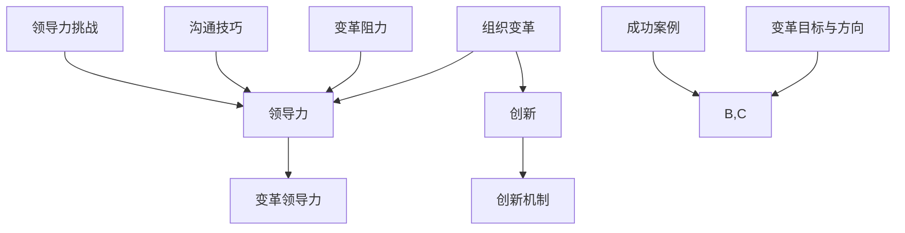

                 

### 推动组织变革：领导力与创新的结合

**关键词：** 组织变革，领导力，创新，变革管理，变革策略，领导风格，组织文化

**摘要：** 本文章深入探讨了推动组织变革的重要性，分析了领导力在组织变革中的核心作用，以及创新如何作为变革的催化剂。通过逐步分析，本文阐述了领导力与创新的结合，为组织变革提供了一套系统化的策略和方法，旨在帮助领导者有效地引领变革，推动组织的持续发展。

---

#### 目录大纲

1. **引言**
    1.1 问题背景
    1.2 问题描述
    1.3 问题解决
    1.4 边界与外延
    1.5 概念结构与核心要素组成

2. **领导力与组织变革**

    2.1 领导力的基础理论
        2.1.1 领导力的重要性
        2.1.2 领导力的构成
        2.1.3 领导力的类型与风格
    
    2.2 组织变革的动因与阻力
        2.2.1 组织变革的动因
        2.2.2 组织变革的阻力
        2.2.3 应对变革阻力的策略
    
    2.3 变革过程中的领导力
        2.3.1 变革的领导力要素
        2.3.2 变革过程中的沟通技巧
        2.3.3 变革中的领导力挑战与解决策略
    
3. **创新与组织变革**

    3.1 创新的核心概念
        3.1.1 创新的定义与分类
        3.1.2 创新的过程模型
        3.1.3 创新的核心要素
    
    3.2 创新与组织变革的结合
        3.2.1 创新对组织变革的推动作用
        3.2.2 创新在组织变革中的应用
        3.2.3 创新与组织变革的融合策略
    
4. **案例分析：成功的组织变革与领导创新**

    4.1 案例介绍
    4.2 案例分析
    4.3 案例启示
    
5. **最佳实践与总结**

    5.1 变革与创新的最佳实践
    5.2 小结
    5.3 注意事项
    5.4 拓展阅读

---

### 第一部分：引言

在快速变化的商业环境中，组织变革已成为企业持续发展的必然选择。而推动组织变革的核心在于领导力与创新的结合。领导力不仅关系到组织的方向和目标，更在变革过程中起着关键性的作用。创新则是组织变革的催化剂，它能够激发组织的活力，推动组织不断进步。

#### 1.1 问题背景

随着全球化、信息技术和市场竞争的加剧，企业面临着前所未有的挑战和机遇。为了在竞争激烈的环境中生存和发展，企业需要进行持续的组织变革，以适应市场变化和客户需求。然而，变革并非易事，传统的管理方式和思维模式往往成为变革的阻力。

#### 1.2 问题描述

组织变革面临的主要问题包括：

1. **变革动因不明确**：企业往往因为外部压力或内部需求而进行变革，但变革的动因不明确，导致变革的方向和目标模糊。
2. **变革阻力大**：员工对变革的抵触情绪强烈，认为变革会威胁到他们的利益和地位。
3. **领导力不足**：缺乏具备变革领导力的领导者，无法有效地引导变革过程，导致变革失败。
4. **创新不足**：企业往往缺乏创新意识，无法在变革中找到新的发展方向和机会。

#### 1.3 问题解决

为了解决上述问题，需要从以下几个方面入手：

1. **明确变革动因**：企业需要明确变革的动因，制定清晰的变革目标和方向。
2. **增强领导力**：领导者需要具备变革领导力，能够有效地引导和推动变革过程。
3. **激发创新**：企业需要建立创新机制，鼓励员工提出创新想法，并将其应用于实际工作中。

#### 1.4 边界与外延

本文的研究边界主要关注组织变革中的领导力和创新。我们将探讨领导力在变革过程中的作用，以及创新如何推动组织变革。同时，本文也将探讨变革过程中的沟通技巧和领导力挑战。

#### 1.5 概念结构与核心要素组成

组织变革的领导力与创新可以看作是一个复杂的系统，其中包含多个核心概念和要素。以下是一个简单的概念结构图：

在这一部分，我们简要介绍了推动组织变革的重要性，并明确了本文的研究边界和核心概念。接下来，我们将深入探讨领导力与组织变革的关系，分析领导力的基础理论和变革过程中的关键要素。随后，我们将转向创新的探讨，阐述创新的核心概念和变革中的作用。最后，通过案例分析，我们将总结成功的组织变革和领导创新的经验。文章将以最佳实践和总结作为结尾，为读者提供实用的指导和建议。  

---

在下一部分，我们将详细探讨领导力的基础理论，分析领导力在组织变革中的核心作用。通过这一分析，我们将为读者提供理解领导力如何影响组织变革的深度视角。

