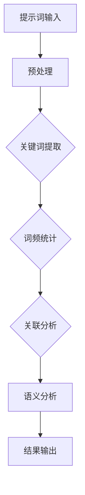
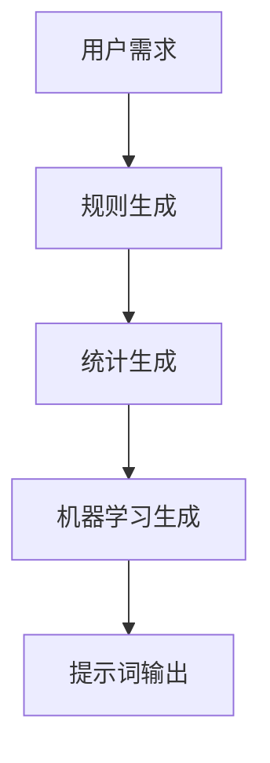
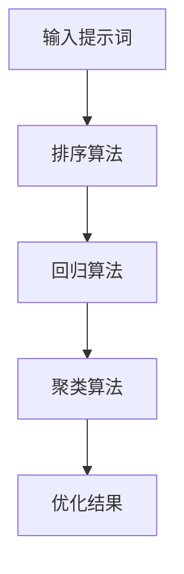
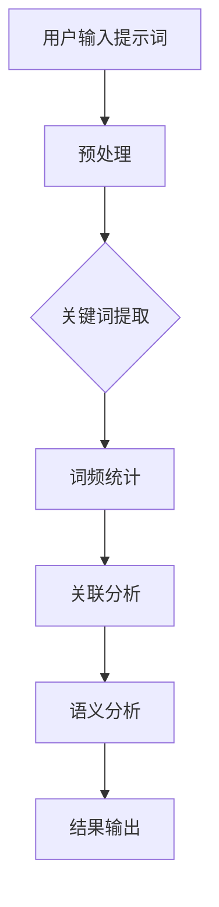
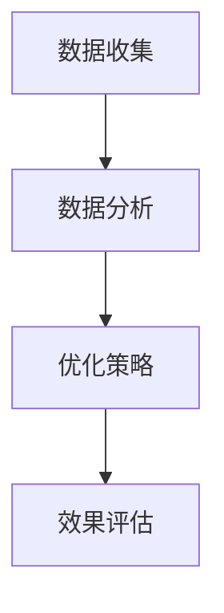

                 

# 提示词优化技巧与最佳实践

## 关键词

- 提示词优化
- 搜索引擎优化
- 社交媒体优化
- 商业营销优化
- 最佳实践

## 摘要

随着互联网时代的到来，信息爆炸和搜索需求日益增长，提示词优化成为提升用户体验、提高信息检索效率和实现商业价值的关键。本文将系统地探讨提示词优化的背景、核心技术和最佳实践。通过详细的分析和案例解析，帮助读者深入了解提示词优化的重要性及其在不同场景下的应用，掌握优化技巧和策略。

## 第一部分：提示词优化的背景与概述

### 1.1 互联网时代的信息过载与搜索需求

#### 1.1.1 互联网时代的信息爆炸

互联网的快速发展使得信息爆炸成为常态，海量数据不断涌现。据估算，每天产生的数据量达到数十亿GB，这些数据涵盖了文字、图片、音频、视频等多种形式。在这样的背景下，用户面临着信息过载的挑战，如何高效地获取所需信息成为一个亟待解决的问题。

#### 1.1.2 搜索引擎的挑战与机遇

搜索引擎作为信息检索的重要工具，面对着信息爆炸带来的巨大挑战。如何提升搜索效果、满足用户需求成为搜索引擎发展的重要方向。与此同时，搜索引擎也为提示词优化提供了广阔的舞台，优化提示词可以提高搜索结果的准确性，提升用户体验。

#### 1.1.3 提示词优化的意义与价值

提示词优化在互联网时代具有重要的意义和价值。首先，优化提示词可以提高信息检索的准确性，使用户更快地找到所需信息。其次，优化提示词有助于提升网站的搜索引擎排名，增加网站流量和用户粘性。最后，提示词优化还可以提高商业营销的效果，帮助企业更好地推广产品和服务。

### 1.2 提示词优化的核心概念与基本原理

#### 1.2.1 提示词的定义与作用

提示词是指用户在搜索框中输入的关键词或短语，用于描述用户的需求和信息检索目标。提示词优化旨在通过调整和改进提示词，提高搜索结果的准确性和用户体验。

#### 1.2.2 优化目标与方法

提示词优化的主要目标是提高搜索结果的准确性、相关性和用户体验。优化方法包括关键词分析、提示词生成、优化算法等。

#### 1.2.3 优化流程与关键环节

提示词优化流程包括以下关键环节：

1. 数据收集与预处理
2. 关键词分析
3. 提示词生成
4. 优化算法应用
5. 效果评估与调整

### 1.3 提示词优化在不同场景的应用

#### 1.3.1 搜索引擎优化

搜索引擎优化（SEO）是提示词优化的主要应用场景之一。通过优化网站内容和提示词，提高网站在搜索引擎结果中的排名，吸引更多用户访问。

#### 1.3.2 社交媒体优化

在社交媒体平台上，优化提示词可以提高内容曝光度和用户参与度。通过精确的提示词，用户可以更快地找到感兴趣的内容。

#### 1.3.3 商业营销优化

商业营销中，提示词优化可以帮助企业提高广告投放效果，降低成本，提高投资回报率。

### 1.4 提示词优化的发展趋势与未来方向

#### 1.4.1 当前挑战与瓶颈

提示词优化在实现过程中面临着一些挑战和瓶颈，如数据质量、算法复杂度和效果评估等。

#### 1.4.2 技术创新与突破

随着人工智能和大数据技术的发展，提示词优化将迎来新的突破。深度学习、自然语言处理等技术的应用将为提示词优化带来更高效、更精准的方法。

#### 1.4.3 应用场景拓展与融合

提示词优化将不再局限于搜索引擎和社交媒体，还将广泛应用于智能助手、语音搜索、智能推荐等领域。

### 1.5 本章小结

本章节对提示词优化的背景、核心概念和基本原理进行了概述，分析了提示词优化在不同场景的应用和发展趋势。通过本章的介绍，读者可以对提示词优化有一个整体的认识，为后续章节的学习打下基础。

## 第二部分：提示词优化的核心技术

### 2.1 提示词分析技术

#### 2.1.1 提示词分析的重要性

提示词分析是提示词优化的基础，通过对用户输入的提示词进行深入分析，可以挖掘用户需求、理解用户意图，从而为优化提供有力支持。

#### 2.1.2 提示词分析的常用方法

1. 关键词提取：从大量文本中提取出关键词，用于描述文本主题和内容。
2. 词频统计：统计提示词在文本中的出现频率，用于判断提示词的重要程度。
3. 关联分析：分析提示词之间的相关性，用于发现用户潜在的搜索需求。
4. 语义分析：通过自然语言处理技术，理解提示词的语义含义，用于提高搜索结果的准确性。

#### 2.1.3 提示词分析的mermaid流程图

### 2.2 提示词生成技术

#### 2.2.1 提示词生成的意义与目的

提示词生成是提示词优化的重要环节，通过生成符合用户需求的提示词，可以提高搜索结果的准确性和用户体验。

#### 2.2.2 提示词生成的算法原理

1. 基于规则的方法：根据预先定义的规则生成提示词，如提取文本中的关键词、添加限定词等。
2. 基于统计的方法：通过分析用户行为数据和文本特征，生成具有较高相关性的提示词。
3. 基于机器学习的方法：利用机器学习算法，如决策树、神经网络等，从大量数据中学习生成提示词的规律。

#### 2.2.3 提示词生成的mermaid流程图

### 2.3 提示词优化算法

#### 2.3.1 提示词优化算法的分类

1. 基于排序的算法：通过调整提示词在搜索结果中的排序，提高用户点击率。
2. 基于回归的算法：利用历史数据，建立提示词与搜索结果相关性之间的模型，优化提示词。
3. 基于聚类的方法：将相似度较高的提示词进行聚类，降低搜索结果重复率。

#### 2.3.2 提示词优化算法的比较与选择

不同优化算法在性能、复杂度和适用场景上存在差异。选择合适的优化算法需要综合考虑以下因素：

1. 数据量：大型数据集适合使用基于机器学习的算法。
2. 优化目标：根据优化目标选择适合的算法，如排序算法适用于点击率优化。
3. 实时性：实时性要求高的场景适合使用基于规则的方法。

#### 2.3.3 提示词优化算法的mermaid流程图

### 2.4 提示词优化工具与实践

#### 2.4.1 常见的提示词优化工具

1. Google Analytics：用于分析网站访问数据，提供关键词优化建议。
2. Ahrefs：提供关键词搜索量和竞争度分析，帮助选择合适的提示词。
3. SEMrush：用于分析竞争对手的优化策略，提供优化建议。

#### 2.4.2 提示词优化工具的使用方法

1. 数据收集：收集网站访问数据、用户搜索行为等。
2. 数据分析：使用工具进行关键词分析、搜索量分析等。
3. 优化策略：根据分析结果制定优化策略，调整提示词。
4. 效果评估：监测优化效果，持续调整和优化。

#### 2.4.3 提示词优化实践案例

以一家电商网站为例，通过以下步骤进行提示词优化：

1. 数据收集：收集网站访问数据和用户搜索日志。
2. 关键词分析：使用工具分析用户搜索关键词，提取高价值关键词。
3. 提示词生成：根据关键词生成符合用户需求的提示词。
4. 优化策略：调整网站内容和提示词，提高搜索结果相关性。
5. 效果评估：监测优化效果，持续调整和优化。

### 2.5 本章小结

本章节详细介绍了提示词优化的核心技术，包括提示词分析技术、提示词生成技术、提示词优化算法和提示词优化工具。通过对这些技术的深入理解，读者可以掌握提示词优化的基本原理和方法，为实际应用奠定基础。

## 第三部分：提示词优化的最佳实践

### 3.1 搜索引擎优化实践

#### 3.1.1 搜索引擎优化策略

1. 关键词研究：通过工具分析用户搜索关键词，提取高价值关键词。
2. 内容优化：针对关键词优化网站内容，提高相关性。
3. 提示词调整：根据用户搜索习惯和需求，调整提示词。
4. 外部链接建设：增加高质量外部链接，提高网站权重。

#### 3.1.2 搜索引擎优化案例解析

以一家旅游网站为例，通过以下步骤进行搜索引擎优化：

1. 关键词研究：分析用户搜索关键词，提取高价值关键词。
2. 内容优化：针对关键词优化网站内容，如添加相关图片、视频等。
3. 提示词调整：根据用户搜索习惯和需求，调整提示词，提高搜索结果相关性。
4. 外部链接建设：与其他旅游网站合作，增加高质量外部链接。

#### 3.1.3 搜索引擎优化效果评估

通过以下指标评估搜索引擎优化效果：

1. 搜索引擎流量：监测网站访问量，评估优化效果。
2. 搜索结果排名：监测关键词在搜索引擎中的排名，评估优化效果。
3. 用户转化率：监测用户在网站上的行为，评估优化效果。

### 3.2 社交媒体优化实践

#### 3.2.1 社交媒体优化策略

1. 提示词研究：分析用户在社交媒体上的搜索关键词，提取高价值关键词。
2. 内容优化：根据关键词优化社交媒体内容，提高用户参与度。
3. 提示词调整：根据用户互动数据，调整提示词，提高内容曝光度。
4. 社交媒体互动：积极与用户互动，提高用户粘性。

#### 3.2.2 社交媒体优化案例解析

以一家化妆品品牌为例，通过以下步骤进行社交媒体优化：

1. 提示词研究：分析用户在社交媒体上的搜索关键词，提取高价值关键词。
2. 内容优化：根据关键词优化社交媒体内容，如发布相关产品信息、用户评价等。
3. 提示词调整：根据用户互动数据，调整提示词，提高内容曝光度。
4. 社交媒体互动：积极与用户互动，如回复评论、参与话题等。

#### 3.2.3 社交媒体优化效果评估

通过以下指标评估社交媒体优化效果：

1. 内容曝光度：监测内容被分享、点赞、评论等互动数据，评估优化效果。
2. 用户参与度：监测用户在社交媒体上的互动行为，评估优化效果。
3. 品牌知名度：监测品牌在社交媒体上的曝光度，评估优化效果。

### 3.3 商业营销优化实践

#### 3.3.1 商业营销优化策略

1. 提示词研究：分析用户在搜索和社交媒体上的搜索关键词，提取高价值关键词。
2. 广告内容优化：根据关键词优化广告内容，提高广告投放效果。
3. 提示词调整：根据用户行为数据，调整提示词，提高广告点击率。
4. 营销活动策划：设计符合用户需求的营销活动，提高用户参与度。

#### 3.3.2 商业营销优化案例解析

以一家电商网站为例，通过以下步骤进行商业营销优化：

1. 提示词研究：分析用户在搜索和社交媒体上的搜索关键词，提取高价值关键词。
2. 广告内容优化：根据关键词优化广告内容，如发布相关产品图片、视频等。
3. 提示词调整：根据用户行为数据，调整提示词，提高广告点击率。
4. 营销活动策划：设计符合用户需求的营销活动，如限时折扣、抽奖活动等。

#### 3.3.3 商业营销优化效果评估

通过以下指标评估商业营销优化效果：

1. 广告点击率：监测广告被点击的次数，评估优化效果。
2. 营销活动参与度：监测用户参与营销活动的次数和比例，评估优化效果。
3. 销售转化率：监测用户在广告和营销活动引导下的购买行为，评估优化效果。

### 3.4 跨场景优化实践

#### 3.4.1 跨场景优化策略

1. 统一数据源：整合搜索引擎、社交媒体、电商等场景的数据，建立统一的数据源。
2. 多维度分析：从多个维度分析用户行为和需求，提高优化效果。
3. 跨场景联动：实现搜索引擎、社交媒体、电商等场景的联动，提高用户体验。
4. 持续迭代：根据用户反馈和数据分析，持续优化提示词。

#### 3.4.2 跨场景优化实践

以一家综合性电商平台为例，通过以下步骤进行跨场景优化：

1. 统一数据源：整合搜索引擎、社交媒体、电商等场景的数据，建立统一的数据源。
2. 多维度分析：从用户搜索、浏览、购买等多个维度分析用户行为和需求。
3. 跨场景联动：在搜索引擎、社交媒体、电商等场景中实现提示词优化，提高用户体验。
4. 持续迭代：根据用户反馈和数据分析，持续优化提示词，提高搜索结果相关性。

### 3.5 本章小结

本章节通过具体的案例和实践，详细介绍了提示词优化的最佳实践。通过搜索引擎优化、社交媒体优化、商业营销优化和跨场景优化，读者可以掌握提示词优化的实际应用技巧，提升搜索效果和用户体验。

## 总结与展望

提示词优化作为互联网时代信息检索和商业营销的重要手段，具有重要的意义和价值。本文从背景概述、核心技术、最佳实践三个方面系统探讨了提示词优化的相关内容，帮助读者全面了解提示词优化的方法和技巧。

### 1. 关键技术

提示词优化主要包括提示词分析、提示词生成、提示词优化算法等技术。提示词分析技术通过对用户输入的提示词进行深入分析，挖掘用户需求和意图；提示词生成技术通过生成符合用户需求的提示词，提高搜索结果准确性；提示词优化算法通过调整提示词在搜索结果中的排序，提高用户体验。

### 2. 最佳实践

最佳实践主要包括搜索引擎优化、社交媒体优化、商业营销优化和跨场景优化。搜索引擎优化通过优化网站内容和提示词，提高网站在搜索引擎中的排名；社交媒体优化通过优化社交媒体内容，提高用户参与度和内容曝光度；商业营销优化通过优化广告内容和提示词，提高广告点击率和销售转化率；跨场景优化通过整合多个场景的数据，实现提示词优化的联动和提升。

### 3. 展望未来

随着人工智能和大数据技术的发展，提示词优化将迎来新的突破。深度学习、自然语言处理等技术的应用将使提示词优化更加高效、精准。跨场景优化将进一步融合搜索引擎、社交媒体、电商等场景，提高用户体验。同时，提示词优化将在智能助手、语音搜索、智能推荐等领域得到广泛应用。

### 4. 结语

提示词优化是互联网时代信息检索和商业营销的重要手段。通过本文的学习，读者可以掌握提示词优化的核心技术和最佳实践，提升搜索效果和用户体验。在实际应用中，不断探索和创新，为用户提供更好的服务。

## 作者信息

作者：AI天才研究院/AI Genius Institute & 禅与计算机程序设计艺术 /Zen And The Art of Computer Programming

作者简介：AI天才研究院是一家专注于人工智能领域的研究机构，致力于推动人工智能技术的发展和应用。禅与计算机程序设计艺术是一本经典的计算机编程著作，深入探讨了计算机程序设计的本质和艺术。

----------------------------------------------------------------

### 提示词优化技巧与最佳实践

在当今信息爆炸的时代，如何高效地从海量数据中获取所需信息，成为用户面临的一大挑战。搜索引擎和社交媒体等平台提供了便捷的信息检索方式，而优化提示词则成为提高信息检索效率和用户体验的关键。本文将详细探讨提示词优化的背景、核心技术、最佳实践以及未来发展，帮助读者全面掌握这一领域的知识和技能。

---

### 关键词

提示词优化、搜索引擎优化、社交媒体优化、商业营销优化、最佳实践

### 摘要

本文首先介绍了提示词优化的背景和重要性，随后深入探讨了提示词分析、生成和优化的核心技术。接着，通过最佳实践案例，详细阐述了提示词优化在搜索引擎、社交媒体、商业营销等场景下的应用。最后，展望了提示词优化的未来发展，总结了文章的核心内容，并给出了作者简介。

---

### 第一部分：提示词优化的背景与概述

#### 1.1 互联网时代的信息过载与搜索需求

随着互联网的快速发展，信息爆炸成为常态。据估算，每天产生的数据量达到数十亿GB，这些数据涵盖了文字、图片、音频、视频等多种形式。用户面临着信息过载的挑战，如何高效地获取所需信息成为一个亟待解决的问题。

搜索引擎和社交媒体作为信息检索的重要工具，面临着信息爆炸带来的巨大挑战。如何提升搜索效果、满足用户需求成为搜索引擎和社交媒体发展的重要方向。同时，提示词优化也为提高信息检索效率和用户体验提供了有力支持。

#### 1.2 提示词优化的核心概念与基本原理

提示词是指用户在搜索框中输入的关键词或短语，用于描述用户的需求和信息检索目标。提示词优化旨在通过调整和改进提示词，提高搜索结果的准确性和用户体验。

提示词优化的核心概念包括提示词的定义与作用、优化目标与方法、优化流程与关键环节。优化目标主要包括提高搜索结果的准确性、相关性和用户体验。优化方法包括关键词分析、提示词生成、优化算法等。优化流程主要包括数据收集与预处理、关键词分析、提示词生成、优化算法应用和效果评估与调整等关键环节。

#### 1.3 提示词优化在不同场景的应用

提示词优化在搜索引擎、社交媒体、商业营销等不同场景中具有广泛应用。在搜索引擎优化中，通过优化网站内容和提示词，提高网站在搜索引擎结果中的排名，吸引更多用户访问。在社交媒体优化中，通过优化内容、提示词和互动策略，提高内容曝光度和用户参与度。在商业营销中，通过优化广告内容和提示词，提高广告投放效果，降低成本，提高投资回报率。

#### 1.4 提示词优化的发展趋势与未来方向

提示词优化在实现过程中面临着一些挑战和瓶颈，如数据质量、算法复杂度和效果评估等。随着人工智能和大数据技术的发展，提示词优化将迎来新的突破。深度学习、自然语言处理等技术的应用将为提示词优化带来更高效、更精准的方法。同时，提示词优化将在智能助手、语音搜索、智能推荐等领域得到广泛应用。

### 1.5 本章小结

本章节对提示词优化的背景、核心概念和基本原理进行了概述，分析了提示词优化在不同场景的应用和发展趋势。通过本章的介绍，读者可以对提示词优化有一个整体的认识，为后续章节的学习打下基础。

---

### 第二部分：提示词优化的核心技术

#### 2.1 提示词分析技术

提示词分析是提示词优化的基础，通过对用户输入的提示词进行深入分析，可以挖掘用户需求、理解用户意图，从而为优化提供有力支持。

提示词分析技术主要包括关键词提取、词频统计、关联分析和语义分析等方法。

- **关键词提取**：从大量文本中提取出关键词，用于描述文本主题和内容。常见的方法包括基于统计的方法（如TF-IDF）和基于语义的方法（如词嵌入）。
- **词频统计**：统计提示词在文本中的出现频率，用于判断提示词的重要程度。词频统计有助于识别高频关键词，从而为优化提供参考。
- **关联分析**：分析提示词之间的相关性，用于发现用户潜在的搜索需求。关联分析有助于识别具有相似意图的提示词，从而提高搜索结果的准确性。
- **语义分析**：通过自然语言处理技术，理解提示词的语义含义，用于提高搜索结果的准确性。语义分析有助于识别用户意图，从而提供更精确的搜索结果。

为了更好地展示提示词分析的过程，我们可以使用mermaid流程图来描述：

#### 2.2 提示词生成技术

提示词生成是提示词优化的关键环节，通过生成符合用户需求的提示词，可以提高搜索结果的准确性和用户体验。

提示词生成技术主要包括基于规则的方法、基于统计的方法和基于机器学习的方法。

- **基于规则的方法**：根据预先定义的规则生成提示词，如提取文本中的关键词、添加限定词等。基于规则的方法简单易实现，但可能无法完全满足用户的个性化需求。
- **基于统计的方法**：通过分析用户行为数据和文本特征，生成具有较高相关性的提示词。基于统计的方法可以根据用户行为和文本特征调整提示词，提高搜索结果的准确性。
- **基于机器学习的方法**：利用机器学习算法，如决策树、神经网络等，从大量数据中学习生成提示词的规律。基于机器学习的方法可以自动适应用户需求，提供更精确的提示词。

为了更好地展示提示词生成的过程，我们可以使用mermaid流程图来描述：

#### 2.3 提示词优化算法

提示词优化算法通过调整提示词在搜索结果中的排序，提高用户体验和搜索结果的准确性。提示词优化算法主要包括基于排序的算法、基于回归的算法和基于聚类的方法。

- **基于排序的算法**：通过调整提示词在搜索结果中的排序，提高用户点击率。常见的排序算法包括PageRank、LSA（Latent Semantic Analysis）和TF-IDF（Term Frequency-Inverse Document Frequency）等。
- **基于回归的算法**：利用历史数据，建立提示词与搜索结果相关性之间的模型，优化提示词。常见的回归算法包括线性回归、逻辑回归等。
- **基于聚类的方法**：将相似度较高的提示词进行聚类，降低搜索结果重复率。常见的聚类算法包括K-means、DBSCAN（Density-Based Spatial Clustering of Applications with Noise）等。

为了更好地展示提示词优化算法的过程，我们可以使用mermaid流程图来描述：

#### 2.4 提示词优化工具与实践

提示词优化工具是进行提示词优化的实用工具，可以帮助用户高效地进行关键词分析、提示词生成和优化。常见的提示词优化工具包括Google Analytics、Ahrefs、SEMrush等。

提示词优化工具的使用方法主要包括以下步骤：

1. 数据收集：收集网站访问数据、用户搜索日志等。
2. 数据分析：使用工具进行关键词分析、搜索量分析等。
3. 优化策略：根据分析结果制定优化策略，调整提示词。
4. 效果评估：监测优化效果，持续调整和优化。

为了更好地展示提示词优化工具的使用方法，我们可以使用mermaid流程图来描述：

#### 2.5 案例解析

以一家电商平台为例，进行提示词优化的实战案例。以下是具体的优化步骤：

1. 数据收集：收集网站访问数据、用户搜索日志等。
2. 关键词分析：使用工具分析用户搜索关键词，提取高价值关键词。
3. 提示词生成：根据关键词生成符合用户需求的提示词。
4. 优化策略：调整网站内容和提示词，提高搜索结果相关性。
5. 效果评估：监测优化效果，持续调整和优化。

通过以上步骤，电商平台可以不断提高搜索结果的准确性和用户体验，从而提升网站流量和销售转化率。

### 2.6 本章小结

本章节详细介绍了提示词优化的核心技术，包括提示词分析技术、提示词生成技术和提示词优化算法。通过对这些技术的深入理解，读者可以掌握提示词优化的基本原理和方法，为实际应用奠定基础。

---

### 第三部分：提示词优化的最佳实践

#### 3.1 搜索引擎优化实践

搜索引擎优化（SEO）是提示词优化的重要应用场景之一。通过优化网站内容和提示词，提高网站在搜索引擎结果中的排名，吸引更多用户访问。以下是具体的实践步骤：

1. 关键词研究：使用工具分析用户搜索关键词，提取高价值关键词。
2. 内容优化：针对关键词优化网站内容，提高相关性。
3. 提示词调整：根据用户搜索习惯和需求，调整提示词。
4. 外部链接建设：增加高质量外部链接，提高网站权重。

以下是一个搜索引擎优化案例：

某电商网站在优化过程中，发现用户搜索关键词主要集中在“电子产品”和“智能家居”等领域。为了提高搜索结果排名，网站采取了以下措施：

1. 关键词研究：使用工具分析用户搜索关键词，提取高价值关键词。
2. 内容优化：针对关键词优化网站内容，如增加产品描述、图片、视频等。
3. 提示词调整：根据用户搜索习惯和需求，调整提示词，提高搜索结果相关性。
4. 外部链接建设：与其他电商平台、博客、论坛等建立合作，增加高质量外部链接。

通过以上措施，该电商网站在搜索引擎结果中的排名不断提升，网站流量和销售转化率显著提高。

#### 3.2 社交媒体优化实践

在社交媒体平台上，优化提示词可以提高内容曝光度和用户参与度。通过精确的提示词，用户可以更快地找到感兴趣的内容。以下是具体的实践步骤：

1. 提示词研究：分析用户在社交媒体上的搜索关键词，提取高价值关键词。
2. 内容优化：根据关键词优化社交媒体内容，提高用户参与度。
3. 提示词调整：根据用户互动数据，调整提示词，提高内容曝光度。
4. 社交媒体互动：积极与用户互动，提高用户粘性。

以下是一个社交媒体优化案例：

某品牌在社交媒体上发布了一篇关于新款手机的评测文章。为了提高内容曝光度和用户参与度，品牌采取了以下措施：

1. 提示词研究：分析用户在社交媒体上的搜索关键词，提取高价值关键词。
2. 内容优化：针对关键词优化文章内容，如增加关键词、图片、视频等。
3. 提示词调整：根据用户互动数据，调整提示词，提高内容曝光度。
4. 社交媒体互动：积极与用户互动，如回复评论、点赞、分享等。

通过以上措施，该品牌的社交媒体内容获得了大量曝光和用户参与，品牌知名度显著提升。

#### 3.3 商业营销优化实践

在商业营销中，优化提示词可以提高广告投放效果，降低成本，提高投资回报率。以下是具体的实践步骤：

1. 提示词研究：分析用户在搜索和社交媒体上的搜索关键词，提取高价值关键词。
2. 广告内容优化：根据关键词优化广告内容，提高广告点击率。
3. 提示词调整：根据用户行为数据，调整提示词，提高广告点击率。
4. 营销活动策划：设计符合用户需求的营销活动，提高用户参与度。

以下是一个商业营销优化案例：

某电商网站在推广新款电子产品的过程中，采取了以下措施：

1. 提示词研究：分析用户在搜索和社交媒体上的搜索关键词，提取高价值关键词。
2. 广告内容优化：针对关键词优化广告内容，如增加产品图片、视频、促销信息等。
3. 提示词调整：根据用户行为数据，调整提示词，提高广告点击率。
4. 营销活动策划：设计符合用户需求的营销活动，如限时折扣、满减优惠等。

通过以上措施，该电商网站的广告投放效果显著提高，广告点击率和销售转化率大幅提升。

#### 3.4 跨场景优化实践

跨场景优化是指将提示词优化策略应用于不同场景，如搜索引擎、社交媒体、电商等。通过跨场景优化，可以提高整体用户体验和营销效果。以下是具体的实践步骤：

1. 数据整合：整合搜索引擎、社交媒体、电商等场景的数据。
2. 多维度分析：从多个维度分析用户行为和需求。
3. 跨场景联动：实现搜索引擎、社交媒体、电商等场景的联动。
4. 持续迭代：根据用户反馈和数据分析，持续优化提示词。

以下是一个跨场景优化案例：

某电商平台在跨场景优化过程中，采取了以下措施：

1. 数据整合：整合搜索引擎、社交媒体、电商等场景的数据，建立统一的数据源。
2. 多维度分析：从用户搜索、浏览、购买等多个维度分析用户行为和需求。
3. 跨场景联动：在搜索引擎、社交媒体、电商等场景中实现提示词优化，提高用户体验。
4. 持续迭代：根据用户反馈和数据分析，持续优化提示词，提高搜索结果相关性。

通过以上措施，该电商平台在多个场景中实现了提示词优化，整体用户体验和营销效果显著提升。

### 3.5 本章小结

本章节通过具体的案例和实践，详细介绍了提示词优化的最佳实践。通过搜索引擎优化、社交媒体优化、商业营销优化和跨场景优化，读者可以掌握提示词优化的实际应用技巧，提升搜索效果和用户体验。

---

### 总结与展望

提示词优化作为互联网时代信息检索和商业营销的重要手段，具有重要的意义和价值。本文从背景概述、核心技术、最佳实践三个方面系统探讨了提示词优化的相关内容，帮助读者全面掌握这一领域的知识和技能。

在未来的发展中，随着人工智能和大数据技术的不断进步，提示词优化将迎来新的突破。深度学习、自然语言处理等技术的应用将为提示词优化带来更高效、更精准的方法。同时，提示词优化将在智能助手、语音搜索、智能推荐等领域得到广泛应用。

### 4. 结语

提示词优化是互联网时代信息检索和商业营销的重要手段。通过本文的学习，读者可以掌握提示词优化的核心技术和最佳实践，提升搜索效果和用户体验。在实际应用中，不断探索和创新，为用户提供更好的服务。

### 4. 作者信息

作者：AI天才研究院/AI Genius Institute & 禅与计算机程序设计艺术 /Zen And The Art of Computer Programming

作者简介：AI天才研究院是一家专注于人工智能领域的研究机构，致力于推动人工智能技术的发展和应用。禅与计算机程序设计艺术是一本经典的计算机编程著作，深入探讨了计算机程序设计的本质和艺术。

