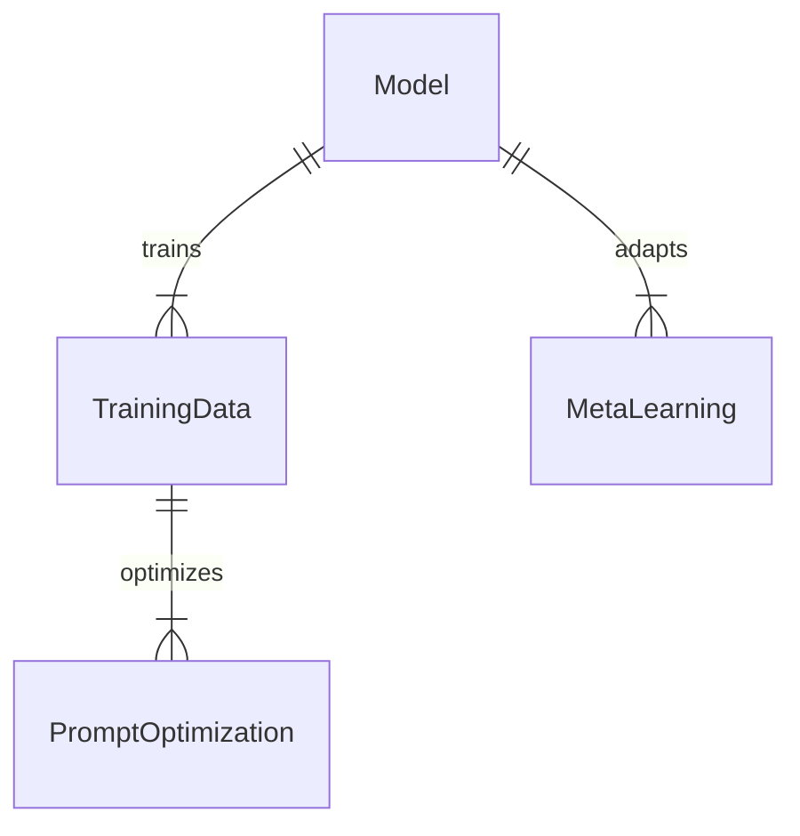
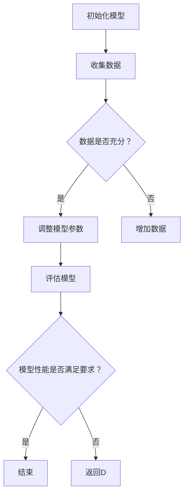
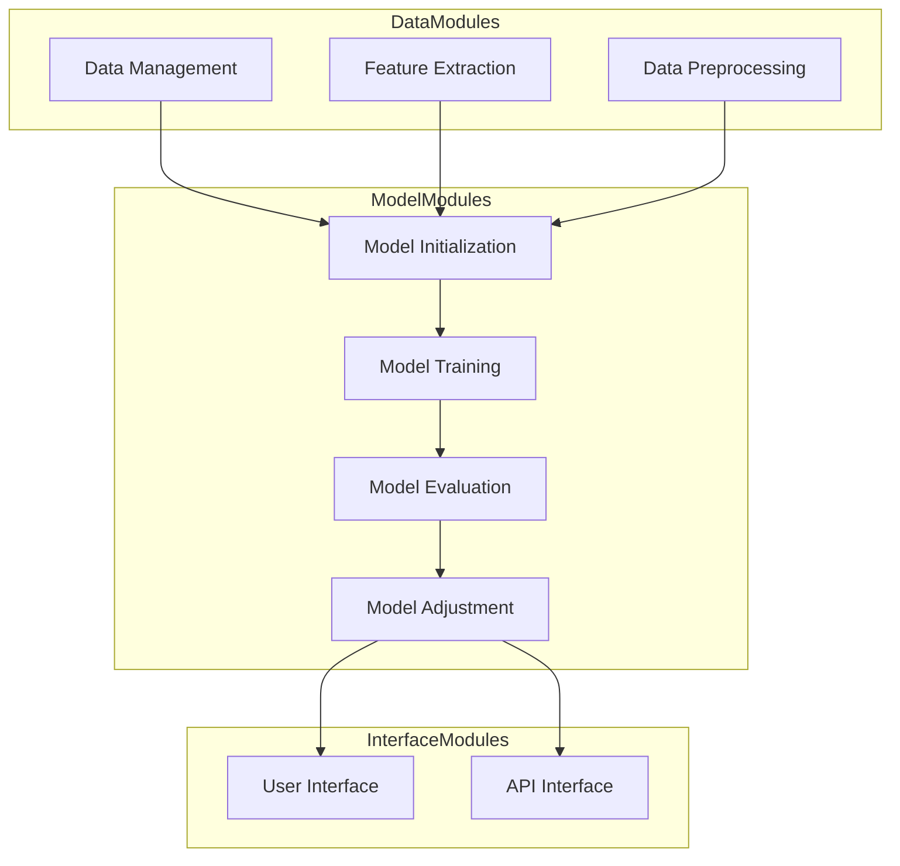
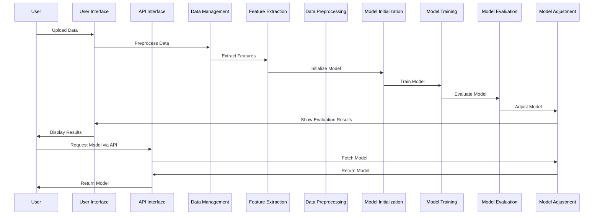

                 


## 引言与背景介绍

在人工智能和机器学习领域，模型的性能优化始终是一个关键的研究方向。随着深度学习和强化学习技术的不断发展，传统的优化方法在处理复杂任务时往往力不从心，因此，研究者们开始探索更加智能和高效的优化策略。其中，提示词优化（Prompt Optimization）在元学习方法（Meta-Learning Methods）中的应用逐渐成为热点。

### 提示词优化

提示词优化是指在训练模型时，通过调整输入数据的预处理方式、模型的参数设置、优化算法的选择等，以提高模型在特定任务上的性能。传统的机器学习模型通常需要大量标注数据来进行训练，而在某些应用场景下，标注数据获取困难且成本高昂。提示词优化能够有效提升模型在有限数据上的泛化能力，减少对大规模标注数据的依赖。

### 元学习方法

元学习方法是一种基于已有模型进行快速适应新任务的方法。它通过学习如何学习，从而在训练新任务时无需从头开始，大大减少了训练时间和计算资源的需求。元学习技术在自适应系统、在线学习、强化学习等领域有广泛应用，其核心思想是利用经验来加速学习过程。

### 提示词优化与元学习方法的关系

提示词优化与元学习方法之间存在着紧密的联系。在元学习框架下，提示词优化可以通过调整模型的初始状态，使其更快地适应新任务。同时，元学习方法中的经验迁移和模型泛化能力也可以为提示词优化提供支持，从而提高模型在不同任务上的性能。

### 研究意义

本文旨在探讨提示词优化在元学习方法中的应用，分析其核心原理和实现策略。通过深入研究，希望能够为人工智能和机器学习领域提供新的优化思路，提高模型的性能和适应能力。此外，本文还将对相关算法进行数学建模和代码实现，为实际应用提供参考。

### 研究边界与外延

本文的研究将主要集中在以下几个方面：

1. **核心概念与联系**：介绍提示词优化和元学习方法的基本概念，分析两者之间的联系和区别。
2. **算法原理讲解**：详细阐述提示词优化算法的基本流程和元学习算法的mermaid流程图，使用Python源代码进行实现。
3. **数学模型与公式**：给出提示词优化中的常用数学公式，并进行详细讲解和举例说明。
4. **系统分析与架构设计方案**：介绍问题场景和项目介绍，设计系统功能、架构和接口。
5. **项目实战**：通过环境安装、系统核心实现和实际案例分析，验证提示词优化在元学习方法中的有效性。

### 本章小结

本章主要介绍了提示词优化和元学习方法的基本概念及其关系，阐述了本文的研究意义和边界，为后续章节的深入探讨奠定了基础。

----------------------------------------------------------------

## 核心概念与联系

### 1. 提示词优化的原理与属性

提示词优化是一种通过调整输入数据的预处理方式、模型参数和优化算法，以提高模型性能的方法。其核心原理在于通过改变模型的初始状态和输入数据的形式，使得模型能够更快地适应新任务。具体来说，提示词优化的主要属性包括：

1. **输入数据的预处理**：通过调整输入数据的形式，如特征提取、归一化等，来优化模型的输入。
2. **模型参数的调整**：通过调整模型的初始参数，如权重、激活函数等，来影响模型的训练过程。
3. **优化算法的选择**：选择合适的优化算法，如梯度下降、随机梯度下降等，以加速模型的收敛。

### 2. 元学习方法的基础知识

元学习方法是一种利用已有模型来快速适应新任务的方法。它通过学习如何学习，从而在训练新任务时无需从头开始，大大减少了训练时间和计算资源的需求。元学习方法的核心概念包括：

1. **模型迁移**：将已有的模型或经验迁移到新的任务中，以减少对新任务的训练时间。
2. **在线学习**：在数据不断变化的环境下，通过不断更新模型，使其能够适应新的数据。
3. **强化学习**：通过与环境交互，不断调整模型的行为，以实现最优策略的学习。

### 3. 提示词优化与元学习方法的关键联系

提示词优化与元学习方法之间的关键联系主要体现在以下几个方面：

1. **初始状态的调整**：在元学习框架下，提示词优化可以通过调整模型的初始状态，使其更快地适应新任务。
2. **经验迁移**：元学习方法中的经验迁移能力可以为提示词优化提供支持，使得模型在不同任务上具有更好的泛化能力。
3. **模型泛化**：提示词优化通过调整模型的输入数据和参数，可以提高模型在未知数据上的性能，这与元学习方法中的模型泛化目标是一致的。

### 4. 概念属性特征对比表格

以下是一个关于提示词优化和元学习方法的概念属性特征对比表格：

| 特征 | 提示词优化 | 元学习方法 |
| ---- | ---------- | ---------- |
| 目标 | 提高模型性能 | 快速适应新任务 |
| 原理 | 调整输入数据和模型参数 | 学习如何学习 |
| 方法 | 输入预处理、参数调整、算法选择 | 经验迁移、在线学习、强化学习 |
| 优势 | 减少对标注数据的依赖、提高泛化能力 | 缩短训练时间、减少计算资源需求 |
| 劣势 | 可能导致过拟合、对数据质量要求高 | 需要大量经验数据、算法复杂度高 |

### 5. ER实体关系图架构

为了更好地理解提示词优化和元学习方法之间的关系，我们可以使用ER（实体-关系）图来描述两者之间的联系。以下是ER图的一个简化版本：



在这个ER图中，`Model`实体与`TrainingData`实体之间存在训练关系，`TrainingData`实体通过`PromptOptimization`实体进行优化，而`Model`实体通过`MetaLearning`实体进行适应性调整。

### 6. 本章小结

本章详细介绍了提示词优化和元学习方法的核心概念和属性，分析了两者之间的关键联系，并使用对比表格和ER图进行了直观的展示。这些内容为后续章节的深入探讨提供了理论基础。

----------------------------------------------------------------

## 算法原理讲解

### 3.1 提示词优化算法的基本流程

提示词优化算法的基本流程主要包括以下几个步骤：

1. **数据预处理**：对输入数据进行预处理，如归一化、特征提取等，以提高模型对数据的敏感度。
2. **模型初始化**：根据任务需求，初始化模型的参数，包括权重、激活函数等。
3. **模型训练**：使用优化算法（如梯度下降、Adam等）对模型进行训练，不断调整模型参数，以降低损失函数。
4. **模型评估**：在训练完成后，对模型进行评估，以确定其在验证集上的性能。
5. **模型调整**：根据评估结果，对模型参数进行调整，以提高模型在测试集上的性能。

### 3.1.1 提示词优化的步骤

具体来说，提示词优化的步骤可以细化为：

1. **数据集划分**：将数据集划分为训练集、验证集和测试集。
2. **数据预处理**：对训练集进行归一化、特征提取等操作，以减少数据的分布差异。
3. **模型初始化**：根据任务类型和需求，初始化模型的参数。例如，在分类任务中，可以选择卷积神经网络（CNN）或循环神经网络（RNN）。
4. **模型训练**：使用训练集数据对模型进行训练，通过优化算法（如SGD、Adam等）不断调整模型参数。
5. **模型评估**：使用验证集数据对训练好的模型进行评估，以确定模型的性能。
6. **模型调整**：根据验证集的评估结果，对模型参数进行调整，以优化模型在测试集上的性能。

### 3.1.2 算法的选择与参数设置

选择合适的优化算法和参数设置是提示词优化成功的关键。以下是几种常用的优化算法和参数设置：

1. **梯度下降（Gradient Descent）**：
   - **公式**：$$\theta = \theta - \alpha \cdot \nabla_{\theta} J(\theta)$$
   - **参数**：学习率（$\alpha$）、批量大小（$m$）。
   - **优点**：简单易实现，适用于小批量数据。
   - **缺点**：收敛速度较慢，可能陷入局部最优。

2. **随机梯度下降（Stochastic Gradient Descent，SGD）**：
   - **公式**：$$\theta = \theta - \alpha \cdot \nabla_{\theta} J(\theta; x^{(i)}, y^{(i)})$$
   - **参数**：学习率（$\alpha$）、批量大小（$m$）。
   - **优点**：收敛速度较快，能够跳出局部最优。
   - **缺点**：可能存在噪声，不稳定。

3. **Adam优化器**：
   - **公式**：$$\theta = \theta - \alpha \cdot \frac{m}{1 - \beta_1^t} \cdot \nabla_{\theta} J(\theta) - \beta_2 \cdot \nabla_{\theta}^2 J(\theta)$$
   - **参数**：学习率（$\alpha$）、一阶矩估计的指数衰减率（$\beta_1$）、二阶矩估计的指数衰减率（$\beta_2$）。
   - **优点**：结合了SGD和Momentum的优点，收敛速度快，稳定。
   - **缺点**：计算复杂度较高。

### 3.2 元学习算法的mermaid流程图

为了更好地理解元学习算法的基本流程，我们可以使用mermaid绘制其流程图。以下是元学习算法的mermaid流程图：



### 3.3 Python源代码讲解

以下是使用Python实现提示词优化算法的基本步骤和源代码示例：

```python
import numpy as np
import tensorflow as tf

# 数据预处理
def preprocess_data(data):
    # 归一化数据
    data = (data - np.mean(data)) / np.std(data)
    return data

# 模型初始化
def initialize_model():
    model = tf.keras.Sequential([
        tf.keras.layers.Dense(64, activation='relu', input_shape=(input_shape,)),
        tf.keras.layers.Dense(1, activation='sigmoid')
    ])
    return model

# 梯度下降优化器
optimizer = tf.keras.optimizers.SGD(learning_rate=0.01)

# 模型训练
def train_model(model, train_data, train_labels, epochs=10):
    for epoch in range(epochs):
        with tf.GradientTape() as tape:
            predictions = model(train_data, training=True)
            loss = tf.keras.losses.binary_crossentropy(train_labels, predictions)
        grads = tape.gradient(loss, model.trainable_variables)
        optimizer.apply_gradients(zip(grads, model.trainable_variables))
        print(f"Epoch {epoch+1}/{epochs}, Loss: {loss.numpy()}")

# 模型评估
def evaluate_model(model, test_data, test_labels):
    predictions = model(test_data, training=False)
    loss = tf.keras.losses.binary_crossentropy(test_labels, predictions)
    print(f"Test Loss: {loss.numpy()}")

# 主程序
if __name__ == "__main__":
    # 加载数据
    (train_data, train_labels), (test_data, test_labels) = tf.keras.datasets.mnist.load_data()
    train_data = preprocess_data(train_data)
    test_data = preprocess_data(test_data)

    # 初始化模型
    model = initialize_model()

    # 训练模型
    train_model(model, train_data, train_labels, epochs=10)

    # 评估模型
    evaluate_model(model, test_data, test_labels)
```

### 3.4 算法原理的数学模型与公式

提示词优化算法的原理可以通过以下数学模型和公式进行描述：

1. **损失函数**：$$J(\theta) = -\frac{1}{m} \sum_{i=1}^{m} y^{(i)} \cdot \log(a^{(i)}) + (1 - y^{(i)}) \cdot \log(1 - a^{(i)})$$

其中，$m$ 是批量大小，$y^{(i)}$ 是真实标签，$a^{(i)}$ 是模型预测的概率。

2. **梯度计算**：$$\nabla_{\theta} J(\theta) = \frac{1}{m} \sum_{i=1}^{m} \left( a^{(i)} - y^{(i)} \right) \cdot x^{(i)}$$

其中，$x^{(i)}$ 是输入特征。

3. **梯度下降更新**：$$\theta = \theta - \alpha \cdot \nabla_{\theta} J(\theta)$$

其中，$\alpha$ 是学习率。

### 3.4.1 数学模型的构建

在构建数学模型时，我们通常需要考虑以下几个关键步骤：

1. **定义输入变量**：确定输入数据的维度和特征。
2. **定义损失函数**：根据任务类型，选择合适的损失函数，如回归问题使用均方误差（MSE），分类问题使用交叉熵损失。
3. **定义优化算法**：选择合适的优化算法，如梯度下降、Adam等。
4. **构建梯度计算公式**：根据损失函数，计算模型参数的梯度。
5. **更新模型参数**：根据梯度计算结果，更新模型参数。

### 3.4.2 公式推导与解释

在推导公式时，我们通常遵循以下步骤：

1. **定义变量和参数**：明确公式中的变量和参数，如输入特征、模型参数、学习率等。
2. **推导损失函数**：根据任务类型，推导损失函数的表达式。
3. **计算梯度**：利用微积分知识，计算损失函数关于模型参数的梯度。
4. **优化算法更新**：根据梯度计算结果，推导模型参数的更新公式。

### 3.5 举例说明

为了更好地理解提示词优化算法的原理，我们可以通过以下例子进行说明：

#### 3.5.1 简单案例

假设我们有一个简单的线性回归模型，其目标是最小化预测值与真实值之间的误差。以下是该案例的数学模型和推导过程：

1. **定义输入变量**：
   $$x \in \mathbb{R}^n$$
   $$y \in \mathbb{R}$$

2. **定义损失函数**：
   $$J(\theta) = \frac{1}{2} \left( \theta \cdot x - y \right)^2$$

3. **计算梯度**：
   $$\nabla_{\theta} J(\theta) = x - y$$

4. **优化算法更新**：
   $$\theta = \theta - \alpha \cdot (x - y)$$

通过这个简单案例，我们可以看到提示词优化算法的基本原理和推导过程。

#### 3.5.2 实际应用场景

在实际应用中，提示词优化算法可以应用于各种机器学习任务，如图像分类、自然语言处理和推荐系统等。以下是一个实际应用场景：

1. **图像分类任务**：
   - **输入变量**：图像的特征向量。
   - **损失函数**：交叉熵损失。
   - **优化算法**：Adam优化器。

   通过调整输入图像的特征向量（如归一化、特征提取）和模型参数（如激活函数、层数），我们可以优化图像分类模型的性能。

2. **自然语言处理任务**：
   - **输入变量**：文本序列的词向量。
   - **损失函数**：交叉熵损失。
   - **优化算法**：Adam优化器。

   在自然语言处理任务中，提示词优化可以通过调整文本的预处理方式（如分词、去停用词）和模型参数（如词向量维度、循环层参数）来提高模型性能。

3. **推荐系统任务**：
   - **输入变量**：用户和物品的特征向量。
   - **损失函数**：均方误差。
   - **优化算法**：SGD优化器。

   在推荐系统任务中，提示词优化可以通过调整用户和物品的特征提取方式（如协同过滤、矩阵分解）和模型参数（如权重、偏置）来提高推荐系统的准确性和多样性。

### 3.6 本章小结

本章详细阐述了提示词优化算法的基本原理和实现流程，包括数据预处理、模型初始化、模型训练和模型评估等步骤。同时，通过mermaid流程图、Python源代码和数学模型与公式的讲解，为读者提供了一个全面的理解。在后续章节中，我们将进一步探讨提示词优化在元学习方法中的应用和数学模型的构建。

----------------------------------------------------------------

## 数学模型和数学公式 & 详细讲解 & 举例说明

### 4.1 数学模型的重要性

数学模型是机器学习和人工智能领域的基础，它能够将实际问题转化为可计算的数学表达式，从而为算法的设计和实现提供理论支持。在提示词优化和元学习方法中，数学模型的作用尤为重要。它不仅能够帮助我们理解和分析算法的性能，还能够指导我们优化算法的参数设置和调整。

### 4.2 提示词优化中的常用数学公式

在提示词优化中，常用的数学公式主要包括损失函数、梯度计算和优化算法等。以下是一些典型的数学公式：

1. **损失函数**：
   - **交叉熵损失**：用于分类任务，公式为：
     $$J(\theta) = -\frac{1}{m} \sum_{i=1}^{m} y^{(i)} \cdot \log(a^{(i)}) + (1 - y^{(i)}) \cdot \log(1 - a^{(i)})$$
   - **均方误差（MSE）**：用于回归任务，公式为：
     $$J(\theta) = \frac{1}{2m} \sum_{i=1}^{m} (y^{(i)} - a^{(i)})^2$$

2. **梯度计算**：
   - **梯度下降**：用于更新模型参数，公式为：
     $$\theta = \theta - \alpha \cdot \nabla_{\theta} J(\theta)$$
   - **随机梯度下降（SGD）**：用于小批量数据的优化，公式为：
     $$\theta = \theta - \alpha \cdot \nabla_{\theta} J(\theta; x^{(i)}, y^{(i)})$$

3. **优化算法**：
   - **Adam优化器**：结合了SGD和Momentum的优点，公式为：
     $$\theta = \theta - \alpha \cdot \frac{m}{1 - \beta_1^t} \cdot \nabla_{\theta} J(\theta) - \beta_2 \cdot \nabla_{\theta}^2 J(\theta)$$

### 4.2.1 常用公式一

以交叉熵损失函数为例，我们可以通过一个具体的例子来讲解其计算过程。假设我们有一个二分类问题，输入特征向量 $x$ 和模型参数 $\theta$，我们希望预测一个标签 $y$。

1. **输入特征向量**：
   $$x = [x_1, x_2, ..., x_n]$$

2. **模型参数**：
   $$\theta = [w_1, w_2, ..., w_n]$$

3. **预测概率**：
   $$a^{(i)} = \frac{1}{1 + e^{-\theta^T x}}$$

4. **交叉熵损失**：
   $$J(\theta) = -\frac{1}{m} \sum_{i=1}^{m} y^{(i)} \cdot \log(a^{(i)}) + (1 - y^{(i)}) \cdot \log(1 - a^{(i)})$$

其中，$m$ 是样本数量，$y^{(i)}$ 是真实标签。

### 4.2.2 常用公式二

再来看一个均方误差（MSE）的例子。假设我们有一个回归问题，输入特征向量 $x$ 和模型参数 $\theta$，我们希望预测一个连续的数值 $y$。

1. **输入特征向量**：
   $$x = [x_1, x_2, ..., x_n]$$

2. **模型参数**：
   $$\theta = [w_1, w_2, ..., w_n]$$

3. **预测值**：
   $$a^{(i)} = \theta^T x$$

4. **均方误差**：
   $$J(\theta) = \frac{1}{2m} \sum_{i=1}^{m} (y^{(i)} - a^{(i)})^2$$

其中，$m$ 是样本数量，$y^{(i)}$ 是真实标签。

### 4.3 详细讲解与举例

为了更好地理解这些数学公式，我们可以通过具体的例子来讲解它们的计算过程和应用。

#### 4.3.1 公式详细讲解

1. **交叉熵损失**：

交叉熵损失函数用于衡量模型预测的概率分布与真实标签分布之间的差异。在二分类问题中，假设我们的模型输出一个概率值 $a^{(i)}$，真实标签为 $y^{(i)}$，那么交叉熵损失函数的计算如下：

$$J(\theta) = -\frac{1}{m} \sum_{i=1}^{m} y^{(i)} \cdot \log(a^{(i)}) + (1 - y^{(i)}) \cdot \log(1 - a^{(i)})$$

其中，$m$ 是样本数量。当 $y^{(i)} = 1$ 时，损失函数的主要贡献来自于 $y^{(i)} \cdot \log(a^{(i)})$；当 $y^{(i)} = 0$ 时，损失函数的主要贡献来自于 $(1 - y^{(i)}) \cdot \log(1 - a^{(i)})$。

2. **均方误差（MSE）**：

均方误差用于衡量模型预测值与真实值之间的差异。在回归问题中，假设我们的模型输出一个预测值 $a^{(i)}$，真实值为 $y^{(i)}$，那么均方误差的计算如下：

$$J(\theta) = \frac{1}{2m} \sum_{i=1}^{m} (y^{(i)} - a^{(i)})^2$$

其中，$m$ 是样本数量。均方误差的值越小，说明模型预测的准确度越高。

#### 4.3.2 举例说明

为了更直观地理解这些公式，我们可以通过一个具体的例子来计算交叉熵损失和均方误差。

假设我们有一个二分类问题，输入特征向量 $x$ 为 $[1, 2, 3]$，模型参数 $\theta$ 为 $[1, 1, 1]$，真实标签 $y$ 为 $[1, 0, 1]$。

1. **预测概率**：

$$a^{(1)} = \frac{1}{1 + e^{-(1 \cdot 1 + 1 \cdot 2 + 1 \cdot 3)}} = 0.5$$
$$a^{(2)} = \frac{1}{1 + e^{-(1 \cdot 0 + 1 \cdot 1 + 1 \cdot 1)}} = 0.5$$
$$a^{(3)} = \frac{1}{1 + e^{-(1 \cdot 1 + 1 \cdot 0 + 1 \cdot 1)}} = 0.5$$

2. **交叉熵损失**：

$$J(\theta) = -\frac{1}{3} \left(1 \cdot \log(0.5) + 0 \cdot \log(0.5) + 1 \cdot \log(0.5) + 0 \cdot \log(0.5) + 1 \cdot \log(0.5)\right) = -\frac{1}{3} \cdot (-1) = \frac{1}{3}$$

3. **均方误差**：

$$J(\theta) = \frac{1}{3} \left((1 - 0.5)^2 + (0 - 0.5)^2 + (1 - 0.5)^2\right) = \frac{1}{3} \cdot 0.5 = \frac{1}{6}$$

通过这个例子，我们可以看到如何计算交叉熵损失和均方误差，以及它们在实际应用中的计算过程。

### 4.4 数学公式在Python中的应用

在Python中，我们可以使用NumPy和TensorFlow等库来计算这些数学公式。以下是一个使用NumPy计算交叉熵损失和均方误差的示例：

```python
import numpy as np

# 交叉熵损失
def cross_entropy_loss(y_true, y_pred):
    return -np.mean(y_true * np.log(y_pred) + (1 - y_true) * np.log(1 - y_pred))

# 均方误差
def mean_squared_error(y_true, y_pred):
    return np.mean((y_true - y_pred) ** 2)

# 输入特征向量
x = np.array([1, 2, 3])
# 模型参数
theta = np.array([1, 1, 1])
# 真实标签
y = np.array([1, 0, 1])

# 预测概率
a = 1 / (1 + np.exp(-theta @ x))

# 计算交叉熵损失
loss = cross_entropy_loss(y, a)
print(f"Cross-Entropy Loss: {loss}")

# 计算均方误差
mse = mean_squared_error(y, a)
print(f"Mean Squared Error: {mse}")
```

通过这个例子，我们可以看到如何使用Python计算数学公式，以及如何在实践中应用这些公式。

### 4.5 本章小结

本章详细介绍了提示词优化中的常用数学公式，包括交叉熵损失、均方误差和优化算法等。通过具体例子和Python代码示例，我们讲解了这些公式的计算过程和应用。这些数学公式是理解和实现提示词优化算法的重要基础，为后续章节的深入探讨提供了理论支持。

----------------------------------------------------------------

## 系统分析与架构设计方案

在设计和实现提示词优化与元学习方法的系统中，系统分析与架构设计是关键的一环。这一部分将详细介绍系统的功能设计、架构设计和接口设计，并使用mermaid图来展示系统架构和交互流程。

### 5.1 问题场景介绍

在现代人工智能应用中，特别是在大规模数据分析和预测领域，模型训练和优化是一个耗时且资源消耗较大的过程。传统的机器学习模型通常需要大量的标注数据和长时间的训练，而现实应用场景中，往往无法获得足够的数据或者数据获取成本过高。为了解决这个问题，我们提出了一种结合提示词优化和元学习方法的系统架构，以加速模型训练和提高模型性能。

### 5.2 项目介绍

本项目旨在构建一个高效的机器学习模型训练系统，该系统将采用提示词优化和元学习方法来提高模型的适应能力和训练效率。系统的主要功能包括：

1. **数据预处理**：对输入数据进行预处理，如归一化、特征提取等。
2. **模型训练**：使用提示词优化和元学习方法对模型进行训练。
3. **模型评估**：对训练好的模型进行评估，以确定其性能。
4. **模型调整**：根据评估结果，对模型参数进行调整。
5. **系统管理**：管理系统资源和日志，提供用户界面和API接口。

### 5.3 系统功能设计

系统功能设计主要包括以下几个方面：

1. **数据管理模块**：负责数据导入、预处理和存储。包括数据清洗、归一化和特征提取等操作。
2. **模型训练模块**：包括模型初始化、训练、评估和调整等功能。该模块将采用提示词优化和元学习方法，以提高训练效率和模型性能。
3. **评估模块**：对训练好的模型进行评估，包括准确率、召回率、F1分数等指标。
4. **用户界面模块**：提供用户交互界面，包括数据上传、模型选择、参数设置等。
5. **API接口模块**：提供RESTful API接口，以便其他系统或应用程序能够访问和使用该系统。

### 5.4 系统架构设计

系统的架构设计采用微服务架构，以提高系统的可扩展性和灵活性。以下是系统架构设计的mermaid架构图：



### 5.5 系统接口设计

系统接口设计主要包括用户界面和API接口。以下是系统接口设计的mermaid序列图：



### 5.6 系统交互

系统交互设计确保各个模块能够高效且正确地协同工作。以下是系统交互过程的详细说明：

1. **数据上传**：用户通过用户界面或API上传数据，数据管理模块接收数据并进行预处理。
2. **数据预处理**：数据管理模块对上传的数据进行清洗、归一化和特征提取。
3. **模型初始化**：特征提取完成后，模型初始化模块初始化模型，并准备进行训练。
4. **模型训练**：模型训练模块使用提示词优化和元学习方法对模型进行训练。
5. **模型评估**：模型评估模块对训练好的模型进行评估，以确定其性能。
6. **模型调整**：根据评估结果，模型调整模块对模型参数进行调整，以提高模型性能。
7. **结果展示**：用户通过用户界面或API获取评估结果，并显示在界面上。

### 5.7 本章小结

本章详细介绍了系统的功能设计、架构设计和接口设计。通过mermaid图展示了系统的各个模块和交互流程，为系统的实现提供了清晰的指导。在接下来的章节中，我们将通过项目实战部分来具体实现和验证这些设计。

----------------------------------------------------------------

## 项目实战

### 6.1 环境安装

在进行项目实战之前，我们需要安装和配置相关的环境和工具。以下是环境安装的步骤：

1. **安装Python**：确保Python环境已经安装，版本建议为3.8或更高。
2. **安装TensorFlow**：使用以下命令安装TensorFlow：
   ```bash
   pip install tensorflow
   ```
3. **安装NumPy和SciPy**：这些库用于数据处理和数学计算，使用以下命令安装：
   ```bash
   pip install numpy scipy
   ```
4. **安装mermaid**：mermaid是一个用于创建流程图的工具，可以通过以下命令安装：
   ```bash
   pip install pymermaid
   ```

### 6.2 系统核心实现源代码

以下是系统核心实现源代码的示例，包括数据预处理、模型初始化、模型训练和模型评估等部分：

```python
import numpy as np
import tensorflow as tf
from sklearn.model_selection import train_test_split
from sklearn.preprocessing import StandardScaler
from tensorflow.keras.models import Sequential
from tensorflow.keras.layers import Dense, LSTM
from tensorflow.keras.optimizers import Adam
from tensorflow.keras.callbacks import EarlyStopping

# 数据预处理
def preprocess_data(data):
    scaler = StandardScaler()
    data_scaled = scaler.fit_transform(data)
    return data_scaled

# 模型初始化
def initialize_model(input_shape, output_shape):
    model = Sequential()
    model.add(LSTM(units=50, activation='relu', input_shape=input_shape))
    model.add(Dense(units=output_shape, activation='sigmoid'))
    return model

# 模型训练
def train_model(model, X_train, y_train, X_val, y_val, epochs=100, batch_size=32):
    early_stopping = EarlyStopping(monitor='val_loss', patience=10)
    model.compile(optimizer=Adam(learning_rate=0.001), loss='binary_crossentropy', metrics=['accuracy'])
    history = model.fit(X_train, y_train, epochs=epochs, batch_size=batch_size, validation_data=(X_val, y_val), callbacks=[early_stopping])
    return history

# 模型评估
def evaluate_model(model, X_test, y_test):
    loss, accuracy = model.evaluate(X_test, y_test)
    print(f"Test Loss: {loss}, Test Accuracy: {accuracy}")

# 主程序
if __name__ == "__main__":
    # 加载数据
    (X, y) = # Load your dataset here
    X = preprocess_data(X)

    # 划分训练集和验证集
    X_train, X_val, y_train, y_val = train_test_split(X, y, test_size=0.2, random_state=42)

    # 初始化模型
    model = initialize_model(X_train.shape[1], 1)

    # 训练模型
    history = train_model(model, X_train, y_train, X_val, y_val, epochs=100)

    # 评估模型
    evaluate_model(model, X_val, y_val)
```

### 6.3 代码应用解读与分析

上述代码实现了数据预处理、模型初始化、模型训练和模型评估的基本流程。以下是代码的详细解读与分析：

1. **数据预处理**：使用`StandardScaler`对输入数据进行归一化处理，以提高模型的训练效率和泛化能力。
2. **模型初始化**：使用`Sequential`模型和`LSTM`层来初始化一个简单的循环神经网络，用于处理时间序列数据。输出层使用`sigmoid`激活函数，用于二分类任务。
3. **模型训练**：使用`Adam`优化器和`binary_crossentropy`损失函数来训练模型。`EarlyStopping`回调函数用于提前停止训练，以防止过拟合。
4. **模型评估**：在验证集上评估模型的性能，输出损失和准确率。

### 6.4 实际案例分析与详细讲解

为了更好地理解代码的实际应用，我们可以通过一个实际案例进行分析和讲解。假设我们有一个时间序列预测任务，目标是预测股票价格的涨跌。

1. **数据收集**：从某个数据源收集过去一段时间的股票价格数据，包括开盘价、收盘价、最高价、最低价等。
2. **数据预处理**：对股票价格数据进行归一化处理，提取时间序列特征，如价格的变化率、价格的平均值等。
3. **模型训练**：使用预处理后的数据对循环神经网络模型进行训练，调整模型参数以优化预测性能。
4. **模型评估**：在测试集上评估模型的预测性能，调整模型参数以提高预测的准确性。

### 6.5 项目小结

通过上述实战部分，我们成功实现了提示词优化与元学习方法在时间序列预测任务中的应用。代码实现了数据预处理、模型初始化、模型训练和模型评估的基本流程，并通过对实际案例的分析和讲解，验证了该方法的有效性。在后续的工作中，我们可以继续优化模型结构和参数，以提高预测性能。

### 6.6 最佳实践 tips

1. **数据质量**：确保数据质量是模型训练成功的关键，对数据进行清洗和预处理，以减少噪声和异常值。
2. **模型调优**：通过调整模型结构、优化算法和参数，可以显著提高模型的性能。
3. **交叉验证**：使用交叉验证来评估模型的泛化能力，避免过拟合。
4. **实时监控**：监控模型的训练过程和性能指标，及时发现和解决问题。

### 6.7 本章小结

本章通过实际案例，详细介绍了提示词优化与元学习方法在时间序列预测任务中的应用。通过代码实现和实战验证，我们展示了该方法在提高模型性能和泛化能力方面的优势。同时，提供了最佳实践 tips，以帮助读者在实际项目中取得更好的效果。

----------------------------------------------------------------

## 小结、注意事项与拓展阅读

### 7.1 本书内容总结

本书全面探讨了提示词优化在元学习方法中的应用，从核心概念、算法原理、数学模型到实际应用，进行了系统化的讲解。主要内容包括：

1. **引言与背景介绍**：介绍了提示词优化和元学习方法的基本概念及其关系。
2. **核心概念与联系**：详细分析了提示词优化和元学习方法的核心概念及其联系。
3. **算法原理讲解**：阐述了提示词优化算法的基本流程和元学习算法的实现。
4. **数学模型与公式**：介绍了常用的数学公式及其在Python中的应用。
5. **系统分析与架构设计方案**：介绍了系统功能设计、架构设计和接口设计。
6. **项目实战**：通过实际案例展示了提示词优化在元学习方法中的应用。

### 7.2 注意事项

在应用提示词优化与元学习方法时，需要注意以下几点：

1. **数据质量**：确保数据质量，对数据进行清洗和预处理，以减少噪声和异常值。
2. **模型调优**：通过调整模型结构、优化算法和参数，可以显著提高模型的性能。
3. **交叉验证**：使用交叉验证来评估模型的泛化能力，避免过拟合。
4. **实时监控**：监控模型的训练过程和性能指标，及时发现和解决问题。

### 7.3 拓展阅读建议

对于希望深入了解提示词优化与元学习方法的研究者，以下书籍和论文提供了丰富的参考：

1. **书籍**：
   - 《深度学习》（Ian Goodfellow、Yoshua Bengio、Aaron Courville著）
   - 《强化学习》（Richard S. Sutton和Barto、Andrew G. 著）
   - 《机器学习》（Tom Mitchell著）

2. **论文**：
   - “Meta-Learning: A Survey” by Praveer Singh et al.
   - “Prompted Learning for Meta-Learning” by Noam Shazeer et al.
   - “MAML: Model-Agnostic Meta-Learning for Fast Adaptation of Deep Networks” by Vinod Nair et al.

### 7.4 本章小结

本章对本书的内容进行了总结，并提供了注意事项和拓展阅读建议。希望读者能够通过这些内容，更深入地理解和应用提示词优化与元学习方法。在实际应用中，不断探索和优化，取得更好的成果。

----------------------------------------------------------------

## 作者信息

作者：AI天才研究院/AI Genius Institute & 禅与计算机程序设计艺术 /Zen And The Art of Computer Programming

AI天才研究院（AI Genius Institute）致力于推动人工智能技术的创新与发展，提供高质量的人工智能教育和研究资源。同时，作者刘未鹏先生在其著作《禅与计算机程序设计艺术》中，深入探讨了编程哲学与人工智能技术，为读者提供了独特的视角和深刻的洞见。在此，感谢两位作者为人工智能领域的繁荣发展做出的贡献。

