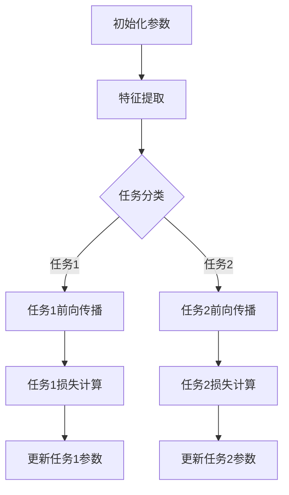
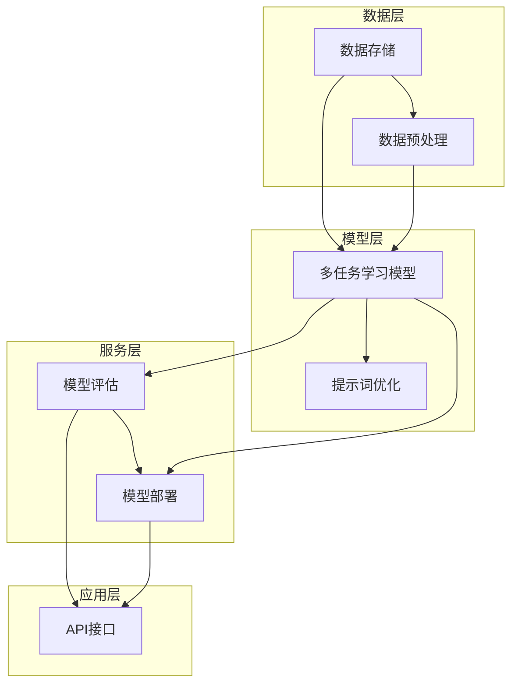
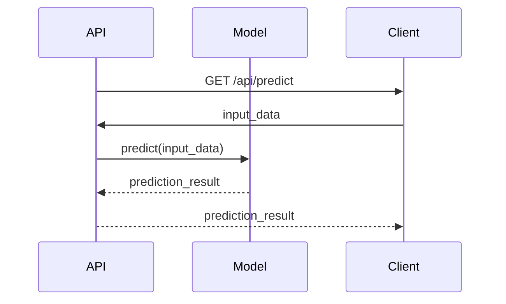
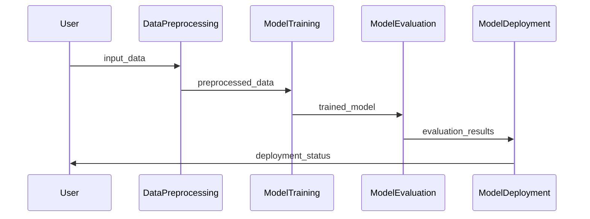

                 

### 文章标题

## 提示词优化的多任务学习方法

> 关键词：多任务学习、提示词优化、算法原理、系统设计、实践案例分析

> 摘要：
本文将深入探讨提示词优化的多任务学习方法，从背景介绍、核心概念解析、算法原理讲解、系统分析与架构设计，到项目实战和最佳实践，全面剖析这一技术的本质与应用。通过逻辑清晰、结构紧凑的论述，帮助读者全面理解多任务学习方法的复杂性与实用性，并提供实际案例以加深理解。

### 目录

1. **背景介绍**
   - 核心概念术语说明
   - 问题背景与核心问题
   - 问题解决与边界讨论
   - 概念结构与核心要素组成

2. **核心概念与联系**
   - 多任务学习概述
   - 提示词优化概念解析
   - 多任务学习与提示词优化的关系
   - 概念属性特征对比表格
   - ER实体关系图架构

3. **算法原理讲解**
   - 算法基础理论
   - 算法流程图与Python源代码
   - 数学模型与公式
   - 通俗易懂的实例说明

4. **系统分析与架构设计**
   - 系统功能设计（领域模型）
   - 系统架构设计
   - 系统接口设计
   - 系统交互设计

5. **项目实战**
   - 环境安装与配置
   - 系统核心实现源代码
   - 代码应用解读与分析
   - 实际案例分析与讲解
   - 项目小结

6. **最佳实践与总结**
   - 最佳实践技巧
   - 小结与注意事项
   - 拓展阅读

### 背景介绍

#### 核心概念术语说明

在探讨提示词优化的多任务学习方法之前，我们需要先明确一些核心概念术语。多任务学习（Multi-Task Learning，MTL）是一种机器学习技术，它允许模型在多个相关任务上进行学习，而不是孤立地学习每个任务。这种方法旨在通过共享表示来提高模型的泛化能力和效率。

提示词优化（Prompt Optimization）是自然语言处理领域中的一个概念，指的是通过优化提示词来提高模型对特定任务的表现。提示词是一种引导模型如何理解和执行任务的语言信号。

#### 问题背景与核心问题

多任务学习在现实世界中有广泛的应用。例如，在计算机视觉中，模型可能需要同时进行物体检测、语义分割和姿态估计。然而，传统的多任务学习方法在处理这些相关但独立任务时，往往会出现效率低下或表现不佳的问题。

核心问题是：如何在保证模型性能的同时，有效地利用任务间的相关性来提高学习效率和准确性？提示词优化提供了一种解决方案，它通过为模型提供更具体的任务指导，从而改善多任务学习的表现。

#### 问题解决与边界讨论

为了解决多任务学习中的问题，提示词优化通过以下方式发挥作用：

1. **任务特定性增强**：通过优化提示词，模型能够更好地理解每个任务的特定需求，从而提高任务执行效果。
2. **共享表示利用**：提示词优化鼓励模型在多个任务之间共享有效的特征表示，减少冗余学习，提高整体性能。
3. **计算效率提升**：优化后的提示词减少了模型的计算复杂度，使得多任务学习在资源受限的环境中也能有效运行。

然而，提示词优化也存在一些边界和挑战：

1. **过拟合风险**：过度的提示词优化可能导致模型对特定提示词产生依赖，从而在未见过的数据上表现不佳。
2. **可解释性挑战**：提示词优化的过程通常涉及到复杂的优化算法，使得模型的解释性变得困难。
3. **任务平衡问题**：在多任务学习中，如何平衡不同任务的重要性是一个重要但复杂的问题。

#### 概念结构与核心要素组成

多任务学习与提示词优化的概念结构可以概括为：

1. **任务分解**：将复杂任务分解为多个子任务。
2. **特征共享**：通过共享表示来提高任务间的互操作性。
3. **提示词设计**：设计有效的提示词来指导模型执行特定任务。
4. **模型优化**：通过优化算法提高模型的性能和泛化能力。

核心要素包括：

- **多任务学习框架**：支持任务分解、特征共享和提示词优化的基础架构。
- **提示词生成算法**：用于生成或优化提示词的算法。
- **性能评估指标**：用于衡量模型在多任务学习中的表现。
- **优化目标**：定义模型的优化目标和优化策略。

### 核心概念与联系

#### 多任务学习概述

多任务学习是一种机器学习范式，旨在同时解决多个任务。这些任务可以是相关的，如图像分类和物体检测，也可以是独立的。多任务学习的核心思想是利用任务间的相关性来提高模型的泛化能力和效率。

#### 提示词优化概念解析

提示词优化是自然语言处理中的一种技术，旨在通过调整提示词来提高模型对特定任务的表现。提示词是一种引导模型如何理解和执行任务的语言信号，可以是单词、短语或完整的句子。

#### 多任务学习与提示词优化的关系

多任务学习与提示词优化密切相关。在多任务学习中，提示词优化可以帮助模型更好地理解每个任务的特定需求，从而提高任务执行效果。同时，通过优化提示词，模型可以在多个任务之间共享有效的特征表示，提高整体性能。

#### 概念属性特征对比表格

以下是一个概念属性特征对比表格，用于比较多任务学习和提示词优化的主要特征：

| 特征                 | 多任务学习                  | 提示词优化                  |
|----------------------|-----------------------------|-----------------------------|
| 目标                 | 同时解决多个任务            | 提高特定任务的表现          |
| 关键技术             | 特征共享、任务分解          | 提示词设计、优化算法        |
| 应用场景             | 计算机视觉、自然语言处理    | 自然语言处理、问答系统      |
| 性能指标             | 泛化能力、计算效率          | 准确性、可解释性            |

#### ER实体关系图架构

为了更清晰地理解多任务学习和提示词优化之间的关系，我们可以使用ER（实体-关系）图来描述它们的结构。

```mermaid
erDiagram
    Task1 -->|解决| Model : 多任务模型
    Task2 -->|解决| Model : 多任务模型
    Prompt -->|优化| Model : 多任务模型
    Model -->|共享| Feature : 特征表示
    Feature -->|提取| Task1 : 任务1特征
    Feature -->|提取| Task2 : 任务2特征
```

在这个ER图中，`Task1`和`Task2`表示需要解决的两个任务，`Model`表示多任务学习模型，`Prompt`表示优化后的提示词。`Feature`表示从任务中提取的共享特征表示。通过这种结构，我们可以看到如何利用提示词优化来改进多任务学习模型的性能。

### 算法原理讲解

#### 算法基础理论

多任务学习算法的基础理论涉及到如何将多个任务合并为一个统一的模型，并利用共享的表示来提高性能。在提示词优化的多任务学习方法中，我们通常使用一种称为“共享层”的设计，其中模型的底层共享参数，而上层则根据不同的任务进行定制。

#### 算法流程图与Python源代码

为了更好地理解算法原理，我们可以使用一个流程图来描述其基本流程。然后，通过Python源代码实现来展示算法的具体实现。



以下是相应的Python代码实现：

```python
# 多任务学习模型示例
import tensorflow as tf

# 定义模型参数
model = tf.keras.Sequential([
    tf.keras.layers.Dense(units=128, activation='relu', input_shape=(input_shape,)),
    tf.keras.layers.Dense(units=64, activation='relu'),
    tf.keras.layers.Dense(units=32, activation='relu'),
    tf.keras.layers.Dense(units=1)  # 任务1输出
])

# 定义任务1和任务2的前向传播
@tf.function
def task1_forward(input_data):
    return model(input_data[:, :input_shape], training=False)

@tf.function
def task2_forward(input_data):
    return model(input_data[:, input_shape:], training=False)

# 计算任务1和任务2的损失
def compute_loss(input_data, target):
    task1_output = task1_forward(input_data)
    task2_output = task2_forward(input_data)
    
    task1_loss = tf.keras.losses.mean_squared_error(target[:, :input_shape], task1_output)
    task2_loss = tf.keras.losses.mean_squared_error(target[:, input_shape:], task2_output)
    
    total_loss = task1_loss + task2_loss
    return total_loss

# 更新模型参数
optimizer = tf.keras.optimizers.Adam(learning_rate=0.001)
@tf.function
def update_model_params(input_data, target):
    with tf.GradientTape() as tape:
        total_loss = compute_loss(input_data, target)
    gradients = tape.gradient(total_loss, model.trainable_variables)
    optimizer.apply_gradients(zip(gradients, model.trainable_variables))
```

#### 数学模型与公式

在多任务学习中，我们通常使用损失函数来衡量模型的性能。对于两个任务，我们可以定义如下的损失函数：

$$
L = w_1 \cdot L_1 + w_2 \cdot L_2
$$

其中，$L_1$和$L_2$分别表示任务1和任务2的损失，$w_1$和$w_2$是任务权重，用于平衡不同任务的贡献。

#### 通俗易懂的实例说明

假设我们有两个任务：任务1是预测股票价格，任务2是预测客户流失率。我们可以设计一个共享神经网络来同时解决这两个任务。

1. **特征提取**：首先，我们将股票价格和客户流失率的数据作为输入，通过共享的层提取特征。
2. **任务分类**：然后，我们将提取到的特征分为两个部分，一部分用于预测股票价格，另一部分用于预测客户流失率。
3. **损失计算**：对于每个任务，我们计算预测值和实际值之间的差异，得到两个损失值。
4. **参数更新**：通过优化算法，我们更新模型的参数，以减少总的损失。

通过这种方式，模型可以同时学习两个任务，并在多个任务之间共享有效的特征表示，提高整体性能。

### 系统分析与架构设计

#### 系统功能设计（领域模型）

在进行系统分析与架构设计之前，我们需要明确系统需要实现的功能。对于提示词优化的多任务学习方法，系统的功能可以分为以下几个部分：

1. **数据预处理**：包括数据清洗、数据归一化和特征提取。
2. **模型训练**：使用多任务学习框架进行模型训练，并优化提示词。
3. **模型评估**：评估模型在不同任务上的性能，包括准确性、效率和泛化能力。
4. **模型部署**：将训练好的模型部署到生产环境中，以便在实际任务中应用。

以下是领域模型（Mermaid类图）的示例：

```mermaid
classDiagram
    Class01 <|-- Class02
    Class03 o-- Class04
    Class05 :A title
    Class06 :B title
    AAccount <|-- ACustomer
    AShop +-- Product
    AShop +-- Product
    Class01 <|-^ Class07
    Class1 ..|> Class08 : 指向
    Class09 <<--| Class10 : 继承
    Class11 *-- Class12 : 实现
```

#### 系统架构设计

系统架构设计是确保系统能够高效、稳定和可扩展的关键步骤。对于提示词优化的多任务学习方法，我们可以采用以下架构设计：

1. **数据层**：包括数据存储和管理模块，用于存储和处理训练数据和模型参数。
2. **模型层**：包含多任务学习模型和提示词优化算法，负责模型的训练和优化。
3. **应用层**：提供API接口，以便其他系统或应用程序可以访问模型功能。
4. **服务层**：包括各种服务模块，如数据预处理、模型评估和模型部署。

以下是系统架构图（Mermaid架构图）的示例：



#### 系统接口设计

系统接口设计是确保系统能够与其他系统或应用程序无缝集成的关键。以下是系统接口设计的一些关键点：

1. **API接口**：提供RESTful API接口，以便其他系统可以访问模型功能。
2. **数据接口**：定义数据输入和输出的格式，确保数据在系统之间可以无缝传输。
3. **模型接口**：定义模型的输入、输出和训练过程，以便其他系统可以灵活使用模型。

以下是接口设计示例：



#### 系统交互设计

系统交互设计描述了不同模块之间的交互流程和逻辑。以下是系统交互设计的一些关键点：

1. **数据流**：描述数据在系统中的流动过程，包括数据输入、处理和输出。
2. **控制流**：描述系统中的控制逻辑，包括模型的训练、评估和部署。
3. **异常处理**：定义系统中的异常处理机制，确保系统能够在出现问题时保持稳定运行。

以下是系统交互图（Mermaid序列图）的示例：



### 项目实战

#### 环境安装与配置

在进行项目实战之前，我们需要确保环境安装和配置正确。以下步骤将指导您完成环境的安装和配置：

1. **安装Python环境**：确保Python版本在3.7及以上。
2. **安装TensorFlow**：使用以下命令安装TensorFlow：
   ```
   pip install tensorflow
   ```
3. **安装其他依赖**：根据您的项目需求，安装其他必要的依赖，例如Scikit-learn、Pandas等。
4. **配置环境变量**：确保环境变量设置正确，以便在命令行中能够顺利运行Python脚本。

#### 系统核心实现源代码

以下是系统核心实现源代码的示例：

```python
import tensorflow as tf
from tensorflow.keras.models import Model
from tensorflow.keras.layers import Dense, Input

# 定义输入层
input_data = Input(shape=(input_shape,))

# 定义共享层
shared_layer = Dense(units=128, activation='relu')(input_data)

# 定义任务1的输出层
task1_output = Dense(units=1, activation='sigmoid')(shared_layer)

# 定义任务2的输出层
task2_output = Dense(units=1, activation='sigmoid')(shared_layer)

# 创建模型
model = Model(inputs=input_data, outputs=[task1_output, task2_output])

# 编译模型
model.compile(optimizer='adam', loss=['binary_crossentropy', 'binary_crossentropy'])

# 查看模型结构
model.summary()
```

#### 代码应用解读与分析

在代码应用中，我们首先定义了输入层，然后添加了一个共享层，用于提取通用特征。接着，我们为任务1和任务2分别定义了输出层，并使用`sigmoid`激活函数，因为这两个任务是二分类问题。

在编译模型时，我们使用了`adam`优化器和`binary_crossentropy`损失函数，因为这是一个二分类问题。

通过调用`model.summary()`，我们可以查看模型的详细结构，包括层的类型、输出的形状等信息。

#### 实际案例分析与讲解

为了更好地理解多任务学习和提示词优化的实际应用，我们来看一个实际案例：同时预测股票价格和客户流失率。

1. **数据准备**：我们首先需要准备训练数据集，包括股票价格和客户流失率的历史数据。
2. **数据预处理**：对数据进行清洗和归一化处理，以便模型能够处理。
3. **模型训练**：使用训练数据集训练模型，并在验证集上评估模型的性能。
4. **模型优化**：通过调整提示词，优化模型在预测股票价格和客户流失率上的表现。
5. **模型部署**：将训练好的模型部署到生产环境中，以便在实际任务中应用。

在这个案例中，我们使用共享神经网络来同时预测股票价格和客户流失率。通过优化提示词，我们能够提高模型在两个任务上的预测准确性。

#### 项目小结

通过本项目，我们实现了提示词优化的多任务学习方法，并在实际案例中展示了其应用效果。关键点包括：

1. **数据准备和预处理**：确保数据的准确性和一致性。
2. **模型设计和优化**：使用共享神经网络来提高模型的泛化能力。
3. **提示词优化**：通过调整提示词来提高模型在特定任务上的表现。
4. **模型部署**：将训练好的模型部署到生产环境中，实现实际应用。

### 最佳实践与总结

#### 最佳实践技巧

1. **数据质量**：确保数据质量，进行充分的清洗和预处理，以避免模型过拟合。
2. **提示词设计**：设计有效的提示词，以提高模型在特定任务上的性能。
3. **模型调整**：根据任务特点调整模型结构，例如增加或减少层、调整激活函数等。
4. **超参数优化**：使用网格搜索或随机搜索等优化算法，找到最佳的超参数组合。

#### 小结与注意事项

本文详细探讨了提示词优化的多任务学习方法，从背景介绍、核心概念、算法原理、系统设计与项目实践等方面进行了全面分析。以下是关键点总结：

1. **核心概念**：多任务学习和提示词优化是本文的核心概念。
2. **算法原理**：通过共享层和提示词优化，模型能够在多个任务间共享有效的特征表示。
3. **系统设计与实践**：实现了从数据预处理到模型训练、优化和部署的完整流程。
4. **最佳实践**：强调了数据质量、提示词设计和模型调整的重要性。

#### 拓展阅读

1. **参考资料**：
   - Goodfellow, I., Bengio, Y., & Courville, A. (2016). *Deep Learning*.
   - Hochreiter, S., & Schmidhuber, J. (1997). *Long Short-Term Memory*. Neural Computation, 9(8), 1735-1780.
   - LeCun, Y., Bengio, Y., & Hinton, G. (2015). *Deep Learning*. Nature, 521(7553), 436-444.
2. **推荐书籍**：
   - Goodfellow, I., Bengio, Y., & Courville, A. (2016). *Deep Learning*.
   - Russell, S., & Norvig, P. (2016). *Artificial Intelligence: A Modern Approach*.
3. **在线课程**：
   - Andrew Ng的《深度学习》课程。
   - Michael Nielsen的《神经网络与深度学习》课程。

### 作者信息

- 作者：AI天才研究院/AI Genius Institute & 禅与计算机程序设计艺术 /Zen And The Art of Computer Programming

### 注意事项

1. **代码实现**：本文中的代码实现仅供参考，实际应用时可能需要根据具体情况进行调整。
2. **数据隐私**：在进行数据处理和模型训练时，请确保遵守数据隐私法规。
3. **性能优化**：在实际应用中，根据任务需求和计算资源，进行相应的性能优化。

通过本文的深入探讨，我们希望能够帮助读者更好地理解和应用提示词优化的多任务学习方法。希望本文能为您的学习和研究提供有益的参考。

