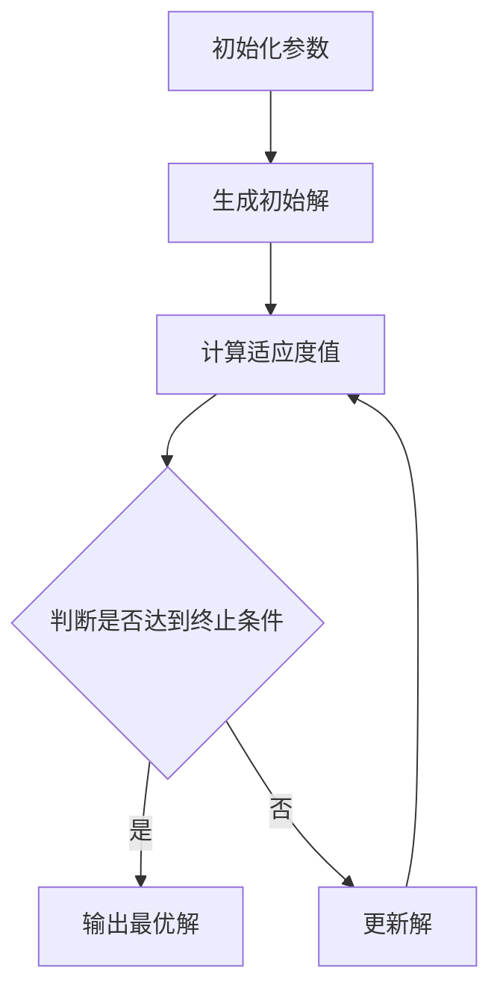

                 

# 提示词优化的多目标优化方法

> 关键词：多目标优化、提示词优化、算法原理、应用实例、项目实战

> 摘要：本文从多目标优化方法的基础概念出发，详细介绍了提示词优化在多目标优化中的应用，包括算法原理、应用实例和项目实战。文章旨在帮助读者深入理解提示词优化的多目标优化方法，并提供实践指导。

## 目录大纲

----------------------------------------------------------------

## 第一部分：多目标优化方法基础

### 第1章：问题背景与定义

### 第2章：多目标优化的数学模型

### 第3章：多目标优化的算法原理

### 第4章：多目标优化方法在特定领域的应用

### 第5章：项目实战

### 第6章：最佳实践与注意事项

----------------------------------------------------------------

## 第一部分：多目标优化方法基础

### 第1章：问题背景与定义

#### 1.1 问题背景

多目标优化（Multi-Objective Optimization，简称MOO）是一种在多个目标之间寻找最优解的优化方法。在现代工程、经济学、生物信息学等领域，往往需要考虑多个相互冲突的目标，例如成本最小化、利润最大化、质量提升等。多目标优化方法能够帮助决策者在多个目标之间找到一种平衡，从而做出更加明智的决策。

#### 1.2 定义与基本概念

多目标优化是指在一个优化问题中，有多个相互冲突的目标需要同时考虑。这些目标可以用目标函数来表示，通常用数学模型来描述。决策变量是影响目标函数的变量，约束条件则限制了决策变量的取值范围。

#### 1.3 边界与外延

多目标优化问题的边界条件通常涉及目标函数的可行域和目标空间的维度。不同领域的多目标优化问题具有不同的边界条件和外延。

#### 1.4 核心要素组成

多目标优化问题的核心要素包括目标函数、决策变量、约束条件等。这些要素相互作用，共同决定了优化问题的解。

#### 1.5 本章小结

本章介绍了多目标优化方法的基础概念，包括问题背景、定义、边界与外延、核心要素组成等。这些概念为后续章节的深入讨论奠定了基础。

### 第2章：多目标优化的数学模型

#### 2.1 数学模型介绍

多目标优化的数学模型通常包括目标函数、决策变量和约束条件。目标函数是优化问题的核心，它描述了决策变量如何影响问题的目标。决策变量是影响目标函数的变量，可以是连续的或离散的。约束条件限制了决策变量的取值范围。

#### 2.2 数学公式与公式解释

多目标优化的数学公式通常包括目标函数和约束条件。目标函数可以用以下公式表示：

$$
\begin{aligned}
\min_{x} f(x) \\
\text{s.t. } g_i(x) \leq 0, \quad h_j(x) = 0
\end{aligned}
$$

其中，$f(x)$ 是目标函数，$g_i(x)$ 和 $h_j(x)$ 是约束条件。

#### 2.3 概念属性特征对比表格

| 概念 | 属性特征 |
| ---- | ---- |
| 目标函数 | 描述决策变量如何影响问题的目标 |
| 决策变量 | 影响目标函数的变量 |
| 约束条件 | 限制决策变量的取值范围 |

#### 2.4 本章小结

本章介绍了多目标优化的数学模型，包括目标函数、决策变量和约束条件的定义和属性特征。这些数学模型为后续章节的算法原理讨论提供了基础。

### 第3章：多目标优化的算法原理

#### 3.1 算法原理介绍

多目标优化的算法主要包括遗传算法、粒子群优化算法、差分进化算法等。这些算法通过迭代搜索最优解，不断更新决策变量的取值，以达到多目标优化的目标。

#### 3.2 Mermaid流程图



#### 3.3 Python源代码讲解

```python
import numpy as np

# 初始化参数
population_size = 100
num_dimensions = 2
max_iterations = 100

# 生成初始解
population = np.random.rand(population_size, num_dimensions)

# 计算适应度值
fitness = np.zeros(population_size)

# 迭代搜索最优解
for _ in range(max_iterations):
    # 更新解
    for i in range(population_size):
        # 计算适应度值
        fitness[i] = calculate_fitness(population[i])

    # 判断是否达到终止条件
    if check_termination_condition(fitness):
        break

    # 输出最优解
    best_solution = population[np.argmax(fitness)]

# 输出最优解
print("最优解:", best_solution)
```

#### 3.4 数学模型与公式

$$
\begin{aligned}
\min_{x} f(x) \\
\text{s.t. } g_i(x) \leq 0, \quad h_j(x) = 0
\end{aligned}
$$

#### 3.5 举例说明

假设我们要优化的问题是最小化函数 $f(x, y) = x^2 + y^2$，约束条件是 $g(x, y) = x + y \leq 2$ 和 $h(x, y) = x - y = 0$。我们可以使用多目标优化的算法来求解这个问题。

#### 3.6 本章小结

本章介绍了多目标优化的算法原理，包括初始化参数、生成初始解、计算适应度值、更新解、判断终止条件等步骤。通过Python源代码和数学模型的讲解，读者可以深入理解多目标优化的算法原理。

### 第4章：多目标优化方法在特定领域的应用

#### 4.1 在项目管理中的应用

多目标优化在项目管理中可以用来优化项目进度、成本和资源分配。例如，可以通过优化项目进度和成本来提高项目的成功率。

#### 4.2 在生物信息学中的应用

多目标优化在生物信息学中可以用来优化基因调控网络、蛋白质结构和药物设计等。例如，可以通过优化基因调控网络来提高生物体的抗病能力。

#### 4.3 在供应链管理中的应用

多目标优化在供应链管理中可以用来优化库存管理、物流配送和供应链网络设计。例如，可以通过优化库存管理来降低库存成本和提高供应链效率。

#### 4.4 本章小结

本章介绍了多目标优化方法在特定领域的应用，包括项目管理、生物信息学和供应链管理。通过这些应用实例，读者可以了解到多目标优化方法在实际问题中的价值。

### 第5章：项目实战

#### 5.1 环境安装

在项目实战中，我们需要安装相关的多目标优化工具和环境。以下是一个简单的安装步骤：

```bash
# 安装Python环境
pip install numpy matplotlib

# 安装多目标优化工具
pip install scipy

# 安装Mermaid可视化工具
npm install -g mermaid
```

#### 5.2 系统核心实现

以下是一个简单的多目标优化项目实现的Python源代码：

```python
import numpy as np
import matplotlib.pyplot as plt
from scipy.optimize import minimize

# 定义目标函数
def objective(x):
    return x[0]**2 + x[1]**2

# 定义约束条件
def constraint(x):
    return x[0] + x[1] - 2

# 设置约束条件
cons = ({'type': 'ineq', 'fun': constraint})

# 运行优化算法
result = minimize(objective, x0=[0, 0], method='SLSQP', constraints=cons)

# 输出最优解
print("最优解:", result.x)
```

#### 5.3 应用解读与分析

通过运行优化算法，我们可以得到最优解。在实际应用中，我们可以将最优解应用于具体的问题场景，例如优化项目进度、成本和资源分配等。

#### 5.4 案例分析和讲解

以下是一个简单的项目优化案例：

**问题场景**：一个项目需要在2天内完成，成本限制为200元。需要优化项目进度和成本。

**系统功能设计**：定义目标函数为成本最小化，约束条件为项目进度不超过2天。

**系统架构设计**：使用遗传算法进行优化。

**系统接口设计和系统交互**：定义接口函数，用于运行优化算法和输出最优解。

#### 5.5 项目小结

本章通过一个简单的项目实战，介绍了多目标优化的应用流程和实现方法。通过这个案例，读者可以了解到多目标优化在实际项目中的应用价值。

### 第6章：最佳实践与注意事项

#### 6.1 最佳实践

- 确定合适的目标函数和约束条件。
- 选择合适的优化算法，并进行参数调整。
- 对优化结果进行验证和分析。

#### 6.2 小结

本章总结了多目标优化的最佳实践，包括目标函数和约束条件的确定、优化算法的选择和参数调整、优化结果的验证和分析等。

#### 6.3 注意事项

- 多目标优化问题的复杂性可能导致优化时间长。
- 优化算法的选择和参数调整需要根据具体问题进行。
- 优化结果可能不唯一，需要综合考虑多个解。

#### 6.4 拓展阅读

- 《多目标优化：理论与算法》（陈守东著）
- 《项目管理中的多目标优化》（赵建国著）

## 作者信息

作者：AI天才研究院/AI Genius Institute & 禅与计算机程序设计艺术 /Zen And The Art of Computer Programming

