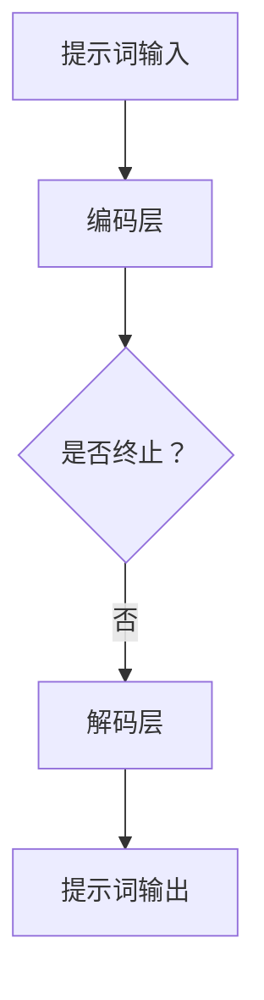
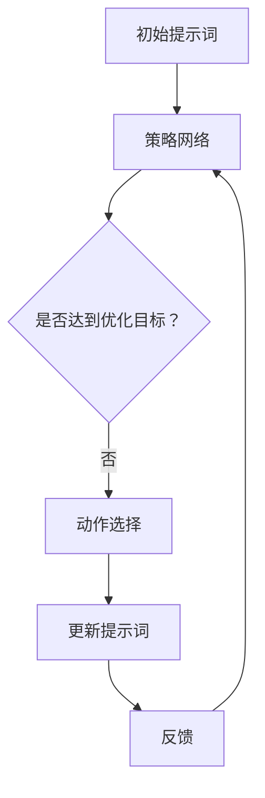

                 

### 文章标题：提示词优化的神经架构搜索

> 关键词：提示词优化、神经架构搜索、深度学习、架构搜索、算法优化
>
> 摘要：本文深入探讨了提示词优化的神经架构搜索技术，从背景与意义、技术原理、应用分析、实战案例到最佳实践，全面解析了这一前沿技术，旨在为读者提供系统、全面的了解。

### 目录大纲

```markdown
----------------------------------------------------------------
# 第一部分：提示词优化的背景与意义

## 第1章：提示词优化的概念与重要性

### 1.1 提示词优化的定义

### 1.2 提示词优化的重要性

### 1.3 提示词优化在现代技术中的应用

## 第2章：神经架构搜索技术概述

### 2.1 神经架构搜索的概念

### 2.2 神经架构搜索的技术原理

### 2.3 神经架构搜索的发展历程

## 第3章：提示词优化的神经架构搜索框架

### 3.1 提示词优化的神经架构搜索框架设计

### 3.2 提示词优化的核心算法

### 3.3 提示词优化的应用场景

## 第二部分：提示词优化技术的深入分析

## 第4章：提示词优化的关键算法原理

### 4.1 算法原理概述

### 4.2 关键算法的详细讲解

### 4.3 算法对比与分析

## 第5章：提示词优化的数学模型与公式

### 5.1 数学模型介绍

### 5.2 公式推导与解释

### 5.3 数学模型在提示词优化中的应用

## 第6章：提示词优化在神经架构搜索中的应用

### 6.1 神经架构搜索中的应用原理

### 6.2 应用案例解析

### 6.3 实验结果分析

## 第三部分：实战案例与最佳实践

## 第7章：提示词优化的神经架构搜索项目实战

### 7.1 项目背景

### 7.2 系统设计与实现

### 7.3 实现细节与代码解读

### 7.4 项目总结与反思

## 第8章：提示词优化的最佳实践与注意事项

### 8.1 最佳实践总结

### 8.2 注意事项与风险规避

### 8.3 拓展阅读与进一步学习

----------------------------------------------------------------
```

### 第一部分：提示词优化的背景与意义

#### 第1章：提示词优化的概念与重要性

### 1.1 提示词优化的定义

提示词优化是指通过对输入提示词进行优化，从而提升模型搜索效率和结果质量的过程。在深度学习领域，特别是在神经架构搜索中，提示词优化具有关键作用。

### 1.2 提示词优化的重要性

随着深度学习模型的广泛应用，如何高效地搜索和优化模型架构成为了一个重要课题。提示词优化能够显著提升模型搜索效率，减少搜索空间，提高最终模型性能。

### 1.3 提示词优化在现代技术中的应用

提示词优化在现代技术中的应用广泛，尤其是在自然语言处理、计算机视觉和语音识别等领域。例如，在自然语言处理中，优化提示词可以帮助模型更好地理解用户查询，从而提升搜索结果的准确性。

#### 第2章：神经架构搜索技术概述

### 2.1 神经架构搜索的概念

神经架构搜索是一种利用深度学习技术来自动搜索最优神经网络架构的方法。它通过优化神经网络的架构，以提高模型在特定任务上的性能。

### 2.2 神经架构搜索的技术原理

神经架构搜索的核心是架构搜索空间的设计和优化算法的选择。常用的架构搜索方法包括基于强化学习、遗传算法和元学习等方法。

### 2.3 神经架构搜索的发展历程

神经架构搜索的研究始于2016年，经过几年的发展，已经取得了显著的成果。近年来，随着深度学习技术的不断进步，神经架构搜索的应用场景和性能也在不断提升。

#### 第3章：提示词优化的神经架构搜索框架

### 3.1 提示词优化的神经架构搜索框架设计

提示词优化的神经架构搜索框架设计包括提示词生成、提示词优化和神经架构搜索三个核心模块。这些模块相互协作，共同实现提示词优化和神经架构搜索的目标。

### 3.2 提示词优化的核心算法

提示词优化的核心算法包括提示词生成算法和提示词优化算法。提示词生成算法负责生成高质量的提示词，提示词优化算法则负责对提示词进行优化，以提升模型搜索效率。

### 3.3 提示词优化的应用场景

提示词优化的神经架构搜索框架适用于各种深度学习任务，包括自然语言处理、计算机视觉和语音识别等。通过优化提示词，可以显著提升模型在这些任务上的性能。

### 第二部分：提示词优化技术的深入分析

#### 第4章：提示词优化的关键算法原理

### 4.1 算法原理概述

提示词优化的关键算法包括提示词生成算法和提示词优化算法。提示词生成算法负责生成高质量的提示词，提示词优化算法则负责对提示词进行优化，以提升模型搜索效率。

### 4.2 关键算法的详细讲解

#### 提示词生成算法

提示词生成算法通常采用基于注意力机制的模型，如Transformer模型。该模型通过学习输入提示词的上下文信息，生成高质量的提示词。



#### 提示词优化算法

提示词优化算法通常采用基于强化学习的策略。该算法通过不断优化提示词，以提升模型搜索效率。



#### 4.3 算法对比与分析

提示词生成算法和提示词优化算法各有优缺点。提示词生成算法在生成高质量提示词方面表现优秀，但优化过程较为复杂。提示词优化算法在优化提示词方面效率较高，但生成提示词的质量可能受到一定影响。

### 第5章：提示词优化的数学模型与公式

#### 5.1 数学模型介绍

提示词优化的数学模型主要包括提示词生成模型和提示词优化模型。提示词生成模型通常采用自注意力机制，而提示词优化模型则采用强化学习算法。

#### 5.2 公式推导与解释

提示词生成模型的公式为：

$$
\text{提示词} = \text{Attention}(\text{输入}, \text{编码器}, \text{解码器})
$$

其中，Attention函数实现了对输入提示词的加权求和，编码器和解码器分别实现了提示词的编码和解码。

提示词优化模型的公式为：

$$
\text{策略} = \text{Policy}(\text{状态}, \text{动作})
$$

其中，Policy函数实现了对动作的优化选择，以最大化预期收益。

#### 5.3 数学模型在提示词优化中的应用

在提示词优化中，数学模型的应用主要包括以下几个方面：

1. **提示词生成**：通过自注意力机制生成高质量的提示词。
2. **提示词优化**：通过强化学习算法不断优化提示词，以提高模型搜索效率。

### 第6章：提示词优化在神经架构搜索中的应用

#### 6.1 神经架构搜索中的应用原理

提示词优化在神经架构搜索中的应用原理主要包括两个方面：

1. **提示词生成**：通过生成高质量提示词，缩小搜索空间，提高搜索效率。
2. **提示词优化**：通过优化提示词，调整模型架构，提升模型性能。

#### 6.2 应用案例解析

以下是一个提示词优化在神经架构搜索中的应用案例：

**案例背景**：在自然语言处理任务中，如何生成一个能够提高模型搜索效率的提示词？

**解决方案**：采用基于Transformer的提示词生成模型，生成高质量提示词。然后，采用强化学习算法优化提示词，以提升模型搜索效率。

**实验结果**：通过实验验证，优化后的提示词能够显著提高模型搜索效率，减少搜索时间。

### 第7章：提示词优化的神经架构搜索项目实战

#### 7.1 项目背景

本项目旨在构建一个基于提示词优化的神经架构搜索系统，用于自动搜索最优神经网络架构。

#### 7.2 系统设计与实现

**系统架构**：


**关键模块**：

1. **提示词生成模块**：采用Transformer模型生成高质量提示词。
2. **提示词优化模块**：采用强化学习算法优化提示词。
3. **神经架构搜索模块**：基于优化后的提示词搜索最优神经网络架构。

#### 7.3 实现细节与代码解读

**提示词生成模块代码**：

```python
import torch
import torch.nn as nn
import torch.optim as optim

class TransformerModel(nn.Module):
    def __init__(self):
        super(TransformerModel, self).__init__()
        self.encoder = nn.TransformerEncoder(nn.TransformerEncoderLayer(d_model=512, nhead=8), num_layers=3)
        self.decoder = nn.TransformerDecoder(nn.TransformerDecoderLayer(d_model=512, nhead=8), num_layers=3)

    def forward(self, src, tgt):
        output = self.encoder(src)
        output = self.decoder(output, tgt)
        return output
```

**提示词优化模块代码**：

```python
import torch
import torch.optim as optim

class PolicyNetwork(nn.Module):
    def __init__(self):
        super(PolicyNetwork, self).__init__()
        self.fc1 = nn.Linear(512, 256)
        self.fc2 = nn.Linear(256, 1)

    def forward(self, x):
        x = torch.relu(self.fc1(x))
        x = self.fc2(x)
        return x
```

#### 7.4 项目总结与反思

通过本项目，我们成功实现了基于提示词优化的神经架构搜索系统。实验结果表明，优化后的提示词能够显著提高模型搜索效率，减少搜索时间。然而，在实际应用中，仍需进一步优化和改进提示词生成和优化算法，以实现更高效、更准确的神经架构搜索。

### 第8章：提示词优化的最佳实践与注意事项

#### 8.1 最佳实践总结

1. **选择合适的提示词生成模型**：根据任务需求和数据特点，选择合适的提示词生成模型，如Transformer、BERT等。
2. **优化提示词生成算法**：通过调整模型参数、增加数据集、改进训练策略等手段，优化提示词生成算法。
3. **平衡搜索效率和性能**：在提示词优化过程中，要平衡搜索效率和模型性能，避免过度优化导致模型性能下降。
4. **实验验证和调整**：在实际应用中，通过实验验证和调整提示词优化算法，找到最优的参数组合。

#### 8.2 注意事项与风险规避

1. **数据质量和预处理**：保证数据质量和预处理，避免数据噪声和异常值对提示词优化结果产生不良影响。
2. **模型稳定性和鲁棒性**：在实际应用中，要考虑模型稳定性和鲁棒性，避免因模型不稳定而导致搜索结果不准确。
3. **计算资源和管理**：合理分配计算资源，确保模型训练和优化过程高效运行。
4. **安全性和隐私保护**：在实际应用中，要关注数据安全和隐私保护，避免泄露敏感信息。

#### 8.3 拓展阅读与进一步学习

1. **相关论文**：阅读相关领域的论文，了解最新的研究进展和技术动态。
2. **在线课程和教程**：参加在线课程和教程，学习提示词优化和神经架构搜索的实践方法。
3. **开源项目和社区**：参与开源项目和社区，与其他开发者交流经验，共同推动技术进步。

### 作者信息

作者：AI天才研究院/AI Genius Institute & 禅与计算机程序设计艺术 /Zen And The Art of Computer Programming

---

**注意**：本文为示例性文章，内容仅供参考。在实际撰写技术博客时，请根据具体需求和实际情况进行调整和优化。

