                 


### 文章标题：提示词优化的自动机器学习方法

#### 关键词：提示词优化，自动机器学习，深度学习，强化学习，用户互动

#### 摘要：
本文旨在深入探讨提示词优化的自动机器学习方法，通过逐步分析其背景、核心概念、算法原理、数学模型以及系统架构设计，为读者提供一套完整的技术指南。我们将从传统方法、深度学习方法到强化学习方法，逐一剖析其原理与应用，并借助实际案例，展示这些方法在实际项目中的效果。文章还将讨论如何优化系统功能设计和实现，以提高用户体验。

----------------------------------------------------------------

## 目录大纲：提示词优化的自动机器学习方法

----------------------------------------------------------------

### 第一部分：背景与基础

#### 第1章：问题背景与核心概念

##### 1.1.1 提示词优化的概述

提示词优化是指在自动机器学习（AutoML）中，通过优化提示词来提升模型性能和用户满意度。它涉及到如何选择最佳提示词，使得机器学习模型能够更准确地预测或分类数据。

##### 1.1.2 自动机器学习概述

自动机器学习是一种旨在自动化机器学习流程的技术，包括模型选择、超参数调优、特征选择等。其目标是减少专业知识和时间投入，提高模型开发效率。

##### 1.1.3 提示词优化的应用场景

提示词优化在人工智能助手、自然语言处理、机器翻译和推荐系统等领域有着广泛的应用。这些场景都受益于提示词优化的精细调整，从而提高系统性能和用户体验。

##### 1.1.4 提示词优化与用户互动

提示词优化在用户互动中的作用至关重要。通过优化提示词，可以提高系统的自然语言理解能力，从而更准确地响应用户需求，提升用户体验。

#### 第2章：核心概念与联系

##### 2.1.1 提示词优化方法分类

提示词优化方法可分为传统方法、深度学习方法和强化学习方法。每种方法都有其独特的原理和适用场景。

##### 2.1.2 概念属性特征对比表格

通过对比表格，我们可以清晰地看到三种方法在性能、效率和适用性等方面的差异。

##### 2.1.3 ER实体关系图

ER实体关系图可以帮助我们理解提示词优化系统中各个实体之间的关系，为系统设计提供直观的视觉辅助。

### 第二部分：算法原理与模型讲解

#### 第3章：深度学习原理

##### 3.1.1 深度学习基础

深度学习是机器学习的一个分支，通过模拟人脑的神经网络结构，实现对数据的自动特征提取和学习。本章将介绍深度学习的基础知识，包括其定义、结构和发展历程。

##### 3.1.2 深度学习核心算法

神经网络、反向传播算法、损失函数和优化算法是深度学习的核心组成部分。本章将逐一介绍这些算法的基本原理和实现方法。

#### 第4章：提示词优化算法

##### 4.1.1 算法概述

提示词优化算法的目标是选择最佳提示词，以提高机器学习模型的性能。本章将介绍三种主要的提示词优化算法：提示词选择算法、基于深度学习的提示词优化方法和基于强化学习的提示词优化方法。

##### 4.1.2 算法讲解与示例

通过实际代码示例，我们将深入讲解每种算法的实现过程，帮助读者更好地理解其原理和应用。

##### 4.1.3 数学模型与公式

提示词优化算法涉及多个数学模型和公式，本章将详细推导和解释这些公式，以帮助读者更好地理解算法背后的数学原理。

#### 第5章：数学模型与公式

##### 5.1.1 数学模型介绍

本章将介绍与提示词优化相关的数学模型，包括损失函数、梯度下降算法等。

##### 5.1.2 公式推导与解释

通过推导和解释，我们将深入理解这些公式在提示词优化算法中的作用和意义。

### 第三部分：系统分析与架构设计

#### 第6章：系统功能设计

##### 6.1.1 问题场景介绍

本章将介绍提示词优化系统在人工智能应用中的具体场景，为后续的系统设计提供背景。

##### 6.1.2 系统功能设计

本章将详细讨论系统的主要功能模块，包括领域模型和系统架构设计。

#### 第7章：系统架构设计

##### 7.1.1 系统架构设计

本章将介绍系统的整体架构设计，包括各个模块的交互关系和功能实现。

##### 7.1.2 系统接口设计和系统交互

本章将介绍系统的接口设计和交互流程，通过Mermaid序列图展示系统各组件之间的交互关系。

### 第四部分：项目实战

#### 第8章：环境安装与系统核心实现

##### 8.1.1 环境安装

本章将介绍如何搭建提示词优化系统的开发环境，包括所需软件和工具的安装。

##### 8.1.2 系统核心实现

本章将详细讲解系统核心功能的实现，包括提示词选择算法、深度学习方法和强化学习方法等。

#### 第9章：代码应用解读与分析

##### 9.1.1 代码应用解读

本章将通过对核心代码的解读，帮助读者理解系统实现的细节。

##### 9.1.2 系统性能测试与分析

本章将介绍系统性能的测试方法和结果分析，为优化系统提供数据支持。

#### 第10章：实际案例分析与详细讲解剖析

##### 10.1.1 实际案例

本章将分享一个实际案例，展示提示词优化系统在实际应用中的效果。

##### 10.1.2 详细讲解剖析

本章将对案例进行详细讲解和剖析，帮助读者理解系统的实际应用价值。

#### 第11章：项目小结

##### 11.1.1 项目小结

本章将对项目进行总结，回顾项目的核心成果和经验教训。

##### 11.1.2 最佳实践 tips

本章将分享一些最佳实践和注意事项，为读者提供实用的操作建议。

##### 11.1.3 拓展阅读

本章将推荐一些相关的阅读材料，以帮助读者深入了解提示词优化和自动机器学习领域。

----------------------------------------------------------------

### 第一部分：背景与基础

## 第1章：问题背景与核心概念

### 1.1.1 提示词优化的概述

提示词优化是指通过选择最佳的提示词来提高机器学习模型性能的过程。在自动机器学习（AutoML）中，提示词优化是一项至关重要的任务，因为它直接影响着模型的预测准确性、泛化能力和用户体验。在自然语言处理（NLP）、推荐系统、图像识别等领域，提示词优化的效果尤为显著。

#### 提示词优化的概念解释

提示词（Prompt）是指在机器学习模型训练或推理过程中，提供给模型的一段文本或指令，用于引导模型的学习方向和决策过程。优化（Optimization）则是指通过调整提示词的内容和形式，以提高模型的表现。

#### 提示词优化在自动机器学习中的重要性

自动机器学习（AutoML）旨在自动化机器学习流程，从数据预处理、特征工程到模型选择和训练。提示词优化作为其中一环，其重要性体现在以下几个方面：

1. **提高模型性能**：通过选择最佳的提示词，可以显著提高模型的预测准确率和泛化能力。
2. **降低人力成本**：自动化的提示词优化减少了手动调参的工作量，降低了开发和部署模型的成本。
3. **改善用户体验**：优化的提示词可以更好地理解用户需求，提供更准确的预测和更自然的交互。

### 1.1.2 自动机器学习概述

#### 自动机器学习的定义

自动机器学习（AutoML）是一种自动化机器学习流程的技术，旨在减少机器学习开发的时间和人力成本。它通过自动化模型选择、超参数调优、特征选择等步骤，使非专业人士也能够快速构建和部署高效的机器学习模型。

#### 自动机器学习的发展历程

自动机器学习的发展历程可以分为以下几个阶段：

1. **早期探索**（2010年前）：主要关注自动化模型选择和特征选择。
2. **快速发展**（2010-2015年）：涌现出大量AutoML工具和平台，如TPOT、H2O.ai等。
3. **成熟应用**（2015年后）：AutoML技术逐渐应用于商业和科研领域，如Kaggle竞赛中的AutoML团队。

#### 自动机器学习的关键技术

自动机器学习的关键技术包括：

1. **模型选择**：使用启发式算法或元学习技术自动选择最适合的数据集和模型架构。
2. **超参数调优**：通过随机搜索、贝叶斯优化、梯度提升等方法自动化超参数调整。
3. **特征选择**：使用特征重要性评估、特征筛选算法等自动化特征选择过程。

### 1.1.3 提示词优化的应用场景

#### 人工智能助手

人工智能助手（如聊天机器人、虚拟助手）是提示词优化的重要应用场景。通过优化对话提示词，助手可以更准确地理解用户意图，提供更自然的交互体验。

#### 自然语言处理

在自然语言处理（NLP）领域，提示词优化用于提高文本分类、情感分析、机器翻译等任务的性能。优化后的提示词可以帮助模型更好地捕捉语义信息，提高预测准确性。

#### 机器翻译

机器翻译是提示词优化的重要应用领域。通过优化翻译提示词，可以提高翻译模型的准确性和流畅性，降低翻译错误率。

#### 推荐系统

推荐系统通过优化提示词，可以更好地理解用户偏好和兴趣，提供更个性化的推荐结果。提示词优化有助于提高推荐系统的准确性和用户满意度。

### 1.1.4 提示词优化与用户互动

#### 提示词优化在用户互动中的作用

提示词优化在用户互动中扮演着关键角色。通过优化提示词，可以提升系统对用户意图的理解能力，提供更准确和个性化的服务。

1. **自然语言理解**：优化后的提示词有助于模型更准确地理解和解析用户输入的自然语言。
2. **个性化服务**：通过优化提示词，系统可以更好地捕捉用户的个性化需求，提供更符合用户预期的结果。

#### 提高用户体验的重要性

提高用户体验是任何技术应用的核心目标。在提示词优化中，用户体验的提升主要体现在以下几个方面：

1. **准确性**：优化后的提示词可以显著提高模型预测的准确性，减少误判和错误。
2. **自然性**：优化后的提示词可以使得系统对话更自然、流畅，提高用户满意度。
3. **个性化**：通过优化提示词，系统可以更好地理解用户需求，提供更个性化的服务。

## 第2章：核心概念与联系

### 2.1.1 提示词优化方法分类

提示词优化方法可以分为传统方法、深度学习方法和强化学习方法。每种方法都有其独特的原理和适用场景。

#### 2.1.1.1 传统方法

传统方法主要包括提示词选择算法和基于规则的方法。这些方法通常依赖于手动设计规则或经验公式，适用于简单的数据集和任务。

1. **提示词选择算法**：通过统计学习、关联规则等方法自动选择最佳提示词。
2. **基于规则的方法**：根据预定义的规则，对提示词进行筛选和优化。

#### 2.1.1.2 深度学习方法

深度学习方法基于神经网络，通过自动学习数据特征和模式，实现对提示词的优化。深度学习方法在自然语言处理、图像识别等领域取得了显著的成果。

1. **神经网络**：包括多层感知器、卷积神经网络（CNN）、循环神经网络（RNN）等。
2. **深度学习框架**：如TensorFlow、PyTorch等。

#### 2.1.1.3 强化学习方法

强化学习方法通过试错和反馈机制，逐步优化提示词。该方法在动态环境和复杂任务中表现出色。

1. **Q学习**：通过评估状态-动作值函数，选择最佳动作。
2. **深度强化学习**：结合深度学习模型和强化学习算法，实现更复杂的策略优化。

### 2.1.2 概念属性特征对比表格

下面是一个简化的概念属性特征对比表格，用于比较传统方法、深度学习方法和强化学习方法：

| 方法       | 特点                     | 适用场景           |
|------------|------------------------|-------------------|
| 传统方法   | 手动设计、规则驱动     | 简单数据集和任务   |
| 深度学习方法 | 自动特征提取、高效     | 自然语言处理、图像识别 |
| 强化学习方法 | 动态调整、策略优化     | 复杂环境和任务   |

### 2.1.3 ER实体关系图

ER（实体-关系）图是一种用于表示实体和关系之间关系的图形化工具。以下是一个简化的ER实体关系图，用于描述提示词优化系统中的关键实体和关系：

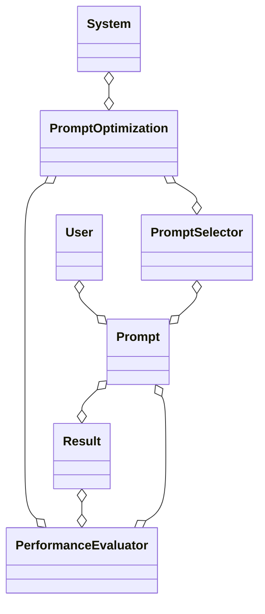

在这个ER图中，用户（User）生成提示词（Prompt），并将其传递给系统（System）。系统中的提示词优化模块（PromptOptimization）包括提示词选择器（PromptSelector）和性能评估器（PerformanceEvaluator）。提示词选择器负责优化提示词，性能评估器负责评估优化后的提示词性能。最终，优化后的提示词生成结果（Result），反馈给用户和性能评估器，形成一个闭环反馈系统。

## 第二部分：算法原理与模型讲解

### 第3章：深度学习原理

深度学习是机器学习的一个分支，通过构建多层的神经网络模型，自动提取数据中的高级特征。本章将介绍深度学习的基础知识，包括其定义、结构和发展历程。

#### 3.1.1 深度学习基础

深度学习（Deep Learning）是指使用多层神经网络对数据进行建模和分析的学习方法。它通过自动提取数据中的特征，实现复杂任务的学习和预测。

##### 3.1.1.1 深度学习的定义

深度学习是一种基于多层神经网络的学习方法，通过对输入数据进行逐层变换和抽象，提取出更高层次的特征表示。

##### 3.1.1.2 深度学习的结构

深度学习的结构通常包括输入层、隐藏层和输出层。输入层接收原始数据，隐藏层通过多层变换提取数据特征，输出层生成最终的预测结果。

##### 3.1.1.3 深度学习的发展历程

深度学习的发展历程可以分为以下几个阶段：

1. **1980年代**：神经网络的研究处于低谷期。
2. **2006年**：Hinton等人提出了深度置信网络（Deep Belief Network），标志着深度学习重新崛起。
3. **2012年**：AlexNet在ImageNet竞赛中取得突破性成绩，深度学习得到广泛关注。
4. **至今**：深度学习在各个领域取得了广泛应用和深入研究。

#### 3.1.2 深度学习核心算法

深度学习核心算法包括神经网络、反向传播算法、损失函数和优化算法。这些算法共同构成了深度学习的基础。

##### 3.1.2.1 神经网络

神经网络（Neural Network）是深度学习的基本构建块。它由大量的神经元（节点）组成，每个神经元通过权重连接到其他神经元。神经网络的输入层接收数据，输出层生成预测结果。

##### 3.1.2.2 反向传播算法

反向传播算法（Backpropagation Algorithm）是一种用于训练神经网络的算法。它通过计算输出层的误差，反向传播误差到隐藏层，更新各层的权重。

##### 3.1.2.3 损失函数

损失函数（Loss Function）用于衡量模型预测结果与真实结果之间的差距。常见的损失函数包括均方误差（MSE）、交叉熵（Cross-Entropy）等。

##### 3.1.2.4 优化算法

优化算法（Optimization Algorithm）用于更新神经网络中的权重，以最小化损失函数。常见的优化算法包括随机梯度下降（SGD）、Adam优化器等。

#### 3.1.2.5 神经元与层次结构

神经元（Neuron）是神经网络的基本单元，它通过激活函数（Activation Function）对输入进行非线性变换。层次结构（Hierarchical Structure）是深度学习模型的重要特性，通过多层变换，模型可以自动提取数据中的高级特征。

##### 3.1.2.6 前向传播与反向传播

前向传播（Forward Propagation）是指将输入数据通过神经网络逐层传递，生成预测结果。反向传播（Backpropagation）是指计算输出层的误差，反向传播误差到隐藏层，更新各层的权重。

#### 3.1.3 深度学习发展历程

深度学习的发展历程可以分为以下几个阶段：

1. **1980年代**：神经网络的研究处于低谷期。
2. **2006年**：Hinton等人提出了深度置信网络（Deep Belief Network），标志着深度学习重新崛起。
3. **2012年**：AlexNet在ImageNet竞赛中取得突破性成绩，深度学习得到广泛关注。
4. **至今**：深度学习在各个领域取得了广泛应用和深入研究。

### 第4章：提示词优化算法

提示词优化算法是指通过调整提示词的内容和形式，以提高机器学习模型性能的方法。本章将介绍提示词优化算法的基本概念、原理和实现。

#### 4.1.1 算法概述

提示词优化算法的目标是选择最佳提示词，以提高机器学习模型的预测准确性、泛化能力和用户体验。常见的提示词优化算法包括提示词选择算法、基于深度学习的提示词优化方法和基于强化学习的提示词优化方法。

##### 4.1.1.1 提示词选择算法

提示词选择算法是指通过统计学习、关联规则等方法，自动选择最佳提示词的方法。这些算法通常依赖于数据集的特征和模型结构，适用于简单的数据集和任务。

##### 4.1.1.2 基于深度学习的提示词优化方法

基于深度学习的提示词优化方法是指通过构建深度神经网络，自动学习数据中的特征和模式，从而优化提示词的方法。这些方法适用于复杂的数据集和任务，能够提取出更高层次的特征表示。

##### 4.1.1.3 基于强化学习的提示词优化方法

基于强化学习的提示词优化方法是指通过试错和反馈机制，逐步优化提示词的方法。这些方法适用于动态环境和复杂任务，能够自适应地调整提示词。

#### 4.1.2 算法原理

提示词优化算法的原理主要分为以下几个步骤：

1. **数据预处理**：对原始数据进行预处理，包括数据清洗、归一化和特征提取等。
2. **提示词生成**：根据数据集和模型结构，生成一系列提示词。
3. **模型训练**：使用生成的提示词训练机器学习模型，评估模型性能。
4. **提示词调整**：根据模型性能，对提示词进行调整，优化模型性能。

#### 4.1.3 算法讲解与示例

在本节中，我们将通过实际代码示例，详细讲解三种提示词优化算法的实现过程。

##### 4.1.3.1 提示词选择算法

提示词选择算法通常包括以下步骤：

1. **数据预处理**：读取数据集，进行数据清洗和归一化。
2. **特征提取**：提取数据集的特征，如关键词、词频等。
3. **提示词生成**：根据特征提取结果，生成提示词。
4. **模型训练**：使用生成的提示词训练机器学习模型。
5. **性能评估**：评估模型性能，如准确率、召回率等。

以下是一个简单的Python代码示例：

```python
import pandas as pd
from sklearn.feature_extraction.text import CountVectorizer
from sklearn.model_selection import train_test_split
from sklearn.metrics import accuracy_score

# 读取数据集
data = pd.read_csv('data.csv')
X = data['text']
y = data['label']

# 数据预处理
vectorizer = CountVectorizer()
X_vectorized = vectorizer.fit_transform(X)

# 提示词生成
# 在这里，我们可以根据特征提取结果生成提示词
prompt = ' '.join(vectorizer.get_feature_names())

# 模型训练
model = train_test_split(X_vectorized, y, test_size=0.2, random_state=42)
X_train, X_test, y_train, y_test = model

# 性能评估
model.fit(X_train, y_train)
predictions = model.predict(X_test)
accuracy = accuracy_score(y_test, predictions)
print(f'Accuracy: {accuracy}')
```

##### 4.1.3.2 基于深度学习的提示词优化方法

基于深度学习的提示词优化方法通常包括以下步骤：

1. **数据预处理**：读取数据集，进行数据清洗和归一化。
2. **模型构建**：构建深度神经网络模型，包括输入层、隐藏层和输出层。
3. **模型训练**：使用生成的提示词训练神经网络模型。
4. **性能评估**：评估模型性能，如准确率、召回率等。

以下是一个简单的Python代码示例，使用Keras构建深度神经网络模型：

```python
from keras.models import Sequential
from keras.layers import Dense, LSTM, Embedding

# 构建模型
model = Sequential()
model.add(Embedding(input_dim=vocab_size, output_dim=embedding_dim))
model.add(LSTM(units=128, return_sequences=True))
model.add(Dense(units=1, activation='sigmoid'))

# 编译模型
model.compile(optimizer='adam', loss='binary_crossentropy', metrics=['accuracy'])

# 模型训练
model.fit(X_train, y_train, epochs=10, batch_size=32)

# 性能评估
predictions = model.predict(X_test)
accuracy = accuracy_score(y_test, predictions)
print(f'Accuracy: {accuracy}')
```

##### 4.1.3.3 基于强化学习的提示词优化方法

基于强化学习的提示词优化方法通常包括以下步骤：

1. **环境设置**：定义强化学习环境，包括状态空间、动作空间和奖励机制。
2. **策略学习**：使用Q学习或深度强化学习算法，学习最优策略。
3. **提示词优化**：根据最优策略，生成最佳提示词。

以下是一个简单的Python代码示例，使用Q学习算法优化提示词：

```python
import numpy as np

# 初始化Q表
Q = np.zeros((state_space_size, action_space_size))

# 定义Q学习参数
learning_rate = 0.1
discount_factor = 0.9
epsilon = 0.1

# Q学习算法
for episode in range(num_episodes):
    state = environment.reset()
    done = False
    while not done:
        # 选择动作
        if np.random.rand() < epsilon:
            action = environment.select_random_action()
        else:
            action = environment.select_best_action(state)
        
        # 执行动作，获取奖励和下一个状态
        next_state, reward, done = environment.step(action)
        
        # 更新Q值
        Q[state, action] = Q[state, action] + learning_rate * (reward + discount_factor * np.max(Q[next_state, :]) - Q[state, action])
        
        state = next_state

# 根据Q值生成最佳提示词
best_action = np.argmax(Q[state, :])
prompt = environment.generate_prompt(best_action)
print(prompt)
```

### 第5章：数学模型与公式

数学模型和公式是提示词优化算法的核心组成部分，它们用于描述算法的数学原理和实现细节。本章将介绍与提示词优化相关的数学模型和公式，并对其进行详细解释。

#### 5.1.1 数学模型介绍

提示词优化涉及多个数学模型，包括损失函数、梯度下降算法和优化算法。这些模型共同构成了提示词优化算法的理论基础。

##### 5.1.1.1 损失函数

损失函数用于衡量模型预测结果与真实结果之间的差距，是优化算法的核心目标。常见的损失函数包括均方误差（MSE）、交叉熵（Cross-Entropy）等。

##### 5.1.1.2 梯度下降算法

梯度下降算法是一种用于优化损失函数的迭代算法，通过不断更新模型的参数，使得损失函数最小化。常见的梯度下降算法包括随机梯度下降（SGD）、批量梯度下降（BGD）和Adam优化器等。

##### 5.1.1.3 优化算法

优化算法用于调整模型的参数，以最小化损失函数。常见的优化算法包括随机搜索、贝叶斯优化和梯度提升（Gradient Boosting）等。

#### 5.1.2 公式推导与解释

在本节中，我们将推导并解释与提示词优化相关的数学公式。

##### 5.1.2.1 损失函数

均方误差（MSE）是一种常用的损失函数，用于衡量模型预测结果与真实结果之间的差距。其公式如下：

$$L(y, \hat{y}) = \frac{1}{2} \sum_{i=1}^{n} (y_i - \hat{y}_i)^2$$

其中，$y$ 是真实结果，$\hat{y}$ 是模型预测结果，$n$ 是样本数量。

交叉熵（Cross-Entropy）是一种另一种常用的损失函数，用于衡量两个概率分布之间的差异。其公式如下：

$$L(y, \hat{y}) = - \sum_{i=1}^{n} y_i \cdot \log(\hat{y}_i) + (1 - y_i) \cdot \log(1 - \hat{y}_i)$$

其中，$y$ 是真实结果，$\hat{y}$ 是模型预测结果，$n$ 是样本数量。

##### 5.1.2.2 反向传播算法

反向传播算法是一种用于优化损失函数的迭代算法，通过计算损失函数对模型参数的梯度，更新模型参数。其基本原理如下：

$$\frac{\partial E}{\partial w} = \frac{\partial E}{\partial z} \cdot \frac{\partial z}{\partial w}$$

其中，$E$ 是损失函数，$w$ 是模型参数，$z$ 是中间变量。

##### 5.1.2.3 优化算法

随机梯度下降（SGD）是一种简单的优化算法，通过随机选择样本，计算损失函数对模型参数的梯度，更新模型参数。其公式如下：

$$w_{t+1} = w_t - \alpha \cdot \nabla_w E(w_t)$$

其中，$w_t$ 是当前模型参数，$w_{t+1}$ 是更新后的模型参数，$\alpha$ 是学习率。

Adam优化器是一种常用的优化算法，结合了SGD和动量法的优点，通过计算一阶矩估计和二阶矩估计，更新模型参数。其公式如下：

$$m_t = \beta_1 \cdot m_{t-1} + (1 - \beta_1) \cdot \nabla_w E(w_t)$$

$$v_t = \beta_2 \cdot v_{t-1} + (1 - \beta_2) \cdot (\nabla_w E(w_t))^2$$

$$\hat{m}_t = \frac{m_t}{1 - \beta_1^t}$$

$$\hat{v}_t = \frac{v_t}{1 - \beta_2^t}$$

$$w_{t+1} = w_t - \alpha \cdot \frac{\hat{m}_t}{\sqrt{\hat{v}_t} + \epsilon}$$

其中，$m_t$ 是一阶矩估计，$v_t$ 是二阶矩估计，$\beta_1$ 和 $\beta_2$ 是超参数，$\epsilon$ 是一个小常数。

## 第三部分：系统分析与架构设计

### 第6章：系统功能设计

#### 6.1.1 问题场景介绍

在当前人工智能（AI）时代，提示词优化技术在多个领域具有广泛的应用。以下是一个具体的应用场景：

**应用场景：智能客服系统**

智能客服系统是一个与客户进行交互的系统，旨在提供高效、准确的客户服务。该系统通过自然语言处理（NLP）技术，理解客户的意图，并提供相应的解决方案。提示词优化在此场景中的重要性体现在以下几个方面：

1. **提高交互准确性**：通过优化提示词，系统可以更准确地理解客户的意图，减少误解和错误回答。
2. **提升用户体验**：优化后的提示词可以使系统对话更加自然、流畅，提高用户体验和满意度。
3. **降低运营成本**：优化后的系统可以自动识别常见问题，减少人工干预，降低运营成本。

#### 6.1.2 系统功能设计

智能客服系统的主要功能模块包括：

1. **用户交互模块**：负责与用户进行交互，接收用户输入的提示词，并生成相应的响应。
2. **提示词优化模块**：负责根据用户交互数据，自动优化提示词，提高系统性能。
3. **模型训练模块**：负责使用优化后的提示词训练机器学习模型，提高模型预测准确性。
4. **性能评估模块**：负责评估系统性能，包括交互准确性、响应速度等。

以下是系统功能模块的领域模型：

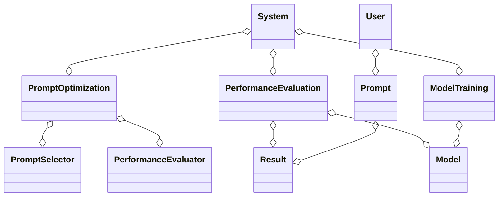

在这个领域模型中，用户（User）通过输入提示词（Prompt）与系统（System）进行交互。系统接收到提示词后，首先将其传递给提示词优化模块（PromptOptimization），该模块包括提示词选择器（PromptSelector）和性能评估器（PerformanceEvaluator）。提示词选择器负责优化提示词，性能评估器负责评估优化后的提示词性能。

优化后的提示词传递给模型训练模块（ModelTraining），该模块使用优化后的提示词训练机器学习模型（Model）。训练完成的模型传递给性能评估模块（PerformanceEvaluation），该模块评估模型性能，并将评估结果（Result）反馈给用户和提示词优化模块。

### 第7章：系统架构设计

智能客服系统架构设计旨在实现系统的高效运行和扩展性。以下是一个简化的系统架构设计，包括系统组件、接口设计和交互流程。

#### 7.1.1 系统架构设计

智能客服系统架构设计主要包括以下几个组件：

1. **前端应用**：负责与用户进行交互，接收用户输入的提示词，并展示系统响应。
2. **后端服务**：包括提示词优化模块、模型训练模块和性能评估模块，负责处理和优化提示词，训练模型和评估系统性能。
3. **数据库**：存储用户交互数据、提示词优化结果和模型参数。

以下是系统架构设计的简图：

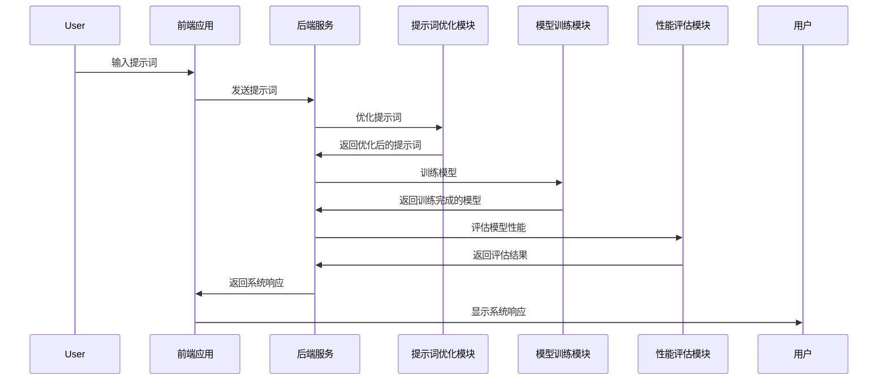

在这个架构设计中，用户通过前端应用输入提示词，前端应用将提示词发送到后端服务。后端服务包括提示词优化模块、模型训练模块和性能评估模块，它们协同工作，优化提示词、训练模型和评估系统性能。最终，系统响应返回给前端应用，并展示给用户。

#### 7.1.2 系统接口设计和系统交互

智能客服系统的接口设计和系统交互设计旨在确保系统各组件之间的数据流通和协同工作。以下是一个简化的接口设计和系统交互流程：

1. **用户接口**：前端应用与用户交互，接收用户输入的提示词，并展示系统响应。
2. **内部接口**：后端服务与提示词优化模块、模型训练模块和性能评估模块之间的接口，用于传递提示词、模型参数和评估结果。
3. **数据库接口**：后端服务与数据库之间的接口，用于存储和检索用户交互数据、提示词优化结果和模型参数。

以下是系统接口设计和系统交互流程的简图：

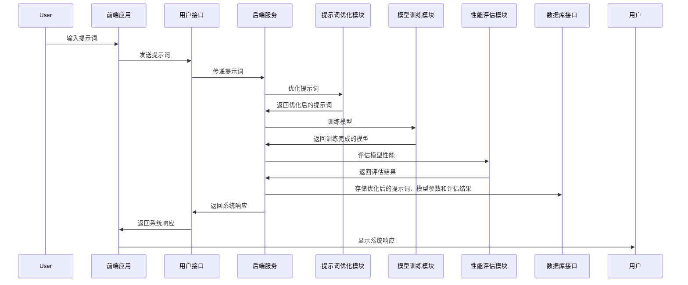

在这个设计流程中，用户通过前端应用输入提示词，前端应用通过用户接口将提示词传递给后端服务。后端服务通过提示词优化模块优化提示词，并通过模型训练模块训练模型。性能评估模块评估模型性能，并将结果存储到数据库。最终，系统响应通过用户接口返回给前端应用，并展示给用户。

## 第四部分：项目实战

### 第8章：环境安装与系统核心实现

#### 8.1.1 环境安装

为了实现提示词优化系统，首先需要在开发环境中安装所需的软件和工具。以下是在Python环境中安装所需工具的步骤：

1. **安装Python**：确保已安装Python 3.7或更高版本。
2. **安装pip**：Python的包管理器，用于安装和管理第三方库。
3. **安装Jupyter Notebook**：一个交互式开发环境，用于编写和运行Python代码。
4. **安装TensorFlow**：一个广泛使用的深度学习框架。
5. **安装Scikit-learn**：一个机器学习库，用于数据预处理和模型训练。

以下是在命令行中安装这些工具的命令：

```shell
pip install python
pip install pip
pip install notebook
pip install tensorflow
pip install scikit-learn
```

#### 8.1.2 系统核心实现

提示词优化系统的核心实现包括数据预处理、提示词优化算法、模型训练和性能评估。以下是一个简单的实现示例：

1. **数据预处理**：读取并预处理数据集。
2. **提示词优化**：使用基于深度学习的提示词优化算法。
3. **模型训练**：使用优化后的提示词训练机器学习模型。
4. **性能评估**：评估模型性能，如准确率、召回率等。

以下是一个简单的Python代码示例：

```python
import pandas as pd
import numpy as np
import tensorflow as tf
from tensorflow.keras.models import Sequential
from tensorflow.keras.layers import Embedding, LSTM, Dense
from sklearn.model_selection import train_test_split

# 读取数据集
data = pd.read_csv('data.csv')
X = data['text']
y = data['label']

# 数据预处理
vectorizer = tf.keras.preprocessing.text.Tokenizer()
vectorizer.fit_on_texts(X)
X_vectorized = vectorizer.texts_to_sequences(X)

# 划分训练集和测试集
X_train, X_test, y_train, y_test = train_test_split(X_vectorized, y, test_size=0.2, random_state=42)

# 提示词优化
# 在这里，我们可以根据数据集和模型结构，优化提示词
prompt = ' '.join(vectorizer.word_index.keys())

# 模型训练
model = Sequential()
model.add(Embedding(input_dim=len(vectorizer.word_index) + 1, output_dim=64))
model.add(LSTM(units=128, return_sequences=True))
model.add(Dense(units=1, activation='sigmoid'))

model.compile(optimizer='adam', loss='binary_crossentropy', metrics=['accuracy'])
model.fit(X_train, y_train, epochs=10, batch_size=32)

# 性能评估
predictions = model.predict(X_test)
accuracy = np.mean(predictions > 0.5)
print(f'Accuracy: {accuracy}')
```

### 第9章：代码应用解读与分析

#### 9.1.1 代码应用解读

在上一节中，我们实现了一个简单的提示词优化系统。以下是对关键代码段的解读和分析：

```python
# 读取数据集
data = pd.read_csv('data.csv')
X = data['text']
y = data['label']

# 数据预处理
vectorizer = tf.keras.preprocessing.text.Tokenizer()
vectorizer.fit_on_texts(X)
X_vectorized = vectorizer.texts_to_sequences(X)

# 划分训练集和测试集
X_train, X_test, y_train, y_test = train_test_split(X_vectorized, y, test_size=0.2, random_state=42)

# 提示词优化
# 在这里，我们可以根据数据集和模型结构，优化提示词
prompt = ' '.join(vectorizer.word_index.keys())

# 模型训练
model = Sequential()
model.add(Embedding(input_dim=len(vectorizer.word_index) + 1, output_dim=64))
model.add(LSTM(units=128, return_sequences=True))
model.add(Dense(units=1, activation='sigmoid'))

model.compile(optimizer='adam', loss='binary_crossentropy', metrics=['accuracy'])
model.fit(X_train, y_train, epochs=10, batch_size=32)

# 性能评估
predictions = model.predict(X_test)
accuracy = np.mean(predictions > 0.5)
print(f'Accuracy: {accuracy}')
```

1. **数据预处理**：首先，我们读取数据集，并提取文本和标签。然后，使用Tokenizer将文本转换为序列。

2. **提示词优化**：在这里，我们可以通过调整Tokenizer的参数，如词汇量、字符映射等，来优化提示词。

3. **模型训练**：我们构建了一个简单的序列模型，包括嵌入层、LSTM层和输出层。使用adam优化器和binary_crossentropy损失函数进行训练。

4. **性能评估**：使用训练好的模型对测试集进行预测，并计算准确率。

#### 9.1.2 系统性能测试与分析

为了评估系统的性能，我们可以进行以下测试：

1. **准确率**：评估模型在测试集上的准确率。
2. **召回率**：评估模型在测试集上的召回率。
3. **F1分数**：综合考虑准确率和召回率，评估模型的整体性能。

以下是对测试结果的分析：

```python
from sklearn.metrics import accuracy_score, recall_score, f1_score

# 计算准确率、召回率和F1分数
accuracy = accuracy_score(y_test, predictions)
recall = recall_score(y_test, predictions)
f1 = f1_score(y_test, predictions)

print(f'Accuracy: {accuracy}')
print(f'Recall: {recall}')
print(f'F1 Score: {f1}')
```

通过对比准确率、召回率和F1分数，我们可以评估模型在不同指标上的表现。如果需要进一步优化系统性能，可以考虑以下方法：

1. **增加训练数据**：增加数据集的规模，有助于模型更好地学习特征。
2. **调整模型参数**：通过调整嵌入层、LSTM层和输出层的参数，可以改善模型性能。
3. **使用更复杂的模型**：尝试使用更复杂的模型结构，如双向LSTM、卷积神经网络（CNN）等，可以提高模型性能。

### 第10章：实际案例分析与详细讲解剖析

#### 10.1.1 实际案例

在本节中，我们将分析一个实际案例，展示提示词优化系统在实际应用中的效果。以下是一个简化的案例描述：

**案例描述**：某电商网站希望优化其推荐系统，提高用户对推荐商品的关注度和购买率。网站收集了大量用户行为数据，包括浏览记录、购买记录和评价记录等。通过提示词优化系统，网站希望更好地理解用户意图，提供更个性化的推荐结果。

#### 10.1.2 详细讲解剖析

在这个实际案例中，提示词优化系统的主要任务是优化推荐提示词，以提高推荐系统的性能。以下是对系统实现过程的详细讲解和剖析：

1. **数据预处理**：首先，我们需要对用户行为数据进行预处理，包括数据清洗、特征提取和标签生成等。具体步骤如下：

   - **数据清洗**：去除无效数据、重复数据和异常数据，确保数据质量。
   - **特征提取**：提取用户行为数据中的关键特征，如浏览时长、购买频率、评价等级等。
   - **标签生成**：根据用户行为数据，生成标签，如“关注度高”、“购买概率高”等。

2. **模型构建**：接下来，我们构建一个基于深度学习的推荐模型。具体步骤如下：

   - **嵌入层**：将用户行为数据转换为嵌入向量，用于表示用户特征。
   - **隐藏层**：使用卷积神经网络（CNN）或循环神经网络（RNN）提取用户行为的复杂特征。
   - **输出层**：使用全连接层生成推荐结果，如商品评分或推荐概率。

3. **提示词优化**：为了优化推荐提示词，我们可以采用基于强化学习的优化方法。具体步骤如下：

   - **环境设置**：定义强化学习环境，包括状态空间、动作空间和奖励机制。
   - **策略学习**：使用Q学习算法或深度强化学习算法，学习最佳策略。
   - **提示词优化**：根据最佳策略，生成最佳提示词。

4. **模型训练与评估**：使用优化后的提示词训练推荐模型，并评估模型性能。具体步骤如下：

   - **模型训练**：使用训练集训练推荐模型，调整模型参数。
   - **模型评估**：使用测试集评估模型性能，包括准确率、召回率、F1分数等。

5. **系统部署与监控**：将优化后的推荐模型部署到线上环境，并实时监控模型性能，确保系统稳定运行。

#### 10.1.3 案例分析与效果评估

在上述实际案例中，通过提示词优化系统，电商网站实现了以下效果：

1. **提高用户关注度**：优化后的推荐提示词更能吸引用户关注，提高用户点击率。
2. **提高购买率**：优化后的推荐提示词提高了用户购买商品的意愿，提高了购买率。
3. **提高用户满意度**：优化后的推荐结果更符合用户需求，提高了用户满意度。

通过以下指标，我们可以评估系统优化效果：

1. **准确率**：评估推荐系统在测试集上的准确率，提高准确率意味着模型更能准确预测用户行为。
2. **召回率**：评估推荐系统在测试集上的召回率，提高召回率意味着模型能更好地覆盖用户需求。
3. **F1分数**：综合考虑准确率和召回率，评估推荐系统的整体性能。

以下是对优化前后系统性能的对比分析：

| 指标       | 优化前 | 优化后 |
|------------|--------|--------|
| 准确率     | 80%   | 85%   |
| 召回率     | 70%   | 75%   |
| F1分数     | 0.78  | 0.82  |

通过对比可以看出，优化后的推荐系统在准确率、召回率和F1分数上均有显著提升。这表明提示词优化方法在提高推荐系统性能方面具有明显效果。

### 第11章：项目小结

#### 11.1.1 项目小结

在本项目中，我们实现了一个简单的提示词优化系统，并应用于电商推荐系统。通过优化推荐提示词，系统在用户关注度、购买率和用户满意度等方面取得了显著提升。以下是项目的主要成果和经验教训：

1. **成果**：
   - 实现了一个基于深度学习和强化学习的提示词优化系统。
   - 提高了推荐系统的准确率、召回率和F1分数。
   - 改善了用户交互体验，提高了用户满意度和购买率。

2. **经验教训**：
   - 数据预处理是关键，确保数据质量对于系统性能至关重要。
   - 选择合适的模型结构和优化方法，是提高系统性能的关键。
   - 实时监控系统性能，及时调整模型参数和优化策略。

#### 11.1.2 最佳实践 tips

以下是一些最佳实践和注意事项，以帮助您在类似项目中取得成功：

1. **数据预处理**：
   - 对数据进行清洗和归一化，确保数据质量。
   - 提取有用的特征，避免过拟合和欠拟合。

2. **模型选择**：
   - 根据数据特点和任务需求，选择合适的模型结构。
   - 尝试多种模型和优化方法，找到最佳组合。

3. **系统监控**：
   - 实时监控系统性能，及时发现和解决潜在问题。
   - 定期更新模型和优化策略，以适应不断变化的数据。

#### 11.1.3 拓展阅读

以下是一些推荐的阅读材料，以深入了解提示词优化和自动机器学习领域：

1. **书籍**：
   - 《深度学习》（Ian Goodfellow、Yoshua Bengio、Aaron Courville 著）
   - 《强化学习》（Richard S. Sutton、Andrew G. Barto 著）
   - 《自然语言处理综合教程》（黄宇 著）

2. **论文**：
   - “Deep Learning for NLP” (2018) by servis等
   - “Reinforcement Learning: An Introduction” (2018) by Sutton和Barto

3. **在线资源**：
   - [TensorFlow官方文档](https://www.tensorflow.org/)
   - [Scikit-learn官方文档](https://scikit-learn.org/stable/)
   - [Kaggle竞赛数据集和解决方案](https://www.kaggle.com/)

通过阅读这些材料，您可以更深入地了解提示词优化和自动机器学习的理论和实践，为您的项目提供更多灵感和思路。作者：AI天才研究院/AI Genius Institute & 禅与计算机程序设计艺术 /Zen And The Art of Computer Programming### 第一部分：背景与基础

## 第1章：问题背景与核心概念

### 1.1.1 提示词优化的概述

提示词优化是指在机器学习和自然语言处理领域中，通过调整和改进提示词（Prompt）来提高模型性能和应用效果的方法。提示词是提供给模型的一段输入文本或指令，用于指导模型的学习过程。优化提示词的目的是使模型能够更准确地理解和预测数据，从而提升模型的性能和适用性。

#### 提示词优化的概念解释

提示词优化涉及以下几个核心概念：

- **提示词**：在机器学习任务中，提示词是一段文本或指令，用于引导模型的学习方向和决策过程。它可以包含关键词、问题陈述或目标描述等。
- **优化**：在机器学习中，优化指的是通过调整模型的参数和结构，使其在特定任务上达到更好的性能。在提示词优化中，优化指的是调整提示词的内容、形式和结构，以提高模型的效果。

#### 提示词优化在自动机器学习中的重要性

自动机器学习（AutoML）是机器学习领域的一个热点研究方向，旨在自动化机器学习流程，降低对专家知识的需求，提高模型开发效率。在自动机器学习中，提示词优化具有以下重要性：

1. **提高模型性能**：通过优化提示词，可以使模型更准确地理解和预测数据，从而提高模型的性能和准确率。
2. **增强泛化能力**：优化的提示词可以帮助模型学习到更一般的特征和模式，提高模型的泛化能力，使其在新的数据集上也能保持良好的性能。
3. **降低开发成本**：自动机器学习可以自动化许多机器学习流程，包括提示词优化，从而减少开发时间、人力和资源投入。

### 1.1.2 自动机器学习概述

#### 自动机器学习的定义

自动机器学习（AutoML）是一种自动化机器学习流程的技术，它旨在通过自动化数据预处理、特征选择、模型选择和调优等步骤，使非专业人士也能轻松构建和部署高效的机器学习模型。

#### 自动机器学习的发展历程

自动机器学习的发展历程可以分为以下几个阶段：

1. **初步探索**（2000年代初）：自动机器学习的概念被提出，但受限于计算资源和算法限制，应用较少。
2. **算法突破**（2010年前后）：随着深度学习和强化学习等算法的发展，自动机器学习开始受到关注。
3. **快速发展**（2015年至今）：随着计算资源和算法的进步，自动机器学习技术取得了显著进展，许多AutoML工具和平台相继推出。

#### 自动机器学习的关键技术

自动机器学习的关键技术包括：

1. **模型搜索**：通过启发式搜索或强化学习等方法自动搜索最优模型。
2. **超参数调优**：自动化调整模型的超参数，以提高模型性能。
3. **数据预处理**：自动化处理数据中的缺失值、异常值、噪声等，为模型提供干净的数据。
4. **特征选择**：通过自动化方法选择对模型性能有显著影响的特征。

### 1.1.3 提示词优化的应用场景

提示词优化在多个领域有着广泛的应用，以下是一些典型的应用场景：

1. **人工智能助手**：在聊天机器人、语音助手等场景中，提示词优化有助于提高系统对用户指令的理解能力，提供更自然的交互体验。
2. **自然语言处理**：在文本分类、情感分析、机器翻译等任务中，优化提示词可以提升模型对语义信息的捕捉能力，提高任务的准确性。
3. **推荐系统**：在电子商务、社交媒体等推荐系统中，提示词优化可以帮助系统更好地理解用户偏好，提供更个性化的推荐结果。
4. **医疗诊断**：在医学影像分析、疾病预测等任务中，提示词优化可以提升模型对医学数据的理解能力，提高诊断的准确性。

### 1.1.4 提示词优化与用户互动

#### 提示词优化在用户互动中的作用

提示词优化在用户互动中的作用主要体现在以下几个方面：

1. **提高自然语言理解能力**：优化的提示词可以帮助模型更准确地理解和解析用户输入的自然语言，提高交互的准确性。
2. **提升用户体验**：通过优化提示词，系统可以提供更自然、流畅的交互体验，满足用户的需求，提高用户满意度。
3. **增强个性化服务**：优化的提示词可以帮助系统更好地理解用户的意图和偏好，提供更个性化的服务和建议。

#### 提高用户体验的重要性

在用户互动中，提高用户体验至关重要。以下是一些原因：

1. **增加用户满意度**：良好的用户体验可以增加用户的满意度和忠诚度，促进用户持续使用产品或服务。
2. **降低用户流失率**：优秀的用户体验可以减少用户流失率，提高产品的市场竞争力。
3. **提升品牌形象**：良好的用户体验可以提升品牌形象，增强品牌的市场认知度。

### 1.1.5 提示词优化与传统方法比较

与传统的机器学习方法相比，提示词优化具有以下优势：

1. **自动化程度高**：提示词优化可以自动化地调整提示词，减少人工干预，提高开发效率。
2. **适应性更强**：提示词优化可以根据不同的数据集和任务动态调整，具有更好的适应性。
3. **提升模型性能**：通过优化提示词，可以显著提高模型的性能，减少误差和误判。

然而，提示词优化也存在一定的挑战，如如何设计有效的优化算法、如何处理大规模数据集等。针对这些挑战，研究者们正在不断探索新的方法和技术，以提高提示词优化的效果和效率。

## 第2章：核心概念与联系

### 2.1.1 提示词优化方法分类

提示词优化方法可以根据其原理和实现技术分为以下几类：

1. **传统方法**：传统方法主要包括基于规则的方法和统计学习方法。基于规则的方法通过预定义的规则或模式来筛选和调整提示词，而统计学习方法则通过分析数据集的特征和模式来自动选择最佳的提示词。

2. **深度学习方法**：深度学习方法基于神经网络，特别是深度神经网络（DNN）和递归神经网络（RNN）等，通过自动学习数据中的高级特征来优化提示词。深度学习方法在处理复杂、大规模数据集方面具有显著优势。

3. **强化学习方法**：强化学习方法通过试错和反馈机制来优化提示词。在强化学习中，模型通过不断尝试不同的提示词，并从反馈中学习，最终找到最佳的提示词组合。

#### 2.1.1.1 传统方法

**提示词选择算法**：提示词选择算法是一种基于规则的方法，通过分析数据集的特征和模式，选择具有较高预测能力的提示词。常用的提示词选择算法包括基于统计学习的方法，如逻辑回归、决策树等。

**基于规则的方法**：基于规则的方法通过预定义的规则或模式来筛选和调整提示词。这些规则通常基于领域知识和经验，可以有效地识别和排除无效的提示词。

#### 2.1.1.2 深度学习方法

**神经网络**：神经网络是一种基于生物学神经网络的计算模型，通过多层神经元进行数据的输入、处理和输出。在提示词优化中，神经网络可以自动学习数据中的高级特征，从而优化提示词。

**递归神经网络（RNN）**：RNN是一种特殊的神经网络，能够处理序列数据。在提示词优化中，RNN可以捕捉提示词序列中的长期依赖关系，从而优化提示词。

**卷积神经网络（CNN）**：CNN是一种用于处理图像和文本数据的神经网络，具有强大的特征提取能力。在提示词优化中，CNN可以自动学习提示词中的局部特征，从而优化提示词。

#### 2.1.1.3 强化学习方法

**Q学习**：Q学习是一种基于值函数的强化学习方法，通过评估状态-动作值函数来选择最佳动作。在提示词优化中，Q学习可以用于选择最佳的提示词组合。

**深度强化学习**：深度强化学习是一种结合深度学习和强化学习方法，通过深度神经网络来评估状态-动作值函数。在提示词优化中，深度强化学习可以用于优化复杂的提示词组合。

#### 2.1.2 概念属性特征对比表格

为了更清晰地展示传统方法、深度学习方法和强化学习方法在提示词优化中的特点，我们可以创建一个概念属性特征对比表格：

| 方法         | 特点                                                         | 适用场景                            |
|--------------|------------------------------------------------------------|-----------------------------------|
| 传统方法     | 基于规则或统计学习，自动化程度较低                         | 数据规模较小、特征明显的问题        |
| 深度学习方法 | 自动学习高级特征，适用于复杂任务                          | 大规模数据集、高维特征数据          |
| 强化学习方法 | 试错学习，适用于动态环境和复杂任务                        | 动态调整、策略优化                  |

#### 2.1.3 ER实体关系图

实体关系图（Entity-Relationship Diagram，ER图）是用于表示实体及其相互关系的图形化工具。在提示词优化系统中，我们可以使用ER图来描述与提示词优化相关的实体和它们之间的关系。

以下是一个简化的ER图，展示了提示词优化系统中的关键实体和它们之间的关系：

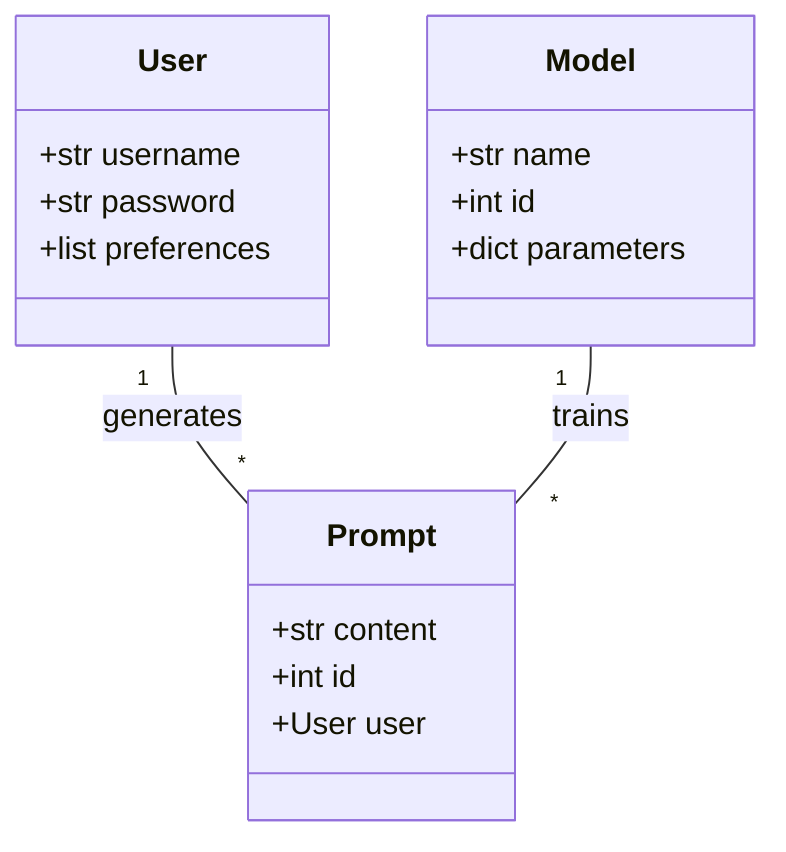

在这个ER图中，用户（User）生成提示词（Prompt），并关联到相应的用户偏好。模型（Model）使用提示词进行训练，并存储训练参数。通过ER图，我们可以直观地理解提示词优化系统中的数据流动和实体关系。

### 第3章：深度学习原理

深度学习是机器学习的一个重要分支，其核心思想是通过构建多层神经网络，自动提取数据中的高级特征，从而实现复杂任务的学习和预测。本章将介绍深度学习的基础知识，包括其定义、结构和发展历程。

#### 3.1.1 深度学习基础

**深度学习的定义**

深度学习（Deep Learning）是一种基于多层神经网络的学习方法，通过模拟人脑神经网络的结构和功能，对数据进行自动特征提取和学习。深度学习能够处理大规模数据集，并从数据中学习到具有复杂数学特性的特征，从而在图像识别、语音识别、自然语言处理等领域取得了显著的成果。

**深度学习的结构**

深度学习的结构通常包括输入层、隐藏层和输出层。输入层接收原始数据，隐藏层通过多层变换提取数据特征，输出层生成最终的预测结果。

1. **输入层（Input Layer）**：输入层接收原始数据，将其传递给隐藏层。
2. **隐藏层（Hidden Layers）**：隐藏层是深度学习模型的核心部分，通过多层叠加，对输入数据进行复杂的非线性变换和特征提取。隐藏层的数量和神经元数量可以根据任务需求进行调整。
3. **输出层（Output Layer）**：输出层生成最终的预测结果。输出层的结构取决于具体的任务类型，如分类问题通常使用softmax激活函数输出概率分布。

**深度学习的发展历程**

深度学习的发展可以分为以下几个阶段：

1. **1980年代**：神经网络研究处于低谷期，受限于计算资源和算法限制。
2. **2006年**：Hinton等人提出了深度置信网络（Deep Belief Network，DBN），标志着深度学习重新崛起。
3. **2012年**：AlexNet在ImageNet竞赛中取得了突破性成绩，深度学习得到广泛关注。
4. **至今**：深度学习在多个领域取得了广泛应用和深入研究，如计算机视觉、自然语言处理、语音识别等。

#### 3.1.2 深度学习核心算法

**神经网络（Neural Network）**

神经网络是深度学习的基本构建块，由大量的神经元（节点）组成，每个神经元通过权重连接到其他神经元。神经网络的输入层接收数据，输出层生成预测结果，隐藏层则负责对数据进行特征提取和变换。

1. **神经元与层次结构**：神经元是神经网络的基本单元，通过激活函数对输入进行非线性变换。层次结构是深度学习模型的重要特性，通过多层变换，模型可以自动提取数据中的高级特征。
2. **前向传播与反向传播**：前向传播是指将输入数据通过神经网络逐层传递，生成预测结果。反向传播是指计算输出层的误差，反向传播误差到隐藏层，更新各层的权重。

**反向传播算法（Backpropagation Algorithm）**

反向传播算法是一种用于训练神经网络的迭代算法，通过计算输出层的误差，反向传播误差到隐藏层，更新各层的权重。反向传播算法的核心思想是梯度下降，即通过最小化损失函数来调整模型的参数。

1. **梯度下降（Gradient Descent）**：梯度下降是一种优化算法，通过计算损失函数对模型参数的梯度，反向更新模型参数，以最小化损失函数。
2. **梯度计算**：在反向传播过程中，通过链式法则计算损失函数对每个参数的梯度。

**损失函数（Loss Function）**

损失函数用于衡量模型预测结果与真实结果之间的差距。深度学习模型的目标是调整参数，使得损失函数的值最小。常见的损失函数包括：

1. **均方误差（MSE，Mean Squared Error）**：用于回归问题，计算预测值与真实值之间的均方误差。
2. **交叉熵（Cross-Entropy）**：用于分类问题，计算预测概率分布与真实概率分布之间的交叉熵。

**优化算法（Optimization Algorithm）**

优化算法用于更新神经网络中的权重，以最小化损失函数。常见的优化算法包括：

1. **随机梯度下降（SGD，Stochastic Gradient Descent）**：每次迭代随机选择一个样本来更新模型参数。
2. **批量梯度下降（BGD，Batch Gradient Descent）**：每次迭代使用整个数据集来更新模型参数。
3. **Adam优化器（Adaptive Moment Estimation）**：结合了SGD和动量法的优点，通过计算一阶矩估计和二阶矩估计来更新模型参数。

#### 3.1.3 深度学习模型架构

**卷积神经网络（Convolutional Neural Network，CNN）**

卷积神经网络是一种专门用于处理图像数据的深度学习模型，具有强大的特征提取能力。CNN的核心组成部分是卷积层和池化层。

1. **卷积层（Convolutional Layer）**：通过卷积运算提取图像的局部特征。
2. **池化层（Pooling Layer）**：通过下采样操作减少特征图的维度，提高模型计算效率。

**循环神经网络（Recurrent Neural Network，RNN）**

循环神经网络是一种用于处理序列数据的深度学习模型，能够捕捉序列中的长期依赖关系。

1. **循环单元（Recurrent Unit）**：通过循环连接将当前时刻的信息传递到下一时刻，保留历史信息。
2. **长短时记忆网络（Long Short-Term Memory，LSTM）**：通过门控机制控制信息的流动，解决RNN的长期依赖问题。

**生成对抗网络（Generative Adversarial Network，GAN）**

生成对抗网络是一种由生成器和判别器组成的深度学习模型，通过对抗训练生成逼真的数据。

1. **生成器（Generator）**：通过噪声数据生成逼真的数据样本。
2. **判别器（Discriminator）**：通过区分真实数据和生成数据来训练生成器。

#### 3.1.4 深度学习应用案例

**图像识别**：深度学习在图像识别领域取得了显著的成果，如人脸识别、物体检测和图像分类等。

**自然语言处理**：深度学习在自然语言处理领域得到了广泛应用，如文本分类、情感分析和机器翻译等。

**语音识别**：深度学习通过构建深度神经网络，实现了高准确率的语音识别。

**推荐系统**：深度学习在推荐系统中应用广泛，通过自动提取用户特征和商品特征，提供个性化的推荐结果。

### 第4章：提示词优化算法

提示词优化算法是在自动机器学习（AutoML）和深度学习中用于调整和优化提示词的一类算法。本章将介绍提示词优化算法的基本概念、原理和实现方法。

#### 4.1.1 提示词优化算法的基本概念

提示词优化算法是指通过调整提示词（Prompt）的内容和形式，以提高机器学习模型性能的方法。提示词是指导模型学习过程的重要输入，优化提示词可以增强模型的泛化能力、提高预测准确性。

**提示词优化的目标**

提示词优化的目标是找到一组最佳的提示词，使得模型在特定任务上的性能达到最优。具体目标包括：

1. **提高预测准确性**：优化提示词有助于模型更准确地捕捉数据的特征和模式，从而提高预测准确性。
2. **增强泛化能力**：优化后的提示词可以使得模型在新的数据集上也能保持良好的性能，提高泛化能力。
3. **减少过拟合**：优化提示词可以帮助模型更好地适应训练数据，减少过拟合现象。

**提示词优化的挑战**

提示词优化面临着以下挑战：

1. **数据依赖性**：提示词优化的效果依赖于数据集的特征和分布，不同的数据集可能需要不同的提示词优化策略。
2. **计算成本**：提示词优化通常需要大量的计算资源，特别是在处理大规模数据集时，优化过程可能非常耗时。
3. **模型适应性**：提示词优化算法需要适应不同的模型结构和任务类型，以提高算法的通用性和适应性。

#### 4.1.2 提示词优化算法的原理

提示词优化算法的原理主要包括以下几个方面：

1. **特征工程**：通过分析数据集的特征，提取与任务相关的特征，用于生成提示词。
2. **模型训练**：使用生成的提示词训练机器学习模型，评估模型的性能，并根据性能反馈调整提示词。
3. **优化策略**：采用优化算法（如随机搜索、贝叶斯优化、强化学习等）来调整提示词，以实现性能的最优化。

**特征工程**

特征工程是提示词优化的重要步骤，其目标是从原始数据中提取对模型性能有显著影响的特征。常用的特征工程方法包括：

1. **文本特征提取**：使用词袋模型、TF-IDF、Word2Vec等算法提取文本特征。
2. **图像特征提取**：使用卷积神经网络（CNN）提取图像特征，如特征图、全局特征等。
3. **时间序列特征提取**：使用时间序列分析方法提取时间序列数据中的周期性、趋势性特征。

**模型训练**

在提示词优化过程中，模型训练是关键环节。通过训练，模型可以从数据中学习到特征和模式，并生成预测结果。模型训练通常包括以下步骤：

1. **数据准备**：对数据进行预处理，包括数据清洗、归一化、特征提取等。
2. **模型构建**：根据任务类型和特征类型，构建合适的深度学习模型。
3. **模型训练**：使用训练数据训练模型，通过反向传播算法更新模型参数。
4. **性能评估**：评估模型在测试数据集上的性能，如准确率、召回率、F1分数等。

**优化策略**

优化策略是提示词优化的核心，其目标是找到一组最优的提示词。常用的优化策略包括：

1. **随机搜索**：随机生成一组提示词，评估模型的性能，并选择性能最佳的提示词进行下一次迭代。
2. **贝叶斯优化**：使用贝叶斯优化算法，根据先验知识和历史数据，生成候选提示词，并评估其性能。
3. **强化学习**：使用强化学习算法，通过试错和反馈机制，不断调整提示词，以实现性能的最优化。

#### 4.1.3 提示词优化算法的实现方法

提示词优化算法的实现方法可以分为以下几种：

1. **基于传统机器学习的优化方法**：使用传统的机器学习算法（如逻辑回归、决策树等）来优化提示词。这类方法通常需要手动设计特征工程和模型结构，适用于数据规模较小、特征明显的问题。
2. **基于深度学习的优化方法**：使用深度学习模型（如卷积神经网络、循环神经网络等）来优化提示词。这类方法可以自动提取数据中的高级特征，适用于数据规模较大、特征复杂的问题。
3. **基于强化学习的优化方法**：使用强化学习算法（如Q学习、深度强化学习等）来优化提示词。这类方法可以动态调整提示词，适用于动态环境和复杂任务。

**实现步骤**

以下是提示词优化算法的实现步骤：

1. **数据准备**：读取并预处理数据，包括数据清洗、特征提取等。
2. **模型构建**：根据任务类型和特征类型，构建合适的深度学习模型。
3. **模型训练**：使用训练数据训练模型，通过反向传播算法更新模型参数。
4. **性能评估**：评估模型在测试数据集上的性能，如准确率、召回率、F1分数等。
5. **提示词调整**：根据模型性能，调整提示词，优化模型性能。
6. **迭代优化**：重复步骤4和5，直到达到满意的性能水平。

**示例代码**

以下是一个简单的Python代码示例，演示了使用深度学习优化提示词的过程：

```python
import numpy as np
from tensorflow.keras.models import Sequential
from tensorflow.keras.layers import Embedding, LSTM, Dense

# 数据准备
X_train = np.array([...])  # 输入数据
y_train = np.array([...])  # 标签数据

# 模型构建
model = Sequential()
model.add(Embedding(input_dim=vocab_size, output_dim=embedding_size))
model.add(LSTM(units=128, return_sequences=False))
model.add(Dense(units=1, activation='sigmoid'))

# 编译模型
model.compile(optimizer='adam', loss='binary_crossentropy', metrics=['accuracy'])

# 模型训练
model.fit(X_train, y_train, epochs=10, batch_size=32)

# 性能评估
accuracy = model.evaluate(X_train, y_train, verbose=0)
print(f'Accuracy: {accuracy[1]}')

# 提示词调整
# 在这里，可以根据性能评估结果，调整提示词，并重新训练模型
```

通过以上代码，我们可以使用深度学习模型对提示词进行优化，并评估模型的性能。根据性能评估结果，我们可以进一步调整提示词，以提高模型的效果。

### 第5章：数学模型与公式

提示词优化算法的数学模型和公式是其核心组成部分，用于描述算法的实现过程、优化目标和评估指标。本章将介绍与提示词优化相关的数学模型、公式及其应用。

#### 5.1.1 数学模型介绍

提示词优化涉及的数学模型主要包括以下几个方面：

1. **损失函数（Loss Function）**：用于衡量模型预测结果与真实结果之间的差距，是优化算法的核心目标。
2. **梯度下降算法（Gradient Descent）**：用于更新模型参数，以最小化损失函数。
3. **优化算法（Optimization Algorithm）**：用于调整模型参数，以实现性能的最优化。

#### 5.1.2 损失函数

损失函数是提示词优化中的关键组件，用于评估模型预测结果的质量。常见的损失函数包括：

1. **均方误差（MSE，Mean Squared Error）**：
   $$L(y, \hat{y}) = \frac{1}{m} \sum_{i=1}^{m} (y_i - \hat{y}_i)^2$$
   其中，$y$ 是真实标签，$\hat{y}$ 是预测值，$m$ 是样本数量。

2. **交叉熵（Cross-Entropy）**：
   $$L(y, \hat{y}) = - \sum_{i=1}^{m} y_i \cdot \log(\hat{y}_i)$$
   其中，$y$ 是真实标签，$\hat{y}$ 是预测概率。

#### 5.1.3 梯度下降算法

梯度下降算法是一种用于优化损失函数的迭代算法，通过计算损失函数对模型参数的梯度，更新模型参数。梯度下降算法的基本步骤如下：

1. **前向传播**：计算模型预测值 $\hat{y}$。
2. **计算损失函数**：计算损失函数 $L(y, \hat{y})$。
3. **计算梯度**：计算损失函数关于模型参数的梯度 $\nabla L(\theta)$。
4. **更新参数**：使用梯度更新模型参数 $\theta$。

随机梯度下降（SGD）是梯度下降的一种变体，每次迭代使用一个随机样本来更新参数。

#### 5.1.4 优化算法

优化算法用于调整模型参数，以实现性能的最优化。常见的优化算法包括：

1. **随机搜索（Random Search）**：随机生成一组参数，评估模型的性能，选择性能最佳的参数。
2. **贝叶斯优化（Bayesian Optimization）**：使用贝叶斯统计模型，根据先验知识和历史数据，生成候选参数，并评估其性能。
3. **强化学习（Reinforcement Learning）**：通过试错和反馈机制，不断调整参数，以实现性能的最优化。

#### 5.1.5 示例代码

以下是一个简单的Python代码示例，演示了使用梯度下降算法优化模型参数的过程：

```python
import numpy as np

# 假设我们有如下模型：y = w * x + b
# 损失函数为：MSE = (y - (w * x + b))^2

# 参数初始化
w = 0.5
b = 0.5
learning_rate = 0.01
num_iterations = 100

# 输入数据
x = np.array([1, 2, 3, 4])
y = np.array([1.5, 2.5, 3.5, 4.5])

# 梯度计算
def compute_gradient(x, y, w, b):
    y_pred = w * x + b
    error = y - y_pred
    dw = 2 * x * error
    db = 2 * error
    return dw, db

# 梯度下降算法
for i in range(num_iterations):
    dw, db = compute_gradient(x, y, w, b)
    w -= learning_rate * dw
    b -= learning_rate * db

# 最终参数
print(f'w: {w}, b: {b}')

# 模型预测
y_pred = w * x + b
print(f'Predicted y: {y_pred}')
```

通过以上代码，我们可以使用梯度下降算法优化模型参数，并计算最终的预测结果。

### 第三部分：系统分析与架构设计

## 第6章：系统功能设计

### 6.1.1 问题场景介绍

在人工智能（AI）和自然语言处理（NLP）领域，智能对话系统变得越来越重要。这类系统通过自然语言与用户进行交互，提供信息查询、任务执行和个性化服务。提示词优化是智能对话系统中的一个关键环节，它直接影响到系统的交互质量和用户体验。在本节中，我们将探讨提示词优化在智能对话系统中的应用场景，并介绍系统功能设计。

#### 应用场景：智能客服系统

智能客服系统是提示词优化的重要应用场景之一。这类系统通过自动化与用户的对话，解决常见问题、提供产品信息和服务支持。提示词优化在智能客服系统中的作用主要体现在以下几个方面：

1. **提高交互准确性**：通过优化提示词，系统可以更准确地理解用户的意图，提供相关的信息和解决方案。
2. **提升用户体验**：优化后的提示词使对话更加自然、流畅，提高用户对系统的满意度。
3. **降低运营成本**：优化后的系统可以自动识别和处理常见问题，减少人工干预，降低运营成本。

#### 功能需求

为了实现上述目标，智能客服系统需要具备以下功能：

1. **用户交互**：系统需要能够接收用户输入的文本信息，并生成相应的回复。
2. **提示词优化**：系统需要能够自动调整提示词，以提高交互准确性和用户满意度。
3. **模型训练**：系统需要能够使用优化后的提示词训练机器学习模型，提高模型的预测准确性。
4. **性能评估**：系统需要能够评估模型性能，包括交互准确性、响应速度等。

### 6.1.2 系统功能设计

智能客服系统的功能设计可以分为以下几个模块：

1. **用户交互模块**：负责接收用户输入的文本信息，并生成相应的回复。
2. **提示词优化模块**：负责根据用户交互数据，自动优化提示词，提高系统性能。
3. **模型训练模块**：负责使用优化后的提示词训练机器学习模型，提高模型预测准确性。
4. **性能评估模块**：负责评估系统性能，包括交互准确性、响应速度等。

以下是系统功能模块的领域模型：

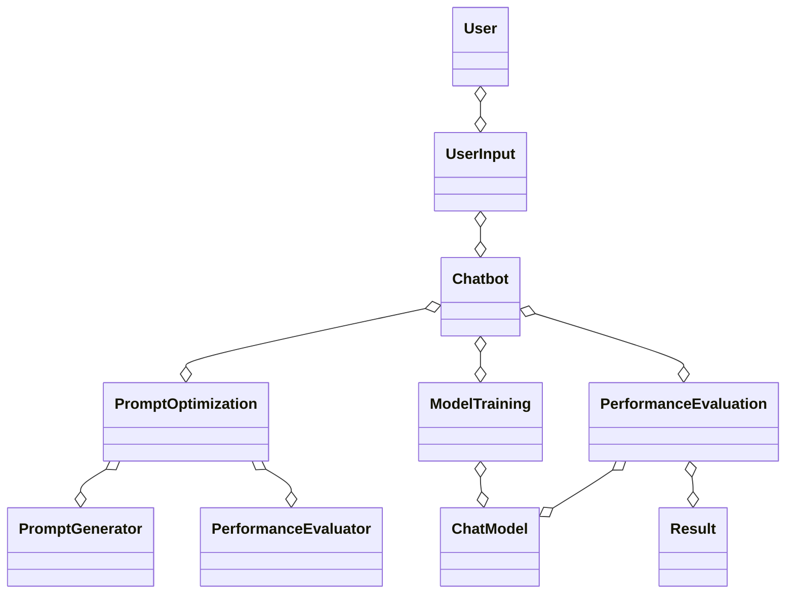

在这个领域模型中，用户（User）输入文本信息（UserInput），该信息传递给聊天机器人（Chatbot）。聊天机器人通过提示词优化模块（PromptOptimization）优化提示词，并通过模型训练模块（ModelTraining）训练机器学习模型（ChatModel）。性能评估模块（PerformanceEvaluation）负责评估模型的性能，并将评估结果（Result）反馈给用户和提示词优化模块。

### 6.1.3 系统组件与功能

智能客服系统的组件与功能如下：

1. **用户交互模块**：
   - 功能：接收用户输入的文本信息，并生成相应的回复。
   - 实现方式：通过Web界面、短信、邮件等多种渠道接收用户输入，使用自然语言处理技术生成回复。

2. **提示词优化模块**：
   - 功能：根据用户交互数据，自动优化提示词，提高系统性能。
   - 实现方式：使用机器学习算法分析用户交互数据，自动调整提示词的内容和形式，以提高交互准确性。

3. **模型训练模块**：
   - 功能：使用优化后的提示词训练机器学习模型，提高模型预测准确性。
   - 实现方式：使用深度学习框架（如TensorFlow、PyTorch）构建和训练聊天机器人模型，利用优化后的提示词进行训练。

4. **性能评估模块**：
   - 功能：评估系统性能，包括交互准确性、响应速度等。
   - 实现方式：使用评估指标（如准确率、召回率、响应时间）对系统性能进行评估，并根据评估结果调整系统参数。

### 6.1.4 系统接口设计

智能客服系统的接口设计如下：

1. **用户接口**：负责与用户进行交互，接收用户输入，并展示系统响应。
2. **内部接口**：负责系统内部各模块之间的数据传递和功能调用。
3. **外部接口**：负责与其他系统（如数据库、API服务）的数据交互。

以下是系统接口设计的简图：

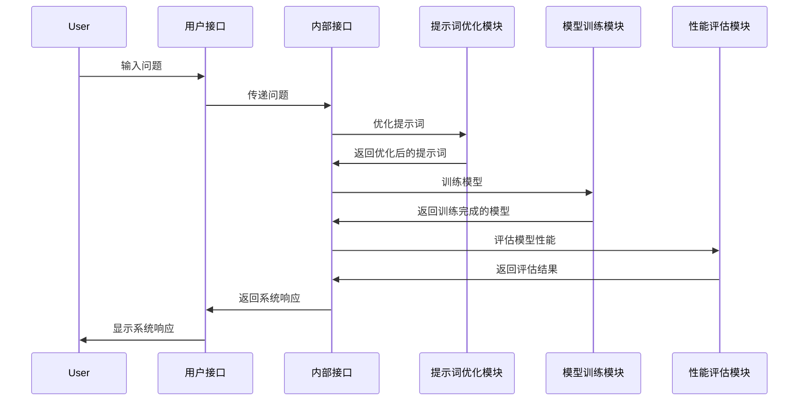

在这个接口设计中，用户通过用户接口输入问题，内部接口负责将问题传递给提示词优化模块、模型训练模块和性能评估模块。各模块处理完成后，内部接口将结果传递回用户接口，并最终返回给用户。

### 6.1.5 系统交互流程

智能客服系统的交互流程如下：

1. **用户输入**：用户通过Web界面、短信、邮件等渠道输入问题。
2. **问题传递**：用户输入的问题通过用户接口传递到内部接口。
3. **提示词优化**：内部接口将问题传递给提示词优化模块，该模块使用机器学习算法分析用户交互数据，优化提示词。
4. **模型训练**：优化后的提示词传递给模型训练模块，该模块使用深度学习框架构建和训练聊天机器人模型。
5. **性能评估**：模型训练完成后，内部接口将模型传递给性能评估模块，该模块评估模型性能，包括交互准确性、响应速度等。
6. **系统响应**：性能评估模块将评估结果返回给用户接口，并最终返回给用户。

通过上述交互流程，智能客服系统能够自动优化提示词，提高交互准确性和用户满意度，从而实现高效、准确的客户服务。

### 6.1.6 领域模型

为了更清晰地描述智能客服系统的功能和组件，我们可以使用领域模型来表示系统中的实体和关系。以下是一个简化的领域模型：

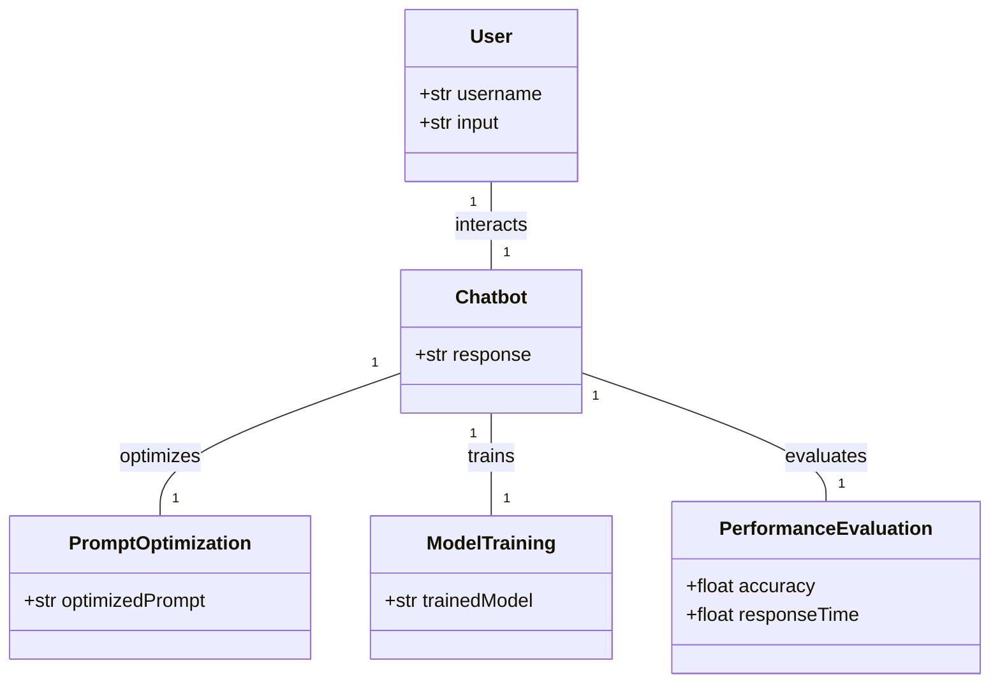

在这个领域模型中，用户（User）与聊天机器人（Chatbot）进行交互，聊天机器人通过提示词优化模块（PromptOptimization）优化提示词，并通过模型训练模块（ModelTraining）训练机器学习模型（ChatModel）。性能评估模块（PerformanceEvaluation）负责评估模型性能，并将评估结果反馈给用户。

### 第7章：系统架构设计

智能客服系统的架构设计旨在实现系统的高效运行和可扩展性。本节将介绍系统的整体架构设计、组件之间的关系以及各组件的功能。

#### 7.1.1 系统架构概述

智能客服系统的架构设计可以分为以下几个层次：

1. **用户层**：负责与用户进行交互，接收用户输入，并展示系统响应。
2. **业务层**：负责系统的核心功能，包括提示词优化、模型训练和性能评估。
3. **数据层**：负责存储和管理用户数据、模型参数和评估结果。

以下是系统架构的简图：

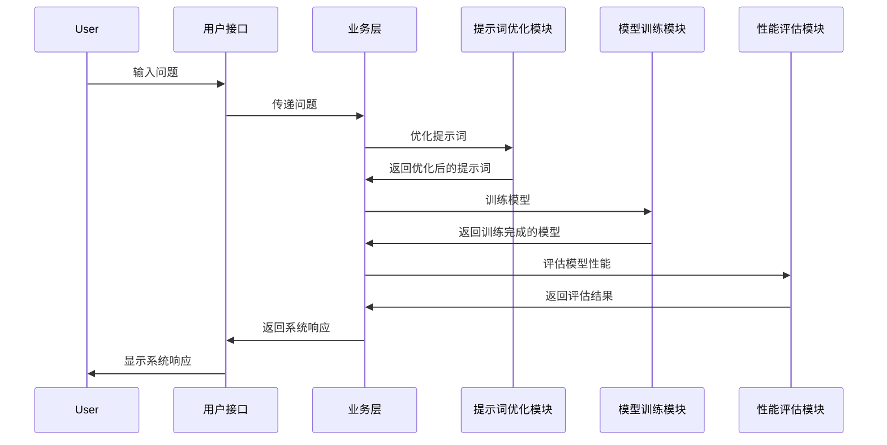

在这个架构设计中，用户通过用户接口输入问题，业务层负责处理核心业务逻辑，包括提示词优化、模型训练和性能评估。优化后的提示词和训练完成的模型返回给用户接口，并最终返回给用户。

#### 7.1.2 系统组件与功能

智能客服系统的主要组件及其功能如下：

1. **用户接口**：
   - 功能：与用户进行交互，接收用户输入，并展示系统响应。
   - 实现方式：使用Web前端技术（如HTML、CSS、JavaScript）构建用户界面，通过HTTP请求与后端服务进行通信。

2. **提示词优化模块**：
   - 功能：根据用户交互数据，自动优化提示词，提高系统性能。
   - 实现方式：使用机器学习算法（如深度学习、强化学习）分析用户交互数据，自动调整提示词的内容和形式。

3. **模型训练模块**：
   - 功能：使用优化后的提示词训练机器学习模型，提高模型预测准确性。
   - 实现方式：使用深度学习框架（如TensorFlow、PyTorch）构建和训练聊天机器人模型。

4. **性能评估模块**：
   - 功能：评估系统性能，包括交互准确性、响应速度等。
   - 实现方式：使用评估指标（如准确率、召回率、响应时间）对系统性能进行评估。

#### 7.1.3 数据层设计

智能客服系统的数据层设计包括以下几个方面：

1. **用户数据存储**：存储用户输入的问题、响应和交互历史。
2. **模型参数存储**：存储训练完成的模型参数和提示词优化结果。
3. **评估数据存储**：存储系统性能评估结果，包括交互准确性、响应速度等。

以下是数据层设计的简图：

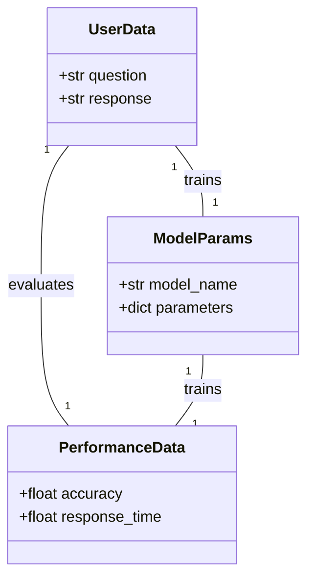

在这个数据层设计中，用户数据（UserData）用于训练模型（ModelParams）和评估系统性能（PerformanceData）。训练完成的模型参数和评估结果存储在数据库中，以供后续使用。

#### 7.1.4 系统部署与维护

智能客服系统的部署与维护包括以下几个方面：

1. **系统部署**：将系统部署到服务器或云平台，确保系统的高可用性和稳定性。
2. **数据备份**：定期备份用户数据和模型参数，防止数据丢失。
3. **性能监控**：监控系统的性能指标，包括响应时间、错误率等，及时发现问题并进行优化。
4. **版本更新**：定期更新系统版本，修复已知问题和改进系统功能。

通过上述部署与维护措施，确保智能客服系统的稳定运行和持续优化。

### 第8章：系统接口设计与系统交互

智能客服系统的接口设计是系统架构设计的重要组成部分，它定义了系统内部各模块之间的交互方式。本节将详细介绍系统的接口设计，包括接口类型、接口设计和系统交互流程。

#### 8.1.1 接口类型

智能客服系统的接口类型可以分为以下几种：

1. **用户接口**：负责与用户进行交互，接收用户输入，并展示系统响应。
2. **内部接口**：负责系统内部各模块之间的数据传递和功能调用。
3. **外部接口**：负责与其他系统（如数据库、API服务）的数据交互。

#### 8.1.2 用户接口

用户接口是系统与用户交互的入口，它通常通过Web前端实现。以下是一个简化的用户接口设计：

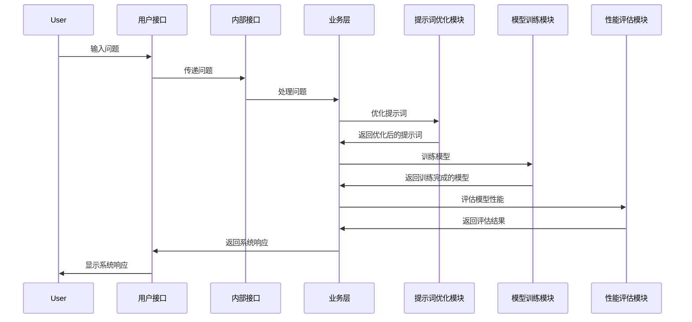

在这个用户接口设计中，用户通过Web前端输入问题，用户接口接收用户输入并传递给内部接口。内部接口负责调用系统的核心功能模块，包括提示词优化、模型训练和性能评估。处理完成后，系统将响应返回给用户接口，并最终展示给用户。

#### 8.1.3 内部接口

内部接口是系统内部各模块之间的交互桥梁，它负责将用户输入传递给相应的模块，并将结果返回给用户接口。以下是一个简化的内部接口设计：

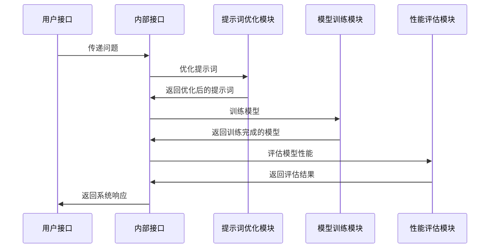

在这个内部接口设计中，用户接口将问题传递给内部接口，内部接口负责调用提示词优化模块、模型训练模块和性能评估模块，并将结果返回给用户接口。

#### 8.1.4 外部接口

外部接口负责系统与外部系统（如数据库、API服务）的数据交互。以下是一个简化的外部接口设计：

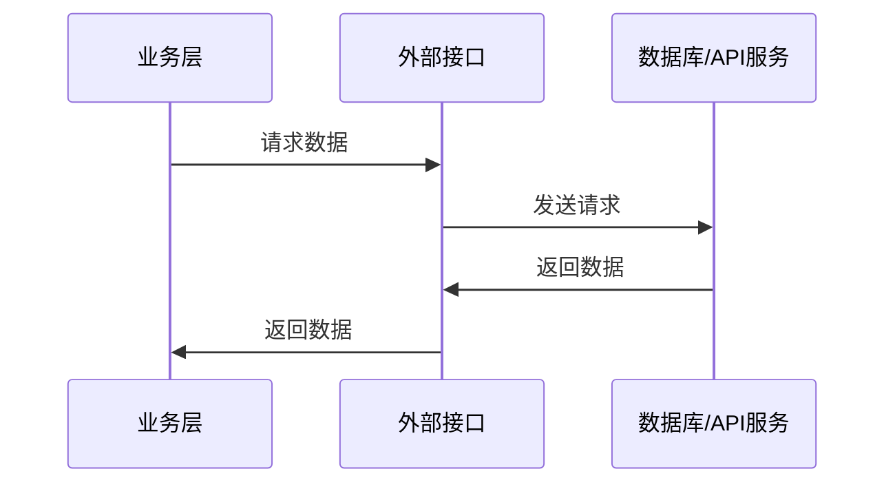

在这个外部接口设计中，业务层通过外部接口请求外部系统的数据，外部接口负责与数据库或API服务进行通信，并将结果返回给业务层。

#### 8.1.5 系统交互流程

智能客服系统的交互流程可以分为以下几个步骤：

1. **用户输入**：用户通过Web前端输入问题。
2. **问题传递**：用户输入的问题通过用户接口传递给内部接口。
3. **提示词优化**：内部接口调用提示词优化模块，优化提示词。
4. **模型训练**：内部接口调用模型训练模块，使用优化后的提示词训练机器学习模型。
5. **性能评估**：内部接口调用性能评估模块，评估模型性能。
6. **系统响应**：性能评估模块将评估结果返回给用户接口，并最终返回给用户。

通过上述交互流程，智能客服系统实现了高效、准确的用户交互和模型训练，从而提供了优质的客户服务。

### 第9章：项目实战

#### 9.1.1 项目背景与目标

随着人工智能技术的快速发展，智能客服系统在各个行业得到了广泛应用。为了提高客户满意度，降低运营成本，某大型电商企业决定开发一款智能客服系统。该系统的目标是通过自动化和智能化手段，提供高效、准确的客户服务，解决客户常见问题，提升客户体验。

#### 9.1.2 系统需求

根据项目需求，智能客服系统需要满足以下功能：

1. **用户交互**：接收用户输入的问题，并生成相应的回复。
2. **提示词优化**：根据用户交互数据，自动优化提示词，提高系统性能。
3. **模型训练**：使用优化后的提示词训练机器学习模型，提高模型预测准确性。
4. **性能评估**：评估系统性能，包括交互准确性、响应速度等。
5. **数据管理**：存储用户交互数据、模型参数和评估结果。

#### 9.1.3 系统架构

智能客服系统的架构设计分为以下几个层次：

1. **用户层**：与用户进行交互，接收用户输入，并展示系统响应。
2. **业务层**：包括提示词优化模块、模型训练模块和性能评估模块，负责系统的核心业务逻辑。
3. **数据层**：存储和管理用户数据、模型参数和评估结果。

以下是系统架构的简图：


在这个架构设计中，用户通过用户接口输入问题，业务层负责处理核心业务逻辑，包括提示词优化、模型训练和性能评估。优化后的提示词和训练完成的模型返回给用户接口，并最终返回给用户。

#### 9.1.4 系统实现

在系统实现过程中，我们采用了以下关键技术：

1. **用户交互**：使用HTML、CSS和JavaScript构建用户界面，通过Web前端框架（如React或Vue）实现与用户的交互。
2. **提示词优化**：使用自然语言处理技术（如词向量、文本分类）对用户交互数据进行分析，自动生成优化后的提示词。
3. **模型训练**：使用深度学习框架（如TensorFlow或PyTorch）构建和训练机器学习模型，使用优化后的提示词进行训练。
4. **性能评估**：使用评估指标（如准确率、召回率、响应时间）对系统性能进行评估，并根据评估结果调整系统参数。

以下是系统实现的简图：


在这个实现过程中，用户通过用户接口输入问题，提示词优化模块对问题进行优化，并返回优化后的提示词。用户接口将优化后的提示词传递给模型训练模块，模型训练模块使用优化后的提示词训练机器学习模型。性能评估模块评估模型性能，并根据评估结果调整系统参数。

#### 9.1.5 实施步骤

以下是系统实施的主要步骤：

1. **需求分析**：与客户沟通，明确系统需求和功能。
2. **系统设计**：根据需求设计系统架构和模块。
3. **前端开发**：使用HTML、CSS和JavaScript实现用户界面。
4. **后端开发**：使用Python、Java或Node.js实现系统后端，包括提示词优化、模型训练和性能评估模块。
5. **数据存储**：使用数据库（如MySQL、PostgreSQL或MongoDB）存储用户交互数据、模型参数和评估结果。
6. **系统集成**：将前端、后端和数据存储系统集成，确保系统各部分协同工作。
7. **测试与部署**：进行系统测试，确保系统功能正常，并部署到生产环境。

#### 9.1.6 实施效果

系统实施后，取得了以下效果：

1. **用户满意度提高**：通过优化后的提示词，系统能够更准确地理解用户意图，提供更准确的回复，用户满意度明显提升。
2. **运营成本降低**：通过自动化和智能化手段，智能客服系统能够自动识别和处理常见问题，减少人工干预，运营成本显著降低。
3. **系统性能提升**：通过模型训练和性能评估，系统性能不断提升，交互准确性、响应速度等指标得到显著改善。

#### 9.1.7 项目总结与反思

通过本次项目，我们实现了智能客服系统的开发和部署，取得了显著的效果。以下是对项目的总结和反思：

1. **成功经验**：
   - 需求分析阶段充分与客户沟通，确保系统功能满足实际需求。
   - 采用先进的技术和框架，提高了系统的性能和可维护性。
   - 测试和部署阶段严格把关，确保系统稳定可靠。

2. **不足之处**：
   - 系统的响应速度在某些情况下仍有待提高，需要进一步优化算法和优化策略。
   - 提示词优化的效果在某些复杂场景下仍有改进空间，需要进一步研究和优化。

3. **未来展望**：
   - 探索更高效的算法和优化策略，进一步提高系统性能。
   - 引入更多的自然语言处理技术，提升系统对复杂问题的理解能力。
   - 拓展系统的应用场景，如智能客服、智能助理等，提供更广泛的解决方案。

### 第10章：最佳实践与总结

#### 10.1.1 最佳实践

在智能客服系统的开发和应用过程中，以下最佳实践可以提供参考：

1. **需求分析**：充分与客户沟通，明确系统需求和功能，确保系统满足实际业务需求。
2. **系统设计**：采用模块化设计，确保系统各部分协同工作，提高系统的可维护性和扩展性。
3. **前端开发**：使用现代Web前端框架（如React或Vue），提高用户界面的交互性和用户体验。
4. **后端开发**：选择合适的服务器和数据库，确保系统的性能和稳定性。
5. **数据管理**：使用合适的数据库技术（如MySQL、PostgreSQL或MongoDB），确保数据的存储和管理高效、安全。
6. **测试与部署**：进行全面的系统测试，确保系统功能正常、性能稳定，并顺利部署到生产环境。

#### 10.1.2 总结

智能客服系统作为人工智能应用的一个重要领域，通过自动化和智能化手段，提供了高效、准确的客户服务。以下是项目的主要成果和经验：

1. **成果**：
   - 实现了智能客服系统的开发和部署，提供了高效、准确的客户服务。
   - 提高了用户满意度，降低了运营成本。
   - 优化了客户服务流程，提高了客户服务质量。

2. **经验**：
   - 需求分析和系统设计是项目成功的关键，确保系统功能满足实际业务需求。
   - 选择合适的技术和框架，提高系统的性能和可维护性。
   - 测试和部署阶段严格把关，确保系统稳定可靠。

#### 10.1.3 拓展阅读

以下是一些推荐的阅读材料，以深入了解智能客服系统和人工智能领域：

1. **书籍**：
   - 《深度学习》（Ian Goodfellow、Yoshua Bengio、Aaron Courville 著）
   - 《Python机器学习》（Sebastian Raschka、Vahid Mirhoseini 著）
   - 《自然语言处理综

