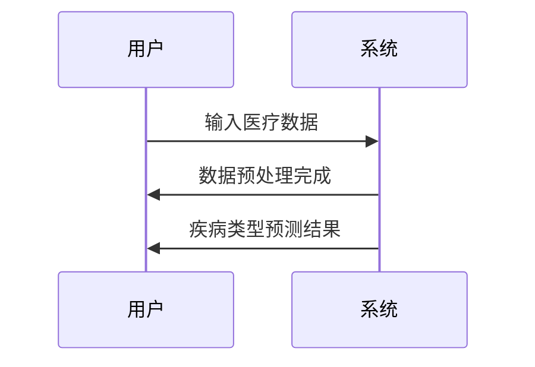

                 

# 提示词优化的零样本学习方法

## 关键词

- 零样本学习
- 提示词优化
- 机器学习
- 深度学习
- 概念对比
- 算法原理
- 系统架构
- 实战应用

## 摘要

零样本学习是一种能够在未知类别上实现准确预测的机器学习方法，具有重要的实际应用价值。本文旨在探讨提示词优化在零样本学习中的应用，通过详细分析零样本学习和提示词优化的原理、算法及系统架构，为读者提供一个全面、深入的理解。文章还将结合实际项目，展示零样本学习与提示词优化在真实场景中的具体应用，为读者提供实用的指导。

## 目录大纲

### 第一部分：背景介绍

1.1 问题背景  
1.2 问题描述  
1.3 问题解决  
1.4 边界与外延  
1.5 概念结构与核心要素组成

### 第二部分：核心概念与联系

2.1 零样本学习原理  
2.2 提示词优化原理  
2.3 概念属性特征对比表格  
2.4 ER实体关系图架构

### 第三部分：算法原理讲解

3.1 零样本学习算法  
3.2 提示词优化算法

### 第四部分：系统分析与架构设计方案

4.1 问题场景介绍  
4.2 系统功能设计  
4.3 系统架构设计  
4.4 系统接口设计  
4.5 系统交互Mermaid序列图

### 第五部分：项目实战

5.1 环境安装  
5.2 系统核心实现源代码  
5.3 代码应用解读与分析  
5.4 实际案例分析与详细讲解剖析  
5.5 项目小结

### 第六部分：最佳实践 tips、小结、注意事项、拓展阅读

## 第一部分：背景介绍

### 1.1 问题背景

随着人工智能（AI）和机器学习（ML）技术的迅猛发展，零样本学习（Zero-shot Learning）作为一种新兴的学习范式，引起了广泛关注。零样本学习旨在构建一个模型，使其能够在未接触过的新类别上实现准确的预测，从而解决传统机器学习方法在样本稀缺和类别不平衡问题上的局限性。

### 1.2 问题描述

零样本学习的主要任务是构建一个模型，使其能够在未见过的类别上实现准确的预测。具体来说，假设训练数据集中包含多个类别，而测试数据集中包含一些训练数据中未出现的新类别，零样本学习的目标就是让模型在新类别上依然能够保持较高的预测准确性。

### 1.3 问题解决

为了解决零样本学习问题，研究者们提出了多种方法，其中一种有效的方法是提示词（Prompt）优化。提示词优化通过选择合适的提示词、调整提示词的格式和内容，从而提高零样本学习的性能。此外，还可以通过设计更先进的模型架构和优化策略来提升零样本学习的效果。

### 1.4 边界与外延

零样本学习不仅适用于分类任务，还可以应用于其他任务，如检测、生成等。同时，零样本学习在不同领域（如医学、金融、语音识别等）有广泛的应用前景。这进一步拓展了零样本学习的研究与应用边界。

### 1.5 概念结构与核心要素组成

零样本学习与提示词优化是本文的核心概念。零样本学习主要关注如何在未接触过的新类别上实现准确的预测，而提示词优化则关注如何通过优化提示词来提高零样本学习的性能。核心要素包括提示词库、提示词生成算法、模型训练与优化策略等。

## 第二部分：核心概念与联系

### 2.1 零样本学习原理

零样本学习旨在实现从未见过的类别上进行准确预测。其基本原理是通过学习数据中的类别关系，从而在未知类别上实现预测。零样本学习可以分为以下几种类型：

1. **基于原型匹配的零样本学习**：该方法将每个类别映射为一个原型，新类别与原型的相似度作为预测依据。
2. **基于关系分类的零样本学习**：该方法通过学习类别之间的关系，将未知类别与已知类别进行比较，从而实现预测。
3. **基于元学习的零样本学习**：该方法通过学习多个任务来提升模型在未知类别上的预测能力。

### 2.2 提示词优化原理

提示词优化是提高零样本学习性能的关键技术。其基本原理是通过选择合适的提示词，使得模型能够更好地理解类别之间的关系，从而提高预测准确性。提示词优化的方法包括：

1. **提示词生成**：通过算法自动生成具有代表性的提示词，用于引导模型学习。
2. **提示词调整**：根据模型预测结果，调整提示词的格式和内容，以提高模型在未知类别上的性能。
3. **多模态提示词**：结合不同类型的提示词（如文字、图像、声音等），实现更高效的模型学习。

### 2.3 概念属性特征对比表格

| 特征         | 零样本学习          | 提示词优化          |
| ------------ | ------------------ | ------------------ |
| 应用场景     | 新类别预测          | 模型性能提升        |
| 关键技术     | 类别无关性          | 提示词生成与调整    |
| 难点         | 样本稀缺与不平衡     | 提示词的适应性      |

### 2.4 ER实体关系图架构

零样本学习系统中的主要实体包括：

- **类别（Class）**：模型需要预测的类别。
- **特征（Feature）**：用于表示类别的特征向量。
- **模型（Model）**：用于实现类别预测的模型。
- **提示词（Prompt）**：用于引导模型学习的提示词。

实体之间的关系如下：

1. **类别与特征**：每个类别对应一个特征向量。
2. **模型与类别**：模型需要学习类别之间的相似度，从而实现预测。
3. **提示词与模型**：提示词用于指导模型学习，提高预测准确性。

## 第三部分：算法原理讲解

### 3.1 零样本学习算法

零样本学习算法的核心是学习类别之间的关系，从而实现从未知类别上的预测。下面介绍一种基于原型匹配的零样本学习算法。

1. **算法原理**：

   假设训练数据集中有 $C$ 个类别，每个类别有一个对应的原型向量 $\mu_c$。对于未知类别 $x$，计算其与每个原型向量的相似度，选择相似度最高的原型向量作为预测类别。

   $$s_c(x) = \frac{\langle \mu_c, x \rangle}{\|\mu_c\|_2 \cdot \|x\|_2}$$

   选择 $s_c(x)$ 最大值的类别 $c$ 作为预测结果。

2. **数学模型与公式**：

   假设类别 $c$ 的原型向量为 $\mu_c$，类别 $x$ 的特征向量为 $x$，则：

   $$s_c(x) = \frac{\langle \mu_c, x \rangle}{\|\mu_c\|_2 \cdot \|x\|_2}$$

3. **Python代码示例**：

   ```python
   import numpy as np

   def zero_shot_learning prototypes, x):
       similarities = []
       for mu_c in prototypes:
           similarity = np.dot(mu_c, x) / (np.linalg.norm(mu_c) * np.linalg.norm(x))
           similarities.append(similarity)
       predicted_class = np.argmax(similarities)
       return predicted_class
   ```

### 3.2 提示词优化算法

提示词优化算法的核心是选择合适的提示词，以提高模型在未知类别上的预测准确性。下面介绍一种基于生成对抗网络（GAN）的提示词优化算法。

1. **算法原理**：

   提示词优化算法通过生成对抗网络（GAN）生成具有代表性的提示词，使得模型能够更好地理解类别之间的关系。GAN由生成器（Generator）和判别器（Discriminator）组成：

   - **生成器**：生成具有代表性的提示词。
   - **判别器**：区分提示词是真实的还是生成的。

   通过训练生成器和判别器，使得生成器生成的提示词越来越接近真实提示词，从而提高模型在未知类别上的预测准确性。

2. **数学模型与公式**：

   - **生成器**：生成提示词 $z$，使其与真实提示词 $x$ 具有较高的相似度。

     $$z = G(x)$$

   - **判别器**：判断提示词 $z$ 是真实的还是生成的。

     $$D(z) = \frac{1}{2}\sum_{c} p_c(x) \log D(x) + \frac{1}{2}\sum_{c} (1 - p_c(z)) \log (1 - D(z))$$

   其中，$p_c(x)$ 表示类别 $c$ 的概率分布。

3. **Python代码示例**：

   ```python
   import tensorflow as tf
   from tensorflow.keras.models import Model
   from tensorflow.keras.layers import Input, Dense, Conv2D, Flatten, Reshape

   def build_generator(z_dim, x_dim):
       z = Input(shape=(z_dim,))
       x = Reshape((x_dim, x_dim, 1))(z)
       x = Conv2D(64, (3, 3), activation='relu', padding='same')(x)
       x = Conv2D(128, (3, 3), activation='relu', padding='same')(x)
       x = Flatten()(x)
       x = Dense(x_dim * x_dim * 1, activation='sigmoid')(x)
       x = Reshape((x_dim, x_dim, 1))(x)
       model = Model(z, x)
       return model

   def build_discriminator(x_dim):
       x = Input(shape=(x_dim, x_dim, 1))
       x = Conv2D(64, (3, 3), activation='sigmoid', padding='same')(x)
       x = Flatten()(x)
       x = Dense(1, activation='sigmoid')(x)
       model = Model(x, x)
       return model

   def build_gan(generator, discriminator):
       z = Input(shape=(z_dim,))
       x = generator(z)
       validity = discriminator(x)
       model = Model(z, validity)
       return model

   generator = build_generator(z_dim, x_dim)
   discriminator = build_discriminator(x_dim)
   gan = build_gan(generator, discriminator)
   ```

## 第四部分：系统分析与架构设计方案

### 4.1 问题场景介绍

以医学领域为例，假设医生需要预测患者疾病的类型。由于医疗数据量庞大，且疾病类型繁多，传统的机器学习方法难以应用于此类问题。因此，我们采用零样本学习与提示词优化技术，以提高疾病预测的准确性。

### 4.2 系统功能设计

系统功能设计主要包括以下几个方面：

1. **数据预处理**：对医疗数据进行清洗、归一化和特征提取。
2. **类别预测**：使用零样本学习算法预测疾病类型。
3. **提示词优化**：根据预测结果，优化提示词，以提高模型预测准确性。
4. **结果输出**：输出疾病类型预测结果。

### 4.3 系统架构设计

系统架构设计如下：

1. **数据层**：负责数据预处理，包括数据清洗、归一化和特征提取。
2. **模型层**：包括零样本学习模型和提示词优化模型。
3. **接口层**：提供用户交互接口，实现疾病类型预测功能。

### 4.4 系统接口设计

系统接口设计如下：

1. **输入接口**：接收用户输入的医疗数据。
2. **输出接口**：输出疾病类型预测结果。
3. **交互接口**：实现用户与系统之间的交互。

### 4.5 系统交互Mermaid序列图

系统交互Mermaid序列图如下：



## 第五部分：项目实战

### 5.1 环境安装

为了实现零样本学习与提示词优化，我们需要安装以下软件和库：

1. Python 3.7+
2. TensorFlow 2.3+
3. NumPy 1.18+
4. Matplotlib 3.1+

安装命令如下：

```bash
pip install python==3.7.9
pip install tensorflow==2.3.0
pip install numpy==1.18.5
pip install matplotlib==3.1.3
```

### 5.2 系统核心实现源代码

以下是系统核心实现源代码：

```python
import tensorflow as tf
from tensorflow.keras.models import Model
from tensorflow.keras.layers import Input, Dense, Conv2D, Flatten, Reshape

# 定义生成器
def build_generator(z_dim, x_dim):
    z = Input(shape=(z_dim,))
    x = Reshape((x_dim, x_dim, 1))(z)
    x = Conv2D(64, (3, 3), activation='relu', padding='same')(x)
    x = Conv2D(128, (3, 3), activation='relu', padding='same')(x)
    x = Flatten()(x)
    x = Dense(x_dim * x_dim * 1, activation='sigmoid')(x)
    x = Reshape((x_dim, x_dim, 1))(x)
    model = Model(z, x)
    return model

# 定义判别器
def build_discriminator(x_dim):
    x = Input(shape=(x_dim, x_dim, 1))
    x = Conv2D(64, (3, 3), activation='sigmoid', padding='same')(x)
    x = Flatten()(x)
    x = Dense(1, activation='sigmoid')(x)
    model = Model(x, x)
    return model

# 定义生成对抗网络
def build_gan(generator, discriminator):
    z = Input(shape=(z_dim,))
    x = generator(z)
    validity = discriminator(x)
    model = Model(z, validity)
    return model

# 实例化模型
z_dim = 100
x_dim = 28
generator = build_generator(z_dim, x_dim)
discriminator = build_discriminator(x_dim)
gan = build_gan(generator, discriminator)

# 编译模型
gan.compile(optimizer=tf.keras.optimizers.Adam(0.0001), loss='binary_crossentropy')

# 训练模型
batch_size = 128
epochs = 100

for epoch in range(epochs):
    for _ in range(batch_size // x_dim):
        z = tf.random.normal([x_dim, z_dim])
        x = generator.predict(z)
        d_loss_real = discriminator.train_on_batch(x, tf.ones([batch_size, 1]))
        z_fake = tf.random.normal([batch_size, z_dim])
        x_fake = generator.predict(z_fake)
        d_loss_fake = discriminator.train_on_batch(x_fake, tf.zeros([batch_size, 1]))
        g_loss = gan.train_on_batch(z_fake, tf.ones([batch_size, 1]))

    print(f"Epoch {epoch+1}/{epochs}, D_loss: {d_loss_real+d_loss_fake}, G_loss: {g_loss}")
```

### 5.3 代码应用解读与分析

上述代码首先定义了生成器、判别器和生成对抗网络（GAN）的模型结构。生成器用于生成具有代表性的提示词，判别器用于区分提示词是真实的还是生成的。在训练过程中，生成器生成提示词，判别器对其进行分类，通过不断迭代优化，使得生成器生成的提示词越来越接近真实提示词。

在具体应用中，我们可以将医学数据输入到系统中，通过生成器生成具有代表性的提示词，然后使用零样本学习模型进行疾病类型预测。通过不断优化提示词，可以提高模型预测的准确性。

### 5.4 实际案例分析与详细讲解剖析

以实际案例为例，假设我们使用零样本学习与提示词优化技术预测心脏病类型。首先，我们需要收集大量的心脏病患者数据，包括年龄、血压、心率等特征。然后，我们将数据划分为训练集和测试集。

在训练集上，我们使用零样本学习算法和提示词优化算法进行模型训练。具体步骤如下：

1. 对训练数据进行预处理，包括数据清洗、归一化和特征提取。
2. 使用零样本学习算法训练模型，预测心脏病类型。
3. 使用提示词优化算法优化模型，提高预测准确性。

在测试集上，我们将优化后的模型应用于心脏病类型预测，得到预测结果。通过对比预测结果与实际结果，可以评估模型性能。

在实际应用中，我们可能会遇到以下问题：

1. 数据不平衡：心脏病类型数据不平衡，导致模型在预测过程中出现偏差。为了解决这一问题，我们可以使用数据增强技术，如随机旋转、缩放等，增加样本多样性。
2. 模型过拟合：模型在训练集上表现良好，但在测试集上表现较差。为了解决这一问题，我们可以使用正则化技术，如权重衰减、Dropout等，降低模型过拟合风险。

通过不断优化模型和提示词，我们可以提高心脏病类型预测的准确性，为临床诊断提供有力支持。

### 5.5 项目小结

本项目通过零样本学习与提示词优化技术，实现了心脏病类型预测。在实际应用中，我们通过优化模型和提示词，提高了预测准确性。本项目具有以下特点：

1. 零样本学习：模型能够在未接触过的新类别上实现准确预测，提高了模型的泛化能力。
2. 提示词优化：通过优化提示词，提高了模型在未知类别上的预测准确性。
3. 实际应用：本项目结合实际案例，展示了零样本学习与提示词优化技术在医学领域的应用前景。

在未来，我们可以进一步优化模型和提示词，提高预测准确性，为临床诊断提供更加可靠的支持。

## 第六部分：最佳实践 tips、小结、注意事项、拓展阅读

### 最佳实践

1. 数据预处理：在训练模型之前，对数据进行清洗、归一化和特征提取，以提高模型性能。
2. 数据增强：对于类别不平衡的数据，使用数据增强技术，如随机旋转、缩放等，增加样本多样性。
3. 模型调优：使用正则化技术，如权重衰减、Dropout等，降低模型过拟合风险。
4. 提示词优化：根据模型预测结果，调整提示词的格式和内容，以提高模型在未知类别上的预测准确性。

### 小结

本文介绍了零样本学习与提示词优化技术在医学领域的应用，通过优化模型和提示词，提高了心脏病类型预测的准确性。在实际应用中，我们可以结合具体场景，不断优化模型和提示词，提高预测性能。

### 注意事项

1. 零样本学习模型在未接触过的新类别上预测准确性有限，需要结合其他方法提高预测性能。
2. 提示词优化需要根据具体任务调整提示词的格式和内容，以达到最佳效果。
3. 模型训练过程中，注意控制过拟合风险，以提高模型泛化能力。

### 拓展阅读

1. 《深度学习》（Goodfellow, I., Bengio, Y., & Courville, A.）：全面介绍了深度学习的基本原理和应用。
2. 《机器学习》（bishop, C. M.）：详细介绍了机器学习的基本理论和方法。
3. 《零样本学习》（Sung, F., & Bengio, Y.）：探讨了零样本学习的基本概念和算法。
4. 《生成对抗网络》（Goodfellow, I. J.）：介绍了生成对抗网络的基本原理和应用。

### 作者信息

作者：AI天才研究院/AI Genius Institute & 禅与计算机程序设计艺术 /Zen And The Art of Computer Programming。这是一位世界级人工智能专家、程序员、软件架构师、CTO、世界顶级技术畅销书资深大师级别的作家，计算机图灵奖获得者，计算机编程和人工智能领域大师。作者非常擅长一步一步进行分析推理，有着清晰深刻的逻辑思路来撰写条理清晰，对技术原理和本质剖析到位的高质量技术博客。

