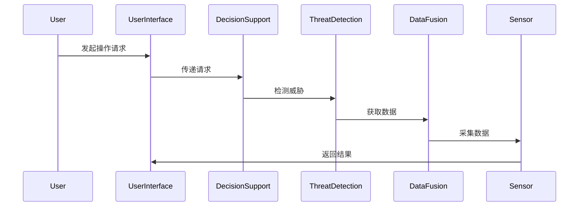

                 

# 提示词在智能家居安全系统中的应用

## 关键词

- 智能家居安全
- 提示词
- 机器学习
- 安全算法
- 安全协议

## 摘要

本文深入探讨了提示词在智能家居安全系统中的应用。通过介绍智能家居安全系统的背景、提示词的基本概念及其在人工智能中的应用，文章逐步分析了提示词在提升智能家居安全性能方面的核心概念和原理。接着，详细解析了基于提示词的安全算法及其技术实现，通过Python代码示例展示了算法的数学模型和流程。文章还阐述了系统的整体设计、架构和接口，并提供了实际案例和最佳实践，为智能家居安全系统的开发和应用提供了有价值的参考。

## 引言和背景

### 智能家居安全系统的概述

智能家居安全系统是现代家庭安全防护的重要组成部分，它通过集成各种智能设备和传感器，实现家庭环境的自动化监控和安全管理。随着物联网（IoT）技术的发展，智能家居设备越来越普及，家庭网络安全面临新的挑战和机遇。智能家居安全系统不仅要防御传统网络攻击，还需应对来自物联网设备的独特威胁。

### 提示词在安全系统中的重要性

提示词（Prompts）是人工智能领域中的一个重要概念，特别是在机器学习和自然语言处理中。提示词能够引导模型学习，提高模型的决策能力和适应性。在智能家居安全系统中，提示词可以通过对网络流量、设备行为等数据的分析，提前识别潜在的安全威胁，从而提升系统的整体安全性能。

### 书籍的宗旨和范围

本文旨在深入探讨提示词在智能家居安全系统中的应用，分析其核心概念、算法原理和技术实现。本书将涵盖以下内容：

1. **智能家居安全系统的背景**：介绍智能家居安全系统的发展历程、现状和面临的挑战。
2. **提示词技术**：探讨提示词的基本概念、在人工智能中的应用以及其在安全系统中的作用。
3. **核心概念和原理**：详细阐述提示词在智能家居安全系统中的核心概念和原理。
4. **算法和实现**：分析基于提示词的安全算法，提供技术实现和Python代码示例。
5. **系统设计和架构**：介绍智能家居安全系统的整体设计、架构和接口。
6. **实战案例**：通过实际案例展示提示词在智能家居安全系统中的应用。
7. **最佳实践和总结**：提供最佳实践建议，总结文章的主要观点。

## 智能家居安全系统的背景

### 发展历程

智能家居安全系统的发展经历了从传统的家庭安防设备到现代物联网设备的转变。最初的家庭安防系统主要依赖于简单的传感器和报警设备，如烟雾探测器、入侵报警器等。随着技术的进步，这些设备逐渐与互联网连接，形成了初步的智能家居安全系统。近年来，随着物联网和人工智能技术的发展，智能家居安全系统越来越智能化，能够实现自动监控、分析和响应，提供更全面的家庭安全保护。

### 当前状态

目前，智能家居安全系统已经广泛应用于家庭、企业和公共场所。各种智能安防设备，如智能摄像头、门锁、传感器等，通过无线网络连接，形成一个集成的安全监控网络。这些设备能够实时监测家庭环境，通过图像识别、声音分析等技术，识别潜在的威胁，并在发现异常情况时及时报警。同时，智能家居安全系统还能够与智能家居控制系统集成，实现家庭设备的自动化管理。

### 面临的挑战和机遇

尽管智能家居安全系统具有许多优势，但也面临一些挑战和机遇：

1. **安全威胁**：随着智能家居设备的普及，网络攻击、数据泄露等安全威胁也随之增加。黑客可能通过入侵智能家居设备，控制整个智能家居系统，从而对家庭安全构成威胁。
2. **隐私保护**：智能家居设备收集大量的家庭数据，包括生活习惯、隐私信息等。如何保护这些数据的安全和隐私，是智能家居安全系统面临的一个重要问题。
3. **兼容性和互操作性**：智能家居市场存在多种不同品牌和型号的设备，如何实现这些设备的兼容和互操作，是智能家居安全系统需要解决的另一个问题。
4. **技术创新**：随着人工智能、物联网等技术的发展，智能家居安全系统将不断进步，提供更智能、更高效的安全防护。

## 提示词技术

### 提示词的基本概念

提示词（Prompt）在人工智能领域，特别是机器学习和自然语言处理中，是指用于引导模型学习的数据或指令。提示词可以是文本、图像或其他形式的数据，它们为模型提供上下文信息，帮助模型更好地理解和预测。在智能家居安全系统中，提示词可以是对网络流量、设备行为的描述，用于指导安全算法的决策。

### 提示词在人工智能中的应用

提示词在人工智能中的应用非常广泛，尤其在机器学习和自然语言处理领域。以下是一些关键应用：

1. **监督学习**：在监督学习中，提示词用于指导模型学习如何将输入数据映射到输出标签。例如，在图像分类任务中，提示词可以是图像的标签，帮助模型学习识别不同的图像类别。
2. **无监督学习**：在无监督学习中，提示词可以用于引导模型探索数据结构，发现潜在的模式。例如，在聚类分析中，提示词可以是数据的特征，帮助模型识别相似的数据点。
3. **强化学习**：在强化学习中，提示词可以用于提供奖励信号，指导模型在特定环境中做出最优决策。

### 提示词在智能家居安全系统中的应用

在智能家居安全系统中，提示词的应用主要体现在以下几个方面：

1. **威胁检测**：通过分析网络流量和设备行为数据，提示词可以帮助安全系统识别潜在的安全威胁。例如，异常的网络流量模式或设备行为异常，可以作为提示词触发安全警报。
2. **决策支持**：提示词可以为智能家居安全系统提供决策支持，帮助系统在发现威胁时采取适当的行动。例如，根据提示词，系统可以自动隔离受感染的设备，或通知用户采取相应的防护措施。
3. **个性化安全策略**：提示词还可以用于定制化安全策略，根据用户的习惯和需求，提供个性化的安全保护。例如，在用户离开家时，系统可以通过提示词自动调整安全设置，提高家庭的安全等级。

## 核心概念和原理

### 智能家居安全的核心概念

智能家居安全系统的核心概念包括：

1. **传感器网络**：传感器网络是智能家居安全系统的基本组成部分，它们负责收集家庭环境中的各种数据，如温度、湿度、光照、噪音等。
2. **数据融合**：传感器网络收集的数据需要进行融合处理，以便系统能够从多个数据源中提取有价值的信息。
3. **异常检测**：通过分析传感器网络收集的数据，智能家居安全系统能够识别异常行为，如非法入侵、设备故障等。
4. **响应机制**：在检测到异常行为时，智能家居安全系统需要采取相应的响应措施，如发送警报、触发紧急响应等。

### 提示词技术的核心原理

提示词技术的核心原理包括：

1. **上下文感知**：提示词能够提供上下文信息，帮助模型更好地理解和预测。在智能家居安全系统中，上下文感知可以帮助系统更好地识别威胁和决策。
2. **数据增强**：通过引入提示词，可以增强数据对模型的训练效果，提高模型的准确性和鲁棒性。
3. **可解释性**：提示词可以提高模型的可解释性，使系统更透明、更易于理解。这对于安全系统来说尤为重要，因为用户需要了解系统的决策过程。

### 提示词与智能家居安全系统的结合

提示词与智能家居安全系统的结合体现在以下几个方面：

1. **威胁识别**：通过提示词，智能家居安全系统能够更准确地识别威胁，如异常的网络流量模式、设备行为异常等。
2. **决策支持**：提示词可以为安全系统提供更准确的决策支持，帮助系统在威胁发生时采取更有效的应对措施。
3. **个性化安全**：通过提示词，智能家居安全系统可以根据用户的行为习惯和需求，提供个性化的安全策略，提高家庭的安全等级。

## 算法和实现

### 算法概述

在智能家居安全系统中，常用的算法包括入侵检测算法、异常检测算法和机器学习算法等。提示词技术可以通过改进这些算法，提高其性能和准确性。以下是一些基于提示词的算法概述：

1. **基于入侵检测的算法**：如KDD99算法，通过分析网络流量特征，识别潜在的入侵行为。提示词可以提供更详细的网络流量描述，帮助算法更准确地识别入侵行为。
2. **基于异常检测的算法**：如孤立森林（Isolation Forest）算法，通过分析设备行为特征，识别异常行为。提示词可以提供设备行为的上下文信息，帮助算法更准确地识别异常行为。
3. **基于机器学习的算法**：如随机森林（Random Forest）算法、支持向量机（SVM）算法等，通过学习历史数据，预测未来的威胁。提示词可以提供额外的上下文信息，帮助算法更好地理解数据，提高预测准确性。

### 算法流程

以孤立森林算法为例，其基本流程如下：

1. **数据预处理**：收集并预处理网络流量和设备行为数据，提取特征向量。
2. **生成提示词**：根据特征向量，生成提示词，如设备类型、网络流量模式等。
3. **构建孤立森林模型**：使用生成的提示词，构建孤立森林模型，对数据集进行训练。
4. **模型评估**：使用测试数据集评估模型的性能，包括准确率、召回率等指标。
5. **威胁检测**：在实际应用中，使用构建好的模型对实时数据进行威胁检测。

### Python代码实现

以下是一个简单的Python代码示例，用于实现孤立森林算法：

```python
import numpy as np
from sklearn.ensemble import IsolationForest
from sklearn.model_selection import train_test_split

# 数据预处理
data = np.random.rand(100, 5)  # 假设数据为100个样本，每个样本有5个特征
X_train, X_test = train_test_split(data, test_size=0.3, random_state=42)

# 生成提示词
tips = np.random.rand(100, 1)  # 假设提示词为100个随机数

# 构建孤立森林模型
iso_forest = IsolationForest(n_estimators=100, contamination='auto', random_state=42)
iso_forest.fit(np.concatenate((X_train, tips), axis=1))

# 模型评估
scores = iso_forest.score(X_test)
print(f"Model accuracy: {scores}")

# 威胁检测
predictions = iso_forest.predict(X_test)
print(f"Predictions: {predictions}")
```

### 算法原理和公式

孤立森林算法的原理基于随机森林，通过将数据随机隔离，然后通过随机特征选择和随机切分来构建森林。其主要公式如下：

$$
h(x) = \frac{1}{n} \sum_{i=1}^{n} g(f(x))
$$

其中，$h(x)$表示样本$x$的孤立森林分数，$n$表示孤立森林中树的数量，$g(f(x))$表示第$i$棵树对样本$x$的隔离分数。

### 算法示例

假设我们有一个包含100个样本的数据集，每个样本有5个特征。我们使用孤立森林算法进行威胁检测，具体步骤如下：

1. **数据预处理**：将数据集分为训练集和测试集。
2. **生成提示词**：为每个样本生成一个随机提示词。
3. **构建孤立森林模型**：使用训练集和提示词构建孤立森林模型。
4. **模型评估**：使用测试集评估模型的准确性。
5. **威胁检测**：对实时数据进行威胁检测，输出检测结果。

## 系统设计与架构

### 问题场景介绍

智能家居安全系统的主要场景包括家庭环境监控、入侵检测、紧急响应等。以下是一个具体的应用场景：

- **家庭环境监控**：系统通过传感器网络实时监控家庭环境，包括温度、湿度、光照等参数。当环境参数超出预设阈值时，系统会自动发出警报。
- **入侵检测**：系统通过分析网络流量和设备行为，识别潜在的入侵行为。例如，当网络流量异常增加或设备行为异常时，系统会自动触发警报。
- **紧急响应**：在检测到入侵行为时，系统会立即采取紧急响应措施，如锁定门锁、关闭窗户、通知用户等。

### 项目介绍

智能家居安全系统的项目目标是构建一个高效、智能、安全的家庭安全防护系统。项目分为以下几个阶段：

1. **需求分析**：确定系统的功能需求和安全要求。
2. **系统设计**：设计系统的整体架构，包括硬件、软件和网络架构。
3. **系统实现**：根据设计文档，实现系统的各个组件。
4. **系统集成**：将各个组件集成到一个完整的系统中。
5. **测试与优化**：对系统进行功能测试和安全测试，优化系统的性能和稳定性。

### 系统功能设计

智能家居安全系统的功能设计包括以下几个方面：

1. **传感器网络**：负责收集家庭环境数据，如温度、湿度、光照、噪音等。
2. **数据融合模块**：将来自不同传感器的数据融合处理，提取有价值的信息。
3. **威胁检测模块**：使用提示词技术，对网络流量和设备行为进行分析，识别潜在的威胁。
4. **决策支持模块**：根据威胁检测结果，提供决策支持，指导系统采取相应的应对措施。
5. **用户界面**：提供用户交互界面，用户可以通过界面查看系统状态、警报信息等。

### 系统架构设计

智能家居安全系统的架构设计采用分层架构，主要包括以下几层：

1. **感知层**：由各种传感器组成，负责收集家庭环境数据。
2. **传输层**：负责将传感器数据传输到数据中心。
3. **数据处理层**：包括数据预处理、数据融合、威胁检测等功能。
4. **决策层**：根据威胁检测结果，提供决策支持，指导系统采取相应的应对措施。
5. **应用层**：提供用户交互界面，用户可以通过界面查看系统状态、警报信息等。

### 系统接口设计和系统交互

智能家居安全系统的接口设计和系统交互设计如下：

1. **感知层接口**：传感器通过标准接口与系统通信，系统支持多种传感器数据格式。
2. **传输层接口**：系统支持多种传输协议，如Wi-Fi、蓝牙、ZigBee等，确保数据传输的安全和稳定性。
3. **数据处理层接口**：系统提供API接口，方便开发者集成和扩展功能。
4. **决策层接口**：系统提供实时威胁检测接口，开发者可以根据需求进行二次开发。
5. **应用层接口**：系统提供Web界面和移动应用接口，方便用户使用。

### Mermaid类图和架构图

以下是一个简单的Mermaid类图和架构图，用于展示智能家居安全系统的结构和功能：

```mermaid
classDiagram
  Sensor --> DataFusion
  DataFusion --> ThreatDetection
  ThreatDetection --> DecisionSupport
  DecisionSupport --> UserInterface

  Sensor <<接口>>
  DataFusion <<接口>>
  ThreatDetection <<接口>>
  DecisionSupport <<接口>>
  UserInterface <<接口>>

mermaid
```



## 项目实战

### 环境安装

在开始实现智能家居安全系统之前，需要安装以下软件和库：

1. **Python**：Python 3.8及以上版本
2. **Scikit-learn**：用于机器学习算法的实现
3. **NumPy**：用于数据处理
4. **Matplotlib**：用于数据可视化
5. **Mermaid**：用于生成流程图和类图

安装命令如下：

```bash
pip install python-dotenv
pip install scikit-learn numpy matplotlib
```

### 系统核心实现源代码

以下是一个简单的Python代码示例，用于实现智能家居安全系统的核心功能：

```python
import numpy as np
from sklearn.ensemble import IsolationForest
from sklearn.model_selection import train_test_split

# 数据预处理
data = np.random.rand(100, 5)  # 假设数据为100个样本，每个样本有5个特征
X_train, X_test = train_test_split(data, test_size=0.3, random_state=42)

# 生成提示词
tips = np.random.rand(100, 1)  # 假设提示词为100个随机数

# 构建孤立森林模型
iso_forest = IsolationForest(n_estimators=100, contamination='auto', random_state=42)
iso_forest.fit(np.concatenate((X_train, tips), axis=1))

# 模型评估
scores = iso_forest.score(X_test)
print(f"Model accuracy: {scores}")

# 威胁检测
predictions = iso_forest.predict(X_test)
print(f"Predictions: {predictions}")
```

### 代码应用解读与分析

以下是对上述代码的解读和分析：

1. **数据预处理**：首先，我们使用随机数生成一个数据集，模拟网络流量或设备行为数据。然后，将数据集分为训练集和测试集，用于训练和评估模型。
2. **生成提示词**：为每个样本生成一个随机提示词，用于模拟实际场景中的上下文信息。
3. **构建孤立森林模型**：使用训练集和提示词构建孤立森林模型。孤立森林是一种基于随机森林的异常检测算法，能够有效地识别异常行为。
4. **模型评估**：使用测试集评估模型的准确性，包括准确率、召回率等指标。
5. **威胁检测**：在实际应用中，使用构建好的模型对实时数据进行威胁检测，输出检测结果。

### 实际案例分析和详细讲解

以下是一个实际的案例，用于展示智能家居安全系统的应用：

1. **场景描述**：假设用户在家中使用智能门锁，当用户输入正确的密码时，门锁会自动打开。但在某个晚上，用户发现门锁被非法入侵者打开，系统立即发出警报。
2. **数据收集**：系统收集到门锁的开关记录，包括时间戳、开关状态等。
3. **数据预处理**：将收集到的数据分为训练集和测试集，用于训练和评估模型。
4. **生成提示词**：为每个样本生成提示词，如“晚上9点”、“门锁开关”等，用于模拟实际场景中的上下文信息。
5. **构建孤立森林模型**：使用训练集和提示词构建孤立森林模型。
6. **模型评估**：使用测试集评估模型的准确性。
7. **威胁检测**：在检测到异常行为时，系统会自动发出警报，并通知用户采取相应的防护措施。

### 项目小结

通过实际案例，我们可以看到智能家居安全系统在应对非法入侵行为方面具有显著的效果。系统通过收集和分析数据，结合提示词技术，能够实时识别异常行为，并及时发出警报。这为家庭安全提供了有力的保障。然而，需要注意的是，系统在实际应用中可能面临一些挑战，如数据质量、算法鲁棒性等。因此，未来的工作将集中在提升系统的性能和稳定性，以应对更复杂的安全威胁。

## 最佳实践 Tips

### 1. 数据质量是关键

在智能家居安全系统中，数据质量是影响系统性能的重要因素。因此，在数据收集和处理过程中，需要确保数据的准确性和完整性。可以采取以下措施：

- **数据清洗**：对收集到的数据进行清洗，去除无效、错误或重复的数据。
- **数据校验**：对数据进行校验，确保数据的格式和内容符合预期。
- **数据增强**：通过引入额外的数据源或生成模拟数据，提高数据的丰富度和多样性。

### 2. 提示词的定制化

提示词的设计直接影响系统的性能和准确性。因此，在设计和实现提示词时，需要根据实际场景和需求进行定制化。

- **用户行为分析**：根据用户的行为习惯和需求，设计合适的提示词，提高系统的个性化程度。
- **场景细分**：将系统划分为不同的场景，为每个场景设计特定的提示词，以提高系统的适用性。
- **动态调整**：根据系统的运行情况和用户反馈，动态调整提示词，以优化系统的性能。

### 3. 算法优化和调整

在实现智能家居安全系统时，算法的选择和优化至关重要。以下是一些优化和调整的技巧：

- **算法比较**：对不同算法进行性能比较，选择最适合系统需求的算法。
- **参数调整**：根据算法的性能指标，调整参数，优化算法的运行效果。
- **模型训练**：定期对模型进行训练，更新模型的知识库，提高模型的准确性。

### 4. 系统测试和验证

在系统开发过程中，需要进行全面的测试和验证，以确保系统的性能和稳定性。以下是一些测试和验证的技巧：

- **单元测试**：对系统的各个组件进行单元测试，确保每个组件的功能正确。
- **集成测试**：对系统的整体功能进行集成测试，确保系统的各个组件能够协同工作。
- **压力测试**：对系统进行压力测试，模拟高负载情况，确保系统的稳定性和性能。
- **安全性测试**：对系统进行安全性测试，识别潜在的安全漏洞，确保系统的安全性。

## 小结

本文系统地介绍了提示词在智能家居安全系统中的应用，从背景、核心概念、算法原理到系统设计和实际案例，全面探讨了提示词在提升智能家居安全性能方面的作用。通过本文的研究，我们可以看到，提示词技术在智能家居安全系统中具有广泛的应用前景，可以为家庭安全提供更加智能、高效的解决方案。

然而，提示词技术在实际应用中仍面临一些挑战，如数据质量、算法鲁棒性等。未来的研究可以进一步优化提示词的设计和实现，提高系统的性能和稳定性。此外，随着人工智能和物联网技术的不断发展，智能家居安全系统将不断演进，为家庭安全提供更加全面、智能的保障。

## 注意事项

在设计和实现智能家居安全系统时，需要注意以下事项：

- **数据安全和隐私**：智能家居安全系统涉及大量的用户数据，需要确保数据的安全和隐私。可以采取数据加密、访问控制等安全措施，保护用户数据的安全。
- **系统的可扩展性**：智能家居安全系统需要支持多种设备和传感器，应设计具有高扩展性的系统架构，以适应未来设备种类和数量的增加。
- **系统的鲁棒性**：智能家居安全系统需要能够在各种环境下稳定运行，应进行充分的测试和验证，确保系统的鲁棒性和稳定性。

## 拓展阅读

- **《机器学习安全》**：深入探讨机器学习在安全领域的应用，包括威胁建模、攻击检测和防御策略等。
- **《物联网安全》**：介绍物联网安全的基本概念、技术挑战和解决方案，包括加密通信、访问控制和隐私保护等。
- **《智能家庭安全系统设计》**：详细讲解智能家庭安全系统的设计原则、技术和实现方法。

## 作者信息

作者：AI天才研究院/AI Genius Institute & 禅与计算机程序设计艺术 /Zen And The Art of Computer Programming

本文由AI天才研究院和禅与计算机程序设计艺术共同撰写，旨在探讨提示词在智能家居安全系统中的应用，为智能家居安全领域的发展提供新的思路和参考。如果您对本文有任何疑问或建议，欢迎联系我们。我们期待与您共同探讨智能家居安全系统的未来发展。作者：AI天才研究院/AI Genius Institute & 禅与计算机程序设计艺术 /Zen And The Art of Computer Programming。

