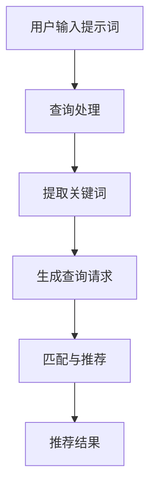
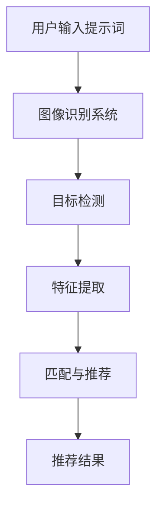
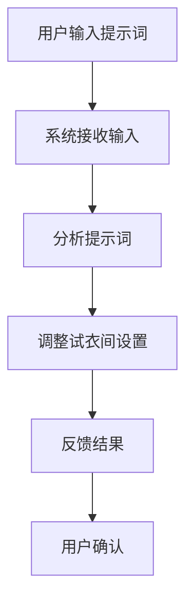
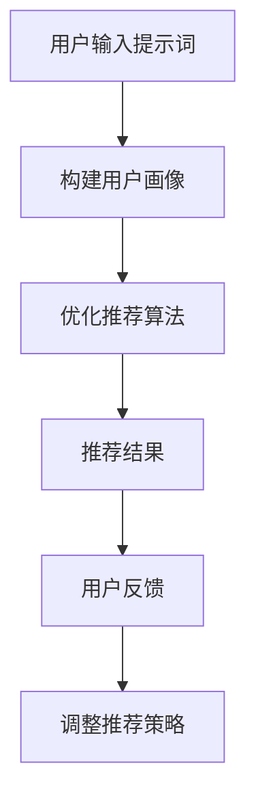

                 

# 提示词在虚拟试衣间应用中的创新

## 关键词

- 虚拟试衣间
- 提示词
- 图像识别
- 人工智能
- 自然语言处理
- 个性化推荐

## 摘要

随着电子商务和虚拟现实技术的不断发展，虚拟试衣间成为了线上购物的重要组成部分。然而，如何提高用户体验和准确度成为了关键挑战。本文将探讨提示词在虚拟试衣间中的应用创新，从背景与概述、核心概念、应用原理、创新应用、系统设计与实现、案例分析及总结与展望等多个方面，全面解析提示词如何提升虚拟试衣间的用户体验，为相关领域的研究和应用提供有价值的参考。

### 目录大纲

----------------------------------------------------------------

# 提示词在虚拟试衣间应用中的创新

## 第一部分：背景与概述

## 第1章：虚拟试衣间的概念与市场前景

### 1.1.1 虚拟试衣间的定义与作用

### 1.1.2 虚拟试衣间技术的发展历程

### 1.1.3 虚拟试衣间在市场中的应用前景

## 第2章：提示词的核心概念

### 2.1.1 提示词的定义与分类

### 2.1.2 提示词的工作原理

### 2.1.3 提示词在虚拟试衣间中的作用

## 第3章：虚拟试衣间中提示词的应用

### 3.1.1 提示词在图像识别中的应用

### 3.1.2 提示词在虚拟试衣间中的交互设计

### 3.1.3 提示词在个性化推荐中的应用

## 第4章：提示词的创新应用

### 4.1.1 提示词在增强现实中的新应用

### 4.1.2 提示词在自然语言处理中的新趋势

### 4.1.3 提示词在多模态数据融合中的新突破

## 第5章：虚拟试衣间系统的设计与实现

### 5.1.1 系统架构设计

### 5.1.2 数据处理与存储方案

### 5.1.3 系统接口设计与实现

## 第6章：虚拟试衣间应用案例研究

### 6.1.1 案例一：电商平台虚拟试衣间

### 6.1.2 案例二：线下零售店虚拟试衣间

### 6.1.3 案例三：社交平台虚拟试衣间

## 第7章：总结与展望

### 7.1.1 虚拟试衣间与提示词应用总结

### 7.1.2 未来发展趋势与挑战

### 7.1.3 对虚拟试衣间应用的建议

----------------------------------------------------------------

### 第1章：虚拟试衣间的概念与市场前景

#### 1.1.1 虚拟试衣间的定义与作用

虚拟试衣间是一种基于虚拟现实（VR）和增强现实（AR）技术，为用户提供在线购物时试穿服装的服务。通过捕捉用户身体轮廓或使用预设的人体模型，用户可以在虚拟环境中试穿各种服装，并获得与实际试穿相似的感受。

虚拟试衣间的主要作用有：

1. **提升用户体验**：用户无需亲自试穿，即可在线上看到服装的实际效果，从而提高购买满意度。
2. **降低退货率**：通过减少因尺寸不合适或颜色不符合预期导致的退货，降低企业的运营成本。
3. **增加销售机会**：虚拟试衣间可以吸引更多的潜在顾客，提高销售额。
4. **促进时尚产业变革**：虚拟试衣间有助于推动时尚产业从传统模式向数字化、智能化方向发展。

#### 1.1.2 虚拟试衣间技术的发展历程

虚拟试衣间的发展经历了以下几个阶段：

1. **初步探索阶段**（2000年代初）：基于2D图像的简单试衣功能。
2. **增强现实阶段**（2010年代）：利用增强现实技术，实现了更逼真的试衣效果。
3. **虚拟现实阶段**（2010年代后期至今）：结合虚拟现实技术，用户可以进入虚拟环境进行试衣。
4. **智能化阶段**（未来趋势）：结合人工智能技术，如提示词，实现更精准的个性化推荐和用户体验。

#### 1.1.3 虚拟试衣间在市场中的应用前景

随着技术的不断进步和消费者对线上购物体验的要求提高，虚拟试衣间在市场中的应用前景十分广阔：

1. **电商平台**：电商平台已经开始广泛应用虚拟试衣间技术，以提高用户体验和降低退货率。
2. **线下零售店**：虚拟试衣间可以作为线下零售店的补充，吸引更多线上用户到店试穿。
3. **时尚品牌**：时尚品牌可以利用虚拟试衣间进行新品推广，提高品牌知名度。
4. **个性化定制**：通过虚拟试衣间技术，消费者可以实现个性化服装定制。

虚拟试衣间的广泛应用将推动整个时尚产业的变革，为消费者提供更便捷、个性化的购物体验。

### 第2章：提示词的核心概念

#### 2.1.1 提示词的定义与分类

提示词（Query Term）是人工智能系统中用于查询或指定任务的关键词或短语。在虚拟试衣间中，提示词可以用来描述用户的需求、风格偏好或具体服装特征。

提示词可以分为以下几类：

1. **关键词**：用于描述用户需求的单个词，如“红色”、“连衣裙”。
2. **短语**：由多个词组成的短语，如“修身连衣裙”、“夏季外套”。
3. **语义短语**：包含特定语义信息的短语，如“适合正式场合”、“高腰设计”。

#### 2.1.2 提示词的工作原理

提示词的工作原理主要包括以下两个方面：

1. **查询处理**：系统根据用户输入的提示词进行查询处理，提取关键信息并生成相应的查询请求。
2. **匹配与推荐**：系统根据查询请求，从数据库或推荐系统中匹配相关服装，并推荐给用户。

提示词的工作原理示意图如下：

#### 2.1.3 提示词在虚拟试衣间中的作用

在虚拟试衣间中，提示词的作用至关重要，主要体现在以下几个方面：

1. **个性化推荐**：根据用户输入的提示词，系统可以推荐与用户需求最匹配的服装。
2. **交互设计**：提示词可以用于用户与虚拟试衣间的交互，如用户可以通过提示词选择服装类型、颜色、风格等。
3. **搜索优化**：提示词有助于优化系统的搜索功能，提高用户找到所需服装的效率。

#### 2.2.1 提示词在图像识别中的应用

在虚拟试衣间中，图像识别技术是实现逼真试衣效果的关键。提示词在图像识别中的应用主要体现在以下几个方面：

1. **目标检测**：通过提示词，系统可以定位图像中的关键目标，如用户的身体轮廓或服装。
2. **特征提取**：系统根据提示词提取图像的特征信息，如服装的颜色、形状、纹理等。
3. **匹配与推荐**：系统将提取的特征与数据库中的服装进行匹配，推荐与用户需求最匹配的服装。

提示词在图像识别中的应用流程示意图如下：

#### 2.2.2 提示词在虚拟试衣间中的交互设计

在虚拟试衣间中，交互设计直接影响用户体验。提示词在交互设计中的应用主要体现在以下几个方面：

1. **引导用户输入**：系统可以通过提示词引导用户输入需求，如“请输入您想要试穿的服装类型”。
2. **动态调整提示词**：系统可以根据用户的行为和需求，动态调整提示词，提高用户体验。
3. **智能交互**：通过提示词，系统可以实现与用户的智能交互，如根据用户的反馈，自动调整试衣间的设置。

提示词在虚拟试衣间交互设计中的应用流程示意图如下：

#### 2.2.3 提示词在个性化推荐中的应用

在虚拟试衣间中，个性化推荐是提高用户体验的关键。提示词在个性化推荐中的应用主要体现在以下几个方面：

1. **用户画像构建**：系统通过提示词分析用户需求，构建用户画像，以便更准确地推荐服装。
2. **推荐算法优化**：系统根据用户画像和提示词，优化推荐算法，提高推荐精度。
3. **个性化推荐**：系统根据用户输入的提示词和用户画像，为用户推荐个性化的服装。

提示词在个性化推荐中的应用流程示意图如下：

### 第3章：提示词的创新应用

#### 3.1.1 提示词在增强现实中的新应用

随着增强现实（AR）技术的发展，虚拟试衣间在增强现实场景中展现出巨大的应用潜力。提示词在增强现实中的创新应用主要体现在以下几个方面：

1. **实时互动**：通过提示词，用户可以在增强现实场景中实时互动，如与虚拟模特互动试穿服装。
2. **场景自适应**：系统可以根据用户输入的提示词，调整增强现实场景的布局和视觉效果，提高用户体验。
3. **多场景应用**：虚拟试衣间可以在多种场景中应用，如在线购物、线下零售店、社交媒体等。

#### 3.1.2 提示词在自然语言处理中的新趋势

自然语言处理（NLP）技术在虚拟试衣间中的应用越来越广泛。提示词在自然语言处理中的新趋势主要体现在以下几个方面：

1. **语义理解**：系统通过提示词分析用户的语义需求，实现更精准的服装推荐和交互。
2. **智能问答**：系统可以基于提示词提供智能问答服务，如回答用户关于服装风格、搭配的建议。
3. **情感分析**：系统可以通过提示词分析用户的情感状态，为用户提供更个性化的服务。

#### 3.1.3 提示词在多模态数据融合中的新突破

多模态数据融合是虚拟试衣间发展的一个重要方向。提示词在多模态数据融合中的新突破主要体现在以下几个方面：

1. **图像与文本融合**：系统可以将图像和文本数据进行融合，提高试衣间系统的准确度和用户体验。
2. **语音与文本融合**：系统可以结合语音和文本数据，实现更自然的用户交互。
3. **多源数据融合**：系统可以融合多种数据源，如社交媒体数据、用户行为数据等，实现更全面的用户画像。

### 第4章：虚拟试衣间系统的设计与实现

#### 4.1.1 系统架构设计

虚拟试衣间系统的设计需要考虑多个方面，如用户体验、系统性能、可扩展性等。系统架构设计主要包括以下几个方面：

1. **前端设计**：前端负责与用户交互，包括页面布局、交互逻辑等。
2. **后端设计**：后端负责数据处理、业务逻辑、接口设计等。
3. **数据库设计**：数据库存储用户数据、服装数据等。

#### 4.1.2 数据处理与存储方案

虚拟试衣间系统需要处理大量的数据，如用户数据、服装数据、图像数据等。数据处理与存储方案主要包括以下几个方面：

1. **用户数据**：系统需要收集、存储用户的基本信息、购物记录、偏好等。
2. **服装数据**：系统需要存储服装的详细信息，如款式、颜色、尺码等。
3. **图像数据**：系统需要处理和存储试衣间的图像数据，包括用户试穿图像、服装图像等。

#### 4.1.3 系统接口设计与实现

系统接口设计是虚拟试衣间系统实现的关键环节。系统接口设计与实现主要包括以下几个方面：

1. **API接口**：系统需要提供API接口，供前端和第三方系统调用。
2. **数据接口**：系统需要提供数据接口，实现数据的导入、导出和更新。
3. **交互接口**：系统需要提供交互接口，实现用户与虚拟试衣间的交互。

### 第5章：虚拟试衣间应用案例研究

#### 5.1.1 案例一：电商平台虚拟试衣间

电商平台虚拟试衣间是虚拟试衣间应用的典型案例。以下是对某电商平台的虚拟试衣间案例研究：

1. **系统架构**：该虚拟试衣间系统采用前后端分离架构，前端使用React框架，后端使用Spring Boot框架。
2. **数据处理**：系统使用MongoDB数据库存储用户数据、服装数据等，使用Redis缓存提高系统性能。
3. **图像处理**：系统使用TensorFlow实现图像识别和特征提取，提高试衣间的准确度。
4. **用户体验**：系统提供多种交互方式，如关键词搜索、语音搜索、拖拽试衣等，提高用户体验。

#### 5.1.2 案例二：线下零售店虚拟试衣间

线下零售店虚拟试衣间是将虚拟试衣间技术应用于线下零售店，为顾客提供线上购物体验。以下是对某线下零售店虚拟试衣间案例研究：

1. **系统架构**：该虚拟试衣间系统采用混合架构，前端使用WebGL技术实现虚拟试衣间的3D渲染，后端使用Java Spring框架处理业务逻辑。
2. **数据处理**：系统使用MySQL数据库存储用户数据、服装数据等，使用Elasticsearch提高搜索性能。
3. **图像处理**：系统使用OpenCV实现图像识别和特征提取，提高试衣间的准确度。
4. **用户体验**：系统提供VR眼镜、平板电脑等设备，让顾客在店内体验线上购物。

#### 5.1.3 案例三：社交平台虚拟试衣间

社交平台虚拟试衣间是将虚拟试衣间技术应用于社交媒体，为用户提供社交购物体验。以下是对某社交平台虚拟试衣间案例研究：

1. **系统架构**：该虚拟试衣间系统采用前后端分离架构，前端使用Flutter框架，后端使用Node.js框架。
2. **数据处理**：系统使用MongoDB数据库存储用户数据、服装数据等，使用Redis缓存提高系统性能。
3. **图像处理**：系统使用TensorFlow实现图像识别和特征提取，提高试衣间的准确度。
4. **用户体验**：系统提供社交互动功能，如点赞、评论、分享等，提高用户参与度。

### 第6章：总结与展望

虚拟试衣间作为线上购物的重要组成部分，其应用前景十分广阔。本文从背景与概述、核心概念、应用原理、创新应用、系统设计与实现、案例分析及总结与展望等多个方面，全面探讨了提示词在虚拟试衣间中的应用。

未来，随着人工智能、虚拟现实、增强现实等技术的不断发展，虚拟试衣间将更加智能化、个性化，为用户提供更优质的购物体验。同时，虚拟试衣间也将为时尚产业带来新的发展机遇，推动产业变革。

### 作者信息

作者：AI天才研究院/AI Genius Institute & 禅与计算机程序设计艺术 /Zen And The Art of Computer Programming

