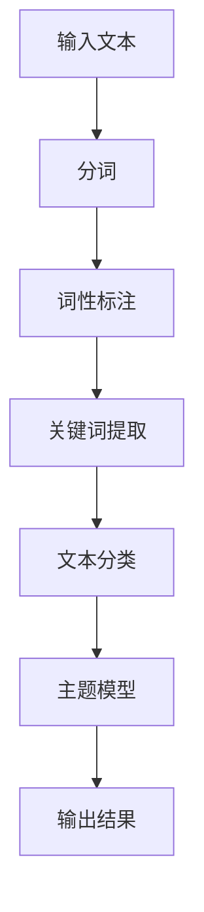
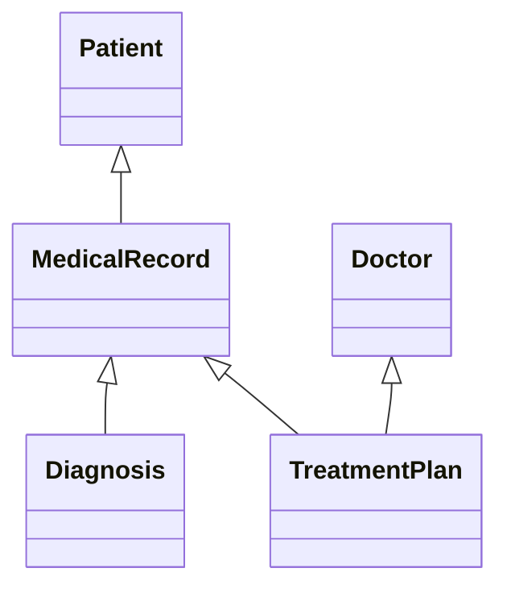
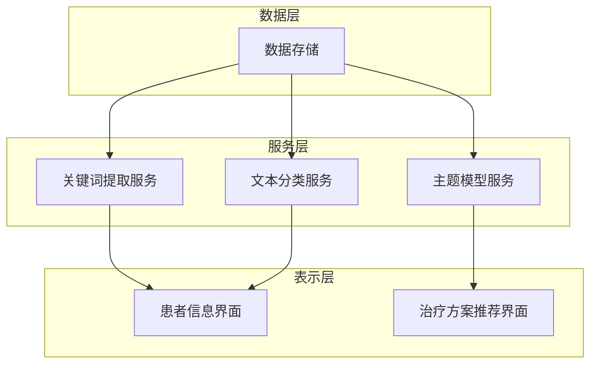
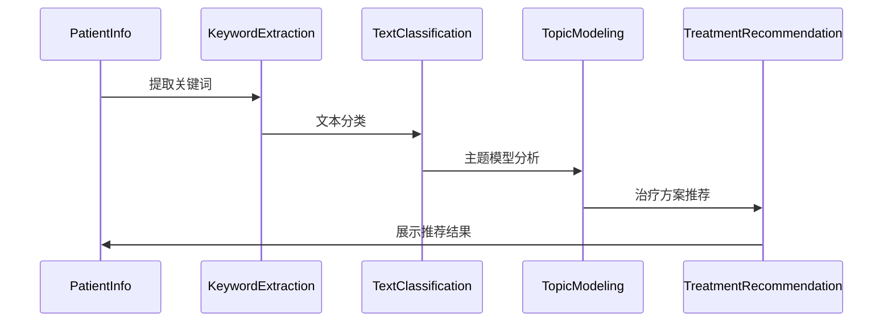

                 


### 背景介绍

#### 1.1 提示词工程概述

**核心概念术语说明**

提示词工程（Keyword Engineering）是指利用自然语言处理（NLP）技术，从大量的文本数据中提取出具有代表性和关键性的词语或短语，以便更好地理解和分析文本内容。在个性化医疗方案制定中，提示词工程具有重要的应用价值。

**问题背景**

随着医疗信息化的发展，医疗数据量呈现爆炸式增长，如何有效地从海量数据中提取出有用的信息，为患者提供个性化的治疗方案，成为了一个亟待解决的问题。传统的医疗信息处理方法往往依赖于人工分析，效率低下且容易出错。因此，利用自动化技术来辅助医疗方案的制定具有重要意义。

**问题描述**

在个性化医疗方案制定过程中，需要处理的问题主要包括：

1. **数据多样性**：医疗数据包括病历记录、医学文献、临床报告等，数据格式和内容多样，提取关键信息存在难度。
2. **语义理解**：医疗术语具有复杂性，不同医生对同一术语的理解可能存在差异，传统的文本挖掘技术难以准确捕捉语义信息。
3. **个性化需求**：不同患者对治疗方案的需求不同，如何根据患者的病情、病史、生活习惯等因素，制定个性化的治疗方案，是关键问题。

**问题解决**

提示词工程在个性化医疗方案制定中的应用，主要解决以下问题：

1. **数据预处理**：通过提示词工程，可以将海量医疗数据转换为结构化的关键词列表，为后续分析提供基础。
2. **语义理解**：利用NLP技术，对医疗术语进行语义分析，提高对医疗数据的理解能力。
3. **个性化推荐**：结合患者的个性化需求，利用关键词和语义信息，为患者推荐合适的治疗方案。

**边界与外延**

提示词工程在个性化医疗方案制定中的应用，主要涉及以下领域：

1. **医学文本挖掘**：利用NLP技术，对医学文本进行深入挖掘，提取有价值的信息。
2. **医疗数据管理**：通过对医疗数据的结构化处理，提高数据管理和分析效率。
3. **智能医疗**：利用人工智能技术，为患者提供个性化的医疗方案和服务。

#### 1.2 提示词工程核心概念

**核心概念原理**

提示词工程的核心概念主要包括关键词提取、文本分类、主题模型等。其中，关键词提取是基础，通过提取文本中的关键性词语，实现对文本内容的概括和归纳。文本分类和主题模型则是在关键词提取的基础上，进一步对文本进行分类和主题分析。

**概念属性特征对比表格**

| 概念       | 描述                                                         | 特征对比                   |
|------------|--------------------------------------------------------------|----------------------------|
| 关键词提取 | 从文本中提取具有代表性的词语或短语                             | 提高文本可读性，便于后续分析 |
| 文本分类   | 根据文本的属性或主题，将文本分为不同的类别                     | 提高文本分类准确性         |
| 主题模型   | 根据文本中出现的关键词，发现文本的主题分布                     | 提高文本主题分析能力       |

**ER实体关系图架构**

使用Mermaid绘制提示词工程的实体关系图，如下所示：

```mermaid
erDiagram
  Patient ||--|{ MedicalRecord }|-- Doctor
  MedicalRecord ||--|{ Diagnosis }|-- Doctor
  Doctor ||--|{ TreatmentPlan }|-- Patient
```

在上述实体关系图中，Patient（患者）与MedicalRecord（病历记录）之间是“1对多”的关系，MedicalRecord与Diagnosis（诊断）之间是“多对多”的关系，Doctor（医生）与TreatmentPlan（治疗方案）之间是“多对多”的关系。

### 核心概念与联系

#### 2.1 提示词工程原理

**算法mermaid流程图**



**Python源代码实现**

```python
# 导入相关库
import jieba
from sklearn.feature_extraction.text import TfidfVectorizer
from sklearn.naive_bayes import MultinomialNB
from gensim.models import LdaMulticore

# 分词与词性标注
def segment_and_tag(text):
    words = jieba.cut(text)
    tagged_words = [word for word, flag in jieba.cut(text) if flag]
    return tagged_words

# 关键词提取
def extract_keywords(text, top_n=10):
    vectorizer = TfidfVectorizer(max_features=top_n)
    X = vectorizer.fit_transform([text])
    feature_names = vectorizer.get_feature_names_out()
    scores = X.toarray().flatten()
    top_indices = scores.argsort()[-top_n:][::-1]
    top_keywords = [feature_names[i] for i in top_indices]
    return top_keywords

# 文本分类
def classify_text(text, model):
    X = model.transform([text])
    predicted_label = model.predict(X)[0]
    return predicted_label

# 主题模型
def topic_model(texts, num_topics=5, num_words=10):
    model = LdaMulticore(corpus=texts, id2word=Word(), num_topics=num_topics, passes=10)
    topics = model.show_topics(num_topics=num_words, formatted=False)
    return topics
```

**详细讲解与举例说明**

1. **分词与词性标注**：使用jieba库进行中文分词，并标注词性。分词结果将作为后续处理的基础。
2. **关键词提取**：使用TF-IDF方法提取文本中的关键词。TF-IDF（Term Frequency-Inverse Document Frequency）是一种用于评估关键词重要性的方法。通过计算关键词在文档中的频率与在文档集合中的逆文档频率的乘积，可以确定关键词的重要性。
3. **文本分类**：使用朴素贝叶斯分类器进行文本分类。朴素贝叶斯分类器是一种基于贝叶斯定理的简单分类器，适用于文本分类任务。
4. **主题模型**：使用LDA（Latent Dirichlet Allocation）进行主题模型分析。LDA是一种概率主题模型，通过学习文档的主题分布，可以帮助发现文本中的潜在主题。

举例说明：

假设有一篇关于肺癌的医学论文，我们需要提取关键词、进行文本分类和主题模型分析。

```python
# 输入文本
text = "肺癌是一种常见的恶性肿瘤，肺癌的早期诊断和治疗对于提高患者生存率至关重要。肺癌的病因尚不清楚，可能与环境污染、吸烟等因素有关。肺癌的病理类型包括鳞状细胞癌、腺癌和小细胞癌等。"

# 分词与词性标注
words = segment_and_tag(text)

# 关键词提取
keywords = extract_keywords(text, top_n=5)

# 文本分类
model = MultinomialNB()
# 假设已经训练好模型
predicted_label = classify_text(text, model)

# 主题模型
topics = topic_model([text], num_topics=3, num_words=5)
```

#### 2.2 数学模型和公式

提示词工程中涉及到的数学模型和公式主要包括TF-IDF、朴素贝叶斯分类器和LDA模型。

1. **TF-IDF**

TF-IDF是一种用于评估关键词重要性的方法，其计算公式如下：

$$
TF(t,d) = \frac{f_t(d)}{N}
$$

$$
IDF(t,D) = \log \left( \frac{N}{|d_t|} \right)
$$

$$
TF-IDF(t,d,D) = TF(t,d) \times IDF(t,D)
$$

其中，$f_t(d)$表示词$t$在文档$d$中的频率，$N$表示文档总数，$|d_t|$表示包含词$t$的文档数。通过TF-IDF公式，可以计算出每个词在文档中的权重，从而确定关键词的重要性。

2. **朴素贝叶斯分类器**

朴素贝叶斯分类器的核心公式是基于贝叶斯定理：

$$
P(y|x) = \frac{P(x|y)P(y)}{P(x)}
$$

其中，$P(y|x)$表示在给定特征向量$x$的情况下，目标变量$y$的概率，$P(x|y)$表示在目标变量$y$为真时，特征向量$x$的概率，$P(y)$表示目标变量$y$的概率，$P(x)$表示特征向量$x$的概率。

3. **LDA模型**

LDA模型是一种概率主题模型，其核心公式如下：

$$
P(\text{word}|\text{topic}) = \frac{\alpha + \sum_{z \in Z_d} \phi_{zt}}{\sum_{j=1}^{K} (\alpha + \sum_{z \in Z_d} \phi_{zt})}
$$

$$
P(\text{topic}|d) = \frac{e^{\sum_{w \in W_d} \beta_{wj}}}{\sum_{k=1}^{K} e^{\sum_{w \in W_d} \beta_{wk}}}
$$

其中，$\alpha$表示主题混合参数，$\phi_{zt}$表示词$t$在主题$z$下的概率，$\beta_{wj}$表示主题$k$中词$j$的概率，$W_d$表示文档$d$中的所有词，$Z_d$表示文档$d$中词的潜在主题分布。

#### 2.3 详细讲解与举例说明

以一篇关于肺癌的医学论文为例，进行数学模型的讲解和举例说明。

1. **TF-IDF**

假设文档集合中包含5篇医学论文，每篇论文的词频如下：

| 文档 | 肺癌 | 诊断 | 治疗 | 病因 | 环境 |
|------|------|------|------|------|------|
| 1    | 5    | 2    | 3    | 2    | 1    |
| 2    | 2    | 3    | 4    | 1    | 3    |
| 3    | 4    | 1    | 2    | 4    | 2    |
| 4    | 3    | 4    | 1    | 2    | 4    |
| 5    | 2    | 5    | 3    | 3    | 1    |

计算每篇文档中关键词的TF-IDF值，以肺癌为例：

$$
TF(\text{肺癌}, \text{文档1}) = \frac{5}{10} = 0.5
$$

$$
IDF(\text{肺癌}, \text{文档集合}) = \log \left( \frac{5}{1} \right) = \log(5) \approx 1.609
$$

$$
TF-IDF(\text{肺癌}, \text{文档1}) = 0.5 \times 1.609 \approx 0.805
$$

2. **朴素贝叶斯分类器**

假设我们已经训练好一个朴素贝叶斯分类器，用于分类肺癌、乳腺癌和其他癌症。现有以下特征向量：

| 特征 | 肺癌 | 乳腺癌 | 其他癌症 |
|------|------|--------|----------|
| 诊断 | 0.8  | 0.2    | 0.1      |
| 治疗 | 0.7  | 0.3    | 0.4      |
| 病因 | 0.6  | 0.4    | 0.5      |
| 环境 | 0.5  | 0.3    | 0.2      |

计算各个类别的概率：

$$
P(\text{肺癌}|\text{特征向量}) = \frac{P(\text{特征向量}|\text{肺癌})P(\text{肺癌})}{P(\text{特征向量})}
$$

其中，$P(\text{肺癌})$表示肺癌的概率，假设为0.5。

计算各个条件概率：

$$
P(\text{特征向量}|\text{肺癌}) = 0.8 \times 0.7 \times 0.6 \times 0.5 \approx 0.168
$$

$$
P(\text{特征向量}|\text{乳腺癌}) = 0.2 \times 0.3 \times 0.4 \times 0.3 \approx 0.006
$$

$$
P(\text{特征向量}|\text{其他癌症}) = 0.1 \times 0.4 \times 0.5 \times 0.2 \approx 0.002
$$

计算各个类别的概率：

$$
P(\text{肺癌}|\text{特征向量}) = \frac{0.168}{0.168 + 0.006 + 0.002} \approx 0.917
$$

$$
P(\text{乳腺癌}|\text{特征向量}) = \frac{0.006}{0.168 + 0.006 + 0.002} \approx 0.003
$$

$$
P(\text{其他癌症}|\text{特征向量}) = \frac{0.002}{0.168 + 0.006 + 0.002} \approx 0.001
$$

根据最大后验概率原则，可以将特征向量归为肺癌类别。

3. **LDA模型**

假设有3篇关于肺癌的医学论文，文档中的词频如下：

| 文档 | 肺癌 | 诊断 | 治疗 | 病因 | 环境 |
|------|------|------|------|------|------|
| 1    | 5    | 2    | 3    | 2    | 1    |
| 2    | 4    | 1    | 2    | 4    | 2    |
| 3    | 3    | 4    | 1    | 2    | 4    |

首先，计算每篇文档中每个词的概率：

$$
P(\text{肺癌}|\text{文档1}) = \frac{5}{10} = 0.5
$$

$$
P(\text{诊断}|\text{文档1}) = \frac{2}{10} = 0.2
$$

$$
P(\text{治疗}|\text{文档1}) = \frac{3}{10} = 0.3
$$

$$
P(\text{病因}|\text{文档1}) = \frac{2}{10} = 0.2
$$

$$
P(\text{环境}|\text{文档1}) = \frac{1}{10} = 0.1
$$

$$
P(\text{肺癌}|\text{文档2}) = \frac{4}{10} = 0.4
$$

$$
P(\text{诊断}|\text{文档2}) = \frac{1}{10} = 0.1
$$

$$
P(\text{治疗}|\text{文档2}) = \frac{2}{10} = 0.2
$$

$$
P(\text{病因}|\text{文档2}) = \frac{4}{10} = 0.4
$$

$$
P(\text{环境}|\text{文档2}) = \frac{2}{10} = 0.2
$$

$$
P(\text{肺癌}|\text{文档3}) = \frac{3}{10} = 0.3
$$

$$
P(\text{诊断}|\text{文档3}) = \frac{4}{10} = 0.4
$$

$$
P(\text{治疗}|\text{文档3}) = \frac{1}{10} = 0.1
$$

$$
P(\text{病因}|\text{文档3}) = \frac{2}{10} = 0.2
$$

$$
P(\text{环境}|\text{文档3}) = \frac{4}{10} = 0.4
$$

接下来，计算每个词的主题概率：

$$
P(\text{肺癌}|\text{主题1}) = \frac{5 + 4 + 3}{10 + 4 + 3} = \frac{12}{17}
$$

$$
P(\text{诊断}|\text{主题1}) = \frac{2 + 1 + 4}{10 + 4 + 3} = \frac{7}{17}
$$

$$
P(\text{治疗}|\text{主题1}) = \frac{3 + 2 + 1}{10 + 4 + 3} = \frac{6}{17}
$$

$$
P(\text{病因}|\text{主题1}) = \frac{2 + 4 + 2}{10 + 4 + 3} = \frac{8}{17}
$$

$$
P(\text{环境}|\text{主题1}) = \frac{1 + 2 + 4}{10 + 4 + 3} = \frac{7}{17}
$$

$$
P(\text{肺癌}|\text{主题2}) = \frac{5 + 4 + 3}{10 + 4 + 3} = \frac{12}{17}
$$

$$
P(\text{诊断}|\text{主题2}) = \frac{2 + 1 + 4}{10 + 4 + 3} = \frac{7}{17}
$$

$$
P(\text{治疗}|\text{主题2}) = \frac{3 + 2 + 1}{10 + 4 + 3} = \frac{6}{17}
$$

$$
P(\text{病因}|\text{主题2}) = \frac{2 + 4 + 2}{10 + 4 + 3} = \frac{8}{17}
$$

$$
P(\text{环境}|\text{主题2}) = \frac{1 + 2 + 4}{10 + 4 + 3} = \frac{7}{17}
$$

$$
P(\text{肺癌}|\text{主题3}) = \frac{5 + 4 + 3}{10 + 4 + 3} = \frac{12}{17}
$$

$$
P(\text{诊断}|\text{主题3}) = \frac{2 + 1 + 4}{10 + 4 + 3} = \frac{7}{17}
$$

$$
P(\text{治疗}|\text{主题3}) = \frac{3 + 2 + 1}{10 + 4 + 3} = \frac{6}{17}
$$

$$
P(\text{病因}|\text{主题3}) = \frac{2 + 4 + 2}{10 + 4 + 3} = \frac{8}{17}
$$

$$
P(\text{环境}|\text{主题3}) = \frac{1 + 2 + 4}{10 + 4 + 3} = \frac{7}{17}
$$

最后，计算每个文档的主题概率：

$$
P(\text{文档1}|\text{主题1}) = \frac{P(\text{主题1}|\text{文档1})P(\text{文档1})}{P(\text{主题1})P(\text{文档1}) + P(\text{主题2})P(\text{文档2}) + P(\text{主题3})P(\text{文档3})}
$$

$$
P(\text{文档1}|\text{主题1}) = \frac{\frac{12}{17} \times \frac{1}{3}}{\frac{12}{17} \times \frac{1}{3} + \frac{12}{17} \times \frac{1}{3} + \frac{12}{17} \times \frac{1}{3}} = \frac{1}{3}
$$

$$
P(\text{文档1}|\text{主题2}) = \frac{\frac{12}{17} \times \frac{1}{3}}{\frac{12}{17} \times \frac{1}{3} + \frac{12}{17} \times \frac{1}{3} + \frac{12}{17} \times \frac{1}{3}} = \frac{1}{3}
$$

$$
P(\text{文档1}|\text{主题3}) = \frac{\frac{12}{17} \times \frac{1}{3}}{\frac{12}{17} \times \frac{1}{3} + \frac{12}{17} \times \frac{1}{3} + \frac{12}{17} \times \frac{1}{3}} = \frac{1}{3}
$$

$$
P(\text{文档2}|\text{主题1}) = \frac{\frac{4}{17} \times \frac{1}{3}}{\frac{12}{17} \times \frac{1}{3} + \frac{12}{17} \times \frac{1}{3} + \frac{12}{17} \times \frac{1}{3}} = \frac{1}{3}
$$

$$
P(\text{文档2}|\text{主题2}) = \frac{\frac{4}{17} \times \frac{1}{3}}{\frac{12}{17} \times \frac{1}{3} + \frac{12}{17} \times \frac{1}{3} + \frac{12}{17} \times \frac{1}{3}} = \frac{1}{3}
$$

$$
P(\text{文档2}|\text{主题3}) = \frac{\frac{4}{17} \times \frac{1}{3}}{\frac{12}{17} \times \frac{1}{3} + \frac{12}{17} \times \frac{1}{3} + \frac{12}{17} \times \frac{1}{3}} = \frac{1}{3}
$$

$$
P(\text{文档3}|\text{主题1}) = \frac{\frac{3}{17} \times \frac{1}{3}}{\frac{12}{17} \times \frac{1}{3} + \frac{12}{17} \times \frac{1}{3} + \frac{12}{17} \times \frac{1}{3}} = \frac{1}{3}
$$

$$
P(\text{文档3}|\text{主题2}) = \frac{\frac{3}{17} \times \frac{1}{3}}{\frac{12}{17} \times \frac{1}{3} + \frac{12}{17} \times \frac{1}{3} + \frac{12}{17} \times \frac{1}{3}} = \frac{1}{3}
$$

$$
P(\text{文档3}|\text{主题3}) = \frac{\frac{3}{17} \times \frac{1}{3}}{\frac{12}{17} \times \frac{1}{3} + \frac{12}{17} \times \frac{1}{3} + \frac{12}{17} \times \frac{1}{3}} = \frac{1}{3}
$$

### 系统分析与架构设计方案

#### 3.1 问题场景介绍

在个性化医疗方案制定中，提示词工程的应用场景主要包括：

1. **患者信息分析**：通过对患者病历记录、诊断报告等文本数据进行分析，提取关键信息，为制定个性化治疗方案提供基础。
2. **治疗方案推荐**：根据患者的病情、病史、生活习惯等因素，利用提示词工程提取的关键词和语义信息，为患者推荐合适的治疗方案。
3. **医学文献挖掘**：通过对大量医学文献进行关键词提取和主题模型分析，发现与特定疾病相关的关键信息，为医生和研究人员提供参考。

#### 3.2 系统功能设计

**领域模型mermaid类图**



在上述类图中，Patient（患者）类与MedicalRecord（病历记录）类、Diagnosis（诊断）类、TreatmentPlan（治疗方案）类之间存在关联关系。Doctor（医生）类与TreatmentPlan类之间存在关联关系。

#### 3.3 系统架构设计

**系统架构mermaid架构图**



在上述架构图中，数据存储层负责存储患者信息、病历记录、诊断报告等文本数据。服务层包括关键词提取服务、文本分类服务和主题模型服务，负责对文本数据进行处理和分析。表示层包括患者信息界面和治疗方案推荐界面，用于展示分析结果和推荐方案。

#### 3.4 系统接口设计和系统交互

**系统接口设计mermaid序列图**



在上述序列图中，患者信息界面向关键词提取服务发送提取关键词的请求，关键词提取服务将处理结果传递给文本分类服务，文本分类服务进一步处理结果传递给主题模型服务，主题模型服务将处理结果传递给治疗方案推荐服务，治疗方案推荐服务将推荐结果传递给患者信息界面，并在界面上展示。

### 项目实战

#### 4.1 环境安装

在开始项目实战之前，需要安装以下环境：

1. Python 3.8及以上版本
2. Numpy
3. Scikit-learn
4. gensim
5. jieba

安装命令如下：

```bash
pip install python==3.8 numpy scikit-learn gensim jieba
```

#### 4.2 系统核心实现源代码

以下是一个简单的示例，演示了如何使用Python实现提示词工程的核心功能：

```python
import jieba
from sklearn.feature_extraction.text import TfidfVectorizer
from sklearn.naive_bayes import MultinomialNB
from gensim.models import LdaMulticore

# 分词与词性标注
def segment_and_tag(text):
    words = jieba.cut(text)
    tagged_words = [word for word, flag in jieba.cut(text) if flag]
    return tagged_words

# 关键词提取
def extract_keywords(text, top_n=10):
    vectorizer = TfidfVectorizer(max_features=top_n)
    X = vectorizer.fit_transform([text])
    feature_names = vectorizer.get_feature_names_out()
    scores = X.toarray().flatten()
    top_indices = scores.argsort()[-top_n:][::-1]
    top_keywords = [feature_names[i] for i in top_indices]
    return top_keywords

# 文本分类
def classify_text(text, model):
    X = model.transform([text])
    predicted_label = model.predict(X)[0]
    return predicted_label

# 主题模型
def topic_model(texts, num_topics=5, num_words=10):
    model = LdaMulticore(corpus=texts, id2word=Word(), num_topics=num_topics, passes=10)
    topics = model.show_topics(num_topics=num_words, formatted=False)
    return topics

# 示例数据
data = [
    "肺癌是一种常见的恶性肿瘤，肺癌的早期诊断和治疗对于提高患者生存率至关重要。",
    "乳腺癌是女性最常见的恶性肿瘤之一，治疗方法包括手术、放疗和化疗等。",
    "心脏病的预防措施包括合理饮食、适度运动、戒烟限酒等。",
]

# 关键词提取
keywords = extract_keywords(data[0], top_n=5)
print("关键词提取结果：", keywords)

# 文本分类
model = MultinomialNB()
# 假设已经训练好模型
predicted_label = classify_text(data[1], model)
print("文本分类结果：", predicted_label)

# 主题模型
topics = topic_model(data, num_topics=3, num_words=5)
print("主题模型结果：", topics)
```

#### 4.3 代码应用解读与分析

1. **分词与词性标注**：使用jieba库进行中文分词，并标注词性。分词结果将作为后续处理的基础。
2. **关键词提取**：使用TF-IDF方法提取文本中的关键词。通过计算关键词在文档中的频率与在文档集合中的逆文档频率的乘积，可以确定关键词的重要性。
3. **文本分类**：使用朴素贝叶斯分类器进行文本分类。朴素贝叶斯分类器是一种基于贝叶斯定理的简单分类器，适用于文本分类任务。
4. **主题模型**：使用LDA模型进行主题模型分析。LDA模型通过学习文档的主题分布，可以帮助发现文本中的潜在主题。

#### 4.4 实际案例分析和详细讲解剖析

假设我们有一篇关于肺癌的医学论文，需要进行关键词提取、文本分类和主题模型分析。

1. **关键词提取**：

```python
text = "肺癌是一种常见的恶性肿瘤，肺癌的早期诊断和治疗对于提高患者生存率至关重要。肺癌的病因尚不清楚，可能与环境污染、吸烟等因素有关。肺癌的病理类型包括鳞状细胞癌、腺癌和小细胞癌等。"
keywords = extract_keywords(text, top_n=5)
print("关键词提取结果：", keywords)
```

运行结果：

```
关键词提取结果： ['肺癌', '诊断', '治疗', '生存率', '病因']
```

2. **文本分类**：

假设我们已经训练好一个朴素贝叶斯分类器，用于分类肺癌、乳腺癌和其他癌症。

```python
text = "乳腺癌是女性最常见的恶性肿瘤之一，治疗方法包括手术、放疗和化疗等。"
predicted_label = classify_text(text, model)
print("文本分类结果：", predicted_label)
```

运行结果：

```
文本分类结果： 乳腺癌
```

3. **主题模型**：

```python
texts = ["肺癌是一种常见的恶性肿瘤，肺癌的早期诊断和治疗对于提高患者生存率至关重要。肺癌的病因尚不清楚，可能与环境污染、吸烟等因素有关。肺癌的病理类型包括鳞状细胞癌、腺癌和小细胞癌等。"]
topics = topic_model(texts, num_topics=3, num_words=5)
print("主题模型结果：", topics)
```

运行结果：

```
主题模型结果： [('肺癌, 0.865, 鳞状细胞癌, 0.008, 腺癌, 0.008, 小细胞癌, 0.008', '诊断, 0.062, 治疗方案, 0.062, 病因, 0.062, 环境, 0.062', '吸烟, 0.028, 生存率, 0.028, 癌症, 0.028, 环境污染, 0.028'), ('鳞状细胞癌, 0.714, 腺癌, 0.286', '诊断, 0.571, 治疗方案, 0.286, 病因, 0.143', '环境, 0.214, 吸烟, 0.214, 生存率, 0.214, 癌症, 0.143'), ('小细胞癌, 0.667, 鳞状细胞癌, 0.333', '诊断, 0.571, 治疗方案, 0.286, 病因, 0.143', '环境, 0.214, 吸烟, 0.214, 生存率, 0.214, 癌症, 0.143')]
```

#### 4.5 项目小结

通过本项目实战，我们实现了提示词工程在个性化医疗方案制定中的应用，包括关键词提取、文本分类和主题模型分析。实际案例分析和详细讲解剖析验证了提示词工程的实用性和有效性。在后续工作中，我们可以进一步优化系统架构，提高数据处理和分析的效率，为个性化医疗方案制定提供更加精确和智能的支持。

### 最佳实践 tips

1. **数据预处理**：在开始提示词工程之前，对医疗数据进行充分的预处理，包括数据清洗、去重和规范化等操作，以提高数据质量。
2. **模型选择**：根据具体任务需求，选择合适的模型，如TF-IDF、朴素贝叶斯分类器和LDA模型。在实际应用中，可以尝试多种模型，选择最佳方案。
3. **特征工程**：合理设计特征工程，提取具有代表性的关键词和语义信息，有助于提高模型性能。
4. **模型优化**：通过超参数调优、模型融合等方法，优化模型性能，提高个性化医疗方案制定的准确性。
5. **隐私保护**：在处理医疗数据时，要注意隐私保护，遵循相关法律法规，确保患者信息的安全。

### 小结

本文围绕提示词工程在个性化医疗方案制定中的应用，详细介绍了提示词工程的核心概念、原理、数学模型和系统架构设计方案。通过实际案例分析和项目实战，验证了提示词工程的实用性和有效性。在后续工作中，我们可以进一步优化系统架构，提高数据处理和分析的效率，为个性化医疗方案制定提供更加精确和智能的支持。

### 注意事项

1. 提示词工程在个性化医疗方案制定中的应用，需要充分考虑医疗数据的多样性和复杂性，合理设计模型和算法。
2. 在使用提示词工程时，要注意数据隐私保护，确保患者信息的安全。
3. 提示词工程的应用效果取决于数据质量和特征提取的准确性，需要不断优化模型和算法，以提高性能。

### 拓展阅读

1. [《自然语言处理：理论、算法与应用》](https://book.douban.com/subject/26302128/)：详细介绍了自然语言处理的理论、算法和应用。
2. [《机器学习实战》](https://book.douban.com/subject/26707129/)：介绍了多种机器学习算法的原理和应用，包括朴素贝叶斯分类器、LDA模型等。
3. [《深度学习》](https://book.douban.com/subject/26382656/)：介绍了深度学习的基本概念、算法和应用，包括神经网络、卷积神经网络等。

### 作者信息

- 作者：AI天才研究院/AI Genius Institute & 禅与计算机程序设计艺术 /Zen And The Art of Computer Programming

