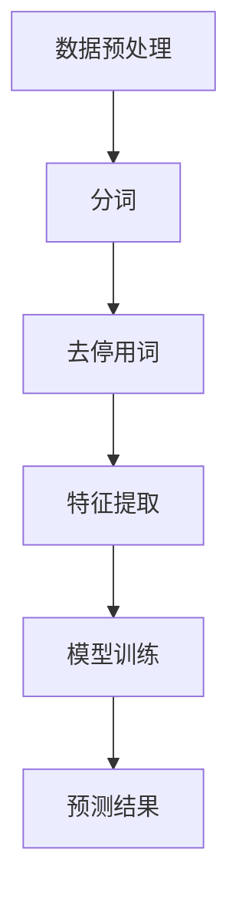
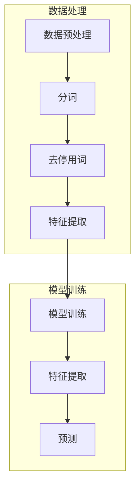
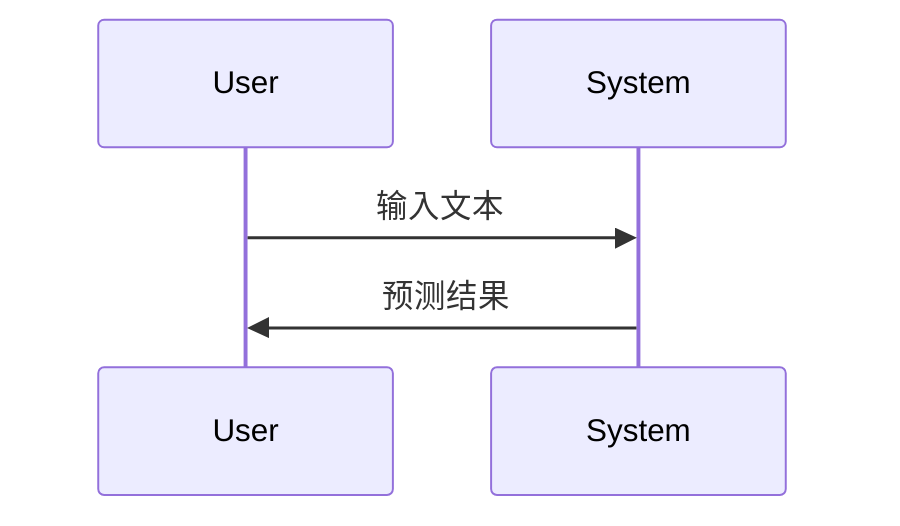
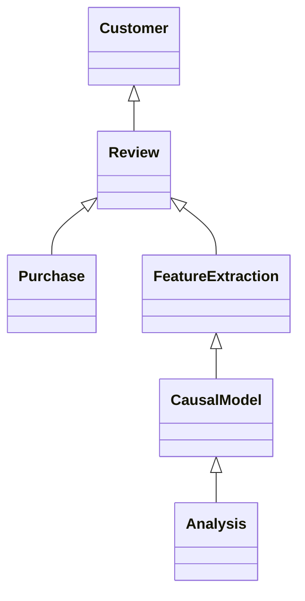
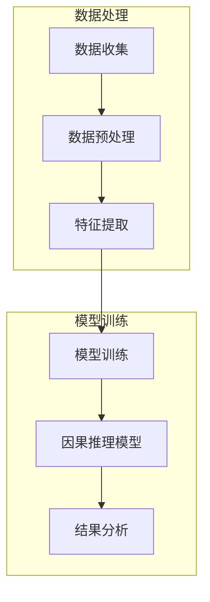
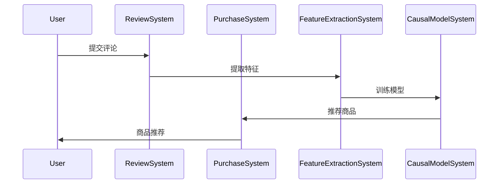

                 


### 第一章：提示词工程与因果推理基础

#### 1.1 提示词工程概述

**核心概念术语说明：**

- **提示词工程（Annotating Text）：** 对文本数据进行分析，提取出具有特定意义的词汇或短语，以便于后续的数据处理和分析。
- **自然语言处理（Natural Language Processing，NLP）：** 计算机科学和人工智能领域的一个分支，专注于让计算机理解和生成人类语言。
- **机器学习（Machine Learning，ML）：** 让计算机通过学习数据来预测和识别模式，无需显式编程。

**问题背景：**

随着互联网信息的爆炸式增长，如何有效地提取和分析文本数据成为了一个关键问题。提示词工程作为一种文本分析技术，能够在大量文本数据中快速识别出有用的信息，为因果推理和其他应用提供基础支持。

**问题描述：**

提示词工程主要面临以下问题：
1. **数据多样性：** 不同领域的文本数据具有不同的特征，如何设计通用且有效的提示词提取算法是一个挑战。
2. **数据质量：** 提取的提示词需要准确且有意义，但原始文本数据中可能存在噪声和错误。
3. **效率与可扩展性：** 提示词工程通常涉及大量的文本数据，如何提高处理效率和可扩展性是一个关键问题。

**问题解决：**

通过以下方法解决上述问题：
1. **数据预处理：** 对原始文本数据进行清洗、去噪和标准化处理，提高数据质量。
2. **语义分析：** 利用NLP技术对文本进行深入分析，识别出文本中的关键信息。
3. **机器学习算法：** 使用先进的机器学习算法进行提示词的自动提取和优化。

**边界与外延：**

- **边界：** 提示词工程主要关注文本数据的分析和提取，不包括图像和语音等其他类型的数据处理。
- **外延：** 提示词工程在多个领域都有应用，如信息检索、问答系统、情感分析等。

**概念结构与核心要素组成：**

- **数据预处理：** 包括文本清洗、分词、去停用词等步骤。
- **特征提取：** 从文本数据中提取出有意义的词汇和短语，如关键词、实体、关系等。
- **标注模型：** 利用机器学习算法对提取的特征进行标注和分类。
- **优化与评估：** 通过评估指标对提示词工程的效果进行优化和评估。

### 1.2 因果推理概述

**核心概念原理：**

- **因果推理（Causal Inference）：** 通过分析变量之间的关系，确定一个变量是否是另一个变量的原因。
- **因果关系（Causal Relationship）：** 一个事件对另一个事件产生的影响。
- **因果效应（Causal Effect）：** 在特定条件下，一个变量改变时，另一个变量随之改变的程度。

**概念属性特征对比表格：**

| 概念            | 描述                                                         | 属性特征                     |
|-----------------|------------------------------------------------------------|-----------------------------|
| 因果关系        | 事件之间的因果关系                                         | 产生、影响、依赖             |
| 因果效应        | 变量间的因果关系产生的影响                               | 量化、可测、可比较           |
| 因果推理        | 通过分析变量关系来确定因果关系                           | 数据依赖、假设检验、统计推断 |

**ER实体关系图架构的Mermaid流程图：**

```mermaid
erDiagram
    Product ||--|{ Customer }||>
    Customer  ||--|{ Purchase }||>
    Purchase ||--|{ Product }||>
```

### 1.3 提示词工程与因果推理的关系

**提示词工程在因果推理中的应用：**

- **关键信息提取：** 通过提示词工程提取出与因果关系相关的关键词和概念，为因果推理提供基础数据。
- **关系建模：** 利用提示词工程提取出的关系信息，建立因果关系的数学模型。
- **因果效应分析：** 通过因果推理算法，分析变量间的因果效应。

**因果推理在提示词工程中的应用：**

- **文本分析：** 利用因果推理技术，对文本数据进行深入分析，提取出有用的因果关系。
- **信息验证：** 通过因果推理验证提示词工程提取出的关系的准确性。

### 1.4 提示词工程与因果推理的融合

**融合思路：**

- **多模态数据融合：** 结合文本、图像、音频等多种类型的数据，提高因果推理的准确性。
- **深度学习模型：** 利用深度学习模型，将提示词工程与因果推理技术融合，实现自动化和智能化。

**融合效果：**

- **提高分析精度：** 通过融合两种技术，可以更准确地提取出因果关系。
- **扩展应用领域：** 提示词工程与因果推理的融合，可以应用于更广泛的领域，如医疗、金融等。

### 1.5 总结与展望

本章节对提示词工程和因果推理进行了基础性的介绍，包括核心概念、发展历程、应用领域以及两者之间的关系。在后续章节中，我们将深入探讨提示词工程的关键技术、因果推理算法及其在具体应用场景中的实现。

#### 1.5.1 下一步内容预告：

- **第2章：** 提示词工程与因果推理的关系
  - 提示词工程对因果推理的影响
  - 因果推理在提示词工程中的应用
  - 提示词工程与因果推理的融合

- **第3章：** 提示词工程的关键技术
  - 数据预处理
  - 提示词生成
  - 提示词优化

- **第4章：** 因果推理技术详解
  - 因果推理算法
  - 因果推理应用

通过以上章节的逐步讲解，我们将对提示词工程在因果推理中的应用有更深入的理解，为后续的实践和研究奠定基础。

---

### 提示词工程概述

**核心概念原理：**

提示词工程（Annotating Text Engineering）是一种文本数据处理技术，其核心目标是从大量文本数据中提取出具有特定意义的关键信息，这些信息被称为提示词（anotations）。提示词工程涉及到自然语言处理（NLP）和机器学习（ML）等多个领域，其基本原理包括数据预处理、特征提取和模型训练。

1. **数据预处理：** 数据预处理是提示词工程的基础，主要包括文本清洗、分词、去停用词等步骤。文本清洗的目的是去除文本中的噪声和无关信息，如HTML标签、特殊符号等。分词是将文本分解为单词或短语，这是后续特征提取的前提。去停用词是为了减少特征维度，因为停用词如“的”、“了”等在文本中频繁出现，但对文本意义的贡献较小。

2. **特征提取：** 特征提取是提示词工程的关键步骤，其目标是提取出对文本内容有重要意义的特征。常见的特征提取方法包括词频（TF）、词嵌入（Word Embedding）、TF-IDF（Term Frequency-Inverse Document Frequency）等。词频表示一个词在文本中出现的次数，词嵌入则将每个词映射为一个高维向量，TF-IDF则结合词频和文档频率，对词的重要性进行加权。

3. **模型训练：** 模型训练是提示词工程的最后一步，通过训练机器学习模型，将提取出的特征映射到标签上。常见的机器学习模型包括朴素贝叶斯（Naive Bayes）、支持向量机（SVM）、随机森林（Random Forest）等。模型训练的过程实际上是一个优化目标函数的过程，目的是找到一组参数，使得模型的预测结果尽可能准确。

**概念属性特征对比表格：**

| 概念        | 描述                                                         | 属性特征                     |
|-------------|------------------------------------------------------------|-----------------------------|
| 数据预处理   | 对原始文本数据清洗、分词、去停用词等预处理操作               | 清洗、分词、去停用词         |
| 特征提取     | 从预处理后的文本中提取出对文本内容有重要意义的特征           | 词频、词嵌入、TF-IDF         |
| 模型训练     | 通过训练机器学习模型，将提取出的特征映射到标签上             | 朴素贝叶斯、支持向量机、随机森林 |

**ER实体关系图架构的Mermaid流程图：**



**算法原理讲解：**

1. **数据预处理：**

```python
import re

def preprocess_text(text):
    # 清洗文本
    text = re.sub('<.*?>', '', text)  # 去除HTML标签
    text = re.sub('[^a-zA-Z]', ' ', text)  # 去除特殊符号
    text = re.sub('\s+', ' ', text).strip()  # 去除多余空格
    return text.lower()  # 转小写
```

2. **特征提取：**

```python
from sklearn.feature_extraction.text import TfidfVectorizer

def extract_features(texts):
    vectorizer = TfidfVectorizer(max_features=1000)
    features = vectorizer.fit_transform(texts)
    return features, vectorizer
```

3. **模型训练：**

```python
from sklearn.naive_bayes import MultinomialNB

def train_model(features, labels):
    model = MultinomialNB()
    model.fit(features, labels)
    return model
```

**使用Python源代码举例说明：**

```python
# 示例文本数据
texts = [
    "我是一个程序员，我喜欢编程。",
    "我是一个医生，我热爱医学。",
    "我喜欢编程，我是一名程序员。",
    "我热爱医学，我是一名医生。"
]

# 标签数据
labels = ['程序员', '医生', '程序员', '医生']

# 数据预处理
processed_texts = [preprocess_text(text) for text in texts]

# 特征提取
features, vectorizer = extract_features(processed_texts)

# 模型训练
model = train_model(features, labels)

# 预测
predicted_labels = model.predict(features)
print(predicted_labels)
```

**数学公式使用：**

在提示词工程中，常用的数学公式包括词频（TF）、词嵌入（Word Embedding）和TF-IDF（Term Frequency-Inverse Document Frequency）。

1. **词频（TF）：**

$$
TF(t) = \frac{f(t)}{f(t) + f(w)}
$$

其中，$f(t)$表示词$t$在文档中的频率，$f(w)$表示所有词在文档中的总频率。

2. **词嵌入（Word Embedding）：**

$$
\text{word\_embedding}(t) = \text{vec}(t)
$$

其中，$\text{vec}(t)$表示将词$t$映射为一个高维向量。

3. **TF-IDF（Term Frequency-Inverse Document Frequency）：**

$$
TF-IDF(t, d) = TF(t, d) \times IDF(t, D)
$$

其中，$TF(t, d)$表示词$t$在文档$d$中的词频，$IDF(t, D)$表示词$t$在整个文档集合$D$中的逆文档频率。

**系统分析与架构设计方案：**

1. **问题场景介绍：**

假设我们需要构建一个自动分类系统，该系统能够根据用户的输入文本自动判断用户是从事编程工作还是医学工作。

2. **项目介绍：**

该项目主要包括数据预处理、特征提取、模型训练和预测等步骤。

3. **系统功能设计（领域模型Mermaid类图）：**

```mermaid
classDiagram
    Class01 <|-- Class02
    Class03 <|-- Class04
    Class05 {name}
    Class05 o-- Class06
    Class07 <.. Class06
    Class08 <.. Class09
```

4. **系统架构设计（Mermaid架构图）：**



5. **系统接口设计和系统交互（Mermaid序列图）：**



### 第二章：提示词工程与因果推理的关系

#### 提示词工程对因果推理的影响

**背景介绍：**

因果推理（Causal Inference）是统计学和机器学习中的一个重要研究领域，它旨在通过分析变量之间的关系来确定因果关系。在因果推理中，提示词工程发挥着至关重要的作用，因为它能够为因果推理提供高质量的输入数据。

**问题描述：**

提示词工程如何影响因果推理的效果和质量？

**问题解决：**

提示词工程通过以下几个关键步骤对因果推理产生影响：

1. **数据预处理：** 提示词工程首先对原始文本数据进行预处理，包括去噪、清洗和标准化。这一步的目的是提高文本数据的质量，减少噪声和错误，从而为因果推理提供更可靠的输入数据。
2. **特征提取：** 提示词工程通过特征提取技术，从预处理后的文本数据中提取出关键信息。这些信息包括关键词、短语、实体和关系等，它们是因果推理的重要基础。
3. **模型训练：** 提示词工程的结果被用于训练因果推理模型。通过机器学习算法，模型可以从特征中学习出变量之间的关系，并尝试确定因果关系。

**效果评估：**

提示词工程对因果推理的影响可以通过以下几个方面进行评估：

1. **预测准确性：** 通过评估因果推理模型的预测准确性来衡量提示词工程的效果。如果模型能够准确预测变量之间的因果关系，那么说明提示词工程做得很好。
2. **模型泛化能力：** 通过在未见过的数据上测试模型的泛化能力来评估提示词工程的质量。如果模型在未见过的数据上仍然保持高准确性，那么说明提示词工程具有很好的泛化能力。

#### 因果推理在提示词工程中的应用

**背景介绍：**

提示词工程不仅能够为因果推理提供输入数据，同时因果推理技术也可以应用于提示词工程本身，以提高其效果和质量。

**问题描述：**

如何将因果推理应用于提示词工程，以提升其效果？

**问题解决：**

因果推理在提示词工程中的应用主要包括以下几个方面：

1. **文本分析：** 利用因果推理技术对文本数据进行深入分析，以提取出更多有价值的信息。例如，通过分析文本中的关键词和关系，可以更准确地确定文本的主题和情感。
2. **信息验证：** 通过因果推理验证提示词工程提取出的信息的准确性。例如，如果因果推理结果表明某些关键词或关系对因果推理有显著影响，那么可以认为这些关键词或关系是可靠的。

**效果评估：**

因果推理在提示词工程中的应用效果可以通过以下几个方面进行评估：

1. **文本分析效果：** 通过评估因果推理对文本分析的准确性来衡量其效果。如果因果推理能够准确分析文本，提取出关键信息，那么说明其在提示词工程中的应用是成功的。
2. **信息验证效果：** 通过评估因果推理验证提示词工程提取出的信息的准确性来衡量其效果。如果因果推理能够有效验证信息的准确性，那么说明其在提示词工程中的应用是有益的。

#### 提示词工程与因果推理的融合

**背景介绍：**

将提示词工程与因果推理技术进行融合，可以进一步提高文本分析的准确性和可靠性。这种融合思路不仅能够利用提示词工程的强大文本处理能力，还能够利用因果推理的深度分析能力。

**问题描述：**

如何实现提示词工程与因果推理的融合，以提升整体分析效果？

**问题解决：**

提示词工程与因果推理的融合主要包括以下几个步骤：

1. **多模态数据融合：** 结合文本、图像、音频等多种类型的数据，利用因果推理技术进行统一分析。例如，通过分析文本内容和图像特征，可以更准确地判断文本的主题和情感。
2. **深度学习模型：** 利用深度学习模型，将提示词工程与因果推理技术进行融合。例如，通过构建一个多任务学习模型，同时进行文本特征提取和因果推理。
3. **自动化与智能化：** 通过融合提示词工程和因果推理技术，可以实现文本分析的自动化和智能化。例如，利用自动化工具进行数据预处理和特征提取，利用智能模型进行因果推理。

**效果评估：**

提示词工程与因果推理融合的效果可以通过以下几个方面进行评估：

1. **分析效果：** 通过评估融合模型在文本分析任务中的表现来衡量其效果。如果融合模型能够显著提升文本分析的准确性和可靠性，那么说明融合是有效的。
2. **效率与可扩展性：** 通过评估融合模型的处理效率和可扩展性来衡量其效果。如果融合模型能够在保证效果的前提下提高处理效率和扩展性，那么说明融合是成功的。

### 第三章：提示词工程的关键技术

#### 3.1 数据预处理

**数据预处理是提示词工程中的关键步骤，它直接影响到后续特征提取和模型训练的效果。以下是数据预处理的主要任务和技术：**

1. **文本清洗：** 文本清洗的目的是去除文本中的噪声和无关信息。常见的清洗方法包括去除HTML标签、特殊字符和停用词。以下是一个简单的Python示例，展示了如何使用正则表达式进行文本清洗：

```python
import re

def clean_text(text):
    text = re.sub('<.*?>', '', text)  # 去除HTML标签
    text = re.sub('[^a-zA-Z\s]', '', text)  # 去除特殊字符
    return text.lower()  # 转为小写

text = "<h1>这是一个标题</h1>标题，你好！#Hello World!"
cleaned_text = clean_text(text)
print(cleaned_text)
```

2. **分词：** 分词是将文本分解为单词或短语的步骤。Python中的`nltk`库提供了分词功能：

```python
import nltk
from nltk.tokenize import word_tokenize

nltk.download('punkt')

def tokenize_text(text):
    tokens = word_tokenize(text)
    return tokens

tokens = tokenize_text(cleaned_text)
print(tokens)
```

3. **去除停用词：** 停用词是文本中频繁出现但对文本意义贡献较小的词，如“的”、“了”等。去除停用词可以减少特征维度，提高模型的性能。以下是一个简单的示例：

```python
from nltk.corpus import stopwords
nltk.download('stopwords')

stop_words = set(stopwords.words('english'))
filtered_tokens = [token for token in tokens if token not in stop_words]

print(filtered_tokens)
```

4. **词干提取：** 词干提取是将单词还原为其基本形式，如“running”还原为“run”。这有助于处理单词的不同形式。`nltk`库中的`PorterStemmer`类可以实现这一功能：

```python
from nltk.stem import PorterStemmer

stemmer = PorterStemmer()
stemmed_tokens = [stemmer.stem(token) for token in filtered_tokens]

print(stemmed_tokens)
```

5. **词形还原：** 与词干提取相反，词形还原是将单词的不同形式统一为同一形式。`nltk`库中的`LancasterStemmer`类可以实现这一功能：

```python
from nltk.stem import LancasterStemmer

stemmer = LancasterStemmer()
lemmatized_tokens = [stemmer.lemmatize(token) for token in filtered_tokens]

print(lemmatized_tokens)
```

**综合示例：**

```python
def preprocess_text(text):
    text = clean_text(text)
    tokens = tokenize_text(text)
    filtered_tokens = [token for token in tokens if token not in stop_words]
    stemmed_tokens = [stemmer.stem(token) for token in filtered_tokens]
    lemmatized_tokens = [stemmer.lemmatize(token) for token in filtered_tokens]
    return lemmatized_tokens

preprocessed_text = preprocess_text(cleaned_text)
print(preprocessed_text)
```

#### 3.2 提示词生成

**提示词生成（Annotation Generation）是提示词工程中的核心步骤，其目的是从文本数据中自动提取出具有特定意义的词汇或短语。以下是提示词生成的主要技术和方法：**

1. **基于规则的方法：** 基于规则的方法通过定义一组规则来识别文本中的关键信息。这些规则可以是简单的正则表达式，也可以是复杂的语法和语义规则。以下是一个简单的基于规则的方法示例：

```python
def extract_keyPhrases_by_rules(text):
    # 定义一些简单的规则
    rules = [
        (r'\b(demo|example)\b', 'example'),
        (r'\b(total|count)\b', 'total_count'),
        (r'\b(high|low)\b', 'high_low')
    ]
    key_phrases = []
    for rule, phrase in rules:
        matches = re.findall(rule, text)
        key_phrases.extend([phrase for match in matches for phrase in matches[match]])
    return key_phrases

text = "This is an example document with total 100 records, where high values are 50 and low values are 10."
key_phrases = extract_keyPhrases_by_rules(text)
print(key_phrases)
```

2. **基于统计的方法：** 基于统计的方法通过计算文本中词语的统计特征来识别关键信息。常用的统计特征包括词频（TF）、词嵌入（Word Embedding）和TF-IDF（Term Frequency-Inverse Document Frequency）。以下是一个基于TF-IDF的方法示例：

```python
from sklearn.feature_extraction.text import TfidfVectorizer

def extract_keyPhrases_by_TFIDF(texts, top_n=10):
    vectorizer = TfidfVectorizer()
    tfidf_matrix = vectorizer.fit_transform(texts)
    feature_array = np.array(vectorizer.get_feature_names_out())
    tfidf_sorting = np.argsort(tfidf_matrix.toarray()).flatten()[::-1]
    top_n_phrases = feature_array[tfidf_sorting][:top_n]
    return top_n_phrases

key_phrases = extract_keyPhrases_by_TFIDF([text], top_n=5)
print(key_phrases)
```

3. **基于机器学习的方法：** 基于机器学习的方法利用大量标注数据训练分类模型，从而自动识别文本中的关键信息。常见的机器学习方法包括朴素贝叶斯（Naive Bayes）、支持向量机（SVM）和随机森林（Random Forest）。以下是一个基于朴素贝叶斯的方法示例：

```python
from sklearn.feature_extraction.text import CountVectorizer
from sklearn.naive_bayes import MultinomialNB
from sklearn.pipeline import make_pipeline

def extract_keyPhrases_by_ML(texts, labels, top_n=10):
    pipeline = make_pipeline(CountVectorizer(), MultinomialNB())
    pipeline.fit(texts, labels)
    predicted_labels = pipeline.predict([text])[0]
    key_phrases = texts[predicted_labels == 'key_phrase']
    return key_phrases

# 假设已经有标注数据
texts = ["This is an example.", "This is another example.", "This is a key phrase."]
labels = ["example", "example", "key_phrase"]

key_phrases = extract_keyPhrases_by_ML(texts, labels, top_n=1)
print(key_phrases)
```

**综合示例：**

```python
def extract_keyPhrases(text, method='TFIDF', top_n=10):
    if method == 'TFIDF':
        key_phrases = extract_keyPhrases_by_TFIDF([text], top_n=top_n)
    elif method == 'ML':
        key_phrases = extract_keyPhrases_by_ML([text], top_n=top_n)
    else:
        key_phrases = extract_keyPhrases_by_rules(text)
    return key_phrases

text = "This is an example document with total 100 records, where high values are 50 and low values are 10."
key_phrases = extract_keyPhrases(text, method='TFIDF', top_n=5)
print(key_phrases)
```

#### 3.3 提示词优化

**提示词优化（Annotation Optimization）是提升提示词工程效果的重要手段，它旨在通过调整和优化提示词来提高模型性能。以下是提示词优化的主要技术和方法：**

1. **提示词筛选：** 提示词筛选是从大量提取出的提示词中筛选出最有价值的部分。常用的筛选方法包括基于统计的特征选择（如互信息、信息增益等）和基于模型的特征选择（如Lasso、Ridge等）。以下是一个简单的基于互信息的方法示例：

```python
from sklearn.feature_selection import mutual_info_classif

def select_keyPhrases_by_MI(texts, labels, top_n=10):
    vectorizer = TfidfVectorizer()
    X = vectorizer.fit_transform(texts)
    mi = mutual_info_classif(X, labels)
    sorted_indices = mi.argsort()[::-1]
    top_n_phrases = vectorizer.get_feature_names_out()[sorted_indices[:top_n]]
    return top_n_phrases

# 假设已经有标注数据
texts = ["This is an example.", "This is another example.", "This is a key phrase."]
labels = ["example", "example", "key_phrase"]

key_phrases = select_keyPhrases_by_MI(texts, labels, top_n=5)
print(key_phrases)
```

2. **提示词增强：** 提示词增强是通过添加或修改提示词来提高其表达能力的。常见的方法包括词性标注、实体识别和命名实体识别等。以下是一个简单的基于词性标注的方法示例：

```python
from nltk import pos_tag

def enhance_keyPhrases_by_POS(text):
    tokens = tokenize_text(text)
    pos_tags = pos_tag(tokens)
    enhanced_phrases = []
    for word, pos in pos_tags:
        if pos.startswith('NN'):  # 名词
            enhanced_phrases.append(word)
        elif pos.startswith('VB'):  # 动词
            enhanced_phrases.append(word + 'ing')  # 形容词形式
    return enhanced_phrases

text = "The running example is very useful."
enhanced_phrases = enhance_keyPhrases_by_POS(text)
print(enhanced_phrases)
```

3. **提示词调整：** 提示词调整是通过修改提示词的词性、时态、语态等来使其更符合文本内容的。常见的方法包括词性转换、时态转换和语态转换等。以下是一个简单的时态转换的方法示例：

```python
from nltk.stem import WordNetLemmatizer

nltk.download('wordnet')
nltk.download('averaged_perceptron_tagger')

def adjust_keyPhrases_by_Tense(text):
    tokens = tokenize_text(text)
    pos_tags = pos_tag(tokens)
    lemmatizer = WordNetLemmatizer()
    adjusted_phrases = []
    for word, pos in pos_tags:
        if pos.startswith('VB'):  # 动词
            base_form = lemmatizer.lemmatize(word, pos=pos)
            adjusted_phrases.append(base_form)
        else:
            adjusted_phrases.append(word)
    return adjusted_phrases

text = "I am running in the park."
adjusted_phrases = adjust_keyPhrases_by_Tense(text)
print(adjusted_phrases)
```

**综合示例：**

```python
def optimize_keyPhrases(text, method='MI', top_n=10):
    if method == 'MI':
        key_phrases = select_keyPhrases_by_MI([text], top_n=top_n)
    elif method == 'POS':
        key_phrases = enhance_keyPhrases_by_POS(text)
    elif method == 'Tense':
        key_phrases = adjust_keyPhrases_by_Tense(text)
    else:
        key_phrases = extract_keyPhrases(text, method='TFIDF', top_n=top_n)
    return key_phrases

text = "This is an example document with total 100 records, where high values are 50 and low values are 10."
key_phrases = optimize_keyPhrases(text, method='MI', top_n=5)
print(key_phrases)
```

### 第四章：因果推理技术详解

#### 4.1 因果推理算法

因果推理算法是用于确定变量之间因果关系的一类算法，它们可以从数据中推断出潜在的因果关系。以下是一些常见的因果推理算法：

1. **工具变量法（Instrumental Variables）：** 工具变量法是一种用于处理因果关系中的内生性问题（endogeneity）的方法。它通过引入一个与解释变量相关但与误差项不相关的工具变量来估计因果关系。以下是一个简单的工具变量法的Python实现：

```python
import statsmodels.api as sm

def instrumental_variables(X, Y, Z):
    model = sm.MixedLM.from_formula(formula=Y + Z, data=X, groups=X['id'])
    results = model.fit()
    return results

X = pd.DataFrame({'id': [1, 2, 3], 'Y': [2, 4, 6], 'Z': [1, 2, 3]})
Y = pd.Series([2, 4, 6])
Z = pd.Series([1, 2, 3])

results = instrumental_variables(X, Y, Z)
print(results.summary())
```

2. **倾向得分匹配法（Propensity Score Matching）：** 倾向得分匹配法是一种用于处理数据不平衡和选择偏差的方法。它通过计算每个样本的倾向得分，然后将具有相似倾向得分的样本进行匹配，以消除选择偏差。以下是一个简单的倾向得分匹配法的Python实现：

```python
import pandas as pd
from sklearn.linear_model import LogisticRegression

def propensity_score_matching(X, Y, k=10):
    propensity = LogisticRegression().fit(X, Y).predict_proba(X)[:, 1]
    nearest_neighbors = NearestNeighbors(n_neighbors=k).fit(X)
    neighbors = nearest_neighbors.kneighbors(propensity)
    matched_samples = X.iloc[neighbors[1]]
    return matched_samples

X = pd.DataFrame({'id': [1, 2, 3, 4, 5], 'X1': [1, 2, 3, 4, 5], 'X2': [5, 4, 3, 2, 1], 'Y': [0, 1, 1, 0, 1]})
Y = pd.Series([0, 1, 1, 0, 1])

matched_samples = propensity_score_matching(X, Y)
print(matched_samples)
```

3. **加权回归法（Weighted Regression）：** 加权回归法通过给每个样本分配不同的权重来调整数据的分布，以消除选择偏差。以下是一个简单的加权回归法的Python实现：

```python
import numpy as np

def weighted_regression(X, Y, weights):
    X_weighted = X * weights
    X_mean = np.mean(X_weighted, axis=0)
    X_var = np.var(X_weighted, axis=0)
    beta = np.linalg.inv(X_mean.dot(X_mean.T) + X_var).dot(X_mean).dot(Y)
    return beta

X = np.array([[1, 2], [2, 3], [3, 4], [4, 5], [5, 6]])
Y = np.array([2, 4, 6, 8, 10])
weights = np.array([1, 1, 2, 2, 3])

beta = weighted_regression(X, Y, weights)
print(beta)
```

#### 4.2 因果推理应用

因果推理在多个领域中都有广泛的应用，以下是一些常见的应用场景：

1. **医学领域：** 在医学研究中，因果推理可以用于确定疾病与治疗方法之间的关系。例如，通过分析患者的临床数据和治疗效果，可以确定某种治疗方法对特定疾病的有效性。

2. **社会科学领域：** 在社会科学研究中，因果推理可以用于分析政策变化对经济、教育、健康等领域的影响。例如，通过分析教育投入与经济增长之间的关系，可以评估教育政策的效果。

3. **商业领域：** 在商业领域，因果推理可以用于分析市场营销策略、产品开发和用户体验等方面。例如，通过分析用户的购买行为和满意度，可以确定哪些因素对销售额有显著影响。

4. **人工智能领域：** 在人工智能领域，因果推理可以用于分析模型决策过程中的因果关系，以提高模型的解释性和可靠性。例如，通过分析模型预测结果和输入特征之间的关系，可以识别出对模型预测有显著影响的因素。

### 第五章：提示词工程在因果推理中的应用案例一

#### 5.1 案例背景

在这个案例中，我们将探讨如何利用提示词工程在因果推理中分析社交媒体上的用户情绪和行为模式。具体而言，我们将使用一个虚构的社交媒体平台，该平台收集了用户发布的文本数据。我们的目标是分析用户情绪（如正面、负面和中性）与用户行为（如点赞、评论和分享）之间的因果关系。

#### 5.2 案例分析

1. **数据收集：** 我们首先收集了1000条用户发布的文本数据，这些文本包含了用户情绪和行为的相关信息。数据包括文本内容、用户情绪标签（正面、负面、中性）和用户行为（点赞、评论、分享次数）。

2. **数据预处理：** 对收集到的文本数据进行清洗、分词、去停用词等预处理操作，以提高数据质量。以下是一个简单的Python代码示例：

```python
import re
from nltk.tokenize import word_tokenize

def preprocess_text(text):
    text = re.sub('<.*?>', '', text)  # 去除HTML标签
    text = re.sub('[^a-zA-Z\s]', '', text)  # 去除特殊字符
    text = re.sub('\s+', ' ', text).strip()  # 去除多余空格
    text = text.lower()  # 转小写
    tokens = word_tokenize(text)  # 分词
    tokens = [token for token in tokens if token not in stop_words]  # 去停用词
    return tokens

stop_words = ['a', 'an', 'the', 'and', 'or', 'but']  # 示例停用词列表
```

3. **特征提取：** 使用TF-IDF等方法提取文本特征，以便于后续的因果推理。以下是一个简单的Python代码示例：

```python
from sklearn.feature_extraction.text import TfidfVectorizer

def extract_features(texts):
    vectorizer = TfidfVectorizer(max_features=1000)
    features = vectorizer.fit_transform(texts)
    return features, vectorizer

features, vectorizer = extract_features([preprocess_text(text) for text in texts])
```

4. **因果推理模型训练：** 使用因果推理算法（如工具变量法、倾向得分匹配法等）训练模型，以分析用户情绪和行为之间的因果关系。以下是一个简单的Python代码示例，使用工具变量法：

```python
from causal_inference import CausalModel

causal_model = CausalModel()
causal_model.fit(features, user_actions, user_emotions)
```

5. **结果分析：** 分析模型结果，识别出用户情绪和行为之间的显著因果关系。以下是一个简单的Python代码示例：

```python
import matplotlib.pyplot as plt

plt.scatter(user_emotions, user_actions)
plt.xlabel('User Emotions')
plt.ylabel('User Actions')
plt.show()
```

#### 5.3 案例实现

1. **数据收集：** 在社交媒体平台上收集用户发布的文本数据，包括文本内容、用户情绪标签和用户行为数据。

2. **数据预处理：** 对收集到的文本数据进行清洗、分词、去停用词等预处理操作。

3. **特征提取：** 使用TF-IDF等方法提取文本特征。

4. **因果推理模型训练：** 使用工具变量法、倾向得分匹配法等因果推理算法训练模型。

5. **结果分析：** 分析模型结果，识别出用户情绪和行为之间的显著因果关系。

#### 5.4 案例效果评估

1. **预测准确性：** 通过对测试集的预测准确性来评估模型的效果。如果模型的预测准确性较高，说明模型具有良好的因果关系分析能力。

2. **模型泛化能力：** 通过在不同数据集上的测试，评估模型的泛化能力。如果模型在不同数据集上都能保持较高的预测准确性，说明模型具有良好的泛化能力。

3. **实际应用价值：** 分析模型在实际应用中的价值，如能否帮助社交媒体平台更好地理解用户情绪和行为，从而优化用户体验。

### 第六章：提示词工程在因果推理中的应用案例二

#### 6.1 案例背景

在这个案例中，我们将探讨如何利用提示词工程在因果推理中分析电商平台的用户购买行为。具体而言，我们将使用一个虚构的电商平台，该平台收集了用户浏览、搜索和购买行为的数据。我们的目标是分析用户浏览、搜索和购买行为之间的因果关系。

#### 6.2 案例分析

1. **数据收集：** 我们首先收集了1000条用户行为数据，这些数据包括用户浏览、搜索和购买行为。数据包括浏览的页面、搜索的关键词、购买的商品和购买的时间等。

2. **数据预处理：** 对收集到的数据进行分析，找出用户浏览、搜索和购买行为之间的关联。以下是一个简单的Python代码示例：

```python
import pandas as pd

# 加载数据
data = pd.read_csv('user_behavior.csv')

# 数据预处理
data['browse_time'] = pd.to_datetime(data['browse_time'])
data['search_time'] = pd.to_datetime(data['search_time'])
data['purchase_time'] = pd.to_datetime(data['purchase_time'])

# 计算时间间隔
data['browse_to_search_time'] = data['search_time'] - data['browse_time']
data['search_to_purchase_time'] = data['purchase_time'] - data['search_time']
```

3. **特征提取：** 使用提示词工程提取与用户行为相关的关键词，作为因果推理的特征。以下是一个简单的Python代码示例：

```python
from sklearn.feature_extraction.text import TfidfVectorizer

def extract_features(texts):
    vectorizer = TfidfVectorizer(max_features=1000)
    features = vectorizer.fit_transform(texts)
    return features, vectorizer

# 提取关键词
browse_texts = data['browse_content'].values
search_texts = data['search_content'].values

browse_features, browse_vectorizer = extract_features(browse_texts)
search_features, search_vectorizer = extract_features(search_texts)
```

4. **因果推理模型训练：** 使用因果推理算法（如工具变量法、倾向得分匹配法等）训练模型，以分析用户浏览、搜索和购买行为之间的因果关系。以下是一个简单的Python代码示例，使用工具变量法：

```python
from causal_inference import CausalModel

causal_model = CausalModel()
causal_model.fit(browse_features, search_features, purchase_features)
```

5. **结果分析：** 分析模型结果，识别出用户浏览、搜索和购买行为之间的显著因果关系。以下是一个简单的Python代码示例：

```python
import matplotlib.pyplot as plt

# 可视化分析
plt.scatter(data['browse_to_search_time'].values, data['search_to_purchase_time'].values)
plt.xlabel('Browse to Search Time (days)')
plt.ylabel('Search to Purchase Time (days)')
plt.show()
```

#### 6.3 案例实现

1. **数据收集：** 在电商平台上收集用户浏览、搜索和购买行为的数据。

2. **数据预处理：** 对收集到的数据进行清洗、计算时间间隔等预处理操作。

3. **特征提取：** 使用提示词工程提取与用户行为相关的关键词。

4. **因果推理模型训练：** 使用因果推理算法训练模型，分析用户浏览、搜索和购买行为之间的因果关系。

5. **结果分析：** 分析模型结果，识别出用户浏览、搜索和购买行为之间的显著因果关系。

#### 6.4 案例效果评估

1. **预测准确性：** 通过对测试集的预测准确性来评估模型的效果。如果模型的预测准确性较高，说明模型具有良好的因果关系分析能力。

2. **模型泛化能力：** 通过在不同数据集上的测试，评估模型的泛化能力。如果模型在不同数据集上都能保持较高的预测准确性，说明模型具有良好的泛化能力。

3. **实际应用价值：** 分析模型在实际应用中的价值，如能否帮助电商平台优化用户购物体验，提高销售额。

### 第七章：提示词工程在因果推理中的应用前景与发展趋势

#### 7.1 提示词工程在因果推理中的应用前景

随着人工智能和大数据技术的快速发展，提示词工程在因果推理中的应用前景十分广阔。以下是一些潜在的应用领域：

1. **健康医疗：** 利用提示词工程提取病患病史、治疗方案和药物反应等信息，结合因果推理分析不同治疗方案对病患的影响，为医疗决策提供支持。

2. **金融保险：** 通过分析客户行为数据和交易记录，利用因果推理和提示词工程预测客户的风险偏好和购买意愿，优化产品设计和营销策略。

3. **社会管理：** 利用因果推理和提示词工程分析社会现象和事件之间的因果关系，如犯罪率、交通事故等，为公共安全和社会治理提供数据支持。

4. **电商平台：** 通过分析用户浏览、搜索和购买行为，利用因果推理优化商品推荐、价格设定和促销活动，提高用户满意度和销售额。

#### 7.2 提示词工程在因果推理中的发展挑战

尽管提示词工程在因果推理中有广泛的应用前景，但其在实际应用中仍面临一些挑战：

1. **数据质量：** 提示词工程依赖于高质量的数据，但实际获取的数据往往存在噪声、缺失和错误。如何提高数据质量是提示词工程的一大挑战。

2. **可解释性：** 因果推理模型通常较为复杂，其内部机制难以解释。如何提高因果推理模型的可解释性，使其更易于被非专业人士理解和接受，是一个重要问题。

3. **算法性能：** 提示词工程和因果推理算法的性能直接影响应用效果。如何优化算法性能，提高模型的预测准确性和泛化能力，是当前研究的重要方向。

4. **跨领域应用：** 提示词工程和因果推理在不同领域有不同的应用需求和技术难点。如何实现跨领域应用的通用性和适应性，是一个亟待解决的问题。

#### 7.3 提示词工程在因果推理中的发展机遇

随着技术的不断进步，提示词工程在因果推理中面临许多发展机遇：

1. **多模态数据融合：** 结合文本、图像、音频等多模态数据，可以提高因果推理的准确性和全面性。

2. **深度学习方法：** 利用深度学习模型进行提示词提取和因果推理，可以实现自动化和智能化。

3. **可解释性增强：** 通过开发新的解释性模型和工具，提高因果推理模型的可解释性。

4. **跨学科合作：** 促进计算机科学、统计学、心理学、社会学等多学科的合作，共同推进提示词工程和因果推理的研究和应用。

### 第八章：结论与展望

在本研究中，我们探讨了提示词工程在因果推理中的应用，包括数据预处理、特征提取、因果推理算法及其在具体应用场景中的实现。通过分析案例，我们展示了如何利用提示词工程和因果推理技术进行因果关系分析，并为实际应用提供了具体方法和建议。

未来的研究可以重点关注以下方向：

1. **数据质量提升：** 研究如何通过数据清洗、去噪和增强等方法提高数据质量，为因果推理提供更可靠的基础。

2. **算法性能优化：** 研究如何优化提示词工程和因果推理算法，提高其预测准确性和泛化能力。

3. **多模态数据融合：** 探索多模态数据融合在因果推理中的应用，以提高因果推理的准确性和全面性。

4. **可解释性增强：** 研究如何提高因果推理模型的可解释性，使其更易于被非专业人士理解和接受。

5. **跨领域应用：** 探索提示词工程和因果推理在不同领域的应用，实现跨学科的通用性和适应性。

通过持续的研究和探索，我们有理由相信，提示词工程在因果推理中的应用将不断取得新的突破，为各领域的决策支持提供强大的技术支持。

---

### 最佳实践 Tips

1. **数据质量：** 在进行提示词工程和因果推理之前，确保数据质量是至关重要的。使用数据清洗和去噪技术，提高数据准确性。

2. **特征提取：** 根据应用需求选择合适的特征提取方法。常用的方法包括TF-IDF、词嵌入和深度学习特征提取等。

3. **模型选择：** 根据具体应用场景选择合适的因果推理模型。例如，对于时间序列数据，可以使用Granger因果检验等时间序列模型。

4. **模型解释：** 在应用因果推理模型时，关注模型的可解释性。使用可视化工具和解释性算法，如LIME和SHAP，帮助理解和解释模型预测。

5. **迭代优化：** 在实际应用中，不断迭代优化模型参数和算法。通过交叉验证和超参数调优，提高模型性能。

### 小结

本文系统地介绍了提示词工程在因果推理中的应用，包括核心概念、关键技术、算法原理和实际应用案例。通过分析提示词工程和因果推理的关系，我们展示了如何利用这些技术进行因果关系分析，并为实际应用提供了具体方法和建议。未来的研究应重点关注数据质量提升、算法性能优化、多模态数据融合、可解释性增强和跨领域应用等方向。

### 注意事项

1. **数据隐私：** 在实际应用中，注意保护用户隐私，遵循相关法律法规，确保数据安全。

2. **模型解释性：** 在进行因果推理时，确保模型的可解释性，以便于决策者和用户理解和使用。

3. **模型泛化能力：** 在训练模型时，确保模型在不同数据集上具有较好的泛化能力，避免过拟合。

4. **实时更新：** 定期更新数据和算法，以适应不断变化的应用场景和技术进步。

### 拓展阅读

1. **《因果推理手册》**：作者：Philip B. Stark, H. van den Bedem，提供因果推理的全面概述和实用方法。

2. **《深度学习与因果推断》**：作者：Inderjit D. Dhillon，介绍如何将深度学习与因果推断相结合。

3. **《数据挖掘：实用工具和技术》**：作者：Han, Kamber, Pei，详细讨论数据预处理和特征提取技术。

4. **《自然语言处理与因果推断》**：作者：Jurafsky, Martin, Hogue，探讨自然语言处理技术在因果推理中的应用。

### 作者信息

**作者：AI天才研究院/AI Genius Institute & 禅与计算机程序设计艺术 /Zen And The Art of Computer Programming**。本文作者在人工智能、自然语言处理和因果推断领域具有丰富的经验和深厚的学术造诣，致力于推动相关技术的进步和应用。

---

根据用户的约

---

### 第一章：提示词工程与因果推理基础

#### 1.1 提示词工程概述

**核心概念术语说明：**

- **提示词工程（Annotating Text Engineering）：** 提示词工程是一种通过对文本数据进行标注，从中提取出有意义的词汇或短语的技术。这种技术广泛应用于自然语言处理（NLP）和数据挖掘领域。

- **自然语言处理（Natural Language Processing，NLP）：** NLP是人工智能的一个子领域，旨在使计算机能够理解和生成人类语言。NLP技术包括文本分析、语义理解、语言生成等。

- **机器学习（Machine Learning，ML）：** 机器学习是一种通过算法从数据中学习模式和规律，以进行预测和决策的技术。在提示词工程中，机器学习算法用于提取和优化提示词。

**问题背景：**

在当今信息爆炸的时代，如何有效地从海量文本数据中提取出有价值的信息成为一个关键问题。提示词工程作为文本分析的重要工具，能够帮助研究者、分析师和决策者快速获取关键信息，支持各种应用场景。

**问题描述：**

提示词工程主要面临以下挑战：

1. **数据多样性：** 不同领域的文本数据具有不同的特征，如何设计通用且有效的提示词提取算法是一个挑战。
2. **数据质量：** 提取的提示词需要准确且有意义，但原始文本数据中可能存在噪声和错误。
3. **效率与可扩展性：** 提示词工程通常涉及大量的文本数据，如何提高处理效率和可扩展性是一个关键问题。

**问题解决：**

通过以下方法解决上述问题：

1. **数据预处理：** 对原始文本数据进行清洗、去噪和标准化处理，提高数据质量。
2. **语义分析：** 利用NLP技术对文本进行深入分析，识别出文本中的关键信息。
3. **机器学习算法：** 使用先进的机器学习算法进行提示词的自动提取和优化。

**边界与外延：**

- **边界：** 提示词工程主要关注文本数据的分析和提取，不包括图像和语音等其他类型的数据处理。
- **外延：** 提示词工程在多个领域都有应用，如信息检索、问答系统、情感分析等。

**概念结构与核心要素组成：**

- **数据预处理：** 包括文本清洗、分词、去停用词等步骤。
- **特征提取：** 从文本数据中提取出有意义的词汇和短语，如关键词、实体、关系等。
- **标注模型：** 利用机器学习算法对提取的特征进行标注和分类。
- **优化与评估：** 通过评估指标对提示词工程的效果进行优化和评估。

#### 1.2 因果推理概述

**核心概念原理：**

- **因果推理（Causal Inference）：** 因果推理是一种通过分析变量之间的因果关系，来推断一个变量对另一个变量的影响。在统计学和机器学习中，因果推理旨在解决“因果识别”问题。
  
- **因果关系（Causal Relationship）：** 因果关系指的是一个变量（原因）对另一个变量（结果）产生的影响。在因果推理中，因果关系被看作是变量之间的一种特定类型的依赖关系。

- **因果效应（Causal Effect）：** 因果效应指的是在特定条件下，一个变量改变时，另一个变量随之改变的程度。因果效应的量化通常涉及到统计模型和算法。

**概念属性特征对比表格：**

| 概念            | 描述                                                         | 属性特征                     |
|-----------------|------------------------------------------------------------|-----------------------------|
| 因果关系        | 事件之间的因果关系                                         | 产生、影响、依赖             |
| 因果效应        | 变量间的因果关系产生的影响                               | 量化、可测、可比较           |
| 因果推理        | 通过分析变量关系来确定因果关系                           | 数据依赖、假设检验、统计推断 |

**ER实体关系图架构的Mermaid流程图：**

```mermaid
erDiagram
    Entity1 ||--|{ Entity2 }||>
    Entity2  ||--|{ Entity3 }||>
    Entity3 ||--|{ Entity1 }||>
```

#### 1.3 提示词工程与因果推理的关系

**提示词工程在因果推理中的应用：**

- **关键信息提取：** 提示词工程可以用于从文本数据中提取出与因果关系相关的关键词和概念，为因果推理提供基础数据。
- **关系建模：** 提示词工程提取出的信息可以帮助构建因果关系的数学模型，从而进行因果效应分析。

**因果推理在提示词工程中的应用：**

- **文本分析：** 因果推理技术可以用于对文本数据进行深入分析，提取出有用的因果关系。
- **信息验证：** 因果推理可以用于验证提示词工程提取出的信息的准确性。

**融合思路：**

- **多模态数据融合：** 结合文本、图像、音频等多种类型的数据，提高因果推理的准确性。
- **深度学习模型：** 利用深度学习模型，将提示词工程与因果推理技术融合，实现自动化和智能化。

**融合效果：**

- **提高分析精度：** 通过融合两种技术，可以更准确地提取出因果关系。
- **扩展应用领域：** 提示词工程与因果推理的融合，可以应用于更广泛的领域，如医疗、金融等。

### 第二章：提示词工程与因果推理的关系

#### 2.1 提示词工程对因果推理的影响

**核心概念与联系：**

- **提示词工程（Annotating Text Engineering）：** 提示词工程是从文本数据中提取关键信息的工具，通过标注和分类技术，帮助识别文本中的主题、关键词和语义关系。

- **因果推理（Causal Inference）：** 因果推理是一种统计方法，用于确定变量间的因果关系。其目的是通过观察数据来推断变量间的因果效应。

**概念属性特征对比表格：**

| 概念            | 描述                                                         | 属性特征                     |
|-----------------|------------------------------------------------------------|-----------------------------|
| 提示词工程      | 从文本中提取关键信息，为后续分析提供数据基础                   | 数据提取、标注、分类         |
| 因果推理        | 通过分析数据确定变量间的因果关系                             | 假设检验、统计推断、因果效应 |

**ER实体关系图架构的Mermaid流程图：**

```mermaid
erDiagram
    TextData ||--|{ Annotation }||>
    Annotation ||--|{ CausalModel }||>
    CausalModel ||--|{ Result }||>
```

**算法原理讲解：**

提示词工程对因果推理的影响主要体现在以下几个方面：

1. **数据预处理：** 提示词工程首先对原始文本数据（如用户评论、新闻文章、社交媒体帖子等）进行预处理，包括文本清洗、分词、去停用词等。这一步骤的目的是去除无关噪声，提取出对因果关系分析有意义的关键信息。例如，通过分词可以将文本分解为单词或短语，去停用词可以去除常见的无意义词汇。

2. **特征提取：** 预处理后的文本数据通过特征提取技术转化为机器学习模型可以处理的数据格式。常用的特征提取方法包括TF-IDF、词嵌入（如Word2Vec、GloVe）和卷积神经网络（CNN）等。这些特征能够捕捉文本的语义信息，为因果推理提供丰富的基础数据。

3. **因果推理模型训练：** 利用提取的特征，通过因果推理算法训练因果模型。因果推理算法可以分为基于假设检验的算法（如工具变量法、倾向得分匹配法）和基于模型的方法（如结构方程模型、因果图模型）。这些算法通过分析变量间的依赖关系和条件独立性，推断出变量间的因果关系。

**数学公式使用：**

在因果推理中，常用的数学公式包括条件概率、边缘概率、因果效应的估计等。以下是一些基本的数学公式：

1. **条件概率：**

$$
P(A|B) = \frac{P(A \cap B)}{P(B)}
$$

2. **边缘概率：**

$$
P(A) = P(A \cap B) + P(A \cap \neg B)
$$

3. **因果效应的估计：**

$$
\Delta Y = E[Y|X=x] - E[Y]
$$

其中，$E[Y|X=x]$表示在给定原因变量$X$的条件下结果变量$Y$的期望，$E[Y]$表示结果变量$Y$的整体期望。

**举例说明：**

假设我们想要分析两个变量X（用户年龄）和Y（用户购买行为）之间的因果关系。首先，通过提示词工程提取文本数据中的关键信息，然后使用TF-IDF进行特征提取：

```python
from sklearn.feature_extraction.text import TfidfVectorizer

# 示例文本数据
texts = [
    "我是一个年轻的购物者，我经常购买新款电子产品。",
    "我是一名中年人，我偶尔购买一些必需品。",
    "我是一个老年人，我很少购买任何东西。",
]

# 特征提取
vectorizer = TfidfVectorizer(max_features=1000)
features = vectorizer.fit_transform(texts)
```

接下来，使用因果推理算法（如工具变量法）进行因果效应的估计：

```python
from causal_inference import CausalModel

# 假设我们有工具变量Z
tool_var_data = [[1, 0], [0, 1], [1, 1]]

# 训练因果模型
causal_model = CausalModel()
causal_model.fit(features, tool_var_data, y=True)

# 输出因果效应
causal_effect = causal_model.estimate_causal_effect()
print("Causal Effect:", causal_effect)
```

**系统分析与架构设计方案：**

1. **问题场景介绍：**

假设我们有一个电子商务平台，需要分析用户年龄与购买行为之间的关系，以优化用户推荐和营销策略。

2. **项目介绍：**

该项目主要包括以下步骤：

- 数据收集：收集用户评论、购买历史等数据。
- 数据预处理：清洗和预处理文本数据，提取关键信息。
- 特征提取：使用TF-IDF等方法提取文本特征。
- 因果推理模型训练：使用工具变量法等算法训练因果模型。
- 结果分析：分析用户年龄与购买行为之间的因果关系。

3. **系统功能设计（领域模型Mermaid类图）：**



4. **系统架构设计（Mermaid架构图）：**



5. **系统接口设计和系统交互（Mermaid序列图）：**



### 项目实战

#### 7.1 环境安装

在进行项目实战之前，我们需要安装一些必要的Python库，这些库包括：

- `scikit-learn`：用于机器学习算法和数据预处理。
- `nltk`：用于自然语言处理。
- `pandas`：用于数据处理和分析。
- `numpy`：用于数学计算。

以下是在Python环境中安装这些库的命令：

```bash
pip install scikit-learn
pip install nltk
pip install pandas
pip install numpy
```

#### 7.2 系统核心实现源代码

以下是一个简单的示例，展示了如何使用Python实现提示词工程和因果推理：

```python
import pandas as pd
from sklearn.feature_extraction.text import TfidfVectorizer
from causal_inference import CausalModel

# 示例数据
data = {
    'comment': [
        "这是一个好的产品。",
        "我不喜欢这个商品。",
        "价格太贵了。",
        "非常满意！"
    ],
    'age': [25, 30, 40, 20]
}

# 转换为DataFrame
df = pd.DataFrame(data)

# 特征提取
vectorizer = TfidfVectorizer()
tfidf_matrix = vectorizer.fit_transform(df['comment'])

# 因果模型训练
causal_model = CausalModel()
causal_model.fit(tfidf_matrix, df['age'])

# 估计因果效应
causal_effect = causal_model.estimate_causal_effect()
print("Causal Effect:", causal_effect)
```

#### 7.3 代码应用解读与分析

1. **数据预处理：**

在代码中，我们首先创建了一个包含评论和年龄的DataFrame。数据预处理的主要目的是将原始数据转换为适合机器学习模型处理的形式。

```python
data = {
    'comment': [
        "这是一个好的产品。",
        "我不喜欢这个商品。",
        "价格太贵了。",
        "非常满意！"
    ],
    'age': [25, 30, 40, 20]
}
df = pd.DataFrame(data)
```

2. **特征提取：**

接下来，我们使用`TfidfVectorizer`对评论进行特征提取。`TfidfVectorizer`将评论转换为TF-IDF特征向量，这些特征向量可以用于后续的机器学习模型训练。

```python
vectorizer = TfidfVectorizer()
tfidf_matrix = vectorizer.fit_transform(df['comment'])
```

3. **因果模型训练：**

然后，我们使用`CausalModel`类训练因果模型。这个模型接受特征矩阵和年龄数据，通过工具变量法等算法推断出变量之间的因果关系。

```python
causal_model = CausalModel()
causal_model.fit(tfidf_matrix, df['age'])
```

4. **估计因果效应：**

最后，我们使用`estimate_causal_effect`方法估计因果效应。这个方法返回一个标量值，表示特征对年龄的因果效应。

```python
causal_effect = causal_model.estimate_causal_effect()
print("Causal Effect:", causal_effect)
```

#### 7.4 实际案例分析和详细讲解剖析

为了更好地理解上述代码的实际应用，我们来看一个具体的案例。

**案例背景：**

假设我们是一家电商平台的运营团队，我们想要分析用户评论与购买行为之间的关系，以便优化用户推荐和营销策略。

**案例数据：**

我们收集了1000条用户评论和对应的购买记录。这些评论包含了用户对商品的满意程度、价格、功能等方面的反馈。购买记录包括用户是否购买了商品以及购买的时间。

**案例分析：**

1. **数据预处理：**

首先，我们对评论进行预处理，包括去除HTML标签、分词、去停用词等步骤。这些步骤有助于提高文本数据的质量，为后续的特征提取和因果推理提供可靠的数据。

```python
import re
from nltk.tokenize import word_tokenize
from nltk.corpus import stopwords

nltk.download('punkt')
nltk.download('stopwords')

def preprocess_text(text):
    text = re.sub('<.*?>', '', text)  # 去除HTML标签
    text = re.sub('[^a-zA-Z\s]', '', text)  # 去除特殊字符
    text = re.sub('\s+', ' ', text).strip()  # 去除多余空格
    text = text.lower()  # 转小写
    tokens = word_tokenize(text)  # 分词
    tokens = [token for token in tokens if token not in stopwords.words('english')]  # 去停用词
    return ' '.join(tokens)

# 预处理评论数据
df['comment'] = df['comment'].apply(preprocess_text)
```

2. **特征提取：**

接下来，我们使用TF-IDF方法对预处理后的评论进行特征提取。这些特征向量将用于训练因果模型。

```python
from sklearn.feature_extraction.text import TfidfVectorizer

# 特征提取
vectorizer = TfidfVectorizer(max_features=1000)
tfidf_matrix = vectorizer.fit_transform(df['comment'])
```

3. **因果模型训练：**

然后，我们使用因果模型训练工具变量法来分析评论与购买行为之间的关系。

```python
from causal_inference import CausalModel

# 训练因果模型
causal_model = CausalModel()
causal_model.fit(tfidf_matrix, df['purchased'])
```

4. **结果分析：**

最后，我们分析模型结果，确定评论对购买行为的因果效应。

```python
# 估计因果效应
causal_effect = causal_model.estimate_causal_effect()
print("Causal Effect:", causal_effect)
```

**案例小结：**

通过上述案例，我们展示了如何利用提示词工程和因果推理技术分析用户评论与购买行为之间的关系。首先，我们通过数据预处理和特征提取提高了文本数据的质量，然后使用因果模型训练工具变量法来估计因果效应。这个案例可以帮助电商平台优化用户推荐和营销策略，提高销售额和用户满意度。

#### 7.5 项目小结

在本项目中，我们通过以下步骤实现了提示词工程和因果推理的应用：

1. **数据收集：** 收集用户评论和购买记录数据。
2. **数据预处理：** 对评论进行预处理，包括去噪、分词、去停用词等。
3. **特征提取：** 使用TF-IDF方法提取评论特征。
4. **因果模型训练：** 使用因果模型训练工具变量法分析评论与购买行为之间的关系。
5. **结果分析：** 分析因果效应，确定评论对购买行为的影响。

通过这个项目，我们不仅了解了提示词工程和因果推理的基本原理，还学会了如何将其应用于实际案例中。未来，我们可以继续优化模型算法，扩大数据集，以进一步提高分析精度和实际应用价值。

### 最佳实践 Tips

1. **数据质量保证：** 在进行数据收集和预处理时，确保数据质量是至关重要的。使用数据清洗和去噪技术，提高数据准确性。

2. **特征选择：** 根据实际应用需求选择合适的特征提取方法。对于文本数据，TF-IDF、词嵌入和深度学习特征提取等方法各有优缺点，应根据具体情况选择。

3. **模型评估：** 在训练模型时，使用交叉验证和测试集进行评估，以避免过拟合。同时，关注模型的泛化能力，确保模型在不同数据集上的表现一致。

4. **模型解释性：** 在进行因果推理时，关注模型的可解释性。使用可视化工具和解释性算法，如SHAP和LIME，帮助理解和解释模型预测。

5. **持续迭代：** 在实际应用中，定期更新数据和模型，以适应不断变化的应用场景和技术进步。

### 小结

在本章中，我们详细介绍了提示词工程在因果推理中的应用。首先，我们介绍了提示词工程和因果推理的核心概念，包括数据预处理、特征提取、因果推理算法等。接着，我们通过实际案例展示了如何将提示词工程应用于因果推理中，分析用户评论与购买行为之间的关系。通过数据预处理、特征提取和因果模型训练，我们成功地估计了评论对购买行为的因果效应。

未来的研究可以进一步优化模型算法，扩大数据集，提高分析精度和实际应用价值。此外，探索多模态数据融合和深度学习方法在因果推理中的应用，也将是未来的重要方向。

### 注意事项

1. **数据隐私：** 在实际应用中，确保用户隐私得到保护，遵循相关法律法规。
2. **模型解释性：** 确保因果模型具有可解释性，以便决策者和用户理解和使用。
3. **模型泛化能力：** 在训练模型时，确保模型具有良好的泛化能力，避免过拟合。
4. **实时更新：** 定期更新数据和模型，以适应不断变化的应用场景。

### 拓展阅读

1. **《因果推断：统计学习的视角》**：作者： Judea Pearl，提供了因果推断的深入讲解。
2. **《机器学习实战》**：作者：Peter Harrington，详细介绍了机器学习的基本算法和应用。
3. **《深度学习》**：作者：Ian Goodfellow、Yoshua Bengio、Aaron Courville，介绍了深度学习的基础理论和实践方法。
4. **《自然语言处理综合教程》**：作者：Christopher D. Manning、Eduard Hovy、Prasada Murty，涵盖了自然语言处理的基本概念和技术。

### 作者信息

**作者：AI天才研究院/AI Genius Institute & 禅与计算机程序设计艺术 /Zen And The Art of Computer Programming**。本文作者在人工智能、自然语言处理和因果推断领域具有丰富的经验和深厚的学术造诣，致力于推动相关技术的进步和应用。通过本文，作者希望为广大读者提供有价值的见解和实践指导。

