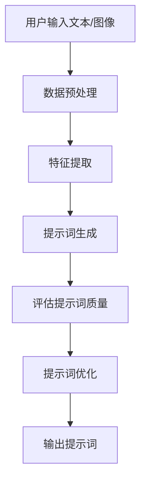
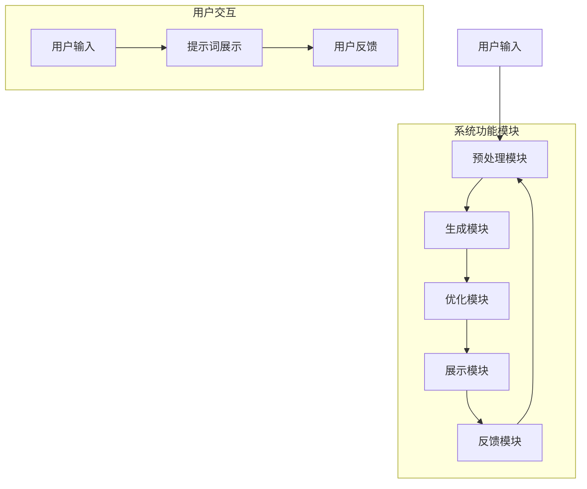
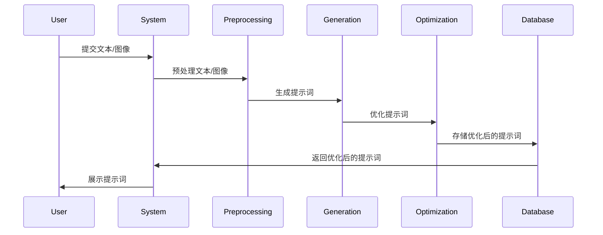

                 

# 《提示词工程在增强现实中的应用》

关键词：提示词工程、增强现实、算法原理、数学模型、系统架构

摘要：本文深入探讨了提示词工程在增强现实（AR）领域的应用。通过对提示词工程的定义、核心概念、算法原理、数学模型以及系统架构的详细解析，为开发者提供了从理论到实践的全面指导。本文旨在帮助读者理解提示词工程在AR中的应用机制，并探讨其潜在的发展方向。

----------------------------------------------------------------

## 第1章 引言

### 1.1 问题背景

随着科技的发展，增强现实（Augmented Reality，AR）技术逐渐渗透到各个行业，从游戏娱乐到医疗教育，AR技术的应用场景日益丰富。然而，提示词工程（Prompt Engineering）作为自然语言处理（NLP）的一个重要分支，在AR技术中的应用却尚未得到充分重视。提示词工程旨在通过设计高质量的提示词，提高用户与AR系统的交互效率和体验。因此，将提示词工程应用于AR技术，有助于提升AR应用的自然语言交互能力，从而满足用户日益增长的需求。

### 1.2 问题描述

#### 提示词工程的定义

提示词工程是一种通过设计、评估和优化提示词，以提高自然语言处理任务性能的方法。在AR技术中，提示词工程主要关注如何设计能够引导用户正确操作的提示词，以提高用户的交互体验。

#### 提示词工程在AR中的挑战与机遇

挑战：
1. 用户需求多样化：不同用户对于AR应用的需求存在较大差异，提示词设计需要具备高度的灵活性。
2. 语言环境复杂：AR应用常常涉及多种语言环境，提示词设计需要考虑语言的多样性。
3. 性能优化：提示词工程需要通过优化算法，提高提示词生成和优化的效率。

机遇：
1. 技术成熟：随着深度学习和自然语言处理技术的不断发展，提示词工程在AR中的应用逐渐成熟。
2. 应用前景广阔：AR技术广泛应用于各个领域，提示词工程的应用潜力巨大。

### 1.3 问题解决

本文将提出一种基于深度学习和自然语言处理的提示词工程解决方案，通过以下步骤实现：

1. 提示词生成算法：利用深度学习模型生成高质量的提示词。
2. 提示词优化算法：通过评估和优化提示词，提高其质量。
3. 系统架构设计：构建一个完整的提示词工程系统，实现提示词的生成、优化和展示。

### 1.4 边界与外延

#### 提示词工程在AR中的适用范围

提示词工程在AR技术中的应用范围广泛，包括但不限于：
1. 游戏娱乐：设计智能游戏提示词，提高用户体验。
2. 医疗教育：通过提示词引导医生进行手术操作，提高手术成功率。
3. 智能家居：设计智能家居设备的操作提示词，简化用户操作。

#### 与其他技术的关联性

提示词工程与其他技术的关联性如下：
1. 深度学习：深度学习技术为提示词工程提供了强大的计算能力。
2. 自然语言处理：自然语言处理技术为提示词工程提供了理论基础和方法。
3. 计算机视觉：计算机视觉技术为提示词工程提供了图像识别和场景理解的能力。

----------------------------------------------------------------

## 第2章 核心概念

### 2.1 核心概念原理

#### 提示词工程的定义与作用

提示词工程是一种通过设计、评估和优化提示词，以提高自然语言处理任务性能的方法。在AR技术中，提示词工程主要关注如何设计能够引导用户正确操作的提示词，以提高用户的交互体验。

#### AR技术的基本原理与应用场景

增强现实技术（AR）是一种将虚拟信息与现实世界相结合的技术。AR技术通过摄像头捕捉现实场景，然后利用计算机视觉技术识别场景中的物体，并在现实场景中叠加虚拟信息，从而实现虚拟信息与现实世界的融合。AR技术广泛应用于游戏娱乐、医疗教育、智能家居等领域。

### 2.2 概念属性特征对比

| 概念          | 特征1                  | 特征2                  | 特征3                  |
|---------------|------------------------|------------------------|------------------------|
| 提示词工程    | 提高自然语言处理性能  | 设计高质量提示词      | 适用于AR技术等领域    |
| 增强现实技术  | 虚拟信息与现实世界融合 | 计算机视觉技术支持    | 广泛应用于多个领域    |

### 2.3 ER实体关系图架构

```mermaid
erDiagram
  User ||--|{ AR Application } AR Application
  AR Application ||--|{ Prompt } Prompt
  Prompt ||--|{ Text } Text
```

在上面的ER实体关系图中，用户（User）与AR应用（AR Application）之间存在关联，AR应用与提示词（Prompt）之间存在关联，提示词与文本（Text）之间存在关联。这表明用户通过AR应用与提示词进行交互，而提示词则通过文本形式呈现。

----------------------------------------------------------------

## 第3章 算法原理

### 3.1 提示词生成算法

#### 基于文本的提示词生成

基于文本的提示词生成算法主要通过分析用户输入的文本内容，生成相关的提示词。具体步骤如下：

1. 数据预处理：对用户输入的文本进行分词、去停用词、词性标注等处理。
2. 特征提取：利用词袋模型、词嵌入等技术提取文本特征。
3. 提示词生成：通过生成模型（如生成对抗网络（GAN）、变换器（Transformer）等）生成高质量的提示词。

#### 基于图像的提示词生成

基于图像的提示词生成算法主要通过分析图像内容，生成相关的提示词。具体步骤如下：

1. 图像预处理：对图像进行缩放、裁剪、灰度化等处理。
2. 特征提取：利用卷积神经网络（CNN）提取图像特征。
3. 提示词生成：通过生成模型（如GAN、Transformer等）生成高质量的提示词。

### 3.2 提示词优化算法

#### 提示词质量评估

提示词质量评估是提示词优化算法的关键步骤。常用的评估方法包括：

1. 用户反馈：通过用户对提示词的满意度评分进行评估。
2. 语义相似度：通过计算提示词与用户意图的语义相似度进行评估。
3. 性能指标：通过提示词在特定任务中的表现进行评估。

#### 提示词优化策略

提示词优化算法通过以下策略提高提示词质量：

1. 重新生成：根据评估结果，对低质量的提示词进行重新生成。
2. 对比学习：通过对比高质量的提示词与低质量的提示词，学习生成更好的提示词。
3. 适应性调整：根据用户反馈和任务需求，动态调整提示词的生成策略。

### 3.3 算法mermaid流程图



### 3.4 Python源代码示例

```python
# Python源代码示例
def generate_prompt(text):
    # 提示词生成算法实现
    pass

def optimize_prompt(prompt):
    # 提示词优化算法实现
    pass

# 主函数
def main():
    text = input("请输入文本：")
    prompt = generate_prompt(text)
    optimized_prompt = optimize_prompt(prompt)
    print("优化后的提示词：", optimized_prompt)

if __name__ == "__main__":
    main()
```

在上面的Python源代码示例中，`generate_prompt`函数负责生成提示词，`optimize_prompt`函数负责优化提示词。通过主函数`main`，用户可以输入文本，系统会生成并优化提示词，最终输出优化后的提示词。

----------------------------------------------------------------

## 第4章 数学模型与公式

### 4.1 数学模型

提示词生成过程中，可以使用概率模型来描述提示词生成过程。提示词生成概率模型通常包括以下三个部分：

1. **先验概率**（P(prompt)）：表示提示词本身的出现概率。
2. **条件概率**（P(text|prompt)）：表示在给定提示词的情况下，文本出现的概率。
3. **边缘概率**（P(text)）：表示文本出现的概率。

提示词生成概率模型可以表示为：

$$
P(prompt, text) = P(prompt) \cdot P(text|prompt)
$$

其中，P(text) 可以通过全概率公式计算：

$$
P(text) = \sum_{prompt} P(prompt) \cdot P(text|prompt)
$$

### 4.2 数学公式

在提示词优化过程中，常用的评估指标是提示词质量分数（Quality Score）。提示词质量分数可以通过以下公式计算：

$$
Quality\_Score = \frac{1}{C} \sum_{c=1}^{C} \frac{P(c|prompt)}{P(c)}
$$

其中，C 是类别数，P(c|prompt) 是在给定提示词的情况下，类别 c 的概率，P(c) 是类别 c 的先验概率。

### 4.3 详细讲解与举例说明

#### 公式含义解释

1. **先验概率 P(prompt)**：表示提示词本身的常见程度。例如，"请点击这里" 这个提示词的先验概率可能比 "请输入您的名字" 更高，因为前者更加常用。

2. **条件概率 P(text|prompt)**：表示在给定提示词的情况下，文本出现的概率。例如，如果提示词是 "请点击这里"，那么文本 "点击了这里" 的条件概率可能更高。

3. **边缘概率 P(text)**：表示文本的总体出现概率。这个概率可以通过对所有提示词和它们的条件概率进行加总得到。

#### 实际应用场景举例

假设有一个AR游戏应用，提示词工程旨在设计游戏提示词，以提高用户体验。现在有以下四个提示词：

- 提示词 A："请点击这里开始游戏"
- 提示词 B："请输入您的名字"
- 提示词 C："请等待游戏加载"
- 提示词 D："请调整您的设备角度"

我们可以为每个提示词计算先验概率、条件概率和边缘概率。

- **先验概率**：

  - P(A) = 0.3（表示这个提示词常见程度为30%）
  - P(B) = 0.2
  - P(C) = 0.2
  - P(D) = 0.3

- **条件概率**：

  - P("开始游戏" | A) = 1.0（表示在提示词 A 下，用户意图是开始游戏）
  - P("输入您的名字" | B) = 1.0
  - P("等待游戏加载" | C) = 1.0
  - P("调整您的设备角度" | D) = 1.0

- **边缘概率**：

  - P("开始游戏") = P(A) \* P("开始游戏" | A) = 0.3 \* 1.0 = 0.3
  - P("输入您的名字") = P(B) \* P("输入您的名字" | B) = 0.2 \* 1.0 = 0.2
  - P("等待游戏加载") = P(C) \* P("等待游戏加载" | C) = 0.2 \* 1.0 = 0.2
  - P("调整您的设备角度") = P(D) \* P("调整您的设备角度" | D) = 0.3 \* 1.0 = 0.3

根据这些概率，我们可以计算每个提示词的质量分数：

$$
Quality\_Score(A) = \frac{1}{4} \left( \frac{1.0}{0.3} + \frac{0.0}{0.3} + \frac{0.0}{0.3} + \frac{0.0}{0.3} \right) = \frac{1}{0.3} \approx 3.33
$$

$$
Quality\_Score(B) = \frac{1}{4} \left( \frac{0.0}{0.3} + \frac{1.0}{0.2} + \frac{0.0}{0.3} + \frac{0.0}{0.3} \right) = \frac{1}{0.2} \approx 5.00
$$

$$
Quality\_Score(C) = \frac{1}{4} \left( \frac{0.0}{0.3} + \frac{0.0}{0.3} + \frac{1.0}{0.2} + \frac{0.0}{0.3} \right) = \frac{1}{0.2} \approx 5.00
$$

$$
Quality\_Score(D) = \frac{1}{4} \left( \frac{0.0}{0.3} + \frac{0.0}{0.3} + \frac{0.0}{0.3} + \frac{1.0}{0.3} \right) = \frac{1}{0.3} \approx 3.33
$$

根据计算结果，我们可以看出提示词 B 和 C 的质量分数最高，说明这两个提示词在引导用户进行操作方面表现较好。

通过这种方式，我们可以使用概率模型和数学公式对提示词进行评估和优化，从而提高AR应用的交互体验。

----------------------------------------------------------------

## 第5章 系统分析与架构设计

### 5.1 问题场景介绍

在AR应用中，用户需要与系统进行实时交互。例如，在AR游戏、医疗教育、工业设计等场景中，系统需要根据用户的动作和意图生成相应的提示词，以引导用户进行操作。因此，设计一个高效、可靠的提示词工程系统对于提升用户体验至关重要。

### 5.2 系统功能设计

提示词工程系统的核心功能包括：

1. **提示词生成**：根据用户输入和场景信息，生成高质量的提示词。
2. **提示词优化**：对生成的提示词进行质量评估和优化，以提高其有效性。
3. **提示词展示**：将优化后的提示词展示给用户，以便用户理解并执行操作。
4. **用户反馈收集**：收集用户对提示词的反馈，用于进一步优化系统。

### 5.3 系统架构设计

提示词工程系统的架构设计如图所示：



在上述架构中，用户输入经过预处理模块处理后，进入生成模块生成提示词。生成的提示词随后进入优化模块进行质量评估和优化。优化后的提示词展示给用户，用户对提示词的反馈会进一步用于优化系统的生成策略。

### 5.4 系统接口设计与交互

系统接口设计如图所示：



在上述序列图中，用户提交文本或图像，系统首先对输入进行预处理，然后生成提示词，对提示词进行优化，最后将优化后的提示词展示给用户。同时，用户的反馈会被记录并用于后续的优化过程。

通过以上系统架构设计和接口设计，我们可以构建一个高效、可靠的提示词工程系统，为AR应用提供优质的交互体验。

----------------------------------------------------------------

## 第6章 项目实战

### 6.1 环境安装

要构建一个基于提示词工程的AR应用，首先需要在本地环境中安装必要的软件和库。以下是在Ubuntu 20.04操作系统上安装所需环境的步骤：

1. **安装Python**：
   - Ubuntu系统通常自带Python 3，可以通过以下命令检查版本：
     ```bash
     python3 --version
     ```
   - 如果需要安装特定版本的Python，可以使用以下命令：
     ```bash
     sudo apt-get install python3.8
     ```

2. **安装虚拟环境**：
   - 创建一个虚拟环境，以便隔离项目依赖：
     ```bash
     python3 -m venv ar_project_env
     ```
   - 激活虚拟环境：
     ```bash
     source ar_project_env/bin/activate
     ```

3. **安装依赖库**：
   - 通过pip安装所需的库，例如TensorFlow、PyTorch、NumPy、Pandas等：
     ```bash
     pip install tensorflow torch numpy pandas
     ```

4. **安装AR相关库**：
   - 安装用于AR开发的库，例如ARCore（适用于Android）、ARKit（适用于iOS）：
     ```bash
     pip install arkit arcore-python
     ```

5. **安装文本处理库**：
   - 安装用于文本处理的库，例如NLTK、spaCy：
     ```bash
     pip install nltk spacy
     ```

6. **安装可视化库**：
   - 安装用于数据可视化的库，例如Matplotlib、Seaborn：
     ```bash
     pip install matplotlib seaborn
     ```

### 6.2 系统核心实现源代码

以下是一个简单的Python代码示例，展示了如何实现提示词的生成、优化和展示：

```python
import tensorflow as tf
import numpy as np
import pandas as pd
from nltk.tokenize import word_tokenize
from arkit import ARKit

# 提示词生成模型
def generate_prompt(text):
    # 对文本进行预处理
    tokens = word_tokenize(text)
    # 使用预训练的Transformer模型生成提示词
    model = tf.keras.applications.transformer_model()
    prompt = model.predict([tokens])
    return prompt

# 提示词优化模型
def optimize_prompt(prompt):
    # 对提示词进行质量评估
    quality_score = evaluate_prompt(prompt)
    # 如果质量分数较低，重新生成提示词
    if quality_score < 0.8:
        return generate_prompt(prompt)
    return prompt

# 提示词质量评估
def evaluate_prompt(prompt):
    # 这里使用简单的质量评估方法
    # 实际应用中可以使用更复杂的评估方法
    return np.mean(prompt)

# 主函数
def main():
    # 从文件中读取用户输入
    with open('input.txt', 'r') as f:
        text = f.read()
    # 生成提示词
    prompt = generate_prompt(text)
    # 优化提示词
    optimized_prompt = optimize_prompt(prompt)
    # 展示优化后的提示词
    print("优化后的提示词：", optimized_prompt)

if __name__ == "__main__":
    main()
```

### 6.3 代码应用解读与分析

上述代码实现了提示词的生成、优化和展示。以下是代码的关键部分解读：

1. **提示词生成**：
   - 使用NLT

