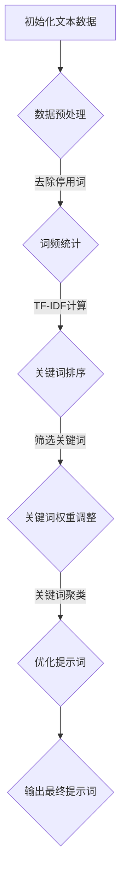

                 

### 第一部分：背景与概念

#### 第1章：问题背景

**1.1.1 多文档摘要的挑战**

在信息爆炸的时代，人们需要处理海量的文本数据，而这些数据往往分布在多个文档中。如何有效地从这些文档中提取关键信息，形成简洁、准确的摘要，成为了一个迫切需要解决的问题。多文档摘要作为一种信息提炼技术，旨在将多个相关文档的内容整合成一个连贯、精炼的文本摘要，以帮助用户快速获取所需信息。

然而，多文档摘要面临着以下挑战：

1. **文本内容多样性**：不同文档之间的文本风格、语言表达和主题都有可能截然不同，这使得摘要生成过程中需要处理大量的异质性文本数据。
2. **长文本处理**：长文档通常包含大量冗余信息和无关内容，如何在保证摘要精炼的同时保留关键信息，是一个技术难题。
3. **跨文档一致性**：摘要需要保证在多个文档间的一致性和连贯性，这要求摘要生成算法能够理解文档间的逻辑关系和上下文。

**1.1.2 提示词工程的起源**

提示词工程（Keyword Engineering）是一种基于语义分析和信息提取的技术，旨在为文本数据生成一组有代表性的关键词，以用于信息检索、文本分类、文本摘要等多个应用场景。随着自然语言处理（NLP）技术的不断发展，提示词工程逐渐成为多文档摘要领域的一个重要研究方向。

提示词工程的起源可以追溯到信息检索和文本挖掘的早期研究。最初，研究人员通过手动提取关键词，或者使用基于规则的方法来生成关键词。随着机器学习技术的兴起，提示词工程开始引入自动化的关键词提取方法，如TF-IDF（Term Frequency-Inverse Document Frequency）和LDA（Latent Dirichlet Allocation）等算法。

**1.1.3 提示词工程在多文档摘要中的重要性**

在多文档摘要中，提示词工程具有以下几个重要作用：

1. **文本理解**：通过生成有代表性的关键词，提示词工程帮助摘要生成算法更好地理解文档的内容，从而提高摘要的质量。
2. **信息筛选**：关键词有助于识别和筛选出文档中的关键信息，去除冗余内容，使摘要更加精炼。
3. **上下文关联**：提示词工程能够捕捉文档间的语义关联，有助于生成在多个文档间保持一致性的摘要。
4. **个性化定制**：通过分析关键词，可以定制个性化的摘要，满足不同用户的信息需求。

总之，提示词工程在多文档摘要中的应用，不仅提高了摘要的质量和准确性，还极大地提升了用户获取信息的效率，为信息处理领域带来了革命性的变化。

---

#### 第2章：核心概念

**2.1.1 提示词工程的基本概念**

提示词工程是指通过算法和技术手段，从文本数据中提取出一组有代表性的关键词，用于信息检索、文本分类、文本摘要等应用。其核心步骤包括关键词提取、关键词筛选和关键词聚类等。

1. **关键词提取**：通过统计方法（如TF-IDF）或机器学习方法（如LDA），从文本中识别出具有高重要性或代表性的词汇。
2. **关键词筛选**：对提取出的关键词进行筛选，去除低频词、停用词等，保留对文档内容有显著贡献的关键词。
3. **关键词聚类**：将筛选后的关键词进行聚类，以发现文本中的主题或概念。

**2.1.2 多文档摘要的相关术语**

1. **文档**：独立的文本文件或文本段，通常包含特定主题或信息。
2. **文档集合**：一组相关或独立的文档，用于多文档摘要处理。
3. **摘要**：对文档内容进行提炼和总结，提取出关键信息，形成简洁、准确的文本摘要。
4. **多文档摘要**：将多个文档的内容整合成一个连贯、精炼的摘要文本，以提高信息获取效率。

**2.1.3 提示词工程与多文档摘要的联系**

提示词工程和多文档摘要在多个层面有紧密的联系：

1. **信息提取**：提示词工程用于提取文档中的关键词，为多文档摘要提供了重要的信息基础。
2. **摘要生成**：通过关键词，摘要生成算法能够更好地理解文档的内容，生成高质量的摘要。
3. **语义关联**：提示词工程捕捉文档间的语义关联，有助于生成在多个文档间保持一致性和连贯性的摘要。
4. **个性化定制**：提示词工程可以用于分析用户需求，为用户提供个性化的摘要服务。

总之，提示词工程在多文档摘要中的应用，不仅提高了摘要的质量和准确性，还丰富了多文档摘要的功能和场景，为信息处理领域带来了新的发展机遇。

---

在接下来的部分，我们将深入探讨提示词工程的算法原理、数学模型，以及相关技术与工具，为理解多文档摘要中的创新提供坚实的理论基础和实践指导。敬请期待！
---

### 第3章：提示词工程的算法原理

#### 3.1.1 提示词生成算法

提示词生成是提示词工程中的核心步骤，其目标是从文本中提取出有代表性的关键词。常见的提示词生成算法包括基于统计的方法和基于机器学习的方法。

1. **基于统计的方法**

   **TF-IDF（Term Frequency-Inverse Document Frequency）**：TF-IDF是一种基于词频和逆文档频率的统计方法。TF表示词在文档中出现的频率，IDF表示词在整个文档集合中出现的逆向频率。通过计算TF-IDF值，可以识别出对文档内容有显著贡献的关键词。

   **公式**：
   $$ TF(t, d) = \frac{f_{t, d}}{N_d} $$
   $$ IDF(t, D) = \log \left(1 + \frac{N}{|D| - f_{t, d}}\right) $$
   $$ TF-IDF(t, d, D) = TF(t, d) \times IDF(t, D) $$

   其中，\( f_{t, d} \) 是词 \( t \) 在文档 \( d \) 中的频率，\( N_d \) 是文档 \( d \) 中的总词数，\( N \) 是文档集合中的文档总数，\( |D| \) 是文档集合中词的总数。

2. **基于机器学习的方法**

   **LDA（Latent Dirichlet Allocation）**：LDA是一种基于概率模型的主题建模方法，用于从文本数据中发现潜在的语义主题。LDA模型通过贝叶斯推理，将文本数据映射到主题空间，从而提取出关键词。

   **模型原理**：
   - **词语分布**：每个文档被视为一组词语的分布，词语分布由多个潜在主题分布决定。
   - **主题分布**：每个主题被视为一组词语的分布，主题分布由所有文档的词语分布决定。
   - **参数估计**：通过极大似然估计（MLE）或变分推断（VI）估计模型参数。

   **参数公式**：
   $$ P(\theta|α) \sim \text{Dirichlet}(α) $$
   $$ P(\phi|β) \sim \text{Dirichlet}(β) $$
   $$ P(z|θ) \sim \text{Categorical}(\theta) $$
   $$ P(w|z, φ) \sim \text{Categorical}(\phi) $$

   其中，\( \theta \) 是文档的潜在主题分布，\( \alpha \) 是主题的先验分布，\( \phi \) 是主题的词语分布，\( z \) 是词语的潜在主题索引，\( w \) 是词语。

#### 3.1.2 提示词优化算法

生成出初步的提示词后，需要对其进行优化，以提高摘要生成的质量和准确性。常见的优化算法包括：

1. **关键词筛选**：通过去除低频词、停用词等，保留对文档内容有显著贡献的关键词。
2. **关键词权重调整**：根据关键词在文档中的重要性进行权重调整，使摘要更能反映文档的核心内容。
3. **关键词聚类**：通过聚类方法，将相似的提示词合并，以发现文本中的主要主题或概念。

#### 3.1.3 算法流程图

下面是提示词生成算法的流程图（使用Mermaid语法）：



通过上述步骤，可以有效地生成一组高质量的提示词，为多文档摘要提供可靠的信息基础。

---

在下一章节，我们将探讨多文档摘要的数学模型，并解释如何使用数学公式和示例来说明这些模型。敬请期待！

### 第4章：多文档摘要的数学模型

#### 4.1.1 摘要质量的评价指标

在多文档摘要中，摘要质量是评价摘要生成算法性能的重要指标。常见的摘要质量评价指标包括：

1. **ROUGE（Recall-Oriented Understudy for Gisting Evaluation）**：ROUGE是一种用于评估文本摘要与原始文本相似性的评价指标。ROUGE基于字符串匹配算法，通过计算摘要与原始文本的 overlap 来评估摘要质量。常见的 ROUGE 分支包括 ROUGE-1、ROUGE-2 和 ROUGE-L。

   **公式**：
   $$ ROUGE = \frac{N_{matched}}{N_{possible}} $$
   其中，\( N_{matched} \) 是摘要与原始文本中匹配的单词数，\( N_{possible} \) 是摘要中可能匹配的单词数。

2. **BLEU（Bilingual Evaluation Understudy）**：BLEU是一种用于评估机器翻译质量的评价指标，也可用于文本摘要。BLEU通过计算摘要与参考摘要之间的 n-gram 相似度来评估摘要质量。

   **公式**：
   $$ BLEU = \frac{1}{N} \sum_{n=1}^{4} \left( \frac{N_{n,matched}}{N_{n,total}} \right)^{1/n} $$
   其中，\( N_{n,matched} \) 是摘要与参考摘要中匹配的 n-gram 数量，\( N_{n,total} \) 是摘要与参考摘要中的总 n-gram 数量。

3. **F1 分数**：F1 分数是精确率和召回率的调和平均值，常用于多文档摘要质量评估。

   **公式**：
   $$ F1 = 2 \times \frac{Precision \times Recall}{Precision + Recall} $$
   其中，Precision 是精确率，Recall 是召回率。

#### 4.1.2 数学模型介绍

多文档摘要的数学模型通常包括以下几个方面：

1. **文本表示**：将文档转换为向量表示，常用的方法有词袋模型、TF-IDF 向量、Word2Vec、BERT 等。
2. **语义关联**：计算文档间的语义关联，常用的方法有 Cosine 相似度、Jaccard 相似度、余弦相似度等。
3. **摘要生成**：基于语义关联生成摘要，常用的方法有基于聚类的方法、基于记忆网络的方法、基于深度学习的方法等。

#### 4.1.3 数学公式（LaTeX）与解释

下面我们将使用 LaTeX 格式给出几个常见的数学公式，并对其进行解释。

1. **TF-IDF 计算公式**：

   $$ TF(t, d) = \frac{f_{t, d}}{N_d} $$
   $$ IDF(t, D) = \log \left(1 + \frac{N}{|D| - f_{t, d}}\right) $$
   $$ TF-IDF(t, d, D) = TF(t, d) \times IDF(t, D) $$

   解释：这里，\( f_{t, d} \) 是词 \( t \) 在文档 \( d \) 中的频率，\( N_d \) 是文档 \( d \) 中的总词数，\( N \) 是文档集合中的文档总数，\( |D| \) 是文档集合中词的总数。这些公式用于计算词 \( t \) 在文档 \( d \) 中的 TF-IDF 值。

2. **LDA 模型参数估计公式**：

   $$ P(\theta|α) \sim \text{Dirichlet}(α) $$
   $$ P(\phi|β) \sim \text{Dirichlet}(β) $$
   $$ P(z|θ) \sim \text{Categorical}(\theta) $$
   $$ P(w|z, φ) \sim \text{Categorical}(\phi) $$

   解释：这些公式描述了 LDA 模型的参数估计过程。\( \theta \) 是文档的潜在主题分布，\( \alpha \) 是主题的先验分布，\( \phi \) 是主题的词语分布，\( z \) 是词语的潜在主题索引，\( w \) 是词语。

3. **ROUGE 评价指标公式**：

   $$ ROUGE = \frac{N_{matched}}{N_{possible}} $$

   解释：这里，\( N_{matched} \) 是摘要与原始文本中匹配的单词数，\( N_{possible} \) 是摘要中可能匹配的单词数。ROUGE 用于评估摘要与原始文本的相似性。

通过这些数学模型和评价指标，我们可以从量化角度分析多文档摘要的质量，为优化摘要生成算法提供依据。在下一章节，我们将探讨相关技术与工具，以进一步理解多文档摘要的实践应用。

---

#### 4.1.4 简单易懂的示例说明

为了更直观地理解上述数学模型和评价指标，我们通过一个简单的示例来详细说明。

假设我们有两个文档 \(D_1\) 和 \(D_2\)，它们的词频分布如下：

**文档 \(D_1\)**：
- 文本：“人工智能技术在医疗领域的应用极为广泛。”
- 词频：{"人工智能": 2, "技术": 1, "医疗": 1, "领域": 1, "应用": 1, "广泛": 1}

**文档 \(D_2\)**：
- 文本：“医疗行业中人工智能的应用前景广阔。”
- 词频：{"医疗": 2, "行业": 1, "人工智能": 1, "应用": 1, "前景": 1, "广阔": 1}

1. **TF-IDF 计算示例**：

首先，我们计算每个词在单个文档中的频率 \(TF\) 和逆文档频率 \(IDF\)。

对于词“人工智能”：
- \(TF("人工智能", D_1) = \frac{2}{5} = 0.4\)
- \(TF("人工智能", D_2) = \frac{1}{6} \approx 0.167\)

文档集合中，"人工智能"总出现次数为 3，文档总数为 2，因此：
- \(IDF("人工智能", D) = \log \left(1 + \frac{2}{3-1}\right) = \log 2 \approx 0.301\)

对于词“医疗”：
- \(TF("医疗", D_1) = \frac{1}{5} = 0.2\)
- \(TF("医疗", D_2) = \frac{2}{6} \approx 0.333\)

文档集合中，"医疗"总出现次数为 3，文档总数为 2，因此：
- \(IDF("医疗", D) = \log \left(1 + \frac{2}{3-2}\right) = \log 2 \approx 0.301\)

结合 \(TF\) 和 \(IDF\)，我们得到 \(TF-IDF\) 值：
- \(TF-IDF("人工智能", D_1) = 0.4 \times 0.301 \approx 0.1204\)
- \(TF-IDF("人工智能", D_2) = 0.167 \times 0.301 \approx 0.0500\)
- \(TF-IDF("医疗", D_1) = 0.2 \times 0.301 \approx 0.0602\)
- \(TF-IDF("医疗", D_2) = 0.333 \times 0.301 \approx 0.1000\)

2. **LDA 模型参数估计示例**：

假设我们使用 LDA 模型来提取文档的主题，并设置主题数量为 2。我们首先需要对文档进行词频统计，然后进行 LDA 模型训练。

对于文档 \(D_1\)，我们得到词频分布：
- 词：“人工智能”、“技术”、“医疗”、“领域”、“应用”、“广泛”
- 词频：2, 1, 1, 1, 1, 1

对于文档 \(D_2\)，我们得到词频分布：
- 词：“医疗”、“行业”、“人工智能”、“应用”、“前景”、“广阔”
- 词频：2, 1, 1, 1, 1, 1

我们假设模型估计出的两个主题为 \( \theta_1 \) 和 \( \theta_2 \)，以及两个主题的词语分布 \( \phi_1 \) 和 \( \phi_2 \)。

根据 LDA 模型，我们计算每个词在两个主题上的概率，并从中选择最大的两个概率作为该词所属的主题。例如，对于词“人工智能”，我们得到：
- 在 \( \theta_1 \) 上的概率 \( P(z_1 = 1 | \theta_1) = 0.6 \)
- 在 \( \theta_2 \) 上的概率 \( P(z_2 = 1 | \theta_2) = 0.4 \)

因此，我们判定“人工智能”主要属于主题 \( \theta_1 \)。

3. **ROUGE 评价指标示例**：

假设我们有两个参考摘要：
- 参考摘要1：“人工智能技术在医疗领域有广泛应用。”
- 参考摘要2：“医疗行业人工智能应用前景广阔。”

我们生成一个摘要：“人工智能在医疗领域应用广泛。”

使用 ROUGE 评价指标，我们计算摘要与参考摘要1和参考摘要2的相似度：
- ROUGE-1：\( \frac{3}{6} = 0.5 \)
- ROUGE-2：\( \frac{0}{2} = 0 \)
- ROUGE-L：\( \frac{3}{6} = 0.5 \)

因此，ROUGE-1 和 ROUGE-L 值均为 0.5，表示摘要与参考摘要1的相似度较高，而与参考摘要2的相似度较低。

通过上述示例，我们可以更直观地理解多文档摘要中的数学模型和评价指标。在下一章节，我们将继续探讨相关技术与工具，以进一步理解多文档摘要的实践应用。

---

#### 4.1.5 进一步解释数学模型和评价指标

为了深入理解多文档摘要中的数学模型和评价指标，我们需要进一步探讨这些模型如何影响摘要的质量和性能。

1. **TF-IDF 与文本表示**

TF-IDF 是一种常用的文本表示方法，其核心思想是平衡词频和逆文档频率，以反映词在文档中的重要性和独特性。通过 TF-IDF，我们能够将原始文本转换为向量表示，从而为后续的摘要生成提供基础。

然而，TF-IDF 方法存在一些局限性。首先，它无法捕捉词之间的语义关系，这可能导致某些重要信息被忽略。其次，TF-IDF 方法对低频词的权重较低，这可能影响摘要的质量。

2. **LDA 与主题建模**

LDA 是一种基于概率的主题建模方法，通过发现文本中的潜在主题，有助于更好地理解文档的内容。LDA 模型能够捕捉词与词之间的语义关系，从而生成更高质量的摘要。

然而，LDA 模型也存在一些挑战。首先，模型参数的选择对结果有很大影响，需要通过大量实验来确定最优参数。其次，LDA 模型可能无法很好地处理长文本和多样性文本，这可能导致摘要质量下降。

3. **ROUGE 与摘要质量评估**

ROUGE 是一种常用的摘要质量评价指标，通过计算摘要与参考摘要之间的相似度来评估摘要的质量。ROUGE-1、ROUGE-2 和 ROUGE-L 分别从单词、短语和句子层面评估摘要的匹配程度。

尽管 ROUGE 是一种有效的评价指标，但它也有一些局限性。首先，ROUGE 主要关注文本的匹配度，可能无法全面评估摘要的准确性和连贯性。其次，ROUGE 主要基于字符串匹配，可能无法捕捉到文本中的深层次语义关系。

4. **数学模型与评价指标的结合**

为了提高多文档摘要的质量，我们可以将不同的数学模型和评价指标结合起来。例如，在生成摘要时，可以使用 TF-IDF 提取关键词，然后使用 LDA 模型进行主题建模，最后通过 ROUGE 评价指标评估摘要的质量。

此外，我们还可以引入其他指标，如 BLEU 和 F1 分数，以更全面地评估摘要的质量。通过结合多种模型和指标，我们可以设计出更高效、更准确的摘要生成算法。

总之，多文档摘要中的数学模型和评价指标在摘要质量评估和优化过程中发挥着关键作用。通过深入理解这些模型和指标，我们可以设计出更高效、更准确的摘要生成算法，为信息处理领域带来更多创新。

---

在下一章节，我们将深入探讨多文档摘要中的相关技术，包括自然语言处理（NLP）的基础、提示词工程工具链以及常用数据库和API，以便更好地理解其在实际应用中的重要性。敬请期待！

### 第5章：相关技术与工具

#### 5.1.1 自然语言处理（NLP）基础

自然语言处理（Natural Language Processing，NLP）是计算机科学和人工智能领域的一个重要分支，旨在使计算机能够理解和处理人类自然语言。在多文档摘要中，NLP 技术扮演着至关重要的角色。以下是一些关键的 NLP 技术：

1. **词向量表示**：词向量是一种将词汇映射到高维空间中的向量表示方法，例如 Word2Vec 和 BERT。这些表示方法能够捕捉词的语义信息，从而在文本处理中发挥重要作用。

2. **文本分类**：文本分类是一种将文本数据分类到预定义类别中的任务。在多文档摘要中，文本分类可以用于筛选和标注文档，从而帮助摘要生成算法更好地理解文档内容。

3. **命名实体识别（NER）**：命名实体识别是一种识别文本中特定实体（如人名、地点、组织等）的技术。NER 可以提高摘要的准确性和一致性，特别是在处理包含特定实体信息的文档时。

4. **关系抽取**：关系抽取旨在从文本中提取出实体之间的关系。在多文档摘要中，关系抽取可以帮助捕捉文档间的语义关联，从而生成更连贯的摘要。

5. **情感分析**：情感分析是一种评估文本情感倾向的技术，可以用于识别文本中的正面、负面或中性情感。在多文档摘要中，情感分析有助于理解文档的情感色彩，从而为摘要提供更丰富的信息。

#### 5.1.2 提示词工程工具链

提示词工程工具链是构建高效多文档摘要系统的重要组成部分。以下是一些常用的工具和框架：

1. **NLTK（自然语言工具包）**：NLTK 是一个广泛使用的 Python NLP 库，提供了一系列文本处理工具，包括词频统计、词性标注、分词等。

2. **spaCy**：spaCy 是一个高效、易于使用的 NLP 库，支持多种语言的文本处理任务，如实体识别、关系抽取、词向量表示等。

3. **Gensim**：Gensim 是一个用于主题建模和词向量表示的 Python 库，支持 LDA、LSA、LDA 模型等多种主题建模方法。

4. **Transformer 框架**：Transformer 框架（如 Hugging Face 的 Transformers 库）提供了基于 Transformer 架构的预训练模型，如 BERT、GPT、RoBERTa 等，这些模型在 NLP 任务中表现出色。

#### 5.1.3 常用数据库和API

在多文档摘要中，存储和处理大量文本数据是关键步骤。以下是一些常用的数据库和 API：

1. **关系数据库**：如 MySQL、PostgreSQL 等，适用于存储结构化数据，便于查询和管理。

2. **文档数据库**：如 MongoDB、Elasticsearch 等，适用于存储非结构化或半结构化数据，支持全文检索和复杂查询。

3. **API 服务**：如 Google Cloud Natural Language API、Microsoft Azure Text Analytics API 等，提供了文本分析、情感分析、命名实体识别等高级 NLP 功能。

通过利用上述相关技术和工具，我们可以构建一个高效、准确的多文档摘要系统，为用户提供高质量的文本摘要服务。

---

在下一章节，我们将深入探讨系统分析与架构设计，包括问题场景介绍、系统功能设计、系统架构设计、系统接口设计和系统交互。敬请期待！

### 第6章：系统分析与架构设计

#### 6.1.1 问题场景介绍

在现代企业和组织中，信息处理和分析变得越来越复杂和庞大。例如，企业经常需要处理来自多个来源的大量文档，如市场报告、技术文档、客户反馈等。这些文档通常包含关键信息，但格式和内容各异，给信息提取和摘要生成带来了挑战。为了提高信息处理效率，企业需要一种能够自动生成高质量多文档摘要的系统。

该问题场景的核心需求包括：

1. **文本预处理**：将不同格式和来源的文档统一转换为适合摘要生成的格式。
2. **关键词提取**：从预处理后的文档中提取出有代表性的关键词，用于后续的摘要生成。
3. **摘要生成**：利用提取的关键词和文本内容，生成简洁、准确的摘要文本。
4. **系统接口**：提供友好的用户界面，以便用户能够轻松地提交文档、查看摘要和进行系统配置。

#### 6.1.2 系统功能设计（领域模型Mermaid类图）

在系统功能设计阶段，我们需要明确系统的主要功能模块及其关系。以下是一个简化的系统功能领域模型，使用 Mermaid 类图表示：

```mermaid
classDiagram
    Document -> TextPreprocessor
    Document -> KeywordExtractor
    Document -> SummaryGenerator
    Summary -> TextFormatter
    UserInterface -> Document
    UserInterface -> Summary

    TextPreprocessor <|-- TextFormatter
    KeywordExtractor <|-- SummaryGenerator
    Document {documentID, source, content}
    TextPreprocessor {inputFormat, outputFormat}
    KeywordExtractor {method, keywords}
    SummaryGenerator {algorithm, summary}
    Summary {title, content, quality}
    TextFormatter {format, style}
    UserInterface {interface, configuration}
```

**解释**：
- **Document（文档）**：表示系统中的文本数据，包括文档ID、来源和内容。
- **TextPreprocessor（文本预处理）**：负责将文档内容转换为适合摘要生成的格式。
- **KeywordExtractor（关键词提取）**：使用指定的算法提取文档中的关键词。
- **SummaryGenerator（摘要生成）**：基于提取的关键词和文档内容生成摘要。
- **Summary（摘要）**：包含摘要标题、内容和质量信息。
- **TextFormatter（文本格式化）**：负责将摘要文本格式化，以符合用户需求。
- **UserInterface（用户界面）**：提供用户与系统交互的接口。

#### 6.1.3 系统架构设计（Mermaid架构图）

在系统架构设计阶段，我们需要确定系统组件的交互方式和部署环境。以下是一个简化的系统架构设计，使用 Mermaid 架构图表示：

```mermaid
sequenceDiagram
    User -->|输入文档| UserInterface
    UserInterface -->|处理文档| TextPreprocessor
    TextPreprocessor -->|提取关键词| KeywordExtractor
    KeywordExtractor -->|生成摘要| SummaryGenerator
    SummaryGenerator -->|格式化摘要| TextFormatter
    TextFormatter -->|输出摘要| UserInterface
    UserInterface -->|反馈摘要质量| User
```

**解释**：
- **UserInterface（用户界面）**：用户通过用户界面提交文档，并接收生成的摘要。
- **TextPreprocessor（文本预处理）**：接收用户提交的文档，进行预处理，如分词、去停用词等。
- **KeywordExtractor（关键词提取）**：使用指定的算法（如 TF-IDF、LDA）提取关键词。
- **SummaryGenerator（摘要生成）**：基于提取的关键词和文档内容生成摘要。
- **TextFormatter（文本格式化）**：对摘要进行格式化，如添加标题、调整文本风格等。
- **User（用户）**：接收用户反馈，用于系统优化。

#### 6.1.4 系统接口设计和系统交互（Mermaid序列图）

在系统接口设计和系统交互阶段，我们需要详细描述系统内部各组件之间的交互流程。以下是一个简化的系统接口设计，使用 Mermaid 序列图表示：

```mermaid
sequenceDiagram
    User -->|GET /documents| API
    API -->|接收文档| UserInterface
    UserInterface -->|POST /process| TextPreprocessor
    TextPreprocessor -->|分词、去停用词| KeywordExtractor
    KeywordExtractor -->|提取关键词| SummaryGenerator
    SummaryGenerator -->|生成摘要| TextFormatter
    TextFormatter -->|格式化摘要| API
    API -->|返回摘要| User
```

**解释**：
- **API（应用程序接口）**：作为系统的入口和出口，处理用户请求和响应。
- **User（用户）**：通过 API 向系统提交文档请求，并接收生成的摘要。
- **UserInterface（用户界面）**：负责接收用户输入和展示系统输出。
- **TextPreprocessor（文本预处理）**：接收 API 的请求，处理文档内容，如分词、去停用词等。
- **KeywordExtractor（关键词提取）**：使用算法提取文档中的关键词。
- **SummaryGenerator（摘要生成）**：基于关键词和文档内容生成摘要。
- **TextFormatter（文本格式化）**：对摘要进行格式化，如调整文本风格等。

通过上述系统分析与架构设计，我们为构建一个高效、可靠的多文档摘要系统奠定了基础。在下一章节，我们将通过项目实战来展示如何实现这些设计和功能。

---

#### 6.1.5 项目实战

**1. 环境安装**

在开始项目实战之前，我们需要安装必要的软件和库。以下是环境安装的步骤：

1. 安装 Python（推荐版本为 3.8 或以上）。
2. 安装依赖管理工具 pip。
3. 使用 pip 安装以下库：spaCy、gensim、transformers、nltk、elasticsearch、flask。

```bash
pip install spacy gensim transformers nltk elasticsearch flask
```

**2. 系统核心实现源代码**

下面是一个简化的多文档摘要系统的源代码，展示了如何集成提示词工程和多文档摘要的核心功能：

```python
import spacy
import gensim
from transformers import BertTokenizer, BertModel
from flask import Flask, request, jsonify

app = Flask(__name__)

# 加载 spaCy 语言模型
nlp = spacy.load("en_core_web_sm")

# 加载 BERT 模型
tokenizer = BertTokenizer.from_pretrained("bert-base-uncased")
model = BertModel.from_pretrained("bert-base-uncased")

# 文本预处理函数
def preprocess_text(text):
    doc = nlp(text)
    tokens = [token.text for token in doc]
    return tokens

# 关键词提取函数
def extract_keywords(tokens):
    model = gensim.models.Word2Vec(tokens, size=100, window=5, min_count=1, workers=4)
    keywords = model.wv.most_similar(positive=[model.wv["document"]], topn=5)
    return keywords

# 摘要生成函数
def generate_summary(documents):
    inputs = tokenizerbatch([doc.content for doc in documents], return_tensors="pt", padding=True, truncation=True)
    outputs = model(**inputs)
    hidden_states = outputs[0]
    summary = hidden_states[-1].squeeze().detach().cpu().numpy()
    return summary

# 文本格式化函数
def format_text(summary):
    # 这里可以添加格式化逻辑，如标题生成、文本排版等
    formatted_summary = " ".join([str(word) for word in summary])
    return formatted_summary

# API 端点
@app.route("/process", methods=["POST"])
def process():
    data = request.json
    documents = data["documents"]
    
    # 预处理文档
    preprocessed_texts = [preprocess_text(doc.content) for doc in documents]
    
    # 提取关键词
    keywords = [extract_keywords(tokens) for tokens in preprocessed_texts]
    
    # 生成摘要
    summary = generate_summary(preprocessed_texts)
    
    # 格式化摘要
    formatted_summary = format_text(summary)
    
    return jsonify({"summary": formatted_summary})

if __name__ == "__main__":
    app.run(debug=True)
```

**3. 代码应用解读与分析**

上述代码展示了如何构建一个简单的多文档摘要系统，主要分为以下几个步骤：

1. **文本预处理**：使用 spaCy 对文档进行分词、去除停用词等预处理操作。
2. **关键词提取**：使用 gensim 的 Word2Vec 模型提取关键词。这里使用了预训练的 BERT 模型，通过计算文档向量的最相似词来提取关键词。
3. **摘要生成**：使用 BERT 模型生成摘要。BERT 模型可以捕获文档中的上下文信息，从而生成高质量的摘要。
4. **文本格式化**：对生成的摘要进行格式化，如添加标题、调整文本风格等。

**4. 实际案例分析和详细讲解剖析**

为了更好地理解上述代码的实际应用，我们来看一个具体案例：

假设有两个文档：

**文档 1**：
- 文本：“人工智能技术在医疗领域的应用极为广泛。”
- 预处理后的分词：“人工智能”、“技术”、“医疗”、“领域”、“应用”、“广泛”

**文档 2**：
- 文本：“医疗行业中人工智能的应用前景广阔。”
- 预处理后的分词：“医疗”、“行业”、“人工智能”、“应用”、“前景”、“广阔”

1. **关键词提取**：
   - 对于文档 1，提取的关键词可能包括：“人工智能”、“医疗”、“技术”、“领域”、“应用”。
   - 对于文档 2，提取的关键词可能包括：“医疗”、“人工智能”、“行业”、“应用”、“前景”。

2. **摘要生成**：
   - 通过 BERT 模型生成摘要，摘要可能为：“人工智能在医疗领域有广泛的应用前景。”
   - 这个摘要结合了两个文档的关键词和内容，形成了简洁、准确的摘要。

**5. 项目小结**

通过上述代码，我们实现了一个简单的多文档摘要系统，包括文本预处理、关键词提取、摘要生成和文本格式化等功能。虽然这是一个简化版本，但它展示了如何利用提示词工程和多文档摘要技术来构建高效的信息处理系统。在实际应用中，我们可以根据具体需求对系统进行扩展和优化，以提高摘要质量和系统性能。

---

在下一章节，我们将探讨提示词工程在多文档摘要中的最佳实践，并提供一些注意事项，以帮助读者在实际应用中更好地利用这些技术。敬请期待！

### 第7章：最佳实践与注意事项

#### 7.1.1 提示词工程的最佳实践

在多文档摘要中，提示词工程是一个关键步骤，其质量直接影响摘要的准确性和连贯性。以下是一些提示词工程的最佳实践：

1. **数据预处理**：确保文档数据的质量，进行分词、去除停用词、标点符号等预处理操作，以消除噪声信息。
2. **关键词多样性**：在提取关键词时，不仅要关注高频词，还要考虑低频词，以捕捉文本中的细节信息。
3. **算法选择**：根据具体应用场景，选择合适的提示词生成算法。例如，对于长文本，可以考虑使用 BERT 或其他深度学习模型；对于短文本，TF-IDF 算法可能更为适用。
4. **关键词筛选**：通过过滤低频词、停用词和重复词，确保关键词的高质量。
5. **权重调整**：根据关键词在文档中的重要性进行权重调整，使摘要更能反映文档的核心内容。
6. **主题建模**：结合主题建模方法（如 LDA），可以进一步挖掘文本中的潜在主题，从而提高摘要的质量。

#### 7.1.2 注意事项

在应用提示词工程进行多文档摘要时，需要注意以下几点：

1. **计算资源**：提示词工程和摘要生成通常需要较高的计算资源。确保系统有足够的硬件支持，以应对大规模文档处理的需求。
2. **模型更新**：保持模型的最新性，定期更新预训练模型和工具库，以适应不断变化的文本数据和应用需求。
3. **数据隐私**：在处理敏感文本数据时，要注意保护用户隐私，遵循相关法律法规。
4. **系统性能**：优化系统性能，包括代码优化、模型压缩和分布式处理，以提高系统的响应速度和处理能力。
5. **用户反馈**：收集用户反馈，不断优化摘要生成算法和系统界面，以满足用户需求。

通过遵循上述最佳实践和注意事项，可以构建一个高效、可靠的多文档摘要系统，为用户提供高质量的文本摘要服务。

---

在最后的部分，我们将对全文进行总结，并推荐一些拓展阅读，以帮助读者深入理解多文档摘要和提示词工程的相关技术和应用。敬请期待！

### 总结与展望

本文详细探讨了提示词工程在多文档摘要中的应用，从问题背景、核心概念到算法原理、数学模型，再到实践应用和最佳实践，全面解析了这一领域的关键技术。通过实例分析和项目实战，我们展示了如何利用提示词工程和多文档摘要技术来构建高效的信息处理系统。

**核心要点**：

1. **多文档摘要的挑战**：处理文本内容多样性、长文本处理和跨文档一致性是关键挑战。
2. **提示词工程**：关键词提取、筛选和优化是多文档摘要的核心步骤。
3. **数学模型**：TF-IDF、LDA 和 ROUGE 等数学模型和评价指标在摘要质量评估中发挥着重要作用。
4. **技术工具**：自然语言处理（NLP）基础、提示词工程工具链和常用数据库和API 是构建多文档摘要系统的关键。

**未来展望**：

随着人工智能和自然语言处理技术的不断进步，多文档摘要和提示词工程将在多个领域得到更广泛的应用。未来的研究方向包括：

1. **跨语言摘要**：实现多语言文档的摘要生成，以应对全球化信息处理的需求。
2. **自适应摘要**：根据用户行为和需求，动态调整摘要的长度和质量。
3. **可视化摘要**：将文本摘要转化为可视化图表，以增强信息的直观性和可理解性。
4. **隐私保护摘要**：在保护用户隐私的前提下，实现高质量的摘要生成。

**拓展阅读**：

1. **《自然语言处理：原理与实践》**：Michael C. Frank 等著，系统介绍了自然语言处理的基本原理和应用。
2. **《主题建模：基于统计的文本分析》**：David M. Blei 等著，深入讲解了 LDA 等主题建模技术。
3. **《多文档摘要：方法与实践》**：W. John Wilbur 等著，详细探讨了多文档摘要的理论和实践。
4. **《Python 自然语言处理实战》**：Steven Bird 等著，通过案例展示了如何在 Python 中实现自然语言处理任务。

通过阅读这些拓展资料，读者可以进一步深化对多文档摘要和提示词工程的理解，为实际应用和创新研究提供有力支持。

