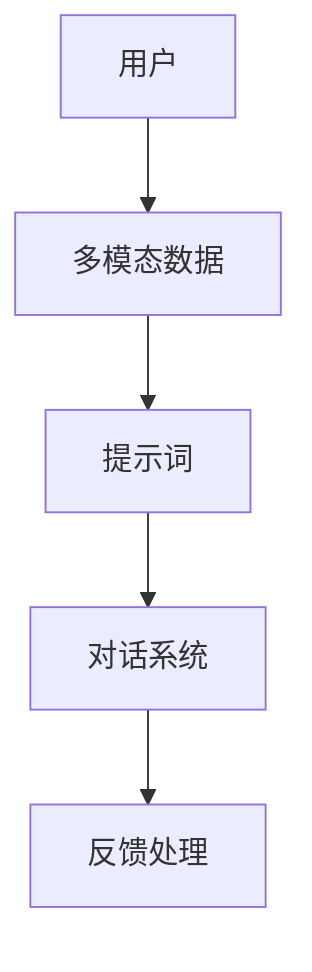
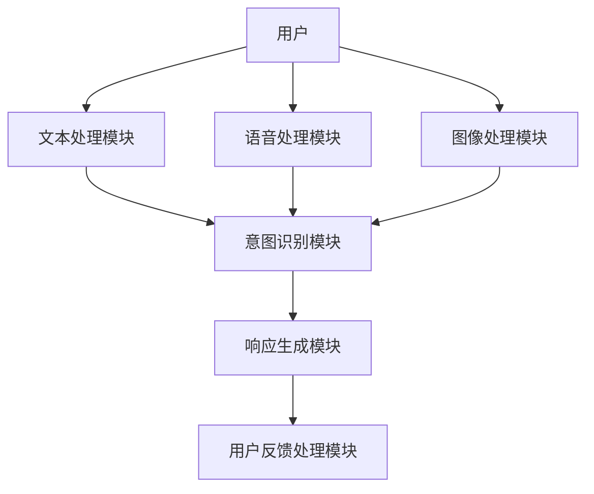
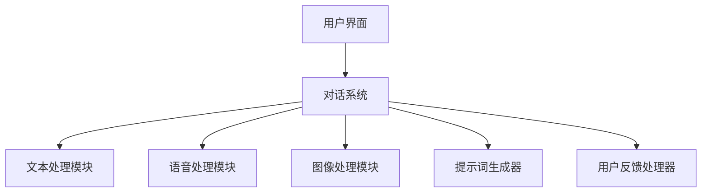
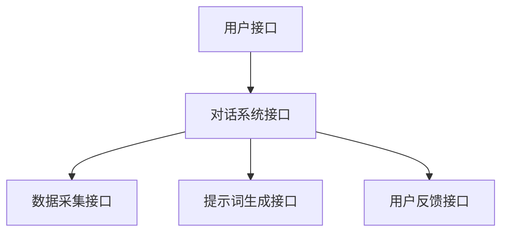
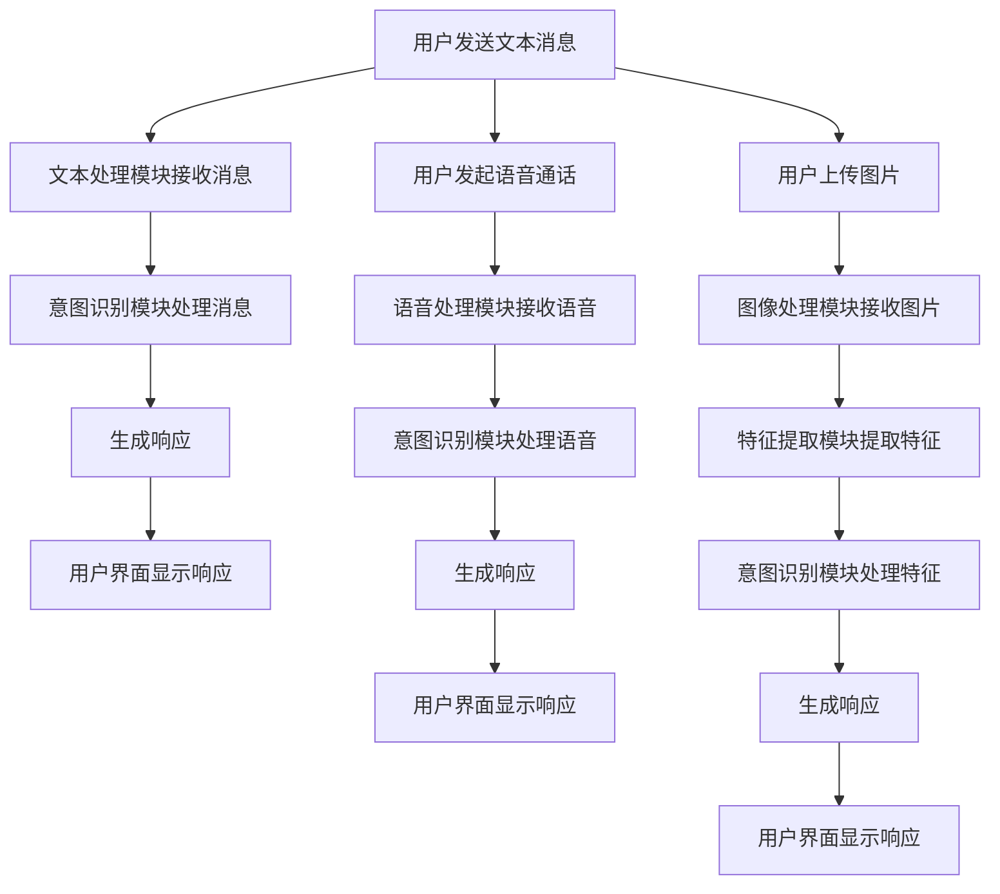

                 


### 引言

在当今快速发展的信息技术时代，人工智能（AI）技术已经深入到我们生活的方方面面，从智能家居到自动驾驶，从医疗诊断到金融分析，AI的应用场景愈发广泛。而在众多AI应用中，多模态对话系统逐渐成为了一个热门的研究领域。这种系统不仅能够处理文本，还能够处理图像、声音等多种形式的信息，从而为用户提供更加丰富和自然的交互体验。

**问题背景**：

随着社交媒体、电子商务、智能客服等领域的兴起，用户对对话系统的需求日益增加。传统的单模态对话系统虽然能够处理文本交互，但在应对复杂多变的用户需求时显得力不从心。例如，在处理带有视觉信息的请求时，系统可能无法准确理解用户的意图；而在处理语音请求时，系统可能无法准确识别用户的语音。因此，如何设计一个高效、准确的多模态对话系统，成为当前AI领域中的一个重要课题。

**传统对话系统的局限性**：

传统对话系统主要依赖于文本输入和输出，这种单模态交互方式存在以下局限性：

1. **信息量不足**：文本仅能表达有限的信息，无法涵盖图像、声音等非文本信息。
2. **理解复杂请求的能力较弱**：对于需要结合多种感官信息才能理解的复杂请求，单模态系统难以准确把握用户意图。
3. **用户体验较差**：用户在交互过程中可能需要多次重复信息，以使系统能够理解其意图。

**多模态对话系统介绍**：

多模态对话系统通过整合多种数据源（如文本、图像、声音等），能够在不同程度上克服传统对话系统的局限性。这种系统不仅能够更好地理解用户的意图，还能提供更加自然、流畅的交互体验。

1. **多模态的定义**：多模态是指利用多种不同的感官数据进行信息处理和交互。在多模态对话系统中，文本、图像、声音等数据类型可以被同时处理和分析。
2. **多模态对话系统的优势**：
   - **提高理解准确性**：结合多种感官信息，系统能够更准确地理解用户意图。
   - **丰富用户体验**：用户可以通过多种方式与系统进行交互，获得更加自然和丰富的体验。
   - **应对复杂请求**：系统可以处理包含多种信息类型的复杂请求，提高交互的效率和效果。

**提示词工程的概念与作用**：

提示词工程是构建多模态对话系统的关键环节。它涉及提示词的设计、生成和优化，旨在提高对话系统的性能和用户体验。

1. **提示词工程的定义**：提示词工程是指利用自然语言处理、机器学习等技术，设计和生成用于引导对话的简短文本提示。
2. **提示词工程在多模态对话系统中的作用**：
   - **引导对话方向**：通过设计合适的提示词，系统能够引导用户进入正确的对话流程。
   - **增强理解能力**：结合多模态数据，提示词可以帮助系统更好地理解用户意图。
   - **优化交互体验**：提示词的优化可以提高对话的自然性和流畅性，使用户感到更加舒适。

**提示词工程的重要性**：

提示词工程在多模态对话系统中具有至关重要的地位。它不仅影响系统的性能，还直接关系到用户体验。

1. **提升对话系统的性能**：设计合理的提示词可以提高系统的响应速度和准确性，从而提升整体性能。
2. **改善用户体验**：通过优化提示词，系统可以提供更加自然、流畅的交互体验，使用户感到满意。

**本文结构**：

本文将首先介绍多模态对话系统的背景和概念，然后深入探讨提示词工程的原理和方法，最后通过具体案例和系统实现来展示提示词工程在实际应用中的重要作用。文章的主要内容包括：

1. **问题背景与多模态对话系统概述**：介绍多模态对话系统的应用需求和传统对话系统的局限性。
2. **核心概念与联系**：阐述多模态数据和提示词工程的概念，对比分析其特征，并展示ER实体关系图架构。
3. **算法原理**：详细讲解提示词生成和优化算法的原理，展示算法mermaid流程图，并提供实例分析。
4. **系统设计与实现**：分析系统架构、设计系统功能，并展示系统架构图、接口设计和交互序列图。
5. **项目实战**：介绍系统环境安装与配置、核心实现源代码、代码解读和分析、实际案例剖析及项目小结。

通过以上结构和内容的详细阐述，本文旨在为读者提供一份全面、系统的多模态对话系统与提示词工程的技术指南。

### 第一部分：背景与概念

#### 第1章：问题背景与多模态对话系统概述

##### 1.1.1 问题背景

随着互联网的普及和智能设备的广泛应用，用户对交互系统的需求日益多样化。传统的对话系统，如聊天机器人、智能客服等，主要依赖于文本输入和输出，这种单模态交互方式在面对复杂多变的用户需求时存在明显局限。例如，用户可能会发送包含图像、语音或视频等多媒体信息的请求，而单模态对话系统往往无法有效处理这些信息。这种局限性导致了用户体验的下降，也限制了对话系统在更广泛领域的应用。

**对话系统的应用需求**：

1. **多样化交互需求**：用户希望通过多种方式与系统进行交互，如文本、语音、图像等。
2. **个性化服务**：系统需要能够根据用户的偏好和历史行为提供个性化的服务和推荐。
3. **高效率问题解决**：用户希望系统能够快速、准确地理解并解决问题，提高交互效率。

**传统对话系统的局限性**：

1. **信息处理能力有限**：传统对话系统主要依赖于自然语言处理技术，虽然能够处理文本信息，但对于图像、声音等非文本信息处理能力较弱。
2. **理解复杂请求困难**：在处理包含多种信息类型的复杂请求时，系统可能无法准确理解用户意图。
3. **用户体验不佳**：单模态交互方式往往使得用户需要多次重复信息，以使系统能够理解其需求。

**多模态对话系统的优势**：

多模态对话系统通过整合多种数据源（如文本、图像、声音等），能够有效克服传统对话系统的局限性，提供更加丰富和自然的交互体验。

1. **提高理解准确性**：多模态数据可以提供更多的信息线索，帮助系统更准确地理解用户意图。
2. **丰富用户体验**：用户可以通过多种感官与系统进行交互，获得更加自然和丰富的体验。
3. **应对复杂请求**：系统可以处理包含多种信息类型的复杂请求，提高交互的效率和效果。

##### 1.1.2 多模态对话系统介绍

**多模态的定义**：

多模态（Multimodality）是指利用多种不同的感官数据进行信息处理和交互。在多模态对话系统中，文本、图像、声音等多种数据类型可以被同时处理和分析。

1. **文本**：文本是最常见的模态，它可以提供详细的描述信息，是其他模态的重要补充。
2. **图像**：图像能够直观地传达视觉信息，对于理解用户请求非常有帮助。
3. **声音**：声音可以提供音频信息，如用户的话语、音乐、声音效果等。

**多模态对话系统的优势**：

1. **提高理解准确性**：多模态数据可以提供更多的信息线索，帮助系统更准确地理解用户意图。
2. **丰富用户体验**：用户可以通过多种感官与系统进行交互，获得更加自然和丰富的体验。
3. **应对复杂请求**：系统可以处理包含多种信息类型的复杂请求，提高交互的效率和效果。

**多模态对话系统的应用领域**：

多模态对话系统在多个领域有着广泛的应用：

1. **智能客服**：通过语音、文本、图像等多种方式与用户交互，提供更加高效和自然的客服服务。
2. **智能家居**：通过语音和图像识别技术，实现家电设备的智能控制和管理。
3. **医疗健康**：通过多模态数据（如文本、图像、声音）辅助医生进行诊断和治疗。
4. **教育**：通过多模态交互，提供更加生动和有趣的学习体验。

##### 1.1.3 提示词工程的概念与作用

**提示词工程的定义**：

提示词工程（Prompt Engineering）是指利用自然语言处理、机器学习等技术，设计和生成用于引导对话的简短文本提示。这些提示词旨在帮助系统更好地理解用户意图，引导对话方向，优化用户体验。

**提示词工程在多模态对话系统中的作用**：

1. **引导对话方向**：提示词可以帮助系统确定对话的焦点，确保系统始终围绕用户的主要需求进行交互。
2. **增强理解能力**：结合多模态数据，提示词可以为系统提供额外的上下文信息，帮助系统更准确地理解用户意图。
3. **优化交互体验**：通过设计合适的提示词，系统可以提供更加自然、流畅的交互体验，使用户感到更加舒适。

**提示词工程的重要性**：

提示词工程在多模态对话系统中具有至关重要的地位。它不仅影响系统的性能，还直接关系到用户体验。

1. **提升系统性能**：设计合理的提示词可以提高系统的响应速度和准确性，从而提升整体性能。
2. **改善用户体验**：通过优化提示词，系统可以提供更加自然、流畅的交互体验，使用户感到满意。

**提示词工程的实现步骤**：

1. **需求分析**：了解用户的需求和意图，确定需要收集和处理的模态数据类型。
2. **数据准备**：收集和整理多模态数据，确保数据的完整性和质量。
3. **提示词设计**：根据需求分析结果，设计合适的提示词，包括文本内容和形式。
4. **优化与评估**：通过实验和用户反馈，不断优化提示词，提高其效果和用户体验。

**多模态对话系统与提示词工程的联系**：

多模态对话系统和提示词工程是相辅相成的。多模态对话系统提供了处理多种数据类型的能力，而提示词工程则为系统提供了有效的引导和优化手段。两者结合，可以构建一个高效、准确、用户友好的多模态对话系统。

1. **数据整合**：多模态对话系统整合了多种数据源，提示词工程则确保这些数据能够被有效利用。
2. **交互优化**：提示词工程通过优化提示词，提高了多模态对话系统的交互质量和用户体验。
3. **性能提升**：多模态对话系统和提示词工程的协同工作，可以显著提升系统的性能和效果。

通过以上对问题背景、多模态对话系统和提示词工程的详细介绍，我们可以看到，多模态对话系统与提示词工程在当前AI领域中的重要性日益凸显。本文接下来将进一步探讨多模态对话系统和提示词工程的核心概念及其相互联系。

### 第二部分：核心概念与联系

#### 第2章：核心概念与联系

在多模态对话系统中，核心概念与联系的理解对于构建高效、准确和用户友好的系统至关重要。本章将详细阐述多模态数据的采集与处理、提示词的设计与优化，并通过对比分析不同概念的特征，以及使用ER实体关系图架构来展示这些概念之间的联系。

##### 2.1.1 核心概念原理

**多模态数据的采集与处理**：

多模态对话系统的核心在于能够处理多种不同类型的数据，包括文本、图像、声音等。以下是对这些数据采集与处理的详细介绍：

1. **文本数据采集**：文本数据通常来自用户的输入，例如聊天消息、语音转文字等。系统需要对这些文本数据进行清洗、去噪和标准化处理，以便后续分析。
   
2. **图像数据采集**：图像数据可以来自用户的上传、摄像头捕捉等。系统需要使用图像识别技术来解析图像内容，提取关键特征，如人脸、物体、场景等。

3. **声音数据采集**：声音数据通常来自用户的语音输入。系统需要通过语音识别技术将声音转换为文本，以便进一步处理。

**提示词的设计与优化**：

提示词是多模态对话系统中的关键元素，它能够引导对话方向，提高用户交互体验。以下是提示词设计的主要步骤和优化方法：

1. **提示词设计步骤**：
   - **需求分析**：了解用户需求和对话目标，确定需要收集和处理的模态数据类型。
   - **模板设计**：根据需求分析结果，设计合适的文本模板，包括引导性问题、确认性问题等。
   - **多模态整合**：将不同模态的数据整合到提示词中，如结合文本和图像，提供更加丰富和直观的交互。

2. **提示词优化方法**：
   - **基于规则的优化**：通过预定义的规则，调整提示词的内容和形式，使其更符合用户需求和交互习惯。
   - **基于机器学习的优化**：使用机器学习算法，根据用户反馈和历史交互数据，自动调整和优化提示词，提高其效果。

##### 2.1.2 概念属性特征对比

| 概念       | 特征                                     |
|------------|----------------------------------------|
| 多模态数据 | 音频、文本、图像等多种数据格式         |
| 提示词     | 用于引导对话的简短文本提示             |

**多模态数据**：
- **来源多样**：文本、图像、声音等多种来源。
- **格式复杂**：需要不同处理技术（如文本处理、图像处理、语音处理）。
- **信息丰富**：能够提供详细的背景和上下文信息。

**提示词**：
- **文本简短**：通常是简短的句子或短语。
- **引导作用**：用于引导对话方向，提高交互效果。
- **灵活性高**：可以根据用户需求和对话内容进行动态调整。

##### 2.1.3 ER实体关系图架构

为了更好地理解多模态对话系统中各个概念之间的联系，我们可以使用ER实体关系图来展示其架构。以下是一个简化的ER图示例：



**ER图说明**：

- **用户**：用户是系统的最终服务对象，其输入的多模态数据（如文本、图像、声音）是系统处理的基础。
- **多模态数据**：包括文本、图像、声音等多种数据格式，这些数据通过数据采集和处理模块（如文本处理、图像处理、语音处理）进行处理。
- **提示词**：提示词是引导对话的重要元素，它结合多模态数据进行设计，用于引导对话方向。
- **对话系统**：对话系统是核心模块，负责处理用户输入的多模态数据，生成适当的响应，并通过反馈处理模块优化用户体验。
- **反馈处理**：用户反馈是系统不断改进和优化的关键，通过分析用户反馈，系统可以调整和优化提示词和对话流程。

通过上述核心概念原理、特征对比和ER实体关系图架构的详细阐述，我们可以更清晰地理解多模态对话系统与提示词工程之间的紧密联系。这些概念和方法为构建高效、准确的多模态对话系统提供了理论基础和实践指导。

### 第三部分：算法原理

#### 第3章：提示词工程的算法原理

在多模态对话系统中，提示词工程的核心在于设计有效的算法来生成和优化提示词。这些算法不仅能够提高对话系统的性能，还能够改善用户体验。本章将详细介绍提示词生成和优化算法的基本原理，包括基于规则的方法和基于机器学习的方法，并通过具体的数学模型和实例进行说明。

##### 3.1.1 提示词生成算法

**基于规则的方法**：

基于规则的方法是指通过预定义的规则来生成提示词。这种方法通常适用于对话系统中的常见场景，例如FAQ（常见问题解答）系统、简单的客户服务场景等。

1. **规则定义**：根据对话系统的需求和用户行为，定义一系列规则。这些规则可以是简单的逻辑判断，如匹配特定的关键词或短语，也可以是复杂的条件判断，如结合用户的历史行为和当前输入进行决策。
   
2. **提示词生成**：根据输入数据和预定义的规则，生成相应的提示词。例如，如果用户输入“我忘记密码了”，系统可以生成“您可以通过以下步骤重置密码：1. 输入您的邮箱地址；2. 点击发送验证邮件；3. 根据邮件中的链接重置密码。”这样的提示词。

**基于机器学习的方法**：

基于机器学习的方法是指通过训练模型来自动生成提示词。这种方法通常适用于复杂和动态变化的对话场景，如自然语言对话系统、虚拟助手等。

1. **数据准备**：收集大量的对话数据，包括用户输入、系统响应、用户反馈等。这些数据用于训练生成模型。

2. **模型训练**：使用自然语言处理（NLP）技术，如序列到序列（Seq2Seq）模型、变分自编码器（VAE）等，对收集的数据进行训练，以学习生成提示词的规律。

3. **提示词生成**：在训练完成后，使用训练好的模型根据用户输入生成相应的提示词。例如，如果用户输入“我想要买一台电视”，系统可以生成“以下是推荐的电视产品：1. 品牌A的X系列；2. 品牌B的Y系列；3. 品牌C的Z系列。”这样的提示词。

**比较分析**：

基于规则的方法和基于机器学习的方法各有优缺点：

- **优点**：
  - 基于规则的方法简单直观，易于实现和调试。
  - 基于机器学习的方法能够适应复杂和动态变化的对话场景，生成更加自然和个性化的提示词。

- **缺点**：
  - 基于规则的方法需要大量规则定义，且规则可能无法覆盖所有场景。
  - 基于机器学习的方法需要大量训练数据和计算资源，且模型训练和优化可能需要较长时间。

在实际应用中，这两种方法可以结合使用。例如，在对话系统的初始阶段，可以使用基于规则的方法快速生成提示词；随着用户交互数据的积累，可以逐步引入基于机器学习的方法，提高系统的自适应能力和用户体验。

##### 3.1.2 提示词优化算法

**基于信息熵的优化**：

信息熵是衡量信息不确定性的指标。在多模态对话系统中，基于信息熵的优化方法旨在通过减少信息熵来提高提示词的质量。

1. **信息熵计算**：对于给定的提示词，计算其信息熵。信息熵越低，表示提示词越能够减少用户的不确定性。

2. **优化策略**：通过调整提示词的内容和形式，降低信息熵。例如，如果用户输入“我想要买一本好书”，系统可以优化为“以下是推荐的书籍：1.《人工智能简史》；2.《深度学习》；3.《编程哲学》。这些书籍都是广受好评的佳作。”这样的提示词能够提供更加具体和明确的信息。

**基于协同过滤的优化**：

协同过滤是一种常用的推荐系统算法，它通过分析用户的兴趣和行为，为用户推荐相关的内容。

1. **用户兴趣分析**：通过分析用户的历史交互数据，识别用户的兴趣点。例如，如果用户经常购买科技类书籍，系统可以将其兴趣归类为“科技爱好者”。

2. **协同过滤推荐**：基于用户的兴趣点和系统的推荐策略，为用户生成相关的提示词。例如，如果用户输入“我想要买一本有趣的小说”，系统可以推荐“以下是推荐的小说：1.《三体》；2.《流浪地球》；3.《盗梦空间》。这些小说都是热门佳作，适合您阅读。”这样的提示词能够提供更加符合用户兴趣的内容。

**比较分析**：

基于信息熵的优化和基于协同过滤的优化方法各有优缺点：

- **优点**：
  - 基于信息熵的优化方法能够有效降低用户的不确定性，提高提示词的清晰度和准确性。
  - 基于协同过滤的优化方法能够根据用户的兴趣和行为，提供个性化的推荐和提示。

- **缺点**：
  - 基于信息熵的优化方法需要对用户意图进行准确识别和预测，这在复杂和动态变化的对话场景中可能较为困难。
  - 基于协同过滤的优化方法可能受到数据质量和推荐系统算法质量的影响，导致推荐结果不够准确。

在实际应用中，可以根据具体的对话场景和用户需求，结合使用这两种优化方法。例如，在处理用户查询时，可以首先使用基于信息熵的优化方法，确保提示词的清晰度和准确性；然后，使用基于协同过滤的优化方法，提供个性化的推荐和提示，提高用户的满意度。

##### 3.1.3 算法原理示例

**示例1：基于规则的方法**

假设用户输入“我想要买一台笔记本电脑”，系统需要生成相应的提示词。

1. **规则定义**：定义以下规则：
   - 如果用户输入包含“电脑”或“笔记本电脑”，则生成“以下是推荐的笔记本电脑：1. 品牌A的X系列；2. 品牌B的Y系列；3. 品牌C的Z系列。”
   - 如果用户输入包含“价格”或“预算”，则生成“我们的笔记本电脑根据价格分为高、中、低三个档次。请问您的预算是多少？”

2. **提示词生成**：根据用户输入“我想要买一台笔记本电脑”，系统生成“以下是推荐的笔记本电脑：1. 品牌A的X系列；2. 品牌B的Y系列；3. 品牌C的Z系列。”

**示例2：基于机器学习的方法**

假设用户输入“我想要买一本好书”，系统需要生成相应的提示词。

1. **数据准备**：收集大量用户对话数据，包括用户输入和系统响应。例如：
   - 用户输入：“我想要买一本好书”
   - 系统响应：“以下是推荐的书籍：1.《人工智能简史》；2.《深度学习》；3.《编程哲学》”

2. **模型训练**：使用序列到序列（Seq2Seq）模型对数据集进行训练，学习生成提示词的规律。

3. **提示词生成**：在训练完成后，使用训练好的模型根据用户输入“我想要买一本好书”生成“以下是推荐的书籍：1.《人工智能简史》；2.《深度学习》；3.《编程哲学》”。

**示例3：基于信息熵的优化**

假设用户输入“我想要买一本好书”，系统需要优化提示词。

1. **信息熵计算**：计算不同提示词的信息熵。例如：
   - 提示词1：“以下是推荐的书籍：1.《人工智能简史》；2.《深度学习》；3.《编程哲学》。”信息熵为5。
   - 提示词2：“以下是您可能感兴趣的书籍：1.《人工智能简史》；2.《深度学习》；3.《编程哲学》。如果您对其他类型的书籍感兴趣，请告诉我们。”信息熵为3。

2. **优化策略**：选择信息熵较低的提示词2，作为优化后的提示词。

**示例4：基于协同过滤的优化**

假设用户历史行为显示其喜欢科技类书籍，系统需要生成相应的提示词。

1. **用户兴趣分析**：根据用户的历史交互数据，识别用户对科技类书籍的兴趣。

2. **协同过滤推荐**：为用户推荐科技类书籍，如“以下是推荐的科技类书籍：1.《人工智能简史》；2.《深度学习》；3.《编程哲学》。如果您对这些书籍感兴趣，请点击了解更多。”

通过以上示例，我们可以看到不同算法原理在提示词工程中的应用，以及如何根据具体场景和需求进行选择和优化。这些算法不仅能够提高提示词的质量和准确性，还能够改善用户体验，为多模态对话系统的发展提供有力支持。

### 第四部分：系统设计与实现

#### 第4章：系统设计与实现

在多模态对话系统的设计和实现过程中，我们需要全面考虑系统架构、功能设计、接口设计以及交互序列。本章将详细探讨这些方面，并通过具体的架构图和代码示例，帮助读者理解多模态对话系统的实现细节。

##### 4.1.1 问题场景介绍

**多模态客服系统**：

我们以多模态客服系统为例，介绍其应用场景。多模态客服系统旨在为企业提供一个集语音、文本、图像等多种交互方式于一体的智能客服解决方案。用户可以通过文本聊天、语音通话、图片上传等多种方式进行咨询，系统则能够根据用户的需求，提供相应的服务和建议。

**应用场景描述**：

1. **文本咨询**：用户通过在线聊天窗口发送文本消息，咨询关于产品使用、售后服务等问题。
2. **语音通话**：用户通过电话或语音输入，与客服人员进行实时语音交流。
3. **图像上传**：用户上传产品图片，请求产品咨询或售后支持。

##### 4.1.2 系统功能设计

多模态客服系统的核心功能包括文本处理、语音处理、图像处理和用户反馈处理。以下是各功能模块的详细设计：

1. **文本处理模块**：负责接收用户文本输入，进行语义分析和意图识别，生成相应的文本响应。

2. **语音处理模块**：负责接收用户语音输入，通过语音识别技术将其转换为文本，再进行语义分析和意图识别。

3. **图像处理模块**：负责接收用户上传的图像，使用图像识别技术提取图像特征，辅助对话系统理解用户意图。

4. **用户反馈处理模块**：负责收集用户对系统服务的反馈，用于系统优化和改进。

**领域模型类图**：

以下是多模态客服系统的领域模型类图，展示了各功能模块及其关系：



##### 4.1.3 系统架构设计

多模态客服系统的架构设计需要考虑到模块的独立性、扩展性和灵活性。以下是系统架构的详细设计：

1. **用户界面**：提供文本聊天窗口、语音通话界面和图片上传功能，用户可以通过这些界面与系统进行交互。

2. **对话系统**：负责处理用户输入的多模态数据，通过文本处理、语音处理和图像处理模块，理解用户意图，生成相应的响应。

3. **多模态数据处理器**：包括文本处理模块、语音处理模块和图像处理模块，负责接收和处理不同类型的多模态数据。

4. **提示词生成器**：根据用户输入和系统状态，生成引导对话的文本提示词。

5. **用户反馈处理器**：负责收集用户反馈，用于系统优化和改进。

**系统架构图**：

以下是多模态客服系统的架构图，展示了各模块及其关系：



##### 4.1.4 系统接口设计

为了实现模块之间的有效通信和协作，我们需要设计一套完善的系统接口。以下是系统接口的详细设计：

1. **用户接口**：提供文本聊天接口、语音通话接口和图片上传接口，用户可以通过这些接口与系统进行交互。

2. **对话系统接口**：提供对文本处理模块、语音处理模块和图像处理模块的调用接口，以便对话系统能够处理不同类型的多模态数据。

3. **数据采集接口**：负责从用户界面收集文本、语音和图像数据，并传递给相应的处理模块。

4. **提示词生成接口**：提供提示词生成器的调用接口，以便在需要时生成引导对话的文本提示词。

5. **用户反馈接口**：提供用户反馈的提交接口，用于收集用户对系统服务的反馈。

**接口设计图**：

以下是多模态客服系统的接口设计图，展示了各接口及其关系：



##### 4.1.5 系统交互序列图

系统交互序列图描述了用户与系统之间的交互过程，包括用户输入、系统响应、数据流转等。以下是多模态客服系统的交互序列图：



##### 4.1.6 项目实战

**环境安装与配置**

为了实现多模态客服系统，我们需要安装和配置以下环境：

1. **Python环境**：确保Python版本为3.7及以上。
2. **自然语言处理库**：安装NLTK、spaCy、gensim等库。
3. **语音处理库**：安装pyttsx3、pyaudio等库。
4. **图像处理库**：安装opencv-python等库。
5. **深度学习库**：安装tensorflow、keras等库。

安装指南：

```bash
pip install nltk spacy gensim pyttsx3 pyaudio opencv-python tensorflow
```

**系统核心实现源代码**

以下是系统核心实现的源代码示例：

```python
# 文本处理模块
def process_text(text):
    # 进行文本预处理（如分词、去停用词等）
    # 进行意图识别
    # 生成响应
    return response

# 语音处理模块
def process_speech(speech):
    # 进行语音识别
    # 进行意图识别
    # 生成响应
    return response

# 图像处理模块
def process_image(image):
    # 进行图像预处理（如缩放、增强等）
    # 进行特征提取
    # 进行意图识别
    # 生成响应
    return response

# 提示词生成器
def generate_prompt(response):
    # 根据响应生成提示词
    return prompt

# 用户反馈处理器
def process_feedback(feedback):
    # 进行反馈处理
    # 用于系统优化和改进
    pass
```

**代码应用解读与分析**

以下是对核心实现源代码的解读和分析：

1. **文本处理模块**：负责接收用户文本输入，进行预处理（如分词、去停用词等），然后使用意图识别算法识别用户意图，最终生成响应。

2. **语音处理模块**：负责接收用户语音输入，通过语音识别技术将其转换为文本，再进行意图识别，生成响应。

3. **图像处理模块**：负责接收用户上传的图像，进行预处理（如缩放、增强等），提取特征，再进行意图识别，生成响应。

4. **提示词生成器**：根据系统生成的响应，设计合适的提示词，用于引导对话方向和优化用户体验。

5. **用户反馈处理器**：负责收集用户反馈，用于系统优化和改进，如调整意图识别算法、优化提示词生成策略等。

**实际案例分析与详细讲解**

以下是一个实际案例，展示多模态客服系统的应用：

**用户请求**：用户通过文本聊天窗口发送消息：“我想要咨询关于产品的售后服务。”

**系统响应**：

1. **文本处理模块**：识别到用户意图为“咨询售后服务”，生成响应：“您好，关于产品的售后服务，您可以联系我们的客服电话：123456789，或者通过在线聊天窗口咨询。”

2. **语音处理模块**：用户通过语音通话请求：“我想要咨询关于产品的售后服务。”

   系统响应：“您好，关于产品的售后服务，您可以联系我们的客服电话：123456789，或者通过在线聊天窗口咨询。”

3. **图像处理模块**：用户上传一张产品图片，请求：“这张产品图片的售后服务是如何的？”

   系统响应：“您好，根据您上传的产品图片，我们为您提供了以下售后服务信息：1. 三年质保；2. 免费上门维修；3. 24小时客服支持。”

通过上述案例，我们可以看到多模态客服系统如何结合文本、语音和图像等多种模态，提供全面、个性化的服务，满足用户的多样化需求。

**项目小结**

多模态客服系统通过整合文本、语音和图像等多种模态，为用户提供了一种高效、自然的交互方式。系统设计和实现过程中，我们详细探讨了系统架构、功能设计、接口设计和交互流程，并通过具体案例展示了系统的应用效果。未来，随着AI技术的不断进步，多模态客服系统将更加智能化，为用户提供更加优质的服务体验。

### 第五部分：总结与展望

在本文中，我们深入探讨了多模态对话系统及其关键组成部分——提示词工程。通过详细分析问题背景、核心概念、算法原理以及系统设计与实现，我们展示了多模态对话系统在应对复杂用户需求、提升交互体验和改善系统性能方面的显著优势。

**核心观点总结**：

1. **多模态对话系统的优势**：通过整合文本、图像、声音等多种模态，多模态对话系统能够更准确地理解用户意图，提供更加自然和丰富的交互体验。

2. **提示词工程的重要性**：提示词工程在多模态对话系统中扮演着关键角色，它不仅能够引导对话方向，提高理解能力，还能优化交互体验，提升系统性能。

3. **算法原理的多样化**：基于规则和机器学习的提示词生成和优化算法为多模态对话系统提供了灵活的解决方案，满足了不同场景下的需求。

4. **系统设计与实现的实用性**：通过详细的系统架构设计和实际案例展示，我们展示了如何将多模态对话系统与提示词工程应用于实际项目，实现高效的系统性能和良好的用户体验。

**最佳实践 tips**：

1. **需求分析与设计**：在设计和实现多模态对话系统时，首先进行详细的需求分析，明确用户需求和应用场景，这将有助于优化系统的功能和性能。

2. **数据准备与处理**：确保多模态数据的完整性和质量，通过有效的数据预处理方法，提高数据利用率。

3. **算法优化**：结合具体应用场景，选择合适的提示词生成和优化算法，并通过持续优化，提高系统的自适应能力和用户体验。

4. **用户反馈与迭代**：收集用户反馈，及时调整和优化系统功能，确保系统始终符合用户需求。

**小结**：

本文系统地介绍了多模态对话系统与提示词工程的原理、方法和应用。通过理论与实践的结合，我们展示了如何构建高效、准确和用户友好的多模态对话系统。未来，随着人工智能技术的不断发展，多模态对话系统有望在更广泛的领域中发挥重要作用，为用户提供更加智能、便捷的交互体验。

**注意事项**：

1. **隐私保护**：在设计多模态对话系统时，务必重视用户隐私保护，确保数据安全和用户隐私不被泄露。

2. **性能优化**：在实际应用中，需要不断优化系统性能，确保系统在高负载情况下仍能稳定运行。

3. **持续学习**：多模态对话系统需要不断学习和适应用户行为，因此，持续的数据采集和模型更新至关重要。

**拓展阅读**：

1. **《多模态对话系统设计与实现》**：本书详细介绍了多模态对话系统的设计、实现和优化方法，适合从事相关领域的研究和实践者阅读。
2. **《提示词工程：自然语言处理应用指南》**：本书专注于提示词工程在自然语言处理领域的应用，提供了丰富的实例和案例，有助于深入理解提示词工程的核心概念和技术。

通过本文的学习，读者可以系统地掌握多模态对话系统和提示词工程的相关知识，为未来的研究和应用打下坚实基础。希望本文能为广大AI技术爱好者提供有益的参考和启发。作者：AI天才研究院/AI Genius Institute & 禅与计算机程序设计艺术 /Zen And The Art of Computer Programming。

