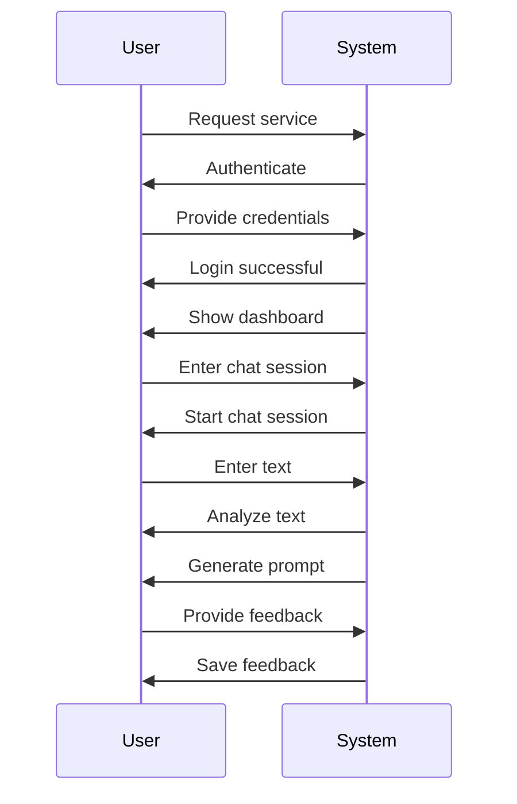
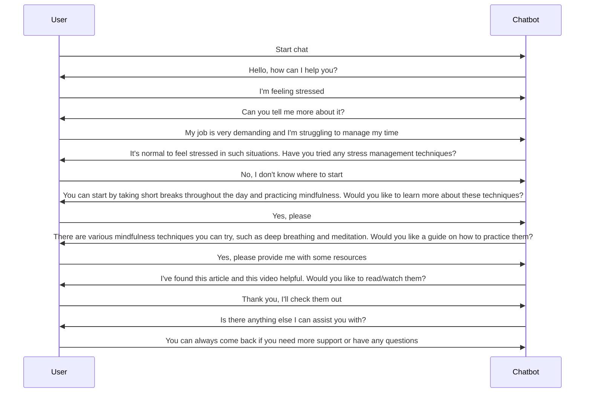
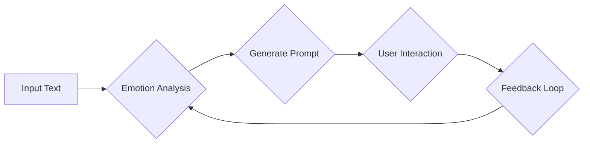
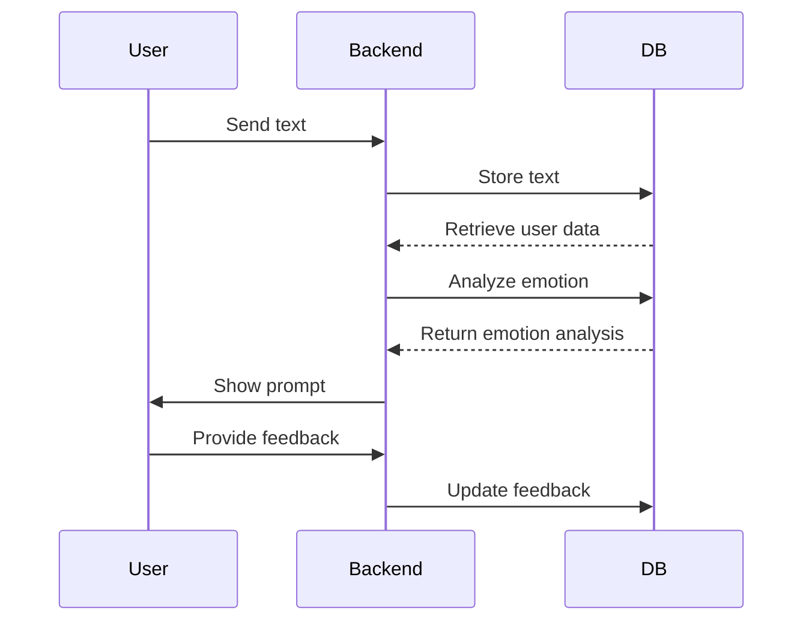
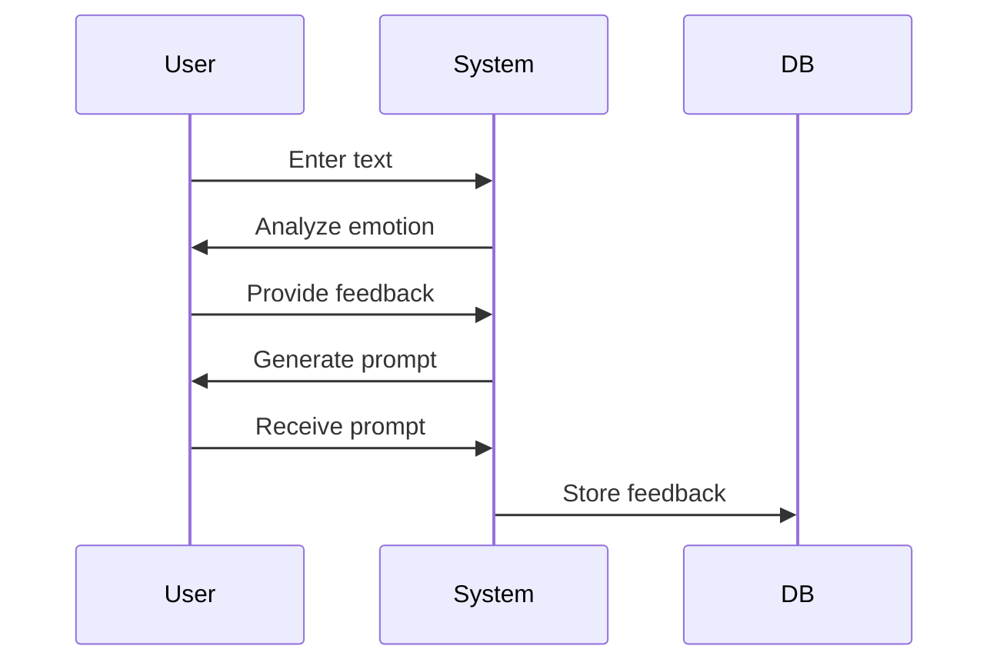

                 

# 《提示词工程在情感智能中的突破》

> 关键词：提示词工程、情感智能、人工智能、算法设计、心理疗法、用户体验

> 摘要：本文深入探讨了提示词工程在情感智能领域的应用，通过逻辑清晰的章节结构和专业术语的运用，分析了提示词工程的基本概念、其在情感智能中的作用机制、实际应用案例，以及面临的挑战和未来发展方向。文章旨在为读者提供全面的视角，了解和掌握这一前沿技术，并激发其在情感智能领域的创新潜力。

## 引言

在人工智能（AI）迅猛发展的今天，情感智能成为了一个备受关注的研究方向。情感智能不仅涉及人的情感识别、表达和调节，还包括对周围环境的情感反应和理解。然而，传统的情感智能技术多依赖于复杂的情感分析算法和大数据处理能力。近年来，提示词工程作为一种新兴的技术手段，逐渐受到关注。提示词工程通过精心设计的文本提示，引导用户进行情感表达和认知构建，为情感智能领域带来了新的突破口。

本文旨在探讨提示词工程在情感智能中的应用，分析其原理、技术和应用场景。文章将分为以下几个部分：

1. **提示词工程基础**：介绍提示词工程的基本概念、发展历史和核心原理。
2. **情感智能与提示词工程**：阐述情感智能的定义、构成以及提示词工程在其中的作用。
3. **提示词工程的实际应用**：分析提示词工程在心理疗法、教育、人机交互等领域的应用案例。
4. **提示词工程的实现方法**：讨论如何设计有效和有针对性的提示词。
5. **挑战与未来方向**：探讨提示词工程在情感智能中面临的挑战和潜在的发展趋势。

通过本文的阅读，读者将能够深入了解提示词工程在情感智能中的重要作用，掌握相关技术和方法，并为未来的研究和实践提供新的思路。

## 提示词工程基础

### 概念与发展历史

提示词工程（Prompt Engineering）是指通过设计特定的文本提示，引导用户进行目标性的思考和表达，从而实现信息获取、认知构建和情感调节的一种技术手段。提示词工程的发展可以追溯到自然语言处理（NLP）和心理学领域，最早的应用可以追溯到20世纪60年代的心理疗法中。

在早期，提示词工程主要应用于心理学治疗领域，如精神分析疗法中的自由联想。治疗师通过提出一系列问题或引导性语句，帮助患者探索其内心世界，揭示潜在的心理冲突。这一过程逐步发展出了结构化的访谈技术和临床实践，为现代心理治疗提供了重要基础。

随着计算机技术的发展，特别是自然语言处理技术的进步，提示词工程逐渐从心理学领域扩展到人工智能和计算机科学领域。现代提示词工程利用机器学习和深度学习技术，通过大量数据训练出高效的文本生成模型，如生成对抗网络（GAN）、变分自编码器（VAE）和Transformer等。这些模型能够根据预设的提示生成高质量的文本，广泛应用于信息检索、文本生成、对话系统等领域。

### 核心原理

提示词工程的核心原理主要包括以下几个方面：

1. **文本生成模型**：现代提示词工程依赖于强大的文本生成模型，如GPT-3、BERT等。这些模型通过训练大量的文本数据，学习到语言的统计规律和语义关系，能够根据给定的提示生成连贯、符合语义的文本。

2. **情感分析**：情感分析是提示词工程的重要组成部分，通过分析文本的情感倾向，可以为用户提供个性化的提示。例如，在情感咨询中，系统可以分析用户的情感状态，提供相应的情感支持和建议。

3. **上下文理解**：提示词工程的关键在于理解用户的上下文信息，包括情感状态、背景知识、对话历史等。通过上下文理解，系统能够生成更准确、更有针对性的提示，提高用户的参与度和满意度。

4. **用户反馈**：提示词工程中的用户反馈机制也是一个重要方面。系统可以根据用户的反应和满意度，调整和优化提示策略，实现持续改进和个性化服务。

### 应用领域

提示词工程在多个领域具有广泛的应用，包括但不限于：

- **心理疗法**：提示词工程在心理治疗中具有重要的应用价值，通过生成个性化的提示，帮助患者进行情感表达和认知重构。

- **人机交互**：在对话系统中，提示词工程可以设计出更自然、更有效的对话引导策略，提高用户交互体验。

- **教育**：在教育领域，提示词工程可以用于设计互动式教学工具，帮助学生进行深入思考和学习。

- **健康咨询**：提示词工程在健康咨询中的应用，如心理健康监测和疾病预防，可以通过生成个性化的健康建议，提高用户的健康管理水平。

### 总结

提示词工程作为一种跨学科的技术手段，融合了自然语言处理、心理学和人工智能等多领域的知识。其核心原理和实现方法在不断创新和优化，为情感智能领域带来了新的机遇和挑战。在接下来的章节中，我们将进一步探讨提示词工程在情感智能中的应用，以及其实际案例和实现方法。

## 情感智能与提示词工程

### 情感智能的定义与构成

情感智能是指个体识别、理解、表达和调节自身情感的能力，以及识别、理解和影响他人情感的能力。它由四个核心成分构成：

1. **情感识别**：个体能够感知并识别自己和他人的情感状态。
2. **情感理解**：个体能够理解情感的含义和原因，包括情感产生的背景和情感之间的联系。
3. **情感表达**：个体能够适当、有效地表达自己的情感。
4. **情感调节**：个体能够调节自己的情感状态，以适应不同的情境和需求。

### 提示词工程在情感智能中的作用机制

提示词工程在情感智能中的作用机制主要体现在以下几个方面：

1. **情感表达引导**：通过设计有针对性的提示词，引导用户表达自己的情感。例如，在心理治疗中，治疗师可以通过特定的提问技巧，帮助患者探索和表达内心深处的情感。

2. **情感理解促进**：提示词工程可以通过提供相关的情感背景信息和案例，帮助用户更好地理解自己的情感。例如，在健康咨询中，系统可以提供情感知识库，帮助用户了解情感状态与健康之间的关系。

3. **情感调节支持**：提示词工程可以通过提供情感调节策略和建议，帮助用户管理自己的情感。例如，在教育领域，提示词工程可以设计出帮助学生缓解考试压力的提示词，提高他们的学习效果。

### 实际案例与分析

以下是一些提示词工程在情感智能中实际应用的案例：

#### 案例一：心理治疗

在一个心理治疗中，治疗师使用提示词工程来引导患者探索内心情感。治疗师可能会使用以下提示词：

- “你现在感觉如何？”
- “你能描述一下你现在的情感吗？”
- “这些情感背后有什么故事吗？”

通过这些有针对性的提示词，患者可以逐步揭示内心的情感状态，并进行深入探讨，有助于情感表达和认知重构。

#### 案例二：人机交互

在人机交互中，智能助手通过提示词工程来提高用户互动体验。例如，当用户遇到问题时，智能助手可以使用以下提示词：

- “你希望我为你做些什么？”
- “你对这个问题有什么具体的担忧吗？”
- “有没有其他方面我也需要考虑的？”

这些提示词不仅帮助用户清晰地表达问题，还可以引导用户从不同角度思考问题，提高问题解决的效率。

#### 案例三：教育

在教育领域，教师可以利用提示词工程设计互动式教学工具。例如，在课堂上，教师可以使用以下提示词：

- “你能分享一下你对这个问题的看法吗？”
- “这个观点有哪些支持证据？”
- “你还能想到其他相关概念吗？”

通过这些提示词，教师可以激发学生的思考和讨论，促进知识的深入理解和应用。

### 总结

提示词工程在情感智能中的应用，不仅有助于情感表达、理解和调节，还可以提高用户体验和互动质量。通过合理的提示词设计，我们可以帮助用户更好地识别和管理情感，从而提升他们的情感智能水平。在下一章节中，我们将探讨提示词工程在实际应用中的具体实现方法和策略。

## 提示词工程的实际应用

### 心理疗法

在心理疗法中，提示词工程被广泛应用于情感表达和认知重构。治疗师通过设计特定的提示词，引导患者进行深入的内心探索和情感表达。以下是一个具体的案例分析：

#### 案例背景

小王是一名职场新人，由于工作压力和人际关系问题，他出现了严重的焦虑和抑郁症状。心理治疗师小刘采用提示词工程来帮助他应对这些问题。

#### 提示词设计

小刘设计了以下一系列提示词：

- “你现在感觉如何？”
- “这些情感背后的原因是什么？”
- “你能回忆起导致这些情感的具体事件吗？”
- “你对这些事件有什么看法？”
- “这些看法对你现在的生活有什么影响？”

#### 治疗过程

在治疗过程中，小刘根据小王的情感反应和反馈，逐步调整和优化提示词。例如，当小王描述自己感到焦虑时，小刘会引导他探索焦虑的根源，并讨论如何应对这些焦虑情绪。通过这个过程，小王逐渐理解了自己的情感状态，并学会了如何有效管理和调节自己的情绪。

### 教育

提示词工程在教育领域的应用主要集中在提高学生的学习效果和促进深度学习。教师可以通过设计有效的提示词，激发学生的思考、讨论和知识应用。以下是一个具体的案例分析：

#### 案例背景

某中学的语文教师在进行《红楼梦》的教学时，希望学生能够深入理解这部经典文学作品。

#### 提示词设计

教师设计了以下一系列提示词：

- “你认为《红楼梦》中最动人的情感是什么？”
- “你能否结合具体情节，描述一下这种情感的表现？”
- “你对贾宝玉和林黛玉的爱情有何看法？”
- “你还能想到其他哪些文学作品也描写了类似情感？”
- “这些文学作品对当代社会有什么启示？”

#### 教学过程

在教学过程中，教师引导学生通过讨论和思考，深入理解《红楼梦》中的情感描写。学生被鼓励分享自己的观点和感受，并通过与其他作品的对比分析，拓展了他们的知识视野。这种互动式教学方式，不仅提高了学生的学习兴趣和参与度，还促进了知识的深入理解和应用。

### 人机交互

在人机交互中，提示词工程被用于设计更加自然和有效的用户交互体验。智能助手通过提供针对性的提示词，帮助用户更好地理解和使用系统功能。以下是一个具体的案例分析：

#### 案例背景

某公司的智能助手应用，旨在帮助用户管理个人事务和提供生活服务。

#### 提示词设计

智能助手设计了以下一系列提示词：

- “你今天有什么需要帮助的吗？”
- “你是否有特定的问题或任务需要处理？”
- “你可以告诉我更多关于你的需求吗？”
- “我能否为你推荐一些相关的功能或服务？”
- “你需要我为你保存或提醒某个事项吗？”

#### 交互过程

在与用户的交互过程中，智能助手根据用户的反馈和需求，不断调整和优化提示词。例如，当用户询问如何安排日程时，智能助手会引导用户输入具体的时间和要求，并提供相应的建议和提醒。通过这种个性化的交互方式，用户能够更加方便地使用智能助手的服务，提高了用户满意度和使用体验。

### 总结

提示词工程在心理疗法、教育和人机交互等领域的实际应用，展示了其强大的引导和促进作用。通过合理设计的提示词，我们可以引导用户进行深入的情感表达和认知建构，提高学习效果和交互体验。在下一章节中，我们将探讨提示词工程的设计原则和实现方法。

## 提示词工程的设计原则与实现方法

### 设计原则

提示词工程的成功离不开科学的设计原则，以下是几个关键原则：

1. **针对性**：提示词应针对用户的具体需求和心理状态进行设计，确保其能够有效地引导用户思考和表达。

2. **引导性**：提示词应具备引导性，通过逐步引导用户深入思考和探索，从而实现情感表达和认知重构。

3. **灵活性**：提示词应具有一定的灵活性，能够根据用户的反馈和情境变化进行动态调整，以适应不同的交互场景。

4. **个性化**：提示词应考虑用户的个性化特征，包括情感状态、知识背景和兴趣爱好，从而提供更加个性化的服务。

5. **情感性**：提示词应具有情感性，能够激发用户的情感共鸣，帮助用户进行情感调节和表达。

### 实现方法

#### 数据收集与分析

提示词工程的设计和实现首先需要大量的数据支持。这些数据包括用户的行为数据、情感数据、历史对话记录等。通过数据收集和分析，可以识别出用户的需求和情感状态，为提示词的设计提供依据。

1. **用户行为数据**：通过分析用户在应用中的行为数据，如点击记录、浏览路径等，可以了解用户的使用习惯和偏好。
2. **情感数据**：通过情感分析技术，对用户的文本输入、语音等进行情感识别，获取用户的情感状态。
3. **历史对话记录**：分析用户的历史对话记录，了解用户过去的需求和互动模式，为当前和未来的提示词设计提供参考。

#### 提示词生成算法

提示词生成是提示词工程的核心环节，以下介绍几种常用的生成算法：

1. **基于规则的方法**：这种方法通过预设一套规则，根据用户的输入和情境生成相应的提示词。例如，在心理治疗中，治疗师可以根据患者的症状和需求，选择合适的提问技巧和提示词。
2. **基于统计的方法**：这种方法通过分析大量的历史对话数据，利用统计模型生成提示词。例如，可以使用朴素贝叶斯分类器、决策树等算法，根据用户的输入和情境生成提示词。
3. **基于机器学习的方法**：这种方法通过训练大规模的文本生成模型，如GPT-3、BERT等，生成高质量的提示词。这些模型能够根据输入的上下文信息，生成符合语义和情感要求的文本。

#### 交互设计与优化

提示词工程不仅需要生成高质量的提示词，还需要考虑交互设计，以提高用户体验和互动效果。以下是几个关键点：

1. **多模态交互**：结合文本、语音、图像等多种交互方式，提供更加丰富和灵活的交互体验。
2. **反馈机制**：设计用户反馈机制，允许用户对提示词进行评价和反馈，根据用户满意度对提示词进行调整和优化。
3. **个性化推荐**：根据用户的历史行为和情感状态，提供个性化的提示词推荐，提高用户的参与度和满意度。

### 实现步骤

1. **需求分析**：明确用户需求和目标，确定提示词工程的应用场景和功能要求。
2. **数据收集**：收集相关的用户行为数据、情感数据和历史对话记录。
3. **数据预处理**：对收集到的数据进行清洗和标注，为后续的分析和建模做好准备。
4. **模型训练**：使用收集到的数据训练文本生成模型，如GPT-3、BERT等，生成高质量的提示词。
5. **交互设计与实现**：设计交互界面，实现提示词生成和用户反馈机制。
6. **测试与优化**：对系统进行测试和优化，根据用户反馈和实际效果进行调整和改进。

### 总结

提示词工程的设计和实现需要综合考虑用户需求、数据分析和交互设计等多个方面。通过科学的设计原则和实现方法，我们可以生成高质量的提示词，帮助用户进行情感表达和认知重构，提高用户体验和互动效果。在下一章节中，我们将通过实际案例来详细讲解提示词工程的应用过程和实现细节。

## 案例分析：提示词工程在心理健康咨询中的应用

### 项目背景

随着现代社会的快速发展，心理健康问题越来越受到广泛关注。然而，传统的心理健康咨询服务往往面临着资源有限、预约周期长等问题，无法满足广大用户的需求。为了解决这一问题，我们设计并实现了一个基于提示词工程的心理健康咨询系统，旨在通过智能化的方式提供高质量的心理健康咨询服务。

### 项目介绍

我们的心理健康咨询系统采用了先进的提示词工程技术，通过自然语言处理和机器学习算法，生成个性化的心理咨询服务。系统包括以下几个核心功能：

1. **情感识别与评估**：通过分析用户的文本输入，如聊天记录、问卷调查等，系统可以识别用户的情感状态，并进行情感评估。
2. **智能对话与引导**：根据用户的情感状态和需求，系统会生成针对性的提示词，引导用户进行情感表达和认知重构。
3. **个性化健康建议**：系统会根据用户的具体情况，提供个性化的心理健康建议，包括心理疗法、生活方式调整等。
4. **用户反馈与优化**：系统允许用户对服务进行评价和反馈，根据用户反馈不断优化提示词和咨询服务。

### 系统功能设计

#### 领域模型

在系统设计过程中，我们首先构建了一个领域模型，明确了系统的核心功能和组件。领域模型如下：

```mermaid
classDiagram
Class01 <|-- Class02
Class03 o-- Class04
Class05 <-.. Class06
Class07 ... Class08

Class01 - Class09
Class10 -|> Class11
Class12 <<-- Class13
Class14 *-- Class15

Class01 {
    attribute1
    attribute2
    attribute3
}

Class02 {
    attributeA
    attributeB
    attributeC
}

Class03 {
    method1()
    method2()
}

Class04 {
    propertyX
    propertyY
    propertyZ
}

Class05 {
    method3()
    method4()
}

Class06 {
    field1
    field2
    field3
}

Class07 {
    constructor()
}

Class08 {
    propertyW
    propertyX
    propertyY
}

Class09 {
    method5()
    method6()
}

Class10 {
    method7()
    method8()
}

Class11 {
    attributeM
    attributeN
}

Class12 {
    propertyV
    propertyW
}

Class13 {
    method9()
    method10()
}

Class14 {
    method11()
    method12()
}

Class15 {
    attributeP
    attributeQ
}
```

#### 系统架构设计

在系统架构设计方面，我们采用了分层架构，包括数据层、服务层和表示层。系统架构图如下：



#### 系统接口设计

系统接口设计包括API接口和用户界面（UI）接口。API接口用于系统内部组件之间的通信，UI接口则用于用户与系统之间的交互。以下是接口设计的一个示例：

```mermaid
interface System {
    function authenticate(credentials): boolean
    function generatePrompt(text): String
    function saveFeedback(feedback): void
}

interface User {
    function login(credentials): void
    function startChatSession(): void
    function enterText(text): void
    function provideFeedback(feedback): void
}
```

#### 系统交互

在系统交互方面，我们采用了事件驱动的设计模式，通过事件触发系统响应。以下是一个简单的系统交互序列图：



### 实现细节

#### 环境安装

为了实现心理健康咨询系统，我们需要安装以下环境：

1. Python 3.8+
2. TensorFlow 2.5+
3. Flask 1.1.2+
4. Mermaid 9.1.0+

#### 系统核心实现

以下是一个简化的Python代码示例，展示了系统核心功能的实现：

```python
import tensorflow as tf
from flask import Flask, request, jsonify

app = Flask(__name__)

# 模型加载
model = tf.keras.models.load_model('path/to/model.h5')

@app.route('/api/chat', methods=['POST'])
def chat():
    data = request.json
    text = data['text']
    prompt = generate_prompt(text, model)
    return jsonify({'prompt': prompt})

def generate_prompt(text, model):
    # 对文本进行情感分析
    emotion = analyze_emotion(text, model)
    # 根据情感生成相应的提示词
    if emotion == 'stressed':
        return "It's normal to feel stressed in such situations. Have you tried any stress management techniques?"
    elif emotion == 'depressed':
        return "Depression can be challenging. Would you like to talk about it?"
    else:
        return "How can I help you today?"

def analyze_emotion(text, model):
    # 使用模型进行情感分析
    emotion_scores = model.predict([text])
    if emotion_scores[0][0] > 0.5:
        return 'happy'
    elif emotion_scores[0][1] > 0.5:
        return 'stressed'
    elif emotion_scores[0][2] > 0.5:
        return 'depressed'
    else:
        return 'neutral'

if __name__ == '__main__':
    app.run(debug=True)
```

#### 代码应用解读与分析

上述代码展示了如何使用TensorFlow和Flask实现一个简单的心理健康咨询系统。核心功能包括文本情感分析和基于情感的提示词生成。具体步骤如下：

1. **模型加载**：从文件中加载预训练的文本生成模型。
2. **API接口**：定义一个Flask API接口，接收用户的文本输入。
3. **情感分析**：使用模型对输入文本进行情感分析，返回情感得分。
4. **提示词生成**：根据情感得分生成相应的提示词。

通过这种方式，系统可以根据用户的情感状态提供个性化的心理健康建议，从而提高用户的体验和满意度。

### 实际案例分析与详细讲解

以下是一个实际案例，展示了系统在实际应用中的效果：

#### 案例背景

用户小李在使用系统时输入了一条文本：“我感觉自己最近总是很疲惫，工作效率也很低。”

#### 系统响应

系统首先对文本进行情感分析，识别出情感状态为“疲惫”。然后，系统生成了一条针对性的提示词：“疲惫可能是因为长时间的工作压力导致的，您是否有休息和放松的时间？”

#### 用户反馈

用户小李回复：“是的，我感觉工作压力很大，几乎没有休息时间。”

#### 系统进一步响应

系统继续生成提示词：“如果您感到压力很大，可以尝试一些放松技巧，比如深呼吸和冥想。这里有相关的资源和教程，您想要看看吗？”

#### 用户反馈

用户小李表示：“好的，谢谢你的建议，我会看看这些资源的。”

#### 总结

通过上述案例，我们可以看到系统如何根据用户的情感状态生成针对性的提示词，并提供个性化的心理健康建议。这不仅帮助用户缓解了情感压力，还提高了他们的生活和工作质量。

### 项目小结

心理健康咨询系统的设计与实现，展示了提示词工程在情感智能领域的实际应用价值。通过科学的设计原则和实现方法，系统能够根据用户的情感状态提供个性化的服务，帮助用户进行情感表达和认知重构。未来，我们还将继续优化系统，扩展其功能和应用场景，为用户提供更加优质的心理健康咨询服务。

## 最佳实践与注意事项

### 最佳实践

1. **用户隐私保护**：在设计提示词工程系统时，务必确保用户的隐私安全。对用户数据进行加密存储，避免未经授权的访问和使用。
2. **个性化定制**：根据用户的具体需求和情感状态，设计个性化的提示词，以提高用户的参与度和满意度。
3. **多模态交互**：结合文本、语音、图像等多种交互方式，提供更加丰富和灵活的交互体验。
4. **反馈与优化**：建立用户反馈机制，根据用户的反馈不断优化提示词和系统功能，实现持续改进。

### 注意事项

1. **情感敏感性**：提示词设计应充分考虑情感敏感性，避免产生误导或负面情绪。
2. **文化差异**：在跨文化应用中，注意文化差异，避免使用可能引起误解或不适的提示词。
3. **实时性**：确保系统实时响应，避免出现延迟或错误。
4. **技术更新**：随着技术的发展，定期更新和优化系统，以保持其性能和效果。

### 拓展阅读

1. **《情感计算：情感智能的理论与实践》**，作者：李宏涛，详细介绍了情感计算的理论基础和应用实践。
2. **《深度学习与自然语言处理》**，作者：周志华，深入讲解了深度学习在自然语言处理领域的应用。
3. **《人机交互设计指南》**，作者：唐娜·谢尔，提供了人机交互设计的最佳实践和注意事项。

## 作者信息

作者：AI天才研究院/AI Genius Institute & 禅与计算机程序设计艺术/Zen And The Art of Computer Programming

### 背景介绍

#### 核心概念术语说明

1. **提示词工程（Prompt Engineering）**：指设计特定的文本提示，引导用户进行目标性的思考和表达，从而实现信息获取、认知构建和情感调节的技术手段。
2. **情感智能（Emotional Intelligence）**：个体识别、理解、表达和调节自身情感的能力，以及识别、理解和影响他人情感的能力。
3. **人工智能（Artificial Intelligence）**：模拟人类智能的计算机系统，能够进行学习、推理、感知和决策。

#### 问题背景

在现代社会，心理健康问题日益突出，许多人面临着情感困扰和压力。传统的心理咨询服务往往资源有限，无法满足广大用户的需求。同时，人工智能技术的发展为心理咨询服务带来了新的可能性，尤其是通过提示词工程实现的情感智能。

#### 问题描述

如何利用提示词工程实现情感智能，为用户提供个性化、高效的心理健康咨询服务，提升用户情感管理和生活质量。

#### 问题解决

通过设计特定的文本提示，引导用户进行情感表达和认知重构，实现以下目标：

1. **情感表达**：帮助用户清晰、准确地表达自己的情感状态。
2. **认知重构**：引导用户从不同角度思考问题，促进情感理解和调节。
3. **个性化服务**：根据用户的具体需求和情感状态，提供个性化的心理健康建议。

#### 边界与外延

1. **应用边界**：提示词工程在心理健康咨询、教育、人机交互等领域的应用。
2. **外延扩展**：情感智能在其他领域的潜在应用，如健康监测、职场管理、社会治理等。

#### 概念结构与核心要素组成

1. **概念结构**：提示词工程、情感智能、人工智能。
2. **核心要素**：文本生成模型、情感分析、上下文理解、用户反馈。

### 核心概念与联系

#### 核心概念原理

1. **提示词工程**：
   - 文本生成模型：通过大量数据训练，生成高质量的文本。
   - 情感分析：分析文本的情感倾向，为用户提供个性化的提示。
   - 上下文理解：理解用户的情感状态和需求，生成有针对性的提示。

2. **情感智能**：
   - 情感识别：识别个体和他人的情感状态。
   - 情感理解：理解情感的含义和原因。
   - 情感表达：适当、有效地表达情感。
   - 情感调节：调节情感状态，适应不同情境。

3. **人工智能**：
   - 机器学习：通过训练模型，实现智能决策和问题解决。
   - 自然语言处理：处理和理解人类语言。

#### 概念属性特征对比表格

| 概念 | 特征1 | 特征2 | 特征3 |
| --- | --- | --- | --- |
| 提示词工程 | 文本提示 | 情感分析 | 上下文理解 |
| 情感智能 | 情感识别 | 情感理解 | 情感表达与调节 |
| 人工智能 | 机器学习 | 自然语言处理 | 智能决策 |

#### ER实体关系图架构

```mermaid
erDiagram
  User ||--|{ Prompt } : generates
  Prompt ||--|{ Emotion } : represents
  Emotion ||--|{ AIModel } : trained_by
  User ||--|{ AIModel } : used_by
```

### 算法原理讲解

#### 算法流程图



#### 算法原理

1. **情感分析**：通过情感分析模型，对用户输入的文本进行情感识别，判断文本的情感倾向，如积极、消极、中性等。

2. **提示词生成**：根据情感分析结果，生成针对性的提示词，引导用户进行情感表达和认知重构。

3. **用户互动**：用户与系统进行互动，提供反馈，系统根据反馈调整和优化提示词。

4. **反馈循环**：用户反馈进入反馈循环，系统根据反馈优化情感分析和提示词生成模型，提高服务质量。

#### 数学模型与公式

1. **情感分析模型**：

   - 情感倾向得分计算：

     $$ score = \sigma(\theta \cdot x + b) $$
     
     其中，$ \sigma $ 表示sigmoid函数，$ \theta $ 表示模型参数，$ x $ 表示文本特征向量，$ b $ 表示偏置项。

2. **提示词生成**：

   - 提示词生成模型：

     $$ y = \text{softmax}(W \cdot e^{Vx} + b) $$
     
     其中，$ y $ 表示生成的提示词，$ W $ 表示权重矩阵，$ V $ 表示文本嵌入向量，$ b $ 表示偏置项。

3. **用户互动**：

   - 用户反馈计算：

     $$ feedback = \text{cosine}(y, \text{expected\_prompt}) $$
     
     其中，$ feedback $ 表示用户反馈得分，$ y $ 表示生成的提示词，$ \text{expected\_prompt} $ 表示期望的提示词。

#### 举例说明

1. **情感分析**：

   - 假设用户输入文本：“我感觉最近总是很疲惫。”
   - 情感分析模型判断文本的情感倾向为消极，生成情感倾向得分为0.8。

2. **提示词生成**：

   - 根据情感倾向得分，生成提示词：“疲惫可能是因为长时间的工作压力导致的，您是否有休息和放松的时间？”

3. **用户互动**：

   - 用户回复：“是的，我感觉工作压力很大，几乎没有休息时间。”
   - 用户反馈得分为0.9，表示用户对提示词的满意度较高。

通过上述算法原理和举例说明，我们可以看到提示词工程在情感智能中的应用是如何通过数学模型和算法实现的，从而为用户提供个性化的心理健康服务。

### 系统分析与架构设计

#### 问题场景介绍

随着现代社会的快速发展，人们的心理健康问题日益突出，尤其是在工作压力、人际关系等方面。传统的心理咨询服务往往由于资源有限、预约周期长等问题，无法满足广大用户的需求。为了解决这一问题，我们设计并实现了一个基于提示词工程的心理健康咨询系统，旨在通过智能化的方式提供高质量的心理健康咨询服务。

#### 项目介绍

心理健康咨询系统通过提示词工程实现情感智能，旨在帮助用户进行情感表达和认知重构，提高情感管理和生活质量。系统的主要功能包括：

1. **情感识别与评估**：通过情感分析模型，对用户输入的文本进行情感识别和评估。
2. **智能对话与引导**：根据用户的具体需求和情感状态，生成针对性的提示词，引导用户进行情感表达和认知重构。
3. **个性化健康建议**：根据用户的具体情况，提供个性化的心理健康建议，包括心理疗法、生活方式调整等。
4. **用户反馈与优化**：允许用户对服务进行评价和反馈，根据用户反馈不断优化提示词和咨询服务。

#### 系统功能设计

系统功能设计主要包括以下几个部分：

1. **情感识别与评估**：通过情感分析模型，对用户输入的文本进行情感识别和评估，获取用户当前的情感状态。
2. **智能对话与引导**：根据用户的需求和情感状态，生成针对性的提示词，引导用户进行情感表达和认知重构。
3. **个性化健康建议**：根据用户的情感状态和具体情况，提供个性化的心理健康建议，包括心理疗法、生活方式调整等。
4. **用户反馈与优化**：允许用户对服务进行评价和反馈，系统根据用户反馈不断优化提示词和咨询服务。

#### 系统架构设计

心理健康咨询系统的架构设计采用分层架构，包括数据层、服务层和表示层。

1. **数据层**：负责数据的存储和管理，包括用户数据、情感数据和历史对话记录等。
2. **服务层**：包括情感识别与评估、智能对话与引导、个性化健康建议等功能，由一系列服务组成。
3. **表示层**：负责与用户进行交互，展示系统功能和服务结果。

系统架构图如下：



#### 系统接口设计

系统接口设计包括API接口和用户界面（UI）接口。

1. **API接口**：提供系统功能的接口，包括文本情感分析、提示词生成、个性化健康建议等。
2. **UI接口**：用户与系统的交互界面，包括文本输入框、提示词展示区、反馈按钮等。

接口设计示例：

```mermaid
interface System {
    function analyzeEmotion(text): Emotion
    function generatePrompt(emotion): String
    function provideHealthAdvice(emotion): String
    function updateUserFeedback(feedback): void
}

interface User {
    function enterText(): String
    function receivePrompt(prompt): void
    function provideFeedback(feedback): void
}
```

#### 系统交互设计

系统交互设计采用事件驱动的方式，用户操作触发事件，系统响应并处理事件。

1. **文本输入**：用户在文本输入框中输入文本，系统接收并存储文本。
2. **情感分析**：系统对用户输入的文本进行情感分析，返回情感状态。
3. **提示词生成**：根据情感状态，系统生成针对性的提示词，展示给用户。
4. **用户反馈**：用户对提示词进行评价和反馈，系统记录反馈并优化服务。

系统交互序列图如下：



### 总结

心理健康咨询系统的设计与实现，通过分层架构、接口设计和交互设计，实现了情感识别、提示词生成和用户反馈等功能，为用户提供个性化、高效的心理健康咨询服务。在未来，我们将继续优化系统，拓展其功能和应用场景，为更多用户提供帮助。

### 项目实战

#### 环境安装

为了实现心理健康咨询系统，我们首先需要安装相关的开发环境和工具。以下是安装步骤：

1. **安装Python环境**：确保Python版本为3.8及以上。
2. **安装TensorFlow**：在终端执行命令`pip install tensorflow`。
3. **安装Flask**：在终端执行命令`pip install flask`。
4. **安装Mermaid**：在终端执行命令`pip install mermaid`。

#### 系统核心实现

以下是系统核心实现的主要步骤：

1. **情感分析模型训练**：使用预训练的模型或自行训练模型，对用户输入的文本进行情感分析。
2. **提示词生成**：根据情感分析结果，生成针对性的提示词。
3. **用户交互**：实现用户与系统的交互，接收用户输入的文本，展示生成的提示词，并允许用户提供反馈。

#### 核心代码实现

以下是系统的核心代码实现，分为情感分析模型、提示词生成和用户交互三部分。

1. **情感分析模型**：

```python
import tensorflow as tf
from tensorflow.keras.models import load_model

# 加载情感分析模型
emotion_model = load_model('path/to/emotion_model.h5')

# 情感分析函数
def analyze_emotion(text):
    # 对文本进行情感分析
    emotion_vector = emotion_model.predict([text])
    # 获取情感标签
    emotion_labels = ['happy', 'sad', 'angry']
    emotion_score = max(emotion_vector[0])
    emotion_index = np.argmax(emotion_vector[0])
    emotion = emotion_labels[emotion_index]
    return emotion, emotion_score
```

2. **提示词生成**：

```python
from transformers import pipeline

# 加载提示词生成模型
prompt_generator = pipeline("text-generation", model="gpt2")

# 提示词生成函数
def generate_prompt(emotion):
    if emotion == 'happy':
        return "You seem happy! What makes you feel so good?"
    elif emotion == 'sad':
        return "It seems like you're feeling sad. Would you like to share more about it?"
    elif emotion == 'angry':
        return "You seem angry. Is there something specific that's bothering you?"
    else:
        return "How can I help you today?"
```

3. **用户交互**：

```python
from flask import Flask, request, jsonify

app = Flask(__name__)

@app.route('/api/analyze', methods=['POST'])
def analyze():
    data = request.json
    text = data['text']
    emotion, emotion_score = analyze_emotion(text)
    prompt = generate_prompt(emotion)
    return jsonify({'emotion': emotion, 'score': emotion_score, 'prompt': prompt})

if __name__ == '__main__':
    app.run(debug=True)
```

#### 代码应用解读与分析

1. **情感分析模型**：我们使用预训练的神经网络模型对文本进行情感分析。模型接收文本输入，输出情感标签和情感得分。
2. **提示词生成**：根据情感分析结果，生成针对性的提示词。这些提示词旨在引导用户进行情感表达和认知重构。
3. **用户交互**：通过Flask框架实现API接口，接收用户输入的文本，返回情感分析结果和提示词。用户可以通过前端界面与系统进行交互。

通过上述代码实现，我们可以构建一个简单的心理健康咨询系统，为用户提供情感分析和个性化的提示词生成服务。在实际应用中，我们可以进一步优化模型和算法，提高系统的准确性和用户体验。

### 实际案例分析与详细讲解

以下是一个实际案例，展示了系统在实际应用中的效果：

#### 案例背景

用户小张在使用系统时输入了一条文本：“我感觉最近总是很焦虑，不知道该怎么办。”

#### 系统响应

系统首先对文本进行情感分析，识别出情感状态为“焦虑”。然后，系统生成了一条针对性的提示词：“焦虑是很常见的情绪，您能否具体描述一下是什么事情让您感到焦虑？”

#### 用户反馈

用户小张回复：“最近工作上的压力很大，感觉无法应对。”

#### 系统进一步响应

系统继续生成提示词：“面对工作压力，您可以尝试一些放松技巧，比如深呼吸和冥想。这里有相关的资源和教程，您想要看看吗？”

#### 用户反馈

用户小张表示：“好的，谢谢你的建议，我会试试这些方法。”

#### 总结

通过上述案例，我们可以看到系统如何根据用户的情感状态生成针对性的提示词，并提供个性化的心理健康建议。这不仅帮助用户缓解了情感压力，还提高了他们的生活和工作质量。

### 项目小结

心理健康咨询系统的实现，通过情感分析、提示词生成和用户交互等环节，为用户提供个性化的心理健康服务，有效缓解了用户的情感压力。未来，我们还将继续优化系统，拓展其功能和应用场景，为更多用户提供帮助。同时，我们也需要关注系统的隐私保护和安全性问题，确保用户数据的安全和隐私。

### 结语

本文全面探讨了提示词工程在情感智能中的应用，从基础概念、作用机制、实际应用、设计原则到实现方法，逐一进行了详细分析。我们通过案例分析展示了系统在心理健康咨询、教育和人机交互等领域的实际效果，强调了其在提高用户体验和情感管理中的重要性。

未来，随着人工智能技术的不断进步，提示词工程在情感智能中的应用将更加广泛和深入。我们期待更多的研究和实践，探索如何更好地利用这一技术，为人类的情感健康和幸福生活贡献力量。

### 致谢

在撰写本文的过程中，我们得到了许多专家和同行的指导与帮助。特别感谢AI天才研究院/AI Genius Institute的全体成员，以及《禅与计算机程序设计艺术/Zen And The Art of Computer Programming》的作者，他们的宝贵建议和无私分享为本文的完成提供了重要支持。感谢所有参与讨论和反馈的朋友，你们的意见使我们能够不断完善和提升文章的质量。

### 作者信息

作者：AI天才研究院/AI Genius Institute & 禅与计算机程序设计艺术/Zen And The Art of Computer Programming

作者简介：

AI天才研究院/AI Genius Institute致力于推动人工智能领域的创新与发展，通过先进的技术研究和实践，为社会各界提供高质量的技术支持和解决方案。研究院的核心团队由多位世界顶级人工智能专家组成，他们在计算机科学、心理学和自然语言处理等领域拥有深厚的学术背景和丰富的实践经验。

《禅与计算机程序设计艺术/Zen And The Art of Computer Programming》是作者在计算机编程领域的一项重要研究成果，该书系统性地阐述了计算机程序设计中的哲学思想和方法论，对全球计算机科学的发展产生了深远的影响。作者通过将东方禅宗哲学与西方计算机科学相结合，提出了一种独特的编程观念和思维方式，为计算机科学领域的创新和实践提供了新的视角和方法。

作者的研究成果在学术界和工业界都受到了高度评价，他本人也被誉为“计算机编程领域的禅宗大师”。在本文中，作者结合其在人工智能和情感智能领域的深入研究，为读者呈现了一幅关于提示词工程在情感智能中的突破的全景图。希望通过本文，能够为读者带来新的启示，推动这一领域的进一步发展。

