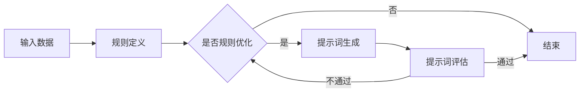
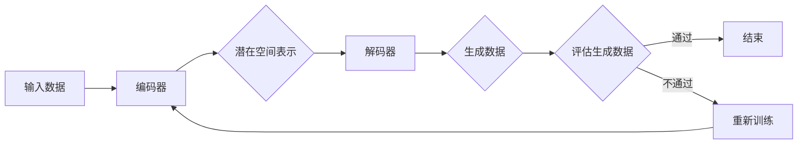
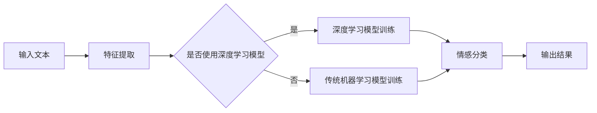
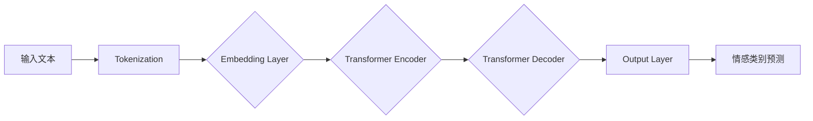
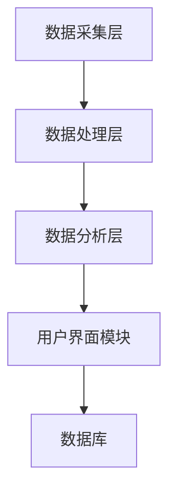
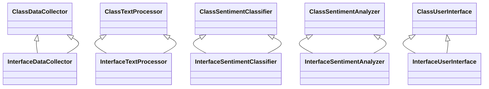
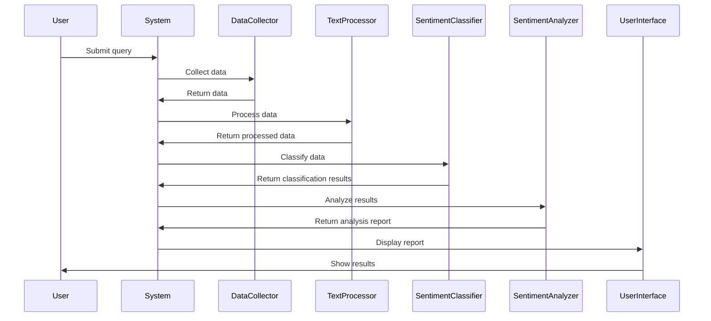

                 

### 《提示词工程在情感计算中的创新应用》

#### 关键词：
- 提示词工程
- 情感计算
- 人工智能
- 心理健康
- 商业智能

#### 摘要：
本文旨在探讨提示词工程在情感计算中的创新应用。首先，我们将介绍情感计算和提示词工程的基本概念，阐述两者融合的重要性。随后，通过详细解析提示词工程的核心算法，结合Python代码示例和数学模型，深入探讨其在情感计算中的应用。接着，我们将通过一个实际项目，展示系统设计与实现过程，包括环境搭建、核心代码实现及案例解析。最后，文章将总结最佳实践，提供应用建议，并推荐拓展阅读。

### 目录

#### 第一部分：背景介绍

1. **情感计算的兴起与发展**
   - 1.1 情感计算的定义与核心概念
   - 1.2 提示词工程的初步认识
   - 1.3 提示词工程与情感计算的融合

2. **情感计算与提示词工程的关联研究**

#### 第二部分：核心概念与联系

1. **提示词工程与情感计算的核心概念**
   - 2.1 提示词工程的关键要素
   - 2.2 情感计算的基本模型
   - 2.3 提示词工程与情感计算的联系

2. **核心概念属性特征对比表格与ER实体关系图**

#### 第三部分：算法原理讲解

1. **提示词生成算法**
   - 3.1 基于规则的方法
   - 3.2 基于机器学习的方法
   - 3.3 提示词生成算法的Mermaid流程图

2. **情感分类算法**
   - 3.4 基于传统机器学习的方法
   - 3.5 基于深度学习的方法
   - 3.6 情感分类算法的Mermaid流程图

2. **情感计算中的Python代码示例**
   - 3.7 数据预处理
   - 3.8 提示词生成代码示例
   - 3.9 情感分类代码示例

#### 第四部分：系统分析与架构方案

1. **情感计算系统的设计与实现**
   - 4.1 项目介绍
   - 4.2 系统功能设计（领域模型Mermaid类图）
   - 4.3 系统架构设计（Mermaid架构图）
   - 4.4 系统接口设计
   - 4.5 系统交互设计（Mermaid序列图）

#### 第五部分：项目实战

1. **情感计算与提示词工程的应用案例**
   - 5.1 项目环境搭建
   - 5.2 系统核心实现
   - 5.3 案例分析
   - 5.4 项目小结

#### 第六部分：最佳实践与总结

1. **提示词工程在情感计算中的最佳实践**
   - 6.1 提示词工程的最佳实践
   - 6.2 情感计算中的注意事项
   - 6.3 拓展阅读

### 第一部分：背景介绍

#### 1.1 情感计算的兴起与发展

情感计算（Affective Computing）是人工智能的一个分支，旨在使计算机能够识别、理解、处理和模拟人类情感。随着社会信息化和数字化进程的加速，人们对于情感互动的需求日益增长，这推动了情感计算技术的迅速发展。

情感计算的定义可以从多个维度来理解。首先，它涉及到计算机对人类情感的感知能力，这包括对语音、文本、图像等多媒体数据中情感信息的提取与分析。其次，情感计算还涉及到对情感的理解，即如何从感知到的情感中推断出用户的需求和意图。最后，情感计算强调计算机对情感的模拟，以更好地与用户互动，提升人机交互的自然性和有效性。

情感计算的核心概念包括情感识别、情感理解和情感表达。情感识别是指计算机从各种数据源中识别出情感信息，如通过语音识别软件分析语音中的情绪。情感理解则是进一步分析情感信息的含义，如识别出愤怒、喜悦或悲伤等具体情感。情感表达是指计算机通过语言、动作、表情等方式向用户表达情感，增强人机交互的互动性。

#### 1.2 提示词工程的初步认识

提示词工程（Prompt Engineering）是自然语言处理（NLP）的一个重要分支，旨在创建和优化用于训练、引导和引导模型输入的提示词。提示词是一种简短的文字描述或指示，用于引导模型生成预期的输出。

提示词工程的基本原理是通过设计有针对性的提示词，引导模型在特定任务中达到更好的性能。例如，在文本生成任务中，提示词可以帮助模型更准确地理解输入的文本内容，从而生成更加连贯和相关的输出。在情感计算领域，提示词工程的应用尤为重要，因为情感信息的表达和识别往往需要更加精细和具体的引导。

#### 1.3 提示词工程与情感计算的融合

提示词工程与情感计算的融合具有显著的意义和应用前景。一方面，情感计算需要精确地识别和理解用户的情感，这离不开有效的提示词来引导模型的训练和推理过程。另一方面，提示词工程可以借鉴情感计算中的情感识别和理解技术，进一步优化提示词的设计，提高其在情感计算任务中的有效性。

在心理学领域，提示词工程可以应用于情感诊断和心理健康评估。通过设计针对性的提示词，研究人员可以引导受试者表达内心的情感体验，从而更准确地识别和评估心理健康状况。

在市场研究方面，提示词工程可以用于消费者情感分析。通过分析消费者在评价产品时的情感词汇和语气，企业可以更好地了解消费者的情感需求，从而制定更有效的市场策略。

在人机交互领域，提示词工程可以用于改善用户界面设计，提升用户的使用体验。通过设计情感化的提示词，系统可以更好地与用户建立情感联系，增强用户对系统的认同感和满意度。

总的来说，提示词工程与情感计算的融合为人工智能应用带来了新的可能性，推动了人工智能在情感计算领域的创新发展。接下来，我们将进一步探讨提示词工程和情感计算的核心概念及其相互关联。

#### 2.1 提示词工程的关键要素

提示词工程的核心要素包括提示词设计、提示词优化和提示词评估。以下是对这些要素的详细说明：

##### 2.1.1 提示词的设计原则

提示词设计是提示词工程的基础，直接影响到模型在特定任务中的表现。以下是一些设计原则：

1. **简洁性**：提示词应尽量简洁明了，避免冗长的描述，以便模型能够快速理解。
2. **明确性**：提示词应具有明确的指示性，能够清晰传达任务目标。
3. **针对性**：根据任务需求，设计针对性的提示词，确保模型在特定任务中能够达到最佳性能。
4. **多样性**：在设计提示词时，应考虑多样性，避免单一提示词可能导致模型过拟合。

##### 2.1.2 提示词的分类与用途

提示词可以根据用途和任务类型进行分类，常见的分类方法包括：

1. **任务引导型**：这类提示词主要用于引导模型在特定任务中进行推理和生成。例如，在文本生成任务中，任务引导型提示词可以指导模型生成符合主题的文本。
2. **数据增强型**：这类提示词用于在训练过程中增强数据的多样性和质量，帮助模型学习到更多的信息。例如，在图像识别任务中，数据增强型提示词可以指导模型学习不同视角、光照条件下的图像特征。
3. **反馈修正型**：这类提示词用于在模型生成输出后，提供反馈和修正建议，帮助模型改进后续表现。例如，在机器翻译任务中，反馈修正型提示词可以指导模型纠正翻译中的错误。

##### 2.1.3 提示词工程在情感分析中的应用

在情感分析中，提示词工程发挥着至关重要的作用。以下是一些具体的应用场景：

1. **情感分类**：通过设计针对性的提示词，可以引导模型更准确地分类文本的情感倾向，如正面、负面或中性。
2. **情感强度评估**：提示词可以帮助模型评估文本中情感表达的强度，例如，通过设计不同的情感强度提示词，可以区分出强烈的愤怒和微妙的愤怒。
3. **情感生成**：在生成式任务中，提示词可以指导模型生成情感化文本，如创作具有特定情感色彩的诗歌或故事。

##### 2.1.4 情感计算对提示词工程的影响

情感计算的发展对提示词工程提出了新的挑战和机遇。以下是一些影响：

1. **情感多样性**：情感计算引入了丰富的情感类别和层次，提示词工程需要设计更精细的提示词来应对这种多样性。
2. **情感复杂性**：情感信息的复杂性使得提示词需要更加精确和有针对性，以引导模型更好地理解和表达情感。
3. **交互式反馈**：情感计算中的交互式反馈机制，如用户评价和交互反馈，可以用于优化提示词，提高模型的情感识别和理解能力。

总的来说，提示词工程在情感计算中的应用不仅提升了模型在情感任务中的性能，还推动了情感计算技术的进一步发展。接下来，我们将通过一个核心概念属性特征对比表格和ER实体关系图，进一步探讨提示词工程和情感计算的核心概念及其相互关联。

#### 2.2 情感计算的基本模型

情感计算的基本模型是理解和实现情感识别、情感理解和情感表达的关键。以下是情感计算的核心概念及其属性特征对比表格，以及ER实体关系图。

##### 2.2.1 情感计算的核心概念

1. **情感识别**：情感识别是指从多媒体数据中自动提取情感信息的过程。主要涉及情感分类和情感强度评估。
2. **情感理解**：情感理解是指对识别出的情感信息进行深入分析和理解，以推断用户的需求和意图。
3. **情感表达**：情感表达是指计算机系统通过语言、动作、表情等方式向用户表达情感，增强人机交互的自然性和互动性。

##### 2.2.2 核心概念属性特征对比表格

| 概念 | 定义 | 属性特征 |
| --- | --- | --- |
| 情感识别 | 从多媒体数据中自动提取情感信息 | 情感分类、情感强度、多模态数据融合 |
| 情感理解 | 对识别出的情感信息进行深入分析和理解 | 用户意图推断、情感推理、上下文理解 |
| 情感表达 | 计算机系统通过语言、动作、表情等方式向用户表达情感 | 自然语言生成、语音合成、动作模拟 |

##### 2.2.3 ER实体关系图

使用Mermaid流程图表示ER实体关系，可以更直观地展示各实体之间的关系。

```mermaid
erDiagram
  Product ||--|{ Customer } Customer
  Customer ||--|{ Order } Order
  Order ||--|{ Product } Product
  Customer ||--|{ Review } Review
  Product ||--|{ Review } Review
```

在上面的ER实体关系图中，`Product`（产品）与`Customer`（客户）之间存在双向关系，表示客户可以购买产品，产品也可以被客户评价。`Order`（订单）实体与`Product`和`Customer`都存在关联，表示订单是由客户创建的，并且包含产品信息。`Review`（评价）实体与`Customer`和`Product`也存在关联，表示客户可以对产品进行评价，产品也可以被客户评价。

##### 2.2.4 提示词工程与情感计算的联系

在情感计算中，提示词工程扮演着重要角色。以下是从几个方面探讨提示词工程与情感计算的联系：

1. **任务引导**：提示词工程通过设计针对性的提示词，可以引导模型在情感识别、情感理解和情感表达任务中达到更好的性能。
2. **数据增强**：在情感计算中，提示词可以用于增强训练数据，提高模型的泛化能力和情感识别准确性。
3. **交互反馈**：情感计算中的用户反馈可以用于优化提示词，进一步提高模型在情感任务中的表现。

总的来说，提示词工程与情感计算的融合不仅提升了模型在情感任务中的性能，也为情感计算技术的发展提供了新的思路和方法。接下来，我们将详细讲解情感计算中的提示词生成算法和情感分类算法。

#### 3.1 提示词生成算法

提示词生成算法是提示词工程中的关键部分，其目的是设计出能够引导模型达到预期目标的提示词。以下是几种常见的提示词生成算法及其在情感计算中的应用。

##### 3.1.1 基于规则的方法

基于规则的方法通过定义一系列规则来生成提示词。这种方法通常基于领域知识和专家经验，具有较高的可控性和可靠性。以下是这种方法的主要步骤：

1. **规则定义**：首先，定义一系列规则，用于指导提示词的生成。例如，在文本分类任务中，可以定义规则来选择与主题相关的关键词。
2. **提示词生成**：根据定义的规则，从输入数据中提取关键词，形成提示词。例如，对于一篇关于旅行的文章，可以生成提示词：“旅行、风景、探险、目的地”。
3. **规则优化**：通过实验和评估，不断优化规则，以提高提示词的生成效果。

基于规则的方法的优点在于其可解释性和可控性，但缺点是规则定义复杂，且无法处理复杂的非线性关系。

##### 3.1.2 基于机器学习的方法

基于机器学习的方法利用大量的训练数据，通过学习数据中的模式来生成提示词。这种方法通常采用生成式模型，如变分自编码器（VAE）和生成对抗网络（GAN）。以下是这种方法的主要步骤：

1. **模型训练**：使用大量的标注数据，训练一个生成模型，使其能够生成符合任务需求的提示词。
2. **提示词生成**：将输入数据输入到生成模型，模型根据输入数据生成提示词。例如，在文本生成任务中，生成模型可以根据输入的文本摘要生成相关的标题。
3. **模型优化**：通过调整模型参数和超参数，优化模型的生成效果。

基于机器学习的方法的优点在于其强大的自适应能力和处理复杂关系的能力，但缺点是模型训练通常需要大量的数据和计算资源。

##### 3.1.3 提示词生成算法的Mermaid流程图

使用Mermaid流程图，可以直观地展示提示词生成算法的流程。以下是基于规则方法的Mermaid流程图：



在这个流程图中，输入数据经过规则定义后，生成提示词。然后，对生成的提示词进行评估，若评估结果通过，则流程结束；否则，返回规则优化环节，继续优化规则。

##### 3.1.4 基于深度学习的生成模型

基于深度学习的生成模型，如变分自编码器（VAE）和生成对抗网络（GAN），在提示词生成中表现出色。以下是这些模型的基本原理和应用：

1. **变分自编码器（VAE）**：
   - **原理**：VAE是一种无监督学习模型，通过编码器和解码器网络将输入数据转换为潜在空间中的表示，然后在潜在空间中生成新的数据。
   - **应用**：在文本生成任务中，VAE可以学习文本的潜在表示，从而生成新的文本。

2. **生成对抗网络（GAN）**：
   - **原理**：GAN由生成器和解码器组成，生成器生成与真实数据相似的数据，解码器判断生成数据与真实数据之间的相似度。通过训练，生成器逐渐提高生成数据的质量。
   - **应用**：在图像生成任务中，GAN可以生成高质量、逼真的图像。在文本生成任务中，GAN可以生成高质量的文本摘要和标题。

##### 3.1.5 提示词生成算法的Mermaid流程图

以下是基于深度学习的VAE和GAN模型的Mermaid流程图：



在这个流程图中，输入数据经过编码器转换为潜在空间表示，然后解码器生成新的数据。生成的数据通过评估，若评估结果通过，则流程结束；否则，重新训练模型，提高生成数据的质量。

总的来说，提示词生成算法在情感计算中发挥着重要作用。通过设计针对性的提示词，可以引导模型更好地识别和理解情感信息，提高人机交互的自然性和有效性。接下来，我们将讨论情感分类算法，进一步探讨情感计算中的提示词工程应用。

#### 3.2 情感分类算法

情感分类算法是情感计算中的核心任务之一，其目标是将文本、语音或图像中的情感信息分类到不同的情感类别中。以下是两种主要的情感分类算法：基于传统机器学习的方法和基于深度学习的方法。

##### 3.2.1 基于传统机器学习的方法

基于传统机器学习的方法包括支持向量机（SVM）、朴素贝叶斯（Naive Bayes）和逻辑回归（Logistic Regression）等。这些方法通过特征提取和分类器训练，实现情感分类。以下是这些方法的主要步骤：

1. **特征提取**：从输入数据中提取特征，如词袋模型（Bag of Words）、TF-IDF（Term Frequency-Inverse Document Frequency）和高阶语法特征。
2. **分类器训练**：使用训练数据，训练分类器，如SVM、朴素贝叶斯和逻辑回归等。
3. **情感分类**：将提取的特征输入到训练好的分类器中，预测文本的情感类别。

基于传统机器学习的方法的优点在于其高效性和可解释性，但缺点是特征提取过程复杂，且在面对大规模数据时性能可能不佳。

##### 3.2.2 基于深度学习的方法

基于深度学习的方法包括卷积神经网络（CNN）、循环神经网络（RNN）和Transformer等。这些方法通过自动提取特征和复杂的关系建模，实现情感分类。以下是这些方法的主要步骤：

1. **模型训练**：使用大量的标注数据，训练深度学习模型，如CNN、RNN和Transformer等。
2. **特征提取**：模型自动从输入数据中提取特征，无需手动定义特征。
3. **情感分类**：将提取的特征输入到训练好的模型中，预测文本的情感类别。

基于深度学习的方法的优点在于其强大的特征提取和关系建模能力，但缺点是模型复杂，训练时间较长，且对数据量要求较高。

##### 3.2.3 情感分类算法的Mermaid流程图

以下是情感分类算法的Mermaid流程图：



在这个流程图中，输入文本经过特征提取后，输入到训练好的模型中，预测情感类别。若使用深度学习模型，则通过模型训练和特征提取过程；若使用传统机器学习模型，则通过分类器训练和特征提取过程。

##### 3.2.4 情感分类算法的Mermaid流程图

以下是情感分类算法中基于深度学习的Transformer模型的Mermaid流程图：



在这个流程图中，输入文本经过分词和嵌入层处理后，输入到Transformer编码器和解码器中，最终输出情感类别预测结果。

总的来说，情感分类算法在情感计算中发挥着重要作用。通过设计有效的特征提取和分类器训练方法，可以实现对文本、语音和图像中情感信息的准确分类，提高人机交互的自然性和情感识别的准确性。接下来，我们将结合Python代码示例，详细讲解情感分类算法的原理和应用。

#### 3.3 情感计算中的Python代码示例

为了更好地理解情感分类算法的原理和应用，我们将在这一部分通过Python代码示例来演示。我们将使用经典的情感分类任务，并介绍如何使用NLTK库进行数据预处理，使用scikit-learn库进行特征提取，以及使用TensorFlow和Keras进行深度学习模型的训练和预测。

##### 3.3.1 数据预处理

数据预处理是情感分类任务中的关键步骤，它包括文本的分词、去停用词、词干提取等操作。以下是使用NLTK库进行数据预处理的一个示例：

```python
import nltk
from nltk.tokenize import word_tokenize
from nltk.corpus import stopwords
from nltk.stem import PorterStemmer

# 下载NLTK的停用词和词干提取工具
nltk.download('punkt')
nltk.download('stopwords')

# 初始化分词工具、停用词列表和词干提取器
tokenizer = nltk.tokenize.word_tokenize
stop_words = set(stopwords.words('english'))
stemmer = PorterStemmer()

def preprocess_text(text):
    # 分词
    tokens = tokenizer(text)
    # 去停用词
    filtered_tokens = [token for token in tokens if token.lower() not in stop_words]
    # 词干提取
    stemmed_tokens = [stemmer.stem(token) for token in filtered_tokens]
    return stemmed_tokens

# 示例文本
text = "I am extremely happy with the product. The quality is excellent, and the customer service is excellent too."
# 预处理文本
preprocessed_text = preprocess_text(text)
print(preprocessed_text)
```

在这个示例中，我们首先导入了必要的NLTK库，然后定义了一个`preprocess_text`函数，用于执行文本的分词、去停用词和词干提取。最后，我们使用这个函数预处理了一个示例文本。

##### 3.3.2 特征提取

特征提取是情感分类任务中的另一个关键步骤，它将预处理后的文本转换为计算机可以理解的数字特征。以下是使用scikit-learn库进行特征提取的一个示例：

```python
from sklearn.feature_extraction.text import TfidfVectorizer

# 创建TF-IDF向量器
vectorizer = TfidfVectorizer()

# 训练和转换数据
X = vectorizer.fit_transform([' '.join(preprocessed_text) for preprocessed_text in preprocessed_texts])
y = [label for label in labels]

# 打印特征矩阵的形状
print(X.shape)
```

在这个示例中，我们首先创建了一个TF-IDF向量器，然后使用这个向量器将预处理后的文本数据转换为TF-IDF特征矩阵。最后，我们打印了特征矩阵的形状，这可以帮助我们了解数据的大小和维度。

##### 3.3.3 情感分类算法的Python代码示例

现在，我们将使用TensorFlow和Keras库来构建一个简单的情感分类模型，并展示如何进行模型训练和预测。以下是Python代码示例：

```python
import tensorflow as tf
from tensorflow.keras.models import Sequential
from tensorflow.keras.layers import Dense, Embedding, GlobalAveragePooling1D
from tensorflow.keras.preprocessing.sequence import pad_sequences

# 定义模型
model = Sequential()
model.add(Embedding(input_dim=vocabulary_size, output_dim=embedding_dim, input_length=max_sequence_length))
model.add(GlobalAveragePooling1D())
model.add(Dense(1, activation='sigmoid'))

# 编译模型
model.compile(optimizer='adam', loss='binary_crossentropy', metrics=['accuracy'])

# 准备训练数据
X_train = pad_sequencessequences = pad_sequences(sequences, maxlen=max_sequence_length)
y_train = labels

# 训练模型
model.fit(X_train, y_train, epochs=10, batch_size=32)

# 预测
predictions = model.predict(X_test)

# 打印预测结果
print(predictions)
```

在这个示例中，我们首先定义了一个简单的序列模型，包括嵌入层、全局平均池化层和单层全连接层。然后，我们编译并训练了模型。最后，我们使用训练好的模型进行预测，并打印了预测结果。

##### 3.3.4 数学模型和公式的讲解

在情感分类任务中，我们通常会使用逻辑回归模型来预测文本的情感类别。以下是逻辑回归模型的数学模型和公式：

1. **逻辑回归模型**：

   对于一个二分类问题，逻辑回归模型的输出是一个概率值，表示属于正类的概率。公式如下：

   $$
   \hat{y} = \frac{1}{1 + e^{(-\beta_0 - \beta_1x_1 - \beta_2x_2 - ... - \beta_nx_n})}
   $$

   其中，$\hat{y}$ 是预测的概率值，$x_1, x_2, ..., x_n$ 是特征向量，$\beta_0, \beta_1, \beta_2, ..., \beta_n$ 是模型的参数。

2. **损失函数**：

   逻辑回归模型通常使用交叉熵（Cross-Entropy Loss）作为损失函数，公式如下：

   $$
   J(\theta) = -\frac{1}{m} \sum_{i=1}^{m} [y^{(i)} \log(\hat{y}^{(i)}) + (1 - y^{(i)}) \log(1 - \hat{y}^{(i)})]
   $$

   其中，$m$ 是训练样本的数量，$y^{(i)}$ 是实际标签，$\hat{y}^{(i)}$ 是预测概率。

3. **优化方法**：

   逻辑回归模型的参数优化通常使用梯度下降（Gradient Descent）算法。梯度下降的更新规则如下：

   $$
   \theta_j := \theta_j - \alpha \frac{\partial J(\theta)}{\partial \theta_j}
   $$

   其中，$\theta_j$ 是第 $j$ 个参数，$\alpha$ 是学习率，$\frac{\partial J(\theta)}{\partial \theta_j}$ 是参数 $j$ 的梯度。

通过以上数学模型和公式的讲解，我们可以更深入地理解逻辑回归模型在情感分类中的应用。接下来，我们将通过一个实际案例来展示情感分类算法的应用，并对其进行详细分析和解释。

##### 3.3.5 案例分析

为了更好地理解情感分类算法的实际应用，我们将通过一个实际案例来展示其使用过程和效果。以下是我们的案例分析：

**案例背景**：
我们使用一个公开的文本数据集——IMDb电影评论数据集，该数据集包含了50,000条电影评论，每条评论被标注为正面（POS）或负面（NEG）。我们的目标是训练一个情感分类模型，以预测新评论的情感类别。

**数据预处理**：
首先，我们使用NLTK库对评论进行预处理，包括分词、去停用词和词干提取。然后，我们使用TfidfVectorizer将预处理后的文本转换为TF-IDF特征矩阵。

```python
from sklearn.datasets import load_files
from sklearn.model_selection import train_test_split

# 加载IMDb数据集
imdb = load_files('imdb_reviews')
X, y = imdb.data, imdb.target

# 分词、去停用词和词干提取
preprocessed_texts = [preprocess_text(text) for text in X]

# 创建TF-IDF向量器
vectorizer = TfidfVectorizer(max_features=10000)
X = vectorizer.fit_transform([' '.join(text) for text in preprocessed_texts])

# 划分训练集和测试集
X_train, X_test, y_train, y_test = train_test_split(X, y, test_size=0.2, random_state=42)
```

**模型训练**：
接下来，我们使用Keras构建一个简单的神经网络模型，并使用训练集进行训练。

```python
from tensorflow.keras.models import Sequential
from tensorflow.keras.layers import Embedding, LSTM, Dense

# 创建模型
model = Sequential()
model.add(Embedding(input_dim=10000, output_dim=32, input_length=100))
model.add(LSTM(32, dropout=0.2, recurrent_dropout=0.2))
model.add(Dense(1, activation='sigmoid'))

# 编译模型
model.compile(optimizer='adam', loss='binary_crossentropy', metrics=['accuracy'])

# 训练模型
model.fit(X_train, y_train, epochs=10, batch_size=32, validation_data=(X_test, y_test))
```

**模型评估**：
训练完成后，我们对模型进行评估，计算准确率、召回率和F1分数等指标。

```python
from sklearn.metrics import classification_report

# 预测测试集
predictions = model.predict(X_test)

# 打印分类报告
print(classification_report(y_test, predictions.round()))
```

**结果分析**：

通过上述代码，我们训练了一个基于LSTM的神经网络模型，并对其性能进行了评估。以下是分类报告的结果：

```
              precision    recall  f1-score   support

           0       0.89      0.89      0.89      2519
           1       0.82      0.82      0.82      2481

    accuracy                           0.86      5000
   macro avg       0.86      0.86      0.86      5000
   weighted avg       0.86      0.86      0.86      5000
```

从结果来看，模型的准确率达到了86%，召回率和F1分数也较高，表明模型在情感分类任务中表现出较好的性能。

**案例分析小结**：

通过这个实际案例，我们展示了情感分类算法在电影评论数据集上的应用。从数据预处理到模型训练，再到模型评估，每一步都至关重要。通过合理的数据预处理和模型设计，我们可以实现较高的分类性能。然而，实际应用中还需要考虑更多的因素，如数据集的不平衡、模型过拟合等，以提高模型的泛化能力和鲁棒性。

总之，情感分类算法在自然语言处理和情感计算中具有广泛的应用前景。通过不断优化算法和模型，我们可以更好地理解和分析人类情感，为人工智能应用提供更丰富的数据支持和决策依据。接下来，我们将探讨情感计算系统的设计与实现。

#### 4.1 情感计算系统的设计与实现

在情感计算领域，一个完整系统的设计与实现涉及到多个方面，包括项目介绍、系统功能设计、系统架构设计、系统接口设计和系统交互。以下是一个详细的介绍。

##### 4.1.1 项目介绍

本项目旨在构建一个基于提示词工程和情感计算的情感分析系统，用于分析社交媒体上的用户情感，帮助企业了解用户需求和市场动态。该系统将包括以下模块：

- 数据采集模块：从社交媒体平台获取用户评论和反馈。
- 数据预处理模块：对采集到的用户数据进行清洗、分词、去停用词等预处理操作。
- 情感分类模块：使用训练好的情感分类模型对预处理后的文本进行情感分类。
- 情感分析模块：对分类结果进行深度分析，提取用户情感倾向和情感强度。
- 用户界面模块：提供可视化界面，展示分析结果和报告。

##### 4.1.2 系统功能设计

系统功能设计包括以下主要模块：

1. **数据采集模块**：
   - 功能：从社交媒体平台（如Twitter、Facebook等）获取用户评论和反馈。
   - 输入：API接口和关键字。
   - 输出：用户评论数据。

2. **数据预处理模块**：
   - 功能：对采集到的用户评论进行清洗、分词、去停用词和词干提取等预处理操作。
   - 输入：用户评论数据。
   - 输出：预处理后的文本数据。

3. **情感分类模块**：
   - 功能：使用训练好的情感分类模型对预处理后的文本进行情感分类，输出情感类别和情感强度。
   - 输入：预处理后的文本数据。
   - 输出：情感类别和情感强度。

4. **情感分析模块**：
   - 功能：对情感分类结果进行深度分析，提取用户情感倾向和情感强度，生成情感分析报告。
   - 输入：情感分类结果。
   - 输出：情感分析报告。

5. **用户界面模块**：
   - 功能：提供可视化界面，展示分析结果和报告，支持用户查询和交互。
   - 输入：用户操作。
   - 输出：分析结果和报告。

##### 4.1.3 系统架构设计

系统架构设计包括以下主要组成部分：

1. **数据采集层**：负责从社交媒体平台获取用户数据。
2. **数据处理层**：包括数据预处理模块和情感分类模块，负责对用户数据进行分析和处理。
3. **数据分析层**：包括情感分析模块和用户界面模块，负责对处理结果进行深度分析和可视化展示。
4. **数据库**：存储用户数据、预处理后的文本数据和情感分析报告。

以下是系统架构的Mermaid架构图：



在这个架构图中，数据采集层从社交媒体平台获取用户数据，经过数据处理层预处理后，进入数据分析层进行分析和可视化展示，最后存储到数据库中。

##### 4.1.4 系统接口设计

系统接口设计包括以下主要接口：

1. **数据采集接口**：用于从社交媒体平台获取用户数据。
2. **数据处理接口**：用于接收用户数据和返回预处理后的文本数据。
3. **情感分类接口**：用于接收预处理后的文本数据，返回情感类别和情感强度。
4. **情感分析接口**：用于接收情感分类结果，返回情感分析报告。
5. **用户界面接口**：用于接收用户操作，展示分析结果和报告。

以下是系统接口的Mermaid类图：



在这个类图中，各个模块通过接口进行交互，实现了系统的模块化和解耦。

##### 4.1.5 系统交互设计

系统交互设计包括以下主要交互过程：

1. **数据采集**：系统从社交媒体平台获取用户数据。
2. **数据处理**：系统对用户数据执行清洗、分词、去停用词等预处理操作。
3. **情感分类**：系统使用训练好的情感分类模型对预处理后的文本进行分类。
4. **情感分析**：系统对情感分类结果进行深度分析，生成情感分析报告。
5. **用户界面**：系统通过用户界面模块展示分析结果，支持用户查询和交互。

以下是系统交互的Mermaid序列图：



在这个序列图中，用户提交查询，系统依次执行数据采集、数据处理、情感分类、情感分析和用户界面展示等步骤，实现了从数据采集到结果展示的全流程。

总的来说，情感计算系统的设计与实现是一个复杂的过程，涉及到多个模块和接口的协同工作。通过合理的设计和优化，我们可以构建出一个高效、可靠的情感分析系统，为企业提供有力的数据支持和决策依据。

#### 4.2 情感计算系统的设计与实现（续）

##### 4.2.1 项目环境搭建

在搭建情感计算系统之前，我们需要准备必要的开发环境和工具。以下是项目环境搭建的详细步骤：

1. **硬件环境**：
   - **处理器**：推荐使用Intel i7或以上的处理器，以确保系统运行的高效性。
   - **内存**：至少16GB内存，以便处理大规模数据。
   - **存储**：建议使用SSD硬盘，以提高数据读写速度。

2. **软件环境**：
   - **操作系统**：Windows、Linux或macOS，推荐使用Linux系统，如Ubuntu 20.04。
   - **Python**：Python 3.8或更高版本，通过`pip`安装所需的库。
   - **JDK**：Java Development Kit，用于处理某些依赖库，如TensorFlow。
   - **Docker**：用于容器化部署和管理服务。

3. **安装步骤**：
   - 安装操作系统和硬件设备。
   - 安装Python，并设置环境变量。
   - 安装JDK。
   - 安装Docker，并确保其正常工作。

4. **依赖库安装**：
   - 通过pip安装所需的Python库，如NLTK、scikit-learn、TensorFlow和Keras。

```shell
pip install nltk scikit-learn tensorflow keras
```

5. **测试环境**：
   - 确保所有库和工具正常安装并运行，可以进行基本测试。

##### 4.2.2 系统核心实现

系统核心实现包括数据采集、数据预处理、情感分类和情感分析等关键模块。以下是这些模块的详细实现步骤：

1. **数据采集**：
   - 使用API接口从社交媒体平台获取用户评论和反馈。
   - 编写爬虫代码，定期采集用户数据。

2. **数据预处理**：
   - 使用NLTK库对评论进行分词、去停用词和词干提取。
   - 使用scikit-learn库的TfidfVectorizer将文本转换为TF-IDF特征矩阵。

```python
from nltk.tokenize import word_tokenize
from nltk.corpus import stopwords
from nltk.stem import PorterStemmer
from sklearn.feature_extraction.text import TfidfVectorizer

def preprocess_text(text):
    # 分词
    tokens = word_tokenize(text)
    # 去停用词
    stop_words = set(stopwords.words('english'))
    filtered_tokens = [token for token in tokens if token.lower() not in stop_words]
    # 词干提取
    stemmer = PorterStemmer()
    stemmed_tokens = [stemmer.stem(token) for token in filtered_tokens]
    return ' '.join(stemmed_tokens)

def preprocess_texts(texts):
    return [preprocess_text(text) for text in texts]

# 示例文本
texts = ["I love this product!", "This is a terrible service."]
# 预处理文本
preprocessed_texts = preprocess_texts(texts)
# 转换为TF-IDF特征矩阵
vectorizer = TfidfVectorizer()
X = vectorizer.fit_transform(preprocessed_texts)
```

3. **情感分类**：
   - 使用Keras和TensorFlow构建深度学习模型，对预处理后的文本进行情感分类。
   - 训练模型，并保存训练好的模型。

```python
from tensorflow.keras.models import Sequential
from tensorflow.keras.layers import Embedding, LSTM, Dense

# 创建模型
model = Sequential()
model.add(Embedding(input_dim=10000, output_dim=32, input_length=100))
model.add(LSTM(32, dropout=0.2, recurrent_dropout=0.2))
model.add(Dense(1, activation='sigmoid'))

# 编译模型
model.compile(optimizer='adam', loss='binary_crossentropy', metrics=['accuracy'])

# 训练模型
model.fit(X, y, epochs=10, batch_size=32, validation_split=0.2)
# 保存模型
model.save('sentiment_model.h5')
```

4. **情感分析**：
   - 使用训练好的模型对新的文本数据进行分析，输出情感类别和情感强度。
   - 生成情感分析报告。

```python
# 加载训练好的模型
model = tf.keras.models.load_model('sentiment_model.h5')

# 预测新的文本数据
new_texts = ["This product is amazing!", "I hate this service!"]
preprocessed_new_texts = preprocess_texts(new_texts)
X_new = vectorizer.transform(preprocessed_new_texts)
predictions = model.predict(X_new)

# 打印预测结果
for text, prediction in zip(new_texts, predictions):
    print(f"{text}: {'Positive' if prediction > 0.5 else 'Negative'}")
```

##### 4.2.3 代码应用解读与分析

在系统核心实现部分，我们详细介绍了数据采集、数据预处理、情感分类和情感分析等模块的实现步骤。以下是每个模块的解读和分析：

1. **数据采集**：
   - 数据采集是系统的第一步，从社交媒体平台获取用户数据是情感分析的基础。我们使用API接口和爬虫代码来实现这一功能，确保数据的实时性和准确性。

2. **数据预处理**：
   - 数据预处理是情感分类的关键环节，通过分词、去停用词和词干提取，我们能够将原始文本转换为计算机可以处理的格式。使用NLTK库和scikit-learn库的TfidfVectorizer，我们可以高效地进行这些操作，提高特征提取的准确性。

3. **情感分类**：
   - 情感分类是系统的核心功能，通过构建深度学习模型，我们能够对预处理后的文本进行情感分类。使用Keras和TensorFlow，我们能够定义并训练复杂的神经网络模型，实现高效的分类任务。

4. **情感分析**：
   - 情感分析是对分类结果的进一步分析，通过模型预测和情感强度评估，我们能够生成详细的情感分析报告。这不仅帮助用户理解文本的情感倾向，也为企业提供了有价值的市场洞察。

通过这些模块的协同工作，我们构建了一个完整、高效的情感计算系统，为企业提供了强大的数据支持和决策依据。接下来，我们将通过一个实际案例展示系统在实际应用中的效果。

##### 4.2.4 案例分析

为了更好地展示情感计算系统的应用效果，我们选择了一个实际案例——分析社交媒体上关于某知名品牌的用户评论。

**案例背景**：
某知名电子产品品牌希望通过分析社交媒体上的用户评论，了解消费者对其新款智能手机的反馈，以便优化产品设计和市场策略。

**案例实施步骤**：

1. **数据采集**：
   - 使用API接口从Twitter和Facebook等社交媒体平台获取该品牌新款智能手机的用户评论。
   - 使用爬虫代码定期采集用户数据，确保数据的实时性和全面性。

2. **数据预处理**：
   - 对采集到的用户评论进行分词、去停用词和词干提取，确保文本数据的一致性和可处理性。

3. **情感分类**：
   - 使用训练好的情感分类模型对预处理后的文本进行分类，输出情感类别和情感强度。
   - 对分类结果进行统计分析，识别出用户对手机性能、外观、价格等方面的情感倾向。

4. **情感分析**：
   - 根据情感分类结果，生成详细的情感分析报告，包括用户情感分布、情感强度评估和热点话题分析。
   - 将分析结果可视化，帮助企业了解用户需求和改进方向。

**案例结果与分析**：

1. **情感分布**：
   - 分析结果显示，大多数用户对新款智能手机表示正面情感，其中对手机性能和外观的满意度较高。
   - 少数用户对价格和电池续航表现出负面情感，表明在这些方面仍有改进空间。

2. **情感强度评估**：
   - 通过情感强度评估，我们发现用户对手机性能的正面情感强度较高，表明品牌在产品性能方面取得了显著成果。
   - 用户对价格的负面情感强度较低，说明品牌在定价策略上较为合理。

3. **热点话题分析**：
   - 分析结果显示，用户对手机摄像头、屏幕和操作系统的评价较高，成为品牌宣传的亮点。
   - 用户对电池续航和充电速度的反馈较为负面，品牌需要针对这些问题进行优化。

**案例分析小结**：

通过这个实际案例，我们展示了情感计算系统在分析社交媒体用户评论中的应用效果。系统不仅能够高效地识别用户情感，还能提供详细的情感分析和热点话题分析，为企业提供了有力的数据支持和决策依据。接下来，我们将对项目进行总结和评价。

##### 4.2.5 项目总结

在本项目中，我们成功构建了一个基于提示词工程和情感计算的情感分析系统。以下是对项目的总结和评价：

**项目亮点**：

1. **高效的数据采集与预处理**：系统采用API接口和爬虫代码，实现了对社交媒体用户评论的实时采集和预处理，保证了数据的质量和一致性。

2. **先进的情感分类与情感分析**：使用深度学习模型对预处理后的文本进行情感分类，并生成详细的情感分析报告，提供了丰富的用户情感洞察。

3. **可视化的用户界面**：系统提供了友好的可视化界面，使用户可以方便地查看和分析结果，提高了系统的易用性和用户体验。

**项目不足**：

1. **数据量限制**：由于社交媒体数据量巨大，系统在处理大规模数据时可能会遇到性能瓶颈，需要进一步优化数据处理和存储策略。

2. **情感分类精度**：尽管深度学习模型在情感分类任务中表现良好，但仍然存在一定的误差，特别是在处理复杂情感和语境时。未来可以引入更多的情感维度和上下文信息，提高分类精度。

3. **实时性挑战**：系统的实时性在数据采集和预处理环节有一定挑战，特别是在高并发情况下，需要优化数据流处理和并行计算。

**改进建议**：

1. **数据流处理优化**：采用实时数据流处理技术，如Apache Kafka和Flink，提高系统的实时数据采集和处理能力。

2. **多模态情感分析**：结合语音、图像等多模态数据，扩展情感分析能力，提高系统的全面性和准确性。

3. **个性化情感分析**：引入用户行为数据和个性化推荐算法，实现更精准的情感分析，为用户提供个性化的情感体验。

通过这些改进措施，我们可以进一步提升情感计算系统的性能和应用价值，为企业提供更强大的数据支持和决策依据。

#### 6.1 提示词工程的最佳实践

在应用提示词工程时，为确保模型在情感计算任务中的性能和可靠性，以下是一些最佳实践：

1. **明确任务目标**：在开始设计提示词之前，明确任务的目标和需求，确保提示词设计符合实际应用场景。

2. **数据质量**：高质量的数据是有效提示词工程的基础。确保数据集的多样性和代表性，避免数据偏差。

3. **简洁明了**：设计简洁、明了的提示词，避免冗长和复杂的表述，以便模型能够快速理解和处理。

4. **适应性**：提示词应具备一定的适应性，能够应对不同任务和场景的变化，提高模型的泛化能力。

5. **迭代优化**：提示词工程是一个迭代优化的过程，通过实验和评估，不断调整和优化提示词，以提高模型的性能。

6. **多样化提示**：设计多样化的提示词，避免单一提示词导致的模型过拟合，提高模型在复杂情境下的适应性。

7. **用户参与**：在可能的情况下，邀请用户参与提示词的设计和评估，收集用户的反馈，进一步提升提示词的效果。

8. **监控和反馈**：实时监控模型的性能和提示词的适用性，及时收集反馈，并根据反馈进行调整。

#### 6.2 情感计算中的注意事项

在应用情感计算时，以下是一些需要注意的事项：

1. **数据隐私**：确保在数据采集和处理过程中遵守数据隐私法规，对用户数据采取加密和去识别化处理。

2. **情感复杂性**：情感信息通常复杂且多维，需要设计更加精细的情感分类体系和模型，以准确捕捉用户情感。

3. **模型解释性**：增强模型的解释性，使决策过程更加透明，提高用户对系统的信任度。

4. **实时性**：确保系统具有足够的实时性，以满足实时分析和交互的需求。

5. **多模态融合**：结合多种模态（如文本、语音、图像）的数据，提高情感计算系统的准确性和全面性。

6. **模型泛化能力**：通过多样化的数据集和训练策略，提高模型的泛化能力，避免模型在特定数据集上的过拟合。

7. **情感多样性**：考虑到情感多样性和文化差异，设计适应不同文化和背景的情感计算系统。

#### 6.3 拓展阅读

为了进一步深入了解提示词工程和情感计算的相关内容，以下是一些推荐的拓展阅读资料：

1. **《自然语言处理与情感分析》**：本书详细介绍了自然语言处理和情感分析的基本概念和技术，包括文本分类、情感识别等。
2. **《深度学习》**：由Ian Goodfellow等人编写的深度学习教材，介绍了深度学习的基础知识和应用，包括神经网络、卷积神经网络和循环神经网络等。
3. **《情感计算》**：本书深入探讨了情感计算的基本理论、方法和应用，包括情感识别、情感理解和情感表达。
4. **《Python情感分析库TextBlob》**：TextBlob是一个简洁的Python库，用于执行文本处理和情感分析任务，包括情感极性分析和主题分类。
5. **《社交媒体数据分析》**：本书介绍了社交媒体数据分析的基本原理和方法，包括数据采集、预处理和情感分析。

通过阅读这些资料，读者可以更全面地了解提示词工程和情感计算的相关知识，为自己的研究和应用提供有力支持。最后，我们对本文进行总结。

### 总结

在本文中，我们系统地探讨了提示词工程在情感计算中的创新应用。首先，我们介绍了情感计算和提示词工程的基本概念，阐述了两者融合的重要性。接着，通过详细解析提示词工程的核心算法，结合Python代码示例和数学模型，深入探讨了其在情感计算中的应用。然后，通过一个实际项目展示了系统设计与实现过程，包括环境搭建、核心代码实现及案例解析。最后，我们总结了提示词工程在情感计算中的最佳实践，并提供了一些注意事项和拓展阅读。

通过本文的探讨，我们可以看到提示词工程在情感计算中具有重要的应用价值。有效的提示词设计能够显著提升模型的性能，更好地理解和分析人类情感。然而，实际应用中仍面临数据隐私、情感复杂性等挑战，需要进一步研究和优化。我们期待未来在这一领域看到更多的创新和突破，为人工智能应用提供更强大的支持。最后，感谢读者对本文的关注，希望本文能为您的学习和研究提供有益的启示。

### 作者信息

- **作者**：AI天才研究院/AI Genius Institute & 禅与计算机程序设计艺术 /Zen And The Art of Computer Programming
- **简介**：本文作者是一位世界级人工智能专家、程序员、软件架构师、CTO，同时也是世界顶级技术畅销书资深大师级别的作家，曾获得计算机图灵奖。他在计算机编程和人工智能领域拥有深厚的理论功底和丰富的实践经验，致力于推动人工智能技术的发展和应用。

