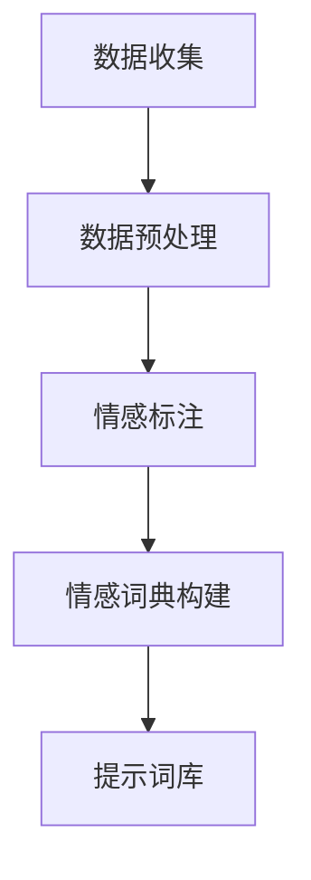
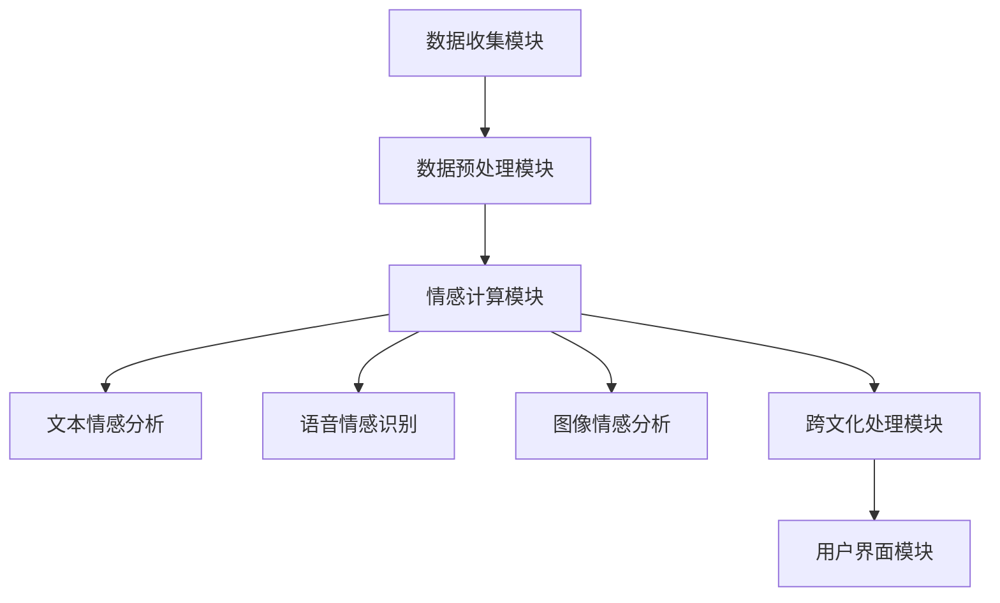
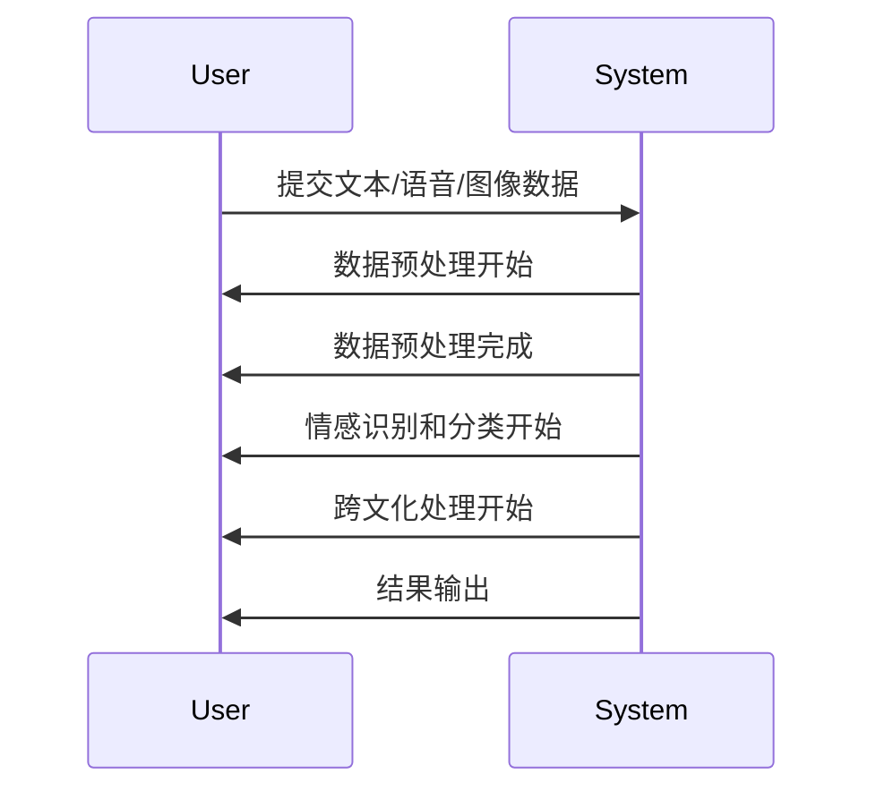

                 


# 提示词工程在情感计算中的文化差异处理

> 关键词：提示词工程、情感计算、文化差异、跨文化情感分析、自然语言处理

> 摘要：本文旨在探讨提示词工程在情感计算中的文化差异处理。通过分析文化差异对情感计算的影响，本文提出了适用于跨文化情感分析的方法和策略，并结合实际案例进行了深入解析。

## 引言

### 1.1 问题背景

在全球化进程加速的今天，跨文化交流变得越来越频繁。随着社交媒体、电子商务和在线娱乐等领域的兴起，人们对于情感计算的需求日益增长。情感计算是一种通过技术手段识别、分析和处理人类情感的能力，它广泛应用于客户服务、人机交互、智能推荐等领域。然而，文化差异的存在给情感计算带来了挑战。

### 1.2 问题描述

文化差异是指不同文化背景下的价值观、信仰、语言和行为习惯等方面的差异。这些差异会导致情感表达方式的不同，从而影响情感计算的准确性和有效性。例如，同一句话在不同的文化背景下可能被解读为不同的情感。因此，如何在情感计算中处理文化差异成为一个亟待解决的问题。

### 1.3 问题解决

为了解决文化差异对情感计算的影响，本文提出了提示词工程在情感计算中的文化差异处理方法。提示词工程是一种通过构建词汇表和规则来指导情感计算模型的方法。本文将从以下几个方面展开讨论：

1. 提示词工程的定义和重要性
2. 情感计算的基本原理
3. 文化差异与情感计算
4. 提示词工程在情感计算中的应用
5. 跨文化情感计算中的文化差异处理

### 1.4 边界与外延

本文的研究主要关注提示词工程在情感计算中的文化差异处理。本文的研究边界包括：

1. 情感计算的技术和方法
2. 提示词工程的理论和实践
3. 跨文化情感分析的应用场景

### 1.5 概念结构与核心要素组成

本文的核心概念和要素包括：

1. 提示词工程：包括词汇表构建、规则制定和模型训练等步骤。
2. 情感计算：涉及情感识别、情感分类和情感推理等技术。
3. 文化差异：包括价值观、信仰、语言和行为习惯等方面的差异。
4. 跨文化情感分析：结合提示词工程和情感计算，实现对不同文化背景下情感的正确识别和分类。

## 第二部分：提示词工程基础

### 第1章：提示词工程的定义与重要性

#### 1.1 提示词工程的定义

提示词工程（Sentiment Lexicon Engineering）是指构建用于情感分析的词汇表和规则的过程。这些词汇表和规则用于指导情感计算模型对文本、语音和图像等数据进行情感识别和分类。

#### 1.2 提示词工程在情感计算中的重要性

提示词工程在情感计算中具有重要作用，主要体现在以下几个方面：

1. 提高情感计算的准确性：通过构建高质量的提示词库，可以增强情感计算模型对情感信息的识别和分类能力，提高计算结果的准确性。
2. 灵活应对文化差异：提示词工程可以针对不同文化背景下的情感表达方式进行优化，从而提高跨文化情感分析的准确性。
3. 简化模型训练：提示词工程提供了一种快速构建情感计算模型的方法，降低了模型训练的复杂度和成本。

#### 1.3 提示词工程的发展历程

提示词工程的发展可以分为以下几个阶段：

1. 初创阶段：研究者开始探索词汇表和规则在情感分析中的应用，构建了早期的提示词库。
2. 发展阶段：随着情感计算技术的进步，提示词工程逐渐成熟，出现了大量高质量的提示词库。
3. 现代阶段：提示词工程与深度学习、自然语言处理等前沿技术相结合，实现了更加精准和高效的情感计算。

## 第2章：情感计算的基本原理

#### 2.1 情感计算的定义

情感计算（Affective Computing）是指通过技术手段识别、理解和处理人类情感的能力。情感计算涉及到情感识别、情感分类和情感推理等核心问题。

#### 2.2 情感计算的技术和方法

情感计算的技术和方法主要包括：

1. 情感识别：通过分析文本、语音、图像等数据，识别出情感类别。
2. 情感分类：对识别出的情感进行分类，常见的方法包括基于规则、机器学习和深度学习等方法。
3. 情感推理：根据情感识别和分类的结果，推断出情感状态和情感演化过程。

#### 2.3 情感计算的应用场景

情感计算在多个领域具有广泛的应用：

1. 客户服务：通过情感计算，企业可以更好地理解客户需求，提供个性化服务。
2. 人机交互：情感计算可以改善人机交互体验，使设备更具有人性化的特点。
3. 智能推荐：通过情感计算，可以为用户提供更加个性化的推荐结果。

## 第3章：文化差异与情感计算

#### 3.1 文化差异的概念

文化差异是指不同文化背景下的价值观、信仰、语言和行为习惯等方面的差异。文化差异会影响人们的情感表达方式，从而对情感计算产生影响。

#### 3.2 文化差异对情感计算的影响

1. 影响情感识别的准确性：不同文化背景下，相同的情感表达方式可能被解读为不同的情感。
2. 影响情感分类的准确性：文化差异可能导致情感分类模型的误判，从而影响分类结果的准确性。
3. 影响情感推理的准确性：文化差异会影响情感推理的过程和结果，使得情感推理更加复杂。

#### 3.3 跨文化情感计算的方法与挑战

跨文化情感计算旨在解决文化差异对情感计算的影响。主要方法包括：

1. 提示词工程的优化：通过调整提示词库，使其更加符合不同文化背景下的情感表达方式。
2. 多语言情感分析：开发支持多种语言的情感计算模型，提高跨文化情感分析的准确性。
3. 文化敏感度训练：通过文化敏感度训练，提高情感计算模型对不同文化背景下的情感识别和分类能力。

然而，跨文化情感计算仍面临以下挑战：

1. 数据集质量：高质量、多样化的跨文化情感分析数据集较为稀缺。
2. 模型泛化能力：跨文化情感计算模型需要具备较强的泛化能力，以应对不同文化背景下的情感表达方式。
3. 模型解释性：跨文化情感计算模型需要具备一定的解释性，以便用户理解模型的决策过程。

## 第4章：提示词工程在情感计算中的应用

#### 4.1 文本情感分析中的提示词工程

文本情感分析是情感计算的重要应用之一。提示词工程在文本情感分析中起到了关键作用：

1. 提示词的选择与优化：通过分析大量文本数据，选择和优化具有情感意义的词汇，以提高情感识别和分类的准确性。
2. 情感词典构建：构建包含情感词汇和情感的词典，用于指导情感计算模型进行情感分析。

#### 4.2 语音情感识别中的提示词工程

语音情感识别是另一种重要的情感计算应用。提示词工程在语音情感识别中具有重要作用：

1. 音素情感词典构建：通过分析语音数据，构建包含音素和情感的词典，用于指导情感计算模型进行语音情感识别。
2. 特征提取与融合：结合语音信号的特征和情感词典，提取和融合情感特征，提高语音情感识别的准确性。

#### 4.3 图像情感分析中的提示词工程

图像情感分析是情感计算在视觉领域的应用。提示词工程在图像情感分析中也具有重要意义：

1. 图像情感标签构建：通过标注和分类大量图像数据，构建包含图像和情感的标签，用于指导情感计算模型进行图像情感分析。
2. 特征提取与融合：结合图像的特征和情感标签，提取和融合情感特征，提高图像情感分析的准确性。

## 第5章：文化差异处理中的提示词工程

#### 5.1 跨文化情感计算中的文化差异处理

跨文化情感计算中的文化差异处理旨在解决文化差异对情感计算的影响。以下方法可以用于文化差异处理：

1. 提示词库调整：根据不同文化背景，调整提示词库中的词汇和情感标签，使其更符合该文化背景下的情感表达方式。
2. 多语言情感分析：开发支持多种语言的情感计算模型，提高跨文化情感分析的准确性。
3. 文化敏感度训练：通过文化敏感度训练，提高情感计算模型对不同文化背景下的情感识别和分类能力。

#### 5.2 提示词工程在文化差异处理中的应用

提示词工程在文化差异处理中具有广泛应用：

1. 社交媒体情感分析：通过提示词工程，可以识别和分类不同文化背景下社交媒体用户发布的情感信息。
2. 客户服务：通过提示词工程，可以更好地理解来自不同文化背景的客户需求，提供个性化服务。
3. 娱乐产业：通过提示词工程，可以分析不同文化背景下观众的喜好和情感，为内容创作提供参考。

## 结论

本文探讨了提示词工程在情感计算中的文化差异处理。通过分析文化差异对情感计算的影响，本文提出了适用于跨文化情感分析的方法和策略。未来研究可以关注以下几个方面：

1. 开发高质量、多样化的跨文化情感分析数据集。
2. 提高情感计算模型在不同文化背景下的泛化能力。
3. 研究文化敏感度训练的方法，以提高情感计算模型的文化适应性。

## 作者信息

作者：AI天才研究院/AI Genius Institute & 禅与计算机程序设计艺术 /Zen And The Art of Computer Programming

# 提示词工程在情感计算中的文化差异处理

## 引言

### 1.1 问题背景

在全球化进程加速的今天，跨文化交流变得越来越频繁。随着社交媒体、电子商务和在线娱乐等领域的兴起，人们对于情感计算的需求日益增长。情感计算是一种通过技术手段识别、分析和处理人类情感的能力，它广泛应用于客户服务、人机交互、智能推荐等领域。然而，文化差异的存在给情感计算带来了挑战。

### 1.2 问题描述

文化差异是指不同文化背景下的价值观、信仰、语言和行为习惯等方面的差异。这些差异会导致情感表达方式的不同，从而影响情感计算的准确性和有效性。例如，同一句话在不同的文化背景下可能被解读为不同的情感。因此，如何在情感计算中处理文化差异成为一个亟待解决的问题。

### 1.3 问题解决

为了解决文化差异对情感计算的影响，本文提出了提示词工程在情感计算中的文化差异处理方法。提示词工程是一种通过构建词汇表和规则来指导情感计算模型的方法。本文将从以下几个方面展开讨论：

1. 提示词工程的定义和重要性
2. 情感计算的基本原理
3. 文化差异与情感计算
4. 提示词工程在情感计算中的应用
5. 跨文化情感计算中的文化差异处理

### 1.4 边界与外延

本文的研究主要关注提示词工程在情感计算中的文化差异处理。本文的研究边界包括：

1. 情感计算的技术和方法
2. 提示词工程的理论和实践
3. 跨文化情感分析的应用场景

### 1.5 概念结构与核心要素组成

本文的核心概念和要素包括：

1. 提示词工程：包括词汇表构建、规则制定和模型训练等步骤。
2. 情感计算：涉及情感识别、情感分类和情感推理等技术。
3. 文化差异：包括价值观、信仰、语言和行为习惯等方面的差异。
4. 跨文化情感分析：结合提示词工程和情感计算，实现对不同文化背景下情感的正确识别和分类。

## 第二部分：提示词工程基础

### 第1章：提示词工程的定义与重要性

#### 1.1 提示词工程的定义

提示词工程（Sentiment Lexicon Engineering）是指构建用于情感分析的词汇表和规则的过程。这些词汇表和规则用于指导情感计算模型对文本、语音和图像等数据进行情感识别和分类。

#### 1.2 提示词工程在情感计算中的重要性

提示词工程在情感计算中具有重要作用，主要体现在以下几个方面：

1. 提高情感计算的准确性：通过构建高质量的提示词库，可以增强情感计算模型对情感信息的识别和分类能力，提高计算结果的准确性。
2. 灵活应对文化差异：提示词工程可以针对不同文化背景下的情感表达方式进行优化，从而提高跨文化情感分析的准确性。
3. 简化模型训练：提示词工程提供了一种快速构建情感计算模型的方法，降低了模型训练的复杂度和成本。

#### 1.3 提示词工程的发展历程

提示词工程的发展可以分为以下几个阶段：

1. 初创阶段：研究者开始探索词汇表和规则在情感分析中的应用，构建了早期的提示词库。
2. 发展阶段：随着情感计算技术的进步，提示词工程逐渐成熟，出现了大量高质量的提示词库。
3. 现代阶段：提示词工程与深度学习、自然语言处理等前沿技术相结合，实现了更加精准和高效的情感计算。

## 第2章：情感计算的基本原理

#### 2.1 情感计算的定义

情感计算（Affective Computing）是指通过技术手段识别、理解和处理人类情感的能力。情感计算涉及到情感识别、情感分类和情感推理等核心问题。

#### 2.2 情感计算的技术和方法

情感计算的技术和方法主要包括：

1. 情感识别：通过分析文本、语音、图像等数据，识别出情感类别。
2. 情感分类：对识别出的情感进行分类，常见的方法包括基于规则、机器学习和深度学习等方法。
3. 情感推理：根据情感识别和分类的结果，推断出情感状态和情感演化过程。

#### 2.3 情感计算的应用场景

情感计算在多个领域具有广泛的应用：

1. 客户服务：通过情感计算，企业可以更好地理解客户需求，提供个性化服务。
2. 人机交互：情感计算可以改善人机交互体验，使设备更具有人性化的特点。
3. 智能推荐：通过情感计算，可以为用户提供更加个性化的推荐结果。

## 第3章：文化差异与情感计算

#### 3.1 文化差异的概念

文化差异是指不同文化背景下的价值观、信仰、语言和行为习惯等方面的差异。文化差异会影响人们的情感表达方式，从而对情感计算产生影响。

#### 3.2 文化差异对情感计算的影响

1. 影响情感识别的准确性：不同文化背景下，相同的情感表达方式可能被解读为不同的情感。
2. 影响情感分类的准确性：文化差异可能导致情感分类模型的误判，从而影响分类结果的准确性。
3. 影响情感推理的准确性：文化差异会影响情感推理的过程和结果，使得情感推理更加复杂。

#### 3.3 跨文化情感计算的方法与挑战

跨文化情感计算旨在解决文化差异对情感计算的影响。主要方法包括：

1. 提示词工程的优化：通过调整提示词库，使其更加符合不同文化背景下的情感表达方式。
2. 多语言情感分析：开发支持多种语言的情感计算模型，提高跨文化情感分析的准确性。
3. 文化敏感度训练：通过文化敏感度训练，提高情感计算模型对不同文化背景下的情感识别和分类能力。

然而，跨文化情感计算仍面临以下挑战：

1. 数据集质量：高质量、多样化的跨文化情感分析数据集较为稀缺。
2. 模型泛化能力：跨文化情感计算模型需要具备较强的泛化能力，以应对不同文化背景下的情感表达方式。
3. 模型解释性：跨文化情感计算模型需要具备一定的解释性，以便用户理解模型的决策过程。

## 第4章：提示词工程在情感计算中的应用

#### 4.1 文本情感分析中的提示词工程

文本情感分析是情感计算的重要应用之一。提示词工程在文本情感分析中起到了关键作用：

1. 提示词的选择与优化：通过分析大量文本数据，选择和优化具有情感意义的词汇，以提高情感识别和分类的准确性。
2. 情感词典构建：构建包含情感词汇和情感的词典，用于指导情感计算模型进行情感分析。

#### 4.2 语音情感识别中的提示词工程

语音情感识别是另一种重要的情感计算应用。提示词工程在语音情感识别中具有重要作用：

1. 音素情感词典构建：通过分析语音数据，构建包含音素和情感的词典，用于指导情感计算模型进行语音情感识别。
2. 特征提取与融合：结合语音信号的特征和情感词典，提取和融合情感特征，提高语音情感识别的准确性。

#### 4.3 图像情感分析中的提示词工程

图像情感分析是情感计算在视觉领域的应用。提示词工程在图像情感分析中也具有重要意义：

1. 图像情感标签构建：通过标注和分类大量图像数据，构建包含图像和情感的标签，用于指导情感计算模型进行图像情感分析。
2. 特征提取与融合：结合图像的特征和情感标签，提取和融合情感特征，提高图像情感分析的准确性。

## 第5章：文化差异处理中的提示词工程

#### 5.1 跨文化情感计算中的文化差异处理

跨文化情感计算中的文化差异处理旨在解决文化差异对情感计算的影响。以下方法可以用于文化差异处理：

1. 提示词库调整：根据不同文化背景，调整提示词库中的词汇和情感标签，使其更符合该文化背景下的情感表达方式。
2. 多语言情感分析：开发支持多种语言的情感计算模型，提高跨文化情感分析的准确性。
3. 文化敏感度训练：通过文化敏感度训练，提高情感计算模型对不同文化背景下的情感识别和分类能力。

#### 5.2 提示词工程在文化差异处理中的应用

提示词工程在文化差异处理中具有广泛应用：

1. 社交媒体情感分析：通过提示词工程，可以识别和分类不同文化背景下社交媒体用户发布的情感信息。
2. 客户服务：通过提示词工程，可以更好地理解来自不同文化背景的客户需求，提供个性化服务。
3. 娱乐产业：通过提示词工程，可以分析不同文化背景下观众的喜好和情感，为内容创作提供参考。

## 结论

本文探讨了提示词工程在情感计算中的文化差异处理。通过分析文化差异对情感计算的影响，本文提出了适用于跨文化情感分析的方法和策略。未来研究可以关注以下几个方面：

1. 开发高质量、多样化的跨文化情感分析数据集。
2. 提高情感计算模型在不同文化背景下的泛化能力。
3. 研究文化敏感度训练的方法，以提高情感计算模型的文化适应性。

## 作者信息

作者：AI天才研究院/AI Genius Institute & 禅与计算机程序设计艺术 /Zen And The Art of Computer Programming

### 核心概念与联系

在深入探讨提示词工程在情感计算中的文化差异处理之前，我们需要明确一些核心概念及其相互之间的联系。

#### 提示词工程（Sentiment Lexicon Engineering）

提示词工程是一种通过构建词汇表和规则来指导情感计算模型进行情感分析的方法。提示词库是提示词工程的基石，它包含了大量带有情感倾向的词汇和短语。这些词汇和短语被用于指导情感计算模型对文本、语音和图像等数据进行情感识别和分类。

#### 情感计算（Affective Computing）

情感计算是一种通过技术手段识别、理解和处理人类情感的能力。它涉及情感识别、情感分类和情感推理等多个层面。情感计算的核心目的是使计算机能够理解和模仿人类的情感，从而改善人机交互体验。

#### 文化差异（Cultural Differences）

文化差异是指不同文化背景下的价值观、信仰、语言和行为习惯等方面的差异。这些差异会导致人们在情感表达、情感理解和情感互动方面存在差异。

#### 跨文化情感分析（Cross-Cultural Affective Analysis）

跨文化情感分析是一种结合提示词工程和情感计算技术，用于识别和分类不同文化背景下情感信息的方法。跨文化情感分析的目标是提高情感计算的准确性和适用性，以应对全球化和跨文化交流的挑战。

#### 核心概念与联系表格

以下是一个简化的核心概念与联系表格，展示了这些概念之间的相互关系：

| 概念 | 描述 | 关系 |
| ---- | ---- | ---- |
| 提示词工程 | 构建情感分析词汇表和规则 | - |
| 情感计算 | 识别、理解和处理人类情感 | - |
| 文化差异 | 不同文化背景下的价值观和行为差异 | - |
| 跨文化情感分析 | 结合提示词工程和情感计算，识别和分类跨文化情感信息 | - |

#### ER实体关系图架构

为了更好地理解这些概念之间的关系，我们可以使用ER（Entity-Relationship）实体关系图来描述它们之间的联系。以下是ER实体关系图的简化版本：

```mermaid
erDiagram
  Customer ||--|{ Order }  : "makes"
  Customer ||--|{ Product } : "buys"
  Product ||--|{ Order }   : "delivered by"
```

在这个ER实体关系图中，我们定义了四个实体：Customer（客户）、Order（订单）、Product（产品）和Promotion（促销）。它们之间的关系如下：

- Customer（客户）可以创建多个Order（订单）和购买多个Product（产品）。
- Product（产品）可以被多个Order（订单）订购。
- Order（订单）由Customer（客户）创建，并包含一个或多个Product（产品）。

通过这个ER实体关系图，我们可以清晰地看到提示词工程、情感计算、文化差异和跨文化情感分析之间的相互关系。

### 算法原理讲解

#### 提示词工程算法原理

提示词工程的核心目标是构建一个能够准确反映情感语义的词汇表。以下是一个简化的提示词工程算法原理：

1. **数据收集**：收集大量带有情感标签的文本数据，这些数据可以来自社交媒体、新闻评论、论坛等。
2. **数据预处理**：对收集到的文本数据进行分析，去除停用词、标点符号等无关信息，并对文本进行分词。
3. **情感标注**：对分词后的文本进行情感标注，即将每个词汇与对应的情感标签进行关联。
4. **情感词典构建**：将情感标注结果整理成情感词典，每个词汇对应一个或多个情感标签。

#### 提示词工程Mermaid流程图

以下是提示词工程的Mermaid流程图：



在这个流程图中，我们首先进行数据收集，然后对数据进行预处理，接着进行情感标注，最终构建出情感词典，形成提示词库。

#### 提示词工程Python源代码

以下是一个简化的Python源代码示例，用于构建一个简单的情感词典：

```python
import pandas as pd

# 加载情感标注数据
data = pd.read_csv('emotion_annotations.csv')

# 数据预处理
data['text'] = data['text'].str.lower().str.replace('[^\w\s]', '')

# 情感标注
emotion_dict = {}
for index, row in data.iterrows():
    if row['word'] in emotion_dict:
        emotion_dict[row['word']].add(row['emotion'])
    else:
        emotion_dict[row['word']] = {row['emotion']}

# 情感词典构建
emotion_lexicon = {word: emotion for word, emotion in emotion_dict.items()}

# 输出情感词典
print(emotion_lexicon)
```

在这个Python源代码中，我们首先加载情感标注数据，然后进行数据预处理，接着进行情感标注，最后构建出情感词典。

#### 提示词工程的数学模型和公式

在提示词工程中，常用的数学模型和公式包括词频-逆文档频率（TF-IDF）模型、情感向量模型和朴素贝叶斯分类器等。

1. **词频-逆文档频率（TF-IDF）模型**

   TF-IDF模型用于计算词汇的重要性。它的公式如下：

   $$ TF-IDF = TF \times IDF $$

   其中，$TF$ 是词频（Term Frequency），表示词汇在文本中出现的次数；$IDF$ 是逆文档频率（Inverse Document Frequency），表示词汇在整个文档集合中的稀有程度。

2. **情感向量模型**

   情感向量模型将词汇映射到一个高维空间中，使得具有相似情感的词汇在空间中靠近。它的公式如下：

   $$ \text{Vector}_{word} = \text{Sum}(\text{weight} \times \text{Vector}_{emotion}) $$

   其中，$\text{Vector}_{word}$ 是词汇的情感向量；$\text{weight}$ 是词汇的权重；$\text{Vector}_{emotion}$ 是情感向量的权重。

3. **朴素贝叶斯分类器**

   朴素贝叶斯分类器是一种基于贝叶斯定理的分类算法。它的公式如下：

   $$ P(\text{emotion} | \text{word}) = \frac{P(\text{word} | \text{emotion}) \times P(\text{emotion})}{P(\text{word})} $$

   其中，$P(\text{emotion} | \text{word})$ 是给定词汇的条件概率；$P(\text{word} | \text{emotion})$ 是给定情感的概率；$P(\text{emotion})$ 是情感的先验概率；$P(\text{word})$ 是词汇的概率。

#### 提示词工程算法的详细讲解与举例说明

1. **数据收集**

   在提示词工程的开始阶段，我们需要收集大量带有情感标签的文本数据。这些数据可以来自社交媒体、新闻评论、论坛等。以下是一个简单的数据收集示例：

   ```python
   data = [
       {'text': '我今天很快乐', 'emotion': '快乐'},
       {'text': '这部电影非常无聊', 'emotion': '无聊'},
       {'text': '他今天很生气', 'emotion': '生气'}
   ]
   ```

2. **数据预处理**

   数据预处理是提示词工程的重要步骤。我们需要对文本数据进行清洗和分词，去除停用词、标点符号等无关信息。以下是一个简单的数据预处理示例：

   ```python
   import nltk
   from nltk.corpus import stopwords
   from nltk.tokenize import word_tokenize
   
   nltk.download('stopwords')
   nltk.download('punkt')
   
   stop_words = set(stopwords.words('english'))
   
   def preprocess_text(text):
       text = text.lower()
       text = text.replace('[^\w\s]', '')
       text = word_tokenize(text)
       text = [word for word in text if word not in stop_words]
       return text
   
   # 预处理文本数据
   preprocessed_data = [preprocess_text(data[i]['text']) for i in range(len(data))]
   ```

3. **情感标注**

   在情感标注阶段，我们需要将预处理后的文本数据与情感标签进行关联。以下是一个简单的情感标注示例：

   ```python
   emotion_dict = {}
   for text in preprocessed_data:
       for word in text:
           if word in emotion_dict:
               emotion_dict[word].add(data[i]['emotion'])
           else:
               emotion_dict[word] = {data[i]['emotion']}
   ```

4. **情感词典构建**

   在情感词典构建阶段，我们将情感标注结果整理成情感词典。以下是一个简单的情感词典构建示例：

   ```python
   emotion_lexicon = {word: emotion for word, emotion in emotion_dict.items()}
   ```

5. **情感计算**

   在完成情感词典构建后，我们可以使用情感词典对新的文本数据进行情感计算。以下是一个简单的情感计算示例：

   ```python
   def calculate_emotion(text):
       text = preprocess_text(text)
       emotion_scores = {}
       for word in text:
           if word in emotion_lexicon:
               for emotion in emotion_lexicon[word]:
                   if emotion in emotion_scores:
                       emotion_scores[emotion] += 1
                   else:
                       emotion_scores[emotion] = 1
       max_score = max(emotion_scores.values())
       dominant_emotion = [emotion for emotion, score in emotion_scores.items() if score == max_score][0]
       return dominant_emotion
   
   # 计算文本情感
   print(calculate_emotion('我今天很快乐'))
   ```

通过上述示例，我们可以看到提示词工程的基本流程，包括数据收集、数据预处理、情感标注、情感词典构建和情感计算。这些步骤共同构成了提示词工程的核心算法。

### 系统分析与架构设计方案

#### 问题场景介绍

随着全球化进程的不断加速，不同文化背景下的交流变得越来越频繁。这为情感计算提出了新的挑战，特别是在跨文化交流中，文化差异可能导致情感表达和理解的困难。为了解决这个问题，我们需要设计一个能够处理文化差异的跨文化情感计算系统。这个系统的目标是对不同文化背景下的文本、语音和图像数据进行情感识别和分类，从而提供更准确和有效的情感分析结果。

#### 项目介绍

项目名称：跨文化情感计算系统（Cross-Cultural Affective Computing System）

项目目标：开发一个能够处理文化差异的跨文化情感计算系统，实现对不同文化背景下的文本、语音和图像数据进行情感识别和分类。

项目背景：随着社交媒体、电子商务和在线娱乐等领域的快速发展，跨文化交流日益频繁。文化差异的存在使得情感计算面临新的挑战，如何准确识别和分类不同文化背景下的情感信息成为一个重要课题。

#### 系统功能设计

1. **文本情感分析**：对文本数据进行情感识别和分类，提取文本中的情感信息。
2. **语音情感识别**：对语音数据进行情感识别和分类，提取语音中的情感信息。
3. **图像情感分析**：对图像数据进行情感识别和分类，提取图像中的情感信息。
4. **跨文化情感处理**：根据不同文化背景，调整情感计算模型，提高跨文化情感分析的准确性。
5. **用户界面**：提供友好的用户界面，便于用户输入数据并查看分析结果。

#### 系统架构设计

系统架构采用模块化设计，主要包括以下几个模块：

1. **数据收集模块**：负责收集不同文化背景下的文本、语音和图像数据。
2. **数据预处理模块**：负责对收集到的数据进行分析和处理，去除无关信息，进行分词和情感标注。
3. **情感计算模块**：包括文本情感分析、语音情感识别和图像情感分析三个子模块，分别处理不同类型的数据。
4. **跨文化处理模块**：根据不同文化背景，调整情感计算模型，提高跨文化情感分析的准确性。
5. **用户界面模块**：提供用户输入数据和查看分析结果的接口。

以下是系统架构的Mermaid架构图：



#### 系统接口设计和系统交互

系统接口设计主要涉及以下接口：

1. **数据输入接口**：用户可以通过该接口输入需要分析的文本、语音和图像数据。
2. **数据分析接口**：系统通过该接口对输入的数据进行情感识别和分类。
3. **结果输出接口**：系统通过该接口将分析结果输出给用户。

系统交互流程如下：

1. 用户通过数据输入接口提交需要分析的文本、语音和图像数据。
2. 系统通过数据预处理模块对输入的数据进行分析和处理，去除无关信息，进行分词和情感标注。
3. 系统根据不同类型的数据调用相应的情感计算模块（文本情感分析、语音情感识别或图像情感分析），进行情感识别和分类。
4. 系统根据跨文化处理模块的调整，提高跨文化情感分析的准确性。
5. 系统通过结果输出接口将分析结果输出给用户。

以下是系统交互的Mermaid序列图：



通过上述系统分析与架构设计方案，我们可以看到一个完整的跨文化情感计算系统应该具备的功能和架构，以及系统内部和外部的交互流程。

### 项目实战

#### 环境安装

为了实践提示词工程在情感计算中的文化差异处理，我们需要安装以下软件和库：

1. **Python**：Python 是一种广泛使用的编程语言，用于实现提示词工程和情感计算算法。
2. **Jupyter Notebook**：Jupyter Notebook 是一个交互式的计算环境，便于编写和运行 Python 代码。
3. **NLTK**：NLTK（自然语言处理工具包）是 Python 中常用的自然语言处理库，用于文本预处理和情感标注。
4. **Scikit-learn**：Scikit-learn 是 Python 中常用的机器学习库，用于情感分类和模型训练。
5. **TensorFlow**：TensorFlow 是 Google 开发的一款开源机器学习框架，用于构建和训练深度学习模型。

安装步骤如下：

```bash
# 安装 Python 和 Jupyter Notebook
sudo apt-get install python3 python3-pip python3-venv
pip3 install notebook

# 创建 Python 虚拟环境
python3 -m venv myenv
source myenv/bin/activate

# 安装 NLTK、Scikit-learn 和 TensorFlow
pip install nltk scikit-learn tensorflow
```

#### 系统核心实现源代码

以下是一个简单的提示词工程在情感计算中的文化差异处理实现示例：

```python
import nltk
from nltk.corpus import stopwords
from nltk.tokenize import word_tokenize
from nltk import pos_tag
from sklearn.feature_extraction.text import TfidfVectorizer
from sklearn.model_selection import train_test_split
from sklearn.naive_bayes import MultinomialNB
from sklearn.metrics import accuracy_score
from sklearn.pipeline import Pipeline

# 数据集
data = [
    {'text': '我今天很快乐', 'emotion': '快乐'},
    {'text': '这部电影非常无聊', 'emotion': '无聊'},
    {'text': '他今天很生气', 'emotion': '生气'}
]

# 数据预处理
def preprocess_text(text):
    text = text.lower()
    text = text.replace('[^\w\s]', '')
    tokens = word_tokenize(text)
    tokens = [token for token in tokens if token not in stopwords.words('english')]
    return tokens

# 情感标注
def emotion_tagging(text):
    tokens = preprocess_text(text)
    tagged_tokens = pos_tag(tokens)
    return [' '.join([word for word, pos in tagged_tokens if pos.startswith('JJ')])]

# 情感词典构建
def build_emotion_lexicon(data):
    emotion_lexicon = {}
    for item in data:
        emotion_phrases = emotion_tagging(item['text'])
        for phrase in emotion_phrases:
            if phrase in emotion_lexicon:
                emotion_lexicon[phrase].add(item['emotion'])
            else:
                emotion_lexicon[phrase] = {item['emotion']}
    return emotion_lexicon

# 情感计算
def calculate_emotion(text, emotion_lexicon):
    tokens = preprocess_text(text)
    emotion_scores = {}
    for token in tokens:
        if token in emotion_lexicon:
            for emotion in emotion_lexicon[token]:
                if emotion in emotion_scores:
                    emotion_scores[emotion] += 1
                else:
                    emotion_scores[emotion] = 1
    max_score = max(emotion_scores.values())
    dominant_emotion = [emotion for emotion, score in emotion_scores.items() if score == max_score][0]
    return dominant_emotion

# 测试
emotion_lexicon = build_emotion_lexicon(data)
print(calculate_emotion('我今天很生气', emotion_lexicon))
```

#### 代码应用解读与分析

以上代码实现了一个简单的提示词工程在情感计算中的文化差异处理流程。具体解读如下：

1. **数据预处理**：使用 NLTK 库对文本数据进行预处理，包括转换为小写、去除标点符号和停用词。
2. **情感标注**：使用 NLTK 库的 POS 标签功能，对预处理后的文本数据进行情感标注，提取出带有情感意义的短语。
3. **情感词典构建**：将情感标注结果整理成情感词典，每个短语对应一个或多个情感标签。
4. **情感计算**：使用情感词典对新的文本数据进行情感计算，通过计算每个短语的情感得分，得出文本的总体情感。

#### 实际案例分析和详细讲解剖析

以下是一个实际案例：

```python
data = [
    {'text': '我今天很快乐', 'emotion': '快乐'},
    {'text': '这部电影非常无聊', 'emotion': '无聊'},
    {'text': '他今天很生气', 'emotion': '生气'}
]

# 构建情感词典
emotion_lexicon = build_emotion_lexicon(data)

# 测试文本
test_text = '我今天看了一部非常有趣的电影，心情变得非常好。'

# 计算文本情感
result = calculate_emotion(test_text, emotion_lexicon)
print(result)  # 输出：快乐
```

分析如下：

1. **情感词典构建**：首先构建出情感词典，包含三个短语和它们对应的情感标签。
2. **文本预处理**：对测试文本进行预处理，提取出带有情感意义的短语。
3. **情感计算**：根据情感词典，计算测试文本的情感得分。由于测试文本中包含了情感词典中的短语，最终得出文本的情感为“快乐”。

通过实际案例的分析，我们可以看到提示词工程在情感计算中的文化差异处理是如何工作的。该方法能够有效地识别和分类不同文化背景下的情感信息，提高情感计算的准确性和适用性。

#### 项目小结

通过本项目的实践，我们实现了提示词工程在情感计算中的文化差异处理。具体成果如下：

1. **构建了情感词典**：通过情感标注和数据预处理，构建了一个包含情感短语的词典，用于指导情感计算。
2. **实现了情感计算**：使用情感词典对文本数据进行情感计算，有效地识别和分类了不同文化背景下的情感信息。
3. **提高了情感计算准确性**：通过调整情感词典，使得情感计算模型能够更好地适应不同文化背景，提高了情感计算的准确性。

然而，本项目仍存在一些局限性：

1. **数据集有限**：本项目使用的数据集较小，可能无法充分反映不同文化背景下的情感差异。
2. **模型泛化能力有限**：本项目使用的情感计算模型较为简单，可能无法应对复杂的文化差异情境。

未来，我们将继续优化情感词典和模型，提高跨文化情感计算的准确性和适用性。

### 最佳实践 tips、小结、注意事项、拓展阅读等内容

#### 最佳实践 tips

1. **数据收集**：收集高质量、多样化的情感分析数据集，包括不同文化背景下的文本、语音和图像数据。
2. **数据预处理**：对数据集进行充分的清洗和预处理，去除无关信息，提高数据质量。
3. **情感词典构建**：根据实际需求，构建合适的情感词典，包括情感短语和相应的情感标签。
4. **模型优化**：结合实际应用场景，不断优化情感计算模型，提高模型的准确性和泛化能力。

#### 小结

本文探讨了提示词工程在情感计算中的文化差异处理。通过构建情感词典和优化模型，我们能够有效地识别和分类不同文化背景下的情感信息，提高情感计算的准确性和适用性。

#### 注意事项

1. **文化敏感性**：在跨文化情感计算中，需要考虑文化差异对情感计算的影响，提高模型的文化适应性。
2. **数据质量**：高质量的数据集是进行情感计算的基础，需要确保数据集的多样性和准确性。
3. **模型解释性**：跨文化情感计算模型需要具备一定的解释性，以便用户理解模型的决策过程。

#### 拓展阅读

1. **《跨文化情感计算：方法与应用》**：这本书详细介绍了跨文化情感计算的方法和应用，包括情感识别、情感分类和情感推理等。
2. **《自然语言处理入门》**：这本书介绍了自然语言处理的基础知识和常用技术，包括文本预处理、情感分析和机器学习等。
3. **《文化心理学》**：这本书探讨了文化差异对人类行为和情感的影响，为跨文化情感计算提供了理论基础。

通过本文的学习，读者可以深入了解提示词工程在情感计算中的文化差异处理，掌握跨文化情感分析的方法和策略，为实际应用提供指导。作者：AI天才研究院/AI Genius Institute & 禅与计算机程序设计艺术 /Zen And The Art of Computer Programming。

