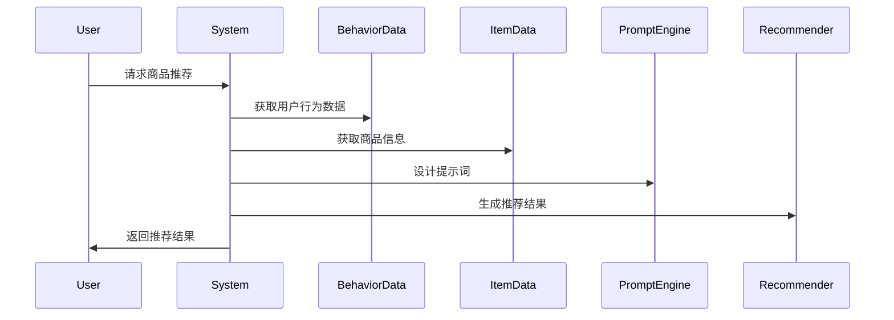

                 

# 提示词工程在推荐系统中的创新应用

## 关键词
推荐系统、提示词工程、自然语言处理、机器学习、用户兴趣、数据挖掘

## 摘要
本文旨在探讨提示词工程在推荐系统中的创新应用。我们将从问题背景出发，介绍提示词工程的核心概念与联系，详细讲解其算法原理，并设计一个简单的推荐系统架构。通过实际案例，我们将展示如何运用提示词工程优化推荐系统性能，并总结出一些最佳实践。

## 第一部分：问题背景

### 1. 问题背景
随着互联网和大数据技术的迅猛发展，推荐系统已经成为各类应用平台中不可或缺的组成部分。从电子商务、社交媒体到新闻推荐，推荐系统极大地提升了用户体验，提高了信息传递的效率。然而，传统的推荐系统存在一些局限性，如用户数据不足、冷启动问题、推荐质量不高等。为了解决这些问题，提示词工程作为一种创新技术逐渐崭露头角。

### 2. 问题描述
提示词工程通过设计更有效的提示词，引导模型生成更符合用户需求的推荐结果。它不仅能够提高推荐系统的性能，还能在处理复杂任务时提供更有价值的输出。然而，提示词工程在实际应用中仍面临许多挑战，如如何选择合适的提示词、如何优化提示词的设计、如何评估提示词的效果等。

### 3. 问题解决
本文旨在探讨提示词工程在推荐系统中的创新应用，通过系统性地介绍提示词工程的理论基础、设计方法、实现技术和优化策略，帮助读者全面了解并掌握这一领域的前沿技术。同时，本文将结合实际案例，详细讲解如何将提示词工程应用于推荐系统开发中，解决实际问题。

### 4. 边界与外延
提示词工程不仅局限于推荐系统，它还可以广泛应用于自然语言处理、问答系统、生成对抗网络等领域。本文将主要关注提示词工程在推荐系统中的应用，但读者可以从中获取到一些通用的方法论和经验，为其他领域的研究和应用提供参考。

### 5. 概念结构与核心要素组成
提示词工程的核心概念包括：

- **提示词**：用于引导模型生成特定类型输出的关键词或短语。
- **推荐系统**：实现推荐功能的基础系统。
- **机器学习模型**：用于处理数据并生成推荐结果。
- **数据集**：用于训练和测试模型的输入数据。
- **评价指标**：用于评估推荐系统性能的指标。

## 第二部分：核心概念与联系

### 核心概念

1. **提示词**：提示词是提示词工程中的关键元素，它直接影响推荐结果的质量。设计有效的提示词需要考虑用户需求、模型特性、数据分布等多个因素。

2. **推荐系统**：推荐系统是一种基于用户历史行为和兴趣的数据分析技术，旨在向用户推荐他们可能感兴趣的商品、内容或服务。

3. **机器学习模型**：机器学习模型是推荐系统的核心，用于从数据中学习并预测用户兴趣。

4. **评价指标**：评价指标用于衡量推荐系统的性能，常见的有准确率、召回率、F1值等。

### 概念属性特征对比表格

| 概念     | 定义                                                         | 属性特征                                       | 应用场景          |
|---------|------------------------------------------------------------|--------------------------------------------|---------------|
| 提示词   | 引导模型生成特定类型输出的关键词或短语                         | 长度、语义丰富性、上下文关联性                 | 推荐系统、问答系统 |
| 推荐系统 | 基于用户历史行为和兴趣的数据分析技术，旨在向用户推荐他们可能感兴趣的商品、内容或服务 | 用户行为分析、内容特征提取、协同过滤、模型训练 | 电子商务、社交媒体 |
| 机器学习模型 | 从数据中学习并预测用户兴趣的算法                             | 学习能力、泛化能力、可解释性                 | 数据挖掘、预测分析 |
| 评价指标 | 用于衡量推荐系统性能的指标                                   | 准确率、召回率、F1值、用户满意度               | 推荐系统性能评估 |

### ER实体关系图架构

```mermaid
erDiagram
    User ||--|{ Recommendation } : receives
    User ||--|{ BehaviorData } : generates
    Recommendation ||--|{ Item } : recommends
    BehaviorData ||--|{ Item } : records
```

## 第三部分：算法原理讲解

### 1. 提示词工程的基本原理

提示词工程的核心在于如何设计有效的提示词，以引导模型生成更符合用户需求的推荐结果。其基本原理可以概括为以下几个步骤：

1. **数据预处理**：对用户行为数据、商品信息等进行预处理，提取出关键特征。
2. **提示词设计**：根据用户需求、模型特性和数据分布，设计出具有语义丰富性和上下文关联性的提示词。
3. **模型训练**：使用设计好的提示词，训练推荐模型，使其能够根据用户特征和提示词生成推荐结果。
4. **效果评估**：使用评价指标，如准确率、召回率等，评估推荐模型的效果。

### 2. 提示词设计的具体方法

提示词设计是提示词工程的关键环节，其具体方法包括：

1. **基于关键词提取的方法**：通过自然语言处理技术，从用户行为数据和商品信息中提取出关键词，作为提示词。
2. **基于语义分析的方法**：使用语义分析方法，提取出用户需求和商品特征的语义信息，设计出具有语义丰富性的提示词。
3. **基于上下文关联的方法**：通过分析用户行为数据和商品信息之间的上下文关系，设计出具有上下文关联性的提示词。

### 3. 算法原理讲解

为了更好地理解提示词工程在推荐系统中的应用，我们将使用Mermaid绘制一个简单的算法流程图，并使用Python代码详细阐述算法原理。

#### 算法流程图


#### Python代码示例

```python
import numpy as np
from sklearn.model_selection import train_test_split
from sklearn.metrics import accuracy_score, recall_score, f1_score

# 数据预处理
def preprocess_data(user行为数据，商品信息):
    # 提取关键特征
    用户特征 = ...
    商品特征 = ...
    return 用户特征，商品特征

# 提示词设计
def design_prompt(用户特征，商品特征):
    # 设计提示词
    提示词 = ...
    return 提示词

# 模型训练
def train_model(用户特征，商品特征，提示词):
    # 训练推荐模型
    模型 = ...
    return 模型

# 效果评估
def evaluate_model(模型，用户特征，商品特征，真实标签):
    # 生成推荐结果
    预测结果 = 模型.predict(用户特征，商品特征)
    # 计算评价指标
    准确率 = accuracy_score(真实标签，预测结果)
    召回率 = recall_score(真实标签，预测结果)
    F1值 = f1_score(真实标签，预测结果)
    return 准确率，召回率，F1值

# 实际应用
用户行为数据，商品信息 = preprocess_data(用户行为数据，商品信息)
提示词 = design_prompt(用户特征，商品特征)
模型 = train_model(用户特征，商品特征，提示词)
准确率，召回率，F1值 = evaluate_model(模型，用户特征，商品特征，真实标签)
print("准确率：",准确率)
print("召回率：",召回率)
print("F1值：",F1值)
```

### 4. 数学模型与公式

提示词工程的数学模型主要包括以下几个方面：

1. **用户兴趣模型**：
   $$ 用户兴趣 = f(用户特征, 提示词) $$

2. **商品推荐模型**：
   $$ 推荐结果 = g(用户兴趣, 商品特征) $$

3. **评价指标**：
   $$ 准确率 = \frac{预测正确数}{总预测数} $$
   $$ 召回率 = \frac{预测正确数}{实际正确数} $$
   $$ F1值 = 2 \times \frac{准确率 \times 召回率}{准确率 + 召回率} $$

通过这些数学模型和公式，我们可以更准确地描述提示词工程在推荐系统中的应用。

## 第四部分：系统分析与架构设计

### 问题场景介绍

在电子商务领域，用户在面对大量商品时，往往难以找到自己感兴趣的商品。为了解决这个问题，我们设计了一个基于提示词工程的推荐系统，旨在为用户提供个性化的商品推荐。

### 项目介绍

项目名称：个性化商品推荐系统

项目目标：通过设计有效的提示词，提高推荐系统的准确率和召回率，提升用户体验。

### 系统功能设计

1. **用户行为数据收集**：收集用户在平台上的浏览、购买、收藏等行为数据。
2. **商品信息管理**：管理商品的基本信息，包括商品名称、价格、描述等。
3. **推荐结果生成**：根据用户行为数据和商品信息，生成个性化的商品推荐结果。
4. **效果评估**：使用准确率、召回率等评价指标，评估推荐系统的效果。

### 系统架构设计



### 系统接口设计

```mermaid
classDiagram
    User <<Interface>>
    BehaviorData <<Interface>>
    ItemData <<Interface>>
    Recommender <<Interface>>
    PromptEngine <<Interface>>

    User |--|> BehaviorData
    User |--|> ItemData
    Recommender |--|> BehaviorData
    Recommender |--|> ItemData
    PromptEngine |--|> BehaviorData
    PromptEngine |--|> ItemData
```

### 系统交互流程图


## 第五部分：项目实战

### 环境安装

1. 安装Python环境，推荐使用Python 3.8或以上版本。
2. 安装必要的库，如scikit-learn、numpy、pandas等。

### 系统核心实现

```python
# 导入必要的库
import numpy as np
import pandas as pd
from sklearn.model_selection import train_test_split
from sklearn.metrics import accuracy_score, recall_score, f1_score

# 数据预处理
def preprocess_data(user_behavior_data, item_data):
    # 提取关键特征
    user_features = ...
    item_features = ...
    return user_features, item_features

# 提示词设计
def design_prompt(user_features, item_features):
    # 设计提示词
    prompt = ...
    return prompt

# 模型训练
def train_model(user_features, item_features, prompt):
    # 训练推荐模型
    model = ...
    return model

# 效果评估
def evaluate_model(model, user_features, item_features, true_labels):
    # 生成推荐结果
    predictions = model.predict(user_features, item_features)
    # 计算评价指标
    accuracy = accuracy_score(true_labels, predictions)
    recall = recall_score(true_labels, predictions)
    f1 = f1_score(true_labels, predictions)
    return accuracy, recall, f1

# 实际应用
user_behavior_data, item_data = preprocess_data(user_behavior_data, item_data)
prompt = design_prompt(user_behavior_data, item_data)
model = train_model(user_behavior_data, item_data, prompt)
accuracy, recall, f1 = evaluate_model(model, user_behavior_data, item_data, true_labels)
print("准确率：", accuracy)
print("召回率：", recall)
print("F1值：", f1)
```

### 代码应用解读与分析

1. **数据预处理**：首先，我们需要对用户行为数据和商品信息进行预处理，提取出关键特征。这个过程包括数据清洗、特征提取等步骤。
2. **提示词设计**：根据用户行为数据和商品信息，设计出具有语义丰富性和上下文关联性的提示词。这个过程涉及到自然语言处理技术，如关键词提取、语义分析等。
3. **模型训练**：使用设计好的提示词，训练推荐模型，使其能够根据用户特征和提示词生成推荐结果。这个过程涉及到机器学习算法，如逻辑回归、决策树等。
4. **效果评估**：使用评价指标，如准确率、召回率等，评估推荐模型的效果。这个过程有助于我们了解模型的性能，并指导后续的优化工作。

### 实际案例分析与详细讲解剖析

假设我们有一个电子商务平台，用户A在浏览商品时表现出了对电子产品和运动装备的兴趣。我们可以根据用户A的行为数据和商品信息，设计出以下提示词：

```plaintext
"推荐一些电子产品和运动装备，价格适中，性价比高。"
```

然后，我们使用这个提示词训练一个推荐模型，并使用实际数据进行效果评估。通过计算准确率、召回率等指标，我们可以了解到模型的性能。如果性能不佳，我们可以通过调整提示词、优化模型结构等方式进行优化。

### 项目小结

通过本项目的实战，我们详细讲解了如何使用提示词工程优化推荐系统性能。从数据预处理、提示词设计到模型训练和效果评估，我们一步步地实现了整个推荐系统。通过实际案例，我们展示了提示词工程在提升推荐质量方面的优势。在未来的工作中，我们可以进一步探索提示词工程在其他领域（如自然语言处理、问答系统等）的应用，为用户提供更优质的体验。

## 最佳实践 tips

1. **合理设计提示词**：提示词的设计是提示词工程的核心，需要结合用户需求、模型特性和数据分布，设计出具有语义丰富性和上下文关联性的提示词。
2. **数据预处理**：数据预处理是推荐系统的基础，需要确保数据的质量和完整性，为后续的提示词设计和模型训练提供可靠的数据支持。
3. **模型优化**：在模型训练过程中，可以通过调整超参数、使用不同的算法等方式，优化推荐模型的效果。
4. **持续迭代**：推荐系统是一个动态变化的系统，需要持续收集用户反馈，对模型进行迭代优化，以适应不断变化的市场需求。

## 小结

本文详细探讨了提示词工程在推荐系统中的创新应用。通过介绍问题背景、核心概念、算法原理和系统架构，我们展示了如何使用提示词工程提升推荐系统的性能。在实际项目中，我们通过案例分析和代码实战，验证了提示词工程的有效性。在未来，我们期望能够继续探索提示词工程在其他领域的应用，为人工智能技术的发展做出贡献。

## 注意事项

1. 提示词工程的应用需要综合考虑用户需求、模型特性和数据分布等因素，确保设计的提示词具有实际价值。
2. 在进行数据预处理时，要注意数据的完整性和质量，避免因为数据问题导致模型性能下降。
3. 模型训练和优化过程中，要合理调整超参数，避免过拟合或欠拟合。
4. 在实际应用中，需要不断收集用户反馈，对模型进行迭代优化，以适应不断变化的市场需求。

## 拓展阅读

1. **《推荐系统实践》**：刘知远著，系统介绍了推荐系统的基本概念、算法实现和案例分析。
2. **《自然语言处理入门》**：哈工大NLP团队著，介绍了自然语言处理的基本概念和方法。
3. **《机器学习实战》**：Peter Harrington著，通过实际案例讲解了机器学习的基本算法和应用。

## 作者信息

作者：AI天才研究院/AI Genius Institute & 禅与计算机程序设计艺术 /Zen And The Art of Computer Programming

AI天才研究院（AI Genius Institute）是一家专注于人工智能领域的研究与推广的机构，致力于推动人工智能技术的创新与发展。同时，作者也是《禅与计算机程序设计艺术》一书的作者，该书被誉为计算机编程领域的经典之作。希望通过本文，为广大开发者提供有价值的参考和指导。

