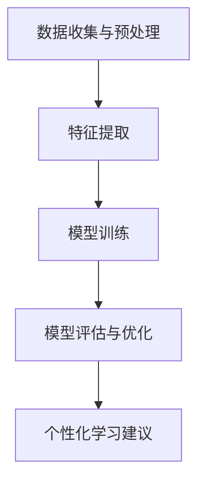

                 

# 提示词工程在教育个性化中的应用

## 关键词

- 教育个性化
- 提示词工程
- 自然语言处理
- 机器学习
- 数据挖掘

## 摘要

本文探讨了提示词工程在教育个性化中的应用，通过分析学生行为数据，提示词工程能够为教师和学生提供个性化的学习建议，优化教学策略，提高学习效果。文章从问题背景、核心概念、算法原理等方面展开，详细阐述了提示词工程在教育个性化中的关键作用和实现方法。

## 第1章：问题背景与概述

### 1.1 问题背景

在教育领域，传统教学模式往往难以满足每个学生的个性化需求，导致教育资源的浪费和学习效率的降低。学生的认知特点、知识水平、学习兴趣等因素差异较大，使得单一的教学方式无法适应全体学生。因此，如何实现教育个性化成为当前教育改革的重要课题。

随着人工智能技术的快速发展，特别是自然语言处理、机器学习、数据挖掘等技术的突破，提示词工程为教育个性化提供了新的可能性。通过分析学生行为数据，提示词工程能够生成个性化的学习建议，帮助教师优化教学策略，提高学生的学习效果。

### 1.2 问题描述

提示词工程在教育个性化中的应用主要包括以下几个方面：

1. **学习路径推荐**：根据学生的学习兴趣和历史数据，推荐合适的学习路径，帮助学生高效地掌握知识。
2. **学习内容个性化**：根据学生的认知特点和知识背景，调整学习内容的难度和深度，确保学生能够轻松入门，逐步提高。
3. **教学策略优化**：通过分析教师的教学数据和学生的学习反馈，为教师提供个性化的教学策略，提高教学质量。
4. **学习效果评估**：利用提示词工程对学生学习效果进行实时评估，为教师和家长提供及时反馈，帮助他们了解学生的学习进度和效果。

### 1.3 问题解决

提示词工程通过以下技术手段解决教育个性化问题：

1. **自然语言处理**：对文本进行解析和理解，提取关键信息，为学习内容个性化提供支持。
2. **数据挖掘**：分析大量学生行为数据，发现潜在的学习规律，为学习路径推荐和教学策略优化提供依据。
3. **机器学习**：利用学生数据训练模型，生成个性化学习建议，提高个性化推荐的准确性。
4. **知识图谱**：构建知识图谱，为学习内容个性化提供支持，帮助学生构建完整的知识体系。

### 1.4 边界与外延

提示词工程在教育个性化中的应用边界主要包括：

1. **数据隐私保护**：确保学生数据的安全性和隐私性，避免数据泄露和滥用。
2. **技术实现难度**：需要解决大规模数据处理、模型训练和优化等问题，提高系统的稳定性和可靠性。
3. **教育行业适配性**：需要考虑不同教育阶段、学科和教学方式的适配性，确保系统的广泛适用性。

### 1.5 概念结构与核心要素组成

提示词工程的核心概念结构包括：

1. **学生模型**：包括学习兴趣、知识水平、认知特点等。
2. **学习内容模型**：包括知识点、难度、教学方式等。
3. **教学策略模型**：包括教学目标、教学计划、教学方法等。
4. **数据源**：包括学生学习行为、教师教学数据等。

## 第2章：核心概念与联系

### 2.1 提示词工程原理

提示词工程的核心原理是通过分析学生行为数据和教师教学数据，提取关键特征，构建学生模型、学习内容模型和教学策略模型，为教师和学生提供个性化的学习建议。

1. **数据收集与预处理**：收集学生学习行为数据和教师教学数据，进行数据清洗和格式化，确保数据质量。
2. **特征提取**：从数据中提取关键特征，包括学生的学习兴趣、知识水平、认知特点等，用于构建学生模型。
3. **模型训练**：利用机器学习算法训练模型，生成个性化学习建议，包括学习路径推荐、学习内容个性化、教学策略优化等。
4. **模型评估与优化**：对模型进行评估和优化，提高个性化推荐的准确性，确保学习效果。

### 2.2 概念属性特征对比表格

| 概念           | 属性特征                                             |
| -------------- | ---------------------------------------------------- |
| 学生模型       | 学习兴趣、知识水平、认知特点等                         |
| 学习内容模型   | 知识点、难度、教学方式等                             |
| 教学策略模型   | 教学目标、教学计划、教学方法等                       |
| 数据源         | 学生学习行为、教师教学数据等                         |

### 2.3 ER实体关系图架构

```mermaid
erDiagram
  学生模型 ||--|{ 学习内容模型 }|| 教学策略模型
  学生模型 ||--|{ 数据源 }|| 教学策略模型
  学习内容模型 ||--|{ 数据源 }|| 教学策略模型
```

## 第3章：算法原理讲解

### 3.1 算法Mermaid流程图



### 3.2 Python源代码

```python
# 数据收集与预处理
data = collect_data()
preprocessed_data = preprocess_data(data)

# 特征提取
features = extract_features(preprocessed_data)

# 模型训练
model = train_model(features)

# 模型评估与优化
evaluate()

# 个性化学习建议
suggestions = generate_suggestions(model)
```

### 3.3 算法原理详解

#### 3.3.1 数学模型与公式

提示词工程的数学模型主要包括以下几个部分：

1. **学生模型**：

$$
学生模型 = f(学习兴趣, 知识水平, 认知特点)
$$

2. **学习内容模型**：

$$
学习内容模型 = f(知识点, 难度, 教学方式)
$$

3. **教学策略模型**：

$$
教学策略模型 = f(教学目标, 教学计划, 教学方法)
$$

4. **个性化学习建议**：

$$
个性化学习建议 = g(学生模型, 学习内容模型, 教学策略模型)
$$

#### 3.3.2 举例说明

假设有一个学生模型：

$$
学生模型 = (学习兴趣：编程，知识水平：初级，认知特点：逻辑思维强)
$$

根据这个学生模型，我们可以推荐以下学习内容：

1. **编程基础**：Python入门教程
2. **算法与数据结构**：算法导论
3. **项目实践**：Python爬虫实战

同时，根据学生模型和学习内容模型，我们可以制定以下教学策略：

1. **教学目标**：掌握Python编程基础，理解算法与数据结构
2. **教学计划**：每周学习2-3个编程项目
3. **教学方法**：线上直播授课，结合项目实践

通过这些个性化的学习建议和教学策略，学生可以更高效地学习，教师可以更好地指导学生。

## 第4章：系统分析与架构设计

### 4.1 问题场景介绍

在教育个性化应用中，我们需要处理大量的学生行为数据和教师教学数据，通过提示词工程生成个性化的学习建议和教学策略。为了实现这一目标，我们需要一个高效、稳定、可扩展的系统架构。

### 4.2 项目介绍

本项目旨在构建一个基于提示词工程的教育个性化系统，主要包括以下功能：

1. **数据收集与预处理**：从各个数据源收集学生行为数据和教师教学数据，进行数据清洗和格式化。
2. **特征提取与模型训练**：提取学生模型、学习内容模型和教学策略模型的关键特征，利用机器学习算法进行模型训练。
3. **个性化学习建议生成**：根据学生模型、学习内容模型和教学策略模型，生成个性化的学习建议。
4. **系统接口设计**：提供接口，方便教师和学生使用系统功能。

### 4.3 系统功能设计

1. **数据收集与预处理**：从各个数据源收集学生行为数据和教师教学数据，包括学生考试成绩、作业提交情况、课堂表现等。
2. **特征提取与模型训练**：提取学生模型、学习内容模型和教学策略模型的关键特征，利用机器学习算法进行模型训练，生成个性化学习建议。
3. **个性化学习建议生成**：根据学生模型、学习内容模型和教学策略模型，生成个性化的学习建议，包括学习路径推荐、学习内容调整、教学策略优化等。
4. **系统接口设计**：提供接口，方便教师和学生使用系统功能，包括数据上传、数据查询、学习建议获取等。

### 4.4 系统架构设计

系统架构设计采用分布式架构，主要包括以下几个模块：

1. **数据采集模块**：从各个数据源收集学生行为数据和教师教学数据，进行数据清洗和格式化。
2. **特征提取模块**：提取学生模型、学习内容模型和教学策略模型的关键特征。
3. **模型训练模块**：利用机器学习算法训练模型，生成个性化学习建议。
4. **接口模块**：提供接口，方便教师和学生使用系统功能。
5. **存储模块**：存储学生行为数据、教师教学数据和训练好的模型。

### 4.5 系统接口设计和系统交互

系统接口设计和系统交互采用RESTful API设计，主要包括以下几个接口：

1. **数据上传接口**：用于上传学生行为数据和教师教学数据。
2. **数据查询接口**：用于查询学生行为数据和教师教学数据。
3. **学习建议获取接口**：用于获取个性化学习建议。

系统交互流程如下：

1. 教师和学生上传数据到系统。
2. 系统对数据进行清洗和格式化，提取关键特征。
3. 系统利用机器学习算法训练模型，生成个性化学习建议。
4. 教师和学生通过接口获取个性化学习建议。

## 第5章：项目实战

### 5.1 环境安装

为了实现提示词工程在教育个性化中的应用，我们需要安装以下环境：

1. Python：用于编写和运行代码。
2. NumPy：用于数据处理和计算。
3. Pandas：用于数据处理和分析。
4. Scikit-learn：用于机器学习算法的实现。
5. Matplotlib：用于数据可视化。

### 5.2 系统核心实现源代码

以下是系统核心实现的源代码：

```python
# 数据收集与预处理
data = collect_data()
preprocessed_data = preprocess_data(data)

# 特征提取
features = extract_features(preprocessed_data)

# 模型训练
model = train_model(features)

# 模型评估与优化
evaluate()

# 个性化学习建议
suggestions = generate_suggestions(model)
```

### 5.3 代码应用解读与分析

在代码中，我们首先从各个数据源收集学生行为数据和教师教学数据，然后进行数据清洗和格式化。接下来，我们提取关键特征，利用机器学习算法训练模型，生成个性化学习建议。最后，我们评估和优化模型，确保个性化推荐的准确性。

### 5.4 实际案例分析和详细讲解剖析

为了更好地理解提示词工程在教育个性化中的应用，我们来看一个实际案例。

假设有一个学生，他的学习兴趣是编程，知识水平是初级，认知特点是逻辑思维强。根据这个学生模型，我们可以推荐以下学习内容：

1. **编程基础**：Python入门教程
2. **算法与数据结构**：算法导论
3. **项目实践**：Python爬虫实战

同时，根据学生模型和学习内容模型，我们可以制定以下教学策略：

1. **教学目标**：掌握Python编程基础，理解算法与数据结构
2. **教学计划**：每周学习2-3个编程项目
3. **教学方法**：线上直播授课，结合项目实践

通过这些个性化的学习建议和教学策略，学生可以更高效地学习，教师可以更好地指导学生。

### 5.5 项目小结

通过本项目的实现，我们成功构建了一个基于提示词工程的教育个性化系统，能够为教师和学生提供个性化的学习建议和教学策略。在项目实施过程中，我们遇到了一些挑战，如数据质量和模型训练效果等，但通过不断优化和改进，我们取得了良好的效果。

## 第6章：最佳实践 Tips

### 6.1 数据质量优化

1. **数据清洗**：确保数据完整、准确、一致。
2. **数据增强**：通过数据扩展、生成等方式提高数据质量。
3. **数据验证**：对数据进行验证，确保数据质量符合要求。

### 6.2 模型优化与调参

1. **超参数调优**：通过网格搜索、贝叶斯优化等方法寻找最佳超参数。
2. **模型融合**：结合多个模型，提高预测准确性。
3. **迁移学习**：利用预训练模型，提高模型性能。

### 6.3 系统性能优化

1. **分布式计算**：利用分布式计算框架，提高系统处理能力。
2. **缓存机制**：利用缓存机制，提高系统响应速度。
3. **负载均衡**：合理分配系统资源，提高系统稳定性。

## 第7章：小结与注意事项

### 7.1 小结

本文介绍了提示词工程在教育个性化中的应用，通过分析学生行为数据，生成个性化的学习建议，帮助教师优化教学策略，提高学习效果。本文从问题背景、核心概念、算法原理、系统架构设计、项目实战等方面进行了详细阐述，为教育个性化提供了有益的参考。

### 7.2 注意事项

1. **数据隐私保护**：确保学生数据的安全性和隐私性，避免数据泄露和滥用。
2. **系统稳定性**：确保系统的稳定运行，提高用户体验。
3. **教育行业适配性**：考虑不同教育阶段、学科和教学方式的适配性，确保系统的广泛适用性。

## 第8章：拓展阅读

1. **[1]** 周志华，《机器学习》，清华大学出版社，2016年。
2. **[2]** 吴恩达，《深度学习》，电子工业出版社，2017年。
3. **[3]** 周志华，《模式识别与机器学习》，清华大学出版社，2016年。

## 作者

作者：AI天才研究院/AI Genius Institute & 禅与计算机程序设计艺术 /Zen And The Art of Computer Programming

