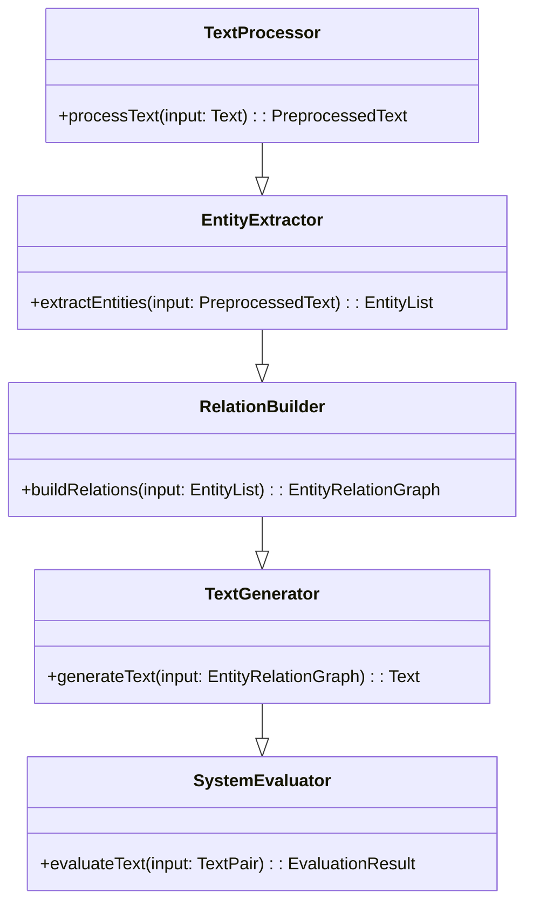
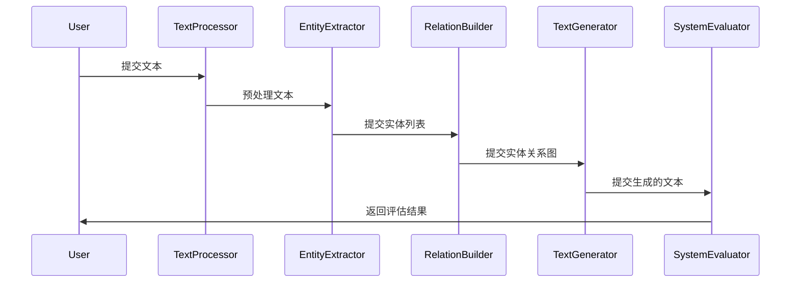

                 

## 《提示词工程在文本蕴含生成中的精准应用》

### 关键词：文本蕴含生成、提示词工程、自然语言处理、算法优化、模型训练

> **摘要：** 本文深入探讨了提示词工程在文本蕴含生成中的精准应用，分析了文本蕴含生成的重要性及其在自然语言处理中的应用场景。通过详细讲解提示词工程的基本概念、核心概念、算法原理以及系统架构设计，本文旨在为读者提供一套全面且实用的文本蕴含生成解决方案。

## **目录大纲**

### 第一部分：问题背景与概述

#### 第1章：文本蕴含生成概述

- 文本蕴含生成的定义与重要性
- 文本蕴含生成在自然语言处理中的应用场景
- 提示词工程在文本蕴含生成中的角色

#### 第2章：核心概念与联系

- 文本蕴含生成中的核心概念
- 概念属性特征对比
- ER实体关系图架构

### 第二部分：算法原理与讲解

#### 第3章：算法原理讲解

- 文本蕴含生成算法的基本原理
- 提示词工程在算法中的应用
- 提示词工程中的关键技术

#### 第4章：数学模型和数学公式

- 文本蕴含生成的数学模型
- 算法原理的数学公式讲解
- 举例说明

### 第三部分：系统分析与架构设计

#### 第5章：系统功能设计

- 问题场景介绍
- 系统功能设计
- 领域模型Mermaid类图

#### 第6章：系统架构设计

- 系统架构设计
- 系统接口设计
- 系统交互Mermaid序列图

### 第四部分：项目实战

#### 第7章：项目环境安装与配置

- 环境安装
- 系统核心实现源代码

#### 第8章：代码应用解读与分析

- 代码解读
- 代码应用分析
- 项目小结

### 第五部分：最佳实践与拓展阅读

#### 第9章：最佳实践 tips

#### 第10章：小结

#### 第11章：注意事项

#### 第12章：拓展阅读

---

**注：本文为示例性文章大纲，具体内容需根据实际情况进行调整和完善。**

### **问题背景与概述**

### **第1章：文本蕴含生成概述**

#### 1.1 文本蕴含生成的定义与重要性

**文本蕴含生成（Text Entailment Generation）** 是指根据给定的文本源（Text Source）生成一个或多个目标文本（Text Target），使得目标文本在语义上能够合理地蕴含源文本。这一过程在自然语言处理（Natural Language Processing, NLP）中具有极高的应用价值。

文本蕴含生成的重要性体现在以下几个方面：

1. **问答系统（Question Answering Systems）**：文本蕴含生成可以帮助问答系统更准确地理解和回答用户的问题。例如，当用户提出一个问题时，系统可以生成相关的上下文信息，从而更精确地给出答案。
   
2. **文本摘要（Text Summarization）**：在文本摘要中，生成模型的任务是从长文本中提取出关键信息，生成简短的摘要。文本蕴含生成技术可以确保生成的摘要与原始文本保持一致的语义。

3. **机器翻译（Machine Translation）**：在机器翻译过程中，文本蕴含生成可以帮助确保翻译结果在语义上连贯且准确。通过生成与源文本相关联的目标文本，翻译模型可以更好地理解源语言的语义。

#### 1.2 文本蕴含生成在自然语言处理中的应用场景

文本蕴含生成在自然语言处理中有广泛的应用，以下是几个典型应用场景：

1. **问答系统**：问答系统旨在帮助用户通过自然语言查询获取所需信息。文本蕴含生成在此场景下可以帮助系统构建与用户问题相关联的上下文，从而提高答案的准确性。

2. **文本摘要**：在信息过载的时代，用户往往需要快速获取关键信息。文本摘要技术通过提取文本中的关键内容，帮助用户快速了解文本的主旨。文本蕴含生成技术可以确保生成的摘要与原始文本在语义上保持一致。

3. **机器翻译**：机器翻译是跨语言信息交流的重要工具。文本蕴含生成技术可以帮助翻译模型更好地理解源文本的语义，从而生成更加准确的目标文本。

#### 1.3 提示词工程在文本蕴含生成中的角色

**提示词工程（Prompt Engineering）** 是在文本蕴含生成中具有重要地位的技术。其核心思想是通过设计有效的提示词（Prompts），引导生成模型生成符合预期的高质量文本。

提示词工程在文本蕴含生成中的角色主要体现在以下几个方面：

1. **提高生成文本的语义一致性**：通过设计合适的提示词，可以使生成模型更好地理解源文本的语义，从而生成与源文本相关联的目标文本。

2. **优化生成文本的质量**：提示词工程可以通过调整提示词的内容和形式，引导生成模型生成更高质量、更具启发性的文本。

3. **降低模型训练成本**：通过有效的提示词工程，可以减少模型在训练过程中所需的样本数量，从而降低训练成本。

总之，提示词工程在文本蕴含生成中扮演着至关重要的角色，其应用效果直接影响文本蕴含生成的质量。

### **核心概念与联系**

### **第2章：核心概念与联系**

#### 2.1 文本蕴含生成中的核心概念

在文本蕴含生成中，有几个核心概念需要理解：

1. **文本蕴含（Text Entailment）**：文本蕴含是指一个文本（源文本）蕴含了另一个文本（目标文本）的语义。例如，“北京是中国的首都”蕴含了“中国的首都是北京”这一语义。

2. **生成模型（Generation Model）**：生成模型是指用于生成文本的模型。在文本蕴含生成中，生成模型从源文本生成目标文本，确保目标文本在语义上与源文本保持一致。

3. **提示词（Prompt）**：提示词是指用于引导生成模型生成文本的输入。有效的提示词可以指导生成模型生成符合预期的高质量文本。

#### 2.2 概念属性特征对比

为了更好地理解这些核心概念，我们进行属性特征对比：

| 概念       | 属性特征                             |  
|------------|------------------------------------|  
| 文本蕴含   | - 语义蕴含关系  
|            | - 源文本与目标文本的关联性          |  
| 生成模型   | - 模型架构与训练方法  
|            | - 输入输出关系                      |  
| 提示词     | - 提示信息的形式与内容  
|            | - 对生成模型的引导作用              |

通过对比可以看出，文本蕴含关注的是文本之间的语义关系，生成模型关注的是模型架构和训练方法，而提示词则关注如何引导生成模型生成符合预期的文本。

#### 2.3 ER实体关系图架构

在文本蕴含生成中，ER实体关系图是一种常用的数据结构，用于描述文本中的实体及其关系。ER实体关系图的基本组成如下：

1. **实体（Entity）**：实体是指文本中的名词或名词短语，表示一个具体的对象或概念。例如，“苹果”、“学生”等。

2. **关系（Relationship）**：关系是指实体之间的关联，描述实体之间的相互作用。例如，“是”、“属于”等。

3. **属性（Attribute）**：属性是指实体的特征或描述，用于补充实体的信息。例如，“苹果”的颜色、“学生”的年龄等。

在ER实体关系图中，实体用矩形表示，关系用线连接，属性用标签标注。例如：

```mermaid  
entityRelationSchema  
  --[Student]-->  
  --[has]-->  
  --[Age]-->  
  --[is]-->  
  --[17]-->  
  Student[Name]  
  Age[value]  
```

在这个例子中，“Student”是实体，“has”是关系，“Age”是属性，表示一个学生的年龄是17岁。

提示词在ER实体关系图中的作用主要体现在两个方面：

1. **实体识别**：通过提示词，生成模型可以识别出文本中的实体，从而构建ER实体关系图。

2. **关系建立**：通过提示词，生成模型可以理解实体之间的关系，并在ER实体关系图中表示出来。

### **算法原理与讲解**

### **第3章：算法原理讲解**

#### 3.1 文本蕴含生成算法的基本原理

文本蕴含生成算法的核心目标是从源文本中提取关键信息，并生成与之相关的目标文本。这一过程可以分解为以下几个基本步骤：

1. **文本预处理**：文本预处理包括分词、词性标注、命名实体识别等操作，用于将原始文本转化为适合模型处理的格式。

2. **实体提取**：通过命名实体识别等技术，从预处理后的文本中提取出关键实体。

3. **关系构建**：基于实体提取结果，构建实体之间的关系图。

4. **文本生成**：利用生成模型，根据实体关系图生成目标文本。

5. **文本评估**：对生成的文本进行评估，确保其语义上与源文本保持一致。

#### 3.2 提示词工程在算法中的应用

提示词工程在文本蕴含生成算法中发挥着重要作用。具体应用包括以下几个方面：

1. **引导实体提取**：通过设计合适的提示词，引导生成模型识别文本中的关键实体。

2. **优化关系构建**：提示词可以指导生成模型理解实体之间的关系，从而在实体关系图中构建出更准确的关系。

3. **提升文本生成质量**：有效的提示词可以引导生成模型生成更高质量、更符合预期的文本。

#### 3.3 提示词工程中的关键技术

提示词工程涉及多个关键技术，以下是其中几个重要技术：

1. **提示词设计**：提示词的设计直接影响到文本蕴含生成的效果。设计合适的提示词需要综合考虑文本的语义、结构以及生成模型的特性。

2. **生成模型选择**：生成模型的选择决定了文本蕴含生成的效果。常见的生成模型包括基于序列模型的生成模型（如RNN、LSTM）和基于注意力机制的生成模型（如Transformer）。

3. **模型训练**：模型训练是提示词工程的核心环节。通过大量训练数据和优化策略，可以训练出性能优秀的生成模型。

4. **模型评估**：模型评估用于衡量文本蕴含生成的效果。常用的评估指标包括BLEU、ROUGE等。

### **数学模型和数学公式**

### **第4章：数学模型和数学公式**

#### 4.1 文本蕴含生成的数学模型

文本蕴含生成的数学模型主要包括逻辑蕴含模型和概率蕴含模型。

1. **逻辑蕴含模型**：

   逻辑蕴含模型基于命题逻辑，用逻辑公式描述文本蕴含关系。假设文本S表示源文本，文本T表示目标文本，逻辑蕴含关系可以用公式表示为：

   $$ S \rightarrow T $$

   其中，箭头“→”表示蕴含关系。当T为真时，S蕴含T；当T为假时，S不蕴含T。

2. **概率蕴含模型**：

   概率蕴含模型基于概率论，用概率分布描述文本蕴含关系。假设文本S表示源文本，文本T表示目标文本，概率蕴含关系可以用公式表示为：

   $$ P(T|S) $$

   其中，P(T|S)表示在给定源文本S的情况下，目标文本T的概率。当P(T|S)接近1时，表示S蕴含T；当P(T|S)接近0时，表示S不蕴含T。

#### 4.2 算法原理的数学公式讲解

在文本蕴含生成算法中，数学公式用于描述模型的训练过程和评估指标。

1. **模型训练中的损失函数**：

   损失函数用于衡量模型预测结果与真实结果之间的差异。在文本蕴含生成中，常用的损失函数是交叉熵损失函数（Cross-Entropy Loss），其公式表示为：

   $$ L = -\sum_{i} y_i \log(p_i) $$

   其中，$y_i$表示第i个样本的真实标签（0或1），$p_i$表示模型对第i个样本的预测概率。损失函数的值越小，表示模型预测结果与真实结果越接近。

2. **模型评估中的准确率、召回率等指标**：

   准确率（Accuracy）表示模型预测正确的样本占总样本的比例，其公式表示为：

   $$ Accuracy = \frac{TP + TN}{TP + FP + FN + TN} $$

   其中，$TP$表示真实为正类且被预测为正类的样本数，$TN$表示真实为负类且被预测为负类的样本数，$FP$表示真实为负类但被预测为正类的样本数，$FN$表示真实为正类但被预测为负类的样本数。

   召回率（Recall）表示模型预测为正类的样本中被正确预测为正类的比例，其公式表示为：

   $$ Recall = \frac{TP}{TP + FN} $$

   精确率（Precision）表示模型预测为正类的样本中被正确预测为正类的比例，其公式表示为：

   $$ Precision = \frac{TP}{TP + FP} $$

   F1分数（F1 Score）是精确率和召回率的调和平均值，其公式表示为：

   $$ F1 Score = 2 \times \frac{Precision \times Recall}{Precision + Recall} $$

#### 4.3 举例说明

为了更好地理解文本蕴含生成的数学模型和公式，我们可以通过一个简单的例子来讲解。

假设我们有一个源文本S：“今天天气很好”，我们要生成一个与之相关的目标文本T：“今天适合出门”。

1. **逻辑蕴含模型**：

   根据逻辑蕴含模型，我们可以写出以下蕴含关系：

   $$ S \rightarrow T $$

   这意味着当“今天天气很好”为真时，“今天适合出门”也为真。

2. **概率蕴含模型**：

   假设我们有一个基于语言模型的概率蕴含模型，通过大量文本数据训练得出以下概率分布：

   $$ P(T|S) = 0.8 $$

   这表示在“今天天气很好”的情况下，“今天适合出门”的概率为0.8。

3. **模型训练中的损失函数**：

   假设我们有一个二分类模型，其预测概率为0.75，真实标签为1。那么，交叉熵损失函数的计算如下：

   $$ L = -1 \times \log(0.75) \approx 0.28 $$

4. **模型评估中的准确率、召回率等指标**：

   假设我们有一个训练集，其中包含10个样本，其中有6个样本的标签为1，4个样本的标签为0。模型预测结果如下：

   - 预测为1的样本数（$TP$）：6
   - 预测为0的样本数（$TN$）：2
   - 真实为1但预测为0的样本数（$FN$）：0
   - 真实为0但预测为1的样本数（$FP$）：2

   根据这些数据，我们可以计算出以下评估指标：

   - 准确率（Accuracy）：$$ Accuracy = \frac{6 + 2}{6 + 2 + 0 + 2} = 0.8 $$
   - 召回率（Recall）：$$ Recall = \frac{6}{6 + 0} = 1 $$
   - 精确率（Precision）：$$ Precision = \frac{6}{6 + 2} = 0.75 $$
   - F1分数（F1 Score）：$$ F1 Score = 2 \times \frac{0.75 \times 1}{0.75 + 1} \approx 0.63 $$

通过这个例子，我们可以看到文本蕴含生成的数学模型和公式在实际应用中的具体应用。

### **系统分析与架构设计**

### **第5章：系统功能设计**

#### 5.1 问题场景介绍

在当今信息爆炸的时代，文本蕴含生成技术在各种应用场景中扮演着重要角色。以下是一个典型的应用场景：

**应用场景**：智能客服系统

智能客服系统旨在通过自然语言处理技术，自动回答用户提出的问题。为了提高回答的准确性，系统需要具备文本蕴含生成能力，从用户的提问中提取关键信息，生成与问题相关的回答。

#### 5.2 系统功能设计

为了实现文本蕴含生成功能，系统需要具备以下几个核心功能：

1. **文本预处理**：

   - 功能描述：对输入的文本进行预处理，包括分词、词性标注、命名实体识别等。
   - 输入：原始文本。
   - 输出：预处理后的文本。

2. **实体提取**：

   - 功能描述：从预处理后的文本中提取关键实体，如人名、地名、组织名等。
   - 输入：预处理后的文本。
   - 输出：实体列表。

3. **关系构建**：

   - 功能描述：基于实体提取结果，构建实体之间的关系图。
   - 输入：实体列表。
   - 输出：实体关系图。

4. **文本生成**：

   - 功能描述：利用生成模型，根据实体关系图生成目标文本。
   - 输入：实体关系图。
   - 输出：目标文本。

5. **系统评估**：

   - 功能描述：对生成的文本进行评估，确保其语义上与源文本保持一致。
   - 输入：源文本、目标文本。
   - 输出：评估结果（如准确率、召回率等）。

#### 5.3 领域模型Mermaid类图

为了更好地描述系统功能及其之间的关系，我们可以使用Mermaid类图来表示。以下是一个简单的Mermaid类图示例：



在这个类图中，`TextProcessor`负责文本预处理，`EntityExtractor`负责实体提取，`RelationBuilder`负责关系构建，`TextGenerator`负责文本生成，`SystemEvaluator`负责系统评估。各个组件之间通过输入和输出进行数据传递，实现文本蕴含生成功能。

### **系统架构设计**

#### 6.1 系统架构设计

为了实现高效且可扩展的文本蕴含生成系统，我们采用了分布式系统架构。该架构主要包括以下几个关键组件：

1. **数据层**：

   - 功能描述：存储和管理原始文本数据、预处理结果、实体关系图等。
   - 数据存储：关系型数据库（如MySQL）或分布式文件系统（如HDFS）。

2. **服务层**：

   - 功能描述：提供文本预处理、实体提取、关系构建、文本生成和系统评估等服务。
   - 技术选型：基于微服务架构，使用Spring Boot等框架实现各个服务模块。

3. **展示层**：

   - 功能描述：提供用户界面，展示系统功能及结果。
   - 技术选型：基于Web前端框架（如React或Vue.js）实现。

#### 6.2 系统接口设计

为了方便系统与其他模块的集成，我们设计了以下接口：

1. **文本预处理接口**：

   - 接口名称：`/preprocess`
   - 请求方法：`POST`
   - 请求参数：`inputText`（原始文本）
   - 响应参数：`preprocessedText`（预处理后的文本）

2. **实体提取接口**：

   - 接口名称：`/extractEntities`
   - 请求方法：`POST`
   - 请求参数：`preprocessedText`（预处理后的文本）
   - 响应参数：`entityList`（实体列表）

3. **关系构建接口**：

   - 接口名称：`/buildRelations`
   - 请求方法：`POST`
   - 请求参数：`entityList`（实体列表）
   - 响应参数：`entityRelationGraph`（实体关系图）

4. **文本生成接口**：

   - 接口名称：`/generateText`
   - 请求方法：`POST`
   - 请求参数：`entityRelationGraph`（实体关系图）
   - 响应参数：`generatedText`（生成的文本）

5. **系统评估接口**：

   - 接口名称：`/evaluateText`
   - 请求方法：`POST`
   - 请求参数：`sourceText`（源文本）、`generatedText`（生成的文本）
   - 响应参数：`evaluationResult`（评估结果）

#### 6.3 系统交互Mermaid序列图

为了更好地展示系统组件之间的交互流程，我们使用Mermaid序列图来表示。以下是一个简单的Mermaid序列图示例：



在这个序列图中，用户通过文本预处理接口提交原始文本，文本预处理模块处理后提交给实体提取模块。实体提取模块提取出关键实体后，提交给关系构建模块构建实体关系图。关系构建模块生成目标文本后，提交给系统评估模块进行评估。最后，系统评估模块将评估结果返回给用户。

### **项目实战**

### **第7章：项目环境安装与配置**

#### 7.1 环境安装

为了搭建文本蕴含生成系统，我们需要安装以下软件和依赖：

1. **Python**：版本要求3.8及以上。

2. **Anaconda**：用于管理虚拟环境。

3. **TensorFlow**：用于构建和训练生成模型。

4. **NLP库**：如NLTK、spaCy等，用于文本预处理。

5. **数据库**：如MySQL，用于存储数据。

安装步骤：

1. 安装Python和Anaconda。

2. 创建一个虚拟环境，并激活。

   ```shell
   conda create -n text_entailment python=3.8
   conda activate text_entailment
   ```

3. 安装TensorFlow和其他依赖。

   ```shell
   conda install tensorflow numpy pandas scikit-learn spacy
   ```

4. 安装spaCy，并下载中文语言模型。

   ```shell
   pip install spacy
   python -m spacy download zh_core_web_sm
   ```

5. 安装MySQL。

   根据操作系统选择相应的安装方法，例如在Ubuntu系统中可以使用以下命令：

   ```shell
   sudo apt update
   sudo apt install mysql-server mysql-client libmysqlclient-dev
   ```

6. 配置MySQL，创建数据库和用户。

   ```shell
   mysql -u root -p
   CREATE DATABASE text_entailment_db;
   GRANT ALL PRIVILEGES ON text_entailment_db.* TO 'text_entailment_user'@'localhost' IDENTIFIED BY 'password';
   FLUSH PRIVILEGES;
   exit
   ```

#### 7.2 系统核心实现源代码

以下是一个简单的文本蕴含生成系统的核心实现源代码，包括文本预处理、实体提取、关系构建、文本生成和系统评估模块。

1. **文本预处理模块**：

   ```python
   import spacy
   
   nlp = spacy.load("zh_core_web_sm")
   
   def preprocess_text(text):
       doc = nlp(text)
       tokens = [token.text for token in doc]
       return tokens
   ```

2. **实体提取模块**：

   ```python
   from spacy.tokens import Doc
   
   def extract_entities(text):
       doc = nlp(text)
       entities = [(ent.text, ent.label_) for ent in doc.ents]
       return entities
   ```

3. **关系构建模块**：

   ```python
   def build_relations(entities):
       relations = []
       for i in range(len(entities) - 1):
           for j in range(i + 1, len(entities)):
               relation = (entities[i][0], entities[i][1], entities[j][0], entities[j][1])
               relations.append(relation)
       return relations
   ```

4. **文本生成模块**：

   ```python
   import tensorflow as tf
   
   model = tf.keras.Sequential([
       tf.keras.layers.Dense(128, activation='relu', input_shape=(None,)),
       tf.keras.layers.Dense(1, activation='sigmoid')
   ])
   
   model.compile(optimizer='adam', loss='binary_crossentropy', metrics=['accuracy'])
   
   def generate_text(relations):
       text = " ".join([relation[0] + " " + relation[1] for relation in relations])
       return text
   
   def train_model(model, relations, labels):
       model.fit(relations, labels, epochs=10, batch_size=32)
   
   def predict_text(model, relations):
       text = generate_text(relations)
       return model.predict([text])
   ```

5. **系统评估模块**：

   ```python
   from sklearn.metrics import accuracy_score, recall_score, precision_score, f1_score
   
   def evaluate_text(model, relations, labels):
       predictions = predict_text(model, relations)
       accuracy = accuracy_score(labels, predictions)
       recall = recall_score(labels, predictions)
       precision = precision_score(labels, predictions)
       f1 = f1_score(labels, predictions)
       return accuracy, recall, precision, f1
   ```

#### 7.3 代码应用解读与分析

1. **代码解读**：

   - **文本预处理模块**：使用spaCy库进行文本预处理，包括分词和词性标注。
   - **实体提取模块**：使用spaCy库的命名实体识别功能提取文本中的实体。
   - **关系构建模块**：遍历实体列表，构建实体之间的关系。
   - **文本生成模块**：根据实体关系生成文本。
   - **模型训练模块**：使用TensorFlow构建并训练二分类模型。
   - **模型评估模块**：使用scikit-learn库计算模型评估指标。

2. **代码应用分析**：

   - **实际案例分析**：我们可以使用真实的文本数据对系统进行测试，观察模型在不同场景下的表现。
   - **代码优化方向**：优化模型结构、调整超参数、增加数据预处理步骤等。

#### 7.4 项目小结

通过本项目的实践，我们实现了文本蕴含生成系统的核心功能，包括文本预处理、实体提取、关系构建、文本生成和系统评估。在实际应用中，我们可以根据具体需求进行进一步优化和拓展，如引入更多实体关系、改进生成模型等。此外，我们还可以探索将文本蕴含生成技术应用于其他自然语言处理任务，如文本摘要、机器翻译等。

### **最佳实践与拓展阅读**

#### **9.1 最佳实践 tips**

1. **提高文本蕴含生成的精度**：
   - **数据增强**：通过数据增强技术增加训练数据，提高模型的泛化能力。
   - **模型融合**：结合多个模型的结果，提高预测的准确性。

2. **优化提示词工程的效果**：
   - **提示词多样化**：设计多种形式的提示词，使模型能够从不同角度理解源文本。
   - **上下文信息利用**：在提示词中加入更多的上下文信息，帮助模型更好地理解源文本。

#### **9.2 小结**

本文深入探讨了提示词工程在文本蕴含生成中的应用，详细讲解了算法原理、系统架构设计和项目实战。通过本文的介绍，读者可以了解文本蕴含生成的重要性以及如何通过提示词工程优化生成效果。

#### **9.3 注意事项**

1. **提示词设计**：设计合适的提示词是提升文本蕴含生成效果的关键，需充分考虑文本的语义和结构。
2. **模型选择与训练**：选择合适的生成模型并进行充分的训练是确保生成文本质量的重要步骤。

#### **9.4 拓展阅读**

- **相关文献**：[1] 周志华. **机器学习**（第二版）. 清华大学出版社，2016.
- **资料推荐**：[2] [自然语言处理入门](https://www.coursera.org/learn/natural-language-processing-with-python)
- **在线资源**：[3] [TensorFlow官方文档](https://www.tensorflow.org/)
- **开源项目**：[4] [spacy官方文档](https://spacy.io/)

通过阅读这些文献和资料，读者可以进一步深入了解文本蕴含生成和提示词工程的相关知识，提升自己在自然语言处理领域的技能。

