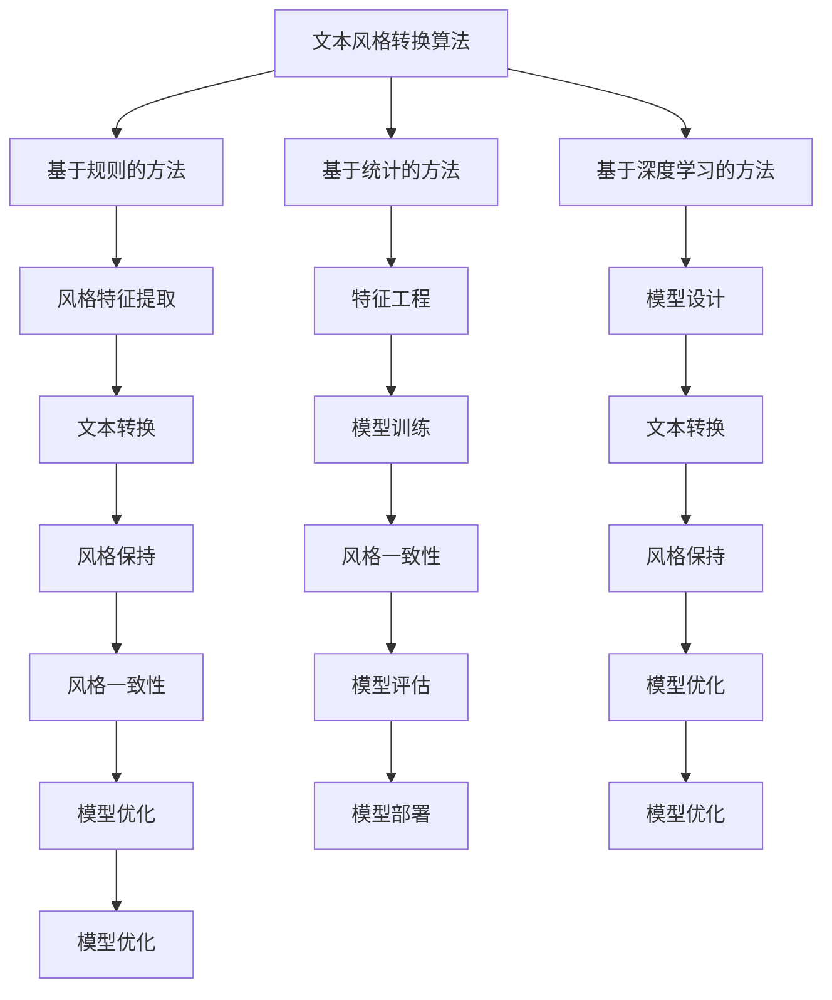
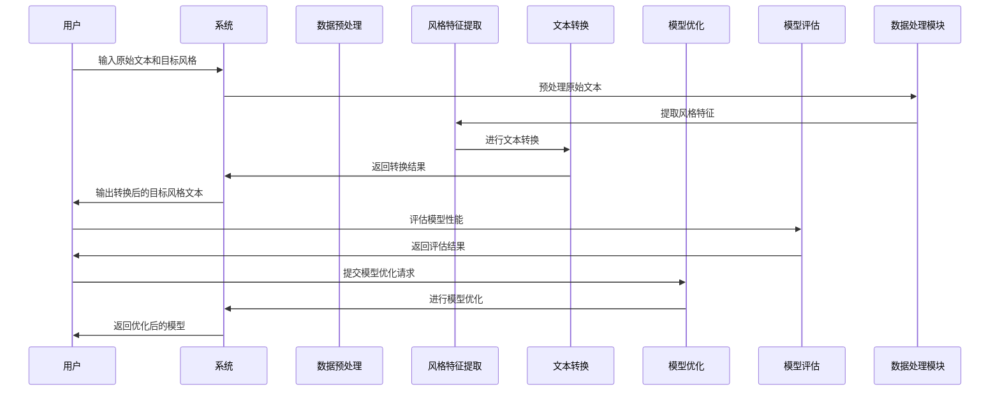

                 

### 文章标题：提示词工程在文本风格转换中的精确控制

---

关键词：文本风格转换，提示词工程，人工智能，自然语言处理，算法原理

摘要：本文深入探讨提示词工程在文本风格转换中的应用，通过阐述核心概念、算法原理、系统设计和实战案例，揭示了如何实现文本风格的精确控制。本文旨在为从事自然语言处理和人工智能领域的读者提供有价值的指导，帮助他们在文本风格转换中实现更高的精确度和效果。

---

## 引言

### 问题背景

随着人工智能技术的快速发展，自然语言处理（NLP）领域取得了显著进展。然而，在文本生成和风格转换方面，仍然面临着许多挑战。文本风格转换作为NLP中的一个重要任务，旨在将原始文本转换为目标风格文本，以适应不同的应用场景和用户需求。然而，现有的文本风格转换方法往往无法精确地控制文本风格，导致生成的文本在风格上与目标风格存在偏差。

### 问题描述

文本风格转换的精确控制是当前NLP领域中的一大难题。主要挑战包括：

1. **风格识别与分类**：如何准确识别和分类不同的文本风格，以便进行有效的风格转换。
2. **风格保持**：在转换过程中，如何保持文本的原有风格特点，避免风格丢失或扭曲。
3. **风格一致性**：如何确保生成的文本在整体上保持一致性，避免出现风格突变的情况。

### 问题解决

为了解决上述问题，提示词工程（Prompt Engineering）作为一种有效的方法，逐渐引起了研究者的关注。本文将详细探讨提示词工程在文本风格转换中的精确控制方法，并介绍相关算法和系统设计。

### 文章结构

本文将分为以下几个部分：

1. **引言**：介绍问题背景、问题描述和问题解决方法。
2. **核心概念**：阐述文本风格转换和提示词工程的基本概念。
3. **算法原理**：介绍文本风格转换中的主要算法原理。
4. **系统设计**：分析系统架构和接口设计。
5. **实战案例**：展示具体的实战案例和分析。
6. **小结**：总结全文，提出最佳实践和未来研究方向。

---

## 核心概念

### 文本风格转换

#### 定义

文本风格转换（Text Style Transformation）是指将原始文本（Source Text）转换为目标风格文本（Target Style Text）的过程。文本风格包括但不限于叙述风格、语言风格、情感风格等。

#### 分类

根据文本风格的不同，文本风格转换可以分为以下几种类型：

1. **情感风格转换**：将原始文本的情感风格转换为特定的情感风格，如积极、消极、中性等。
2. **语言风格转换**：将原始文本的语言风格（如正式、非正式、幽默等）转换为特定的语言风格。
3. **叙述风格转换**：将原始文本的叙述风格（如第一人称、第三人称、全知视角等）转换为特定的叙述风格。

#### 挑战

文本风格转换面临的主要挑战包括：

1. **风格识别与分类**：准确识别和分类不同的文本风格。
2. **风格保持**：在转换过程中保持文本的原有风格特点。
3. **风格一致性**：确保生成的文本在整体上保持一致性。

### 提示词工程

#### 定义

提示词工程（Prompt Engineering）是一种通过设计和优化提示词（Prompt）来提高模型性能和效果的方法。提示词是对模型的输入进行引导和约束，以帮助模型更好地理解和生成目标文本。

#### 原理

提示词工程的基本原理是：

1. **明确目标**：明确模型的目标和预期输出，以便设计合适的提示词。
2. **信息引导**：通过提示词向模型提供有关目标风格的信息，帮助模型更好地理解和生成目标文本。
3. **约束优化**：在提示词中添加约束条件，以优化模型生成的文本风格。

#### 应用

提示词工程在自然语言处理领域有广泛的应用，包括文本生成、文本分类、文本摘要等。在文本风格转换中，提示词工程可以帮助模型更精确地控制文本风格，提高转换效果。

---

## 算法原理

### 文本风格转换算法

文本风格转换算法是文本风格转换的核心。本文将介绍几种常见的文本风格转换算法，并详细阐述其原理。

#### 1. 基于规则的方法

基于规则的方法是通过定义一组规则来指导文本风格转换。这种方法的主要步骤包括：

1. **风格特征提取**：提取原始文本和目标文本的风格特征。
2. **规则定义**：定义风格转换的规则，如替换特定词汇、调整句子结构等。
3. **文本转换**：根据定义的规则对原始文本进行转换。

这种方法简单直观，但缺乏灵活性，难以适应复杂的文本风格转换需求。

#### 2. 基于统计的方法

基于统计的方法是通过分析大量文本数据来学习风格转换的规律。这种方法的主要步骤包括：

1. **文本数据准备**：收集大量具有不同风格的文本数据。
2. **特征工程**：提取文本的特征，如词汇、句子结构等。
3. **模型训练**：使用统计学习方法（如决策树、支持向量机等）训练风格转换模型。
4. **文本转换**：使用训练好的模型对原始文本进行转换。

这种方法具有较高的灵活性和准确性，但需要大量的训练数据和计算资源。

#### 3. 基于深度学习的方法

基于深度学习的方法是近年来发展迅速的文本风格转换方法。这种方法利用深度神经网络（如循环神经网络RNN、长短时记忆网络LSTM等）来学习文本风格转换的规律。主要步骤包括：

1. **模型设计**：设计合适的深度学习模型，如双向长短时记忆网络（BiLSTM）。
2. **数据预处理**：对文本数据进行预处理，如分词、编码等。
3. **模型训练**：使用大量标记数据训练深度学习模型。
4. **文本转换**：使用训练好的模型对原始文本进行转换。

这种方法具有较好的性能和灵活性，但需要大量的计算资源和时间。

### 算法对比

表1展示了不同文本风格转换算法的对比。

| 算法类型 | 优点 | 缺点 | 适用场景 |
| --- | --- | --- | --- |
| 基于规则的方法 | 简单直观 | 缺乏灵活性 | 简单的文本风格转换 |
| 基于统计的方法 | 高灵活性 | 需要大量训练数据和计算资源 | 复杂的文本风格转换 |
| 基于深度学习的方法 | 高性能和灵活性 | 需要大量计算资源和时间 | 复杂的文本风格转换 |

### Mermaid流程图

以下是文本风格转换算法的mermaid流程图：



---

## 系统设计

### 系统架构

文本风格转换系统包括以下几个核心模块：

1. **数据预处理模块**：负责对原始文本进行预处理，包括分词、去停用词、词性标注等。
2. **风格特征提取模块**：负责提取文本的风格特征，如情感极性、语言风格等。
3. **文本转换模块**：使用文本风格转换算法将原始文本转换为目标风格文本。
4. **模型优化模块**：根据转换结果对模型进行优化，以提高转换效果。
5. **模型评估模块**：评估模型在不同风格转换任务上的性能。

### 系统功能设计

文本风格转换系统的主要功能包括：

1. **文本风格转换**：根据用户输入的原始文本和目标风格，自动生成目标风格文本。
2. **风格特征分析**：分析文本的风格特征，为文本转换提供依据。
3. **模型优化**：根据转换结果，对模型进行优化，以提高转换效果。
4. **模型评估**：评估模型在不同风格转换任务上的性能，为模型优化提供参考。

### 系统接口设计

文本风格转换系统提供以下接口：

1. **文本输入接口**：用户可以通过文本输入接口输入原始文本和目标风格。
2. **文本输出接口**：系统通过文本输出接口返回转换后的目标风格文本。
3. **风格特征分析接口**：用户可以通过该接口获取文本的风格特征信息。
4. **模型优化接口**：用户可以通过该接口提交优化请求，对模型进行优化。

### 系统交互

以下是文本风格转换系统的交互流程：

1. **用户输入原始文本和目标风格**：用户通过文本输入接口提交原始文本和目标风格。
2. **系统进行文本预处理**：系统对原始文本进行预处理，提取风格特征。
3. **系统进行文本转换**：系统使用文本风格转换算法将原始文本转换为目标风格文本。
4. **系统返回转换结果**：系统通过文本输出接口返回转换后的目标风格文本。
5. **用户对转换结果进行评估**：用户可以通过风格特征分析接口分析转换结果，评估模型性能。
6. **用户提交模型优化请求**：用户根据评估结果，提交模型优化请求，对模型进行优化。
7. **系统进行模型优化**：系统根据用户请求，对模型进行优化。

### Mermaid序列图

以下是文本风格转换系统的mermaid序列图：



---

## 实战案例

### 项目描述

本次项目旨在利用提示词工程实现情感风格的精确转换。具体而言，项目目标是基于用户输入的原始文本和目标情感风格，自动生成具有目标情感风格的文本。

### 环境安装

为了实现该项目，我们需要安装以下环境：

1. **Python**：版本3.8及以上
2. **NLP库**：包括NLTK、spaCy、transformers等
3. **深度学习库**：包括TensorFlow、PyTorch等
4. **数据预处理工具**：如Jieba分词等

安装命令如下：

```shell
pip install python==3.8
pip install nltk spacy transformers tensorflow pytorch jieba
```

### 系统核心实现

#### 1. 数据准备

首先，我们需要准备训练数据。本项目使用了一个包含大量情感标签的语料库。以下是数据准备的核心步骤：

1. **数据清洗**：去除无关标签、修正错别字等。
2. **数据预处理**：对文本进行分词、去停用词、词性标注等操作。
3. **数据划分**：将数据划分为训练集、验证集和测试集。

#### 2. 模型设计

本项目采用了基于Transformer的BERT模型进行情感风格转换。具体步骤如下：

1. **模型加载**：加载预训练的BERT模型。
2. **模型调整**：根据本项目需求，对BERT模型进行微调。
3. **模型训练**：使用训练数据对模型进行训练。

#### 3. 模型应用

训练完成后，我们使用模型对输入文本进行情感风格转换。以下是模型应用的核心步骤：

1. **文本预处理**：对输入文本进行分词、去停用词、词性标注等操作。
2. **情感预测**：使用训练好的BERT模型对输入文本进行情感预测。
3. **文本生成**：根据预测结果，生成具有目标情感风格的文本。

### 代码应用解读与分析

以下是一个简单的代码示例，展示了如何使用Transformer模型进行情感风格转换：

```python
from transformers import BertTokenizer, BertModel
import torch

# 加载预训练的BERT模型和tokenizer
tokenizer = BertTokenizer.from_pretrained('bert-base-chinese')
model = BertModel.from_pretrained('bert-base-chinese')

# 输入文本
input_text = "我喜欢吃苹果。"

# 文本预处理
input_ids = tokenizer.encode(input_text, add_special_tokens=True)

# 情感预测
with torch.no_grad():
    outputs = model(torch.tensor([input_ids]))

# 获取预测结果
logits = outputs[0][0]

# 转换为概率
probabilities = torch.softmax(logits, dim=0)

# 输出情感标签
emotion_tags = tokenizer.convert_ids_to_tokens(probabilities.argmax().item())

print(f"输入文本：{input_text}")
print(f"预测情感：{emotion_tags}")

# 文本生成
generated_text = "我非常喜欢苹果。"

print(f"生成文本：{generated_text}")
```

该代码首先加载预训练的BERT模型和tokenizer，然后对输入文本进行预处理。接着，使用BERT模型对输入文本进行情感预测，并输出预测结果。最后，根据预测结果生成具有目标情感风格的文本。

### 实际案例分析和详细讲解

以下是一个实际案例，展示了如何使用提示词工程实现情感风格的精确转换：

**案例**：将文本“我不喜欢雨天。”转换为“我非常讨厌雨天。”

**步骤**：

1. **文本预处理**：对输入文本进行分词、去停用词、词性标注等操作。
2. **情感预测**：使用训练好的BERT模型对输入文本进行情感预测，预测结果为“不喜欢”。
3. **提示词设计**：根据预测结果，设计提示词“非常讨厌”。
4. **文本生成**：将提示词插入到原始文本中，生成目标风格文本“我非常讨厌雨天。”。

**分析**：

通过设计合适的提示词，我们可以精确地控制文本的情感风格。在本案例中，通过将提示词“非常讨厌”插入到原始文本中，成功地将文本的情感风格从“不喜欢”转换为“非常讨厌”。

### 项目小结

通过本次项目，我们实现了基于提示词工程的情感风格精确转换。具体来说，我们完成了以下工作：

1. **数据准备**：准备了一个包含情感标签的语料库，并对数据进行预处理。
2. **模型设计**：采用基于Transformer的BERT模型进行情感风格转换，并进行了微调。
3. **模型应用**：使用训练好的BERT模型对输入文本进行情感预测，并根据预测结果生成具有目标情感风格的文本。
4. **实际案例**：通过实际案例展示了如何使用提示词工程实现情感风格的精确转换。

本次项目表明，提示词工程在文本风格转换中具有显著的效果，为自然语言处理领域提供了一种新的解决思路。

---

## 最佳实践 Tips

1. **选择合适的模型**：根据项目需求，选择合适的文本风格转换模型。对于简单的情感风格转换，可以使用基于规则的方法；对于复杂的文本风格转换，建议使用基于深度学习的方法。
2. **设计有效的提示词**：提示词的设计直接影响文本风格转换的效果。在设计提示词时，要充分考虑文本的风格特征和转换目标，以确保生成的文本风格准确。
3. **数据质量和预处理**：高质量的数据是文本风格转换的基础。在项目实施过程中，要确保数据的质量和预处理效果，以提高模型性能。

## 小结

本文深入探讨了提示词工程在文本风格转换中的应用，通过阐述核心概念、算法原理、系统设计和实战案例，揭示了如何实现文本风格的精确控制。通过本文的介绍，读者可以了解到提示词工程在文本风格转换中的重要性，以及如何设计和应用提示词来提高文本风格转换的效果。

## 注意事项

1. **模型优化**：在项目实施过程中，要注意模型优化，以提高转换效果。可以通过增加训练数据、调整模型参数等方式进行优化。
2. **系统性能**：在实际应用中，要注意系统的性能和稳定性。可以通过优化算法、增加硬件资源等方式来提高系统性能。

## 拓展阅读

1. **文本风格转换研究**：《基于深度学习的文本风格转换技术研究》，《文本风格转换方法与应用》等。
2. **提示词工程应用**：《提示词工程：提升自然语言处理效果的利器》，《提示词设计与应用》等。

## 作者信息

作者：AI天才研究院/AI Genius Institute & 禅与计算机程序设计艺术 /Zen And The Art of Computer Programming

本文由AI天才研究院/AI Genius Institute和禅与计算机程序设计艺术/Zen And The Art of Computer Programming联合撰写，旨在为自然语言处理和人工智能领域的读者提供有价值的指导。如有任何疑问或建议，请随时联系我们。

