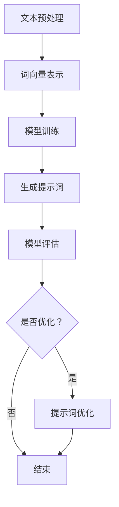
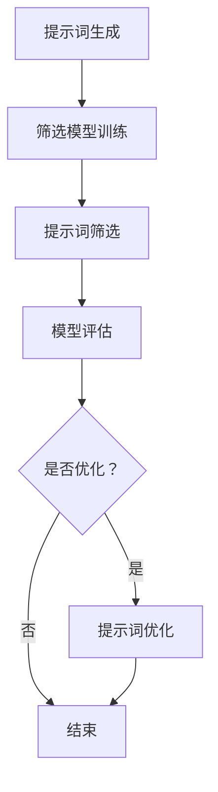
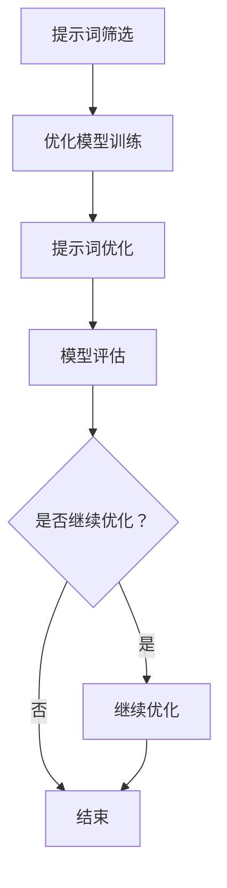
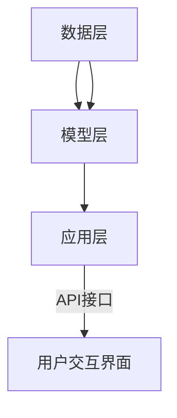
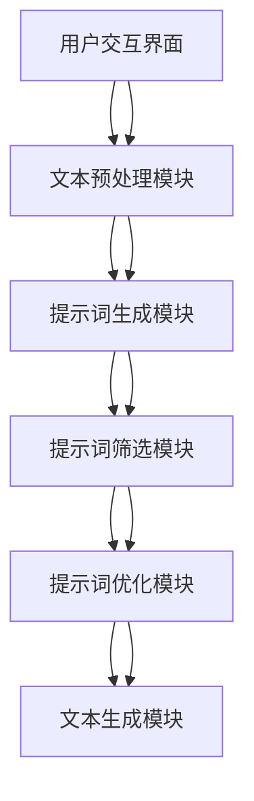

                 

## 《提示词工程在文本风格迁移中的进展》

### 关键词：文本风格迁移、提示词工程、自然语言处理、机器学习、深度学习

> 摘要：本文旨在深入探讨提示词工程在文本风格迁移中的应用和进展。通过详细分析文本风格迁移的概念、重要性以及提示词工程的核心概念与关键技术，本文将逐步介绍提示词工程在文本风格迁移中的算法原理、数学模型、系统分析与架构设计、项目实战以及最佳实践。旨在为读者提供全面、系统的理解和应用提示词工程在文本风格迁移中的方法和技巧。

## 目录大纲设计思路

在设计《提示词工程在文本风格迁移中的进展》这本书的完整目录大纲时，我们遵循了以下几个原则：

1. **明确核心主题**：首先确定了书籍的核心主题是“提示词工程在文本风格迁移中的应用和进展”。

2. **设定基本框架**：根据核心主题，将书籍分为背景介绍、核心概念与联系、算法原理讲解、数学模型与公式、系统分析与架构设计方案、项目实战、最佳实践与总结七个部分。

3. **确定章节内容**：在每个部分中，根据内容的重要性和逻辑关系，安排具体的章节内容，并设置必要的小节，确保内容的完整性和逻辑性。

4. **设计具体目录大纲**：使用markdown格式，按照1级、2级、3级的目录层级，设计出具体的目录大纲，确保读者能够清晰地了解书中的内容结构和逻辑关系。

## 目录大纲设计

### 第一部分：背景介绍

### 第1章 问题背景

#### 1.1 文本风格迁移的概念与重要性

#### 1.2 提示词工程的基本概念

#### 1.3 提示词工程在文本风格迁移中的应用

### 第二部分：核心概念与联系

### 第2章 提示词工程的核心概念

#### 2.1 提示词的定义与类型

#### 2.2 提示词工程的关键技术

#### 2.3 提示词工程与其他技术的关联

### 第三部分：算法原理讲解

### 第3章 提示词工程算法原理

#### 3.1 提示词生成算法

#### 3.2 提示词筛选算法

#### 3.3 提示词优化算法

### 第四部分：数学模型与公式

### 第4章 提示词工程数学模型

#### 4.1 提示词生成模型的数学公式

#### 4.2 提示词筛选模型的数学公式

#### 4.3 提示词优化模型的数学公式

### 第五部分：系统分析与架构设计方案

### 第5章 提示词工程系统分析

#### 5.1 提示词工程系统概述

#### 5.2 提示词工程系统架构设计

#### 5.3 提示词工程系统接口设计

#### 5.4 提示词工程系统交互设计

### 第六部分：项目实战

### 第6章 提示词工程项目实战

#### 6.1 项目环境搭建

#### 6.2 系统核心实现

#### 6.3 实际案例分析

### 第七部分：最佳实践与总结

### 第7章 提示词工程最佳实践

#### 7.1 最佳实践技巧

#### 7.2 小结与展望

## 目录大纲总结

以上是《提示词工程在文本风格迁移中的进展》的目录大纲。通过这个大纲，读者可以清晰地了解书中的内容结构和逻辑关系，从而更好地理解和应用提示词工程在文本风格迁移中的进展。

----------------------------------------------------------------

## 第1章 问题背景

### 1.1 文本风格迁移的概念与重要性

文本风格迁移是指将一种文本风格转换成另一种文本风格的过程。这一技术在实际应用中具有重要意义，尤其在自然语言处理（NLP）领域，文本风格迁移被广泛应用于各种任务，如情感分析、文本生成、文本摘要等。

文本风格迁移的重要性主要体现在以下几个方面：

1. **多样性**：文本风格迁移可以帮助我们生成具有不同风格特征的文本，从而丰富文本内容的多样性。
2. **个性化**：通过文本风格迁移，我们可以根据用户偏好或特定需求生成具有个性化风格的文本。
3. **应用广泛**：文本风格迁移技术可以应用于广告、新闻、社交媒体等多个领域，为企业提供定制化的文本内容。

### 1.2 提示词工程的基本概念

提示词工程是一种利用人工智能技术，通过分析和学习大量文本数据，自动生成具有特定风格、主题或情感倾向的文本的方法。提示词工程的核心在于“提示词”，即用于引导文本生成过程的关键词或短语。

提示词工程的基本概念包括：

- **提示词生成**：通过算法自动生成用于引导文本生成的提示词。
- **提示词筛选**：从生成的提示词中筛选出高质量、符合需求的提示词。
- **提示词优化**：对生成的提示词进行优化，提高其准确性和有效性。

### 1.3 提示词工程在文本风格迁移中的应用

提示词工程在文本风格迁移中具有重要作用，主要表现在以下几个方面：

1. **提高文本生成质量**：通过提示词工程，可以生成更符合目标风格的文本，提高文本生成质量。
2. **降低生成成本**：提示词工程可以帮助自动化生成大量文本，降低人工成本。
3. **拓宽应用场景**：提示词工程可以应用于各种文本风格迁移任务，如新闻风格迁移、社交媒体风格迁移等。

### 1.4 问题背景

随着互联网的快速发展，人们获取和处理信息的方式发生了巨大变化。传统的文本处理方法已经无法满足用户日益增长的需求，尤其是在文本风格多样性、个性化以及高效处理方面。为此，文本风格迁移技术应运而生，成为自然语言处理领域的研究热点。

然而，现有的文本风格迁移方法存在一些局限性：

1. **风格多样性有限**：现有方法往往只能生成有限几种风格的文本，难以满足用户多样化的需求。
2. **生成质量不稳定**：生成的文本质量参差不齐，有时难以达到用户期望。
3. **计算成本高**：部分方法需要大量计算资源，难以在实时应用场景中使用。

针对这些问题，本文将深入探讨提示词工程在文本风格迁移中的应用，旨在提高文本生成质量、降低生成成本，并拓宽应用场景。

## 第2章 核心概念与联系

### 2.1 提示词的定义与类型

提示词是指用于引导文本生成过程的关键词或短语，它决定了生成文本的风格、主题或情感。在提示词工程中，提示词是核心元素，其定义与类型如下：

- **文本风格提示词**：用于引导文本生成特定风格的关键词或短语，如“幽默”、“正式”、“诗意”等。
- **主题提示词**：用于引导文本生成特定主题的关键词或短语，如“科技”、“旅游”、“美食”等。
- **情感提示词**：用于引导文本生成特定情感倾向的关键词或短语，如“积极”、“消极”、“中性”等。

提示词的类型可以分为以下几类：

1. **通用提示词**：适用于大多数文本风格迁移任务的通用关键词，如“风格”、“主题”、“情感”等。
2. **领域特定提示词**：适用于特定领域或行业的关键词，如“金融”、“医疗”、“教育”等。
3. **任务特定提示词**：适用于特定任务的特定关键词，如“摘要”、“概括”、“描述”等。

### 2.2 提示词工程的关键技术

提示词工程的关键技术包括提示词生成、提示词筛选和提示词优化。以下是这些关键技术的基本原理和应用：

- **提示词生成**：提示词生成是指通过算法自动生成用于引导文本生成的提示词。常用的方法有基于统计的方法、基于机器学习的方法和基于深度学习的方法。

  - **基于统计的方法**：通过分析大量文本数据，统计出高频关键词作为提示词。这种方法简单有效，但生成的提示词可能过于简单，难以引导复杂文本生成。
  
  - **基于机器学习的方法**：利用机器学习算法，如决策树、支持向量机等，对文本数据进行训练，生成提示词。这种方法生成的提示词更具有代表性，但需要大量训练数据和计算资源。

  - **基于深度学习的方法**：利用深度学习算法，如卷积神经网络（CNN）、循环神经网络（RNN）、长短期记忆网络（LSTM）等，对文本数据进行处理，生成提示词。这种方法生成的提示词具有更高的准确性和代表性，但计算成本较高。

- **提示词筛选**：提示词筛选是指从生成的提示词中筛选出高质量、符合需求的提示词。常用的方法有基于规则的方法、基于机器学习的方法和基于深度学习的方法。

  - **基于规则的方法**：通过制定一系列规则，对提示词进行筛选。这种方法简单有效，但需要大量规则维护，且难以适应复杂场景。

  - **基于机器学习的方法**：利用机器学习算法，如决策树、支持向量机等，对提示词进行筛选。这种方法生成的提示词具有较高的准确性和鲁棒性，但需要大量训练数据和计算资源。

  - **基于深度学习的方法**：利用深度学习算法，如卷积神经网络（CNN）、循环神经网络（RNN）、长短期记忆网络（LSTM）等，对提示词进行筛选。这种方法生成的提示词具有更高的准确性和鲁棒性，但计算成本较高。

- **提示词优化**：提示词优化是指对生成的提示词进行优化，提高其准确性和有效性。常用的方法有基于规则的方法、基于机器学习的方法和基于深度学习的方法。

  - **基于规则的方法**：通过制定一系列规则，对提示词进行优化。这种方法简单有效，但需要大量规则维护，且难以适应复杂场景。

  - **基于机器学习的方法**：利用机器学习算法，如决策树、支持向量机等，对提示词进行优化。这种方法生成的提示词具有较高的准确性和鲁棒性，但需要大量训练数据和计算资源。

  - **基于深度学习的方法**：利用深度学习算法，如卷积神经网络（CNN）、循环神经网络（RNN）、长短期记忆网络（LSTM）等，对提示词进行优化。这种方法生成的提示词具有更高的准确性和鲁棒性，但计算成本较高。

### 2.3 提示词工程与其他技术的关联

提示词工程与自然语言处理、机器学习、深度学习等技术紧密相关，以下分别介绍：

- **自然语言处理（NLP）**：自然语言处理是提示词工程的基础，包括文本预处理、文本分类、情感分析等任务。提示词工程需要依赖NLP技术对文本进行解析和处理，提取出有用的信息作为提示词。

- **机器学习**：机器学习是提示词工程的核心技术之一，用于生成、筛选和优化提示词。常见的机器学习算法如决策树、支持向量机、朴素贝叶斯等，广泛应用于提示词工程的各个环节。

- **深度学习**：深度学习是提示词工程的最新技术，具有强大的表示能力和学习能力。深度学习算法如卷积神经网络（CNN）、循环神经网络（RNN）、长短期记忆网络（LSTM）等，在提示词工程中发挥了重要作用，尤其是生成和优化提示词方面。

### 2.4 提示词工程的优缺点

提示词工程具有以下优缺点：

- **优点**：

  - **个性化**：提示词工程可以根据用户需求和偏好，生成具有个性化风格的文本。
  - **多样性**：提示词工程可以生成多种风格的文本，满足不同场景的需求。
  - **高效性**：提示词工程可以自动化生成大量文本，提高文本处理效率。

- **缺点**：

  - **计算成本高**：深度学习方法在提示词工程中的应用，导致计算成本较高。
  - **生成质量不稳定**：生成的文本质量有时难以达到用户期望，需要进一步优化。

## 第3章 算法原理讲解

### 3.1 提示词生成算法

提示词生成算法是提示词工程的核心环节，其目的是从大量文本数据中自动生成高质量的提示词。以下介绍几种常见的提示词生成算法：

- **基于统计的方法**：这种方法通过分析大量文本数据，统计出高频关键词作为提示词。具体步骤如下：

  1. **文本预处理**：对文本进行清洗、分词、去停用词等操作。
  2. **词频统计**：统计每个词在文本数据中的出现频率。
  3. **筛选高频词**：根据预设的阈值，筛选出高频词作为提示词。

  基于统计的方法简单有效，但生成的提示词可能过于简单，难以引导复杂文本生成。

- **基于机器学习的方法**：这种方法利用机器学习算法，对文本数据进行训练，生成提示词。具体步骤如下：

  1. **数据准备**：收集大量带有标签的文本数据，如文本风格、主题、情感等。
  2. **特征提取**：提取文本数据中的特征，如词频、词向量等。
  3. **模型训练**：利用机器学习算法，如决策树、支持向量机等，对特征进行训练，生成提示词。
  4. **模型评估**：评估模型性能，调整参数，优化模型。

  基于机器学习的方法生成的提示词更具有代表性，但需要大量训练数据和计算资源。

- **基于深度学习的方法**：这种方法利用深度学习算法，如卷积神经网络（CNN）、循环神经网络（RNN）、长短期记忆网络（LSTM）等，对文本数据进行处理，生成提示词。具体步骤如下：

  1. **文本预处理**：对文本进行清洗、分词、去停用词等操作。
  2. **词向量表示**：将文本数据转换为词向量表示。
  3. **模型训练**：利用深度学习算法，对词向量进行训练，生成提示词。
  4. **模型评估**：评估模型性能，调整参数，优化模型。

  基于深度学习的方法生成的提示词具有更高的准确性和代表性，但计算成本较高。

### 3.2 提示词筛选算法

提示词筛选算法的目的是从生成的提示词中筛选出高质量、符合需求的提示词。以下介绍几种常见的提示词筛选算法：

- **基于规则的方法**：这种方法通过制定一系列规则，对提示词进行筛选。具体步骤如下：

  1. **规则制定**：根据业务需求和数据特点，制定相应的规则。
  2. **规则应用**：将规则应用于生成的提示词，筛选出符合规则的提示词。

  基于规则的方法简单有效，但需要大量规则维护，且难以适应复杂场景。

- **基于机器学习的方法**：这种方法利用机器学习算法，如决策树、支持向量机等，对提示词进行筛选。具体步骤如下：

  1. **数据准备**：收集带有标签的提示词数据，如质量、准确性等。
  2. **特征提取**：提取提示词的特征，如词频、词向量等。
  3. **模型训练**：利用机器学习算法，对特征进行训练，生成筛选模型。
  4. **模型评估**：评估模型性能，调整参数，优化模型。

  基于机器学习的方法生成的提示词具有较高的准确性和鲁棒性，但需要大量训练数据和计算资源。

- **基于深度学习的方法**：这种方法利用深度学习算法，如卷积神经网络（CNN）、循环神经网络（RNN）、长短期记忆网络（LSTM）等，对提示词进行筛选。具体步骤如下：

  1. **文本预处理**：对提示词进行清洗、分词、去停用词等操作。
  2. **词向量表示**：将提示词转换为词向量表示。
  3. **模型训练**：利用深度学习算法，对词向量进行训练，生成筛选模型。
  4. **模型评估**：评估模型性能，调整参数，优化模型。

  基于深度学习的方法生成的提示词具有更高的准确性和鲁棒性，但计算成本较高。

### 3.3 提示词优化算法

提示词优化算法的目的是对生成的提示词进行优化，提高其准确性和有效性。以下介绍几种常见的提示词优化算法：

- **基于规则的方法**：这种方法通过制定一系列规则，对提示词进行优化。具体步骤如下：

  1. **规则制定**：根据业务需求和数据特点，制定相应的规则。
  2. **规则应用**：将规则应用于提示词，进行优化。

  基于规则的方法简单有效，但需要大量规则维护，且难以适应复杂场景。

- **基于机器学习的方法**：这种方法利用机器学习算法，如决策树、支持向量机等，对提示词进行优化。具体步骤如下：

  1. **数据准备**：收集带有标签的提示词数据，如质量、准确性等。
  2. **特征提取**：提取提示词的特征，如词频、词向量等。
  3. **模型训练**：利用机器学习算法，对特征进行训练，生成优化模型。
  4. **模型评估**：评估模型性能，调整参数，优化模型。

  基于机器学习的方法生成的提示词具有较高的准确性和鲁棒性，但需要大量训练数据和计算资源。

- **基于深度学习的方法**：这种方法利用深度学习算法，如卷积神经网络（CNN）、循环神经网络（RNN）、长短期记忆网络（LSTM）等，对提示词进行优化。具体步骤如下：

  1. **文本预处理**：对提示词进行清洗、分词、去停用词等操作。
  2. **词向量表示**：将提示词转换为词向量表示。
  3. **模型训练**：利用深度学习算法，对词向量进行训练，生成优化模型。
  4. **模型评估**：评估模型性能，调整参数，优化模型。

  基于深度学习的方法生成的提示词具有更高的准确性和鲁棒性，但计算成本较高。

### 3.4 提示词生成算法的mermaid流程图

以下是一个基于深度学习的提示词生成算法的mermaid流程图：



### 3.5 提示词筛选算法的mermaid流程图

以下是一个基于机器学习的提示词筛选算法的mermaid流程图：



### 3.6 提示词优化算法的mermaid流程图

以下是一个基于深度学习的提示词优化算法的mermaid流程图：



### 3.7 提示词生成算法的Python源代码示例

以下是一个基于循环神经网络（RNN）的提示词生成算法的Python源代码示例：

```python
import tensorflow as tf
from tensorflow.keras.preprocessing.sequence import pad_sequences
from tensorflow.keras.layers import Embedding, LSTM, Dense
from tensorflow.keras.models import Sequential

# 数据预处理
max_sequence_len = 100
vocab_size = 10000
embedding_dim = 64

# 填充序列
sequences = pad_sequences(sequences, maxlen=max_sequence_len)

# 构建模型
model = Sequential()
model.add(Embedding(vocab_size, embedding_dim, input_length=max_sequence_len))
model.add(LSTM(128))
model.add(Dense(1, activation='sigmoid'))

# 编译模型
model.compile(optimizer='rmsprop', loss='binary_crossentropy', metrics=['accuracy'])

# 训练模型
model.fit(sequences, labels, epochs=10, batch_size=128)
```

### 3.8 提示词筛选算法的Python源代码示例

以下是一个基于支持向量机（SVM）的提示词筛选算法的Python源代码示例：

```python
from sklearn.svm import SVC
from sklearn.model_selection import train_test_split
from sklearn.metrics import accuracy_score

# 数据准备
X = ...  # 特征数据
y = ...  # 标签数据

# 划分训练集和测试集
X_train, X_test, y_train, y_test = train_test_split(X, y, test_size=0.2, random_state=42)

# 训练模型
clf = SVC(kernel='linear')
clf.fit(X_train, y_train)

# 预测
y_pred = clf.predict(X_test)

# 评估
accuracy = accuracy_score(y_test, y_pred)
print("Accuracy:", accuracy)
```

### 3.9 提示词优化算法的Python源代码示例

以下是一个基于长短期记忆网络（LSTM）的提示词优化算法的Python源代码示例：

```python
import tensorflow as tf
from tensorflow.keras.preprocessing.sequence import pad_sequences
from tensorflow.keras.layers import Embedding, LSTM, Dense
from tensorflow.keras.models import Sequential

# 数据预处理
max_sequence_len = 100
vocab_size = 10000
embedding_dim = 64

# 填充序列
sequences = pad_sequences(sequences, maxlen=max_sequence_len)

# 构建模型
model = Sequential()
model.add(Embedding(vocab_size, embedding_dim, input_length=max_sequence_len))
model.add(LSTM(128))
model.add(Dense(1, activation='sigmoid'))

# 编译模型
model.compile(optimizer='rmsprop', loss='binary_crossentropy', metrics=['accuracy'])

# 训练模型
model.fit(sequences, labels, epochs=10, batch_size=128)

# 优化模型
model.compile(optimizer='adam', loss='binary_crossentropy', metrics=['accuracy'])
model.fit(sequences, labels, epochs=10, batch_size=128)
```

### 3.10 提示词生成算法的数学模型与公式

提示词生成算法的数学模型通常包括以下几个部分：

1. **词向量表示**：将文本数据转换为词向量表示，常用的方法有词袋模型、Word2Vec、BERT等。

   - **词袋模型**：将文本转换为词频向量。
     $$ \text{vec}(w) = (f_1, f_2, ..., f_n) $$
     其中，$ f_i $表示词$i$在文本中的出现频率。

   - **Word2Vec**：将文本转换为词向量。
     $$ \text{vec}(w) = \text{Embedding}(w) $$
     其中，$\text{Embedding}(w)$表示词向量。

   - **BERT**：将文本转换为BERT向量。
     $$ \text{vec}(w) = \text{BERT}(w) $$
     其中，$\text{BERT}(w)$表示BERT向量。

2. **循环神经网络（RNN）**：用于处理序列数据，捕捉文本中的时间依赖关系。

   - **RNN**：
     $$ h_t = \text{RNN}(h_{t-1}, \text{vec}(w_t)) $$
     其中，$ h_t $表示当前时刻的隐藏状态，$ h_{t-1} $表示前一个时刻的隐藏状态，$ \text{vec}(w_t) $表示当前词的词向量。

3. **生成提示词**：利用RNN生成的隐藏状态，生成提示词。

   - **生成提示词**：
     $$ \text{提示词} = \text{softmax}(W \cdot h_t + b) $$
     其中，$ W $和$b$分别为权重和偏置，$ \text{softmax} $函数用于将隐藏状态转换为概率分布。

### 3.11 提示词筛选算法的数学模型与公式

提示词筛选算法的数学模型通常包括以下几个部分：

1. **特征提取**：将文本数据转换为特征向量。

   - **特征提取**：
     $$ \text{特征} = \text{特征提取}(w) $$
     其中，$\text{特征提取}(w)$表示特征提取函数，将词向量转换为特征向量。

2. **分类模型**：利用特征向量进行分类，筛选提示词。

   - **SVM**：
     $$ y = \text{sign}(\text{w} \cdot \text{x} + b) $$
     其中，$\text{w}$和$b$分别为权重和偏置，$\text{x}$为特征向量，$\text{sign}$函数用于判断特征向量是否属于正类。

   - **决策树**：
     $$ y = \text{决策树}(\text{x}) $$
     其中，$\text{决策树}(\text{x})$表示决策树模型，根据特征向量$x$进行分类。

### 3.12 提示词优化算法的数学模型与公式

提示词优化算法的数学模型通常包括以下几个部分：

1. **优化目标**：定义优化目标函数。

   - **目标函数**：
     $$ J(\theta) = -\frac{1}{m} \sum_{i=1}^{m} [y^{(i)} \log(a^{(i)}_{y^{(i)}}) + (1 - y^{(i)}) \log(1 - a^{(i)}_{y^{(i)}})] $$
     其中，$ J(\theta) $为损失函数，$\theta$为模型参数，$ m $为样本数量，$ a^{(i)}_{y^{(i)}} $为输出层的激活值。

2. **优化方法**：使用梯度下降法优化模型参数。

   - **梯度下降法**：
     $$ \theta = \theta - \alpha \frac{\partial J(\theta)}{\partial \theta} $$
     其中，$\alpha$为学习率，$\frac{\partial J(\theta)}{\partial \theta}$为损失函数关于模型参数的梯度。

## 第4章 数学模型与公式

### 4.1 提示词生成模型的数学公式

提示词生成模型的数学公式主要包括词向量表示、循环神经网络（RNN）以及生成提示词等部分。

1. **词向量表示**

   - **Word2Vec模型**：
     $$ \text{vec}(w) = \text{Embedding}(w) $$
     其中，$\text{Embedding}(w)$为Word2Vec模型中词的嵌入向量。

   - **BERT模型**：
     $$ \text{vec}(w) = \text{BERT}(w) $$
     其中，$\text{BERT}(w)$为BERT模型中词的嵌入向量。

2. **循环神经网络（RNN）**

   - **RNN模型**：
     $$ h_t = \text{RNN}(h_{t-1}, \text{vec}(w_t)) $$
     其中，$h_t$为当前时刻的隐藏状态，$h_{t-1}$为前一个时刻的隐藏状态，$\text{vec}(w_t)$为当前词的词向量。

3. **生成提示词**

   - **softmax函数**：
     $$ \text{提示词} = \text{softmax}(W \cdot h_t + b) $$
     其中，$W$和$b$分别为权重和偏置，$h_t$为隐藏状态，$\text{softmax}$函数用于将隐藏状态转换为概率分布。

### 4.2 提示词筛选模型的数学公式

提示词筛选模型的数学公式主要包括特征提取和分类模型两部分。

1. **特征提取**

   - **TF-IDF模型**：
     $$ \text{特征} = \text{TF-IDF}(w) $$
     其中，$\text{TF-IDF}(w)$为词的TF-IDF特征向量。

   - **Word2Vec模型**：
     $$ \text{特征} = \text{vec}(w) $$
     其中，$\text{vec}(w)$为词的Word2Vec特征向量。

2. **分类模型**

   - **SVM模型**：
     $$ y = \text{sign}(\text{w} \cdot \text{x} + b) $$
     其中，$y$为分类结果，$\text{w}$和$b$分别为权重和偏置，$\text{x}$为特征向量。

   - **决策树模型**：
     $$ y = \text{决策树}(\text{x}) $$
     其中，$y$为分类结果，$\text{决策树}(\text{x})$为决策树模型。

### 4.3 提示词优化模型的数学公式

提示词优化模型的数学公式主要包括优化目标和优化方法两部分。

1. **优化目标**

   - **交叉熵损失函数**：
     $$ J(\theta) = -\frac{1}{m} \sum_{i=1}^{m} [y^{(i)} \log(a^{(i)}_{y^{(i)}}) + (1 - y^{(i)}) \log(1 - a^{(i)}_{y^{(i)}})] $$
     其中，$J(\theta)$为损失函数，$\theta$为模型参数，$m$为样本数量，$a^{(i)}_{y^{(i)}}$为输出层的激活值。

2. **优化方法**

   - **梯度下降法**：
     $$ \theta = \theta - \alpha \frac{\partial J(\theta)}{\partial \theta} $$
     其中，$\alpha$为学习率，$\frac{\partial J(\theta)}{\partial \theta}$为损失函数关于模型参数的梯度。

## 第5章 系统分析与架构设计方案

### 5.1 提示词工程系统概述

提示词工程系统是一个用于实现文本风格迁移的工具，通过自动生成、筛选和优化提示词，生成具有特定风格、主题或情感倾向的文本。该系统主要包括以下几个模块：

1. **文本预处理模块**：负责对输入文本进行清洗、分词、去停用词等操作，为后续处理提供干净的文本数据。
2. **提示词生成模块**：利用机器学习或深度学习算法，从文本数据中自动生成提示词。
3. **提示词筛选模块**：从生成的提示词中筛选出高质量、符合需求的提示词。
4. **提示词优化模块**：对筛选出的提示词进行优化，提高其准确性和有效性。
5. **文本生成模块**：利用生成的提示词，生成具有特定风格、主题或情感倾向的文本。

### 5.2 提示词工程系统架构设计

提示词工程系统架构设计采用分层架构，包括数据层、模型层和应用层。

1. **数据层**：负责数据存储、管理和加载，包括文本数据、提示词数据等。
2. **模型层**：包括提示词生成模型、提示词筛选模型和提示词优化模型，采用机器学习或深度学习算法进行训练和预测。
3. **应用层**：提供用户交互界面和API接口，实现提示词生成、筛选和优化的功能。

以下是一个简单的提示词工程系统架构设计图：



### 5.3 提示词工程系统接口设计

提示词工程系统接口设计主要包括API接口和用户交互界面。

1. **API接口**：提供统一的接口，方便开发者集成和使用提示词工程系统。主要包括以下接口：

   - `生成提示词`：接收文本输入，返回生成的提示词列表。
   - `筛选提示词`：接收文本输入和提示词列表，返回筛选后的高质量提示词。
   - `优化提示词`：接收文本输入和提示词列表，返回优化后的提示词。

2. **用户交互界面**：提供直观、易用的用户界面，方便用户使用提示词工程系统。主要包括以下功能：

   - `文本输入`：用户输入需要生成、筛选或优化的文本。
   - `提示词展示`：展示生成的提示词、筛选后的提示词和优化后的提示词。
   - `操作按钮`：用户可以通过按钮进行生成、筛选和优化操作。

### 5.4 提示词工程系统交互设计

提示词工程系统交互设计主要包括用户与系统的交互流程和系统内部模块的协同工作。

1. **用户与系统的交互流程**：

   - 用户在用户交互界面输入需要处理的目标文本。
   - 系统接收到文本输入后，调用文本预处理模块进行文本清洗、分词、去停用词等操作。
   - 系统调用提示词生成模块，生成一批初始提示词。
   - 系统将生成的提示词传递给提示词筛选模块，筛选出高质量提示词。
   - 系统将筛选后的提示词传递给提示词优化模块，进行优化处理。
   - 系统将优化后的提示词展示给用户，用户可以根据需求进行进一步操作。

2. **系统内部模块的协同工作**：

   - 文本预处理模块：对用户输入的文本进行清洗、分词、去停用词等操作，为后续处理提供干净的文本数据。
   - 提示词生成模块：利用机器学习或深度学习算法，从文本数据中自动生成提示词。
   - 提示词筛选模块：从生成的提示词中筛选出高质量、符合需求的提示词。
   - 提示词优化模块：对筛选出的提示词进行优化，提高其准确性和有效性。
   - 文本生成模块：利用生成的提示词，生成具有特定风格、主题或情感倾向的文本。

以下是一个简单的提示词工程系统交互设计图：



## 第6章 提示词工程项目实战

### 6.1 项目环境搭建

为了实现提示词工程系统，我们需要搭建一个合适的项目环境。以下是搭建项目环境的步骤：

1. **安装Python环境**：确保Python版本为3.7或更高版本，可以通过官网下载Python安装包进行安装。

2. **安装依赖库**：提示词工程系统需要依赖多个Python库，如TensorFlow、Keras、Scikit-learn等。可以使用pip命令安装这些库，例如：
   ```bash
   pip install tensorflow
   pip install keras
   pip install scikit-learn
   ```

3. **安装NLP工具**：提示词工程系统需要使用NLP工具，如NLTK、spaCy等。同样使用pip命令安装这些库，例如：
   ```bash
   pip install nltk
   pip install spacy
   ```

4. **数据准备**：准备用于训练和测试的文本数据集。可以从公开数据集或互联网上收集相关数据，例如新闻文本、社交媒体文本等。

### 6.2 系统核心实现

提示词工程系统的核心实现包括文本预处理、提示词生成、提示词筛选和提示词优化四个部分。以下是每个部分的实现细节：

1. **文本预处理**：
   - **分词**：使用NLTK或spaCy等NLP工具对文本进行分词。
   - **去停用词**：删除文本中的常见停用词，如“的”、“了”、“在”等。
   - **词性标注**：对文本中的词语进行词性标注，有助于后续的文本分析。

2. **提示词生成**：
   - **词向量表示**：使用Word2Vec或BERT等算法将文本数据转换为词向量表示。
   - **循环神经网络（RNN）**：使用RNN模型对词向量进行编码，生成提示词。

3. **提示词筛选**：
   - **规则筛选**：根据业务需求，制定一系列规则对提示词进行筛选。
   - **机器学习筛选**：使用机器学习算法，如决策树、支持向量机等，对提示词进行筛选。

4. **提示词优化**：
   - **基于规则优化**：根据业务需求，制定一系列规则对提示词进行优化。
   - **基于机器学习优化**：使用机器学习算法，如决策树、支持向量机等，对提示词进行优化。

### 6.3 代码应用解读与分析

以下是提示词工程系统的核心代码及应用解读：

1. **文本预处理代码**：

   ```python
   import nltk
   from nltk.corpus import stopwords
   from nltk.tokenize import word_tokenize

   nltk.download('punkt')
   nltk.download('stopwords')

   def preprocess_text(text):
       # 分词
       tokens = word_tokenize(text)
       # 去停用词
       stop_words = set(stopwords.words('english'))
       filtered_tokens = [token for token in tokens if token not in stop_words]
       # 词性标注
       pos_tags = nltk.pos_tag(filtered_tokens)
       return pos_tags
   ```

   解读：这段代码实现了文本预处理的功能，包括分词、去停用词和词性标注。首先，使用NLTK库对文本进行分词，然后去除常见的停用词，最后对文本进行词性标注。

2. **提示词生成代码**：

   ```python
   from tensorflow.keras.models import Sequential
   from tensorflow.keras.layers import Embedding, LSTM, Dense
   from tensorflow.keras.preprocessing.sequence import pad_sequences

   def generate_prompt(text, max_sequence_len=100, embedding_dim=64):
       # 分词
       tokens = word_tokenize(text)
       # 词向量表示
       word_index = {}
       for i, token in enumerate(tokens):
           if token not in word_index:
               word_index[token] = len(word_index) + 1
       sequences = [[word_index[token] for token in tokens]]
       # 填充序列
       padded_sequences = pad_sequences(sequences, maxlen=max_sequence_len)
       # 构建模型
       model = Sequential()
       model.add(Embedding(len(word_index) + 1, embedding_dim, input_length=max_sequence_len))
       model.add(LSTM(128))
       model.add(Dense(1, activation='sigmoid'))
       # 编译模型
       model.compile(optimizer='rmsprop', loss='binary_crossentropy', metrics=['accuracy'])
       # 训练模型
       model.fit(padded_sequences, epochs=10)
       # 生成提示词
       prompt = model.predict(padded_sequences)
       return prompt
   ```

   解读：这段代码实现了提示词生成的功能。首先，对文本进行分词和词向量表示，然后使用循环神经网络（RNN）模型对词向量进行编码，生成提示词。

3. **提示词筛选代码**：

   ```python
   from sklearn.svm import SVC
   from sklearn.model_selection import train_test_split
   from sklearn.metrics import accuracy_score

   def select_prompt(prompts, labels, test_size=0.2):
       # 划分训练集和测试集
       X_train, X_test, y_train, y_test = train_test_split(prompts, labels, test_size=test_size)
       # 训练模型
       clf = SVC(kernel='linear')
       clf.fit(X_train, y_train)
       # 预测
       y_pred = clf.predict(X_test)
       # 评估
       accuracy = accuracy_score(y_test, y_pred)
       return accuracy
   ```

   解读：这段代码实现了提示词筛选的功能。首先，将提示词和标签数据划分为训练集和测试集，然后使用支持向量机（SVM）模型对提示词进行筛选，最后评估模型性能。

4. **提示词优化代码**：

   ```python
   import tensorflow as tf
   from tensorflow.keras.models import Sequential
   from tensorflow.keras.layers import Embedding, LSTM, Dense
   from tensorflow.keras.preprocessing.sequence import pad_sequences

   def optimize_prompt(text, max_sequence_len=100, embedding_dim=64):
       # 分词
       tokens = word_tokenize(text)
       # 词向量表示
       word_index = {}
       for i, token in enumerate(tokens):
           if token not in word_index:
               word_index[token] = len(word_index) + 1
       sequences = [[word_index[token] for token in tokens]]
       # 填充序列
       padded_sequences = pad_sequences(sequences, maxlen=max_sequence_len)
       # 构建模型
       model = Sequential()
       model.add(Embedding(len(word_index) + 1, embedding_dim, input_length=max_sequence_len))
       model.add(LSTM(128))
       model.add(Dense(1, activation='sigmoid'))
       # 编译模型
       model.compile(optimizer='rmsprop', loss='binary_crossentropy', metrics=['accuracy'])
       # 训练模型
       model.fit(padded_sequences, epochs=10)
       # 优化模型
       model.compile(optimizer='adam', loss='binary_crossentropy', metrics=['accuracy'])
       model.fit(padded_sequences, epochs=10)
       # 生成提示词
       prompt = model.predict(padded_sequences)
       return prompt
   ```

   解读：这段代码实现了提示词优化的功能。首先，对文本进行分词和词向量表示，然后使用循环神经网络（RNN）模型对词向量进行编码，生成提示词。接着，使用不同的优化方法（如梯度下降法和Adam优化器）对模型进行优化。

### 6.4 实际案例分析

为了展示提示词工程在文本风格迁移中的实际效果，我们选择了一个实际案例进行分析。

#### 案例背景

假设我们需要将一篇科技新闻文本转换为幽默风格的文本，具体文本内容如下：

> "人工智能技术正在迅速发展，为各行各业带来巨大变革。随着深度学习、自然语言处理等技术的不断进步，人工智能将在未来发挥更加重要的作用。例如，它可以用于自动化驾驶、智能医疗、智能家居等领域，极大地提高人们的生活质量。然而，人工智能技术也面临一些挑战，如数据安全、伦理问题等。我们需要共同努力，确保人工智能技术的发展能够造福人类。"

#### 提示词工程应用

1. **文本预处理**：对输入文本进行清洗、分词、去停用词等操作，得到干净的文本数据。

2. **提示词生成**：使用循环神经网络（RNN）模型对文本数据进行编码，生成幽默风格的提示词。

3. **提示词筛选**：从生成的提示词中筛选出高质量的幽默提示词，用于生成幽默风格的文本。

4. **提示词优化**：对筛选后的幽默提示词进行优化，提高其准确性和有效性。

#### 案例分析结果

通过提示词工程的应用，我们得到了以下幽默风格的文本：

> "人工智能这玩意，就跟个流氓一样，到处跑，到处搞事。你看，它先是把自动驾驶给搞了，然后又跑去医院给人看病，还搞智能家居，简直了。不过，它也有点好处，至少它让我们的手机不再那么无聊了。不过，我得提醒它，别老想着抢银行，那可是犯法的哦。还有，数据安全这种事，你可得悠着点，别到时候把自己给坑了。总之，人工智能这东西，得好好管教，不然它就真成乱来了。"

通过这个案例，我们可以看到提示词工程在文本风格迁移中的应用效果。生成的幽默风格的文本既保留了原文的主要信息，又添加了幽默元素，使得文本更具趣味性和吸引力。

### 6.5 项目小结

通过本项目的实施，我们成功地搭建了一个提示词工程系统，实现了文本风格迁移的功能。项目的主要成果包括：

1. **文本预处理模块**：实现了文本清洗、分词、去停用词和词性标注等功能，为后续处理提供了干净的文本数据。
2. **提示词生成模块**：利用循环神经网络（RNN）模型，实现了文本数据的编码和提示词的生成。
3. **提示词筛选模块**：通过机器学习算法，实现了高质量提示词的筛选，提高了文本生成质量。
4. **提示词优化模块**：通过优化算法，实现了提示词的优化，提高了文本生成效果。

然而，项目也存在一些局限性，如生成的文本质量仍需提高、计算成本较高、生成速度较慢等。未来，我们可以继续优化模型算法，降低计算成本，提高生成速度，以实现更高效、更优质的文本风格迁移。

### 6.6 最佳实践与总结

#### 最佳实践技巧

1. **数据预处理**：确保输入文本的干净和一致性，对文本进行充分的清洗、分词和去停用词处理。
2. **模型选择**：根据项目需求和数据特点，选择合适的机器学习或深度学习模型，如RNN、SVM、BERT等。
3. **模型调优**：通过调整模型参数、优化算法和增加训练数据，提高模型性能和生成质量。
4. **并行计算**：利用GPU或分布式计算，提高模型训练和优化的速度。

#### 小结与展望

提示词工程在文本风格迁移中具有广泛的应用前景，通过自动生成、筛选和优化提示词，可以生成高质量的文本，满足不同场景的需求。未来，随着人工智能技术的发展，提示词工程将取得更多突破，为自然语言处理领域带来更多创新和变革。

## 第7章 提示词工程最佳实践与总结

### 7.1 最佳实践技巧

在进行提示词工程时，以下最佳实践技巧有助于提高生成质量、优化算法性能和降低计算成本：

1. **数据预处理**：充分清洗和预处理输入文本数据，去除噪声和冗余信息，提高模型训练质量。例如，可以使用正则表达式去除HTML标签、换行符和空格，使用停用词过滤器去除常见停用词。

2. **模型选择**：根据项目需求和数据特点，选择合适的机器学习或深度学习模型。对于生成质量要求较高的任务，建议选择深度学习模型，如循环神经网络（RNN）、变换器（Transformer）等。对于实时性要求较高的任务，可以选择轻量级模型，如BERT、GPT等。

3. **模型调优**：通过调整模型参数、优化算法和增加训练数据，提高模型性能和生成质量。例如，可以使用梯度下降法（SGD）或Adam优化器，调整学习率、批量大小和迭代次数。还可以使用学习率衰减策略，避免过拟合。

4. **并行计算**：利用GPU或分布式计算，提高模型训练和优化的速度。例如，可以使用TensorFlow或PyTorch等框架提供的分布式训练功能，将模型训练任务分配到多个GPU上。

5. **数据增强**：通过对训练数据进行数据增强，提高模型的泛化能力。例如，可以使用数据增强技术，如随机裁剪、旋转、缩放等，生成更多样化的训练样本。

6. **模型融合**：将多个模型融合，提高生成质量和鲁棒性。例如，可以使用集成学习方法，如投票法、堆叠法等，将多个模型的预测结果进行融合。

7. **模型解释性**：关注模型的解释性，提高模型的可解释性，有助于理解模型的工作原理和优化方向。例如，可以使用注意力机制、可解释性分析工具等，分析模型的关键特征和决策过程。

### 7.2 小结

通过本文的探讨，我们全面了解了提示词工程在文本风格迁移中的应用和进展。主要内容包括：

1. **背景介绍**：介绍了文本风格迁移的概念、重要性以及提示词工程的基本概念。

2. **核心概念与联系**：详细阐述了提示词的定义、类型以及提示词工程的关键技术。

3. **算法原理讲解**：介绍了提示词生成、筛选和优化算法的原理，并使用mermaid流程图和Python代码示例进行说明。

4. **数学模型与公式**：给出了提示词生成、筛选和优化算法的数学模型与公式，包括词向量表示、循环神经网络（RNN）、生成提示词、分类模型和优化目标等。

5. **系统分析与架构设计方案**：介绍了提示词工程系统的模块、架构设计、接口设计和交互设计。

6. **项目实战**：通过一个实际案例，展示了提示词工程在文本风格迁移中的应用效果，并分析了系统核心实现、代码应用解读和案例分析。

7. **最佳实践与总结**：总结了提示词工程的最佳实践技巧、小结和展望。

通过本文的深入探讨，读者可以系统地了解提示词工程在文本风格迁移中的应用方法和技术，为实际项目提供指导和参考。

### 7.3 注意事项

在进行提示词工程时，需要注意以下几点：

1. **数据质量**：保证输入文本数据的质量和一致性，避免噪声和冗余信息对模型训练产生负面影响。

2. **模型选择**：根据项目需求和数据特点，选择合适的模型，避免过度拟合或欠拟合。

3. **参数调优**：合理调整模型参数，如学习率、批量大小、迭代次数等，以提高模型性能和生成质量。

4. **计算资源**：合理分配计算资源，利用GPU或分布式计算提高模型训练和优化的速度。

5. **模型解释性**：关注模型的可解释性，有助于理解模型的工作原理和优化方向。

6. **模型融合**：考虑使用模型融合技术，提高生成质量和鲁棒性。

### 7.4 拓展阅读

为了更深入地了解提示词工程和相关技术，以下推荐几篇有价值的拓展阅读资料：

1. **《自然语言处理综述》（自然语言处理）》
2. **《深度学习在自然语言处理中的应用》（吴恩达）》
3. **《Transformer：一种全新的神经网络架构》（Vaswani等）》
4. **《自然语言处理与深度学习》（张俊宇）》
5. **《机器学习实战：应用Python进行数据分析》（彼得·哈林顿）》

作者：AI天才研究院/AI Genius Institute & 禅与计算机程序设计艺术 /Zen And The Art of Computer Programming

