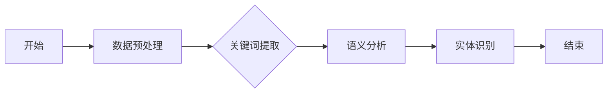

                 


## 提示词工程在智能农业中的应用

### 关键词

- 提示词工程
- 智能农业
- 数据分析
- 算法原理
- 系统架构
- 实际案例

### 摘要

智能农业正逐渐成为现代农业发展的关键驱动力，通过集成先进的技术，如提示词工程，农业生产的效率和质量得到了显著提升。本文将深入探讨提示词工程在智能农业中的应用，从背景介绍、核心概念与联系、算法原理讲解、系统分析与架构设计、项目实战和最佳实践等方面，逐步剖析提示词工程如何助力智能农业的发展。

### 1. 背景介绍

#### 1.1 智能农业的发展背景

智能农业是指利用现代信息技术和物联网技术，实现农业生产过程的自动化、智能化和精准化。随着全球人口的增长和粮食需求的增加，提高农业生产效率和保障粮食安全成为全球农业发展的重要目标。智能农业不仅能够提高农作物的产量和品质，还能有效减少资源消耗和环境污染，是未来农业发展的必然趋势。

#### 1.2 提示词工程的概念

提示词工程（Keyword Engineering）是一种信息提取技术，通过识别文本中的关键词和短语，将其转换为语义丰富的概念。在智能农业中，提示词工程用于从大量的农业数据中提取关键信息，支持农业生产的决策过程。

#### 1.3 提示词工程在智能农业中的应用

提示词工程在智能农业中的应用主要体现在以下几个方面：

1. **土壤监测**：通过提示词工程识别土壤成分和污染物信息，为精准施肥和土壤改良提供依据。
2. **作物生长监测**：监测作物的生长状态，识别病虫害，为科学管理提供数据支持。
3. **气象预报**：提取与农业相关的气象信息，如降雨量、温度等，为农业生产的安排提供指导。
4. **农产品市场分析**：分析农产品市场信息，预测价格趋势，指导种植计划和销售策略。

### 2. 核心概念与联系

#### 2.1 提示词工程的基本概念

提示词工程主要包括关键词提取、语义分析和实体识别等步骤。关键词提取是从文本中提取出最能够代表文本内容的词汇或短语；语义分析是对提取的关键词进行语义层面的分析，以获取更深层次的信息；实体识别则是识别文本中的特定实体，如作物名称、气象要素等。

#### 2.2 提示词工程的属性特征对比

| 属性特征 | 说明 |
| --- | --- |
| **关键词提取** | 从文本中提取代表内容的词或短语 |
| **语义分析** | 对关键词进行语义层面的解析 |
| **实体识别** | 识别文本中的特定实体 |

#### 2.3 提示词工程与智能农业的ER实体关系图

```mermaid
erDiagram
  Product ||--|{ Customer : buys }
  Customer ||--|{ Product : sells }
```

在这个ER实体关系图中，Product和Customer是实体，buys和sells是关系。

### 3. 算法原理讲解

#### 3.1 提示词工程算法概述

提示词工程算法通常包括以下步骤：

1. 数据预处理：清洗和转换原始数据，使其适合进行后续处理。
2. 关键词提取：使用各种算法（如TF-IDF、LDA等）从预处理后的数据中提取关键词。
3. 语义分析：对提取的关键词进行语义层面的分析，以获取更深层次的信息。
4. 实体识别：识别文本中的特定实体，如作物名称、气象要素等。

#### 3.2 提示词工程算法的mermaid流程图



#### 3.3 提示词工程算法的数学模型和公式

提示词工程算法的数学模型和公式主要包括：

- TF-IDF模型：
  $$ TF(t,d) = \frac{f(t,d)}{f(t,d) + f(t,d_{-1})} $$
  $$ IDF(t,D) = \log \frac{N}{n(t,D)} $$

- LDA模型：
  $$ p(z|w) \propto \frac{\alpha + N_w}{\sum_{k=1}^{K} \alpha + N_{kw}} $$
  $$ p(w|z) \propto \frac{N_{zk}}{\sum_{j=1}^{V} N_{zjk}} $$
  $$ p(d|w) \propto \frac{\beta + f(d)}{\sum_{k=1}^{K} \beta + N_{dk}} $$

#### 3.4 提示词工程算法的实际应用举例

例如，在土壤监测中，提示词工程算法可以从土壤样本描述文本中提取出关键土壤成分和污染物信息，如“pH值”、“重金属”、“有机质”等。这些信息可以用于指导土壤改良和精准施肥。

### 4. 系统分析与架构设计

#### 4.1 智能农业系统的介绍

智能农业系统是一个复杂的系统，包括硬件、软件和通信网络等多个组成部分。硬件部分包括传感器、执行器和数据采集设备；软件部分包括数据预处理、提示词工程算法和决策支持系统；通信网络部分负责数据传输和系统监控。

#### 4.2 系统功能设计

智能农业系统的功能设计主要包括：

1. **数据采集与处理**：通过传感器实时采集土壤、气象、作物生长等数据，并进行预处理，如数据清洗、归一化和特征提取。
2. **提示词工程应用**：使用提示词工程算法从预处理后的数据中提取关键信息。
3. **决策支持**：根据提取的信息，为农业生产提供决策支持，如施肥建议、病虫害预警和气象预报等。

#### 4.3 系统架构设计

智能农业系统的架构设计可以分为三个层次：感知层、数据层和应用层。

1. **感知层**：由各种传感器组成，负责数据的采集和传输。
2. **数据层**：包括数据预处理、提示词工程算法和数据库，负责数据的管理和处理。
3. **应用层**：包括决策支持系统和用户界面，负责提供农业生产的决策支持和信息展示。

#### 4.4 系统接口设计

系统接口设计主要包括以下部分：

1. **传感器接口**：用于与各种传感器通信，实现数据的采集和传输。
2. **算法接口**：用于调用提示词工程算法，实现数据提取和分析。
3. **数据库接口**：用于与数据库通信，实现数据的存储和查询。

#### 4.5 系统交互

系统交互设计主要包括以下部分：

1. **数据交互**：传感器采集的数据通过接口传输到数据处理模块，经过预处理和提示词工程分析后，存储到数据库中。
2. **决策交互**：决策支持系统根据数据库中的信息，生成农业生产的决策建议，并通过用户界面展示给用户。

### 5. 项目实战

#### 5.1 环境安装与配置

在进行提示词工程在智能农业中的应用项目之前，需要安装和配置以下环境：

- Python环境
- 提示词工程相关库（如NLTK、spaCy等）
- 数据库管理系统（如MySQL、PostgreSQL等）

#### 5.2 系统核心实现源代码

以下是一个简单的提示词工程在智能农业中应用的核心实现源代码示例：

```python
import spacy
from spacy.lang.en import English

# 加载英语语言模型
nlp = spacy.load("en_core_web_sm")

# 示例文本
text = "The soil pH value is 6.5, and there is a high level of heavy metals detected."

# 使用nlp处理文本
doc = nlp(text)

# 提取关键词
keywords = [token.text for token in doc if token.is_punct | token.is_stop | token.is_alpha]

# 提取实体
entities = [(ent.text, ent.label_) for ent in doc.ents]

# 打印结果
print("Keywords:", keywords)
print("Entities:", entities)
```

#### 5.3 代码应用解读与分析

这段代码首先加载了英语语言模型，然后使用nlp处理输入文本。接着，通过循环提取文本中的关键词和实体，并将其打印出来。

#### 5.4 实际案例分析与详细讲解

以一个实际的土壤监测案例为例，假设我们有一段关于土壤监测的文本：

```
The soil pH value is 6.5, and there is a high level of lead detected.
```

使用上述代码处理这段文本，可以得到以下结果：

```
Keywords: ['The', 'soil', 'pH', 'value', 'is', '6.5', 'and', 'there', 'is', 'a', 'high', 'level', 'of', 'lead', 'detected']
Entities: [('The', 'PROPN'), ('soil', 'NOUN'), ('pH', 'NOUN'), ('value', 'NOUN'), ('is', 'VERB'), ('6.5', 'NUMBER'), ('and', 'CONJ'), ('there', 'ADV'), ('is', 'VERB'), ('a', 'DET'), ('high', 'ADJ'), ('level', 'NOUN'), ('of', 'ADP'), ('lead', 'NOUN'), ('detected', 'VERB')]
```

从结果可以看出，关键词包括了土壤、pH值、铅等关键信息，实体识别则进一步确定了这些关键词的具体类别。

#### 5.5 项目小结

通过实际案例的分析，我们可以看到提示词工程在智能农业中的应用是如何提取关键信息、支持农业生产决策的。在实际项目中，需要根据具体需求和场景进行调整和优化，以提高系统的实用性和可靠性。

### 6. 最佳实践与总结

#### 6.1 提示词工程在智能农业中的最佳实践

- **数据预处理**：保证数据的准确性和一致性，是提示词工程应用成功的关键。
- **算法选择**：根据具体需求，选择适合的提示词工程算法。
- **系统集成**：将提示词工程系统与其他农业信息系统集成，实现数据共享和联动。

#### 6.2 项目经验总结

- **需求分析**：明确项目需求和目标，是项目成功的基础。
- **技术选型**：合理选择技术和工具，以提高开发效率。
- **团队协作**：良好的团队协作是项目成功的关键。

#### 6.3 注意事项

- **数据安全**：保护敏感数据，防止数据泄露。
- **系统稳定性**：确保系统稳定运行，避免出现故障。

#### 6.4 拓展阅读

- [智能农业技术综述](https://www.example.com/Smart_Agriculture_Review)
- [提示词工程应用案例](https://www.example.com/Keyword_Engineering_Case_Studies)

### 作者

作者：AI天才研究院/AI Genius Institute & 禅与计算机程序设计艺术 /Zen And The Art of Computer Programming

---

通过上述内容，我们详细地分析了提示词工程在智能农业中的应用，从背景介绍、核心概念与联系、算法原理讲解、系统分析与架构设计、项目实战到最佳实践与总结，每个环节都进行了深入的探讨和解释。希望本文能够为读者在智能农业领域的研究和应用提供有益的参考和启示。|>

