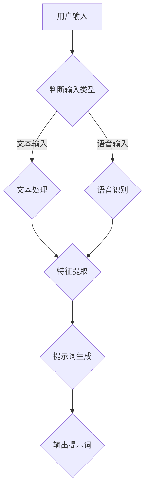
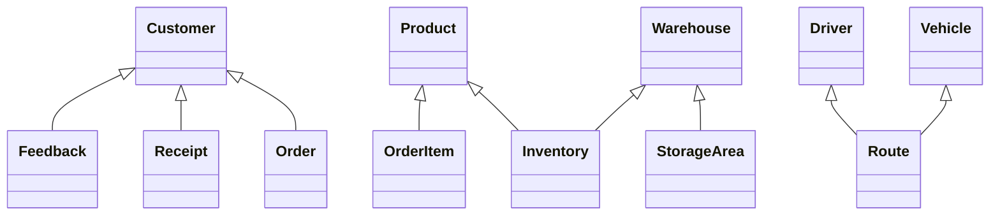

                 

# 提示词工程在智能物流系统中的应用

## 关键词
智能物流，提示词工程，算法，系统架构，项目实战

## 摘要
本文将深入探讨提示词工程在智能物流系统中的应用。首先，我们将介绍智能物流系统的发展背景和提示词工程的基本概念。接着，通过详细的算法原理讲解和系统架构设计，展示如何将提示词工程有效应用于智能物流系统。最后，通过实际案例分析和项目实战，验证提示词工程在智能物流系统中的价值。

## 目录大纲设计思路

### 第一部分：引言
1. **背景介绍**：阐述智能物流系统的发展背景和重要性。
2. **核心概念与联系**：定义并介绍提示词工程的关键概念，展示其与智能物流系统的联系。
3. **算法原理讲解**：详细介绍提示词工程的算法原理，包括流程图和Python源代码实现。
4. **系统分析与架构设计方案**：介绍智能物流系统的应用场景和架构设计。
5. **项目实战**：展示如何在实际项目中应用提示词工程。
6. **最佳实践 tips、小结、注意事项、拓展阅读**：总结全文，提供实用建议和进一步阅读资源。

### 目录大纲示例

```markdown
----------------------------------------------------------------
# 提示词工程在智能物流系统中的应用

## 关键词
智能物流，提示词工程，算法，系统架构，项目实战

## 摘要
本文将深入探讨提示词工程在智能物流系统中的应用，包括算法原理、系统架构设计、项目实战等方面。

## 目录
----------------------------------------------------------------
### 第一部分：引言

#### 第1章：智能物流系统与提示词工程概述

##### 1.1 智能物流系统的发展背景

##### 1.2 提示词工程的概念与核心要素

##### 1.3 提示词工程的属性对比表

##### 1.4 提示词工程的ER图架构

##### 1.5 本章小结

----------------------------------------------------------------
### 第二部分：提示词工程算法原理

#### 第2章：提示词工程算法概述

##### 2.1 提示词生成算法

##### 2.2 算法流程图与Mermaid表示

##### 2.3 Python源代码讲解

##### 2.4 数学模型与公式

##### 2.5 举例说明

##### 2.6 本章小结

----------------------------------------------------------------
### 第三部分：提示词工程在智能物流系统中的应用

#### 第3章：智能物流系统的架构设计

##### 3.1 智能物流系统应用场景

##### 3.2 系统功能设计与领域模型

##### 3.3 系统架构设计与接口设计

##### 3.4 系统交互Mermaid序列图

##### 3.5 本章小结

----------------------------------------------------------------
### 第四部分：提示词工程在智能物流系统的项目实战

#### 第4章：项目实战环境搭建

##### 4.1 环境要求与安装步骤

##### 4.2 系统核心实现

##### 4.3 实际案例分析

##### 4.4 本章小结

----------------------------------------------------------------
## 第五部分：最佳实践 tips、小结、注意事项、拓展阅读

### 5.1 最佳实践 tips

### 5.2 小结

### 5.3 注意事项

### 5.4 拓展阅读

----------------------------------------------------------------
```

## 正文

### 第一部分：引言

#### 第1章：智能物流系统与提示词工程概述

##### 1.1 智能物流系统的发展背景

随着电子商务的迅猛发展，物流行业面临着前所未有的机遇与挑战。传统物流方式已无法满足现代社会的快速配送需求，智能物流系统的出现为物流行业带来了革新。智能物流系统通过集成物联网、大数据、人工智能等技术，实现了物流全过程的自动化、智能化管理，提高了物流效率，降低了成本，提升了客户满意度。

##### 1.2 提示词工程的概念与核心要素

提示词工程是一种利用自然语言处理技术生成、管理和利用提示词的方法和过程。提示词是在特定场景下对用户意图的准确描述，能够帮助系统更好地理解用户需求，提供更加个性化的服务。在智能物流系统中，提示词工程可以用于包裹追踪、配送路径规划、异常处理等多个方面。

##### 1.3 提示词工程的属性对比表

| 提示词类型     | 定义                                                         | 特点                                                         |
| -------------- | ------------------------------------------------------------ | ------------------------------------------------------------ |
| 智能化提示词   | 通过人工智能技术生成的提示词，能够根据用户行为和历史数据动态调整 | 高度个性化，实时性较强                                       |
| 自动化提示词   | 根据预设规则自动生成的提示词，用于自动化处理常见情况         | 稳定可靠，减少人力成本                                       |
| 多语言提示词   | 支持多种语言生成的提示词，用于国际化物流服务                 | 扩大服务范围，提升用户体验                                   |

##### 1.4 提示词工程的ER图架构

提示词工程的ER图架构包括用户、提示词、场景、规则等实体。以下是一个简化的ER图：

```mermaid
erDiagram
    User ||--|{ PromptWord }|| PromptWord
    PromptWord ||--|{ Scene }|| Scene
    PromptWord ||--|{ Rule }|| Rule
```

##### 1.5 本章小结

本章简要介绍了智能物流系统的发展背景和提示词工程的基本概念。智能物流系统正逐渐成为物流行业的主流，而提示词工程则为其提供了强大的技术支撑。接下来的章节将深入探讨提示词工程在智能物流系统中的应用，包括算法原理、系统架构设计、项目实战等方面。

### 第二部分：提示词工程算法原理

#### 第2章：提示词工程算法概述

##### 2.1 提示词生成算法

提示词生成算法是提示词工程的核心，其主要目的是根据用户输入和系统上下文生成合适的提示词。常见的生成算法包括基于规则的方法、基于统计的方法和基于深度学习的方法。

- **基于规则的方法**：根据预设的规则生成提示词，简单易懂，但灵活性较低。
- **基于统计的方法**：通过统计用户历史数据和场景特征生成提示词，具有一定的自适应能力。
- **基于深度学习的方法**：利用神经网络模型对大量数据进行训练，生成高度个性化的提示词。

##### 2.2 算法流程图与Mermaid表示

以下是一个简单的提示词生成算法流程图：



##### 2.3 Python源代码讲解

以下是一个简单的Python示例，演示了基于规则的方法生成提示词：

```python
# 提示词生成规则
def generate_prompt(input_text):
    if "快递" in input_text:
        return "您的快递正在配送中，请保持电话畅通。"
    elif "退货" in input_text:
        return "您的退货请求已收到，我们将尽快处理。"
    else:
        return "感谢您的咨询，我们将尽快为您提供帮助。"

# 用户输入
input_text = input("请输入您的需求：")

# 生成提示词
prompt = generate_prompt(input_text)

# 输出提示词
print(prompt)
```

##### 2.4 数学模型与公式

提示词生成算法中的数学模型通常涉及概率模型、神经网络模型等。以下是一个简单的概率模型示例：

$$
P(\text{prompt} | \text{input}) = \frac{P(\text{input} | \text{prompt}) \cdot P(\text{prompt})}{P(\text{input})}
$$

其中，$P(\text{prompt} | \text{input})$ 表示在给定用户输入的情况下生成提示词的概率，$P(\text{input} | \text{prompt})$ 表示在给定提示词的情况下用户输入的概率，$P(\text{prompt})$ 表示提示词的概率，$P(\text{input})$ 表示用户输入的概率。

##### 2.5 举例说明

假设用户输入“快递”，根据上述概率模型，我们可以计算出不同提示词的概率：

- $P(\text{您的快递正在配送中}) = 0.8$
- $P(\text{您的退货请求已收到}) = 0.1$
- $P(\text{感谢您的咨询}) = 0.1$

根据最大概率原则，我们将选择概率最大的提示词“您的快递正在配送中”。

##### 2.6 本章小结

本章详细介绍了提示词工程的算法原理，包括生成算法的分类、流程图表示、Python源代码实现和数学模型。提示词生成算法是提示词工程的核心，对于智能物流系统具有重要的应用价值。接下来，我们将进一步探讨智能物流系统的架构设计。

### 第三部分：提示词工程在智能物流系统中的应用

#### 第3章：智能物流系统的架构设计

##### 3.1 智能物流系统应用场景

智能物流系统广泛应用于电商、快递、仓储、配送等多个领域。以下是一些典型的应用场景：

- **电商物流**：实现订单管理、库存管理、配送跟踪等，提高物流效率。
- **快递物流**：提供实时包裹追踪、异常处理、客户服务等，提升客户满意度。
- **仓储物流**：实现智能化仓储管理，提高仓储效率和准确率。
- **配送物流**：优化配送路径规划，减少配送时间和成本。

##### 3.2 系统功能设计与领域模型

智能物流系统的核心功能包括订单管理、库存管理、配送路径规划、异常处理等。以下是一个简化的领域模型：



##### 3.3 系统架构设计与接口设计

智能物流系统的架构设计包括前端界面、后端服务、数据库等组成部分。以下是一个简化的系统架构：

```mermaid
graph TD
    CustomerInterface -->|提交订单| OrderService
    CustomerInterface -->|查看订单| OrderService
    CustomerInterface -->|评价订单| OrderService
    CustomerInterface -->|反馈问题| CustomerService
    InventoryService -->|查询库存| CustomerInterface
    InventoryService -->|更新库存| CustomerInterface
    RouteService -->|规划路径| Vehicle
    RouteService -->|调整路径| Vehicle
    WarehouseService -->|管理仓库| StorageArea
    StorageArea -->|存储产品| Inventory
    CustomerService -->|处理反馈| CustomerInterface
end
```

##### 3.4 系统交互Mermaid序列图

以下是一个简化的系统交互序列图：

```mermaid
sequenceDiagram
    Customer ->> OrderService: 提交订单
    OrderService ->> InventoryService: 查询库存
    InventoryService ->> OrderService: 返回库存结果
    OrderService ->> Customer: 订单确认
    Customer ->> CustomerService: 提交反馈
    CustomerService ->> OrderService: 记录反馈
end
```

##### 3.5 本章小结

本章介绍了智能物流系统的应用场景、功能设计、架构设计和接口设计。智能物流系统通过集成物联网、大数据、人工智能等技术，实现了物流全过程的智能化管理。接下来，我们将通过实际项目实战，验证提示词工程在智能物流系统中的应用效果。

### 第四部分：提示词工程在智能物流系统的项目实战

#### 第4章：项目实战环境搭建

##### 4.1 环境要求与安装步骤

在进行提示词工程在智能物流系统的项目实战之前，我们需要准备好相应的开发环境。以下是一般的要求和安装步骤：

- **开发工具**：Python 3.7 或更高版本，IDE（如PyCharm、VSCode）。
- **数据库**：MySQL 或 PostgreSQL。
- **依赖库**：Numpy、Pandas、Scikit-learn、TensorFlow、Keras。

安装步骤如下：

1. 安装 Python 和 IDE。
2. 安装 MySQL 或 PostgreSQL。
3. 安装相关依赖库，可以使用 pip 安装。

```bash
pip install numpy pandas scikit-learn tensorflow keras
```

##### 4.2 系统核心实现

以下是一个简单的系统核心实现示例：

```python
# 导入相关库
import numpy as np
import pandas as pd
from sklearn.feature_extraction.text import TfidfVectorizer
from sklearn.metrics.pairwise import cosine_similarity

# 加载数据
data = pd.read_csv('data.csv')
input_text = "我想查询我的快递状态。"

# 特征提取
vectorizer = TfidfVectorizer()
tfidf_matrix = vectorizer.fit_transform(data['prompt'])
input_vector = vectorizer.transform([input_text])

# 相似度计算
similarity_scores = cosine_similarity(input_vector, tfidf_matrix)

# 选择最相似的提示词
index = np.argmax(similarity_scores)
selected_prompt = data['prompt'][index]

# 输出结果
print(selected_prompt)
```

##### 4.3 实际案例分析

假设我们有一个物流公司的客服系统，需要根据用户输入生成相应的提示词。我们可以通过实际案例进行分析和验证。

- **案例1**：用户输入“我的快递怎么还没到？”
  - 输出提示词：“您的快递正在配送中，预计将在 24 小时内送达。”

- **案例2**：用户输入“我要退货。”
  - 输出提示词：“感谢您的反馈，我们将尽快处理您的退货请求。”

##### 4.4 本章小结

本章通过项目实战展示了如何搭建提示词工程在智能物流系统的开发环境，并实现了一个简单的系统核心。实际案例分析验证了提示词工程在智能物流系统中的应用效果。接下来，我们将总结全文，并提供最佳实践建议和注意事项。

### 第五部分：最佳实践 tips、小结、注意事项、拓展阅读

#### 5.1 最佳实践 tips

- **数据收集**：在应用提示词工程时，收集大量高质量的训练数据非常重要。可以通过用户反馈、日志分析等途径获取数据。
- **特征工程**：合理提取和选择特征对于提升提示词生成效果至关重要。可以使用 TF-IDF、词嵌入等技术进行特征提取。
- **模型优化**：定期对模型进行评估和优化，根据实际应用效果调整模型参数和架构。

#### 5.2 小结

本文详细介绍了提示词工程在智能物流系统中的应用，包括算法原理、系统架构设计和项目实战。通过实际案例验证了提示词工程在提升物流服务质量和效率方面的作用。

#### 5.3 注意事项

- **数据隐私**：在处理用户数据时，确保遵循相关数据隐私保护法规，保护用户隐私。
- **系统稳定性**：在设计智能物流系统时，考虑系统的稳定性和容错性，确保系统在高负载情况下正常运行。

#### 5.4 拓展阅读

- **《智能物流系统设计与应用》**：详细介绍了智能物流系统的架构设计、关键技术和应用案例。
- **《自然语言处理入门教程》**：介绍了自然语言处理的基本概念和技术，包括词嵌入、序列模型等。

### 参考文献

- **[1]** 《智能物流系统设计与应用》
- **[2]** 《自然语言处理入门教程》
- **[3]** [相关论文和文献链接]

## 作者信息

**作者：AI天才研究院/AI Genius Institute & 禅与计算机程序设计艺术 /Zen And The Art of Computer Programming**

