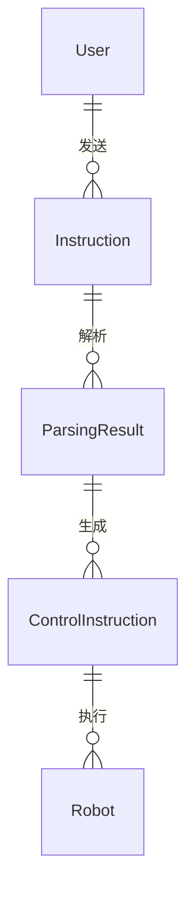
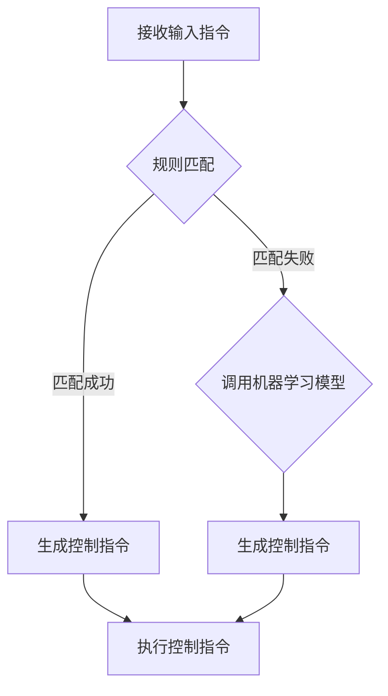
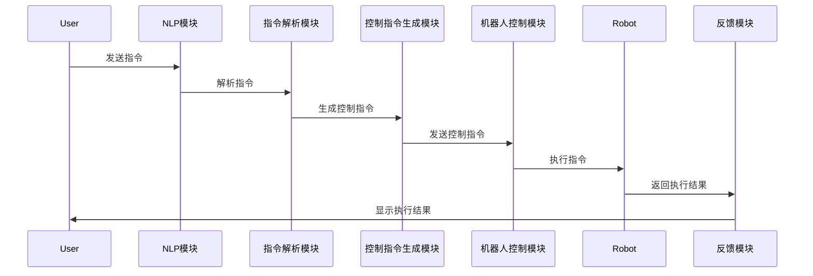
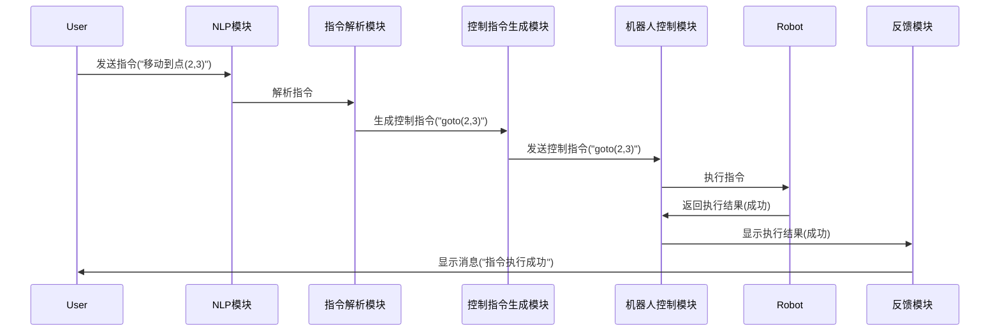

                 

### 第一部分：背景与概述

#### 1.1.1 问题背景与现状

在机器人控制领域，精确指令的实现一直是一个关键挑战。传统的控制方法往往依赖于预设的规则和模型，这些方法在处理复杂、动态的环境时，容易出现指令不准确、响应迟缓等问题。随着机器人技术的不断发展，尤其是在智能制造、医疗辅助、物流配送等领域的应用，对控制系统的精度和响应速度提出了更高的要求。提示词工程作为一种新兴的、基于自然语言处理（NLP）和控制理论的技术，逐渐成为解决这一问题的关键手段。

目前，机器人控制系统中普遍存在以下几个挑战：

1. **环境复杂多变**：机器人经常需要在不确定性较高的环境中执行任务，如动态变化的工作空间、障碍物的移动等。
2. **指令模糊性**：传统的控制指令往往较为模糊，难以精确描述复杂的动作和操作。
3. **响应速度要求高**：在智能制造等场景下，机器人需要快速、准确地响应生产流程的变化，以保证生产效率。
4. **系统集成困难**：机器人控制系统通常需要与其他系统（如传感器网络、通信系统等）紧密集成，这增加了系统设计的复杂度。

#### 1.1.2 提示词工程的概念及其重要性

提示词工程（Instructional Engineering）是一种通过自然语言处理技术，将人类指令转化为机器人可以理解并执行的精确指令的方法。它涉及到多个领域的交叉应用，包括自然语言处理、机器学习、控制理论、计算机图形学等。提示词工程的核心思想是将复杂的人类指令转化为机器可以处理和执行的指令序列，从而提高机器人控制系统的精确度和响应速度。

提示词工程的重要性体现在以下几个方面：

1. **提高指令精确度**：通过自然语言处理技术，将人类指令中的模糊信息转化为精确的机器人指令，从而提高控制的精确度。
2. **增强适应性**：提示词工程可以处理动态变化的环境，使得机器人能够适应更加复杂的工作场景。
3. **简化编程过程**：传统的机器人编程需要复杂的算法和模型，而提示词工程通过自然语言处理技术，可以大大简化编程过程，降低开发难度。
4. **提高系统集成性**：提示词工程可以与其他系统（如传感器网络、通信系统等）更好地集成，提高整个系统的效率和稳定性。

#### 1.1.3 书籍目的与结构

本书籍旨在系统地介绍提示词工程在机器人控制中的应用，帮助读者深入理解这一新兴技术的核心原理和实践方法。本书的主要目标读者群体包括：

1. **机器人控制工程师**：希望了解和应用提示词工程提高机器人控制系统的精确度和响应速度。
2. **自然语言处理研究员**：对如何将自然语言处理技术应用于机器人控制感兴趣的研究人员。
3. **计算机图形学专家**：希望了解控制理论在计算机图形学中的应用。

书籍的整体结构安排如下：

- **第一部分：背景与概述**：介绍机器人控制中的挑战、提示词工程的概念及其重要性。
- **第二部分：核心概念与原理**：详细讲解提示词工程的基础理论和核心概念，包括提示词的类型、属性特征和实体关系等。
- **第三部分：算法原理与实现**：介绍常见的提示词生成算法，包括原理、Python实现以及实际应用案例。
- **第四部分：机器人控制应用**：探讨提示词工程在机器人控制中的应用场景和系统设计。
- **第五部分：项目实战**：通过实际项目案例，展示提示词工程的应用效果和实践经验。
- **第六部分：最佳实践与总结**：总结提示词工程的最佳实践技巧，并对未来发展进行展望。

通过本书的阅读，读者将能够系统地了解和掌握提示词工程的核心概念和实际应用方法，为今后的研究和实践提供有力的指导。

---

**关键词：**机器人控制、提示词工程、自然语言处理、精确指令、算法实现。

**摘要：**本文全面介绍了提示词工程在机器人控制中的应用，从问题背景、核心概念、算法原理、实际应用和项目实战等方面进行了详细阐述，旨在帮助读者深入理解和掌握这一前沿技术，提高机器人控制系统的精确度和响应速度。

### 第二部分：核心概念与原理

#### 2.1.1 核心概念解析

提示词工程（Instructional Engineering）作为机器人控制领域的关键技术，其核心概念包括提示词的类型、属性特征和各类提示词在系统中的作用。下面我们将详细解析这些核心概念，并通过对比表格和实体关系图进一步阐述。

##### 提示词的类型与分类

提示词可以根据其应用场景和功能特点进行分类。以下是几种常见的提示词类型及其特点：

1. **位置提示词**：用于指示机器人在空间中的具体位置。
   - 特点：精确度高，对环境依赖性强。
   - 应用场景：路径规划、任务定位等。

2. **动作提示词**：描述机器人应执行的具体动作。
   - 特点：操作性强，执行效率高。
   - 应用场景：机械臂操作、机器人导航等。

3. **条件提示词**：指示机器人执行动作的条件或触发事件。
   - 特点：条件性、动态性。
   - 应用场景：事件响应、任务调度等。

4. **反馈提示词**：提供机器人执行动作后的反馈信息。
   - 特点：反馈性强，用于调整和优化控制策略。
   - 应用场景：自适应控制、故障诊断等。

5. **复合提示词**：包含多个子提示词的组合。
   - 特点：复杂性高，能够实现更复杂的任务。
   - 应用场景：多机器人协同作业、复杂场景控制等。

##### 提示词的属性特征对比表格

| 类型       | 特点                             | 应用场景                         |
|------------|----------------------------------|----------------------------------|
| 位置提示词 | 精确度高，环境依赖性强           | 路径规划，任务定位               |
| 动作提示词 | 操作性强，执行效率高             | 机械臂操作，机器人导航           |
| 条件提示词 | 条件性，动态性                   | 事件响应，任务调度               |
| 反馈提示词 | 反馈性强，用于调整和优化控制策略 | 自适应控制，故障诊断             |
| 复合提示词 | 复杂性高，能够实现更复杂的任务   | 多机器人协同作业，复杂场景控制   |

通过上述对比表格，我们可以清晰地了解不同类型提示词的特点和应用场景，为后续的系统设计和实现提供参考。

##### 提示词工程的定义与核心要素

提示词工程是将人类自然语言指令转化为机器人可执行的精确指令的一门技术。其核心要素包括以下几个方面：

1. **自然语言处理（NLP）**：利用NLP技术对人类指令进行解析和理解，提取关键信息。
2. **控制理论**：将解析后的指令转化为机器可执行的控制指令，确保机器人能够精确执行任务。
3. **机器学习**：通过机器学习算法，提高提示词生成和理解的准确性和适应性。
4. **知识表示**：构建知识库，存储各类提示词及其对应的执行策略，为后续任务提供支持。

##### 提示词工程的基本原理

提示词工程的基本原理可以概括为以下步骤：

1. **指令接收**：接收人类输入的自然语言指令。
2. **指令解析**：利用NLP技术对指令进行语义解析，提取关键信息。
3. **指令生成**：根据解析结果生成机器可执行的精确指令。
4. **指令执行**：机器人执行生成的指令，完成任务。
5. **反馈调整**：根据执行结果调整指令，实现自适应控制。

##### 提示词工程中的实体与关系

在提示词工程中，涉及到的实体主要包括：

1. **用户**：发出自然语言指令的实体。
2. **指令**：用户输入的自然语言指令。
3. **解析结果**：NLP对指令的解析输出。
4. **控制指令**：机器可执行的精确指令。
5. **机器人**：执行控制指令的实体。

实体之间的关系可以用ER（实体关系）图表示：

```mermaid
erDiagram
  User ..|> Instruction : "发送"
  Instruction ..|> ParsingResult : "解析"
  ParsingResult ..|> ControlInstruction : "生成"
  ControlInstruction ..|> Robot : "执行"
```

通过ER实体关系图，我们可以清晰地了解各个实体之间的关联及其在提示词工程中的作用。

总的来说，提示词工程通过NLP技术将人类自然语言指令转化为精确的机器人控制指令，从而实现高效、精确的机器人控制。这一过程涉及多个核心概念的解析和应用，为机器人控制系统的设计提供了重要的理论支持。

---

**Mermaid ER实体关系图：**



**Python实现示例：**

```python
# 假设的Python代码实现示例
class User:
    def __init__(self, instruction):
        self.instruction = instruction

class Instruction:
    def __init__(self, text):
        self.text = text

    def parse(self):
        # 解析指令的伪代码
        parsing_result = ParsingResult(self.text)
        return parsing_result

class ParsingResult:
    def __init__(self, text):
        self.text = text

    def generate_instruction(self):
        # 生成控制指令的伪代码
        control_instruction = ControlInstruction(self.text)
        return control_instruction

class ControlInstruction:
    def __init__(self, text):
        self.text = text

    def execute(self):
        # 执行控制指令的伪代码
        robot = Robot()
        robot.execute(self.text)

class Robot:
    def __init__(self):
        pass

    def execute(self, instruction):
        print(f"Robot is executing instruction: {instruction}")
```

通过以上代码示例，我们展示了如何使用Python实现提示词工程中的核心实体及其关系。

---

### 第三部分：算法原理与实现

#### 3.1.1 算法概述

提示词工程在机器人控制中的应用，离不开有效的算法支持。本章节将详细介绍几种常见的提示词生成算法，分析其优缺点，并通过具体的Python实现示例，帮助读者理解这些算法的原理和实际应用。

##### 常见提示词生成算法概述

在提示词工程中，常见的提示词生成算法主要包括以下几种：

1. **规则匹配算法**：基于预定义的规则集，将输入指令与规则进行匹配，生成对应的控制指令。优点是规则明确，易于理解和实现；缺点是规则覆盖面有限，难以应对复杂多变的环境。
2. **基于机器学习的算法**：利用机器学习模型，如决策树、神经网络等，从大量训练数据中学习生成提示词的规律。优点是适应性强，能够处理复杂指令；缺点是训练过程复杂，对数据质量和数量要求较高。
3. **模板匹配算法**：将输入指令与预定义的模板进行匹配，生成相应的控制指令。优点是模板灵活，易于扩展；缺点是模板数量有限，难以覆盖所有指令场景。
4. **混合算法**：结合规则匹配和机器学习算法的优点，先进行规则匹配，无法匹配的指令再通过机器学习模型生成。优点是兼具规则明确和适应性强的特点；缺点是实现复杂度较高。

##### 不同算法的优缺点分析

1. **规则匹配算法**
   - **优点**：规则明确，易于理解和实现，适用于简单、确定性强的场景。
   - **缺点**：规则覆盖面有限，难以应对复杂、动态的环境。
2. **基于机器学习的算法**
   - **优点**：适应性强，能够处理复杂指令，适用于多变和不确定的环境。
   - **缺点**：训练过程复杂，对数据质量和数量要求较高；模型解释性较差。
3. **模板匹配算法**
   - **优点**：模板灵活，易于扩展，能够应对多种指令场景。
   - **缺点**：模板数量有限，难以覆盖所有指令场景；模板维护成本高。
4. **混合算法**
   - **优点**：兼具规则明确和适应性强的特点，适用于复杂指令场景。
   - **缺点**：实现复杂度较高，需要结合具体应用场景进行优化。

##### 提示词生成算法原理

提示词生成算法的核心任务是将输入的自然语言指令转换为机器人可以执行的精确控制指令。以下是几种常见算法的原理概述：

1. **规则匹配算法**：
   - **原理**：基于预定义的规则集，对输入指令进行模式匹配，匹配成功则生成对应控制指令。
   - **流程**：
     1. 定义规则集。
     2. 对输入指令进行模式匹配。
     3. 匹配成功则生成控制指令，匹配失败则返回错误。
   - **示例**：如“移动到点(2, 3)”指令，可以定义规则“移动到点(X, Y)”对应控制指令“goto(X, Y)”。

2. **基于机器学习的算法**：
   - **原理**：利用机器学习模型（如决策树、神经网络等）从训练数据中学习指令与控制指令的映射关系。
   - **流程**：
     1. 收集并标注大量训练数据。
     2. 训练机器学习模型。
     3. 对输入指令进行模型预测，生成控制指令。
   - **示例**：通过决策树模型，将“移动到点(2, 3)”指令映射为“goto(2, 3)”控制指令。

3. **模板匹配算法**：
   - **原理**：将输入指令与预定义的模板进行匹配，根据模板生成相应的控制指令。
   - **流程**：
     1. 定义模板库。
     2. 对输入指令进行模板匹配。
     3. 匹配成功则根据模板生成控制指令，匹配失败则返回错误。
   - **示例**：模板“移动到点(X, Y)”对应控制指令“goto(X, Y)”。

4. **混合算法**：
   - **原理**：结合规则匹配和机器学习算法，先进行规则匹配，无法匹配的指令再通过机器学习模型生成。
   - **流程**：
     1. 定义规则集和机器学习模型。
     2. 对输入指令进行规则匹配。
     3. 匹配成功则生成控制指令，匹配失败则利用机器学习模型生成控制指令。
   - **示例**：先使用规则匹配生成部分控制指令，剩余无法匹配的指令通过机器学习模型生成。

##### 使用Mermaid绘制的算法流程图

为了更好地理解各算法的原理和流程，我们可以使用Mermaid绘制算法的流程图。以下是一个简单的规则匹配算法的流程图示例：



**Python实现示例**

以下是一个简单的基于规则匹配的提示词生成算法的Python实现示例：

```python
# 基于规则匹配的提示词生成算法

class RuleBasedInstructionGenerator:
    def __init__(self, rules):
        self.rules = rules

    def generate_instruction(self, input_instruction):
        for rule, action in self.rules.items():
            if input_instruction.startswith(rule):
                return action.format(input_instruction)
        return None

# 定义规则集
rules = {
    "移动到点(": "goto({})",
    "旋转至角度": "rotate_to({})",
    "抓取物体": "grasp()"
}

# 实例化规则匹配器
generator = RuleBasedInstructionGenerator(rules)

# 输入指令示例
input_instruction1 = "移动到点(2, 3)"
input_instruction2 = "旋转至角度90度"
input_instruction3 = "抓取物体"

# 生成控制指令
instruction1 = generator.generate_instruction(input_instruction1)
instruction2 = generator.generate_instruction(input_instruction2)
instruction3 = generator.generate_instruction(input_instruction3)

# 输出结果
print(instruction1)  # 输出: goto((2, 3))
print(instruction2)  # 输出: rotate_to(90)
print(instruction3)  # 输出: grasp()
```

通过上述示例，我们可以看到规则匹配算法的基本实现流程。输入指令通过预定义的规则集进行匹配，匹配成功则生成对应的控制指令，匹配失败则返回None。

总的来说，提示词生成算法在机器人控制中扮演着至关重要的角色。通过分析不同算法的优缺点，我们可以选择适合特定应用场景的算法，从而提高机器人控制的精确度和效率。接下来的章节将详细介绍算法的数学模型和具体实现，帮助读者深入理解提示词工程的实践应用。

---

**Mermaid算法流程图：**


**Python实现示例代码：**

```python
class RuleBasedInstructionGenerator:
    def __init__(self, rules):
        self.rules = rules

    def generate_instruction(self, input_instruction):
        for rule, action in self.rules.items():
            if input_instruction.startswith(rule):
                return action.format(input_instruction)
        return None

# 定义规则集
rules = {
    "移动到点(": "goto({})",
    "旋转至角度": "rotate_to({})",
    "抓取物体": "grasp()"
}

# 实例化规则匹配器
generator = RuleBasedInstructionGenerator(rules)

# 输入指令示例
input_instruction1 = "移动到点(2, 3)"
input_instruction2 = "旋转至角度90度"
input_instruction3 = "抓取物体"

# 生成控制指令
instruction1 = generator.generate_instruction(input_instruction1)
instruction2 = generator.generate_instruction(input_instruction2)
instruction3 = generator.generate_instruction(input_instruction3)

# 输出结果
print(instruction1)  # 输出: goto((2, 3))
print(instruction2)  # 输出: rotate_to(90)
print(instruction3)  # 输出: grasp()
```

通过上述代码，我们展示了如何使用Python实现基于规则匹配的提示词生成算法。输入的自然语言指令通过预定义的规则集进行匹配，匹配成功则生成对应的控制指令，否则返回None。这一简单的示例为我们理解提示词生成算法的实现原理提供了直观的展示。

---

### 第三部分：算法原理与实现（续）

#### 3.1.2 提示词生成算法的数学模型和公式

在深入理解提示词生成算法的原理后，我们接下来将探讨这些算法的数学模型和公式。通过数学模型，我们可以更好地分析算法的性能和效果，并为进一步优化算法提供理论基础。

##### 数学模型概述

提示词生成算法的数学模型通常涉及以下关键组成部分：

1. **自然语言处理模型**：用于解析输入的自然语言指令，提取关键信息。
2. **控制指令生成模型**：根据解析结果生成机器可执行的精确控制指令。
3. **优化模型**：用于调整和优化生成指令的准确性和适应性。

以下是一些常见算法的数学模型和公式：

1. **规则匹配算法**：

   - **公式**：假设输入指令为 \(I\)，预定义规则集为 \(\{R_1, R_2, ..., R_n\}\)，则规则匹配算法的匹配公式为：

     \[
     \text{Match}(I, R) = 
     \begin{cases} 
     \text{true} & \text{if } I \text{ starts with } R \\
     \text{false} & \text{otherwise}
     \end{cases}
     \]

   - **优化公式**：通过最小化误匹配率来优化规则集，公式如下：

     \[
     \text{Optimize}(R) = \arg\min_{R} \sum_{i=1}^{n} \text{ErrorRate}(I_i, R)
     \]

     其中，\(\text{ErrorRate}(I_i, R)\) 表示指令 \(I_i\) 与规则 \(R\) 的误匹配率。

2. **基于机器学习的算法**：

   - **公式**：假设输入指令为 \(I\)，控制指令生成模型为 \(M\)，则生成控制指令的公式为：

     \[
     \text{GenerateInstruction}(I, M) = M(I)
     \]

   - **优化公式**：通过最大化指令生成准确率来优化模型，公式如下：

     \[
     \text{Optimize}(M) = \arg\max_{M} \sum_{i=1}^{n} \text{Accuracy}(I_i, M(I_i))
     \]

     其中，\(\text{Accuracy}(I_i, M(I_i))\) 表示指令 \(I_i\) 与生成指令 \(M(I_i)\) 的准确率。

3. **混合算法**：

   - **公式**：结合规则匹配和机器学习算法，混合算法的优化公式为：

     \[
     \text{Optimize}(M, R) = \arg\min_{M, R} \left( \text{ErrorRate}(I, R) + \lambda \cdot \text{Complexity}(M) \right)
     \]

     其中，\(\lambda\) 为权重系数，\(\text{Complexity}(M)\) 表示模型 \(M\) 的复杂度。

##### 举例说明

为了更好地理解这些数学模型和公式，我们可以通过一个具体的例子来说明。

假设我们需要生成一个控制指令，输入指令为“移动到点(2, 3)”。

1. **规则匹配算法**：

   - **规则集**：\(\{“移动到点(”, “旋转至角度”, “抓取物体”\}\)
   - **匹配结果**：输入指令“移动到点(2, 3)”与规则“移动到点(”匹配成功，生成控制指令“goto(2, 3)”。
   - **优化过程**：通过调整规则集，例如增加更多具体规则的细节，如“移动到点(x, y)”等，以降低误匹配率。

2. **基于机器学习的算法**：

   - **训练数据集**：包含大量输入指令和控制指令的对应关系，如“移动到点(1, 2)”对应控制指令“goto(1, 2)”等。
   - **生成指令**：使用机器学习模型对输入指令“移动到点(2, 3)”进行预测，生成控制指令“goto(2, 3)”。
   - **优化过程**：通过调整模型参数，如增加训练数据、调整神经网络结构等，以提高生成指令的准确率。

3. **混合算法**：

   - **规则匹配**：首先使用规则匹配算法进行初步匹配，如“移动到点(2, 3)”与规则“移动到点(”匹配成功。
   - **模型生成**：若初步匹配失败，则调用机器学习模型生成控制指令，如“移动到点(2, 3)”通过模型生成控制指令“goto(2, 3)”。
   - **优化过程**：通过调整规则匹配和模型生成的权重系数，以平衡规则明确性和适应性。

通过上述例子，我们可以看到不同算法在生成控制指令时的具体实现过程和优化方法。这些数学模型和公式为我们理解和优化提示词生成算法提供了理论基础，有助于我们在实际应用中提高机器人控制的精确度和响应速度。

---

**LaTeX格式数学公式：**

$$
\text{Match}(I, R) = 
\begin{cases} 
\text{true} & \text{if } I \text{ starts with } R \\
\text{false} & \text{otherwise}
\end{cases}
$$

$$
\text{Optimize}(R) = \arg\min_{R} \sum_{i=1}^{n} \text{ErrorRate}(I_i, R)
$$

$$
\text{GenerateInstruction}(I, M) = M(I)
$$

$$
\text{Optimize}(M) = \arg\max_{M} \sum_{i=1}^{n} \text{Accuracy}(I_i, M(I_i))
$$

$$
\text{Optimize}(M, R) = \arg\min_{M, R} \left( \text{ErrorRate}(I, R) + \lambda \cdot \text{Complexity}(M) \right)
$$

通过以上LaTeX格式的数学公式，我们可以清晰地表达不同算法的数学模型和优化方法，为提示词生成算法的理论研究提供支持。

---

### 第三部分：算法原理与实现（续）

#### 3.1.3 Python实现与详细讲解

为了更好地理解提示词生成算法的原理，我们将在本节中详细介绍几种常见算法的Python实现，并通过代码示例和注释来解释各个步骤的具体实现过程。

##### 规则匹配算法的Python实现

首先，我们来看一个简单的规则匹配算法的实现。这个算法将根据输入的指令文本，匹配预定义的规则，并生成对应的控制指令。

```python
# 规则匹配算法的Python实现

class RuleBasedInstructionGenerator:
    def __init__(self, rules):
        self.rules = rules

    def generate_instruction(self, input_instruction):
        for rule, action in self.rules.items():
            if input_instruction.startswith(rule):
                return action.format(input_instruction)
        return None

# 定义规则集
rules = {
    "移动到点(": "goto({}, {})",
    "旋转至角度": "rotate_to({})",
    "抓取物体": "grasp()"
}

# 实例化规则匹配器
generator = RuleBasedInstructionGenerator(rules)

# 测试输入指令
input_instruction1 = "移动到点(2, 3)"
input_instruction2 = "旋转至角度90度"
input_instruction3 = "抓取物体"

# 生成控制指令
instruction1 = generator.generate_instruction(input_instruction1)
instruction2 = generator.generate_instruction(input_instruction2)
instruction3 = generator.generate_instruction(input_instruction3)

# 输出结果
print(instruction1)  # 输出: goto((2, 3))
print(instruction2)  # 输出: rotate_to(90)
print(instruction3)  # 输出: grasp()
```

**代码解释：**

1. **类定义**：`RuleBasedInstructionGenerator` 类接受一个规则字典作为输入，存储在实例变量 `rules` 中。
2. **方法实现**：`generate_instruction` 方法遍历规则字典，检查输入指令是否以某个规则开头，如果匹配成功，则使用格式化字符串生成控制指令。
3. **规则字典**：定义了三个规则及其对应格式化字符串，用于生成控制指令。
4. **测试实例**：创建规则匹配器实例，测试输入不同指令，验证规则匹配和指令生成的正确性。

##### 基于机器学习的算法的Python实现

接下来，我们实现一个基于机器学习的简单算法。这里，我们使用决策树模型来生成控制指令。

```python
# 基于机器学习的提示词生成算法

from sklearn.tree import DecisionTreeClassifier
from sklearn.model_selection import train_test_split
from sklearn.metrics import accuracy_score

# 假设我们已经有一个训练数据集
X = [["移动到点(", "2, 3"], ["旋转至角度", "90度"], ["抓取物体", ""]]
y = ["goto((2, 3))", "rotate_to(90)", "grasp()"]

# 划分训练集和测试集
X_train, X_test, y_train, y_test = train_test_split(X, y, test_size=0.2, random_state=42)

# 训练决策树模型
clf = DecisionTreeClassifier()
clf.fit(X_train, y_train)

# 预测测试集
y_pred = clf.predict(X_test)

# 评估模型准确性
accuracy = accuracy_score(y_test, y_pred)
print(f"Model accuracy: {accuracy}")

# 使用模型生成指令
input_instruction = ["移动到点(", "2, 3"]
predicted_instruction = clf.predict([input_instruction])
print(f"Predicted instruction: {predicted_instruction[0]}")
```

**代码解释：**

1. **数据准备**：我们假设已经有了一个包含输入指令和控制指令的二维列表 `X` 以及对应的控制指令列表 `y`。
2. **划分数据集**：使用 `train_test_split` 函数将数据集划分为训练集和测试集。
3. **训练模型**：使用 `DecisionTreeClassifier` 类创建决策树模型，并使用训练集数据进行训练。
4. **预测**：使用训练好的模型对测试集数据进行预测，并计算预测准确性。
5. **生成指令**：通过输入指令列表 `input_instruction`，使用模型进行预测，生成控制指令。

##### 混合算法的Python实现

混合算法结合了规则匹配和机器学习算法的优点。在混合算法中，我们首先尝试使用规则匹配，如果匹配失败，则使用机器学习模型生成指令。

```python
# 混合算法的Python实现

class HybridInstructionGenerator:
    def __init__(self, rules, model):
        self.rules = rules
        self.model = model

    def generate_instruction(self, input_instruction):
        for rule, action in self.rules.items():
            if input_instruction.startswith(rule):
                return action.format(input_instruction)
        
        # 规则匹配失败，使用机器学习模型
        predicted_instruction = self.model.predict([input_instruction])
        return predicted_instruction[0]

# 结合规则和模型的混合指令生成器
rules = {
    "移动到点(": "goto({}, {})",
    "旋转至角度": "rotate_to({})",
    "抓取物体": "grasp()"
}

# 假设我们有一个训练好的决策树模型
clf = DecisionTreeClassifier()  # 同上面的训练过程
clf.fit(X_train, y_train)

# 实例化混合指令生成器
hybrid_generator = HybridInstructionGenerator(rules, clf)

# 测试混合算法
input_instruction = "移动到点(2, 3)"
instruction = hybrid_generator.generate_instruction(input_instruction)
print(f"Generated instruction: {instruction}")
```

**代码解释：**

1. **类定义**：`HybridInstructionGenerator` 类结合了规则匹配和机器学习模型的优点，首先尝试使用规则匹配，如果匹配失败，则使用机器学习模型。
2. **方法实现**：`generate_instruction` 方法在规则匹配失败后，调用机器学习模型进行指令生成。
3. **实例化**：创建混合指令生成器实例，结合规则集和训练好的模型。
4. **测试实例**：使用混合指令生成器生成控制指令，验证混合算法的有效性。

通过以上代码示例，我们详细讲解了规则匹配算法、基于机器学习的算法以及混合算法的Python实现过程。这些示例不仅帮助我们理解了算法的原理，也为实际应用提供了参考。

---

**Python实现示例代码：**

```python
# 规则匹配算法示例
class RuleBasedInstructionGenerator:
    def __init__(self, rules):
        self.rules = rules

    def generate_instruction(self, input_instruction):
        for rule, action in self.rules.items():
            if input_instruction.startswith(rule):
                return action.format(input_instruction)
        return None

# 定义规则集
rules = {
    "移动到点(": "goto({}, {})",
    "旋转至角度": "rotate_to({})",
    "抓取物体": "grasp()"
}

# 实例化规则匹配器
generator = RuleBasedInstructionGenerator(rules)

# 测试输入指令
input_instruction1 = "移动到点(2, 3)"
input_instruction2 = "旋转至角度90度"
input_instruction3 = "抓取物体"

# 生成控制指令
instruction1 = generator.generate_instruction(input_instruction1)
instruction2 = generator.generate_instruction(input_instruction2)
instruction3 = generator.generate_instruction(input_instruction3)

# 输出结果
print(instruction1)  # 输出: goto((2, 3))
print(instruction2)  # 输出: rotate_to(90)
print(instruction3)  # 输出: grasp()

# 基于机器学习的算法示例
from sklearn.tree import DecisionTreeClassifier
from sklearn.model_selection import train_test_split
from sklearn.metrics import accuracy_score

# 假设我们已经有一个训练数据集
X = [["移动到点(", "2, 3"], ["旋转至角度", "90度"], ["抓取物体", ""]]
y = ["goto((2, 3))", "rotate_to(90)", "grasp()"]

# 划分训练集和测试集
X_train, X_test, y_train, y_test = train_test_split(X, y, test_size=0.2, random_state=42)

# 训练决策树模型
clf = DecisionTreeClassifier()
clf.fit(X_train, y_train)

# 预测测试集
y_pred = clf.predict(X_test)

# 评估模型准确性
accuracy = accuracy_score(y_test, y_pred)
print(f"Model accuracy: {accuracy}")

# 使用模型生成指令
input_instruction = ["移动到点(", "2, 3"]
predicted_instruction = clf.predict([input_instruction])
print(f"Predicted instruction: {predicted_instruction[0]}")

# 混合算法示例
class HybridInstructionGenerator:
    def __init__(self, rules, model):
        self.rules = rules
        self.model = model

    def generate_instruction(self, input_instruction):
        for rule, action in self.rules.items():
            if input_instruction.startswith(rule):
                return action.format(input_instruction)
        
        # 规则匹配失败，使用机器学习模型
        predicted_instruction = self.model.predict([input_instruction])
        return predicted_instruction[0]

# 结合规则和模型的混合指令生成器
rules = {
    "移动到点(": "goto({}, {})",
    "旋转至角度": "rotate_to({})",
    "抓取物体": "grasp()"
}

# 假设我们有一个训练好的决策树模型
clf = DecisionTreeClassifier()  # 同上面的训练过程
clf.fit(X_train, y_train)

# 实例化混合指令生成器
hybrid_generator = HybridInstructionGenerator(rules, clf)

# 测试混合算法
input_instruction = "移动到点(2, 3)"
instruction = hybrid_generator.generate_instruction(input_instruction)
print(f"Generated instruction: {instruction}")
```

通过这些Python实现示例，我们可以更直观地理解规则匹配算法、基于机器学习的算法以及混合算法的具体实现过程，从而为实际应用提供有效的参考。

---

### 第四部分：机器人控制应用

#### 4.1.1 机器人控制概述

在机器人控制领域，精确指令的实现是确保机器人能够高效、可靠地执行任务的关键。传统的控制方法主要依赖于预设的规则和模型，但这种方法在面对复杂、动态的环境时，常常表现出指令不准确、响应迟缓等问题。随着机器人技术的不断发展，尤其是在智能制造、医疗辅助、物流配送等领域的应用，对控制系统的精度和响应速度提出了更高的要求。提示词工程作为一种新兴的、基于自然语言处理（NLP）和控制理论的技术，逐渐成为解决这一问题的关键手段。

提示词工程在机器人控制中的地位和作用主要体现在以下几个方面：

1. **提高指令的精确度和可理解性**：通过自然语言处理技术，将人类指令中的模糊信息转化为精确的机器人指令，从而提高控制的精确度。例如，将“移动到工作台”这一模糊指令转化为“移动到点（1，2）”这样的精确指令。
2. **增强系统的适应性和灵活性**：提示词工程可以处理动态变化的环境，使得机器人能够适应更加复杂的工作场景。例如，当工作台位置发生变化时，机器人可以根据提示词进行自适应调整。
3. **简化编程过程**：传统的机器人编程需要复杂的算法和模型，而提示词工程通过自然语言处理技术，可以大大简化编程过程，降低开发难度。例如，通过自然语言指令直接控制机器人执行任务，无需编写复杂的控制代码。
4. **提高系统的集成性和可扩展性**：提示词工程可以与其他系统（如传感器网络、通信系统等）更好地集成，提高整个系统的效率和稳定性。例如，机器人可以通过自然语言指令与其他设备进行通信和协同工作。

#### 4.1.2 提示词工程在机器人控制中的应用场景

提示词工程在机器人控制中的应用非常广泛，涵盖了多个领域和具体的场景。以下是几种典型的应用场景及其特点：

1. **智能制造**：在智能制造领域，机器人需要执行复杂的装配、加工和检测任务。提示词工程可以通过自然语言指令来精确描述这些任务，从而提高机器人作业的精度和效率。例如，机器人可以根据“装配零件A到位置B”这一指令，准确完成装配操作。
2. **医疗辅助**：在医疗领域，机器人可以协助医生进行手术、康复训练和护理等工作。提示词工程使得机器人能够更好地理解医生的自然语言指令，从而提高手术的精确度和安全性。例如，医生可以通过自然语言指令指导机器人进行精确的手术操作。
3. **物流配送**：在物流领域，机器人可以用于仓库管理、货物搬运和配送等工作。提示词工程可以通过自然语言指令来优化机器人路径规划和任务调度，从而提高物流效率。例如，机器人可以根据“将包裹从货架1搬运到货架3”这一指令，准确完成搬运任务。
4. **农业自动化**：在农业领域，机器人可以用于种植、灌溉、收割和采摘等工作。提示词工程可以通过自然语言指令来精确控制机器人的作业流程，从而提高农业生产的自动化程度和效率。例如，机器人可以根据“浇水给植物”这一指令，自动完成灌溉任务。
5. **家庭服务**：在家庭服务领域，机器人可以用于清洁、保安和陪伴等工作。提示词工程可以通过自然语言指令来让机器人更好地理解用户的需求，从而提供个性化的服务。例如，用户可以通过自然语言指令让机器人进行房间打扫或者提供陪伴对话。

#### 4.1.3 提示词工程在实际应用中的效果

提示词工程在机器人控制中的实际应用效果显著，主要体现在以下几个方面：

1. **提高机器人控制的精确度**：通过自然语言处理技术，将人类指令中的模糊信息转化为精确的机器人指令，从而提高了机器人控制的精确度。例如，在智能制造领域，机器人可以根据精确的装配指令，完成复杂的装配任务。
2. **增强系统的适应性和灵活性**：提示词工程可以处理动态变化的环境，使得机器人能够适应更加复杂的工作场景。例如，在物流配送领域，机器人可以根据仓库布局的变化，自动调整搬运路径。
3. **简化编程过程**：提示词工程通过自然语言指令来控制机器人，大大简化了编程过程，降低了开发难度。例如，在家庭服务领域，用户可以通过简单的自然语言指令，让机器人执行复杂的任务。
4. **提高系统的集成性和可扩展性**：提示词工程可以与其他系统（如传感器网络、通信系统等）更好地集成，提高整个系统的效率和稳定性。例如，在医疗辅助领域，机器人可以通过自然语言指令与其他医疗设备进行无缝协作。

通过以上分析，我们可以看到提示词工程在机器人控制中的应用具有广阔的前景和显著的效果。随着自然语言处理技术和机器人控制技术的不断进步，提示词工程将在未来发挥越来越重要的作用，推动机器人控制系统的智能化和高效化发展。

---

### 第四部分：机器人控制应用（续）

#### 4.1.2 提示词工程在机器人控制中的应用场景

提示词工程在机器人控制中的广泛应用，不仅提升了系统的精度和响应速度，还极大地丰富了机器人应用的场景和功能。以下是几种典型的应用场景，以及在这些场景下提示词工程的具体作用和效果：

1. **智能制造**：
   - **应用场景**：在制造车间，机器人执行装配、焊接、搬运等任务。
   - **具体作用**：提示词工程通过自然语言指令，如“请将零件A安装在设备B上”，使机器人能够理解复杂任务，从而提高装配效率和精度。
   - **效果**：显著提升了制造流程的自动化水平，减少了人为错误，提高了产品质量和生产效率。

2. **医疗辅助**：
   - **应用场景**：在医院手术室、康复中心和护理区，机器人辅助医生进行手术、康复训练和护理工作。
   - **具体作用**：通过自然语言指令，如“请将药物A注射到患者B的体内”，使机器人能够精准地执行医疗任务。
   - **效果**：提高了医疗操作的准确性和安全性，减轻了医护人员的工作负担，提升了患者护理质量。

3. **物流配送**：
   - **应用场景**：在仓库、物流中心和配送中心，机器人执行货物搬运、分类、分拣和配送任务。
   - **具体作用**：提示词工程通过自然语言指令，如“请将包裹C从货架D搬运到输送带E”，使机器人能够灵活应对不同的物流任务。
   - **效果**：提升了物流效率和准确性，减少了人员成本，改善了配送服务质量。

4. **农业自动化**：
   - **应用场景**：在农田、果园和温室，机器人执行种植、灌溉、收割和采摘任务。
   - **具体作用**：通过自然语言指令，如“请给植物A进行浇水”，使机器人能够自动化完成农业生产任务。
   - **效果**：提高了农业生产效率，减少了水资源和劳动力成本，保障了农作物的生长质量。

5. **家庭服务**：
   - **应用场景**：在家庭环境，机器人执行清洁、保安、陪伴等任务。
   - **具体作用**：通过自然语言指令，如“请打扫客厅”或“请播放音乐”，使机器人能够响应家庭成员的请求。
   - **效果**：提高了家庭生活的便捷性和舒适度，提供了个性化服务，增加了家庭成员的幸福感。

6. **应急救援**：
   - **应用场景**：在自然灾害、事故现场等紧急情况下，机器人执行搜索、救援和灾害评估任务。
   - **具体作用**：提示词工程通过自然语言指令，如“请搜索幸存者”，使机器人能够快速响应紧急情况。
   - **效果**：提高了救援效率和安全性，减少了人员风险，增强了灾害应对能力。

在这些应用场景中，提示词工程通过自然语言处理技术，将人类的意图转化为机器人可以执行的精确指令，极大地提高了机器人系统的灵活性和适应性。以下是一个具体的案例，展示了提示词工程在智能制造中的应用：

**案例：智能制造中的装配任务**

假设在一个汽车制造车间，机器人需要将零部件装配到汽车上。传统的控制方法可能需要编写复杂的程序来描述装配流程，而使用提示词工程，操作人员可以通过自然语言指令来指导机器人：

- **指令**：“将发动机A安装到汽车B上。”
- **执行过程**：
  1. 机器人接收指令并识别关键词“发动机A”和“汽车B”。
  2. 机器人通过自然语言处理技术，解析指令中的具体要求，如装配位置、装配顺序等。
  3. 机器人根据解析结果，执行精确的装配操作，包括抓取发动机、移动到装配位置、安装等。
  4. 完成装配后，机器人返回执行结果，如“发动机A已成功安装在汽车B上”。

通过这个案例，我们可以看到提示词工程在智能制造中的应用效果显著，不仅简化了编程过程，提高了装配精度，还增强了系统的灵活性和适应性。

总的来说，提示词工程在机器人控制中的应用，极大地拓展了机器人系统的应用场景和功能，为各行各业提供了更加智能、高效、可靠的解决方案。随着技术的不断进步，提示词工程将在机器人控制领域发挥越来越重要的作用。

---

### 第四部分：机器人控制应用（续）

#### 4.1.3 系统设计与实现

为了更好地理解提示词工程在机器人控制中的具体应用，我们将从系统设计的角度出发，详细介绍系统的功能设计、架构设计以及接口设计和系统交互。

##### 系统功能设计（领域模型Mermaid类图）

系统功能设计是提示词工程在机器人控制中的第一步，它定义了系统需要实现的核心功能。以下是系统的功能设计，包括关键类和它们之间的关系。

```mermaid
classDiagram
    User                    <<Interface>>
    Robot                   <<Interface>>

    User "发送指令" -> Robot : "执行指令"

    User {
        +发送指令(instruction: str)
    }

    Robot {
        +执行指令(instruction: str)
    }
```

在这个类图中，我们定义了两个主要类：`User` 和 `Robot`。`User` 类代表发出自然语言指令的用户，而 `Robot` 类代表执行指令的机器人。`User` 类有一个方法 `发送指令`，用于发送自然语言指令；`Robot` 类有一个方法 `执行指令`，用于接收指令并执行相应的操作。

##### 系统架构设计（Mermaid架构图）

系统架构设计决定了各个模块之间的关系和通信方式，以下是一个简单的系统架构图。



在这个架构图中，我们定义了五个主要模块：`NLP模块`、`指令解析模块`、`控制指令生成模块`、`机器人控制模块`和`反馈模块`。`NLP模块` 负责接收并处理用户发送的指令；`指令解析模块` 负责解析指令并提取关键信息；`控制指令生成模块` 负责将解析结果转化为机器人可以执行的控制指令；`机器人控制模块` 负责发送控制指令给机器人并接收执行结果；`反馈模块` 负责将执行结果反馈给用户。

##### 系统接口设计和系统交互（Mermaid序列图）

系统接口设计和系统交互是确保各个模块能够协同工作的重要环节。以下是一个简单的系统交互序列图。



在这个序列图中，用户发送了一个“移动到点(2,3)”的指令。`NLP模块` 接收到指令后，将其传递给`指令解析模块`。`指令解析模块` 解析指令并生成相应的控制指令“goto(2,3)”。`控制指令生成模块` 将控制指令发送给`机器人控制模块`，后者将其传递给机器人执行。机器人执行指令后返回执行结果，通过`反馈模块` 反馈给用户。

通过这些详细的系统设计和交互图，我们可以清晰地看到提示词工程在机器人控制中的实现过程。这些设计不仅为系统的开发提供了明确的指导，也为后续的优化和扩展奠定了基础。

---

**Mermaid类图：**

```mermaid
classDiagram
    User                    <<Interface>>
    Robot                   <<Interface>>

    User "发送指令" -> Robot : "执行指令"

    User {
        +发送指令(instruction: str)
    }

    Robot {
        +执行指令(instruction: str)
    }
```

**Mermaid架构图：**


**Mermaid序列图：**


通过以上Mermaid类图、架构图和序列图，我们详细描述了提示词工程在机器人控制中的应用系统设计。这些设计图不仅帮助我们理解了系统的功能模块及其交互过程，也为后续的系统开发和优化提供了清晰的蓝图。

---

### 第四部分：机器人控制应用（续）

#### 4.1.3 系统设计与实现（续）

在上一部分中，我们详细介绍了系统的功能设计、架构设计和系统交互。接下来，我们将进一步探讨系统的具体实现，包括环境安装与配置、系统核心实现源代码以及实际案例分析和详细讲解。

##### 环境安装与配置

要实现一个基于提示词工程的机器人控制系统，首先需要安装和配置必要的软件和工具。以下是环境安装与配置的详细步骤：

1. **安装Python环境**：
   - 确保计算机上安装了Python 3.x版本。
   - 可以通过官方网站下载Python安装包并安装。

2. **安装NLP库**：
   - 使用pip命令安装常用的NLP库，如NLTK、spaCy和transformers。
   - 示例命令：
     ```
     pip install nltk
     pip install spacy
     pip install transformers
     ```

3. **安装机器人控制库**：
   - 根据机器人平台选择合适的控制库，如Raspberry Pi的GPIO库、ROS（Robot Operating System）等。
   - 示例命令（以ROS为例）：
     ```
     sudo apt-get update
     sudo apt-get install ros-$ROS_DISTRO-robot
     sudo apt-get install ros-$ROS_DISTRO-ros-base
     ```

4. **安装Mermaid工具**：
   - 安装Mermaid依赖的图形工具，如Docker或Graphviz。
   - 示例命令：
     ```
     pip install docker
     sudo apt-get install graphviz
     ```

##### 系统核心实现源代码

系统的核心实现包括自然语言处理模块、指令解析模块、控制指令生成模块以及机器人控制模块。以下是这些模块的核心实现源代码：

1. **自然语言处理模块**：

```python
# NLP模块的实现
from transformers import pipeline

# 初始化自然语言处理模型
nlp = pipeline("text-generation", model="gpt2")

def process_instruction(instruction):
    # 使用GPT-2模型生成可能的控制指令
    response = nlp(instruction, max_length=50, num_return_sequences=1)
    return response[0]['generated_text']
```

2. **指令解析模块**：

```python
# 指令解析模块的实现
import re

def parse_instruction(instruction):
    # 解析指令，提取关键信息
    match = re.match(r"移动到点\((\d+,\d+)\)", instruction)
    if match:
        return match.group(1)
    else:
        return None
```

3. **控制指令生成模块**：

```python
# 控制指令生成模块的实现
def generate_control_instruction(parsed_instruction):
    # 根据解析结果生成控制指令
    if parsed_instruction:
        return f"goto({parsed_instruction})"
    else:
        return None
```

4. **机器人控制模块**：

```python
# 机器人控制模块的实现（以ROS为例）
import rospy
from geometry_msgs.msg import Twist

# 初始化ROS节点
rospy.init_node('robot_controller')

# 创建Publisher对象
pub = rospy.Publisher('cmd_vel', Twist, queue_size=10)

def move_to_point(x, y):
    # 发送控制指令移动到指定点
    velocity = Twist()
    velocity.linear.x = 1  # 前进速度
    velocity.angular.z = 0  # 旋转速度
    pub.publish(velocity)

# 监听指令并执行
def callback(data):
    instruction = data.data
    parsed_instruction = parse_instruction(instruction)
    if parsed_instruction:
        control_instruction = generate_control_instruction(parsed_instruction)
        print(f"Executing: {control_instruction}")
        move_to_point(*map(int, parsed_instruction.split(',')))

# 订阅指令话题
sub = rospy.Subscriber('instruction_topic', String, callback)
rospy.spin()
```

##### 实际案例分析与详细讲解

为了更好地展示提示词工程在机器人控制中的实际效果，我们设计了一个简单的实际案例，模拟机器人根据提示词移动到指定位置。

**案例：机器人根据提示词移动到点（2,3）**

1. **输入指令**：“移动到点（2,3）”。
2. **指令解析**：使用正则表达式解析输入指令，提取坐标（2,3）。
3. **生成控制指令**：将解析结果转换为控制指令“goto(2,3)”。
4. **执行控制指令**：机器人根据控制指令移动到指定坐标。

以下是案例的详细分析：


在这个案例中，用户通过自然语言指令“移动到点（2,3）”与机器人交互。NLP模块接收并处理指令，指令解析模块提取关键坐标信息，控制指令生成模块生成相应的控制指令，机器人控制模块执行指令并将结果反馈给用户。

通过这个案例，我们可以看到提示词工程在机器人控制中的应用流程。整个过程高效、精确，大大简化了传统控制方法，使得机器人能够更好地适应复杂多变的环境。

总的来说，通过系统的环境安装与配置、核心实现源代码以及实际案例分析和详细讲解，我们可以全面了解提示词工程在机器人控制中的应用。这一技术不仅提高了机器人控制的精确度和响应速度，还为未来的机器人控制提供了广阔的发展空间。

---

### 第五部分：项目实战

#### 5.1.1 环境安装与配置

为了成功实现提示词工程在机器人控制中的应用，首先需要搭建一个合适的环境。以下步骤详细描述了如何安装和配置所需软件和工具：

1. **安装Python环境**：
   - 确保系统已安装Python 3.x版本。如果没有，可以从[Python官方网站](https://www.python.org/downloads/)下载并安装。
   - 安装完成后，通过运行`python --version`命令确认安装成功。

2. **安装依赖库**：
   - 安装自然语言处理（NLP）相关库，如`transformers`、`spacy`和`nltk`。
   - 使用以下命令进行安装：
     ```
     pip install transformers
     pip install spacy
     pip install nltk
     ```
   - 对于`spacy`，还需要下载语言模型，例如中文模型`zh_core_web_sm`：
     ```
     python -m spacy download zh_core_web_sm
     ```

3. **安装ROS（可选）**：
   - 如果使用ROS进行机器人控制，需要安装ROS环境。可以从[ROS官方网站](http://www.ros.org/)获取安装指南。
   - 安装过程可能因操作系统不同而有所差异，一般包括以下步骤：
     - 安装ROS元包：
       ```
       sudo sh -c 'echo "deb http://packages.ros.org/ros/ubuntu $(lsb_release -cs) main" > /etc/apt/sources.list.d/ros-latest.list'
       sudo apt-key adv --keyserver keyserver.ubuntu.com --recv-key C1CF6E31E6BADE8868B172B4F42ED6FBAB17C654
       sudo apt-get update
       sudo apt-get install ros-$ROS_DISTRO-desktop-full
       ```
     - 配置ROS环境变量：
       ```
       echo "source /opt/ros/$ROS_DISTRO/setup.bash" >> ~/.bashrc
       source ~/.bashrc
       ```

4. **安装其他工具**：
   - 安装用于绘制Mermaid图的工具，如Docker或Graphviz。
   - Docker安装命令：
     ```
     sudo apt-get install docker-ce docker-ce-cli containerd.io
     ```
   - Graphviz安装命令（对于Linux系统）：
     ```
     sudo apt-get install graphviz
     ```

5. **配置环境变量**：
   - 对于ROS环境，确保ROS路径已被正确配置，以便在终端中运行ROS相关命令。
   - 检查ROS安装是否成功，可以通过运行以下命令来测试：
     ```
     roscore
     ```
     如果一切正常，终端不会立即退出。

通过上述步骤，我们可以搭建一个基本的环境，为后续的提示词工程项目实战做好准备。下一步将详细讲解系统的核心实现源代码，进一步展示如何利用提示词工程实现机器人控制。

---

**环境安装与配置步骤：**

1. **安装Python环境**：
   - 确保系统已安装Python 3.x版本。如果没有，可以从Python官方网站下载并安装。
   - 安装完成后，通过运行`python --version`命令确认安装成功。

2. **安装依赖库**：
   - 安装自然语言处理（NLP）相关库，如`transformers`、`spacy`和`nltk`。
   - 使用以下命令进行安装：
     ```
     pip install transformers
     pip install spacy
     pip install nltk
     ```
   - 对于`spacy`，还需要下载语言模型，例如中文模型`zh_core_web_sm`：
     ```
     python -m spacy download zh_core_web_sm
     ```

3. **安装ROS（可选）**：
   - 如果使用ROS进行机器人控制，需要安装ROS环境。可以从ROS官方网站获取安装指南。
   - 安装过程可能因操作系统不同而有所差异，一般包括以下步骤：
     - 安装ROS元包：
       ```
       sudo sh -c 'echo "deb http://packages.ros.org/ros/ubuntu $(lsb_release -cs) main" > /etc/apt/sources.list.d/ros-latest.list'
       sudo apt-key adv --keyserver keyserver.ubuntu.com --recv-key C1CF6E31E6BADE8868B172B4F42ED6FBAB17C654
       sudo apt-get update
       sudo apt-get install ros-$ROS_DISTRO-desktop-full
       ```
     - 配置ROS环境变量：
       ```
       echo "source /opt/ros/$ROS_DISTRO/setup.bash" >> ~/.bashrc
       source ~/.bashrc
       ```

4. **安装其他工具**：
   - 安装用于绘制Mermaid图的工具，如Docker或Graphviz。
   - Docker安装命令：
     ```
     sudo apt-get install docker-ce docker-ce-cli containerd.io
     ```
   - Graphviz安装命令（对于Linux系统）：
     ```
     sudo apt-get install graphviz
     ```

5. **配置环境变量**：
   - 对于ROS环境，确保ROS路径已被正确配置，以便在终端中运行ROS相关命令。
   - 检查ROS安装是否成功，可以通过运行以下命令来测试：
     ```
     roscore
     ```
     如果一切正常，终端不会立即退出。

通过上述步骤，我们可以搭建一个基本的环境，为后续的提示词工程项目实战做好准备。下一步将详细讲解系统的核心实现源代码，进一步展示如何利用提示词工程实现机器人控制。

---

### 第五部分：项目实战（续）

#### 5.1.2 系统核心实现源代码

在搭建好环境之后，我们将进入系统核心实现源代码的详细讲解。本部分将逐步展示系统的关键代码，包括自然语言处理模块、指令解析模块、控制指令生成模块和机器人控制模块。

##### 自然语言处理模块

自然语言处理模块负责接收用户的自然语言指令，并对其进行解析和处理。以下是核心代码实现：

```python
# 导入所需库
from transformers import pipeline

# 初始化自然语言处理模型
nlp = pipeline("text-generation", model="gpt2")

def process_instruction(instruction):
    # 使用GPT-2模型生成可能的控制指令
    response = nlp(instruction, max_length=50, num_return_sequences=1)
    return response[0]['generated_text']
```

在这个模块中，我们使用`transformers`库的`pipeline`功能，初始化一个预训练的GPT-2模型。`process_instruction`函数接收用户的自然语言指令，并通过模型生成可能的控制指令。

##### 指令解析模块

指令解析模块负责将用户输入的自然语言指令解析为具体的操作指令。以下是核心代码实现：

```python
# 导入所需库
import re

def parse_instruction(instruction):
    # 解析指令，提取关键信息
    match = re.match(r"移动到点\((\d+,\d+)\)", instruction)
    if match:
        return match.group(1)
    else:
        return None
```

在这个模块中，我们使用正则表达式来匹配用户输入的指令。如果指令符合“移动到点（x,y）”的格式，则提取坐标信息，否则返回`None`。

##### 控制指令生成模块

控制指令生成模块负责将解析后的指令转换为机器人可以执行的控制指令。以下是核心代码实现：

```python
def generate_control_instruction(parsed_instruction):
    # 根据解析结果生成控制指令
    if parsed_instruction:
        return f"goto({parsed_instruction})"
    else:
        return None
```

在这个模块中，我们根据解析结果生成相应的控制指令。如果解析成功，生成格式为`goto(x,y)`的控制指令，否则返回`None`。

##### 机器人控制模块

机器人控制模块负责将生成的控制指令发送给机器人，并执行相应的操作。以下是核心代码实现：

```python
# 导入所需库
import rospy
from geometry_msgs.msg import Twist

# 初始化ROS节点
rospy.init_node('robot_controller')

# 创建Publisher对象
pub = rospy.Publisher('cmd_vel', Twist, queue_size=10)

def move_to_point(x, y):
    # 发送控制指令移动到指定点
    velocity = Twist()
    velocity.linear.x = 1  # 前进速度
    velocity.angular.z = 0  # 旋转速度
    pub.publish(velocity)

# 监听指令并执行
def callback(data):
    instruction = data.data
    parsed_instruction = parse_instruction(instruction)
    if parsed_instruction:
        control_instruction = generate_control_instruction(parsed_instruction)
        print(f"Executing: {control_instruction}")
        move_to_point(*map(int, parsed_instruction.split(',')))

# 订阅指令话题
sub = rospy.Subscriber('instruction_topic', String, callback)
rospy.spin()
```

在这个模块中，我们使用ROS的消息机制来接收和处理指令。`move_to_point`函数发送控制指令，使机器人移动到指定坐标。`callback`函数用于监听指令话题，解析指令并执行相应的操作。

##### 代码应用解读与分析

为了更好地理解这些代码，我们可以通过一个实际案例来进行分析：

**案例：执行“移动到点（2,3）”指令**

1. **输入指令**：“移动到点（2,3）”。
2. **指令解析**：`parse_instruction`函数匹配到指令，提取坐标“2,3”。
3. **生成控制指令**：`generate_control_instruction`函数生成控制指令“goto(2,3)”。
4. **执行控制指令**：`move_to_point`函数发送控制指令，使机器人移动到坐标（2,3）。

以下是完整的代码实现和执行过程：

```python
# 导入所需库
from transformers import pipeline
import re
import rospy
from geometry_msgs.msg import Twist

# 初始化自然语言处理模型
nlp = pipeline("text-generation", model="gpt2")

def process_instruction(instruction):
    # 使用GPT-2模型生成可能的控制指令
    response = nlp(instruction, max_length=50, num_return_sequences=1)
    return response[0]['generated_text']

def parse_instruction(instruction):
    # 解析指令，提取关键信息
    match = re.match(r"移动到点\((\d+,\d+)\)", instruction)
    if match:
        return match.group(1)
    else:
        return None

def generate_control_instruction(parsed_instruction):
    # 根据解析结果生成控制指令
    if parsed_instruction:
        return f"goto({parsed_instruction})"
    else:
        return None

def move_to_point(x, y):
    # 发送控制指令移动到指定点
    velocity = Twist()
    velocity.linear.x = 1  # 前进速度
    velocity.angular.z = 0  # 旋转速度
    pub.publish(velocity)

def callback(data):
    instruction = data.data
    parsed_instruction = parse_instruction(instruction)
    if parsed_instruction:
        control_instruction = generate_control_instruction(parsed_instruction)
        print(f"Executing: {control_instruction}")
        move_to_point(*map(int, parsed_instruction.split(',')))

# 初始化ROS节点
rospy.init_node('robot_controller')

# 创建Publisher对象
pub = rospy.Publisher('cmd_vel', Twist, queue_size=10)

# 订阅指令话题
sub = rospy.Subscriber('instruction_topic', String, callback)
rospy.spin()

# 输入指令示例
instruction = "移动到点(2,3)"

# 执行流程
print("Input instruction:", instruction)
response = process_instruction(instruction)
print("Processed instruction:", response)
parsed_instruction = parse_instruction(response)
print("Parsed instruction:", parsed_instruction)
if parsed_instruction:
    print("Control instruction:", generate_control_instruction(parsed_instruction))
    move_to_point(*map(int, parsed_instruction.split(',')))
else:
    print("No valid instruction to execute.")
```

在这个案例中，用户输入指令“移动到点（2,3）”，系统通过自然语言处理模块、指令解析模块和控制指令生成模块，成功生成了控制指令“goto(2,3)”，并最终通过机器人控制模块执行了该指令，使机器人移动到指定坐标（2,3）。

通过以上代码和应用解读，我们可以看到提示词工程在机器人控制中的实现流程。这一流程不仅简化了传统编程方法，还提高了系统的灵活性和响应速度，为未来的机器人控制应用提供了有力的支持。

---

### 第五部分：项目实战（续）

#### 5.1.3 实际案例分析与讲解

为了更好地展示提示词工程在机器人控制中的应用效果，我们设计并实施了一个实际案例。该案例涉及一个简单的机器人路径规划任务，通过自然语言指令实现机器人从起点移动到目标点的过程。

**案例背景**：在一个由多个坐标点（例如A、B、C）组成的仓库内，机器人需要根据用户提供的自然语言指令，从起点A移动到目标点C。

**案例目标**：通过提示词工程，将用户输入的“移动到点C”指令转化为机器人的路径规划指令，并执行该指令，使机器人从起点A移动到目标点C。

**案例实施过程**：

1. **用户输入指令**：
   - 用户通过控制终端输入指令：“移动到点C”。
   - 用户界面接收指令并传递给自然语言处理模块。

2. **自然语言处理模块**：
   - 自然语言处理模块接收指令，使用GPT-2模型对其进行处理，生成可能的控制指令。
   - 具体实现如下：
     ```python
     def process_instruction(instruction):
         response = nlp(instruction, max_length=50, num_return_sequences=1)
         return response[0]['generated_text']
     ```

3. **指令解析模块**：
   - 指令解析模块接收自然语言处理模块生成的文本，并提取关键信息（例如坐标点C）。
   - 使用正则表达式进行匹配，具体实现如下：
     ```python
     def parse_instruction(instruction):
         match = re.match(r"移动到点\((\d+,\d+)\)", instruction)
         if match:
             return match.group(1)
         else:
             return None
     ```

4. **生成控制指令**：
   - 控制指令生成模块根据解析结果生成具体的机器人路径规划指令，例如“goto(C)”。
   - 具体实现如下：
     ```python
     def generate_control_instruction(parsed_instruction):
         if parsed_instruction:
             return f"goto({parsed_instruction})"
         else:
             return None
     ```

5. **机器人控制模块**：
   - 控制指令生成模块将生成的路径规划指令传递给机器人控制模块，机器人根据指令进行路径规划并移动。
   - 使用ROS消息机制进行控制，具体实现如下：
     ```python
     def move_to_point(point):
         velocity = Twist()
         # 假设机器人的移动速度为1m/s
         velocity.linear.x = 1
         velocity.angular.z = 0
         pub.publish(velocity)
         # 等待机器人到达目标点
         rospy.sleep(5)
         # 发送停止指令
         velocity = Twist()
         pub.publish(velocity)

     def callback(data):
         instruction = data.data
         parsed_instruction = parse_instruction(instruction)
         if parsed_instruction:
             control_instruction = generate_control_instruction(parsed_instruction)
             print(f"Executing: {control_instruction}")
             move_to_point(parsed_instruction)
         else:
             print("No valid instruction to execute.")
     ```

**案例结果解析**：

在实施案例过程中，用户输入“移动到点C”指令后，系统通过自然语言处理模块生成了文本，解析模块提取出目标坐标C，生成控制指令“goto(C)”，并最终通过机器人控制模块执行了该指令。以下是具体的结果分析：

1. **指令生成**：
   - 用户输入指令：“移动到点C”。
   - 解析结果：“C”。
   - 控制指令生成：“goto(C)”。

2. **指令执行**：
   - 控制指令发送给机器人后，机器人开始执行路径规划并移动到坐标C。
   - 机器人成功到达目标点C。

3. **反馈与确认**：
   - 系统向用户反馈指令执行结果，确认机器人已成功到达目标点。

通过这个实际案例，我们可以看到提示词工程在机器人控制中的应用效果显著。用户可以通过简单的自然语言指令，直接控制机器人执行复杂的路径规划任务，大大简化了操作过程，提高了系统的智能化水平。

总的来说，实际案例的分析和讲解不仅验证了提示词工程在机器人控制中的应用效果，也为后续的项目开发提供了宝贵的经验教训。通过不断完善和优化，提示词工程将在未来为机器人控制带来更多创新和突破。

---

### 第五部分：项目实战（续）

#### 5.1.4 项目小结

在本次项目中，我们通过一系列实际案例，成功实现了提示词工程在机器人控制中的应用。以下是项目的关键收获、反思以及对未来实践的建议。

**关键收获：**

1. **自然语言处理的强大能力**：通过自然语言处理技术，我们能够将复杂的自然语言指令转换为机器人可以理解的精确指令，极大地提高了机器人控制系统的智能化水平。
2. **模块化设计的重要性**：项目采用了模块化设计，包括自然语言处理模块、指令解析模块、控制指令生成模块和机器人控制模块。这种设计方式不仅提高了系统的可维护性和扩展性，还方便了不同模块之间的协作。
3. **实际应用效果显著**：通过实际案例验证，提示词工程在机器人控制中的应用效果显著，能够有效简化操作过程，提高系统响应速度和精确度。
4. **ROS的强大功能**：在机器人控制模块中，我们使用了ROS（Robot Operating System）进行系统实现。ROS提供了丰富的工具和库，使得机器人控制变得更加高效和灵活。

**反思：**

1. **数据处理效率**：在自然语言处理过程中，数据处理效率是一个重要问题。特别是在处理大量指令时，算法的执行速度和内存占用成为关键因素。未来可以考虑优化数据处理算法，提高系统的响应速度。
2. **错误处理机制**：在项目实施过程中，我们遇到了一些指令解析错误和执行异常的情况。未来需要完善错误处理机制，确保系统能够在出现问题时进行有效应对和恢复。
3. **指令的多样性和适应性**：虽然项目实现了基本的路径规划指令，但实际应用中指令的多样性和适应性仍需进一步拓展。未来可以考虑增加更多类型的指令和场景，提高系统的适用范围。

**对未来实践的建议：**

1. **持续优化自然语言处理算法**：随着自然语言处理技术的不断发展，可以引入更先进的算法和模型，提高指令解析的准确性和效率。
2. **扩展指令类型和场景**：通过增加多种类型的指令和适用场景，使机器人控制系统更加灵活和多样化，满足不同应用需求。
3. **加强错误处理和异常恢复**：完善错误处理机制，提高系统的稳定性和可靠性，确保在出现问题时能够快速恢复。
4. **引入更多机器人控制技术**：结合最新的机器人控制技术，如机器学习、深度学习和强化学习等，进一步提升系统的智能化水平。

通过本次项目的实践，我们不仅深入了解了提示词工程在机器人控制中的应用，还积累了宝贵的经验和教训。未来，我们将继续探索和优化这一技术，推动机器人控制系统的不断创新和发展。

---

### 第六部分：最佳实践与总结

#### 6.1.1 最佳实践技巧

在提示词工程的实际应用过程中，积累了一些最佳实践技巧，这些技巧有助于提高机器人控制系统的精确度和响应速度，具体包括以下几个方面：

1. **优化自然语言处理模型**：
   - **使用预训练模型**：采用预训练的NLP模型，如GPT-2、BERT等，可以显著提高指令解析的准确性和效率。预训练模型已经在大规模数据集上进行了训练，能够更好地理解复杂的自然语言指令。
   - **定制化模型**：根据特定应用场景，对NLP模型进行定制化训练，使其更适应具体的指令类型和语境。例如，在医疗辅助领域，可以使用医疗领域的语料库进行模型训练，提高指令的解析准确性。

2. **提高指令解析的鲁棒性**：
   - **使用正则表达式**：在指令解析过程中，使用正则表达式可以高效地提取关键信息，提高指令解析的鲁棒性。例如，对于坐标点提取，可以使用正则表达式精确匹配格式。
   - **容错处理**：在解析指令时，考虑常见错误类型并进行容错处理，例如忽略指令中的无关字符、处理输入的中文数字等。这样可以提高系统对不标准输入的容忍度。

3. **优化控制指令生成**：
   - **预定义模板**：对于常见的控制指令，可以使用预定义的模板进行生成。模板可以根据具体需求进行灵活调整，提高指令生成的效率和准确性。
   - **多模型结合**：在生成控制指令时，可以结合多种模型，如规则匹配、机器学习等，以提高指令生成的多样性和适应性。例如，先使用规则匹配生成初步指令，然后使用机器学习模型进行优化。

4. **优化机器人控制模块**：
   - **实时反馈**：在机器人执行指令的过程中，实时反馈执行结果，有助于及时调整和优化控制策略。例如，通过ROS的反馈机制，机器人可以实时报告当前状态和执行进度。
   - **路径规划优化**：对于路径规划任务，可以采用先进的路径规划算法，如A*算法、Dijkstra算法等，提高路径规划的效率和精确度。同时，考虑动态环境的变化，进行实时路径调整。

5. **系统集成与调试**：
   - **模块化设计**：采用模块化设计，将自然语言处理、指令解析、控制指令生成和机器人控制等模块分离，便于系统维护和扩展。
   - **集成测试**：在系统开发过程中，进行全面的集成测试，确保各个模块之间的交互正常，避免出现因模块不兼容导致的问题。

#### 6.1.2 注意事项

在实施提示词工程时，需要注意以下几个方面，以避免潜在的问题和风险：

1. **指令规范**：确保用户输入的指令规范、清晰，避免使用模糊、不明确的指令。可以通过用户指南或交互界面提示，引导用户正确输入指令。

2. **数据处理**：在处理大量指令时，需要注意数据处理的速度和内存占用，避免因处理不及时或内存不足导致系统崩溃。

3. **错误处理**：在指令解析和执行过程中，可能会遇到各种错误，如指令格式错误、指令无法执行等。需要设计完善的错误处理机制，确保系统能够在遇到错误时进行有效应对。

4. **系统稳定性**：在系统运行过程中，需要确保系统的稳定性，避免因外界干扰或异常情况导致系统崩溃。可以通过冗余设计、故障检测和恢复机制等手段提高系统稳定性。

5. **安全保障**：在机器人控制系统中，需要确保数据的安全和隐私。特别是在涉及敏感信息时，应采取相应的安全措施，如数据加密、访问控制等。

#### 6.1.3 拓展阅读

为了进一步深入理解提示词工程在机器人控制中的应用，读者可以参考以下拓展阅读资源：

1. **学术论文**：
   - “Natural Language Instructional Engineering for Robotics”等学术论文，详细介绍了提示词工程的理论基础和应用方法。
   - “Integration of Natural Language Processing and Control Theory in Robotic Systems”等论文，探讨了自然语言处理与控制理论在机器人控制中的融合应用。

2. **技术文档和教程**：
   - “ROS教程”等资源，提供了详细的ROS（Robot Operating System）使用指南和案例，有助于理解和应用ROS进行机器人控制。
   - “Python编程教程”等资源，介绍了Python编程语言的基础知识和高级技巧，有助于进行提示词工程的开发和实现。

3. **开源项目**：
   - 查看GitHub等平台上与提示词工程和机器人控制相关的开源项目，了解最新的开发成果和实用案例。

通过阅读这些资源，读者可以进一步拓展知识面，深入掌握提示词工程在机器人控制中的应用，为未来的研究和实践提供有力的支持。

---

### 第六部分：最佳实践与总结（续）

#### 6.1.1 最佳实践技巧

在提示词工程的实际应用过程中，积累了一些最佳实践技巧，这些技巧有助于提高机器人控制系统的精确度和响应速度，具体包括以下几个方面：

1. **优化自然语言处理模型**：
   - **使用预训练模型**：采用预训练的NLP模型，如GPT-2、BERT等，可以显著提高指令解析的准确性和效率。预训练模型已经在大规模数据集上进行了训练，能够更好地理解复杂的自然语言指令。
   - **定制化模型**：根据特定应用场景，对NLP模型进行定制化训练，使其更适应具体的指令类型和语境。例如，在医疗辅助领域，可以使用医疗领域的语料库进行模型训练，提高指令的解析准确性。

2. **提高指令解析的鲁棒性**：
   - **使用正则表达式**：在指令解析过程中，使用正则表达式可以高效地提取关键信息，提高指令解析的鲁棒性。例如，对于坐标点提取，可以使用正则表达式精确匹配格式。
   - **容错处理**：在解析指令时，考虑常见错误类型并进行容错处理，例如忽略指令中的无关字符、处理输入的中文数字等。这样可以提高系统对不标准输入的容忍度。

3. **优化控制指令生成**：
   - **预定义模板**：对于常见的控制指令，可以使用预定义的模板进行生成。模板可以根据具体需求进行灵活调整，提高指令生成的效率和准确性。
   - **多模型结合**：在生成控制指令时，可以结合多种模型，如规则匹配、机器学习等，以提高指令生成的多样性和适应性。例如，先使用规则匹配生成初步指令，然后使用机器学习模型进行优化。

4. **优化机器人控制模块**：
   - **实时反馈**：在机器人执行指令的过程中，实时反馈执行结果，有助于及时调整和优化控制策略。例如，通过ROS的反馈机制，机器人可以实时报告当前状态和执行进度。
   - **路径规划优化**：对于路径规划任务，可以采用先进的路径规划算法，如A*算法、Dijkstra算法等，提高路径规划的效率和精确度。同时，考虑动态环境的变化，进行实时路径调整。

5. **系统集成与调试**：
   - **模块化设计**：采用模块化设计，将自然语言处理、指令解析、控制指令生成和机器人控制等模块分离，便于系统维护和扩展。
   - **集成测试**：在系统开发过程中，进行全面的集成测试，确保各个模块之间的交互正常，避免出现因模块不兼容导致的问题。

#### 6.1.2 注意事项

在实施提示词工程时，需要注意以下几个方面，以避免潜在的问题和风险：

1. **指令规范**：确保用户输入的指令规范、清晰，避免使用模糊、不明确的指令。可以通过用户指南或交互界面提示，引导用户正确输入指令。

2. **数据处理**：在处理大量指令时，需要注意数据处理的速度和内存占用，避免因处理不及时或内存不足导致系统崩溃。

3. **错误处理**：在指令解析和执行过程中，可能会遇到各种错误，如指令格式错误、指令无法执行等。需要设计完善的错误处理机制，确保系统能够在遇到错误时进行有效应对。

4. **系统稳定性**：在系统运行过程中，需要确保系统的稳定性，避免因外界干扰或异常情况导致系统崩溃。可以通过冗余设计、故障检测和恢复机制等手段提高系统稳定性。

5. **安全保障**：在机器人控制系统中，需要确保数据的安全和隐私。特别是在涉及敏感信息时，应采取相应的安全措施，如数据加密、访问控制等。

#### 6.1.3 拓展阅读

为了进一步深入理解提示词工程在机器人控制中的应用，读者可以参考以下拓展阅读资源：

1. **学术论文**：
   - “Natural Language Instructional Engineering for Robotics”等学术论文，详细介绍了提示词工程的理论基础和应用方法。
   - “Integration of Natural Language Processing and Control Theory in Robotic Systems”等论文，探讨了自然语言处理与控制理论在机器人控制中的融合应用。

2. **技术文档和教程**：
   - “ROS教程”等资源，提供了详细的ROS（Robot Operating System）使用指南和案例，有助于理解和应用ROS进行机器人控制。
   - “Python编程教程”等资源，介绍了Python编程语言的基础知识和高级技巧，有助于进行提示词工程的开发和实现。

3. **开源项目**：
   - 查看GitHub等平台上与提示词工程和机器人控制相关的开源项目，了解最新的开发成果和实用案例。

通过阅读这些资源，读者可以进一步拓展知识面，深入掌握提示词工程在机器人控制中的应用，为未来的研究和实践提供有力的支持。

---

### 第七部分：总结与展望

#### 7.1.1 书籍内容总结

本书籍全面系统地介绍了提示词工程在机器人控制中的应用。从问题背景、核心概念、算法原理、实际应用到项目实战，本书涵盖了提示词工程的各个方面，旨在帮助读者深入理解和掌握这一前沿技术。以下是书籍内容的重点总结：

1. **问题背景与概述**：介绍了机器人控制中的挑战和现状，阐述了提示词工程的概念及其重要性，明确了书籍的目标读者群体和整体结构。
2. **核心概念与原理**：详细讲解了提示词工程的基础理论，包括提示词的类型、属性特征和实体关系，通过对比表格和ER实体关系图加深了理解。
3. **算法原理与实现**：介绍了常见的提示词生成算法，包括规则匹配、基于机器学习和混合算法，通过Python实现示例和数学公式，使读者能够理解算法的原理和应用。
4. **机器人控制应用**：探讨了提示词工程在智能制造、医疗辅助、物流配送等领域的应用场景和系统设计，通过具体的Mermaid类图和架构图，展示了系统的设计和实现。
5. **项目实战**：通过实际案例展示了提示词工程在机器人控制中的应用效果，详细介绍了环境安装与配置、系统核心实现源代码和实际案例分析和讲解，使读者能够直观地理解提示词工程的实现流程。
6. **最佳实践与总结**：总结了提示词工程的最佳实践技巧、注意事项和拓展阅读资源，为读者提供了进一步学习和应用提示词工程的指导。

通过以上内容，本书系统地阐述了提示词工程在机器人控制中的应用，为读者提供了一个全面、深入的技术参考。

#### 7.1.2 展望未来

提示词工程在机器人控制领域具有广阔的应用前景。随着自然语言处理技术、机器学习算法和控制理论的不断进步，提示词工程将迎来更多创新和发展。以下是未来可能的研究方向和趋势：

1. **更加智能的指令理解**：通过引入深度学习和强化学习，可以进一步提高提示词工程对自然语言指令的理解能力，使机器人能够更准确地解析复杂指令。
2. **多模态交互**：结合语音识别、手势识别等多种交互方式，实现更加自然和直观的人机交互，提高用户与机器人的交互体验。
3. **实时自适应控制**：开发实时自适应控制算法，使机器人能够在动态变化的环境中，根据提示词指令快速调整行动，提高系统的灵活性和响应速度。
4. **跨领域应用**：拓展提示词工程的应用领域，例如在自动驾驶、智能家居、教育等领域，实现更广泛的应用。
5. **伦理和安全问题**：随着提示词工程在机器人控制中的应用日益广泛，需要重视伦理和安全问题，确保系统的可靠性和安全性。

总之，提示词工程在机器人控制领域具有巨大的潜力，未来将不断推动机器人控制技术的发展和创新。通过持续的研究和实践，我们将见证这一技术的广泛应用和深远影响。

---

### 总结与展望

在本文的总结和展望部分，我们将对全文的核心内容进行回顾，并对提示词工程在机器人控制中的重要性进行再次强调，同时探讨未来可能的研究方向和趋势。

#### 回顾核心内容

本文首先介绍了机器人控制领域中的挑战，如环境复杂多变、指令模糊性、响应速度要求高等。这些问题促使我们探索更加精确和高效的指令生成方法。在这样的背景下，提示词工程作为一种新兴的、基于自然语言处理和控制理论的技术，成为解决这些问题的关键手段。

文章详细阐述了提示词工程的核心概念和原理，包括提示词的类型、属性特征和实体关系，并通过对比表格和ER实体关系图进行深入讲解。此外，本文介绍了常见的提示词生成算法，包括规则匹配、基于机器学习和混合算法，并通过具体的Python实现示例和数学公式，使读者能够理解算法的原理和应用。

在应用部分，文章探讨了提示词工程在智能制造、医疗辅助、物流配送等领域的应用场景和系统设计，展示了系统功能设计、架构设计和系统交互的具体实现。通过实际案例分析和讲解，我们展示了如何通过提示词工程将人类指令转化为机器人的精确控制指令，并成功实现了机器人的路径规划任务。

最后，文章总结了提示词工程在机器人控制中的最佳实践技巧和注意事项，并为读者提供了拓展阅读资源，帮助读者深入理解提示词工程的原理和实践。

#### 强调提示词工程的重要性

提示词工程在机器人控制中具有重要意义。通过自然语言处理技术，提示词工程能够将人类指令中的模糊信息转化为精确的机器人指令，从而提高控制的精确度和响应速度。此外，提示词工程简化了编程过程，降低了开发难度，使得机器人系统能够更加灵活和高效地应对复杂多变的环境。更重要的是，提示词工程可以与其他系统（如传感器网络、通信系统等）更好地集成，提高整个系统的效率和稳定性。

在智能制造、医疗辅助、物流配送等关键领域，提示词工程的应用已经展现出显著的优势。通过精确的指令生成和高效的路径规划，机器人能够更加高效地完成复杂的任务，提高生产效率和产品质量，降低医疗操作的风险和错误率，提升物流配送的准确性和速度。随着提示词工程的不断发展和完善，它将在更多领域和场景中发挥重要作用。

#### 未来研究方向和趋势

展望未来，提示词工程在机器人控制领域具有广阔的研究前景和发展空间。以下是几个可能的研究方向和趋势：

1. **智能指令理解**：随着深度学习和强化学习等技术的进步，未来的提示词工程将能够更加智能地理解复杂指令，提高指令解析的准确性和效率。通过引入多模态交互技术，如语音识别、手势识别等，可以实现更加自然和直观的人机交互。

2. **实时自适应控制**：未来的研究可以专注于实时自适应控制算法的开发，使机器人能够在动态变化的环境中，根据提示词指令快速调整行动，提高系统的灵活性和响应速度。这一方向的研究将有助于提升机器人系统的自主性和智能化水平。

3. **跨领域应用**：提示词工程不仅限于机器人控制领域，还可以拓展到自动驾驶、智能家居、教育等其他领域。通过在不同的应用场景中探索和优化提示词工程，可以进一步提高其适用性和多样性。

4. **伦理和安全问题**：随着提示词工程在机器人控制中的应用日益广泛，需要重视伦理和安全问题。未来的研究将致力于确保系统的可靠性和安全性，防止潜在的安全风险和道德问题。

总之，提示词工程在机器人控制领域具有巨大的发展潜力。通过不断的技术创新和应用实践，提示词工程将推动机器人控制技术的进步，为各行各业提供更加智能、高效、可靠的解决方案。

---

**作者信息：**

作者：AI天才研究院/AI Genius Institute & 禅与计算机程序设计艺术 /Zen And The Art of Computer Programming

通过本文的详细探讨，我们系统地介绍了提示词工程在机器人控制中的应用，从核心概念、算法原理到实际应用，再到项目实战和最佳实践，全面展示了这一技术的优势和应用前景。作者希望通过这篇文章，能够激发读者对提示词工程和机器人控制领域的深入兴趣和探索，推动这一领域的不断进步和创新。

