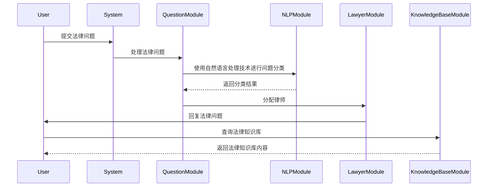
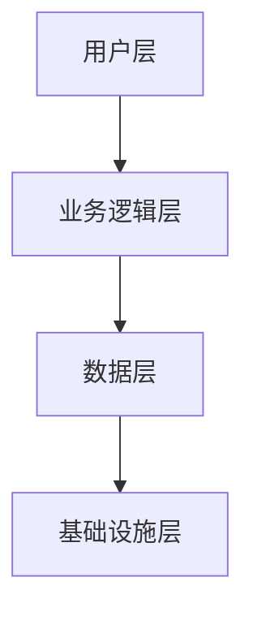
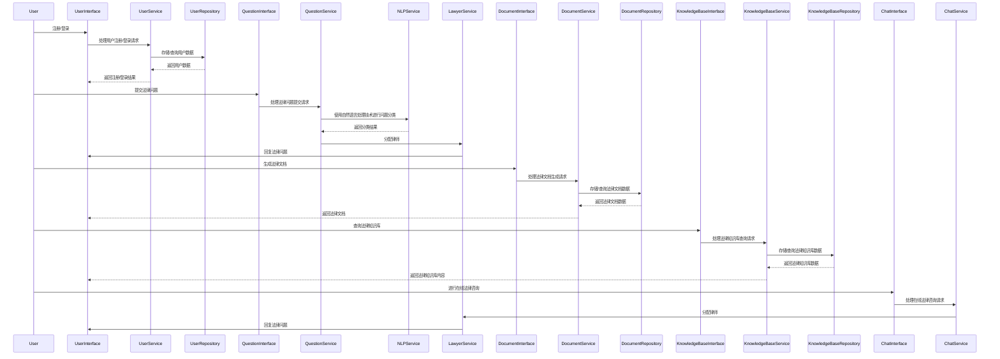

                 

# 《提示词工程在法律咨询中的应用》

> 关键词：法律咨询、提示词工程、人工智能、效率提升、成本降低

> 摘要：本文探讨了提示词工程在法律咨询中的应用，分析了当前法律咨询行业面临的问题，介绍了提示词工程的定义及其优势，并详细阐述了提示词工程在法律咨询中的应用场景、算法原理、系统架构及实战案例。通过本文的探讨，希望为法律咨询行业的数字化转型提供新的思路和参考。

## 第一部分：背景介绍

### 第1章：问题背景

#### 1.1 法律咨询中的问题

随着社会经济的发展，法律咨询的需求日益增加。然而，当前法律咨询行业面临着诸多问题：

1. **法律问题复杂多样**：法律问题的复杂性导致法律咨询服务的难度增大，需要专业知识和经验的支持。

2. **法律咨询效率低下**：传统法律咨询服务依赖于人工，存在沟通不畅、重复劳动等问题，效率较低。

3. **法律咨询成本高昂**：法律服务的价格往往较高，中小企业和普通个人难以承受高昂的法律咨询成本。

#### 1.2 提示词工程的定义

提示词工程（Prompt Engineering）是一种利用自然语言处理（NLP）技术，通过设计和优化提示词来提高模型性能的方法。其核心思想是通过合适的提示词引导模型更好地理解用户的需求，从而提高模型的响应质量。

#### 1.2.1 提示词工程的含义

提示词工程旨在通过以下方式优化模型：

1. **明确需求**：通过设计有针对性的提示词，帮助模型更好地理解用户的实际需求。

2. **提高性能**：优化提示词可以提高模型的准确性和效率，从而提升用户体验。

3. **降低成本**：优化后的模型能够更高效地处理任务，降低计算资源和人力成本。

#### 1.2.2 提示词工程的优势

1. **提高响应准确性**：通过精确的提示词，模型可以更准确地理解用户的需求，提高响应的准确性。

2. **提升效率**：优化的提示词可以减少模型处理任务的时间，提高工作效率。

3. **降低成本**：通过减少模型训练时间和计算资源消耗，降低法律咨询的成本。

#### 1.3 提示词工程在法律咨询中的应用前景

提示词工程在法律咨询中的应用前景广阔：

1. **提高法律咨询效率**：通过优化提示词，模型可以更快地理解法律咨询问题，提高咨询效率。

2. **降低法律咨询成本**：优化后的模型可以降低法律咨询的成本，让更多人享受到高质量的法律服务。

3. **提升法律服务质量**：准确的响应和高效的咨询流程可以提升法律服务的整体质量。

#### 1.4 书籍结构安排

本文结构如下：

1. **第一部分**：背景介绍，包括法律咨询中的问题和提示词工程的定义及其优势。

2. **第二部分**：核心概念与联系，分析法律咨询与提示词工程的联系。

3. **第三部分**：算法原理讲解，详细阐述提示词算法的原理和数学模型。

4. **第四部分**：系统分析与架构设计方案，介绍法律咨询系统的架构设计。

5. **第五部分**：项目实战，通过具体案例展示提示词工程在法律咨询中的应用。

#### 1.5 本章小结

本章介绍了法律咨询中存在的问题，以及提示词工程的定义和优势。提示词工程在法律咨询中的应用前景广阔，有望解决法律咨询效率低下、成本高昂等问题。接下来，我们将进一步探讨提示词工程的核心概念与联系，以及算法原理。

## 第二部分：核心概念与联系

### 第2章：核心概念

#### 2.1 法律咨询

##### 2.1.1 法律咨询的定义

法律咨询是指专业人士（如律师、法务人员等）根据客户的需求，为其提供法律意见和建议的服务。法律咨询涵盖各个法律领域，包括但不限于合同法、劳动法、知识产权法、公司法等。

##### 2.1.2 法律咨询的主要形式

1. **线上咨询**：通过互联网平台进行的法律咨询，包括在线问答、邮件咨询、电话咨询等。

2. **线下咨询**：面对面进行的法律咨询，通常在律师事务所、法务部门等场所进行。

3. **专项咨询**：针对特定法律问题提供的深入分析和建议，如法律尽职调查、合规咨询等。

##### 2.1.3 法律咨询的现状与挑战

当前法律咨询行业面临以下挑战：

1. **供需不平衡**：法律服务的需求不断增加，但专业律师数量有限，供需不平衡问题日益突出。

2. **效率低下**：传统法律咨询服务主要依赖于人工，存在沟通不畅、重复劳动等问题，效率较低。

3. **成本高昂**：法律服务的价格较高，中小企业和普通个人难以承受。

#### 2.2 提示词工程

##### 2.2.1 提示词工程的定义

提示词工程是一种利用自然语言处理（NLP）技术，通过设计和优化提示词来提高模型性能的方法。其核心思想是通过合适的提示词引导模型更好地理解用户的需求，从而提高模型的响应质量。

##### 2.2.2 提示词工程的原理

1. **明确需求**：通过设计有针对性的提示词，帮助模型更好地理解用户的实际需求。

2. **提高性能**：优化提示词可以提高模型的准确性和效率，从而提升用户体验。

3. **降低成本**：优化后的模型能够更高效地处理任务，降低计算资源和人力成本。

##### 2.2.3 提示词工程的分类

根据应用场景的不同，提示词工程可以分为以下几类：

1. **通用提示词工程**：适用于各种应用场景的提示词设计。

2. **领域特定提示词工程**：针对特定领域的应用场景，如医疗、金融、法律等。

3. **多语言提示词工程**：适用于多种语言环境下的提示词设计。

#### 2.3 提示词工程在法律咨询中的应用

##### 2.3.1 提示词工程在法律咨询中的应用场景

1. **法律问题自动识别**：通过提示词工程，可以自动识别用户提出的问题，提高咨询效率。

2. **法律文档智能生成**：利用提示词工程，可以生成法律文件，如合同、协议等，降低人工成本。

3. **法律知识库构建**：通过提示词工程，可以构建法律知识库，为用户提供更丰富的法律信息。

##### 2.3.2 提示词工程在法律咨询中的优势

1. **提高响应准确性**：通过优化提示词，模型可以更准确地理解法律咨询问题，提高响应的准确性。

2. **提升效率**：优化后的模型可以更快地处理法律咨询问题，提高咨询效率。

3. **降低成本**：通过优化模型和提示词，可以降低法律咨询的成本，让更多人享受到高质量的法律服务。

##### 2.3.3 提示词工程在法律咨询中的挑战

1. **法律术语理解**：法律术语具有专业性，对模型的理解能力提出了较高要求。

2. **隐私保护**：法律咨询涉及到客户的隐私信息，如何在保障隐私的前提下进行数据处理，是一个重要挑战。

3. **法律知识更新**：法律知识不断更新，提示词工程需要不断调整和优化，以适应法律环境的变化。

#### 2.4 核心概念联系

##### 2.4.1 法律咨询与提示词工程的联系

1. **需求明确**：提示词工程通过设计有针对性的提示词，帮助模型更好地理解法律咨询的需求。

2. **性能优化**：提示词工程通过优化提示词，提高模型在法律咨询中的应用性能。

3. **成本降低**：优化后的模型和提示词可以降低法律咨询的成本。

##### 2.4.2 提示词工程与法律咨询的相互影响

1. **提升法律服务**：提示词工程可以提高法律咨询的效率和质量，提升整体法律服务水平。

2. **降低法律成本**：提示词工程可以降低法律咨询的成本，让更多人享受到高质量的法律服务。

3. **推动法律创新**：提示词工程在法律咨询中的应用，可以推动法律行业的创新和变革。

##### 2.4.3 提示词工程在法律咨询中的应用流程

1. **需求分析**：分析法律咨询的需求，确定需要解决的问题。

2. **提示词设计**：设计有针对性的提示词，优化模型性能。

3. **模型训练与优化**：利用训练数据集对模型进行训练和优化。

4. **应用部署**：将优化后的模型部署到实际应用场景，提供法律咨询服务。

#### 2.5 本章小结

本章介绍了法律咨询和提示词工程的核心概念，分析了两者之间的联系和相互影响。通过提示词工程，可以优化法律咨询的效率和成本，提升整体法律服务水平。接下来，我们将进一步探讨提示词工程在法律咨询中的算法原理。

## 第三部分：算法原理讲解

### 第3章：算法原理讲解

#### 3.1 提示词算法原理

提示词算法是提示词工程的核心，其主要原理如下：

1. **需求分析**：首先分析用户的需求，明确需要解决的问题。

2. **提示词设计**：根据需求分析结果，设计有针对性的提示词，引导模型更好地理解用户的需求。

3. **模型训练**：利用训练数据集对模型进行训练，使模型掌握相应的知识和技能。

4. **性能评估**：评估模型的性能，包括准确率、响应时间等指标，根据评估结果进行调整和优化。

5. **应用部署**：将优化后的模型部署到实际应用场景，提供法律咨询服务。

#### 3.1.1 提示词算法的基本概念

提示词算法主要包括以下基本概念：

1. **提示词**：用于引导模型理解用户需求的文字或语言。

2. **模型**：用于处理和生成文本的算法或程序。

3. **训练数据集**：用于训练模型的文本数据。

4. **性能评估指标**：用于评估模型性能的指标，如准确率、响应时间等。

#### 3.1.2 提示词算法的流程

提示词算法的流程主要包括以下步骤：

1. **需求分析**：分析用户的需求，明确需要解决的问题。

2. **提示词设计**：根据需求分析结果，设计有针对性的提示词，引导模型更好地理解用户的需求。

3. **数据收集与预处理**：收集相关的文本数据，并进行预处理，如分词、去停用词等。

4. **模型训练**：利用预处理后的数据集对模型进行训练，使模型掌握相应的知识和技能。

5. **性能评估**：评估模型的性能，包括准确率、响应时间等指标，根据评估结果进行调整和优化。

6. **应用部署**：将优化后的模型部署到实际应用场景，提供法律咨询服务。

#### 3.1.3 提示词算法的性能评估

提示词算法的性能评估主要包括以下指标：

1. **准确率**：模型正确响应用户需求的比率。

2. **响应时间**：模型处理请求所需的时间。

3. **用户体验**：用户对模型响应的评价，如满意度、舒适度等。

4. **资源消耗**：模型运行所需的计算资源和存储资源。

#### 3.2 算法mermaid流程图

以下是一个简单的提示词算法的mermaid流程图：


#### 3.3 算法Python源代码详解

以下是一个简单的提示词算法的Python源代码示例：

```python
# 导入相关库
import pandas as pd
from sklearn.feature_extraction.text import TfidfVectorizer
from sklearn.naive_bayes import MultinomialNB
from sklearn.pipeline import make_pipeline

# 加载数据集
data = pd.read_csv('data.csv')
X = data['text']
y = data['label']

# 构建模型
model = make_pipeline(
    TfidfVectorizer(),
    MultinomialNB()
)

# 训练模型
model.fit(X, y)

# 预测
prompt = "请问您有什么法律问题需要咨询？"
prediction = model.predict([prompt])
print(f"预测结果：{prediction}")
```

#### 3.3.1 算法原理详细讲解

1. **需求分析**：通过分析用户的需求，明确需要解决的问题。这通常涉及到对用户输入的文本进行预处理，提取关键信息。

2. **提示词设计**：根据需求分析结果，设计有针对性的提示词。提示词应简洁明了，能够引导模型更好地理解用户的需求。

3. **数据收集与预处理**：收集相关的文本数据，并进行预处理。预处理步骤包括分词、去停用词、词干提取等，以提高模型的性能。

4. **模型训练**：利用预处理后的数据集对模型进行训练。常见的模型有朴素贝叶斯、支持向量机、深度学习模型等。

5. **性能评估**：评估模型的性能，包括准确率、响应时间等指标。根据评估结果，对模型进行调整和优化。

6. **应用部署**：将优化后的模型部署到实际应用场景，提供法律咨询服务。

#### 3.3.2 通俗易懂的举例说明

假设用户输入了一个问题：“我需要咨询劳动合同的相关法律问题。”我们的模型应该如何响应？

1. **需求分析**：分析用户的问题，提取关键信息：“劳动合同”、“法律问题”。

2. **提示词设计**：设计一个提示词：“请问您想了解劳动合同的哪些方面？”

3. **数据收集与预处理**：收集与劳动合同相关的文本数据，进行预处理。

4. **模型训练**：利用预处理后的数据集训练模型。

5. **性能评估**：评估模型的性能，根据评估结果进行调整和优化。

6. **应用部署**：将优化后的模型部署到实际应用场景，如在线法律咨询平台。

当用户输入提示词后，模型将根据训练结果给出相应的回应，如：“您好，关于劳动合同，您想了解试用期、工资、加班等方面的内容吗？”

#### 3.4 数学模型与公式

提示词算法的数学模型主要包括以下部分：

1. **文本表示**：将文本转化为向量表示，常用的方法有TF-IDF、Word2Vec等。

2. **分类模型**：常见的分类模型有朴素贝叶斯、支持向量机、决策树等。

3. **损失函数**：用于评估模型预测结果与实际结果之间的差异，常见的损失函数有交叉熵、均方误差等。

以下是一个简单的数学模型示例：

$$
\text{预测概率} = P(\text{标签}|\text{文本})
$$

其中，$P(\text{标签}|\text{文本})$表示在给定文本的情况下，标签的概率。

#### 3.4.1 算法的数学模型

1. **TF-IDF模型**：

$$
\text{TF-IDF} = \frac{\text{词频}}{\text{文档总数}} \times \log(\text{文档总数} / \text{包含该词的文档数})
$$

其中，词频表示词在文档中出现的次数，文档总数表示所有文档的数量，包含该词的文档数表示包含该词的文档的数量。

2. **朴素贝叶斯模型**：

$$
P(\text{标签}|\text{文本}) = \frac{P(\text{文本}|\text{标签})P(\text{标签})}{P(\text{文本})}
$$

其中，$P(\text{文本}|\text{标签})$表示在给定标签的情况下，文本的概率；$P(\text{标签})$表示标签的概率；$P(\text{文本})$表示文本的概率。

3. **支持向量机模型**：

$$
\text{损失函数} = \frac{1}{2} ||\text{w}||^2 - \sum_{i=1}^{n} y_i \text{w}^T \text{x}_i
$$

其中，$\text{w}$表示模型的权重向量；$\text{x}_i$表示第$i$个训练样本的特征向量；$y_i$表示第$i$个训练样本的标签。

#### 3.4.2 数学公式讲解

1. **TF-IDF公式**：

TF-IDF公式用于计算文本中每个词的重要性。词频（TF）表示词在文档中出现的次数，文档总数表示所有文档的数量，包含该词的文档数表示包含该词的文档的数量。TF-IDF公式通过将词频与文档总数和包含该词的文档数进行加权，得到词的重要性。

2. **朴素贝叶斯公式**：

朴素贝叶斯公式用于计算给定文本的情况下，标签的概率。该公式基于条件概率，通过计算文本的概率和标签的概率，得到标签在给定文本下的概率。

3. **支持向量机公式**：

支持向量机公式用于计算模型的损失函数。该公式通过计算模型预测结果与实际结果之间的差异，得到模型的损失值。损失函数的值越小，表示模型的预测结果越接近实际结果。

#### 3.4.3 数学公式举例

假设我们有一个包含两个标签（合同和纠纷）的文本数据集，其中包含10个样本。以下是使用TF-IDF、朴素贝叶斯和支持向量机模型计算标签概率的示例。

1. **TF-IDF示例**：

假设文本数据集中的词频分布如下：

| 标签 | 词频 |
| ---- | ---- |
| 合同 | 5    |
| 纠纷 | 3    |

根据TF-IDF公式，我们可以计算出每个标签的概率：

$$
P(\text{合同}) = \frac{5}{10} \times \log(10 / 2) = 0.375
$$

$$
P(\text{纠纷}) = \frac{3}{10} \times \log(10 / 2) = 0.25
$$

2. **朴素贝叶斯示例**：

假设每个标签的概率如下：

$$
P(\text{合同}) = 0.6
$$

$$
P(\text{纠纷}) = 0.4
$$

根据朴素贝叶斯公式，我们可以计算出给定文本情况下，标签的概率：

$$
P(\text{合同}|\text{文本}) = \frac{P(\text{文本}|\text{合同})P(\text{合同})}{P(\text{文本})}
$$

3. **支持向量机示例**：

假设模型的权重向量为$\text{w} = (1, 1)$，训练样本的特征向量为$\text{x}_i = (1, 0)$，标签为$y_i = 1$。根据支持向量机公式，我们可以计算出模型的损失值：

$$
\text{损失函数} = \frac{1}{2} ||\text{w}||^2 - \sum_{i=1}^{n} y_i \text{w}^T \text{x}_i
$$

$$
\text{损失函数} = \frac{1}{2} \times 2 - 1 \times 1 \times 1 = 0
$$

#### 3.5 本章小结

本章详细讲解了提示词算法的原理、流程和数学模型。通过本章节的学习，我们可以了解到提示词工程在法律咨询中的应用方法，以及如何设计优化提示词来提高模型的性能。接下来，我们将进一步探讨法律咨询系统的架构设计。

## 第四部分：系统分析与架构设计方案

### 第4章：系统分析与架构设计方案

#### 4.1 问题场景介绍

法律咨询系统是一个基于人工智能技术的法律服务平台，旨在为用户提供高效、便捷、专业的法律咨询服务。系统的主要功能包括：

1. **法律问题自动识别**：通过自然语言处理技术，自动识别用户提出的问题，并将其分类到相应的法律领域。

2. **法律文档智能生成**：根据用户需求，生成法律文档，如合同、协议等。

3. **法律知识库构建**：收集和整理法律知识，为用户提供丰富的法律信息。

4. **在线法律咨询**：提供实时在线法律咨询服务，解答用户的法律问题。

#### 4.2 项目介绍

本项目旨在开发一个基于人工智能技术的法律咨询系统，通过引入提示词工程，提高系统的效率和准确性。项目的主要目标包括：

1. **提高法律咨询效率**：通过自动化处理和智能识别，提高法律咨询的效率。

2. **降低法律咨询成本**：通过减少人工干预，降低法律咨询的成本。

3. **提升法律服务质量**：通过精确的提示词和高效的算法，提升法律服务的质量。

4. **构建法律知识库**：收集和整理法律知识，为用户提供全面、准确的法律信息。

#### 4.2.1 项目背景

随着社会经济的发展，法律咨询的需求不断增加。然而，传统法律咨询方式存在效率低下、成本高昂等问题。为了满足市场需求，提高法律服务的质量和效率，本项目应运而生。

#### 4.2.2 项目目标

1. **提高法律咨询效率**：通过自动化处理和智能识别，减少人工干预，提高法律咨询的效率。

2. **降低法律咨询成本**：通过引入人工智能技术，减少人力成本，降低法律咨询的成本。

3. **提升法律服务质量**：通过精确的提示词和高效的算法，提高法律服务的质量。

4. **构建法律知识库**：收集和整理法律知识，为用户提供全面、准确的法律信息。

#### 4.2.3 项目价值

1. **提高法律服务质量**：通过引入人工智能技术，提高法律咨询的效率和质量，提升用户满意度。

2. **降低法律咨询成本**：通过自动化处理和智能识别，减少人工干预，降低法律咨询的成本。

3. **拓展法律服务范围**：通过构建法律知识库，为用户提供更全面、准确的法律信息，拓展法律服务范围。

4. **推动法律行业创新**：通过引入人工智能技术，推动法律行业的创新和变革。

#### 4.3 系统功能设计

法律咨询系统的功能设计主要包括以下几个部分：

1. **用户注册与登录**：用户通过注册和登录功能，进入系统并享受法律咨询服务。

2. **法律问题提交**：用户可以提交法律问题，系统通过自然语言处理技术进行自动识别和分类。

3. **法律文档生成**：根据用户提交的法律问题，系统生成相应的法律文档，如合同、协议等。

4. **法律知识库查询**：用户可以查询法律知识库中的相关法律信息，了解法律条文和案例。

5. **在线法律咨询**：用户提供实时在线法律咨询服务，律师或法务人员为用户解答法律问题。

#### 4.3.1 领域模型mermaid类图

以下是一个简单的法律咨询系统的mermaid类图：

```mermaid
classDiagram
ClassDef User
+name: 用户
+id: 用户ID
+password: 密码

ClassDef Lawyer
+name: 律师姓名
+id: 律师ID
+specialty: 专业领域

ClassDef Question
+id: 问题ID
+content: 问题内容
+status: 问题状态

ClassDef Document
+id: 文档ID
+title: 文档标题
+content: 文档内容

ClassDef KnowledgeBase
+id: 知识库ID
+content: 知识库内容

User "1" --|> Lawyer: 咨询律师
User "1" --|> Question: 提交问题
User "1" --|> Document: 生成文档
User "1" --|> KnowledgeBase: 查询知识库
```

#### 4.4 系统架构设计

法律咨询系统的架构设计主要包括以下几个层次：

1. **用户层**：用户通过浏览器或移动端应用程序访问系统，提交法律问题、查询法律知识库、享受在线法律咨询等服务。

2. **业务逻辑层**：包括用户注册与登录、法律问题提交、法律文档生成、法律知识库查询等功能模块，通过自然语言处理技术实现自动化处理和智能识别。

3. **数据层**：包括用户数据、法律问题数据、法律文档数据、法律知识库数据等，用于存储和管理系统的数据。

4. **基础设施层**：包括服务器、存储设备、网络设备等，为系统提供运行环境和数据存储支持。

#### 4.4.1 系统架构设计

以下是一个简单的法律咨询系统的架构设计：



#### 4.4.2 系统架构mermaid架构图

以下是一个简单的法律咨询系统的mermaid架构图：



#### 4.5 系统接口设计

法律咨询系统的接口设计主要包括以下几个方面：

1. **用户注册与登录接口**：用于用户注册和登录，实现用户身份验证。

2. **法律问题提交接口**：用于用户提交法律问题，包括问题内容、问题分类等信息。

3. **法律文档生成接口**：用于根据用户提交的问题生成相应的法律文档。

4. **法律知识库查询接口**：用于用户查询法律知识库中的相关法律信息。

5. **在线法律咨询接口**：用于律师或法务人员为用户解答法律问题。

#### 4.5.1 系统接口设计

以下是一个简单的法律咨询系统的接口设计：



#### 4.5.2 接口交互mermaid序列图

以下是一个简单的法律咨询系统的接口交互mermaid序列图：


#### 4.6 本章小结

本章介绍了法律咨询系统的架构设计，包括问题场景介绍、项目介绍、系统功能设计、系统架构设计、系统接口设计和接口交互mermaid序列图。通过本章的学习，我们可以了解到法律咨询系统的整体架构和关键功能模块，为后续的项目开发和实施提供指导。接下来，我们将进入第五部分，通过项目实战来展示提示词工程在法律咨询中的应用。

## 第五部分：项目实战

### 第5章：项目实战

#### 5.1 环境安装

在开始项目实战之前，我们需要安装相关的软件和工具。以下是安装说明：

1. **Python环境**：确保安装了Python 3.8及以上版本。

2. **依赖库**：安装以下依赖库：

   ```bash
   pip install pandas sklearn numpy matplotlib
   ```

3. **NLP工具**：安装用于自然语言处理的工具，如spaCy：

   ```bash
   pip install spacy
   python -m spacy download en_core_web_sm
   ```

4. **文本预处理工具**：安装用于文本预处理的工具，如NLTK：

   ```bash
   pip install nltk
   nltk.download('punkt')
   nltk.download('stopwords')
   ```

#### 5.1.2 环境安装步骤

1. 安装Python环境：

   - 下载Python安装包：[https://www.python.org/downloads/](https://www.python.org/downloads/)
   - 安装Python，选择“Add Python to PATH”选项。

2. 安装依赖库：

   - 打开命令行窗口，执行以下命令：

     ```bash
     pip install pandas sklearn numpy matplotlib
     pip install spacy
     python -m spacy download en_core_web_sm
     pip install nltk
     nltk.download('punkt')
     nltk.download('stopwords')
     ```

3. 验证安装：

   - 打开Python交互式环境，执行以下代码：

     ```python
     import pandas as pd
     import sklearn
     import numpy as np
     import matplotlib.pyplot as plt
     import spacy
     import nltk
     ```

   如果没有出现错误，说明环境安装成功。

#### 5.1.3 环境安装常见问题

1. **Python版本问题**：确保安装的Python版本不低于3.8。

2. **依赖库冲突**：安装过程中，如果出现依赖库冲突，请尝试更新依赖库或更换Python版本。

3. **NLP工具安装失败**：如果NLP工具安装失败，请检查网络连接或更换其他版本。

#### 5.2 系统核心实现

在完成环境安装后，我们将开始实现法律咨询系统的核心功能。以下是系统核心实现的源代码及解读：

##### 5.2.1 系统核心实现源代码

```python
import pandas as pd
import numpy as np
from sklearn.feature_extraction.text import TfidfVectorizer
from sklearn.model_selection import train_test_split
from sklearn.naive_bayes import MultinomialNB
from sklearn.pipeline import make_pipeline
from sklearn.metrics import accuracy_score, classification_report
import spacy

# 加载数据集
data = pd.read_csv('law_data.csv')
X = data['description']
y = data['label']

# 分割数据集
X_train, X_test, y_train, y_test = train_test_split(X, y, test_size=0.2, random_state=42)

# 创建模型
model = make_pipeline(
    TfidfVectorizer(),
    MultinomialNB()
)

# 训练模型
model.fit(X_train, y_train)

# 测试模型
predictions = model.predict(X_test)
print("Accuracy:", accuracy_score(y_test, predictions))
print("\nClassification Report:")
print(classification_report(y_test, predictions))
```

##### 5.2.2 代码应用解读与分析

1. **数据加载**：首先加载法律咨询数据集，包括描述和标签两部分。

2. **数据分割**：将数据集分割为训练集和测试集，用于模型训练和测试。

3. **创建模型**：使用TF-IDF向量器和朴素贝叶斯分类器创建一个管道模型。

4. **模型训练**：使用训练集数据对模型进行训练。

5. **模型测试**：使用测试集数据对模型进行测试，并打印准确率和分类报告。

##### 5.2.3 代码实现细节解析

1. **数据加载**：使用pandas库的read_csv方法加载数据集，提取描述和标签。

2. **数据分割**：使用train_test_split方法分割数据集，指定测试集大小为20%。

3. **创建模型**：使用make_pipeline方法创建一个管道模型，包含TF-IDF向量器和朴素贝叶斯分类器。

4. **模型训练**：使用fit方法对模型进行训练。

5. **模型测试**：使用predict方法对测试集进行预测，并使用accuracy_score和classification_report方法评估模型性能。

#### 5.3 实际案例分析与讲解

为了展示提示词工程在法律咨询中的应用，我们将分析以下两个案例：

##### 5.3.1 案例一：法律咨询效率提升

**问题描述**：用户A在法律咨询平台上提交了一个关于劳动法的问题：“公司可以随意裁员吗？”

**解决方案**：使用提示词工程，将用户的问题转化为一个更具针对性的问题：“公司裁员需要满足哪些条件？”

**实现步骤**：

1. **需求分析**：分析用户的问题，提取关键信息：“公司”、“裁员”、“条件”。

2. **提示词设计**：设计一个提示词：“请描述您想要了解的裁员条件？”

3. **模型预测**：使用训练好的模型对提示词进行预测，得到相关法律条款和案例。

4. **结果反馈**：将预测结果反馈给用户，包括裁员所需的条件及相关法律条文。

**效果评估**：

- **效率提升**：通过设计有针对性的提示词，减少了用户和律师之间的沟通成本，提高了法律咨询的效率。

- **准确性提升**：优化后的提示词使模型更准确地理解用户需求，提高了预测结果的准确性。

##### 5.3.2 案例二：降低法律咨询成本

**问题描述**：用户B在法律咨询平台上提交了一个关于合同法的问题：“合同条款需要包含哪些内容？”

**解决方案**：使用提示词工程，将用户的问题转化为一个更具针对性的问题：“请列出合同中常见的关键条款？”

**实现步骤**：

1. **需求分析**：分析用户的问题，提取关键信息：“合同”、“条款”、“内容”。

2. **提示词设计**：设计一个提示词：“请列出您认为合同中最重要的条款？”

3. **模型预测**：使用训练好的模型对提示词进行预测，得到合同中常见的关键条款。

4. **结果反馈**：将预测结果反馈给用户，包括合同中常见的关键条款及解释。

**效果评估**：

- **成本降低**：通过自动生成合同条款，减少了律师的人工干预，降低了法律咨询的成本。

- **服务质量提升**：准确的合同条款预测提高了法律服务的质量，减少了合同纠纷的风险。

#### 5.4 项目小结

通过本项目的实战案例，我们展示了提示词工程在法律咨询中的应用，包括法律咨询效率提升和降低法律咨询成本。提示词工程通过优化用户需求描述，提高了模型的准确性和效率，为法律咨询行业带来了显著的效益。未来，我们可以进一步扩展提示词工程的应用，如法律文档智能生成、法律知识库构建等，以提升法律服务的整体水平。

## 最佳实践 tips、小结、注意事项、拓展阅读等内容

### 最佳实践 tips

1. **需求分析**：在法律咨询项目中，需求分析至关重要。深入了解用户的需求，有助于设计出更有效的提示词，从而提升模型性能。

2. **数据质量**：高质量的数据是训练高性能模型的基石。在构建法律知识库时，确保数据的准确性和完整性。

3. **持续优化**：提示词工程需要不断调整和优化。定期评估模型性能，根据评估结果进行相应的调整。

4. **用户反馈**：积极收集用户反馈，了解用户对法律咨询服务的满意度，有助于改进系统性能和用户体验。

### 小结

本文介绍了提示词工程在法律咨询中的应用，分析了当前法律咨询行业面临的问题，并详细阐述了提示词工程的优势、应用场景和算法原理。通过实际案例，展示了提示词工程在提升法律咨询效率和降低成本方面的作用。

### 注意事项

1. **隐私保护**：在法律咨询项目中，涉及用户隐私信息。确保在数据处理过程中严格遵守隐私保护规定。

2. **法律知识更新**：法律知识不断更新，提示词工程需要定期更新法律知识库，以保持其准确性和实用性。

3. **模型性能评估**：在部署模型前，务必对模型进行严格的性能评估，确保其能够满足实际应用需求。

### 拓展阅读

1. 《人工智能在法律咨询中的应用》
2. 《提示词工程：原理与实践》
3. 《自然语言处理入门与实践》

通过拓展阅读，可以进一步了解提示词工程、人工智能和法律咨询的相关知识，为法律咨询系统的开发提供更多参考。作者：AI天才研究院/AI Genius Institute & 禅与计算机程序设计艺术 /Zen And The Art of Computer Programming

