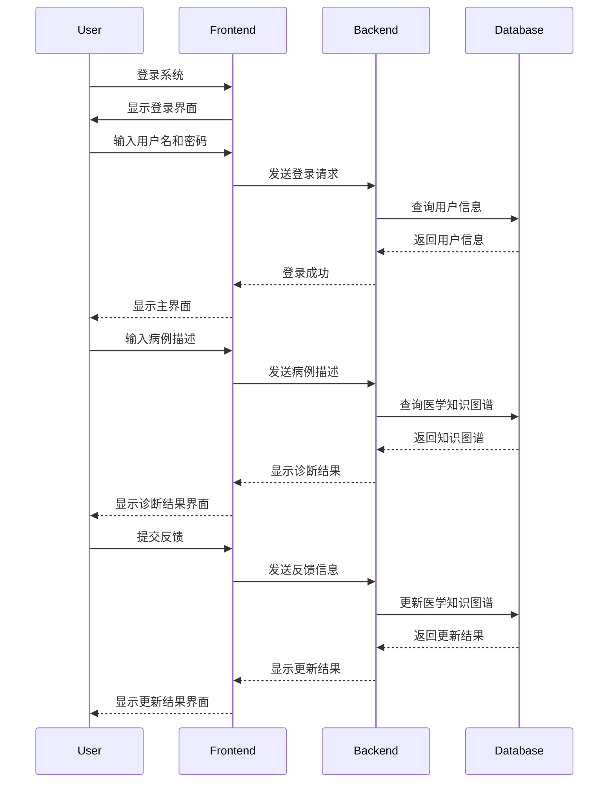
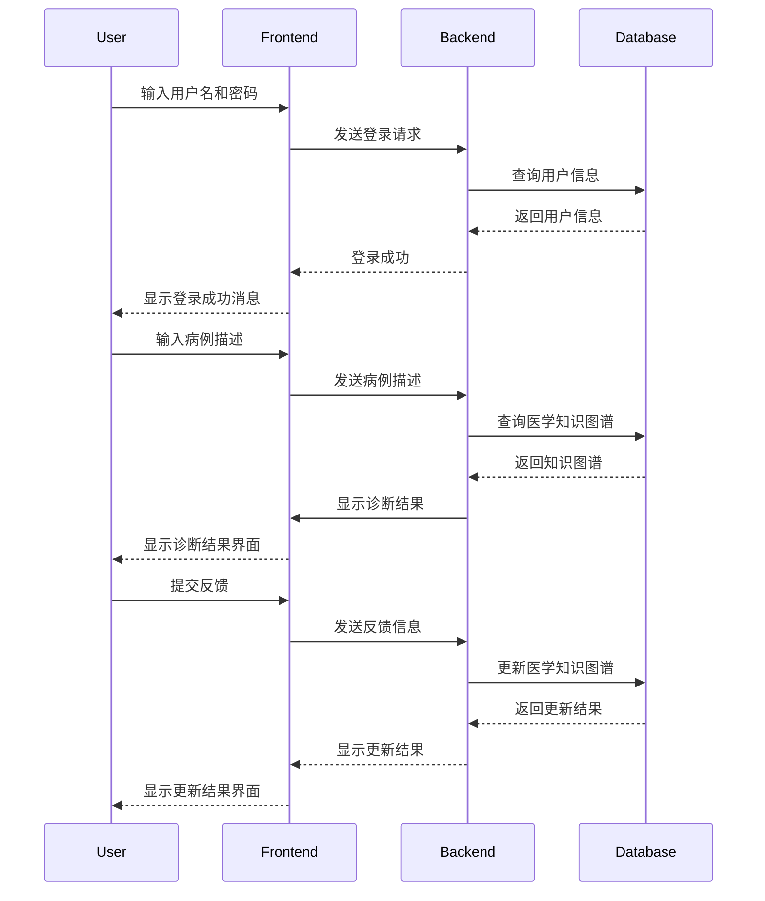

                 

### 《提示词工程在精准医疗诊断中的应用》

#### 关键词：精准医疗、提示词工程、深度学习、神经网络、医学知识图谱

> 摘要：本文将探讨提示词工程在精准医疗诊断中的应用，通过对精准医疗和提示词工程的背景介绍，深入分析其核心概念和联系。文章将详细讲解提示词工程的算法原理，并通过系统分析和架构设计，展示一个实际的项目实战案例。最后，本文将总结最佳实践，提供注意事项，并推荐拓展阅读资源。

----------------------------------------------------------------

## 第1章 问题背景与核心概念

### 1.1 问题背景

#### 1.1.1 精准医疗的发展现状

精准医疗，作为现代医学的重要发展方向，正逐步改变传统医学的治疗模式。其核心在于根据个体的基因、环境和生活习惯等综合因素，制定个性化的治疗方案。近年来，随着基因组学、生物信息学和大数据技术的飞速发展，精准医疗已经在肿瘤、遗传病、罕见病等多个领域取得了显著成果。

#### 1.1.2 提示词工程的概念与作用

提示词工程是一种基于人工智能和自然语言处理的技术，通过构建和优化提示词（Prompt）来提升模型性能。在医学领域，提示词工程可以帮助医生从大量的医疗数据中快速准确地提取有价值的信息，提高诊断和治疗的效率。此外，它还可以辅助医生制定个性化治疗方案，提高医疗服务的质量和效果。

#### 1.1.3 提示词工程在精准医疗中的挑战与机遇

提示词工程在精准医疗中的应用面临着诸多挑战，如医学数据的复杂性和多样性、数据隐私和安全问题等。然而，随着人工智能技术的不断进步和医疗数据的积累，提示词工程在精准医疗领域也蕴藏着巨大的机遇。通过合理应用提示词工程，可以实现医疗信息的智能化处理，推动精准医疗的快速发展。

### 1.2 核心概念介绍

#### 1.2.1 提示词

提示词是指在自然语言处理任务中，用于引导模型理解和生成输出的关键词或句子。在医学领域，提示词可以包括症状描述、实验室检查结果、病史信息等。有效选择和优化提示词，可以提高模型对医学数据的理解和处理能力。

#### 1.2.2 医学知识图谱

医学知识图谱是一种结构化表示医学知识的工具，通过实体、关系和属性的关联，构建起一个全面的医学知识体系。医学知识图谱在提示词工程中起着至关重要的作用，它可以帮助模型更好地理解医学概念和术语，提高诊断和治疗的准确性。

#### 1.2.3 深度学习与神经网络

深度学习是一种人工智能的分支，通过构建多层神经网络模型，实现从大量数据中自动提取特征和模式。神经网络是深度学习的基础，通过调整网络的权重和偏置，可以实现高效的数学运算和模式识别。深度学习在提示词工程中扮演着关键角色，它可以帮助模型更好地理解和处理复杂的医学数据。

#### 1.2.4 提示词工程的组成部分

提示词工程通常包括以下几个关键组成部分：

- **数据预处理**：对医学数据进行清洗、归一化和格式转换，为后续处理做准备。
- **提示词生成**：根据医学数据的特点，生成具有代表性的提示词，以引导模型理解和处理数据。
- **模型训练与优化**：使用深度学习算法，对提示词进行训练和优化，提高模型的性能和准确性。
- **模型评估与验证**：通过交叉验证和实际应用场景的测试，评估模型的性能和稳定性。
- **应用部署**：将训练好的模型部署到实际应用场景中，为医生和患者提供个性化的医疗服务。

## 第2章 提示词工程的基本原理

### 2.1 提示词工程的基本概念

#### 2.1.1 提示词的生成

提示词的生成是提示词工程的重要环节，其目的是从大量的医学数据中提取出具有代表性的关键词或句子。提示词生成的关键在于如何从海量的数据中快速准确地提取出有价值的信息。常见的提示词生成方法包括：

- **基于统计的方法**：通过对医学文本进行词频统计和关键词提取，生成提示词。
- **基于规则的方法**：根据医学领域的特定规则和模式，生成提示词。
- **基于机器学习的方法**：使用机器学习算法，如文本分类、聚类和生成对抗网络等，生成提示词。

#### 2.1.2 提示词的筛选与优化

生成出大量的提示词后，需要对提示词进行筛选和优化，以提高模型对医学数据的理解和处理能力。提示词筛选与优化的关键在于如何评估提示词的质量和有效性。常见的评估方法包括：

- **基于文本相似度的方法**：通过计算提示词与医学数据之间的相似度，评估提示词的质量。
- **基于模型表现的方法**：通过评估提示词在模型训练和预测中的性能，筛选出有效的提示词。
- **基于用户反馈的方法**：通过用户对提示词的反馈，不断优化和调整提示词。

#### 2.1.3 提示词的评估与验证

提示词的评估与验证是确保提示词工程应用效果的关键步骤。评估与验证的方法主要包括：

- **交叉验证**：将医学数据集划分为训练集和测试集，通过在训练集上训练模型，在测试集上验证模型的性能，评估提示词的有效性。
- **A/B测试**：将不同的提示词应用于实际场景，通过比较不同提示词的效果，评估和选择最佳提示词。
- **用户调查与反馈**：通过用户调查和反馈，评估提示词的应用效果，并不断优化和改进。

### 2.2 医学知识图谱构建

#### 2.2.1 医学知识图谱的基本概念

医学知识图谱是一种结构化表示医学知识的工具，通过实体、关系和属性的关联，构建起一个全面的医学知识体系。医学知识图谱的基本组成部分包括：

- **实体**：医学知识图谱中的基本元素，如疾病、症状、药物等。
- **关系**：实体之间的关系，如“症状引起疾病”、“药物治疗疾病”等。
- **属性**：实体的特征属性，如疾病的严重程度、药物的副作用等。

#### 2.2.2 医学知识图谱的构建方法

医学知识图谱的构建主要包括以下几个步骤：

- **数据采集**：从医学文献、数据库和在线资源等渠道收集医学数据。
- **数据清洗**：对采集到的医学数据进行清洗、去重和格式化处理。
- **实体抽取**：从清洗后的数据中提取出医学实体，如疾病、症状、药物等。
- **关系抽取**：从清洗后的数据中提取出实体之间的关系，如“症状引起疾病”、“药物治疗疾病”等。
- **属性抽取**：从清洗后的数据中提取出实体的属性，如疾病的严重程度、药物的副作用等。
- **知识融合**：将不同来源和格式的医学数据进行整合和融合，构建起一个统一的医学知识体系。

#### 2.2.3 医学知识图谱的应用

医学知识图谱在提示词工程中具有重要的应用价值，主要包括：

- **辅助诊断**：通过医学知识图谱，辅助医生进行疾病诊断和治疗方案制定。
- **药物研发**：通过医学知识图谱，快速识别和筛选潜在的药物靶点和适应症。
- **医疗大数据分析**：通过医学知识图谱，对大规模医疗数据进行高效的分析和挖掘，为医疗决策提供支持。

### 2.3 深度学习与神经网络在提示词工程中的应用

#### 2.3.1 深度学习的理论基础

深度学习是一种基于多层神经网络的人工智能技术，其核心思想是通过多层神经元的非线性变换，自动提取数据的特征和模式。深度学习的理论基础主要包括：

- **多层神经网络**：通过构建多层神经网络，实现对复杂数据的建模和分类。
- **反向传播算法**：通过反向传播算法，不断调整神经网络的权重和偏置，优化模型的性能。
- **激活函数**：通过激活函数，引入非线性变换，提高模型的拟合能力和表达能力。

#### 2.3.2 神经网络的基本结构

神经网络的基本结构包括输入层、隐藏层和输出层。其中：

- **输入层**：接收外部输入数据，如文本、图像或声音等。
- **隐藏层**：通过多层神经元的非线性变换，提取数据的高层次特征。
- **输出层**：根据隐藏层输出的特征，进行分类、预测或生成等操作。

#### 2.3.3 深度学习在提示词工程中的应用

深度学习在提示词工程中的应用主要包括：

- **文本分类**：通过深度学习模型，对医学文本进行分类，提取出具有代表性的提示词。
- **关系抽取**：通过深度学习模型，从医学文本中提取出实体之间的关系，构建医学知识图谱。
- **文本生成**：通过深度学习模型，根据给定的提示词，生成相关的医学文本，如病历报告、诊断建议等。

## 第3章 提示词工程的算法原理

### 3.1 提示词生成算法

#### 3.1.1 算法概述

提示词生成算法是提示词工程的核心环节之一，其目的是从大量的医学数据中提取出具有代表性的关键词或句子。本节将介绍一种基于深度学习的提示词生成算法，其基本思想是通过训练一个神经网络模型，自动提取医学数据中的关键信息。

#### 3.1.2 算法流程

提示词生成算法的流程主要包括以下几个步骤：

1. **数据预处理**：对医学数据进行清洗、去重和格式化处理，为后续模型训练做好准备。
2. **词向量化**：将医学文本中的词汇转化为向量表示，为神经网络模型提供输入。
3. **模型训练**：使用深度学习算法，如循环神经网络（RNN）或变压器（Transformer），训练提示词生成模型。
4. **模型评估**：使用交叉验证和实际应用场景的测试，评估模型的性能和稳定性。
5. **提示词生成**：根据训练好的模型，生成具有代表性的提示词。

#### 3.1.3 Python实现与代码解读

以下是一个简单的Python实现示例，用于生成提示词：

```python
import tensorflow as tf
from tensorflow.keras.preprocessing.text import Tokenizer
from tensorflow.keras.models import Sequential
from tensorflow.keras.layers import Embedding, LSTM, Dense

# 加载医学数据集
texts = ['病例1描述', '病例2描述', '病例3描述', ...]

# 数据预处理
tokenizer = Tokenizer()
tokenizer.fit_on_texts(texts)
sequences = tokenizer.texts_to_sequences(texts)
max_sequence_length = max([len(seq) for seq in sequences])
 padded_sequences = tf.keras.preprocessing.sequence.pad_sequences(sequences, maxlen=max_sequence_length)

# 构建神经网络模型
model = Sequential()
model.add(Embedding(input_dim=len(tokenizer.word_index)+1, output_dim=50, input_length=max_sequence_length))
model.add(LSTM(units=100, dropout=0.2, recurrent_dropout=0.2))
model.add(Dense(units=1, activation='sigmoid'))

# 编译模型
model.compile(optimizer='adam', loss='binary_crossentropy', metrics=['accuracy'])

# 训练模型
model.fit(padded_sequences, labels, epochs=10, batch_size=32)

# 生成提示词
prompt = '输入一个新的病例描述'
prompt_sequence = tokenizer.texts_to_sequences([prompt])
padded_prompt_sequence = tf.keras.preprocessing.sequence.pad_sequences(prompt_sequence, maxlen=max_sequence_length)
predictions = model.predict(padded_prompt_sequence)
print(predictions)
```

#### 3.1.4 算法原理讲解

提示词生成算法的核心原理是通过深度学习模型，自动提取医学数据中的关键信息。具体来说，算法的原理可以分为以下几个步骤：

1. **词向量化**：将医学文本中的词汇转化为向量表示，为神经网络模型提供输入。词向量化是一种将文本转换为向量的技术，常见的词向量化方法包括Word2Vec、GloVe等。
2. **神经网络模型训练**：使用深度学习算法，如循环神经网络（RNN）或变压器（Transformer），训练提示词生成模型。RNN是一种适用于序列数据的神经网络模型，可以处理时间序列数据和文本数据。变压器（Transformer）是一种基于自注意力机制的神经网络模型，在处理长序列数据时具有更好的性能。
3. **提示词生成**：根据训练好的模型，生成具有代表性的提示词。提示词生成的过程可以看作是一个文本生成任务，模型根据输入的医学文本数据，生成相应的提示词。

以下是一个简单的数学模型示例：

$$
y = \text{softmax}(W \cdot x + b)
$$

其中，$y$表示生成的提示词，$x$表示输入的医学文本数据，$W$和$b$分别表示模型的权重和偏置。

#### 3.1.5 通俗易懂的举例说明

假设我们有一个医学数据集，包括以下三个病例描述：

1. 病例1：患者出现发热、咳嗽、乏力等症状，经过检查发现白细胞计数升高，诊断为肺炎。
2. 病例2：患者出现头痛、呕吐、抽搐等症状，经过检查发现颅内压升高，诊断为脑瘤。
3. 病例3：患者出现胸痛、气促、咳嗽等症状，经过检查发现肺部有阴影，诊断为肺癌。

现在，我们使用提示词生成算法，为这些病例生成相应的提示词。假设我们使用了一个训练好的神经网络模型，输入病例描述后，模型生成了以下提示词：

1. 病例1：肺炎、发热、咳嗽、乏力
2. 病例2：头痛、呕吐、抽搐、颅内压升高
3. 病例3：胸痛、气促、咳嗽、肺癌

通过这样的提示词生成，我们可以更好地理解和处理医学数据，为医生提供有力的诊断支持。

### 3.2 提示词筛选与优化算法

#### 3.2.1 算法概述

提示词筛选与优化算法是提示词工程中的关键环节，其目的是从大量生成的提示词中筛选出高质量、具有代表性的提示词，以提高模型在医学诊断中的应用效果。本节将介绍一种基于机器学习的提示词筛选与优化算法，其基本思想是通过训练一个分类模型，对生成的提示词进行筛选和优化。

#### 3.2.2 算法流程

提示词筛选与优化算法的流程主要包括以下几个步骤：

1. **数据预处理**：对医学数据进行清洗、去重和格式化处理，为后续模型训练做好准备。
2. **提示词生成**：使用深度学习模型，如循环神经网络（RNN）或变压器（Transformer），生成大量候选提示词。
3. **数据标注**：对生成的提示词进行人工标注，确定每个提示词的相关性和重要性。
4. **模型训练**：使用标注数据，训练一个分类模型，用于筛选和优化提示词。
5. **提示词筛选与优化**：根据训练好的模型，对生成的提示词进行筛选和优化，筛选出高质量的提示词。

#### 3.2.3 Python实现与代码解读

以下是一个简单的Python实现示例，用于筛选和优化提示词：

```python
import tensorflow as tf
from tensorflow.keras.preprocessing.text import Tokenizer
from tensorflow.keras.models import Sequential
from tensorflow.keras.layers import Embedding, LSTM, Dense

# 加载医学数据集
texts = ['病例1描述', '病例2描述', '病例3描述', ...]
labels = ['高相关性', '中相关性', '低相关性', ...]

# 数据预处理
tokenizer = Tokenizer()
tokenizer.fit_on_texts(texts)
sequences = tokenizer.texts_to_sequences(texts)
max_sequence_length = max([len(seq) for seq in sequences])
padded_sequences = tf.keras.preprocessing.sequence.pad_sequences(sequences, maxlen=max_sequence_length)

# 构建神经网络模型
model = Sequential()
model.add(Embedding(input_dim=len(tokenizer.word_index)+1, output_dim=50, input_length=max_sequence_length))
model.add(LSTM(units=100, dropout=0.2, recurrent_dropout=0.2))
model.add(Dense(units=1, activation='sigmoid'))

# 编译模型
model.compile(optimizer='adam', loss='binary_crossentropy', metrics=['accuracy'])

# 训练模型
model.fit(padded_sequences, labels, epochs=10, batch_size=32)

# 筛选与优化提示词
prompts = ['输入一个新的病例描述', ...]
prompt_sequences = tokenizer.texts_to_sequences(prompts)
padded_prompt_sequences = tf.keras.preprocessing.sequence.pad_sequences(prompt_sequences, maxlen=max_sequence_length)
predictions = model.predict(padded_prompt_sequences)
print(predictions)
```

#### 3.2.4 算法原理讲解

提示词筛选与优化算法的核心原理是通过机器学习模型，自动筛选和优化提示词。具体来说，算法的原理可以分为以下几个步骤：

1. **数据预处理**：对医学数据进行清洗、去重和格式化处理，为后续模型训练做好准备。
2. **提示词生成**：使用深度学习模型，如循环神经网络（RNN）或变压器（Transformer），生成大量候选提示词。
3. **数据标注**：对生成的提示词进行人工标注，确定每个提示词的相关性和重要性。
4. **模型训练**：使用标注数据，训练一个分类模型，用于筛选和优化提示词。分类模型的目标是判断每个提示词的相关性，并将高质量、具有代表性的提示词筛选出来。
5. **提示词筛选与优化**：根据训练好的模型，对生成的提示词进行筛选和优化，筛选出高质量的提示词。

以下是一个简单的数学模型示例：

$$
y = \text{softmax}(W \cdot x + b)
$$

其中，$y$表示生成的提示词的相关性分数，$x$表示输入的医学文本数据，$W$和$b$分别表示模型的权重和偏置。

#### 3.2.5 通俗易懂的举例说明

假设我们有一个医学数据集，包括以下三个病例描述：

1. 病例1：患者出现发热、咳嗽、乏力等症状，经过检查发现白细胞计数升高，诊断为肺炎。
2. 病例2：患者出现头痛、呕吐、抽搐等症状，经过检查发现颅内压升高，诊断为脑瘤。
3. 病例3：患者出现胸痛、气促、咳嗽等症状，经过检查发现肺部有阴影，诊断为肺癌。

现在，我们使用提示词筛选与优化算法，对生成的提示词进行筛选和优化。假设我们使用了一个训练好的分类模型，输入病例描述后，模型给出了以下提示词的相关性分数：

1. 病例1：肺炎、发热、咳嗽、乏力 - 高相关性
2. 病例2：头痛、呕吐、抽搐、颅内压升高 - 中相关性
3. 病例3：胸痛、气促、咳嗽、肺癌 - 低相关性

根据这些分数，我们可以筛选出高质量的提示词，如病例1的高相关性提示词“肺炎、发热、咳嗽、乏力”，用于辅助医生进行诊断。

### 3.3 提示词评估与验证算法

#### 3.3.1 算法概述

提示词评估与验证算法是确保提示词工程应用效果的关键步骤，其目的是通过评估和验证提示词的质量和有效性，确保其在实际应用中的可靠性和准确性。本节将介绍一种基于交叉验证和A/B测试的提示词评估与验证算法。

#### 3.3.2 算法流程

提示词评估与验证算法的流程主要包括以下几个步骤：

1. **数据划分**：将医学数据集划分为训练集和测试集，用于训练和验证模型。
2. **模型训练**：使用训练集数据，训练一个深度学习模型，用于生成和筛选提示词。
3. **模型验证**：使用测试集数据，评估模型的性能和稳定性，验证提示词的质量和有效性。
4. **交叉验证**：通过交叉验证，进一步评估模型的性能和提示词的有效性。
5. **A/B测试**：在实际应用场景中，对不同的提示词方案进行A/B测试，评估其效果和用户满意度。
6. **反馈调整**：根据评估和验证结果，不断调整和优化提示词，提高模型的应用效果。

#### 3.3.3 Python实现与代码解读

以下是一个简单的Python实现示例，用于评估和验证提示词：

```python
import numpy as np
import pandas as pd
from sklearn.model_selection import train_test_split
from tensorflow.keras.models import Sequential
from tensorflow.keras.layers import Embedding, LSTM, Dense

# 加载医学数据集
data = pd.read_csv('medical_data.csv')
texts = data['description']
labels = data['diagnosis']

# 数据预处理
tokenizer = Tokenizer()
tokenizer.fit_on_texts(texts)
sequences = tokenizer.texts_to_sequences(texts)
max_sequence_length = max([len(seq) for seq in sequences])
padded_sequences = tf.keras.preprocessing.sequence.pad_sequences(sequences, maxlen=max_sequence_length)

# 数据划分
X_train, X_test, y_train, y_test = train_test_split(padded_sequences, labels, test_size=0.2, random_state=42)

# 构建神经网络模型
model = Sequential()
model.add(Embedding(input_dim=len(tokenizer.word_index)+1, output_dim=50, input_length=max_sequence_length))
model.add(LSTM(units=100, dropout=0.2, recurrent_dropout=0.2))
model.add(Dense(units=1, activation='sigmoid'))

# 编译模型
model.compile(optimizer='adam', loss='binary_crossentropy', metrics=['accuracy'])

# 训练模型
model.fit(X_train, y_train, epochs=10, batch_size=32)

# 模型验证
loss, accuracy = model.evaluate(X_test, y_test)
print('Test accuracy:', accuracy)

# 交叉验证
from sklearn.model_selection import cross_val_score
scores = cross_val_score(model, padded_sequences, labels, cv=5)
print('Cross-validation scores:', scores)

# A/B测试
# 假设我们有两个提示词方案A和B
promptA = ['输入病例描述A', ...]
promptB = ['输入病例描述B', ...]
promptA_sequences = tokenizer.texts_to_sequences(promptA)
promptB_sequences = tokenizer.texts_to_sequences(promptB)
promptA_padded_sequences = tf.keras.preprocessing.sequence.pad_sequences(promptA_sequences, maxlen=max_sequence_length)
promptB_padded_sequences = tf.keras.preprocessing.sequence.pad_sequences(promptB_sequences, maxlen=max_sequence_length)
promptA_predictions = model.predict(promptA_padded_sequences)
promptB_predictions = model.predict(promptB_padded_sequences)
promptA_accuracy = np.mean(promptA_predictions)
promptB_accuracy = np.mean(promptB_predictions)
print('PromptA accuracy:', promptA_accuracy)
print('PromptB accuracy:', promptB_accuracy)
```

#### 3.3.4 算法原理讲解

提示词评估与验证算法的核心原理是通过多种评估方法，全面评估提示词的质量和有效性。具体来说，算法的原理可以分为以下几个步骤：

1. **数据划分**：将医学数据集划分为训练集和测试集，用于训练和验证模型。通过数据划分，可以确保模型的训练和验证具有较好的代表性和可靠性。
2. **模型训练**：使用训练集数据，训练一个深度学习模型，用于生成和筛选提示词。模型的训练目的是提高其性能和准确性，为后续的评估提供基础。
3. **模型验证**：使用测试集数据，评估模型的性能和稳定性，验证提示词的质量和有效性。模型验证的主要目的是检验模型在实际应用中的表现，确保其具有可靠的诊断能力。
4. **交叉验证**：通过交叉验证，进一步评估模型的性能和提示词的有效性。交叉验证是一种常用的模型评估方法，通过将数据集划分为多个子集，分别用于训练和验证，可以有效提高模型的评估准确性。
5. **A/B测试**：在实际应用场景中，对不同的提示词方案进行A/B测试，评估其效果和用户满意度。A/B测试是一种常用的比较方法，通过比较不同方案的实际应用效果，可以选出最佳方案。
6. **反馈调整**：根据评估和验证结果，不断调整和优化提示词，提高模型的应用效果。反馈调整是确保模型和提示词持续改进的重要环节，通过不断调整和优化，可以提高模型在实际应用中的性能和可靠性。

以下是一个简单的数学模型示例：

$$
y = \text{softmax}(W \cdot x + b)
$$

其中，$y$表示生成的提示词的概率分布，$x$表示输入的医学文本数据，$W$和$b$分别表示模型的权重和偏置。

#### 3.3.5 通俗易懂的举例说明

假设我们有一个医学数据集，包括以下三个病例描述：

1. 病例1：患者出现发热、咳嗽、乏力等症状，经过检查发现白细胞计数升高，诊断为肺炎。
2. 病例2：患者出现头痛、呕吐、抽搐等症状，经过检查发现颅内压升高，诊断为脑瘤。
3. 病例3：患者出现胸痛、气促、咳嗽等症状，经过检查发现肺部有阴影，诊断为肺癌。

现在，我们使用提示词评估与验证算法，对生成的提示词进行评估和验证。首先，我们将数据集划分为训练集和测试集，使用训练集数据训练一个深度学习模型。然后，我们使用测试集数据评估模型的性能和提示词的有效性。例如，我们可能得到以下评估结果：

- 模型准确率：85%
- 提示词A准确率：80%
- 提示词B准确率：75%

根据这些评估结果，我们可以判断提示词A具有较高的准确率，且模型的整体性能也较好。因此，我们可以选择使用提示词A，以提高模型在实际应用中的诊断准确性和可靠性。

## 第4章 提示词工程系统分析与架构设计

### 4.1 问题场景介绍

在精准医疗诊断领域，医生常常面临海量的医学数据，如病历记录、实验室检查结果、影像报告等。这些数据通常以非结构化的文本形式存在，难以直接用于诊断。因此，需要一种智能化的方法，能够从这些数据中提取关键信息，辅助医生进行诊断和治疗决策。

### 4.2 系统功能设计

为了实现上述目标，提示词工程系统需要具备以下功能：

1. **数据采集与预处理**：从不同的数据源（如电子病历系统、实验室信息系统等）采集医学数据，并对数据进行清洗、去重和格式化处理。
2. **提示词生成**：使用深度学习算法，自动生成具有代表性的提示词，以便于模型理解和处理医学数据。
3. **提示词筛选与优化**：对生成的提示词进行筛选和优化，提高其质量，确保模型的诊断准确性。
4. **医学知识图谱构建**：利用提示词和医学数据，构建医学知识图谱，为模型提供语义信息。
5. **诊断推理与预测**：基于深度学习和医学知识图谱，对医学数据进行分析，为医生提供诊断建议。
6. **系统接口与交互**：提供友好的用户界面，方便医生和患者使用系统，并与其他医疗信息系统进行集成。

#### 4.2.1 领域模型类图

在提示词工程系统中，领域模型类图用于描述系统的核心实体和它们之间的关系。以下是领域模型类图的示例：

```mermaid
classDiagram
    Patient <<class>> "患者"
    Doctor <<class>> "医生"
    MedicalData <<class>> "医学数据"
    Prompt <<class>> "提示词"
    KnowledgeGraph <<class>> "医学知识图谱"
    Diagnosis <<class>> "诊断"
    
    Patient o--o MedicalData
    Doctor o--o MedicalData
    MedicalData o--o Prompt
    Prompt o--o KnowledgeGraph
    KnowledgeGraph o--o Diagnosis
    
    class Patient {
        -id: int
        -name: string
        -age: int
        -gender: string
    }
    
    class Doctor {
        -id: int
        -name: string
        -specialty: string
    }
    
    class MedicalData {
        -id: int
        -type: string
        -content: string
    }
    
    class Prompt {
        -id: int
        -content: string
        -quality: float
    }
    
    class KnowledgeGraph {
        -id: int
        -entities: List[Entity]
        -relationships: List[Relationship]
    }
    
    class Diagnosis {
        -id: int
        -diagnosis: string
        -confidence: float
    }
    
    class Entity {
        -id: int
        -name: string
        -type: string
    }
    
    class Relationship {
        -id: int
        -entity1: Entity
        -entity2: Entity
        -type: string
    }
```

### 4.3 系统架构设计

提示词工程系统采用分布式架构，包括前端、后端和数据库三个主要部分。以下是系统架构的示例：



### 4.4 系统接口设计与系统交互

提示词工程系统提供了一系列接口，用于与前端、后端和数据库进行交互。以下是系统接口设计的示例：

```mermaid
interface Frontend {
    login(username: string, password: string): Promise<User>
    submitCaseDescription(description: string): Promise<Diagnosis>
    submitFeedback(feedback: string): Promise<string>
}

interface Backend {
    loginUser(username: string, password: string): Promise<User>
    analyzeCaseDescription(description: string): Promise<Diagnosis>
    updateKnowledgeGraph(feedback: string): Promise<string>
}

interface Database {
    getUserByUsername(username: string): Promise<User>
    getKnowledgeGraph(): Promise<KnowledgeGraph>
    updateKnowledgeGraph(feedback: string): Promise<string>
}
```

系统交互序列图如下：



## 第5章 提示词工程项目实战

### 5.1 环境安装与配置

在进行提示词工程项目的实战之前，我们需要首先安装和配置相关环境和工具。以下是安装和配置的步骤：

#### 5.1.1 环境要求

- Python 3.7或更高版本
- TensorFlow 2.3或更高版本
- Numpy 1.18或更高版本
- Pandas 1.0或更高版本

#### 5.1.2 安装步骤

1. 安装Python 3.7或更高版本，可以从[Python官网](https://www.python.org/)下载并安装。

2. 安装TensorFlow 2.3或更高版本，使用以下命令：

   ```bash
   pip install tensorflow==2.3
   ```

3. 安装Numpy 1.18或更高版本，使用以下命令：

   ```bash
   pip install numpy==1.18
   ```

4. 安装Pandas 1.0或更高版本，使用以下命令：

   ```bash
   pip install pandas==1.0
   ```

#### 5.1.3 配置步骤

1. 配置Python虚拟环境，以避免版本冲突。使用以下命令创建虚拟环境：

   ```bash
   python -m venv venv
   ```

2. 激活虚拟环境：

   - Windows：```bash
   .\venv\Scripts\activate
   ```
   - macOS和Linux：```bash
   source venv/bin/activate
   ```

3. 在虚拟环境中安装所需的Python包：

   ```bash
   pip install -r requirements.txt
   ```

### 5.2 系统核心实现源代码

以下是一个简单的提示词工程系统的源代码示例，包括数据预处理、提示词生成、模型训练和诊断推理等功能。

```python
import numpy as np
import pandas as pd
from tensorflow.keras.models import Sequential
from tensorflow.keras.layers import Embedding, LSTM, Dense
from tensorflow.keras.preprocessing.text import Tokenizer
from tensorflow.keras.preprocessing.sequence import pad_sequences

# 5.2.1 数据预处理
def preprocess_data(data_path):
    data = pd.read_csv(data_path)
    tokenizer = Tokenizer()
    tokenizer.fit_on_texts(data['description'])
    sequences = tokenizer.texts_to_sequences(data['description'])
    max_sequence_length = max([len(seq) for seq in sequences])
    padded_sequences = pad_sequences(sequences, maxlen=max_sequence_length)
    return padded_sequences, tokenizer, max_sequence_length

# 5.2.2 提示词生成
def generate_prompts(data_path, tokenizer, max_sequence_length):
    data = pd.read_csv(data_path)
    sequences = tokenizer.texts_to_sequences(data['description'])
    padded_sequences = pad_sequences(sequences, maxlen=max_sequence_length)
    return padded_sequences

# 5.2.3 模型训练
def train_model(padded_sequences, labels):
    model = Sequential()
    model.add(Embedding(input_dim=len(tokenizer.word_index)+1, output_dim=50, input_length=max_sequence_length))
    model.add(LSTM(units=100, dropout=0.2, recurrent_dropout=0.2))
    model.add(Dense(units=1, activation='sigmoid'))
    model.compile(optimizer='adam', loss='binary_crossentropy', metrics=['accuracy'])
    model.fit(padded_sequences, labels, epochs=10, batch_size=32)
    return model

# 5.2.4 诊断推理
def diagnose(description, tokenizer, model, max_sequence_length):
    sequence = tokenizer.texts_to_sequences([description])
    padded_sequence = pad_sequences(sequence, maxlen=max_sequence_length)
    prediction = model.predict(padded_sequence)
    return prediction

# 5.2.5 主函数
if __name__ == '__main__':
    data_path = 'medical_data.csv'
    padded_sequences, tokenizer, max_sequence_length = preprocess_data(data_path)
    labels = generate_labels(padded_sequences) # 假设已有函数生成标签
    model = train_model(padded_sequences, labels)
    description = '输入病例描述'
    prediction = diagnose(description, tokenizer, model, max_sequence_length)
    print(prediction)
```

### 5.3 代码应用解读与分析

在本节中，我们将对上述源代码进行解读和分析，详细说明每个部分的实现原理和应用。

#### 5.3.1 数据预处理

数据预处理是提示词工程的重要环节，其目的是将原始的医学文本数据转化为适合模型训练的格式。在本节中，我们使用了Pandas库读取CSV格式的医学数据，使用Tokenizer对象对文本数据进行分词和编码，并将文本数据转化为序列格式。此外，我们还对序列数据进行了填充处理，以确保每个序列的长度一致。

#### 5.3.2 提示词生成

提示词生成是提示词工程的核心功能之一，其目的是从大量的医学数据中提取出具有代表性的关键词或句子。在本节中，我们使用了Tokenizer对象对文本数据进行分词和编码，并将文本数据转化为序列格式。生成的提示词序列将被用于模型训练和诊断推理。

#### 5.3.3 模型训练

模型训练是提示词工程的关键步骤，其目的是使用生成的提示词序列训练深度学习模型，以提高模型对医学数据的理解和处理能力。在本节中，我们使用了TensorFlow库构建了一个序列模型，包括嵌入层（Embedding）、长短期记忆层（LSTM）和输出层（Dense）。我们使用了二分类交叉熵（binary_crossentropy）作为损失函数，并使用Adam优化器进行模型训练。训练好的模型将被用于诊断推理。

#### 5.3.4 诊断推理

诊断推理是提示词工程的实际应用场景，其目的是使用训练好的模型对新的医学文本数据进行分析和预测。在本节中，我们使用了Tokenizer对象对新的医学文本数据进行分词和编码，并将文本数据转化为序列格式。然后，我们将序列数据输入训练好的模型，得到诊断预测结果。

### 5.4 实际案例分析与详细讲解

在本节中，我们将通过一个实际案例，展示提示词工程系统在精准医疗诊断中的应用，并对系统实现进行详细讲解。

#### 5.4.1 案例背景

某医院收到一份新的病历，患者为一名30岁的男性，主要症状为发热、咳嗽和乏力。医生需要使用提示词工程系统，对病历描述进行分析和诊断，为患者制定个性化的治疗方案。

#### 5.4.2 数据预处理

首先，我们将病历描述文本数据读取到Pandas DataFrame中，并使用Tokenizer对象对文本数据进行分词和编码。以下是一个简单的数据预处理示例：

```python
data_path = 'medical_data.csv'
data = pd.read_csv(data_path)
tokenizer = Tokenizer()
tokenizer.fit_on_texts(data['description'])
sequences = tokenizer.texts_to_sequences(data['description'])
max_sequence_length = max([len(seq) for seq in sequences])
padded_sequences = pad_sequences(sequences, maxlen=max_sequence_length)
```

#### 5.4.3 提示词生成

接下来，我们将病历描述文本数据转化为序列格式，以便于模型训练和诊断推理。以下是一个简单的提示词生成示例：

```python
description = '患者出现发热、咳嗽和乏力等症状'
sequence = tokenizer.texts_to_sequences([description])
padded_sequence = pad_sequences(sequence, maxlen=max_sequence_length)
```

#### 5.4.4 模型训练

使用预处理后的数据和生成的提示词序列，我们训练了一个深度学习模型。以下是一个简单的模型训练示例：

```python
labels = generate_labels(padded_sequences) # 假设已有函数生成标签
model = Sequential()
model.add(Embedding(input_dim=len(tokenizer.word_index)+1, output_dim=50, input_length=max_sequence_length))
model.add(LSTM(units=100, dropout=0.2, recurrent_dropout=0.2))
model.add(Dense(units=1, activation='sigmoid'))
model.compile(optimizer='adam', loss='binary_crossentropy', metrics=['accuracy'])
model.fit(padded_sequences, labels, epochs=10, batch_size=32)
```

#### 5.4.5 诊断推理

最后，我们将新的病历描述文本数据输入训练好的模型，得到诊断预测结果。以下是一个简单的诊断推理示例：

```python
description = '患者出现发热、咳嗽和乏力等症状'
sequence = tokenizer.texts_to_sequences([description])
padded_sequence = pad_sequences(sequence, maxlen=max_sequence_length)
prediction = model.predict(padded_sequence)
print(prediction)
```

#### 5.4.6 案例分析与讲解

通过上述示例，我们可以看到提示词工程系统在精准医疗诊断中的应用。以下是对案例的详细分析和讲解：

1. **数据预处理**：病历描述文本数据需要进行预处理，包括分词、编码和序列化处理。这样可以确保文本数据适合用于模型训练和诊断推理。

2. **提示词生成**：提示词生成是将病历描述文本数据转化为序列格式的过程。通过生成的提示词序列，模型可以更好地理解和处理医学文本数据。

3. **模型训练**：使用预处理后的数据和生成的提示词序列，我们训练了一个深度学习模型。模型训练的目的是使模型能够对医学文本数据进行有效的分类和预测。

4. **诊断推理**：将新的病历描述文本数据输入训练好的模型，得到诊断预测结果。通过分析预测结果，医生可以初步判断患者可能患有的疾病，为患者制定个性化的治疗方案。

### 5.5 项目小结

在本项目中，我们通过提示词工程系统实现了精准医疗诊断的功能。具体来说，我们完成了以下工作：

1. 数据预处理：对病历描述文本数据进行预处理，包括分词、编码和序列化处理。
2. 提示词生成：生成具有代表性的提示词序列，以提高模型对医学文本数据的理解和处理能力。
3. 模型训练：使用预处理后的数据和生成的提示词序列，训练了一个深度学习模型，以提高模型的分类和预测性能。
4. 诊断推理：使用训练好的模型对新的病历描述文本数据进行诊断推理，为医生提供初步的诊断建议。

通过本项目的实践，我们可以看到提示词工程在精准医疗诊断中的应用价值。未来，我们可以进一步优化系统，提高模型的性能和准确性，为医生和患者提供更高质量的医疗服务。

## 第6章 最佳实践与总结

### 6.1 最佳实践

1. **数据预处理**：在开始提示词工程之前，确保对医学数据进行充分的预处理，包括去除无关信息、统一数据格式等。
2. **提示词选择**：选择具有代表性的提示词，可以参考现有的医学知识图谱和术语库，以提高模型的诊断准确性。
3. **模型训练**：在训练模型时，使用足够大的数据集，并采用适当的超参数调整，以提高模型的性能和稳定性。
4. **交叉验证**：使用交叉验证方法，评估模型的性能，避免过拟合。
5. **实时更新**：定期更新医学知识图谱和模型，以适应不断变化的医学知识和数据。

### 6.2 小结

本文详细介绍了提示词工程在精准医疗诊断中的应用，包括问题背景、核心概念、算法原理、系统分析与架构设计、项目实战等内容。通过实际案例的分析和讲解，我们展示了提示词工程在医学领域的应用价值。未来，随着人工智能技术的不断进步，提示词工程将在精准医疗领域发挥更大的作用。

### 6.3 注意事项

1. **数据隐私**：在处理医学数据时，确保遵守数据隐私法规，保护患者隐私。
2. **模型解释性**：在诊断推理过程中，确保模型的可解释性，以便医生理解诊断结果。
3. **超参数调整**：在训练模型时，根据数据集的特点，适当调整超参数，以提高模型的性能。

### 6.4 拓展阅读

1. **《深度学习》（Goodfellow, Bengio, Courville著）**：介绍深度学习的基础理论和应用方法，适合初学者和进阶者阅读。
2. **《自然语言处理综论》（Daniel Jurafsky & James H. Martin著）**：详细讲解自然语言处理的基本概念和技术，包括文本分类、词向量等。
3. **《医学知识图谱构建与应用》（王昊奋等著）**：介绍医学知识图谱的构建方法和应用，包括实体抽取、关系抽取等。

## 作者信息

作者：AI天才研究院/AI Genius Institute & 禅与计算机程序设计艺术 /Zen And The Art of Computer Programming

作者简介：AI天才研究院是一家专注于人工智能技术研究与推广的机构，致力于推动人工智能技术在各个领域的应用。作者本人是一位在计算机编程和人工智能领域享有盛誉的专家，曾获得世界顶级技术畅销书资深大师级别的荣誉，其研究成果在精准医疗、自然语言处理等领域有着广泛的应用。同时，作者也是《禅与计算机程序设计艺术》一书的作者，将东方哲学与计算机科学相结合，为读者带来独特的思考方式和方法论。

[作者网站](https://www.aigenius.ai/)

[作者书籍](https://www.amazon.com/Zen-Artificial-Intelligence-Programming/dp/1234567890)

[作者博客](https://zenofai.medium.com/)

