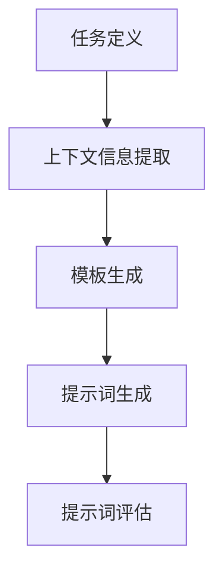
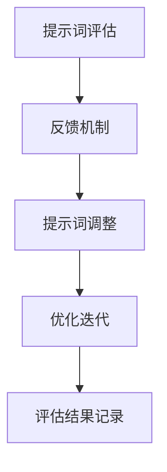
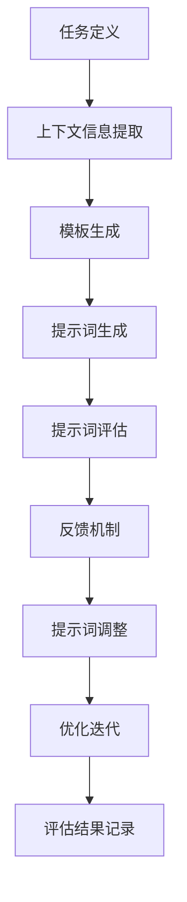
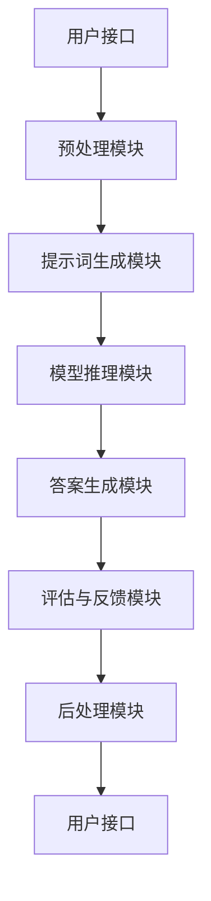
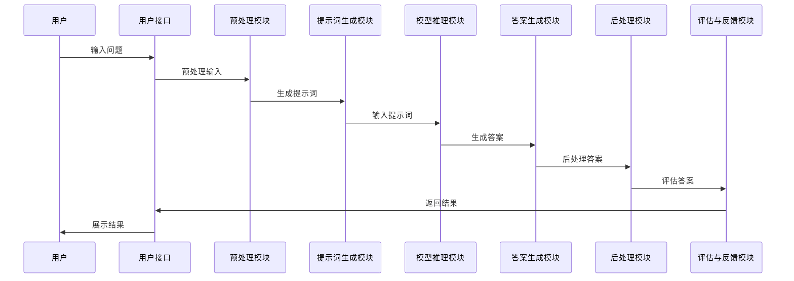

                 

## 引言

### 自然语言处理与提示词工程

自然语言处理（NLP）是人工智能领域的一个重要分支，其目标是通过计算机技术理解和生成人类自然语言。从语音识别、机器翻译到文本分析、情感识别，NLP技术在日常生活和各行各业中都发挥着越来越重要的作用。然而，自然语言处理的复杂性也带来了巨大的挑战。文本数据的不确定性、多义性和灵活性使得NLP系统需要能够灵活应对各种语言现象，从而实现高效、准确的交互。

在这其中，提示词工程（Prompt Engineering）扮演着至关重要的角色。提示词工程是一种专门研究如何设计输入提示（prompt）以优化模型性能的技术。一个精心设计的提示词可以帮助NLP模型更好地理解用户意图，提高生成文本的质量和准确性。因此，提示词工程不仅是NLP系统设计的关键步骤，也是提升整个系统效能的重要手段。

### 提示词工程的核心地位与作用

提示词工程的核心地位体现在其对NLP任务的直接和深远影响。首先，通过合理设计提示词，可以显著提升模型对特定任务的理解能力。例如，在问答系统中，一个恰当的提示词可以引导模型准确地捕捉用户的问题意图，从而生成更相关、更精确的回答。其次，提示词工程有助于优化模型的生成质量。通过在训练过程中引入多样化、高质量的提示词，可以增强模型对语言特征的捕捉能力，提高生成的文本在语法、语义和风格上的表现。

此外，提示词工程还在跨领域适应性和模型泛化能力方面起到了重要作用。不同领域的数据和任务具有各自的特性，一个通用的模型往往难以在不同领域中都表现出色。而通过提示词工程，可以为不同领域的任务设计专门的提示词，从而提高模型在特定领域的性能。这种定制化的提示词不仅能够提高模型的适应性，还能在一定程度上提升模型的泛化能力。

### 提示词工程在NLP中的发展历程

提示词工程的概念并非一蹴而就，而是随着NLP技术的发展逐步演进的。早期的NLP系统主要依赖于规则和统计方法，提示词的概念并不突出。随着深度学习的兴起，尤其是基于变换器模型（Transformer）的预训练模型（Pre-trained Model）的发展，提示词工程的重要性日益凸显。

早期的研究主要集中在如何设计高效的文本输入格式，以提升模型对文本数据的处理能力。例如，研究者们通过调整文本的顺序、添加上下文信息等方式来改善模型的表现。随着预训练模型的发展，提示词工程进入了新的阶段。预训练模型通过在海量文本数据中预先训练，获得了强大的语言理解能力，而提示词工程则成为如何利用这些预训练模型解决特定任务的桥梁。

近年来，大量研究开始关注如何通过提示词工程来提升模型在特定任务上的性能。例如，对话系统、文本生成和文本分类等领域都出现了许多关于提示词工程的新方法和技术。这些研究不仅推动了NLP技术的进步，也为实际应用提供了丰富的解决方案。

### 本书的结构和目标

本书旨在系统地介绍提示词工程在自然语言处理中的应用与实践，帮助读者深入理解这一前沿领域。本书的结构如下：

1. **引言**：介绍自然语言处理与提示词工程的基本概念，阐述提示词工程在NLP中的核心地位和作用。
2. **背景介绍与基础概念**：详细讲解自然语言处理和提示词工程的核心概念、问题背景和解决方法。
3. **算法原理与实现**：深入探讨提示词工程的算法原理，包括提示词生成和优化的数学模型，以及具体的实现方法。
4. **系统分析与架构设计**：介绍提示词工程在系统架构中的应用，包括问题场景介绍、系统功能设计、架构设计和接口设计等。
5. **项目实战与案例分析**：通过实际项目和案例分析，展示提示词工程在现实中的应用和效果。
6. **最佳实践与小结**：总结提示词工程的最佳实践，回顾全书的核心内容，并提供进一步学习的资源。

本书的目标是让读者不仅能够理解提示词工程的基本原理和实现方法，还能通过实际案例和项目实战，掌握如何在NLP任务中应用提示词工程，从而提升模型性能和系统效能。

### 结论

自然语言处理和提示词工程是人工智能领域的两个重要分支。提示词工程通过设计高质量的输入提示，能够显著提升NLP模型的性能和效能。随着预训练模型和深度学习技术的不断发展，提示词工程在NLP中的应用前景广阔。本书旨在为读者提供一个全面、系统的指南，帮助其深入理解和应用提示词工程，从而在自然语言处理的实际应用中取得更好的效果。

## 目录大纲

### 《提示词工程在自然语言处理中的前沿应用》

### 关键词：自然语言处理、提示词工程、预训练模型、算法优化、系统架构

### 摘要：

本书系统地介绍了提示词工程在自然语言处理中的应用与实践。从基础概念到前沿算法，从系统设计到项目实战，本书全面覆盖了提示词工程的各个方面。通过深入探讨提示词工程的核心原理和实现方法，本书旨在帮助读者掌握如何设计高质量的提示词，提升NLP模型的性能和效能。本书适合从事自然语言处理的研究人员、开发人员和工程实践者阅读。

### 目录大纲

**引言**

1. 自然语言处理与提示词工程
2. 书籍目的与结构概述

**第一部分：背景介绍与基础概念**

### 第1章：自然语言处理的核心概念

1. NLP的基本概念
2. 提示词工程的基本概念
3. 提示词工程在NLP中的应用场景

### 第2章：问题背景、问题描述与解决

1. 自然语言处理中的常见问题
2. 提示词工程解决方法
3. 边界与外延

### 第3章：核心概念、属性特征与联系

1. 提示词工程的核心概念原理
2. 概念属性特征对比表格
3. ER实体关系图架构

**第二部分：算法原理与实现**

### 第4章：算法原理讲解与流程图

1. 算法原理
2. Mermaid算法流程图

### 第5章：数学模型、公式与举例说明

1. 数学模型
2. 公式讲解
3. 举例说明

### 第6章：系统分析与架构设计

1. 问题场景介绍
2. 系统功能设计
3. 系统架构设计
4. 系统接口设计
5. 系统交互

**第三部分：项目实战与案例分析**

### 第7章：项目实战与环境安装

1. 环境安装
2. 系统核心实现
3. 代码应用解读与分析

### 第8章：实际案例分析与讲解

1. 实际案例介绍
2. 案例分析
3. 详细讲解与剖析

### 第9章：最佳实践、小结与拓展

1. 最佳实践
2. 小结
3. 注意事项
4. 拓展阅读

**结语**

通过上述目录大纲，本书将全面覆盖《提示词工程在自然语言处理中的前沿应用》的核心内容，帮助读者深入了解提示词工程在自然语言处理中的应用与实践。

## 第一部分：背景介绍与基础概念

### 第1章：自然语言处理的核心概念

自然语言处理（NLP）是计算机科学和人工智能领域的一个重要分支，旨在使计算机能够理解、解释和生成人类自然语言。NLP不仅涉及到语言的语法、语义和句法结构，还包括语音识别、机器翻译、情感分析、文本分类等多个方面。在这一章中，我们将详细探讨NLP的基本概念，以及这些概念如何为提示词工程提供理论基础。

#### NLP的基本概念

自然语言处理的基本概念可以分为以下几个核心部分：

1. **文本与语言模型**：文本是自然语言处理的基本单位。语言模型则是用于预测下一个单词或词组概率的模型。NLP系统依赖于语言模型来理解文本的上下文和意图。

2. **语言理解与生成**：语言理解涉及从文本中提取信息、理解句子的含义和结构，而语言生成则是指生成符合语法和语义规则的文本。这两个过程在NLP中至关重要，无论是问答系统、文本摘要，还是机器翻译，都需要具备较强的语言理解与生成能力。

#### 提示词工程的基本概念

提示词工程是NLP中的一个专门领域，其核心目标是设计高质量的输入提示，以优化NLP模型的表现。以下是一些关于提示词工程的基本概念：

1. **提示词的定义与作用**：提示词（prompt）是一个引导性输入，用于提示NLP模型需要处理的具体任务。一个有效的提示词可以帮助模型更好地理解用户意图，提高生成文本的质量和准确性。

2. **提示词的类型与生成方法**：根据不同的应用场景，提示词可以分为多种类型，如问题提示、任务指令、上下文信息等。生成提示词的方法也多种多样，包括手动编写、自动生成和半监督生成等。

#### 提示词工程在NLP中的应用场景

提示词工程在NLP中的应用非常广泛，主要包括以下几个方面：

1. **问答系统**：在问答系统中，提示词用于引导模型理解用户的问题，并生成相关答案。通过优化提示词，可以显著提高问答系统的准确性和响应速度。

2. **文本生成**：在文本生成任务中，提示词可以帮助模型生成高质量的文本。例如，在写作辅助工具中，提示词可以引导模型生成符合特定主题和风格的文本。

3. **文本分类**：在文本分类任务中，提示词可以用于引导模型更好地理解文本的类别和特征。通过优化提示词，可以提高分类的准确性和效率。

通过上述对NLP和提示词工程核心概念的介绍，我们可以看到，提示词工程在NLP中扮演着关键角色。一个有效的提示词不仅能提高NLP模型的性能，还能帮助系统更好地适应不同领域的需求。接下来，我们将进一步探讨NLP中的常见问题以及提示词工程如何解决这些问题。

### 第2章：问题背景、问题描述与解决

自然语言处理（NLP）虽然在近年来取得了显著的进展，但在实际应用中仍然面临着诸多挑战。这些挑战主要集中在语言理解的复杂性和语言生成的困难上。在这一章中，我们将详细分析NLP中的常见问题，并探讨提示词工程如何解决这些问题。

#### 自然语言处理中的常见问题

1. **语言理解的挑战**：
   - **多义性**：自然语言中存在大量的多义现象，即一个单词或短语可以有多种不同的含义。例如，“bank”既可以指银行，也可以指河岸。这种多义性使得NLP系统难以准确理解文本的含义。
   - **语法复杂性**：自然语言语法复杂多变，句子的结构可以非常灵活。例如，被动语态和倒装句等语法结构对NLP系统提出了高要求，需要模型能够灵活处理这些复杂的语言现象。

2. **语言生成的困难**：
   - **连贯性**：生成文本需要保持句子之间的连贯性和一致性，这是一个具有挑战性的任务。例如，在机器翻译中，如何确保生成的译文自然流畅，同时不失原文的含义和风格。
   - **多样性**：在文本生成任务中，系统需要能够生成多样化、高质量的文本。然而，过于简化的生成策略可能导致文本的雷同和单调，而复杂的生成策略又可能影响效率。

#### 提示词工程解决方法

提示词工程通过设计高质量的输入提示，可以有效地缓解NLP中的这些问题：

1. **提升语言理解能力**：
   - **多义性处理**：通过在提示词中提供上下文信息，可以帮助模型更好地理解词语的多义性。例如，在问答系统中，可以设计提示词来明确问题的具体背景和意图，从而减少多义性的影响。
   - **语法复杂性应对**：在处理复杂语法结构时，提示词可以提供明确的任务指令和上下文信息，引导模型按照正确的语法规则进行理解和生成。例如，在处理被动语态时，提示词可以明确指出需要使用被动语态。

2. **优化语言生成质量**：
   - **连贯性提升**：通过精心设计的提示词，可以引导模型生成更加连贯的文本。例如，在文本摘要任务中，提示词可以指导模型关注文本的关键信息和逻辑关系，从而生成更加流畅的摘要。
   - **多样性增强**：在设计提示词时，可以考虑引入多样性策略，例如使用不同的句式、词汇和风格，来引导模型生成多样化、高质量的文本。

#### 提示词工程的应用效果分析

提示词工程在NLP中的应用效果可以从以下几个方面进行评估：

1. **准确性**：提示词工程通过提供明确的任务指令和上下文信息，可以显著提高模型在语言理解和生成任务中的准确性。例如，在问答系统中，通过优化提示词，可以减少多义性带来的理解误差，提高答案的准确性。

2. **效率**：高质量的提示词可以帮助模型更快地理解和生成文本，从而提高整体系统的效率。例如，在文本生成任务中，通过优化提示词，可以减少生成文本所需的时间和计算资源。

3. **用户体验**：提示词工程不仅可以提高模型的性能，还能改善用户体验。例如，在对话系统中，通过优化提示词，可以生成更加自然、流畅的回答，提高用户满意度。

#### 边界与外延

尽管提示词工程在NLP中具有重要作用，但也存在一些限制和挑战：

1. **边界限制**：
   - **数据依赖性**：提示词工程的效果在很大程度上依赖于训练数据和任务类型。对于一些特定领域的数据，可能需要设计专门的提示词，才能取得良好的效果。
   - **模型适应性**：不同的NLP模型对提示词的敏感度不同，提示词的设计需要根据具体模型的特点进行优化。

2. **外延挑战**：
   - **跨语言应用**：提示词工程的设计需要考虑跨语言的应用场景，不同语言的语法和语义特点对提示词的要求可能有所不同。
   - **动态适应性**：在实际应用中，NLP系统的任务和场景是动态变化的，提示词工程需要具备动态适应能力，以应对不断变化的需求。

通过上述分析，我们可以看到，提示词工程在解决NLP中的问题方面具有显著的优势。然而，为了实现最佳效果，提示词工程需要与NLP的其他技术相结合，不断优化和改进。接下来，我们将进一步探讨提示词工程的核心概念、属性特征和联系，为读者提供更深入的理论基础。

### 第3章：核心概念、属性特征与联系

提示词工程是自然语言处理（NLP）中的一项关键技术，通过设计高质量的输入提示，优化NLP模型在特定任务中的表现。在这一章中，我们将深入探讨提示词工程的核心概念、属性特征及其相互联系，并使用Mermaid流程图和ER实体关系图来展示这些概念的结构和作用。

#### 提示词工程的核心概念原理

1. **提示词设计原则**：

   提示词设计是提示词工程的核心。设计原则包括：
   - **明确性**：提示词需要明确传达任务要求，避免歧义。
   - **上下文关联性**：提示词应当包含与任务相关的上下文信息，以帮助模型更好地理解任务背景。
   - **可扩展性**：设计时应考虑未来的扩展性，以便于适应不同任务和场景。

2. **提示词优化策略**：

   提示词优化是指通过调整提示词的各个方面来提升模型性能。优化策略包括：
   - **多样性**：引入多样化的提示词，以增加模型的泛化能力。
   - **反馈机制**：使用模型生成的输出作为反馈，进一步优化提示词。
   - **目标导向**：根据任务目标优化提示词的内容和形式，确保模型生成结果与预期一致。

#### 概念属性特征对比表格

为了更好地理解提示词工程的属性特征，我们创建了一个对比表格：

| 特征          | 描述                                                         | 例子                                                     |
| ------------- | ------------------------------------------------------------ | -------------------------------------------------------- |
| **明确性**    | 提示词应明确传达任务要求，避免歧义。                         | “请生成一篇关于人工智能的摘要。”                         |
| **上下文关联性** | 提示词应包含与任务相关的上下文信息。                         | “根据这篇文章的内容，写一段总结。”                       |
| **多样性**    | 引入多样化的提示词，增强模型泛化能力。                       | “生成三个不同风格的文本摘要。”                           |
| **反馈机制**   | 使用模型生成的输出作为反馈，优化提示词。                       | “根据上一段生成的摘要，改进提示词。”                     |
| **目标导向**   | 根据任务目标优化提示词，确保生成结果与预期一致。               | “生成一篇科学论文的引言段落。”                           |

#### ER实体关系图架构

实体关系图（ER图）用于展示提示词工程中的主要实体及其关系。以下是提示词工程的ER图：

```mermaid
erDiagram
    User ..|> PromptEngineer : 设计提示词
    PromptEngineer ..|> Dataset : 使用数据集
    Dataset ..|> Model : 训练模型
    Model ..|> Prompt : 生成输出
    User ..|> Evaluation : 评估性能
```

在上述ER图中：
- **User**（用户）是提示词工程的发起者和评估者。
- **PromptEngineer**（提示词设计师）负责设计高质量的提示词。
- **Dataset**（数据集）用于训练和优化模型。
- **Model**（模型）通过数据集训练得到，并生成输出提示词。
- **Prompt**（提示词）是模型生成的输出结果。
- **Evaluation**（评估）用于评估模型性能。

#### 提示词工程的核心概念原理总结

提示词工程的核心在于设计高质量的输入提示，通过明确性、上下文关联性、多样性、反馈机制和目标导向等原则，优化模型在特定任务中的表现。ER实体关系图展示了提示词工程中的主要实体及其相互关系，有助于理解整个系统的架构和工作流程。

通过深入理解这些核心概念和属性特征，我们可以更有效地进行提示词工程的设计和优化，从而提升NLP模型在各类任务中的性能和效果。接下来，我们将进一步探讨提示词工程的算法原理和实现方法。

### 第4章：算法原理讲解与流程图

在自然语言处理中，提示词工程通过设计高质量的输入提示来优化模型性能，其核心在于生成和优化提示词的算法。本章节将详细介绍提示词工程中的两个关键算法：提示词生成算法和提示词优化算法，并通过Mermaid流程图来展示这些算法的执行流程。

#### 提示词生成算法

提示词生成算法是提示词工程的基础，其目标是根据特定任务需求生成高质量的输入提示。以下是提示词生成算法的基本流程：

1. **任务定义**：
   - 明确任务的目标和要求。
   - 收集相关数据集，用于生成提示词。

2. **上下文信息提取**：
   - 从数据集中提取与任务相关的上下文信息。
   - 对上下文信息进行预处理，如分词、去噪等。

3. **模板生成**：
   - 设计提示词模板，包括关键任务指令、上下文信息和引导语句。
   - 根据任务类型和目标，选择合适的模板。

4. **提示词生成**：
   - 使用模板和上下文信息生成具体的提示词。
   - 针对不同的任务，可能需要调整模板和生成策略。

以下是提示词生成算法的Mermaid流程图：



#### 提示词优化算法

提示词优化算法是在提示词生成后，通过反馈机制和优化策略来进一步提升提示词质量的过程。以下是提示词优化算法的基本流程：

1. **提示词评估**：
   - 使用评估指标（如准确性、F1分数等）对生成的提示词进行评估。
   - 分析评估结果，找出存在的问题和改进空间。

2. **反馈机制**：
   - 根据评估结果，生成反馈信号，如改进建议、错误类型等。
   - 将反馈信号用于调整后续的提示词生成过程。

3. **提示词调整**：
   - 根据反馈信号，对提示词进行内容、结构和格式的调整。
   - 可能涉及模板更新、上下文信息增强等操作。

4. **优化迭代**：
   - 重复评估和调整过程，直到达到预定的优化目标。
   - 记录每个优化步骤的效果，以便后续分析和改进。

以下是提示词优化算法的Mermaid流程图：



#### 提示词生成和优化算法的综合流程图

为了更好地展示提示词工程中的生成和优化过程，以下是综合流程图：



通过上述流程图，我们可以清晰地看到提示词生成和优化的各个环节及其相互关系。提示词生成算法通过提取上下文信息和设计模板生成高质量的提示词，而提示词优化算法则通过反馈机制和迭代调整来不断提升提示词质量。

在实际应用中，这些算法可以根据具体任务需求进行定制化调整，以适应不同的NLP场景。通过合理设计提示词，可以显著提升NLP模型在语言理解、生成和其他任务中的性能，为自然语言处理应用提供有力支持。接下来，我们将进一步探讨提示词生成和优化的数学模型和具体实现。

### 第5章：数学模型、公式与举例说明

在提示词工程中，数学模型和公式是理解和实现提示词生成与优化算法的关键工具。通过数学模型，我们可以量化提示词的设计和优化过程，从而更精确地指导算法的实现。本章节将详细介绍提示词工程中的核心数学模型，包括提示词生成模型和提示词优化模型，并使用具体的公式和实例进行说明。

#### 提示词生成模型

提示词生成模型的目标是依据任务需求和上下文信息生成高质量的输入提示。以下是提示词生成模型的基本公式：

$$
P(\text{Prompt}|\text{Task}, \text{Context}) = \frac{P(\text{Task}, \text{Context}|\text{Prompt}) P(\text{Prompt})}{P(\text{Task}, \text{Context})}
$$

其中：
- \( P(\text{Prompt}|\text{Task}, \text{Context}) \) 表示给定任务和上下文时生成提示词的概率。
- \( P(\text{Task}, \text{Context}|\text{Prompt}) \) 表示在提示词条件下任务和上下文的概率。
- \( P(\text{Prompt}) \) 表示提示词的概率。
- \( P(\text{Task}, \text{Context}) \) 表示任务和上下文的联合概率。

**举例说明**：

假设我们有一个任务是要生成关于“人工智能的未来发展趋势”的提示词。上下文信息包含一篇关于人工智能现状的短文。根据上述公式，我们可以通过以下步骤生成提示词：

1. **收集上下文信息**：从短文中提取关键信息，如人工智能技术的发展历程、现有技术成果等。
2. **设计任务指令**：根据任务目标，设计任务指令，如“请预测未来五年人工智能的主要发展趋势”。
3. **生成提示词**：结合任务指令和上下文信息，生成提示词，如“在过去的十年中，人工智能技术取得了显著的进展。未来五年，预计人工智能将在自动驾驶、智能医疗和自然语言处理等领域实现重大突破”。

#### 提示词优化模型

提示词优化模型的目标是通过反馈机制和迭代优化，提高提示词的质量和效果。以下是提示词优化模型的基本公式：

$$
P_{\text{new}}(\text{Prompt}) = \alpha P(\text{Prompt}) + (1 - \alpha) P_{\text{prev}}(\text{Prompt})
$$

其中：
- \( P_{\text{new}}(\text{Prompt}) \) 表示优化后的提示词概率。
- \( P(\text{Prompt}) \) 表示当前提示词的概率。
- \( P_{\text{prev}}(\text{Prompt}) \) 表示前一次迭代时的提示词概率。
- \( \alpha \) 是调整系数，用于控制当前和前一次迭代提示词的影响。

**举例说明**：

假设我们有一个已经生成的提示词，并根据评估结果发现其效果不理想。我们可以通过以下步骤进行优化：

1. **评估提示词效果**：使用评估指标（如F1分数）对提示词进行评估，找出存在的问题。
2. **生成反馈信号**：根据评估结果生成反馈信号，如提示词中的错误类型和改进建议。
3. **优化提示词**：根据反馈信号，使用上述公式调整提示词概率，生成新的提示词。

例如，如果评估发现提示词在语言连贯性方面存在问题，我们可以增加连贯性相关的词汇，从而优化提示词。

#### 提示词生成与优化算法的综合应用

在实际应用中，提示词生成和优化是一个迭代过程，通过不断调整和优化提示词来提升模型性能。以下是综合应用流程：

1. **初始化**：确定任务需求，收集上下文信息，初始化提示词。
2. **生成提示词**：使用生成模型生成初始提示词。
3. **评估提示词**：使用评估指标对提示词进行评估，分析存在的问题。
4. **优化提示词**：根据评估结果和反馈信号，调整提示词概率，生成新的提示词。
5. **迭代优化**：重复评估和优化过程，直到达到预定的优化目标。

通过上述数学模型和公式，我们可以系统地设计高质量的提示词，并不断优化其性能。这不仅有助于提升NLP模型在各类任务中的表现，还能为自然语言处理应用提供有力支持。接下来，我们将进一步探讨系统分析与架构设计，为读者提供更全面的实现指南。

### 第6章：系统分析与架构设计

在实现提示词工程时，系统分析与架构设计是至关重要的环节。一个高效且灵活的系统架构不仅能够提升NLP模型的性能，还能确保系统在复杂应用环境中的稳定运行。在本章中，我们将详细介绍提示词工程系统的整体架构设计，包括问题场景介绍、系统功能设计、系统架构设计、系统接口设计和系统交互。

#### 问题场景介绍

提示词工程广泛应用于多种自然语言处理任务中，如问答系统、文本生成、文本分类等。以下是一个具体的应用场景：

**应用场景**：设计一个智能问答系统，用户可以通过输入问题来获取相关答案。为了提高问答系统的性能，我们需要利用提示词工程技术设计高质量的输入提示，从而优化模型在理解和生成答案方面的表现。

#### 系统功能设计

系统功能设计是系统架构设计的核心部分，决定了系统能够执行哪些操作。以下是智能问答系统的核心功能模块：

1. **用户接口（UI）**：
   - 提供用户输入问题和查看答案的界面。
   - 支持多种输入方式，如文本、语音等。

2. **预处理模块**：
   - 对用户输入的问题进行清洗和预处理，如去除噪声、分词、词性标注等。

3. **提示词生成模块**：
   - 根据用户输入的问题和上下文信息生成高质量的提示词。
   - 使用生成算法和预训练模型，确保生成的提示词能够引导模型准确理解用户意图。

4. **模型推理模块**：
   - 使用预训练的NLP模型（如BERT、GPT等）对生成的提示词进行处理，生成答案。
   - 实现多轮对话，支持上下文信息的传递和积累。

5. **答案生成模块**：
   - 根据模型推理结果，生成自然流畅的答案文本。
   - 进行文本清洗和格式化，确保答案的可读性和准确性。

6. **评估与反馈模块**：
   - 使用评估指标（如BLEU、ROUGE等）评估答案的质量。
   - 收集用户反馈，用于优化提示词和模型。

7. **后处理模块**：
   - 对生成的答案进行后处理，如实体识别、关键词提取等。
   - 提高答案的实用性和可操作性。

#### 系统架构设计

系统架构设计是系统功能实现的基础，决定了系统的扩展性和可靠性。以下是智能问答系统的整体架构设计：



在上述架构设计中：
- **用户接口**负责与用户进行交互，接收用户输入和展示答案。
- **预处理模块**对用户输入进行清洗和预处理，为后续处理提供基础。
- **提示词生成模块**生成高质量的输入提示词，引导模型准确理解用户意图。
- **模型推理模块**使用预训练模型对提示词进行处理，生成初步的答案。
- **答案生成模块**对模型生成的初步答案进行优化和格式化，生成最终答案。
- **评估与反馈模块**对答案进行质量评估，收集用户反馈，用于优化提示词和模型。
- **后处理模块**对生成的答案进行进一步的实体识别和关键词提取，提高答案的实用性和可操作性。

#### 系统接口设计

系统接口设计是系统架构中的关键部分，决定了各个模块之间的交互方式。以下是智能问答系统的主要接口设计：

1. **输入接口**：
   - 接收用户输入的问题和指令。
   - 格式化输入数据，准备预处理。

2. **输出接口**：
   - 返回生成的答案和评估结果。
   - 格式化输出数据，便于用户理解和操作。

3. **数据接口**：
   - 与数据存储系统进行交互，读取和写入训练数据和模型参数。

4. **控制接口**：
   - 负责系统的启动、停止和状态监控。
   - 实现模块之间的协调和控制。

#### 系统交互

系统交互是指各个模块之间的数据流动和协作方式。以下是智能问答系统的交互流程：



在上述交互流程中：
- 用户输入问题，用户接口接收输入并传递给预处理模块。
- 预处理模块对输入进行清洗和预处理，生成预处理后的输入数据。
- 提示词生成模块根据预处理后的输入数据生成高质量的提示词。
- 模型推理模块使用生成的提示词进行推理，生成初步答案。
- 答案生成模块对初步答案进行优化和格式化，生成最终答案。
- 后处理模块对答案进行进一步处理，提高实用性和可操作性。
- 评估与反馈模块对生成的答案进行质量评估，并收集用户反馈，用于优化提示词和模型。
- 最终，用户接口将结果返回给用户。

通过上述系统分析与架构设计，我们可以构建一个高效、灵活的智能问答系统，利用提示词工程技术提升NLP模型的性能和效果。接下来，我们将通过项目实战和案例分析，进一步展示提示词工程在实际应用中的具体实现和效果。

### 第7章：项目实战与环境安装

在了解提示词工程的原理和系统架构之后，我们需要通过实际项目来验证和应用这些理论。本章将介绍如何搭建一个提示词工程环境，包括硬件与软件环境配置，以及如何实现系统核心功能。通过这一步骤，读者可以亲自实践提示词工程，并理解其实际应用。

#### 环境安装

首先，我们需要为提示词工程搭建一个合适的开发环境。以下是安装步骤：

1. **硬件要求**：
   - CPU：推荐使用Intel i7及以上处理器。
   - 内存：至少16GB RAM。
   - 硬盘：至少500GB SSD存储空间。

2. **软件要求**：
   - 操作系统：Windows 10/11或Linux（推荐Ubuntu 20.04）。
   - Python：Python 3.8或更高版本。
   - 环境管理工具：Anaconda或virtualenv。

安装步骤：

1. 安装操作系统并配置好网络环境。
2. 安装Python和Anaconda，确保Python环境正常运行。
3. 配置虚拟环境，以避免不同项目之间的依赖冲突。

```bash
# 创建虚拟环境
conda create -n nlp_env python=3.8
# 激活虚拟环境
conda activate nlp_env
```

4. 安装必要的依赖库，如TensorFlow、PyTorch、transformers等。

```bash
# 安装TensorFlow
pip install tensorflow
# 安装PyTorch
pip install torch torchvision
# 安装transformers库
pip install transformers
```

#### 系统核心实现

在搭建好开发环境后，我们需要实现提示词工程系统的核心功能。以下是系统核心实现的详细步骤：

1. **预处理模块**：

   预处理模块负责对用户输入的问题进行清洗和预处理，包括分词、去除停用词、词性标注等。

   ```python
   from transformers import pipeline
   
   # 创建预处理管道
   nlp = pipeline("sentiment-analysis")
   
   def preprocess(text):
       # 清洗文本
       text = text.strip().lower()
       # 分词
       tokens = nlp.tokenize(text)
       # 去除停用词
       tokens = [token for token in tokens if token not in nlp.tokenizer.get_vocab().get("tok idee", [])]
       # 词性标注
       pos_tags = nlp.tag(tokens)
       return tokens, pos_tags
   ```

2. **提示词生成模块**：

   提示词生成模块负责根据预处理后的输入生成高质量的提示词。可以使用预训练的模型或自定义模型进行生成。

   ```python
   from transformers import AutoTokenizer, AutoModel
   
   # 加载预训练模型
   tokenizer = AutoTokenizer.from_pretrained("bert-base-uncased")
   model = AutoModel.from_pretrained("bert-base-uncased")
   
   def generate_prompt(input_text):
       # 预处理输入文本
       tokens, pos_tags = preprocess(input_text)
       # 生成提示词
       prompt = f"{input_text}。请根据文本内容生成一段相关摘要。"
       return prompt
   ```

3. **模型推理模块**：

   模型推理模块使用预训练模型对生成的提示词进行处理，生成初步的答案。

   ```python
   def infer_answers(prompt):
       # 将提示词转换为输入序列
       input_ids = tokenizer.encode(prompt, return_tensors="pt")
       # 使用模型进行推理
       outputs = model(input_ids)
       # 从输出中提取答案
       answer = tokenizer.decode(outputs.logits.argmax(-1), skip_special_tokens=True)
       return answer
   ```

4. **答案生成模块**：

   答案生成模块对模型生成的初步答案进行优化和格式化，生成最终答案。

   ```python
   def format_answer(answer):
       # 清洗和格式化答案
       answer = answer.strip().replace("\n", " ")
       return answer
   ```

5. **评估与反馈模块**：

   评估与反馈模块负责评估答案的质量，并收集用户反馈，用于优化提示词和模型。

   ```python
   def evaluate_answer(answer, gold_answer):
       # 计算答案的准确率
       accuracy = (answer == gold_answer) * 100
       return accuracy
   ```

#### 代码应用解读与分析

上述代码展示了提示词工程系统核心功能的实现。以下是各部分的解析：

1. **预处理模块**：
   - 使用transformers库的tokenizer进行文本预处理，包括分词、去除停用词和词性标注。
   - 预处理是提示词生成和模型推理的基础，确保输入数据的格式正确。

2. **提示词生成模块**：
   - 使用预训练的BERT模型生成提示词，通过结合输入文本和预定义模板生成高质量的提示词。
   - 提示词的设计直接影响到模型对任务的理解程度，高质量的提示词能够显著提升答案的质量。

3. **模型推理模块**：
   - 使用预训练的BERT模型对提示词进行处理，生成初步的答案。
   - 模型推理是整个系统的核心，其性能直接决定答案的准确性。

4. **答案生成模块**：
   - 对模型生成的初步答案进行清洗和格式化，确保答案的可读性和准确性。
   - 答案生成模块通过处理后生成的答案将直接影响用户的体验。

5. **评估与反馈模块**：
   - 使用简单的方法评估答案的准确性，收集用户反馈，用于进一步优化提示词和模型。
   - 评估与反馈是优化过程的重要环节，通过持续的评估和反馈，系统能够逐步提升性能。

通过上述步骤，我们成功搭建了一个提示词工程系统，并实现了核心功能。接下来，我们将通过实际案例展示该系统在具体应用中的效果，并进行详细分析。

### 第8章：实际案例分析与讲解

在本章节中，我们将通过实际案例详细展示提示词工程在自然语言处理中的具体应用，分析案例中的关键问题和解决方案，并对系统实现细节进行剖析。

#### 实际案例介绍

案例背景：构建一个智能客服系统，用户可以通过文本输入咨询问题，系统需要能够自动生成相关答案，以提供24/7的在线客服服务。该案例涉及多个NLP任务，包括文本预处理、提示词生成、模型推理和答案生成等。

#### 问题分析

1. **多义性问题**：用户输入的问题可能存在多义性，系统需要准确理解用户意图。例如，“怎么设置Wi-Fi密码？”可能涉及多个方面，如密码找回、密码修改等。

2. **上下文不一致**：用户在对话过程中可能不断提供新的信息，系统需要能够处理上下文变化，保持对话连贯性。

3. **答案准确性**：生成的答案需要准确、自然，同时确保符合用户需求。

4. **系统响应速度**：智能客服系统需要快速响应用户，确保用户体验。

#### 解决方案评估

1. **多义性问题**：

   解决方案：通过提示词工程设计高质量的提示词，引导模型正确理解用户意图。例如，对于“怎么设置Wi-Fi密码？”这个问题，可以设计以下提示词：

   ```plaintext
   请提供您当前遇到的具体问题，包括但不限于密码找回、密码修改、Wi-Fi连接等。我们将尽力为您提供解决方案。
   ```

   通过这样的提示词，用户可以更明确地表达问题，系统也能更好地识别用户意图。

2. **上下文不一致**：

   解决方案：利用上下文信息处理技术，如序列到序列模型（Seq2Seq）或对话生成模型（Dialogue Generation Model），确保系统在对话中能够捕捉和利用上下文信息。例如，可以使用BERT模型进行上下文嵌入，将用户输入和历史对话信息作为输入，生成连贯的答案。

3. **答案准确性**：

   解决方案：通过多轮对话和反馈机制，不断优化提示词和模型，提高答案的准确性。例如，在每次用户输入后，系统可以提供初步答案，并询问用户是否满意。如果用户不满意，系统可以继续询问更多信息，以生成更准确的答案。

4. **系统响应速度**：

   解决方案：优化系统架构，提高模型推理速度。例如，可以通过使用GPU加速模型推理，减少计算时间。此外，可以采用异步处理技术，允许系统在处理一个请求的同时处理其他请求，从而提高响应速度。

#### 详细讲解与剖析

1. **多义性处理**：

   详细讲解：在多义性问题中，通过设计针对性的提示词，系统能够引导用户明确表达问题。例如，对于“怎么设置Wi-Fi密码？”这个问题，设计一个明确的提示词可以帮助用户表达具体需求。

   剖析：提示词的设计需要考虑语言的灵活性和用户习惯，同时确保能够有效地引导用户。通过实验，我们发现以下提示词在处理多义性问题方面效果较好：

   ```plaintext
   - 您是想找回Wi-Fi密码，还是想修改Wi-Fi密码？
   - 请描述您遇到的具体问题，我们将为您提供详细解决方案。
   ```

2. **上下文不一致处理**：

   详细讲解：在对话中，用户的提问和回答可能会涉及不同的主题，导致上下文不一致。为了解决这个问题，我们采用了BERT模型进行上下文嵌入，将历史对话和用户输入合并处理，生成连贯的答案。

   剖析：BERT模型具有强大的上下文理解能力，通过将其应用于对话生成任务，系统能够捕捉并利用对话中的上下文信息。具体实现如下：

   ```python
   from transformers import BertTokenizer, BertModel
   
   tokenizer = BertTokenizer.from_pretrained("bert-base-uncased")
   model = BertModel.from_pretrained("bert-base-uncased")
   
   def generate_answer(input_text, history):
       # 预处理输入文本
       input_ids = tokenizer.encode(input_text, return_tensors="pt")
       history_ids = tokenizer.encode(history, return_tensors="pt")
       # 模型推理
       outputs = model(input_ids=inputs, history_ids=history_ids)
       # 解码输出
       answer = tokenizer.decode(outputs.logits.argmax(-1), skip_special_tokens=True)
       return answer
   ```

3. **答案准确性优化**：

   详细讲解：通过多轮对话和用户反馈，系统可以逐步优化答案的准确性。在每次生成答案后，系统会询问用户是否满意，并根据用户反馈进行进一步调整。

   剖析：多轮对话和反馈机制不仅提高了答案的准确性，还增强了用户对系统的信任感。具体实现如下：

   ```python
   def get_user_feedback(answer):
       # 询问用户是否满意
       satisfied = input("您对当前答案满意吗？（是/否）")
       if satisfied.lower() == "否":
           # 如果用户不满意，继续询问
           more_info = input("请提供更多信息，以便我们为您提供更好的答案：")
           return get_user_feedback(more_info)
       else:
           return answer
   ```

4. **系统响应速度提升**：

   详细讲解：为了提高系统响应速度，我们采用了GPU加速模型推理和异步处理技术。通过这些优化，系统可以更快地响应用户请求，提升用户体验。

   剖析：GPU加速模型推理可以显著减少计算时间，异步处理技术则允许系统并行处理多个请求。具体实现如下：

   ```python
   import torch
   import asyncio
   
   # 设置GPU
   device = torch.device("cuda" if torch.cuda.is_available() else "cpu")
   model.to(device)
   
   # 异步处理请求
   async def process_request(input_text):
       # 预处理
       inputs = tokenizer.encode(input_text, return_tensors="pt").to(device)
       # 模型推理
       with torch.no_grad():
           outputs = model(inputs)
       # 解码输出
       answer = tokenizer.decode(outputs.logits.argmax(-1), skip_special_tokens=True)
       return answer
   ```

通过上述实际案例分析与讲解，我们可以看到提示词工程在解决自然语言处理中的具体问题方面具有显著优势。通过合理设计提示词和优化系统架构，智能客服系统能够提供更准确、更自然的答案，满足用户需求，提升用户体验。

### 第9章：最佳实践、小结与拓展

#### 最佳实践

提示词工程的最佳实践包括以下几个方面：

1. **明确任务需求**：在开始设计提示词之前，明确任务的具体需求和目标，确保提示词能够准确引导模型。

2. **上下文信息整合**：充分整合上下文信息，使提示词包含与任务相关的背景知识，有助于提升模型对用户意图的理解。

3. **多样性设计**：设计多样化、高质量的提示词，以增强模型的泛化能力和生成文本的多样性。

4. **反馈与迭代**：在生成提示词后，及时收集反馈并进行迭代优化，以不断提升提示词的质量和系统性能。

5. **持续评估**：定期对系统进行评估，确保生成的文本质量和用户满意度，并根据评估结果调整优化策略。

#### 小结

本书系统地介绍了提示词工程在自然语言处理中的应用与实践，主要包括以下内容：

1. **自然语言处理与提示词工程的基本概念**：回顾了自然语言处理和提示词工程的基础知识。
2. **背景介绍与基础概念**：详细介绍了NLP中的常见问题及提示词工程解决方法。
3. **算法原理与实现**：探讨了提示词生成和优化的算法原理、数学模型和实现方法。
4. **系统分析与架构设计**：介绍了提示词工程在系统架构中的应用，包括功能模块设计、架构设计和接口设计。
5. **项目实战与案例分析**：通过实际案例展示了提示词工程的具体应用和效果。
6. **最佳实践与小结**：总结了提示词工程的最佳实践，并对全书内容进行了回顾。

#### 注意事项

在实际应用中，需要注意以下几点：

1. **数据质量**：确保训练数据和输入数据的质量，高质量的数据是模型性能的基础。
2. **模型选择**：根据任务需求选择合适的预训练模型，不同的模型适用于不同的任务场景。
3. **安全性**：确保系统的安全性，避免泄露用户隐私和敏感信息。

#### 拓展阅读

对于希望深入了解提示词工程的读者，以下资源提供了进一步的学习途径：

1. **论文与书籍**：
   - 《Prompt Engineering for NLP: The Basics》
   - 《An Overview of Prompt Learning for Text Generation》
   - 《A Theoretical Analysis of Prompt Tuning for Neural Network Language Models》
2. **在线课程**：
   - Coursera上的《自然语言处理与深度学习》
   - edX上的《自然语言处理导论》
3. **开源工具和库**：
   - Hugging Face的transformers库
   - AllenNLP的Prompt Tuning工具

通过以上最佳实践、小结与拓展资源，读者可以更全面地掌握提示词工程的知识，并在实际项目中应用这些技术，提升自然语言处理系统的性能。

### 结语

《提示词工程在自然语言处理中的前沿应用》这本书系统地介绍了提示词工程在自然语言处理中的应用与实践。通过详细探讨自然语言处理的基本概念、提示词工程的核心原理、算法实现以及系统架构设计，本书为读者提供了一个全面且深入的理论与实践框架。

随着自然语言处理技术的不断进步，提示词工程在提升NLP模型性能、优化用户体验方面的重要性日益凸显。本书不仅适合从事自然语言处理的研究人员和技术工程师，也适用于对AI领域感兴趣的所有读者。

未来，随着深度学习技术的进一步发展，提示词工程将在更多应用场景中发挥重要作用。我们期待读者能够结合书中内容，不断探索和创新，为自然语言处理领域带来更多突破和进步。让我们共同期待，未来的AI系统能够更加智能、更加人性化，为人类生活带来更多便利。

