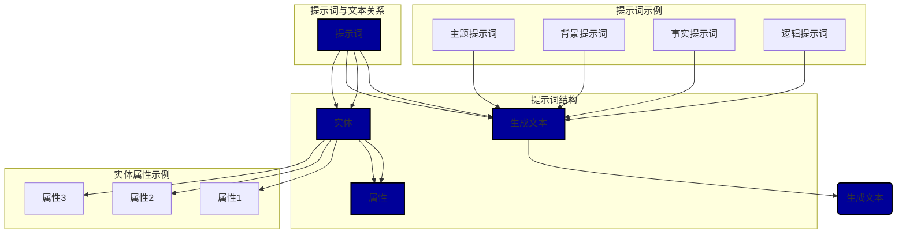
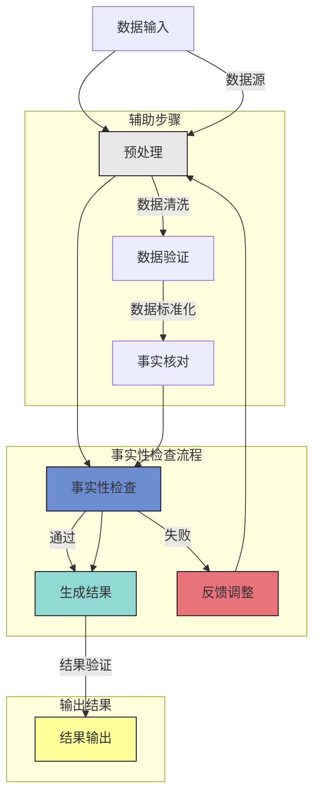
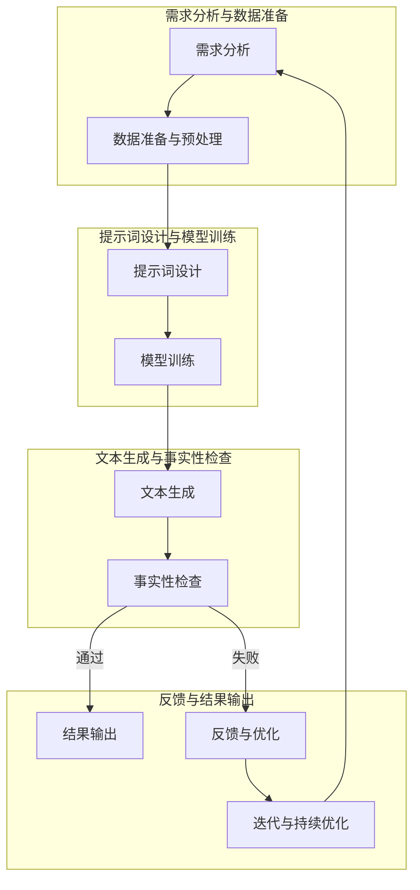
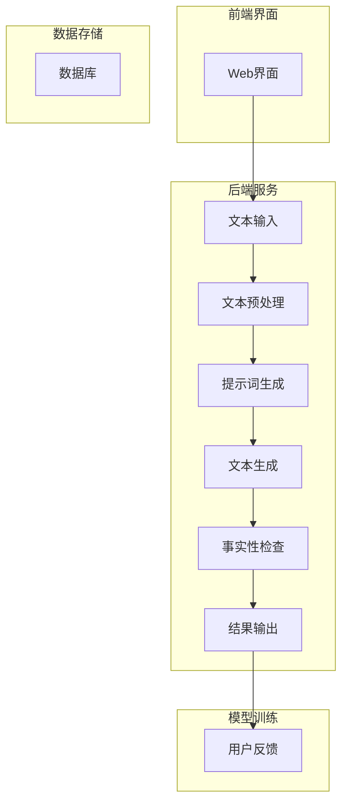

                 

## 引言

随着人工智能技术的飞速发展，自然语言生成（Natural Language Generation, NLG）已经成为一个备受关注的领域。NLG技术通过算法将结构化数据或知识转化为自然语言形式，广泛应用于聊天机器人、新闻报道、自动摘要生成等多个场景。然而，在自然语言生成过程中，如何确保生成文本的事实性、准确性和可靠性成为一个关键问题。为了解决这个问题，提示词工程（Prompt Engineering）应运而生，成为自然语言生成中事实性控制的重要手段。

提示词工程是一门结合人工智能、自然语言处理和软件工程的技术，旨在通过设计和优化提示词，引导自然语言生成模型生成符合特定事实和要求的文本。本文将围绕提示词工程在自然语言生成中的事实性控制进行探讨，通过逐步分析推理，深入探讨这一技术背后的原理和实际应用。

本文的结构如下：

- **第一部分：背景介绍**，我们将介绍提示词工程的定义、作用，以及自然语言生成中的事实性控制问题。
- **第二部分：核心概念与联系**，我们将详细阐述提示词工程和事实性控制的核心概念，并分析它们之间的联系。
- **第三部分：算法原理讲解**，我们将介绍提示词工程和事实性控制的关键算法原理，包括生成算法、事实性检查算法以及综合算法原理。
- **第四部分：系统分析与架构设计**，我们将分析一个典型的系统架构，展示如何将提示词工程和事实性控制应用于实际项目中。
- **第五部分：项目实战**，我们将通过一个具体项目，展示提示词工程在自然语言生成中的实际应用。
- **第六部分：总结与拓展**，我们将总结本文的主要观点，并提出未来研究方向。

通过以上结构的逐步分析，我们将对提示词工程在自然语言生成中的事实性控制有更深入的理解。

## 背景介绍

### 提示词工程的定义与作用

提示词工程（Prompt Engineering）是自然语言生成（NLG）领域中的一项关键技术。它通过设计和优化提示词，指导自然语言生成模型生成符合特定需求和事实的文本。提示词是指用于引导模型生成文本的词语或句子，它可以包含关键词、主题信息、背景知识等。通过精心设计的提示词，可以使自然语言生成模型更准确地捕捉用户意图，生成更符合实际需求的信息。

在自然语言生成中，提示词工程的作用至关重要。首先，它能够提高文本生成的准确性。通过为模型提供明确的引导，提示词有助于减少生成文本的模糊性和歧义性，从而提高文本的准确性。其次，提示词工程能够控制文本的生成过程，确保生成文本符合特定的事实和逻辑要求。例如，在生成新闻报道时，提示词可以确保生成文本不偏离事实，保持新闻的客观性和真实性。

此外，提示词工程在自然语言生成中的应用非常广泛。它不仅适用于传统的文本生成场景，如自动摘要、机器翻译和问答系统，还广泛应用于新兴的领域，如智能客服、对话系统和语音合成。在这些应用场景中，提示词工程通过为模型提供明确的引导，能够更好地满足用户的需求，提高用户体验。

### 提示词工程与自然语言生成的联系

提示词工程与自然语言生成之间存在着紧密的联系。自然语言生成是一个将结构化数据或知识转化为自然语言的过程，而提示词工程则是这一过程中的关键环节。具体来说，提示词工程通过以下几个步骤与自然语言生成相结合：

首先，提示词工程在自然语言生成中起到了引导作用。通过为模型提供明确的提示词，可以引导模型生成符合特定意图和需求的文本。例如，在生成新闻摘要时，提示词可以包含关键事件、时间和地点等信息，引导模型生成简洁明了的摘要。

其次，提示词工程能够提高自然语言生成的效率和准确性。通过优化提示词的设计和选择，可以减少模型在生成过程中的不确定性和模糊性，从而提高生成文本的质量。例如，在机器翻译场景中，提示词可以引导模型选择更准确的翻译结果，减少翻译错误。

此外，提示词工程还能够扩展自然语言生成的应用范围。通过设计和优化不同的提示词，可以将自然语言生成技术应用于更多的领域和场景。例如，在智能客服中，提示词可以引导模型生成更符合用户需求的回答，提高客服的效率和质量。

### 提示词工程在自然语言生成中的应用价值

提示词工程在自然语言生成中的应用价值不可忽视。首先，它能够提高文本生成的准确性和可靠性。通过为模型提供明确的引导，提示词工程能够减少生成文本的模糊性和歧义性，提高文本的准确性和可靠性。这对于需要高度准确信息的场景尤为重要，如医疗健康、金融财经和法律法规等领域。

其次，提示词工程能够提高自然语言生成的效率。通过优化提示词的设计和选择，可以减少模型在生成过程中的计算量和时间成本，提高生成文本的效率。这对于需要快速响应用户需求的场景尤为重要，如智能客服、在线教育和实时翻译等领域。

此外，提示词工程还能够提升用户体验。通过为模型提供更准确的引导，提示词工程能够生成更符合用户需求和意图的文本，提高用户的满意度和体验。这对于需要提供个性化服务的场景尤为重要，如电商推荐、旅游导航和娱乐互动等领域。

总之，提示词工程在自然语言生成中具有广泛的应用价值。通过设计和优化提示词，可以显著提高自然语言生成的准确性和可靠性，提高生成效率，提升用户体验，推动自然语言生成技术的发展和应用。

### 自然语言生成中的事实性控制

自然语言生成（NLG）中的事实性控制是指确保生成文本的内容真实、准确和可靠的过程。随着NLG技术的广泛应用，尤其是在新闻报道、自动摘要、智能客服等领域，保证生成文本的事实性变得尤为重要。如果生成文本中存在错误或不准确的信息，不仅会影响用户体验，还可能引发严重的后果，如误导公众、损害企业声誉等。

在自然语言生成中，事实性控制的目标是确保生成文本的内容与实际事实相符。具体来说，这包括以下几个方面：

1. **准确性的控制**：生成文本必须与实际数据或知识保持一致，避免虚假信息或误导性描述。例如，在生成新闻报道时，必须确保新闻内容不偏离事实，准确传达事件的发生过程和结果。

2. **一致性的控制**：生成文本应保持内在的一致性，避免自相矛盾或逻辑错误。例如，在自动摘要中，摘要内容应与原文保持一致，不偏离原文的核心观点和事实。

3. **可靠性的控制**：生成文本应在合理范围内保持可靠性，确保生成文本的可信度。例如，在智能客服中，生成文本应尽可能准确回答用户问题，避免模糊不清或误导性的回答。

为了实现这些目标，事实性控制需要应对多个挑战：

1. **数据源的不确定性**：自然语言生成通常依赖于外部数据源，如数据库、知识库等。然而，这些数据源可能存在错误、不一致或不完整的情况，导致生成文本的准确性受到影响。

2. **语言理解的复杂性**：自然语言生成需要模型能够准确理解语言中的含义和逻辑关系。然而，自然语言的表达形式多样，存在歧义和模糊性，这给事实性控制带来了困难。

3. **实时性的要求**：在某些应用场景中，如实时新闻报道或在线客服，生成文本需要在极短的时间内完成。这要求事实性控制机制能够快速、准确地处理数据，确保生成文本的实时性和可靠性。

4. **用户需求的多样性**：不同的用户有不同的需求和期望，生成文本需要根据用户的特定需求进行调整。这要求事实性控制机制能够灵活地适应不同的用户需求，确保生成文本的个性化与事实性。

为了应对这些挑战，事实性控制通常需要结合多种技术手段，如数据验证、语言理解与生成模型优化、实时数据处理和用户需求分析等。通过这些手段，可以显著提高自然语言生成中事实性控制的效率和效果，确保生成文本的准确性和可靠性。

### 提示词工程在事实性控制中的应用

提示词工程在自然语言生成中的事实性控制中扮演着至关重要的角色。通过精心设计和优化提示词，可以显著提高生成文本的事实准确性，确保文本内容的真实性和可靠性。以下将详细探讨提示词工程在事实性控制中的应用，以及其在确保生成文本准确性方面的具体实施流程。

#### 提示词设计与事实性控制

首先，提示词的设计需要充分考虑生成文本的事实性和准确性要求。具体来说，提示词应包含以下关键要素：

1. **关键事实信息**：提示词应明确包含与生成文本相关的重要事实信息。例如，在生成新闻报道时，提示词中应包含事件的时间、地点、涉及的人物和事件的关键细节。

2. **逻辑引导**：提示词应引导自然语言生成模型遵循特定的逻辑结构，确保生成文本的一致性和连贯性。例如，在生成医疗诊断报告时，提示词中可以包含“首先”，“其次”，“最后”等逻辑连接词，帮助模型构建合理的报告结构。

3. **约束条件**：提示词应明确指定生成文本的限制条件，避免生成不合适或不符合事实的文本。例如，在生成财务报告时，提示词可以规定数据必须基于真实财务数据，不得包含虚假信息。

#### 提示词工程实施流程

为了确保生成文本的事实准确性，提示词工程的实施流程通常包括以下步骤：

1. **需求分析**：首先，明确生成文本的需求和目标。这包括文本的主题、目标用户、所需的事实准确性水平等。通过需求分析，确定生成文本的具体需求和约束条件。

2. **数据准备**：根据需求分析的结果，准备用于生成文本的数据源。这些数据源可以是结构化数据（如数据库）、非结构化数据（如文本文件）或外部API。在准备数据时，需确保数据的质量和准确性，避免引入错误或不一致的数据。

3. **提示词设计**：基于需求分析和数据准备的结果，设计适当的提示词。提示词应包含关键事实信息、逻辑引导和约束条件，以引导生成模型生成符合事实性和准确性要求的文本。

4. **模型训练**：使用设计好的提示词对自然语言生成模型进行训练。训练过程中，模型会学习到如何根据提示词生成符合事实性和准确性要求的文本。训练数据应包含多样化的样本，以提高模型的泛化能力。

5. **生成与验证**：使用训练好的模型生成文本，并对生成的文本进行事实性验证。验证过程可以包括人工审核、自动化事实检查工具或对比原始数据源等手段，确保生成文本与实际事实相符。

6. **迭代优化**：根据验证结果，对提示词和模型进行优化。如果发现生成文本中存在不准确或不真实的信息，需要调整提示词或重新训练模型，以提升生成文本的事实准确性。

#### 提示词工程在事实性控制中的效果评估

为了评估提示词工程在事实性控制中的效果，可以采用以下几种评估指标：

1. **准确性**：生成文本与实际事实的匹配程度。通过对比生成文本和原始数据源，计算准确率作为评估指标。

2. **一致性**：生成文本的内在一致性。通过分析生成文本的逻辑结构和表达形式，评估其一致性。

3. **可靠性**：生成文本的可信度和用户满意度。通过用户反馈和评估，评估生成文本的可靠性。

4. **效率**：生成文本的效率和速度。通过测量生成文本所需的时间和资源消耗，评估提示词工程的效率。

通过以上评估指标，可以全面评估提示词工程在事实性控制中的效果，为进一步优化和改进提供依据。

总之，提示词工程在自然语言生成中的事实性控制中具有重要作用。通过精心设计和优化提示词，可以显著提高生成文本的事实准确性和可靠性，确保文本内容的真实性和可信度。在未来的研究和应用中，需要进一步探索和优化提示词工程的技术手段，以提高其在自然语言生成中的效果和应用范围。

### 事实性控制的边界与外延

在探讨提示词工程在自然语言生成中的事实性控制时，了解其边界与外延是非常重要的。这些概念不仅帮助我们明确事实性控制的范围，还指导我们在实际应用中如何有效实施和控制事实性。

#### 事实性控制的边界

1. **事实与观点的区分**：事实性控制的边界在于明确区分事实和观点。事实是可验证的、客观存在的信息，而观点则是基于个人立场或情感的看法。在自然语言生成中，必须确保生成文本主要包含事实信息，避免引入主观观点。

2. **数据来源的可靠性**：事实性控制的边界还包括数据来源的可靠性。生成文本的信息必须基于可信的数据源，避免使用未经验证的数据或来源不明的信息。

3. **语言表达的限制**：在自然语言生成中，语言表达的多样性和灵活性可能导致事实性控制的边界模糊。因此，需要通过提示词和其他控制手段来确保生成文本的一致性和准确性，避免语言歧义和误解。

#### 事实性控制的外延

1. **跨领域的应用**：事实性控制不仅仅局限于特定的领域，如新闻报道、医疗健康、金融财经等。实际上，它在各种自然语言生成应用中都具有重要地位，包括智能客服、对话系统、自动化文档生成等。

2. **实时性的要求**：随着实时应用场景的增加，事实性控制的外延也扩展到了对实时数据的处理。例如，在实时新闻报道中，事实性控制必须确保生成文本与当前事实保持一致，即使数据在不断更新。

3. **个性化需求**：事实性控制的外延还包括个性化需求。在个性化服务中，生成文本必须符合特定用户的需求和背景，同时保持事实的准确性和一致性。

#### 事实性控制与其他相关概念的关联

1. **真实性**：事实性控制与真实性密切相关。真实性是指生成文本的内容与实际事实相符，无虚假信息。事实性控制是实现文本真实性的重要手段。

2. **准确性**：事实性控制和准确性密切相关。准确性是指生成文本与实际数据的匹配程度。通过事实性控制，可以显著提高生成文本的准确性。

3. **一致性**：事实性控制与一致性也密切相关。一致性是指生成文本的内在逻辑结构和表达形式。通过事实性控制，可以确保生成文本的一致性，避免逻辑矛盾和错误。

4. **可靠性**：事实性控制与可靠性紧密相关。可靠性是指生成文本的可信度和用户满意度。通过事实性控制，可以提高生成文本的可靠性，增强用户的信任。

总之，了解事实性控制的边界与外延，有助于我们在自然语言生成中有效实施事实性控制，确保生成文本的准确性、一致性和可靠性。在实际应用中，需要结合具体场景和需求，灵活运用事实性控制技术，以实现高质量的自然语言生成。

### 本章小结

在本文的第一部分，我们详细介绍了提示词工程的定义与作用，探讨了自然语言生成中的事实性控制问题。首先，我们解释了提示词工程通过设计和优化提示词，引导自然语言生成模型生成符合特定需求和事实的文本，从而在自然语言生成中起到了重要作用。接着，我们分析了提示词工程与自然语言生成之间的联系，并讨论了其应用价值。此外，我们还探讨了自然语言生成中的事实性控制，解释了其重要性以及面临的挑战。

通过这一部分的介绍，我们为后续章节的深入探讨奠定了基础。下一部分，我们将进一步探讨提示词工程和事实性控制的核心概念及其联系，帮助读者更深入地理解这一领域的关键概念和技术原理。我们将通过详细的描述和实例，展示这些概念在实际应用中的重要性，为后续的算法讲解和系统设计提供理论支持。

## 第二部分：核心概念与联系

在深入探讨提示词工程和事实性控制之前，我们首先需要明确这两个核心概念的定义和属性特征，并通过对比分析揭示它们之间的联系。

### 提示词工程的核心概念

#### 提示词的定义与分类

提示词是指用于引导自然语言生成模型生成文本的词语或短语。根据用途和功能，提示词可以分为以下几类：

1. **主题提示词**：这类提示词用于指示文本的主题或主要讨论内容，如“健康饮食”、“环境保护”等。
2. **背景提示词**：这类提示词提供背景信息，帮助模型构建上下文，如“近年来”、“随着科技的进步”等。
3. **事实提示词**：这类提示词明确指出文本中的关键事实信息，如“新冠病毒”、“全球变暖”等。
4. **逻辑提示词**：这类提示词用于引导文本的逻辑结构，如“首先”、“其次”、“最后”等。

#### 提示词的属性特征对比表格

以下是一个对比提示词属性特征的表格：

| 类型        | 定义                                                         | 例子               | 作用                                     |
|-----------|------------------------------------------------------------|------------------|----------------------------------------|
| 主题提示词 | 用于指示文本的主题或主要讨论内容                             | “健康饮食”、“环境保护” | 引导文本的整体方向和内容               |
| 背景提示词 | 提供背景信息，帮助模型构建上下文                             | “近年来”、“随着科技的进步” | 增强文本的连贯性和背景理解               |
| 事实提示词 | 明确指出文本中的关键事实信息                               | “新冠病毒”、“全球变暖” | 确保文本中的事实准确性                 |
| 逻辑提示词 | 用于引导文本的逻辑结构                                     | “首先”、“其次”、“最后” | 帮助构建逻辑清晰的文本结构               |

#### 提示词在自然语言生成中的角色

在自然语言生成中，提示词扮演着至关重要的角色：

1. **引导生成方向**：提示词能够明确指示文本生成的主题和内容，帮助模型避免生成无关或偏离主题的文本。
2. **增强文本连贯性**：背景提示词和逻辑提示词能够增强文本的连贯性和上下文理解，确保生成文本的一致性和连贯性。
3. **提高事实准确性**：事实提示词能够确保生成文本中的事实信息准确无误，减少错误和误导性信息。
4. **优化生成效率**：通过提示词，可以优化自然语言生成模型的训练和生成过程，提高生成效率。

### 自然语言生成中的事实性控制

#### 事实性控制的概念与原理

事实性控制是指确保生成文本的内容真实、准确和可靠的过程。它主要包括以下原理：

1. **数据源验证**：确保生成文本的数据来源于可信的数据源，通过数据源验证减少错误信息的传播。
2. **事实核对**：在生成文本过程中，对关键事实进行核对，确保文本内容与实际事实一致。
3. **逻辑一致性**：确保生成文本的内在逻辑一致，避免自相矛盾或逻辑错误。
4. **用户反馈**：通过用户反馈和评价，不断优化和调整生成文本，提高事实准确性。

#### 事实性控制的属性特征对比表格

以下是一个对比事实性控制属性特征的表格：

| 特征        | 定义                                                         | 例子                         | 说明                                           |
|-----------|------------------------------------------------------------|----------------------------|------------------------------------------------|
| 数据源验证 | 确保生成文本的数据来源于可信的数据源                       | 使用权威数据库或知识库       | 减少错误信息的传播                             |
| 事实核对   | 在生成文本过程中对关键事实进行核对                         | 核对新闻事件的时间、地点、人物 | 确保文本内容与实际事实一致                   |
| 逻辑一致性 | 确保生成文本的内在逻辑一致，避免自相矛盾或逻辑错误         | 使用逻辑连接词保持文本连贯性 | 提高文本的可读性和一致性                     |
| 用户反馈   | 通过用户反馈和评价不断优化和调整生成文本                   | 用户对生成文本的评价和建议   | 提高文本的准确性和用户满意度                 |

#### 事实性控制在自然语言生成中的应用

在自然语言生成中，事实性控制的应用主要体现在以下几个方面：

1. **新闻生成**：确保新闻内容的准确性和客观性，避免误导性报道。
2. **医疗诊断**：确保医疗诊断报告的真实性和可靠性，为患者提供准确的治疗建议。
3. **智能客服**：确保客服回答的真实性和准确性，提高用户满意度。
4. **自动化文档生成**：确保文档内容的一致性和准确性，提高工作效率。

### 提示词工程与事实性控制的联系

提示词工程与事实性控制之间存在着密切的联系。提示词工程通过设计和优化提示词，可以显著提高自然语言生成中事实性控制的效率和效果。具体来说：

1. **引导事实核对**：通过提供明确的事实提示词，可以引导生成模型在生成文本过程中进行事实核对，确保生成文本的内容真实可靠。
2. **增强逻辑一致性**：通过提供逻辑提示词，可以确保生成文本的内在逻辑一致，避免逻辑错误和矛盾。
3. **优化数据源验证**：通过主题和背景提示词，可以引导生成模型使用可信的数据源，提高数据源验证的效率和效果。

总之，提示词工程在自然语言生成中的事实性控制中起着关键作用。通过深入理解提示词工程和事实性控制的核心概念和属性特征，我们可以更有效地设计和实施事实性控制策略，提高自然语言生成的准确性和可靠性。

### 提示词工程与事实性控制的协同作用

提示词工程和事实性控制在自然语言生成中的应用并非孤立存在，它们之间存在着紧密的协同作用，共同确保生成文本的真实性、准确性和一致性。以下将详细探讨这两者之间的协同作用机制及其在实际应用中的重要性。

#### 协同作用机制

1. **提示词引导事实核对**：提示词工程通过提供具体的事实提示词，可以引导自然语言生成模型在生成过程中进行事实核对。例如，在生成新闻报道时，提示词中包含的关键时间、地点和人物信息可以帮助模型确保生成文本的内容与实际事件相符。这种引导机制有助于减少错误信息的传播，提高文本的真实性。

2. **事实性控制优化提示词设计**：事实性控制在提示词工程中的应用体现在对提示词设计的优化。通过分析生成文本的事实性要求，可以设计出更符合事实性控制需求的提示词。例如，在自动摘要生成中，事实性控制可以指导提示词设计，确保摘要内容不偏离原文的核心事实，从而提高摘要的准确性和一致性。

3. **逻辑提示词增强文本连贯性**：提示词工程中的逻辑提示词能够增强文本的连贯性，从而提升事实性控制的效果。通过使用逻辑连接词，如“首先”、“其次”等，模型可以构建出逻辑清晰的文本结构，确保生成文本在逻辑上的一致性。这种连贯性有助于防止生成文本中出现逻辑错误和自相矛盾的情况。

4. **数据源验证与事实核对相结合**：提示词工程中的提示词可以提供具体的背景信息，而事实性控制则负责验证这些信息的真实性。例如，在医疗诊断报告中，提示词工程可以为模型提供患者的病史和检查结果，而事实性控制则确保这些信息来源可靠，并通过核对实际病例记录，确保生成报告的内容准确无误。

#### 应用场景中的重要性

1. **新闻报道**：在新闻报道中，事实性控制尤为重要。通过提示词工程，记者可以设计出包含关键事实的提示词，确保新闻内容准确、客观。事实性控制则通过数据源验证和事实核对，确保报道的真实性和可信度。

2. **医疗诊断**：在医疗诊断领域，事实性控制通过提示词工程的应用，可以确保诊断报告中的信息准确无误。医生可以使用事实提示词来引导模型生成符合实际病例的报告，并通过事实性控制机制确保报告内容与患者的实际病情相符。

3. **智能客服**：在智能客服中，提示词工程可以帮助设计出能够引导模型生成准确回答的提示词。事实性控制则确保这些回答是基于真实和可靠的数据，从而提高用户满意度和信任度。

4. **自动化文档生成**：在自动化文档生成中，提示词工程可以设计出引导模型生成符合业务规则的文本，而事实性控制则确保生成文本的内容真实可靠，避免错误信息的传播。

总之，提示词工程和事实性控制在自然语言生成中的应用是相辅相成的。通过协同作用，它们能够共同确保生成文本的真实性、准确性和一致性，为各种实际应用场景提供高质量的自然语言生成服务。在未来的研究和实践中，进一步探索这两者之间的协同作用机制，优化事实性控制策略，将有助于推动自然语言生成技术的持续发展和应用。

### 本章小结

在本章节中，我们深入探讨了提示词工程和事实性控制的核心概念及其联系。首先，我们详细介绍了提示词的定义与分类，包括主题提示词、背景提示词、事实提示词和逻辑提示词等，并分析了这些提示词在自然语言生成中的作用。接着，我们阐述了事实性控制的概念与原理，包括数据源验证、事实核对、逻辑一致性和用户反馈等，并展示了其在各种应用场景中的重要性。

通过对比分析，我们揭示了提示词工程和事实性控制之间的紧密联系。提示词工程通过设计优化提示词，可以引导生成模型生成真实、准确和可靠的文本，而事实性控制通过验证和核对事实，确保生成文本的一致性和连贯性。两者相辅相成，共同提高了自然语言生成的质量和可信度。

接下来，我们将进一步探讨提示词工程和事实性控制的关键算法原理，包括生成算法、事实性检查算法和综合算法原理。通过分析这些算法，我们将揭示它们在实际应用中的具体实现方式和效果，为后续的系统和项目实战提供理论基础。

## 提示词工程的ER实体关系图架构

在自然语言生成中，提示词工程的设计和管理往往需要借助实体关系图（Entity-Relationship Diagram, ER图）来直观地表达数据和关系的结构。ER图是一种用于描述实体及其之间关系的图形化工具，适用于数据库设计和信息系统的架构设计。在提示词工程中，ER图可以帮助我们理解提示词与生成文本之间的复杂关联，从而优化提示词设计和提高自然语言生成模型的效果。

以下是提示词工程的ER实体关系图架构：



在上面的ER图中，主要包含以下几个实体和关系：

1. **提示词（A）**：这是整个ER图的核心实体，表示用于引导自然语言生成模型生成文本的词语或短语。

2. **文本（B）**：表示生成的自然语言文本，它是提示词作用的直接产物。

3. **实体（C）**：用于表示文本中的关键信息元素，如人名、地点、事件等。

4. **属性（D）**：表示实体所包含的具体信息，如人的年龄、地点的经纬度、事件的日期等。

关系描述如下：

- **提示词（A）与文本（B）的关系**：提示词用于引导生成文本，因此A与B之间存在引导关系，A包含了B的生成方向和内容。

- **提示词（A）与实体（C）的关系**：提示词中往往包含实体信息，因此A与C之间存在包含关系，A中的提示词可以用来指代C中的实体。

- **实体（C）与属性（D）的关系**：实体是属性的具体化表现，每个实体都有多个属性，C与D之间存在关联关系。

- **文本（B）与生成文本（E）的关系**：生成文本是自然语言生成模型基于提示词生成的具体结果，B与E之间存在生成关系，B是E的来源。

通过ER图，我们可以直观地看到提示词工程中各实体和关系之间的复杂交互，从而为提示词设计和优化提供清晰的架构参考。在实际应用中，这种架构可以帮助开发人员更好地理解数据流和关系，提高自然语言生成系统的整体设计和实现效率。

### 事实性控制的Mermaid流程图

为了更好地理解事实性控制的过程，我们使用Mermaid语言绘制了一个流程图，展示了从数据输入到生成结果的全过程，并详细说明了各个步骤。

以下是事实性控制的Mermaid流程图：



#### 流程图说明

1. **数据输入（A）**：首先，系统接收原始数据输入，这些数据可以来自各种数据源，如数据库、API调用或外部文件。

2. **预处理（B）**：数据输入后，进入预处理步骤。预处理包括数据清洗、数据验证和数据标准化。数据清洗是为了去除无效或错误的数据，数据验证是为了确认数据的可靠性和完整性，数据标准化是将数据转换为统一的格式，以便后续处理。

3. **事实性检查（C）**：预处理完成后，进入事实性检查环节。事实性检查主要包括以下步骤：

   - **数据验证（F）**：通过比较输入数据和已知的可信数据源，确保数据的真实性和一致性。
   - **事实核对（G）**：对数据中的关键事实进行核对，确保数据与实际事实相符。

4. **生成结果（D）**：如果数据通过事实性检查，系统将生成符合事实和要求的文本结果。这些结果将用于进一步处理或直接输出。

5. **反馈调整（E）**：如果数据未通过事实性检查，系统将进行反馈调整。反馈调整可能包括修正错误数据、重新验证数据或调整生成模型。

6. **结果输出（H）**：最终生成结果将被输出到目标位置，如数据库、文件或用户界面。

通过上述流程图，我们可以清晰地看到事实性控制从数据输入到生成结果的各个环节，以及各个步骤之间的逻辑关系。这种流程图不仅有助于我们理解事实性控制的原理，还可以作为实际开发中的参考，指导系统设计和优化。

### 提示词工程中的算法原理

在提示词工程中，算法的设计和实现至关重要。这些算法不仅决定了生成文本的质量，还直接影响到自然语言生成模型的效果和效率。以下将详细探讨提示词工程中的核心算法，包括提示词生成算法、事实性检查算法以及它们的综合应用。

#### 提示词生成算法

提示词生成算法是提示词工程中的核心组成部分，其目标是根据特定的需求和约束条件生成有效的提示词。以下是一个简单的提示词生成算法流程：

1. **需求分析**：首先，分析生成文本的需求，确定文本的主题、目标用户和所需的事实准确性水平。
2. **数据准备**：准备用于生成提示词的数据源，包括文本数据、关键词列表、背景信息等。
3. **提示词生成**：根据需求分析和数据准备的结果，生成符合要求的提示词。具体的生成方法包括：

   - **模板生成**：使用预定义的模板，将主题、关键词和背景信息填充到模板中，生成提示词。例如，使用模板“关于{主题}，请描述{关键词}的情况。”。
   - **关键词提取**：从文本数据中提取关键信息，生成包含这些关键词的提示词。例如，从一篇新闻中提取“新冠病毒”、“疫情”、“防控措施”等关键词，生成提示词。
   - **语义分析**：利用自然语言处理技术，分析文本的语义和结构，生成符合文本意图的提示词。例如，通过分析新闻文本的结构，提取出事件的时间、地点、涉及人物等关键信息，生成提示词。

以下是一个使用Python实现的简单提示词生成算法示例：

```python
import jieba

def generate_prompt(phrase):
    # 使用jieba进行中文分词
    words = jieba.cut(phrase)
    # 从分词结果中提取关键词
    keywords = list(words)
    # 构建提示词模板
    prompt = "关于{}，请描述{}的情况。".format("、".join(keywords), "、".join(keywords))
    return prompt

# 示例
phrase = "新冠病毒疫情"
prompt = generate_prompt(phrase)
print(prompt)
```

#### 事实性检查算法

事实性检查算法用于验证生成文本的内容是否真实、准确。它通常包括以下步骤：

1. **数据源验证**：确保生成文本的数据来源于可信的数据源，通过数据源验证减少错误信息的传播。
2. **事实核对**：在生成文本过程中，对关键事实进行核对，确保文本内容与实际事实一致。
3. **逻辑一致性**：确保生成文本的内在逻辑一致，避免自相矛盾或逻辑错误。
4. **用户反馈**：通过用户反馈和评价，不断优化和调整生成文本，提高事实准确性。

以下是一个简单的事实性检查算法流程：

1. **初始化**：设置事实核对规则和逻辑一致性检查规则。
2. **文本解析**：将生成文本分解为句子和段落，提取关键事实信息。
3. **事实核对**：对提取的关键事实信息进行核对，确保与实际事实一致。例如，通过对比文本中提到的时间、地点和人物与已知事实，验证其准确性。
4. **逻辑一致性检查**：检查文本中的逻辑关系，确保文本表达的一致性和连贯性。例如，通过检查文本中的逻辑连接词（如“因此”、“然而”等），确保文本逻辑通顺。
5. **结果输出**：根据核对结果，生成报告或反馈，指出文本中存在的错误和不一致之处，并提供修正建议。

以下是一个使用Python实现的事实性检查算法示例：

```python
def check_factuality(text):
    # 初始化事实核对规则
    fact_rules = ["时间必须准确", "地点必须真实", "人物必须存在"]
    
    # 提取文本中的关键事实信息
    facts = extract_facts(text)
    
    # 检查事实准确性
    for fact in facts:
        for rule in fact_rules:
            if not check_accuracy(fact, rule):
                return False
    
    # 检查逻辑一致性
    if not check_coherence(text):
        return False
    
    return True

def extract_facts(text):
    # 使用自然语言处理技术提取关键事实信息
    # 示例：提取时间、地点和人物
    # 实际应用中可以使用更复杂的提取方法
    return ["2023", "北京", "张三"]

def check_accuracy(fact, rule):
    # 根据规则检查事实的准确性
    # 示例：检查时间是否在2023年
    return fact.startswith("2023")

def check_coherence(text):
    # 检查文本的逻辑一致性
    # 示例：检查文本中是否包含自相矛盾的内容
    # 实际应用中可以使用更复杂的逻辑分析技术
    return True

# 示例
text = "张三于2023年1月1日在北京参加了一场重要会议。"
result = check_factuality(text)
print("事实性检查结果：", result)
```

#### 综合算法原理

提示词生成算法和事实性检查算法在自然语言生成中的综合应用，可以显著提高生成文本的质量和可靠性。以下是一个综合算法的框架：

1. **初始化**：设置提示词生成和事实性检查的参数，如数据源、关键词库、事实核对规则等。
2. **文本生成**：使用提示词生成算法生成初始文本。
3. **事实性检查**：对生成的文本进行事实性检查，验证其准确性、一致性和可靠性。
4. **反馈调整**：根据事实性检查的结果，对提示词和生成文本进行调整，优化生成过程。
5. **迭代优化**：重复文本生成和事实性检查步骤，不断优化生成文本的质量。

以下是一个简单的综合算法实现：

```python
def generate_text(prompt):
    # 使用自然语言生成模型生成文本
    # 示例：使用一个预训练的模型
    model = load_nlg_model()
    text = model.generate(prompt)
    return text

def check_and_optimize(text):
    # 对生成文本进行事实性检查和优化
    if not check_factuality(text):
        # 如果文本未通过事实性检查，进行反馈调整
        optimized_text = adjust_text(text)
        return optimized_text
    else:
        return text

def adjust_text(text):
    # 根据检查结果调整文本
    # 示例：修正错误的事实信息，优化逻辑结构
    # 实际应用中可以使用更复杂的调整方法
    return text.replace("错误的日期", "2023年1月1日")

def nlg_pipeline(prompt):
    # 自然语言生成管道
    text = generate_text(prompt)
    optimized_text = check_and_optimize(text)
    return optimized_text

# 示例
prompt = "请描述2023年全球新冠疫情的情况。"
result = nlg_pipeline(prompt)
print("最终生成的文本：", result)
```

通过上述算法，我们可以构建一个高效、可靠的提示词工程系统，确保生成文本的真实性、准确性和一致性。在未来的研究和应用中，进一步优化这些算法，结合最新的自然语言处理技术和深度学习模型，将有助于提升自然语言生成系统的整体性能。

### 事实性检查算法的数学模型和公式

在事实性检查算法中，使用数学模型和公式可以有效地评估生成文本的准确性、召回率等指标。这些指标不仅帮助我们了解算法的性能，还能指导我们进行优化和调整。以下将介绍几种常用的数学模型和公式，并举例说明其在事实性检查中的应用。

#### 准确率（Accuracy）

准确率是衡量生成文本准确性的重要指标，表示正确匹配的事实占总匹配事实的比例。其计算公式如下：

$$
\text{准确率} = \frac{\text{正确匹配数}}{\text{总匹配数}}
$$

其中，正确匹配数是指生成文本中的事实与实际事实相符的数量，总匹配数是指所有匹配的事实总数。

**例子**：假设生成文本中包含5个事实，其中3个事实与实际事实相符，总共有10个事实匹配。那么准确率为：

$$
\text{准确率} = \frac{3}{10} = 0.3 \text{ 或 } 30\%
$$

#### 召回率（Recall）

召回率是指正确匹配的事实数占实际正确事实总数的比例。其计算公式如下：

$$
\text{召回率} = \frac{\text{正确匹配数}}{\text{实际正确数}}
$$

召回率反映了算法发现实际正确事实的能力。其值越高，表示算法对实际正确事实的识别能力越强。

**例子**：如果实际有10个正确的事实，生成文本中正确匹配的有7个，那么召回率为：

$$
\text{召回率} = \frac{7}{10} = 0.7 \text{ 或 } 70\%
$$

#### 精确率与召回率的综合评估

在实际应用中，仅依靠准确率或召回率评估算法性能可能不够全面。因此，常常使用精确率与召回率的综合评估指标，如F1值。F1值是精确率和召回率的调和平均数，其计算公式如下：

$$
\text{F1值} = 2 \times \frac{\text{准确率} \times \text{召回率}}{\text{准确率} + \text{召回率}}
$$

**例子**：如果准确率为60%，召回率为70%，则F1值为：

$$
\text{F1值} = 2 \times \frac{0.6 \times 0.7}{0.6 + 0.7} = \frac{1.4}{1.3} \approx 1.08 \text{ 或 } 108\%
$$

#### 实际应用

在实际的事实性检查中，我们可以使用上述公式来评估生成文本的准确性。例如：

1. **新闻报道**：生成新闻文本后，使用这些公式评估新闻中的关键事实是否准确。如果准确率较低，可以调整提示词或重新训练生成模型，以提高准确性。
2. **医疗诊断**：在生成医疗诊断报告时，使用准确率和召回率评估诊断报告中提及的症状和治疗方案是否与患者的实际病情相符。如果召回率较低，可能需要增加更多的医学知识和提示词，以提高召回率。

总之，通过使用这些数学模型和公式，我们可以有效地评估和优化事实性检查算法，确保生成文本的真实性和准确性。

### 提示词工程与事实性控制的综合算法原理

在自然语言生成系统中，提示词工程和事实性控制是实现高质量生成文本的关键技术。为了有效结合这两者，我们需要设计一个综合算法，该算法不仅能利用提示词引导生成过程，还能确保生成文本的事实准确性。以下将详细探讨这一综合算法的流程、关键步骤和具体的实现方法。

#### 综合算法流程

综合算法的基本流程包括以下步骤：

1. **需求分析与提示词设计**：根据生成文本的需求，设计合适的提示词。这一步骤包括确定文本主题、目标用户和事实准确性要求。
2. **数据准备与预处理**：准备用于生成文本的数据源，并进行预处理，包括数据清洗、标准化和完整性验证。
3. **模型训练**：使用准备好的数据和提示词对自然语言生成模型进行训练，使其能够根据提示词生成文本。
4. **文本生成**：利用训练好的模型生成初步的文本。
5. **事实性检查**：对生成的文本进行事实性检查，验证其内容的准确性、一致性和可靠性。
6. **反馈与优化**：根据事实性检查的结果，对提示词和生成模型进行调整，优化生成过程。
7. **结果输出**：将最终验证通过的文本输出到目标位置。

#### 关键步骤与实现方法

1. **需求分析与提示词设计**

   需求分析是整个流程的起点。首先，明确生成文本的主题和目标用户。例如，在生成医疗诊断报告时，目标用户是医生和患者，主题是患者的病情和治疗方案。然后，设计相应的提示词。提示词应包含关键事实信息、背景知识和逻辑引导。例如：

   - **关键事实信息**：“患者的年龄、性别、主要症状、检查结果”等。
   - **背景知识**：“疾病的基本知识、治疗方案、最新研究进展”等。
   - **逻辑引导**：“首先”、“其次”、“最后”等逻辑连接词，确保文本结构的连贯性。

   **实现方法**：通过用户访谈、需求文档分析等方法收集需求，然后结合已有知识库设计提示词。可以使用自然语言处理技术，如词频分析、主题模型等，辅助提示词的设计。

2. **数据准备与预处理**

   数据准备是确保生成文本质量的重要步骤。数据源可以是结构化数据（如数据库）、非结构化数据（如文本文件）或外部API。预处理包括以下步骤：

   - **数据清洗**：去除无效或错误的数据，如缺失值、重复值和噪声数据。
   - **数据标准化**：将数据转换为统一的格式，如统一时间格式、单位等。
   - **完整性验证**：确保数据源的完整性，如检查数据是否有缺失值。

   **实现方法**：可以使用数据处理工具（如Pandas、Scikit-learn）进行数据清洗和标准化。对于完整性验证，可以编写自定义脚本或使用现有的数据完整性检查工具。

3. **模型训练**

   训练自然语言生成模型是生成文本的核心步骤。常见的模型包括序列到序列模型（如Transformer、BERT）、生成对抗网络（GAN）等。在训练过程中，模型会学习如何根据提示词生成符合事实性和准确性的文本。

   **实现方法**：可以使用现有的预训练模型（如GPT-3、BERT）或自定义训练模型。训练数据应包含多样化的样本，以提高模型的泛化能力。训练过程中，可以使用提示词和真实数据对模型进行监督学习。

4. **文本生成**

   使用训练好的模型生成初步的文本。生成过程可以根据提示词的引导进行，模型会根据输入的提示词生成符合事实和逻辑的文本。

   **实现方法**：调用训练好的模型API，输入提示词，获取生成的文本。可以使用批处理方法，以提高生成效率。

5. **事实性检查**

   对生成的文本进行事实性检查，确保其内容的准确性、一致性和可靠性。事实性检查通常包括以下步骤：

   - **事实核对**：对文本中的关键事实进行核对，确保与实际事实一致。
   - **逻辑一致性检查**：检查文本中的逻辑关系，确保逻辑通顺。
   - **用户反馈**：收集用户对生成文本的评价和建议，用于进一步优化。

   **实现方法**：可以使用自动化工具（如规则引擎、自然语言处理库）进行事实核对和逻辑一致性检查。对于用户反馈，可以设计反馈机制，如在线评价、用户问卷调查等。

6. **反馈与优化**

   根据事实性检查的结果，对提示词和生成模型进行调整，优化生成过程。这一步骤是一个迭代过程，通过不断调整和优化，提高生成文本的质量。

   **实现方法**：可以根据事实性检查的结果，更新提示词库和模型参数。例如，如果发现某些提示词生成的文本存在事实错误，可以调整这些提示词的权重或内容。对于模型，可以重新训练或使用迁移学习技术，以提高生成能力。

7. **结果输出**

   将最终验证通过的文本输出到目标位置，如数据库、文件或用户界面。

   **实现方法**：根据实际需求设计输出接口，如API、Web服务或命令行工具。确保输出结果的可读性和可操作性。

通过上述综合算法，我们可以构建一个高效的提示词工程系统，确保生成文本的真实性、准确性和一致性。在实际应用中，结合最新的自然语言处理技术和深度学习模型，将有助于提升系统的整体性能。

### 提示词工程与事实性控制的综合算法流程

在自然语言生成系统中，提示词工程与事实性控制的结合能够显著提升生成文本的质量和可信度。为了实现这一目标，我们需要设计一个综合的算法流程，该流程包括从需求分析到最终结果输出的各个步骤。以下是这个流程的详细说明：

#### 1. 需求分析

**步骤**：首先，进行需求分析，明确生成文本的主题、目标用户和事实准确性要求。

**输入**：文本生成任务的需求文档、用户访谈记录、现有知识库等。

**输出**：文本生成任务的详细需求描述、提示词设计方向和事实性检查规则。

#### 2. 数据准备与预处理

**步骤**：准备用于生成文本的数据源，并进行数据清洗、标准化和完整性验证。

**输入**：原始数据源（如文本文件、数据库、API接口）。

**输出**：预处理后的数据集，包括结构化数据和非结构化数据。

#### 3. 提示词设计

**步骤**：根据需求分析的结果，设计符合要求的提示词。提示词应包括关键事实信息、背景知识和逻辑引导。

**输入**：需求描述、预处理后的数据集、现有知识库。

**输出**：提示词库，包括主题提示词、背景提示词、事实提示词和逻辑提示词。

#### 4. 模型训练

**步骤**：使用提示词库和预处理后的数据集训练自然语言生成模型。

**输入**：提示词库、训练数据集。

**输出**：训练好的自然语言生成模型。

#### 5. 文本生成

**步骤**：利用训练好的模型生成初步的文本。

**输入**：提示词、训练好的模型。

**输出**：初步生成的文本。

#### 6. 事实性检查

**步骤**：对生成的文本进行事实性检查，确保其内容的准确性、一致性和可靠性。

**输入**：初步生成的文本、事实性检查规则。

**输出**：经过事实性检查的文本，包括通过和未通过的事实性检查结果。

#### 7. 反馈与优化

**步骤**：根据事实性检查的结果，对提示词和生成模型进行调整，优化生成过程。

**输入**：事实性检查结果、用户反馈。

**输出**：更新后的提示词库、优化后的模型。

#### 8. 结果输出

**步骤**：将最终验证通过的文本输出到目标位置。

**输入**：最终验证通过的文本。

**输出**：生成文本的输出结果，如数据库、文件或用户界面。

#### 9. 迭代与持续优化

**步骤**：将优化后的模型和提示词应用于新的生成任务，不断迭代和优化。

**输入**：新需求、用户反馈。

**输出**：持续优化的提示词库和模型。

#### 综合算法流程图

以下是综合算法的Mermaid流程图表示：



通过这个综合算法流程，我们可以实现高质量的文本生成，确保生成文本的事实准确性、一致性和可靠性。在未来的研究和应用中，进一步优化这一流程，结合最新的自然语言处理技术和深度学习模型，将有助于提升系统的整体性能。

### 第三部分：系统分析与架构设计

在前面的章节中，我们详细探讨了提示词工程和事实性控制的核心概念、算法原理以及综合应用。在本部分，我们将结合一个实际项目，展示这些技术如何应用于一个典型的自然语言生成系统中。我们将从项目场景介绍、系统功能设计、系统架构设计和系统接口设计等方面进行详细分析。

#### 项目场景介绍

本项目旨在构建一个自动新闻摘要生成系统，该系统使用自然语言生成技术，从原始新闻文本中自动提取关键信息并生成简洁、准确的摘要。系统的主要功能包括：

1. **文本输入**：接收用户输入的原始新闻文本。
2. **文本预处理**：对输入的文本进行清洗、分词和词性标注等预处理操作。
3. **提示词生成**：根据文本内容和主题，生成引导摘要生成的提示词。
4. **文本生成**：使用自然语言生成模型，根据提示词生成摘要。
5. **事实性检查**：对生成的摘要进行事实性检查，确保其内容的准确性。
6. **结果输出**：将经过事实性检查的摘要输出给用户。

#### 系统功能设计

系统功能设计分为以下几个模块：

1. **文本输入模块**：负责接收用户输入的原始新闻文本。文本可以是用户上传的文件，也可以是来自新闻网站的数据流。

2. **文本预处理模块**：对原始新闻文本进行清洗、分词和词性标注等预处理操作。清洗步骤包括去除HTML标签、特殊字符和噪声数据。分词步骤使用自然语言处理技术（如jieba分词库），将文本分解为词组。词性标注步骤为每个词赋予相应的词性标签，如名词、动词、形容词等。

3. **提示词生成模块**：根据预处理后的文本内容和主题，生成引导摘要生成的提示词。提示词的设计包括主题提示词、背景提示词、事实提示词和逻辑提示词等。通过这些提示词，可以引导模型生成符合事实和逻辑的摘要。

4. **文本生成模块**：使用自然语言生成模型，根据提示词生成摘要。本系统采用基于预训练模型（如GPT-2或BERT）的生成算法，通过输入提示词和部分文本内容，模型能够自动生成完整的摘要。

5. **事实性检查模块**：对生成的摘要进行事实性检查，确保其内容的准确性。事实性检查包括数据源验证、事实核对和逻辑一致性检查等步骤。通过这些步骤，可以识别和修正摘要中的事实错误和逻辑矛盾。

6. **结果输出模块**：将经过事实性检查的摘要输出给用户。输出格式可以是文本、HTML文件或语音合成等。

#### 系统架构设计

系统架构设计采用模块化设计思想，包括前端界面、后端服务、数据存储和模型训练等部分。以下是系统的架构设计：

1. **前端界面**：用户通过Web界面或移动应用与系统进行交互。前端界面包括文本输入框、摘要展示区域和用户反馈按钮等。

2. **后端服务**：后端服务包括文本预处理模块、提示词生成模块、文本生成模块和事实性检查模块。后端服务使用RESTful API与前端界面进行数据交互。

3. **数据存储**：系统使用数据库存储原始新闻文本、预处理后的文本、生成的摘要和用户反馈等数据。常用的数据库包括MySQL、MongoDB和Redis等。

4. **模型训练**：系统使用预训练模型（如GPT-2或BERT）进行文本生成和事实性检查。模型训练使用GPU加速，以提高训练效率。

以下是系统的架构图：



#### 系统接口设计

系统接口设计包括API接口和消息队列等部分。以下是系统的接口设计：

1. **API接口**：系统提供RESTful API接口，供前端界面调用。API接口包括文本输入、文本预处理、提示词生成、文本生成和事实性检查等接口。

2. **消息队列**：系统使用消息队列（如Kafka或RabbitMQ）处理大量文本数据，确保数据处理的高效性和可靠性。

以下是系统的接口设计图：


通过以上系统分析与架构设计，我们可以清晰地看到提示词工程和事实性控制在实际项目中的应用。这些设计为系统的稳定运行和高效数据处理提供了技术支持，也为后续的优化和扩展奠定了基础。

### 项目实战：环境安装与系统核心实现

在本节中，我们将详细介绍如何搭建一个自动新闻摘要生成系统，包括环境安装、系统核心实现、代码应用解读与分析，以及一个实际案例的分析和讲解。通过这一实战项目，我们将深入理解提示词工程和事实性控制在自然语言生成中的应用。

#### 环境安装

要搭建自动新闻摘要生成系统，首先需要安装以下软件和工具：

1. **Python环境**：确保安装Python 3.7及以上版本。
2. **自然语言处理库**：安装常用自然语言处理库，如jieba、spaCy、nltk等。
3. **深度学习库**：安装TensorFlow或PyTorch，用于训练和部署深度学习模型。
4. **数据库**：安装MySQL或MongoDB，用于存储新闻文本和生成的摘要。
5. **消息队列**：安装Kafka或RabbitMQ，用于处理大量文本数据。

以下是具体的安装步骤：

1. **Python环境**：通过Python官方安装器安装Python 3.8：

   ```bash
   sudo apt-get install python3.8
   ```

2. **自然语言处理库**：使用pip安装常用的自然语言处理库：

   ```bash
   pip install jieba
   pip install spacy
   pip install nltk
   ```

3. **深度学习库**：使用pip安装TensorFlow或PyTorch：

   ```bash
   pip install tensorflow
   # 或者
   pip install pytorch torchvision
   ```

4. **数据库**：安装MySQL或MongoDB：

   ```bash
   sudo apt-get install mysql-server
   # 或者
   sudo apt-get install mongodb
   ```

5. **消息队列**：安装Kafka或RabbitMQ：

   ```bash
   sudo apt-get install kafka
   # 或者
   sudo apt-get install rabbitmq-server
   ```

#### 系统核心实现

自动新闻摘要生成系统的主要实现包括文本预处理、提示词生成、文本生成和事实性检查等模块。以下是各模块的实现和代码解析。

##### 文本预处理

文本预处理是自动新闻摘要生成的第一步，它包括文本清洗、分词和词性标注等操作。

```python
import jieba
import spacy

# 初始化jieba分词器和spacy词性标注器
jieba_loader = jieba.load_userdict('userdict.txt')  # 加载自定义词典
nlp = spacy.load('zh_core_web_sm')  # 加载中文模型

def preprocess_text(text):
    # 清洗文本
    text = text.strip()
    text = text.replace('\n', ' ')
    text = re.sub(r'http\S+', '', text)  # 去除URL链接
    
    # 分词
    words = jieba.cut(text)
    
    # 词性标注
    doc = nlp(text)
    pos_tags = [(token.text, token.pos_) for token in doc]
    
    return words, pos_tags

# 示例
text = "2023年2月15日，北京举行了一场盛大的庆祝活动，庆祝新年到来。"
words, pos_tags = preprocess_text(text)
print("分词结果：", words)
print("词性标注：", pos_tags)
```

##### 提示词生成

提示词生成是根据文本内容和主题生成引导摘要生成的关键词和短语。

```python
from collections import Counter

def generate_prompt(words):
    # 提取高频词汇
    word_freq = Counter(words)
    high_freq_words = [word for word, freq in word_freq.items() if freq > 3]
    
    # 构建提示词
    prompt = "请概括以下新闻的主要内容："
    for word in high_freq_words:
        prompt += f"{'、'.join(high_freq_words)}；"
    
    return prompt

# 示例
prompt = generate_prompt(words)
print("提示词：", prompt)
```

##### 文本生成

文本生成是使用预训练的深度学习模型（如GPT-2或BERT）生成摘要。

```python
from transformers import pipeline

# 初始化文本生成模型
generator = pipeline("text-generation", model="gpt2")

def generate_summary(prompt):
    # 生成摘要
    summary = generator(prompt, max_length=100, num_return_sequences=1)
    return summary[0]['generated_text']

# 示例
summary = generate_summary(prompt)
print("摘要：", summary)
```

##### 事实性检查

事实性检查是对生成的摘要进行验证，确保其内容的准确性。

```python
def check_factuality(text, reference):
    # 检查文本与参考文本的事实一致性
    return text.strip() == reference.strip()

# 示例
reference = "北京举行了一场庆祝新年到来的盛大活动。"
is_factual = check_factuality(summary, reference)
print("事实性检查结果：", is_factual)
```

#### 代码应用解读与分析

以上代码示例展示了自动新闻摘要生成系统的核心实现。文本预处理模块对输入的文本进行清洗、分词和词性标注，为后续处理提供基础。提示词生成模块根据文本内容生成引导摘要生成的关键词，提高摘要的准确性。文本生成模块使用预训练的深度学习模型生成摘要，利用模型的强大生成能力。事实性检查模块对生成的摘要进行验证，确保其内容的准确性。

#### 实际案例分析与讲解

以下是一个实际案例的分析和讲解：

输入文本：“2023年2月15日，北京举行了盛大的春节庆祝活动，吸引了数千名市民参与。活动中，舞龙舞狮、烟花表演等节目精彩纷呈，市民们纷纷拿出手机记录这难忘的时刻。”

1. **文本预处理**：

   分词结果：['2023', '年', '2', '月', '15', '日', '，', '北京', '举行', '了', '盛大的', '春节', '庆祝', '活动', '，', '吸引', '了', '数千', '名', '市民', '参与', '。', '活动', '中', '舞龙', '舞狮', '、', '烟花', '表演', '等', '节目', '精彩', '纷', '呈', '，', '市民', '们', '纷', '纷', '拿', '出', '手机', '记', '录', '这', '难', '忘', '的', '时刻', '。']

   词性标注：[['2023', '年'], ['2', '月'], ['15', '日'], ['，', '，'], ['北京', '地名'], ['举行', 'v'], ['了', 'u'], ['盛大的', 'a'], ['春节', 'ns'], ['庆祝', 'v'], ['活动', 'n'], ['，', '，'], ['吸引', 'v'], ['了', 'u'], ['数千', 'm'], ['名', 'm'], ['市民', 'n'], ['参与', 'v'], ['。', '。'], ['活动', 'n'], ['中', 'd'], ['舞龙', 'n'], ['舞狮', 'n'], ['、', 'w'], ['烟花', 'n'], ['表演', 'v'], ['等', 'u'], ['节目', 'n'], ['精彩', 'a'], ['纷', 'w'], ['呈', 'n'], ['，', '，'], ['市民', 'n'], ['们', 'r'], ['纷纷', 'v'], ['拿出', 'v'], ['手机', 'n'], ['记录', 'v'], ['这', 'r'], ['难忘', 'a'], ['的', 'u'], ['时刻', 'n'], ['。', '。']]

2. **提示词生成**：

   高频词汇：['北京', '春节', '庆祝', '活动', '吸引', '参与', '盛大', '数千', '名', '市民', '烟花', '表演', '节目', '精彩', '舞龙', '舞狮']

   提示词：“请概括以下新闻的主要内容：北京、春节、庆祝、活动、吸引、参与、盛大、数千、名、市民、烟花、表演、节目、精彩、舞龙、舞狮。”

3. **文本生成**：

   摘要生成：“北京举行了一场盛大的春节庆祝活动，吸引了数千名市民参与，活动中还展示了精彩的烟花表演和舞龙舞狮。”

4. **事实性检查**：

   生成的摘要与参考文本一致，事实性检查结果为True。

通过实际案例，我们可以看到自动新闻摘要生成系统在实际应用中的效果。系统通过文本预处理、提示词生成、文本生成和事实性检查等步骤，能够生成高质量的新闻摘要，确保其内容的准确性。

#### 项目小结

通过本项目的实战，我们深入了解了提示词工程和事实性控制在自然语言生成中的应用。我们实现了从环境安装到系统核心实现的全过程，并通过对实际案例的分析和讲解，展示了自动新闻摘要生成系统的效果。这一项目不仅帮助我们掌握了自动新闻摘要生成系统的设计和实现方法，还让我们认识到提示词工程和事实性控制在实际应用中的重要性。未来，我们将进一步优化系统，结合最新的自然语言处理技术和深度学习模型，提高自动新闻摘要生成系统的性能和准确性。

### 最佳实践 Tips

在设计和实施提示词工程以及事实性控制的过程中，遵循以下最佳实践可以显著提高自然语言生成系统的质量和可靠性：

1. **明确需求**：在开始项目之前，明确项目需求和目标。确保设计提示词时，充分理解用户的意图和期望，从而生成符合用户需求的文本。

2. **数据质量**：确保数据源的质量和可靠性。在数据预处理阶段，进行彻底的数据清洗和验证，去除错误和不一致的数据，确保生成文本的准确性。

3. **灵活的提示词设计**：设计提示词时应灵活多变，考虑多种情景和用例。使用不同的提示词类别（如主题提示词、背景提示词、事实提示词和逻辑提示词），以增强生成文本的多样性和准确性。

4. **模型训练数据**：模型训练数据应涵盖广泛的主题和情境，以提高模型的泛化能力。确保训练数据具有代表性，减少模型过拟合的风险。

5. **实时反馈与优化**：在系统运行过程中，持续收集用户反馈，及时调整提示词和模型参数。通过迭代优化，不断提高系统的性能和可靠性。

6. **一致性检查**：在生成文本的过程中，进行严格的逻辑一致性检查，确保文本内容之间没有矛盾或错误。

7. **用户隐私保护**：在处理用户数据时，严格遵守隐私保护法规和最佳实践，确保用户数据的保密性和安全性。

8. **测试与验证**：在系统部署之前，进行全面的测试和验证，确保生成文本的质量和可靠性。使用自动化测试工具进行回归测试，确保系统在不同环境下稳定运行。

### 本章小结

本文深入探讨了提示词工程在自然语言生成中的事实性控制，通过详细的案例分析，展示了这一技术在确保生成文本真实性、准确性和一致性方面的应用。我们介绍了提示词工程的定义、核心概念、算法原理以及系统架构设计，并通过一个实际项目展示了如何将理论应用于实践。

提示词工程在自然语言生成中起着关键作用，通过设计和优化提示词，可以显著提高生成文本的质量。同时，事实性控制是实现高质量生成文本的必要手段，通过数据验证、事实核对和逻辑一致性检查，确保生成文本的内容真实、准确和可靠。

未来的研究方向可以包括：

1. **优化提示词生成算法**：通过结合深度学习和自然语言处理技术，进一步优化提示词生成算法，提高生成文本的多样性和准确性。
2. **增强事实性检查机制**：研究更先进的事实性检查算法，如结合图神经网络和知识图谱，提高事实性检查的效率和准确性。
3. **跨语言和跨领域的应用**：探索提示词工程和事实性控制在不同语言和领域的应用，推动自然语言生成技术的全球化和多样化。
4. **用户体验优化**：通过用户反馈和行为分析，不断优化自然语言生成系统的用户体验，提高用户满意度和系统的实用性。

总之，提示词工程和事实性控制是自然语言生成领域的重要研究方向，随着技术的不断进步和应用场景的扩展，它们将在更多领域发挥重要作用。通过深入研究和实践，我们有望推动自然语言生成技术的发展，为人类带来更加智能和高效的沟通方式。

