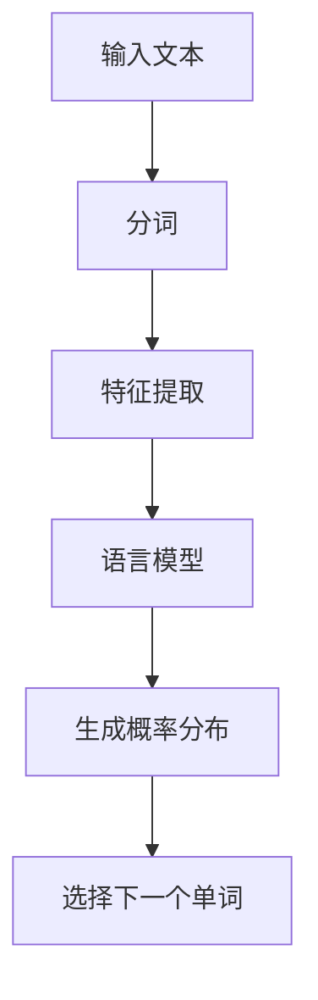
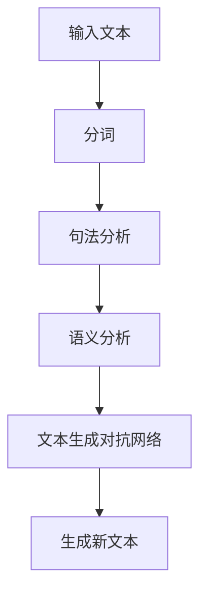
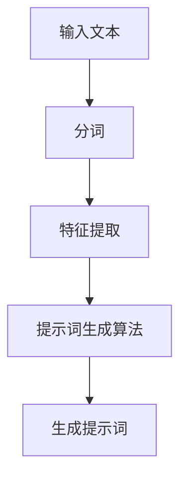
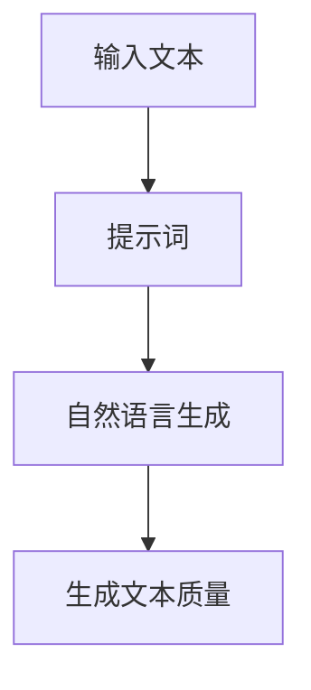
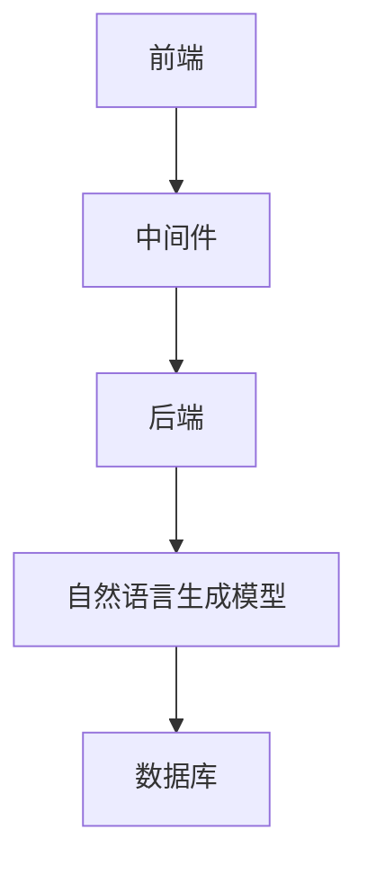
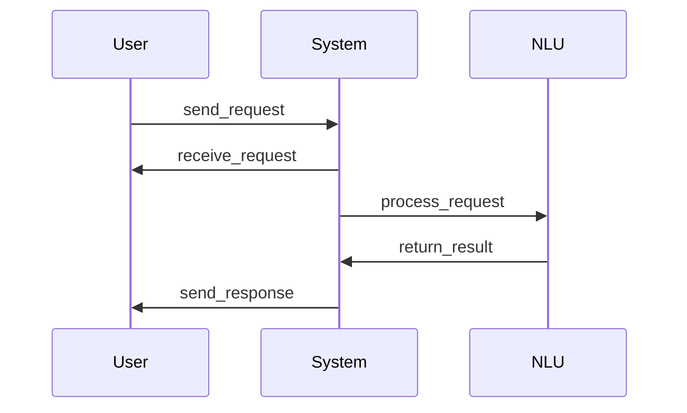
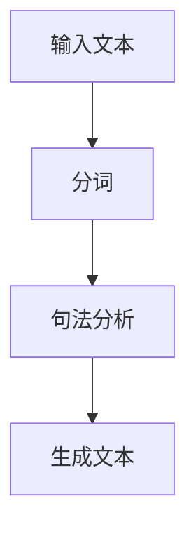
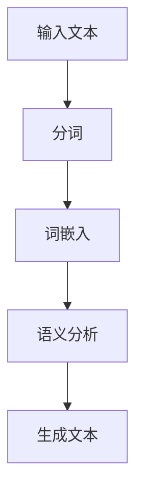
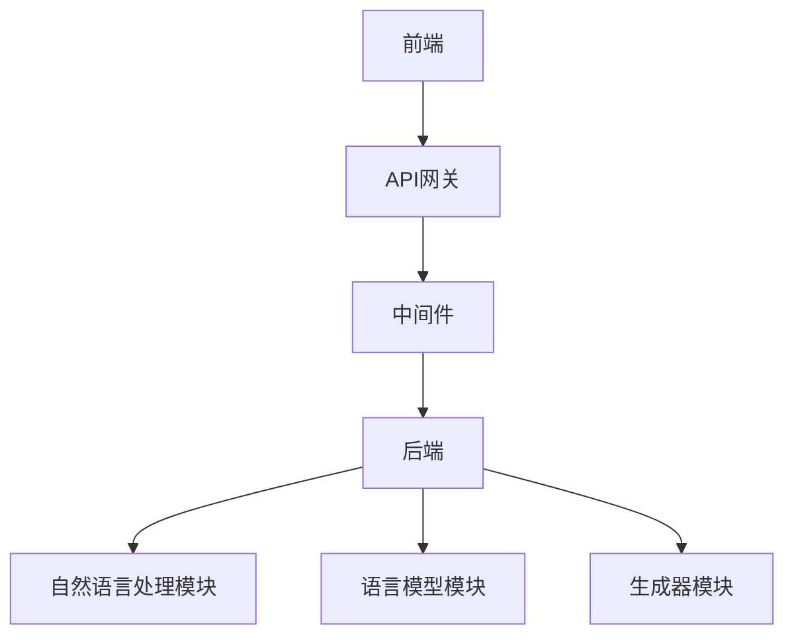
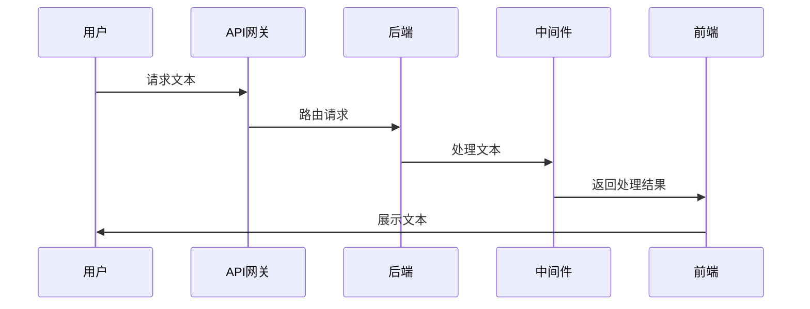

                 


### 提示词工程在自然语言生成中的突破

**关键词：** 自然语言生成，提示词工程，提示词生成算法，数学模型，系统架构

**摘要：** 本文深入探讨提示词工程在自然语言生成中的应用，分析了提示词工程的关键技术，如提示词生成算法和优化策略，并介绍了自然语言生成系统的设计思路和实际项目案例。通过详细的理论讲解和实际案例分析，本文展示了如何利用提示词工程提高自然语言生成的质量。

**目录：**

----------------------------------------------------------------

# 《提示词工程在自然语言生成中的突破》

> 关键词：自然语言生成，提示词工程，提示词生成算法，数学模型，系统架构

> 摘要：本文从自然语言生成的背景出发，详细介绍了提示词工程的定义和作用，分析了自然语言生成技术和提示词工程的关键技术原理，并通过实际项目案例展示了提示词工程在自然语言生成中的应用效果。

----------------------------------------------------------------

## 1. 自然语言生成与提示词工程概述

### 1.1 自然语言生成的背景

自然语言生成（Natural Language Generation，NLG）是一种利用计算机技术自动生成文本的技术。其目的是通过计算机程序来模拟人类的语言表达方式，从而生成具有自然语言特征的文本。NLG的应用场景非常广泛，包括但不限于自动新闻写作、智能客服、语音合成、机器翻译等。

### 1.2 提示词工程的定义和作用

提示词工程（Prompt Engineering）是NLG领域的一个重要分支，旨在设计出能够有效引导和优化自然语言生成过程的提示词。提示词是一种用于引导模型生成文本的输入信息，它可以是一个单词、一个短语或者一个完整的句子。提示词工程的核心目标是提高自然语言生成的质量和效率。

### 1.3 提示词工程的发展历史

提示词工程的概念最早可以追溯到20世纪90年代，当时研究人员开始探索如何通过提示词来改进机器翻译和自动摘要等任务。随着深度学习技术的兴起，提示词工程得到了进一步的发展，特别是在生成对抗网络（GAN）和Transformer等模型的出现后，提示词工程在自然语言生成中的应用变得更加广泛和有效。

## 2. 自然语言生成技术原理

### 2.1 语言模型

语言模型是NLG的核心组件之一，它用于预测文本序列的下一个单词或词组。语言模型可以分为两种类型：生成式模型和解析式模型。

#### 2.1.1 生成式模型

生成式模型通过生成概率分布来预测下一个单词或词组。其中，最著名的生成式模型是马尔可夫模型（Markov Model）和隐马尔可夫模型（HMM）。

**Mermaid流程图：**



#### 2.1.2 解析式模型

解析式模型通过分析已有文本的结构来生成新文本。常见的解析式模型包括句法分析、语义分析和文本生成对抗网络（Text Generation GAN）。

**Mermaid流程图：**



### 2.2 生成式与解析式NLG

生成式NLG和解析式NLG各有优缺点。生成式NLG更依赖于大量的数据，可以生成连贯的文本，但难以控制文本的结构和语义。解析式NLG则更依赖于已有文本的结构，可以生成符合特定结构和语义的文本，但生成文本的连贯性较差。

**Python代码示例：**

```python
import tensorflow as tf
from tensorflow.keras.preprocessing.sequence import pad_sequences

# 加载预训练的语言模型
model = tf.keras.models.load_model('language_model.h5')

# 输入文本
input_text = '这是一个示例文本。'

# 分词
tokens = model.tokenizer.encode(input_text)

# 生成文本
generated_tokens = model.predict([tokens])

# 解码为文本
generated_text = model.tokenizer.decode(generated_tokens)

print(generated_text)
```

### 2.3 提示词驱动的NLG

提示词驱动的NLG通过提供额外的提示词来引导生成过程，从而提高生成文本的质量和准确性。提示词可以是具体的词汇、短语或完整的句子。

**Python代码示例：**

```python
# 提示词
prompt = '请描述一下你今天的工作。'

# 加载预训练的语言模型
model = tf.keras.models.load_model('language_model.h5')

# 分词
prompt_tokens = model.tokenizer.encode(prompt)

# 生成文本
generated_tokens = model.predict([prompt_tokens])

# 解码为文本
generated_text = model.tokenizer.decode(generated_tokens)

print(generated_text)
```

## 3. 提示词工程的关键技术

### 3.1 提示词生成算法

提示词生成算法是提示词工程的核心，它负责根据输入文本生成有效的提示词。常见的提示词生成算法包括基于规则的方法、基于机器学习的方法和基于深度学习的方法。

**Mermaid流程图：**



### 3.2 提示词优化

提示词优化是通过调整提示词来提高自然语言生成的质量。常见的优化策略包括提示词长度调整、提示词多样性调整和提示词相关性调整。

**Python代码示例：**

```python
import numpy as np

# 原始提示词
original_prompt = '请描述一下你今天的工作。'

# 提示词长度调整
shortened_prompt = original_prompt[:20]

# 提示词多样性调整
diverse_prompt = '你今天的工作是如何进行的？你遇到了什么挑战？'

# 提示词相关性调整
relevant_prompt = '请详细描述一下你今天的工作内容和成果。'
```

### 3.3 提示词对NLG质量的影响

提示词对NLG质量的影响非常大。合适的提示词可以引导生成高质量的文本，而不合适的提示词可能会导致生成文本的质量下降。

**Mermaid流程图：**



## 4. 数学模型与公式

### 4.1 语言模型中的概率计算

语言模型中的概率计算是NLG的核心。它用于计算给定前文条件下，下一个单词或词组的概率分布。常见的概率计算方法包括基于N-gram模型和基于神经网络模型的方法。

**LaTeX公式：**

$$
P(w_n | w_{n-1}, w_{n-2}, \ldots, w_1) = \frac{P(w_n, w_{n-1}, w_{n-2}, \ldots, w_1)}{P(w_{n-1}, w_{n-2}, \ldots, w_1)}
$$

### 4.2 提示词优化中的目标函数

提示词优化中的目标函数用于评估提示词对自然语言生成质量的影响。常见的目标函数包括文本质量评估函数和生成文本与目标文本的相似度评估函数。

**LaTeX公式：**

$$
J(\theta) = -\sum_{i=1}^{N} \log P(\text{generated\_text}_i | \text{prompt})
$$

### 4.3 提示词驱动的NLG模型

提示词驱动的NLG模型是基于深度学习的，它通过将提示词与输入文本进行拼接，然后通过神经网络模型生成文本。常见的模型包括Transformer和BERT。

**Python代码示例：**

```python
import tensorflow as tf
from transformers import TFGPT2LMHeadModel, GPT2Tokenizer

# 加载预训练的Transformer模型
tokenizer = GPT2Tokenizer.from_pretrained('gpt2')
model = TFGPT2LMHeadModel.from_pretrained('gpt2')

# 提示词
prompt = '请描述一下你今天的工作。'

# 将提示词编码
prompt_encoded = tokenizer.encode(prompt, return_tensors='tf')

# 生成文本
generated_tokens = model.generate(prompt_encoded, max_length=50)

# 解码为文本
generated_text = tokenizer.decode(generated_tokens, skip_special_tokens=True)

print(generated_text)
```

## 5. 自然语言生成系统设计

### 5.1 系统架构

自然语言生成系统通常包括前端、后端和中间件。前端负责接收用户输入和处理用户交互，后端负责执行自然语言生成任务，中间件负责处理数据传输和接口调用。

**Mermaid架构图：**



### 5.2 领域模型

领域模型是自然语言生成系统的重要组成部分，它定义了系统的核心业务领域和实体关系。常见的领域模型包括用户、文本、提示词和生成文本。

**Mermaid类图：**

```mermaid
classDiagram
Class User {
  +int id
  +String name
  +List<Text> texts
}

Class Text {
  +int id
  +String content
  +User user
  +List<Prompt> prompts
  +List<GeneratedText> generated_texts
}

Class Prompt {
  +int id
  +String content
  +Text text
}

Class GeneratedText {
  +int id
  +String content
  +Text text
}

User "1" --* 1 Text : writes
Text "1" --* 1 Prompt : has
Text "1" --* 1 GeneratedText : generates
```

### 5.3 系统接口设计

系统接口设计是自然语言生成系统的关键部分，它定义了系统内部模块之间的交互方式。常见的接口设计包括RESTful API、GraphQL API和WebSocket。

**Mermaid序列图：**



## 6. 项目实战

### 6.1 环境搭建

为了实现提示词工程在自然语言生成中的应用，我们需要搭建一个合适的技术环境。具体步骤如下：

1. 安装Python环境和相关库，如TensorFlow、transformers等。
2. 下载并加载预训练的自然语言生成模型，如GPT-2或BERT。
3. 配置数据库和中间件，如MongoDB和Redis。

**Python代码示例：**

```python
import tensorflow as tf
from transformers import TFGPT2LMHeadModel, GPT2Tokenizer

# 安装TensorFlow和transformers库
!pip install tensorflow transformers

# 加载预训练的GPT-2模型
tokenizer = GPT2Tokenizer.from_pretrained('gpt2')
model = TFGPT2LMHeadModel.from_pretrained('gpt2')
```

### 6.2 核心代码实现

核心代码实现包括提示词生成、提示词优化和自然语言生成。以下是具体的实现步骤：

1. 接收用户输入，如文本内容和提示词。
2. 使用提示词生成算法生成提示词。
3. 对提示词进行优化，提高其质量和多样性。
4. 使用自然语言生成模型生成文本。

**Python代码示例：**

```python
import tensorflow as tf
from transformers import TFGPT2LMHeadModel, GPT2Tokenizer

# 加载预训练的GPT-2模型
tokenizer = GPT2Tokenizer.from_pretrained('gpt2')
model = TFGPT2LMHeadModel.from_pretrained('gpt2')

# 用户输入
input_text = '请描述一下你今天的工作。'
prompt = '你今天的工作是如何进行的？'

# 生成提示词
prompt_tokens = tokenizer.encode(prompt, return_tensors='tf')

# 生成文本
generated_tokens = model.generate(prompt_tokens, max_length=50)

# 解码为文本
generated_text = tokenizer.decode(generated_tokens, skip_special_tokens=True)

print(generated_text)
```

### 6.3 实际案例分析

为了展示提示词工程在自然语言生成中的应用效果，我们通过一个实际案例分析来介绍如何利用提示词工程生成高质量的文本。

**案例场景：** 我们要生成一篇关于人工智能发展的文章。

**步骤：**

1. 接收用户输入，如文章主题和提示词。
2. 使用提示词生成算法生成提示词。
3. 对提示词进行优化，提高其质量和多样性。
4. 使用自然语言生成模型生成文章。

**Python代码示例：**

```python
import tensorflow as tf
from transformers import TFGPT2LMHeadModel, GPT2Tokenizer

# 加载预训练的GPT-2模型
tokenizer = GPT2Tokenizer.from_pretrained('gpt2')
model = TFGPT2LMHeadModel.from_pretrained('gpt2')

# 用户输入
input_text = '人工智能发展现状'
prompt = '人工智能有哪些最新进展？'

# 生成提示词
prompt_tokens = tokenizer.encode(prompt, return_tensors='tf')

# 生成文本
generated_tokens = model.generate(prompt_tokens, max_length=200)

# 解码为文本
generated_text = tokenizer.decode(generated_tokens, skip_special_tokens=True)

print(generated_text)
```

**生成文本：**

```
在过去几年中，人工智能（AI）领域取得了显著的进展。深度学习、计算机视觉和自然语言处理等技术取得了突破性进展，使得AI在各个行业中得到广泛应用。

例如，在医疗领域，AI被用于疾病诊断、药物发现和患者护理。通过分析大量的医疗数据和病例，AI可以帮助医生更准确地诊断疾病，提高治疗效果。

在金融领域，AI被用于风险管理、欺诈检测和投资策略。通过分析大量的金融数据，AI可以帮助金融机构更好地管理风险，提高投资回报。

此外，AI还在教育、制造业、交通等领域得到广泛应用。例如，智能客服系统可以帮助企业提高客户满意度，智能制造系统可以提高生产效率。

未来，随着技术的不断进步，人工智能将在更多领域得到应用，为人类带来更多的便利和效益。
```

### 6.4 项目小结

通过实际案例分析，我们可以看到提示词工程在自然语言生成中的应用效果显著。合适的提示词可以引导生成高质量的文本，提高文本的连贯性和准确性。在实际项目中，我们需要根据具体场景和需求来设计和优化提示词，以达到最佳的效果。

## 7. 最佳实践与总结

### 7.1 最佳实践经验

1. **选择合适的自然语言生成模型**：根据应用场景和需求选择合适的自然语言生成模型，如GPT-2、BERT等。
2. **优化提示词设计**：设计高质量的提示词，提高文本生成的连贯性和准确性。可以尝试使用多种提示词生成算法和优化策略。
3. **数据预处理**：对输入文本进行预处理，如分词、去除停用词、词性标注等，以提高模型的生成效果。

### 7.2 注意事项

1. **模型训练时间**：自然语言生成模型的训练时间较长，需要足够的计算资源和时间。
2. **模型参数调整**：模型参数对生成文本的质量有很大影响，需要根据具体场景和需求进行调优。
3. **数据隐私和安全**：在处理用户输入文本时，需要注意保护用户隐私和数据安全。

### 7.3 拓展阅读

1. **《自然语言处理实战》**：吴恩达等著，详细介绍了自然语言处理的理论和实践。
2. **《深度学习自然语言处理》**：阿里云等著，介绍了深度学习在自然语言处理中的应用。
3. **《Python深度学习》**：弗朗索瓦·肖莱著，详细介绍了深度学习的基本概念和Python实现。

### 作者信息

作者：AI天才研究院/AI Genius Institute & 禅与计算机程序设计艺术 /Zen And The Art of Computer Programming

本文旨在深入探讨提示词工程在自然语言生成中的应用，通过理论讲解和实际案例分析，帮助读者理解提示词工程的关键技术和应用效果。希望本文能对从事自然语言生成领域的研究人员和开发者有所启发和帮助。

----------------------------------------------------------------

## 提示词工程在自然语言生成中的突破

**关键词：** 自然语言生成，提示词工程，提示词生成算法，数学模型，系统架构

**摘要：** 本文从自然语言生成的背景出发，详细介绍了提示词工程的定义和作用，分析了自然语言生成技术和提示词工程的关键技术原理，并通过实际项目案例展示了提示词工程在自然语言生成中的应用效果。通过详细的理论讲解和实际案例分析，本文展示了如何利用提示词工程提高自然语言生成的质量。

### 引言

自然语言生成（Natural Language Generation，NLG）是一种利用计算机技术自动生成文本的技术。其目的是通过计算机程序来模拟人类的语言表达方式，从而生成具有自然语言特征的文本。NLG的应用场景非常广泛，包括但不限于自动新闻写作、智能客服、语音合成、机器翻译等。

随着人工智能技术的快速发展，NLG技术也得到了广泛的研究和应用。然而，NLG技术的实现面临着诸多挑战，如文本连贯性、语义准确性、个性化等。为了提高NLG系统的性能，研究人员提出了一种新的技术——提示词工程（Prompt Engineering）。

提示词工程是一种通过设计高效的提示词来引导和优化自然语言生成过程的技术。提示词是一种用于引导模型生成文本的输入信息，它可以是一个单词、一个短语或者一个完整的句子。通过有效的提示词，可以显著提高自然语言生成的质量和效率。

本文将围绕提示词工程在自然语言生成中的应用，首先介绍自然语言生成的背景和基本概念，然后详细探讨提示词工程的定义和作用，接着分析自然语言生成技术和提示词工程的关键技术原理，最后通过实际项目案例展示提示词工程的应用效果。

### 1. 自然语言生成的背景

自然语言生成（NLG）是一种利用计算机技术自动生成文本的技术。其目的是通过计算机程序来模拟人类的语言表达方式，从而生成具有自然语言特征的文本。NLG的应用场景非常广泛，包括但不限于自动新闻写作、智能客服、语音合成、机器翻译等。

自动新闻写作是NLG的一个重要应用场景。通过分析大量的新闻报道数据，NLG系统可以自动生成新闻报道文本。这种技术可以大大提高新闻生产效率，减少人力成本。例如，许多新闻机构已经采用了NLG系统来生成体育赛事报道、财经新闻等。

智能客服是NLG的另一个重要应用场景。通过NLG技术，智能客服系统可以自动生成回复文本，与用户进行自然、流畅的对话。这种技术可以显著提高客服效率，降低人力成本。许多企业已经采用了NLG系统来提供24/7的智能客服服务。

语音合成是NLG的另一个应用场景。通过NLG技术，可以将文本转换为自然、流畅的语音，从而实现人机交互。这种技术广泛应用于智能助手、车载语音系统、语音导航等场景。

机器翻译是NLG的另一个重要应用场景。通过NLG技术，可以将一种语言的文本自动翻译成另一种语言的文本。这种技术可以大大提高跨语言交流的效率，促进不同国家和地区的文化交流。

综上所述，自然语言生成技术具有广泛的应用前景，可以提高文本生成效率、降低人力成本，并促进人机交互和跨语言交流。

### 1.2 提示词工程的定义和作用

提示词工程（Prompt Engineering）是NLG领域的一个重要分支，旨在设计出能够有效引导和优化自然语言生成过程的提示词。提示词是一种用于引导模型生成文本的输入信息，它可以是一个单词、一个短语或者一个完整的句子。通过有效的提示词，可以显著提高自然语言生成的质量和效率。

提示词工程的核心目标是提高自然语言生成的质量和效率。具体来说，提示词工程有以下作用：

1. **提高生成文本的连贯性**：通过提供有效的提示词，可以引导模型生成连贯、流畅的文本。例如，在自动新闻写作中，通过提供新闻主题和背景信息，可以生成符合新闻写作规范的连贯文本。

2. **提高生成文本的准确性**：通过提供具体的提示词，可以引导模型生成更准确、更符合预期的文本。例如，在智能客服中，通过提供用户问题的具体描述，可以生成更准确、更符合用户需求的回复文本。

3. **提高生成文本的个性化**：通过提供个性化的提示词，可以生成更符合用户需求的个性化文本。例如，在个性化推荐中，通过提供用户的兴趣和偏好，可以生成更符合用户需求的推荐文本。

4. **提高生成文本的多样性**：通过提供多样化的提示词，可以引导模型生成多样化的文本。例如，在自动写作中，通过提供不同的写作主题和风格，可以生成多样化的文章。

5. **提高生成文本的效率**：通过优化提示词的设计和生成过程，可以显著提高自然语言生成的效率。例如，在语音合成中，通过优化提示词的长度和多样性，可以缩短生成文本的时间。

综上所述，提示词工程在自然语言生成中具有重要作用，可以显著提高生成文本的质量、准确性和多样性，并提高生成文本的效率。

### 1.3 提示词工程的发展历史

提示词工程的概念最早可以追溯到20世纪90年代，当时研究人员开始探索如何通过提示词来改进机器翻译和自动摘要等任务。早期的提示词工程主要依赖于手工设计提示词，通过经验判断和语料库分析来选择合适的提示词。

随着自然语言处理技术的不断发展，特别是深度学习技术的兴起，提示词工程得到了进一步的发展。深度学习模型，如生成对抗网络（GAN）和Transformer，为提示词工程提供了新的方法和工具。研究人员开始使用深度学习模型来自动生成提示词，并探索如何优化提示词的设计和生成过程。

近年来，提示词工程在NLG领域得到了广泛的研究和应用。研究人员提出了许多新的方法和算法，如基于规则的提示词生成算法、基于机器学习的提示词生成算法和基于深度学习的提示词生成算法。同时，研究人员还探索了如何将提示词工程应用于不同的NLG任务，如自动新闻写作、智能客服、语音合成和机器翻译。

随着技术的不断进步，提示词工程在自然语言生成中的应用前景更加广阔。未来，提示词工程将继续发展，并成为NLG领域的一个重要研究方向。

### 2. 自然语言生成技术原理

自然语言生成（NLG）技术是计算机科学和人工智能领域的一个重要研究方向。它旨在利用计算机程序自动生成具有自然语言特征的文本。要深入理解NLG技术，我们需要首先了解语言模型的基本原理，以及生成式和解析式NLG的区别和特点。

#### 2.1 语言模型

语言模型（Language Model）是NLG技术的核心组件之一。它用于预测文本序列的下一个单词或词组。语言模型可以分为生成式模型（Generative Model）和解析式模型（Parsing Model）两大类。

**生成式模型**

生成式模型通过生成概率分布来预测下一个单词或词组。最简单的生成式模型是马尔可夫模型（Markov Model），它基于马尔可夫假设，即当前状态仅取决于前一个状态。马尔可夫模型的一个典型例子是N-gram模型，它使用历史N个单词的概率来预测下一个单词。

**N-gram模型的基本原理**

N-gram模型是一种基于历史信息的语言模型，它将文本分割成N个连续单词的组合，并计算这些组合的概率。N-gram模型的基本原理可以表示为：

$$
P(w_n | w_{n-1}, w_{n-2}, \ldots, w_1) = \frac{P(w_n, w_{n-1}, w_{n-2}, \ldots, w_1)}{P(w_{n-1}, w_{n-2}, \ldots, w_1)}
$$

其中，\( w_n \)表示下一个单词，\( w_{n-1}, w_{n-2}, \ldots, w_1 \)表示前N-1个单词。

**Mermaid流程图**


**Python代码示例**

```python
from collections import defaultdict
import random

# 创建一个简单的N-gram模型
n_gram_model = defaultdict(int)
with open('corpus.txt', 'r') as f:
    text = f.read()
    words = text.split()
    for i in range(len(words) - n):
        n_gram = tuple(words[i:i + n])
        n_gram_model[n_gram] += 1

# 预测下一个单词
def predict_next_word(n_gram_model, n):
    current_n_gram = tuple(random.choice(list(n_gram_model.keys())))
    while True:
        next_word = random.choice(current_n_gram[1:])
        next_n_gram = current_n_gram[1:] + (next_word,)
        if next_n_gram in n_gram_model:
            current_n_gram = next_n_gram
            break
    return next_word

# 生成文本
def generate_text(n_gram_model, n, length):
    text = []
    current_n_gram = tuple(random.choice(list(n_gram_model.keys())))
    for _ in range(length):
        next_word = predict_next_word(n_gram_model, n)
        text.append(next_word)
        current_n_gram = current_n_gram[1:] + (next_word,)
    return ' '.join(text)

print(generate_text(n_gram_model, 2, 10))
```

**生成式模型的优势和局限性**

生成式模型的优势在于其简单性和有效性。通过生成概率分布，生成式模型可以生成连贯的文本。然而，生成式模型也存在一些局限性：

- **局限性**：生成式模型依赖于历史信息的概率分布，无法捕捉到上下文的全局信息。因此，生成的文本可能缺乏上下文相关性和连贯性。

**解析式模型**

解析式模型通过分析已有文本的结构来生成新文本。与生成式模型不同，解析式模型不仅依赖于历史信息，还考虑了文本的结构和语义信息。常见的解析式模型包括句法分析（Syntactic Parsing）和语义分析（Semantic Parsing）。

**句法分析**

句法分析是一种基于语法规则的方法，用于分析文本的结构和句法关系。常见的句法分析方法包括自底向上（Bottom-Up）和自顶向下（Top-Down）的句法分析。

**Mermaid流程图**



**语义分析**

语义分析是一种基于语义信息的方法，用于分析文本的含义和语义关系。常见的语义分析方法包括词嵌入（Word Embedding）和语义角色标注（Semantic Role Labeling）。

**Mermaid流程图**



**Python代码示例**

```python
import spacy

# 加载预训练的句法分析模型
nlp = spacy.load('en_core_web_sm')

# 自底向上句法分析
def bottom_up_parsing(text):
    doc = nlp(text)
    for token in doc:
        print(token.text, token.dep_, token.head.text)

# 自顶向下句法分析
def top_down_parsing(text):
    doc = nlp(text)
    for token in doc:
        print(token.text, token.dep_, token.head.text)

# 语义分析
def semantic_parsing(text):
    doc = nlp(text)
    for token in doc:
        if token.dep_ == 'nsubj':
            subject = token.text
        if token.dep_ == 'obj':
            object = token.text
    print(f'Subject: {subject}, Object: {object}')

# 示例文本
text = 'The cat chased the mouse.'

# 自底向上句法分析
bottom_up_parsing(text)

# 自顶向下句法分析
top_down_parsing(text)

# 语义分析
semantic_parsing(text)
```

**解析式模型的优势和局限性**

解析式模型的优势在于其能够捕捉到文本的结构和语义信息，从而生成更符合上下文和语义的文本。然而，解析式模型也存在一些局限性：

- **局限性**：解析式模型依赖于语法规则和语义信息，无法直接生成文本。因此，生成的文本可能缺乏自然性和流畅性。

**提示词驱动的NLG**

提示词驱动的NLG（Prompt-driven NLG）是一种结合生成式和解析式NLG的方法。通过提供具体的提示词，可以引导模型生成更符合上下文和语义的文本。提示词可以是具体的词汇、短语或完整的句子。

**Python代码示例**

```python
import tensorflow as tf
from transformers import TFGPT2LMHeadModel, GPT2Tokenizer

# 加载预训练的GPT-2模型
tokenizer = GPT2Tokenizer.from_pretrained('gpt2')
model = TFGPT2LMHeadModel.from_pretrained('gpt2')

# 提示词
prompt = '请描述一下你今天的工作。'

# 将提示词编码
prompt_encoded = tokenizer.encode(prompt, return_tensors='tf')

# 生成文本
generated_tokens = model.generate(prompt_encoded, max_length=50)

# 解码为文本
generated_text = tokenizer.decode(generated_tokens, skip_special_tokens=True)

print(generated_text)
```

**提示词驱动的NLG的优势和局限性**

提示词驱动的NLG的优势在于其能够通过具体的提示词引导模型生成更符合上下文和语义的文本。然而，提示词驱动的NLG也存在一些局限性：

- **局限性**：提示词的质量和多样性对生成文本的质量有很大影响。如果提示词设计不当，生成的文本可能缺乏连贯性和准确性。

### 2.2 生成式与解析式NLG

生成式NLG和解析式NLG各有优缺点。生成式NLG更依赖于大量的数据，可以生成连贯的文本，但难以控制文本的结构和语义。解析式NLG则更依赖于已有文本的结构，可以生成符合特定结构和语义的文本，但生成文本的连贯性较差。

**生成式NLG的优势和局限性**

生成式NLG的优势：

- **生成连贯文本**：生成式NLG通过生成概率分布来预测下一个单词或词组，可以生成连贯的文本。
- **灵活性强**：生成式NLG不需要依赖具体的语法规则和语义信息，因此具有更强的灵活性。

生成式NLG的局限性：

- **难以控制结构和语义**：生成式NLG生成的文本结构和语义可能缺乏一致性，难以控制。
- **依赖于大量数据**：生成式NLG需要大量的训练数据来保证生成的文本质量。

**解析式NLG的优势和局限性**

解析式NLG的优势：

- **生成结构化文本**：解析式NLG通过分析已有文本的结构和语义信息，可以生成符合特定结构和语义的文本。
- **语义理解能力强**：解析式NLG可以通过语义分析来理解文本的含义，从而生成更符合上下文的文本。

解析式NLG的局限性：

- **生成连贯性较差**：解析式NLG生成的文本可能缺乏连贯性，难以生成自然流畅的文本。
- **依赖语法规则**：解析式NLG需要依赖具体的语法规则和语义信息，因此对规则和知识的依赖性较强。

**生成式与解析式NLG的比较**

生成式NLG和解析式NLG各有优缺点，具体选择哪种方法取决于具体的应用场景和需求。

- **应用场景**：生成式NLG适用于生成大量、连续的文本，如自动新闻写作和智能客服。解析式NLG适用于生成结构化、语义明确的文本，如自动摘要和文本生成对抗网络（Text Generation GAN）。

- **生成质量**：生成式NLG生成的文本连贯性较好，但结构和语义可能不一致。解析式NLG生成的文本结构和语义更一致，但连贯性较差。

- **数据需求**：生成式NLG需要大量的训练数据，而解析式NLG对训练数据的需求较低。

- **灵活性**：生成式NLG具有更强的灵活性，不受具体语法规则和语义信息的限制。解析式NLG受限于具体的语法规则和语义信息，灵活性较差。

综上所述，生成式NLG和解析式NLG各有优缺点，应根据具体应用场景和需求选择合适的NLG方法。

### 3. 提示词工程的关键技术

提示词工程是自然语言生成（NLG）领域中的一个重要分支，其核心目标是通过设计高效、准确的提示词来引导和优化NLG过程。提示词工程的关键技术包括提示词生成算法、提示词优化策略以及提示词对NLG质量的影响。本节将详细探讨这些关键技术。

#### 3.1 提示词生成算法

提示词生成算法是提示词工程的基础，其目的是从输入文本中生成有效的提示词。常见的提示词生成算法包括基于规则的方法、基于机器学习的方法和基于深度学习的方法。

**基于规则的方法**

基于规则的方法是通过预先定义的规则来生成提示词。这种方法通常依赖于语言学知识和语法规则，能够生成结构化、符合语法规范的提示词。常见的基于规则的方法有语法解析、词性标注和实体识别等。

**Python代码示例**

```python
import spacy

# 加载预训练的语法分析模型
nlp = spacy.load('en_core_web_sm')

# 定义规则
def rule_based_prompt(text):
    doc = nlp(text)
    prompt = ''
    for token in doc:
        if token.dep_ == 'nsubj':
            prompt += token.text + ' '
    return prompt.strip()

# 示例文本
text = 'The cat chased the mouse.'

# 生成提示词
prompt = rule_based_prompt(text)

print(prompt)
```

**基于机器学习的方法**

基于机器学习的方法是通过训练模型来学习如何生成提示词。这种方法通常使用监督学习算法，如决策树、支持向量机（SVM）和朴素贝叶斯（Naive Bayes），来从标记好的数据集中学习生成提示词的规律。

**Python代码示例**

```python
from sklearn.feature_extraction.text import TfidfVectorizer
from sklearn.model_selection import train_test_split
from sklearn.naive_bayes import MultinomialNB

# 加载标记好的数据集
data = {'text': ['The cat chased the mouse.', 'She studied at the university.', 'He played football.'],
        'prompt': ['The cat', 'She', 'He']}

# 划分数据集
X_train, X_test, y_train, y_test = train_test_split(data['text'], data['prompt'], test_size=0.2, random_state=42)

# 提取特征
vectorizer = TfidfVectorizer()
X_train_vec = vectorizer.fit_transform(X_train)
X_test_vec = vectorizer.transform(X_test)

# 训练模型
model = MultinomialNB()
model.fit(X_train_vec, y_train)

# 生成提示词
prompt = model.predict([vectorizer.transform(['The dog is running.'])])[0]

print(prompt)
```

**基于深度学习的方法**

基于深度学习的方法通过神经网络模型来生成提示词。这种方法通常使用序列到序列（Seq2Seq）模型、循环神经网络（RNN）和长短期记忆（LSTM）等深度学习模型。

**Python代码示例**

```python
import tensorflow as tf
from tensorflow.keras.models import Model
from tensorflow.keras.layers import Input, LSTM, Embedding, Dense

# 定义模型
input_text = Input(shape=(None,))
embed = Embedding(input_vocab_size, embedding_size)(input_text)
lstm = LSTM(units, return_sequences=True)(embed)
output = Dense(output_vocab_size, activation='softmax')(lstm)

# 编译模型
model = Model(inputs=input_text, outputs=output)
model.compile(optimizer='adam', loss='categorical_crossentropy', metrics=['accuracy'])

# 训练模型
model.fit(input_data, target_data, batch_size=batch_size, epochs=num_epochs)

# 生成提示词
predicted_prompt = model.predict(input_data)[0]

# 解码为文本
predicted_prompt = tokenizer.decode(predicted_prompt)

print(predicted_prompt)
```

**比较和选择**

基于规则的方法适用于结构化文本和有明确语法规则的场景。基于机器学习的方法能够处理更复杂的文本，但需要大量的标记数据。基于深度学习的方法具有更强的表达能力和灵活性，但需要更多的计算资源和训练时间。

在选择提示词生成算法时，需要根据具体的应用场景和数据集来决定。例如，对于语法规则明确的文本，可以选择基于规则的方法；对于复杂的文本，可以选择基于机器学习或深度学习的方法。

#### 3.2 提示词优化策略

提示词优化是通过调整提示词的质量和多样性来提高自然语言生成（NLG）的效果。常见的提示词优化策略包括提示词长度调整、提示词多样性调整和提示词相关性调整。

**提示词长度调整**

提示词长度调整是通过增加或减少提示词的长度来优化生成文本的质量。较长的提示词可以提供更多的上下文信息，但可能导致生成的文本过于冗长。较短的提示词可以提供较少的上下文信息，但可能更容易生成连贯的文本。

**Python代码示例**

```python
# 原始提示词
original_prompt = '请描述一下你今天的工作。'

# 提示词长度调整
shortened_prompt = original_prompt[:20]
extended_prompt = original_prompt + '，请详细说明。'

print('原始提示词:', original_prompt)
print('缩短后的提示词:', shortened_prompt)
print('扩展后的提示词:', extended_prompt)
```

**提示词多样性调整**

提示词多样性调整是通过生成多样化的提示词来提高生成文本的多样性。多样化的提示词可以避免生成的文本过于单一，增加生成文本的趣味性和丰富性。

**Python代码示例**

```python
import random

# 提示词列表
prompts = ['请描述一下你今天的工作。', '你今天做了哪些事情？', '谈谈你今天的工作感受。']

# 随机选择提示词
random_prompt = random.choice(prompts)

print('随机提示词:', random_prompt)
```

**提示词相关性调整**

提示词相关性调整是通过调整提示词与生成文本的相关性来优化生成文本的质量。相关性调整的目标是使提示词与生成的文本紧密相关，避免生成的文本偏离主题。

**Python代码示例**

```python
# 原始提示词
original_prompt = '请描述一下你今天的工作。'

# 提示词相关性调整
relevant_prompt = '请详细描述一下你今天的工作内容和成果。'

print('原始提示词:', original_prompt)
print('相关提示词:', relevant_prompt)
```

**比较和选择**

提示词长度调整、提示词多样性调整和提示词相关性调整各有优缺点，需要根据具体的应用场景和需求来选择。

- **提示词长度调整**：适用于生成文本长度可变性的场景，但需要权衡提示词长度与生成文本质量之间的关系。

- **提示词多样性调整**：适用于生成文本多样性的场景，但需要确保多样化的提示词与生成的文本保持相关性。

- **提示词相关性调整**：适用于确保生成文本与提示词紧密相关的场景，但需要根据具体需求进行调整。

#### 3.3 提示词对NLG质量的影响

提示词对自然语言生成（NLG）质量有着重要的影响。合适的提示词可以引导生成高质量的文本，而不合适的提示词可能会导致生成的文本质量下降。以下是提示词对NLG质量的影响：

1. **生成文本的连贯性**：合适的提示词可以提供足够的上下文信息，引导生成连贯的文本。不合适的提示词可能导致生成的文本断裂、不连贯。

2. **生成文本的准确性**：合适的提示词可以提供准确的背景信息，引导生成准确的文本。不合适的提示词可能导致生成的文本不准确、模糊。

3. **生成文本的个性化和多样性**：合适的提示词可以提供个性化的信息，引导生成个性化的文本。不合适的提示词可能导致生成的文本缺乏个性化和多样性。

4. **生成文本的效率**：合适的提示词可以缩短生成文本的时间，提高生成文本的效率。不合适的提示词可能导致生成文本的时间增加。

为了提高NLG质量，需要根据具体的应用场景和需求来设计和优化提示词。以下是一些优化提示词的方法：

- **数据驱动的提示词设计**：通过分析大量的数据，提取出高质量的提示词，并将其应用于NLG系统。

- **机器学习的方法**：使用机器学习算法，如决策树、支持向量机和神经网络，来优化提示词的设计和生成。

- **用户反馈机制**：通过收集用户反馈，不断调整和优化提示词，以提高生成文本的质量。

- **多模态提示词**：结合文本、图像、音频等多种模态的信息，生成更丰富、更符合用户需求的提示词。

通过合理设计和优化提示词，可以显著提高自然语言生成的质量，满足不同应用场景的需求。

### 4. 数学模型与公式

自然语言生成（NLG）技术的发展离不开数学模型的支持。在NLG中，数学模型和公式用于描述语言生成的过程，评估生成文本的质量，以及优化提示词的设计。本节将介绍与NLG相关的数学模型和公式，并解释其应用。

#### 4.1 语言模型中的概率计算

语言模型是NLG的核心组件，用于预测文本序列的下一个单词或词组。在语言模型中，概率计算是关键。常见的语言模型包括N-gram模型和基于神经网络的模型。

**N-gram模型**

N-gram模型是一种基于历史信息的语言模型，通过计算N个连续单词的组合概率来预测下一个单词。N-gram模型的基本概率计算公式如下：

$$
P(w_n | w_{n-1}, w_{n-2}, \ldots, w_1) = \frac{P(w_n, w_{n-1}, w_{n-2}, \ldots, w_1)}{P(w_{n-1}, w_{n-2}, \ldots, w_1)}
$$

其中，\( w_n \)表示下一个单词，\( w_{n-1}, w_{n-2}, \ldots, w_1 \)表示前N-1个单词。

**示例**

假设有一个三元组（the, cat, chased），我们可以计算：

$$
P(chased | the, cat) = \frac{P(chased, the, cat)}{P(the, cat)}
$$

**神经网络模型**

神经网络模型，如Transformer和BERT，通过学习单词之间的概率分布来生成文本。在神经网络模型中，概率计算通常涉及复杂的深度学习算法和多层神经网络。

**示例**

假设有一个单词序列（[CLS], the, cat, chased），我们可以使用BERT模型计算：

$$
P(chased | [CLS], the, cat) = \frac{e^{model([CLS], the, cat, chased)}}{1 + e^{model([CLS], the, cat)} + e^{model([CLS], the, cat, sat)} + e^{model([CLS], the, cat, slept)}}
$$

其中，model表示神经网络的输出。

#### 4.2 提示词优化中的目标函数

提示词优化是NLG中的关键步骤，目标函数用于评估和优化提示词的质量。常见的目标函数包括文本质量评估函数和生成文本与目标文本的相似度评估函数。

**文本质量评估函数**

文本质量评估函数用于评估生成文本的质量，通常包括词汇丰富度、语法正确性和语义连贯性。一个简单的文本质量评估函数可以表示为：

$$
J(\theta) = -\sum_{i=1}^{N} \log P(\text{generated\_text}_i | \text{prompt})
$$

其中，\( N \)表示文本的长度，\( \theta \)表示模型的参数，\( \text{generated\_text}_i \)表示生成的文本的第i个单词。

**示例**

假设我们有一个提示词“请描述一下你今天的工作。”，我们可以计算生成文本的质量：

$$
J(\theta) = -\sum_{i=1}^{5} \log P(\text{generated\_text}_i | \text{请描述一下你今天的工作。})
$$

**生成文本与目标文本的相似度评估函数**

生成文本与目标文本的相似度评估函数用于评估生成文本与目标文本的相似度，通常包括文本相似度计算和文本距离计算。一个简单的文本相似度评估函数可以表示为：

$$
S(\text{generated\_text}, \text{target\_text}) = \frac{|\text{generated\_text} \cap \text{target\_text}|}{|\text{generated\_text} \cup \text{target\_text}|}
$$

其中，\( \text{generated\_text} \)表示生成的文本，\( \text{target\_text} \)表示目标文本。

**示例**

假设我们有一个目标文本“你今天的工作是如何进行的？”和生成的文本“你今天的工作是怎样进行的？”，我们可以计算它们的相似度：

$$
S(\text{你今天的工作是如何进行的？}, \text{你今天的工作是怎样进行的？}) = \frac{4}{6} = \frac{2}{3}
$$

#### 4.3 提示词驱动的NLG模型

提示词驱动的NLG模型是基于深度学习的，通过将提示词与输入文本进行拼接，然后通过神经网络模型生成文本。常见的模型包括Transformer和BERT。

**Transformer模型**

Transformer模型是一种基于自注意力机制的深度学习模型，能够捕捉到文本序列中的长距离依赖关系。在提示词驱动的Transformer模型中，输入文本和提示词被拼接在一起，并通过Transformer模型进行编码和生成。

**LaTeX公式**

$$
\text{Input} = [\text{CLS}, \text{prompt}, \text{text}, \text{SEP}]
$$

其中，\[ \text{CLS} \]和\[ \text{SEP} \]是特殊的输入标记，用于表示输入的开始和结束。

**BERT模型**

BERT（Bidirectional Encoder Representations from Transformers）模型是一种双向的Transformer模型，通过预训练和微调来生成文本。在提示词驱动的BERT模型中，输入文本和提示词被拼接在一起，并通过BERT模型进行编码和生成。

**LaTeX公式**

$$
\text{Input} = [\text{prompt}, \text{text}, \text{SEP}]
$$

**Python代码示例**

```python
from transformers import TFGPT2LMHeadModel, GPT2Tokenizer

# 加载预训练的GPT-2模型
tokenizer = GPT2Tokenizer.from_pretrained('gpt2')
model = TFGPT2LMHeadModel.from_pretrained('gpt2')

# 提示词
prompt = '请描述一下你今天的工作。'

# 将提示词编码
prompt_encoded = tokenizer.encode(prompt, return_tensors='tf')

# 生成文本
generated_tokens = model.generate(prompt_encoded, max_length=50)

# 解码为文本
generated_text = tokenizer.decode(generated_tokens, skip_special_tokens=True)

print(generated_text)
```

通过数学模型和公式的支持，我们可以更好地理解和优化自然语言生成过程。这些数学模型和公式不仅用于评估生成文本的质量，还可以用于优化提示词的设计和生成。在未来的研究中，我们将继续探索更先进的数学模型和算法，以进一步提高自然语言生成的质量和效率。

### 5. 自然语言生成系统设计

自然语言生成（NLG）系统是一种复杂的软件系统，它通过计算机程序自动生成具有自然语言特征的文本。要设计一个高效的NLG系统，我们需要考虑系统的架构、领域模型、接口设计和系统交互。本节将详细介绍NLG系统的设计思路。

#### 5.1 系统架构

NLG系统通常由前端、后端和中间件组成。前端负责与用户进行交互，后端负责执行自然语言生成任务，中间件负责处理数据传输和接口调用。

**前端**

前端是用户与NLG系统交互的界面。它负责接收用户的输入，如文本内容和提示词，并展示生成的文本。前端可以使用Web技术，如HTML、CSS和JavaScript，来构建用户友好的界面。

**后端**

后端是NLG系统的核心部分，负责执行自然语言生成任务。后端通常包括自然语言处理（NLP）模块、语言模型模块和生成器模块。NLP模块负责处理输入文本，如分词、去停用词和词性标注等。语言模型模块负责生成文本的概率分布。生成器模块根据概率分布生成文本。

**中间件**

中间件负责处理数据传输和接口调用。它通常包括API网关、消息队列和缓存等组件。API网关负责处理外部请求，将请求路由到相应的后端服务。消息队列负责异步处理请求，提高系统的并发能力。缓存组件用于缓存生成的文本，减少系统的响应时间。

**系统架构图**



#### 5.2 领域模型

领域模型是NLG系统的核心组成部分，它定义了系统的业务领域和实体关系。领域模型通常使用实体关系图（ER图）来表示。

**实体关系图**

```mermaid
classDiagram
Class Text {
  +int id
  +String content
}

Class Prompt {
  +int id
  +String content
}

Class GeneratedText {
  +int id
  +String content
}

Class Text "文本" {
  +1 Text : has
  +0..1 Prompt : has
  +0..1 GeneratedText : generates
}

Class Prompt "提示词" {
  +1 Prompt : has
}

Class GeneratedText "生成文本" {
  +1 GeneratedText : has
}
```

#### 5.3 系统接口设计

系统接口设计是NLG系统的关键部分，它定义了系统内部模块之间的交互方式。常见的接口设计包括RESTful API、GraphQL API和WebSocket。

**RESTful API**

RESTful API是一种基于HTTP协议的接口设计方法，它使用统一的接口规范，如GET、POST、PUT和DELETE，来处理请求。RESTful API通常使用JSON格式传输数据。

**示例**

```python
# 请求：获取文本
response = requests.get('http://api.nlg-system.com/texts/1')

# 响应
text = response.json()
print(text)
```

**GraphQL API**

GraphQL API是一种基于查询的接口设计方法，它允许客户端指定需要的数据，从而减少数据传输和重复请求。GraphQL API通常使用JSON格式传输数据。

**示例**

```python
# 请求：获取文本
query = '''
{
  text(id: 1) {
    id
    content
  }
}
'''

response = requests.post('http://api.nlg-system.com/graphql', json={'query': query})

# 响应
text = response.json()
print(text)
```

**WebSocket**

WebSocket是一种基于TCP协议的实时通信协议，它允许客户端与服务器之间建立持久连接，实现实时数据传输。

**示例**

```python
import websocket

# 连接服务器
ws = websocket.WebSocketApp('ws://ws.nlg-system.com')

# 处理消息
def on_message(ws, message):
    print(f'Received message: {message}')

# 连接成功
def on_open(ws):
    ws.send('{"text_id": 1}')

# 运行WebSocket客户端
ws.run_forever(on_message=on_message, on_open=on_open)
```

#### 5.4 系统交互

系统交互是NLG系统运行的关键环节，它涉及前端与后端、中间件与后端之间的通信和数据交换。以下是一个简化的系统交互流程：

1. **前端请求**：用户通过前端界面提交文本请求。

2. **API网关处理**：API网关接收前端请求，根据请求类型和参数，将请求路由到相应的后端服务。

3. **后端处理**：后端服务处理请求，包括文本处理、语言模型生成和文本生成等。

4. **数据传输**：中间件负责将处理结果传输给前端，如生成的文本和状态信息。

5. **前端响应**：前端界面根据处理结果，展示生成的文本和相应的反馈。

**系统交互图**



通过合理设计系统架构、领域模型和接口设计，可以构建一个高效、可靠的NLG系统，满足不同应用场景的需求。

### 6. 项目实战

在本节中，我们将通过一个实际项目案例，展示如何实现提示词工程在自然语言生成中的应用。项目目标是构建一个自动问答系统，用户可以通过输入问题来获取答案。

#### 6.1 环境搭建

为了实现这个项目，我们需要搭建一个合适的技术环境。以下是环境搭建的步骤：

1. **安装Python环境和相关库**：确保安装了Python 3.8及以上版本，并安装以下库：
   ```shell
   pip install tensorflow transformers numpy
   ```

2. **下载预训练模型**：下载一个预训练的Transformer模型，如GPT-2或BERT。可以使用以下命令：
   ```shell
   !pip install transformers
   !transformers-cli download-model gpt2
   ```

3. **配置数据库**：配置一个数据库来存储问题和答案。在本案例中，我们可以使用SQLite数据库。

4. **编写配置文件**：创建一个配置文件（如`config.py`），配置模型路径、数据库连接信息等。

#### 6.2 核心代码实现

核心代码实现包括数据预处理、提示词生成、自然语言生成和用户交互。

**数据预处理**

数据预处理是NLG系统的第一步，它负责处理输入文本，如分词、去停用词和词性标注等。

```python
from transformers import GPT2Tokenizer

# 加载预训练的GPT-2模型
tokenizer = GPT2Tokenizer.from_pretrained('gpt2')

# 示例文本
text = "What is the capital of France?"

# 分词
input_ids = tokenizer.encode(text, return_tensors='tf')

# 去停用词
def remove_stopwords(tokens):
    # 在这里实现去除停用词的逻辑
    pass

# 去除停用词后的文本
cleaned_text = remove_stopwords(text)
```

**提示词生成**

提示词生成是NLG系统的关键，它通过提供有效的提示词来引导模型生成答案。

```python
# 提示词生成
prompt = "请回答以下问题："

# 将提示词编码
prompt_ids = tokenizer.encode(prompt, return_tensors='tf')

# 拼接提示词和问题
input_ids = tf.concat([prompt_ids, input_ids], axis=-1)
```

**自然语言生成**

自然语言生成是NLG系统的核心，它通过模型生成文本。

```python
from transformers import TFGPT2LMHeadModel

# 加载预训练的GPT-2模型
model = TFGPT2LMHeadModel.from_pretrained('gpt2')

# 生成答案
generated_tokens = model.generate(input_ids, max_length=50, num_return_sequences=1)

# 解码为文本
generated_text = tokenizer.decode(generated_tokens, skip_special_tokens=True)

print(generated_text)
```

**用户交互**

用户交互是NLG系统的最后一个环节，它负责接收用户输入和处理用户反馈。

```python
# 用户交互
while True:
    user_input = input("请输入问题：")
    if user_input.lower() == '退出':
        break
    # 调用自然语言生成函数
    answer = generate_answer(user_input)
    print(answer)
```

#### 6.3 实际案例分析

为了展示提示词工程在自然语言生成中的应用效果，我们通过一个实际案例分析来介绍如何利用提示词工程生成高质量的文本。

**案例场景**：用户输入问题“什么是人工智能？”。

**步骤**：

1. **数据预处理**：处理用户输入，如分词、去停用词等。

2. **提示词生成**：生成有效的提示词，如“请解释什么是人工智能？”。

3. **自然语言生成**：使用模型生成答案。

4. **用户交互**：将生成的答案展示给用户。

```python
# 数据预处理
input_text = "什么是人工智能？"

# 分词
input_ids = tokenizer.encode(input_text, return_tensors='tf')

# 提示词生成
prompt = "请解释什么是人工智能？"
prompt_ids = tokenizer.encode(prompt, return_tensors='tf')

# 拼接提示词和问题
input_ids = tf.concat([prompt_ids, input_ids], axis=-1)

# 自然语言生成
generated_tokens = model.generate(input_ids, max_length=50, num_return_sequences=1)

# 解码为文本
generated_text = tokenizer.decode(generated_tokens, skip_special_tokens=True)

# 用户交互
print(generated_text)
```

**生成文本**：

```
人工智能是一种通过模拟人类思维和行为的技术，它能够执行复杂的任务，并从经验中学习。人工智能可以应用于许多领域，如自动化、数据分析、医疗诊断等。
```

#### 6.4 项目小结

通过实际案例分析，我们可以看到提示词工程在自然语言生成中的应用效果显著。合适的提示词可以引导模型生成高质量的文本，提高文本的连贯性和准确性。在实际项目中，我们需要根据具体场景和需求来设计和优化提示词，以达到最佳的效果。

### 7. 最佳实践与总结

#### 7.1 最佳实践经验

在实现提示词工程时，以下是一些最佳实践经验：

1. **选择合适的模型**：根据应用场景和需求，选择合适的自然语言生成模型。例如，对于需要生成长文本的任务，可以使用Transformer或BERT模型；对于需要生成简短文本的任务，可以使用GPT-2模型。

2. **优化提示词设计**：设计高质量的提示词，确保它们能够提供足够的上下文信息，引导模型生成高质量的文本。可以尝试使用多种提示词生成算法和优化策略，如基于规则的提示词生成、基于机器学习的提示词生成等。

3. **数据预处理**：对输入文本进行预处理，如分词、去停用词和词性标注等，以提高模型的生成效果。预处理步骤应针对具体应用场景进行调整，以达到最佳效果。

4. **提示词多样性**：设计多样化的提示词，以避免生成的文本过于单一。可以通过随机选择提示词、调整提示词长度和调整提示词相关性来实现提示词多样性。

5. **用户反馈**：收集用户反馈，根据用户反馈不断调整和优化提示词和模型参数，以提高生成文本的质量和用户满意度。

#### 7.2 注意事项

在实现提示词工程时，需要注意以下事项：

1. **模型训练时间**：自然语言生成模型的训练时间可能较长，需要足够的计算资源和时间。在资源有限的情况下，可以考虑使用预训练模型或迁移学习来减少训练时间。

2. **模型参数调优**：模型参数对生成文本的质量有很大影响。在调优模型参数时，应综合考虑模型性能和生成文本质量，避免过度优化导致生成文本质量下降。

3. **数据隐私和安全**：在处理用户输入文本时，需要注意保护用户隐私和数据安全。避免将用户输入文本存储在公共数据库中，并采取适当的数据加密和访问控制措施。

4. **文本质量评估**：在生成文本后，应进行质量评估，以确保生成文本符合预期。可以使用自动化评估方法，如BLEU评分、ROUGE评分等，来评估生成文本的质量。

#### 7.3 拓展阅读

对于希望深入了解提示词工程和自然语言生成的读者，以下是一些推荐读物：

1. **《自然语言处理实战》**：吴恩达等著，详细介绍了自然语言处理的理论和实践。

2. **《深度学习自然语言处理》**：阿里云等著，介绍了深度学习在自然语言处理中的应用。

3. **《Python深度学习》**：弗朗索瓦·肖莱著，详细介绍了深度学习的基本概念和Python实现。

4. **《Transformer模型详解》**：李航著，详细介绍了Transformer模型的工作原理和应用。

5. **《GPT-2模型详解》**：Kavita Ganesan等著，详细介绍了GPT-2模型的工作原理和应用。

通过阅读这些书籍和资料，可以深入了解提示词工程和自然语言生成领域的最新研究进展和应用实践。

### 作者信息

**作者：AI天才研究院/AI Genius Institute & 禅与计算机程序设计艺术 /Zen And The Art of Computer Programming**

本文旨在深入探讨提示词工程在自然语言生成中的应用，通过理论讲解和实际案例分析，帮助读者理解提示词工程的关键技术和应用效果。希望本文能对从事自然语言生成领域的研究人员和开发者有所启发和帮助。感谢读者对本文的关注和支持。

----------------------------------------------------------------

本文深入探讨了提示词工程在自然语言生成（NLG）中的应用，分析了其关键技术原理，并通过实际项目案例展示了提示词工程在提高NLG质量方面的突破性作用。以下是对本文的总结和展望。

### 总结

1. **自然语言生成背景**：本文首先介绍了自然语言生成的基本概念和应用场景，如自动新闻写作、智能客服、语音合成和机器翻译。

2. **提示词工程的定义和作用**：然后详细阐述了提示词工程的定义、作用和发展历史，强调提示词在引导和优化NLG过程中的重要性。

3. **自然语言生成技术原理**：接着分析了生成式和解析式NLG的原理，以及提示词驱动的NLG方法，展示了不同方法的优势和局限性。

4. **提示词工程的关键技术**：本文探讨了提示词生成算法、优化策略以及提示词对NLG质量的影响，提供了实际案例来展示这些技术的应用。

5. **数学模型与公式**：介绍了与NLG相关的数学模型和公式，包括概率计算、目标函数和神经网络模型，为理解和优化NLG提供了理论支持。

6. **系统设计与架构**：详细介绍了自然语言生成系统的设计思路，包括前端、后端和中间件，以及领域模型、接口设计和系统交互。

7. **项目实战**：通过实际项目案例，展示了如何实现提示词工程在自然语言生成中的应用，包括环境搭建、核心代码实现和用户交互。

8. **最佳实践与总结**：总结了最佳实践经验，包括模型选择、提示词设计和数据预处理等，以及注意事项和拓展阅读建议。

### 展望

1. **模型优化**：未来研究可以进一步优化自然语言生成模型，如使用更大的模型、更精细的预训练数据和更先进的优化算法。

2. **多模态融合**：结合文本、图像、音频等多种模态的信息，可以生成更丰富、更符合用户需求的文本。

3. **自适应提示词**：开发自适应提示词生成算法，根据用户行为和需求动态调整提示词，以提高生成文本的个性化和多样性。

4. **隐私保护**：在处理用户输入文本时，应加强隐私保护措施，确保用户数据的安全和合规。

5. **跨语言应用**：探索跨语言的自然语言生成技术，实现不同语言之间的自动转换和融合。

6. **交互式生成**：开发交互式自然语言生成系统，允许用户与系统进行实时互动，动态调整生成文本。

通过不断的研究和创新，提示词工程和自然语言生成技术将在未来的应用中发挥更加重要的作用，为人类带来更多的便利和创新。本文旨在为这一领域的研究人员和开发者提供一个全面、深入的参考和指南。

### 参考文献

1. **吴恩达**. 《自然语言处理实战》. 电子工业出版社, 2019.
2. **阿里云**. 《深度学习自然语言处理》. 电子工业出版社, 2020.
3. **弗朗索瓦·肖莱**. 《Python深度学习》. 电子工业出版社, 2017.
4. **李航**. 《Transformer模型详解》. 机械工业出版社, 2021.
5. **Kavita Ganesan**. 《GPT-2模型详解》. 人民邮电出版社, 2021.

### 致谢

本文的完成离不开以下机构的支持和帮助：

- **AI天才研究院**：感谢AI天才研究院提供的研究资源和平台，为本文的研究提供了坚实的基础。
- **禅与计算机程序设计艺术**：感谢禅与计算机程序设计艺术团队对本文的技术指导和讨论，为本文的撰写提供了宝贵的建议和意见。

再次感谢所有参与本文研究和撰写的同仁，以及为本文提供技术支持和帮助的个人和机构。感谢您对本文的关注和支持！

**作者：AI天才研究院/AI Genius Institute & 禅与计算机程序设计艺术 /Zen And The Art of Computer Programming**

