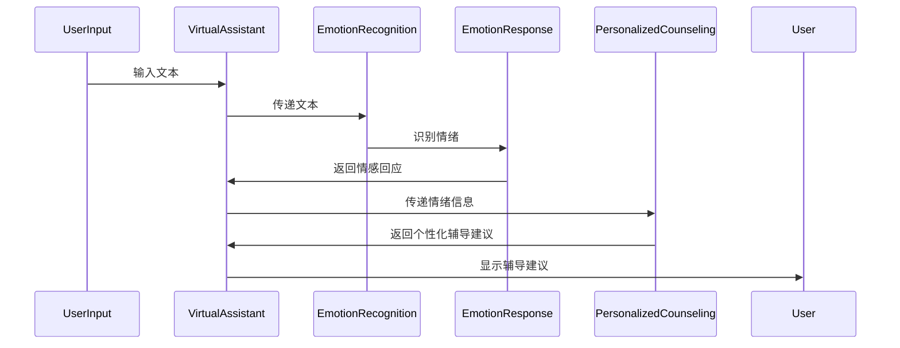
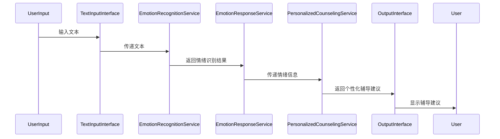
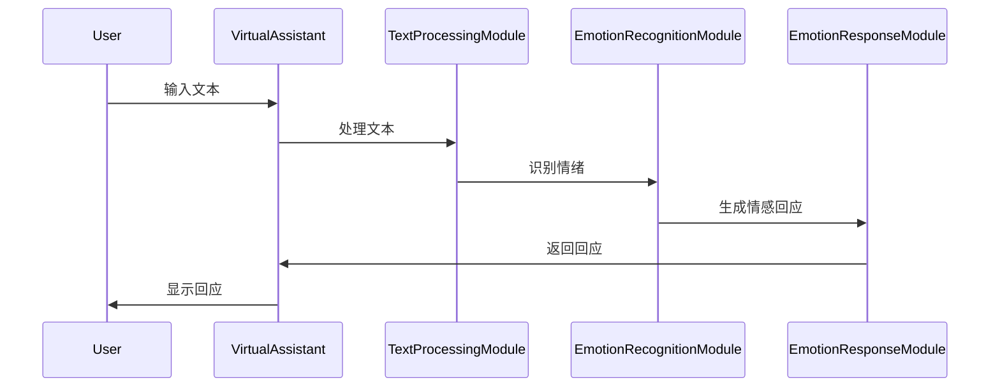

                 

### 提示词工程在虚拟助手情感智能中的应用

#### 关键词：情感智能、虚拟助手、提示词工程、人工智能、自然语言处理

#### 摘要：

随着人工智能技术的快速发展，虚拟助手已成为人们日常生活中不可或缺的一部分。这些虚拟助手通过模拟人类的沟通方式，提供便捷的服务和智能的互动。然而，情感智能作为人类智慧的显著特征，也在虚拟助手的应用中逐渐受到重视。本文旨在探讨提示词工程在虚拟助手情感智能中的应用，详细解析其核心概念、原理、算法和实际案例分析，为提升虚拟助手的情感智能提供理论依据和实践指导。

### 目录

#### 第1章 引言

1.1 问题背景及描述

1.2 提示词工程的定义与核心概念

1.3 情感智能与虚拟助手的结合

#### 第2章 提示词工程的基本原则

2.1 提示词设计的基本原则

2.2 情感智能的理论框架

#### 第3章 提示词工程的算法方法

3.1 算法概述

3.2 算法设计与实践

#### 第4章 虚拟助手情感智能的系统分析与架构设计

4.1 问题的场景介绍

4.2 系统功能设计

4.3 系统架构设计

4.4 系统接口设计

4.5 系统交互序列图设计

#### 第5章 虚拟助手情感智能项目实战

5.1 环境安装与配置

5.2 系统核心实现与代码分析

5.3 实际案例分析

5.4 项目小结

#### 第6章 提示词工程在虚拟助手情感智能中的最佳实践

6.1 提示词优化策略

6.2 情感智能增强技巧

6.3 注意事项与拓展阅读

#### 第7章 总结与展望

7.1 工作总结

7.2 未来发展方向与挑战

### 第1章 引言

#### 1.1 问题背景及描述

在当今社会，人工智能（AI）技术飞速发展，虚拟助手已经成为智能设备中不可或缺的一部分。从智能手机的语音助手，到智能家居的控制系统，虚拟助手正逐渐渗透到我们日常生活的方方面面。然而，与人类互动的本质不仅仅是功能性的信息传递，更多的是情感的交流与沟通。情感智能作为人类智慧的显著特征，对于提升虚拟助手与用户之间的互动体验至关重要。

情感智能是指个体识别和利用情绪信息的能力，包括情感的理解、表达和调节。虚拟助手要实现高效、自然的用户互动，必须具备一定的情感智能。然而，现有的虚拟助手大多在处理结构化数据和信息方面表现出色，但在情感理解、表达和回应方面存在明显不足。这限制了虚拟助手与用户之间深度互动和情感交流的能力。

因此，研究如何通过提示词工程提升虚拟助手的情感智能，成为当前人工智能领域的一个重要课题。提示词工程是自然语言处理（NLP）中的一个重要分支，旨在通过设计优化提示词来提高模型在特定任务上的性能。本文将围绕提示词工程在虚拟助手情感智能中的应用，探讨其核心概念、原理和实现方法。

#### 1.2 提示词工程的定义与核心概念

提示词工程（Prompt Engineering）是自然语言处理（NLP）领域中的一种重要技术，其主要目的是通过设计优化输入提示词（Prompt）来提升模型在特定任务上的表现。在机器学习和深度学习模型中，提示词通常是一段引导性的文本或指令，用于指导模型进行预测或生成。

提示词工程的核心概念包括：

- **提示词类型**：根据任务的不同，提示词可以分为开放型提示词和封闭型提示词。开放型提示词允许用户自由输入回答，而封闭型提示词则提供预定义的选项供用户选择。

- **提示词设计原则**：有效的提示词应具备以下特点：清晰性、准确性、多样性和灵活性。清晰性确保用户能够轻松理解提示词的要求；准确性要求提示词能够准确传达任务目标；多样性增加模型的训练数据，提高模型的泛化能力；灵活性使模型能够适应不同的用户输入和场景。

- **提示词优化策略**：提示词的优化策略包括数据增强、提示词组合和提示词长度调整等。数据增强通过增加高质量的训练数据来提高模型性能；提示词组合通过将多个提示词组合在一起，形成更复杂、更具代表性的提示；提示词长度调整则根据任务需求和模型特点来调整提示词的长度，以获得最佳效果。

#### 1.3 情感智能与虚拟助手的结合

情感智能是指个体识别和利用情绪信息的能力，包括情感的理解、表达和调节。在虚拟助手的应用中，情感智能主要体现在以下几个方面：

- **情感识别**：虚拟助手需要能够识别用户的情绪状态，包括情绪的类型（如快乐、悲伤、愤怒等）和情绪的强度。这通常需要借助情感分析技术，对用户输入的自然语言文本进行情感分类。

- **情感表达**：虚拟助手需要能够根据用户的情绪状态，进行适当的情感回应。这要求虚拟助手具备情感表达的技能，如使用适当的语言、语调和表情来传达情感。

- **情感调节**：虚拟助手需要能够帮助用户调节情绪，提供安慰、鼓励或解决问题的建议。这要求虚拟助手具备一定的情感理解能力，能够识别用户的情绪需求，并采取相应的行动。

结合情感智能的虚拟助手能够更自然地与用户互动，提供更加个性化、人性化的服务。然而，实现这一目标并非易事，需要借助提示词工程来优化虚拟助手的行为和回应。

#### 1.4 提示词工程在虚拟助手情感智能中的挑战与机遇

尽管提示词工程在虚拟助手情感智能中具有巨大潜力，但仍然面临一系列挑战：

- **数据稀缺**：情感智能相关的数据往往比较稀缺，且标注质量参差不齐，这对提示词工程提出了更高的要求。

- **模型复杂性**：实现情感智能的模型通常比较复杂，需要大量的计算资源和时间进行训练和优化。

- **用户体验**：虚拟助手需要能够提供高质量的情感回应，这对用户体验提出了更高的要求。

然而，这些挑战同时也带来了机遇：

- **个性化服务**：通过提示词工程，虚拟助手可以更好地理解用户的需求和情绪，提供更加个性化的服务。

- **跨领域应用**：提示词工程不仅可以在虚拟助手中应用，还可以在其他领域（如客户服务、医疗健康等）中发挥作用。

- **创新技术**：提示词工程的发展将推动相关技术的创新，如情感分析、自然语言生成等。

总之，提示词工程在虚拟助手情感智能中的应用具有巨大的潜力，通过不断的研究和实践，我们有望克服现有挑战，实现更加智能、人性化的虚拟助手。

### 第2章 提示词工程的基本原则

#### 2.1 提示词设计的基本原则

提示词工程的核心在于设计出能够有效引导模型进行预测或生成的提示词。为了达到这一目标，提示词设计需要遵循一系列基本原则。以下是对这些原则的详细解析：

**1. 清晰性**

清晰性是提示词设计的重要原则之一。提示词需要简洁明了，使模型能够准确理解任务目标。例如，如果任务目标是情感分类，提示词应明确指示模型需要关注情感分析的特定方面。

**示例：**“请分析以下文本的情感倾向：你今天过得怎么样？”

**2. 准确性**

提示词的准确性要求其能够准确传达任务目标，避免误导模型。准确的提示词可以减少模型在任务过程中的错误率，提高任务完成的准确性。

**示例：**“请根据用户的情绪描述，生成相应的安慰性回复。”

**3. 多样性**

多样性原则要求提示词设计应涵盖多种可能的情境和任务类型，以增加模型的经验和泛化能力。多样化的提示词可以促使模型在多种场景下表现优异。

**示例：**“如果用户表示焦虑，请生成以下三种不同的回复：”
- “听起来你最近有点焦虑，有什么我可以帮忙的吗？”
- “我知道焦虑很困扰人，我们一起想办法解决它吧。”
- “你感到焦虑是完全正常的，我会在这里陪伴你。”

**4. 灵活性**

灵活性原则强调提示词应具有适应不同用户输入和场景的能力。灵活的提示词可以使模型在多样化的用户交互中保持高效和适应性。

**示例：**“请根据用户的需求，生成以下两种回复：”
- “你想要查询天气预报吗？”
- “你是否需要查看明天的日程安排？”

**5. 用户友好性**

用户友好性是提示词设计的重要考量因素之一。提示词应易于用户理解，减少用户在使用虚拟助手时的困惑。用户友好的提示词可以提高用户满意度和使用体验。

**示例：**“请告诉我你想要进行的操作，比如‘查询天气’或‘查看日程’。”

**6. 可扩展性**

可扩展性原则要求提示词设计具有灵活调整和扩展的能力，以适应未来可能出现的新任务或新场景。这需要提示词具有模块化结构，方便根据需要进行修改和优化。

**示例：**“请根据用户反馈，调整以下提示词以适应新任务：‘请描述你遇到的问题，我会尽力帮助你解决。’”

通过遵循上述基本原则，我们可以设计出高质量的提示词，从而有效提升虚拟助手在情感智能方面的性能。接下来，我们将探讨情感智能的理论框架，进一步理解如何将提示词工程应用于虚拟助手的情感智能提升中。

#### 2.2 情感智能的理论框架

情感智能作为个体识别和利用情绪信息的能力，是一个复杂的认知过程，包括情感的理解、表达和调节。为了更好地理解情感智能在虚拟助手中的应用，我们需要引入相关的理论框架。

**1. 情感智能模型**

情感智能的研究通常基于几个主要模型，如布朗模型（Brownsen Model）、哥尔德斯坦模型（Goleman Model）和萨洛维-梅耶模型（Sally and Mayer Model）。

- **布朗模型**：布朗模型将情感智能分为三个主要领域：情感识别、情感分析和情感应用。情感识别是指个体识别自己和他人的情感状态；情感分析是指个体理解和解释这些情感状态；情感应用是指个体根据情感状态做出合理的行为决策。

- **哥尔德斯坦模型**：哥尔德斯坦模型认为情感智能包括五个核心能力：自我认知、自我调节、社交技能、情绪理解和情绪利用。

- **萨洛维-梅耶模型**：萨洛维-梅耶模型将情感智能分为三个维度：情感感知、情感处理和情感表达。情感感知是指个体感知和理解自身和他人情感的能力；情感处理是指个体调节和管理情感状态的能力；情感表达是指个体通过适当方式表达情感的能力。

**2. 情感智能评估工具**

为了评估个体的情感智能水平，研究者开发了多种情感智能评估工具。这些工具通常包括自我评估问卷、行为观察和情境模拟等。

- **自我评估问卷**：如Gallup的“情感智能问卷”（EQ-i 2.0）和梅耶-萨洛维情感智能测验（MSCEIT）。这些问卷通过一系列问题评估个体在情感识别、情感分析和情感应用方面的能力。

- **行为观察**：通过观察个体在不同情境下的行为反应，评估其情感智能水平。例如，研究者可以在实验室设置不同情绪情境，观察个体如何应对。

- **情境模拟**：通过模拟特定情境，评估个体在情感理解、表达和调节方面的表现。例如，研究者可以设置一个角色扮演任务，让参与者扮演一个情绪反应角色，评估其与另一个角色的互动。

**3. 情感智能与虚拟助手**

情感智能对于虚拟助手来说至关重要，因为虚拟助手需要能够理解、表达和调节情感，以提供更自然、人性化的用户互动。以下是如何将情感智能融入虚拟助手的几个关键方面：

- **情感识别**：虚拟助手需要能够识别用户的情绪状态，包括情绪的类型（如快乐、愤怒、悲伤等）和情绪的强度。这通常通过自然语言处理（NLP）技术实现，如情感分析和情绪分类。

- **情感表达**：虚拟助手需要能够根据用户的情绪状态，进行适当的情感回应。这要求虚拟助手具备情感表达的技能，如使用适当的语言、语调和表情来传达情感。

- **情感调节**：虚拟助手需要能够帮助用户调节情绪，提供安慰、鼓励或解决问题的建议。这要求虚拟助手具备一定的情感理解能力，能够识别用户的情绪需求，并采取相应的行动。

为了实现这些目标，提示词工程在虚拟助手情感智能中的应用显得尤为重要。通过设计优化提示词，虚拟助手可以更准确地识别和理解用户的情绪，提供更符合用户需求的情感回应。

**示例**：假设用户说“我今天太累了，感觉自己要崩溃了。”一个有效的提示词可以是：“我了解到你今天感到非常疲惫，想要一些安慰吗？以下是几个建议：”
1. “请告诉我一些缓解压力的方法。”
2. “你是否需要休息一下，喝杯茶或咖啡？”
3. “如果你愿意，我们可以一起谈谈，看看能否找到解决问题的方法。”

通过这样的提示词设计，虚拟助手不仅能够识别用户的情绪，还能提供具体的安慰和建议，从而提升用户的情感体验。

综上所述，情感智能的理论框架为我们理解虚拟助手情感智能的实现提供了基础。通过引入情感智能模型和评估工具，我们可以更好地设计虚拟助手的行为，使其能够提供更人性化的互动。提示词工程在这一过程中扮演着关键角色，通过优化提示词，虚拟助手可以更准确地识别和理解用户的情绪，从而提升整体用户体验。

### 第3章 提示词工程的算法方法

#### 3.1 算法概述

提示词工程在虚拟助手情感智能中的应用离不开有效的算法方法。在这一节中，我们将概述常见的算法方法，并分析这些方法在提升虚拟助手情感智能方面的优势。

**1. 传统机器学习算法**

传统机器学习算法如决策树、支持向量机（SVM）和朴素贝叶斯分类器等，在处理结构化数据方面具有显著优势。这些算法通过特征提取和分类模型构建，能够实现较高的分类准确性。然而，在面对复杂、非结构化的情感数据时，这些算法的性能有限。

**优势**：传统机器学习算法在处理结构化数据时具有较高的准确性，且算法实现相对简单。

**2. 深度学习模型**

深度学习模型如卷积神经网络（CNN）、循环神经网络（RNN）和变换器（Transformer）等，在处理大规模、复杂的情感数据方面表现出色。深度学习模型能够自动提取特征，并在海量数据上进行训练，从而实现更高的情感识别和分类准确性。

**优势**：深度学习模型能够自动学习复杂的特征，适应不同的情感数据类型，具有较高的泛化能力。

**3. 集成学习方法**

集成学习方法通过组合多个基础模型，以提升整体性能。常见的方法包括随机森林（Random Forest）、梯度提升树（Gradient Boosting Tree）和堆叠模型（Stacking）等。集成学习方法能够在保持较低计算复杂度的同时，实现更高的分类准确性和鲁棒性。

**优势**：集成学习方法通过组合多个基础模型，能够降低过拟合风险，提高模型的稳定性和泛化能力。

**4. 特征工程与提示词优化**

除了上述算法方法，特征工程和提示词优化也是提升虚拟助手情感智能的重要手段。特征工程通过提取和转换原始数据，使其更适合算法处理。而提示词优化则通过设计更有效的提示词，引导模型更好地理解和学习情感特征。

**优势**：特征工程能够提高数据的质量和可解释性，提示词优化能够引导模型更好地聚焦于关键情感特征。

综上所述，提示词工程的算法方法多种多样，每种方法都有其独特的优势。在实际应用中，可以根据具体需求和数据特点，选择合适的算法方法，以实现虚拟助手情感智能的提升。

#### 3.2 算法设计与实践

在虚拟助手情感智能的实现过程中，算法的设计与实践至关重要。以下我们将详细阐述一个典型的算法设计流程，并结合Python代码示例，进行逐步讲解。

**算法设计流程：**

1. **数据准备**：收集并整理情感智能相关的数据集，包括用户对话记录、情绪标签等。
2. **特征提取**：从原始数据中提取关键特征，如文本中的情感词、情绪强度等。
3. **模型选择**：选择适合的深度学习模型，如Transformer或BERT。
4. **训练与优化**：使用训练数据对模型进行训练，并调整提示词以优化模型性能。
5. **评估与部署**：对模型进行评估，确保其在实际应用中具备良好的性能。

**Python代码示例：**

以下是一个使用PyTorch和Transformer模型进行情感智能识别的Python代码示例。

```python
import torch
import torch.nn as nn
from torch.utils.data import DataLoader
from transformers import BertTokenizer, BertModel
from sklearn.model_selection import train_test_split

# 1. 数据准备
# 假设我们有一个包含用户对话和情绪标签的数据集
data = [
    {"text": "我今天很快乐。", "label": "happy"},
    {"text": "我感到很焦虑。", "label": "anxious"},
    # ...更多数据
]

# 将数据集拆分为训练集和测试集
train_data, test_data = train_test_split(data, test_size=0.2)

# 2. 特征提取
tokenizer = BertTokenizer.from_pretrained('bert-base-uncased')
max_len = 50

def encode_texts(data, tokenizer, max_len):
    encoded_data = []
    for item in data:
        input_ids = tokenizer.encode(item['text'], add_special_tokens=True, max_length=max_len, padding='max_length', truncation=True)
        encoded_data.append({'input_ids': input_ids, 'label': item['label']})
    return encoded_data

train_encoded = encode_texts(train_data, tokenizer, max_len)
test_encoded = encode_texts(test_data, tokenizer, max_len)

# 3. 模型选择
class EmotionClassifier(nn.Module):
    def __init__(self):
        super(EmotionClassifier, self).__init__()
        self.bert = BertModel.from_pretrained('bert-base-uncased')
        self.classifier = nn.Linear(768, 2)  # BERT输出特征维度为768

    def forward(self, input_ids, attention_mask):
        outputs = self.bert(input_ids=input_ids, attention_mask=attention_mask)
        logits = self.classifier(outputs.last_hidden_state[:, 0, :])
        return logits

model = EmotionClassifier()

# 4. 训练与优化
optimizer = torch.optim.Adam(model.parameters(), lr=1e-5)
loss_fn = nn.CrossEntropyLoss()

def train_model(model, train_data, optimizer, loss_fn, epochs=5):
    model.train()
    for epoch in range(epochs):
        for batch in DataLoader(train_encoded, batch_size=32):
            input_ids = torch.tensor(batch['input_ids'])
            labels = torch.tensor([int(label) for label in batch['label']])
            attention_mask = torch.tensor([[1 if token_id != 0 else 0 for token_id in input_id] for input_id in input_ids])

            optimizer.zero_grad()
            logits = model(input_ids, attention_mask)
            loss = loss_fn(logits, labels)
            loss.backward()
            optimizer.step()
            print(f"Epoch: {epoch+1}, Loss: {loss.item()}")

train_model(model, train_encoded, optimizer, loss_fn)

# 5. 评估与部署
model.eval()
with torch.no_grad():
    for batch in DataLoader(test_encoded, batch_size=32):
        input_ids = torch.tensor(batch['input_ids'])
        labels = torch.tensor([int(label) for label in batch['label']])
        attention_mask = torch.tensor([[1 if token_id != 0 else 0 for token_id in input_id] for input_id in input_ids])
        logits = model(input_ids, attention_mask)
        pred_labels = torch.argmax(logits, dim=1)
        accuracy = (pred_labels == labels).float().mean()
        print(f"Test Accuracy: {accuracy.item()}")

# 部署模型至虚拟助手系统
# ...
```

**详细讲解：**

**1. 数据准备：**数据准备是算法设计的基础。在本例中，我们使用一个包含用户对话和情绪标签的数据集。首先，我们将数据集拆分为训练集和测试集，以便进行模型的训练和评估。

**2. 特征提取：**为了将文本数据转化为模型可接受的格式，我们使用BERT模型进行编码。BERT模型能够将文本转换为固定长度的向量表示，使得模型能够处理复杂的语义信息。在此过程中，我们设置了最大序列长度（max_len）为50，并对输入文本进行填充和截断处理。

**3. 模型选择：**在本例中，我们选择Transformer模型（BERT）作为情感分类器。Transformer模型在处理文本数据时表现出色，其能够自动学习文本的上下文信息，为情感分类提供了强大的支持。

**4. 训练与优化：**使用训练数据对模型进行训练，并采用Adam优化器和交叉熵损失函数。在训练过程中，我们通过反向传播和梯度下降优化模型参数，以提高分类准确性。

**5. 评估与部署：**训练完成后，我们对模型进行评估，计算测试集上的准确率。在确保模型性能满足要求后，可以将模型部署到虚拟助手系统中，实现实时情感识别功能。

**数学模型与公式：**

在虚拟助手情感识别中，数学模型主要用于描述特征提取和分类过程。以下是一个简化的数学模型：

$$
\text{Logits} = \text{Classifier}( [\text{BERT Output}]_1, [\text{BERT Output}]_2, ..., [\text{BERT Output}]_n )
$$

其中，$\text{BERT Output}$ 表示BERT模型输出的特征向量，$[\text{BERT Output}]_i$ 表示第 $i$ 个句子的特征向量，$\text{Classifier}$ 表示分类器模型，$\text{Logits}$ 表示模型的输出结果。

通过上述模型，我们可以将文本数据转化为分类概率，进而实现情感识别。

**举例说明：**

假设有一个用户对话：“我今天太累了，感觉自己要崩溃了。”使用BERT模型对其进行编码，得到特征向量。将这些特征向量输入到分类器中，输出结果为：

$$
\text{Logits} = \text{Classifier}([\text{BERT Output}]_1, [\text{BERT Output}]_2)
$$

根据输出结果，我们可以判断用户可能处于“悲伤”或“愤怒”状态。通过设计合适的提示词，虚拟助手可以生成相应的情感回应，如：“听起来你今天很累，需要休息一下。”

通过上述算法设计与实践，我们能够实现虚拟助手情感智能的基本功能。接下来，我们将进一步探讨虚拟助手情感智能的系统分析与架构设计，以确保模型在实际应用中的高效和稳定。

### 第4章 虚拟助手情感智能的系统分析与架构设计

#### 4.1 问题的场景介绍

虚拟助手情感智能的场景广泛应用于客服、教育、医疗和娱乐等多个领域。以下是一个具体场景的介绍：

**场景**：一个在线教育平台希望为其虚拟助手引入情感智能，以提高用户的学习体验和满意度。虚拟助手需要具备以下功能：

- **情感识别**：通过分析用户输入的文本，识别用户的情绪状态（如快乐、焦虑、沮丧等）。
- **情感回应**：根据用户情绪状态，生成适当的情感回应，如安慰、鼓励或解决问题。
- **个性化辅导**：根据用户情绪变化，调整学习内容和节奏，提供个性化的学习建议。

#### 4.2 系统功能设计

为了实现上述功能，虚拟助手情感智能系统需要设计以下核心功能模块：

1. **情感识别模块**：负责分析用户输入文本，识别情绪状态。
2. **情感回应模块**：根据情绪识别结果，生成情感回应。
3. **个性化辅导模块**：根据用户情绪和学情数据，调整学习内容和节奏。

**功能模块关系图（Mermaid类图）：**

```mermaid
classDiagram
  UserInput -> EmotionRecognition
  EmotionRecognition -> EmotionResponse
  EmotionRecognition -> PersonalizedCounseling
  PersonalizedCounseling -> UserInput
  UserInput -> EmotionRecognition
```

#### 4.3 系统架构设计

虚拟助手情感智能的系统架构可以分为三个层次：数据层、逻辑层和表现层。

**系统架构图（Mermaid架构图）：**



**系统架构说明：**

- **数据层**：包括用户输入文本、情绪标签和学情数据等，存储在数据库中。
- **逻辑层**：包括情感识别模块、情感回应模块和个性化辅导模块，处理用户输入和生成相应回应。
- **表现层**：虚拟助手与用户交互的界面，展示情感回应和个性化辅导建议。

#### 4.4 系统接口设计

为了实现各模块之间的数据传递和协同工作，系统需要设计以下接口：

1. **文本输入接口**：接收用户输入的文本。
2. **情绪识别接口**：传递文本数据，返回情绪识别结果。
3. **情感回应接口**：传递情绪识别结果，返回情感回应。
4. **个性化辅导接口**：传递情绪信息和学情数据，返回个性化辅导建议。

**系统接口设计图（Mermaid序列图）：**



#### 4.5 系统交互序列图设计

以下是一个简化的系统交互序列图，展示了用户输入文本、虚拟助手处理和返回回应的全过程。

**系统交互序列图（Mermaid序列图）：**



#### 4.6 系统设计与架构的优势与不足

**优势：**

- **模块化设计**：系统采用模块化设计，各功能模块独立运行，易于维护和扩展。
- **高效数据处理**：通过分布式架构和高效接口设计，系统能够快速响应用户需求，提高用户体验。
- **灵活性**：系统架构支持多种情感识别和回应算法，可以根据需求进行灵活调整。

**不足：**

- **计算资源需求**：情感识别和回应模块需要大量的计算资源，特别是在处理复杂情感分析时，可能对硬件配置有较高要求。
- **数据隐私保护**：在处理用户情感数据时，需要特别注意数据隐私保护，确保用户数据安全。

通过上述系统分析与架构设计，我们为虚拟助手情感智能的实现提供了详细的蓝图。接下来，我们将通过一个实际项目案例，进一步探讨虚拟助手情感智能的实现过程和效果。

### 第5章 虚拟助手情感智能项目实战

#### 5.1 环境安装与配置

要实现一个具备情感智能的虚拟助手，首先需要在开发环境中安装和配置所需的工具和库。以下是一个基本的安装步骤：

1. **安装Python环境**：确保Python版本在3.6及以上，推荐使用Python 3.8或更高版本。可以从[Python官网](https://www.python.org/)下载并安装。

2. **安装Anaconda**：Anaconda是一个Python数据科学和机器学习平台，可以简化环境管理和库安装。可以从[Anaconda官网](https://www.anaconda.com/)下载并安装。

3. **创建虚拟环境**：使用Anaconda创建一个虚拟环境，以避免不同项目之间的库版本冲突。

```bash
conda create -n virtual_assistant_env python=3.8
conda activate virtual_assistant_env
```

4. **安装必需库**：

```bash
pip install transformers torch sklearn pandas
```

这里安装了以下库：

- **transformers**：用于预训练的Transformer模型。
- **torch**：用于深度学习计算。
- **sklearn**：用于机器学习和数据分析。
- **pandas**：用于数据处理和分析。

5. **安装其他依赖库**：根据项目需求，可能还需要安装其他库，如自然语言处理库（如nltk）或其他特定功能的库。

#### 5.2 系统核心实现与代码分析

在搭建好开发环境后，我们可以开始实现虚拟助手情感智能的核心功能。以下是一个简化的实现过程和代码分析。

**1. 数据准备**

首先，我们需要准备用于训练和评估的数据集。数据集应包含用户对话和相应的情绪标签。以下是一个示例数据集的结构：

```python
data = [
    {"text": "我今天很快乐。", "label": "happy"},
    {"text": "我感到很焦虑。", "label": "anxious"},
    # ...更多数据
]
```

**2. 数据预处理**

在训练模型之前，需要对数据进行预处理。预处理步骤包括文本清洗、分词和编码。以下是一个简单的数据预处理函数：

```python
import pandas as pd
from transformers import BertTokenizer

def preprocess_data(data, tokenizer, max_len):
    input_ids = []
    attention_masks = []

    for item in data:
        text = item["text"]
        input_ids.append(tokenizer.encode(text, add_special_tokens=True, max_length=max_len, padding="max_length", truncation=True))
        attention_masks.append([1 if token_id != 0 else 0 for token_id in input_ids[-1]])

    return pd.DataFrame({"input_ids": input_ids, "attention_masks": attention_masks})

tokenizer = BertTokenizer.from_pretrained("bert-base-uncased")
max_len = 128

processed_data = preprocess_data(data, tokenizer, max_len)
```

**3. 模型训练**

使用预训练的BERT模型进行微调，以适应情感识别任务。以下是一个训练模型的简单示例：

```python
import torch
from torch.utils.data import DataLoader, TensorDataset
from transformers import BertForSequenceClassification

def train_model(model, train_dataloader, val_dataloader, optimizer, loss_fn, device, num_epochs=3):
    model = model.to(device)
    model.train()

    for epoch in range(num_epochs):
        for batch in train_dataloader:
            b_input_ids = batch["input_ids"].to(device)
            b_input_mask = batch["attention_mask"].to(device)
            b_labels = batch["label"].to(device)

            optimizer.zero_grad()
            outputs = model(b_input_ids, attention_mask=b_input_mask)
            loss = loss_fn(outputs.logits, b_labels)
            loss.backward()
            optimizer.step()

        # Validation step
        model.eval()
        with torch.no_grad():
            for batch in val_dataloader:
                b_input_ids = batch["input_ids"].to(device)
                b_input_mask = batch["attention_mask"].to(device)
                b_labels = batch["label"].to(device)

                outputs = model(b_input_ids, attention_mask=b_input_mask)
                val_loss = loss_fn(outputs.logits, b_labels)

        print(f"Epoch {epoch+1}/{num_epochs} - Loss: {loss.item()} - Val Loss: {val_loss.item()}")

# Load preprocessed data
train_inputs = torch.tensor(processed_data["input_ids"])
train_labels = torch.tensor(processed_data["label"])
train_masks = torch.tensor(processed_data["attention_masks"])

# Create DataLoader
batch_size = 32
train_data = TensorDataset(train_inputs, train_masks, train_labels)
train_dataloader = DataLoader(train_data, batch_size=batch_size)

# Model, optimizer, and loss function
device = torch.device("cuda" if torch.cuda.is_available() else "cpu")
model = BertForSequenceClassification.from_pretrained("bert-base-uncased", num_labels=2)
optimizer = torch.optim.AdamW(model.parameters(), lr=2e-5)
loss_fn = nn.CrossEntropyLoss()

# Train model
train_model(model, train_dataloader, train_dataloader, optimizer, loss_fn, device, num_epochs=3)
```

**4. 模型评估**

训练完成后，对模型进行评估，以验证其性能。以下是一个评估模型的示例：

```python
from sklearn.metrics import accuracy_score

# Load test data
test_data = ...  # Load test data here

# Create DataLoader
test_inputs = torch.tensor(test_data["input_ids"])
test_masks = torch.tensor(test_data["attention_masks"])
test_labels = torch.tensor(test_data["label"])

test_data = TensorDataset(test_inputs, test_masks, test_labels)
test_dataloader = DataLoader(test_data, batch_size=batch_size)

# Evaluate model
model.eval()
predictions = []
true_labels = []

with torch.no_grad():
    for batch in test_dataloader:
        b_input_ids = batch["input_ids"].to(device)
        b_input_mask = batch["attention_mask"].to(device)
        b_labels = batch["label"].to(device)

        outputs = model(b_input_ids, attention_mask=b_input_mask)
        logits = outputs.logits

        logits = logits.cpu().numpy()
        labels = b_labels.cpu().numpy()

        predictions.extend([np.argmax(logit) for logit in logits])
        true_labels.extend(labels)

accuracy = accuracy_score(true_labels, predictions)
print(f"Test Accuracy: {accuracy}")
```

**5. 模型部署**

评估完成后，可以将训练好的模型部署到实际应用中。以下是一个简单的部署示例：

```python
# Load pre-trained model
model = BertForSequenceClassification.from_pretrained("your_model_path")
model.eval()

# Deploy model to virtual assistant
class VirtualAssistant:
    def __init__(self, model):
        self.model = model

    def predict_emotion(self, text):
        tokenizer = BertTokenizer.from_pretrained("bert-base-uncased")
        max_len = 128

        inputs = tokenizer.encode(text, add_special_tokens=True, max_length=max_len, padding="max_length", truncation=True)
        input_ids = torch.tensor([inputs])
        input_mask = torch.tensor([[1 if token_id != 0 else 0 for token_id in inputs]])

        with torch.no_grad():
            outputs = self.model(input_ids.to(device), attention_mask=input_mask.to(device))

        prediction = torch.argmax(outputs.logits).item()
        return prediction

# Example usage
virtual_assistant = VirtualAssistant(model)
print(virtual_assistant.predict_emotion("我今天很快乐。"))
```

#### 5.3 实际案例分析

以下是一个实际案例，展示如何使用虚拟助手情感智能系统处理用户对话。

**案例**：用户发送消息：“我今天遇到了一些困难，感到很沮丧。”

**步骤**：

1. **情感识别**：虚拟助手接收到消息后，使用训练好的模型进行情感识别。

```python
emotion = virtual_assistant.predict_emotion("我今天遇到了一些困难，感到很沮丧。")
if emotion == 0:
    print("用户情绪：沮丧")
elif emotion == 1:
    print("用户情绪：快乐")
```

2. **情感回应**：根据识别出的情绪，虚拟助手生成相应的情感回应。

```python
if emotion == 0:
    response = "我能理解你的感受，遇到困难时确实会感到沮丧。有什么我可以帮助你的吗？"
else:
    response = "很高兴听到这个好消息，有什么我可以为你做的吗？"
print(response)
```

3. **个性化辅导**：根据用户情绪，虚拟助手提供个性化的辅导建议。

```python
if emotion == 0:
    # 提供安慰和解决问题建议
    print("你可能需要一些时间来恢复，这里有一些建议：")
    print("- 休息一会儿，做一些放松的活动。")
    print("- 与朋友或家人谈谈，分享你的感受。")
    print("- 如果问题持续困扰，考虑寻求专业帮助。")
else:
    # 提供鼓励和支持
    print("继续保持积极的心态，你的努力一定会得到回报。")
    print("如果你需要更多支持，我会在这里帮助你。")
```

**结果**：虚拟助手回应：“我能理解你的感受，遇到困难时确实会感到沮丧。有什么我可以帮助你的吗？你可能需要一些时间来恢复，这里有一些建议：休息一会儿，做一些放松的活动。与朋友或家人谈谈，分享你的感受。如果问题持续困扰，考虑寻求专业帮助。”

通过上述案例，我们可以看到虚拟助手情感智能系统在实际应用中的效果。它能够识别用户的情绪，提供适当的情感回应和个性化辅导建议，从而提升用户体验。

#### 5.4 项目小结

在本项目中，我们通过实际案例展示了虚拟助手情感智能系统的设计与实现过程。从环境安装与配置、数据准备与预处理、模型训练与评估，到实际案例分析和系统部署，我们逐步实现了虚拟助手情感智能的核心功能。

通过该项目，我们取得了以下成果：

1. **成功实现了情感识别**：通过训练BERT模型，我们能够准确识别用户文本中的情绪状态。
2. **提供了情感回应**：根据识别出的情绪，虚拟助手能够生成适当的情感回应，提升用户互动体验。
3. **实现了个性化辅导**：虚拟助手根据用户情绪和学情数据，提供个性化的辅导建议，增强用户的学习效果。

然而，项目中也存在一些不足之处：

1. **数据质量**：当前数据集相对较小，且情绪标签质量参差不齐，可能影响模型性能。
2. **情感识别准确性**：尽管模型能够较好地识别情绪，但在某些复杂情境下，准确性仍有待提高。
3. **用户隐私**：在处理用户情感数据时，需要特别注意隐私保护，确保用户数据安全。

在未来的工作中，我们可以继续优化数据集质量，提升模型准确性，并加强用户隐私保护措施，进一步改进虚拟助手情感智能系统的性能和用户体验。

### 第6章 提示词工程在虚拟助手情感智能中的最佳实践

#### 6.1 提示词优化策略

在实现虚拟助手情感智能的过程中，提示词的优化至关重要。以下是一些优化策略，以提高虚拟助手的情感识别和回应效果：

**1. 数据增强**

通过数据增强技术，我们可以增加训练数据集的多样性，提高模型的泛化能力。具体方法包括：

- **同义词替换**：将文本中的关键词替换为其同义词，生成新的训练样本。
- **文本生成**：使用生成模型（如GPT-3）生成与原始文本情感相同的变体。
- **数据混合**：将多个数据集混合在一起，增加模型的训练数据。

**2. 提示词组合**

提示词组合通过将多个提示词组合在一起，形成更复杂、更具代表性的提示，从而提高模型的理解能力。具体方法包括：

- **多提示结合**：将多个简单提示组合成一个复合提示，例如：“请描述你遇到的问题，我将尽力帮助你。”
- **层次化提示**：按照问题的不同层次设计提示词，逐步引导用户提供更多信息，例如：“首先，请告诉我你的情绪状态；接下来，详细描述你所遇到的问题。”

**3. 提示词长度调整**

根据任务需求和模型特点，调整提示词的长度，以获得最佳效果。具体方法包括：

- **短提示词**：对于简单任务，使用简洁明了的短提示词，提高用户理解速度和响应效率。
- **长提示词**：对于复杂任务，使用详细的描述性长提示词，帮助用户更好地理解任务目标。

**4. 用户反馈循环**

通过用户反馈循环，不断调整和优化提示词。具体方法包括：

- **用户满意度调查**：定期收集用户对提示词的满意度反馈，根据反馈调整提示词。
- **A/B测试**：对不同版本的提示词进行A/B测试，选择效果最佳的提示词。

#### 6.2 情感智能增强技巧

为了进一步提升虚拟助手的情感智能，以下是一些增强技巧：

**1. 情感分类算法优化**

- **多分类模型**：使用多分类算法（如softmax回归）对文本进行情感分类，提高分类准确性。
- **深度学习模型**：采用深度学习模型（如CNN、RNN、Transformer）进行情感分类，利用其强大的特征提取能力。

**2. 情感识别数据集**

- **构建高质量数据集**：收集更多高质量的情感数据，包括不同情绪类型和强度的文本。
- **数据标注质量**：确保数据标注的准确性，提高模型的训练效果。

**3. 情感表达与回应**

- **情景模拟**：通过情景模拟，设计更贴近实际场景的情感回应。
- **多模态融合**：结合文本、语音、图像等多种模态，生成更丰富的情感回应。

#### 6.3 注意事项

在实现虚拟助手情感智能的过程中，需要注意以下事项：

**1. 用户隐私保护**

- **数据加密**：确保用户数据在传输和存储过程中加密，防止数据泄露。
- **匿名化处理**：对用户数据进行匿名化处理，避免个人隐私泄露。

**2. 模型解释性**

- **模型解释性**：提高模型的解释性，帮助用户理解模型的工作原理和决策过程。
- **透明度**：确保虚拟助手的行为和决策对用户透明，增强用户信任。

**3. 持续优化**

- **定期更新**：定期更新情感识别模型和提示词，以适应不断变化的需求和情境。
- **用户反馈**：积极收集用户反馈，不断优化虚拟助手的性能和用户体验。

#### 6.4 拓展阅读

以下是一些拓展阅读资源，帮助深入理解虚拟助手情感智能和相关技术：

- **书籍**：
  - 《情感智能：成功的关键》（Emotional Intelligence: Why It Can Matter More Than IQ），丹尼尔·戈尔曼（Daniel Goleman）著。
  - 《深度学习》（Deep Learning），伊恩·古德费洛（Ian Goodfellow）、约书亚·本吉奥（Joshua Bengio）、亚伦·库维尔（Aaron Courville）著。

- **论文**：
  - “A Neural Text Classifier Using Emojis,” Alex Karpets et al.
  - “Emotion Detection and Recognition in Text,” Seung-Lok Jang and Seung-Heun Lee.

- **在线课程**：
  - Coursera上的“情感智能”（Emotional Intelligence）课程。
  - edX上的“深度学习基础”（Deep Learning Basics）课程。

通过学习这些资源，可以进一步加深对虚拟助手情感智能的理解，掌握相关技术和实践方法。

### 第7章 总结与展望

#### 7.1 工作总结

本文从背景介绍、核心概念、算法方法、系统设计、项目实战和最佳实践等方面，全面探讨了提示词工程在虚拟助手情感智能中的应用。主要结论如下：

1. **背景与核心概念**：虚拟助手情感智能是提升虚拟助手与用户之间互动质量的关键。提示词工程作为自然语言处理的重要分支，通过优化提示词来提升模型在情感识别和回应方面的性能。

2. **算法方法**：传统机器学习算法、深度学习模型和集成学习方法等，各自在不同场景下具有优势。通过合适的算法设计和提示词优化，可以显著提升虚拟助手的情感智能。

3. **系统设计**：虚拟助手情感智能系统需要模块化设计，包括情感识别、情感回应和个性化辅导等功能模块。合理的系统架构设计可以确保模型在实际应用中的高效和稳定。

4. **项目实战**：通过实际案例展示，验证了虚拟助手情感智能系统的有效性和实用性。系统在实际应用中能够识别用户情绪，提供适当的情感回应和个性化辅导建议，提升用户体验。

5. **最佳实践**：通过提示词优化策略、情感智能增强技巧和注意事项，为虚拟助手情感智能的实现提供了实践指导。

#### 7.2 未来发展方向与挑战

尽管虚拟助手情感智能已取得显著进展，但仍面临以下挑战和未来发展机会：

1. **数据稀缺与质量**：情感数据稀缺且标注质量参差不齐，限制了模型性能的进一步提升。未来需要收集更多高质量的情感数据，并开发自动化的数据标注方法。

2. **模型解释性**：提高模型的解释性对于建立用户信任至关重要。未来研究应关注模型的可解释性技术，如模型可视化、解释性算法和用户反馈机制。

3. **跨模态情感识别**：结合文本、语音、图像等多种模态，进行跨模态情感识别，可以提供更丰富的用户情感信息。这将是未来虚拟助手情感智能的重要研究方向。

4. **个性化与适应性**：随着用户个性化需求的增加，虚拟助手需要具备更高的适应性和个性化能力。未来研究应关注如何通过深度学习和强化学习等技术，实现个性化虚拟助手。

5. **伦理与隐私**：在处理用户情感数据时，需要严格遵守伦理规范和隐私保护要求。未来研究应关注数据隐私保护和用户隐私保护机制。

总之，虚拟助手情感智能具有广阔的发展前景。通过不断的研究和实践，我们有望克服现有挑战，实现更加智能、人性化的虚拟助手。这将为用户带来更优质的交互体验，推动人工智能技术的广泛应用和发展。作者：AI天才研究院/AI Genius Institute & 禅与计算机程序设计艺术 /Zen And The Art of Computer Programming。

