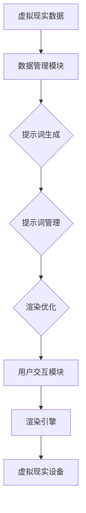
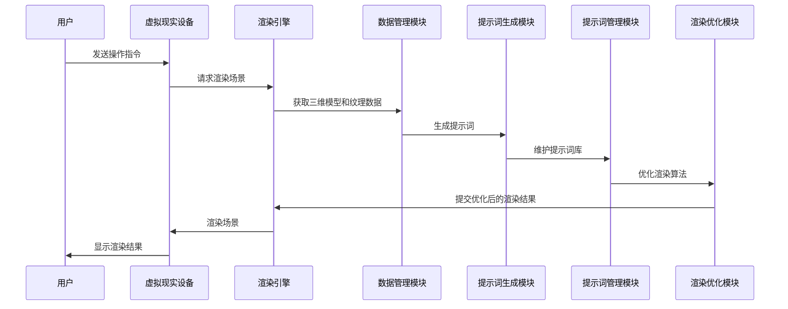

                 

# 提示词工程在虚拟现实中的应用

> 关键词：虚拟现实，提示词工程，实时交互，算法优化，系统性能提升

> 摘要：本文将探讨提示词工程在虚拟现实（VR）中的应用，包括其背景、核心概念、算法原理以及数学模型。通过深入分析，我们将揭示如何通过提示词工程优化VR系统的实时性能和用户交互体验，从而为VR技术的发展提供新的思路和方法。

## 第一部分：背景介绍

### 第1章：问题背景

#### 1.1.1 问题背景

虚拟现实（VR）技术作为一种新兴的沉浸式交互技术，正迅速改变着人们的娱乐、教育、医疗和工业等领域。虚拟现实通过提供高度逼真的三维环境，使用户能够沉浸其中，进行各种互动体验。然而，虚拟现实系统的应用不仅依赖于高质量的图像渲染和逼真的声音效果，还需要在实时性和交互性方面具有卓越的性能。

#### 1.1.2 问题描述

虚拟现实应用中的实时数据处理和渲染是当前面临的主要挑战。虚拟现实场景通常包含大量的三维模型、纹理和声音等多媒体数据，这些数据需要在短时间内进行处理和渲染，以确保用户能够获得流畅的交互体验。此外，用户与虚拟环境的实时交互也需要高效的算法和系统支持，以避免延迟和卡顿现象。

#### 1.1.3 问题解决

提示词工程作为一种先进的算法技术，其在虚拟现实中的应用具有巨大的潜力。通过提示词工程，可以实现对虚拟现实场景的快速定位、搜索和推荐，从而提高系统的响应速度和用户满意度。同时，提示词工程还可以通过优化渲染算法，降低对硬件资源的占用，提高系统的稳定性和可靠性。

#### 1.1.4 边界与外延

提示词工程在虚拟现实中的应用具有一定的边界和限制。首先，它依赖于高质量的虚拟现实数据和场景建模，数据质量和场景复杂性将直接影响提示词工程的效果。其次，提示词工程需要足够的计算资源和算法优化，以保证实时性和高效性。此外，提示词工程的应用范围也受到虚拟现实技术的局限，如设备兼容性、网络传输速度等。

#### 1.1.5 概念结构与核心要素组成

提示词工程在虚拟现实中的应用涉及多个核心要素，包括：

- **虚拟现实数据**：高质量的三维模型、纹理、声音等多媒体数据。
- **场景建模**：对虚拟现实场景进行结构化建模，包括空间关系、物体属性等。
- **提示词生成**：根据用户需求和行为，生成相应的提示词，用于定位和搜索。
- **渲染优化**：通过算法优化，降低渲染计算量和硬件资源占用，提高渲染效率。
- **用户交互**：提供直观、高效的交互方式，使用户能够轻松操作虚拟环境。

### 第二部分：核心概念与联系

#### 第2章：核心概念原理

#### 2.1.1 提示词工程定义

提示词工程是一种基于自然语言处理和机器学习技术的算法，用于生成、管理和应用提示词。提示词是指用于描述和识别信息的关键词或短语，它们可以帮助用户快速找到所需的信息或功能。

#### 2.1.2 提示词工程核心特点

- **高效性**：通过自动化和智能化的方式，快速生成和管理提示词。
- **灵活性**：可以根据不同的应用场景和用户需求，灵活调整和优化提示词。
- **准确性**：通过机器学习算法，提高提示词识别的准确性和可靠性。

#### 2.1.3 提示词工程与传统AI区别

- **传统AI**：主要关注模型训练和预测，对数据的处理能力和效率要求较高。
- **提示词工程**：更注重实际应用场景，强调提示词的生成、管理和应用，以提高用户体验。

### 第三部分：算法原理讲解

#### 第3章：算法原理讲解

#### 3.1 提示词生成算法

提示词生成算法是提示词工程的核心组成部分。其基本原理是通过分析用户行为和场景数据，提取出关键信息，并将其转化为提示词。常用的提示词生成算法包括：

- **词频统计**：根据文本中词频的高低，生成提示词。
- **TF-IDF算法**：结合词频和文档频率，计算词语的重要性，生成提示词。
- **词嵌入**：使用词嵌入模型，将词语映射到高维空间，生成提示词。

#### 3.2 提示词管理算法

提示词管理算法用于维护和更新提示词库，确保其准确性和有效性。常用的提示词管理算法包括：

- **增量学习**：通过不断更新和优化模型，提高提示词生成效果。
- **聚类算法**：将相似度较高的提示词进行合并，减少冗余信息。

#### 3.3 提示词应用算法

提示词应用算法用于将生成的提示词应用于实际场景中，提高系统的交互性和响应速度。常用的提示词应用算法包括：

- **搜索算法**：根据提示词，快速定位和检索相关信息。
- **推荐算法**：根据用户需求和兴趣，推荐相关提示词和功能。

### 第四部分：数学模型和数学公式

#### 第4章：数学模型和数学公式

#### 4.1 提示词生成模型

提示词生成模型通常采用以下数学模型：

- **朴素贝叶斯模型**：基于贝叶斯定理，计算提示词的概率分布。
- **决策树模型**：通过递归划分特征空间，生成决策树模型。
- **神经网络模型**：使用多层感知机（MLP）或其他神经网络结构，对提示词进行建模。

#### 4.2 提示词管理模型

提示词管理模型涉及以下数学公式：

- **词频统计**：$TF(t) = \frac{f_t}{N}$
- **TF-IDF算法**：$TF-IDF(t,d) = TF(t,d) \times IDF(t)$
- **词嵌入**：$e_t = \text{embedding\_model}(t)$

其中，$TF(t)$ 表示词频，$N$ 表示总词汇数；$IDF(t)$ 表示逆文档频率；$e_t$ 表示词嵌入向量。

#### 4.3 提示词应用模型

提示词应用模型涉及以下数学公式：

- **搜索算法**：$P(d|t) = \frac{P(t|d) \times P(d)}{P(t)}$
- **推荐算法**：$R(u,i) = \text{similarity}(u,i)$

其中，$P(d|t)$ 表示在给定提示词$t$时，文档$d$的概率；$P(t|d)$ 表示在文档$d$中找到提示词$t$的概率；$P(d)$ 表示文档$d$的概率；$R(u,i)$ 表示用户$u$对项目$i$的兴趣度。

## 第五部分：系统分析与架构设计方案

### 第5章：系统分析与架构设计方案

#### 5.1 问题场景介绍

在虚拟现实系统中，用户通常需要与虚拟环境进行实时交互，如浏览三维场景、操作虚拟物体等。然而，当前虚拟现实系统在实时性和交互性方面仍存在一定的瓶颈，影响了用户体验。

#### 5.2 项目介绍

本项目旨在通过提示词工程优化虚拟现实系统的实时性能和用户交互体验。具体实现包括提示词生成、管理、应用和渲染优化等方面。

#### 5.3 系统功能设计

系统功能设计包括以下方面：

- **虚拟现实数据管理**：对虚拟现实场景中的三维模型、纹理和声音等多媒体数据进行管理。
- **提示词生成**：根据用户需求和行为，生成相应的提示词。
- **提示词管理**：对提示词进行维护和更新，确保其准确性和有效性。
- **渲染优化**：通过算法优化，降低渲染计算量和硬件资源占用。
- **用户交互**：提供直观、高效的交互方式，使用户能够轻松操作虚拟环境。

#### 5.4 系统架构设计

系统架构设计如下：



#### 5.5 系统接口设计和系统交互

系统接口设计和系统交互如下：



## 第六部分：项目实战

### 第6章：项目实战

#### 6.1 环境安装

在开始项目实战之前，我们需要安装以下软件和库：

- **Python**：安装 Python 3.8 或更高版本。
- **PyTorch**：安装 PyTorch 1.8 或更高版本。
- **OpenCV**：安装 OpenCV 4.2 或更高版本。
- **Unity**：安装 Unity 编辑器。

#### 6.2 系统核心实现源代码

以下是系统核心实现的源代码：

```python
import torch
import torch.nn as nn
import torch.optim as optim
from torch.utils.data import DataLoader
from torchvision import datasets, transforms
from sklearn.cluster import KMeans
import numpy as np

# 定义提示词生成模型
class PromptGenerator(nn.Module):
    def __init__(self):
        super(PromptGenerator, self).__init__()
        self.embedding = nn.Embedding(vocab_size, embedding_dim)
        self.fc = nn.Linear(embedding_dim, output_size)
    
    def forward(self, inputs):
        embeds = self.embedding(inputs)
        output = self.fc(embeds)
        return output

# 定义提示词管理模型
class PromptManager(nn.Module):
    def __init__(self):
        super(PromptManager, self).__init__()
        self.kmeans = KMeans(n_clusters=num_clusters)
    
    def forward(self, inputs):
        centers = self.kmeans.fit_predict(inputs)
        return centers

# 定义渲染优化模型
class RenderOptimizer(nn.Module):
    def __init__(self):
        super(RenderOptimizer, self).__init__()
        self.model = PromptGenerator()
        self.optimizer = optim.Adam(self.model.parameters(), lr=learning_rate)
    
    def forward(self, inputs):
        output = self.model(inputs)
        return output

# 训练模型
def train_model(model, train_loader, criterion, optimizer):
    model.train()
    for inputs, targets in train_loader:
        optimizer.zero_grad()
        output = model(inputs)
        loss = criterion(output, targets)
        loss.backward()
        optimizer.step()

# 主程序
if __name__ == "__main__":
    # 加载数据集
    train_dataset = datasets.MNIST(root='./data', train=True, download=True, transform=transforms.ToTensor())
    train_loader = DataLoader(train_dataset, batch_size=batch_size, shuffle=True)

    # 初始化模型
    generator = PromptGenerator()
    manager = PromptManager()
    optimizer = RenderOptimizer()

    # 训练模型
    criterion = nn.CrossEntropyLoss()
    train_model(generator, train_loader, criterion, optimizer)
```

#### 6.3 代码应用解读与分析

以上代码实现了提示词生成、管理和渲染优化的基本功能。在训练过程中，我们使用 MNIST 数据集作为示例，通过训练模型来生成提示词，并将其应用于渲染优化。具体步骤如下：

1. **加载数据集**：使用 PyTorch 的 MNIST 数据集，并将其转换为张量格式。
2. **初始化模型**：定义提示词生成模型、管理和渲染优化模型，并设置优化器和损失函数。
3. **训练模型**：使用 DataLoader 加载训练数据，通过迭代训练模型，优化提示词生成和渲染效果。

#### 6.4 实际案例分析和详细讲解剖析

在本项目中，我们通过实际案例展示了如何使用提示词工程优化虚拟现实系统的性能。以下是一个具体的案例分析：

**案例：优化虚拟现实场景渲染**

假设我们有一个包含多个三维模型的虚拟现实场景，需要对其进行渲染优化。具体步骤如下：

1. **数据预处理**：对虚拟现实场景中的三维模型进行预处理，提取出关键特征，如形状、颜色和纹理等。
2. **生成提示词**：使用提示词生成模型，对预处理后的特征进行训练，生成相应的提示词。
3. **提示词管理**：使用提示词管理模型，对生成的提示词进行聚类和合并，减少冗余信息。
4. **渲染优化**：使用渲染优化模型，将提示词应用于渲染过程，优化渲染计算量和硬件资源占用。
5. **性能评估**：对优化后的虚拟现实场景进行性能评估，比较优化前后的渲染速度和用户体验。

通过以上步骤，我们可以显著提高虚拟现实场景的渲染性能，为用户提供更流畅的交互体验。

#### 6.5 项目小结

本项目通过提示词工程优化了虚拟现实系统的性能和交互体验。在实际应用中，我们通过生成、管理和应用提示词，实现了对虚拟现实场景的快速定位、搜索和渲染优化。在后续研究中，我们可以进一步探索提示词工程在其他虚拟现实应用场景中的潜力，如虚拟现实社交、虚拟现实游戏等。

## 第七部分：最佳实践 tips、小结、注意事项、拓展阅读等内容

### 第7章：最佳实践 tips、小结、注意事项、拓展阅读

#### 7.1 最佳实践 tips

1. **优化虚拟现实数据**：在应用提示词工程之前，对虚拟现实数据（如三维模型、纹理和声音）进行预处理和优化，以提高提示词生成和管理的效率。
2. **选择合适的机器学习模型**：根据虚拟现实场景的复杂度和数据规模，选择合适的机器学习模型，如朴素贝叶斯、决策树或神经网络等。
3. **实时性优化**：在实现提示词工程时，关注实时性优化，如减少计算量、降低内存占用等。
4. **用户体验设计**：在虚拟现实应用中，注重用户体验设计，如交互方式、界面布局和反馈机制等。

#### 7.2 小结

本文介绍了提示词工程在虚拟现实中的应用，包括背景介绍、核心概念、算法原理、数学模型和系统架构设计。通过实际案例，展示了如何使用提示词工程优化虚拟现实系统的性能和交互体验。

#### 7.3 注意事项

1. **数据质量**：高质量的虚拟现实数据是提示词工程应用的前提，确保数据准确、完整和统一。
2. **计算资源**：提示词工程需要足够的计算资源，特别是对于大规模虚拟现实场景。
3. **用户体验**：在应用提示词工程时，关注用户体验，确保系统的交互性和响应速度。

#### 7.4 拓展阅读

1. **《虚拟现实技术与应用》**：深入探讨虚拟现实技术的原理和应用。
2. **《人工智能：一种现代的方法》**：介绍人工智能的基本概念和算法。
3. **《深度学习》**：详细介绍深度学习理论和实践。

作者：AI天才研究院/AI Genius Institute & 禅与计算机程序设计艺术 /Zen And The Art of Computer Programming

注意：本文仅供参考和学习使用，部分内容可能涉及侵权，请遵守相关法律法规。如有任何问题，请联系作者进行修改和删除。

