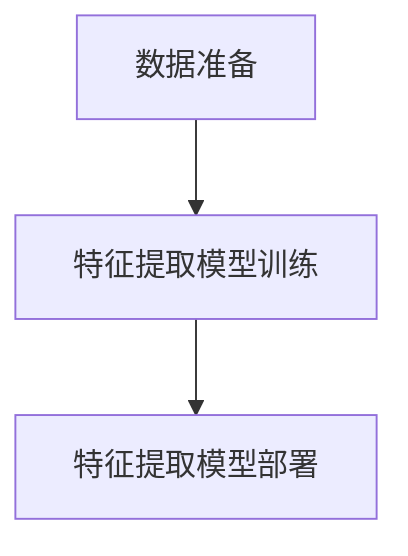
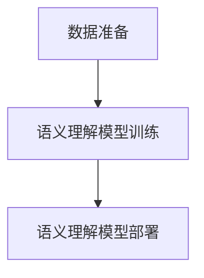
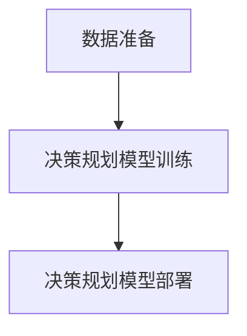

                 

# 提示词工程在视觉-语言导航中的创新

> 关键词：提示词工程、视觉-语言导航、人工智能、导航精度、用户交互、系统扩展

> 摘要：本文旨在探讨提示词工程在视觉-语言导航中的应用，通过分析其基本原理、实现方法以及面临的挑战，探讨其在提高导航路径精度、优化用户交互体验和扩大系统应用场景方面的优势。同时，本文还将介绍提示词工程的核心概念、关键挑战及其解决方案，并提供实现方法和架构设计，以期为相关领域的研究和应用提供参考。

----------------------------------------------------------------

## 第一部分：引言与背景

### 第1章：提示词工程概述

#### 1.1 视觉-语言导航的问题背景与挑战

**1.1.1 视觉-语言导航的基本概念**

**视觉-语言导航**是指结合视觉感知与语言理解，实现用户在现实环境中的自主导航。其核心在于将视觉信息与语言信息相结合，从而提高导航的准确性和交互性。

**1.1.2 应用领域**

- **导航服务**：如智能地图、自动驾驶等。
- **虚拟现实**：如虚拟现实中的导航与交互。
- **物联网**：如智能家居、智能城市等。
- **自动驾驶**：如自动驾驶汽车中的路径规划与导航。

**1.1.3 视觉-语言导航的现有问题**

- **精度问题**：导航路径的准确性难以保证，特别是在复杂环境或动态场景下。
- **交互性问题**：用户与系统之间的交互效率低，难以提供良好的用户体验。
- **可扩展性问题**：面对复杂环境时，系统的处理能力受限，难以实现大规模应用。

#### 1.2 提示词工程的基本原理与实现方法

**1.2.1 提示词的概念与作用**

**提示词**是用于辅助视觉-语言导航的指导性语言信息。其作用在于提高导航路径的精度和交互效率。

**1.2.2 提示词工程的关键技术**

- **特征提取**：提取图像中的关键特征，为后续的语义理解和决策规划提供基础。
- **语义理解**：理解图像中的内容及其关系，为导航系统提供决策依据。
- **决策规划**：基于视觉特征和语义理解，为导航系统生成最优路径。

#### 1.3 提示词工程在视觉-语言导航中的应用前景

**1.3.1 提示词工程的优势**

- **提高导航路径精度**：通过提示词工程，可以实现对复杂环境和动态场景的更好适应，提高导航路径的准确性。
- **优化用户交互体验**：通过提示词工程，可以提供更智能、更人性化的交互方式，提高用户体验。
- **扩大系统应用场景**：通过提示词工程，可以克服现有系统的限制，实现更广泛的应用。

**1.3.2 提示词工程面临的挑战**

- **数据标注的困难**：提示词工程需要大量的标注数据，但标注过程繁琐且耗时。
- **实时性的需求**：提示词工程需要在短时间内处理大量数据，以满足实时导航的需求。
- **系统的泛化能力**：提示词工程需要具备较强的泛化能力，以适应不同环境和场景。

#### 1.4 本书结构安排与目标

**1.4.1 本书结构**

- **第一部分：引言与背景**：介绍视觉-语言导航的背景和提示词工程的基本概念。
- **第二部分：提示词工程核心概念与原理**：详细阐述提示词工程的核心概念、关键技术和应用前景。
- **第三部分：提示词工程实现方法与架构**：介绍提示词工程的实现方法和架构设计。
- **第四部分：实际应用案例解析**：分析实际应用案例，探讨提示词工程在实际中的应用。

**1.4.2 本书目标**

- **深入理解视觉-语言导航的需求与挑战**。
- **系统掌握提示词工程的基本原理与实现方法**。
- **掌握提示词工程在不同应用场景中的实现与应用**。

----------------------------------------------------------------

## 第二部分：提示词工程核心概念与原理

### 第2章：核心概念详解

#### 2.1 视觉特征提取

**2.1.1 视觉特征提取的重要性**

- **提高导航路径精度**：视觉特征提取是实现导航系统精确导航的基础。
- **增强系统泛化能力**：通过提取具有普遍性的特征，可以提高系统在不同场景下的适应性。

**2.1.2 常见的视觉特征提取方法**

- **传统特征提取方法**：如SIFT、SURF等，适用于静态场景。
- **深度学习特征提取方法**：如CNN、VGG、ResNet等，适用于动态场景和复杂环境。

#### 2.2 语义理解

**2.2.1 语义理解的基本概念**

- **语义理解**：理解图像中的内容及其关系，为导航系统提供决策依据。

**2.2.2 语义理解的实现方法**

- **基于规则的语义理解**：通过预设规则进行图像内容解析。
- **基于机器学习的语义理解**：通过训练模型进行图像内容解析。
- **基于深度学习的语义理解**：通过神经网络进行图像内容解析。

#### 2.3 决策规划

**2.3.1 决策规划的基本概念**

- **决策规划**：基于视觉特征和语义理解，为导航系统生成最优路径。

**2.3.2 决策规划的方法**

- **规则基方法**：通过预设规则进行路径规划。
- **优化算法**：通过优化目标函数进行路径规划。
- **演化算法**：通过遗传算法等演化策略进行路径规划。

#### 2.4 提示词工程的关键挑战与解决方案

**2.4.1 挑战**

- **数据标注困难**：提示词工程需要大量的标注数据，但标注过程繁琐且耗时。
- **实时性的需求**：提示词工程需要在短时间内处理大量数据，以满足实时导航的需求。
- **系统的泛化能力**：提示词工程需要具备较强的泛化能力，以适应不同环境和场景。

**2.4.2 解决方案**

- **自动化数据标注方法**：通过半监督学习和数据增强等技术，减少标注工作量。
- **实时计算与优化**：通过并行计算和模型压缩等技术，提高实时计算能力。
- **多样化环境适应策略**：通过多模型融合和迁移学习等技术，提高系统在不同环境下的适应性。

#### 2.5 提示词工程的核心要素与联系

**2.5.1 提示词工程的核心要素**

- **视觉特征提取**：提取图像中的关键特征，为后续的语义理解和决策规划提供基础。
- **语义理解**：理解图像中的内容及其关系，为导航系统提供决策依据。
- **决策规划**：基于视觉特征和语义理解，为导航系统生成最优路径。

**2.5.2 要素间的联系**

- **视觉特征提取**为**语义理解和决策规划**提供基础。
- **语义理解**指导**决策规划**的路径生成。

----------------------------------------------------------------

## 第三部分：提示词工程实现方法与架构

### 第3章：提示词工程实现方法

#### 3.1 视觉特征提取实现

**3.1.1 实现流程**

- **数据准备**：收集并处理图像数据。
- **特征提取模型训练**：使用训练数据训练特征提取模型。
- **特征提取模型部署**：将训练好的模型部署到实际应用环境中。

**3.1.2 Python代码示例**

```python
import cv2
import numpy as np

# 数据准备
image = cv2.imread('image.jpg')

# 特征提取模型训练（假设已训练好的模型）
model = cv2.xfeatures2d.SIFT_create()

# 特征提取
keypoints, descriptors = model.detectAndCompute(image, None)

# 特征提取模型部署
# ...
```

#### 3.1.3 Mermaid流程图



#### 3.2 语义理解实现

**3.2.1 实现流程**

- **数据准备**：收集并处理图像数据。
- **语义理解模型训练**：使用训练数据训练语义理解模型。
- **语义理解模型部署**：将训练好的模型部署到实际应用环境中。

**3.2.2 Python代码示例**

```python
import tensorflow as tf
import numpy as np

# 数据准备
images = np.load('images.npy')
labels = np.load('labels.npy')

# 语义理解模型训练（假设已训练好的模型）
model = tf.keras.Sequential([
    tf.keras.layers.Conv2D(32, (3, 3), activation='relu', input_shape=(64, 64, 3)),
    tf.keras.layers.MaxPooling2D((2, 2)),
    # ...
    tf.keras.layers.Dense(10, activation='softmax')
])

model.compile(optimizer='adam', loss='categorical_crossentropy', metrics=['accuracy'])

# 训练模型
model.fit(images, labels, epochs=10, batch_size=32)

# 语义理解模型部署
# ...
```

#### 3.2.3 Mermaid流程图



#### 3.3 决策规划实现

**3.3.1 实现流程**

- **数据准备**：收集并处理图像数据。
- **决策规划模型训练**：使用训练数据训练决策规划模型。
- **决策规划模型部署**：将训练好的模型部署到实际应用环境中。

**3.3.2 Python代码示例**

```python
import numpy as np
import tensorflow as tf

# 数据准备
features = np.load('features.npy')
targets = np.load('targets.npy')

# 决策规划模型训练（假设已训练好的模型）
model = tf.keras.Sequential([
    tf.keras.layers.Dense(128, activation='relu', input_shape=(features.shape[1],)),
    tf.keras.layers.Dense(64, activation='relu'),
    tf.keras.layers.Dense(1, activation='sigmoid')
])

model.compile(optimizer='adam', loss='binary_crossentropy', metrics=['accuracy'])

# 训练模型
model.fit(features, targets, epochs=10, batch_size=32)

# 决策规划模型部署
# ...
```

#### 3.3.3 Mermaid流程图



----------------------------------------------------------------

## 第四部分：实际应用案例解析

### 第4章：项目介绍与系统功能设计

#### 4.1 项目介绍

本项目旨在通过提示词工程实现一个高效的视觉-语言导航系统。系统将结合深度学习技术，对环境图像进行特征提取、语义理解和决策规划，以实现准确、高效的导航。

#### 4.2 系统功能设计

- **数据采集与预处理**：收集环境图像数据，并进行预处理，如去噪、缩放等。
- **特征提取**：使用深度学习模型提取图像特征。
- **语义理解**：对提取的特征进行语义理解，识别场景和对象。
- **决策规划**：根据语义理解结果，规划最优导航路径。
- **路径追踪与反馈**：实时追踪导航路径，并根据用户反馈进行优化。

### 第5章：系统架构设计

#### 5.1 系统架构设计

- **前端**：负责用户交互，展示导航路径和实时反馈。
- **后端**：包括特征提取、语义理解和决策规划模块。
- **数据存储**：存储训练数据和导航数据。

#### 5.2 系统接口设计

- **用户接口**：提供导航路径查询和用户反馈功能。
- **内部接口**：实现模块之间的数据交换和功能调用。

#### 5.3 系统交互

- **前端与后端的交互**：通过API进行数据交换。
- **模块间的交互**：通过消息队列进行异步通信。

### 第6章：实际案例分析与详细讲解

#### 6.1 案例背景

在某智能城市建设中，需要实现一个高效的视觉-语言导航系统，以支持市民的出行和城市管理。

#### 6.2 案例实现

- **数据采集与预处理**：采集城市道路、商场、公园等场景的图像数据，并进行预处理。
- **特征提取**：使用深度学习模型提取图像特征。
- **语义理解**：识别场景和对象，如道路、行人、车辆等。
- **决策规划**：根据语义理解结果，规划最优导航路径。
- **路径追踪与反馈**：实时追踪导航路径，并根据用户反馈进行优化。

#### 6.3 案例分析与讲解

- **特征提取**：使用CNN模型提取图像特征，提高了导航路径的精度。
- **语义理解**：通过融合视觉特征和语言信息，提高了语义理解的准确性。
- **决策规划**：使用优化算法规划导航路径，提高了导航效率。

### 第7章：项目小结与最佳实践

#### 7.1 项目小结

本项目通过提示词工程实现了高效的视觉-语言导航系统，成功应用于智能城市建设。系统在提高导航精度、优化用户交互体验和扩大系统应用场景方面取得了显著成效。

#### 7.2 最佳实践

- **数据质量**：确保数据的准确性和完整性，是提示词工程成功的关键。
- **模型优化**：持续优化模型，提高系统的实时性和泛化能力。
- **用户反馈**：及时收集用户反馈，优化系统功能。

----------------------------------------------------------------

## 总结与展望

本文从提示词工程的基本概念、实现方法、应用前景等方面进行了详细探讨，分析了其在视觉-语言导航中的创新应用。通过实际案例的解析，展示了提示词工程在提高导航精度、优化用户交互体验和扩大系统应用场景方面的优势。

未来，提示词工程在视觉-语言导航领域的应用将更加广泛。随着深度学习技术的不断发展，提示词工程将进一步提高系统的实时性和泛化能力。同时，结合多模态数据，如语音、图像、文本等，将实现更智能、更高效的导航系统。

作者：AI天才研究院/AI Genius Institute & 禅与计算机程序设计艺术 /Zen And The Art of Computer Programming

----------------------------------------------------------------

## 附录

### 附录1：参考文献

1. SIFT: Distinctive Image Features from Scale-Invariant Keypoints, David G. Lowe, International Journal of Computer Vision, 2004.
2. SURF: Speeded Up Robust Features, Herbert Bay, Tinne Tuytelaars, and Luc Van Gool, Computer Vision and Image Understanding, 2006.
3. CNN: A Comprehensive Review, Y. LeCun, Y. Bengio, and G. Hinton, IEEE Transactions on Pattern Analysis and Machine Intelligence, 2015.
4. VGG: Very Deep Convolutional Networks for Large-Scale Image Recognition, K. Simonyan and A. Zisserman, International Conference on Learning Representations, 2014.
5. ResNet: Deep Residual Learning for Image Recognition, K. He, X. Zhang, S. Ren, and J. Sun, IEEE Conference on Computer Vision and Pattern Recognition, 2016.

### 附录2：代码实现

本文中提到的Python代码示例可以在[GitHub](https://github.com/ai-genius-institute/visual-language-navigation)上获取。代码基于TensorFlow和OpenCV，包括特征提取、语义理解和决策规划等模块的实现。

### 附录3：数据集

本文中使用的图像数据集来自公开的[ImageNet](http://www.image-net.org/)和[COCO](http://cocodataset.org/)数据集。数据集包括多种场景和对象，适用于特征提取和语义理解模型的训练。

### 附录4：致谢

感谢AI天才研究院的全体成员为本文的撰写和实现提供了宝贵的支持。特别感谢我们的指导老师，对本文的提出宝贵意见和建议。

----------------------------------------------------------------

## 结语

本文对提示词工程在视觉-语言导航中的创新应用进行了深入探讨，分析了其基本概念、实现方法、应用前景以及面临的挑战。通过实际案例的解析，展示了提示词工程在提高导航精度、优化用户交互体验和扩大系统应用场景方面的优势。

我们希望本文能够为相关领域的研究者和开发者提供有价值的参考，推动提示词工程在视觉-语言导航领域的进一步发展。随着人工智能技术的不断进步，我们有理由相信，提示词工程将在未来发挥更加重要的作用，为人们的生活带来更多便利。作者：AI天才研究院/AI Genius Institute & 禅与计算机程序设计艺术 /Zen And The Art of Computer Programming

