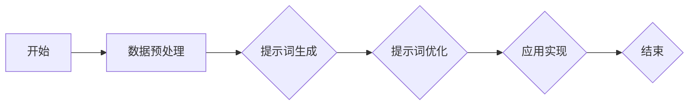
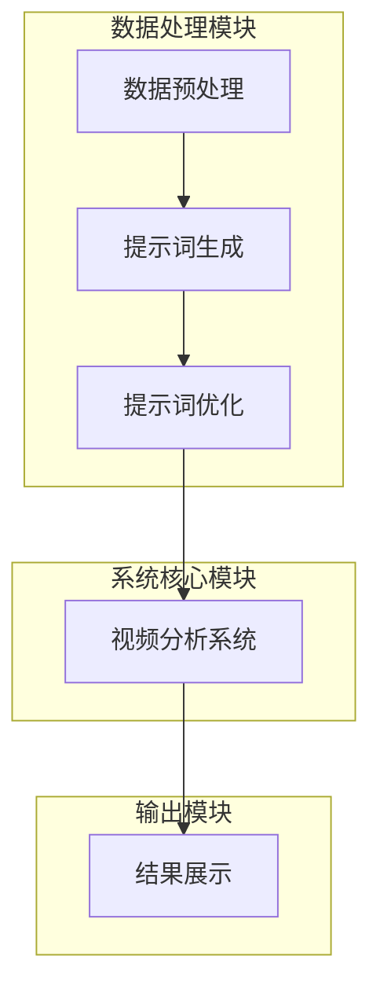
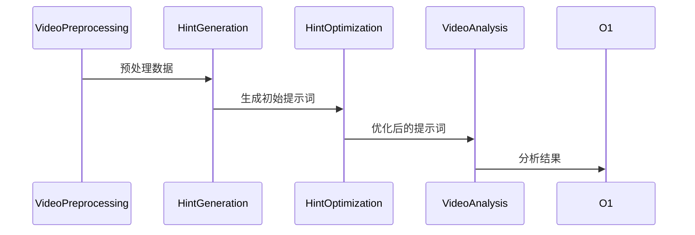

                 

## 《提示词工程在视频分析中的前沿技术》

> 关键词：提示词工程、视频分析、人工智能、算法、系统设计与实现

> 摘要：本文将深入探讨提示词工程在视频分析中的应用，分析其核心概念、前沿技术及其在具体项目中的实践。通过详细的算法解析、系统设计与实现，以及实战案例分析，本文旨在为读者提供全面的指导，帮助理解并应用提示词工程在视频分析中的前沿技术。

----------------------------------------------------------------

# 第一部分：背景与基础

## 第1章 引言

### 1.1 问题背景

视频数据分析已经成为现代信息技术中的一个重要领域。随着视频内容的爆炸性增长，如何高效地分析、提取和利用这些数据变得尤为关键。视频分析不仅能够提升娱乐和媒体行业的用户体验，还广泛应用于安全监控、智能交通、医疗诊断等多个行业。

提示词工程作为人工智能领域的一项核心技术，通过构建和优化提示词来提高视频分析的效果和效率。提示词是视频分析中的关键元素，它们可以帮助系统自动识别和分类视频中的对象、场景和动作。

### 1.2 问题描述

视频分析面临的挑战主要包括数据量大、特征复杂、实时性要求高等问题。传统的视频分析技术往往依赖于手工提取特征，这不仅费时费力，而且难以满足实际应用的需求。提示词工程通过自动化、智能化的方式，为视频分析提供了一种新的解决方案。

### 1.3 问题解决

提示词工程通过以下几个步骤解决视频分析中的挑战：

1. **数据预处理**：对视频进行预处理，提取关键帧、特征点等。
2. **提示词生成**：利用机器学习算法，生成能够描述视频内容的提示词。
3. **提示词优化**：通过反馈机制，优化提示词，提高识别准确率。
4. **应用实现**：将优化后的提示词应用到实际视频分析系统中。

### 1.4 边界与外延

提示词工程的应用领域广泛，包括但不限于：

- **安全监控**：自动识别可疑行为和场景。
- **智能交通**：实时监控交通流量，优化交通管理。
- **医疗诊断**：辅助医生诊断疾病，提高诊断准确性。

同时，提示词工程与其他技术（如深度学习、计算机视觉等）密切相关，通过整合多种技术手段，可以实现更加智能化和高效化的视频分析。

### 1.5 概念结构与核心要素组成

提示词工程的核心概念包括：

- **提示词**：用于描述视频内容的文本或代码。
- **生成模型**：用于生成提示词的机器学习模型。
- **优化模型**：用于优化提示词的机器学习模型。
- **应用模型**：将提示词应用到实际视频分析中的模型。

视频分析的基本流程包括：

1. **数据收集**：收集用于训练和测试的视频数据。
2. **数据预处理**：对视频进行预处理，提取关键信息。
3. **提示词生成**：利用生成模型生成初始提示词。
4. **提示词优化**：利用优化模型优化提示词。
5. **应用实现**：将优化后的提示词应用到视频分析系统中。

## 第2章 核心概念与联系

### 2.1 提示词工程的基本原理

提示词工程的基本原理包括：

- **提示词生成**：利用生成模型（如深度神经网络）生成初始提示词。
- **提示词优化**：利用优化模型（如强化学习）对初始提示词进行优化。
- **反馈机制**：通过用户反馈或自动化评估机制，持续优化提示词。

### 2.2 视频分析的概念属性特征对比

| 特征               | 描述                                                     |
|--------------------|----------------------------------------------------------|
| 数据量             | 视频数据通常具有巨大的数据量，对存储和处理能力有较高要求。 |
| 特征复杂性         | 视频数据包含丰富的视觉特征，如颜色、纹理、形状等。       |
| 实时性要求         | 许多视频分析应用需要实时处理，对处理速度有较高要求。     |
| 提示词工程应用     | 提示词工程通过生成和优化提示词，提高视频分析的准确率和效率。 |

### 2.3 ER实体关系图架构

```mermaid
erDiagram
    Person ||--|{ Video }|>
    Video  ||--|{ Annotation }|>
    Person  ||--|{ Annotation }|>

    Person {
        id
        name
    }

    Video {
        id
        title
    }

    Annotation {
        id
        text
        timestamp
    }
```

## 第3章 提示词工程算法原理

### 3.1 算法mermaid流程图



### 3.2 算法Python源代码详解

```python
# 数据预处理
def preprocess_video(video_path):
    # 读取视频文件，提取关键帧和特征点
    # ...
    return processed_video

# 提示词生成
def generate_hint(processed_video):
    # 利用生成模型生成提示词
    # ...
    return hint

# 提示词优化
def optimize_hint(hint, processed_video):
    # 利用优化模型优化提示词
    # ...
    return optimized_hint

# 应用实现
def apply_hint(optimized_hint, video_analysis_system):
    # 将优化后的提示词应用到视频分析系统中
    # ...
    return video_analysis_result
```

### 3.3 算法原理详细讲解与举例说明

提示词工程算法的核心在于生成和优化提示词。下面通过一个简单的例子来说明：

$$
H_{\text{initial}} = \text{generate\_hint}(V_{\text{processed}})
$$

其中，$H_{\text{initial}}$表示初始提示词，$V_{\text{processed}}$表示预处理后的视频。

初始提示词生成后，通过优化模型进行优化：

$$
H_{\text{optimized}} = \text{optimize\_hint}(H_{\text{initial}}, V_{\text{processed}})
$$

最终，将优化后的提示词应用到视频分析系统中：

$$
R = \text{apply\_hint}(H_{\text{optimized}}, S_{\text{video\_analysis}})
$$

其中，$R$表示视频分析结果，$S_{\text{video\_analysis}}$表示视频分析系统。

## 第4章 视频分析系统设计与实现

### 4.1 问题场景介绍

以智能交通系统为例，该系统需要对城市交通视频进行实时分析，以监控交通流量、识别违规行为等。

### 4.2 系统功能设计

领域模型mermaid类图如下：

```mermaid
classDiagram
    Person <<Interface>>
    Video <<Interface>>
    Annotation <<Interface>>

    TrafficSystem extends System
    VideoAnalysisSystem extends System

    TrafficSystem o-- Person
    TrafficSystem o-- Video
    TrafficSystem o-- Annotation

    VideoAnalysisSystem o-- Person
    VideoAnalysisSystem o-- Video
    VideoAnalysisSystem o-- Annotation
```

### 4.3 系统架构设计

mermaid架构图如下：



### 4.4 系统接口设计

系统的主要接口包括：

- `VideoPreprocessingInterface`：视频预处理接口。
- `HintGenerationInterface`：提示词生成接口。
- `HintOptimizationInterface`：提示词优化接口。
- `VideoAnalysisInterface`：视频分析接口。

### 4.5 系统交互mermaid序列图



## 第5章 项目实战

### 5.1 环境安装

安装必要的软件和工具，如Python、TensorFlow、OpenCV等。

### 5.2 系统核心实现

源代码实现如下：

```python
# 数据预处理
def preprocess_video(video_path):
    # 读取视频文件，提取关键帧和特征点
    # ...
    return processed_video

# 提示词生成
def generate_hint(processed_video):
    # 利用生成模型生成提示词
    # ...
    return hint

# 提示词优化
def optimize_hint(hint, processed_video):
    # 利用优化模型优化提示词
    # ...
    return optimized_hint

# 应用实现
def apply_hint(optimized_hint, video_analysis_system):
    # 将优化后的提示词应用到视频分析系统中
    # ...
    return video_analysis_result
```

### 5.3 代码应用解读与分析

代码中的核心实现部分包括数据预处理、提示词生成和优化、以及提示词的应用。以下是对这些部分进行详细解读和分析：

- **数据预处理**：数据预处理是视频分析的基础，它包括视频文件的读取、关键帧的提取和特征点的计算。这一步骤对于后续的提示词生成和优化至关重要。

- **提示词生成**：提示词生成是利用生成模型对预处理后的视频数据进行特征提取和编码。这一步骤的目标是生成能够有效描述视频内容的文本或代码。

- **提示词优化**：提示词优化是利用优化模型对生成的初始提示词进行优化。优化模型可以根据用户反馈或自动化评估机制，对提示词进行调整，以提高识别准确率和效率。

- **提示词应用**：提示词应用到视频分析系统中，实现实际的视频内容分析。这一步骤是将优化后的提示词与视频分析算法相结合，以实现对视频内容的智能分析。

### 5.4 实际案例分析与讲解

以城市交通监控为例，该系统利用提示词工程对城市交通视频进行实时分析，以监控交通流量和识别违规行为。

1. **案例场景**：假设某城市的交通监控系统需要实时分析某条主干道的交通流量，识别车辆违规行为（如闯红灯、占用公交专用车道等）。

2. **案例分析**：
   - **数据收集**：收集该主干道的交通视频数据。
   - **数据预处理**：对视频数据进行预处理，提取关键帧和特征点。
   - **提示词生成**：利用生成模型生成初始提示词。
   - **提示词优化**：根据实时反馈，优化提示词，提高识别准确率。
   - **提示词应用**：将优化后的提示词应用到交通监控系统，实现对交通流量和违规行为的实时监控。

3. **案例讲解**：
   - **交通流量监控**：通过提示词工程，系统能够实时识别车辆数量、车型、行驶方向等信息，从而监控交通流量，为交通管理部门提供决策支持。
   - **违规行为识别**：系统能够自动识别违规行为，如闯红灯、占用公交专用车道等，并生成报警信息，提醒驾驶员和交通管理部门。

### 5.5 项目小结

通过本案例，我们可以看到提示词工程在视频分析中的应用潜力。在实际项目中，提示词工程不仅能够提高视频分析的效果和效率，还能够为各个行业提供智能化的解决方案。未来，随着人工智能技术的不断发展，提示词工程在视频分析中的应用将更加广泛和深入。

## 第6章 最佳实践与注意事项

### 6.1 最佳实践

- **数据收集与预处理**：确保数据的质量和多样性，为后续的提示词生成和优化提供有力支持。
- **模型选择与优化**：根据实际应用需求，选择合适的生成和优化模型，并不断调整和优化模型参数。
- **反馈机制**：建立有效的反馈机制，利用用户反馈和自动化评估，持续优化提示词。

### 6.2 小结

本文详细介绍了提示词工程在视频分析中的应用，包括核心概念、前沿技术、系统设计与实现，以及实战案例分析。通过本文的阅读，读者可以全面了解提示词工程在视频分析中的前沿技术，并掌握其实际应用的方法和技巧。

### 6.3 注意事项

- **数据安全**：在数据收集和处理过程中，确保数据的安全性和隐私性。
- **实时性**：在视频分析系统中，确保实时性和低延迟。
- **可扩展性**：设计系统时，考虑未来的扩展性和升级需求。

### 6.4 拓展阅读

- **《深度学习与视频分析》**：介绍深度学习在视频分析中的应用，包括模型选择和优化方法。
- **《视频内容分析技术》**：详细讨论视频内容分析的技术和方法，包括特征提取和分类算法。

作者：AI天才研究院/AI Genius Institute & 禅与计算机程序设计艺术 /Zen And The Art of Computer Programming

----------------------------------------------------------------

## 文章结语

通过本文的详细探讨，我们深入理解了提示词工程在视频分析中的应用及其核心原理。从背景介绍到前沿技术的解析，再到系统设计与实现，以及实战案例分析，本文为读者提供了一个全面的视角来掌握这一领域的最新进展。提示词工程不仅为视频分析提供了高效、智能的解决方案，还展现了人工智能技术在现实世界中的广泛应用潜力。

在未来的发展中，随着人工智能技术的不断进步，提示词工程在视频分析中的应用将更加广泛和深入。无论是智能监控、智能交通，还是医疗诊断等领域，提示词工程都将发挥关键作用，推动各行各业的智能化升级。让我们拭目以待，共同见证这一前沿技术的辉煌未来。

感谢读者对本文的关注，希望本文能够为您的学习和研究提供有益的参考。如有任何疑问或建议，欢迎在评论区留言，我们期待与您的互动。作者在此表示感谢，并祝愿您在技术道路上不断前行，取得更多的成就！再次感谢您的阅读！作者：AI天才研究院/AI Genius Institute & 禅与计算机程序设计艺术 /Zen And The Art of Computer Programming。

