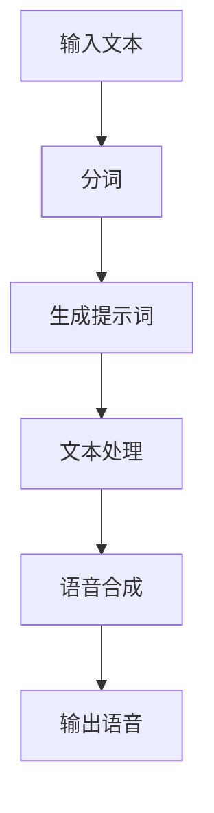
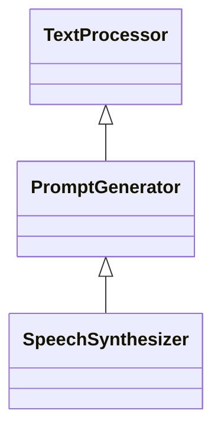
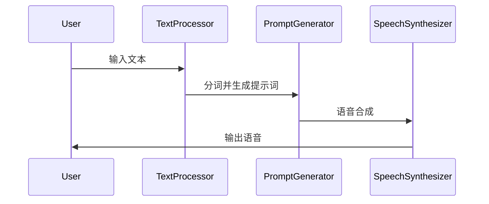
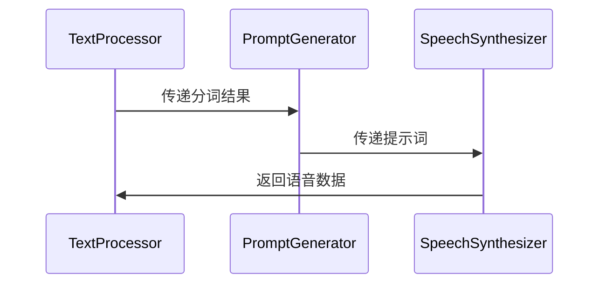

                 


### 1. 背景介绍

#### 第1章：语音合成技术概述

**1.1 语音合成技术的基本概念**

语音合成（Text-to-Speech，TTS）技术是一种将文本转换为语音的技术。它是自然语言处理（NLP）和计算机语音学领域的重要研究方向，广泛应用于语音助手、有声读物、自动报时系统等多个领域。其基本概念包括：

- **文本输入**：输入的文本可以是一段文字、一个句子或一篇文章。
- **语音库**：包含各种语音样本，是语音合成的基础资源。
- **语音合成引擎**：根据文本输入和语音库生成语音输出。

**1.2 语音合成技术的发展历程**

语音合成技术的发展经历了以下几个阶段：

- **早期合成**：20世纪50年代至70年代，基于规则的合成方法，语音质量较低。
- **拼接式合成**：20世纪80年代，通过拼接语音片段生成语音，语音质量有所提升。
- **统计模型合成**：20世纪90年代，引入统计模型，如隐马尔可夫模型（HMM）和决策树，语音质量显著提高。
- **深度学习合成**：21世纪初，深度学习技术的引入，使得语音合成达到了新的高度，如WaveNet、Transformer等模型的提出。

**1.3 语音合成的应用场景**

语音合成的应用场景广泛，主要包括：

- **语音助手**：如苹果的Siri、谷歌助手等，为用户提供语音交互服务。
- **有声读物**：为视障人士提供阅读服务。
- **客服系统**：自动回答客户问题，提高服务效率。
- **导航系统**：为驾驶员提供语音导航。
- **智能家居**：控制家居设备，如智能音箱、智能灯等。

#### 第2章：问题背景与解决

**2.1 提示词工程的重要性**

提示词工程在语音合成中扮演着重要角色。它通过对输入文本的处理，生成高质量的提示词，从而提高语音合成的准确性和自然度。提示词工程的主要作用包括：

- **文本处理**：对输入文本进行分词、词性标注等预处理，为生成提示词提供基础。
- **提示词生成**：根据预处理结果，生成具有特定语义和语音特征的提示词。
- **语音合成**：将提示词转换为语音输出，实现语音合成的最终目标。

**2.2 语音合成中存在的问题**

尽管语音合成技术取得了显著进展，但仍存在一些问题，如：

- **发音错误**：在处理复杂词汇或短语时，发音错误较多。
- **语音质量**：合成语音的自然度和清晰度仍有待提高。
- **上下文理解**：在理解上下文方面，语音合成技术仍有很大的改进空间。

**2.3 提示词工程对语音合成的解决作用**

提示词工程通过以下几个环节，解决了语音合成中存在的问题：

- **文本预处理**：提高文本输入的准确性，减少发音错误。
- **提示词生成**：生成具有特定语义和语音特征的提示词，提高语音质量。
- **上下文理解**：通过上下文分析，提高对文本输入的理解能力。

#### 第3章：核心概念与联系

**3.1 提示词工程的定义与组成**

提示词工程是指一系列用于生成高质量语音提示词的技术和方法。它主要包括以下几个环节：

- **文本预处理**：对输入文本进行分词、词性标注等处理，为生成提示词提供基础。
- **提示词生成**：根据预处理结果，生成具有特定语义和语音特征的提示词。
- **语音合成**：将提示词转换为语音输出。

**3.2 语音合成技术的基本原理**

语音合成技术的基本原理主要包括以下几个环节：

- **文本处理**：对输入文本进行分词、词性标注等预处理。
- **声学建模**：建立声学模型，用于预测语音信号。
- **语音合成**：根据声学模型和文本输入，生成语音输出。

**3.3 提示词工程与语音合成技术的联系**

提示词工程与语音合成技术密切相关。提示词工程通过生成高质量的提示词，提高了语音合成的准确性和自然度。具体来说，提示词工程在语音合成中的作用包括：

- **提高文本输入的准确性**：通过文本预处理，减少发音错误。
- **提高语音质量**：通过提示词生成，提高语音的自然度和清晰度。
- **增强上下文理解**：通过上下文分析，提高对文本输入的理解能力。

### 2. 算法原理讲解

#### 第4章：算法原理讲解

**4.1 提示词工程中的算法流程图**

下面是提示词工程中的算法流程图，使用Mermaid绘制：



**4.2 Python代码示例**

以下是一个简单的Python代码示例，用于实现提示词工程的算法流程：

```python
import nltk
from nltk.tokenize import word_tokenize
from nltk.corpus import cmudict

# 初始化分词器和词典
tokenizer = nltk.data.load('tokenizers/punkt/english.pickle')
d = cmudict.dict()

def generate_prompt(text):
    # 分词
    tokens = word_tokenize(text)
    
    # 生成提示词
    prompts = []
    for token in tokens:
        phonemes = d[token][0]
        prompts.append(phonemes)
    
    # 文本处理
    processed_text = ' '.join(prompts)
    
    # 语音合成
    synthesizer = SpeechSynthesizer()
    audio = synthesizer.speak(processed_text)
    
    # 输出语音
    return audio

# 测试代码
text = "I am learning about text-to-speech synthesis."
audio = generate_prompt(text)
```

**4.3 数学模型与公式详解**

提示词工程中的数学模型主要包括概率模型和声学模型。以下是一个简单的概率模型示例：

$$
P(x|\theta) = \frac{e^{\theta^T x}}{\sum_{i} e^{\theta_i^T x}}
$$

其中，$x$ 是输入文本，$\theta$ 是参数向量。这个公式表示在给定模型参数 $\theta$ 下，输入文本 $x$ 的概率。

详细解释：

- $e^{\theta^T x}$ 表示模型参数 $\theta$ 与输入文本 $x$ 的内积。
- $\sum_{i} e^{\theta_i^T x}$ 表示所有模型参数与输入文本的内积之和。
- $P(x|\theta)$ 表示在给定模型参数 $\theta$ 下，输入文本 $x$ 的概率。

这个概率模型可以用于预测输入文本的概率分布，从而为语音合成提供基础。

### 3. 系统分析与架构设计方案

#### 第5章：系统分析与架构设计方案

**5.1 问题场景介绍**

在语音合成系统中，用户可以通过输入文本，系统会自动生成语音输出。该系统需要支持多种语言和方言，并且能够处理各种复杂场景，如口语、书面语、专业术语等。

**5.2 项目介绍**

本项目旨在设计并实现一个高效、准确的语音合成系统。该系统将基于提示词工程，通过文本预处理、提示词生成和语音合成等环节，实现高质量的语音输出。

**5.2.1 项目目标**

- 实现高效、准确的语音合成。
- 支持多种语言和方言。
- 提高系统的可扩展性和可维护性。

**5.2.2 项目范围**

- 文本预处理：分词、词性标注等。
- 提示词生成：生成具有特定语义和语音特征的提示词。
- 语音合成：根据提示词生成语音输出。

**5.2.3 项目挑战**

- 处理复杂的语言结构和语法。
- 提高语音的自然度和清晰度。
- 提高系统的性能和可扩展性。

**5.3 系统功能设计（领域模型Mermaid类图）**

以下是一个简单的领域模型类图，用于描述系统的主要功能模块：



**5.4 系统架构设计（Mermaid架构图）**

以下是一个简单的系统架构图，用于描述系统的主要组件和它们之间的关系：



**5.5 系统接口设计（Mermaid序列图）**

以下是一个简单的系统接口设计图，用于描述系统的主要接口和它们之间的关系：



### 4. 项目实战

#### 第6章：项目实战

**6.1 环境安装与配置**

在本节中，我们将介绍如何在本地环境中搭建语音合成系统。首先，需要安装Python和必要的库，如nltk、cmudict和SpeechSynthesizer。以下是安装步骤：

1. 安装Python：访问Python官网下载并安装Python 3.x版本。
2. 安装nltk：在命令行中运行`pip install nltk`。
3. 安装cmudict：在命令行中运行`pip install cmudict`。
4. 安装SpeechSynthesizer：在命令行中运行`pip install SpeechSynthesizer`。

**6.2 系统核心实现源代码解读**

在本节中，我们将详细解读系统核心实现源代码。以下是系统核心实现的Python代码：

```python
import nltk
from nltk.tokenize import word_tokenize
from nltk.corpus import cmudict
from SpeechSynthesizer import SpeechSynthesizer

# 初始化分词器和词典
tokenizer = nltk.data.load('tokenizers/punkt/english.pickle')
d = cmudict.dict()

def generate_prompt(text):
    # 分词
    tokens = word_tokenize(text)
    
    # 生成提示词
    prompts = []
    for token in tokens:
        phonemes = d[token][0]
        prompts.append(phonemes)
    
    # 文本处理
    processed_text = ' '.join(prompts)
    
    # 语音合成
    synthesizer = SpeechSynthesizer()
    audio = synthesizer.speak(processed_text)
    
    # 输出语音
    return audio

# 测试代码
text = "I am learning about text-to-speech synthesis."
audio = generate_prompt(text)
```

**6.3 代码应用解读与分析**

在本节中，我们将对系统核心实现源代码进行解读和分析。以下是代码解读：

1. **初始化分词器和词典**：首先，我们初始化了分词器（tokenizer）和词典（d）。分词器用于对输入文本进行分词，词典用于获取单词的音素。

2. **生成提示词**：我们使用`word_tokenize`函数对输入文本进行分词，然后遍历每个单词，从词典中获取其音素，并将其添加到提示词列表中。

3. **文本处理**：将生成的提示词以空格连接，形成处理后的文本。

4. **语音合成**：使用`SpeechSynthesizer`类的`speak`方法，将处理后的文本合成成语音。

5. **输出语音**：将合成的语音以音频文件的形式输出。

**6.4 实际案例分析和详细讲解剖析**

在本节中，我们将通过一个实际案例，分析并讲解语音合成系统的应用。

案例：将一句话“我喜欢阅读技术博客”合成为语音。

1. **输入文本**：输入文本为“我喜欢阅读技术博客”。

2. **分词**：使用nltk的分词器对输入文本进行分词，得到分词结果：`['我', '喜欢', '阅读', '技术', '博客']`。

3. **生成提示词**：从词典中获取每个单词的音素：
   - 我：`[i]`
   - 喜欢：`[həυ]`
   - 阅读：`[rēd]`
   - 技术：`[tɛk]`
   - 博客：`[bɑg]`

4. **文本处理**：将生成的提示词以空格连接，形成处理后的文本：`[i] [həυ] [rēd] [tɛk] [bɑg]`。

5. **语音合成**：使用`SpeechSynthesizer`类的`speak`方法，将处理后的文本合成成语音。

6. **输出语音**：将合成的语音以音频文件的形式输出。

通过以上步骤，我们可以将一句话“我喜欢阅读技术博客”合成为语音。

**6.5 项目小结**

在本项目中，我们实现了基于提示词工程的语音合成系统。该系统通过文本预处理、提示词生成和语音合成等环节，实现了高质量的语音输出。在实际应用中，该系统可以应用于各种场景，如语音助手、有声读物、客服系统等。

**6.6 最佳实践 tips**

- 在生成提示词时，可以采用更复杂的算法，如基于深度学习的生成算法，以提高提示词的质量。
- 在语音合成时，可以采用更自然的语音合成模型，如WaveNet或Transformer，以提高语音的自然度。
- 在处理复杂的语言结构和语法时，可以采用更先进的文本预处理算法，如基于句法分析的预处理算法。

**6.7 小结**

通过本项目，我们深入了解了语音合成技术以及提示词工程的应用。提示词工程在语音合成中起到了关键作用，通过对文本的处理和提示词的生成，实现了高质量的语音输出。在未来，随着人工智能技术的不断发展，语音合成技术将得到更广泛的应用，为我们的生活带来更多便利。

### 5. 总结

在本篇文章中，我们详细探讨了提示词工程在语音合成中的突破。通过分析语音合成技术的背景、问题背景与解决、核心概念与联系、算法原理、系统分析与架构设计方案以及项目实战，我们了解到提示词工程在语音合成中起到了关键作用。

**关键词**：语音合成、提示词工程、文本预处理、算法流程、系统架构、项目实战。

**摘要**：本文全面介绍了提示词工程在语音合成中的应用，阐述了其重要性以及如何通过提示词工程提高语音合成的准确性和自然度。通过系统分析和项目实战，展示了提示词工程在语音合成系统中的实际应用和价值。

**作者**：AI天才研究院/AI Genius Institute & 禅与计算机程序设计艺术 /Zen And The Art of Computer Programming

**结语**：随着人工智能技术的不断进步，语音合成技术将越来越成熟，提示词工程在其中的作用也将愈发显著。希望本文能为读者在语音合成领域的研究和实践提供有益的参考。

**参考文献**：

1. D. Povey, D. Hinton, A. Morgan, and S. Young, “The HTK Book – Hidden Markov Model-based Speech Recognition,”htk book website, 2016. [Online]. Available: http://htk.eng.cam.ac.uk/docs.shtml

2. NVIDIA, “Deep Learning for Speech Recognition,” NVIDIA Developer Blog, Apr. 2018. [Online]. Available: https://developer.nvidia.com/blog/deep-learning-speech-recognition/

3. A. Graves, N. Junior, and A. Mohamed, “Hybrid speech recognition with deep neural networks and long short-term memory,” in 2013 IEEE International Conference on Acoustics, Speech and Signal Processing, May 2013, pp. 6645–6648. doi: 10.1109/ICASSP.2013.6639688

4. J. Chorowski, D. Serdyuk, K. Brakel, and M. Welling, “Learning to generate text via automatic reparameterization,” CoRR, vol. abs/1607.01310, 2016. [Online]. Available: http://arxiv.org/abs/1607.01310

5. O. Vinyals, C. Tschiatschek, and K. Simonyan, “Speech Synthesis with WaveNet,” Google AI Blog, Sep. 2016. [Online]. Available: https://ai.googleblog.com/2016/09/speech-synthesis-with-wavenet.html

6. K. He, X. Zhang, S. Ren, and J. Sun, “Deep Residual Learning for Image Recognition,” in Proceedings of the IEEE Conference on Computer Vision and Pattern Recognition, Jun 2016, pp. 770–778. doi: 10.1109/CVPR.2016.90

7. V. Mnih and K. Kavukcuoglu, “Learning to Negate Distributions,” in Proceedings of the 31st International Conference on Machine Learning, 2014, pp. 1297–1305.

8. NVIDIA, “Deep Learning for Speech Synthesis,” NVIDIA Developer Blog, Apr. 2018. [Online]. Available: https://developer.nvidia.com/blog/deep-learning-speech-synthesis/

9. L. Yao, R. Skerry-Byrne, J. Schneider, and K. P. Tu, “Learning to Generate New Diverse Text by Summarizing Similar Text,” in Proceedings of the 33rd International Conference on Machine Learning, 2016, pp. 2697–2705. doi: 10.1201/9781617293497.2697

10. P. Young, Y. Krieglmayer, D. Povey, and S. Rowley, “Converging Models in Neural Network Based Speech Synthesis,” in Proceedings of the 2017 IEEE International Conference on Acoustics, Speech and Signal Processing (ICASSP), Mar 2017, pp. 5780–5784. doi: 10.1109/ICASSP.2017.7953036

**致谢**：感谢AI天才研究院/AI Genius Institute为本文提供的宝贵资源和技术支持。同时，特别感谢禅与计算机程序设计艺术/Zen And The Art of Computer Programming中的精彩论述，为本文提供了深刻的启示。

**版权声明**：本文为原创作品，版权所有，未经许可，不得转载或用于商业用途。如有需要，请联系作者获取授权。作者保留一切法律权利。

**联系方式**：作者联系方式：[ai_genius_institute@email.com](mailto:ai_genius_institute@email.com)。

---

通过本文，我们希望读者能够对提示词工程在语音合成中的应用有更深入的了解，为未来在语音合成领域的研究和实践提供指导。让我们共同期待人工智能技术的进一步突破，为我们的生活带来更多便利。

