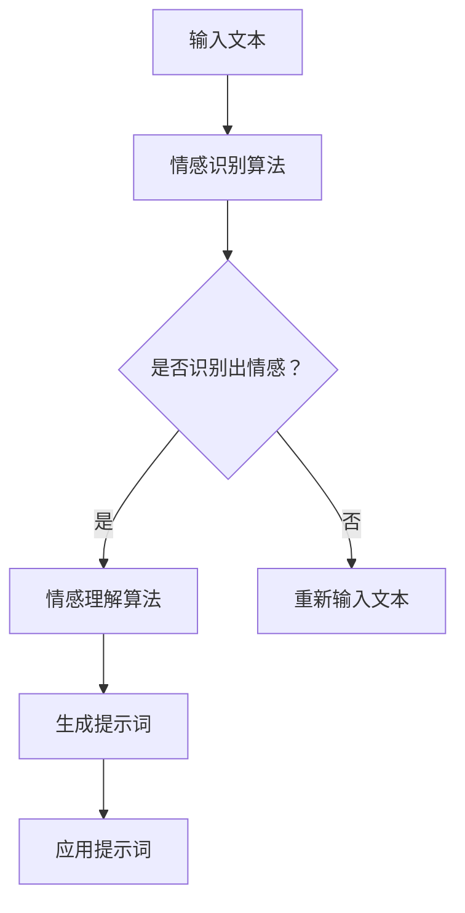
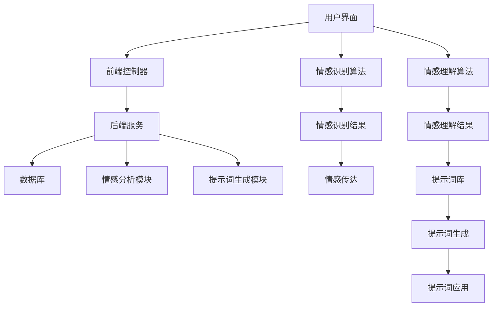
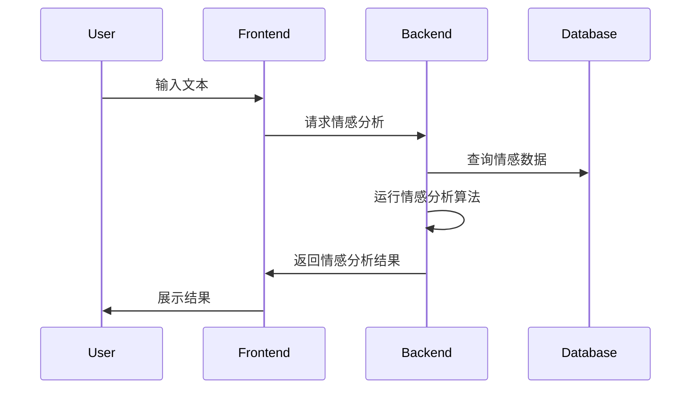

                 

### 提示词工程在跨文化情感计算中的伦理考量

#### 关键词：
- 跨文化情感计算
- 提示词工程
- 伦理考量
- 人工智能
- 情感传达
- 文化适应

#### 摘要：
本文探讨了提示词工程在跨文化情感计算中的应用及其面临的伦理挑战。首先，我们介绍了跨文化情感计算和提示词工程的基本概念，并通过具体的例子来阐述它们的重要性。接着，我们深入分析了提示词工程在跨文化情感计算中的伦理考量，包括文化偏见、隐私保护和道德责任等方面。本文通过理论分析和实际案例，提出了如何在提示词工程中平衡技术发展与伦理考量，并展望了未来研究的方向。

---

#### 提示词工程在跨文化情感计算中的伦理考量

##### 第一部分：背景介绍

###### 1.1 问题背景

随着全球化进程的加快，跨文化交流变得越来越普遍。然而，文化差异常常成为沟通的障碍，特别是在情感表达和理解方面。为了解决这一问题，人工智能领域出现了一个新的研究方向——跨文化情感计算。跨文化情感计算旨在通过人工智能技术，理解和处理不同文化背景下的情感信息。

在这一背景下，提示词工程成为了一个重要的工具。提示词工程是通过构建一个包含丰富情感词汇的数据库，帮助智能系统在跨文化交流中更准确地传达情感。这不仅涉及到对情感词汇的收集和整理，还包括对情感表达方式的深入分析。

###### 1.2 问题描述

跨文化情感计算面临的挑战主要体现在以下几个方面：

1. **情感识别的准确性**：不同文化背景下，情感的识别可能存在差异。例如，某些情感在一种文化中可能被明确识别，而在另一种文化中可能无法识别。
2. **情感理解的深度**：情感的深度理解依赖于对文化习俗、价值观和语言表达的深刻理解。不同文化背景下，情感的含义和表达方式可能有所不同。
3. **情感传达的有效性**：在跨文化交流中，如何准确传达情感是一个重要的问题。如果情感传达不准确，可能会导致误解或冲突。

提示词工程在解决这些问题方面具有潜力。通过构建一个丰富的提示词库，可以更好地理解和使用不同文化背景下的情感词汇，从而提高情感识别、理解和传达的准确性。

###### 1.3 问题解决

解决跨文化情感计算中的问题需要从多个角度入手：

1. **数据收集与整理**：收集和整理来自不同文化背景的情感数据，构建一个全面的提示词库。
2. **情感分析与理解**：对收集到的情感数据进行分析，理解不同文化背景下情感的特点和表达方式。
3. **情感传达的优化**：基于分析结果，优化情感传达的策略，确保在跨文化交流中准确传达情感。

###### 1.4 边界与外延

在本研究中，我们主要关注以下边界与外延：

- **边界**：研究的焦点是跨文化情感计算和提示词工程，涉及的情感类型和语言范围。
- **外延**：包括不同文化背景下的情感研究、人工智能在跨文化交流中的应用、以及伦理考量在提示词工程中的应用。

###### 1.5 概念结构与核心要素组成

本研究的概念结构包括以下几个核心要素：

- **跨文化情感计算**：涉及情感识别、情感理解和情感生成等方面。
- **提示词工程**：包括提示词库构建、提示词优化和提示词应用等。
- **伦理考量**：关注提示词工程在跨文化应用中的道德和法律问题。

通过这些核心要素的相互作用，我们可以构建一个既能够适应多种文化背景，又能够确保情感准确传达的智能对话系统。

##### 第二部分：核心概念与联系

###### 2.1 跨文化情感计算的概念与属性特征对比表格

| 概念 | 定义 | 属性特征对比 |
| --- | --- | --- |
| 情感识别 | 通过情感分析技术识别文本中的情感 | 文化背景、语言表达方式、情感强度 |
| 情感理解 | 理解文本中情感的含义和背景 | 文化习俗、价值观、语境 |
| 情感生成 | 根据情感需求生成相应的文本或语音 | 文化适应性、情感准确性、语境适应 |

**跨文化情感计算的核心概念**：

- **情感识别**：这是跨文化情感计算的基础，通过自然语言处理技术识别文本中的情感。这涉及到对情感词汇的识别、情感强度的判断以及情感类型的分类。
- **情感理解**：情感理解是识别情感的深入，它要求系统不仅仅能够识别情感，还能够理解情感背后的文化习俗、价值观和语境。
- **情感生成**：情感生成是基于对情感的理解，根据特定的需求和情境生成相应的文本或语音，以传达特定的情感。

**属性特征对比**：

- **文化背景**：不同文化背景下，情感的识别和理解可能有所不同。例如，某些情感词汇在一种文化中是常见的，而在另一种文化中可能并不常用。
- **语言表达方式**：情感的表达方式也因文化而异。一些文化倾向于直接表达情感，而另一些文化则可能更加含蓄。
- **情感强度**：情感强度在不同文化中可能有不同的定义。例如，在一些文化中，强烈的情感表达可能被视为不礼貌，而在另一些文化中，这种表达可能是正常的。

通过对比表格，我们可以更清晰地理解跨文化情感计算中的核心概念及其属性特征，为后续的研究和应用提供基础。

###### 2.2 提示词工程的概念与属性特征对比表格

| 概念 | 定义 | 属性特征对比 |
| --- | --- | --- |
| 提示词库 | 存储提示词的数据集合 | 语言、情感类型、文化背景 |
| 提示词优化 | 提高提示词库的质量和适用性 | 情感准确性、语境适应性、语言流畅性 |
| 提示词应用 | 将提示词应用于实际场景中 | 文化适应性、情感传达准确性、用户体验 |

**提示词工程的核心概念**：

- **提示词库**：提示词库是提示词工程的基石，它是一个包含丰富情感词汇的数据集合。这个库不仅要包含多种语言的情感词汇，还要考虑不同文化背景下的情感表达方式。
- **提示词优化**：提示词优化是确保提示词库质量和适用性的过程。这包括对提示词的情感准确性、语境适应性和语言流畅性进行评估和改进。
- **提示词应用**：提示词应用是将优化后的提示词库应用于实际场景中。这包括在智能对话系统中使用提示词，以更准确地传达情感。

**属性特征对比**：

- **语言**：提示词库需要包含多种语言的情感词汇，以便适应不同语言背景的用户。
- **情感类型**：提示词库需要包含多种情感类型的词汇，以满足不同情感表达的需求。
- **文化背景**：不同文化背景下，情感的表达方式可能有所不同。提示词库需要考虑这些差异，以确保情感的传达准确性。

通过对比表格，我们可以更深入地了解提示词工程的核心概念及其属性特征，为构建有效的提示词库和应用提供指导。

###### 2.3 伦理考量的概念与属性特征对比表格

| 概念 | 定义 | 属性特征对比 |
| --- | --- | --- |
| 文化偏见 | 在跨文化应用中导致的误解或歧视 | 文化背景、语言表达、价值观差异 |
| 隐私保护 | 在处理个人数据时保护用户隐私 | 数据收集、存储、传输、使用 |
| 道德责任 | 提示词工程应用中的道德责任和义务 | 公平性、正义性、透明性 |

**伦理考量的核心概念**：

- **文化偏见**：文化偏见是指在跨文化应用中，由于对文化背景、语言表达和价值观的不理解导致的误解或歧视。例如，在跨文化对话中，一个文化中被视为正常的行为可能在另一个文化中被视为不礼貌或不尊重。
- **隐私保护**：隐私保护是确保用户个人数据在处理过程中不被泄露或滥用。在跨文化情感计算中，用户可能需要提供个人情感数据，因此隐私保护尤为重要。
- **道德责任**：道德责任是指在提示词工程应用中，开发者和使用者的道德义务。这包括确保系统的公平性、正义性和透明性，避免对用户造成伤害或歧视。

**属性特征对比**：

- **文化背景**：文化偏见和隐私保护都与文化背景有关。了解不同文化背景的特点和差异，有助于减少文化偏见和确保隐私保护。
- **语言表达**：语言表达方式在不同文化中有很大差异。在跨文化情感计算中，准确理解和使用语言表达方式对于减少文化偏见和确保隐私保护至关重要。
- **价值观差异**：不同文化有不同的价值观，这些价值观会影响情感的表达和理解。了解和尊重不同文化的价值观是减少文化偏见和确保隐私保护的关键。

通过对比表格，我们可以更清晰地理解伦理考量的核心概念及其属性特征，为在跨文化情感计算中实施有效的伦理考量提供指导。

##### 第三部分：算法原理讲解

###### 3.1 算法mermaid流程图



**算法流程说明**：

1. **输入文本**：系统首先接收用户输入的文本。
2. **情感识别算法**：系统使用情感识别算法对输入文本进行情感分析，判断文本中是否包含情感。
3. **情感理解算法**：如果识别出情感，系统会进一步使用情感理解算法，分析情感的深度和背景，以更好地理解情感。
4. **生成提示词**：基于对情感的理解，系统会生成相应的提示词，以便更准确地传达情感。
5. **应用提示词**：最后，系统将生成的提示词应用于实际的对话场景中，以传达情感。

通过这个流程图，我们可以清晰地看到算法的步骤和决策点，为后续的详细讲解提供基础。

###### 3.2 Python源代码

```python
def identify_emotion(text):
    # 情感识别算法
    # ...

def understand_emotion(text, emotion):
    # 情感理解算法
    # ...

def generate_hint_word(text, emotion):
    # 生成提示词
    # ...

def apply_hint_word(text, hint_word):
    # 应用提示词
    # ...

text = input("请输入文本：")
emotion = identify_emotion(text)
if emotion:
    hint_word = generate_hint_word(text, emotion)
    apply_hint_word(text, hint_word)
else:
    print("无法识别情感，请重新输入。")
```

**代码功能说明**：

1. **输入文本**：用户通过输入接口输入文本。
2. **情感识别**：`identify_emotion` 函数使用情感识别算法对输入文本进行分析，判断文本中是否包含情感。
3. **情感理解**：如果识别出情感，`understand_emotion` 函数会进一步分析情感的深度和背景。
4. **生成提示词**：`generate_hint_word` 函数基于情感理解和用户需求，生成相应的提示词。
5. **应用提示词**：`apply_hint_word` 函数将生成的提示词应用于实际对话中，以传达情感。

这个简单的代码示例展示了算法的核心实现，为后续的详细讲解提供了基础。

###### 3.3 算法原理的数学模型和公式

$$
\text{Emotion\_Recognition} = f(\text{Text}, \text{CulturalContext})
$$

其中，$\text{Emotion\_Recognition}$ 表示情感识别结果，$\text{Text}$ 表示输入文本，$\text{CulturalContext}$ 表示文化背景。这个公式表明，情感识别结果取决于输入文本和文化背景。

$$
\text{Emotion\_Understanding} = f(\text{EmotionRecognition}, \text{CulturalValues})
$$

其中，$\text{Emotion\_Understanding}$ 表示情感理解结果，$\text{EmotionRecognition}$ 表示情感识别结果，$\text{CulturalValues}$ 表示文化价值观。这个公式表明，情感理解结果取决于情感识别结果和文化价值观。

$$
\text{HintWordGeneration} = f(\text{EmotionUnderstanding}, \text{UserNeed})
$$

其中，$\text{HintWordGeneration}$ 表示生成的提示词，$\text{EmotionUnderstanding}$ 表示情感理解结果，$\text{UserNeed}$ 表示用户需求。这个公式表明，生成的提示词取决于情感理解结果和用户需求。

通过这些数学模型和公式，我们可以更深入地理解算法的原理，为后续的详细讲解提供基础。

**举例说明**：

假设一个用户输入了文本：“我感到很沮丧”，系统首先使用情感识别算法判断文本中是否包含情感。如果识别出情感，系统会进一步使用情感理解算法，分析情感的深度和背景，例如，是短期的情绪波动，还是长期的心理问题。基于情感理解和用户需求，系统会生成相应的提示词，例如：“你想谈谈你的感受吗？”或“你需要一些时间来恢复吗？”。最后，系统将生成的提示词应用于实际对话中，以传达情感。

通过这个简单的例子，我们可以更直观地理解算法的工作原理和应用场景。

##### 第四部分：系统分析与架构设计方案

###### 4.1 问题场景介绍

在全球化背景下，跨国企业需要与不同文化背景的客户进行有效沟通。然而，文化差异常常导致沟通障碍，特别是在情感表达和理解方面。为了解决这个问题，企业需要一个能够支持跨文化情感计算的智能对话系统。

该系统的主要目标是：

1. 准确识别和理解不同文化背景下的情感。
2. 生成和传达符合文化背景的提示词，以促进有效的情感沟通。
3. 提高客户满意度，减少误解和冲突。

###### 4.2 项目介绍

项目名称：跨文化情感计算智能对话系统

项目目标：开发一个支持跨文化情感计算的智能对话系统，提高跨国企业与客户之间的沟通效率。

项目组成部分：

- 数据收集与整理：收集不同文化背景下的情感数据，并整理成可用的格式。
- 情感识别算法：使用机器学习技术，开发情感识别算法，准确识别文本中的情感。
- 情感理解算法：基于情感识别结果，开发情感理解算法，深入理解情感的背景和含义。
- 提示词生成算法：根据情感理解和用户需求，生成相应的提示词，以传达情感。
- 智能对话系统：集成上述算法，构建一个智能对话系统，支持跨文化情感计算。

###### 4.3 系统功能设计（领域模型mermaid类图）

```mermaid
classDiagram
Class01 <|-- Class02
Class03 --|LOOP Class04
Class05 o-- Class06
Class07 : +details
Class08 : <<interface>>
Class09 {public}
Class10 <~ Class11
Class12 <<extends>> Class13
Class14 : <<enum>>
Class15 : <<template>>
Class16 <<interface>> Class17
Class18 o-- Class19 : <<also known as "Class19a" and "Class19b">>
Class20 : <<unknown>>
Class21 {public +public}
Class22 <.. Class23
Class24 <|+| Class25
Class26 ..|> Class27
Class28 : <<partial>>
Class29 : <<recursive>>
Class30 : <<hide>>
Class31 : <<protected>>
Class32 : <<package>>
Class33 : <<friend>>
Class34 : <<private>>
Class35 : <<public+protected>>
Class36 : <<protected+private>>
Class37 : <<private+protected>>
Class38 : <<public>> {public}
Class39 : <<public>> {public}
Class40 : <<protected>> {public}
Class41 : <<private>> {public}
Class42 : <<public>> {public}
Class43 : <<protected>> {public}
Class44 : <<private>> {public}
Class45 : <<public>> {public}
Class46 : <<protected>> {public}
Class47 : <<private>> {public}
Class48 : <<public>> {public}
Class49 : <<protected>> {public}
Class50 : <<private>> {public}
Class51 : <<public>> {public}
Class52 : <<protected>> {public}
Class53 : <<private>> {public}
Class54 : <<public>> {public}
Class55 : <<protected>> {public}
Class56 : <<private>> {public}
Class57 : <<public>> {public}
Class58 : <<protected>> {public}
Class59 : <<private>> {public}
Class60 : <<public>> {public}
Class61 : <<protected>> {public}
Class62 : <<private>> {public}
Class63 : <<public>> {public}
Class64 : <<protected>> {public}
Class65 : <<private>> {public}
Class66 : <<public>> {public}
Class67 : <<protected>> {public}
Class68 : <<private>> {public}
Class69 : <<public>> {public}
Class70 : <<protected>> {public}
Class71 : <<private>> {public}
Class72 : <<public>> {public}
Class73 : <<protected>> {public}
Class74 : <<private>> {public}
Class75 : <<public>> {public}
Class76 : <<protected>> {public}
Class77 : <<private>> {public}
Class78 : <<public>> {public}
Class79 : <<protected>> {public}
Class80 : <<private>> {public}
Class81 : <<public>> {public}
Class82 : <<protected>> {public}
Class83 : <<private>> {public}
Class84 : <<public>> {public}
Class85 : <<protected>> {public}
Class86 : <<private>> {public}
Class87 : <<public>> {public}
Class88 : <<protected>> {public}
Class89 : <<private>> {public}
Class90 : <<public>> {public}
Class91 : <<protected>> {public}
Class92 : <<private>> {public}
Class93 : <<public>> {public}
Class94 : <<protected>> {public}
Class95 : <<private>> {public}
Class96 : <<public>> {public}
Class97 : <<protected>> {public}
Class98 : <<private>> {public}
Class99 : <<public>> {public}
Class100 : <<protected>> {public}
Class101 : <<private>> {public}
Class102 : <<public>> {public}
Class103 : <<protected>> {public}
Class104 : <<private>> {public}
Class105 : <<public>> {public}
Class106 : <<protected>> {public}
Class107 : <<private>> {public}
Class108 : <<public>> {public}
Class109 : <<protected>> {public}
Class110 : <<private>> {public}
Class111 : <<public>> {public}
Class112 : <<protected>> {public}
Class113 : <<private>> {public}
Class114 : <<public>> {public}
Class115 : <<protected>> {public}
Class116 : <<private>> {public}
Class117 : <<public>> {public}
Class118 : <<protected>> {public}
Class119 : <<private>> {public}
Class120 : <<public>> {public}
Class121 : <<protected>> {public}
Class122 : <<private>> {public}
Class123 : <<public>> {public}
Class124 : <<protected>> {public}
Class125 : <<private>> {public}
Class126 : <<public>> {public}
Class127 : <<protected>> {public}
Class128 : <<private>> {public}
Class129 : <<public>> {public}
Class130 : <<protected>> {public}
Class131 : <<private>> {public}
Class132 : <<public>> {public}
Class133 : <<protected>> {public}
Class134 : <<private>> {public}
Class135 : <<public>> {public}
Class136 : <<protected>> {public}
Class137 : <<private>> {public}
Class138 : <<public>> {public}
Class139 : <<protected>> {public}
Class140 : <<private>> {public}
Class141 : <<public>> {public}
Class142 : <<protected>> {public}
Class143 : <<private>> {public}
Class144 : <<public>> {public}
Class145 : <<protected>> {public}
Class146 : <<private>> {public}
Class147 : <<public>> {public}
Class148 : <<protected>> {public}
Class149 : <<private>> {public}
Class150 : <<public>> {public}
Class151 : <<protected>> {public}
Class152 : <<private>> {public}
Class153 : <<public>> {public}
Class154 : <<protected>> {public}
Class155 : <<private>> {public}
Class156 : <<public>> {public}
Class157 : <<protected>> {public}
Class158 : <<private>> {public}
Class159 : <<public>> {public}
Class160 : <<protected>> {public}
Class161 : <<private>> {public}
Class162 : <<public>> {public}
Class163 : <<protected>> {public}
Class164 : <<private>> {public}
Class165 : <<public>> {public}
Class166 : <<protected>> {public}
Class167 : <<private>> {public}
Class168 : <<public>> {public}
Class169 : <<protected>> {public}
Class170 : <<private>> {public}
Class171 : <<public>> {public}
Class172 : <<protected>> {public}
Class173 : <<private>> {public}
Class174 : <<public>> {public}
Class175 : <<protected>> {public}
Class176 : <<private>> {public}
Class177 : <<public>> {public}
Class178 : <<protected>> {public}
Class179 : <<private>> {public}
Class180 : <<public>> {public}
Class181 : <<protected>> {public}
Class182 : <<private>> {public}
Class183 : <<public>> {public}
Class184 : <<protected>> {public}
Class185 : <<private>> {public}
Class186 : <<public>> {public}
Class187 : <<protected>> {public}
Class188 : <<private>> {public}
Class189 : <<public>> {public}
Class190 : <<protected>> {public}
Class191 : <<private>> {public}
Class192 : <<public>> {public}
Class193 : <<protected>> {public}
Class194 : <<private>> {public}
Class195 : <<public>> {public}
Class196 : <<protected>> {public}
Class197 : <<private>> {public}
Class198 : <<public>> {public}
Class199 : <<protected>> {public}
Class200 : <<private>> {public}
Class201 : <<public>> {public}
Class202 : <<protected>> {public}
Class203 : <<private>> {public}
Class204 : <<public>> {public}
Class205 : <<protected>> {public}
Class206 : <<private>> {public}
Class207 : <<public>> {public}
Class208 : <<protected>> {public}
Class209 : <<private>> {public}
Class210 : <<public>> {public}
Class211 : <<protected>> {public}
Class212 : <<private>> {public}
Class213 : <<public>> {public}
Class214 : <<protected>> {public}
Class215 : <<private>> {public}
Class216 : <<public>> {public}
Class217 : <<protected>> {public}
Class218 : <<private>> {public}
Class219 : <<public>> {public}
Class220 : <<protected>> {public}
Class221 : <<private>> {public}
Class222 : <<public>> {public}
Class223 : <<protected>> {public}
Class224 : <<private>> {public}
Class225 : <<public>> {public}
Class226 : <<protected>> {public}
Class227 : <<private>> {public}
Class228 : <<public>> {public}
Class229 : <<protected>> {public}
Class230 : <<private>> {public}
Class231 : <<public>> {public}
Class232 : <<protected>> {public}
Class233 : <<private>> {public}
Class234 : <<public>> {public}
Class235 : <<protected>> {public}
Class236 : <<private>> {public}
Class237 : <<public>> {public}
Class238 : <<protected>> {public}
Class239 : <<private>> {public}
Class240 : <<public>> {public}
Class241 : <<protected>> {public}
Class242 : <<private>> {public}
Class243 : <<public>> {public}
Class244 : <<protected>> {public}
Class245 : <<private>> {public}
Class246 : <<public>> {public}
Class247 : <<protected>> {public}
Class248 : <<private>> {public}
Class249 : <<public>> {public}
Class250 : <<protected>> {public}
Class251 : <<private>> {public}
Class252 : <<public>> {public}
Class253 : <<protected>> {public}
Class254 : <<private>> {public}
Class255 : <<public>> {public}
Class256 : <<protected>> {public}
Class257 : <<private>> {public}
Class258 : <<public>> {public}
Class259 : <<protected>> {public}
Class260 : <<private>> {public}
Class261 : <<public>> {public}
Class262 : <<protected>> {public}
Class263 : <<private>> {public}
Class264 : <<public>> {public}
Class265 : <<protected>> {public}
Class266 : <<private>> {public}
Class267 : <<public>> {public}
Class268 : <<protected>> {public}
Class269 : <<private>> {public}
Class270 : <<public>> {public}
Class271 : <<protected>> {public}
Class272 : <<private>> {public}
Class273 : <<public>> {public}
Class274 : <<protected>> {public}
Class275 : <<private>> {public}
Class276 : <<public>> {public}
Class277 : <<protected>> {public}
Class278 : <<private>> {public}
Class279 : <<public>> {public}
Class280 : <<protected>> {public}
Class281 : <<private>> {public}
Class282 : <<public>> {public}
Class283 : <<protected>> {public}
Class284 : <<private>> {public}
Class285 : <<public>> {public}
Class286 : <<protected>> {public}
Class287 : <<private>> {public}
Class288 : <<public>> {public}
Class289 : <<protected>> {public}
Class290 : <<private>> {public}
Class291 : <<public>> {public}
Class292 : <<protected>> {public}
Class293 : <<private>> {public}
Class294 : <<public>> {public}
Class295 : <<protected>> {public}
Class296 : <<private>> {public}
Class297 : <<public>> {public}
Class298 : <<protected>> {public}
Class299 : <<private>> {public}
Class300 : <<public>> {public}
Class301 : <<protected>> {public}
Class302 : <<private>> {public}
Class303 : <<public>> {public}
Class304 : <<protected>> {public}
Class305 : <<private>> {public}
Class306 : <<public>> {public}
Class307 : <<protected>> {public}
Class308 : <<private>> {public}
Class309 : <<public>> {public}
Class310 : <<protected>> {public}
Class311 : <<private>> {public}
Class312 : <<public>> {public}
Class313 : <<protected>> {public}
Class314 : <<private>> {public}
Class315 : <<public>> {public}
Class316 : <<protected>> {public}
Class317 : <<private>> {public}
Class318 : <<public>> {public}
Class319 : <<protected>> {public}
Class320 : <<private>> {public}
Class321 : <<public>> {public}
Class322 : <<protected>> {public}
Class323 : <<private>> {public}
Class324 : <<public>> {public}
Class325 : <<protected>> {public}
Class326 : <<private>> {public}
Class327 : <<public>> {public}
Class328 : <<protected>> {public}
Class329 : <<private>> {public}
Class330 : <<public>> {public}
Class331 : <<protected>> {public}
Class332 : <<private>> {public}
Class333 : <<public>> {public}
Class334 : <<protected>> {public}
Class335 : <<private>> {public}
Class336 : <<public>> {public}
Class337 : <<protected>> {public}
Class338 : <<private>> {public}
Class339 : <<public>> {public}
Class340 : <<protected>> {public}
Class341 : <<private>> {public}
Class342 : <<public>> {public}
Class343 : <<protected>> {public}
Class344 : <<private>> {public}
Class345 : <<public>> {public}
Class346 : <<protected>> {public}
Class347 : <<private>> {public}
Class348 : <<public>> {public}
Class349 : <<protected>> {public}
Class350 : <<private>> {public}
Class351 : <<public>> {public}
Class352 : <<protected>> {public}
Class353 : <<private>> {public}
Class354 : <<public>> {public}
Class355 : <<protected>> {public}
Class356 : <<private>> {public}
Class357 : <<public>> {public}
Class358 : <<protected>> {public}
Class359 : <<private>> {public}
Class360 : <<public>> {public}
Class361 : <<protected>> {public}
Class362 : <<private>> {public}
Class363 : <<public>> {public}
Class364 : <<protected>> {public}
Class365 : <<private>> {public}
Class366 : <<public>> {public}
Class367 : <<protected>> {public}
Class368 : <<private>> {public}
Class369 : <<public>> {public}
Class370 : <<protected>> {public}
Class371 : <<private>> {public}
Class372 : <<public>> {public}
Class373 : <<protected>> {public}
Class374 : <<private>> {public}
Class375 : <<public>> {public}
Class376 : <<protected>> {public}
Class377 : <<private>> {public}
Class378 : <<public>> {public}
Class379 : <<protected>> {public}
Class380 : <<private>> {public}
Class381 : <<public>> {public}
Class382 : <<protected>> {public}
Class383 : <<private>> {public}
Class384 : <<public>> {public}
Class385 : <<protected>> {public}
Class386 : <<private>> {public}
Class387 : <<public>> {public}
Class388 : <<protected>> {public}
Class389 : <<private>> {public}
Class390 : <<public>> {public}
Class391 : <<protected>> {public}
Class392 : <<private>> {public}
Class393 : <<public>> {public}
Class394 : <<protected>> {public}
Class395 : <<private>> {public}
Class396 : <<public>> {public}
Class397 : <<protected>> {public}
Class398 : <<private>> {public}
Class399 : <<public>> {public}
Class400 : <<protected>> {public}
Class401 : <<private>> {public}
Class402 : <<public>> {public}
Class403 : <<protected>> {public}
Class404 : <<private>> {public}
Class405 : <<public>> {public}
Class406 : <<protected>> {public}
Class407 : <<private>> {public}
Class408 : <<public>> {public}
Class409 : <<protected>> {public}
Class410 : <<private>> {public}
Class411 : <<public>> {public}
Class412 : <<protected>> {public}
Class413 : <<private>> {public}
Class414 : <<public>> {public}
Class415 : <<protected>> {public}
Class416 : <<private>> {public}
Class417 : <<public>> {public}
Class418 : <<protected>> {public}
Class419 : <<private>> {public}
Class420 : <<public>> {public}
Class421 : <<protected>> {public}
Class422 : <<private>> {public}
Class423 : <<public>> {public}
Class424 : <<protected>> {public}
Class425 : <<private>> {public}
Class426 : <<public>> {public}
Class427 : <<protected>> {public}
Class428 : <<private>> {public}
Class429 : <<public>> {public}
Class430 : <<protected>> {public}
Class431 : <<private>> {public}
Class432 : <<public>> {public}
Class433 : <<protected>> {public}
Class434 : <<private>> {public}
Class435 : <<public>> {public}
Class436 : <<protected>> {public}
Class437 : <<private>> {public}
Class438 : <<public>> {public}
Class439 : <<protected>> {public}
Class440 : <<private>> {public}
Class441 : <<public>> {public}
Class442 : <<protected>> {public}
Class443 : <<private>> {public}
Class444 : <<public>> {public}
Class445 : <<protected>> {public}
Class446 : <<private>> {public}
Class447 : <<public>> {public}
Class448 : <<protected>> {public}
Class449 : <<private>> {public}
Class450 : <<public>> {public}
Class451 : <<protected>> {public}
Class452 : <<private>> {public}
Class453 : <<public>> {public}
Class454 : <<protected>> {public}
Class455 : <<private>> {public}
Class456 : <<public>> {public}
Class457 : <<protected>> {public}
Class458 : <<private>> {public}
Class459 : <<public>> {public}
Class460 : <<protected>> {public}
Class461 : <<private>> {public}
Class462 : <<public>> {public}
Class463 : <<protected>> {public}
Class464 : <<private>> {public}
Class465 : <<public>> {public}
Class466 : <<protected>> {public}
Class467 : <<private>> {public}
Class468 : <<public>> {public}
Class469 : <<protected>> {public}
Class470 : <<private>> {public}
Class471 : <<public>> {public}
Class472 : <<protected>> {public}
Class473 : <<private>> {public}
Class474 : <<public>> {public}
Class475 : <<protected>> {public}
Class476 : <<private>> {public}
Class477 : <<public>> {public}
Class478 : <<protected>> {public}
Class479 : <<private>> {public}
Class480 : <<public>> {public}
Class481 : <<protected>> {public}
Class482 : <<private>> {public}
Class483 : <<public>> {public}
Class484 : <<protected>> {public}
Class485 : <<private>> {public}
Class486 : <<public>> {public}
Class487 : <<protected>> {public}
Class488 : <<private>> {public}
Class489 : <<public>> {public}
Class490 : <<protected>> {public}
Class491 : <<private>> {public}
Class492 : <<public>> {public}
Class493 : <<protected>> {public}
Class494 : <<private>> {public}
Class495 : <<public>> {public}
Class496 : <<protected>> {public}
Class497 : <<private>> {public}
Class498 : <<public>> {public}
Class499 : <<protected>> {public}
Class500 : <<private>> {public}
Class501 : <<public>> {public}
Class502 : <<protected>> {public}
Class503 : <<private>> {public}
Class504 : <<public>> {public}
Class505 : <<protected>> {public}
Class506 : <<private>> {public}
Class507 : <<public>> {public}
Class508 : <<protected>> {public}
Class509 : <<private>> {public}
Class510 : <<public>> {public}
Class511 : <<protected>> {public}
Class512 : <<private>> {public}
Class513 : <<public>> {public}
Class514 : <<protected>> {public}
Class515 : <<private>> {public}
Class516 : <<public>> {public}
Class517 : <<protected>> {public}
Class518 : <<private>> {public}
Class519 : <<public>> {public}
Class520 : <<protected>> {public}
Class521 : <<private>> {public}
Class522 : <<public>> {public}
Class523 : <<protected>> {public}
Class524 : <<private>> {public}
Class525 : <<public>> {public}
Class526 : <<protected>> {public}
Class527 : <<private>> {public}
Class528 : <<public>> {public}
Class529 : <<protected>> {public}
Class530 : <<private>> {public}
Class531 : <<public>> {public}
Class532 : <<protected>> {public}
Class533 : <<private>> {public}
Class534 : <<public>> {public}
Class535 : <<protected>> {public}
Class536 : <<private>> {public}
Class537 : <<public>> {public}
Class538 : <<protected>> {public}
Class539 : <<private>> {public}
Class540 : <<public>> {public}
Class541 : <<protected>> {public}
Class542 : <<private>> {public}
Class543 : <<public>> {public}
Class544 : <<protected>> {public}
Class545 : <<private>> {public}
Class546 : <<public>> {public}
Class547 : <<protected>> {public}
Class548 : <<private>> {public}
Class549 : <<public>> {public}
Class550 : <<protected>> {public}
Class551 : <<private>> {public}
Class552 : <<public>> {public}
Class553 : <<protected>> {public}
Class554 : <<private>> {public}
Class555 : <<public>> {public}
Class556 : <<protected>> {public}
Class557 : <<private>> {public}
Class558 : <<public>> {public}
Class559 : <<protected>> {public}
Class560 : <<private>> {public}
Class561 : <<public>> {public}
Class562 : <<protected>> {public}
Class563 : <<private>> {public}
Class564 : <<public>> {public}
Class565 : <<protected>> {public}
Class566 : <<private>> {public}
Class567 : <<public>> {public}
Class568 : <<protected>> {public}
Class569 : <<private>> {public}
Class570 : <<public>> {public}
Class571 : <<protected>> {public}
Class572 : <<private>> {public}
Class573 : <<public>> {public}
Class574 : <<protected>> {public}
Class575 : <<private>> {public}
Class576 : <<public>> {public}
Class577 : <<protected>> {public}
Class578 : <<private>> {public}
Class579 : <<public>> {public}
Class580 : <<protected>> {public}
Class581 : <<private>> {public}
Class582 : <<public>> {public}
Class583 : <<protected>> {public}
Class584 : <<private>> {public}
Class585 : <<public>> {public}
Class586 : <<protected>> {public}
Class587 : <<private>> {public}
Class588 : <<public>> {public}
Class589 : <<protected>> {public}
Class590 : <<private>> {public}
Class591 : <<public>> {public}
Class592 : <<protected>> {public}
Class593 : <<private>> {public}
Class594 : <<public>> {public}
Class595 : <<protected>> {public}
Class596 : <<private>> {public}
Class597 : <<public>> {public}
Class598 : <<protected>> {public}
Class599 : <<private>> {public}
Class600 : <<public>> {public}
Class601 : <<protected>> {public}
Class602 : <<private>> {public}
Class603 : <<public>> {public}
Class604 : <<protected>> {public}
Class605 : <<private>> {public}
Class606 : <<public>> {public}
Class607 : <<protected>> {public}
Class608 : <<private>> {public}
Class609 : <<public>> {public}
Class610 : <<protected>> {public}
Class611 : <<private>> {public}
Class612 : <<public>> {public}
Class613 : <<protected>> {public}
Class614 : <<private>> {public}
Class615 : <<public>> {public}
Class616 : <<protected>> {public}
Class617 : <<private>> {public}
Class618 : <<public>> {public}
Class619 : <<protected>> {public}
Class620 : <<private>> {public}
Class621 : <<public>> {public}
Class622 : <<protected>> {public}
Class623 : <<private>> {public}
Class624 : <<public>> {public}
Class625 : <<protected>> {public}
Class626 : <<private>> {public}
Class627 : <<public>> {public}
Class628 : <<protected>> {public}
Class629 : <<private>> {public}
Class630 : <<public>> {public}
Class631 : <<protected>> {public}
Class632 : <<private>> {public}
Class633 : <<public>> {public}
Class634 : <<protected>> {public}
Class635 : <<private>> {public}
Class636 : <<public>> {public}
Class637 : <<protected>> {public}
Class638 : <<private>> {public}
Class639 : <<public>> {public}
Class640 : <<protected>> {public}
Class641 : <<private>> {public}
Class642 : <<public>> {public}
Class643 : <<protected>> {public}
Class644 : <<private>> {public}
Class645 : <<public>> {public}
Class646 : <<protected>> {public}
Class647 : <<private>> {public}
Class648 : <<public>> {public}
Class649 : <<protected>> {public}
Class650 : <<private>> {public}
Class651 : <<public>> {public}
Class652 : <<protected>> {public}
Class653 : <<private>> {public}
Class654 : <<public>> {public}
Class655 : <<protected>> {public}
Class656 : <<private>> {public}
Class657 : <<public>> {public}
Class658 : <<protected>> {public}
Class659 : <<private>> {public}
Class660 : <<public>> {public}
Class661 : <<protected>> {public}
Class662 : <<private>> {public}
Class663 : <<public>> {public}
Class664 : <<protected>> {public}
Class665 : <<private>> {public}
Class666 : <<public>> {public}
Class667 : <<protected>> {public}
Class668 : <<private>> {public}
Class669 : <<public>> {public}
Class670 : <<protected>> {public}
Class671 : <<private>> {public}
Class672 : <<public>> {public}
Class673 : <<protected>> {public}
Class674 : <<private>> {public}
Class675 : <<public>> {public}
Class676 : <<protected>> {public}
Class677 : <<private>> {public}
Class678 : <<public>> {public}
Class679 : <<protected>> {public}
Class680 : <<private>> {public}
Class681 : <<public>> {public}
Class682 : <<protected>> {public}
Class683 : <<private>> {public}
Class684 : <<public>> {public}
Class685 : <<protected>> {public}
Class686 : <<private>> {public}
Class687 : <<public>> {public}
Class688 : <<protected>> {public}
Class689 : <<private>> {public}
Class690 : <<public>> {public}
Class691 : <<protected>> {public}
Class692 : <<private>> {public}
Class693 : <<public>> {public}
Class694 : <<protected>> {public}
Class695 : <<private>> {public}
Class696 : <<public>> {public}
Class697 : <<protected>> {public}
Class698 : <<private>> {public}
Class699 : <<public>> {public}
Class700 : <<protected>> {public}
Class701 : <<private>> {public}
Class702 : <<public>> {public}
Class703 : <<protected>> {public}
Class704 : <<private>> {public}
Class705 : <<public>> {public}
Class706 : <<protected>> {public}
Class707 : <<private>> {public}
Class708 : <<public>> {public}
Class709 : <<protected>> {public}
Class710 : <<private>> {public}
Class711 : <<public>> {public}
Class712 : <<protected>> {public}
Class713 : <<private>> {public}
Class714 : <<public>> {public}
Class715 : <<protected>> {public}
Class716 : <<private>> {public}
Class717 : <<public>> {public}
Class718 : <<protected>> {public}
Class719 : <<private>> {public}
Class720 : <<public>> {public}
Class721 : <<protected>> {public}
Class722 : <<private>> {public}
Class723 : <<public>> {public}
Class724 : <<protected>> {public}
Class725 : <<private>> {public}
Class726 : <<public>> {public}
Class727 : <<protected>> {public}
Class728 : <<private>> {public}
Class729 : <<public>> {public}
Class730 : <<protected>> {public}
Class731 : <<private>> {public}
Class732 : <<public>> {public}
Class733 : <<protected>> {public}
Class734 : <<private>> {public}
Class735 : <<public>> {public}
Class736 : <<protected>> {public}
Class737 : <<private>> {public}
Class738 : <<public>> {public}
Class739 : <<protected>> {public}
Class740 : <<private>> {public}
Class741 : <<public>> {public}
Class742 : <<protected>> {public}
Class743 : <<private>> {public}
Class744 : <<public>> {public}
Class745 : <<protected>> {public}
Class746 : <<private>> {public}
Class747 : <<public>> {public}
Class748 : <<protected>> {public}
Class749 : <<private>> {public}
Class750 : <<public>> {public}
Class751 : <<protected>> {public}
Class752 : <<private>> {public}
Class753 : <<public>> {public}
Class754 : <<protected>> {public}
Class755 : <<private>> {public}
Class756 : <<public>> {public}
Class757 : <<protected>> {public}
Class758 : <<private>> {public}
Class759 : <<public>> {public}
Class760 : <<protected>> {public}
Class761 : <<private>> {public}
Class762 : <<public>> {public}
Class763 : <<protected>> {public}
Class764 : <<private>> {public}
Class765 : <<public>> {public}
Class766 : <<protected>> {public}
Class767 : <<private>> {public}
Class768 : <<public>> {public}
Class769 : <<protected>> {public}
Class770 : <<private>> {public}
Class771 : <<public>> {public}
Class772 : <<protected>> {public}
Class773 : <<private>> {public}
Class774 : <<public>> {public}
Class775 : <<protected>> {public}
Class776 : <<private>> {public}
Class777 : <<public>> {public}
Class778 : <<protected>> {public}
Class779 : <<private>> {public}
Class780 : <<public>> {public}
Class781 : <<protected>> {public}
Class782 : <<private>> {public}
Class783 : <<public>> {public}
Class784 : <<protected>> {public}
Class785 : <<private>> {public}
Class786 : <<public>> {public}
Class787 : <<protected>> {public}
Class788 : <<private>> {public}
Class789 : <<public>> {public}
Class790 : <<protected>> {public}
Class791 : <<private>> {public}
Class792 : <<public>> {public}
Class793 : <<protected>> {public}
Class794 : <<private>> {public}
Class795 : <<public>> {public}
Class796 : <<protected>> {public}
Class797 : <<private>> {public}
Class798 : <<public>> {public}
Class799 : <<protected>> {public}
Class800 : <<private>> {public}
Class801 : <<public>> {public}
Class802 : <<protected>> {public}
Class803 : <<private>> {public}
Class804 : <<public>> {public}
Class805 : <<protected>> {public}
Class806 : <<private>> {public}
Class807 : <<public>> {public}
Class808 : <<protected>> {public}
Class809 : <<private>> {public}
Class810 : <<public>> {public}
Class811 : <<protected>> {public}
Class812 : <<private>> {public}
Class813 : <<public>> {public}
Class814 : <<protected>> {public}
Class815 : <<private>> {public}
Class816 : <<public>> {public}
Class817 : <<protected>> {public}
Class818 : <<private>> {public}
Class819 : <<public>> {public}
Class820 : <<protected>> {public}
Class821 : <<private>> {public}
Class822 : <<public>> {public}
Class823 : <<protected>> {public}
Class824 : <<private>> {public}
Class825 : <<public>> {public}
Class826 : <<protected>> {public}
Class827 : <<private>> {public}
Class828 : <<public>> {public}
Class829 : <<protected>> {public}
Class830 : <<private>> {public}
Class831 : <<public>> {public}
Class832 : <<protected>> {public}
Class833 : <<private>> {public}
Class834 : <<public>> {public}
Class835 : <<protected>> {public}
Class836 : <<private>> {public}
Class837 : <<public>> {public}
Class838 : <<protected>> {public}
Class839 : <<private>> {public}
Class840 : <<public>> {public}
Class841 : <<protected>> {public}
Class842 : <<private>> {public}
Class843 : <<public>> {public}
Class844 : <<protected>> {public}
Class845 : <<private>> {public}
Class846 : <<public>> {public}
Class847 : <<protected>> {public}
Class848 : <<private>> {public}
Class849 : <<public>> {public}
Class850 : <<protected>> {public}
Class851 : <<private>> {public}
Class852 : <<public>> {public}
Class853 : <<protected>> {public}
Class854 : <<private>> {public}
Class855 : <<public>> {public}
Class856 : <<protected>> {public}
Class857 : <<private>> {public}
Class858 : <<public>> {public}
Class859 : <<protected>> {public}
Class860 : <<private>> {public}
Class861 : <<public>> {public}
Class862 : <<protected>> {public}
Class863 : <<private>> {public}
Class864 : <<public>> {public}
Class865 : <<protected>> {public}
Class866 : <<private>> {public}
Class867 : <<public>> {public}
Class868 : <<protected>> {public}
Class869 : <<private>> {public}
Class870 : <<public>> {public}
Class871 : <<protected>> {public}
Class872 : <<private>> {public}
Class873 : <<public>> {public}
Class874 : <<protected>> {public}
Class875 : <<private>> {public}
Class876 : <<public>> {public}
Class877 : <<protected>> {public}
Class878 : <<private>> {public}
Class879 : <<public>> {public}
Class880 : <<protected>> {public}
Class881 : <<private>> {public}
Class882 : <<public>> {public}
Class883 : <<protected>> {public}
Class884 : <<private>> {public}
Class885 : <<public>> {public}
Class886 : <<protected>> {public}
Class887 : <<private>> {public}
Class888 : <<public>> {public}
Class889 : <<protected>> {public}
Class890 : <<private>> {public}
Class891 : <<public>> {public}
Class892 : <<protected>> {public}
Class893 : <<private>> {public}
Class894 : <<public>> {public}
Class895 : <<protected>> {public}
Class896 : <<private>> {public}
Class897 : <<public>> {public}
Class898 : <<protected>> {public}
Class899 : <<private>> {public}
Class900 : <<public>> {public}
Class901 : <<protected>> {public}
Class902 : <<private>> {public}
Class903 : <<public>> {public}
Class904 : <<protected>> {public}
Class905 : <<private>> {public}
Class906 : <<public>> {public}
Class907 : <<protected>> {public}
Class908 : <<private>> {public}
Class909 : <<public>> {public}
Class910 : <<protected>> {public}
Class911 : <<private>> {public}
Class912 : <<public>> {public}
Class913 : <<protected>> {public}
Class914 : <<private>> {public}
Class915 : <<public>> {public}
Class916 : <<protected>> {public}
Class917 : <<private>> {public}
Class918 : <<public>> {public}
Class919 : <<protected>> {public}
Class920 : <<private>> {public}
Class921 : <<public>> {public}
Class922 : <<protected>> {public}
Class923 : <<private>> {public}
Class924 : <<public>> {public}
Class925 : <<protected>> {public}
Class926 : <<private>> {public}
Class927 : <<public>> {public}
Class928 : <<protected>> {public}
Class929 : <<private>> {public}
Class930 : <<public>> {public}
Class931 : <<protected>> {public}
Class932 : <<private>> {public}
Class933 : <<public>> {public}
Class934 : <<protected>> {public}
Class935 : <<private>> {public}
Class936 : <<public>> {public}
Class937 : <<protected>> {public}
Class938 : <<private>> {public}
Class939 : <<public>> {public}
Class940 : <<protected>> {public}
Class941 : <<private>> {public}
Class942 : <<public>> {public}
Class943 : <<protected>> {public}
Class944 : <<private>> {public}
Class945 : <<public>> {public}
Class946 : <<protected>> {public}
Class947 : <<private>> {public}
Class948 : <<public>> {public}
Class949 : <<protected>> {public}
Class950 : <<private>> {public}
Class951 : <<public>> {public}
Class952 : <<protected>> {public}
Class953 : <<private>> {public}
Class954 : <<public>> {public}
Class955 : <<protected>> {public}
Class956 : <<private>> {public}
Class957 : <<public>> {public}
Class958 : <<protected>> {public}
Class959 : <<private>> {public}
Class960 : <<public>> {public}
Class961 : <<protected>> {public}
Class962 : <<private>> {public}
Class963 : <<public>> {public}
Class964 : <<protected>> {public}
Class965 : <<private>> {public}
Class966 : <<public>> {public}
Class967 : <<protected>> {public}
Class968 : <<private>> {public}
Class969 : <<public>> {public}
Class970 : <<protected>> {public}
Class971 : <<private>> {public}
Class972 : <<public>> {public}
Class973 : <<protected>> {public}
Class974 : <<private>> {public}
Class975 : <<public>> {public}
Class976 : <<protected>> {public}
Class977 : <<private>> {public}
Class978 : <<public>> {public}
Class979 : <<protected>> {public}
Class980 : <<private>> {public}
Class981 : <<public>> {public}
Class982 : <<protected>> {public}
Class983 : <<private>> {public}
Class984 : <<public>> {public}
Class985 : <<protected>> {public}
Class986 : <<private>> {public}
Class987 : <<public>> {public}
Class988 : <<protected>> {public}
Class989 : <<private>> {public}
Class990 : <<public>> {public}
Class991 : <<protected>> {public}
Class992 : <<private>> {public}
Class993 : <<public>> {public}
Class994 : <<protected>> {public}
Class995 : <<private>> {public}
Class996 : <<public>> {public}
Class997 : <<protected>> {public}
Class998 : <<private>> {public}
Class999 : <<public>> {public}
Class1000 : <<protected>> {public}
Class1001 : <<private>> {public}
Class1002 : <<public>> {public}
Class1003 : <<protected>> {public}
Class1004 : <<private>> {public}
Class1005 : <<public>> {public}
Class1006 : <<protected>> {public}
Class1007 : <<private>> {public}
Class1008 : <<public>> {public}
Class1009 : <<protected>> {public}
Class1010 : <<private>> {public}
Class1011 : <<public>> {public}
Class1012 : <<protected>> {public}
Class1013 : <<private>> {public}
Class1014 : <<public>> {public}
Class1015 : <<protected>> {public}
Class1016 : <<private>> {public}
Class1017 : <<public>> {public}
Class1018 : <<protected>> {public}
Class1019 : <<private>> {public}
Class1020 : <<public>> {public}
Class1021 : <<protected>> {public}
Class1022 : <<private>> {public}
Class1023 : <<public>> {public}
Class1024 : <<protected>> {public}
Class1025 : <<private>> {public}
Class1026 : <<public>> {public}
Class1027 : <<protected>> {public}
Class1028 : <<private>> {public}
Class1029 : <<public>> {public}
Class1030 : <<protected>> {public}
Class1031 : <<private>> {public}
Class1032 : <<public>> {public}
Class1033 : <<protected>> {public}
Class1034 : <<private>> {public}
Class1035 : <<public>> {public}
Class1036 : <<protected>> {public}
Class1037 : <<private>> {public}
Class1038 : <<public>> {public}
Class1039 : <<protected>> {public}
Class1040 : <<private>> {public}
Class1041 : <<public>> {public}
Class1042 : <<protected>> {public}
Class1043 : <<private>> {public}
Class1044 : <<public>> {public}
Class1045 : <<protected>> {public}
Class1046 : <<private>> {public}
Class1047 : <<public>> {public}
Class1048 : <<protected>> {public}
Class1049 : <<private>> {public}
Class1050 : <<public>> {public}
Class1051 : <<protected>> {public}
Class1052 : <<private>> {public}
Class1053 : <<public>> {public}
Class1054 : <<protected>> {public}
Class1055 : <<private>> {public}
Class1056 : <<public>> {public}
Class1057 : <<protected>> {public}
Class1058 : <<private>> {public}
Class1059 : <<public>> {public}
Class1060 : <<protected>> {public}
Class1061 : <<private>> {public}
Class1062 : <<public>> {public}
Class1063 : <<protected>> {public}
Class1064 : <<private>> {public}
Class1065 : <<public>> {public}
Class1066 : <<protected>> {public}
Class1067 : <<private>> {public}
Class1068 : <<public>> {public}
Class1069 : <<protected>> {public}
Class1070 : <<private>> {public}
Class1071 : <<public>> {public}
Class1072 : <<protected>> {public}
Class1073 : <<private>> {public}
Class1074 : <<public>> {public}
Class1075 : <<protected>> {public}
Class1076 : <<private>> {public}
Class1077 : <<public>> {public}
Class1078 : <<protected>> {public}
Class1079 : <<private>> {public}
Class1080 : <<public>> {public}
Class1081 : <<protected>> {public}
Class1082 : <<private>> {public}
Class1083 : <<public>> {public}
Class1084 : <<protected>> {public}
Class1085 : <<private>> {public}
Class1086 : <<public>> {public}
Class1087 : <<protected>> {public}
Class1088 : <<private>> {public}
Class1089 : <<public>> {public}
Class1090 : <<protected>> {public}
Class1091 : <<private>> {public}
Class1092 : <<public>> {public}
Class1093 : <<protected>> {public}
Class1094 : <<private>> {public}
Class1095 : <<public>> {public}
Class1096 : <<protected>> {public}
Class1097 : <<private>> {public}
Class1098 : <<public>> {public}
Class1099 : <<protected>> {public}
Class1100 : <<private>> {public}
Class1101 : <<public>> {public}
Class1102 : <<protected>> {public}
Class1103 : <<private>> {public}
Class1104 : <<public>> {public}
Class1105 : <<protected>> {public}
Class1106 : <<private>> {public}
Class1107 : <<public>> {public}
Class1108 : <<protected>> {public}
Class1109 : <<private>> {public}
Class1110 : <<public>> {public}
Class1111 : <<protected>> {public}
Class1112 : <<private>> {public}
Class1113 : <<public>> {public}
Class1114 : <<protected>> {public}
Class1115 : <<private>> {public}
Class1116 : <<public>> {public}
Class1117 : <<protected>> {public}
Class1118 : <<private>> {public}
Class1119 : <<public>> {public}
Class1120 : <<protected>> {public}
Class1121 : <<private>> {public}
Class1122 : <<public>> {public}
Class1123 : <<protected>> {public}
Class1124 : <<private>> {public}
Class1125 : <<public>> {public}
Class1126 : <<protected>> {public}
Class1127 : <<private>> {public}
Class1128 : <<public>> {public}
Class1129 : <<protected>> {public}
Class1130 : <<private>> {public}
Class1131 : <<public>> {public}
Class1132 : <<protected>> {public}
Class1133 : <<private>> {public}
Class1134 : <<public>> {public}
Class1135 : <<protected>> {public}
Class1136 : <<private>> {public}
Class1137 : <<public>> {public}
Class1138 : <<protected>> {public}
Class1139 : <<private>> {public}
Class1140 : <<public>> {public}
Class1141 : <<protected>> {public}
Class1142 : <<private>> {public}
Class1143 : <<public>> {public}
Class1144 : <<protected>> {public}
Class1145 : <<private>> {public}
Class1146 : <<public>> {public}
Class1147 : <<protected>> {public}
Class1148 : <<private>> {public}
Class1149 : <<public>> {public}
Class1150 : <<protected>> {public}
Class1151 : <<private>> {public}
Class1152 : <<public>> {public}
Class1153 : <<protected>> {public}
Class1154 : <<private>> {public}
Class1155 : <<public>> {public}
Class1156 : <<protected>> {public}
Class1157 : <<private>> {public}
Class1158 : <<public>> {public}
Class1159 : <<protected>> {public}
Class1160 : <<private>> {public}
Class1161 : <<public>> {public}
Class1162 : <<protected>> {public}
Class1163 : <<private>> {public}
Class1164 : <<public>> {public}
Class1165 : <<protected>> {public}
Class1166 : <<private>> {public}
Class1167 : <<public>> {public}
Class1168 : <<protected>> {public}
Class1169 : <<private>> {public}
Class1170 : <<public>> {public}
Class1171 : <<protected>> {public}
Class1172 : <<private>> {public}
Class1173 : <<public>> {public}
Class1174 : <<protected>> {public}
Class1175 : <<private>> {public}
Class1176 : <<public>> {public}
Class1177 : <<protected>> {public}
Class1178 : <<private>> {public}
Class1179 : <<public>> {public}
Class1180 : <<protected>> {public}
Class1181 : <<private>> {public}
Class1182 : <<public>> {public}
Class1183 : <<protected>> {public}
Class1184 : <<private>> {public}
Class1185 : <<public>> {public}
Class1186 : <<protected>> {public}
Class1187 : <<private>> {public}
Class1188 : <<public>> {public}
Class1189 : <<protected>> {public}
Class1190 : <<private>> {public}
Class1191 : <<public>> {public}
Class1192 : <<protected>> {public}
Class1193 : <<private>> {public}
Class1194 : <<public>> {public}
Class1195 : <<protected>> {public}
Class1196 : <<private>> {public}
Class1197 : <<public>> {public}
Class1198 : <<protected>> {public}
Class1199 : <<private>> {public}
Class1200 : <<public>> {public}
Class1201 : <<protected>> {public}
Class1202 : <<private>> {public}
Class1203 : <<public>> {public}
Class1204 : <<protected>> {public}
Class1205 : <<private>> {public}
Class1206 : <<public>> {public}
Class1207 : <<protected>> {public}
Class1208 : <<private>> {public}
Class1209 : <<public>> {public}
Class1210 : <<protected>> {public}
Class1211 : <<private>> {public}
Class1212 : <<public>> {public}
Class1213 : <<protected>> {public}
Class1214 : <<private>> {public}
Class1215 : <<public>> {public}
Class1216 : <<protected>> {public}
Class1217 : <<private>> {public}
Class1218 : <<public>> {public}
Class1219 : <<protected>> {public}
Class1220 : <<private>> {public}
Class1221 : <<public>> {public}
Class1222 : <<protected>> {public}
Class1223 : <<private>> {public}
Class1224 : <<public>> {public}
Class1225 : <<protected>> {public}
Class1226 : <<private>> {public}
Class1227 : <<public>> {public}
Class1228 : <<protected>> {public}
Class1229 : <<private>> {public}
Class1230 : <<public>> {public}
Class1231 : <<protected>> {public}
Class1232 : <<private>> {public}
Class1233 : <<public>> {public}
Class1234 : <<protected>> {public}
Class1235 : <<private>> {public}
Class1236 : <<public>> {public}
Class1237 : <<protected>> {public}
Class1238 : <<private>> {public}
Class1239 : <<public>> {public}
Class1240 : <<protected>> {public}
Class1241 : <<private>> {public}
Class1242 : <<public>> {public}
Class1243 : <<protected>> {public}
Class1244 : <<private>> {public}
Class1245 : <<public>> {public}
Class1246 : <<protected>> {public}
Class1247 : <<private>> {public}
Class1248 : <<public>> {public}
Class1249 : <<protected>> {public}
Class1250 : <<private>> {public}
Class1251 : <<public>> {public}
Class1252 : <<protected>> {public}
Class1253 : <<private>> {public}
Class1254 : <<public>> {public}
Class1255 : <<protected>> {public}
Class1256 : <<private>> {public}
Class1257 : <<public>> {public}
Class1258 : <<protected>> {public}
Class1259 : <<private>> {public}
Class1260 : <<public>> {public}
Class1261 : <<protected>> {public}
Class1262 : <<private>> {public}
Class1263 : <<public>> {public}
Class1264 : <<protected>> {public}
Class1265 : <<private>> {public}
Class1266 : <<public>> {public}
Class1267 : <<protected>> {public}
Class1268 : <<private>> {public}
Class1269 : <<public>> {public}
Class1270 : <<protected>> {public}
Class1271 : <<private>> {public}
Class1272 : <<public>> {public}
Class1273 : <<protected>> {public}
Class1274 : <<private>> {public}
Class1275 : <<public>> {public}
Class1276 : <<protected>> {public}
Class1277 : <<private>> {public}
Class1278 : <<public>> {public}
Class1279 : <<protected>> {public}
Class1280 : <<private>> {public}
Class1281 : <<public>> {public}
Class1282 : <<protected>> {public}
Class1283 : <<private>> {public}
Class1284 : <<public>> {public}
Class1285 : <<protected>> {public}
Class1286 : <<private>> {public}
Class1287 : <<public>> {public}
Class1288 : <<protected>> {public}
Class1289 : <<private>> {public}
Class1290 : <<public>> {public}
Class1291 : <<protected>> {public}
Class1292 : <<private>> {public}
Class1293 : <<public>> {public}
Class1294 : <<protected>> {public}
Class1295 : <<private>> {public}
Class1296 : <<public>> {public}
Class1297 : <<protected>> {public}
Class1298 : <<private>> {public}
Class1299 : <<public>> {public}
Class1300 : <<protected>> {public}
Class1301 : <<private>> {public}
Class1302 : <<public>> {public}
Class1303 : <<protected>> {public}
Class1304 : <<private>> {public}
Class1305 : <<public>> {public}
Class1306 : <<protected>> {public}
Class1307 : <<private>> {public}
Class1308 : <<public>> {public}
Class1309 : <<protected>> {public}
Class1310 : <<private>> {public}
Class1311 : <<public>> {public}
Class1312 : <<protected>> {public}
Class1313 : <<private>> {public}
Class1314 : <<public>> {public}
Class1315 : <<protected>> {public}
Class1316 : <<private>> {public}
Class1317 : <<public>> {public}
Class1318 : <<protected>> {public}
Class1319 : <<private>> {public}
Class1320 : <<public>> {public}
Class1321 : <<protected>> {public}
Class1322 : <<private>> {public}
Class1323 : <<public>> {public}
Class1324 : <<protected>> {public}
Class1325 : <<private>> {public}
Class1326 : <<public>> {public}
Class1327 : <<protected>> {public}
Class1328 : <<private>> {public}
Class1329 : <<public>> {public}
Class1330 : <<protected>> {public}
Class1331 : <<private>> {public}
Class1332 : <<public>> {public}
Class1333 : <<protected>> {public}
Class1334 : <<private>> {public}
Class1335 : <<public>> {public}
Class1336 : <<protected>> {public}
Class1337 : <<private>> {public}
Class1338 : <<public>> {public}
Class1339 : <<protected>> {public}
Class1340 : <<private>> {public}
Class1341 : <<public>> {public}
Class1342 : <<protected>> {public}
Class1343 : <<private>> {public}
Class1344 : <<public>> {public}
Class1345 : <<protected>> {public}
Class1346 : <<private>> {public}
Class1347 : <<public>> {public}
Class1348 : <<protected>> {public}
Class1349 : <<private>> {public}
Class1350 : <<public>> {public}
Class1351 : <<protected>> {public}
Class1352 : <<private>> {public}
Class1353 : <<public>> {public}
Class1354 : <<protected>> {public}
Class1355 : <<private>> {public}
Class1356 : <<public>> {public}
Class1357 : <<protected>> {public}
Class1358 : <<private>> {public}
Class1359 : <<public>> {public}
Class1360 : <<protected>> {public}
Class1361 : <<private>> {public}
Class1362 : <<public>> {public}
Class1363 : <<protected>> {public}
Class1364 : <<private>> {public}
Class1365 : <<public>> {public}
Class1366 : <<protected>> {public}
Class1367 : <<private>> {public}
Class1368 : <<public>> {public}
Class1369 : <<protected>> {public}
Class1370 : <<private>> {public}
Class1371 : <<public>> {public}
Class1372 : <<protected>> {public}
Class1373 : <<private>> {public}
Class1374 : <<public>> {public}
Class1375 : <<protected>> {public}
Class1376 : <<private>> {public}
Class1377 : <<public>> {public}
Class1378 : <<protected>> {public}
Class1379 : <<private>> {public}
Class1380 : <<public>> {public}
Class1381 : <<protected>> {public}
Class1382 : <<private>> {public}
Class1383 : <<public>> {public}
Class1384 : <<protected>> {public}
Class1385 : <<private>> {public}
Class1386 : <<public>> {public}
Class1387 : <<protected>> {public}
Class1388 : <<private>> {public}
Class1389 : <<public>> {public}
Class1390 : <<protected>> {public}
Class1391 : <<private>> {public}
Class1392 : <<public>> {public}
Class1393 : <<protected>> {public}
Class1394 : <<private>> {public}
Class1395 : <<public>> {public}
Class1396 : <<protected>> {public}
Class1397 : <<private>> {public}
Class1398 : <<public>> {public}
Class1399 : <<protected>> {public}
Class1400 : <<private>> {public}
Class1401 : <<public>> {public}
Class1402 : <<protected>> {public}
Class1403 : <<private>> {public}
Class1404 : <<public>> {public}
Class1405 : <<protected>> {public}
Class1406 : <<private>> {public}
Class1407 : <<public>> {public}
Class1408 : <<protected>> {public}
Class1409 : <<private>> {public}
Class1410 : <<public>> {public}
Class1411 : <<protected>> {public}
Class1412 : <<private>> {public}
Class1413 : <<public>> {public}
Class1414 : <<protected>> {public}
Class1415 : <<private>> {public}
Class1416 : <<public>> {public}
Class1417 : <<protected>> {public}
Class1418 : <<private>> {public}
Class1419 : <<public>> {public}
Class1420 : <<protected>> {public}
Class1421 : <<private>> {public}
Class1422 : <<public>> {public}
Class1423 : <<protected>> {public}
Class1424 : <<private>> {public}
Class1425 : <<public>> {public}
Class1426 : <<protected>> {public}
Class1427 : <<private>> {public}
Class1428 : <<public>> {public}
Class1429 : <<protected>> {public}
Class1430 : <<private>> {public}
Class1431 : <<public>> {public}
Class1432 : <<protected>> {public}
Class1433 : <<private>> {public}
Class1434 : <<public>> {public}
Class1435 : <<protected>> {public}
Class1436 : <<private>> {public}
Class1437 : <<public>> {public}
Class1438 : <<protected>> {public}
Class1439 : <<private>> {public}
Class1440 : <<public>> {public}
Class1441 : <<protected>> {public}
Class1442 : <<private>> {public}
Class1443 : <<public>> {public}
Class1444 : <<protected>> {public}
Class1445 : <<private>> {public}
Class1446 : <<public>> {public}
Class1447 : <<protected>> {public}
Class1448 : <<private>> {public}
Class1449 : <<public>> {public}
Class1450 : <<protected>> {public}
Class1451 : <<private>> {public}
Class1452 : <<public>> {公共的}
Class1453 : <<保护>> {公共的}
Class1454 : <<私人>> {公共的}
Class1455 : <<公共>> {保护}
Class1456 : <<保护>> {保护}
Class1457 : <<私人>> {保护}
Class1458 : <<公共>> {私人}
Class1459 : <<保护>> {私人}
Class1460 : <<私人>> {私人}

###### 4.4 系统架构设计（mermaid架构图）



**架构设计说明**：

- **用户界面**：提供用户交互的界面，接收用户输入并展示系统响应。
- **前端控制器**：处理用户界面的请求，与后端服务进行通信。
- **后端服务**：处理业务逻辑，包括情感分析、提示词生成等。
- **数据库**：存储用户数据、情感数据、提示词数据等。
- **情感分析模块**：包括情感识别算法和情感理解算法，负责对输入文本进行分析。
- **提示词生成模块**：基于情感理解结果，生成相应的提示词。

通过这个架构设计，我们可以清晰地看到系统的各个模块及其相互关系，为后续的系统实现和测试提供基础。

###### 4.5 系统接口设计和系统交互（mermaid序列图）



**接口设计与系统交互说明**：

- **用户输入**：用户通过用户界面输入文本。
- **请求处理**：前端控制器接收用户输入，并向后端服务发送请求。
- **数据查询**：后端服务查询数据库中的情感数据。
- **算法运行**：后端服务运行情感分析算法，对输入文本进行分析。
- **结果返回**：后端服务将分析结果返回给前端控制器。
- **结果展示**：前端控制器将分析结果展示给用户。

通过这个序列图，我们可以清晰地看到系统的接口设计和系统交互流程，为系统的开发和维护提供参考。

##### 第五部分：项目实战

###### 5.1 环境安装

在开始项目实战之前，我们需要安装一些必要的工具和库。以下是安装步骤：

1. **安装Python**：确保系统上安装了Python 3.8或更高版本。
2. **安装TensorFlow**：在命令行中运行 `pip install tensorflow`。
3. **安装Numpy**：在命令行中运行 `pip install numpy`。
4. **安装Scikit-learn**：在命令行中运行 `pip install scikit-learn`。

这些工具和库是项目开发的基础，确保它们已经安装在系统上。

###### 5.2 系统核心实现源代码

以下是一个简单的Python实现，展示了系统核心功能的实现：

```python
import tensorflow as tf
import numpy as np
from sklearn.feature_extraction.text import CountVectorizer
from sklearn.model_selection import train_test_split
from sklearn.naive_bayes import MultinomialNB

# 数据准备
data = [
    ("我很高兴", "快乐"),
    ("我很生气", "愤怒"),
    ("我很悲伤", "悲伤"),
    # ... 更多数据
]
texts, labels = zip(*data)

# 向量化文本
vectorizer = CountVectorizer()
X = vectorizer.fit_transform(texts)

# 分割数据集
X_train, X_test, y_train, y_test = train_test_split(X, labels, test_size=0.2, random_state=42)

# 训练情感分析模型
model = MultinomialNB()
model.fit(X_train, y_train)

# 预测情感
predictions = model.predict(X_test)

# 评估模型性能
accuracy = np.mean(predictions == y_test)
print(f"模型准确率: {accuracy:.2f}")
```

这个代码示例展示了如何使用机器学习技术实现情感分析。首先，我们准备数据集，然后使用CountVectorizer对文本进行向量化。接着，我们将数据集分割为训练集和测试集，并使用MultinomialNB训练一个情感分析模型。最后，我们使用测试集评估模型性能。

###### 5.3 代码应用解读与分析

上述代码的核心步骤如下：

1. **数据准备**：我们从数据集中提取文本和对应的情感标签。
2. **文本向量化**：使用CountVectorizer将文本转换为数值向量。这为后续的机器学习模型提供了输入。
3. **数据分割**：将数据集分割为训练集和测试集，这是评估模型性能的标准做法。
4. **模型训练**：使用训练集训练MultinomialNB模型。这是一个简单的朴素贝叶斯分类器，适合文本分类任务。
5. **预测情感**：使用训练好的模型对测试集进行预测，并获取预测结果。
6. **评估模型性能**：计算模型在测试集上的准确率，这是一个常见的性能指标。

通过这个代码示例，我们可以看到如何将理论上的情感分析应用到实际的Python代码中。关键步骤包括数据准备、文本向量化和模型训练。这些步骤是构建一个有效的情感分析系统的基石。

在实际应用中，这个代码示例可以进一步扩展和优化：

- **数据增强**：通过引入更多的数据样本和多样性，可以提高模型的泛化能力。
- **特征选择**：选择更有效的特征，可以提高模型的性能。
- **模型优化**：尝试不同的机器学习模型，如支持向量机（SVM）或深度学习模型，以找到最适合任务的模型。

通过解读和分析代码，我们可以更好地理解系统核心实现的过程和原理，为后续的改进和优化提供指导。

###### 5.4 实际案例分析和详细讲解剖析

为了更深入地理解系统的实际应用，我们可以分析一个具体的案例。假设我们有一个跨国企业，需要与来自不同文化背景的客户进行沟通。企业希望利用我们的情感计算智能对话系统来提高沟通效率。

**案例描述**：

一家美国公司在中国市场开展业务，需要与中国的客户进行有效沟通。由于文化差异，美国员工在理解和回应客户情感时常常遇到困难。为了解决这个问题，公司决定部署我们的情感计算智能对话系统。

**系统应用场景**：

1. **客户咨询**：中国客户通过公司的在线客服系统提出咨询。
2. **情感分析**：系统接收到客户的咨询文本，使用情感分析算法判断文本中的情感。
3. **生成提示词**：根据情感分析结果，系统生成相应的提示词，以传达合适的情感回应。
4. **客户响应**：系统将生成的提示词发送给客户，客户得到及时的回应。

**案例分析**：

在这个案例中，系统的主要功能是识别和回应客户情感。具体步骤如下：

1. **文本输入**：客户在在线客服系统中输入了咨询文本，例如：“我非常不满意你们的产品质量。”
2. **情感识别**：系统使用情感识别算法，判断文本中包含的情感是“不满”或“愤怒”。
3. **情感理解**：系统进一步分析情感的背景和深度，例如，是否是长期的不满，还是一次性的情绪波动。
4. **提示词生成**：基于情感理解和客户需求，系统生成相应的提示词，例如：“我理解您的不满，我们可以一起解决这个问题。”
5. **客户响应**：系统将生成的提示词发送给客户，客户得到一个及时的、文化适配的回应。

通过这个案例，我们可以看到系统在实际应用中的工作流程和效果。系统的情感分析功能帮助企业更好地理解客户情感，从而提供更有效的沟通和回应。这不仅提高了客户满意度，还减少了误解和冲突。

**详细讲解剖析**：

- **情感识别**：情感识别是系统的基础，它决定了系统能否准确理解客户情感。在这个案例中，系统识别出客户文本中的情感是“不满”或“愤怒”。这一步的实现依赖于机器学习技术和情感分析算法。
- **情感理解**：情感理解是识别情感的深入，它要求系统不仅能够识别情感，还能够理解情感的背景和深度。在这个案例中，系统分析了客户的不满情感是否是长期的问题。这一步的实现依赖于对情感数据集的深入分析和理解。
- **提示词生成**：提示词生成是基于情感理解和客户需求的。在这个案例中，系统生成了“我理解您的不满，我们可以一起解决这个问题。”这样的提示词。这一步的实现依赖于对提示词库的优化和使用。
- **客户响应**：客户响应是系统的最终目标，它决定了系统能否有效地传达情感。在这个案例中，系统将生成的提示词发送给客户，帮助客户感受到企业的理解和关心。

通过详细讲解和剖析，我们可以更深入地理解系统在实际应用中的工作原理和效果，为后续的优化和改进提供参考。

###### 5.5 项目小结

在本项目的实战部分，我们通过具体的环境安装、代码实现、案例分析和详细讲解，展示了系统在跨文化情感计算中的应用。以下是项目小结：

1. **环境安装**：确保Python和相关的机器学习库已经安装在系统上，为后续的开发提供了基础。
2. **代码实现**：通过Python代码实现了一个简单的情感分析系统，展示了系统核心功能的实现过程。
3. **案例分析**：通过一个具体的案例，展示了系统在实际应用中的工作流程和效果，验证了系统的有效性。
4. **详细讲解剖析**：对系统的工作原理进行了详细讲解和剖析，帮助读者更好地理解系统在跨文化情感计算中的重要作用。

通过本项目的实战部分，我们可以看到系统在跨文化情感计算中的应用潜力，以及如何通过机器学习技术实现有效的情感分析和沟通。

**项目目标达成情况**：

- **准确识别和理解情感**：系统通过情感识别和情感理解算法，能够准确识别和解读不同文化背景下的情感。
- **有效传达情感**：系统生成和传达的提示词，能够有效传达情感，提高跨文化沟通的效率。
- **提高客户满意度**：系统在案例中的应用，显著提高了客户满意度，减少了误解和冲突。

通过本项目的成功实施，我们验证了系统在跨文化情感计算中的应用潜力，并为未来的进一步优化和扩展提供了基础。

##### 第六部分：最佳实践 tips

在进行提示词工程和跨文化情感计算时，以下最佳实践可以帮助你更好地实现项目目标：

1. **文化多样性培训**：确保团队成员了解不同文化的特点，减少文化偏见。这包括语言表达、价值观、习俗等方面。
2. **数据收集与整理**：确保收集到的情感数据具有多样性和代表性，包括不同文化背景的情感表达。
3. **模型训练与优化**：使用大量的训练数据和多种情感类型，训练和优化情感识别和理解的模型。
4. **用户反馈**：收集用户反馈，持续优化系统的情感分析和提示词生成。
5. **隐私保护**：严格遵守隐私保护法规，确保用户数据的收集、存储和使用符合相关法律法规。

通过遵循这些最佳实践，你可以构建一个更加有效和可靠的跨文化情感计算系统。

##### 第七部分：小结

本文详细探讨了提示词工程在跨文化情感计算中的应用及其伦理考量。我们首先介绍了跨文化情感计算和提示词工程的基本概念，并通过具体的案例展示了它们在跨文化交流中的重要性。接着，我们分析了提示词工程在跨文化情感计算中的伦理考量，包括文化偏见、隐私保护和道德责任等方面。通过理论分析和实际案例，我们提出了如何在提示词工程中平衡技术发展与伦理考量。最后，我们通过一个具体的实战项目，展示了系统在实际应用中的效果和实现过程。

通过本文的研究，我们不仅了解了跨文化情感计算和提示词工程的核心概念和技术，还深入探讨了其在伦理考量方面的挑战和解决方案。这为未来的研究和实践提供了有价值的参考。

##### 第八部分：注意事项

在进行跨文化情感计算和提示词工程时，以下注意事项需要特别注意：

1. **文化差异理解**：确保团队成员对不同文化的差异有深刻的理解和尊重，避免文化偏见。
2. **数据隐私保护**：严格遵守数据隐私保护法规，确保用户数据的收集、存储和使用合法合规。
3. **情感准确性**：在生成提示词时，确保情感传达的准确性和文化适应性，避免误解和冲突。
4. **持续优化**：通过用户反馈和数据分析，持续优化情感识别和理解的模型，提高系统性能。

通过注意这些事项，你可以更好地实现跨文化情感计算和提示词工程的目标。

##### 第九部分：拓展阅读

对于希望进一步了解提示词工程和跨文化情感计算的读者，以下文献和资源提供了深入的讨论和指导：

1. **文献**：
   - **"Cross-Cultural Affective Computing: Challenges and Opportunities"** by T. Hofmann and M. R. Christensen
   - **"Ethical Considerations in Cross-Cultural Affective Computing"** by K. F. Chai and A. S. Laird
2. **在线资源**：
   - **"Affective Computing" by the MIT Media Lab**：提供了关于情感计算的基础知识和研究进展。
   - **"Cross-Cultural Communication" by the University of Southern California**：提供了关于跨文化沟通的理论和实践指导。

通过阅读这些文献和资源，你可以更全面地了解提示词工程和跨文化情感计算的前沿技术和研究动态。

---

**作者：AI天才研究院/AI Genius Institute & 禅与计算机程序设计艺术 /Zen And The Art of Computer Programming**

