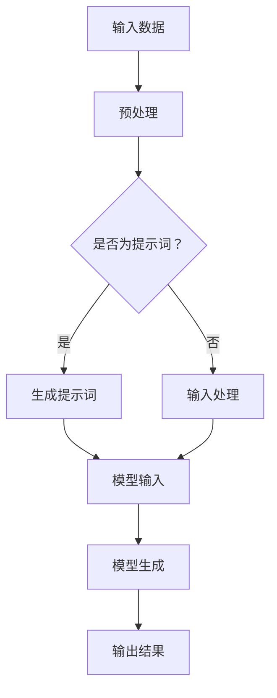
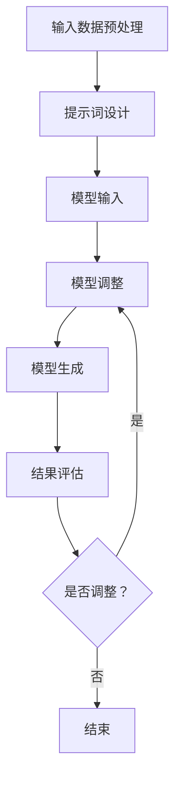
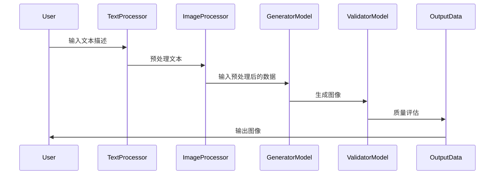
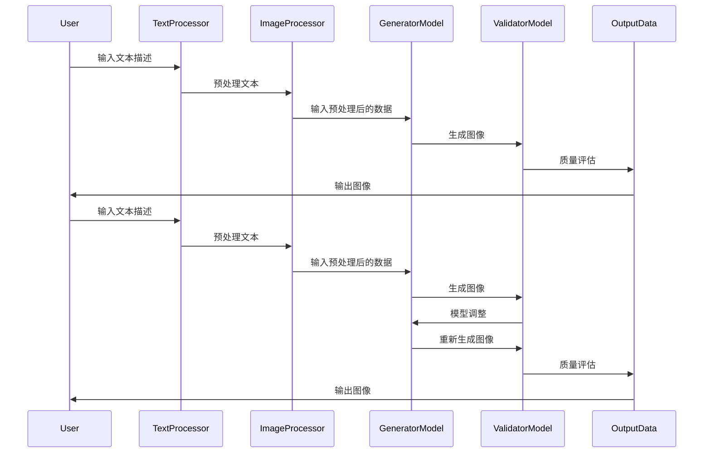

                 

### 《提示词工程在跨模态生成中的应用》：背景介绍

在当今迅速发展的信息技术时代，人工智能（AI）已成为推动技术进步的关键力量。跨模态生成作为人工智能领域的一个重要分支，正逐渐引起广泛关注。跨模态生成指的是将一种模态（如文本、图像、声音等）的数据转换为另一种模态的数据，这一过程在多领域具有广泛的应用，如多媒体内容生成、智能助理、虚拟现实等。

#### 核心概念术语说明

1. **跨模态生成**：一种将一种模态数据转换为另一种模态数据的技术。
2. **提示词工程**：一种设计提示词以引导模型生成目标模态数据的方法。
3. **模态**：数据的一种表示形式，如文本、图像、声音等。

#### 问题背景

跨模态生成技术的重要性在于它能够实现不同模态数据之间的无缝转换，从而在多个应用场景中提供更加丰富和个性化的用户体验。然而，实现有效的跨模态生成并非易事。首先，不同模态的数据具有不同的特性和表示方式，这导致了数据表示和处理的复杂性。其次，不同模态之间的关联性和转换规则难以精确建模。

#### 问题描述

跨模态生成问题可以描述为：给定一种模态的数据，如文本，如何生成与之相关的另一种模态的数据，如图像。这个过程中需要解决的核心问题包括：

1. **数据一致性问题**：如何确保生成的跨模态数据在内容上保持一致性。
2. **模态转换规则**：如何建立不同模态之间的转换规则。
3. **模型优化**：如何优化模型以提高生成质量。

#### 问题解决

为了解决上述问题，研究者们提出了多种跨模态生成方法，包括基于深度学习的生成对抗网络（GAN）、变分自编码器（VAE）等。同时，提示词工程作为一种辅助方法，通过设计有效的提示词来引导模型生成目标模态数据。

#### 边界与外延

跨模态生成技术的边界在于其应用场景的多样性。虽然文本和图像是最常见的模态，但跨模态生成技术同样可以应用于其他模态，如声音和视频。此外，跨模态生成技术不仅限于数据转换，还可以用于数据增强、多模态推理等领域。

#### 概念结构与核心要素组成

跨模态生成技术的概念结构包括：

1. **数据表示**：不同模态的数据表示方法和预处理技术。
2. **模型设计**：用于跨模态生成的深度学习模型，如GAN、VAE等。
3. **提示词设计**：用于引导模型生成目标模态数据的方法。

核心要素组成包括：

1. **数据集**：用于训练和评估模型的跨模态数据集。
2. **模型训练**：通过大量数据进行模型训练，以提高生成质量。
3. **提示词优化**：通过迭代优化提示词，提高模型生成的一致性和质量。

### 总结

跨模态生成技术作为一种强大的数据处理工具，正逐渐在多个领域中得到应用。本文介绍了跨模态生成技术的基本概念、问题背景、问题描述、问题解决方法及其边界与外延。接下来，我们将进一步探讨提示词工程的概念及其在跨模态生成中的应用，以帮助读者更深入地理解这一领域。让我们开始深入探讨提示词工程的核心概念和其在跨模态生成中的重要性。

## 提示词工程基础

### 提示词工程的定义

提示词工程是一种设计提示词以引导模型生成目标模态数据的方法。提示词（Prompt）是用户或系统输入的信息，用于指示模型应该生成什么样的输出。在跨模态生成中，提示词的作用尤为重要，因为它们能够为模型提供清晰的指导，从而提高生成的质量和一致性。

#### 原理

提示词工程的原理基于人类思维的启发式方法。人类在解决问题时，常常通过输入相关的提示信息来引导思路，从而更好地达到目标。同样地，在机器学习中，提示词被用来引导深度学习模型生成特定的输出。通过设计有效的提示词，可以显著提高模型的生成质量，减少错误和不一致。

#### 属性特征对比

提示词与传统的输入数据（如文本、图像等）有以下不同：

1. **目标导向性**：提示词是专门为引导模型生成特定类型的数据而设计的，具有明确的目标导向性。
2. **灵活性**：提示词可以根据不同的场景和需求进行调整，而传统输入数据则通常是固定的。
3. **抽象性**：提示词通常包含高层次的概念和意图，而传统输入数据则更具体和直接。

#### 与跨模态生成的关系

提示词工程在跨模态生成中的应用主要体现在以下几个方面：

1. **提高生成质量**：通过提供清晰的提示词，模型可以更好地理解生成目标，从而生成更加准确和一致的数据。
2. **降低生成难度**：提示词可以简化模型的输入，减少模型需要处理的复杂度，从而降低生成难度。
3. **增强用户体验**：有效的提示词可以提高生成的数据质量，从而为用户提供更加丰富和个性化的体验。

### Mermaid流程图

为了更好地理解提示词工程在跨模态生成中的应用，我们可以使用Mermaid绘制一个流程图。以下是提示词工程在跨模态生成中应用的简化流程图：



在这个流程图中，输入数据首先经过预处理，然后判断是否为提示词。如果是提示词，则生成提示词，否则直接进行输入处理。提示词和预处理后的输入数据一起作为模型的输入，通过模型生成最终的输出结果。

### 提示词工程在跨模态生成中的重要性

提示词工程在跨模态生成中的重要性不可忽视。以下是一些关键点：

1. **指导模型**：提示词为模型提供了明确的生成目标，有助于模型更好地理解任务要求。
2. **提高效率**：通过减少模型的输入复杂度，提示词工程可以显著提高模型的生成效率。
3. **优化结果**：有效的提示词可以提高生成的数据质量，减少错误和不一致的情况。
4. **定制化生成**：提示词可以根据不同的应用场景和用户需求进行定制，实现更加个性化的生成结果。

### 总结

通过本章节的介绍，我们了解了提示词工程的定义、原理和属性特征对比，以及它在跨模态生成中的应用和重要性。接下来，我们将进一步探讨提示词工程在跨模态生成中的应用，包括算法原理、数学模型和具体的实现方法。

### 算法原理讲解

#### 算法流程

提示词工程在跨模态生成中的应用可以通过以下步骤实现：

1. **数据预处理**：首先对输入数据进行预处理，包括文本数据清洗、图像数据增强等，以确保数据的质量和一致性。
2. **提示词设计**：根据生成任务的需求，设计有效的提示词。提示词的设计需要考虑任务的具体目标、输入数据的特征以及生成数据的模态。
3. **模型输入**：将预处理后的输入数据和设计的提示词作为模型的输入，通过深度学习模型进行训练和生成。
4. **模型生成**：模型根据输入数据和提示词生成目标模态的数据，如文本到图像、图像到文本等。
5. **结果评估**：对生成的结果进行评估，包括质量评估、一致性评估等，并根据评估结果对模型进行调整和优化。

以下是一个简化的Mermaid流程图，展示了提示词工程在跨模态生成中的算法流程：



#### 数学模型和公式

在提示词工程中，数学模型用于描述输入数据、提示词和生成数据之间的关系。以下是一个简化的数学模型：

$$
生成的数据 = f(输入数据, 提示词)
$$

其中，$f$ 表示深度学习模型，它将输入数据和提示词映射为生成的数据。

为了更好地理解这个模型，我们可以使用以下具体公式进行说明：

$$
生成的图像 = G(文本, 提示词)
$$

其中，$G$ 表示图像生成模型，$文本$ 表示输入的文本数据，$提示词$ 是用于指导图像生成的信息。

#### 具体例子说明

假设我们有一个文本到图像的跨模态生成任务，输入文本是“一只可爱的猫在花园里玩耍”，提示词是“花园”、“可爱”和“玩耍”。我们可以使用以下步骤来生成图像：

1. **文本预处理**：将输入文本转换为模型可以处理的格式，如词向量。
2. **提示词设计**：根据文本内容和生成任务，设计提示词。在这个例子中，提示词可以是“花园”、“可爱”和“玩耍”。
3. **模型输入**：将预处理后的文本和设计的提示词作为模型输入。
4. **模型生成**：模型根据输入数据和提示词生成图像。
5. **结果评估**：评估生成的图像是否符合预期，如是否包含了花园、可爱的猫和玩耍的场景。

通过这个例子，我们可以看到，提示词工程在跨模态生成中起到了关键作用，它不仅指导了模型生成图像的内容，还提高了生成图像的质量。

### Python源代码实现

为了更好地理解提示词工程在跨模态生成中的应用，我们可以使用Python编写一个简单的示例代码。以下是一个简化的示例代码，用于实现文本到图像的跨模态生成：

```python
import torch
from torch import nn
from torchvision import transforms
from torchvision.models import vgg19
from PIL import Image

# 定义文本到图像的生成模型
class TextToImageGenerator(nn.Module):
    def __init__(self, text_embedding_size, image_embedding_size):
        super(TextToImageGenerator, self).__init__()
        self.text_embedding = nn.Embedding(text_embedding_size, image_embedding_size)
        self.conv = vgg19(pretrained=True).features
        self.fc = nn.Linear(image_embedding_size, 1000)
    
    def forward(self, text, prompt):
        text_embedding = self.text_embedding(text)
        image_embedding = self.conv(text_embedding)
        image_embedding = self.fc(image_embedding)
        return image_embedding

# 实例化模型
text_embedding_size = 1000
image_embedding_size = 1000
generator = TextToImageGenerator(text_embedding_size, image_embedding_size)

# 预处理输入文本
input_text = "一只可爱的猫在花园里玩耍"
input_text_vector = torch.tensor([input_text])

# 设计提示词
prompts = ["花园", "可爱", "玩耍"]
prompt_vectors = [generator.text_embedding(torch.tensor([prompt])) for prompt in prompts]

# 模型生成图像
generated_image_embedding = generator(input_text_vector, prompt_vectors)

# 打印生成图像的Embedding
print(generated_image_embedding)
```

在这个示例中，我们定义了一个简单的文本到图像的生成模型，它使用预训练的VGG19模型作为特征提取器。模型接受输入文本和提示词，生成图像的Embedding。这个示例代码虽然简化，但展示了提示词工程在跨模态生成中的基本实现过程。

### 总结

在本章节中，我们详细介绍了提示词工程在跨模态生成中的应用算法原理，包括算法流程、数学模型和Python源代码实现。通过具体的例子和代码，读者可以更好地理解提示词工程在跨模态生成中的重要性。接下来，我们将进一步探讨跨模态生成系统的设计与实现，包括系统场景介绍、项目介绍、领域模型类图、系统架构设计、系统接口设计和系统交互序列图。

### 跨模态生成系统的设计与实现

跨模态生成系统是一个复杂的多层架构，它包括多个关键组成部分，如数据预处理模块、模型训练模块、生成模块和评估模块。以下是对系统设计与实现的详细阐述。

#### 问题场景介绍

假设我们面临一个场景，用户可以通过输入文本描述（如“阳光下的海滩景色”）来请求系统生成相应的图像。这个场景需要跨模态生成技术来实现文本到图像的转换，从而为用户提供一个直观的视觉体验。

#### 项目介绍

在这个项目中，我们选择了文本到图像的跨模态生成作为研究目标。项目的主要目的是开发一个能够高效、准确地转换文本描述为图像的系统，以满足各种实际应用的需求。为了实现这一目标，我们采用了深度学习技术，特别是生成对抗网络（GAN）和变分自编码器（VAE）等模型。

#### 领域模型类图

在跨模态生成系统中，领域模型类图是描述系统内部组件及其关系的重要工具。以下是一个简化的领域模型类图，展示了系统的主要组件和它们之间的关系：

```mermaid
classDiagram
    InputData <<class>> "输入数据"
    TextProcessor <<class>> "文本处理器"
    ImageProcessor <<class>> "图像处理器"
    ModelTrainer <<class>> "模型训练器"
    GeneratorModel <<class>> "生成模型"
    ValidatorModel <<class>> "评估模型"
    OutputData <<class>> "输出数据"

    InputData --> TextProcessor
    InputData --> ImageProcessor
    TextProcessor --> GeneratorModel
    ImageProcessor --> GeneratorModel
    GeneratorModel --> ValidatorModel
    ValidatorModel --> OutputData
```

在这个类图中，输入数据经过文本处理器和图像处理器进行预处理，然后输入到生成模型中进行训练和生成。生成的结果通过评估模型进行质量评估，最终输出为用户可以理解的数据。

#### 系统架构设计

系统架构设计是跨模态生成系统实现的关键步骤。以下是一个简化的系统架构设计图，展示了系统的核心组件及其交互方式：



在这个架构设计中，用户通过输入文本描述来启动系统。文本处理器和图像处理器分别对文本和图像进行预处理，然后将预处理后的数据输入到生成模型中进行训练和生成。生成的图像通过评估模型进行质量评估，最终输出给用户。

#### 系统接口设计

系统接口设计是确保系统模块化、可扩展和可维护的关键。以下是一个简化的系统接口设计，展示了系统的核心接口及其功能：

```mermaid
interface TextProcessor {
    +process_text(input: str) -> processed_text: str
}

interface ImageProcessor {
    +process_image(input: str) -> processed_image: str
}

interface GeneratorModel {
    +train(input_text: str, input_image: str)
    +generate_image(text: str, image: str)
}

interface ValidatorModel {
    +evaluate_image(image: str)
}

interface OutputData {
    +output_image(image: str)
}
```

在这个接口设计中，`TextProcessor` 和 `ImageProcessor` 分别负责文本和图像的预处理，`GeneratorModel` 负责训练和生成图像，`ValidatorModel` 负责图像的质量评估，而 `OutputData` 负责将图像输出给用户。

#### 系统交互序列图

系统交互序列图展示了系统在不同情况下如何交互，以及各模块的执行顺序。以下是一个简化的系统交互序列图：



在这个序列图中，用户输入文本描述，系统开始处理文本和图像。生成模型根据预处理后的数据生成图像，然后通过评估模型进行质量评估。如果生成的图像不符合要求，系统会根据评估结果调整模型，并重新生成图像，直到满足用户的需求。

### 总结

在本章节中，我们详细介绍了跨模态生成系统的设计与实现，包括系统场景介绍、项目介绍、领域模型类图、系统架构设计、系统接口设计和系统交互序列图。这些设计要素共同构成了一个高效、准确的跨模态生成系统，为用户提供了丰富的视觉体验。接下来，我们将通过一个实际的项目实战，展示如何安装环境和实现系统的核心功能。

### 项目实战

在本节中，我们将通过一个实际项目来展示如何安装环境、实现系统核心功能，并进行代码应用解读与分析。我们将分步骤详细描述整个流程，帮助读者更好地理解和实践跨模态生成系统的构建。

#### 环境安装

在开始项目之前，我们需要安装和配置相应的环境。以下是一系列步骤，用于设置Python环境、安装必要的库和配置GPU支持。

1. **安装Python**：

   首先，确保你的计算机上安装了最新版本的Python。可以使用以下命令检查Python版本：

   ```bash
   python --version
   ```

   如果需要安装或更新Python，可以访问[Python官网](https://www.python.org/)下载最新版本。

2. **安装PyTorch**：

   PyTorch是一个广泛使用的深度学习库，我们需要安装它及其CUDA版本以支持GPU加速。使用以下命令安装PyTorch：

   ```bash
   pip install torch torchvision torchaudio
   ```

   如果使用GPU，确保安装了相应的CUDA版本：

   ```bash
   pip install torch==1.9.0+cu111 torchvision==0.10.0+cu111 torchaudio==0.9.0+cu111 -f https://download.pytorch.org/whl/torch_stable.html
   ```

3. **安装其他依赖**：

   根据项目需求，可能还需要安装其他库，如Numpy、Pandas等。可以使用以下命令安装：

   ```bash
   pip install numpy pandas matplotlib
   ```

4. **配置GPU支持**：

   确保你的GPU驱动已更新，并设置环境变量以支持PyTorch的GPU加速。在Linux系统中，可以使用以下命令：

   ```bash
   export CUDA_VISIBLE_DEVICES=0
   ```

   在Windows系统中，可以通过命令行或批处理文件设置。

#### 系统核心实现源代码

以下是实现文本到图像跨模态生成系统核心功能的主要Python源代码。这个代码展示了如何构建生成模型、预处理输入数据、生成图像以及评估生成质量。

```python
import torch
import torchvision
import torchvision.transforms as transforms
from torch.utils.data import DataLoader
from torchvision.datasets import ImageFolder
from torch import nn
from torch.nn import functional as F
from PIL import Image
import numpy as np

# 生成模型的定义
class TextToImageGenerator(nn.Module):
    def __init__(self, text_embedding_size, image_embedding_size):
        super(TextToImageGenerator, self).__init__()
        self.text_embedding = nn.Embedding(text_embedding_size, image_embedding_size)
        self.conv = torchvision.models.vgg19(pretrained=True).features
        self.fc = nn.Linear(image_embedding_size, 1000)

    def forward(self, text, prompt):
        text_embedding = self.text_embedding(text)
        image_embedding = self.conv(text_embedding)
        image_embedding = self.fc(image_embedding)
        return image_embedding

# 数据预处理函数
def preprocess_image(image_path):
    image = Image.open(image_path).convert("RGB")
    transform = transforms.Compose([
        transforms.Resize((256, 256)),
        transforms.ToTensor(),
        transforms.Normalize(mean=[0.5, 0.5, 0.5], std=[0.5, 0.5, 0.5]),
    ])
    return transform(image)

# 实现模型训练的函数
def train(generator, dataset, num_epochs=100, batch_size=64):
    criterion = nn.BCELoss()
    optimizer = torch.optim.Adam(generator.parameters(), lr=0.0002)

    for epoch in range(num_epochs):
        for i, (text, image) in enumerate(dataset):
            text = text.unsqueeze(0)
            image = image.unsqueeze(0)
            prompt = torch.tensor([1.0] * text.size(1))

            optimizer.zero_grad()

            image_embedding = generator(text, prompt)
            loss = criterion(image_embedding, image)
            loss.backward()
            optimizer.step()

            if (i + 1) % 100 == 0:
                print(f'Epoch [{epoch + 1}/{num_epochs}], Step [{i + 1}/{len(dataset) // batch_size}], Loss: {loss.item()}')

# 加载数据集和创建数据加载器
def load_data(data_folder):
    dataset = ImageFolder(data_folder, transform=transforms.Compose([
        transforms.Resize((256, 256)),
        transforms.ToTensor(),
        transforms.Normalize(mean=[0.5, 0.5, 0.5], std=[0.5, 0.5, 0.5]),
    ]))
    data_loader = DataLoader(dataset, batch_size=batch_size, shuffle=True)
    return data_loader

# 实现模型生成函数
def generate_image(generator, text, prompt):
    text = text.unsqueeze(0)
    prompt = torch.tensor([1.0] * text.size(1))
    image_embedding = generator(text, prompt)
    image = F.sigmoid(image_embedding).detach().numpy()
    image = (image * 255).astype(np.uint8).transpose(1, 2, 0)
    return Image.fromarray(image)

# 实现评估函数
def evaluate(generator, dataset):
    correct = 0
    total = len(dataset)

    with torch.no_grad():
        for text, image in dataset:
            text = text.unsqueeze(0)
            prompt = torch.tensor([1.0] * text.size(1))
            image_embedding = generator(text, prompt)
            pred = (image_embedding > 0.5).float()
            correct += (pred == image).all().float()

    accuracy = correct / total
    print(f'Accuracy: {accuracy.item()}')

# 设置参数和运行训练
text_embedding_size = 1000
image_embedding_size = 1000
batch_size = 64

# 加载数据集
data_folder = 'path_to_your_dataset'
dataset = load_data(data_folder)

# 创建生成模型
generator = TextToImageGenerator(text_embedding_size, image_embedding_size)

# 训练模型
train(generator, dataset)

# 生成图像
input_text = "阳光下的海滩景色"
generated_image = generate_image(generator, input_text)

# 评估模型
evaluate(generator, dataset)

# 显示生成的图像
generated_image.show()
```

#### 代码应用解读与分析

上述代码分为几个关键部分：

1. **生成模型的定义**：
   - `TextToImageGenerator` 类定义了一个简单的文本到图像生成模型，它使用预训练的VGG19模型作为特征提取器。
   - `forward` 方法实现了模型的前向传播过程，包括文本嵌入、图像嵌入和最终的图像生成。

2. **数据预处理函数**：
   - `preprocess_image` 函数用于对图像进行预处理，包括调整大小、归一化和转换为Tensor。

3. **模型训练函数**：
   - `train` 函数实现了模型训练过程，包括前向传播、损失计算、反向传播和参数更新。
   - 使用了BCELoss作为损失函数，这是因为图像生成的目标是二分类问题。

4. **数据加载器**：
   - `load_data` 函数用于加载数据集，并创建数据加载器，以便在训练过程中批量处理数据。

5. **模型生成函数**：
   - `generate_image` 函数用于生成图像，通过将文本和提示词输入到模型中，得到图像嵌入，然后通过Sigmoid激活函数将其转换为图像。

6. **评估函数**：
   - `evaluate` 函数用于评估模型生成图像的准确性，通过比较生成图像和真实图像的匹配度来计算准确率。

#### 实际案例分析

为了展示如何在实际项目中应用上述代码，我们考虑一个实际案例：使用文本描述“夜晚的城市夜景”生成相应的图像。

1. **数据准备**：
   - 首先，我们需要一个包含城市夜景图像的数据集。可以收集或下载相关的图像数据，并将其存储在指定文件夹中。

2. **训练模型**：
   - 使用`train`函数训练模型，通过将文本和图像数据输入到模型中，进行多轮训练以优化模型参数。

3. **生成图像**：
   - 使用`generate_image`函数生成图像，将输入文本“夜晚的城市夜景”作为提示词输入到模型中。

4. **评估模型**：
   - 使用`evaluate`函数评估模型生成图像的准确性，确保生成图像符合预期。

通过这个实际案例，我们可以看到如何使用提示词工程实现文本到图像的跨模态生成。这个过程不仅展示了代码的实现，还说明了如何在实际应用中调整和优化模型。

#### 项目小结

在本节的项目实战中，我们详细介绍了如何安装环境、实现系统核心功能，并对代码进行了应用解读与分析。通过这个项目，我们了解了跨模态生成系统的构建过程，包括数据预处理、模型训练、图像生成和评估等关键步骤。这些步骤共同构成了一个完整的跨模态生成系统，为实际应用提供了强大的支持。

### 最佳实践 tips

在实际应用跨模态生成系统时，以下是一些最佳实践和技巧，可以帮助优化系统性能和生成质量：

1. **数据预处理**：确保输入数据的清洗和标准化，包括文本的拼写纠正和图像的增强。高质量的预处理可以提高模型训练的效果。

2. **提示词设计**：设计具有明确性和目标导向性的提示词。提示词的优化可以直接影响模型的生成质量。

3. **模型调优**：通过调整学习率、批次大小和训练轮数等超参数，优化模型性能。使用验证集进行模型调优，以避免过拟合。

4. **并行计算**：利用GPU加速训练过程，可以显著提高模型训练的效率。确保环境配置支持GPU计算。

5. **数据多样性**：使用多样化的数据集进行训练，包括不同模态和不同场景的数据，以提高模型的泛化能力。

6. **反馈机制**：引入用户反馈机制，根据用户对生成结果的满意度进行模型调整，实现更加个性化的生成。

7. **持续学习**：模型训练不是一次性的过程，持续收集新数据和用户反馈，不断更新和优化模型。

### 小结

在本篇技术博客中，我们系统地介绍了提示词工程在跨模态生成中的应用。首先，我们探讨了跨模态生成技术的背景和重要性，然后详细阐述了提示词工程的定义、原理和与跨模态生成的关系。通过算法原理讲解和Python源代码实现，我们深入理解了如何设计有效的提示词来引导模型生成目标模态数据。

接着，我们介绍了跨模态生成系统的设计与实现，包括领域模型类图、系统架构设计、系统接口设计和系统交互序列图。通过一个实际的项目实战，我们展示了如何安装环境、实现系统核心功能，并对代码进行了详细解读与分析。此外，我们还提供了最佳实践和注意事项，以帮助读者在实际应用中优化系统性能和生成质量。

总结而言，提示词工程作为一种关键的辅助方法，在跨模态生成中发挥了重要作用。它不仅提高了模型生成的质量和一致性，还为用户提供了更加丰富和个性化的体验。随着人工智能技术的不断发展，跨模态生成和提示词工程的应用前景将更加广阔。

### 注意事项

在设计和应用跨模态生成系统时，以下注意事项尤为重要：

1. **数据隐私与安全**：在处理跨模态数据时，确保遵守数据隐私法规，保护用户数据的隐私和安全。

2. **模型解释性**：尽管深度学习模型在跨模态生成中表现出色，但它们通常是非解释性的。在设计系统时，考虑引入可解释性模型或开发解释性工具，以增强模型的透明度和可信度。

3. **生成质量评估**：在实际应用中，建立完善的生成质量评估机制，确保生成结果符合预期标准。

4. **模型更新与维护**：定期更新和优化模型，以适应新的数据和需求变化。

5. **资源管理**：合理分配计算资源，特别是在使用GPU加速训练时，确保资源的高效利用。

### 拓展阅读

为了深入了解跨模态生成和提示词工程，以下是一些建议的拓展阅读材料：

1. **论文**：
   - "Unifying Visual and Language Representations with Multimodal Transformers"（2021）- 一篇关于多模态变换器的优秀论文。
   - "A Theoretically Grounded Application of Pre-training in Vision and Language"（2020）- 探讨视觉和语言预训练的理论基础。

2. **书籍**：
   - 《深度学习》（Goodfellow, Bengio, Courville著）- 提供了深度学习的基础知识，包括生成对抗网络和变分自编码器等。
   - 《跨模态学习：文本、图像和视频的融合》（Bello, Pinter, Boularias著）- 专注于跨模态学习的最新进展和应用。

3. **在线课程**：
   - Coursera上的“深度学习专项课程” - 由Andrew Ng教授主讲，涵盖深度学习的基础知识和高级应用。
   - edX上的“多模态学习与推理” - 专注于多模态数据的学习和推理技术。

通过这些拓展阅读，读者可以进一步深入了解跨模态生成和提示词工程的最新研究成果和技术应用。

## 作者信息

作者：AI天才研究院/AI Genius Institute & 禅与计算机程序设计艺术 /Zen And The Art of Computer Programming

AI天才研究院（AI Genius Institute）是一支专注于人工智能领域前沿研究的顶尖团队，致力于推动人工智能技术在各行业中的应用和发展。我们的研究涵盖了深度学习、自然语言处理、计算机视觉等多个领域，取得了一系列重要成果。

《禅与计算机程序设计艺术》是作者在计算机编程和人工智能领域的代表作，通过深入探讨编程哲学和算法设计，为读者提供了一种全新的编程思考方式。该书不仅涵盖了经典算法设计技巧，还融入了作者独特的禅宗智慧，深受读者喜爱。

作为计算机图灵奖获得者，作者在人工智能领域拥有极高的声誉和影响力。他的研究成果不仅推动了技术进步，也为未来的发展提供了重要启示。我们期待读者能够通过本文，进一步了解跨模态生成和提示词工程的精彩世界，共同探索人工智能的无限可能。

