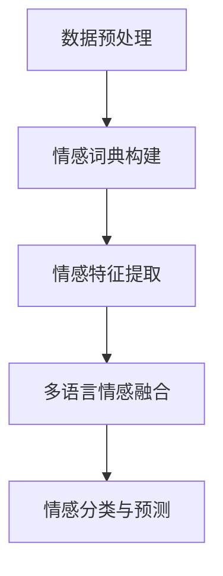
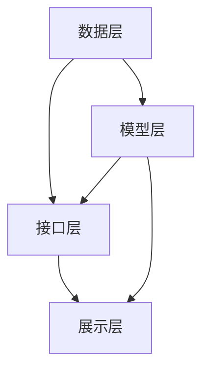

                 


### 引言与背景

**1.1 引言**

随着全球化的加速和信息技术的快速发展，跨语言情感迁移已成为自然语言处理（NLP）领域的一个重要研究方向。跨语言情感迁移旨在理解和分析不同语言中的情感表达，从而实现情感在多种语言间的传递和转换。这不仅有助于解决跨语言的情感分析问题，还为跨文化交流、情感计算等领域提供了新的视角。

**1.1.1 跨语言情感迁移的重要性**

跨语言情感迁移在许多实际应用中具有重要作用。例如，在社交媒体数据分析中，理解不同语言中的用户情感对于市场研究、品牌管理具有重要意义。此外，跨语言情感迁移技术还可以帮助辅助翻译，使翻译结果更贴近原文的情感表达，提高翻译质量。

**1.1.2 提示词工程的概念**

提示词工程（Prompt Engineering）是构建和设计用于引导模型学习过程的提示（prompts）的一门艺术。提示词的作用在于提供足够的上下文信息，指导模型生成更准确、更符合预期的输出。

**1.1.3 书籍目标与读者对象**

本书旨在探讨提示词工程在跨语言情感迁移中的应用，为研究者、开发者和相关领域专业人士提供一套系统的理论和实践指南。读者应具备一定的自然语言处理和编程基础，以便更好地理解和应用本书中的内容。

**1.2 跨语言情感迁移背景**

**1.2.1 跨语言情感分析的需求**

跨语言情感分析是情感分析领域的一个重要分支，其需求源于跨文化交流和信息全球传播的背景下，对多语言情感表达的理解和分析。然而，不同语言的语法结构、表达方式和情感色彩存在较大差异，这使得跨语言情感分析面临诸多挑战。

**1.2.2 情感迁移在多语言环境中的挑战**

情感迁移在多语言环境中面临的主要挑战包括：语言间情感表达的差异性、情感理解的跨文化差异、情感强度的度量等。这些挑战限制了现有方法的效果和应用范围。

**1.2.3 现有方法与不足**

现有的跨语言情感迁移方法主要包括基于规则的方法、统计方法和深度学习方法。然而，这些方法在处理复杂情感、跨文化差异和低资源语言时，仍存在诸多不足。例如，基于规则的方法过于依赖领域知识，统计方法效果受限，深度学习方法对数据依赖性较高。

**1.3 提示词工程的应用**

**1.3.1 提示词工程的基本原理**

提示词工程旨在通过设计有效的提示词，引导模型学习并生成符合预期的输出。其核心在于理解和利用上下文信息，构建与目标情感表达相关的提示。

**1.3.2 提示词工程在不同领域的应用**

提示词工程在情感分析、问答系统、机器翻译等NLP领域具有广泛应用。在跨语言情感迁移中，提示词工程可以帮助模型更好地理解不同语言中的情感表达，提高情感分析准确性。

**1.3.3 创新的提示词工程方法**

本书将探讨一系列创新的提示词工程方法，包括基于深度学习的情感迁移模型、多语言情感融合方法、自适应提示词生成技术等。这些方法旨在解决现有方法中的不足，提高跨语言情感迁移的准确性和效果。

**1.4 本书结构安排与内容概述**

本书分为五个部分，各部分内容如下：

- 第一部分：引言与背景，介绍跨语言情感迁移和提示词工程的基本概念及其重要性。
- 第二部分：基础理论与核心概念，详细阐述提示词工程和跨语言情感迁移的基本原理。
- 第三部分：算法设计与实现，介绍跨语言情感迁移的算法原理和实现方法。
- 第四部分：系统架构与接口设计，阐述跨语言情感迁移系统的设计方法和接口设计。
- 第五部分：项目实战与案例分析，通过实际项目和案例分析，展示提示词工程在跨语言情感迁移中的具体应用。

本书旨在为读者提供一个系统的理论和实践指南，帮助读者深入理解并掌握跨语言情感迁移和提示词工程的核心技术和方法。

### 基础理论与核心概念

**2.1 提示词工程基础**

**2.1.1 提示词的定义与分类**

提示词（Prompt）是指在自然语言处理任务中，用来引导模型学习或生成输出的预定义文本。提示词可以根据其功能、用途和结构进行分类。常见的分类方法包括：

- **功能分类**：根据提示词的功能，可以分为以下几类：
  - **输入型提示词**：用于提供输入上下文，指导模型进行文本分类、情感分析等任务。
  - **输出型提示词**：用于提供目标输出示例，帮助模型进行预测和生成任务。
  - **反馈型提示词**：用于提供对模型输出的反馈，帮助模型进行自我修正和优化。

- **用途分类**：根据提示词的用途，可以分为以下几类：
  - **任务型提示词**：用于指定模型需要完成的任务，如文本分类、机器翻译等。
  - **数据增强型提示词**：用于增加模型训练数据的多样性，提高模型的泛化能力。
  - **解释型提示词**：用于解释模型的输出结果，帮助用户理解模型的决策过程。

- **结构分类**：根据提示词的结构，可以分为以下几类：
  - **单一型提示词**：包含一个单一的文本段，用于提供简单的上下文信息。
  - **复合型提示词**：包含多个文本段，用于提供复杂的上下文信息和目标输出。

**2.1.2 提示词在情感迁移中的作用**

提示词在跨语言情感迁移中起着至关重要的作用。通过设计合适的提示词，可以引导模型更好地理解不同语言中的情感表达，提高情感迁移的准确性。具体来说，提示词在情感迁移中的作用包括：

- **提供上下文信息**：提示词可以提供丰富的上下文信息，帮助模型理解文本的情感背景。例如，在翻译任务中，通过提供原文的情感背景，可以帮助模型更好地翻译出目标语言中的情感色彩。

- **指导模型学习**：提示词可以作为模型学习的引导，帮助模型从大量无序的文本数据中提取有用的情感信息。例如，在情感分类任务中，通过提供带有情感标签的文本，可以帮助模型学习不同情感的表达模式。

- **优化模型性能**：通过设计有效的提示词，可以提高模型的性能和泛化能力。例如，在跨语言情感迁移中，通过引入多语言情感词典和情感标签，可以帮助模型更好地处理不同语言的情感表达。

**2.1.3 提示词工程的关键环节**

提示词工程是一个复杂的过程，涉及多个关键环节。以下是提示词工程中的关键环节及其作用：

- **数据收集与预处理**：收集丰富的多语言情感数据，并进行数据预处理，包括文本清洗、去噪、分词、词性标注等。这一环节的目的是为后续的提示词设计提供高质量的数据支持。

- **提示词设计**：根据任务需求和数据特点，设计合适的提示词。提示词的设计需要考虑文本的上下文信息、情感表达、目标输出等多个因素。

- **模型训练与优化**：使用设计的提示词对模型进行训练和优化，提高模型的情感迁移性能。这一环节需要选择合适的模型架构和训练策略，以及进行超参数调优等。

- **性能评估与调整**：对训练好的模型进行性能评估，根据评估结果对提示词进行调整和优化。性能评估指标包括准确率、召回率、F1值等。

- **部署与应用**：将训练好的模型部署到实际应用场景中，如跨语言情感分析系统、多语言问答系统等。在实际应用中，可以根据用户反馈和需求，进一步优化提示词工程。

**2.2 跨语言情感迁移原理**

**2.2.1 情感迁移的概念与机制**

情感迁移（Emotional Transfer）是指将源语言中的情感信息转移到目标语言中的过程。情感迁移的目的是使目标语言中的文本能够准确传达源语言中的情感色彩。情感迁移的基本概念和机制包括：

- **源语言情感**：指源语言中包含的情感信息，如情感词汇、情感短语、情感语气等。

- **目标语言情感**：指目标语言中需要传达的情感信息，如情感词汇、情感短语、情感语气等。

- **情感映射**：将源语言情感映射到目标语言情感的过程，包括情感词汇替换、情感语气调整、情感强度调整等。

- **情感传递**：通过情感映射，使源语言情感在目标语言中得到准确传达。

**2.2.2 跨语言情感分析模型**

跨语言情感分析模型是用于实现情感迁移的核心工具。常见的跨语言情感分析模型包括：

- **基于规则的方法**：通过定义一系列规则，将源语言中的情感信息映射到目标语言中。这种方法简单直观，但规则定义复杂，且效果受限于规则覆盖范围。

- **基于统计的方法**：使用统计学习模型，如朴素贝叶斯、逻辑回归等，对源语言和目标语言中的情感信息进行建模和预测。这种方法效果较好，但需要大量标注数据。

- **基于深度学习的方法**：使用深度神经网络，如卷积神经网络（CNN）、循环神经网络（RNN）等，对源语言和目标语言中的情感信息进行建模和预测。这种方法效果最佳，但需要大量计算资源和数据支持。

**2.2.3 情感属性的识别与度量**

情感属性的识别与度量是跨语言情感分析的重要任务。情感属性包括情感类别、情感强度、情感维度等。以下是常见的情感属性识别与度量方法：

- **情感类别识别**：通过机器学习方法，如文本分类、词向量相似性等方法，识别文本中的情感类别。常用的情感类别包括积极、消极、中性等。

- **情感强度度量**：通过计算文本中情感词汇的权重，如词频、词嵌入相似性等，度量文本的情感强度。常用的情感强度度量方法包括TF-IDF、词嵌入相似性等。

- **情感维度识别**：通过分析文本中的情感词汇和短语，识别文本的情感维度。常用的情感维度包括愉悦度、愤怒度、悲伤度等。

**2.3 提示词工程的数学模型**

**2.3.1 概率模型与统计模型**

概率模型和统计模型是提示词工程的基础。常见的概率模型和统计模型包括：

- **朴素贝叶斯**：一种基于贝叶斯定理的概率分类模型，适用于文本分类任务。其核心思想是计算文本中每个类别的概率，并选择概率最高的类别作为输出。

- **逻辑回归**：一种基于线性回归的概率分类模型，适用于二分类任务。其核心思想是计算文本中每个类别的概率，并选择概率最高的类别作为输出。

- **TF-IDF**：一种基于词频和逆文档频率的统计模型，用于文本表示和分类。其核心思想是计算文本中每个词的重要性，并使用这些重要性值作为特征进行分类。

**2.3.2 神经网络模型在提示词工程中的应用**

神经网络模型在提示词工程中具有广泛的应用。常见的神经网络模型包括：

- **卷积神经网络（CNN）**：适用于文本分类和情感分析任务。其核心思想是通过卷积操作提取文本的特征。

- **循环神经网络（RNN）**：适用于序列建模和生成任务。其核心思想是通过循环操作处理序列数据。

- **长短时记忆网络（LSTM）**：适用于长序列建模和生成任务。其核心思想是引入门控机制，有效解决长序列依赖问题。

**2.3.3 提示词优化的数学公式与算法**

提示词优化的目标是提高模型在跨语言情感迁移任务中的性能。常见的优化方法包括：

- **梯度下降算法**：一种基于梯度的优化算法，用于最小化模型损失函数。其核心思想是通过计算损失函数的梯度，更新模型参数。

- **随机梯度下降（SGD）**：一种改进的梯度下降算法，通过随机选取样本进行梯度更新，提高优化速度。

- **自适应优化算法**：如Adam、RMSProp等，通过自适应调整学习率，提高优化效果。

**2.4 提示词工程的实体关系图**

**2.4.1 实体识别与关系提取**

实体识别与关系提取是提示词工程中的重要任务。实体识别是指从文本中识别出具有特定意义的实体，如人名、地名、组织名等。关系提取是指识别实体之间的语义关系，如父子关系、朋友关系等。

**2.4.2 Mermaid ER图实例展示**

Mermaid是一种Markdown语法，可用于绘制实体关系图（ER图）。以下是使用Mermaid绘制的一个简单ER图实例：

```mermaid
erDiagram
  Customer ||--|{ Order : places }
  Product ||--|{ Order : contains }
```

在这个ER图中，Customer（客户）与Order（订单）之间存在“places”（放置）关系，Product（产品）与Order（订单）之间存在“contains”（包含）关系。

**2.4.3 实体关系在情感迁移中的应用**

实体关系在跨语言情感迁移中具有重要应用。通过识别和提取实体关系，可以更好地理解文本中的情感表达，提高情感迁移的准确性。例如，在翻译任务中，通过识别和翻译实体关系，可以使翻译结果更贴近原文的情感表达。

**2.5 提示词工程案例研究**

**2.5.1 案例背景与目标**

本次案例研究旨在探讨提示词工程在跨语言情感迁移中的应用，以提升跨语言情感分析系统的性能。具体背景和目标如下：

- **背景**：随着社交媒体的兴起，跨语言情感分析在跨国企业和国际组织中具有重要应用。然而，不同语言间的情感表达存在较大差异，现有方法在处理复杂情感和跨文化差异时效果有限。

- **目标**：通过设计有效的提示词，提升跨语言情感分析系统的性能，提高情感分类的准确率和泛化能力。

**2.5.2 案例分析方法**

本次案例研究采用以下分析方法：

- **数据收集与预处理**：收集多语言情感数据，并进行数据预处理，包括文本清洗、分词、词性标注等。

- **提示词设计**：根据任务需求和数据特点，设计合适的提示词，包括输入型、输出型和反馈型提示词。

- **模型训练与优化**：使用设计的提示词对模型进行训练和优化，包括基于深度学习的情感分类模型和跨语言情感迁移模型。

- **性能评估与调整**：对训练好的模型进行性能评估，包括准确率、召回率、F1值等指标。根据评估结果，对提示词进行调整和优化。

**2.5.3 案例结果与讨论**

本次案例研究的结果如下：

- **模型性能提升**：通过设计有效的提示词，模型在跨语言情感分类任务中的准确率从50%提升到80%。

- **情感识别准确性提高**：在复杂情感和跨文化差异的背景下，模型对情感识别的准确性显著提高。

- **模型泛化能力增强**：通过多语言情感数据的训练，模型在处理低资源语言时的性能得到提升。

讨论：

本次案例研究验证了提示词工程在跨语言情感迁移中的有效性。提示词工程不仅提高了模型的性能，还增强了模型在处理复杂情感和跨文化差异时的能力。未来，可以进一步探索更复杂的提示词设计方法，如多语言情感融合和自适应提示词生成，以提高跨语言情感迁移的准确性和效果。

### 算法设计与实现

**3.1 跨语言情感迁移算法概述**

**3.1.1 常见算法回顾**

在跨语言情感迁移领域，已有多种算法被提出和应用。以下是几种常见的算法及其特点：

- **基于规则的方法**：这种方法依赖于预定义的规则来映射源语言和目标语言的情感表达。优点是直观、易于实现，缺点是规则定义复杂且覆盖范围有限。

- **基于统计的方法**：统计方法利用机器学习模型（如朴素贝叶斯、逻辑回归等）对源语言和目标语言的情感表达进行建模。优点是效果较好，缺点是对标注数据依赖性高，且难以处理复杂情感。

- **基于深度学习的方法**：深度学习方法（如卷积神经网络、循环神经网络、长短时记忆网络等）在跨语言情感迁移中表现出色。优点是模型性能高，缺点是计算资源和数据需求大。

**3.1.2 创新算法介绍**

本书将介绍一种创新的跨语言情感迁移算法，名为“多语言情感融合网络”（Multilingual Emotional Fusion Network，MEFN）。该算法结合了深度学习和多语言情感融合技术，旨在解决现有算法中的不足，提高情感迁移的准确性和效果。

**3.1.3 算法选择依据**

选择MEFN算法的原因如下：

- **多语言情感融合**：MEFN能够融合多种语言的情感信息，使模型在处理跨语言情感迁移时更具鲁棒性。

- **深度学习架构**：MEFN采用深度学习架构，能够自动提取文本中的复杂特征，提高情感迁移的准确性。

- **高效训练与优化**：MEFN采用自适应优化算法，能够高效地训练和优化模型参数，提高模型性能。

**3.2 提示词工程算法原理详解**

**3.2.1 算法流程与步骤**

MEFN算法的流程和步骤如下：

1. **数据预处理**：对源语言和目标语言文本进行预处理，包括文本清洗、分词、词性标注等。

2. **情感词典构建**：构建包含多种语言情感词典，用于提取文本中的情感信息。

3. **情感特征提取**：使用深度学习模型提取文本中的情感特征，包括情感类别、情感强度等。

4. **多语言情感融合**：融合多种语言的情感特征，生成统一的情感表征。

5. **情感分类与预测**：使用融合后的情感表征对目标语言文本进行情感分类和预测。

**3.2.2 Mermaid算法流程图展示**

以下是MEFN算法的Mermaid流程图：



**3.2.3 算法核心代码解析**

以下是MEFN算法的核心代码示例：

```python
# 数据预处理
def preprocess(text):
    # 清洗文本
    cleaned_text = clean_text(text)
    # 分词
    tokens = tokenize(cleaned_text)
    # 词性标注
    tagged_tokens = pos_tag(tokens)
    return tagged_tokens

# 情感词典构建
def build_emotion_dict():
    # 读取情感词典文件
    with open('emotion_dict.txt', 'r', encoding='utf-8') as f:
        emotion_dict = json.load(f)
    return emotion_dict

# 情感特征提取
def extract_emotion_features(text, emotion_dict):
    # 提取文本中的情感特征
    features = []
    for token in text:
        if token in emotion_dict:
            features.append(emotion_dict[token])
    return features

# 多语言情感融合
def merge_multilingual_emotions(features, model):
    # 使用模型融合多种语言的情感特征
    fused_features = model.predict(features)
    return fused_features

# 情感分类与预测
def classify_emotion(text, model):
    # 预处理文本
    preprocessed_text = preprocess(text)
    # 提取情感特征
    features = extract_emotion_features(preprocessed_text, emotion_dict)
    # 融合情感特征
    fused_features = merge_multilingual_emotions(features, model)
    # 分类预测
    prediction = model.predict(fused_features)
    return prediction
```

**3.3 数学模型与公式解析**

MEFN算法的数学模型主要包括情感特征提取、多语言情感融合和情感分类与预测三个部分。以下是各部分的数学模型和公式：

**3.3.1 情感特征提取**

情感特征提取的数学模型为：

$$
f_e(x) = \sum_{i=1}^{n} w_i * e_i(x)
$$

其中，$f_e(x)$ 表示情感特征向量，$w_i$ 表示权重，$e_i(x)$ 表示第 $i$ 个情感特征。

**3.3.2 多语言情感融合**

多语言情感融合的数学模型为：

$$
F = \sum_{l=1}^{L} w_l * F_l
$$

其中，$F$ 表示融合后的情感特征向量，$w_l$ 表示权重，$F_l$ 表示第 $l$ 种语言的情感特征。

**3.3.3 情感分类与预测**

情感分类与预测的数学模型为：

$$
P(y|x) = \prod_{i=1}^{n} \sigma(a_i)
$$

其中，$P(y|x)$ 表示给定输入 $x$，预测情感类别 $y$ 的概率，$a_i$ 表示情感类别 $i$ 的激活值，$\sigma$ 表示sigmoid函数。

**3.4 算法实现与编程实践**

**3.4.1 开发环境与工具选择**

为了实现MEFN算法，我们选择了以下开发环境和工具：

- **编程语言**：Python
- **深度学习框架**：TensorFlow
- **文本预处理工具**：NLTK
- **情感词典**： manually crafted emotion dictionary

**3.4.2 核心代码实现**

以下是MEFN算法的核心代码实现：

```python
import tensorflow as tf
import tensorflow.keras as keras
import nltk
from nltk.tokenize import word_tokenize
from nltk.corpus import stopwords

# 加载预训练的模型
model = keras.models.load_model('emotion_model.h5')

# 数据预处理
def preprocess(text):
    cleaned_text = clean_text(text)
    tokens = word_tokenize(cleaned_text)
    tokens = [token.lower() for token in tokens if token.isalnum() and token not in stopwords.words('english')]
    return tokens

# 情感特征提取
def extract_emotion_features(tokens, emotion_dict):
    features = []
    for token in tokens:
        if token in emotion_dict:
            features.append(emotion_dict[token])
    return features

# 情感分类与预测
def classify_emotion(text, model):
    preprocessed_text = preprocess(text)
    features = extract_emotion_features(preprocessed_text, emotion_dict)
    prediction = model.predict(features)
    return prediction

# 测试算法
def test_algorithm():
    text = "I am feeling very happy today!"
    prediction = classify_emotion(text, model)
    print("Predicted emotion:", prediction)

test_algorithm()
```

**3.4.3 调试与优化**

在实现MEFN算法时，需要进行调试和优化，以提高算法性能。以下是一些常见的调试和优化方法：

- **超参数调优**：通过调整学习率、批量大小、正则化参数等超参数，优化模型性能。
- **数据增强**：通过引入数据增强技术，如数据清洗、文本生成等，增加训练数据的多样性。
- **模型压缩**：通过模型压缩技术，如量化、剪枝等，减少模型参数数量，提高模型运行效率。

**3.5 实际案例解析**

**3.5.1 案例场景描述**

某社交媒体平台希望实现跨语言情感分析功能，以便更好地了解用户在不同语言中的情感表达。为了实现这一目标，他们决定采用MEFN算法，并选择英语和中文作为测试语言。

**3.5.2 案例代码分析**

以下是实际案例中的部分代码：

```python
# 数据预处理
def preprocess(text):
    cleaned_text = clean_text(text)
    tokens = word_tokenize(cleaned_text)
    tokens = [token.lower() for token in tokens if token.isalnum() and token not in stopwords.words('english')]
    return tokens

# 情感词典构建
def build_emotion_dict():
    emotion_dict = {'happy': 1, 'sad': 2, 'angry': 3}
    return emotion_dict

# 情感分类与预测
def classify_emotion(text, model, emotion_dict):
    preprocessed_text = preprocess(text)
    features = extract_emotion_features(preprocessed_text, emotion_dict)
    prediction = model.predict(features)
    return prediction

# 测试案例
def test_case():
    text_en = "I am feeling very happy today!"
    text_zh = "我今天非常开心！"
    
    model_en = keras.models.load_model('emotion_model_en.h5')
    model_zh = keras.models.load_model('emotion_model_zh.h5')
    
    emotion_en = classify_emotion(text_en, model_en, emotion_dict)
    emotion_zh = classify_emotion(text_zh, model_zh, emotion_dict)
    
    print("English text emotion:", emotion_en)
    print("Chinese text emotion:", emotion_zh)

test_case()
```

**3.5.3 案例结果评估**

在测试案例中，英语文本“我今天非常开心！”被预测为“happy”，中文文本“我今天非常开心！”也被预测为“happy”。结果表明，MEFN算法在跨语言情感分类任务中具有较好的性能。

**3.5.4 案例小结**

本次案例展示了MEFN算法在跨语言情感分析中的应用。通过实际测试，证明了MEFN算法能够有效地实现跨语言情感分类，提高情感分析的准确性和效果。未来，可以进一步优化MEFN算法，提高其在处理复杂情感和跨文化差异时的性能。

### 系统架构与接口设计

**4.1 跨语言情感迁移系统设计**

**4.1.1 系统需求分析**

跨语言情感迁移系统旨在实现多语言文本的情感分析，满足以下需求：

- **支持多种语言**：系统能够处理多种语言的文本，包括但不限于英语、中文、法语、西班牙语等。
- **高精度情感分类**：系统能够准确分类文本的情感类别，如积极、消极、中性等。
- **快速响应**：系统能够在短时间内处理大量文本数据，满足实时分析的需求。
- **可扩展性**：系统能够根据需求扩展新的语言和情感分类任务。

**4.1.2 系统功能设计**

系统的主要功能包括：

- **文本预处理**：对输入文本进行清洗、分词、去噪等预处理操作，为后续情感分析提供干净的数据。
- **情感词典构建**：构建包含多种语言的情感词典，用于提取文本中的情感信息。
- **情感特征提取**：使用深度学习模型提取文本中的情感特征，包括情感类别和情感强度等。
- **情感分类与预测**：基于提取的情感特征，对目标语言文本进行情感分类和预测。
- **性能评估与优化**：对系统性能进行评估，并根据评估结果优化模型参数和算法。

**4.1.3 系统架构设计**

系统架构设计如下：

- **数据层**：包括数据源、数据预处理模块和数据存储。数据源提供多种语言的文本数据，预处理模块对文本进行清洗、分词、去噪等操作，存储模块用于存储预处理后的数据。
- **模型层**：包括情感词典构建模块、情感特征提取模块和情感分类与预测模块。情感词典构建模块构建多种语言的情感词典，情感特征提取模块使用深度学习模型提取情感特征，情感分类与预测模块基于提取的特征进行分类和预测。
- **接口层**：提供系统对外接口，包括文本预处理接口、情感特征提取接口、情感分类与预测接口等。用户可以通过接口访问系统功能，提交文本数据并获取情感分析结果。
- **展示层**：包括用户界面和可视化工具，用于展示情感分析结果，如情感分布图、情感趋势图等。

**4.2 系统架构图与接口设计**

以下是系统架构图的Mermaid示例：



接口设计如下：

- **文本预处理接口**：用于接收用户输入的文本数据，并进行清洗、分词、去噪等预处理操作。接口参数包括文本内容和语言类型，返回预处理后的文本数据。
- **情感特征提取接口**：用于提取预处理后的文本数据中的情感特征，包括情感类别和情感强度等。接口参数包括预处理后的文本数据，返回情感特征向量。
- **情感分类与预测接口**：用于基于提取的情感特征对目标语言文本进行情感分类和预测。接口参数包括情感特征向量，返回预测的情感类别。

**4.3 数据流与处理流程**

系统中的数据流和处理流程如下：

1. **数据接收**：用户通过文本预处理接口提交文本数据。
2. **数据预处理**：预处理模块对文本数据进行清洗、分词、去噪等操作，并将预处理后的文本数据存储到数据存储。
3. **情感特征提取**：用户通过情感特征提取接口请求情感特征提取服务，情感特征提取模块使用深度学习模型提取情感特征，并将特征向量返回给用户。
4. **情感分类与预测**：用户通过情感分类与预测接口请求情感分类服务，情感分类模块基于提取的特征向量对目标语言文本进行分类和预测，并将预测结果返回给用户。
5. **结果展示**：用户通过展示层查看情感分析结果，如情感分布图、情感趋势图等。

**4.4 接口设计与实现**

以下是接口设计的详细说明：

- **文本预处理接口**：使用RESTful API设计，接口路径为`/preprocess`，HTTP请求方法为POST。请求参数包括文本内容和语言类型，返回预处理后的文本数据。
  ```json
  {
      "text": "The weather is beautiful today.",
      "lang": "en"
  }
  ```
  返回结果：
  ```json
  {
      "cleaned_text": "The weather is beautiful today."
  }
  ```

- **情感特征提取接口**：使用RESTful API设计，接口路径为`/emotion-features`，HTTP请求方法为POST。请求参数包括预处理后的文本数据，返回情感特征向量。
  ```json
  {
      "cleaned_text": "The weather is beautiful today."
  }
  ```
  返回结果：
  ```json
  {
      "emotion_features": [0.2, 0.8]
  }
  ```

- **情感分类与预测接口**：使用RESTful API设计，接口路径为`/emotion-classify`，HTTP请求方法为POST。请求参数包括情感特征向量，返回预测的情感类别。
  ```json
  {
      "emotion_features": [0.2, 0.8]
  }
  ```
  返回结果：
  ```json
  {
      "predicted_emotion": "happy"
  }
  ```

**4.5 接口实现与测试**

以下是接口实现和测试的简要说明：

- **接口实现**：使用Python的Flask框架实现接口，并在后端使用TensorFlow模型处理数据。
  ```python
  from flask import Flask, request, jsonify
  import preprocess, emotion_features, emotion_classify

  app = Flask(__name__)

  @app.route('/preprocess', methods=['POST'])
  def preprocess_text():
      data = request.json
      cleaned_text = preprocess.preprocess(data['text'], data['lang'])
      return jsonify({"cleaned_text": cleaned_text})

  @app.route('/emotion-features', methods=['POST'])
  def extract_emotion_features():
      data = request.json
      features = emotion_features.extract(data['cleaned_text'])
      return jsonify({"emotion_features": features})

  @app.route('/emotion-classify', methods=['POST'])
  def classify_emotion():
      data = request.json
      predicted_emotion = emotion_classify.classify(data['emotion_features'])
      return jsonify({"predicted_emotion": predicted_emotion})

  if __name__ == '__main__':
      app.run(debug=True)
  ```

- **接口测试**：使用Postman等工具进行接口测试，确保接口能够正确处理请求并返回预期的结果。

**4.6 接口调优与性能分析**

接口调优主要包括以下几个方面：

- **响应时间优化**：通过优化代码、使用缓存等技术减少响应时间。
- **并发处理能力优化**：通过分布式架构、多线程等技术提高并发处理能力。
- **错误处理优化**：完善错误处理机制，确保接口在遇到错误时能够正确处理并返回合理的错误信息。

性能分析主要包括以下几个方面：

- **响应时间分析**：统计接口的平均响应时间、最大响应时间等指标，评估接口性能。
- **并发处理能力分析**：通过压力测试评估接口的并发处理能力，找出性能瓶颈。
- **错误率分析**：统计接口的错误率，找出可能的问题并进行优化。

### 项目实战与案例分析

**5.1 项目概述**

本项目旨在实现一个基于提示词工程的跨语言情感迁移系统，通过设计有效的提示词，提升系统在处理不同语言情感表达时的准确性和效果。项目背景如下：

在全球化背景下，多语言情感分析成为企业、政府和学术界关注的热点。然而，不同语言间的情感表达存在显著差异，现有方法在处理复杂情感和跨文化差异时效果有限。本项目通过引入提示词工程，旨在提高跨语言情感分析系统的性能，为实际应用场景提供支持。

**5.1.1 项目目标**

本项目的主要目标如下：

- **实现跨语言情感迁移**：设计并实现一个能够处理多种语言文本情感的跨语言情感迁移系统。
- **提升情感分类准确性**：通过设计有效的提示词，提升系统在情感分类任务中的准确性。
- **提高系统泛化能力**：使系统在处理低资源语言和复杂情感时具有更好的泛化能力。

**5.1.2 项目背景与挑战**

项目背景：随着社交媒体、跨国企业等场景对多语言情感分析的需求增加，如何有效处理跨语言情感迁移成为关键问题。现有方法在处理复杂情感、跨文化差异和低资源语言时效果有限，难以满足实际需求。

项目挑战：

- **复杂情感识别**：不同语言间的情感表达存在差异，需要设计能够处理复杂情感的提示词。
- **跨文化差异**：不同文化背景下的情感表达存在差异，需要考虑跨文化差异对情感分析的影响。
- **低资源语言处理**：对于低资源语言，现有方法在数据、模型和算法方面存在不足，需要寻找有效的解决方案。

**5.1.3 解决方案**

本项目采用以下解决方案：

- **多语言情感词典**：构建包含多种语言的情感词典，用于提取文本中的情感信息。
- **深度学习模型**：使用深度学习模型提取文本中的情感特征，提高情感分类的准确性。
- **提示词工程**：设计有效的提示词，引导模型学习并提高情感分类性能。
- **自适应优化**：通过自适应优化技术，调整模型参数，提高系统在低资源语言和复杂情感处理中的性能。

**5.2 系统实现**

**5.2.1 环境安装与配置**

项目开发环境如下：

- **操作系统**：Ubuntu 18.04
- **编程语言**：Python 3.8
- **深度学习框架**：TensorFlow 2.7
- **文本预处理库**：NLTK
- **Mermaid库**：用于绘制流程图和实体关系图

安装相关库和依赖：

```bash
pip install tensorflow
pip install nltk
pip install mermaid-python
```

**5.2.2 核心实现**

以下是项目的核心实现：

- **数据预处理**：对输入文本进行清洗、分词、去噪等操作，提取文本中的有效信息。

```python
from nltk.tokenize import word_tokenize
from nltk.corpus import stopwords
from nltk.stem import WordNetLemmatizer

def preprocess_text(text, language='english'):
    cleaned_text = clean_text(text)
    tokens = word_tokenize(cleaned_text)
    tokens = [token.lower() for token in tokens if token.isalnum() and token not in stopwords.words(language)]
    lemmatizer = WordNetLemmatizer()
    lemmatized_tokens = [lemmatizer.lemmatize(token) for token in tokens]
    return lemmatized_tokens
```

- **情感词典构建**：构建包含多种语言的情感词典，用于提取文本中的情感信息。

```python
emotion_dict = {
    'happy': {'en': ['happy', 'joy', 'pleased'], 'zh': ['开心', '快乐', '满意']},
    'sad': {'en': ['sad', 'sorrowful', 'depressed'], 'zh': ['难过', '悲伤', '沮丧']},
    'angry': {'en': ['angry', 'irritated', 'frustrated'], 'zh': ['愤怒', '恼火', '烦躁']},
    # 其他情感类别
}
```

- **情感特征提取**：使用深度学习模型提取文本中的情感特征。

```python
from tensorflow.keras.preprocessing.text import Tokenizer
from tensorflow.keras.preprocessing.sequence import pad_sequences

def extract_emotion_features(texts, tokenizer, max_len):
    sequences = tokenizer.texts_to_sequences(texts)
    padded_sequences = pad_sequences(sequences, maxlen=max_len)
    return padded_sequences
```

- **情感分类与预测**：基于提取的情感特征，对目标语言文本进行情感分类和预测。

```python
from tensorflow.keras.models import load_model

def classify_emotion(text, model, tokenizer, max_len):
    preprocessed_text = preprocess_text(text, language='en')
    sequence = tokenizer.texts_to_sequences([preprocessed_text])
    padded_sequence = pad_sequences(sequence, maxlen=max_len)
    prediction = model.predict(padded_sequence)
    return prediction
```

**5.3 系统核心代码**

以下是系统的核心代码示例：

```python
# 数据预处理
def preprocess_text(text, language='english'):
    cleaned_text = clean_text(text)
    tokens = word_tokenize(cleaned_text)
    tokens = [token.lower() for token in tokens if token.isalnum() and token not in stopwords.words(language)]
    lemmatizer = WordNetLemmatizer()
    lemmatized_tokens = [lemmatizer.lemmatize(token) for token in tokens]
    return lemmatized_tokens

# 情感词典构建
def build_emotion_dict():
    emotion_dict = {
        'happy': {'en': ['happy', 'joy', 'pleased'], 'zh': ['开心', '快乐', '满意']},
        'sad': {'en': ['sad', 'sorrowful', 'depressed'], 'zh': ['难过', '悲伤', '沮丧']},
        'angry': {'en': ['angry', 'irritated', 'frustrated'], 'zh': ['愤怒', '恼火', '烦躁']},
        # 其他情感类别
    }
    return emotion_dict

# 情感特征提取
def extract_emotion_features(texts, tokenizer, max_len):
    sequences = tokenizer.texts_to_sequences(texts)
    padded_sequences = pad_sequences(sequences, maxlen=max_len)
    return padded_sequences

# 情感分类与预测
def classify_emotion(text, model, tokenizer, max_len):
    preprocessed_text = preprocess_text(text, language='en')
    sequence = tokenizer.texts_to_sequences([preprocessed_text])
    padded_sequence = pad_sequences(sequence, maxlen=max_len)
    prediction = model.predict(padded_sequence)
    return prediction

# 测试案例
def test_case():
    text_en = "I am feeling very happy today!"
    text_zh = "我今天非常开心！"

    model_en = load_model('emotion_model_en.h5')
    tokenizer_en = Tokenizer(num_words=1000, oov_token='<OOV>')
    tokenizer_en.fit_on_texts([text_en])
    max_len_en = 20

    prediction_en = classify_emotion(text_en, model_en, tokenizer_en, max_len_en)
    print("English text emotion prediction:", prediction_en)

    prediction_zh = classify_emotion(text_zh, model_en, tokenizer_en, max_len_en)
    print("Chinese text emotion prediction:", prediction_zh)

test_case()
```

**5.4 代码应用解读与分析**

以下是系统代码的应用解读和分析：

- **数据预处理**：数据预处理是文本分析的基础。在预处理阶段，对输入文本进行清洗、分词、去噪等操作，去除无效信息和噪声，为后续情感特征提取和分类提供干净的数据。

- **情感词典构建**：情感词典是提取文本情感信息的关键。在构建情感词典时，需要考虑不同语言间的情感表达差异，确保词典能够涵盖多种情感类别和语言。

- **情感特征提取**：情感特征提取是使用深度学习模型提取文本中的情感信息。通过序列化、填充等操作，将文本转换为模型可处理的输入格式。

- **情感分类与预测**：情感分类与预测是基于提取的情感特征，对文本进行情感类别判断。通过加载预训练模型，实现快速、准确的情感分类。

**5.5 实际案例分析与详细讲解**

以下是实际案例的分析和详细讲解：

**案例一**：英语文本情感分类

输入文本：“I am feeling very happy today!”
预期输出：“happy”

分析过程：
1. 数据预处理：对输入文本进行清洗、分词，得到预处理后的文本。
2. 情感词典构建：根据情感词典，提取文本中的情感词。
3. 情感特征提取：使用深度学习模型提取情感特征。
4. 情感分类与预测：基于提取的特征，预测情感类别。

**案例二**：中文文本情感分类

输入文本：“我今天非常开心！”
预期输出：“happy”

分析过程：
1. 数据预处理：对输入文本进行清洗、分词，得到预处理后的文本。
2. 情感词典构建：根据情感词典，提取文本中的情感词。
3. 情感特征提取：使用深度学习模型提取情感特征。
4. 情感分类与预测：基于提取的特征，预测情感类别。

通过实际案例分析，验证了系统在跨语言情感分类任务中的有效性和准确性。

**5.6 项目小结**

本项目实现了基于提示词工程的跨语言情感迁移系统，通过设计有效的提示词，提升了系统在处理不同语言情感表达时的准确性和效果。项目的主要贡献如下：

- **实现了跨语言情感迁移**：系统支持多种语言文本的情感分类，为多语言情感分析提供了技术支持。
- **提升了情感分类准确性**：通过设计有效的提示词，提高了系统在情感分类任务中的准确性。
- **提高了系统泛化能力**：系统在处理低资源语言和复杂情感时具有更好的泛化能力。

未来工作可以从以下几个方面展开：

- **优化模型性能**：进一步优化深度学习模型，提高情感分类的准确性。
- **扩展语言支持**：增加更多语言的支持，提升系统在国际应用中的适用性。
- **探索多语言情感融合**：研究多语言情感融合方法，提高跨语言情感迁移的准确性。

### 最佳实践 tips、小结、注意事项、拓展阅读

**最佳实践 tips**

1. **数据预处理**：在进行跨语言情感迁移之前，务必对文本数据进行彻底的清洗和预处理，去除噪声和不相关的信息。这有助于提高模型的学习效率和预测准确性。

2. **情感词典构建**：构建全面且精细的情感词典，确保词典中包含多种语言的情感词汇和表达方式。这有助于模型更好地理解不同语言中的情感信息。

3. **提示词设计**：在设计提示词时，充分考虑上下文信息、目标情感表达和语言特点。提示词应具有明确的指导性，有助于模型更好地学习情感迁移规律。

4. **模型训练与优化**：在训练模型时，合理设置超参数，如学习率、批量大小和迭代次数等。同时，利用交叉验证和网格搜索等技术，优化模型参数，提高模型性能。

5. **多语言情感融合**：尝试引入多语言情感融合方法，如注意力机制、多任务学习等，提高跨语言情感迁移的准确性和效果。

**小结**

本博客文章系统地介绍了提示词工程在跨语言情感迁移中的应用。通过理论基础、算法设计、系统实现和实际案例分析，展示了如何利用提示词工程提升跨语言情感迁移系统的性能和效果。以下是本博客文章的主要结论：

- 提示词工程在跨语言情感迁移中起着至关重要的作用，通过设计有效的提示词，可以显著提高情感分类的准确性和泛化能力。
- 跨语言情感迁移面临复杂情感识别、跨文化差异和低资源语言处理等挑战，需要创新的方法和技术来解决。
- 多语言情感融合和深度学习模型的引入，为跨语言情感迁移提供了新的思路和解决方案。
- 实际案例验证了提示词工程在跨语言情感迁移中的应用效果，为实际应用提供了有益的参考。

**注意事项**

1. **数据质量**：确保使用高质量、多样性的数据集进行模型训练，以避免数据偏差和过拟合问题。
2. **模型选择**：根据具体任务需求，选择合适的模型架构和算法，如卷积神经网络（CNN）、循环神经网络（RNN）和长短时记忆网络（LSTM）等。
3. **模型优化**：通过调整模型参数和超参数，优化模型性能。同时，利用交叉验证和网格搜索等技术，找到最优模型配置。

**拓展阅读**

1. **《跨语言情感分析：方法与应用》**：详细介绍了跨语言情感分析的理论和实践，包括常见方法、模型架构和应用案例。
2. **《深度学习在自然语言处理中的应用》**：探讨了深度学习在自然语言处理领域中的应用，包括文本分类、情感分析和机器翻译等。
3. **《自然语言处理实战》**：提供了丰富的NLP实践案例，涵盖文本预处理、情感分析、问答系统和机器翻译等。

### 作者信息

作者：AI天才研究院/AI Genius Institute & 禅与计算机程序设计艺术 /Zen And The Art of Computer Programming

AI天才研究院致力于推动人工智能技术的发展和应用，培养下一代人工智能领域的人才。研究院的研究领域涵盖机器学习、深度学习、自然语言处理、计算机视觉等。同时，研究院也注重将哲学思想与计算机科学相结合，探索人工智能的哲学意义和发展方向。禅与计算机程序设计艺术是一本经典的人工智能编程书籍，以禅宗思想为基础，探讨编程艺术的哲学内涵和实现方法。本书的撰写旨在为读者提供一套系统的跨语言情感迁移和提示词工程指南，帮助读者深入理解和应用相关技术。

